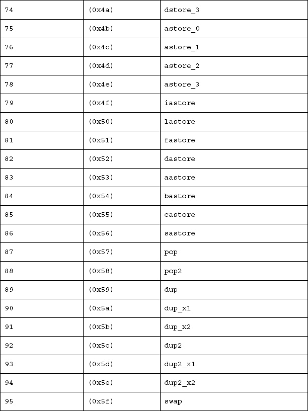

## 附录 一

## 操作码表

在第 2 章中，您看到了 Java 字节码位于 Java 类文件的 code 属性部分。[表 A-1](#tab_a_1) 列出了所有可能的 Java 字节码。每个操作码的十六进制值与类似汇编程序的操作码助记符一起显示。

[表 A-2](#tab_A_2) 列出了在[第三章](03.html)中首先遇到的所有可能的 Dalvik 字节码，然后贯穿全书。每个操作码的十六进制值与类似汇编程序的操作码助记符一起显示。

