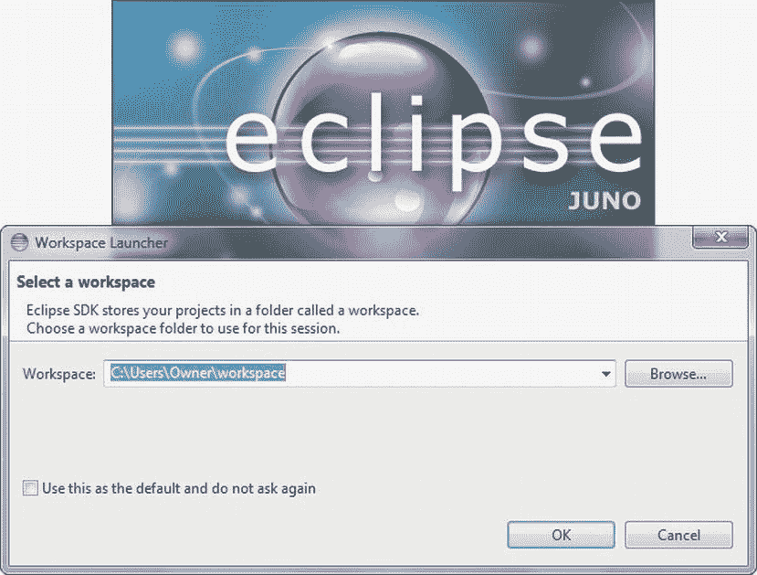
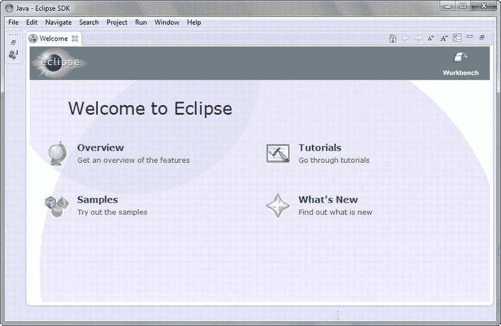
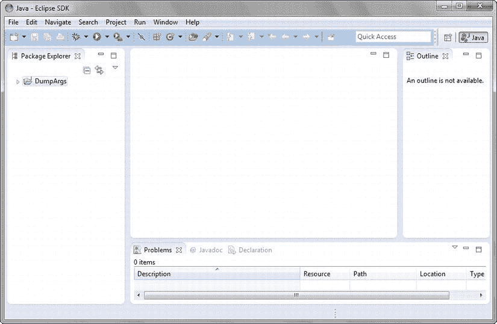
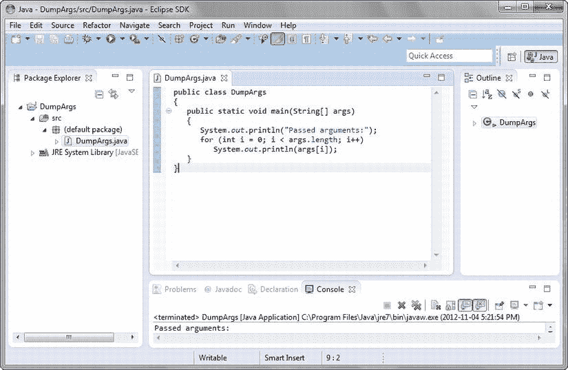

# 一、Java 入门

Android 是谷歌用于移动设备的软件栈。这个堆栈由应用(或通常所说的应用)、运行应用的*虚拟机*(基于软件的处理器和相关环境)、*中间件*(位于操作系统之上并为虚拟机及其应用提供各种服务的软件)，以及基于 Linux 的操作系统组成。

Android 应用是用 Java 编写的，使用各种 Java 应用接口(API)。因为你想写你自己的应用，但可能不熟悉 Java 语言和这些 API，这本书教你 Java，作为应用开发的第一步。它为您提供了开发应用时有用的 Java 语言和 Java APIs 的基础知识。

**注意**这本书通过非 Android Java 应用阐述了 Java 概念。新手掌握这些应用比对应的安卓应用更容易。

API 是指应用代码用来与其他代码通信的接口，通常存储在某种软件库中。关于这个术语的更多信息，可以查看维基百科的“应用编程接口”主题([http://en . Wikipedia . org/wiki/Application _ programming _ interface](http://en.wikipedia.org/wiki/Application_programming_interface))。

这一章为你在开始 Android 应用开发生涯之前需要理解的基本 Java 概念奠定了基础。我首先回答“什么是 Java？”问题。接下来，我将向您展示如何安装 Java SE 开发工具包(JDK)，并向您介绍用于编译和运行 Java 应用的 JDK 工具。

在向您展示了如何安装和使用开源 Eclipse IDE(集成开发环境)以便您可以更容易(更快速)地开发 Java 应用(以及最终的 Android 应用)之后，我将为您提供各种 Java APIs 的高级概述，您可以从您的 Java 应用和 Android 应用中访问这些 API。在后续章节中，您将更详细地探索这些和其他有用的 API。

**注意** [第 1 章](01.html)简短而紧凑，介绍了许多你将在本书中更详细遇到的概念。如果您是 Java 新手，您可能会发现自己对这些概念有点不知所措。然而，当你继续阅读余下的章节时，任何迷雾都将消散。如果您仍然感到有些困惑，请联系我([Jeff @ tutortutor . ca](mailto:jeff@tutortutor.ca))，我会尽力帮助您。

Java 是什么？

*Java* 是 Sun Microsystems 首创的语言和平台。在这一节中，我将简要描述这种语言，并揭示它对 Java 作为一个平台意味着什么。为了满足各种需求，Sun 将 Java 组织成三个主要版本:Java SE、Java EE 和 Java ME。本节还简要探讨了这些版本以及 Android。

注意 Java 有一段有趣的历史，可以追溯到 1990 年 12 月。当时，詹姆斯·高斯林、帕特里克·诺顿和迈克·谢里丹(都是太阳微系统公司的雇员)被赋予了弄清计算领域下一个主要趋势的任务。他们的结论是，一个趋势将涉及计算设备和智能消费电器的融合。由此诞生了 *绿色工程*。

绿色的果实是 *Star7* ，这是一款手持无线设备，配有 5 英寸彩色液晶显示屏、SPARC 处理器、复杂的图形功能和 Unix 版本；以及由詹姆斯·高斯林开发的用于编写在 Star7 上运行的应用的语言 *Oak* ，他以生长在 Sun 公司他办公室窗外的一棵橡树命名了 star 7。为了避免与另一种同名语言的冲突，Gosling 博士将这种语言的名称改为 Java。

Sun Microsystems 随后发展了 Java 语言和平台，直到甲骨文在 2010 年初收购了 Sun。查看[http://oracle.com/technetwork/java/index.html](http://oracle.com/technetwork/java/index.html)了解来自甲骨文的最新 Java 新闻。

Java 是一种语言

Java 是开发者表达*源代码* (程序文本)的语言。Java 的*语法*(将符号组合成语言特性的规则)部分模仿了 C 和 C++ 语言，以缩短 C/C++开发人员的学习曲线。

下面列出了 Java 和 C/C++之间的一些相似之处:

*   Java 和 C/C++共享相同的单行和多行注释样式。注释让您记录源代码。
*   Java 的许多保留字与它们的 C/C++对应物是相同的(表示、【T2 if】、 switch 和而是示例)和 C++对应物( catch 、 class 、 public 和 try 是示例)。
*   Java 支持字符、双精度浮点、浮点、整数、长整型和短整型原语类型，并通过相同的 char 、 double 、 float 、 int 、 long 和 short 保留字。
*   Java 支持许多相同的运算符，包括算术运算符( + 、 - 、 * 、 / 、 % )和条件运算符(？:)运算符。
*   Java 使用大括号字符( { 和 } )来分隔语句块。

下面列出了 Java 和 C/C++之间的一些差异:

*   Java 支持另一种称为 Javadoc 的注释风格。(我在[第二章](02.html)简单介绍一下 Javadoc。)
*   Java 提供了 C/C++中没有的保留字(扩展、 strictfp 、同步和瞬态就是例子)。
*   Java 不需要特定于机器的知识。支持字节整数类型(见[http://en . Wikipedia . org/wiki/Integer _(computer _ science)](http://en.wikipedia.org/wiki/Integer_(computer_science)))；不提供字符类型的有符号版本；并且不提供整数、长整数和短整数的无符号版本。此外，所有 Java 的基本类型都有保证的实现大小，这是实现可移植性的重要部分(稍后讨论)。在 C 和 C++中，等价的基本类型就不一样了。
*   Java 提供了 C/C++中没有的运算符。这些运算符包括的实例和 > > > (无符号右移)。
*   Java 提供了 C/C++中没有的带标签的 break 和 continue 语句。

你将在第 2 章中学习单行和多行注释。此外，在那一章中，您将学习保留字、基本类型、操作符、块和语句(包括标记为 break 和 continue 的语句)。

Java 被设计成比 C/C++更安全的语言。它实现安全性的部分原因是不让您重载操作符，并省略了 C/C++特性，如 *指针*(包含地址的变量—参见[)http://en . Wikipedia . org/wiki/Pointer _(computer _ programming)](http://en.wikipedia.org/wiki/Pointer_(computer_programming))。

Java 还通过修改某些 C/C++特性来实现安全性。例如，循环必须由布尔表达式控制，而不是由整数表达式控制，其中 0 为假，非零值为真。(在第二章的[中有关于](02.html)循环和表达式的讨论。)

假设您必须编写一个重复不超过 10 次的 C/C++ while 循环。累了，你指定while(x)x++；(假设 x 是一个初始化为 0 的基于整数的变量——我在[第二章](02.html)中讨论变量)其中 x++ 给 x 的值加 1。当 x 达到 10 时，该循环不停止；你引入了一个错误。

这个问题在 Java 中不太可能出现，因为它在看到 while (x) 时会报错。这个投诉要求你重新检查你的表达，然后你很可能指定 while (x！= 10)。不仅提高了安全性(不能只指定 x )，还明确了含义: while (x！= 10) 比更有意义而(x) 。

这些和其他基本的语言特性支持类、对象、继承、多态和接口。Java 还提供了与嵌套类型、包、静态导入、异常、断言、注释、泛型、枚举等相关的高级特性。后续章节将探讨这些语言的大部分特性。

Java 是一个平台

Java 是一个由虚拟机和执行环境组成的平台。虚拟机是一个基于软件的处理器，提供一个指令集。*执行环境*由运行程序和与底层操作系统交互的库组成。

执行环境包括一个巨大的预建类文件库，这些类文件执行常见任务，如数学运算(例如，三角学)和网络通信。这个库通常被称为*标准类库*。

一个被称为 *Java 编译器*的特殊 Java 程序将源代码翻译成由虚拟机执行的指令(和相关数据)。这些指令被称为*字节码* 。

编译器将程序的字节码和数据存储在带有的文件中。类扩展。这些文件被称为*类文件* ，因为它们通常存储编译后的等价类，这是一个在第 3 章中讨论的语言特性。

Java 程序通过工具(例如， java )执行，该工具加载并启动虚拟机，并将程序的主类文件传递给机器。虚拟机使用一个*类加载器* (一个虚拟机或执行环境组件)来加载类文件。

加载类文件后，虚拟机的*字节码验证器*组件确保类文件的字节码是有效的，并且不会危及安全性。当验证器发现字节码有问题时，它就终止虚拟机。

假设类文件的字节码一切正常，虚拟机的*解释器*一次解释一条指令。 *解释*包括识别字节码指令和执行等价的本机指令。

**注** *原生指令*(也称*原生代码*)是底层平台物理处理器理解的指令。

当解释器得知字节码指令序列被重复执行时，它通知虚拟机的*即时(JIT)编译器*将这些指令编译成本机代码。T3】

对于给定的字节码指令序列，JIT 编译只执行一次。因为执行的是本机指令，而不是相关的字节码指令序列，所以程序执行起来要快得多。

在执行过程中，解释器可能会遇到执行另一个类文件的字节码的请求。当发生这种情况时，它会要求类加载器加载类文件和字节码验证器，以便在执行字节码之前验证字节码。

Java 的平台端通过提供底层平台的抽象来提升 *的可移植性*。因此，相同的字节码在基于 Windows、基于 Linux、基于 Mac OS X 和其他平台上运行时没有变化。

**注意** Java 推出时的口号是“一次编写，随处运行”尽管 Java 不遗余力地加强可移植性(例如，一个整数总是 32 位二进制数字，一个长整数总是 64 位——参见【http://en.wikipedia.org/wiki/Bit】了解二进制数字)，但它并不总是成功的。例如，尽管大部分是独立于平台的，Java 的某些部分(例如，线程的调度，在[第 8 章](08.html)中讨论)在不同的基础平台上是不同的。

Java 的平台端也通过提供一个代码执行的安全环境(例如，字节码验证器)来提升 *安全性*。目标是防止恶意代码破坏底层平台(并可能窃取敏感信息)。

Java SE ，Java EE ，Java ME ，安卓

开发者使用 Java 平台的不同版本来创建运行在台式计算机、网络浏览器、网络服务器、移动信息设备(例如，功能电话)和嵌入式设备(例如，电视机顶盒)上的 Java 程序:

*   *Java 平台，标准版**(Java SE**)*:开发*应用*的 Java 平台，这些应用是运行在桌面上的独立程序。Java SE 也用于开发*小程序*，这是在网络浏览器中运行的程序。
*   *Java 平台，* *企业版(Java EE* *)* :开发面向企业应用的 Java 平台和*Servlet*，是符合 Java EE 的 Servlet API 的服务器程序。Java EE 构建在 Java SE 之上。
*   *Java 平台、* *微型版(Java ME* *)* :开发*MIDlets*的 Java 平台，midlet 是运行在移动信息设备上的程序，xlet 是运行在嵌入式设备上的程序。

开发人员还使用谷歌创建的 Java 平台的特殊版本(见[【http://developer.android.com/index.html】](http://developer.android.com/index.html))来创建在支持 Android 的设备上运行的 Android 应用。这个版本被称为 *安卓平台* 。

谷歌的 Android 平台展示了一个 *Dalvik 虚拟机*，它运行在一个特别修改的 Linux 内核之上。一个 Android 应用的 Java 源代码被编译成 Java 类文件，然后被翻译成一个特殊的文件供 Dalvik 执行。

**注**通过维基百科的“Android(操作系统)”词条([http://en . Wikipedia . org/wiki/Android _(operating _ system)](http://en.wikipedia.org/wiki/Android_(operating_system)))了解更多关于 Android OS 的信息，通过维基百科的“Dalvik(软件)”词条([http://en . Wikipedia . org/wiki/Dalvik _(软件)](http://en.wikipedia.org/wiki/Dalvik_(software)) 【T9)了解关于 dal vik 虚拟机的信息。

在本书中，我将介绍 Java 语言(Java SE 和 Android 支持)以及 Android 也支持的各种 Java SE APIs。我通过 Java 版本 5 关注语言特性，通过 Java 5 关注 Java APIs，还有少量 Java 6。

**注意**谷歌的 Android 平台是基于 Java 5T3 的开源版本。它没有正式识别比 Java 5 更新的语言特性，尽管有可能增加这种支持(参见 www.informit.com/articles/article.aspx?p=1966024T5)。关于 API，这个平台支持 Java 6 和以前 Java 版本的 API。此外，它还提供了自己独特的 API。

安装和探索 JDK

*Java 运行时环境(JRE)* 实现了 Java SE 平台，使得运行 Java 程序成为可能。公共 JRE 可以从 Oracle 的 Java SE 下载页面下载([http://Oracle . com/tech network/Java/javase/Downloads/index . html](http://oracle.com/technetwork/java/javase/downloads/index.html))。

然而，公共 JRE 并没有使开发 Java 程序成为可能。对于那个任务，你需要下载并安装 *Java SE 开发包(JDK* *)* ，它包含开发工具(包括 Java 编译器)和一个私有的 JRE 。

**注意** JDK 1.0 是第一个发布的 JDK(1995 年 5 月)。在 JDK 6 到来之前，JDK 代表 Java 开发工具包(SE 不是这个名称的一部分)。多年来，已经发布了许多 JDK，在撰写本文时，JDK 7 是最新的。

每个 JDK 版本号标识一个 Java 版本。比如 JDK 1.0 识别 Java 1.0，JDK 5 识别 Java 5.0。JDK 5 是第一个也提供内部版本号 1.5.0 的 JDK。

谷歌不提供 JDK。它确实提供了类似于 JRE 的功能，但是有一个 Android 焦点。

Java SE 下载页面还提供了对当前 JDK 的访问，在撰写本文时是 JDK 7 Update 9。点击下载 JDK 链接(在页面上的 [处 http://Oracle . com/tech network/Java/javase/downloads/index . html](http://oracle.com/technetwork/java/javase/downloads/index.html))下载适用于您平台的最新 JDK 安装程序。

JDK 安装程序将 JDK 放在主目录中。(它也可以将公共 JRE 安装在另一个目录中。)在我的 Windows 7 平台上，主目录是C:\ Program Files \ Java \ JDK 1 . 7 . 0 _ 06。(我目前使用的是 JDK 7 更新 6。)

**提示**安装完 JDK 后，你应该将 bin 子目录添加到你平台的 PATH 环境变量中(参见[http://java.com/en/download/help/path.xml](http://java.com/en/download/help/path.xml))，这样你就可以从任何目录执行 JDK 工具了。另外，您可能希望在 JDK 的主目录下创建一个项目子目录来组织您的 Java 项目，并在项目中为每个项目创建一个单独的子目录。

主目录包含各种文件(例如，README.html，提供关于 JDK 的信息， src.zip ，提供标准类库源代码)和子目录，包括以下三个重要的子目录:

*   bin :该子目录包含各种 JDK 工具。在本书中，您将只使用其中的几个工具，主要是 javac (Java 编译器)、 java (Java 应用启动器)、 jar (Java 归档创建器、更新器和提取器)，以及 javadoc (Java 文档生成器)。
*   jre :这个子目录包含了 JDK 的 jre 的私有副本，可以让你运行 Java 程序，而不必下载并安装公共的 JRE。
*   lib :这个子目录包含 JDK 工具使用的库文件。例如， tools.jar 包含 Java 编译器的类文件——编译器是用 Java 编写的。

**注意** javac 不是 Java 编译器。它是一个加载并启动虚拟机的工具，将编译器的主类文件(位于 tools.jar 中)标识给虚拟机，并将正在编译的源文件的名称传递给编译器的主类文件。

您在*命令行*执行 JDK 工具，将*命令行参数*传递给工具。您可以通过维基百科的“命令行界面”条目()了解命令行和参数。

现在您已经安装了 JDK，并对其工具有所了解，您已经准备好探索一个小型的 DumpArgs 应用，它将其命令行参数输出到标准输出流。

**注意**标准输出流是*标准 I/O*(T5【http://en.wikipedia.org/wiki/Standard_streamsT7】)的一部分，它也由标准输入和标准错误流组成，起源于 Unix 操作系统。标准 I/O 使得从不同来源(键盘或文件)读取文本和将文本写入不同目的地(屏幕或文件)成为可能。

文本从标准输入流中读取，标准输入流默认为键盘，但可以重定向到文件。文本被写入标准输出流，该输出流默认显示在屏幕上，但可以重定向到一个文件。错误消息文本被写入标准错误流，该错误流默认显示在屏幕上，但可以重定向到不同于标准输出文件的文件。

[清单 1-1](#list1) 展示了 DumpArgs 应用源代码。

*[清单 1-1](#_list1)* 。通过 main()的 args 数组将命令行参数转储到标准输出流中

```java
public class DumpArgs
{
   public static void main (String[] args )
   {
      System.out.println("Passed arguments:");
      for (int i = 0; i < args .length; i++)
         System.out.println(args[i]);
   }
}

```

[清单 1-1](#list1) 的 DumpArgs 应用由一个名为 DumpArgs 的类和该类中一个名为 main() 的方法组成，该方法是应用的入口点并提供要执行的代码。(你会在[第 3 章](03.html)中了解到类和方法。)

main() 方法包括一个标识该方法的头和一段位于左大括号( { )和右大括号( } )之间的代码。除了命名此方法之外，标头还提供了以下信息:

*   public :这个保留字使得 main() 对调用这个方法的启动代码可见。如果 public 不存在，编译器会输出一条错误消息，指出它找不到 main() 方法。(我在[第二章](02.html)讨论保留字。)
*   静态:这个保留字使这个方法与这个类相关联，而不是与从这个类创建的任何对象相关联(在[第三章](03.html)中讨论)。因为调用 main() 的启动代码没有从类中创建一个对象来调用这个方法，所以它要求这个方法被声明为 static 。虽然当 static 丢失时编译器不会报错，但是运行 DumpArgs 将是不可能的，当正确的 main() 方法不存在时，它将不是一个应用。
*   void :这个保留字表示该方法不返回值。如果你把 void 改成一个类型的保留字(如 int ，然后插入一个返回这个类型的值的语句(如return 0；)，编译器不会报错。然而，您将无法运行 DumpArgs ，因为正确的 main() 方法将不存在。(我在第 2 章中讨论类型。)
*   (String[] args) :该参数列表由一个名为 args 的参数组成，类型为 String[] 。启动代码将一系列命令行参数传递给 args ，这使得这些参数可供在 main() 中执行的代码使用。您将在第 3 章中了解参数和自变量。

main() 用一组*字符串*(字符序列)调用，这些字符串标识应用的命令行参数。这些字符串存储在基于字符串的数组变量 args 中。(我在第 2 章和第 3 章[中讨论了方法调用、数组和变量。)虽然数组变量命名为 args ，但是这个名字并没有什么特别之处。您可以为此变量选择另一个名称。](03.html)

该代码块首先执行 System.out.println("传递的参数:")；，用传递的参数:字符串调用 System.out 的 println() 方法。该字符串被写入标准输出流。

从左起写， System 标识系统工具的标准类别； out 标识位于系统中的一个对象变量，它的方法让你可以输出各种类型的值，后面可选地跟一个换行符到标准输出流；println 标识一个方法，该方法将其参数和一个换行符一起输出到标准输出中；和传递的参数:是一个*字符串*(一个由双引号字符分隔的字符序列，被视为一个单元)，它作为参数传递给 println 并写入标准输出(起始 " 和结束 " 双引号字符未被写入)；这些字符分隔但不是字符串的一部分)。

**注意** System.out 提供对一系列 println() 方法和一系列 print() 方法的访问，用于输出不同种类的数据(例如，字符和整数序列)。与 println() 方法不同， print() 方法不终止当前行；后续输出在当前行继续。

每个 println() 方法通过输出行分隔符字符串来终止一行，该字符串由系统属性 line.separator 定义，并且不一定是单个换行符(在源代码中通过字符文字 '\n' )来标识)。(我在第 8 章[中讨论系统属性，在第 11 章](08.html)中讨论行分隔符，在第 2 章中讨论[字符文字。)例如，在 Windows 平台上，行分隔符字符串是一个回车符(其整数代码为 13)，后跟一个换行符(其整数代码为 10)。](02.html)

代码块接下来使用 for 循环重复执行system . out . println(args[I])；。循环执行 args.length 次，或者对存储在 args 中的每个字符串执行一次。(我讨论 for 循环和。第二章中[的长度](02.html)。)

system . out . println(args[I])；方法调用读取存储在 args 数组的第 i 个条目中的字符串——第一个条目位于*索引*(位置)0；最后一个条目存储在索引 args.length - 1 处。这个方法调用然后将这个字符串输出到标准输出。

假设您熟悉您的平台的命令行界面，并且在命令行中，将 DumpArgs 作为您的当前目录，并将[清单 1-1](#list1) 复制到一个名为【DumpArgs.java】的文件。然后通过下面的命令行编译这个源文件:

```java
javac DumpArgs.java

```

假设您已经包括了。java 扩展名，这是 javac 所需要的，DumpArgs.java编译的，你应该会在当前目录下发现一个名为 DumpArgs.class 的文件。通过以下命令行运行该应用:

```java
java DumpArgs

```

如果一切顺利，您应该会在屏幕上看到以下输出行:

```java
Passed arguments:

```

为了获得更有趣的输出，您需要将命令行参数传递给 DumpArgs 。例如，执行下面的命令行，它指定卷毛、莫伊和拉里作为传递给 DumpArgs 的三个参数:

```java
java DumpArgs Curly Moe Larry

```

这一次，您应该在屏幕上看到以下扩展输出:

```java
Passed arguments:
Curly
Moe
Larry

```

您可以通过指定后跟文件名的大于号尖括号( > )将输出目标重定向到文件。例如，Java DumpArgs Curly Moe Larry>out . txt将 DumpArgs 应用的输出存储在一个名为 out.txt 的文件中。

**注意**不要指定 System.out.println() ，可以指定 System.err.println() 将字符输出到标准错误流。( System.err 提供了与 System.out 相同系列的 println() 和 print() 方法。)但是，即使标准输出被重定向到一个文件，当您需要输出一个错误消息以便错误消息显示在屏幕上时，您也应该只从 System.out 切换到 System.err 。

祝贺您成功编译了您的第一个应用源文件并运行了该应用！[清单 1-2](#list2) 将源代码呈现给第二个应用，它将从标准输入流获得的文本回显到标准输出流。

*[清单 1-2](#_list2)* 。将从标准输入读取的文本回显到标准输出

```java
public class EchoText
{
   public static void main(String[] args) throws java.io.IOException
   {
      System.out.println("Please enter some text and press Enter!");
      int ch;
      while ((ch = System.in.read() ) != −1)
         System.out.print((char) ch);
      System.out.println();
   }
}

```

在输出一条提示用户输入一些文本的消息后， main() 引入了 int 变量 ch 来存储每个字符的整数表示。(你会在[第二章](02.html)中了解到 int 和 integer。)

main() 现在进入 while 循环(在[第二章](02.html)中讨论)来读取和回显字符。循环首先调用 System.in.read() 读取一个字符，并将其整数值赋给 ch 。当该值等于 1 时(不再有输入数据可用)，环路结束。

**注意**当标准输入被重定向到一个文件时， System.in.read() 从文件中读取每个字符(该文件随后被转换成一个整数)，直到不再有字符需要读取。此时，该方法返回 1。然而，当标准输入没有被重定向时，循环不会结束，因为永远看不到 1。在这种情况下，一行文本的结尾由回车符(整数值 13)后跟一个换行符(整数值 10)来表示(在 Windows 平台上)。确切的终止顺序取决于平台。您必须在 Windows 上同时按下 Ctrl 和 C 键(或者在非 Windows 平台上的等效键)来终止循环。

对于 ch 中的任何其他值，这个值通过 (char) 转换成一个字符，这是 Java 的 cast 运算符的一个例子(在[第二章](02.html)中讨论)。然后通过 System.out.print() 输出字符，这也不会终止当前行。最后的system . out . println()； call 终止当前行，不输出任何内容。

**注意**当标准输入被重定向到一个文件，而 System.in.read() 无法从该文件中读取文本时(可能该文件存储在一个可移动存储设备上，而该设备在读取操作之前已经被移除)， System.in.read() 失败，抛出一个描述该问题的对象。我通过在 main() 方法头的末尾添加throws Java . io . io exception来承认这种可能性。我在第五章的[中讨论抛出，在第十一章](05.html)的[中讨论 java.io.IOException 。](11.html)

通过javac EchoText.java编译[清单 1-2](#list2) ，并通过 java EchoText 运行应用。系统会提示您输入一些文本。输入此文本并按 Enter 后，文本将被发送到标准输出。例如，考虑以下输出:

```java
Please enter some text and press Enter!
Hello Java
Hello Java

```

通过指定小于尖括号( < )后跟文件名，可以将输入源重定向到文件。例如，Java echo text<EchoText.java从EchoText.java读取文本，并将文本输出到屏幕上。

ANDROID 应用入口点

DumpArgs 和 EchoText 应用演示了public static void main(String[]args)作为 Java 应用的入口点。这是应用开始执行的地方。相比之下，Android 应用不需要这个方法作为其入口点，因为应用的架构非常不同。

Android 应用基于交互组件的联盟，这些组件被称为活动、服务、广播接收器和内容提供商。活动提供用户界面屏幕，服务支持后台处理，广播接收器响应系统范围的广播，内容提供商提供便携式数据访问。

考虑活动。该组件被实现为一个类，该类从 Android 的 android.app.Activity 类继承生命周期方法，并有机会覆盖它们。(我在第 3 章的[中讨论方法，在第 4 章](03.html)的[中讨论继承](04.html)和重写。)例如，它可以覆盖void onCreate(Bundle savedInstanceState)方法，以便在 Android 调用该方法时构造用户界面屏幕。

在这本书里，我用public static void main(String[]args)方法呈现 Java 应用。我这样做是因为这本书的重点是学习 Java，作为进入 Android 应用开发的准备步骤。

除了下载和安装 JDK，您还需要访问 JDK 文档，特别是为了探索 Java APIs。您可以浏览两组文档:

*   甲骨文的 JDK 7 文档()
*   谷歌的 Java API 文档([https://developer.android.com/reference/packages.html](https://developer.android.com/reference/packages.html))

Oracle 的 JDK 7 文档提供了许多 Android 不支持的 API。此外，它没有涵盖特定于 Android 的 API。这本书只关注 Google 文档中包含的 Java APIs。

安装和探索 Eclipse IDE

对于小项目来说，在命令行中使用 JDK 工具可能没问题。但是，对于大型项目，不推荐这种做法，因为没有 IDE 的帮助，大型项目很难管理。

IDE 由用于管理项目文件的项目管理器、用于输入和编辑源代码的文本编辑器、用于定位错误的调试器以及其他功能组成。Eclipse 是 Google 支持的用于开发 Android 应用的流行 IDE。

**注意**为了方便起见，除了我讨论和演示 Eclipse IDE 的这一节之外，我在整本书中都使用了 JDK 工具。

Eclipse *IDE* 是一个开源 IDE，用于开发 Java 和其他语言的程序(如 C、COBOL、PHP、Perl 和 Python)。Eclipse Classic 是这个 IDE 的一个发行版，可以下载；4.2.1 版是撰写本文时的最新版本。

您应该下载并安装 Eclipse Classic，以遵循本节的面向 Eclipse 的示例。首先将浏览器指向，并完成以下任务:

1.  向下滚动页面，直到看到一个 Eclipse Classic 条目。(可能指的是 4.2.1 或者更新的版本。)
2.  单击此项右侧的一个平台链接(例如，Windows 32 位)。
3.  从随后显示的页面中选择一个下载镜像，并继续下载发行版的归档文件。

我为我的 Windows 7 平台下载了大约 183 MB 的 eclipse-SDK-4 . 2 . 1-win32-x86 _ 64 . zip归档文件，解压缩这个文件，将生成的 eclipse 主目录移动到另一个位置，并创建了该目录的【eclipse.exe】文件的快捷方式。

安装完 Eclipse Classic 之后，运行这个应用。您应该会发现一个标识该 IDE 的闪屏和一个让您选择存储项目的工作区位置的对话框，然后是一个主窗口，如图[图 1-1](#Fig1) 所示。



[图 1-1](#_Fig1) 保留默认工作空间或选择另一个工作空间

单击 OK 按钮，您将被带到 Eclipse 的主窗口。参见[图 1-2](#Fig2) 。



[图 1-2](#_Fig2) 主窗口最初显示一个欢迎选项卡

主窗口最初显示一个欢迎选项卡，从中可以了解关于 Eclipse 的更多信息。单击该选项卡的 X 图标关闭该选项卡；您可以通过从菜单栏的帮助菜单中选择欢迎来恢复欢迎选项卡。

Eclipse 用户界面基于一个主窗口，该窗口由菜单栏、工具栏、工作台区域和状态栏组成。*工作台*提供了用于组织 Eclipse 项目、编辑源文件、查看消息等的窗口。

为了帮助您熟悉 Eclipse 用户界面，我将向您展示如何创建一个 DumpArgs 项目，其中包含一个带有[清单 1-1](#list1) 源代码的DumpArgs.java源文件。您还将学习如何编译和运行这个应用。

完成以下步骤来创建 DumpArgs 项目:

1.  从“文件”菜单中选择“新建”,从出现的弹出菜单中选择“Java 项目”。
2.  在生成的新 Java 项目对话框中，在项目名称文本字段中输入 DumpArgs 。保留所有其他默认值，然后单击 Finish 按钮。

第二步之后，你会看到一个类似于[图 1-3](#Fig3) 所示的工作台。



[图 1-3](#_Fig3) 一个 DumpArgs 条目出现在工作台的包浏览器中

在工作台的左侧，您会看到一个名为 Package Explorer 的窗口。该窗口以包的形式标识工作区的项目(在第 5 章中讨论)。目前，只有一个 DumpArgs 条目出现在该窗口中。

单击 DumpArgs 左侧的三角形图标可以展开此项，显示 src 和 JRE 系统库项目。src 项存储了 DumpArgs 项目的源文件，JRE 系统库标识了用于运行该应用的各种 JRE 文件。

现在，您将向 src 添加一个名为DumpArgs.java的新文件，如下所示:

1.  突出显示 src，并从“文件”菜单中选择“新建”,然后从弹出菜单中选择“文件”。
2.  在出现的新文件对话框中，在文件名文本字段中输入DumpArgs.java，并点击完成按钮。

Eclipse 通过显示一个名为 DumpArgs.java 的编辑器窗口做出响应。将[清单 1-1](#list1) 的内容复制到该窗口。然后通过从 run 菜单中选择 Run 来编译并运行这个应用。(如果看到“保存并启动”对话框，请单击“确定”关闭该对话框。)[图 1-4](#Fig4) 显示了结果。



[图 1-4](#_Fig4) 。工作台底部的 Console 选项卡显示 DumpArgs 应用的输出

您必须向 DumpArgs 传递命令行参数，以查看该应用的附加输出。按如下方式完成此任务:

1.  从运行菜单中选择运行配置。
2.  在产生的“运行配置”对话框中，选择“参数”选项卡。
3.  在程序参数文本区输入卷毛莫拉里 并点击关闭按钮。

再次从 Run 菜单中选择 Run 来运行 DumpArgs 应用。这一次，控制台选项卡在“传递的参数:”下面的单独行中显示 Curly、Moe 和 Larry。

这就是我对 Eclipse IDE 要说的全部内容。有关更多信息，请通过“欢迎”选项卡学习教程，通过“帮助”菜单访问 IDE 帮助，并在[www.eclipse.org/documentation/](http://www.eclipse.org/documentation/)浏览 Eclipse 文档。

Java APIs 概述

Oracle 将其标准类库 API 组织成包(见[第 5 章](05.html))，类似于文件夹。同样，Google 将其面向 Android 的标准类库 API 组织成包。在这一节中，我将概述 Oracle 和 Google 通用的各种 Java APIs。此外，我(在本书中)只讨论那些位于两个库中的 API。通过将我的讨论限制在通用 API，我避免了讨论在创建 Android 应用时不能使用的 Java APIs。

语言支持和其他面向语言的 API

Java 依靠几个 API 来支持基本的语言特性，比如字符串(见[第 7 章](07.html))、异常(见[第 5 章](05.html))和线程(见[第 8 章](08.html))。例如， java.lang 包提供了支持字符串的 String 类，支持异常的 Throwable 类，以及支持线程的 Thread 类和 Runnable 接口。

Java 也提供 API 来完成面向语言的任务。例如， java.lang 提供了一个 StringBuffer 类(参见[第 7 章](07.html))用于创建可变字符串，一个 Math 类(参见[第 7 章](07.html))用于执行三角函数和其他基本数学运算，一个 Package 类(参见[第 7 章](07.html))用于获取面向包的信息。

面向集合的 API

Java 的设计者开发了一个强大的 *集合框架*来组织对象(见[第九章](09.html))。这个框架位于 java.util 包中，它基于接口，并允许您将对象存储在列表、队列、集合(排序或未排序)和映射(排序或未排序)中。这些接口与各种实现类相关联(例如， ArrayList )。

集合框架还提供了集合和数组类。这些*工具类*(由静态 [class]方法组成的类)提供了对集合和数组执行常见操作的各种方法。例如，收藏让您方便地搜索或排序收藏；并且数组可以让你方便地搜索、排序、复制或填充一个数组。

其他工具 API

Java 的设计者还开发了一个强大的 *并发工具*框架，它提供了低级线程的高级替代方案(见第十章[)。这个框架的 API 被组织成 java.util.concurrent 、Java . util . concurrent . atomic和Java . util . concurrent . locks包。第一个包中 API 的例子包括 Executor 接口和 CyclicBarrier 类。](10.html)

位于 java.util 包中的其他工具 API 包括用于处理日期的 Date 类、用于格式化数据项(例如整数和字符串)的 Formatter 类、用于实现复杂随机数生成的 Random 类，以及用于将输入字符流解析为整数、字符串和其他值的 Scanner 类。我在第 10 章中讨论了这些 API。

最后， java.util.zip 包提供了从现有 zip 存档中提取信息和创建新 ZIP 存档的能力(参见[第 10 章](10.html))。此外，相关的 java.util.jar 包通过提供 jar 文件所需的额外功能扩展了 java.util.zip ，具体来说，就是从 JAR 文件的清单中读取属性和向其中写入属性(参见[第 10 章](10.html))。

经典输入/输出应用编程接口

输入和输出信息的能力对 Java 来说一直很重要。你已经发现了标准的 I/O，但是在第 11 章中还有更多要探索的。例如， java.io 包提供了用于执行面向文件的操作(例如，列出一个目录的文件)的文件类，还提供了用于执行 I/O(通常涉及文件)的流/写/读类。

网络应用编程接口

尽管许多 I/O 发生在文件系统的环境中，Java 也提供了通过位于其java.net包中的各种类型在网络上执行 I/O 的能力(参见[第 12 章](12.html))。例如，您可以使用套接字和服务器套接字类来创建网络通信链接的客户端和服务器端。

套接字提供了一种通过网络进行通信的底层方法。在某些情况下，您将使用更高级的 URL 类通过 web 进行通信，也许是为了获得一个 Web 页面。当你与网络交互时，你会遇到可以通过额外的 java.net 接口和类来管理的 cookies，比如 CookiePolicy 和 CookieManager。

新的 I/O API

现代操作系统引入了复杂的 I/O 机制，如内存映射文件和就绪选择。Java 通过缓冲区、通道、选择器以及在 java.nio 和相关包中找到的相关类型来支持这些新的 I/O 机制。另外， java.util.regex 通过提供高性能的字符串操作来支持新的 I/O。参见[第十三章](13.html)。

数据库 API

数据库存储信息，关系数据库将这些信息存储在表中，这些表可以通过特殊的键列相互关联。Java 通过 java.sql 和 javax.sql 包支持数据库访问。前一个包包含了 DriverManager 和 ResultSet 等类和接口；后一个包提供了数据源、行集等等。参见第十四章中的[。](14.html)

练习

以下练习旨在测试您对第 1 章内容的理解:

1.  Java 是什么？
2.  什么是虚拟机？
3.  Java 编译器的目的是什么？
4.  是非判断:类文件的指令通常被称为字节码。
5.  当虚拟机的解释器得知一个字节码指令序列被重复执行时，它会做什么？
6.  Java 平台如何促进可移植性？
7.  Java 平台如何提升安全性？
8.  是非判断:Java SE 是用于开发 servlets 的 Java 平台。
9.  什么是 JRE？
10.  公有和私有 JREs 有什么区别？
11.  什么是 JDK？
12.  用哪个 JDK 工具编译 Java 源代码？
13.  哪个 JDK 工具用于运行 Java 应用？
14.  什么是标准输入输出？
15.  如何指定 main() 方法的头？
16.  什么是 IDE？确定 Google 支持开发 Android 应用的 IDE。

摘要

Java 是一种语言，也是一个平台。该语言部分模仿 C 和 C++语言，以缩短 C/C++开发人员的学习曲线。该平台由一个虚拟机和相关的执行环境组成。

开发人员使用不同版本的 Java 平台来创建运行在桌面计算机、web 浏览器、web 服务器、移动信息设备和嵌入式设备上的 Java 程序。这些版本被称为 Java SE、Java EE 和 Java ME。

开发人员还使用谷歌创建的 Java 平台的特殊版本来创建在支持 Android 的设备上运行的 Android 应用。这个版本被称为 Android 平台，它展示了一个 Dalvik 虚拟机，运行在一个经过特殊修改的 Linux 内核之上。

公共 JRE 实现了 Java SE 平台，并使运行 Java 程序成为可能。JDK 提供了开发 Java 程序的工具(包括 Java 编译器),还包括 JRE 的私有副本。

对于大型项目，不推荐在命令行使用 JDK 的工具，如果没有集成开发环境的帮助，大型项目很难管理。Eclipse 是 Google 支持的用于开发 Android 应用的流行 IDE。

Oracle 将其标准类库 API 组织成包，类似于文件夹。同样，Google 将其面向 Android 的标准类库 API 组织成包。在这一章中，我还概述了一些打包的 API。

第 2 章通过关注 Java 语言的基础知识，开始向您介绍 Java 语言。您将了解注释、标识符、类型、变量、表达式、语句等等。