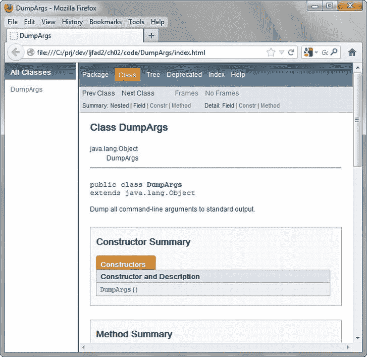
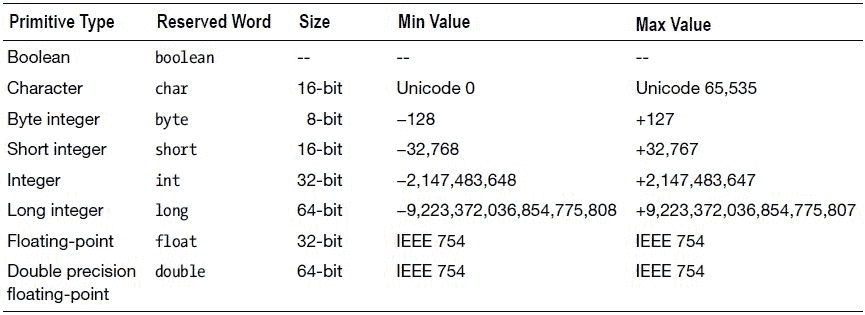
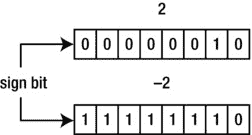
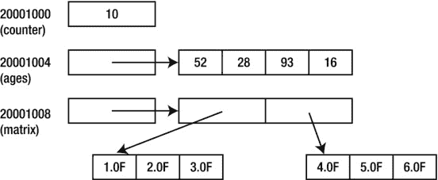
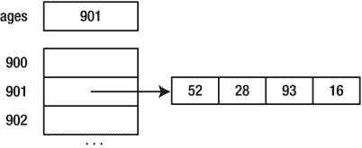
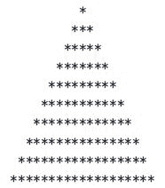

第章 2

学习语言基础

有抱负的 Android 应用程序开发人员需要了解 Java 语言，Java 语言用于表达应用程序的源代码。在第二章第一节，我开始通过关注这门语言的基础来介绍它。具体来说，您将了解注释、标识符(和保留字)、类型、变量、表达式(和文字)和语句。

**注意**美国信息交换标准码(ASCII) 传统上被用来编码程序的源代码。因为 ASCII 仅限于英语，所以开发了 Unicode(【http://unicode.org/】)作为替代。 *Unicode* 是一种计算行业标准，用于一致地编码、表示和处理世界上大多数书写系统中表达的文本。因为 Java 支持 Unicode，所以非面向英语的符号可以集成到 Java 源代码中或从 Java 源代码中访问。你会在这一章看到例子。

学习评论

源代码需要被文档化，以便你(和任何其他必须维护它的人)现在和以后都能理解它。源代码应该在编写和修改的时候被记录下来。如果这些修改影响现有文档，则必须更新文档，以便准确解释代码。

Java 提供了在源代码中嵌入文档的*注释*特性。编译源代码时，Java 编译器会忽略所有注释——不生成字节码。支持单行、多行和 Javadoc 注释。

单行注释

一个*单行注释* 占用一行源代码的全部或部分。该注释以 // 字符序列开始，并以解释文本继续。编译器忽略从 // 到出现 // 的行尾的所有内容。以下示例显示了单行注释:

```java
System.out.println(Math.sqrt(10 * 10 + 20 * 20)); // Output distance from (0, 0) to (10, 20).

```

此示例计算笛卡尔 x/y 平面中(0，0)原点和点(10，20)之间的距离。对于这个任务，它使用公式*距离=平方根(x*x+y*y)* ，其中 *x* 是 10， *y* 是 20。Java 提供了一个 Math 类，其 sqrt() 方法 返回其单个数值参数的平方根。(我在第 7 章的[中讨论数学，在第 3 章](07.html)的[中讨论论点。)](03.html)

注意单行注释对于在代码中插入简短但有意义的源代码解释非常有用。不要用它们来插入无用的信息。比如在声明一个变量的时候，不要插入一个无意义的注释比如 //这个变量存储的是整数值。

多行注释

一个*多行注释* 占用一行或多行源代码。该注释以 /* 字符序列开始，以说明性文本继续，以 */ 字符序列结束。编译器会忽略从 /* 到 */ 的所有内容。以下示例演示了多行注释:

```java
/*
   A year is a leap year if it is divisible by 400, or divisible by 4 and
   not also divisible by 100.
*/
return (year % 400 == 0 || (year % 4 == 0 && year % 100 != 0));

```

这个例子引入了一个 return 语句(在第 3 章的[中讨论过)来确定一年(存储在一个名为 year 的变量中)；我将在本章后面讨论变量)是否是闰年。这段代码中需要掌握的重要部分是多行注释，它阐明了决定年的值是否代表闰年的表达式(稍后讨论)。](03.html)

**注意**不能将一个多行注释放在另一个多行注释中。例如， /*/*嵌套多行注释是非法的！*/*/ 不是有效的多行注释。

Javadoc 注释

一个 *Javadoc 注释* 占用一行或多行源代码。该注释以 /** 字符序列开始，以说明性文本继续，以 */ 字符序列结束。编译器会忽略从 /** 到 */ 的所有内容。以下示例演示了 Javadoc 注释:

```java
/**
 *  Application entry point
 *
 *  @param args array of command-line arguments passed to this method
 */
public static void main(String[] args)
{
   // TODO code application logic here
}

```

这个例子以一个 Javadoc 注释开始，描述了 main() 方法 ，我在[第 1 章](01.html)中讨论过。夹在 /** 和 */ 之间的是方法的描述和 @param *Javadoc 标签*(一个@-Javadoc工具的前缀指令)。

下表列出了几种常用的标签:

*   @author 标识源代码的作者。
*   @deprecated 标识不应再使用的源代码实体(如方法)。
*   @param 标识方法的一个参数。
*   @see 提供了另见参考。
*   @因为标识了实体最初起源的软件版本。
*   @return 标识该方法返回的值的种类。
*   @throws 记录从方法中抛出的异常。我在[第 5 章](05.html)中讨论了异常。

[清单 2-1](#list1) 展示了[第 1 章](01.html)的 DumpArgs 应用程序源代码，以及描述 DumpArgs 类及其 main() 方法的 Javadoc 注释。

[清单 2-1](#_list1) 。记录应用程序类及其 main()方法

```java
/**
   Dump all command-line arguments to standard output.

   @author Jeff Friesen
*/

public class DumpArgs
{
   /**
      Application entry point.

      @param args array of command-line arguments.
   */

   public static void main(String[] args)
   {
      System.out.println("Passed arguments:");
      for (int i = 0; i < args.length; i++)
         System.out.println(args[i]);
   }
}

```

您可以使用 JDK 的 javadoc 工具将这些文档注释提取到一组 HTML 文件中，如下所示:

```java
javadoc DumpArgs.java

```

javadoc 通过输出以下消息进行响应:

```java
Loading source file DumpArgs.java...
Constructing Javadoc information...
Standard Doclet version 1.7.0_06
Building tree for all the packages and classes...
Generating \DumpArgs.html...
Generating \package-frame.html...
Generating \package-summary.html...
Generating \package-tree.html...
Generating \constant-values.html...
Building index for all the packages and classes...
Generating \overview-tree.html...
Generating \index-all.html...
Generating \deprecated-list.html...
Building index for all classes...
Generating \allclasses-frame.html...
Generating \allclasses-noframe.html...
Generating \index.html...
Generating \help-doc.html...

```

它还生成几个文件，包括index.html文档入口点文件。将你的浏览器指向这个文件，你应该会看到一个类似于图 2-1 所示的页面。



[图 2-1](#_Fig1) 。DumpArgs 文档的入口点页面描述了这个类

**注意** [附录 B](16.html) 提供了另一个(更广泛的)例子，涉及 Javadoc 注释和 javadoc 工具。

学习标识符

类和方法等源代码实体需要命名，以便可以从代码中的其他地方引用它们。Java 为此提供了标识符特性。

一个*标识符*由字母(A-Z，A-Z，或其他人类字母表中的等价大写/小写字母)、数字(0-9 或其他人类字母表中的等价数字)、连接标点符号(如下划线)和货币符号(如美元符号$)组成。该名称必须以字母、货币符号或连接标点符号开头。并且它的长度不能超过它所在的行。

有效标识符的例子包括π(一些编辑可能对这种符号有问题)、 i 、计数器、 j2 、 first$name、和 _for 。无效标识符的示例包括 1name (以数字开头)和 first#name ( # 不是有效的标识符符号)。

**注意** Java 是一种*区分大小写的语言*，这意味着只有大小写不同的标识符被认为是单独的标识符。例如，温度和温度是独立的标识符。

几乎可以选择任何有效的标识符来命名类、方法或其他源代码实体。然而，一些标识符是为特殊目的而保留的；它们被称为*保留字*。Java 保留了以下标识符:抽象，断言，布尔，断符，字节，大小写，捕捉，字符，类，常量，继续，默认，做 最后，浮动，为，转，如果，实现，导入，实例化， int ，接口，长，原生， 静态，严格，超，切换，同步，本，投，投，瞬变，真，试， 当您试图在使用上下文之外使用这些保留字时，编译器会输出一条错误消息。

**注**Java 的大部分保留字也被称为*关键词*。三个例外是假、空和真，它们是*字面量*(逐字指定的值)的示例。

学习类型

应用程序处理不同类型的值，如整数、浮点值、字符和字符串。*类型*标识一组值(以及它们在内存中的表示)和一组将这些值转换成该组中其他值的操作。例如，整数类型标识没有小数部分和面向整数的数学运算的数值，例如将两个整数相加得到另一个整数。

**注意** Java 是一种*强类型语言*，这意味着每一个表达式、变量等等都有一个编译器已知的类型。这种能力有助于编译器在编译时检测与类型相关的错误，而不是让这些错误在运行时显示出来。表达式和变量将在本章后面讨论。

Java 将类型分为基本类型类型、用户定义类型和数组类型。

原始类型

*原始类型* 是由语言定义的类型，其值不是对象。Java 支持布尔、字符、字节整数、短整数、整数、长整数、浮点和双精度浮点原语类型。在[表 2-1](#Tab1) 中对它们进行了描述。

[表 2-1](#_Tab1) 。原始类型



[表 2-1](#Tab1) 描述了每个原语类型的保留字、大小、最小值和最大值。“-”条目表示它所在的列不适用于该条目的行中描述的基元类型。

size 列根据该类型的值在内存中所占的*位*(二进制数字—每个数字为 0 或 1)的数量来标识每个原始类型的大小。除了 Boolean(其大小取决于实现——一个 Java 实现可能用一位存储一个布尔值，而另一个实现为了提高性能可能需要一个 8 位的*字节*),每个原语类型的实现都有一个特定的大小。

最小值和最大值列标识每种类型可以表示的最小和最大值。除了 Boolean(其值只有 true 和 false)之外，每个基本类型都有一个最小值和一个最大值。

字符类型的最小值和最大值指的是 Unicode。 **Unicode 0** 是“第一个 Unicode 码位”的简写——*码位*是一个整数，表示一个符号(比如 A)或一个控制字符(比如 newline 或 tab)或者与其他码位组合形成一个符号。

**注意**字符类型的限制意味着该类型是*无符号的*(所有字符值都是正的)。相比之下，每个数值类型都有*符号*(它支持正值和负值)。

字节整数、短整数、整数和长整数类型的最小值和最大值表明负值比正值多一个(0 通常不被视为正值)。这种不平衡的原因与整数的表示方式有关。

Java 将一个整数值表示为一个*符号位*(最左边的位—0 表示正值，1 表示负值)和*幅度位*(符号位右边的所有剩余位)的组合。当符号位为 0 时，幅度直接存储。然而，当符号位为 1 时，幅度使用*二进制补码表示法*存储，其中所有 1 翻转为 0，所有 0 翻转为 1，并且减号后面的数字加 1。使用二进制补码是为了让负整数可以自然地与正整数共存。例如，将 1 的表示与+1 相加得到 0。[图 2-2](#Fig2) 显示了字节整数 2 的直接表示和字节整数 2 的二进制补码表示。



[图 2-2](#_Fig2) 两个字节整数值的二进制表示以符号位开始

浮点和双精度浮点类型的最小值和最大值参考电气和电子工程师协会( *IEEE) 754* ，这是一个在内存中表示浮点值的标准。查看维基百科的“IEEE 754-2008”条目([【http://en.wikipedia.org/wiki/IEEE_754】](http://en.wikipedia.org/wiki/IEEE_754))来了解关于这个标准的更多信息。

那些认为 Java 应该只支持对象的开发人员对于在语言中包含原始类型并不满意。然而，Java 被设计成包括基本类型，以克服 20 世纪 90 年代早期设备的速度和内存限制，这也是 Java 最初的目标。

用户定义的类型

一个*用户定义的类型* 是一个经常被用来模拟现实世界概念的类型(例如，一种颜色或一个银行账户)。它由开发人员使用类、接口、枚举或注释类型来定义；它的值是对象。(我在[第 3 章](03.html)讨论类，在[第 4 章](04.html)讨论接口，在[第 6 章](06.html)讨论枚举和注释类型。)

例如，您可以创建一个 Color 类来模拟颜色；它的值可以将颜色描述为红/绿/蓝分量值。还有，Java 的 String 类定义了字符串自定义类型；它的值描述字符串，它的方法执行各种字符串操作，比如将两个字符串连接在一起。(我在[第三章](03.html)中讨论方法。)

用户定义的类型也被称为*引用类型*，因为该类型的变量存储了对存储该类型对象的内存区域的*引用*(内存地址或其他标识符)。相反，基本类型的变量直接存储值；它们不存储对这些值的引用。

数组类型

一个*数组类型* 是一个特殊的引用类型，表示一个*数组*，一个在大小相等且连续的槽中存储值的内存区域，通常被称为*元素*。

这种类型由*元素类型*(原始类型或用户定义的类型)和一对或多对方括号组成，这些方括号表示*维度*(范围)的数量。一对括号表示一个*一维数组*(一个向量)，两对括号表示一个*二维数组*(一个表)，三对括号表示一个二维数组的一维数组(一个表的向量)，以此类推。例如， int[] 表示一维数组(元素类型为 int )，而 double[][] 表示二维数组(元素类型为 double )。

学习变量

应用程序操作存储在内存中的值，这些值通过使用变量特性在源代码中象征性地表示出来。一个*变量*是一个存储某种类型值的命名内存位置。存储引用的变量通常被称为*引用变量*。

变量必须在使用前声明。一个声明至少包含一个类型名，可选地后跟一系列方括号对，后跟一个名称，可选地后跟一系列方括号对，并以分号()结束；)。考虑下面的例子:

```java
int counter;
double temperature;
String firstName;
int[] ages;
char gradeLetters[];
float[][] matrix;
double π;

```

第一个示例声明一个名为 counter 的整数变量，第二个示例声明一个名为 temperature 的(双精度浮点类型)变量，第三个示例声明一个名为 firstName 的字符串变量，第四个示例声明一个名为 ages 的一维整数数组变量，第五个示例声明一个名为 gradeLetters 的一维字符数组变量，第六个示例声明一个名为 matrix 的二维浮点数组变量，以及还没有字符串与名字关联，也没有数组与年龄、年级字母和矩阵关联。

**注意**方括号可以出现在类型名之后，也可以出现在变量名之后，但不能同时出现在这两个地方。比如编译器遇到 int[] x[]，就报错；。通常的做法是在类型名后面加上方括号(如int[]ages；)而不是变量名后(如char grade letters[]；)，除非数组是在上下文中声明的，比如 int x，y[]，z；。

您可以在一行中声明多个变量，方法是用逗号将每个变量与其前一个变量分隔开，如以下示例所示:

```java
int x, y[], z;

```

这个例子声明了三个名为 x 、 y 和 z 的变量。每个变量共享相同的类型，恰好是整数。与存储单个整数值的 x 和 z 不同， y[] 表示元素类型为 integer 的一维数组——每个元素存储一个整数值。还没有数组与 y 相关联。

当数组与其他变量声明在同一行时，方括号必须出现在变量名之后。如果你把方括号放在变量名前，比如 int x，[]y，z；，编译器报错。如果将方括号放在类型名之后，如 int[] x，y，z；，这三个变量都表示一维整数数组。

学习表达

先前声明的变量没有显式初始化为任何值。因此，根据它们出现的上下文(在类内声明或在方法内声明)，它们要么被初始化为默认值(比如 0 代表 int ，0.0 代表 double )，要么保持未初始化状态。在[第 3 章](03.html)中，我从字段、局部变量和参数的角度讨论了变量上下文。

Java 为初始化变量和其他目的提供了表达式特性。一个*表达式*是文字、变量名、方法调用和操作符的组合。在运行时，它计算出一个值，该值的类型称为表达式的类型。如果表达式被赋值给一个变量，表达式的类型必须与变量的类型一致；否则，编译器会报告错误。

Java 将表达式分为简单表达式和复合表达式。

简单表达

一个*简单表达式* 是一个*文字*(一个一字不差表达的值)，一个变量的名字(包含一个值)，或者一个方法调用(返回值)。Java 支持几种文字:字符串、布尔值 true 和 false 、字符、整数、浮点和 null 。

**注意**不返回值的方法调用——被调用的方法被称为 *void 方法*——是一种特殊的简单表达式；比如 System.out.println("Hello，World！");。此独立表达式不能赋给变量。尝试这样做(如在int I = system . out . println(" X ")；)导致编译器报告错误。

一个*字符串文字* 由一对双引号括起来的 Unicode 字符序列组成；比如“敏捷的棕色狐狸跳过懒狗。”它还可能包含*转义序列*，这是一种特殊的语法，用于表示某些可打印和不可打印的字符，否则这些字符不会出现在文本中。比如“那只敏捷的棕色“狐狸”跳过了那只懒狗。”使用 \" 转义序列将 fox 用双引号括起来。

[表 2-2](#Tab2) 描述了所有支持的转义序列。

[表 2-2](#_Tab2) 。转义序列

| 转义语法 | 描述 |
| --- | --- |
| \\ | 反斜线符号 |
| \" | 双引号 |
| \' | 单引号 |
| \b | 退格 |
| \f | 换页 |
| \n | 换行符(也称为换行) |
| \r | 回车 |
| \t | 横表 |

最后，字符串文字可能包含 *Unicode 转义序列*，这是表示 Unicode 字符的特殊语法。Unicode 转义序列以 \u 开始，以四个十六进制数字(0–9、A–F、A–F)继续，中间没有空格。例如， \u0041 代表大写字母 A， \u20ac 代表欧盟的欧元货币符号。

一个*布尔文字* 由保留字真或保留字假组成。

一个*字符字面量* 由一个 Unicode 字符和一对单引号组成(例如‘A’)。您还可以将转义序列(例如， '\'' )或 Unicode 转义序列(例如， '\u0041' )表示为字符文字。

一个*整数文字* 由一系列数字组成。如果文字要表示一个长整型值，那么它的后缀必须是大写的 L 或者小写的 l ( L 更容易阅读)。如果没有后缀，文字表示 32 位整数(一个 int )。

整数可以用十进制、十六进制和八进制格式指定:

*   十进制格式是默认格式；比如 127 。
*   十六进制格式要求文字以 0x 或 0X 开头，以十六进制数字(0-9、A-F、A-F)继续；比如 0x7F 。
*   八进制格式要求文字以 0 为前缀，以八进制数字(0–7)继续；比如 0177 。

一个*浮点字面值*由一个整数部分的、一个小数点(用句点字符[ 表示)组成。)、小数部分、指数(以字母 E 或 e 开头)、类型后缀(字母 D 、 d 、 F 或 f )。大多数部分是可选的，但是必须有足够的信息来区分浮点文字和整数文字。例子包括 0.1 (双精度浮点)、 89F (浮点)、 600D (双精度浮点)、以及 13.08E+23 (双精度浮点)。

最后，空值被赋给一个引用变量，表示该变量不引用对象。

以下示例使用文本来初始化前面提供的变量:

```java
int counter = 10;
double temperature = 98.6; // Assume Fahrenheit scale.
String firstName = "Mark";
int[] ages = { 52, 28, 93, 16 };
char gradeLetters[] = { 'A', 'B', 'C', 'D', 'F' };
float[][] matrix = { { 1.0F, 2.0F, 3.0F }, { 4.0F, 5.0F, 6.0F }};
int x = 1, y[] = { 1, 2, 3 }, z = 3;
double π = 3.14159;

```

第四至第七个示例使用数组初始值设定项来初始化年龄、年级字母、矩阵和 y 数组。一个*数组初始化器*由一个用括号和逗号分隔的表达式列表组成，这些表达式(如矩阵示例所示)本身可能就是数组初始化器。矩阵示例生成如下所示的表格:

```java
1.0F 2.0F 3.0F
4.0F 5.0F 6.0F

```

在内存中组织变量

也许你对变量在内存中的组织方式很好奇。[图 2-3](#Fig3) 展示了一个可能的高层组织，用于计数器、年龄和矩阵变量，以及分配给年龄和矩阵的数组。



[图 2-3](#_Fig3) counter 变量存储一个 4 字节的整数值，而 ages 和 matrix 存储对各自数组的 4 字节引用

[Figure 2-3](#Fig3) reveals that each of counter, ages, and matrix is stored at a memory address (starting at a fictitious 20001000 value in this example) and divisible by 4 (each variable stores a 4-byte value); that counter’s 4-byte value is stored at this address; and that each of the ages and matrix 4-byte memory locations stores the 32-bit address of its respective array (64-bit addresses would most likely be used on 64-bit virtual machines). Also, a one-dimensional array is stored as a list of values, whereas a two-dimensional array is stored as a one-dimensional row array of addresses, where each address identifies a one-dimensional column array of values for that row.Although [Figure 2-3](#Fig3) implies that array addresses are stored in ages and matrix, which equates references with addresses, a Java implementation might equate references with *handles* (integer values that identify slots in a list). This alternative is presented in [Figure 2-4](#Fig4) for ages and its referenced array.



[图 2-4](#_Fig4) 一个句柄存储在 ages 中，由这个句柄标识的列表条目存储相关数组的地址

句柄使得在垃圾收集期间在内存区域中移动变得容易(在第 3 章中讨论过)。如果多个变量通过同一个地址引用同一个数组，那么当数组移动时，每个变量的地址值都必须更新。但是，如果多个变量通过同一个句柄引用数组，那么只需要更新句柄的列表条目。使用句柄的一个缺点是，通过句柄访问内存比通过地址直接访问内存要慢。不管引用是如何实现的，这个实现细节对 Java 开发人员是隐藏的，以提高可移植性。

以下示例显示了一个简单表达式，其中一个文本被分配给一个变量，后面是一个简单表达式，其中一个变量被分配给另一个变量的值:

```java
int counter1 = 1;
int counter2 = counter1;

```

最后，下面的例子展示了一个简单的表达式，它将方法调用的结果赋给一个名为 isLeap 的变量:

```java
boolean isLeap = isLeapYear(2012);

```

前面的例子假设只有那些类型与它们正在初始化的变量的类型相同的表达式才能被赋给那些变量。然而，在某些情况下，有可能分配一个不同类型的表达式。例如，Java 允许你给短整型变量赋值特定的整型文字，如short s = 20；，并将一个短整型表达式赋给一个整型变量，如int I = s；。

Java 允许前一种赋值，因为 20 可以表示为一个短整数(不会丢失任何信息)。相比之下，Java 会抱怨短 s = 40000因为整数字面量 40000 不能表示为短整数(32767 是短整数变量中可以存储的最大正整数)。Java 允许后一种赋值，因为当 Java 从一个值集较小的类型转换到一个值集较大的类型时，不会丢失任何信息。

Java 通过扩展转换规则支持以下原始类型转换:

*   字节整数到短整数、整数、长整数、浮点或双精度浮点
*   短整数到整数、长整数、浮点或双精度浮点
*   字符转换为整数、长整数、浮点或双精度浮点
*   整数到长整数、浮点或双精度浮点
*   长整数到浮点或双精度浮点
*   浮点到双精度浮点

**注意**从小整数转换到大整数时，Java 会将小整数的符号位复制到大整数的多余位。

在第 4 章的[中，我讨论了在用户定义和数组类型的上下文中执行类型转换的扩展转换规则。](04.html)

复合表达式

一个*复合表达式*是一系列简单的表达式和操作符，其中一个*操作符*(源代码中象征性表示的一系列指令)将其操作数表达式值转换为另一个值。例如， -6 是由运算符 - 和整数文字 6 作为操作数组成的复合表达式。这个表达式将 6 转换成它的负等价物。同样， x + 5 是一个复合表达式，由变量名 x ，整数文字量 5 ，以及夹在这些操作数之间的运算符 + 组成。当这个表达式被求值时，变量 x 的值被取出并加到 5 中。总和成为表达式的值。

**注意**当 x 的类型为字节整数或短整数时，该变量的值被加宽为整数。然而，当 x 的类型为长整型、浮点型或双精度浮点型时， 5 被加宽为适当的类型。加法运算在扩大转换发生后执行。

Java 提供了许多操作符，这些操作符是根据它们接受的操作数的数量来分类的。一个*一元运算符* 只取一个操作数(一元减[-]为例)，一个*二元运算符*取两个操作数(加法[ + ]为例)，Java 的单个*三元运算符* (条件[ ？: ])采用三个操作数。

运算符也分为前缀、后缀和中缀。*前缀运算符*是位于其操作数之前的一元运算符(如在 6 中)，而*后缀运算符* 是位于其操作数之后的一元运算符(如在 x++ 中)，而*中缀运算符* 是夹在二元运算符的两个或三个操作数之间的二元或三元运算符(如在 x + 5 中)。

表 2-3 从符号、描述和优先级的角度展示了所有支持的操作符——我在这一节的最后讨论了优先级的概念。各种操作符描述都提到了“整数类型”，这是指定任何字节整数、短整数、整数或长整数的简写，除非“整数类型被限定为 32 位整数。此外，“数字类型”是指除浮点和双精度浮点之外的任何整数类型。

[表 2-3。](#_Tab3)操作员


[表 2-3](#Tab3) 的运算符可分为加法、数组索引、赋值、按位、转换、条件、等式、逻辑、成员访问、方法调用、乘法、对象创建、关系、移位和一元减/加。

加法运算符

加法运算符由加法( + )、减法(-)、后减量(-)、后增量(+)、前增量(-)、前增量(+)和字符串串联( + )组成。加法返回其操作数之和(例如， 6 + 4 返回 10)，减法返回其操作数之差(例如，6–4返回 2，而4–6返回 2)，后减量从其变量操作数中减去 1，并返回变量的前一个值(例如，x–【T20)，后增量相加 predecrement 从其变量操作数中减去 1 并返回变量的新值(例如，-x)，preincrement 向其变量操作数加 1 并返回变量的新值(例如， ++x )，string concatenation 合并其字符串操作数并返回合并后的字符串(例如， "A" + "B" 返回 "AB" )。

加法、减法、后减量、后增量、前增量和前增量运算符可以生成溢出或下溢结果值类型限制的值。例如，将两个大的 32 位正整数值相加会产生一个无法表示为 32 位整数值的值。结果据说溢出来了。Java 不检测溢出和下溢。

Java 提供了一种特殊的扩大转换规则，用于字符串操作数和字符串连接运算符。当任一操作数不是字符串时，操作数在字符串连接之前首先转换为字符串。例如，当呈现为 "A" + 5 时，编译器生成的代码首先将 5 转换为 "5" ，然后执行字符串串联操作，得到 "A5" 。

数组索引运算符

数组索引运算符 ( [] )通过将数组元素的位置表示为整数索引来访问该元素。该运算符在数组变量的名称后指定，例如， ages[0] 。

索引是相对于 0 的，这意味着 ages[0] 访问第一个元素，而 ages[6] 访问第七个元素。索引必须大于或等于 0，并且小于数组的长度；否则，虚拟机抛出ArrayIndexOutOfBoundsException(参考[第 5 章](05.html)了解异常)。

通过追加“”返回数组的长度。数组变量的长度。例如， ages.length 返回 ages 引用的数组的长度(元素个数)。类似地， matrix.length 返回矩阵二维数组中行元素的个数，而 matrix[0]。length 返回分配给该数组第一行元素的列元素个数。

赋值运算符

赋值运算符 ( = )将表达式的结果赋给一个变量(如int x = 4；)。变量和表达式的类型必须一致；否则，编译器会报告错误。

Java 还支持几个复合赋值操作符，它们执行一个特定的操作并将结果赋给一个变量。例如， += 运算符计算右边的数值表达式，并将结果添加到左边的变量内容中。其他复合赋值运算符的行为方式类似。

按位运算符

按位运算符由按位 AND ( & )、按位补码(∾)、按位异或(【^】)和按位异或( | )组成。这些运算符设计用于处理字符或整数操作数的二进制表示。因为如果您以前没有在另一种语言中使用过这些运算符，这个概念可能很难理解，所以下面来自一个假设应用程序的输出演示了这些运算符:

```java
∼00000000000000000000000010110101 results in 11111111111111111111111101001010
00011010 & 10110111 results in 00000000000000000000000000010010
00011010 ^ 10110111 results in 00000000000000000000000010101101
00011010 | 10110111 results in 00000000000000000000000010111111

```

最后三行中的 & 、【^】和 | 运算符在执行运算之前，首先将其字节整数操作数转换为 32 位整数值(通过符号位扩展，将符号位的值复制到额外的位中)。

铸造操作符

cast 运算符— ( *类型*)—试图将其操作数的类型转换为*类型*。此运算符的存在是因为编译器不允许您将一个值从一种类型转换为另一种类型，如果不指定您的意图，信息将会丢失(通过 cast 运算符)。比如用短 s = 1.65 + 3 呈现时；，编译器会报告一个错误，因为试图将双精度浮点值转换为短整型会导致分数丢失。65 — s 将包含 4 而不是 4.65。

认识到信息丢失可能并不总是一个问题，Java 允许您通过强制转换到目标类型来明确表达您的意图。例如，short s =(short)1.65+3；告诉编译器你希望 1.65 + 3 被转换成一个短整数，并且你意识到这个分数会消失。

下面的示例提供了需要强制转换运算符的另一个示例:

```java
char c = 'A';
byte b = c;

```

当遇到字节 b = c 时，编译器报告一个关于精度损失的错误；。原因是 c 可以表示从 0 到 65535 的任何无符号整数值，而 b 只能表示从 128 到+127 的有符号整数值。即使 'A' 等于+65，这可以在 b 的范围内，但是 c 可能很容易被初始化为 '\u0323' ，这是不合适的。

这个问题的解决方案是引入一个 (byte) 强制转换，如下所示，这使得编译器生成代码将 c 的字符类型强制转换为字节整数:

```java
byte b = (byte) c;

```

Java 通过强制转换操作符支持以下基本类型转换:

*   字节整数到字符
*   短整数到字节整数或字符
*   字符到字节整数或短整数
*   整数到字节整数、短整数或字符
*   长整数到字节整数、短整数、字符或整数
*   浮点到字节整数、短整数、字符、整数或长整数
*   双精度浮点到字节整数、短整数、字符、整数、长整数或浮点

当从更多位转换到更少位并且没有发生数据丢失时，并不总是需要转换运算符。比如当它遇到字节 b = 100，编译器生成代码将整数 100 赋给字节整数变量 b ，因为 100 可以很容易地放入赋给这个变量的 8 位存储位置。

条件运算符

条件运算符由条件与( & & )、条件或( || )和条件(？:)。前两个运算符总是计算其左操作数(计算结果为 true 或 false 的布尔表达式)，并有条件地计算其右操作数(另一个布尔表达式)。第三个运算符基于第三个布尔操作数计算两个操作数之一。

条件，并且总是计算其左操作数，并且仅当其左操作数的计算结果为 true 时，才计算其右操作数。比如年龄>64&T14】还在工作先评估年龄> 64 。如果该子表达式为真，则对 stillWorking 求值，其真或假值( stillWorking 为布尔变量)作为整个表达式的值。如果年龄> 64 为假，则仍在工作不被评估。

条件 OR 始终计算其左操作数，仅当其左操作数的计算结果为 false 时，才计算其右操作数。例如，值< 20 ||值> 40 先求值值< 20 。如果该子表达式为假，则评估值> 40 ，其真值或假值作为整个表达式的值。如果值< 20 为真，则值> 40 不求值。

条件 AND 和条件 OR 通过防止不必要的子表达式求值来提高性能，这被称为*短路*。例如，如果其左操作数为 false，则条件 and 的右操作数无法改变整个表达式的计算结果为 false 的事实。

如果不小心，短路可能会阻止*副作用*(子表达式求值后持续存在的子表达式的结果)的执行。例如，年龄>64&&++人数> 5 只对年龄大于 64 岁的员工递增人数。递增 numEmployees 是副作用的一个例子，因为 numEmployees 中的值在子表达式 ++numEmployees > 5 求值后仍然存在。

条件运算符通过根据第三个操作数的值计算并返回两个操作数中的一个来做出决策，这非常有用。以下示例将布尔值转换为其等效的整数(1 表示真，0 表示假):

```java
boolean b = true;
int i = b ? 1 : 0; // 1 assigns to i

```

等式运算符

等式运算符由等式( == )和不等式()组成！= )。这些运算符比较它们的操作数，以确定它们是否相等。前一个运算符在相等时返回 true 后一个运算符在不相等时返回 true。比如 2 == 2 和 2 的每一个！= 3 评估为真，而 2 == 4 和 4！= 4 评估为假。

当涉及到对象操作数时(在第 3 章的[中讨论)，这些操作符不比较它们的内容。比如“ABC”= =“XYZ”不比较 a 和 x 。相反，因为字符串文字实际上是 String 对象(在](03.html)[第 7 章](07.html)中我进一步讨论了这个概念)， == 比较对这些对象的引用。

逻辑运算符

逻辑运算符由逻辑与( & )、逻辑补码(！)、逻辑异或( ^ )、逻辑异或( | )。虽然这些运算符与按位运算符相似，它们的操作数必须是整数/字符，但传递给逻辑运算符的操作数必须是布尔型的。比如！false 返回 true。此外，当遇到年龄> 64 &仍在工作时，逻辑 AND 会评估两个子表达式。这种模式同样适用于逻辑异或和逻辑包含或。

成员访问操作员

成员访问操作员 ( )。用于访问一个类的成员或一个对象的成员。比如String s = " Hello "；int len = s . length()；返回分配给变量 s 的字符串长度。它通过调用 String 类的 length() 方法成员来实现。在第 3 章中，我将更详细地讨论成员访问。

数组是特殊的对象，它只有一个长度的成员。当您指定一个数组变量，后跟成员访问操作符，再后跟长度时，结果表达式将数组中的元素数作为 32 位整数返回。例如， ages.length 返回 ages 引用的数组的长度(元素个数)。

方法调用运算符

方法调用操作符—()—用于表示一个方法(在第 3 章的[中讨论)正在被调用。此外，它还标识了传递给方法的参数的数量、顺序和类型，这些参数将由方法的参数选取。system . out . println(" Hello ")；就是一个例子。](03.html)

乘法运算符

乘法运算符由乘法( * )、除法( / )和余数( % )组成。乘法返回其操作数的乘积(例如， 6*4 返回 24)，除法返回其左操作数除以其右操作数的商(例如， 6/4 返回 1)，余数返回其左操作数除以其右操作数的余数(例如， 6%4 返回 2)。

乘法、除法和余数运算符可以生成溢出或下溢结果值类型限制的值。例如，将两个大的 32 位正整数值相乘会产生一个无法用 32 位整数值表示的值。结果据说溢出来了。Java 不检测溢出和下溢。

将数值除以 0(通过除法或余数运算符)也会产生有趣的行为。将一个整数值除以整数 0 会导致操作符抛出一个算术异常对象(我会在第五章的[中讨论异常)。将浮点/双精度浮点值除以 0 会导致运算符返回+无穷大或-无穷大，具体取决于被除数是正数还是负数。最后，将浮点 0 除以 0 会导致运算符返回 NaN(不是数字)。](05.html)

对象创建操作符

对象创建操作符 ( new )从一个类创建一个对象，也从一个初始化器创建一个数组。我将在第三章中讨论这些话题。

关系运算符

关系运算符 由大于( > )、大于等于( > = )、小于( < )、小于等于( < = )和类型检查()组成。前四个运算符比较它们的操作数，当左操作数分别大于、大于或等于、小于或小于或等于右操作数时，返回 true。例如， 5.0 > 3 、 2 > = 2 、 16.1 < 303.3 、 54.0 < = 54.0 中的每一个都求值为真。

类型检查运算符用于确定对象是否属于特定类型。我在第四章中讨论了这个话题。

移位运算符

移位运算符由左移( < < )、有符号右移( > > )和无符号右移( > > > )组成。左移将左操作数的二进制表示向左移动右操作数指定的位数。每次移位相当于乘以 2。比如2<T17】3将 2 的二进制表示左移 3 位；结果相当于 2 乘以 8。

每个有符号和无符号右移都将其左操作数的二进制表示向右移动由其右操作数指定的位置数。每次移位相当于除以 2。比如16>T3】3将 16 的二进制表示右移 3 位；结果相当于 16 除以 8。

有符号右移和无符号右移的区别在于移位过程中符号位的变化。有符号右移位包括移位中的符号位，而无符号右移位忽略符号位。因此，有符号右移保留负数，但无符号右移不保留负数。例如，-4>>1(相当于 4 / 2 )的计算结果为 2，而 4 > > > 1 的计算结果为 2147483646。

**提示**移位运算符比乘以或除以 2 的幂要快。

一元减/加运算符

一元减号()和一元加号( + )是所有运算符中最简单的。一元减返回其操作数的负数(如 5 返回 5 和 - 5 返回 5 )，而一元加则逐字返回其操作数(如 +5 返回 5 和+-5返回 5 )。一元加号不常用，但为了完整性而出现。

优先级和结合性和

当计算一个复合表达式时，Java 会考虑每个操作符的*优先级*(重要性级别)，以确保表达式的计算符合预期。例如，当用表达式 60 + 3 * 6 表示时，您期望乘法在加法之前执行(乘法的优先级高于加法)，最终结果是 78。你不会期望加法首先发生，产生 378 的结果。

**注** [表 2-3](#Tab3) 最右边的一栏显示了一个值，表示一个操作符的优先级:数字越大，优先级越高。例如，加法的优先级别是 10，乘法的优先级别是 11，这意味着乘法在加法之前执行。

可以通过在表达式中引入左括号和右括号 ( 和 ) 来规避优先级，其中首先计算最里面的一对嵌套括号。例如，计算 2 * ((60 + 3) * 6) 会导致首先计算 (60 + 3) ，然后计算 (60 + 3) * 6 ，最后计算整体表达式。类似地，在表达式60/(3–6)中，在除法之前执行减法。

在求值过程中，具有相同优先级的操作符(如加法和减法，都具有 10 级)根据它们的*结合性*进行处理(这是一个属性，确定当缺少括号时，具有相同优先级的操作符如何分组)。

例如，因为 * 和 / 是从左到右的关联运算符，所以表达式 9 * 4 / 3 被视为 (9 * 4) / 3 。相比之下，表达式 x = y = z = 100 被求值，就好像它是x =(y =(z = 100))—100被赋给 z , z 的新值(100)被赋给y,y的新值(100)被赋给

Java 的大多数操作符都是从左到右关联的。从右到左的关联运算符包括赋值、按位补码、强制转换、复合赋值、条件、逻辑补码、对象创建、预递增、预递增、一元减号和一元加号。

**注意**与 C++等语言不同，Java 不允许重载操作符。然而，Java 重载了 + 、 ++ 和 - 运算符。

学习语句 s

语句是一个程序的主力。它们给变量赋值，通过决策和/或重复执行其他语句来控制程序流程，并执行其他任务。一个语句可以用简单语句或复合语句来表达:

*   *简单语句* 是用于执行某些任务的单个独立源代码指令；它以分号结束。
*   *复合语句* 是夹在左大括号和右大括号之间的简单语句和其他复合语句的(可能为空)序列——分隔符*是标记某个部分的开始或结束的字符。方法体(如 main() 方法体)就是一个例子。复合语句可以出现在简单语句出现的任何地方，或者被称为*块*。*

 *在这一节中，我将向您介绍 Java 的许多语句。其他声明将在后面的章节中介绍。例如，在[第 3 章](03.html)中，我讨论了 return 语句。

赋值语句

*赋值* *语句*是给变量赋值的表达式。该语句以变量名开始，以赋值操作符( = )或复合赋值操作符(如 += )继续，以赋值兼容表达式和分号结束。以下是三个例子:

```java
x = 10;
ages[0] = 25;
counter += 10;

```

第一个例子将整数 10 赋给变量 x ，它大概也是整数类型。第二个示例将整数 25 分配给年龄数组的第一个元素。第三个示例将 10 加到存储在计数器中的值，并将总和存储在计数器中。

**注意**在变量声明中初始化一个变量(比如int counter = 1；)可以认为是赋值语句的一种特殊形式。

决策声明

前面描述的条件运算符(？:)对于在两个表达式之间选择求值是有用的，不能用于在两个语句之间选择。为此，Java 提供了三个决策语句:if、if-else 和 switch。

If 语句

*if 语句*评估一个布尔表达式，并在该表达式评估为真时执行另一个语句。该语句具有以下语法:

```java
if (*Boolean expression*)
   *statement*

```

If 由保留字 if 组成，后面是圆括号中的*布尔表达式*，后面是当*布尔表达式*评估为真时执行的*语句*。

以下示例演示了该语句:

```java
if (numMonthlySales > 100)
   wage += bonus;

```

如果月销售额超过 100， numMonthlySales > 100 计算为真，工资+=奖金；赋值语句执行。否则，这个赋值语句不会执行。

**注意**有些人喜欢用大括号将一条语句括起来，以防止出错。因此，他们会按如下方式编写前面的示例:

```java
if (numMonthlySales > 100){
   wage += bonus;
}

```

我不会对单个语句这样做，因为我认为多余的大括号是不必要的混乱。然而，你可能会有不同的感受。使用任何让你最舒服的方法。

If-Else 语句

*if-else 语句*该语句具有以下语法:

```java
if (*Boolean expression*)
   *statement1*
else
 *statement2*

```

If-else 由保留字 if 组成，后面是圆括号中的*布尔表达式*，后面是当*布尔表达式*评估为真时执行的*语句 1* ，后面是当*布尔表达式*评估为假时执行的*语句 2* 。

以下示例演示了该语句:

```java
if ((n & 1) == 1)
   System.out.println("odd");
else
   System.out.println("even");

```

这个例子假设存在一个名为 n 的 int 变量，它已经被初始化为一个整数。然后，它继续确定该整数是奇数(不能被 2 整除)还是偶数(能被 2 整除)。

布尔表达式首先对 n & 1 求值，然后将 n 的值与 1 进行位与运算。然后将结果与 1 进行比较。如果相等，则输出一条消息，说明 n 的值为奇数；否则，会输出一条消息，说明 n 的值为偶数。

括号是必需的，因为 == 的优先级高于 & 。如果没有这些括号，表达式的求值顺序将变为首先对 1 == 1 求值，然后尝试对布尔结果与 n 的整数值进行位与运算。由于类型不匹配，这种顺序会导致编译器错误信息:不能将整数与布尔值进行位 AND 运算。

您可以重写这个 if-else 语句示例以使用条件运算符，如下所示:system . out . println((n&1)= = 1？“奇”:“偶”)；。但是，在以下示例中，您无法做到这一点:

```java
if ((n & 1) == 1)
   odd();
else
   even();

```

本例假设存在不返回任何内容的 odd() 和 even() 方法。因为条件运算符要求其第二个和第三个操作数的计算结果都是一个值，所以当试图编译 (n & 1) == 1 时，编译器会报告一个错误？奇数() :偶数()。

您可以将多个 if-else 语句链接在一起，产生以下语法:

```java
if (*Boolean expression1*)
   *statement1*
else
if (*Boolean expression2*)
 *statement2*
else
   ...
else
   *statementN*

```

如果*布尔表达式 1* 评估为真，则*语句 1* 执行。否则，如果*布尔表达式 2* 评估为真，则*语句 2* 执行。这种模式一直持续到这些表达式中的一个计算为真并且其相应的语句执行，或者到达最后的 else 并且*语句 N* (默认语句)执行。

以下示例演示了这种链接:

```java
if (testMark >= 90)
{
   gradeLetter = 'A';
   System.out.println("You aced the test.");
}
else
if (testMark >= 80)
{
   gradeLetter = 'B';
   System.out.println("You did very well on this test.");
}
else
if (testMark >= 70)
{
   gradeLetter = 'C';
   System.out.println("Not bad, but you need to study more for future tests.");
}
else
if (testMark >= 60)
{
   gradeLetter = 'D';
   System.out.println("Your test result suggests that you need a tutor.");
}
else
{
   gradeLetter = 'F';
   System.out.println("Your test result is pathetic; you need summer school.");
}

```

悬挂-否则问题

当 if 和 if-else 一起使用时，如果源代码没有正确缩进，就很难确定哪个 if 与 else 相关联。例如，请参见以下内容:

if (car.door.isOpen())

if (car.key.isPresent())

car . start()；

else car . door . open()；

开发人员是否打算让 else 与内部 if 匹配，但却错误地格式化了代码，使其看起来不匹配？例如，请参见以下内容:

if (car.door.isOpen())

if (car.key.isPresent())

car . start()；

其他

car . door . open()；

如果 car.door.isOpen() 和 car.key.isPresent() 各自返回 true， car.start() 执行。如果 car.door.isOpen() 返回 true， car.key.isPresent() 返回 false，car . door . open()；执行。试图打开一扇敞开的门毫无意义。

开发人员肯定希望 else 匹配外部 if，但是忘记了 else 匹配最近的 if。这个问题可以通过用大括号将内部 if 括起来来解决，如下所示:

if (car.door.isOpen())

{

if (car.key.isPresent())

car . start()；

}

其他

car . door . open()；

当 car.door.isOpen() 返回 true 时，复合语句执行。当此方法返回 false 时，car . door . open()；执行，有道理。

忘记 else 匹配最近的 if 并使用糟糕的缩进来掩盖这一事实被称为*悬空-else 问题*。

开关语句

与等效的链式 if-else 语句相比， *switch 语句* 允许您以更有效的方式从几个执行路径中进行选择。该语句具有以下语法:

```java
switch (*selector expression* )
{
   case*value1* :*statement1* [break;]
   case*value2* :*statement2* [break;]
   ...
   case*valueN* :*statementN* [break;]
   [default:*statement* ]
}

```

Switch 由保留字 switch 组成，后面是圆括号中的*选择器表达式*，后面是案例体。*选择器表达式*是任何计算结果为整数或字符值的表达式。例如，它可能计算 32 位整数或 16 位字符。

每个 case 以保留字 case 开头；以一个文字值和一个冒号字符( : )继续；继续执行一条语句；并且可选地以 break 语句结束，这使得执行在 switch 语句之后继续。

在对*选择器表达式*求值后，switch 将该值与每个事例的值进行比较，直到找到匹配项。当有匹配时，执行 case 语句。例如，当*选择器表达式*的值与*值 1* 匹配时，*语句 1* 执行。

可选的 break 语句(方括号中的任何内容都是可选的)，由保留字 break 后跟一个分号组成，阻止执行流继续执行下一个 case 语句。而是继续执行 switch 后面的第一条语句。

注意你通常会在案件陈述后放置一个中断陈述。忘记包含 break 会导致一个很难发现的 bug。但是，有些情况下，您希望将几个案例组合在一起，并让它们执行相同的代码。在这种情况下，您可以从参与案例中省略 break 语句。

如果没有一个案例的值与*选择器表达式*的值匹配，并且如果存在一个默认案例(由后面跟有冒号的默认保留字表示)，则执行默认案例的语句。

以下示例演示了该语句:

```java
switch (direction)
{
   case  0: System.out.println("You are travelling north."); break;
   case  1: System.out.println("You are travelling east."); break;
   case  2: System.out.println("You are travelling south."); break;
   case  3: System.out.println("You are travelling west."); break;
   default: System.out.println("You are lost.");
}

```

这个例子假设方向存储一个整数值。当该值在 0-3 范围内时，输出适当的方向信息；否则，输出关于丢失的消息。

**Strong** 这个例子硬编码了值 0、1、2 和 3，这在实践中并不是一个好主意。相反，应该使用常数。在[第三章](03.html)中，我会向你介绍常数。

循环语句

经常需要重复执行一条语句，这种重复执行被称为*循环*。Java 提供了三种循环语句:for、while 和 do-while。在本节中，我首先讨论这些陈述。然后，我研究了空语句循环的主题。最后，我讨论了 break、标记为 break、continue 和标记为 continue 的语句，这些语句用于提前结束全部或部分循环。

对于语句

语句 的*可以让你循环一个语句特定的次数，甚至是无限的。该语句具有以下语法:*

```java
for ([*initialize*]; [*test*]; [*update*])
   *statement*

```

For 由用于的保留字组成，后面是括号中的头，后面是要执行的*语句*。头部由可选的*初始化*部分、可选的*测试*部分、可选的*更新*部分组成。一个非可选的分号将前两个部分与下一个部分分开。

*initialize* 部分由逗号分隔的变量声明或变量赋值列表组成。这些变量中的一些或全部通常用于控制循环的持续时间，被称为*循环控制变量*。

*测试*部分由一个布尔表达式组成，它决定了循环执行的时间。只要该表达式的计算结果为 true，执行就会继续。

最后，*更新*部分由逗号分隔的表达式列表组成，这些表达式通常修改循环控制变量。

For 非常适合于*在一个数组上迭代*(循环)。每次*迭代*(循环执行)通过一个*数组* [ *索引* ] 表达式访问数组的一个元素，其中*数组*是被访问元素的数组，*索引*是被访问元素的从零开始的位置。

以下示例使用 for 语句迭代传递给 main() 方法的命令行参数数组:

```java
public static void main(String[] args)
{
   for (int i = 0; i < args.length; i++)
      System.out.println(args[i]);
}

```

For 的初始化部分声明变量 i 用于控制循环，其测试部分将 i 的当前值与 args 数组的长度进行比较，以确保该值小于数组的长度，其更新部分将 i 递增 1。循环继续，直到 i 的值等于数组的长度。

每次迭代通过 args[i] 表达式访问数组的一个值。这个表达式返回这个数组的第 i 个值(在这个例子中恰好是一个字符串对象)。第一个值存储在 args[0] 中。

**注意**虽然我已经将包含命令行参数的数组命名为 args ，但是这个名称并不是强制性的。我可以很容易地把它命名为论据(或者甚至其他名称)。

以下示例使用 for 输出先前声明的矩阵数组的内容，为了方便起见，在此重新声明:

```java
float[][] matrix = { { 1.0F, 2.0F, 3.0F }, { 4.0F, 5.0F, 6.0F }};
for (int row = 0; row < matrix.length; row++)
{
   for (int col = 0; col < matrix[row].length; col++)
      System.out.print(matrix[row][col] + " ");
   System.out.print("\n");
}

```

表达式 matrix.length 返回该表格数组中的行数。对于每一行，表达式矩阵【行】。length 返回该行的列数。后一个表达式表明每一行可以有不同的列数，尽管在本例中每一行都有相同的列数。

System.out.print() 与 System.out.println() 密切相关。与后一种方法不同， System.out.print() 输出它的参数时不带尾随换行符。

此示例生成以下输出:

```java
1.0 2.0 3.0
4.0 5.0 6.0

```

而声明

*while 语句*重复执行另一个语句，同时其布尔表达式的值为 true。该语句具有以下语法:

```java
while (*Boolean expression*)
   *statement*

```

While 由保留字 while 组成，后面是带括号的*布尔表达式*，后面是要重复执行的*语句*。

while 语句首先评估布尔表达式。如果为真，则执行另一个*语句*。再次对*布尔表达式*求值。如果仍然为真，则重新执行*语句*。这种循环模式继续下去。

提示用户输入特定字符是 while 有用的一种情况。例如，假设您希望提示用户输入一个特定的大写字母或其小写等效字母。以下示例提供了一个演示:

```java
int ch = 0;
while (ch != 'C' && ch != 'c')
{
   System.out.println("Press C or c to continue.");
   ch = System.in.read();
}

```

这个例子从初始化变量 ch 开始。此变量必须初始化；否则，当编译器试图在 while 语句的布尔表达式中读取 ch 的值时，它将报告一个未初始化的变量。

该表达式使用条件 AND 运算符( & & )来测试 ch 的值。这个操作符首先计算它的左操作数，恰好是表达式 ch！= 'C' 。(第！= 运算符在比较之前将 'C' 从 16 位无符号 char 类型转换为 32 位有符号 int 类型。)

如果 ch 不包含 C (此时不包含— 0 刚刚被赋值给 ch )，那么这个表达式的计算结果为 true。

& & 运算符接下来计算其右操作数，恰好是表达式 ch！= 'c' 。因为该表达式的计算结果也为 true，所以条件表达式返回 true，而 while 执行复合语句。

复合语句首先通过 System.out.println() 方法调用输出一条消息，提示用户在有或没有 Shift 键的情况下按 C 键。接下来它通过 System.in.read() 读取输入的按键，将其整数值保存在 ch 中。

从左到右，系统标识系统实用程序的标准类，中的标识位于系统中的对象，该对象提供从标准输入设备输入 1 个或更多字节的方法， read() 返回下一个字节(或当没有更多的字节时返回 1)。

在这个赋值之后，复合语句结束，while 重新计算它的布尔表达式。

假设 ch 包含 C 的整数值。有条件和评价 ch！= 'C' ，计算结果为假。看到表达式已经为 false，条件 AND 通过不计算其右操作数来缩短其计算，并返回 false。while 语句随后检测到该值并终止。

假设 ch 包含 c 的整数值。有条件和评价 ch！= 'C' ，计算结果为真。眼见表情为真，有条件的又评价 ch！= 'c' ，计算结果为假。while 语句再次终止。

**注意**for 语句可以编码为 while 语句。例如，

```java
for (int i = 0; i < 10; i++)
   System.out.println(i);

```

相当于

```java
int i = 0;
while (i < 10)
{
   System.out.println(i);
   i++;
}

```

Do-While 语句

*do-while 语句* 重复执行一个布尔表达式为真的语句。与在循环顶部计算布尔表达式的 while 语句不同，do-while 在循环底部计算布尔表达式。该语句具有以下语法:

```java
do
  *statement*
while (*Boolean expression* );

```

Do-while 由 do 保留字组成，后面是要重复执行的*语句*，后面是 while 保留字，后面是带括号的*布尔表达式*，后面是分号。

do-while 语句首先执行另一个*语句*。然后它评估布尔表达式的*。如果为真，do-while 执行另一个*语句*。再次对*布尔表达式*求值。如果仍然为真，do-while 重新执行*语句*。这种循环模式继续下去。*

下列范例示范 do-while 提示使用者输入特定的大写字母或其小写对等字母:

```java
int ch;
do
{
   System.out.println("Press C or c to continue.");
   ch = System.in.read();
}
while (ch != 'C' && ch != 'c');

```

这个例子与其前身相似。因为在测试之前不再执行复合语句，所以不再需要在布尔表达式求值之前初始化 ch — ch 被赋予 System.in.read() 的返回值。

循环空语句

Java 引用一个分号字符作为空语句。循环语句重复执行空语句有时很方便。loop 语句执行的实际工作发生在语句头中。考虑以下示例:

```java
for (String line; (line = readLine()) != null; System.out.println(line));

```

此示例使用 for 来呈现一种编程习惯用法，用于将从某个源读取的文本行(在此示例中通过虚构的 readLine() 方法)复制到某个目的地(在此示例中通过 System.out.println() )。复制继续进行，直到 readLine() 返回空值。注意行尾的分号(空语句)。

小心空语句，因为它会给你的代码带来微妙的错误。例如，下面的循环应该在 10 行中输出字符串 Hello 。相反，只输出该字符串的一个实例，因为它是空语句，而不是执行了 10 次的 System.out.println() :

```java
for (int i = 0; i < 10; i++); // this ; represents the empty statement
   System.out.println("Hello");

```

Break 和标注 Break 的语句和

做什么用(；；);、 while(真实)；和做；while(真)；有什么共同点？这些循环语句中的每一个都代表了一个*无限循环*(一个永不结束的循环)的极端例子。无限循环是应该避免的，因为它的无休止执行会导致应用程序挂起，从应用程序用户的角度来看，这是不可取的。

**注意**由于许多浮点值具有不精确的内部表示，通过等式或不等式运算符将浮点值与非零值进行比较的循环布尔表达式也会产生无限循环。例如，下面的例子永远不会结束，因为 0.1 没有确切的内部表示:

```java
for (double d = 0.0; d != 1.0; d += 0.1)
   System.out.println(d);

```

然而，有时通过使用上述编程习惯用法之一，可以方便地编写一个循环，就好像它是无限的一样。例如，您可以编写一个 while (true) 循环，重复提示特定的击键，直到按下正确的键。当按下正确的键时，循环必须结束。Java 为此提供了 break 语句。

*break 语句*将执行转移到 switch 语句(如前所述)或循环之后的第一条语句。在任一场景中，该语句由保留字 break 后跟一个分号组成。

以下示例使用 break with if decision 语句在用户按下 C 或 C 键时退出基于 while (true) 的无限循环:

```java
int ch;
while (true)
{
   System.out.println("Press C or c to continue.");
   ch = System.in.read();
   if (ch == 'C' || ch == 'c')
      break;
}

```

break 语句在有限循环的上下文中也很有用。例如，考虑这样一个场景，在一个值数组中搜索一个特定的值，当找到这个值时，您希望退出循环。以下示例揭示了这种情况:

```java
int[] employeeIDs = { 123, 854, 567, 912, 224 };
int employeeSearchID = 912;
boolean found = false;
for (int i = 0; i < employeeIDs.length; i++)
   if (employeeSearchID == employeeIDs[i])
   {
      found = true;
      break;
   }
System.out.println((found) ? "employee " + employeeSearchID + " exists"
                           : "no employee ID matches " + employeeSearchID);

```

该示例使用 for 和 if 来搜索雇员 ID 数组，以确定特定的雇员 ID 是否存在。如果找到这个 ID，If 的复合语句将 true 赋给 found 。因为继续搜索没有意义，所以它使用 break 退出循环。

*标记的 break 语句*将执行转移到循环后面的第一条语句，该语句前面有一个标签(一个标识符，后跟一个冒号)。它由保留字 break 组成，后跟一个匹配标签必须存在的标识符。此外，标签必须紧接在循环语句之前。

标签 break 对于跳出*嵌套循环*(循环中的循环)很有用。以下示例显示了标记为 break 的语句将执行转移到外部 for 循环后面的第一条语句:

```java
outer:
for (int i = 0; i < 3; i++)
   for (int j = 0; j < 3; j++)
      if (i == 1 && j == 1)
         break outer;
      else
         System.out.println("i=" + i + ", j=" + j);
System.out.println("Both loops terminated.");

```

当 i 的值为 1， j 的值为 1 时，破外；执行以终止两个 for 循环。该语句将执行转移到外层 for 循环之后的第一条语句，恰好是 System.out.println("两个循环都终止了"));。

将生成以下输出:

```java
i=0, j=0
i=0, j=1
i=0, j=2
i=1, j=0
Both loops terminated.

```

继续和标注继续的语句

*continue 语句*跳过当前循环迭代的剩余部分，重新计算循环的布尔表达式，并执行另一次迭代(如果为真)或终止循环(如果为假)。继续由保留字继续后跟分号组成。

考虑一个 while 循环，它从源中读取行，并以某种方式处理非空行。因为它不应处理空行，而在检测到空行时会跳过当前迭代，如以下示例所示:

```java
String line;
while ((line = readLine()) != null)
{
   if (isBlank(line))
      continue;
   processLine(line);
}

```

这个例子使用了一个虚构的 isBlank() 方法 来确定当前读取的行是否是空白的。如果此方法返回 true，则执行 continue 语句以跳过当前迭代的剩余部分，并在检测到空行时读取下一行。否则，将调用虚构的 processLine() 方法来处理该行的内容。

仔细看看这个例子，你应该意识到 continue 语句是不需要的。相反，这个清单可以通过*重构*(重写源代码以提高其可读性、组织性或可重用性)来缩短，如下例所示:

```java
String line;
while ((line = readLine()) != null)
{
   if (!isBlank(line))
      processLine(line);
}

```

本例的重构将 if 的布尔表达式修改为使用逻辑补码运算符(！)。每当 isBlank() 返回 false 时，该运算符将该值翻转为 true，并执行 processLine() 。虽然在这个例子中 continue 不是必需的，但是您会发现在重构不容易执行的更复杂的代码中使用这个语句很方便。

标记为*的 continue 语句*跳过一个或多个嵌套循环的剩余迭代，并将执行转移到标记的循环。它由保留字 continue 组成，后跟一个标识符，必须存在与之匹配的标签。此外，标签必须紧接在循环语句之前。

带标签的 continue 对于在继续执行带标签的循环的同时跳出嵌套循环非常有用。以下示例显示了终止内部 for 循环迭代的带标签的 continue 语句:

```java
outer:
for (int i = 0; i < 3; i++)
   for (int j = 0; j < 3; j++)
      if (i == 1 && j == 1)
         continue outer;
      else
         System.out.println("i=" + i + ", j=" + j);
System.out.println("Both loops terminated.");

```

当 i 的值为 1， j 的值为 1，继续外层；执行以终止内部 for 循环，并在其下一个值 i 处继续外部 for 循环。两个循环都继续，直到结束。

将生成以下输出:

```java
i=0, j=0
i=0, j=1
i=0, j=2
i=1, j=0
i=2, j=0
i=2, j=1
i=2, j=2
Both loops terminated.

```

练习

以下练习旨在测试您对第 2 章内容的理解:

1.  什么是 Unicode？
2.  什么是评论？
3.  识别 Java 支持的三种注释。
4.  什么是标识符？
5.  是非判断:Java 是一种不区分大小写的语言。
6.  什么是类型？
7.  定义原始类型。
8.  识别 Java 的所有基本类型。
9.  定义用户定义的类型。
10.  定义数组类型。
11.  什么是变量？
12.  什么是表达式？
13.  识别两种表达式类别。
14.  什么是文字？
15.  是字符串文字“敏捷的棕色狐狸‘跳过’懒狗。”合法还是非法？为什么呢？
16.  什么是运营商？
17.  识别前缀运算符和后缀运算符之间的区别。
18.  强制转换运算符的目的是什么？
19.  什么是优先？
20.  是非判断:大多数 Java 操作符都是从左到右关联的。
21.  什么是陈述？
22.  while 和 do-while 语句的区别是什么？
23.  break 和 continue 语句的区别是什么？
24.  编写一个 OutputGradeLetter 应用程序(类名为 OutputGradeLetter ),其 main()方法执行前面讨论 if-else 语句时给出的等级字母代码序列。使用清单 2-1 中的 DumpArgs 应用程序作为该应用程序的基础。(您不需要包含 Javadoc 注释，但是如果您愿意，您可以这样做。)
25.  Create a Triangle application whose Triangle class’s main() method uses a pair of nested for statements along with System.out.print() to output a 10-row triangle of asterisks, where each row contains an odd number of asterisks (1, 3, 5, 7, and so on), as shown following:

    

编译并运行该应用程序。

摘要

源代码需要被文档化，这样你(和任何维护它的人)就可以理解它，无论是现在还是将来。Java 提供了在源代码中嵌入文档的*注释*特性。支持单行、多行和文档注释。

一个*单行注释*占据了一行源代码的全部或者部分。该注释以 // 字符序列开始，并以解释文本继续。编译器忽略从 // 到出现 // 的行尾的所有内容。

一个*多行注释*占据了一行或多行源代码。该注释以 /* 字符序列开始，以说明性文本继续，以 */ 字符序列结束。编译器会忽略从 /* 到 */ 的所有内容。

一个 *Javadoc 注释*占据了一行或多行源代码。该注释以 /** 字符序列开始，以说明性文本继续，以 */ 字符序列结束。编译器会忽略从 /** 到 */ 的所有内容。

标识符用于命名类、方法和其他源代码实体。一个*标识符*由字母(A-Z，A-Z，或其他人类字母表中的等价大写/小写字母)、数字(0-9 或其他人类字母表中的等价数字)、连接标点符号(如下划线)和货币符号(如美元符号$)组成。该名称必须以字母、货币符号或连接标点符号开头。并且它的长度不能超过它所在的行。有些标识符是 Java 保留的。例子包括摘要和案例。

应用程序处理不同类型的值，如整数、浮点值、字符和字符串。*类型*标识一组值(以及它们在内存中的表示)和一组将这些值转换成该组中其他值的操作。

*原始类型*是由语言定义的类型，其值不是对象。Java 支持布尔、字符、字节整数、短整数、整数、长整数、浮点和双精度浮点原语类型。

*用户定义类型*是由开发人员使用类、接口、枚举或注释类型定义的类型，其值是对象。用户定义类型也称为*引用类型。*

一个*数组类型*是一个引用类型，表示一个*数组*，一个在大小相等的连续槽中存储值的内存区域，通常被称为*元素*。这种类型由*元素类型*和一对或多对方括号组成，表示*尺寸*的数量。

应用程序操作存储在内存中的值，这些值通过使用变量特性在源代码中象征性地表示出来。一个*变量*是一个存储某种类型值的命名内存位置。

Java 为初始化变量和其他目的提供了表达式特性。一个*表达式*组合了文字、变量名、方法调用和操作符的某种排列。在运行时，它计算出一个值，该值的类型称为表达式的类型。

一个*简单表达式*是一个*文字(一个逐字指定的值)*，一个变量名(包含一个值)，或者一个方法调用(返回值)。Java 支持几种文字:字符串、布尔真和假，字符、整数、浮点和空。

一个*复合表达式*是一系列简单的表达式和操作符，其中一个*操作符*(源代码中象征性表示的一系列指令)将其操作数表达式值转换为另一个值。

Java 提供了许多操作符，这些操作符是根据它们接受的操作数的数量来分类的。一个*一元运算符*只取一个操作数，一个*二元运算符*取两个操作数，Java 的单个*三元运算符*取三个操作数。

运算符也分为前缀、后缀和中缀。一个*前缀运算符*是位于其操作数之前的一元运算符，*后缀运算符*是位于其操作数之后的一元运算符，*中缀运算符*是夹在其操作数之间的二元或三元运算符。

语句是程序的核心。它们给变量赋值，通过决策和/或重复执行其他语句来控制程序流程，并执行其他任务。一个语句可以用简单语句或复合语句来表达。

在第 3 章中，我继续通过检查 Java 语言对类和对象的支持来探索 Java 语言。您还会学到更多关于数组的知识。*