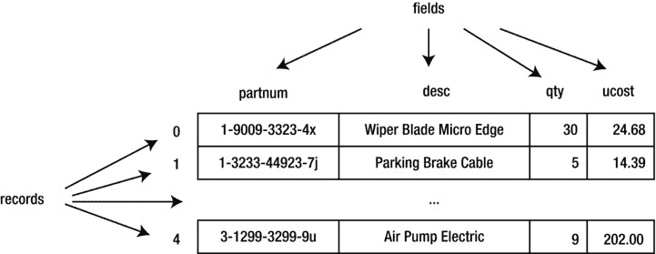
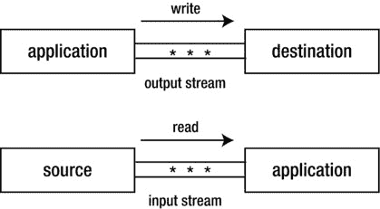
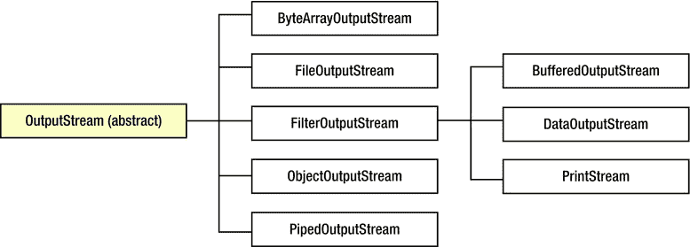
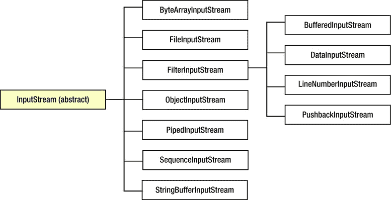
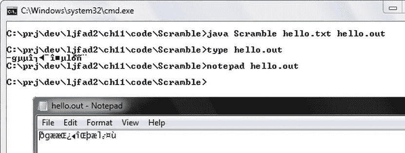
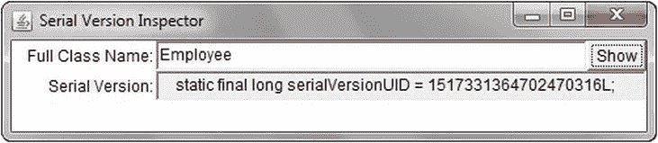
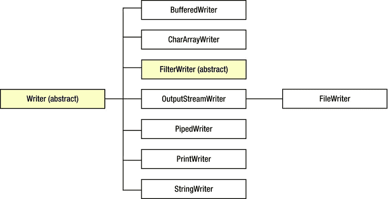
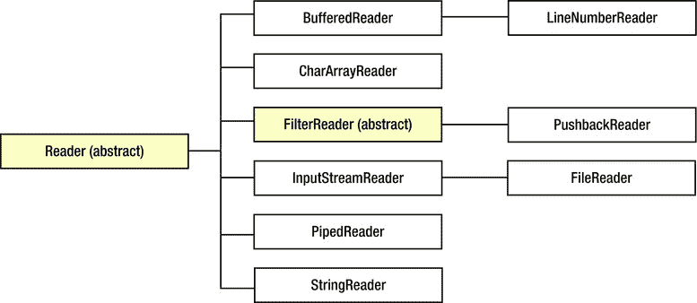

# 十一、执行经典 I/O

应用经常输入数据进行处理，并输出处理结果。数据从文件或其他来源输入，然后输出到文件或其他目的地。Java 通过位于 java.io 包中的经典 I/O API和位于 java.nio 和相关子包(以及 java.util.regex 中的新 I/O API 来支持 I/O。本章向您介绍了经典的 I/O API。

**注意**你已经在[第 1 章](01.html)的标准 I/O 覆盖、[第 8 章](08.html)的进程类和[第 10 章](10.html)的 ZIP 和 JAR APIs 的上下文中体验了经典 I/O。

使用文件 API

应用经常与一个*文件系统* 交互，该文件系统通常表示为从*根目录*开始的文件和目录的层次结构。

Android 和其他运行虚拟机的平台通常支持至少一个文件系统。例如，Unix/Linux(和基于 Linux 的 Android)平台将所有*挂载的*(附加和准备好的)磁盘组合成一个虚拟文件系统。相比之下，Windows 将单独的文件系统与每个活动磁盘驱动器相关联。

Java 通过其具体的 java.io.File 类提供对底层平台可用文件系统的访问。 File 声明了 File[] listRoots() 类方法来返回可用文件系统的根目录(root)作为一个数组 File 对象。

**注意**可用文件系统根的设置受到平台级操作的影响，例如插入或弹出可移动介质，以及断开或卸载物理或虚拟磁盘驱动器。

[清单 11-1](#list1) 展示了一个 DumpRoots 应用，它使用 listRoots() 获得一个可用文件系统根的数组，然后输出数组的内容。

[清单 11-1](#_list1) 。将可用的文件系统根目录转储到标准输出

```java
import java.io.File;

public class DumpRoots
{
   public static void main(String[] args)
   {
      File[] roots = File.listRoots();
      for (File root: roots)
         System.out.println(root);
   }
}

```

当我在 Windows 7 平台上运行这个应用时，我会收到以下输出，其中显示了四个可用的根:

```java
C:\
D:\
E:\
F:\

```

如果我碰巧在 Unix 或 Linux 平台上运行了 DumpRoots ，我会收到一行输出，其中包含虚拟文件系统根( / )。

除了使用 listRoots() 之外，还可以通过调用File(String pathname)等 File 构造函数，创建一个 File 实例，存储 pathname 字符串。下列赋值语句演示了此构造函数:

```java
File file1 = new File("/x/y");
File file2 = new File("C:\\temp\\x.dat");

```

第一条语句假设一个 Unix/Linux 平台，以根目录符号 / 开始路径名，接着是目录名 x ，分隔符 / ，以及文件或目录名 y 。(它也适用于 Windows，Windows 假定该路径从当前驱动器的根目录开始。)

**注意***路径*是一个目录层次结构，必须遍历它才能找到文件或目录。*路径名*是路径的字符串表示；与平台相关的*分隔符*(例如，Windows 反斜杠[ \ ]字符)出现在连续名称之间。

第二条语句假设使用 Windows 平台，以驱动器说明符 C: 开始路径名，然后是根目录符号 \ ，目录名 temp ，分隔符 \ ，文件名 x.dat (尽管 x.dat 可能指的是一个目录)。

**注意**字符串中出现的反斜杠字符一定要加双，尤其是在指定路径名的时候；否则，您将面临出现错误或编译器错误消息的风险。例如，我在第二条语句中使用了双倍的反斜杠字符来表示反斜杠而不是制表符( \t )，以避免编译器错误消息( \x 是非法的)。

每条语句的路径名都是一个*绝对路径名* ，是一个以根目录符号开头的路径名；不需要其他信息来定位它所表示的文件/目录。相比之下，*相对路径名* 不是以根目录符号开始的；它是通过从其他路径名获取的信息来解释的。

**注意**Java . io包的类默认解析当前用户(也称为工作)目录的相对路径名，该目录由系统属性 user.dir 标识，通常是虚拟机启动的目录。([第 8 章](08.html)向您展示了如何通过 java.lang.System 的 getProperty() 方法读取系统属性。)

文件实例通过存储*抽象路径名* 来包含文件和目录路径名的抽象表示(这些文件或目录可能存在，也可能不存在于它们的文件系统中)，这提供了独立于平台的分层路径名视图。相反，用户界面和操作系统使用依赖于平台的*路径名字符串*来命名文件和目录。

抽象路径名由一个可选的与平台相关的前缀字符串组成，例如磁盘驱动器说明符(Unix/Linux 根目录用“/”表示，Windows 通用命名约定(UNC)路径名用“\”表示)以及一系列零个或多个字符串名称。抽象路径名中的第一个名称可以是目录名，或者在 Windows UNC 路径名的情况下，可以是主机名。每个后续名称表示一个目录；姓氏可以表示目录或文件。*空抽象路径名* 没有前缀，名称序列为空。

路径名字符串与抽象路径名之间的转换本质上是平台相关的。当路径名字符串被转换为抽象路径名时，该字符串中的名称可以由默认名称分隔符或底层平台支持的任何其他名称分隔符分隔。当一个抽象路径名被转换成一个路径名字符串时，每个名称与下一个名称之间用一个默认的名称分隔符分开。

**注意***默认名称-分隔符*由系统属性 file.separator 定义，并在 File 的 public static separator 和 separatorChar 字段中可用——第一个字段将字符存储在 java.lang.String 实例中，第二个字段将其存储为 char 值。

文件为实例化这个类提供了额外的构造函数。例如，下面的构造函数将父路径名和子路径名合并成组合路径名，存储在文件对象中:

*   File(String parent，String child) 从一个父路径名字符串和一个子路径名字符串创建一个新的文件实例。
*   File(File parent，String child) 从一个父路径名文件实例和一个子路径名字符串创建一个新的文件实例。

每个构造函数的父参数被传递一个*父路径名*，这是一个由除了姓氏之外的所有路径名组成的字符串，姓氏由子指定。下面的语句通过文件(String，String) 演示了这个概念:

```java
File file3 = new File("prj/books/", "ljfad2");

```

构造器将父路径名 prj/books/ 与子路径名 ljfad2 合并成路径名 prj/books/ljfad2 。(如果我指定了 prj/books 作为父路径名，那么构造函数就会在 books 之后添加分隔符。)

**提示**因为文件(字符串路径名)、文件(字符串父级，字符串子级)和文件(文件父级，字符串子级)不检测无效的路径名参数(除了当路径名或子级为 null 时抛出Java . lang . nullpointerexception)，所以在指定路径名时一定要小心。您应该尽量只指定对应用运行的所有平台都有效的路径名。例如，不要在路径名中硬编码驱动器说明符(比如 C:)，而是使用从 listRoots() 返回的根。更好的是，保持路径名相对于当前用户/工作目录(从 user.dir 系统属性返回)。

在获得一个文件对象后，您可以通过调用[表 11-1](#Tab1) 中描述的方法来询问它，以了解其存储的抽象路径名。

[表 11-1。](#_Tab1) 文件学习方法关于存储的抽象路径名

| 方法 | 描述 |
| --- | --- |
| 【getabsolutefile()文件 T2] | 返回这个文件对象的抽象路径名的绝对形式。该方法相当于新建文件(this.getAbsolutePath()) 。 |
| 字符串 getAbsolutePath（） | 返回这个文件对象的抽象路径名的绝对路径名字符串。当它已经是绝对路径时，就像调用 getPath() 一样返回路径名字符串。当是空的抽象路径名时，返回当前用户目录的路径名字符串(通过 user.dir 标识)。否则，抽象路径名以依赖于平台的方式被解析。在 Unix/Linux 平台上，相对路径名通过根据当前用户目录进行解析而成为绝对路径名。在 Windows 平台上，通过根据路径名命名的驱动器的当前目录或当前用户目录(如果没有驱动器)解析路径名，使路径名成为绝对路径。 |
| 文件获取规范文件（） | 返回这个文件对象的抽象路径名的*规范*(尽可能简单、绝对和唯一)形式。当发生 I/O 错误时，该方法抛出 java.io.IOException (创建规范路径名可能需要文件系统查询)；它等同于新文件(this.getCanonicalPath()) 。 |
| 字串 get anoniclpath() | 返回这个文件对象的抽象路径名的规范路径名字符串。这个方法首先在必要的时候将这个路径名转换成绝对形式，就像通过调用 getAbsolutePath() 一样，然后以一种平台相关的方式将其映射到其唯一的形式。这样做通常需要删除多余的名称，如“.”还有“..”从路径名，解析符号链接(在 Unix/Linux 平台上)，并将驱动器号转换为标准大小写(在 Windows 平台上)。当出现 I/O 错误时，该方法抛出 IOException (创建规范路径名可能需要文件系统查询)。 |
| 字串 getName() | 返回由这个文件对象的抽象路径名表示的文件名或目录名。此名称是路径名名称序列中的最后一个。当路径名的名称序列为空时，返回空字符串。 |
| 字串 get arent() | 返回这个文件对象的路径名的父路径名字符串，或者当这个路径名没有命名父目录时返回 null。 |
| 【getparentfile()档案 | 返回一个文件对象，存储这个文件对象的抽象路径名的父抽象路径名；当父路径名不是目录时，返回 null。 |
| 字符串 getPath（） | 将此文件对象的抽象路径名转换为路径名字符串，其中序列中的名称由存储在文件的分隔符字段中的字符分隔。返回结果路径名字符串。 |
| boolean isAbsolute() | 当这个文件对象的抽象路径名是绝对路径名时返回 true 否则，当它是相对的时，返回 false。绝对路径名的定义取决于系统。在 Unix/Linux 平台上，当前缀为“ / 时，路径名是绝对的。在 Windows 平台上，如果路径名的前缀是驱动器说明符，后跟“ \ ”，或者前缀是“ \\ ，则该路径名是绝对路径名。 |
| 字符串 toString() | getPath() 的同义词。 |

[表 11-1](#Tab1) 引用了 IOException ，它是那些描述各种 I/O 错误的异常类的公共异常超类，如Java . io . filenotfoundexception。

[清单 11-2](#list2) 用路径名命令行参数实例化文件，并调用[表 11-1](#Tab1) 中描述的一些文件方法来了解这个路径名。

[清单 11-2](#_list2) 。获取抽象路径名信息

```java
import java.io.File;
import java.io.IOException;

public class PathnameInfo
{
   public static void main(final String[] args) throws IOException
   {
      if (args.length != 1)
      {
         System.err.println("usage: java PathnameInfo pathname");
         return;
      }
      File file = new File(args[0]);
      System.out.println("Absolute path = " + file.getAbsolutePath());
      System.out.println("Canonical path = " + file.getCanonicalPath());
      System.out.println("Name = " + file.getName());
      System.out.println("Parent = " + file.getParent());
      System.out.println("Path = " + file.getPath());
      System.out.println("Is absolute = " + file.isAbsolute());
   }
}

```

比如当我指定 java PathnameInfo 的时候。(句点代表我的 Windows 7 平台上的当前目录)，我观察到以下输出:

```java
Absolute path = C:\prj\dev\ljfad2\ch11\code\PathnameInfo\.
Canonical path = C:\prj\dev\ljfad2\ch11\code\PathnameInfo
Name = .
Parent = null
Path = .
Is absolute = false

```

这个输出表明规范路径名不包含句点。它还显示没有父路径名，并且路径名是相对的。

接下来，我现在指定Java pathname info c:\ reports \ 2012 \..\ 2011 \ 2 月。这一次，我观察到以下输出:

```java
Absolute path = c:\reports\2012\..\2011\February
Canonical path = C:\reports\2011\February
Name = February
Parent = c:\reports\2012\..\2011
Path = c:\reports\2012\..\2011\February
Is absolute = true

```

这个输出表明规范路径名不包括 2012 。它还显示路径名是绝对的。

对于我的最后一个例子，假设我指定 java PathnameInfo "" 来获取空路径名的信息。作为响应，该应用生成以下输出:

```java
Absolute path = C:\prj\dev\ljfad2\ch11\code\PathnameInfo
Canonical path = C:\prj\dev\ljfad2\ch11\code\PathnameInfo
Name =
Parent = null
Path =
Is absolute = false

```

输出显示 getName() 和 getPath() 返回空字符串( "" )，因为空路径名为空。

您可以通过调用[表 11-2](#Tab2) 中描述的方法来询问文件系统，以了解由文件对象的存储路径名表示的文件或目录。

[表 11-2。](#_Tab2) 学习关于文件或目录的文件方法

| 方法 | 描述 |
| --- | --- |
| 【boolean can execute() | 当这个文件对象的抽象路径名代表一个现有的可执行文件时，返回 true。 |
| 布尔 canRead() | 当这个文件对象的抽象路径名代表一个现有的可读文件时，返回 true。 |
| 布尔 canWrite() | 当这个文件对象的抽象路径名代表一个可以被修改的现有文件时，返回 true。 |
| 布尔存在() | 当且仅当由这个文件对象的抽象路径名表示的文件或目录存在时，返回 true。 |
| 布尔 isDirectory() | 当这个文件对象的抽象路径名指向一个现有目录时，返回 true。 |
| boolean isFile() | 当这个文件对象的抽象路径名引用一个现有的普通文件时，返回 true。当一个文件不是一个目录并且满足其他平台相关的标准时，它就是正常的*:例如，它不是一个符号链接或者一个命名管道。由 Java 应用创建的任何非目录文件都保证是普通文件。* |
| 布尔石田() | 当由这个文件对象的抽象路径名表示的文件被隐藏时，返回 true。隐藏的 T2 的确切定义取决于平台。在 Unix/Linux 平台上，当文件名以句点字符开头时，文件将被隐藏。在 Windows 平台上，当文件在文件系统中被标记为隐藏时，该文件就是隐藏的。 |
| long last modified() | 返回由这个文件对象的抽象路径名表示的文件最后被修改的时间，或者当文件不存在或者在这个方法调用期间发生 I/O 错误时返回 0。从 *Unix 纪元*(格林威治时间 1970 年 1 月 1 日 00:00:00)开始，返回值以毫秒为单位进行测量。 |
| 龙长() | 返回由这个文件对象的抽象路径名表示的文件长度。当路径名表示目录时，返回值是未指定的，当文件不存在时，返回值为 0。 |

[清单 11-3](#list3) 用其路径名命令行参数实例化文件，并调用[表 11-2](#Tab2) 中描述的所有文件方法来了解路径名的文件/目录。

*[清单 11-3](#_list3) 。获取文件/目录信息*

```java
import java.io.File;
import java.io.IOException;

import java.util.Date;

public class FileDirectoryInfo
{
   public static void main(final String[] args) throws IOException
   {
      if (args.length != 1)
      {
         System.err.println("usage: java FileDirectoryInfo pathname");
         return;
      }
      File file = new File(args[0]);
      System.out.println("About " + file + ":");
      System.out.println("Can execute = " + file.canExecute());
      System.out.println("Can read = " + file.canRead());
      System.out.println("Can write = " + file.canWrite());
      System.out.println("Exists = " + file.exists());
      System.out.println("Is directory = " + file.isDirectory());
      System.out.println("Is file = " + file.isFile());
      System.out.println("Is hidden = " + file.isHidden());
      System.out.println("Last modified = " + new Date(file.lastModified()));
      System.out.println("Length = " + file.length());
   }
}

```

例如，假设我有一个名为 x.dat 的 3 字节只读文件。当我指定Java filedirectorinfo x . dat时，我观察到以下输出:

```java
About x.dat:
Can execute = true
Can read = true
Can write = false
Exists = true
Is directory = false
Is file = true
Is hidden = false
Last modified = Tue Nov 20 12:12:09 CST 2012
Length = 3

```

**注意** Java 6 向文件添加了 long getFreeSpace() 、 long getTotalSpace() 和 long getUsableSpace() 方法，这些方法返回关于*分区*(文件系统的特定平台存储部分；例如 C:\)由文件实例的路径名描述。Android 支持这些额外的方法。

File 声明了五个方法，这些方法返回位于由 File 对象的抽象路径名标识的目录中的文件和目录的名称。[表 11-3](#Tab3) 描述了这些方法。

[表 11-3。](#_Tab3) 获取目录内容的文件方法

| 方法 | 描述 |
| --- | --- |
| 字符串【列表】() | 返回一个可能为空的字符串数组，命名由这个文件对象的抽象路径名表示的目录中的文件和目录。如果路径名不表示目录，或者如果发生 I/O 错误，该方法返回 null。否则，它返回一个字符串数组，目录中的每个文件或目录一个字符串。表示目录本身和目录父目录的名称不包括在结果中。每个字符串都是文件名，而不是完整的路径。此外，也不能保证结果数组中的名称字符串会按字母顺序或任何其他顺序出现。 |
| String[]list(filename filter filter) | 调用 list() 并只返回那些满足过滤器的字符串的便捷方法。 |
| File[]list files() | 调用 list() ，将其数组字符串转换为数组文件并返回文件 s 数组的便捷方法。 |
| File[]list files(FileFilter filter) | 一个调用 list() 的便捷方法，将其数组字符串转换为数组文件 s，但只针对那些满足 filter 的字符串，返回文件 s 数组。 |
| File[]list files(filename filter 过滤器)T2】 | 一个调用 list() 的便捷方法，将其数组字符串转换为数组文件 s，但只针对那些满足 filter 的字符串，返回文件 s 数组。 |

重载的 list() 方法 返回表示文件和目录名的字符串的数组。第二种方法让您只返回那些感兴趣的名字(例如，只返回那些以扩展名结尾的名字)。txt )通过一个基于 java.io.FilenameFilter 的过滤器对象。

FilenameFilter 接口声明单个布尔 accept(文件目录，字符串名称)方法，该方法被调用用于位于由文件对象的路径名标识的目录中的每个文件/目录:

*   dir 标识路径名的父部分(目录路径)。
*   name 标识路径名的最终目录名或文件名部分。

accept() 方法 使用传递给这些参数的自变量来确定文件或目录是否满足其可接受的标准。当文件/目录名应该包含在返回的数组中时，它返回 true 否则，此方法返回 false。

清单 11-4 展示了一个 Dir (ectory)应用，它使用list(filename filter)只获取那些以特定扩展名结尾的名字。

[清单 11-4](#_list4) 。列出具体的名称

```java
import java.io.File;
import java.io.FilenameFilter;

public class Dir
{
   public static void main(final String[] args)
   {
      if (args.length != 2)
      {
         System.err.println("usage: java Dir dirpath ext");
         return;
      }
      File file = new File(args[0]);
      FilenameFilter fnf = new FilenameFilter()
                           {
                              @Override
                              public boolean accept(File dir, String name)
                              {
                                 return name.endsWith(args[1]);
                              }
                           };
      String[] names = file.list(fnf);
      for (String name: names)
         System.out.println(name);
   }
}

```

例如，当我在我的 Windows 7 平台上指定 java Dir c:\windows exe 时， Dir 只输出那些带有的 \windows 目录文件名。exe 扩展名:

```java
bfsvc.exe
explorer.exe
fveupdate.exe
HelpPane.exe
hh.exe
notepad.exe
regedit.exe
splwow64.exe
twunk_16.exe
twunk_32.exe
winhlp32.exe
write.exe

```

重载的 listFiles() 方法 返回数组文件。在很大程度上，它们与其对应的 list() 是对称的。然而， listFiles(FileFilter) 引入了不对称性。

java.io.FileFilter 接口声明了一个单独的布尔 accept(字符串路径名)】方法，该方法被调用用于位于由文件对象的路径名标识的目录中的每个文件/目录:传递给路径名的参数标识文件或目录的完整路径。

accept() 方法使用这个参数来确定文件或目录是否满足其可接受的标准。当文件/目录名应该包含在返回的数组中时，它返回 true 否则，此方法返回 false。

**注意**因为每个接口的 accept() 方法完成相同的任务，您可能想知道使用哪个接口。如果你喜欢一个分解成目录和名称组件的路径，使用 FilenameFilter 。但是，如果您喜欢完整的路径名，可以使用FileFilter；你可以随时调用 getParent() 和 getName() 来获取这些组件。

File 还声明了几个创建文件和操作现有文件的方法。[表 11-4](#Tab4) 描述了这些方法。

[表 11-4。](#_Tab4) 文件创建文件和操作现有文件的方法

| 方法 | 描述 |
| --- | --- |
| 布尔 createNewFile() | 当且仅当具有此名称的文件尚不存在时，自动创建一个新的空文件，并以此文件对象的抽象路径名命名。检查文件是否存在以及在文件不存在时创建文件是一个单独的操作，相对于可能影响文件的所有其他文件系统活动来说，它是原子性的。当指定的文件不存在并且成功创建时，该方法返回 true，当指定的文件已经存在时，该方法返回 false。当一个 I/O 错误发生时，它抛出 IOException 。 |
| 静态文件 createTempFile (字符串前缀，字符串后缀) | 使用给定的前缀和后缀在默认的临时文件目录中创建一个空文件，并生成其名称。这个重载的类方法调用它的三参数变量，将前缀、后缀和 null 传递给这个其他方法，并返回其他方法的返回值。 |
| 静态文件 createTempFile (字符串前缀，字符串后缀，文件目录) | 使用给定的前缀和后缀在指定的目录中创建一个空文件，并生成其名称。名称以前缀指定的字符序列开始，以后缀指定的字符序列结束；。当后缀为 null 时，tmp 用作后缀。该方法成功时返回创建的文件的路径名。当前缀包含的字符少于三个时，抛出Java . lang . illegalargumentexception，当文件无法创建时，抛出 IOException 。 |
| 布尔删除() | 删除由这个文件对象的路径名表示的文件或目录。成功时返回 true 否则，返回 false。如果路径名表示一个目录，则该目录必须为空才能删除。 |
| void deleteonexis() | 当虚拟机终止时，请求删除由该文件对象的抽象路径名表示的文件或目录。在同一个文件对象上重新调用该方法没有效果。一旦请求删除，就不可能取消请求。因此，应谨慎使用这种方法。 |
| 布尔 mkdir() | 创建由这个文件对象的抽象路径名命名的目录。成功时返回 true 否则，返回 false。 |
| 布尔 mkdirs() | 创建由这个文件对象的抽象路径名命名的目录和任何必要的中间目录。成功时返回 true 否则，返回 false。 |
| 布尔重命名 (文件目标) | 将由这个文件对象的抽象路径名表示的文件重命名为目标。成功时返回 true 否则，返回 false。当 dest 为 null 时，该方法抛出 NullPointerException 。此方法行为的许多方面都依赖于平台。例如，重命名操作可能无法将文件从一个文件系统移动到另一个文件系统，该操作可能不是原子的，或者当具有目标路径名的文件已经存在时，该操作可能不会成功。应该始终检查返回值，以确保重命名操作成功。 |
| 布尔 setlastmedict(长时间) | 设置由该文件对象的抽象路径名命名的文件或目录的最后修改时间。成功时返回 true 否则，返回 false。当时间为负时，该方法抛出 IllegalArgumentException 。所有平台都支持精确到秒的文件修改时间，但有些平台提供的精度更高。时间值将被截断以适应支持的精度。如果操作成功并且没有对文件进行干预操作，那么下一次调用 lastModified() 将返回传递给该方法的(可能被截断的) time 值。 |
| 布尔 setReadOnly() | 标记由这个文件对象的抽象路径名表示的文件或目录，以便只允许读操作。调用此方法后，文件或目录在被删除或标记为允许写访问之前不会改变。只读文件或目录是否可以删除取决于文件系统。 |

假设您正在设计一个文本编辑器应用，用户将实现它来打开一个文本文件并对其内容进行更改。在用户将这些更改显式保存到文件之前，您希望文本文件保持不变。

因为用户不想在应用崩溃或计算机断电时丢失这些更改，所以您将应用设计为每隔几分钟将这些更改保存到一个临时文件中。这样，用户就有了更改的备份。

你可以使用重载的 createTempFile() 方法来创建临时文件。如果您没有指定存储该文件的目录，那么它将创建在由 java.io.tmpdir 系统属性标识的目录中。

在用户告诉应用保存或放弃更改后，您可能希望删除临时文件。 deleteOnExit() 方法让你注册一个临时文件用于删除；当虚拟机在没有崩溃/断电的情况下结束时，它将被删除。

[清单 11-5](#list5) 展示了一个 TempFileDemo 应用，用于试验 createTempFile() 和 deleteOnExit() 方法。

[清单 11-5](#_list5) 。试用临时文件

```java
import java.io.File;
import java.io.IOException;

public class TempFileDemo
{
   public static void main(String[] args) throws IOException
   {
      System.out.println(System.getProperty("java.io.tmpdir"));
      File temp = File.createTempFile("text", ".txt");
      System.out.println(temp);
      temp.deleteOnExit();
   }
}

```

在输出临时文件存储的位置后， TempFileDemo 创建一个临时文件，文件名以文本开头，以结尾。txt 分机。 TempFileDemo 接下来输出临时文件的名称，并注册临时文件，以便在应用成功终止时删除。

在运行 TempFileDemo 的过程中，我观察到以下输出(文件在退出时消失):

```java
C:\Users\Owner\AppData\Local\Temp\
C:\Users\Owner\AppData\Local\Temp\text3173127870811188221.txt

```

**注** Java 6 添加到文件新增布尔可执行(boolean executable) 、布尔可执行(boolean executable，boolean ownerOnly) 、布尔可读取(boolean readable) 、布尔可读取(boolean readable，boolean ownerOnly) 、布尔可写入(boolean writable) 和布尔可写入(boolean writable，boolean ownerOnly) Android 支持这些额外的方法。

最后，文件实现了 java.lang.Comparable 接口的 compareTo() 方法，并覆盖了 equals() 和 hashCode() 。[表 11-5](#Tab5) 描述了这些其他方法。

[表 11-5](#_Tab5) 。文件的其他方法

| 方法 | 描述 |
| --- | --- |
| int compareTo (文件路径名) | 按字典顺序比较两个路径名。此方法定义的顺序取决于基础平台。在 Unix/Linux 平台上，比较路径名时字母大小写很重要；在 Windows 平台上，字母大小写无关紧要。当路径名的抽象路径名等于该文件对象的抽象路径名时返回零，当该文件对象的抽象路径名小于路径名时返回负值，否则返回正值。为了准确地比较两个文件对象，在每个文件对象上调用 getCanonicalFile() ，然后比较返回的文件对象。 |
| 布尔等于 (对象 obj) | 比较这个文件对象和对象是否相等。抽象路径名相等依赖于底层平台。在 Unix/Linux 平台上，比较路径名时字母大小写很重要；在 Windows 平台上，字母大小写无关紧要。当且仅当对象不是 null 并且是一个文件对象，其抽象路径名表示与这个文件对象的抽象路径名相同的文件/目录时，返回 true。 |
| int hashCode() | 计算并返回该路径名的散列码。这种计算取决于底层平台。在 Unix/Linux 平台上，路径名的散列码等于其路径名字符串的散列码和十进制值 1234321 的异或。在 Windows 平台上，哈希代码是小写路径名字符串的哈希代码和十进制值 1234321 的异或。当路径名字符串小写时，不考虑当前的*语言环境*(地理、政治或文化区域)。 |

使用 RandomAccessFile API

可以为*随机访问*创建和/或打开文件，在随机访问中，可以混合进行写和读操作，直到文件被关闭。Java 通过其具体的 java.io.RandomAccessFile 类支持这种随机访问。

RandomAccessFile 声明了以下构造函数:

*   RandomAccessFile(File file，String mode ) 创建并打开一个不存在的新文件或打开一个已有的文件。该文件由文件的抽象路径名标识，并根据模式创建和/或打开。
*   RandomAccessFile(字符串路径名，字符串模式 ) 创建并打开一个不存在的新文件或打开一个现有文件。文件由路径名标识，并根据模式创建和/或打开。

构造函数的模式参数必须是【r】【rw】【rws】或【rwd】中的一个；否则，构造函数抛出IllegalArgumentException。这些字符串文字具有以下含义:

*   【r】通知构造器以只读方式打开一个已有的文件。任何写入文件的尝试都会导致抛出一个 IOException 类的实例。
*   【rw】当文件不存在时，通知构造器创建并打开一个新文件进行读写，或者打开一个已有的文件进行读写。
*   【rwd】当文件不存在时，通知构造器创建并打开一个新文件进行读写，或者打开一个已有的文件进行读写。此外，对文件内容的每次更新都必须同步写入底层存储设备。
*   【rws】通知构造器创建并打开一个不存在的新文件进行读写，或者打开一个已有的文件进行读写。此外，对文件内容或元数据的每次更新都必须同步写入底层存储设备。

**注意**文件的*元数据* 是关于文件的数据，而不是实际的文件内容。元数据的例子包括文件的长度和文件最后修改的时间。

【rwd】和【rws】模式确保对位于本地存储设备上的文件的任何写入都被写入该设备，这保证了当操作系统崩溃时关键数据不会丢失。当文件不在本地设备上时，不做任何保证。

**注意**在【rwd】或【rws】模式下打开的随机存取文件的操作比在【rw】模式下打开的随机存取文件的操作慢。

当模式为【r】且路径名标识的文件无法打开(可能不存在，也可能是目录)或模式为【rw】且路径名为只读或目录时，这些构造函数抛出 FileNotFoundException 。

下面的示例演示了第二个构造函数，它试图通过 "r" 模式字符串打开一个现有文件进行读访问:

```java
RandomAccessFile raf = new RandomAccessFile("employee.dat", "r");

```

随机存取文件与一个*文件指针* 相关联，该指针标识下一个要写入或读取的字节的位置。当打开一个现有文件时，文件指针被设置为它的第一个字节，偏移量为 0。创建文件时，文件指针也被设置为 0。

写入或读取操作从文件指针开始，并使其前进超过写入或读取的字节数。超过文件当前结尾的写入操作会导致文件被扩展。这些操作会一直持续到文件关闭。

RandomAccessFile 声明了各种各样的方法。我在[表 11-6](#Tab6) 中给出了这些方法的一个典型例子。

[表 11-6](#_Tab6) 。RandomAccessFile 方法

| 方法 | 描述 |
| --- | --- |
| 虚空关() | 关闭该文件并释放所有相关的平台资源。后续的写或读操作导致 IOException 。同样，不能用这个随机访问文件对象重新打开文件。当一个 I/O 错误发生时，这个方法抛出 IOException 。 |
| 文件描述符 getFD（） | 返回文件的相关文件描述符对象。当发生 I/O 错误时，该方法抛出 IOException 。 |
| 长 getFilePointer() | 将文件指针的当前从零开始的字节偏移量返回到文件中。当发生 I/O 错误时，该方法抛出 IOException 。 |
| 龙长() | 返回文件的长度(以字节为单位)。当发生 I/O 错误时，该方法抛出 IOException 。 |
| int read() | 读取并返回(作为 0 到 255 范围内的 int )文件的下一个字节，或者在到达文件末尾时返回 1。该方法在没有输入可用时阻塞，并在发生 I/O 错误时抛出 IOException 。 |
| int read(byte[] b) | 将文件中最多 b.length 字节的数据读入字节数组 b 。此方法会一直阻塞，直到至少有 1 个字节的输入可用。它返回读入数组的字节数，或者在到达文件末尾时返回 1。当 b 为 null 时抛出 NullPointerException ，当发生 I/O 错误时抛出 IOException 。 |
| char readChar() | 从文件中读取并返回一个字符。这个方法从当前文件指针开始从文件中读取 2 个字节。如果读取的字节依次为 b1 和 b2 ，其中 0 < = b1 ， b2 < = 255，则结果等于(char)((B1<<8)&#124; B2)。此方法会一直阻塞，直到读取了 2 个字节、检测到文件的结尾或者引发异常。在读取两个字节之前到达文件末尾时，它抛出 java.io.EOFException (是 IOException 的子类)，在发生 I/O 错误时，抛出 IOException 。 |
| int readInt() | 从文件中读取并返回一个 32 位整数。这个方法从当前文件指针开始从文件中读取 4 个字节。如果读取的字节依次为 b1 、 b2 、 b3 、 b4 ，其中 0 < = b1 、 b2 、 b3 、 b4 < = 255，则结果等于(B1<<24)&#124;(B2<【T27)此方法会一直阻塞，直到读取了 4 个字节、检测到文件的结尾或引发异常。在读取 4 个字节之前，当到达文件末尾时抛出 EOFException ，当发生 I/O 错误时抛出 IOException 。 |
| void seek(长位置) | 将文件指针的当前偏移量设置为位置(从文件的开始以字节为单位测量)。如果设置的偏移量超出了文件的结尾，文件的长度不会改变。文件长度将仅在偏移被设置为超出文件结尾之后通过写入来改变。当位置中的值为负或发生 I/O 错误时，该方法抛出 IOException 。 |
| void set length(long new length)T2] | 设置文件的长度。如果由 length() 返回的当前长度大于 newLength ，则文件被截断。在这种情况下，如果 getFilePointer() 返回的文件偏移量大于 newLength ，那么在 setLength() 返回后，偏移量将等于 newLength 。如果当前长度小于 newLength ，则文件被扩展。在这种情况下，文件扩展部分的内容没有定义。当发生 I/O 错误时，该方法抛出 IOException 。 |
| int skip bytes(int n)T2】 | 尝试跳过 n 个字节。当在跳过 n 字节之前到达文件末尾时，该方法跳过较少的字节(可能为零)。这种情况下不会抛出 EOFException 。如果 n 为负，则不跳过任何字节。返回跳过的实际字节数。当一个 I/O 错误发生时，这个方法抛出 IOException 。 |
| void write(byte[] b) | 从当前文件指针位置开始，将字节数组 b 中的 b.length 字节写入文件。当一个 I/O 错误发生时，这个方法抛出 IOException 。 |
| void write(int b) | 将 b 的低 8 位写入当前文件指针位置的文件。当一个 I/O 错误发生时，这个方法抛出 IOException 。 |
| void writeChars(字符串 s) | 从当前文件指针位置开始，将字符串 s 作为字符序列写入文件。当一个 I/O 错误发生时，这个方法抛出 IOException 。 |
| void writeInt(int i) | 从当前文件指针位置开始，将 32 位整数 i 写入文件。这 4 个字节首先写入高位字节。当一个 I/O 错误发生时，这个方法抛出 IOException 。 |

大多数[表 11-6](#Tab6) 的方法都是不言自明的。然而， getFD() 方法需要进一步的启发。

**注意** RandomAccessFile 的 read 前缀方法和 skipBytes() 源自 java.io.DataInput 接口，这个类实现了这个接口。此外， RandomAccessFile 的 write 前缀方法源自 java.io.DataOutput 接口，该类也实现了该接口。

当打开一个文件时，底层平台创建一个依赖于平台的结构来表示该文件。该结构的句柄存储在 java.io.FileDescriptor 类的实例中，该类由 getFD() 返回。

**注意***句柄*是一个标识符，在这种情况下，当 Java 需要底层平台执行文件操作时，它会传递给底层平台以标识特定的打开文件。

FileDescriptor 是一个小类，声明了三个 FileDescriptor 常量，分别命名为中的、中的和中的错误。这些常量让 System.in 、 System.out 和 System.err 提供对标准输入、标准输出和标准错误流的访问。

FileDescriptor 也声明了下面一对方法:

*   void sync() 告诉底层平台*将打开文件的输出缓冲区的内容刷新*(清空)到它们相关的本地磁盘设备。 sync() 在所有修改的数据和属性都写入相关设备后返回。当缓冲区无法刷新或因为平台无法保证所有缓冲区都已与物理介质同步时，它会抛出Java . io . syncfailedexception。
*   布尔有效() 确定这个文件描述符对象是否有效。当文件描述符对象代表一个打开的文件或其他活动的 I/O 连接时，它返回 true 否则，它返回 false。

写入打开文件的数据最终被存储在底层平台的输出缓冲区中。当缓冲区填满时，平台会将它们清空到磁盘。缓冲区可以提高性能，因为磁盘访问速度很慢。

但是，当您向通过模式“rwd”或“rws”打开的随机存取文件写入数据时，每次写入操作的数据都会直接写入磁盘。因此，写操作比在“rw”模式下打开随机存取文件时要慢。

假设您有这样一种情况，既通过输出缓冲区写入数据，又直接将数据写入磁盘。下面的例子通过以模式“rw”打开文件并选择性地调用文件描述符的 sync() 方法来解决这个混合场景。

```java
RandomAccessFile raf = new RandomAccessFile("employee.dat", "rw");
FileDescriptor fd = raf.getFD();
// Perform a critical write operation.
raf.write(. . .);
// Synchronize with underlying disk by flushing platform's output buffers to disk.
fd.sync();
// Perform non-critical write operation where synchronization isn't necessary.
raf.write(. . .);
// Do other work.
// Close file, emptying output buffers to disk.
raf.close();

```

RandomAccessFile 对于创建一个*平面文件数据库* 很有用，一个组织成记录和字段的单个文件。*记录*存储单个条目(例如，零件数据库中的零件)，而*字段*存储条目的单个属性(例如，零件号)。

**注意**术语*字段*也用来指一个类中声明的变量。为了避免与这种重载术语混淆，可以将字段变量想象成类似于记录的字段属性。

平面文件数据库通常将其内容组织成一系列固定长度的记录。每个记录被进一步组织成一个或多个固定长度的字段。[图 11-1](#Fig1) 说明了零件数据库中的这一概念。



[图 11-1](#_Fig1)T3。汽车零件的平面文件数据库分为记录和字段

根据[图 11-1](#Fig1) ，每个字段都有一个名称(零件号、desc、数量和成本)。此外，每个记录被分配一个从 0 开始的数字。这个例子由五条记录组成，为了简洁起见，只显示了其中的三条。

为了向您展示如何根据 RandomAccessFile 实现平面文件数据库，我创建了一个简单的 PartsDB 类来模拟[图 11-1](#Fig1) 。查看清单 11-6 。

[清单 11-6](#_list6) 。实现零件平面文件数据库

```java
import java.io.IOException;
import java.io.RandomAccessFile;

public class PartsDB
{
   public final static int PNUMLEN = 20;
   public final static int DESCLEN = 30;
   public final static int QUANLEN = 4;
   public final static int COSTLEN = 4;

   private final static int RECLEN = 2 * PNUMLEN + 2 * DESCLEN + QUANLEN + COSTLEN;
   private RandomAccessFile raf;

   public PartsDB(String pathname) throws IOException
   {
      raf = new RandomAccessFile(pathname, "rw");
   }

   public void append(String partnum, String partdesc, int qty, int ucost)
      throws IOException
   {
      raf.seek(raf.length());
      write(partnum, partdesc, qty, ucost);
   }

   public void close()
   {
      try
      {
         raf.close();
      }
      catch (IOException ioe)
      {
         System.err.println(ioe);
      }
   }

   public int numRecs() throws IOException
   {
      return (int) raf.length() / RECLEN;
   }

   public Part select(int recno) throws IOException
   {
      if (recno < 0 || recno >= numRecs())
         throw new IllegalArgumentException(recno + " out of range");
      raf.seek(recno * RECLEN);
      return read();
   }

   public void update(int recno, String partnum, String partdesc, int qty,
                      int ucost) throws IOException
   {
      if (recno < 0 || recno >= numRecs())
         throw new IllegalArgumentException(recno + " out of range");
      raf.seek(recno * RECLEN);
      write(partnum, partdesc, qty, ucost);
   }

   private Part read() throws IOException
   {
      StringBuffer sb = new StringBuffer();
      for (int i = 0; i < PNUMLEN; i++)
         sb.append(raf.readChar());
      String partnum = sb.toString().trim();
      sb.setLength(0);
      for (int i = 0; i < DESCLEN; i++)
         sb.append(raf.readChar());
      String partdesc = sb.toString().trim();
      int qty = raf.readInt();
      int ucost = raf.readInt();
      return new Part(partnum, partdesc, qty, ucost);
   }

   private void write(String partnum, String partdesc, int qty, int ucost)
      throws IOException
   {
      StringBuffer sb = new StringBuffer(partnum);
      if (sb.length() > PNUMLEN)
         sb.setLength(PNUMLEN);
      else
      if (sb.length() < PNUMLEN)
      {
         int len = PNUMLEN - sb.length();
         for (int i = 0; i < len; i++)
            sb.append(" ");
      }
      raf.writeChars(sb.toString());
      sb = new StringBuffer(partdesc);
      if (sb.length() > DESCLEN)
         sb.setLength(DESCLEN);
      else
      if (sb.length() < DESCLEN)
      {
         int len = DESCLEN - sb.length();
         for (int i = 0; i < len; i++)
            sb.append(" ");
      }
      raf.writeChars(sb.toString());
      raf.writeInt(qty);
      raf.writeInt(ucost);
   }

   public static class Part
   {
      private String partnum;
      private String desc;
      private int qty;
      private int ucost;

      public Part(String partnum, String desc, int qty, int ucost)
      {
         this.partnum = partnum;
         this.desc = desc;
         this.qty = qty;
         this.ucost = ucost;
      }

      String getDesc()
      {
         return desc;
      }

      String getPartnum()
      {
         return partnum;
      }

      int getQty()
      {
         return qty;
      }

      int getUnitCost()
      {
         return ucost;
      }
   }
}

```

PartsDB 首先声明标识字符串和 32 位整数字段长度的常数。然后，它声明一个常数，以字节为单位计算记录长度。该计算考虑了一个字符在文件中占用 2 个字节的事实。

这些常数后面是一个名为 raf 的字段，该字段的类型为 RandomAccessFile 。这个字段在后续的构造函数中被赋予了一个 RandomAccessFile 类的实例，由于“rw”，这个类创建/打开一个新文件或者打开一个已有的文件。

PartsDB 接下来声明 append() 、 close() 、 numRecs() 、 select() 、 update() 。这些方法将记录追加到文件中，关闭文件，返回文件中的记录数，选择并返回特定记录，以及更新特定记录:

*   追加()方法 首先调用长度()和查找()。这样做可以确保在调用私有的 write() 方法来写入包含该方法参数的记录之前，文件指针被定位到文件的末尾。
*   RandomAccessFile 的 close() 方法可以抛出 IOException 。因为这种情况很少发生，所以我选择在 PartDB 的 close() 方法中处理这个异常，这样可以保持该方法的签名简单。但是，当 IOException 发生时，我会打印一条消息。
*   方法返回文件中记录的数量。这些记录从 0 开始编号，以num RECs()–1结束。每个 select() 和 update() 方法验证其 recno 参数是否在此范围内。
*   select() 方法调用私有的 read() 方法返回由 recno 标识的记录，作为嵌套的 Part 类的实例。 Part 的构造函数将 Part 对象初始化为记录的字段值，其 getter 方法返回这些值。
*   update() 方法同样简单。与 select() 一样，它首先将文件指针定位到由 recno 标识的记录的开头。与 append() 一样，它调用 write() 写出它的参数，但是替换一个记录而不是添加一个记录。

记录是用私有的 write() 方法写的。因为字段必须有精确的大小， write() 用右边的空格填充比字段大小短的基于字符串的值，并在需要时将这些值截断为字段大小。

通过私有的 read() 方法读取记录。 read() 在保存部分对象中基于字符串的字段值之前删除填充。

单独来看， PartsDB 是没用的。你需要一个应用让你试验这个类，而[清单 11-7](#list7) 满足了这个需求。

[清单 11-7](#_list7) 。试验零件平面文件数据库

```java
import java.io.IOException;

public class UsePartsDB
{
   public static void main(String[] args)
   {
      PartsDB pdb = null;
      try
      {
         pdb = new PartsDB("parts.db");
         if (pdb.numRecs() == 0)
         {
            // Populate the database with records.
            pdb.append("1-9009-3323-4x", "Wiper Blade Micro Edge", 30, 2468);
            pdb.append("1-3233-44923-7j", "Parking Brake Cable", 5, 1439);
            pdb.append("2-3399-6693-2m", "Halogen Bulb H4 55/60W", 22, 813);
            pdb.append("2-599-2029-6k", "Turbo Oil Line O-Ring ", 26, 155);
            pdb.append("3-1299-3299-9u", "Air Pump Electric", 9, 20200);
         }
         dumpRecords(pdb);
         pdb.update(1, "1-3233-44923-7j", "Parking Brake Cable", 5, 1995);
         dumpRecords(pdb);
      }
      catch (IOException ioe)
      {
         System.err.println(ioe);
      }
      finally
      {
         if (pdb != null)
            pdb.close();
      }
   }

   static void dumpRecords(PartsDB pdb) throws IOException
   {
      for (int i = 0; i < pdb.numRecs(); i++)
      {
         PartsDB.Part part = pdb.select(i);
         System.out.print(format(part.getPartnum(), PartsDB.PNUMLEN, true));
         System.out.print(" | ");
         System.out.print(format(part.getDesc(), PartsDB.DESCLEN, true));
         System.out.print(" | ");
         System.out.print(format("" + part.getQty(), 10, false));
         System.out.print(" | ");
         String s = part.getUnitCost() / 100 + "." + part.getUnitCost() % 100;
         if (s.charAt(s.length() - 2) == '.') s += "0";
         System.out.println(format(s, 10, false));
      }
      System.out.println("Number of records = " + pdb.numRecs());
      System.out.println();
   }

   static String format(String value, int maxWidth, boolean leftAlign)
   {
      StringBuffer sb = new StringBuffer();
      int len = value.length();
      if (len > maxWidth)
      {
         len = maxWidth;
         value = value.substring(0, len);
      }
      if (leftAlign)
      {
         sb.append(value);
         for (int i = 0; i < maxWidth-len; i++)
            sb.append(" ");
      }
      else
      {
         for (int i = 0; i < maxWidth-len; i++)
            sb.append(" ");
         sb.append(value);
      }
      return sb.toString();
   }
}

```

[清单 11-7](#list7) 的 main() 方法从实例化 PartsDB 开始，用 parts.db 作为数据库文件的名称。当这个文件没有记录时， numRecs() 返回 0，并且通过 append() 方法将几个记录追加到文件中。

main() 接下来将存储在 parts.db 中的五条记录转储到标准输出流中，更新编号为 1 的记录中的单位成本，再次将这些记录转储到标准输出流中以显示这一变化，并关闭数据库。

**注意**我将单位成本值存储为基于整数的便士数量。例如，我指定文字 1995 来表示 1995 年的便士，即 19.95 美元。如果我要使用 java.math.BigDecimal 对象来存储货币值，我将不得不重构 PartsDB 来利用对象序列化，但我现在还不准备这么做。(我将在本章后面讨论对象序列化。)

main() 依靠一个 dumpRecords() 助手方法来转储这些记录，而 dumpRecords() 依靠一个 format() 助手方法来格式化字段值，以便它们可以在正确对齐的列中显示——我本可以使用 java.util.Formatter (参见[第 10 章](10.html))来代替。以下输出揭示了这种一致性:

```java
1-9009-3323-4x       | Wiper Blade Micro Edge         |         30 |      24.68
1-3233-44923-7j      | Parking Brake Cable            |          5 |      14.39
2-3399-6693-2m       | Halogen Bulb H4 55/60W         |         22 |       8.13
2-599-2029-6k        | Turbo Oil Line O-Ring          |         26 |       1.55
3-1299-3299-9u       | Air Pump Electric              |          9 |     202.00
Number of records = 5

1-9009-3323-4x       | Wiper Blade Micro Edge         |         30 |      24.68
1-3233-44923-7j      | Parking Brake Cable            |          5 |      19.95
2-3399-6693-2m       | Halogen Bulb H4 55/60W         |         22 |       8.13
2-599-2029-6k        | Turbo Oil Line O-Ring          |         26 |       1.55
3-1299-3299-9u       | Air Pump Electric              |          9 |     202.00
Number of records = 5

```

这就是:一个简单的平面文件数据库。尽管缺乏对索引和事务管理等高级数据库特性的支持，平面文件数据库可能就是您的 Android 应用所需要的全部。

**注意**要了解更多关于平面文件数据库的信息，请查看维基百科的“平面文件数据库”条目(【http://en.wikipedia.org/wiki/Flat_file_database】)。

使用流

连同文件和随机访问文件，Java 使用流来执行 I/O 操作。*流*是任意长度的有序字节序列。字节通过*输出流* 从应用流向目的地，并通过*输入流* 从源流向应用。[图 11-2](#Fig2) 说明了这些流程。



[图 11-2](#_Fig2)T3。将输出和输入流概念化为字节流

**注意** Java 对*流*这个词的使用类似于“水流”、“电子流”等等。

Java 识别各种流目的地；比如字节数组，文件，屏幕，*套接字*(网络端点)，线程管道。Java 也能识别各种流源。例子包括字节数组、文件、键盘、套接字和线程管道。(我将在第 12 章[中讨论套接字。](12.html))

流类概述

java.io 包提供了几个输出流和输入流类，它们是抽象的输出流和输入流类的后代。[图 11-3](#Fig3) 揭示了输出流类的层次。



[图 11-3](#_Fig3)T3。除 PrintStream 之外的所有输出流类都由它们的 output stream 后缀表示

[图 11-4](#Fig4) 揭示了输入流类的层次。



[图 11-4](#_Fig4)T3。不推荐使用 LineNumberInputStream 和 StringBufferInputStream

LineNumberInputStream 和 StringBufferInputStream 已经被弃用，因为它们不支持不同的字符编码，我将在本章后面讨论这个主题。 LineNumberReader 和 StringReader 是它们的替代品。(我将在本章后面讨论读者。)

**注意** PrintStream 是另一个不推荐使用的类，因为它不支持不同的字符编码；版画家是它的替代者。然而，令人怀疑的是 Oracle(和 Google)会反对这个类，因为 PrintStream 是 java.lang.System 类的 out 和 err 类字段的类型，太多的遗留代码依赖于这个事实。

其他 Java 包 提供了额外的输出流和输入流类。例如， java.util.zip 提供了四个将未压缩的数据压缩成各种格式的输出流类和四个匹配的输入流类 将压缩的数据从相同的格式解压缩:

*   检控流体
*   支票输入流
*   放气输出流
*   gzip poutput stream
*   gzip putstream
*   充气输入流
*   zip output stream
*   zipinput stream

另外， java.util.jar 包提供了一对流类，用于向 jar 文件写入内容和从 JAR 文件读取内容T3:

*   jaroutput stream
*   JarInputStream

在接下来的几节中，我将带您浏览一下大多数的 java.io 的输出流和输入流类，从输出流和输入流开始。

输出流和输入流

Java 提供了用于执行流 I/O 的 OutputStream 和 InputStream 类， OutputStream 是所有 OutputStream 子类的超类。[表 11-7](#Tab7) 描述了输出流的方法。

[表 11-7](#_Tab7) 。输出流方法

| 方法 | 描述 |
| --- | --- |
| 虚空关() | 关闭此输出流，并释放与该流关联的任何平台资源。当发生 I/O 错误时，该方法抛出 IOException 。 |
| 虚空冲() | 通过将任何缓冲的输出字节写入目标来刷新该输出流。如果该输出流的预期目的地是由底层平台提供的抽象(例如，文件)，则刷新该流仅保证先前写入该流的字节被传递到底层平台进行写入；它不能保证它们实际上被写入到物理设备，如磁盘驱动器。当发生 I/O 错误时，该方法抛出 IOException 。 |
| void write(byte[] b) | 将字节数组 b 中的 b.length 字节写入该输出流。一般来说， write(b) 的行为就像您指定了 write(b，0，b.length) 一样。当 b 为 null 时，该方法抛出 NullPointerException ，当发生 I/O 错误时，该方法抛出 IOException 。 |
| void write(byte[] b，int off，int len) | 从偏移量 off 开始，将字节数组 b 中的 len 字节写入该输出流。当 b 为 null 时，该方法抛出NullPointerException；Java . lang . indexoutofboundsexception当 off 为负， len 为负，或者 off + len 大于 b.length 时；以及发生 I/O 错误时的 IOException 。 |
| void write(int b) | 将字节 b 写入该输出流。仅写入 8 个低阶位；24 个高位被忽略。当一个 I/O 错误发生时，这个方法抛出 IOException 。 |

在需要经常保存更改的长时间运行的应用中， flush() 方法非常有用，例如，前面提到的每隔几分钟就将更改保存到临时文件的文本编辑器应用。记住 flush() 只向平台刷新字节；这样做不一定会导致平台将这些字节刷新到磁盘。

**注意**close()方法自动刷新输出流。如果应用在调用 close() 之前结束，输出流将自动关闭，其数据将被刷新。

InputStream 是所有输入流子类的超类。[表 11-8](#Tab8) 描述了 InputStream 的方法。

[表 11-8。](#_Tab8) InputStream 方法

| 方法 | 描述 |
| --- | --- |
| int available()T2】 | 返回在不阻塞调用线程的情况下，通过下一个 read() 方法调用(或通过 skip() 跳过)可以从该输入流中读取的字节数的估计值。当一个 I/O 错误发生时，这个方法抛出 IOException 。使用这个方法的返回值来分配一个缓冲区来保存流的所有数据是不正确的，因为子类可能不会返回流的总大小。 |
| 虚空关() | 关闭此输入流，并释放与该流关联的任何平台资源。当发生 I/O 错误时，该方法抛出 IOException 。 |
| void mark(int read limit) | 标记此输入流中的当前位置。对 reset() 的后续调用将该流重新定位到最后标记的位置，以便后续读取操作重新读取相同的字节。 readlimit 参数告诉这个输入流在使这个标记无效之前允许读取那么多字节(这样流就不能被重置到标记的位置)。 |
| 布尔 markSupported() | 当该输入流支持 mark() 和 reset() 时返回 true 否则，返回 false。 |
| int read() | 读取并返回该输入流的下一个字节(作为 0 到 255 范围内的 int ),或者在到达流的末尾时返回 1。此方法会一直阻塞，直到输入可用、检测到流的结尾或引发异常。当一个 I/O 错误发生时，它抛出 IOException 。 |
| int read(byte[] b) | 从这个输入流中读取一些字节，并将它们存储在字节数组 b 中。返回实际读取的字节数(可能小于 b 的长度，但绝不会超过这个长度)，或者在到达流的末尾时返回 1(没有字节可供读取)。此方法会一直阻塞，直到输入可用、检测到流的结尾或引发异常。当 b 为 null 时抛出 NullPointerException ，当发生 I/O 错误时抛出 IOException 。 |
| int read(byte[] b，int off，int len) | 从该输入流中读取不超过 len 个字节，并将它们存储在字节数组 b 中，从 off 指定的偏移量开始。返回实际读取的字节数(可能小于 len ，但绝不会大于 len )，或者在到达流的末尾时返回 1(没有可读取的字节)。此方法会一直阻塞，直到输入可用、检测到流的结尾或引发异常。当 b 为 null 时，抛出NullPointerException；IndexOutOfBoundsException当 off 为负， len 为负，或者 len 大于b . length-off；以及发生 I/O 错误时的 IOException 。 |
| void 复位() | 将此输入流重新定位到最后一次调用 mark() 时的位置。当这个输入流没有被标记或者标记已经失效时，这个方法抛出 IOException 。 |
| 长跳过(长 n) | 跳过并丢弃来自该输入流的 n 字节的数据。例如，当在跳过 n 字节之前到达文件末尾时，该方法可能会跳过一些较小的字节(可能为零)。返回跳过的实际字节数。当 n 为负时，没有字节被跳过。当这个输入流不支持跳转或者发生其他 I/O 错误时，这个方法抛出 IOException 。 |

InputStream 子类如bytearrayiputstream支持通过 mark() 方法标记输入流中的当前读取位置，稍后通过 reset() 方法返回到该位置。

**注意**不要忘记调用 markSupported() 来查明子类是否支持 mark() 和 reset() 。

ByteArrayOutputStream 和 ByteArrayInputStream

字节数组通常用作流的目的地和源。ByteArrayOutputStream 类允许您将字节流写入字节数组；bytearrayiputstream类让你从一个字节数组中读取一个字节流。

ByteArrayOutputStream 声明了两个构造函数。每个构造函数用内部字节数组创建一个字节数组输出流；通过调用的的 byte[] toByteArray() 方法，可以返回该数组的副本:

*   ByteArrayOutputStream() 用初始大小为 32 字节的内部字节数组创建一个字节数组输出流。这个数组会根据需要增长。
*   ByteArrayOutputStream(int size)用内部字节数组创建一个字节数组输出流，其初始大小由 size 指定，并根据需要增长。当大小小于零时，该构造函数抛出 IllegalArgumentException 。

以下示例使用 ByteArrayOutputStream() 创建一个字节数组输出流，其内部字节数组设置为默认大小:

```java
ByteArrayOutputStream baos = new ByteArrayOutputStream();

```

ByteArrayInputStream 也声明了一对构造函数。每个构造函数基于指定的字节数组创建一个字节数组输入流，并跟踪要从数组中读取的下一个字节以及要读取的字节数:

*   bytearrainputstream(byte[]ba)创建一个使用 ba 作为其字节数组的字节数组输入流( ba 直接使用；不会创建副本)。位置设置为 0，要读取的字节数设置为 ba.length 。
*   ByteArrayInputStream(byte[]ba，int offset，int count) 创建一个字节数组输入流，它使用 ba 作为它的字节数组(不进行复制)。位置被设置为偏移，要读取的字节数被设置为计数。

以下示例使用bytearrayiputstream(byte[])创建一个字节数组输入流，其源是前一个字节数组输出流的字节数组的副本:

```java
ByteArrayInputStream bais = new ByteArrayInputStream(baos.toByteArray());

```

ByteArrayOutputStream 和 ByteArrayInputStream 在您需要将图像转换为字节数组，以某种方式处理这些字节，然后将字节转换回图像的场景中非常有用。

例如，假设您正在编写一个基于 Android 的图像处理应用。您将包含图像的文件解码为特定于 Android 的 android.graphics.BitMap 实例，将该实例压缩为 ByteArrayOutputStream 实例，获取字节数组输出流的数组的副本，以某种方式处理该数组，将该数组转换为bytearrayiputstream实例，并使用字节数组输入流将这些字节解码为另一个 BitMap 实例，如下所示:

```java
String pathname = . . . ; // Assume a legitimate pathname to an image.
Bitmap bm = BitmapFactory.decodeFile(pathname);
ByteArrayOutputStream baos = new ByteArrayOutputStream();
if (bm.compress(Bitmap.CompressFormat.PNG, 100, baos))
{
   byte[] imageBytes = baos.toByteArray();
   // Do something with imageBytes.
   bm = BitMapFactory.decodeStream(new ByteArrayInputStream(imageBytes));
}

```

这个例子获取一个图像文件的路径名，然后调用具体的Android . graphics . Bitmap factory类的Bitmap decover(String pathname)类方法。该方法将由路径名标识的图像文件解码成位图，并返回代表该位图的位图实例。

在创建了一个 ByteArrayOutputStream 对象后，该示例使用返回的位图实例来调用位图的布尔压缩(BitMap。CompressFormat format，int quality，OutputStream stream) 将位图的压缩版本写入字节数组输出流的方法:

*   格式标识压缩图像的格式。我选择使用流行的可移植网络图形(PNG)格式。
*   质量提示压缩机需要多少压缩量。该值的范围从 0 到 100，其中 0 表示以牺牲质量为代价的最大压缩，100 表示以牺牲压缩为代价的最大质量。像 PNG 这样的格式忽略了质量，因为它们采用无损压缩。
*   stream 标识在其上写入压缩图像数据的流。

当 compress() 返回 true，这意味着它成功地将图像压缩到 PNG 格式的字节数组输出流中，调用 ByteArrayOutputStream 对象的 toByteArray() 方法创建并返回一个包含图像字节的字节数组。

继续，处理数组，创建一个bytearrayiputstream对象，将处理后的字节作为该流的源，调用 BitmapFactory 的BitMap decode stream(InputStream is)类方法将字节数组输入流的字节源转换为 BitMap 实例。

FileOutputStream 和 FileInputStream

文件是常见的流目的地和源。具体的 FileOutputStream 类允许您将字节流写入文件；具体的 FileInputStream 类让你从文件中读取字节流。

FileOutputStream 子类 OutputStream 并声明了五个构造函数用于创建文件输出流。例如， FileOutputStream(字符串名称)创建一个文件输出流到由名称标识的现有文件。当文件不存在且无法创建时，该构造函数抛出 FileNotFoundException ，它是一个目录而不是一个普通文件，或者有其他原因导致文件无法打开输出。

以下示例使用 FileOutputStream(字符串路径名)创建一个以 employee.dat 为目标的文件输出流:

```java
FileOutputStream fos = new FileOutputStream("employee.dat");

```

**提示** FileOutputStream(字符串名)覆盖现有文件。要追加数据而不是覆盖现有内容，请调用一个 FileOutputStream 构造函数，该函数包含一个布尔追加参数，并将 true 传递给该参数。

FileInputStream 子类 InputStream 并声明了三个用于创建文件输入流的构造函数。例如， FileInputStream(字符串名称)从由名称标识的现有文件创建一个文件输入流。当文件不存在，它是一个目录而不是一个普通的文件，或者有其他原因导致文件不能打开输入时，这个构造函数抛出 FileNotFoundException 。

以下示例使用file inputstream(String name)创建一个文件输入流，并将 employee.dat 作为其源:

```java
FileInputStream fis = new FileInputStream("employee.dat");

```

文件输出流和文件输入流在文件复制上下文中很有用。[清单 11-8](#list8) 将源代码呈现给一个复制应用，该应用提供了一个演示。

[清单 11-8](#_list8) 。将源文件复制到目标文件

```java
import java.io.FileInputStream;
import java.io.FileNotFoundException;
import java.io.FileOutputStream;
import java.io.IOException;

public class Copy
{
   public static void main(String[] args)
   {
      if (args.length != 2)
      {
         System.err.println("usage: java Copy srcfile dstfile");
         return;
      }
      FileInputStream fis = null;
      FileOutputStream fos = null;
      try
      {
         fis = new FileInputStream(args[0]);
         fos = new FileOutputStream(args[1]);
         int b; // I chose b instead of byte because byte is a reserved word.
         while ((b = fis.read()) != −1)
            fos.write(b);
      }
      catch (FileNotFoundException fnfe)
      {
         System.err.println(args[0] + " could not be opened for input, or " +
                            args[1] + " could not be created for output");
      }
      catch (IOException ioe)
      {
         System.err.println("I/O error: " + ioe.getMessage());
      }
      finally
      {
         if (fis != null)
            try
            {
               fis.close();
            }
            catch (IOException ioe)
            {
               assert false; // shouldn't happen in this context
            }

         if (fos != null)
            try
            {
               fos.close();
            }
            catch (IOException ioe)
            {
               assert false; // shouldn't happen in this context
            }
      }
   }
}

```

[清单 11-8](#list8) 的 main() 方法首先验证两个命令行参数，标识源文件和目标文件的名称，是否被指定。然后，它开始实例化 FileInputStream 和 FileOutputStream ，并进入一个 while 循环，该循环反复从文件输入流读取字节，并将它们写入文件输出流。

当然有些事情可能会出错。可能源文件不存在，或者可能无法创建目标文件(例如，可能存在同名的只读文件)。在任一场景中，都会抛出 FileNotFoundException ，并且必须对其进行处理。另一种可能是在复制操作过程中发生了 I/O 错误。这样的错误导致 IOException 。

不管是否抛出异常，输入和输出流都通过 finally 块关闭。在这样一个简单的应用中，我可以忽略 close() 方法调用，让应用终止。尽管此时 Java 会自动关闭打开的文件，但在退出时显式关闭文件是一种好的方式。

因为 close() 能够抛出被检查的 IOException 类的一个实例，所以对这个方法的调用被包装在一个 try 块中，其中有一个适当的 catch 块捕获这个异常。注意每个 try 块前面的 if 语句。如果 fis 或 fos 包含空引用，该语句对于避免抛出 NullPointerException 实例是必要的。

PipedOutputStream 和 PipedInputStream

线程必须经常通信。一种方法是使用共享变量。另一种方法是通过 PipedOutputStream 和 PipedInputStream 类使用管道流。 PipedOutputStream 类让发送线程将字节流写入 PipedInputStream 类的实例，接收线程随后使用该实例读取这些字节。

**注意**不建议试图从一个线程中使用一个 PipedOutputStream 对象和一个 PipedInputStream 对象，因为这可能会使线程死锁。

PipedOutputStream 声明了一对用于创建管道输出流的构造函数:

*   PipedOutputStream() 创建一个尚未连接到管道输入流的管道输出流。在使用之前，它必须由接收方或发送方连接到管道输入流。
*   PipedOutputStream(PipedInputStream dest)创建一个连接到管道输入流 dest 的管道输出流。写入管道输出流的字节可以从 dest 中读取。当一个 I/O 错误发生时，这个构造函数抛出 IOException 。

PipedOutputStream 声明了一个void connect(PipedInputStream dest)方法，将这个管道输出流连接到 dest 。当这个管道输出流已经连接到另一个管道输入流时，该方法抛出 IOException 。

PipedInputStream 声明了四个用于创建管道输入流的构造函数:

*   PipedInputStream() 创建一个尚未连接到管道输出流的管道输入流。在使用之前，它必须连接到管道输出流。
*   PipedInputStream(int pipeSize)创建一个尚未连接到管道输出流的管道输入流，并使用 pipeSize 来调整管道输入流的缓冲区大小。在使用之前，它必须连接到管道输出流。当 pipeSize 小于或等于 0 时，该构造函数抛出 IllegalArgumentException 。
*   piped inputstream(piped outputstream src)创建一个连接到管道输出流 src 的管道输入流。写入 src 的字节可以从这个管道输入流中读取。当一个 I/O 错误发生时，这个构造函数抛出 IOException 。
*   PipedInputStream(PipedOutputStream src，int pipeSize) 创建一个连接到管道输出流 src 的管道输入流，并使用 pipeSize 来调整管道输入流的缓冲区大小。写入 src 的字节可以从这个管道输入流中读取。该构造函数在发生 I/O 错误时抛出 IOException ，在 pipeSize 小于或等于 0 时抛出IllegalArgumentException。

PipedInputStream 声明了一个void connect(piped outputstream src)方法，该方法将这个管道输入流连接到 src 。当这个管道输入流已经连接到另一个管道输出流时，该方法抛出 IOException 。

创建一对管道流最简单的方法是在同一个线程中以任意顺序创建。例如，您可以首先创建管道输出流:

```java
PipedOutputStream pos = new PipedOutputStream();
PipedInputStream pis = new PipedInputStream(pos);

```

或者，您可以首先创建管道输入流:

```java
PipedInputStream pis = new PipedInputStream();
PipedOutputStream pos = new PipedOutputStream(pis);

```

您可以让这两个流保持不连接，稍后使用适当的管道流的 connect() 方法将它们彼此连接起来，如下所示:

```java
PipedOutputStream pos = new PipedOutputStream();
PipedInputStream pis = new PipedInputStream();
// . . .
pos.connect(pis);

```

[清单 11-9](#list9) 展示了一个 PipedStreamsDemo 应用，它的发送方线程将一个随机生成的字节整数序列传送给接收方线程，接收方线程输出这个序列。

[清单 11-9](#_list9) 。将随机生成的字节从发送方线程输送到接收方线程

```java
import java.io.IOException;
import java.io.PipedInputStream;
import java.io.PipedOutputStream;

public class PipedStreamsDemo
{
   public static void main(String[] args) throws IOException
   {
      final PipedOutputStream pos = new PipedOutputStream();
      final PipedInputStream pis = new PipedInputStream(pos);
      Runnable senderTask = new Runnable()
                            {
                               final static int LIMIT = 10;

                               @Override
                               public void run()
                               {
                                  try
                                  {
                                     for (int i = 0 ; i < LIMIT; i++)
                                        pos.write((byte) (Math.random() * 256));
                                  }
                                  catch (IOException ioe)
                                  {
                                     ioe.printStackTrace();
                                  }
                                  finally
                                  {
                                     try
                                     {
                                        pos.close();
                                     }
                                     catch (IOException ioe)
                                     {
                                        ioe.printStackTrace();
                                     }
                                  }
                               }
                            };
      Runnable receiverTask = new Runnable()
                              {
                                 @Override
                                 public void run()
                                 {
                                    try
                                    {
                                       int b;
                                       while ((b = pis.read()) != −1)
                                          System.out.println(b);
                                    }
                                    catch (IOException ioe)
                                    {
                                       ioe.printStackTrace();
                                    }
                                    finally
                                    {
                                       try
                                       {
                                          pis.close();
                                       }
                                       catch (IOException ioe)
                                       {
                                          ioe.printStackTrace();
                                       }
                                    }
                                 }
                              };
      Thread sender = new Thread(senderTask);
      Thread receiver = new Thread(receiverTask);
      sender.start();
      receiver.start();
   }
}

```

[清单 11-9](#list9) 的 main() 方法创建管道输出和管道输入流，它们将被 senderTask 线程用来传递随机生成的字节整数序列，并被 receiverTask 线程用来接收该序列。

发送者任务的 run() 方法在完成发送数据时显式关闭其管道流。如果不这样做，当接收器线程最后一次调用 read() 时，将抛出一个带有“写结束死亡”消息的 IOException 实例(否则将返回 1 以指示流结束)。关于这条信息的更多信息，请查看丹尼尔·费伯的“这是什么？IOException: Write end dead”博文([http://tech tavern . WordPress . com/2008/07/16/whats-this-io exception-Write-end-dead/](http://techtavern.wordpress.com/2008/07/16/whats-this-ioexception-write-end-dead/))。

编译[清单 11-9](#list9)(Java PipedStreamsDemo.java)并运行这个应用( java PipedStreamsDemo )。您将发现类似于以下内容的输出:

```java
93
23
125
50
126
131
210
29
150
91

```

filter utputstream和 FilterInputStream

字节数组、文件和管道流将字节原封不动地传递到目的地。Java 还支持 *filter streams* ，在流到达目的地之前对其进行缓冲、压缩/解压缩、加密/解密或其他操作(输入到过滤器的)字节序列。

*过滤器输出流*获取传递给其 write() 方法(输入流)的数据，对其进行过滤，并将过滤后的数据写入底层输出流，该输出流可能是另一个过滤器输出流或目标输出流，如文件输出流。

过滤器输出流是从具体的 FilterOutputStream 类的子类创建的，一个 OutputStream 子类。 FilterOutputStream 声明了一个单独的filter output stream(output stream out)构造函数，它创建了一个构建在基础输出流 out 之上的过滤器输出流。

清单 11-10 揭示了子类化 FilterOutputStream 很容易。至少，您声明一个构造函数，将它的输出流参数传递给filter output 流的构造函数，并覆盖filter output 流的 write(int) 方法。

*[清单 11-10](#_list10) 。加扰一个字节流*

```java
import java.io.FilterOutputStream;
import java.io.IOException;
import java.io.OutputStream;

public class ScrambledOutputStream extends FilterOutputStream
{
   private int[] map;

   public ScrambledOutputStream(OutputStream out, int[] map)
   {
      super(out);
      if (map == null)
         throw new NullPointerException("map is null");
      if (map.length != 256)
         throw new IllegalArgumentException("map.length != 256");
      this.map = map;
   }

   @Override
   public void write(int b) throws IOException
   {
      out.write(map[b]);
   }
}

```

[清单 11-10](#list10) 展示了一个 ScrambledOutputStream 类，它通过重新映射操作对输入流的字节进行加扰，从而对输入流执行简单的加密。此构造函数接受一对参数:

*   out 标识要写入加扰字节的输出流。
*   map 标识输入流字节映射到的 256 字节整数值的数组。

构造函数首先通过一个 super(out)将它的 out 参数传递给 FilterOutputStream 父类；通话。然后，在保存映射之前，它验证其映射参数的完整性(映射必须非空，并且长度为 256:一个字节流正好提供 256 个字节进行映射)。

write(int) 方法很简单:它用参数 b 映射到的字节调用底层输出流的 write(int) 方法。 FilterOutputStream 声明 out 被保护(为了性能)，这就是为什么我可以直接访问这个字段。

**注意**只需要重写 write(int) ，因为 FilterOutputStream 的另外两个 write() 方法都是通过这个方法实现的。

[清单 11-11](#list11) 展示了一个加扰应用的源代码，该应用通过 ScrambledOutputStream 对源文件的字节进行加扰，并将这些加扰的字节写入目标文件。

*[清单 11-11](#_list11) 。打乱文件的字节*

```java
import java.io.FileInputStream;
import java.io.FileOutputStream;
import java.io.IOException;

import java.util.Random;

public class Scramble
{
   public static void main(String[] args)
   {
      if (args.length != 2)
      {
         System.err.println("usage: java Scramble srcpath destpath");
         return;
      }
      FileInputStream fis = null;
      ScrambledOutputStream sos = null;
      try
      {
         fis = new FileInputStream(args[0]);
         FileOutputStream fos = new FileOutputStream(args[1]);
         sos = new ScrambledOutputStream(fos, makeMap());
         int b;
         while ((b = fis.read()) != −1)
            sos.write(b);
      }
      catch (IOException ioe)
      {
         ioe.printStackTrace();
      }
      finally
      {
         if (fis != null)
            try
            {
               fis.close();
            }
            catch (IOException ioe)
            {
               ioe.printStackTrace();
            }
         if (sos != null)
            try
            {
               sos.close();
            }
            catch (IOException ioe)
            {
               ioe.printStackTrace();
            }
      }
   }

   static int[] makeMap()
   {
      int[] map = new int[256];
      for (int i = 0; i < map.length; i++)
         map[i] = i;
      // Shuffle map.
      Random r = new Random(0);
      for (int i = 0; i < map.length; i++)
      {
         int n = r.nextInt(map.length);
         int temp = map[i];
         map[i] = map[n];
         map[n] = temp;
      }
      return map;
   }
}

```

Scramble 的 main() 方法首先验证命令行参数的个数:第一个参数标识包含未加扰内容的文件的源路径；第二个参数标识存储加密内容的文件的目标路径。

假设已经指定了两个命令行参数， main() 实例化 FileInputStream ，创建一个文件输入流，它连接到由 args[0] 标识的文件。

继续， main() 实例化 FileOutputStream ，创建一个文件输出流，它连接到由 args[1] 标识的文件。然后实例化scrambled output stream并将 FileOutputStream 实例传递给 ScrambledOutputStream 的构造函数。

**注意**当一个流实例被传递给另一个流类的构造函数时，两个流被*链接在一起*。例如，加扰输出流链接到文件输出流。

main() 现在进入一个循环，通过调用 ScrambledOutputStream 的 write(int) 方法，从文件输入流中读取字节，并将它们写入加扰的输出流。这个循环一直持续到 FileInputStream 的 read() 方法返回 1 (文件结束)。

finally 块通过调用它们的 close() 方法来关闭文件输入流和加密的输出流。它不调用文件输出流的 close() 方法，因为 FilterOutputStream 自动调用底层输出流的 close() 方法。

makeMap() 方法负责创建传递给 ScrambledOutputStream 的构造函数的映射数组。想法是用所有 256 字节整数值填充数组，以随机顺序存储它们。

**注意**在创建 java.util.Random 对象以返回一个可预测的随机数序列时，我将 0 作为种子参数传递。在解读应用中创建互补映射数组时，我需要使用相同的随机数序列，稍后我会介绍。没有相同的序列，解读将无法工作。

假设您有一个简单的 15 字节文件，名为 hello.txt ，其中包含“ Hello，World！(后跟回车和换行符)。如果你在 Windows 7 平台上执行Java Scramble hello . txt hello . out，你会观察到[图 11-5](#Fig5) 的加扰输出。



[图 11-5](#_Fig5)T3。不同的字体会产生不同外观的杂乱输出

一个*过滤器输入流*从其底层输入流(可能是另一个过滤器输入流或一个源输入流，如文件输入流)获取数据，对其进行过滤，并通过其 read() 方法(输出流)使这些数据可用。

过滤器输入流是从具体的 FilterInputStream 类的子类创建的，一个 InputStream 子类。 FilterInputStream 声明了一个单独的filter InputStream(InputStream in)构造函数，它创建了一个构建在基础输入流中之上的过滤器输入流。

清单 11-12 表明子类化 FilterInputStream 很容易。至少声明一个构造函数，将它的 InputStream 参数传递给 FilterInputStream 的构造函数，并覆盖 FilterInputStream 的 read() 和 read(byte[]，int，int) 方法。

*[清单 11-12](#_list12) 。解读字节流*

```java
import java.io.FilterInputStream;
import java.io.InputStream;
import java.io.IOException;

public class ScrambledInputStream extends FilterInputStream
{
   private int[] map;

   public ScrambledInputStream(InputStream in, int[] map)
   {
      super(in);
      if (map == null)
         throw new NullPointerException("map is null");
      if (map.length != 256)
         throw new IllegalArgumentException("map.length != 256");
      this.map = map;
   }

   @Override
   public int read() throws IOException
   {
      int value = in.read();
      return (value == −1) ? -1 : map[value];
   }

   @Override
   public int read(byte[] b, int off, int len) throws IOException
   {
      int nBytes = in.read(b, off, len);
      if (nBytes <= 0)
         return nBytes;
      for (int i = 0; i < nBytes; i++)
         b[off + i] = (byte) map[off + i];
      return nBytes;
   }
}

```

[清单 11-12](#list12) 展示了一个 ScrambledInputStream 类，它通过重新映射操作对底层输入流的加扰字节进行解扰，从而对底层输入流执行简单的解密。

read() 方法首先从底层输入流中读取加扰的字节。如果返回值为 1(文件结束)，则将该值返回给其调用者。否则，该字节将被映射到其未加扰的值，该值将被返回。

read(byte[]，int，int) 方法类似于 read() ，但是将从底层输入流中读取的字节存储在一个字节数组中，并考虑了该数组中的偏移量和长度(要读取的字节数)。

同样，1 可能从底层的 read() 方法调用返回。如果是，则必须返回该值。否则，数组中的每个字节都被映射到它的未加扰值，并返回读取的字节数。

**注意**只需要重写 read() 和 read(byte[]，int，int) ，因为 FilterInputStream 的 read(byte[]) 方法是通过后一种方法实现的。

[清单 11-13](#list13) 将源代码呈现给一个解扰应用，用于通过解扰源文件的字节并将这些解扰的字节写入目标文件来试验加扰输入流。

*[清单 11-13](#_list13) 。解读文件的字节*

```java
import java.io.FileInputStream;
import java.io.FileOutputStream;
import java.io.IOException;

import java.util.Random;

public class Unscramble
{
   public static void main(String[] args)
   {
      if (args.length != 2)
      {
         System.err.println("usage: java Unscramble srcpath destpath");
         return;
      }
      ScrambledInputStream sis = null;
      FileOutputStream fos = null;
      try
      {
         FileInputStream fis = new FileInputStream(args[0]);
         sis = new ScrambledInputStream(fis, makeMap());
         fos = new FileOutputStream(args[1]);
         int b;
         while ((b = sis.read()) != −1)
            fos.write(b);
      }
      catch (IOException ioe)
      {
         ioe.printStackTrace();
      }
      finally
      {
         if (sis != null)
            try
            {
               sis.close();
            }
            catch (IOException ioe)
            {
               ioe.printStackTrace();
            }
         if (fos != null)
            try
            {
               fos.close();
            }
            catch (IOException ioe)
            {
               ioe.printStackTrace();
            }
      }
   }

   static int[] makeMap()
   {
      int[] map = new int[256];
      for (int i = 0; i < map.length; i++)
         map[i] = i;
      // Shuffle map.
      Random r = new Random(0);
      for (int i = 0; i < map.length; i++)
      {
         int n = r.nextInt(map.length);
         int temp = map[i];
         map[i] = map[n];
         map[n] = temp;
      }
      int[] temp = new int[256];
      for (int i = 0; i < temp.length; i++)
         temp[map[i]] = i;
      return temp;
   }
}

```

解读的 main() 方法首先验证命令行参数的个数:第一个参数标识被加扰内容的文件的源路径；第二个参数标识存储未加扰内容的文件的目标路径。

假设已经指定了两个命令行参数,main()实例化 FileInputStream ，创建一个文件输入流，它连接到由 args[1] 标识的文件。

继续， main() 实例化 FileInputStream ，创建一个连接到由 args[0] 标识的文件的文件输入流。然后实例化 ScrambledInputStream 并将 FileInputStream 实例传递给 ScrambledInputStream 的构造函数。

**注意**当一个流实例被传递给另一个流类的构造函数时，两个流被*链接在一起*。例如，加扰的输入流链接到文件输入流。

main() 现在进入一个循环，从加扰的输入流中读取字节，并将它们写入文件输出流。这个循环一直持续到 ScrambledInputStream 的 read() 方法返回 1(文件结束)。

finally 块通过调用它们的 close() 方法来关闭加扰的输入流和文件输出流。它不调用文件输入流的 close() 方法，因为 FilterOutputStream 自动调用底层输入流的 close() 方法。

makeMap() 方法负责创建传递给 ScrambledInputStream 的构造函数的映射数组。这个想法是复制[清单 11-11](#list11) 的映射数组，然后反转它，这样就可以执行解码了。

继续前面的hello . txt/hello . out例子，执行 java 解读 hello.out hello.bak ，你会在 hello.bak 中看到与 hello.txt 中相同的解读内容。

**注意**关于过滤器输出流及其补充过滤器输入流的另一个示例，请查看 Dobb 博士网站上的“扩展 Java 流以支持比特流”一文(【http://drdobbs.com/184410423】)。本文介绍了用于输出和输入比特流的 BitStreamOutputStream 和 BitStreamInputStream 类。然后，本文在 Lempel-Zif-Welch (LZW)数据压缩和解压缩算法的 Java 实现中演示了这些类。

buffer utputstream和 buffer ediinput stream

文件输出流和文件输入流出现性能问题。每个文件输出流 write() 方法调用和文件输入流 read() 方法调用都会导致对底层平台的一个本机方法的调用，这些本机调用会降低 I/O 的速度

**注***原生方法*是 Java 通过 *Java 原生接口(JNI)* 连接到应用的底层平台 API 函数。Java 提供了保留字 native 来标识一个本地方法。例如， RandomAccessFile 类声明了一个私有 native void open(String name，int mode) 方法。当一个 RandomAccessFile 构造函数调用这个方法时，Java 要求底层平台(通过 JNI)代表 Java 以指定的模式打开指定的文件。

具体的 BufferedOutputStream 和 BufferedInputStream 过滤器流类通过最小化底层输出流 write() 和底层输入流 read() 方法调用来提高性能。相反，对 BufferedOutputStream 的 write() 和 BufferedInputStream 的 read() 方法的调用考虑了 Java 缓冲区:

*   当写缓冲区已满时， write() 调用底层输出流 write() 方法来清空缓冲区。对 BufferedOutputStream 的 write() 方法的后续调用将字节存储在这个缓冲区中，直到它再次充满。
*   当读取缓冲区为空时， read() 调用底层输入流 read() 方法来填充缓冲区。对 BufferedInputStream 的 read() 方法的后续调用从这个缓冲区返回字节，直到它再次为空。

BufferedOutputStream 声明了以下构造函数:

*   BufferedOutputStream(output stream out)创建一个缓冲输出流，将其输出传输到 out 。创建一个内部缓冲器来存储写入 out 的字节。
*   BufferedOutputStream(output stream out，int size) 创建一个缓冲的输出流，将其输出流传送到 out 。创建一个长度为大小为的内部缓冲区来存储写入 out 的字节。

以下示例将一个 BufferedOutputStream 实例链接到一个 FileOutputStream 实例。后续的 write() 方法调用 BufferedOutputStream 实例缓冲字节，偶尔会导致内部 write() 方法调用封装的 FileOutputStream 实例:

```java
FileOutputStream fos = new FileOutputStream("employee.dat");
BufferedOutputStream bos = new BufferedOutputStream(fos); // Chain bos to fos.
bos.write(0); // Write to employee.dat through the buffer.
// Additional write() method calls.
bos.close(); // This method call internally calls fos's close() method.

```

BufferedInputStream 声明了以下构造函数:

*   BufferedInputStream(InputStream in)创建一个缓冲的输入流，它从中的输入。创建一个内部缓冲区来存储从中的读取的字节。
*   BufferedInputStream(InputStream in，int size) 创建一个缓冲的输入流，它从中的输入。创建一个长度为大小为的内部缓冲区来存储从中的读取的字节。

以下示例将一个 BufferedInputStream 实例链接到一个 FileInputStream 实例。后续的 read() 方法调用在 BufferedInputStream 实例上解缓冲字节，偶尔会导致内部 read() 方法调用在封装的 FileInputStream 实例上:

```java
FileInputStream fis = new FileInputStream("employee.dat");
BufferedInputStream bis = new BufferedInputStream(fis); // Chain bis to fis.
int ch = bis.read(); // Read employee.dat through the buffer.
// Additional read() method calls.
bis.close(); // This method call internally calls fis's close() method.

```

DataOutputStream 和 DataInputStream

FileOutputStream 和 FileInputStream 对于写入和读取字节和字节数组很有用。但是，它们不支持读写基本类型值(例如整数)和字符串。

为此，Java 提供了具体的数据输出流和数据输入流过滤流类。每个类都通过提供以独立于平台的方式写入或读取基元类型值和字符串的方法来克服这一限制:

*   整数值以*大端格式*写入和读取(最高有效字节在前)。查看维基百科的“字节序”条目([【http://en.wikipedia.org/wiki/Endianness】](http://en.wikipedia.org/wiki/Endianness))来了解*字节序*的概念。
*   浮点和双精度浮点值是根据 IEEE 754 标准读写的，该标准规定每个浮点值 4 个字节，每个双精度浮点值 8 个字节。
*   字符串是根据 *UTF-8* 的修改版本写入和读取的，这是一种有效存储 2 字节 Unicode 字符的可变长度编码标准。查看维基百科的“UTF-8”条目(【http://en.wikipedia.org/wiki/Utf-8】)来了解更多关于 UTF-8 的信息。

DataOutputStream 声明单个data output stream(output stream out)构造函数。因为这个类实现了 DataOutput 接口， DataOutputStream 也提供了对由 RandomAccessFile 提供的同名写方法的访问。

DataInputStream 声明单个data InputStream(InputStream in)构造函数。因为这个类实现了 DataInput 接口， DataInputStream 也提供了对由 RandomAccessFile 提供的同名读取方法的访问。

[清单 11-14](#list14) 给出了一个数据流数据应用的源代码，该应用使用一个数据输出流实例将多字节值写入一个文件输出流实例，并使用一个数据输入流实例从一个文件输入流实例读取多字节值。

[清单 11-14](#_list14) 。输出然后输入多字节值流

```java
import java.io.DataInputStream;
import java.io.DataOutputStream;
import java.io.FileInputStream;
import java.io.FileOutputStream;
import java.io.IOException;

public class DataStreamsDemo
{
   final static String FILENAME = "values.dat";

   public static void main(String[] args)
   {
      DataOutputStream dos = null;
      DataInputStream dis = null;
      try
      {
         FileOutputStream fos = new FileOutputStream(FILENAME);
         dos = new DataOutputStream(fos);
         dos.writeInt(1995);
         dos.writeUTF("Saving this String in modified UTF-8 format!");
         dos.writeFloat(1.0F);
         dos.close(); // Close underlying file output stream.
         // The following null assignment prevents another close attempt on
         // dos (which is now closed) should IOException be thrown from
         // subsequent method calls.
         dos = null;
         FileInputStream fis = new FileInputStream(FILENAME);
         dis = new DataInputStream(fis);
         System.out.println(dis.readInt());
         System.out.println(dis.readUTF());
         System.out.println(dis.readFloat());
      }
      catch (IOException ioe)
      {
         System.err.println("I/O error: " + ioe.getMessage());
      }
      finally
      {
         if (dos != null)
            try
            {
               dos.close();
            }
            catch (IOException ioe2) // Cannot redeclare local variable ioe.
            {
               assert false; // shouldn't happen in this context
            }
         if (dis != null)
            try
            {
               dis.close();
            }
            catch (IOException ioe2) // Cannot redeclare local variable ioe.
            {
               assert false; // shouldn't happen in this context
            }
      }
   }
}

```

DataStreamsDemo 创建一个名为 values.dat 的文件；调用 DataOutputStream 方法将一个整数、一个字符串和一个浮点值写入该文件；并调用 DataInputStream 方法来读回这些值。不出所料，它会生成以下输出:

```java
1995
Saving this String in modified UTF-8 format!
1.0

```

**注意**当读取由 DataOutputStream 方法调用序列写入的值文件时，确保使用相同的方法调用序列。否则，您一定会得到错误的数据，在使用 readUTF() 方法的情况下，会抛出Java . io . utfdataformatexception类的实例(是 IOException 的子类)。

对象序列化和反序列化

Java 提供了 DataOutputStream 和 DataInputStream 类来传输原始类型值和字符串对象。但是，您不能使用这些类来流式传输非字符串对象。相反，您必须使用对象序列化和反序列化来流式传输任意类型的对象。

*对象序列化*是一个虚拟机机制，用于*将*对象状态序列化为字节流。它的*反序列化*对应物是一个虚拟机机制，用于从字节流中*反序列化*该状态。

**注意**一个对象的状态由存储原始类型值和/或对其他对象的引用的实例字段组成。当对象被序列化时，属于此状态的对象也会被序列化(除非您阻止它们被序列化)。此外，作为这些对象的状态的一部分的对象被序列化(除非您阻止这样做)，等等。

Java 支持默认序列化和反序列化、自定义序列化和反序列化以及外部化。

默认序列化和反序列化

默认的序列化和反序列化是最容易使用的形式，但是对如何序列化和反序列化对象几乎没有控制。尽管 Java 代表您处理了大部分工作，但是有几项任务您必须执行。

您的第一个任务是让要序列化的对象的类实现 java.io.Serializable 接口，直接或通过类的超类间接实现。实现可序列化的基本原理是为了避免无限制的序列化。

**注意** Serializable 是一个空的标记接口(没有要实现的方法),类实现它来告诉虚拟机可以序列化类的对象。当序列化机制遇到一个其类没有实现 Serializable 的对象时，它抛出一个Java . io . notserializableexception类的实例(一个 IOException 的间接子类)。

*无限制序列化*是序列化整个*对象图* (从一个起始对象可达的所有对象)的过程。Java 不支持无限制的序列化，原因如下:

*   *安全* :如果 Java 自动序列化一个包含敏感信息(如密码或信用卡号)的对象，黑客很容易发现这些信息并大肆破坏。最好给开发者一个选择，防止这种情况发生。
*   *性能* :序列化利用了反射 API，这往往会降低应用的性能。无限制的序列化真的会损害应用的性能。
*   *不适合序列化的对象*:有些对象只存在于正在运行的应用的上下文中，序列化它们是没有意义的。例如，反序列化的文件流对象不再表示与文件的连接。

[清单 11-15](#list15) 声明了一个雇员类，它实现了可序列化接口来告诉虚拟机可以序列化雇员对象。

[清单 11-15](#_list15) 。实现序列化

```java
import java.io.Serializable;

public class Employee implements Serializable
{
   private String name;
   private int age;

   public Employee(String name, int age)
   {
      this.name = name;
      this.age = age;
   }

   public String getName() { return name; }

   public int getAge() { return age; }
}

```

因为雇员实现了可序列化，序列化一个雇员对象时，序列化机制不会抛出一个 NotSerializableException 实例。不仅 Employee 实现了 Serializable ，而且 String 类也实现了这个接口。

您的第二个任务是使用 ObjectOutputStream 类及其 writeObject() 方法来序列化对象，使用 OutputInputStream 类及其 readObject() 方法来反序列化对象。

**注意**尽管 ObjectOutputStream 扩展了 OutputStream 而不是 FilterOutputStream ，尽管 ObjectInputStream 扩展了 InputStream 而不是 FilterInputStream ，但是这些类的行为就像过滤器流一样。

Java 提供了具体的 ObjectOutputStream 类来启动对象状态到对象输出流的序列化。这个类声明了一个object output stream(output stream out)构造函数，将对象输出流链接到由 out 指定的输出流。

当您将对的输出流引用传递给 out 时，该构造函数会尝试将序列化头写入该输出流。当 out 为 null 时，它抛出 NullPointerException ，当 I/O 错误阻止它写入此标头时，它抛出 IOException 。

ObjectOutputStream 通过其void writeObject(Object obj)方法序列化一个对象。该方法试图将关于 obj 的类的信息，后跟 obj 的实例字段的值写入底层输出流。

writeObject() 不序列化静态字段的内容。相比之下，它序列化所有没有明确以瞬态保留字为前缀的实例字段的内容。例如，考虑以下字段声明:

```java
public transient char[] password;

```

这个声明指定了 transient 来避免序列化某个黑客遇到的密码。虚拟机的序列化机制忽略任何标记为瞬态的实例字段。

当出错时， writeObject() 抛出 IOException 或 IOException 子类的实例。例如，当这个方法遇到一个类没有实现 Serializable 的对象时，就会抛出NotSerializableException。

**注意**因为 ObjectOutputStream 实现了 DataOutput ，所以它也声明了将原始类型值和字符串写入对象输出流的方法。

Java 提供了具体的 ObjectInputStream 类来启动对象输入流中对象状态的反序列化。这个类声明了一个ObjectInputStream(InputStream in)构造函数，它将对象输入流链接到由中的指定的输入流。

当您将输入流引用传递给中的时，该构造函数试图从该输入流中读取序列化头。当中的为 null 时，它抛出 NullPointerException ，当 I/O 错误阻止它读取该头时，抛出 IOException ，当流头不正确时，抛出Java . io . streamcorvertedexception(io exception的间接子类)。

ObjectInputStream 通过其 Object readObject() 方法反序列化一个对象。该方法试图从底层输入流中读取关于 obj 的类的信息，后跟 obj 的实例字段的值。

readObject() 在出错时抛出Java . lang . classnotfoundexception、 IOException ，或者一个 IOException 子类的实例。例如，当这个方法遇到原始类型的值而不是对象时，它会抛出Java . io . optionaldataexception。

**注意**因为 ObjectInputStream 实现了 DataInput ，它还声明了从对象输入流中读取原始类型值和字符串的方法。

[清单 11-16](#list16) 展示了一个应用，它使用这些类来序列化和反序列化清单 11-15 的雇员类的[实例到雇员. dat 文件。](#list15)

[清单 11-16](#_list16) 。序列化和反序列化一个雇员对象

```java
import java.io.FileInputStream;
import java.io.FileOutputStream;
import java.io.IOException;
import java.io.ObjectInputStream;
import java.io.ObjectOutputStream;

public class SerializationDemo
{
   final static String FILENAME = "employee.dat";

   public static void main(String[] args)
   {
      ObjectOutputStream oos = null;
      ObjectInputStream ois = null;
      try
      {
         FileOutputStream fos = new FileOutputStream(FILENAME);
         oos = new ObjectOutputStream(fos);
         Employee emp = new Employee("John Doe", 36);
         oos.writeObject(emp);
         oos.close();
         oos = null;
         FileInputStream fis = new FileInputStream(FILENAME);
         ois = new ObjectInputStream(fis);
         emp = (Employee) ois.readObject(); // (Employee) cast is necessary.
         ois.close();
         System.out.println(emp.getName());
         System.out.println(emp.getAge());
      }
      catch (ClassNotFoundException cnfe)
      {
         System.err.println(cnfe.getMessage());
      }
      catch (IOException ioe)
      {
         System.err.println(ioe.getMessage());
      }
      finally
      {
         if (oos != null)
            try
            {
               oos.close();
            }
            catch (IOException ioe)
            {
               assert false; // shouldn't happen in this context
            }

         if (ois != null)
            try
            {
               ois.close();
            }
            catch (IOException ioe)
            {
               assert false; // shouldn't happen in this context
            }
      }
   }
}

```

[清单 11-16](#list16) 的 main() 方法首先实例化 Employee ，并通过 writeObject() 将此实例序列化为 employee.dat 。然后，它通过 readObject() 从这个文件中反序列化这个实例，并调用实例的 getName() 和 getAge() 方法。与 employee.dat 一起，当您运行这个应用时，您将发现以下输出:

```java
John Doe
36

```

当序列化对象被反序列化时，不能保证相同的类会存在(可能实例字段已经被删除)。在反序列化期间，该机制导致 readObject() 在检测到反序列化的对象与其类之间的差异时抛出Java . io . invalidclassexception—io exception类的间接子类。

每个序列化对象都有一个标识符。反序列化机制将被反序列化的对象的标识符与其类的序列化标识符进行比较(所有可序列化的类都会自动获得唯一的标识符，除非它们显式指定了自己的标识符)，并在检测到不匹配时引发InvalidClassException。

也许您已经向类中添加了一个实例字段，并且您希望反序列化机制将实例字段设置为默认值，而不是让 readObject() 抛出一个 InvalidClassException 实例。(下次序列化对象时，将写出新字段的值。)

可以通过添加一个静态最终长 serialVersionUID = *长整型值* 来避免抛出 InvalidClassException 实例；向全班同学宣言。*长整数值*必须是唯一的，被称为*流唯一标识符(SUID)* 。

在反序列化过程中，虚拟机会将反序列化对象的 SUID 与其类的 SUID 进行比较。如果匹配， readObject() 在遇到*兼容的类变更* (如添加实例字段)时，不会抛出 InvalidClassException 。但是，当遇到*不兼容的类变更* (例如，变更实例字段的名称或类型)时，它仍然会抛出这个异常。

注意每当你以某种方式改变一个类时，你必须计算一个新的 SUID 并把它分配给 serialVersionUID 。

JDK 为计算 SUID 提供了一个串行工具。例如，要为[清单 11-15](#list15) 的雇员类生成一个 SUID，切换到包含雇员.类的目录并执行串行雇员。作为响应， serialver 生成以下输出，您将其粘贴到Employee.java中(除了雇员:):

```java
Employee:    static final long serialVersionUID = 1517331364702470316L;

```

Windows 版的 serialver 也提供了一个图形用户界面，你可能会发现使用起来更方便。要访问该界面，请指定串行显示。当 serialver 窗口出现时，将 **Employee** 输入完整的类名文本字段，点击显示按钮，如图[图 11-6](#Fig6) 所示。



[图 11-6](#_Fig6)T3。serialver 用户界面显示员工的 SUID

自定义序列化和反序列化

我之前的讨论集中在默认的序列化和反序列化上(除了标记实例字段 transient 以防止它在序列化期间被包含)。但是，有时您需要定制这些任务。

例如，假设您想要序列化一个没有实现 Serializable 的类的实例。作为一种变通方法，您将这个类分成子类，让子类实现 Serializable ，并将子类构造函数调用转发给超类。

尽管这种变通方法允许您序列化子类对象，但是当超类没有声明反序列化机制所要求的无参数构造函数时，您不能反序列化这些序列化的对象。清单 11-17 展示了这个问题。

*[清单 11-17](#_list17) 。有问题的反序列化*

```java
import java.io.FileInputStream;
import java.io.FileOutputStream;
import java.io.IOException;
import java.io.ObjectInputStream;
import java.io.ObjectOutputStream;
import java.io.Serializable;

class Employee
{
   private String name;

   Employee(String name)
   {
      this.name = name;
   }

   @Override
   public String toString()
   {
      return name;
   }
}

class SerEmployee extends Employee implements Serializable
{
   SerEmployee(String name)
   {
      super(name);
   }
}

public class SerializationDemo
{
   public static void main(String[] args)
   {
      ObjectOutputStream oos = null;
      ObjectInputStream ois = null;
      try
      {
         oos = new ObjectOutputStream(new FileOutputStream("employee.dat"));
         SerEmployee se = new SerEmployee("John Doe");
         System.out.println(se);
         oos.writeObject(se);
         oos.close();
         oos = null;
         System.out.println("se object written to file");
         ois = new ObjectInputStream(new FileInputStream("employee.dat"));
         se = (SerEmployee) ois.readObject();
         System.out.println("se object read from file");
         System.out.println(se);
      }
      catch (ClassNotFoundException cnfe)
      {
         cnfe.printStackTrace();
      }
      catch (IOException ioe)
      {
         ioe.printStackTrace();
      }
      finally
      {
         if (oos != null)
            try
            {
               oos.close();
            }
            catch (IOException ioe)
            {
               assert false; // shouldn't happen in this context
            }
         if (ois != null)
            try
            {
               ois.close();
            }
            catch (IOException ioe)
            {
               assert false; // shouldn't happen in this context
            }
      }
   }
}

```

[清单 11-17](#list17) 的 main() 方法用雇员姓名实例化 SerEmployee 。这个类的 SerEmployee(String) 构造函数将这个参数传递给其对应的 Employee 。

main() 接下来通过 System.out.println() 间接调用员工的 toString() 方法，获取这个名字，然后输出。

继续， main() 通过 writeObject() 将 SerEmployee 实例序列化为 employee.dat 文件。然后，它试图通过 readObject() 反序列化该对象，这就是问题所在，如下图所示:

```java
John Doe
se object written to file
java.io.InvalidClassException: SerEmployee; no valid constructor
                at java.io.ObjectStreamClass$ExceptionInfo.newInvalidClassException(Unknown Source)
                at java.io.ObjectStreamClass.checkDeserialize(Unknown Source)
                at java.io.ObjectInputStream.readOrdinaryObject(Unknown Source)
                at java.io.ObjectInputStream.readObject0(Unknown Source)
                at java.io.ObjectInputStream.readObject(Unknown Source)
                at SerializationDemo.main(SerializationDemo.java:48)

```

这个输出揭示了一个抛出的 InvalidClassException 类的实例。这个异常对象在反序列化过程中被抛出，因为雇员没有无参数构造函数。

你可以通过利用我在第 4 章中介绍的包装类模式来解决这个问题。此外，您在子类中声明了一对私有方法，序列化和反序列化机制会查找并调用这些方法。

通常，序列化机制将类的实例字段写出到基础输出流中。但是，您可以通过在该类中声明一个私有的void writeObject(object output stream OOS)方法来防止这种情况发生。

当序列化机制发现此方法时，它会调用方法，而不是自动输出实例字段值。唯一输出的值是通过方法显式输出的值。

相反，反序列化机制向从底层输入流中读取的类的实例字段赋值。但是，您可以通过声明一个私有的void read object(ObjectInputStream ois)方法来防止这种情况发生。

当反序列化机制发现此方法时，它会调用方法，而不是自动为实例字段赋值。分配给实例字段的唯一值是通过方法显式分配的值。

因为 SerEmployee 不引入任何字段，并且因为 Employee 不提供对其内部字段的访问(假设您没有该类的源代码)，序列化的 SerEmployee 对象将包含什么？

虽然不能序列化雇员的内部状态，但是可以序列化传递给其构造函数的参数，比如雇员姓名。

清单 11-18 展示了重构后的 SerEmployee 和 SerializationDemo 类。

[清单 11-18](#_list18) 。解决有问题的反序列化

```java
import java.io.FileInputStream;
import java.io.FileOutputStream;
import java.io.IOException;
import java.io.ObjectInputStream;
import java.io.ObjectOutputStream;
import java.io.Serializable;

class Employee
{
   private String name;

   Employee(String name)
   {
      this.name = name;
   }

   @Override
   public String toString()
   {
      return name;
   }
}

class SerEmployee implements Serializable
{
   private Employee emp;
   private String name;

   SerEmployee(String name)
   {
      this.name = name;
      emp = new Employee(name);
   }

   private void writeObject(ObjectOutputStream oos) throws IOException
   {
      oos.writeUTF(name);
   }

   private void readObject(ObjectInputStream ois)
      throws ClassNotFoundException, IOException
   {
      name = ois.readUTF();
      emp = new Employee(name);
   }

   @Override
   public String toString()
   {
      return name;
   }
}

public class SerializationDemo
{
   public static void main(String[] args)
   {
      ObjectOutputStream oos = null;
      ObjectInputStream ois = null;
      try
      {
         oos = new ObjectOutputStream(new FileOutputStream("employee.dat"));
         SerEmployee se = new SerEmployee("John Doe");
         System.out.println(se);
         oos.writeObject(se);
         oos.close();
         oos = null;
         System.out.println("se object written to file");
         ois = new ObjectInputStream(new FileInputStream("employee.dat"));
         se = (SerEmployee) ois.readObject();
         System.out.println("se object read from file");
         System.out.println(se);
      }
      catch (ClassNotFoundException cnfe)
      {
         cnfe.printStackTrace();
      }
      catch (IOException ioe)
      {
         ioe.printStackTrace();
      }
      finally
      {
         if (oos != null)
            try
            {
               oos.close();
            }
            catch (IOException ioe)
            {
               assert false; // shouldn't happen in this context
            }
         if (ois != null)
            try
            {
               ois.close();
            }
            catch (IOException ioe)
            {
               assert false; // shouldn't happen in this context
            }
      }
   }
}

```

SerEmployee 的 writeObject() 和 readObject() 方法依赖于 DataOutput 和 DataInput 方法:它们不需要调用 writeObject() 和 readObject() 来执行任务。

当您运行此应用时，它会生成以下输出:

```java
John Doe
se object written to file
se object read from file
John Doe

```

writeObject() 和 readObject() 方法可用于序列化/反序列化超出正常状态的数据项(非瞬态实例字段)，例如，序列化/反序列化静态字段的内容。

但是，在序列化或反序列化附加数据项之前，必须告诉序列化和反序列化机制序列化或反序列化对象的正常状态。以下方法有助于您完成这项任务:

*   ObjectOutputStream 的 defaultWriteObject() 方法输出对象的正常状态。您的 writeObject() 方法首先调用此方法来输出该状态，然后通过 ObjectOutputStream 方法(如 writeUTF() )输出附加数据项。
*   ObjectInputStream 的 defaultReadObject() 方法输入对象的正常状态。您的 readObject() 方法首先调用这个方法来输入那个状态，然后通过 ObjectInputStream 方法输入额外的数据项，比如 readUTF() 。

客观化

除了默认序列化/反序列化和自定义序列化/反序列化，Java 还支持外部化。与默认/自定义序列化/反序列化不同，*外部化* 提供了对序列化和反序列化任务的完全控制。

**注**外部化通过让您完全控制序列化和反序列化哪些字段，帮助您提高基于反射的序列化和反序列化机制的性能。

Java 通过 java.io.Externalizable 支持外部化。这个接口声明了下面一对公共方法:

*   void write external(object output out)通过调用 out 对象上的各种方法来保存调用对象的内容。当一个 I/O 错误发生时，这个方法抛出 IOException 。( java.io.ObjectOutput 是 DataOutput 的子接口，由 ObjectOutputStream 实现。)
*   void read external(object input in)通过调用对象中上的各种方法来恢复调用对象的内容。当发生 I/O 错误时，该方法抛出 IOException ，当找不到正在恢复的对象的类时，抛出 ClassNotFoundException 。( java.io.ObjectInput 是 DataInput 的子接口，由 ObjectInputStream 实现。)

如果一个类实现了可外部化，它的 writeExternal() 方法负责保存所有要保存的字段值。此外，它的 readExternal() 方法负责恢复所有保存的字段值，并按照它们保存的顺序。

清单 11-19 展示了清单 11-15[的](#list15)的雇员类的重构版本，向您展示如何利用外部化。

[清单 11-19](#_list19) 。重构[清单 11-15](#list15) 的雇员类以支持外部化

```java
import java.io.Externalizable;
import java.io.IOException;
import java.io.ObjectInput;
import java.io.ObjectOutput;

public class Employee implements Externalizable
{
   private String name;
   private int age;

   public Employee()
   {
      System.out.println("Employee() called");
   }

   public Employee(String name, int age)
   {
      this.name = name;
      this.age = age;
   }

   public String getName() { return name; }

   public int getAge() { return age; }

   @Override
   public void writeExternal(ObjectOutput out) throws IOException
   {
      System.out.println("writeExternal() called");
      out.writeUTF(name);
      out.writeInt(age);
   }

   @Override
   public void readExternal(ObjectInput in)
      throws IOException, ClassNotFoundException
   {
      System.out.println("readExternal() called");
      name = in.readUTF();
      age = in.readInt();
   }
}

```

Employee 声明了一个 public Employee() 构造函数，因为每个参与外部化的类都必须声明一个 public noargument 构造函数。反序列化机制调用此构造函数来实例化对象。

**注意**反序列化机制在没有检测到公共无参数构造函数时抛出 InvalidClassException 和“无有效构造函数”消息。

通过实例化 ObjectOutputStream 并调用其 writeObject(Object) 方法，或者通过实例化 ObjectInputStream 并调用其 readObject() 方法，启动外部化。

**注意**当将一个其类(直接/间接)实现了可外化的对象传递给 writeObject() 时， writeObject() 发起的序列化机制只将该对象的类的标识写入对象输出流。

假设你在同一个目录下编译了[清单 11-16](#list16) 的【SerializationDemo.java】的的源代码和[清单 11-19](#list19) 的的【Employee.java】的源代码。现在假设您执行了 java SerializationDemo 。作为响应，您会看到以下输出:

```java
writeExternal() called
Employee() called
readExternal() called
John Doe
36

```

在序列化一个对象之前，序列化机制检查对象的类，看它是否实现了可外部化的。如果是，该机制调用 writeExternal() 。否则，它会查找私有的writeObject(object output stream)方法，并在出现时调用该方法。当这个方法不存在时，这个机制执行默认序列化，它只包括非瞬态实例字段。

在反序列化一个对象之前，反序列化机制检查对象的类，看它是否实现了可外化的。如果是这样，该机制试图通过 public noargument 构造函数实例化该类。假设成功，它调用 readExternal() 。

当对象的类没有实现可外部化时，反序列化机制会寻找私有的read object(ObjectInputStream)方法。当这个方法不存在时，这个机制执行默认的反序列化，它只包括非瞬态实例字段。

PrintStream

在所有的流类中， PrintStream 是一个古怪的类:为了与命名约定保持一致，它应该被命名为 PrintOutputStream 。此筛选器输出流类将输入数据项的字符串表示形式写入基础输出流。

**注意** PrintStream 使用默认的字符编码将字符串的字符转换成字节。(在下一节向作者和读者介绍字符编码时，我会讨论字符编码。)因为 PrintStream 不支持不同的字符编码，所以你应该使用等价的 PrintWriter 类，而不是 PrintStream 。但是，在使用 System.out 和 System.err 时，您需要了解 PrintStream ，因为这些类字段属于类型 PrintStream 。

PrintStream 实例是打印流，其各种 print() 和 println() 方法将整数、浮点值和其他数据项的字符串表示打印到底层输出流。与 print() 方法不同， println() 方法在它们的输出中附加一个行结束符。

**注意**行结束符(也称为行分隔符)不一定是换行符(通常也称为换行)。相反，为了提高可移植性，行分隔符是由系统属性 line.separator 定义的字符序列。在 Windows 平台上，system . getproperty(" line . separator ")返回实际的回车码(13)，用 \r 象征性表示，后面是实际的换行符/换行码(10)，用 \n 象征性表示。相比之下，system . getproperty(" line . separator ")在 Unix 和 Linux 平台上只返回实际的换行符/换行符代码。

println() 方法调用它们对应的 print() 方法，然后调用等价的 void println() 方法，最终导致 line.separator 的值被输出。比如 void println(int x) 输出 x 的字符串表示，调用这个方法输出行分隔符。

**注意**永远不要将 \n 转义序列硬编码到将要通过 print() 或 println() 方法输出的字符串中。这样做是不可移植的。比如 Java 执行system . out . print(" first line \ n ")时；后跟 System.out.println("第二行")；，当在 Windows 命令行查看该输出时，您将在一行上看到第行，然后在下一行上看到第行。相比之下，当在 Windows 记事本应用中查看此输出时，您将看到第一行第二行(需要回车/换行序列来终止行)。当需要输出一个空行时，最简单的方法就是调用system . out . println()；这就是为什么你会在我的书的其他地方发现这个方法调用。我承认我并不总是遵循自己的建议，所以在本书的其他地方，您可能会发现文字字符串中的 \n 被传递给 System.out.print() 或 System.out.println() 的实例。

PrintStream 还提供了另外三个有用的功能:

*   与其他输出流不同，打印流从不重新抛出从底层输出流抛出的 IOException 实例。相反，异常情况会设置一个内部标志，可以通过调用 PrintStream 的 boolean checkError() 方法进行测试，该方法返回 true 来指示问题。
*   PrintStream 可以创建对象来自动将它们的输出刷新到底层输出流。换句话说，在写入一个字节数组、调用一个 println() 方法或者写入一个换行符之后，会自动调用 flush() 方法。分配给 System.out 和 System.err 的 PrintStream 实例自动将其输出刷新到底层输出流。
*   PrintStream 声明一个 PrintStream 格式(字符串格式，对象...args) 实现格式化输出的方法。在幕后，这个方法与我在第 10 章的[中介绍的格式化器类一起工作。 PrintStream 还声明了一个 printf(字符串格式，对象...args) 委托给 format() 方法的便利方法。例如，通过 out.printf(format，args) 调用 printf() 等同于调用 out.format(format，args) 。](10.html)

与作者和读者合作

Java 的流类适用于字节流序列，但不适用于字符流序列，因为字节和字符是两种不同的东西:一个字节代表一个 8 位数据项，一个字符代表一个 16 位数据项。同样，Java 的 char 和 String 类型自然处理字符而不是字节。

更重要的是，字节流不知道*字符集合* (整数值之间的映射集合，称为*码点* *、*和符号，如 Unicode)和它们的*字符编码* (字符集成员和字节序列之间的映射，为提高效率对这些字符进行编码，如 UTF-8)。

如果您需要流式传输字符，您应该利用 Java 的 writer 和 reader 类，它们被设计为支持字符 I/O(它们使用 char 而不是 byte )。此外，writer 和 reader 类考虑了字符编码。

字符集和字符编码简史

早期的计算机和编程语言主要是由以英语为母语的国家的英语程序员创造的。他们开发了代码点 0 到 127 与英语中常用的 128 个字符(如 A-Z)之间的标准映射。由此产生的字符集/编码被命名为*美国信息交换标准码(ASCII)* 。

ASCII 的问题是它对于大多数非英语语言来说是不够的。例如，ASCII 不支持像法语中使用的 cedilla 这样的变音符号。由于一个字节最多可以表示 256 个不同的字符，世界各地的开发人员开始创建不同的字符集/编码，这些字符集/编码不仅编码 128 个 ASCII 字符，还编码额外的字符，以满足法语、希腊语或俄语等语言的需要。多年来，已经创建了许多遗留的(并且仍然重要的)数据文件，其字节表示由特定字符集/编码定义的字符。

国际标准化组织(ISO)和国际电工委员会(IEC)一直致力于在名为 ISO/IEC 8859 的联合总括标准下标准化这些 8 位字符集/编码。结果是一系列名为 ISO/IEC 8859-1、ISO/IEC 8859-2 等的子标准。例如，ISO/IEC 8859–1(也称为 Latin-1)定义了一个字符集/编码，它由 ASCII 和覆盖大多数西欧国家的字符组成。此外，ISO/IEC 8859-2(也称为 Latin-2)定义了一个涵盖中欧和东欧国家的类似字符集/编码。

尽管 ISO/IEC 尽了最大努力，过多的字符集/编码仍然是不够的。例如，大多数字符集/编码只允许您用英语和一种其他语言(或少量其他语言)的组合来创建文档。例如，您不能使用 ISO/IEC 字符集/编码来创建使用英语、法语、土耳其语、俄语和希腊语字符组合的文档。

这个问题和其他问题正在由一个国际组织努力解决，该组织已经创建并正在继续开发一种单一通用字符集 *Unicode* 。因为 Unicode 字符比 ISO/IEC 字符大，所以 Unicode 使用几种称为 *Unicode 转换格式(UTF)* 的可变长度编码方案之一来编码 Unicode 字符以提高效率。例如，UTF-8 将 Unicode 字符集中的每个字符编码为 1 到 4 个字节(并向后兼容 ASCII)。

术语*字符集*和*字符编码*经常互换使用。在 ISO/IEC 字符集的上下文中，它们的意思是一样的，在 ISO/IEC 字符集中，代码点就是编码。但是，这些术语在 Unicode 的上下文中是不同的，在 Unicode 的上下文中，Unicode 是字符集，UTF-8 是 Unicode 字符的几种可能的字符编码之一。

作者和读者类概述

java.io 包提供了几个 writer 和 reader 类，它们是抽象的 Writer 和 Reader 类的后代。图 11-7 揭示了 writer 类的层次结构。



[图 11-7](#_Fig7)T3。与 FilterOutputStream 不同，FilterWriter 是抽象的

[图 11-8](#Fig8) 揭示了阅读器类的层次结构。



[图 11-8](#_Fig8)T3。与 FilterInputStream 不同，FilterReader 是抽象的

尽管 writer 和 reader 类的层次结构与它们的输出流和输入流相似，但还是有区别。例如， FilterWriter 和 FilterReader 是抽象的，而它们的 FilterOutputStream 和 FilterInputStream 等价物不是抽象的。另外， BufferedWriter 和 BufferedReader 不扩展 FilterWriter 和 FilterReader ，而 BufferedOutputStream 和 BufferedInputStream 扩展 FilterOutputStream 和 FilterInputStream 。

Java 1.0 中引入了输出流和输入流类。在它们发布后，设计问题出现了。例如， FilterOutputStream 和 FilterInputStream 应该是抽象的。但是，进行这些更改已经太晚了，因为这些类已经被使用了；进行这些更改会导致代码崩溃。Java 1.1 的 writer 和 reader 类的设计者花时间来纠正这些错误。

**注意**关于 BufferedWriter 和 BufferedReader 直接子类化 Writer 和 Reader 而不是 FilterWriter 和 FilterReader ，相信这个变化跟性能有关。对 BufferedOutputStream 的 write() 方法和 BufferedInputStream 的 read() 方法的调用导致对 FilterOutputStream 的 write() 方法和 FilterInputStream 的 read() 方法的调用。因为文件 I/O 活动(比如将一个文件复制到另一个文件)可能涉及许多write()/read()方法调用，所以您希望获得尽可能好的性能。通过不子类化 FilterWriter 和filter reader,buffered writer和 BufferedReader 实现更好的性能。

为了简洁起见，我在本章中只关注 Writer 、 Reader 、 OutputStreamWriter 、 OutputStreamReader 、 FileWriter 和 FileReader 类。

作家和读者

Java 提供了用于执行字符 I/O 的 Writer 和 Reader 类。 Writer 是所有 Writer 子类的超类。下表列出了编写器和输出流T10】之间的区别:

*   Writer 声明了几个 append() 方法，用于向该 Writer 追加字符。这些方法之所以存在，是因为编写器实现了 java.lang.Appendable 接口，该接口与格式化程序类(在[第 10 章](10.html)中讨论)一起使用，以输出格式化的字符串。
*   编写器声明了额外的 write() 方法，包括一个方便的 void write(String str) 方法，用于将 String 对象的字符写入该编写器。

Reader 是所有 Reader 子类的超类。下面列出了阅读器和输入流 之间的区别:

*   Reader 声明了 read(char[]) 和 read(char[]，int，int) 方法，而不是 read(byte[]) 和 read(byte[]，int，int) 方法。
*   读者没有声明一个可用的()方法。
*   Reader 声明了一个 boolean ready() 方法，当下一个 read() 调用保证不会阻塞输入时，该方法返回 true。
*   Reader 声明了一个int read(char buffer target)方法，用于从字符缓冲区读取字符。(我在第十三章的[中讨论 CharBuffer 。)](13.html)

OutputStreamWriter 和 InputStreamReader

具体的 OutputStreamWriter 类(一个 Writer 子类)是传入字符序列和传出字节流之间的桥梁。根据默认或指定的字符编码，写入此编写器的字符被编码为字节。

**注意**默认的字符编码可以通过 file.encoding 系统属性访问。

对 OutputStreamWriter 的 write() 方法之一的每次调用都会导致对给定字符调用编码器。结果字节在写入基础输出流之前在缓冲区中累积。传递给 write() 方法的字符没有被缓冲。

OutputStreamWriter 声明了四个构造函数，包括下面的一对:

*   output streamwriter(output stream out)在传入的字符序列(通过其 append() 和 write() 方法传递给 OutputStreamWriter )和底层输出流 out 之间创建一个桥梁。默认的字符编码用于将字符编码成字节。
*   output streamwriter(output stream out，String charsetName) 在传入的字符序列(通过其 append() 和 write() 方法传递给 OutputStreamWriter )和底层输出流 out 之间创建一个桥梁。 charsetName 标识用于将字符编码成字节的字符编码。当不支持命名字符编码时，该构造函数抛出Java . io . unsupportedencodingexception。

**注意** OutputStreamWriter 依赖抽象 java.nio.charset.Charset 和Java . nio . charset . charset encoder类来执行字符编码。

下面的示例使用第二个构造函数创建到基础文件输出流的桥，以便可以将波兰语文本写入 ISO/IEC 8859-2 编码的文件。

```java
FileOutputStream fos = new FileOutputStream("polish.txt");
OutputStreamWriter osw = new OutputStreamWriter(fos, "8859_2");
char ch = '\u0323'; // Accented N.
osw.write(ch);

```

具体的 InputStreamReader 类(一个 Reader 子类)是传入字节流和传出字符序列之间的桥梁。从该读取器读取的字符根据默认或指定的字符编码从字节解码。

对 InputStreamReader 的 read() 方法之一的每次调用都可能导致从底层输入流中读取一个或多个字节。为了有效地将字节转换为字符，可以从基础流中提前读取比满足当前读取操作所需更多的字节。

InputStreamReader 声明了四个构造函数，包括下面的一对:

*   InputStreamReader(InputStream in)在中的基础输入流和输出字符序列(通过其 read() 方法从 InputStreamReader 返回)之间创建一座桥梁。默认的字符编码用于将字节解码成字符。
*   InputStreamReader(InputStream in，String charsetName) 在中的底层输入流和输出字符序列(通过其 read() 方法从 InputStreamReader 返回)之间创建一座桥梁。 charsetName 标识用于将字节解码为字符的字符编码。当不支持命名字符编码时，该构造函数抛出UnsupportedEncodingException。

**注意** InputStreamReader 依赖抽象 Charset 和Java . nio . Charset . Charset decoder类进行字符解码。

下面的示例使用第二个构造函数创建到基础文件输入流的桥，以便可以从 ISO/IEC 8859-2 编码的文件中读取波兰语文本。

```java
FileInputStream fis = new FileInputStream("polish.txt");
InputStreamReader isr = new InputStreamReader(fis, "8859_2");
char ch = isr.read(ch);

```

**注意** OutputStreamWriter 和 InputStreamReader 声明了一个 String getEncoding() 方法，该方法返回正在使用的字符编码的名称。如果编码有历史名称，则返回该名称；否则，将返回编码的规范名称。

文件写入器和文件读取器

FileWriter 是一个方便的类，用于向文件中写入字符。它子类化 OutputStreamWriter ，其构造函数调用output streamwriter(output stream)。此类的一个实例等效于下面的代码片段:

```java
FileOutputStream fos = new FileOutputStream(pathname);
OutputStreamWriter osw;
osw = new OutputStreamWriter(fos, System.getProperty("file.encoding"));

```

在第 5 章的[中，我介绍了一个带有文件类的日志库，它没有包含文件写代码。](05.html)[清单 11-20](#list20) 通过提供一个修改过的 File 类来解决这种情况，该类使用 FileWriter 将消息记录到一个文件中。

[清单 11-20](#_list20) 。将消息记录到实际文件中

```java
package logging;

import java.io.FileWriter;
import java.io.IOException;

class File implements Logger
{
   private final static String LINE_SEPARATOR = System.getProperty("line.separator");

   private String dstName;
   private FileWriter fw;

   File(String dstName)
   {
      this.dstName = dstName;
   }

   public boolean connect()
   {
      if (dstName == null)
         return false;
      try
      {
          fw = new FileWriter(dstName);
      }
      catch (IOException ioe)
      {
         return false;
      }
      return true;
   }

   public boolean disconnect()
   {
      if (fw == null)
         return false;
      try
      {
         fw.close();
      }
      catch (IOException ioe)
      {
         return false;
      }
      return true;
   }

   public boolean log(String msg)
   {
      if (fw == null)
          return false;
      try
      {
         fw.write(msg + LINE_SEPARATOR);
      }
      catch (IOException ioe)
      {
         return false;
      }
      return true;
   }
}

```

[清单 11-20](#list20) 重构[第 5 章](05.html)的文件类，通过对 connect() 、 disconnect() 和 log() 方法中的每一个进行修改来支持 FileWriter :

*   connect() 尝试实例化 FileWriter ，成功后其实例保存在 fw 中；否则， fw 继续存储其默认的空引用。
*   disconnect() 试图通过调用 FileWriter 的 close() 方法来关闭文件，但仅当 fw 不包含其默认的空引用时。
*   log() 试图通过调用 FileWriter 的 void write(String str) 方法将其字符串参数写入文件，但仅当 fw 不包含其默认空引用时。

connect() 的 catch 块指定了 IOException 而不是 FileNotFoundException ，因为 FileWriter 的构造函数在无法连接到现有的普通文件时会抛出io exception； FileOutputStream 的构造函数抛出 FileNotFoundException 。

log()write(String)方法将 line.separator 值(为了方便起见，我将其赋给了一个常量)附加到输出的字符串中，而不是附加 \n ，这将违反可移植性。

FileReader 是一个从文件中读取字符的便利类。它子类化 InputStreamReader ，它的构造函数调用InputStreamReader(InputStream)。此类的一个实例等效于下面的代码片段:

```java
FileInputStream fis = new FileInputStream(pathname);
InputStreamReader isr;
isr = new InputStreamReader(fis, System.getProperty("file.encoding"));

```

通常需要在文本文件中搜索特定字符串的出现。尽管正则表达式(在第 13 章中讨论过)对于这个任务来说是理想的，但是我还没有讨论它们。因此，[清单 11-21](#list21) 给出了正则表达式的更冗长的替代方案。

[清单 11-21](#_list21) 。查找包含与搜索字符串匹配的内容的所有文件

```java
import java.io.BufferedReader;
import java.io.File;
import java.io.FileReader;
import java.io.IOException;

public class FindAll
{
   public static void main(String[] args)
   {
      if (args.length != 2)
      {
         System.err.println("usage: java FindAll start search-string");
         return;
      }
      if (!findAll(new File(args[0]), args[1]))
         System.err.println("not a directory");
   }

   static boolean findAll(File file, String srchText)
   {
      File[] files = file.listFiles();
      if (files == null)
         return false;
      for (int i = 0; i < files.length; i++)
         if (files[i].isDirectory())
            findAll(files[i], srchText);
         else
         if (find(files[i].getPath(), srchText))
            System.out.println(files[i].getPath());
      return true;
   }

   static boolean find(String filename, String srchText)
   {
      BufferedReader br = null;
      try
      {
         br = new BufferedReader(new FileReader(filename));
         int ch;
         outer_loop:
         do
         {
            if ((ch = br.read()) == −1)
               return false;
            if (ch == srchText.charAt(0))
            {
               for (int i = 1; i < srchText.length(); i++)
               {
                  if ((ch = br.read()) == −1)
                     return false;
                  if (ch != srchText.charAt(i))
                     continue outer_loop;
               }
               return true;
            }
         }
         while (true);
      }
      catch (IOException ioe)
      {
         System.err.println("I/O error: " + ioe.getMessage());
      }
      finally
      {
         if (br != null)
            try
            {
               br.close();
            }
            catch (IOException ioe)
            {
               assert false; // shouldn't happen in this context
            }
      }
      return false;
   }
}

```

[清单 11-21](#list21) 的 FindAll 类声明了 main() 、 findAll() 和 find() 类方法。

main() 验证命令行参数的数量，必须是两个。第一个参数标识了搜索在文件系统中的起始位置，用于构造一个文件对象。第二个参数指定搜索文本。 main() 然后将文件对象和搜索文本传递给 findAll() 来搜索包含该文本的所有文件。

递归的 findAll() 方法首先调用传递给该方法的文件对象上的 listFiles() ，获取当前目录下所有文件的名称。如果 listFiles() 返回 null，意味着文件对象没有引用现有的目录，则 findAll() 返回 false，并输出适当的错误消息。

对于返回列表中的每个名字， findAll() 或者在名字代表一个目录时递归调用自身，或者调用 find() 方法在文件中搜索文本；当文件包含此文本时，将输出文件的路径名字符串。

find() 方法首先通过 FileReader 类打开由其第一个参数标识的文件，然后将 FileReader 实例传递给 BufferedReader 实例，以提高文件读取性能。然后，它进入一个循环，继续从文件中读取字符，直到到达文件的末尾。

如果当前读取的字符与搜索文本中的第一个字符匹配，则进入一个内部循环，从文件中读取后续字符，并将它们与搜索文本中的后续字符进行比较。当所有字符都匹配时， find() 返回 true。否则，标记的 continue 语句用于跳过内部循环的剩余迭代，并将执行转移到标记的外部循环。在读取了最后一个字符后，仍然没有匹配结果， find() 返回 false。

既然你已经知道了 FindAll 的工作原理，你可能会想尝试一下。以下示例向您展示了如何在我的 Windows 7 平台上使用该应用:

```java
java FindAll \prj\dev RenderScript

```

该示例在我的默认驱动器(C:)上的 \prj\dev 目录中搜索包含单词 RenderScript (区分大小写)的所有文件，并生成以下输出:

```java
\prj\dev\ar2\appb\ar\1-4302-4614-5_Friesen_AppB_Android_Tools_Overview.doc
\prj\dev\ar2\appb\ce\1-4302-4614-5_Friesen_AppB_Android_Tools_Overview.doc
\prj\dev\ar2\ch08\1-4302-4614-5_Friesen_Ch08_Working_with_Android_NDK_and_Renderscript.doc
\prj\dev\ar2\ch08\ar\1-4302-4614-5_Friesen_Ch08_Working_with_Android_NDK_and_Renderscript.doc
\prj\dev\ar2\ch08\ce\1-4302-4614-5_Friesen_Ch08_Working_with_Android_NDK_and_Renderscript.doc
\prj\dev\ar2\ch08\code\GrayScale\GrayScale.java
\prj\dev\ar2\ch08\code\WavyImage\WavyImage.java
\prj\dev\ar2\code\ch08\GrayScale\GrayScale.java
\prj\dev\ar2\code\ch08\WavyImage\WavyImage.java
\prj\dev\ar2\xtra\ndkrs.txt
\prj\dev\EmbossImage\src\ca\tutortutor\embossimage\EmbossImage.java
\prj\dev\GrayScale\src\ca\tutortutor\grayscale\GrayScale.java
\prj\dev\WavyImage\src\ca\tutortutor\wavyimage\WavyImage.java

```

如果我现在指定Java find all \ prj \ dev " Jelly Bean "，我会观察到以下简短的输出:

```java
\prj\dev\ar2\ch01\1-4302-4614-5_Friesen_Ch01_Getting_Started_with_Android.doc
\prj\dev\ar2\ch01\ar\1-4302-4614-5_Friesen_Ch01_Getting_Started_with_Android.doc
\prj\dev\ar2\ch01\ce\1-4302-4614-5_Friesen_Ch01_Getting_Started_with_Android.doc

```

练习

以下练习旨在测试您对第 11 章内容的理解:

1.  文件类的用途是什么？
2.  文件类的实例包含什么？
3.  文件的 listRoots() 方法完成了什么？
4.  什么是路径，什么是路径名？
5.  绝对路径名和相对路径名有什么区别？
6.  如何获得当前用户(也称为工作)目录？
7.  定义父路径名。
8.  文件的构造函数规范化它们的路径名参数。正常化是什么意思？
9.  如何获得默认的名称分隔符？
10.  什么是规范路径名？
11.  文件的 getParent() 和 getName() 方法有什么区别？
12.  是非判断:文件的 exists() 方法只决定一个文件是否存在。
13.  什么是正常文件？
14.  文件的 lastModified() 方法返回什么？
15.  是非判断: File 的 list() 方法返回一个字符串的数组，其中每个条目都是一个文件名，而不是一个完整的路径。
16.  FilenameFilter 和 FileFilter 接口有什么区别？
17.  是非判断: File 的 createNewFile() 方法不检查文件是否存在，并在文件不存在时在一个操作中创建文件，该操作相对于所有其他可能影响文件的文件系统活动是原子的。
18.  File 的 createTempFile(String，String) 方法在默认的临时目录下创建一个临时文件。你如何能找到这个目录？
19.  当应用退出后不再需要临时文件时，应该将其删除(以避免弄乱文件系统)。当虚拟机正常结束时，如何确保临时文件被删除(它不会崩溃，也不会断电)？
20.  如何准确比较两个文件对象？
21.  RandomAccessFile 类的用途是什么？
22.  【rwd】【rws】模式参数的目的是什么？
23.  什么是文件指针？
24.  是非判断:当您调用 RandomAccessFile 的 seek(long) 方法来设置文件指针的值时，当该值大于文件的长度时，文件的长度发生变化。
25.  定义平面文件数据库。
26.  什么是溪流？
27.  OutputStream 的 flush() 方法的目的是什么？
28.  是非判断: OutputStream 的 close() 方法自动刷新输出流。
29.  InputStream 的 mark(int) 和 reset() 方法的用途是什么？
30.  如何访问一个 ByteArrayOutputStream 实例的内部字节数组的副本？
31.  是非判断: FileOutputStream 和 FileInputStream 提供内部缓冲区来提高读写操作的性能。
32.  为什么要用 PipedOutputStream 和 PipedInputStream ？
33.  定义过滤器流。
34.  两个流链接在一起意味着什么？
35.  如何提高文件输出流或文件输入流的性能？
36.  DataOutputStream 和 DataInputStream 支援 FileOutputStream 和 FileInputStream ？
37.  什么是对象序列化和反序列化？
38.  Java 支持哪三种形式的序列化和反序列化？
39.  可序列化接口的用途是什么？
40.  当序列化机制遇到一个类没有实现 Serializable 的对象时，它会怎么做？
41.  找出 Java 不支持无限序列化的三个原因。
42.  如何启动序列化？如何启动反序列化？
43.  是非判断:类字段是自动序列化的。
44.  瞬态保留字的目的是什么？
45.  当反序列化机制试图反序列化一个类已更改的对象时，它会做什么？
46.  反序列化机制如何检测到序列化对象的类发生了变化？
47.  如何将实例字段添加到类中，并在反序列化添加实例字段之前已序列化的对象时避免麻烦？您可以使用什么 JDK 工具来帮助完成这项任务？
48.  如何在不使用外部化的情况下定制默认的序列化和反序列化机制？
49.  在序列化或反序列化附加数据项之前，如何告诉序列化和反序列化机制序列化或反序列化对象的正常状态？
50.  外部化与默认和自定义序列化和反序列化有什么不同？
51.  一个类如何表明它支持外部化？
52.  是非判断:在外部化过程中，当反序列化机制没有检测到公共无参数构造函数时，它会抛出 InvalidClassException 和“无有效构造函数”消息。
53.  PrintStream 的 print() 和 println() 的方法有什么区别？
54.  PrintStream 的无参数 void println() 方法是做什么的？
55.  为什么 Java 的流类不擅长流字符？
56.  就字符 I/O 而言，Java 提供了什么作为流类的首选替代方案？
57.  是非判断:读取器声明了一个可用()方法。
58.  OutputStreamWriter 类的用途是什么？ InputStreamReader 类的目的是什么？
59.  如何识别默认的字符编码？
60.  FileWriter 类的用途是什么？ FileReader 类的目的是什么？
61.  创建一个名为 Touch 的 Java 应用，用于将文件或目录的时间戳设置为当前时间。这个应用有以下用法语法:Java Touch*pathname*。
62.  通过使用 BufferedInputStream 和 BufferedOutputStream 来改进[清单 11-8](#list8) 的副本应用(性能方面)。 Copy 应该从缓冲输入流中读取要复制的字节，并将这些字节写入缓冲输出流。
63.  创建一个名为 Split 的 Java 应用，用于将一个大文件拆分成多个较小的部分 *x* 文件(其中 *x* 从 0 开始递增；例如 part0 、 part1 、 part2 等等)。每个部分 *x* 文件(可能最后一个部分 *x* 文件除外，它保存剩余的字节)将具有相同的大小。这个应用有以下用法语法:Java SplitT24】pathname。此外，您的实现必须使用 BufferedInputStream 、 BufferedOutputStream 、 File 、 FileInputStream 和 FileOutputStream 类。
64.  从标准输入中读取文本行通常很方便，而 InputStreamReader 和 BufferedReader 类使这项任务成为可能。创建一个名为 CircleInfo 的 Java 应用，在获得一个链接到标准输入的 BufferedReader 实例后，该应用呈现一个循环，提示用户输入半径，将输入的半径解析为一个 double 值，并输出一对消息，根据该半径报告圆的周长和面积。

摘要

应用经常输入数据进行处理，并输出处理结果。数据从文件或其他来源输入，然后输出到文件或其他目的地。Java 通过位于 java.io 包中的经典 I/O API 支持 I/O。

文件 I/O 活动经常与文件系统交互。Java 通过其具体的 File 类提供对底层平台可用文件系统的访问。文件实例包含文件和目录的路径名，这些路径名可能存在于它们的文件系统中，也可能不存在。

可以打开文件进行随机访问，在随机访问中，可以混合进行写和读操作，直到文件关闭。Java 通过提供具体的 RandomAccessFile 类来支持这种随机访问。

Java 使用流来执行 I/O 操作。流是任意长度的有序字节序列。字节通过输出流从应用流向目的地，并通过输入流从源流向应用。

java.io 包提供了几个输出流和输入流类，它们是抽象的输出流和输入流类的后代。 BufferedOutputStream 和 FileInputStream 就是例子。

Java 的流类适合于字节流序列，但不适合于字符流序列，因为字节和字符是两回事，而且字节流不了解字符集和编码。

如果您需要流式传输字符，您应该利用 Java 的 writer 和 reader 类，它们被设计为支持字符 I/O(它们使用 char 而不是 byte )。此外，writer 和 reader 类考虑了字符编码。

java.io 包提供了几个 writer 和 reader 类，它们是抽象的 Writer 和 Reader 类的后代。 FileWriter 和 FileReader 就是例子。这些便利类基于文件输出/输入流和output streamwriter/InputStreamReader。

本章主要关注文件系统环境中的 I/O。但是，您也可以在网络环境中执行 I/O。第 12 章向你介绍几个 Java 的面向网络的 API。