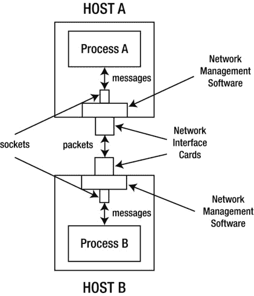

第章第十二章

访问网络

应用程序通常需要访问网络来获取资源(例如图像)或与远程可执行实体(例如 web 服务)通信。一个*网络*是一组互联的*节点*(计算设备如平板电脑和外围设备如扫描仪或激光打印机)，可以在网络用户之间共享。

**注意**内部网是位于一个组织内部的网络，而互联网是将组织相互连接起来的网络。互联网是网络的全球网络。

内部网和互联网经常使用*TC P/IP*()在节点之间进行通信。TCP/IP 包括*传输控制协议(TCP)* ，是面向连接的协议；*用户数据报协议(UDP)* ，无连接协议；以及*互联网协议(IP)* ，这是 TCP 和 UDP 执行其任务的基本协议。

java.net包提供了支持在相同或不同*主机*(基于计算机的 TCP/IP 节点)上运行的*进程*(执行应用程序)之间的 TCP/IP 的类型。在这一章中，我首先介绍了执行基于套接字和基于 URL 的通信的类型。然后，我将介绍底层网络接口和接口地址类型以及面向 cookie 的类型。

**注意**安卓应用必须获得访问网络的许可。在清单文件中包含<uses-permission Android:name = " Android . permission . internet "/>即可获得权限。

面向网络的应用程序经常要处理*字节序*()这个话题，指的是在一个较大的数据项的表示中，可单独寻址的子组件的排序。例如，给定一个 16 位的短整数，你是先传输最高有效字节还是最低有效字节？

通过套接字访问网络

两个进程通过*套接字*进行通信，套接字是这些进程之间通信链路的端点。每个端点由一个标识主机的 *IP 地址*和一个标识运行在该主机上的进程的*端口号*来标识。

IP 地址和端口号

*IP 地址*是 32 位或 128 位无符号整数，其唯一地标识网络主机或一些其他网络节点(例如，路由器)。

通常将 32 位 IP 地址指定为以句点分隔的十进制记数法表示的四个 8 位整数部分，其中每个部分是范围从 0 到 255 的十进制整数，并且通过句点(例如，127.0.0.1)与下一个部分分隔开。一个 32 位的 IP 地址通常被称为*互联网协议第 4 版(IPv4)地址* (参见【http://en.wikipedia.org/wiki/IPv4】)。

通常将 128 位 IP 地址指定为冒号分隔的十六进制表示法中的八个 16 位整数部分，其中每个部分都是从 0 到 FFFF 的十六进制整数，并通过冒号与下一个部分分隔开(例如，1080:0:0:0:8:800:200C:417A)。一个 128 位的 IP 地址通常被称为*互联网协议第 6 版(IPv6)地址* (参见【http://en.wikipedia.org/wiki/IPv6】)。

一个*端口号* 是一个 16 位的整数，唯一地标识一个进程，该进程是消息的最终来源或接收者。小于 1024 的端口号保留给标准进程。例如，端口号 25 传统上识别用于发送电子邮件的简单邮件传输协议(SMTP)进程，尽管端口号 587 已经在很大程度上淘汰了这个旧端口号(参见 http://en.wikipedia.org/wiki/Smtp)。

一个进程将一个*消息*(一个字节序列)写入它的套接字。底层平台的网络管理软件部分将消息分解成一系列的*数据包*(可寻址的消息块，通常被称为 *IP 数据报* )，并将它们转发到另一个进程的套接字，在那里它们被重新组合成原始消息进行处理。

图 12-1 显示了两个套接字如何在 TCP/IP 环境中通信。



[图 12-1](#_Fig1)T3。两个进程使用套接字进行通信

在[图 12-1](#Fig1) 的上下文中，假设进程 A 想要向进程 b 发送一条消息。进程 A 将该消息发送到其套接字，套接字带有进程 b 的目的套接字地址。主机 A 的网络管理软件(通常称为*协议栈* )获得该消息，并将其简化为一系列数据包，每个数据包都包括目的主机的 IP 地址和端口号。然后，网络管理软件通过主机 A 的网络接口卡(NIC) 将这些数据包发送到主机 b。

**注意**网卡的各种*网络接口*是计算机和网络之间的连接。

主机 B 的协议栈通过网卡接收数据包，并将它们重新组装成原始消息(数据包可能接收顺序错误)，然后通过套接字提供给进程 B。当进程 B 与进程 a 进行通信时，这种情况正好相反。

网络管理软件使用 TCP 在两台主机之间建立持续对话，在对话中来回发送消息。在此对话发生之前，这些主机之间会建立连接。建立连接后，TCP 进入一种模式，在这种模式下，它发送消息包并等待它们正确到达的回复(或者当回复由于某种网络问题而没有到达时，等待超时)。这种模式重复并保证可靠的连接。有关此模式的详细信息，请查看[http://en . Wikipedia . org/wiki/Tcp _ receive _ window # Flow _ control](http://en.wikipedia.org/wiki/Tcp_receive_window#Flow_control)。

因为建立连接需要时间，发送数据包也需要时间(因为接收应答确认是必要的，也因为超时)，所以 TCP 很慢。另一方面，不需要连接和数据包确认的 UDP 要快得多。缺点是 UDP 不太可靠(无法保证数据包的传送、排序或防止重复数据包，尽管 UDP 使用校验和来验证数据是否正确)，因为没有确认。此外，UDP 仅限于单包对话。

java.net包提供了套接字、服务器套接字和其他套接字后缀类，用于执行基于 TCP 或基于 UDP 的通信。在研究这些类之前，您需要理解套接字地址和套接字选项。

套接字地址

一个套接字后缀类的实例与一个由 IP 地址和端口号组成的*套接字地址* 相关联。这些类通常依靠 InetAddress 类来表示套接字地址的 IPv4 或 IPv6 地址部分，并分别表示端口号。

**注意** InetAddress 依赖其 Inet4Address 子类来表示 IPv4 地址，并依赖其 Inet6Address 子类来表示 IPv6 地址。

InetAddress 声明了几个类方法来获得一个 InetAddress 实例。这些方法包括以下内容:

*   inet address[]getAllByName(String host)返回一个 InetAddress es 数组，该数组存储了与主机相关联的 IP 地址。您可以向此参数传递域名(如" tutortutor.ca ")或 IP 地址(如"70.33.247.10")参数。(要了解域名，查看维基百科的“域名”条目[[http://en.wikipedia.org/wiki/Domain_name](http://en.wikipedia.org/wiki/Domain_name)])。传递 null 以获得一个 InetAddress 实例，该实例存储了 *loopback 接口*(一个基于软件的网络接口，传出数据作为传入数据返回)的 IP 地址。当找不到指定的主机的 IP 地址或者为全局 IPv6 地址指定了作用域标识符时，该方法抛出未知主机异常。
*   InetAddress getby address(byte[]addr)返回给定原始 IP 地址的 InetAddress 对象。传递给 addr 的参数按照*网络字节顺序*(最高有效字节在前)，其中最高顺序字节存储在 addr[0] 中。对于 IPv4 地址， addr 数组的长度必须是 4 个字节，对于 IPv6 地址必须是 16 个字节。当数组有另一个长度时，这个方法抛出 UnknownHostException 。
*   inet address getby address(String hostName，byte[] ipAddress) 根据主机名和 IP 地址参数返回一个 InetAddress 实例。当数组的长度既不是 4 也不是 16 时，该方法抛出 UnknownHostException 。
*   inet address get by name(String host)基于 host 参数返回一个 InetAddress 实例，该参数可以是一个机器名(如 "tutortutor.ca" )或其 IP 地址的文本表示。向主机传递 null 会导致返回一个表示环回接口地址的 InetAddress 实例。
*   inet address get LocalHost()返回*本地主机*(当前主机)的地址，用主机名 localhost 或 IP 地址表示，通常表示为 127.0.0.1 (IPv4)或::1 (IPv6)。当本地主机不能被解析成地址时，这个方法抛出 UnknownHostException 。

在您获得一个 InetAddress 实例后，您可以通过调用实例方法来询问它，例如 byte[] getAddress() ，它返回这个 InetAddress 对象的原始 IP 地址(按照网络字节顺序)，以及boolean is loopbackaddress()，它确定这个 InetAddress 实例是否代表一个环回地址。

Java 1.4 引入了抽象的 SocketAddress 类来表示“没有协议附件”的套接字地址(这个类的创建者可能已经预料到 Java 最终会支持低级别的通信协议，而不是广泛流行的 Internet 协议。)

SocketAddress 由具体的 InetSocketAddress 类子类化，将套接字地址表示为 IP 地址和端口号。它还可以表示主机名和端口号，并将尝试解析主机名。

InetSocketAddress 实例是通过调用InetSocketAddress(inet address addr，int port) 等构造函数创建的。创建实例后，可以调用 InetAddress getAddress() 和 int getPort() 等方法返回套接字地址组件。

插座选项

一个套接字后缀类的实例共享了*套接字选项*的概念，这些选项是用于配置套接字行为的参数。套接字选项由在 SocketOptions 接口中声明的常量描述:

*   IP_MULTICAST_IF :指定组播包的出网接口(在*多宿主*【多网卡】主机上)。Android 没有实现这个选项。
*   IP_MULTICAST_IF2 :使用接口索引指定多播数据包的输出网络接口。
*   IP_MULTICAST_LOOP :启用或禁用组播数据报的本地回环。
*   IP_TOS :为 TCP 或 UDP 套接字设置 IP 报头中的服务类型(IPv4)或流量类别(IPv6)字段。
*   SO_BINDADDR :获取套接字的本地地址绑定。Android 没有实现这个选项。
*   SO_BROADCAST :启用套接字发送广播消息。
*   SO_KEEPALIVE :开启 socket keepalive。
*   SO_LINGER :指定当还有一些缓冲数据要发送时，关闭套接字时等待的秒数。
*   SO_OOBINLINE :启用 TCP 紧急数据的内联接收。
*   SO_RCVBUF :设置或获取最大套接字接收缓冲区大小(以字节为单位)。
*   SO_REUSEADDR :启用套接字的重用地址。
*   SO_SNDBUF :设置或获取最大套接字发送缓冲区大小(以字节为单位)。
*   SO_TIMEOUT :指定阻塞接受或读取/接收(但不是写入/发送)套接字操作的超时时间(以毫秒为单位)。(永远不要挡！)
*   TCP_NODELAY :禁用 Nagle 算法()。换句话说，这个选项允许您在这个套接字上立即发送数据(但可能同样有效)。

SocketOptions 还声明了以下设置和获取这些选项的方法:

*   void setOption(int optID，Object value)
*   物体补片(int optID)

optID 是前述常数之一，值是合适类的对象(例如， java.lang.Boolean )。

SocketOptions 由抽象的 SocketImpl 和 DatagramSocketImpl 类实现。这些类的具体实例由各种套接字后缀的类包装。因此，您不能调用这些方法。相反，您使用由套接字提供的类型安全的 setter 和 getter 方法来设置和获取这些选项。

例如， Socket 声明 void setKeepAlive(布尔 keepAlive) 用于设置 SO_KEEPALIVE 选项， ServerSocket 声明void setSoTimeout(int time out)用于设置 SO_TIMEOUT 选项。查看关于套接字后缀类的文档，了解这些和其他套接字选项方法。

**注意**适用于 DatagramSocket 的 Socket 选项方法也适用于它的 MulticastSocket 子类。

套接字和服务器套接字

Socket 和 ServerSocket 类支持客户端进程(例如，运行在平板电脑上的应用程序)和服务器进程(例如，运行在互联网服务提供商的计算机上的应用程序，提供对万维网的访问)之间基于 TCP 的通信。因为套接字与 java.io.InputStream 和 java.io.OutputStream 类相关联，所以基于套接字类的套接字通常被称为*流套接字* 。

Socket 支持客户端 Socket的创建。为此，它声明了几个构造函数，包括下面的一对:

*   Socket(inet address dst address，int dstPort) 创建一个流套接字，在指定的 IP 地址(由 dstAddress 描述)连接到指定的端口号(由 dstPort 描述)。当创建套接字时发生 I/O 错误时，该构造函数抛出Java . io . io exception；Java . lang . illegalargumentexception当传递给 dstPort 的参数不在端口值的有效范围内，即 0 到 65535；以及 dstAddress 为 null 时的Java . lang . nullpointerexception。
*   Socket(String dstName，int dstPort) 创建一个流套接字，并将其连接到由 dstName 标识的主机上由 dstPort 标识的端口。当 dstName 为 null 时，这个构造函数相当于调用Socket(inet address . get byname(null)，port) 。它抛出与前面的构造函数相同的 IOException 和IllegalArgumentException实例。但是，它不是抛出 NullPointerException ，而是在无法确定主机的 IP 地址时抛出unknown hoste exception。

在通过这些构造函数创建了一个套接字实例之后，在连接到远程主机套接字地址之前，它被绑定到一个任意的本地主机套接字地址。*绑定*使客户机套接字地址对服务器套接字可用，以便服务器进程可以通过服务器套接字与客户机进程通信。

套接字提供了额外的构造函数。例如， Socket() 和 Socket(Proxy proxy) 创建未绑定和未连接的套接字。在使用这些套接字之前，必须通过调用void bind(Socket address local addr)将其绑定到本地套接字地址，然后必须通过调用 Socket 的 connect() 方法(例如void connect(Socket address remote addr))进行连接。

**注意***代理*是出于安全目的位于内部网和互联网之间的主机。代理设置通过代理类的实例来表示，帮助套接字通过代理进行通信。

另一个构造函数是Socket(inet address dst address，int dstPort，InetAddress localAddr，int localPort) ，它让你通过 localAddr 和 localPort 指定自己的本地主机套接字地址。该构造函数自动绑定到本地套接字地址，然后尝试连接到 dstAddress 上的远程 dstPort 。

在创建了一个 Socket 实例，并可能在该实例上调用了 bind() 和 connect() 之后，应用程序调用 Socket 的 InputStream getInputStream()和output stream getOutputStream()方法来获取从 Socket 读取字节的输入流和向 Socket 写入字节的输出流。此外，应用程序经常调用套接字的 void close() 方法 来关闭不再需要 I/O 的套接字。

以下示例演示了如何在本地主机上创建一个绑定到端口号 9999 的套接字，然后访问其输入和输出流—为简洁起见，将忽略异常:

```java
Socket socket = new Socket("localhost", 9999);
InputStream is = socket.getInputStream();
OutputStream os = socket.getOutputStream();
// Do some work with the socket.
socket.close();

```

ServerSocket 支持创建服务器端套接字。为此，它声明了以下四个构造函数:

*   ServerSocket() 创建未绑定的服务器套接字。通过调用 ServerSocket 的两个 bind() 方法中的任何一个，可以将这个套接字绑定到一个特定的套接字地址(客户端套接字与之通信)。*绑定*使服务器套接字地址对客户端套接字可用，以便客户端进程可以通过客户端套接字与服务器进程通信。当试图打开套接字时发生 I/O 错误时，该构造函数抛出 IOException 。
*   ServerSocket(int port) 创建一个服务器套接字，该套接字绑定到指定的端口值和与主机的一个网卡相关联的 IP 地址。当您通过 0 到端口时，会选择一个任意端口号。可以通过调用 int getLocalPort() 来检索端口号。来自客户端的传入连接请求的最大队列长度设置为 50。如果连接请求在队列已满时到达，连接将被拒绝。当试图打开套接字时发生 I/O 错误时，该构造函数抛出 IOException ，当 port 的值超出指定的有效端口值范围(0 到 65535，包括 0 和 65535)时，该构造函数抛出IllegalArgumentException。
*   ServerSocket(int port，int backlog) 相当于前面的构造函数，但是它也允许您通过向 backlog 传递一个正整数来指定传入连接的最大队列长度。
*   ServerSocket(int port，int backlog，InetAddress localAddress) 相当于前面的构造函数，但它也允许您指定服务器套接字绑定到的不同 IP 地址。(当通过 null 时，选择任何地址。)这个构造函数对于有多个网卡的机器很有用，并且您希望在特定的网卡上监听连接请求。

通过这些构造函数创建服务器套接字后，服务器应用程序进入一个循环，首先调用服务器套接字的套接字接受()方法 来监听连接请求，并返回一个套接字实例，让它与相关的客户端套接字进行通信。然后，它与客户端套接字进行通信，以执行某种处理。当处理完成时，服务器套接字调用客户端套接字的 close() 方法 来终止它与客户端的连接。

**注意** ServerSocket 声明了一个 void close() 方法，用于在终止服务器应用程序之前关闭服务器套接字。当应用程序终止时，未关闭的套接字会自动关闭。

以下示例演示了如何在当前主机上创建一个绑定到端口 9999 的服务器套接字，侦听传入的连接请求，返回它们的套接字，在这些套接字上执行工作，以及关闭套接字—为简洁起见，将忽略异常:

```java
ServerSocket ss = new ServerSocket(9999);
while (true)
{
   Socket socket = ss.accept();
   // obtain socket input/output streams and communicate with socket
   socket.close();
}

```

accept() 方法 调用阻塞，直到有连接请求可用，然后返回一个套接字对象，以便服务器应用程序可以与其关联的客户端通信。通信发生后，套接字被关闭。当应用程序退出时，服务器套接字会自动关闭。

这个例子假设套接字通信发生在服务器应用程序的主线程上，这在处理需要时间来执行时是一个问题，因为服务器对传入连接请求的响应时间减少了。为了加快响应时间，通常需要与工作线程上的套接字进行通信，如下例所示:

```java
ServerSocket ss = new ServerSocket(9999);
while (true)
{
   final Socket s = ss.accept();
   new Thread(new Runnable()
              {
                 @Override
                 public void run()
                 {
                    // obtain socket input/output streams and communicate with socket
                    try { s.close(); } catch (IOException ioe) {}
                 }
              }).start();
}

```

每当一个连接请求到达， accept() 返回一个 socket 实例，然后创建一个 java.lang.Thread 对象，它的 runnable 访问那个 Socket，以便与工作线程上的 Socket 进行通信。

**提示**虽然这个例子使用了线程类，但是你也可以使用一个执行器(参见[第 10 章](10.html))来代替。

我已经创建了 EchoClient 和 EchoServer 应用程序，演示了 Socket 和 ServerSocket 。清单 12-1 展示了 EchoClient 的源代码。

[清单 12-1。](#_list1)向服务器回显数据并从服务器接收数据

```java
import java.io.BufferedReader;
import java.io.InputStream;
import java.io.InputStreamReader;
import java.io.IOException;
import java.io.OutputStream;
import java.io.OutputStreamWriter;
import java.io.PrintWriter;

import java.net.Socket;
import java.net.UnknownHostException;

public class EchoClient
{
   public static void main(String[] args)
   {
      if (args.length != 1)
      {
         System.err.println("usage  : java EchoClient message");
         System.err.println("example: java EchoClient \"This is a test.\"");
         return;
      }
      try
      {
         Socket socket = new Socket("localhost", 9999);
         OutputStream os = socket.getOutputStream();
         OutputStreamWriter osw = new OutputStreamWriter(os);
         PrintWriter pw = new PrintWriter(osw);
         pw.println(args[0]);
         pw.flush();
         InputStream is = socket.getInputStream();
         InputStreamReader isr = new InputStreamReader(is);
         BufferedReader br = new BufferedReader(isr);
         System.out.println(br.readLine());
      }
      catch (UnknownHostException uhe)
      {
         System.err.println("unknown host: " + uhe.getMessage());
      }
      catch (IOException ioe)
      {
         System.err.println("I/O error: " + ioe.getMessage());
      }
   }
}

```

EchoClient 首先验证它已经收到了一个命令行参数，然后创建一个套接字，该套接字将连接到本地主机的端口 9999 上运行的进程。

创建套接字后， EchoClient 获得一个输出流，用于向套接字写入字符串。因为输出流只能处理一个字节序列，所以Java . io . output streamwriter和 java.io.PrintWriter 类(参见[第 11 章](11.html))用于将输出字符的编写器连接到面向字节的输出流。

在实例化了 PrintWriter 之后， EchoClient 调用其 void println(String str) 方法来编写后跟换行符的字符串。随后调用 void flush() 方法 以确保所有未决数据都被写入服务器。

EchoClient 现在获得一个输入流，用于读取作为字节序列的字符串。然后它通过实例化Java . io . inputstreamreader和 java.io.BufferedReader 将阅读器(输入字符)连接到面向字节的输入流(参见[第 11 章](11.html))。

最后， EchoClient 调用 BufferedReader 的 String readLine() 方法从套接字中读取后跟换行符的字符。( readLine() 在返回的字符串中不包含换行符。)这些字符后跟一个换行符，然后被写入标准输出。

**注意**在一个长时间运行的应用程序中，当不再需要套接字时，可以通过调用其 void close() 方法来显式关闭套接字实例。为了简洁起见，我选择在这个和大多数剩余的 Socket 后缀的类示例中不这样做。

[清单 12-2](#list2) 展示了EchoServerT4的源代码。

[清单 12-2。](#_list2)从客户端接收数据并将其发送回客户端

```java
import java.io.BufferedReader;
import java.io.InputStream;
import java.io.InputStreamReader;
import java.io.IOException;
import java.io.OutputStream;
import java.io.OutputStreamWriter;
import java.io.PrintWriter;

import java.net.ServerSocket;
import java.net.Socket;

public class EchoServer
{
   public static void main(String[] args) throws IOException
   {
      System.out.println("Starting echo server. . .");
      ServerSocket ss = new ServerSocket(9999);
      while (true)
      {
         Socket s = ss.accept();
         try
         {
            InputStream is = s.getInputStream();
            InputStreamReader isr = new InputStreamReader(is);
            BufferedReader br = new BufferedReader(isr);
            String msg = br.readLine();
            System.out.println(msg);
            OutputStream os = s.getOutputStream();
            OutputStreamWriter osw = new OutputStreamWriter(os);
            PrintWriter pw = new PrintWriter(osw);
            pw.println(msg);
            pw.flush();
         }
         catch (IOException ioe)
         {
            System.err.println("I/O error: " + ioe.getMessage());
         }
         finally
         {
            try
            {
               s.close();
            }
            catch (IOException ioe)
            {
               assert false; // shouldn't happen in this context
            }
         }
      }
   }
}

```

EchoServer 首先向标准输出输出一个介绍性的消息，然后创建一个服务器套接字来监听端口 9999 上的连接。然后它进入一个无限循环，其中每次迭代调用 ServerSocket 的 Socket accept() 方法进行阻塞，直到接收到一个连接，然后返回一个代表这个连接的 Socket 对象。

获得套接字后， EchoServer 获得一个输入流，用于从套接字中读取。因为输入流只能处理一个字节序列，所以使用 InputStreamReader 和 BufferedReader 类将输入字符的阅读器连接到面向字节的输入流。

EchoServer 现在获得一个输出流，用于将字符串写成一个字节序列。然后它通过实例化 OutputStreamWriter 和 PrintWriter 将输出字符的编写器连接到面向字节的输出流。

将消息输出到标准输出后， EchoServer 调用 flush() 将输出刷新到客户端。然后关闭客户端套接字。

为了试验这些应用程序，将 EchoClient.java 和 EchoServer.java 复制到同一个目录，并打开两个当前目录的控制台窗口。编译每个源文件并在一个窗口中执行Java echo server—您应该会看到一条介绍性消息，尽管您可能首先需要在*防火墙*([http://en . Wikipedia . org/wiki/Firewall _(computing](http://en.wikipedia.org/wiki/Firewall_(computing)))上启用端口 9999。启动服务器后，回显以下命令，将文本回显到两个窗口:

```java
java EchoClient "This is a test."

```

你应该注意到这是一个测试。"在两个窗口中。

DatagramSocket 和多播 Socket

DatagramSocket 和 MulticastSocket 类让您可以在一对主机( DatagramSocket )或多个主机( MulticastSocket )之间执行基于 UDP 的通信。使用任何一个类，您都可以通过*数据报包* 传递单向消息，这些数据报包是与 DatagramPacket 类的实例相关联的字节数组。

**注意**虽然你可能认为 Socket 和 ServerSocket 就是你所需要的，但是 DatagramSocket (及其 MulticastSocket 子类)有它们的用途。例如，考虑一个场景，其中一组机器需要偶尔告诉服务器它们还活着。偶尔丢失消息或者消息没有按时到达都没有关系。另一个例子是周期性广播股票价格的低优先级股票报价机。当一个包裹没有到达时，很可能下一个包裹会到达，然后你会收到最新价格的通知。在实时应用程序中，及时的交付比可靠或有序的交付更重要。

DatagramPacket 声明了几个构造函数，其中 DatagramPacket(byte[] buf，int length) 是最简单的。这个构造函数要求你将字节数组和整数参数传递给 buf 和 length ，其中 buf 是存储要发送或接收的数据的数据缓冲区， length (必须小于或等于 buf.length )指定要发送/接收的字节数(从buf[0】开始)。

下面的示例演示了此构造函数:

```java
byte[] buffer = new byte[100];
DatagramPacket dgp = new DatagramPacket(buffer, buffer.length);

```

**注意**额外的构造函数让你在 buf 中指定一个偏移量，用来标识第一个传出或传入字节的存储位置，和/或让你指定一个目的套接字地址。

DatagramSocket 描述了 UDP 通信链路的客户端或服务器端的套接字。虽然这个类声明了几个构造函数，但我发现在本章中使用客户端的 DatagramSocket() 构造函数和服务器端的 DatagramSocket(int port) 构造函数很方便。当无法创建数据报套接字或将数据报套接字绑定到本地端口时，任一构造函数都会抛出 SocketException 。

应用实例化 DatagramSocket 后，调用void send(datagram packet DGP)和void receive(datagram packet DGP)发送和接收数据报包。

清单 12-3 展示了服务器环境中的 DatagramPacket 和 DatagramSocket 。

[清单 12-3。](#_list3)从客户端接收数据报数据包，并将它们回显到客户端

```java
import java.io.IOException;

import java.net.DatagramPacket;
import java.net.DatagramSocket;
import java.net.SocketException;

public class DGServer
{
   final static int PORT = 10000;

   public static void main(String[] args) throws SocketException
   {
      System.out.println("Server is starting");
      DatagramSocket dgs = new DatagramSocket(PORT);
      try
      {
         System.out.println("Send buffer size = " + dgs.getSendBufferSize());
         System.out.println("Receive buffer size = " +
                            dgs.getReceiveBufferSize());
         byte[] data = new byte[100];
         DatagramPacket dgp = new DatagramPacket(data, data.length);
         while (true)
         {
            dgs.receive(dgp);
            System.out.println(new String(data));
            dgs.send(dgp);
         }
      }
      catch (IOException ioe)
      {
         System.err.println("I/O error: " + ioe.getMessage());
      }
   }
}

```

[清单 12-3](#list3) 的 main() 方法首先创建一个 DatagramSocket 对象，并将套接字绑定到本地主机上的端口 10000。然后它调用 DatagramSocket 的 int getSendBufferSize() 和int getReceiveBufferSize()方法来获取 SO_SNDBUF 和 SO_RCVBUF 套接字选项的值，然后输出这些值。

**注意**套接字与底层平台发送和接收缓冲区相关联，通过调用 getSendBufferSize() 和 getReceiveBufferSize() 来访问它们的大小。同样，它们的大小可以通过调用 DatagramSocket 的void setReceiveBufferSize(int size)和void setSendBufferSize(int size)方法来设置。虽然您可以调整这些缓冲区的大小来提高性能，但是 UDP 有一个实际的限制。在 IPv4 下，可以发送或接收的 UDP 数据包的最大大小是 65，507 字节，这是从 65，535 减去 8 字节 UDP 头和 20 字节 IP 头值得出的。虽然您可以指定一个更大的发送/接收缓冲区值，但这样做是浪费，因为最大的数据包被限制为 65，507 字节。此外，试图发送或接收缓冲区长度超过 65，507 字节的数据包会导致 IOException 。

main() 接下来实例化 DatagramPacket 以准备从客户端接收数据报分组，然后将该分组回送到客户端。它假设数据包的大小不超过 100 字节。

最后， main() 进入一个无限循环，接收一个包，输出包内容，并将包发送回客户端——客户端的寻址信息存储在 DatagramPacket 中。

编译[清单 12-3](#list3)(javac DGServer.java)并运行应用程序( java DGServer )。您应该观察到与如下所示相同或相似的输出:

```java
Server is starting
Send buffer size = 8192
Receive buffer size = 8192

```

清单 12-4 演示了客户端上下文中的 DatagramPacket 和 DatagramSocket 。

[列表 12-4。](#_list4)向服务器发送数据报数据包并从服务器接收数据包

```java
import java.io.IOException;

import java.net.DatagramPacket;
import java.net.DatagramSocket;
import java.net.InetAddress;
import java.net.SocketException;

public class DGClient
{
   final static int PORT = 10000;
   final static String ADDR = "localhost";

   public static void main(String[] args) throws SocketException
   {
      System.out.println("client is starting");
      DatagramSocket dgs = new DatagramSocket();
      try
      {
         byte[] buffer;
         buffer = "Send me a datagram".getBytes();
         InetAddress ia = InetAddress.getByName(ADDR);
         DatagramPacket dgp = new DatagramPacket(buffer, buffer.length, ia,
                                                 PORT);
         dgs.send(dgp);
         byte[] buffer2 = new byte[100];
         dgp = new DatagramPacket(buffer2, buffer.length, ia, PORT);
         dgs.receive(dgp);
         System.out.println(new String(dgp.getData()));
      }
      catch (IOException ioe)
      {
         System.err.println("I/O error: " + ioe.getMessage());
      }
   }
}

```

清单 12-4 类似于[清单 12-3](#list3) ，但是有一个很大的不同。我使用 DatagramPacket(byte[] buf，int length，InetAddress，int port) 构造函数在数据报包中指定服务器的目的地，这个目的地恰好是本地主机上的端口 10000。 send() 方法调用将数据包路由到这个目的地。

编译[清单 12-4](#list4)(javac DGClient.java)并运行应用程序( java DGClient )。假设 DGServer 也在运行，您应该在 DGClient 的命令窗口中观察到以下输出(以及 DGServer 的命令窗口中该输出的最后一行):

```java
client is starting
Send me a datagram

```

多播套接字 描述基于 UDP 的多播会话的客户端或服务器端的套接字。两个常用的构造函数是 MulticastSocket() (创建一个不绑定到端口的组播套接字)和 MulticastSocket(int port) (创建一个绑定到指定端口的组播套接字)。当发生 I/O 错误时，任一构造函数都会抛出 IOException 。

什么是多播？

前面的例子已经演示了*单播*，它发生在服务器向单个客户端发送消息的时候。然而，也可以向多个客户端广播相同的消息(例如，向已经向在线程序注册以接收该通知的一组家长的所有成员发送“学校因恶劣天气关闭”通知)；这个活动被称为*多播*。

服务器通过向一个特殊的 IP 地址(称为*多播组地址* )和一个特定的端口(由端口号指定)发送一系列数据报分组来进行多播。想要接收这些数据报数据包的客户端创建一个使用该端口号的多播套接字。他们通过指定特殊 IP 地址的*加入群组操作*请求加入群组。此时，客户端可以接收发送到该组的数据报数据包，甚至可以向其他组成员发送数据报数据包。在客户端已经读取了它想要读取的所有数据报分组之后，它通过应用指定特殊 IP 地址的*离开组操作*将自己从组中移除。

IPv4 地址 224.0.0.1 到 239.255.255.255(含)保留用作多播组地址。

清单 12-5 展示了一个组播服务器。

[清单 12-5。](#_list5)多播数据报数据包

```java
import java.io.IOException;

import java.net.DatagramPacket;
import java.net.InetAddress;
import java.net.MulticastSocket;

public class MCServer
{
   final static int PORT = 10000;

   public static void main(String[] args)
   {
      try
      {
         MulticastSocket mcs = new MulticastSocket();
         InetAddress group = InetAddress.getByName("231.0.0.1");
         byte[] dummy = new byte[0];
         DatagramPacket dgp = new DatagramPacket(dummy, 0, group, PORT);
         int i = 0;
         while (true)
         {
            byte[] buffer = ("line " + i).getBytes();
            dgp.setData(buffer);
            dgp.setLength(buffer.length);
            mcs.send(dgp);
            i++;
         }
      }
      catch (IOException ioe)
      {
         System.err.println("I/O error: " + ioe.getMessage());
      }
   }
}

```

[清单 12-5](#list5) 的 main() 方法首先通过 MulticastSocket() 构造函数创建一个 MulticastSocket 实例。多播套接字不需要绑定到端口号，因为端口号是作为随后创建的 DatagramPacket 实例的一部分与多播组的 IP 地址(231.0.0.1)一起指定的。(虚拟数组的存在是为了防止 NullPointerException 对象从 DatagramPacket 构造函数中抛出——该数组不用于存储要广播的数据。)

此时， main() 进入一个无限循环，首先从一个 java.lang.String 实例创建一个字节数组，并使用平台的默认字符编码(参见[第 11 章](11.html))将 Unicode 字符转换成字节。(尽管无关的 java.lang.StringBuilder 和 String 对象是通过表达式 "line" + i 在每次循环迭代中创建的，但我并不担心它们对这个简短的一次性应用程序中的垃圾收集的影响。)

随后通过调用 void setData(byte[] buf) 方法将该数据缓冲区分配给 DatagramPacket 实例，然后将数据报数据包广播给与端口 10000 和组播 IP 地址 231.0.0.1 相关联的组的所有成员。

编译[清单 12-5](#list5)(javac MCServer.java)并运行这个应用程序( java MCServer )。你不应该观察任何输出。

清单 12-6 展示了一个组播客户端。

[清单 12-6。](#_list6)接收多播数据报数据包

```java
import java.io.IOException;

import java.net.DatagramPacket;
import java.net.InetAddress;
import java.net.MulticastSocket;

public class MCClient
{
   final static int PORT = 10000;

   public static void main(String[] args)
   {
      try
      {
         MulticastSocket mcs = new MulticastSocket(PORT);
         InetAddress group = InetAddress.getByName("231.0.0.1");
         mcs.joinGroup(group);
         for (int i = 0; i < 10; i++)
         {
            byte[] buffer = new byte[256];
            DatagramPacket dgp = new DatagramPacket(buffer, buffer.length);
            mcs.receive(dgp);
            byte[] buffer2 = new byte[dgp.getLength()];
            System.arraycopy(dgp.getData(), 0, buffer2, 0, dgp.getLength());
            System.out.println(new String(buffer2));
         }
         mcs.leaveGroup(group);
      }
      catch (IOException ioe)
      {
         System.err.println("I/O error: " + ioe.getMessage());
      }
   }
}

```

[清单 12-6](#list6) 的 main() 方法首先通过 MulticastSocket(int port) 构造函数创建一个绑定到端口 10000 的 MulticastSocket 实例。

然后它获得一个包含组播组 IP 地址 231.0.0.1 的 InetAddress 对象，并通过调用 MulticastSocket 的void join group(inet address mcastaddr)方法使用该对象加入该地址的组。

main() 接下来接收 10 个数据报包，打印它们的内容，并通过调用 MulticastSocket 的void leave group(inet address mcastaddr)方法以相同的组播 IP 地址作为参数来离开组。

**注意** joinGroup() 和 leaveGroup() 当试图加入或离开组时发生 I/O 错误，或者当 IP 地址不是多播 IP 地址时，抛出 IOException 。

因为客户端不知道字节数组到底有多长，所以它假设 256 个字节来确保数据缓冲区能够容纳整个数组。如果它试图打印出返回的数组，在实际数据被打印出来后，您会看到许多空白空间。

为了消除这个空间，客户端调用 DatagramPacket 的 int getLength() 方法来获得数组的实际长度，创建具有该长度的第二个字节数组( buffer2 )，并使用system . array copy()—[第 8 章](08.html)中讨论的方法——将这个字节复制到 buffer2 。在将这个字节数组转换成一个字符串对象后(通过字符串(byte[] bytes) 构造函数，它使用平台的默认字符集——参见[第 11 章](11.html)了解字符集)，它将结果字符打印到标准输出流。

编译[清单 12-6](#list6)(【MCClient.java】T2)并运行这个应用程序( java MCClient )。您应该观察到类似如下的输出:

```java
line 462615
line 462616
line 462617
line 462618
line 462619
line 462620
line 462621
line 462622
line 462623
line 462624

```

通过 URL 访问网络

*统一资源定位符(URL)* 是指定资源(例如，网页)在基于 TCP/IP 的网络(例如，因特网)上的位置的字符串。此外，它还提供了检索该资源的方法。例如，[http://tutortutor . ca](http://tutortutor.ca)是一个定位我的网站主页的 URL。 http:// 前缀指定必须使用*超文本传输协议(http)* 来检索位于 tutortutor.ca 的网页，该协议是位于 TCP/IP 之上的用于定位 HTTP 资源(例如网页)的高级协议。

urn 和 uri

*统一资源名称(URN)* 是一个字符串，它命名一个资源，但不提供访问该资源的方法(该资源可能不可用)。例如， urn:isbn:9781430231561 识别出一本名为*Learn Java for Android Development*的进度书，仅此而已。

urn 和 URL 是*统一资源标识符(URIs)* 的例子，是用于标识名称(urn)和资源(URL)的字符串。每个骨灰盒和网址也是一个 URI。

java.net包提供了用于访问基于 URL 的资源的 URL 和 URLConnection 类。它还提供了用于编码和解码 URL 的 URLEncoder 和 URLDecoder 类，以及用于执行基于 URI 的操作(例如，相对化)并返回包含结果的 URL 实例的 URI 类。为了简洁起见，我在本章中不讨论 URI 。

URL 和 URLConnection

URL 类表示 URL，并提供对它们所引用的资源的访问。每个 URL 实例明确地标识一个互联网资源。

URL 声明了几个构造函数，其中 URL(String s) 是最简单的。该构造函数从传递给 s 的字符串参数中创建一个 URL 实例，演示如下:

```java
try
{
   URL url = new URL(" [http://tutortutor.ca](http://tutortutor.ca) ");
}
catch (MalformedURLException murle)
{
   // handle the exception
}

```

本例创建一个使用 HTTP 访问位于 [的网页的 URL 对象 http://tutortutor.ca](http://tutortutor.ca) 。如果我指定了一个非法的 URL(例如， foo ，构造函数将抛出malformedurexception(一个 IOException 子类)。

虽然您通常会指定 http:// 作为协议前缀，但这不是您唯一的选择。例如，当资源位于本地主机上时，您还可以指定文件:/// 。此外，当资源存储在 jar 文件中时，您可以将 jar: 添加到 http:// 或 file:/// 的前面，如下所示:

```java
jar:file:///C:./rt.jar!/java/util/Timer.class

```

jar: 前缀表示您想要访问一个 jar 文件资源(例如，一个存储的类文件)。 file:/// 前缀标识本地主机的资源位置，在本例中是 Windows C:硬盘上当前目录中的 rt.jar (Java 5 的运行时 jar 文件)。

JAR 文件的路径后面跟一个感叹号(！)将 JAR 文件路径与 JAR 资源路径分开，JAR 资源路径恰好是这个 JAR 文件中的/Java/util/timer . classclass file 条目(需要前导的 / 字符)。

**注意**Oracle 的 Java 参考实现中的 URL 类支持附加协议，包括 ftp 。

在创建了一个 URL 对象之后，您可以调用各种 URL 方法来访问 URL 的各个部分。例如， String getProtocol() 返回 URL 的协议部分(例如， http )。还可以通过调用 InputStream openStream() 方法来检索资源。

openStream() 创建一个到资源的连接，并返回一个 InputStream 实例，用于从该连接读取资源数据，如下所示:

```java
InputStream is = url.openStream();
int ch;
while ((ch = is.read()) != −1)
   System.out.print((char) ch);

```

**注意**对于 HTTP 连接，会创建一个内部套接字，该套接字连接到通过 URL 的域名/IP 地址标识的服务器上的 HTTP 端口 80，除非您在域名/IP 地址后附加一个不同的端口号(例如，[HTTP://tutortutor . ca:8080](http://tutortutor.ca:8080))。

我已经创建了一个 ListResource 应用程序，通过使用这个类获取资源并列出其内容来演示 URL 。清单 12-7 展示了 ListResource 的源代码。

[清单 12-7。](#_list7)列出通过 URL 命令行参数识别的资源的内容

```java
import java.io.InputStream;
import java.io.IOException;

import java.net.MalformedURLException;
import java.net.URL;

public class ListResource
{
   public static void main(String[] args)
   {
      if (args.length != 1)
      {
         System.err.println("usage: java ListResource url");
         return;
      }
      try
      {
         URL url = new URL(args[0]);
         InputStream is = url.openStream();
         try
         {
            int ch;
            while ((ch = is.read()) != −1)
               System.out.print((char) ch);
         }
         catch (IOException ioe)
         {
            is.close();
         }
      }
      catch (MalformedURLException murle)
      {
         System.err.println("invalid URL");
      }
      catch (IOException ioe)
      {
         System.err.println("I/O error: " + ioe.getMessage());
      }
   }
}

```

ListResource 首先验证它已经收到了一个命令行参数，然后试图用这个参数实例化 URL 。假设 URL 是有效的，这意味着malformedurexception没有被抛出， ListResource 调用 URL 实例上的 openStream() ，并继续将资源内容列出到标准输出中。

编译这段源代码(javac ListResource.java)并执行Java list resource[http://tutortutor . ca](http://tutortutor.ca)。以下输出显示了返回网页的短前缀:

```java
<!DOCTYPE html PUBLIC "-//W3C//DTD HTML 4.01//EN" " [http://www.w3.org/TR/html4/strict.dtd](http://www.w3.org/TR/html4/strict.dtd) ">

<html>
  <head>
    <title>
      TutorTutor -- /main
    </title>

    <link rel="stylesheet" href="/shared/styles.css" media="screen">
. . .

```

openStream() 是一个调用 openConnection()的便捷方法。getInputStream() 。每个 URL 的URL connection open connection()和URL connection open connection(Proxy Proxy)方法都返回一个 URLConnection 类的实例，它代表应用程序和 URL 之间的通信链接。

URLConnection 为您提供了对客户端/服务器通信的额外控制。例如，您可以使用此类将内容输出到接受内容的各种资源。相比之下， URL 只让你通过 openStream() 输入内容。

URLConnection 声明了各种方法，包括:

*   InputStream getInputStream()返回从这个打开的连接中读取的输入流。
*   output stream get output stream()返回写入这个打开的连接的输出流。
*   void setDoInput(boolean doInput)指定这个 URLConnection 对象支持(传递真到 doInput )或者不支持(传递假到 doInput )输入。因为 true 是默认值，所以您只需将 true 传递给该方法，以记录您执行输入的意图。
*   void setdoooutput(boolean doooutput)指定这个 URLConnection 对象支持(传递真到doooutput)或者不支持(传递假到doooutput)输出。因为默认值为 false，所以必须先调用此方法，然后才能执行输出。
*   void setRequestProperty(String field，String newValue) 设置请求属性(如 HTTP 的 accept 属性)。当字段已经存在时，其值将被指定的值覆盖。

下面的例子展示了如何从预先创建的 url 变量引用的 URL 对象中获取一个 URLConnection 对象，启用其dooput属性，并获取一个输出流以写入资源:

```java
URLConnection urlc = url.openConnection();
urlc.setDoOutput(true);
OutputStream os = urlc.getOutputStream();

```

URLConnection 被HttpURLConnectionT5】和 JarURLConnection 子类化。这些类声明特定于使用 HTTP 协议或与基于 JAR 的资源交互的常量和/或方法。

**注意**为了简洁起见，我建议您参考关于 URLConnection 、 HttpURLConnection 和 JarURLConnection 的 Java 文档，以了解关于这些类的更多信息。

URLEncoder 和 URLDecoder

超文本标记语言(HTML)允许您将表单引入网页，向页面访问者请求信息。填写完表单的字段后，访问者单击表单的 Submit 按钮(它可以指定除 Submit 之外的内容),表单内容(字段名称和值)被发送到服务器程序。在发送表单内容之前，web 浏览器通过替换空格和其他 URL 非法字符对该数据进行编码，并将内容的 Internet 媒体类型(也称为多用途 Internet 邮件扩展[MIME]类型)设置为application/x-www-form-urlencoded。

**注意**数据是为 HTTP POST 和 HTTP GET 操作编码的。与 POST 不同，GET 需要一个*查询字符串* (a？-包含编码内容的前缀字符串)附加到服务器程序的 URL。

java.net包提供了 URLEncoder 和 URLDecoder 类来帮助你完成编码和解码表单内容的任务。

URLEncoder 应用以下编码规则:

*   字母数字字符“A”到“Z”、“A”到“Z”以及“0”到“9”保持不变。
*   特殊字符。“、“-”、“*”和“_”保持不变。
*   空格字符“”被转换为加号“+”。
*   所有其他字符都是不安全的，首先使用某种编码方案将其转换为 1 个或更多字节。然后，每个字节由三个字符的字符串% *xy* 表示，其中 *xy* 是该字节的 2 位十六进制表示。推荐使用的编码方案是 UTF-8。然而，出于兼容性原因，当没有指定编码时，使用平台的默认编码。

例如，使用 UTF-8 作为编码方案，字符串 "string ü@foo-bar" 转换为" string+% C3 % BC % 40 foo-bar "。在 UTF-8 中，字符ü编码为 2 字节 C3(十六进制)和 BC(十六进制)；字符@被编码为 1 字节 40(十六进制)。

URLEncoder 声明了以下用于编码字符串的类方法:

```java
String encode(String s, String enc)

```

该方法使用由 enc 指定的编码方案，将传递给 s 的字符串参数翻译成application/x-www-form-urlencoded格式。它使用提供的编码方案来获取不安全字符的字节，并在不支持 enc 的值时抛出Java . io . unsupportedencodingexception。

URLDecoder 应用以下解码规则:

*   字母数字字符“A”到“Z”、“A”到“Z”以及“0”到“9”保持不变。
*   特殊字符。“、“-”、“*”和“_”保持不变。
*   加号“+”被转换为空格字符“”。
*   % *xy* 形式的序列将被视为表示一个字节，其中 *xy* 是 8 位的 2 位十六进制表示。然后，所有连续包含一个或多个这些字节序列的子字符串将被其编码将产生这些连续字节的字符所替换。可以指定用于解码这些字符的编码方案；未指定时，使用平台的默认编码。

URLDecoder 声明了以下用于解码编码字符串的类方法:

```java
String decode(String s, String enc)

```

这个方法使用由 enc 指定的编码方案解码一个application/x-www-form-urlencoded字符串。提供的编码用于确定% *xy* 形式的任何连续序列代表什么字符。不支持 enc 的值时抛出 UnsupportedEncodingException。

解码器处理非法编码的字符串有两种可能的方式。它要么不处理非法字符，要么抛出 IllegalArgumentException 。解码器采用哪种方法由实现来决定。

**注**环球网联盟推荐([www.w3.org/TR/html40/appendix/notes.html#non-ascii-chars](http://www.w3.org/TR/html40/appendix/notes.html#non-ascii-chars))UTF-8 作为 encode() 和 decode() 的编码方案。不这样做可能会引入不兼容性。

我已经创建了一个 ED (编码/解码)应用程序，在前面的 "string ü@foo-bar" 和" string+% C3 % BC % 40 foo-bar "示例的上下文中演示了 URLEncoder 和 URLDecoder 。清单 12-8 给出了应用程序的源代码。

[清单 12-8。](#_list8)对编码字符串进行编码和解码

```java
import java.io.UnsupportedEncodingException;

import java.net.URLDecoder;
import java.net.URLEncoder;

public class ED
{
   public static void main(String[] args) throws UnsupportedEncodingException
   {
      String encodedData = URLEncoder.encode("string ü@foo-bar", "UTF-8");
      System.out.println(encodedData);
      System.out.println(URLDecoder.decode(encodedData, "UTF-8"));
   }
}

```

当您运行此应用程序时，它会生成以下输出:

```java
string+%C3%BC%40foo-bar
string ü@foo-bar

```

**注意**查看维基百科的“百分比编码”主题([【http://en.wikipedia.org/wiki/Percent-encoding】](http://en.wikipedia.org/wiki/Percent-encoding))以了解更多关于 URL 编码的信息(以及更准确的百分比编码术语)。

访问网络接口和接口地址

NetworkInterface 类根据名称(例如 le0 )和分配给该接口的 IP 地址列表来表示网络接口。虽然网络接口通常在物理网卡上实现，但它也可以在软件中实现；例如*环回接口*(这对测试客户端很有用)。

[表 12-1](#Tab1) 给出了网络接口的方法。

[表 12-1](#_Tab1) 。网络接口方法

| 方法 | 描述 |
| --- | --- |
| 布尔等于(对象对象) | 将这个网络接口对象与对象进行比较。当且仅当对象不是 null 并且表示与该对象相同的网络接口时，结果为真。(当两个 NetworkInterface 对象的名称和地址相同时，表示同一个网络接口。) |
| 静态网络接口 getByInetAddress(InetAddress 地址) | 返回给定的地址对应的网络接口，如果没有接口有该地址则返回空。该方法在发生 I/O 错误时抛出 SocketException ，在地址为 null 时抛出 NullPointerException 。 |
| 静态网络接口 getByName(字符串接口名称) | 返回带有指定名称的网络接口，如果没有该网络接口则返回 null。该方法在 I/O 错误时抛出 SocketException ，当 interfaceName 为 null 时抛出 NullPointerException 。 |
| 字符串 getDisplayName（） | 返回这个网络接口的*显示名称*(描述网络设备的可读字符串)。在 Android 上，这是由 getName() 返回的相同字符串。 |
| 字节[]get 硬件地址() | 返回包含该网络接口硬件地址的字节数组，该地址通常被称为*媒体访问控制(MAC)* 地址。当接口没有 MAC 地址，或者无法访问该地址时(可能用户没有足够的权限)，该方法返回 null。当一个 I/O 错误发生时，这个方法抛出 SocketException 。 |
| 枚举<inetaddress>getinetddress() | 返回一个*枚举*(一次迭代的结果)，其中包含绑定到该网络接口的所有地址或其子集。 |
| 清单<介面位址> getInterfaceAddresses() | 返回一个包含这个网络接口的接口地址的 java.util.List 。 |
| int get tu() | 返回该网络接口的*最大传输单位(MTU)* 。当一个 I/O 错误发生时，这个方法抛出 SocketException 。 |
| 字符串 getName（） | 返回该网络接口的名称(如 eth0 或 lo )。 |
| 静态枚举<网络接口> getNetworkInterfaces() | 返回这台机器上的所有网络接口，或者当找不到网络接口时返回 null。当一个 I/O 错误发生时，这个方法抛出 SocketException 。 |
| 网络接口 get arent() | 当此网络接口是子接口时，返回此网络接口的父接口 NetworkInterface 。当此网络接口没有父接口时，或者当它是物理(非虚拟)接口时，此方法返回 null。(一个物理网络接口在逻辑上可以分为多个*虚拟子接口*，常用于路由和交换。这些子接口可以组织成一个层次结构，其中物理网络接口作为根接口。) |
| 枚举<网络接口>获取子接口() | 返回包含连接到此网络接口的虚拟子接口的枚举。例如， eth0:1 是 eth0 的子接口。 |
| int hashCode() | 此方法被覆盖，因为等于()被覆盖。 |
| 布尔值回溯（） | 当此网络接口将传出数据作为传入数据反射回自身时，返回 true。当一个 I/O 错误发生时，这个方法抛出 SocketException 。 |
| boolean ispointtopint() | 当此网络接口是点对点(例如，通过调制解调器的 PPP 连接)时，返回 true。当一个 I/O 错误发生时，这个方法抛出 SocketException 。 |
| 布尔 isUp() | 当该网络接口 *up* (路由条目已建立)*运行*(平台资源已分配)时返回 true。当一个 I/O 错误发生时，这个方法抛出 SocketException 。 |
| 布尔 isVirtual() | 当该网络接口是虚拟子接口时，返回 true。在某些平台上，虚拟子接口是作为物理网络接口的子接口创建的网络接口，并具有不同的设置(例如，地址或 MTU)。通常，接口的名称是父接口的名称，后跟一个冒号(:)和一个标识子接口的数字，因为一个物理网络接口可以连接多个虚拟子接口。 |
| 布尔支持多播() | 当该网络接口支持*组播*时返回 true。当一个 I/O 错误发生时，这个方法抛出 SocketException 。 |
| 字符串 toString() | 返回这个网络接口的字符串表示。 |

您可以使用这些方法来收集有关平台网络接口的有用信息。例如，[清单 12-9](#list9) 给出了一个应用程序，它遍历所有网络接口，调用[表 12-1](#Tab1) 中列出的方法，这些方法获取网络接口的名称和显示名称，确定网络接口是否是环回接口，确定网络接口是否已启动并正在运行，获取 MTU，确定网络接口是否支持多播，并枚举所有网络接口的虚拟子接口。

[清单 12-9。](#_list9)枚举所有网络接口

```java
import java.net.NetworkInterface;
import java.net.SocketException;

import java.util.Collections;
import java.util.Enumeration;

public class NetInfo
{
   public static void main(String[] args) throws SocketException
   {
      Enumeration<NetworkInterface> eni;
      eni = NetworkInterface.getNetworkInterfaces();
      for (NetworkInterface ni: Collections.list(eni))
      {
         System.out.println("Name = " + ni.getName());
         System.out.println("Display Name = " + ni.getDisplayName());
         System.out.println("Loopback = " + ni.isLoopback());
         System.out.println("Up and running = " + ni.isUp());
         System.out.println("MTU = " + ni.getMTU());
         System.out.println("Supports multicast = " + ni.supportsMulticast());
         System.out.println("Sub-interfaces");
         Enumeration<NetworkInterface> eni2;
         eni2 = ni.getSubInterfaces();
         for (NetworkInterface ni2: Collections.list(eni2))
            System.out.println("   " + ni2);
         System.out.println();
      }
   }
}

```

**提示**Java . util . collections类的ArrayList<T>list(Enumeration<T>Enumeration)方法对于将遗留枚举转换为现代数组列表非常有用。

编译[清单 12-9](#list9)(Java NetInfo.java)并执行这个应用程序( java NetInfo )。当我在 Windows 7 平台上运行 NetInfo 时，我观察到以以下输出开始的信息:

```java
Name = lo
Display Name = Software Loopback Interface 1
Loopback = true
Up and running = true
MTU = −1
Supports multicast = true
Sub-interfaces

Name = net0
Display Name = WAN Miniport (SSTP)
Loopback = false
Up and running = false
MTU = −1
Supports multicast = true
Sub-interfaces

```

完整的输出揭示了一些网络接口的不同 MTU 大小。每个大小代表一条消息的最大长度，该消息可以装入一个 *IP 数据报* 中，而不需要将消息分割成多个 IP 数据报。这种碎片化对性能有影响，尤其是在网络游戏的环境中。仅仅因为这个原因， getMTU() 方法就是 NetworkInterface 的一个有价值的成员。

getInterfaceAddresses() 方法 返回一列 InterfaceAddress 对象，每个对象包含一个网络接口的 IP 地址以及广播地址和子网掩码(IPv4)或网络前缀长度(IPv6)。

[表 12-2](#Tab2) 给出了接口地址的方法T5。

[表 12-2](#_Tab2) 。接口地址方法

| 方法 | 描述 |
| --- | --- |
| 布尔等于(对象对象) | 将这个接口地址对象与对象进行比较。当对象也是接口地址并且两个对象包含相同的接口地址，相同的子网掩码/网络前缀长度(取决于 IPv4 或 IPv6)，以及相同的广播地址时，返回 true。 |
| inetaddress get ddress() | 返回这个接口地址的 IP 地址，作为一个地址对象。 |
| InetAddress get broadcast() | 返回此接口地址的广播地址(IPv4)或 null(IPv6)；IPv6 不支持广播地址。 |
| 短 getNetworkPrefixLength() | 返回此接口地址的网络前缀长度(IPv6)或子网掩码(IPv4)。Oracle 的 Java 文档显示 128 (::1/128)和 10 (fe80::203:baff:fe27:1243/10)是典型的 IPv6 值。典型的 IPv4 值为 8 (255.0.0.0)、16 (255.255.0.0)和 24 (255.255.255.0)。 |
| int hashCode() | 返回这个接口地址的哈希码。哈希码是内地址的哈希码、广播地址(如果存在)哈希码和网络前缀长度的组合。 |
| 字符串 toString() | 返回这个接口地址的字符串表示。这种表示形式为*地址/网络前缀长度【广播地址】*。 |

[清单 12-10](#list10) ，它扩展了[清单 12-9](#list9) (去掉了几行)，枚举所有网络接口，输出它们的显示名称，枚举每个网络接口的接口地址，输出接口地址信息。

[清单 12-10。](#_list10)枚举所有网络接口和接口地址

```java
import java.net.InterfaceAddress;
import java.net.NetworkInterface;
import java.net.SocketException;

import java.util.Collections;
import java.util.Enumeration;
import java.util.Iterator;
import java.util.List;

public class NetInfo
{
   public static void main(String[] args) throws SocketException
   {
      Enumeration<NetworkInterface> eni;
      eni = NetworkInterface.getNetworkInterfaces();
      for (NetworkInterface ni: Collections.list(eni))
      {
         System.out.println("Name = " + ni.getName());
         List<InterfaceAddress> ias = ni.getInterfaceAddresses();
         Iterator<InterfaceAddress> iter = ias.iterator();
         while (iter.hasNext())
            System.out.println(iter.next());
         System.out.println();
      }
   }
}

```

编译[清单 12-10](#list10)(javac NetInfo.java)并执行这个应用程序 ( java NetInfo )。当我在 Windows 7 平台上运行 NetInfo 时，我观察到以下信息:

```java
Name = lo
/127.0.0.1/8 [/127.255.255.255]
/0:0:0:0:0:0:0:1/128 [null]

Name = net0

Name = net1

Name = net2

Name = ppp0

Name = eth0

Name = eth1

Name = eth2

Name = ppp1

Name = net3

Name = eth3
/192.xxx.xxx.xxx/xx [/192.xxx.xxx.xxx]
/fe80:0:0:0:xxxx:xxxx:xxxx:xxxx%xx/xx [null]

Name = net4
/fe80:0:0:0:0:xxxx:xxxx:xxxx%xx/xxx [null]

Name = net5
/2001:0:xxxx:xxxx:xxxx:xxxx:xxxx:xxxx/x [null]
/fe80:0:0:0:xxxx:xxxx:xxxx:xxxx%xx/xx [null]

Name = eth4

Name = eth5

Name = eth6

Name = eth7

Name = eth8

```

管理 Cookies

服务器应用程序通常使用 *HTTP cookies* (状态对象)——*cookies*来保存客户端上的少量信息。例如，购物车中当前所选商品的标识符可以存储为 cookies。将 cookie 存储在客户机上比存储在服务器上更可取，因为可能会有数百万个 cookie(取决于网站的受欢迎程度)。在这种情况下，不仅服务器需要大量的存储空间来存储 cookie，而且搜索和维护 cookie 也非常耗时。

**注意**查看维基百科的“HTTP cookie”条目()快速复习一下 cookie。

服务器应用程序将 cookie 作为 HTTP 响应的一部分发送给客户端。客户端(例如，网络浏览器)将 cookie 作为 HTTP 请求的一部分发送给服务器。在 Java 5 之前，应用程序使用 URLConnection 类(及其 HttpURLConnection 子类)来获取 HTTP 响应的 cookie 并设置 HTTP 请求的 cookie。字符串 getHeaderFieldKey(int n)和字符串 getHeaderField(int n) 方法用于访问响应的 Set-Cookie 头，而void setRequestProperty(String key，String value) 方法用于创建请求的 Cookie 头。

**注** RFC 2109: HTTP 状态管理机制([【www.ietf.org/rfc/rfc2109.txt】](http://www.ietf.org/rfc/rfc2109.txt))描述了 Set-Cookie 和 Cookie 头。

Java 5 引入了抽象的 CookieHandler 类作为回调机制，将 HTTP 状态管理连接到 HTTP 协议处理程序(想想具体的 HttpURLConnection 子类)。一个应用程序通过 CookieHandler 类的void set default(CookieHandler cHandler)类方法安装一个具体的 CookieHandler 子类作为系统范围的 cookie 处理程序。一个伴随的CookieHandler get default()类方法返回这个 cookie 处理程序，当一个系统范围的 cookie 处理程序没有被安装时，它为空。

HTTP 协议处理器访问响应和请求头。这个处理程序调用系统范围的 cookie 处理程序的 void put(URI uri，映射<字符串，列表<字符串> > responseHeaders) 方法将响应 cookie 存储在 cookie 缓存中，并调用映射<字符串，列表<字符串> > get(URI uri，映射<字符串，列表<字符串> >请求头)方法从该缓存中获取请求 cookie。与 Java 5 不同，Java 6 引入了一个具体的实现 CookieHandler ，以便 HTTP 协议处理程序和应用程序可以使用 cookies。

具体的 CookieManager 类扩展了 CookieHandler 来管理 cookies。一个 CookieManager 对象被初始化如下:

*   用*饼干店* 来存放饼干。cookie store 基于 CookieStore 界面。
*   使用 *cookie 策略* 来确定接受哪些 cookie 进行存储。cookie 策略基于 CookiePolicy 接口。

通过调用 CookieManager() 构造函数或CookieManager(CookieStore store，CookiePolicy policy) 构造函数来创建 cookie 管理器。 CookieManager() 构造函数使用默认的内存中 cookie 存储和默认的仅从原始服务器接受 cookie 策略，用 null 参数调用后一个构造函数。除非您计划创建自己的 CookieStore 和 CookiePolicy 实现，否则您很可能会使用默认构造函数。以下示例创建并建立一个新的 CookieManager 对象作为系统范围的 cookie 处理程序:

```java
CookieHandler.setDefault(new CookieManager());

```

除了前面提到的构造函数， CookieManager 声明了下面的方法:

*   Map < String，List<String>>get(URI uri，Map < String，List<String>>request headers)返回从 cookie store 获得的路径与 uri 的路径匹配的 Cookie 的 Cookie 和 Cookie2 请求头的不可变映射。虽然这个方法的默认实现没有使用 requestHeaders ，但是子类可以使用它。发生 I/O 错误时，抛出 IOException 。
*   CookieStore getCookieStore()返回 cookie 管理器的 cookie 存储。
*   void put(URI uri，Map < String，List<String>>response headers)存储所有适用的 cookie，这些 Cookie 的 Set-Cookie 和 Set-Cookie2 响应头是从指定的 uri 值中检索的，并(与所有其他响应头一起)放在 Cookie 存储中不可变的 responseHeaders 映射中。发生 I/O 错误时，抛出 IOException 。
*   void setCookiePolicy(CookiePolicy CookiePolicy)将 cookie 管理器的 cookie 策略设置为 CookiePolicy 之一。ACCEPT_ALL (接受所有 cookies)， CookiePolicy。ACCEPT_NONE (不接受 cookies)，或者 CookiePolicy。ACCEPT_ORIGINAL_SERVER (仅接受来自原始服务器的 cookies 这是默认设置)。向该方法传递空值对当前策略没有影响。

与由 HTTP 协议处理程序调用的 get() 和 put() 方法相反，应用程序使用 getCookieStore() 和 setCookiePolicy() 方法 。考虑清单 12-11 中的[。](#list11)

[清单 12-11。](#_list11)列出特定域的所有 Cookies】

```java
import java.io.IOException;

import java.net.CookieHandler;
import java.net.CookieManager;
import java.net.CookiePolicy;
import java.net.HttpCookie;
import java.net.URL;

import java.util.List;

public class ListAllCookies
{
   public static void main(String[] args) throws IOException
   {
      if (args.length != 1)
      {
          System.err.println("usage: java ListAllCookies url");
          return;
      }
      CookieManager cm = new CookieManager();
      cm.setCookiePolicy(CookiePolicy.ACCEPT_ALL);
      CookieHandler.setDefault(cm);
      new URL(args[0]).openConnection().getContent();
      List<HttpCookie> cookies = cm.getCookieStore().getCookies();
      for (HttpCookie cookie: cookies)
      {
           System.out.println("Name = " + cookie.getName());
           System.out.println("Value = " + cookie.getValue());
           System.out.println("Lifetime (seconds) = " + cookie.getMaxAge());
           System.out.println("Path = " + cookie.getPath());
           System.out.println();
      }
   }
}

```

清单 12-11 描述了一个命令行应用程序，它从它的单个域名参数中获取并列出所有的 cookies。

在创建 cookie 管理器并调用 setCookiePolicy() 来设置 cookie 管理器的策略以接受所有 cookie 之后，listallcokies安装 cookie 管理器作为系统范围的 cookie 处理程序。接下来，它连接到由命令行参数标识的域并读取内容(通过 URL 的对象 getContent() 方法 )。

Cookie 存储通过 getCookieStore() 获得，并通过其List<http cookie>get cookies()方法检索所有未过期的 cookie。对于这些 HttpCookie 、 String getName() 、 String getValue() 和其他 HttpCookie 方法被调用来返回特定于 Cookie 的信息。

调用Java list all cookies[【http://java.net】](http://java.net)得到如下输出:

```java
Name = SESSe2db433431725a35762565c526a602d3
Value = 29va73kqorof3k2tmchn1fka11
Lifetime (seconds) = 3971
Path = /

```

**注意**有关 cookie 管理的更多信息，包括展示如何创建自己的 CookiePolicy 和 CookieStore 实现的示例，请查看*Java 教程*的“使用 cookie”课程([http://docs . Oracle . com/javase/Tutorial/networking/Cookies/index . html](http://docs.oracle.com/javase/tutorial/networking/cookies/index.html))。

练习

以下练习旨在测试您对第 12 章内容的理解:

1.  定义网络。
2.  什么是内部网，什么是互联网？
3.  内部网和互联网经常用什么在节点之间通信？
4.  定义主机。
5.  什么是插座？
6.  如何识别套接字？
7.  定义 IP 地址。
8.  什么是数据包？
9.  套接字地址由哪些元素组成？
10.  识别用于表示 IPv4 和 IPv6 地址的 InetAddress 子类。
11.  什么是环回接口？
12.  是非判断:在网络字节顺序中，最低有效字节排在最前面。
13.  本地主机是如何表示的？
14.  定义套接字选项。
15.  如何描述插座选项？
16.  是非判断:通过调用 void setOption(int optID，Object value) 方法来设置套接字选项。
17.  为什么基于套接字类的套接字通常被称为流套接字？
18.  在一个套接字实例的上下文中，绑定完成了什么？
19.  定义代理。Java 如何表示代理设置？
20.  是非判断: ServerSocket() 构造函数创建一个绑定的服务器套接字。
21.  DatagramSocket 和 MulticastSocket 类之间有什么区别？
22.  什么是数据报包？
23.  单播和组播有什么区别？
24.  什么是 URL？
25.  什么是骨灰盒？
26.  是非判断:URL 和 urn 也是 URIs。
27.  当你将 null 传递给 s 时， URL(String s) 构造函数做什么？
28.  openStream() 等价于什么？
29.  是非判断:您需要调用 URLConnection 的void setDoInput(boolean doInput)方法，并将 true 作为参数，然后才能从 web 资源输入内容。
30.  URLEncoder 遇到空格字符怎么办？
31.  网络接口类完成什么？
32.  什么是 MAC 地址？
33.  MTU 代表什么，目的是什么？
34.  是非判断: NetworkInterface 的 getName() 方法返回一个人类可读的名称。
35.  IPv4 下 InterfaceAddress 的 getNetworkPrefixLength() 方法返回什么？
36.  定义 HTTP Cookie。
37.  为什么将 cookies 存储在客户机上比存储在服务器上更可取？
38.  确定用于处理 cookies 的四种java.net类型。
39.  修改[清单 12-1](#list1) 的 EchoClient 源代码以显式关闭套接字。
40.  修改[清单 12-2](#list2) 的 EchoServer 源代码，当一个名为 kill 的文件出现在服务器启动的目录中时，退出 while 循环并显式关闭服务器套接字。在这个文件出现之后，服务器可能不会立即死亡，因为它很可能在等待(通过 accept() 调用)一个传入的客户端连接。但是，它应该在服务下一个传入连接后终止。

摘要

网络是一组可以在网络用户之间共享的互连节点。内部网是位于组织内部的网络，而互联网是将组织相互连接起来的网络。互联网是网络的全球网络。

java.net包提供了支持运行在相同或不同主机上的进程之间的 TCP/IP 的类型。两个进程通过套接字进行通信，套接字是这些进程之间通信链路的端点。每个端点由标识主机的 IP 地址和标识该主机上运行的进程的端口号来标识。

一个进程将消息写入其套接字，底层操作系统的网络管理软件部分将消息分解成一系列数据包，并将其转发给另一个进程的套接字，另一个进程将接收到的数据包重新组合成原始消息以供自己处理。

网络管理软件使用 TCP 在两台主机之间建立持续对话，在对话中来回发送消息。在此对话发生之前，这些主机之间会建立连接。建立连接后，TCP 进入一种模式，在这种模式下，它发送消息包并等待消息包正确到达的回复(或者当回复由于某种网络问题而没有到达时等待超时)。这种模式重复并保证可靠的连接。

因为建立连接需要时间，发送数据包也需要时间(因为接收应答确认是必要的，也因为超时)，所以 TCP 很慢。另一方面，不需要连接和数据包确认的 UDP 要快得多。缺点是 UDP 不太可靠(无法保证数据包的传送、排序或防止重复数据包，尽管 UDP 使用校验和来验证数据是否正确)，因为没有确认。此外，UDP 仅限于单包对话。

一个套接字后缀类的实例与一个由 IP 地址和端口号组成的套接字地址相关联。这些类通常依靠 InetAddress 类来表示套接字地址的 IPv4 或 IPv6 地址部分，并分别表示端口号。

一个 Socket 后缀类的实例共享 socket options 的概念，Socket options 是配置 Socket 行为的参数。套接字选项由在 SocketOptions 接口中声明的常量描述。

套接字和服务器套接字类支持客户端进程和服务器进程之间基于 TCP 的通信。 Socket 支持创建客户端套接字，而 ServerSocket 支持创建服务器端套接字。

通过 DatagramSocket 和 MulticastSocket 类，您可以在一对主机( DatagramSocket )或任意多的主机( MulticastSocket )之间执行基于 UDP 的通信。无论使用哪一类，您都可以通过数据报数据包传递单向消息。

两个通过套接字通信的进程演示了低级网络访问。Java 还支持通过 URL 进行高级访问，这些 URL 标识资源并指定它们在基于 TCP/IP 的网络上的位置。

URL 由 URL 类表示，该类提供对它们所引用的资源的访问。 URLConnection 为您提供了对客户端/服务器通信的额外控制。例如，您可以使用此类将内容输出到接受内容的各种资源。相比之下， URL 只允许你通过 openStream() 输入内容。

HTML 允许您将表单引入网页，向页面访问者请求信息。java.net包提供了 URLEncoder 和 URLDecoder 类来帮助你完成编码和解码表单内容的任务。

NetworkInterface 类根据名称(例如 le0 )和分配给该接口的 IP 地址列表来表示网络接口。 NetworkInterface 的get interface addresses()方法返回一列 InterfaceAddress 对象，每个对象包含一个网络接口的 IP 地址以及广播地址和子网掩码(IPv4)或网络前缀长度(IPv6)。

服务器应用程序通常使用 HTTP cookies(状态对象)——简称 cookie——在客户机上保存少量信息。Java 提供了用于处理 cookies 的 CookieHandler 和 CookieManager 类以及 CookiePolicy 和 CookieStore 接口。

本章主要讨论网络环境中的 I/O。新的 I/O 使您能够以更高性能的方式执行基于文件和基于网络的 I/O。第 13 章向你介绍 Java 新的 I/O API。