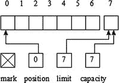

第十三章第十三章

迁移到新的 I/O

第 11 章和第 12 章[向你介绍了 Java 的经典 I/O API。](12.html)[第 11 章](11.html)从 java.io.RandomAccessFile 类、流和写/读程序的角度介绍了经典的 I/O。[第 12 章](12.html)介绍了套接字和 URL 方面的经典 I/O。

现代操作系统提供了 Java 经典 I/O API 不支持的强大 I/O 特性。特性包括*内存映射文件 I/O* (能够将进程的部分*虚拟内存*[参见[【http://en.wikipedia.org/wiki/Virtual_memory】](http://en.wikipedia.org/wiki/Virtual_memory)]映射到文件的某个部分，以便写入或读取进程内存空间的该部分实际上是写入/读取文件的相关部分)， *就绪选择*(非阻塞 I/O 之上的一个步骤，将检查 I/O 流就绪以执行读写操作所涉及的工作卸载给操作系统)，以及*文件锁定*(一个进程阻止其他进程访问文件或以某种方式限制访问的能力)。

Java 1.4 引入了更强大的 I/O 架构，支持内存映射文件 I/O、就绪选择、文件锁定等等。这个架构由缓冲区、通道、选择器、正则表达式和字符集组成，通常被称为新 I/O (NIO )。

**注意**正则表达式是 NIO 的一部分(参见 http://jcp.org/en/jsr/detail?id=51 51—)，因为 NIO 完全是关于性能的，正则表达式对于以高性能的方式扫描文本(从 I/O 源读取)非常有用。(NIO 中还包含了一个简单的 printf 样式的格式化工具，它基于 java.util.Formatter 类【参见[第 10 章](10.html)】。)

第 13 章从缓冲区、通道和正则表达式的角度向您介绍 NIO。(为了简洁起见，我不讨论选择器和字符集。)

**注意** NIO 是一个庞大的架构；一个全面的讨论可以占据一整本书。为了简洁起见，我在这一章中省略了许多细节。

使用缓冲区

NIO 基于缓冲区。*缓冲器* 是存储要发送到 *I/O 服务*(用于执行输入/输出的装置)或从其接收的固定量数据的对象。它位于一个应用和一个*通道*之间，通道将缓冲的数据写入服务，或者从服务读取数据并将其存入缓冲区。

缓冲液具有四种特性:

*   *容量* :缓冲区可以存储的数据项总数。容量是在创建缓冲区时指定的，以后不能更改。
*   *Limit* :缓冲区中“活”数据项的数量。不应写入或读取从零开始的任何项目。
*   *位置* :可以读取的下一个数据项的从零开始的索引或者可以写入数据项的位置。
*   *标记* :可以召回的零基位置。该标记最初没有定义。

这四个属性的关系如下:0 <=标记< =位置< =限制< =容量。

[图 13-1](#Fig1) 展示了一个新创建的面向字节的缓冲器。



[图 13-1](#_Fig1)T3。面向字节的缓冲器的逻辑布局包括未定义的标记、当前位置、极限和容量

[图 13-1](#Fig1) 的缓冲区最多可以存储 7 个元素。标记最初是未定义的，位置最初被设置为 0，限制最初被设置为容量，该容量指定可以存储在缓冲区中的最大字节数。您只能访问位置 0 到 6。

缓冲区及其子级

缓冲区由从抽象 java.nio.Buffer 类派生的类实现。[表 13-1](#Tab1) 描述了缓冲的方法

[表 13-1。](#_Tab1) 缓冲的方法

| 方法 | 描述 |
| --- | --- |
| 对象数组() | 返回支持该缓冲区的数组。该方法旨在允许数组支持的缓冲区更有效地传递给*本机代码*。具体的子类覆盖这个方法，并通过协变返回类型提供更强类型的返回值(在[第 4 章](04.html)中讨论)。当该缓冲区由数组支持但为只读时，该方法抛出Java . nio . readonlybufferexception，当该缓冲区不由可访问的数组支持时，该方法抛出Java . lang . unsupportedoperationexception。 |
| int arrayOffset() | 返回该缓冲区的后备数组中第一个缓冲区元素的偏移量。当该缓冲区由数组支持时，缓冲区位置 p 对应数组索引 p + arrayOffset() 。 在调用此方法之前调用 hasArray() 以确保此缓冲区具有可访问的后备数组。当该缓冲区由数组支持但为只读时，该方法抛出 ReadOnlyBufferException ，当该缓冲区不由可访问的数组支持时，该方法抛出UnsupportedOperationException。 |
| int capacity()T2】 | 返回这个缓冲区的容量。 |
| 缓冲清除() | 清空这个缓冲区。将位置设置为零，将限制设置为容量，并丢弃标记。这个方法并不删除缓冲区中的数据，但它被命名为删除缓冲区中的数据，因为它最常用于这种情况。 |
| 缓冲翻转() | 翻转这个缓冲器。极限被设置为当前位置，然后该位置被设置为零。当标记被定义时，它被丢弃。 |
| boolean hasArray() | 当此缓冲区由数组支持并且不是只读的时，返回 true 否则，返回 false。当该方法返回 true 时， array() 和 arrayOffset() 可以被安全调用。 |
| 布尔哈斯剩余() | 当至少一个元素保留在该缓冲区中时(即，在当前位置和限制之间)，返回 true 否则，返回 false。 |
| 布尔 isDirect() | 当这个缓冲区是直接字节缓冲区时返回 true(在本节后面讨论)；否则，返回 false。 |
| 布尔 is readonly()T2】 | 当此缓冲区为只读时返回 true 否则，返回 false。 |
| int limit() | 返回此缓冲区的限制。 |
| 缓冲区限制(int newLimit) | 将该缓冲区的限制设置为新限制。当位置大于新限时，位置被设置为新限。当标记被定义并且大于新限制时，标记被丢弃。当 newLimit 为负或大于该缓冲区的容量时，该方法抛出Java . lang . illegalargumentexception；否则，它返回这个缓冲区。 |
| 缓冲标记() | 将该缓冲区的标记设置在其位置，并返回该缓冲区。 |
| int position() | 返回这个缓冲区的位置。 |
| 缓冲位置(int newPosition) | 将该缓冲器的位置设置为新位置。当标记被定义且大于新位置时，标记被丢弃。当 newPosition 为负或大于该缓冲区的当前限制时，该方法抛出IllegalArgumentException；否则，它返回这个缓冲区。 |
| int 剩余() | 返回当前位置和限制之间的元素数。 |
| 缓冲复位 () | 将该缓冲器的位置重置到先前标记的位置。调用这个方法既不会改变也不会丢弃标记的值。该方法在标记未设置时抛出Java . nio . invalidmackexception；否则，它返回这个缓冲区。 |
| 缓冲倒带() | 倒带然后返回这个缓冲区。该位置被设置为零，并且该标记被丢弃。 |

.

[表 13-1](#Tab1) 显示许多缓冲区的方法返回缓冲区引用，这样你就可以将实例方法调用链接在一起([第 3 章](03.html)讨论方法调用链接)。例如，不要指定以下三行。

```java
buf.mark();
buf.position(2);
buf.reset();

```

您可以更方便地指定以下行:

```java
buf.mark().position(2).reset();

```

表 13-1 还显示了所有的缓冲区都可以被读取，但不是所有的缓冲区都可以被写入——例如，一个由只读的内存映射文件支持的缓冲区。不得写入只读缓冲区；否则，抛出 ReadOnlyBufferException。当您在尝试写入缓冲区之前不确定该缓冲区是否可写时，调用 isReadOnly() 。

**注意**缓冲区不是线程安全的。当您想要从多个线程访问一个缓冲区时，您必须使用同步。

java.nio 包包含了几个扩展 Buffer 的抽象类，除了 Boolean 之外，每个原语类型一个: ByteBuffer ， CharBuffer ， DoubleBuffer ， FloatBuffer ， IntBuffer ， LongBuffer 和 ShortBuffer 。此外，这个包包括作为抽象字节缓冲子类的 MappedByteBuffer 。

**注意**操作系统执行面向字节的 I/O，您使用 ByteBuffer 创建面向字节的缓冲区，用于存储写入目标或从源读取的字节。其他原始类型的缓冲区类允许您创建多字节视图缓冲区(稍后讨论),这样您就可以在概念上根据字符、双精度浮点值、32 位整数等执行 I/O。然而，I/O 操作实际上是作为字节流来执行的。

[清单 13-1](#list1) 从字节缓冲区、容量、极限、位置和剩余元素方面展示了缓冲区类。

[清单 13-1。](#_list1)演示面向字节的缓冲区

```java
import java.nio.Buffer;
import java.nio.ByteBuffer;

public class BufferDemo
{
   public static void main(String[] args)
   {
      Buffer buffer = ByteBuffer.allocate(7);
      System.out.println("Capacity: " + buffer.capacity());
      System.out.println("Limit: " + buffer.limit());
      System.out.println("Position: " + buffer.position());
      System.out.println("Remaining: " + buffer.remaining());
      System.out.println("Changing buffer limit to 5");
      buffer.limit(5);
      System.out.println("Limit: " + buffer.limit());
      System.out.println("Position: " + buffer.position());
      System.out.println("Remaining: " + buffer.remaining());
      System.out.println("Changing buffer position to 3");
      buffer.position(3);
      System.out.println("Position: " + buffer.position());
      System.out.println("Remaining: " + buffer.remaining());
      System.out.println(buffer);
   }
}

```

[清单 13-1](#list1) 的 main() 方法首先需要获得一个缓冲区。它不能实例化缓冲区类，因为该类是抽象的。而是使用 ByteBuffer 类及其 allocate() 类方法来分配[图 13-1](#Fig1) 所示的 7 字节缓冲区。 main() 然后调用各种 Buffer 方法来演示容量、限制、位置和剩余元素。

编译[清单 13-1](#list1)(Java BufferDemo.java)并运行这个应用( java BufferDemo )。您应该观察到以下输出:

```java
Capacity: 7
Limit: 7
Position: 0
Remaining: 7
Changing buffer limit to 5
Limit: 5
Position: 0
Remaining: 5
Changing buffer position to 3
Position: 3
Remaining: 2
java.nio.HeapByteBuffer[pos=3 lim=5 cap=7]

```

最终的输出行显示分配给缓冲区的字节缓冲区实例实际上是包私有 java.nio.HeapByteBuffer 类的一个实例。

深度缓冲区

前面对 Buffer 类的讨论已经让您对 NIO 缓冲区有了一些了解。然而，还有更多要探索的。本节通过探索缓冲区创建、写入和读取缓冲区、缓冲区翻转、缓冲区标记、缓冲区子类操作、字节排序和直接缓冲区，带您深入了解缓冲区。

**注意**虽然原始类型的缓冲区类有相似的能力，但是 ByteBuffer 是最大的和最通用的。毕竟，字节是操作系统用来传输数据项的基本单位。因此，我将使用字节缓冲来演示大多数缓冲操作。我还将使用 CharBuffer 来增加多样性。

缓冲区创建

ByteBuffer 和其他原始类型的缓冲区类声明了创建该类型缓冲区的各种类方法。例如， ByteBuffer 声明了下面的类方法来创建 ByteBuffer 实例:

*   byte buffer allocate(int capacity)用指定的容量值分配一个新的字节缓冲区。它的位置是 0，它的极限是它的容量，它的标记是未定义的，每个元素都被初始化为 0。它有一个后备数组，数组偏移量为 0。当容量为负时，该方法抛出 IllegalArgumentException 。
*   byte buffer allocated direct(int capacity)用指定的容量值分配一个新的直接字节缓冲区。它的位置是 0，它的极限是它的容量，它的标记是未定义的，每个元素都被初始化为 0。它是否有支持数组是未知的。当容量为负时，该方法抛出 IllegalArgumentException 。
*   byte buffer wrap(byte[]array)将一个字节数组包装到一个缓冲区中。新的缓冲区由数组支持；也就是说，对缓冲区的修改将导致数组被修改，反之亦然。新缓冲区的容量和限制被设置为 array.length ，其位置被设置为 0，其标志未定义。它的数组偏移量是 0。
*   byte buffer wrap(byte[]array，int offset，int length) 将一个字节数组包装到一个缓冲区中。新的缓冲器由阵列支持。新缓冲区的容量设置为 array.length ，位置设置为 offset ，限制设置为 offset + length ，标志未定义。它的数组偏移量是 0。当偏移量为负数或大于数组长度或长度为负数或大于数组长度偏移量时，该方法抛出Java . lang . indexoutofboundsexception。

这些方法展示了两种创建字节缓冲区的方法:创建字节缓冲区对象并分配一个存储容量字节的内部数组，或者创建字节缓冲区对象并使用指定的数组来存储这些字节。考虑这些例子:

```java
ByteBuffer buffer = ByteBuffer.allocate(10);
byte[] bytes = new byte[200];
ByteBuffer buffer2 = ByteBuffer.wrap(bytes);

```

第一行创建一个字节缓冲区，其中包含一个最多存储 10 个字节的内部字节数组，第二和第三行创建一个字节数组和一个使用该数组存储最多 200 个字节的字节缓冲区。

现在，考虑下面的示例，它扩展了前面的示例:

```java
buffer = ByteBuffer.wrap(bytes, 10, 50);

```

这个例子创建了一个字节缓冲区，位置为 10 ，限制为 50 ，容量为 bytes.length (恰好是 200)。虽然看起来缓冲区只能访问这个数组的一个子范围，但它实际上可以访问整个数组: 10 和 50 的值只是位置和限制的初始值。

通过 allocate() 或 wrap() 创建的字节缓冲区(和其他原始类型的缓冲区)是非直接字节缓冲区——稍后您将了解直接字节缓冲区。非直接字节缓冲区有后备数组，只要 hasArray() 返回 true，就可以通过 array() 方法(恰好在 ByteArray 类中声明为 byte[] array() )访问这些后备数组。(当 hasArray() 返回 true 时，需要调用 arrayOffset() 来获取数组中第一个数据项的位置。)

清单 13-2 展示了缓冲分配和包装。

[清单 13-2。](#_list2)通过分配和包装创建面向字节的缓冲区

```java
import java.nio.ByteBuffer;

public class BufferDemo
{
   public static void main(String[] args)
   {
      ByteBuffer buffer1 = ByteBuffer.allocate(10);
      if (buffer1.hasArray())
      {
         System.out.println("buffer1 array: " + buffer1.array());
         System.out.println("Buffer1 array offset: " + buffer1.arrayOffset());
         System.out.println("Capacity: " + buffer1.capacity());
         System.out.println("Limit: " + buffer1.limit());
         System.out.println("Position: " + buffer1.position());
         System.out.println("Remaining: " + buffer1.remaining());
         System.out.println();
      }

      byte[] bytes = new byte[200];
      ByteBuffer buffer2 = ByteBuffer.wrap(bytes);
      buffer2 = ByteBuffer.wrap(bytes, 10, 50);
      if (buffer2.hasArray())
      {
         System.out.println("buffer2 array: " + buffer2.array());
         System.out.println("Buffer2 array offset: " + buffer2.arrayOffset());
         System.out.println("Capacity: " + buffer2.capacity());
         System.out.println("Limit: " + buffer2.limit());
         System.out.println("Position: " + buffer2.position());
         System.out.println("Remaining: " + buffer2.remaining());
      }
   }
}

```

编译[清单 13-2](#list2)(Java BufferDemo.java)并运行这个应用( java BufferDemo )。您应该观察到以下输出:

```java
buffer1 array: [B@15e565bd
Buffer1 array offset: 0
Capacity: 10
Limit: 10
Position: 0
Remaining: 10

buffer2 array: [B@77a6686
Buffer2 array offset: 0
Capacity: 200
Limit: 60
Position: 10
Remaining: 50

```

除了管理存储在外部数组中的数据元素(通过 wrap() 方法)，缓冲区还可以管理存储在其他缓冲区中的数据。当您创建一个缓冲区来管理另一个缓冲区的数据时，创建的缓冲区被称为*视图缓冲区* 。在任一缓冲区中所做的更改都会反映在另一个缓冲区中。

视图缓冲区是通过调用缓冲区子类的 duplicate() 方法 来创建的。结果视图缓冲区相当于原始缓冲区；两个缓冲器共享相同的数据项，并且具有相等的容量。但是，每个缓冲区都有自己的位置、限制和标记。当被复制的缓冲区是只读的或直接的时，视图缓冲区也是只读的或直接的。

考虑以下示例:

```java
ByteBuffer buffer = ByteBuffer.allocate(10);
ByteBuffer bufferView = buffer.duplicate();

```

由 bufferView 标识的 ByteBuffer 实例与 buffer 共享相同的 10 个元素的内部数组。目前，这些缓冲器具有相同的位置、极限和(未定义的)标记。但是，一个缓冲区中的这些属性可以独立于另一个缓冲区中的属性进行更改。

视图缓冲区也是通过调用 ByteBuffer 的as*x*Buffer()方法之一创建的。例如， LongBuffer asLongBuffer() 返回一个视图缓冲区，它将字节缓冲区概念化为长整数的缓冲区。

**注意**只读视图缓冲区 可以通过调用byte buffer asReadOnlyBuffer()等方法来创建。任何改变只读视图缓冲区内容的尝试都会导致 ReadOnlyBufferException 。但是，原始缓冲区内容(假设它不是只读的)可以更改，只读视图缓冲区将反映这些更改。

写入和读取缓冲器

ByteBuffer 和其他原始类型的缓冲区类声明了几个重载的 put() 和 get() 方法，用于将数据项写入缓冲区和从缓冲区读取数据项。这些方法在需要索引参数时是绝对的，在不需要索引时是相对的。

例如， ByteBuffer 声明绝对 ByteBuffer put(int index，byte b) 方法以将字节 b 存储在缓冲区中的索引值处，并声明绝对字节 get(int index) 方法以获取位于位置索引处的字节。该类还声明了相关的 ByteBuffer put(byte b) 方法，用于将字节 b 存储在缓冲区的当前位置，然后递增当前位置，还声明了相关的 byte get() 方法，用于获取位于缓冲区的当前位置的字节，并递增当前位置。

绝对 put() 和 get() 方法throwIndexOutOfBoundsException当 index 为负或者大于等于缓冲区的限制时。相对 put() 方法在当前位置大于等于限制时抛出Java . nio . bufferoverflowexception，相对 get() 方法在当前位置大于等于限制时抛出Java . nio . bufferunderflowexception。此外，当缓冲区为只读时，绝对和相对 put() 方法会抛出ReadOnlyBufferException。

[清单 13-3](#list3) 演示了相对 put() 方法和绝对 get() 方法。

[清单 13-3。](#_list3)向缓冲区写入字节，并从缓冲区读取

```java
import java.nio.ByteBuffer;

public class BufferDemo
{
   public static void main(String[] args)
   {
      ByteBuffer buffer = ByteBuffer.allocate(7);
      System.out.println("Capacity = " + buffer.capacity());
      System.out.println("Limit = " + buffer.limit());
      System.out.println("Position = " + buffer.position());
      System.out.println("Remaining = " + buffer.remaining());

      buffer.put((byte) 10).put((byte) 20).put((byte) 30);

      System.out.println("Capacity = " + buffer.capacity());
      System.out.println("Limit = " + buffer.limit());
      System.out.println("Position = " + buffer.position());
      System.out.println("Remaining = " + buffer.remaining());

      for (int i = 0; i < buffer.position(); i++)
         System.out.println(buffer.get(i));
   }
}

```

编译[清单 13-3](#list3)(Java BufferDemo.java)并运行这个应用( java BufferDemo )。您应该观察到以下输出:

```java
Capacity = 7
Limit = 7
Position = 0
Remaining = 7
Capacity = 7
Limit = 7
Position = 3
Remaining = 4
10
20
30

```

**提示**为了获得最大效率，您可以使用 ByteBuffer put(byte[] src) 、 ByteBuffer put(byte[] src，int offset，int length) 、 ByteBuffer get(byte[] dst) 和 ByteBuffer get(byte[] dst，int offset，int length) 方法来读写字节数组，从而执行批量数据传输。

翻转缓冲器

填充缓冲液后，必须准备好通过通道排出。当您按原样传递缓冲区时，通道将访问当前位置以外的未定义数据。

要解决这个问题，您可以将位置重置为 0，但是通道如何知道何时到达插入数据的末尾呢？解决方案是使用 limit 属性，该属性指示缓冲区活动部分的结束。基本上，您将限制设置为当前位置，然后将当前位置重置为 0。

您可以通过执行以下代码来完成此任务，这些代码还会清除任何已定义的标记:

```java
buffer.limit(buffer.position()).position(0);

```

然而，有一种更简单的方法来完成同样的任务，如下所示:

```java
buffer.flip();

```

在任一情况下，缓冲区都准备好被排空。

清单 13-4 展示了在字符缓冲区的环境下缓冲区翻转。

[清单 13-4。](#_list4)向字符缓冲区写入字符和从中读取字符

```java
import java.nio.CharBuffer;

public class BufferDemo
{
   public static void main(String[] args)
   {
      String[] poem =
      {
         "Roses are red",
         "Violets are blue",
         "Sugar is sweet",
         "And so are you."
      };

      CharBuffer buffer = CharBuffer.allocate(50);

      for (int i = 0; i < poem.length; i++)
      {
         // Fill the buffer.
         for (int j = 0; j < poem[i].length(); j++)
            buffer.put(poem[i].charAt(j));

         // Flip the buffer so that its contents can be read.
         buffer.flip();

         // Drain the buffer.
         while (buffer.hasRemaining())
            System.out.print(buffer.get());

         // Empty the buffer to prevent BufferOverflowException.
         buffer.clear();

         System.out.println();
      }
   }
}

```

编译[清单 13-4](#list4)(Java BufferDemo.java)并运行这个应用( java BufferDemo )。您应该观察到以下输出:

```java
Roses are red
Violets are blue
Sugar is sweet
And so are you.

```

**注** 倒带()类似于翻转()但忽略了极限。此外，调用 flip() 两次也不会将您返回到初始状态。相反，缓冲区的大小为零。调用 put() 方法导致BufferOverflowException，调用 get() 方法导致BufferUnderflowExceptionor(对于get(int))IndexOutOfBoundsException。

标记缓冲器

您可以通过调用 mark() 方法来标记缓冲区，稍后通过调用 reset() 返回到标记的位置。例如，假设您已经执行了byte buffer buffer = byte buffer . allocate(7)；，后面是 buffer.put((字节)10)。put((字节)20)。put((字节)30)。put((字节)40)；，后面是buffer . limit(4)；。当前位置和限制被设置为 4。

继续，假设您执行 buffer.position(1)。标记()。位置(3)；。如果你发送这个缓冲到一个通道，字节 40 将被发送(当前位置是 3，因为位置(3) )并且位置将前进到 4。如果你随后执行了buffer . reset()；并将此缓冲区发送到通道，该位置将被设置为标志(1)；并且字节 20、30 和 40(从当前位置到低于限制的一个位置的所有字节)将被发送到通道(并且以此顺序)。

清单 13-5 展示了这种标记/重置场景。

[清单 13-5。](#_list5)标记当前缓冲位置，并将当前位置复位到标记位置

```java
import java.nio.ByteBuffer;

public class BufferDemo
{
   public static void main(String[] args)
   {
      ByteBuffer buffer = ByteBuffer.allocate(7);
      buffer.put((byte) 10).put((byte) 20).put((byte) 30).put((byte) 40);
      buffer.limit(4);
      buffer.position(1).mark().position(3);
      System.out.println(buffer.get());
      System.out.println();
      buffer.reset();
      while (buffer.hasRemaining())
         System.out.println(buffer.get());
   }
}

```

编译[清单 13-5](#list5)(javac BufferDemo.java)并运行这个应用( java BufferDemo )。您应该观察到以下输出:

```java
40

20
30
40

```

**注意**不要混淆复位()和清除()。 clear() 方法将缓冲区标记为空，而 reset() 将缓冲区的当前位置更改为之前设置的标记，或者在没有之前设置的标记时抛出 InvalidMarkException 。

缓冲子类操作

ByteBuffer 和其他原始类型的缓冲区类声明了一个 compact() 方法，该方法通过将当前位置和限制之间的所有字节复制到缓冲区的开头来压缩缓冲区。索引 p = position() 处的字节被复制到索引 0，索引 p + 1 处的字节被复制到索引 1，依此类推，直到索引limit()–1处的字节被复制到索引n = limit()–1–p。然后，缓冲器的当前位置被设置为 n + 1 ，其限制被设置为其容量。定义后的标记将被丢弃。

在从一个缓冲区写入数据之后，您调用 compact() 来处理缓冲区的内容没有全部写入的情况。考虑下面的例子，它通过缓冲区 buf 将内容从 in 通道复制到 out 通道:

```java
buf.clear(); // Prepare buffer for use
while (in.read(buf) != −1)
{
    buf.flip(); // Prepare buffer for draining.
    out.write(buf); // Write the buffer.
    buf.compact(); // Do this in case of a partial write.
}

```

当没有指定 compact() 时， compact() 方法调用将未写入的缓冲区数据移动到缓冲区的开头，以便下一个 read() 方法调用将读取的数据追加到缓冲区的数据中，而不是覆盖该数据。

您可能偶尔需要比较缓冲区的相等性或顺序。除了 ByteBuffer 的 MappedByteBuffer 子类之外的所有 Buffer 子类都覆盖了 equals() 和 compareTo() 方法来执行这些比较——MappedByteBuffer从其 ByteBuffer 超类继承了这些方法。以下示例显示了如何比较字节缓冲区字节缓冲区 1 和字节缓冲区 2 的相等性和排序:

```java
System.out.println(bytBuf1.equals(bytBuf2));
System.out.println(bytBuf1.compareTo(bytBuf2));

```

ByteBuffer 的 equals() 契约声明，当且仅当两个字节缓冲区具有相同的元素类型时，它们才相等；它们具有相同数量的剩余元素；和剩余元素的两个序列，独立于它们的起始位置考虑，各自是相等的。这个合同对于其他缓冲子类也是一样的。

ByteBuffer 的 compareTo() 方法声明，通过按字典顺序比较剩余元素的序列来比较 2 字节缓冲区的顺序，而不考虑每个序列在其对应缓冲区中的起始位置。像调用 Byte.compare(byte，byte) 一样比较成对的字节元素。类似的描述也适用于其他缓冲子类。

字节排序

除了 Boolean(可能用一个位或一个字节表示)以外的非字节原语类型由几个字节组成:一个字符或一个短整型占用 2 个字节，一个 32 位整型或浮点值占用 4 个字节，一个长整型或双精度浮点值占用 8 个字节。这些多字节类型之一的每个值都存储在一系列连续的内存位置中。然而，这些字节的顺序可能因平台而异。

例如，考虑 32 位长整数 0x10203040。这个值的 4 个字节可以作为 10、20、30、40 存储在存储器中(从低位地址到高位地址);这种安排被称为*大端顺序* (最高有效字节，即“大”端，存储在最低地址)。或者，这些字节可以存储为 40、30、20、10；这种安排被称为*小端顺序* (最低有效字节，即“小”端，存储在最低地址)。

Java 提供了 java.nio.ByteOrder 类来帮助您处理在多字节缓冲区中写入/读取多字节值时的字节顺序问题。 ByteOrder 声明了一个 ByteOrder nativeOrder() 方法，该方法将平台的字节顺序作为一个 ByteOrder 实例返回。因为该实例是 ByteOrder 的 BIG_ENDIAN 和 LITTLE_ENDIAN 常量之一，并且因为不能创建其他 ByteOrder 实例，所以可以通过 == 或将 nativeOrder() 的返回值与这些常量之一进行比较！= 操作员。

同样，每个多字节类(例如， FloatBuffer )声明一个 ByteOrder order() 方法 ，该方法返回该缓冲区的字节顺序。这个方法返回 ByteOrder。BIG_ENDIAN 或 ByteOrder。小 _ 端。

从 order() 返回的 ByteOrder 值可以根据缓冲区的创建方式采用不同的值。如果多字节缓冲区(例如，浮点缓冲区)是通过分配或包装现有数组创建的，则缓冲区的字节顺序是底层平台的本机顺序。然而，如果多字节缓冲区是作为字节缓冲区的视图创建的，那么视图缓冲区的字节顺序就是创建视图时字节缓冲区的顺序。视图缓冲区的字节顺序不能随后更改。

ByteBuffer 在字节顺序方面不同于多字节类。它的默认字节顺序总是大端，即使底层平台的字节顺序是小端。 ByteBuffer 默认为 big endian，因为 Java 的默认字节顺序也是 big endian，这使得类文件和序列化对象跨虚拟机一致地存储数据。

因为这个大端默认设置会影响小端平台的性能， ByteBuffer 还声明了一个byte buffer order(byte order bo)方法来改变字节缓冲区的字节顺序。

虽然改变字节缓冲区的字节顺序似乎不太常见(在这里只访问单字节数据项)，但该方法非常有用，因为 ByteBuffer 还声明了几个方便的方法来读写多字节值(例如，byte buffer putInt(int value)和 int getInt() )。这些方便的方法根据字节缓冲区的当前字节顺序写入这些值。此外，您可以随后调用 ByteBuffer 的long Buffer aslong Buffer()或另一个as*x*Buffer()方法来返回一个视图缓冲区，其顺序将反映字节缓冲区更改后的字节顺序。

直接字节缓冲器

与多字节缓冲区不同，字节缓冲区可以作为基于通道的 I/O 的源和/或目标。这并不奇怪，因为操作系统在 8 位字节(不是浮点值，也不是 32 位整数，等等)的连续序列的内存区域上执行 I/O。

操作系统可以直接访问进程的地址空间。例如，操作系统可以直接访问虚拟机进程的地址空间，以基于字节数组执行数据传输操作。但是，虚拟机可能不会连续存储字节数组，或者其垃圾收集器可能会将字节数组移动到另一个位置。由于这些限制，直接字节缓冲区应运而生。

*直接字节缓冲区*是一个与通道和本机代码交互以执行 I/O 的字节缓冲区。直接字节缓冲区试图将字节元素存储在通道用于通过本机代码执行*直接*(原始)访问的内存区域中，本机代码告诉操作系统直接清空或填充内存区域。

直接字节缓冲区是在虚拟机上执行 I/O 的最有效方式。虽然您也可以将非直接字节缓冲区传递给通道，但可能会出现性能问题，因为非直接字节缓冲区并不总是能够充当本机 I/O 操作的目标。

当通道通过非直接字节缓冲区时，通道可能必须创建一个临时直接字节缓冲区，将非直接字节缓冲区的内容复制到直接字节缓冲区，对临时直接字节缓冲区执行 I/O 操作，并将临时直接字节缓冲区的内容复制到非直接字节缓冲区。然后，临时直接字节缓冲区将接受垃圾收集。

虽然直接字节缓冲区对于 I/O 来说是最佳的，但创建它的成本可能会很高，因为虚拟机堆之外的内存需要由操作系统来分配，并且设置和/或拆除该内存所需的时间可能会比缓冲区位于堆内时更长。在您的代码运行之后，如果您想尝试性能优化，您可以通过调用我前面讨论过的 ByteBuffer 的allocated direct()方法 ，轻松获得一个直接字节缓冲区。

使用频道

通道与缓冲区合作以实现高性能 I/O。*通道* 是一个对象，它表示与硬件设备、文件、网络套接字、应用组件或其他能够执行写、读和其他 I/O 操作的实体的开放连接。通道在字节缓冲区和 I/O 服务源或目的地之间高效地传输数据。

**注意**通道是访问本地 I/O 服务的网关。通道使用字节缓冲区作为发送和接收数据的端点。

在操作系统文件句柄或文件描述符和通道之间通常存在一一对应关系。当您在文件上下文中使用通道时，通道通常会连接到一个打开的文件描述符。尽管通道比文件描述符更抽象，但它们仍然能够模拟操作系统的本机 I/O 设施。

频道及其子频道

Java 通过其 java.nio.channels 和 java.nio.channels.spi 包支持通道。应用与位于前一个包中的类型进行交互；定义新选择器提供程序的开发人员使用后一个包。

所有通道都是最终实现Java . nio . channels . channel接口的类的实例。通道声明如下方法:

*   void close() :关闭本通道。当该通道已经关闭时，调用 close() 不起作用。当另一个线程已经调用了 close() 时，一个新的 close() 调用会阻塞，直到第一个调用完成，之后 close() 返回而没有效果。当发生 I/O 错误时，该方法抛出 IOException 。在通道关闭后，任何对其调用 I/O 操作的进一步尝试都会导致抛出Java . nio . channels . closedchannelexception。
*   布尔 isOpen() :返回该通道的打开状态。当通道打开时，此方法返回 true 否则，它返回 false。

这些方法表明只有两个操作是所有通道共有的:关闭通道并确定通道是打开还是关闭。为了支持 I/O，通道由Java . nio . channels . writable bytechannel和Java . nio . channels . readable bytechannel接口扩展:

*   WritableByteChannel 声明了一个抽象的int write(byte buffer buffer)方法，该方法将一个字节序列从缓冲区写入当前通道。此方法返回实际写入的字节数。当通道未打开进行写操作时，它抛出Java . nio . channels . nonwritablechannelexception，当通道关闭时抛出Java . nio . channels . closedchannelexception，当另一个线程在写操作期间关闭通道时抛出Java . nio . channels . asynchronouscloseexception，当另一个线程在写操作期间中断当前线程时抛出Java . nio . channels . closedbyinterruptexception
*   ReadableByteChannel 声明了一个抽象的int read(byte buffer buffer)方法，将字节从当前通道读入缓冲区。此方法返回实际读取的字节数(如果没有更多字节要读取，则返回 1)。当通道没有打开读取时，抛出Java . nio . channels . nonreadablechannelexception；关闭通道时的 ClosedChannelException；AsynchronousCloseException当另一个线程在读取期间关闭通道时；ClosedByInterruptException当另一个线程在写操作正在进行时中断当前线程，从而关闭通道并设置当前线程的中断状态；以及当一些其他 I/O 错误发生时的 IOException 。

**注意**一个类只实现可写字节通道或可读字节通道的通道是*单向的*。试图从可写字节通道读取或写入可读字节通道会导致引发异常。

您可以使用操作符的 instanceof 来确定通道实例是否实现任一接口。因为对这两个接口进行测试有些困难，所以 Java 提供了Java . nio . channels . bytechannel接口，这是一个空的标记接口，它子类化了 WritableByteChannel 和 ReadableByteChannel 。当您需要了解一个通道是否是双向的时，指定一个表达式更方便，比如字节通道的通道实例。

随着可写字节通道和可读字节通道 , 中断字节通道直接扩展通道。InterruptibleChannel描述了一个可以异步关闭和中断的通道。该接口覆盖了其通道超级接口的 close() 方法 头，为通道的该方法契约提供了以下附加规定:当前在该通道上的 I/O 操作中被阻塞的任何线程都将接收到异步关闭异常(一个io 异常后代)。

实现这个接口的通道是异步*可关闭的* :当一个线程在一个可中断通道上的 I/O 操作中被阻塞时，另一个线程可能会调用该通道的 close() 方法。这导致被阻塞的线程接收到一个抛出的AsynchronousCloseException实例。

实现这个接口的通道也是*可中断的*:当一个线程在一个可中断通道上的 I/O 操作中被阻塞时，另一个线程可能会调用被阻塞线程的中断()方法。这样做会导致通道关闭，被阻塞的线程接收到一个抛出的ClosedByInterruptException实例，并且被阻塞的线程的中断状态被设置。(当一个线程的中断状态已经被设置并且它调用一个通道上的阻塞 I/O 操作时，该通道被关闭并且该线程将立即接收一个抛出的ClosedByInterruptException实例；其中断状态将保持设置。)

NIO 的设计者选择在阻塞线程被中断时关闭通道，因为他们无法找到一种跨平台以相同方式可靠处理中断的 I/O 操作的方法。保证确定性行为的唯一方法是关闭通道。

**提示**您可以通过在一个表达式中使用 instanceof 操作符来决定一个通道是否支持异步关闭和中断，比如通道 instance of interruptible channel。

您之前了解到，您必须调用一个 Buffer 子类的类方法来获得一个缓冲区。关于频道，有两种方法可以获得频道:

*   java.nio.channels 包提供了一个 Channels 实用程序类，该类提供了两种从流中获取通道的方法——对于以下每种方法，当通道关闭时，底层流也将关闭，并且通道不会被缓冲:

*   WritableByteChannel new channel(output stream output stream)返回给定 outputStream 的可写字节通道。
*   ReadableByteChannel new channel(InputStream InputStream)返回给定 inputStream 的可读字节通道。

*   各种经典的 I/O 类已经被改造以支持通道创建。例如， RandomAccessFile 声明了一个用于返回文件通道实例的 FileChannel getChannel() 方法， java.net.Socket 声明了一个用于返回套接字通道的socket channel get channel()方法。

[清单 13-6](#list6) 使用通道类获得标准输入和输出流的通道，然后使用这些通道将字节从输入通道复制到输出通道。

[清单 13-6。](#_list6)将字节从输入通道复制到输出通道

```java
import java.io.IOException;

import java.nio.ByteBuffer;

import java.nio.channels.Channels;
import java.nio.channels.ReadableByteChannel;
import java.nio.channels.WritableByteChannel;

public class ChannelDemo
{
   public static void main(String[] args)
   {
      ReadableByteChannel src = Channels.newChannel(System.in);
      WritableByteChannel dest = Channels.newChannel(System.out);

      try
      {
         copy(src, dest); // or copyAlt(src, dest);
      }
      catch (IOException ioe)
      {
         System.err.println("I/O error: " + ioe.getMessage());
      }
      finally
      {
         try
         {
            src.close();
            dest.close();
         }
         catch (IOException ioe)
         {
            ioe.printStackTrace();
         }
      }
   }

   static void copy(ReadableByteChannel src, WritableByteChannel dest)
      throws IOException
   {
      ByteBuffer buffer = ByteBuffer.allocateDirect(2048);
      while (src.read(buffer) != −1)
      {
         buffer.flip();
         dest.write(buffer);
         buffer.compact();
      }
      buffer.flip();
      while (buffer.hasRemaining())
         dest.write(buffer);
   }

   static void copyAlt (ReadableByteChannel src, WritableByteChannel dest)
      throws IOException
   {
      ByteBuffer buffer = ByteBuffer.allocateDirect(2048);
      while (src.read(buffer) != −1)
      {
         buffer.flip();
         while (buffer.hasRemaining())
            dest.write(buffer);
         buffer.clear();
      }
   }
}

```

清单 13-6 展示了两种将字节从标准输入流复制到标准输出流的方法。在第一种方法中，以 copy() 方法为例，目标是最小化本机 I/O 调用(通过 write() 方法调用)，尽管由于 compact() 方法调用，更多的数据可能最终被复制。在第二种方法中，如 copyAlt() 所示，目标是消除数据复制，尽管可能会出现更多的本机 I/O 调用。

每个 copy() 和 copyAlt() 首先分配一个直接字节缓冲区(回想一下，直接字节缓冲区是在虚拟机上执行 I/O 的最有效方式)，并进入一个 while 循环，该循环不断地从源通道读取字节，直到输入结束( read() 返回 1)。在读取之后，缓冲区被翻转，以便可以清空。这就是方法分歧的地方。

*   这个 copy() 方法 while 循环对 write() 进行一次调用。因为 write() 可能不会完全清空缓冲区，所以在下一次读取之前，调用 compact() 来压缩缓冲区。压缩确保未写入的缓冲区内容在下一次读取操作中不会被覆盖。在 while 循环之后， copy() 翻转缓冲区以准备清空任何剩余的内容，然后使用 hasRemaining() 和 write() 来完全清空缓冲区。
*   copyAlt() 方法 while 循环包含一个嵌套的 while 循环，它与 hasRemaining() 和 write() 一起继续清空缓冲区，直到缓冲区为空。接下来是一个 clear() 方法调用，该方法调用清空缓冲区，以便在下一个 read() 调用时填充缓冲区。

**注意**重要的是要认识到一个单独的 write() 方法调用可能不会输出一个缓冲区的全部内容。类似地，单个 read() 调用可能不会完全填满一个缓冲区。

编译[清单 13-6](#list6) ( 贾瓦茨 ChannelDemo.java)并运行这个应用( java ChannelDemo 和Java channel demo<ChannelDemo.java>channel demo . bak就是例子)来验证标准输入被复制到标准输出。测试完 copy() 方法后，替换 copy(src，dest)；带 copyAlt(src，dest)；并重复。

深度频道

前面对通道接口及其直接派生的讨论已经让您对 NIO 通道有了一些了解。然而，还有更多要探索的。本节通过探索分散/聚集 I/O 和文件通道，带您深入了解通道。不幸的是，简洁的需要限制了我探索套接字通道。

分散/收集 I/O

通道提供跨多个缓冲器执行单个 I/O 操作的能力。这种能力被称为*分散/收集 I/O* (也被称为*矢量 I/O* )。

在写入操作的上下文中，几个缓冲区的内容按顺序*聚集*(排干)，然后通过通道发送到目的地—这些缓冲区不需要具有相同的容量。在读取操作的上下文中，一个通道的内容依次被*分散*(填充)到多个缓冲区；每个缓冲区被填充到其极限，直到通道为空或总的缓冲区空间被用尽。

**注意**现代操作系统提供支持矢量 I/O 的 API，以消除(或至少减少)系统调用或缓冲副本，从而提高性能。例如，Win32/win 64 API 为此提供了readfile scatter()和 WriteFileGather() 函数 。

Java 提供了Java . nio . channels . scatteringbytechannel接口来支持散射，提供了Java . nio . channels . gatherengbytechannel接口来支持聚集。

ScatteringByteChannel提供了以下方法:

*   长读(ByteBuffer[] buffers，int offset，int length)
*   长读取(ByteBuffer[] buffers)

GatheringByteChannel 提供了以下方法:

*   long write(byte buffer[]buffers，int offset，int length)
*   长写(ByteBuffer[] buffers)

第一个 read() 方法 和第一个 write() 方法 让您通过向 offset 传递一个基于零的偏移量来标识要读/写的第一个缓冲区，并通过向 length 传递一个值来标识要读/写的缓冲区数量。第二个 read() 方法和第二个 write() 方法按顺序读/写所有缓冲区。

[清单 13-7](#list7) 演示了读(字节缓冲区[]缓冲区)和写(字节缓冲区[]缓冲区)。

[清单 13-7。](#_list7)演示分散/聚集

```java
import java.io.FileInputStream;
import java.io.FileOutputStream;
import java.io.IOException;

import java.nio.ByteBuffer;

import java.nio.channels.Channels;
import java.nio.channels.GatheringByteChannel;
import java.nio.channels.ReadableByteChannel;
import java.nio.channels.ScatteringByteChannel;

public class ChannelDemo
{
   public static void main(String[] args) throws IOException
   {
      ScatteringByteChannel src;
      src = (ScatteringByteChannel) Channels.newChannel(new FileInputStream("x.dat"));
      ByteBuffer buffer1 = ByteBuffer.allocateDirect(5);
      ByteBuffer buffer2 = ByteBuffer.allocateDirect(3);
      ByteBuffer[] buffers = { buffer1, buffer2 };
      src.read(buffers);
      buffer1.flip();
      while (buffer1.hasRemaining())
         System.out.printf("%c%n", buffer1.get());
      System.out.println();
      buffer2.flip();
      while (buffer2.hasRemaining())
         System.out.printf("%c%n", buffer2.get());
      buffer1.rewind();
      buffer2.rewind();
      GatheringByteChannel dest;
      dest = (GatheringByteChannel) Channels.newChannel(new FileOutputStream("y.dat"));
      buffers[0] = buffer2;
      buffers[1] = buffer1;
      dest.write(buffers);
   }
}

```

[清单 13-7](#list7) 的 main() 方法首先通过实例化 java.io.FileInputStream 并将此实例传递给 Channels 类的ReadableByteChannel new channel(InputStream InputStream)方法来获得一个分散的字节通道。返回的 ReadableByteChannel 实例被强制转换为 ScatteringByteChannel ，因为这个实例实际上是一个实现 ScatteringByteChannel 的文件通道(稍后讨论)。

接下来， main() 创建一对直接字节缓冲区；第一缓冲器具有 5 字节的容量，第二缓冲器具有 3 字节的容量。这些缓冲区随后被存储在一个数组中，该数组被传递给 read(ByteBuffer[]) 以填充它们。

在填充缓冲区之后， main() 翻转它们，以便可以将它们的内容输出到标准输出。输出这些内容后，缓冲区将被倒带，准备通过收集操作清空。

main() 现在通过实例化 java.io.FileOutputStream 并将此实例传递给 Channels 类的writable bytechannel new channel(output stream output stream)方法来获得一个聚集字节通道。返回的 WritableByteChannel 实例被强制转换为 GatheringByteChannel ，因为这个实例实际上是一个实现GatheringByteChannel的文件通道(稍后讨论)。

最后， main() 将这些缓冲区按照最初分配的相反顺序分配给 buffers 数组，然后将该数组传递给 write(ByteBuffer[]) 以清空它们。

**注意**system . out . printf()方法调用中的 %n 格式说明符是指定*行结束符*(指定行尾的一个或两个字符的序列)的一种可移植方式。指定 \n 并不是一个好主意，因为一些平台要求 \r\n 作为行结束符，而其他平台要求 \r 。

创建一个名为 x.dat 的文件，并将以下文本存储在该文件中:

```java
12345abcdefg

```

现在编译[清单 13-7](#list7)(javac ChannelDemo.java)并运行这个应用( java ChannelDemo )。您应该观察到以下输出:

```java
1
2
3
4
5

a
b
c

```

此外，您应该看到一个新创建的 y.dat 文件，其内容如下:

```java
abc12345

```

文件频道

我之前提到过， RandomAccessFile 声明了一个用于返回文件通道实例的 FileChannel getChannel() 方法。原来 FileInputStream 和 FileOutputStream 也提供了同样的方法。相比之下， FileReader 和filerewriter不提供获取文件通道的方法。

**注意**从 FileInputStream 的 getChannel() 方法返回的文件通道是只读的，从file output stream'sget channel()方法返回的文件通道是只写的。试图写入只读文件通道或从只写文件通道读取会导致异常。

抽象Java . nio . channels . file channel类描述了一个文件通道。因为这个类扩展了抽象的Java . nio . channels . SPI . abstractinterruptiblechannel类，实现了 InterruptibleChannel 接口，所以文件通道是可中断的。因为这个类实现了字节通道、 GatheringByteChannel 和 ScatteringByteChannel 接口，所以您可以对底层文件进行读写和分散 I/O 操作。然而，还有更多。

**注意**与非线程安全的缓冲区不同，文件通道是线程安全的。

一个文件通道维护一个指向文件的虚拟指针，称为*文件指针* ，文件通道让你获得并改变文件指针值。它还允许您获取通道下的文件大小，尝试锁定整个文件或文件的一个区域，执行内存映射文件 I/O ，请求将缓存的数据强制传输到磁盘，并以可能被平台优化的方式将数据直接传输到另一个通道。

表 13-2 描述了几个文件通道的方法。

[表 13-2](#_Tab2) 。文件通道方法

| 方法 | 描述 |
| --- | --- |
| 无效力(布尔元数据) | 请求将对此文件通道的所有更新提交到存储设备。当此方法返回时，当文件驻留在本地存储设备上时，对作为此通道基础的平台文件所做的所有修改都已提交。然而，当文件不在本地托管时(例如，它在网络文件系统上)，应用不能确定修改已经被提交。(不保证使用其他地方定义的方法对文件所做的更改会被提交。例如，通过映射字节缓冲区进行的更改可能不会被提交。)当通过了真时，元数据值指示更新是否应该包括文件的元数据(例如，最后修改时间和最后访问时间)，或者当通过了假时，更新是否不包括文件的元数据。传递 true 可以调用对操作系统的底层写入(如果平台正在维护元数据，例如上次访问时间)，即使当通道作为只读通道打开时。当通道已经关闭时，该方法抛出 ClosedChannelException ，当任何其他 I/O 错误发生时，抛出 IOException 。 |
| FileLock lock() | 获取此文件通道的基础文件的排他锁。这个方便的方法相当于执行 fileChannel.lock(0L，Long。MAX_VALUE，false)；，其中文件通道引用一个文件通道。这个方法返回一个代表锁定区域的Java . nio . channels . file lock对象。文件通道关闭时抛出ClosedChannelException；非可写通道异常当通道未打开写入时；Java . nio . channels . overlappingfilelockexception当已经持有与该锁请求重叠的锁或者另一个线程正在等待获取将与该请求重叠的锁时；Java . nio . channels . filelockinterruptionexception当调用线程在等待获取锁时被中断；AsynchronousCloseException当通道在调用线程等待获取锁时被关闭；以及 IOException 当获取请求的锁时发生另一个 I/O 错误。 |
| 映射字节缓冲图 (文件通道)。MapMode 模式，长位置，长大小) | 根据以下三种模式之一将该文件通道的文件的一个区域直接映射到内存:* *只读*:任何修改结果缓冲区的尝试都会导致 ReadOnlyBufferException 抛出( MapMode)。READ_ONLY ) * *读/写*:对结果缓冲区所做的更改将最终传播到文件；它们可能对已经映射了相同文件的其他程序可见，也可能不可见。READ _ WRITE)**private*:对结果缓冲区所做的更改不会传播到文件中，并且对映射了相同文件的其他程序不可见；相反，它们将导致创建缓冲区的修改部分的私有副本( MapMode。PRIVATE )对于只读映射，该通道必须已经打开进行读取；对于读/写或私有映射，此通道必须已打开以进行读写。传递给位置的值标识了文件中映射区域开始的位置。传递给 size 的值标识映射区域的长度。成功时，此方法返回映射的字节缓冲区。返回的映射字节缓冲区的位置为 0，极限和容量为大小；它的标记将是未定义的。缓冲区和它所代表的映射将保持有效，直到缓冲区本身被垃圾收集。如果不成功，此方法将引发异常。当模式为 READ_ONLY 时，抛出unreadablechannelexception，但该通道没有打开读取；当模式为 READ_WRITE 或 PRIVATE 时，出现不可写通道异常，但该通道并未同时打开读写；当模式不是文件通道定义的常量之一时IllegalArgumentException。MapMode 类，传递给位置的值为负值，或者传递给大小的值为负值或者大于Java . lang . integer . max _ VALUE；以及 IOException 当任何其他 I/O 错误发生时。一旦建立，映射就不依赖于用来创建它的文件通道。特别是，关闭通道对映射的有效性没有影响。内存映射文件的许多细节本质上依赖于底层操作系统，因此是不确定的。当请求的区域未完全包含在此通道的文件中时，此方法的行为是未指定的。此应用或另一个应用对基础文件的内容或大小所做的更改是否会传播到缓冲区是未指定的。对缓冲区的更改传播到文件的速率未指定。对于大多数操作系统来说，将一个文件映射到内存中比通过通常的读/写方法读写几十千字节的数据更昂贵。从性能角度来看，通常只需要将相对较大的文件映射到内存中。 |
| 长仓() | 返回该文件通道的文件指针的当前值，该值相对于零。该方法在文件通道关闭时抛出 ClosedChannelException ，在另一个 I/O 错误发生时抛出 IOException 。 |
| 文件通道位置(长偏移) | 将该文件通道的文件指针设置为偏移量。参数是从文件开头开始计数的字节数。位置不能设置为负值。新位置可以设置为超出当前文件大小。如果设置超过当前文件大小，尝试读取将返回文件结尾。写操作将会成功，但是它们将用所需数量的(未指定的)字节值填充文件当前结尾和新位置之间的字节。该方法在偏移量为负时抛出 IllegalArgumentException ，在文件通道关闭时抛出 ClosedChannelException ，在另一个 I/O 错误发生时抛出 IOException 。 |
| int read(ByteBuffer 缓冲) | 将字节从这个文件通道读入给定的缓冲区。调用方法时，将读取的最大字节数是缓冲区中剩余的字节数。字节将从缓冲区的当前位置开始复制到缓冲区中。当其他线程也试图从此通道读取时，调用可能会阻塞。完成后，缓冲区的位置被设置为已读取字节的末尾。缓冲区的限制不会改变。该方法返回实际读取的字节数，并抛出与前面讨论的 ReadableByteChannel 相同的异常。 |
| 长尺寸() | 返回此文件通道下文件的大小(以字节为单位)。该方法在文件通道关闭时抛出 ClosedChannelException ，在另一个 I/O 错误发生时抛出 IOException 。 |
| 文件通道截断(长尺寸) | 将此文件通道下的文件截断为大小。任何超出给定的大小的字节都将从文件中删除。当没有超过给定大小的字节时，文件内容不被修改。当文件指针当前大于给定的大小时，它被设置为新的大小。 |
| 【file lock try lock() | 尝试在不阻止的情况下获取此文件通道的基础文件的排他锁。这个方便的方法相当于执行 fileChannel.tryLock(0L，Long。MAX_VALUE，false)；其中文件通道引用一个文件通道。该方法返回一个代表锁定区域的文件锁对象，或者当该锁与另一个操作系统进程中现有的独占锁重叠时返回 null。文件通道关闭时抛出ClosedChannelException；OverlappingFileLockException当与所请求区域重叠的锁已经被该虚拟机持有时，或者当另一个线程已经在该方法中被阻塞并试图锁定重叠区域时；以及 IOException 当在获取所请求的锁时发生另一个 I/O 错误时。 |
| int write(ByteBuffer 缓冲) | 从给定的缓冲区向该文件通道写入一个字节序列。字节从通道的当前文件位置开始写入，除非通道处于追加模式，在这种情况下，位置首先前进到文件的末尾。文件增长(必要时)以容纳写入的字节，然后用实际写入的字节数更新文件位置。否则，该方法的行为完全按照可写字节通道接口的指定。该方法返回实际写入的字节数，并抛出与前面讨论的可写字节通道相同的异常。 |

[表 13-2](#Tab2) 提供了很多理解的材料。为了帮助你获得这些知识，[清单 13-8](#list8) 展示了其中的几种方法

[清单 13-8。](#_list8)演示文件通道

```java
import java.io.FileInputStream;
import java.io.FileOutputStream;
import java.io.IOException;

import java.nio.ByteBuffer;
import java.nio.MappedByteBuffer;

import java.nio.channels.FileChannel;

public class ChannelDemo
{
   public static void main(String[] args) throws IOException
   {
      if (args.length != 1)
      {
         System.out.println("usage: java ChannelDemo newfilespec");
         return;
      }
      FileOutputStream fos = new FileOutputStream(args[0]);
      FileChannel fc = fos.getChannel();
      System.out.println("position: " + fc.position());
      System.out.println("size: " + fc.size());
      String msg = "This is a test message.";
      ByteBuffer buffer = ByteBuffer.allocateDirect(msg.length() * 2);
      buffer.asCharBuffer().put(msg);
      fc.write(buffer);
      System.out.println("position: " + fc.position());
      System.out.println("size: " + fc.size());
      fc.truncate(24L);
      fc.close();
      FileInputStream fis = new FileInputStream(args[0]);
      fc = fis.getChannel();
      System.out.println("size: " + fc.size());
      buffer.clear();
      fc.read(buffer);
      buffer.flip();
      while (buffer.hasRemaining())
         System.out.print(buffer.getChar());
      System.out.println();
      System.out.println(buffer.getChar(0));
      System.out.println(buffer.getChar(1));
      System.out.println(buffer.getChar(2));
      MappedByteBuffer mbb = fc.map(FileChannel.MapMode.READ_ONLY, 0, 4);
      System.out.println(mbb.getChar(0));
      System.out.println(mbb.getChar(2));
      System.out.println(mbb.getChar(4));
      fc.close();
   }
}

```

[清单 13-8](#list8) 的 main() 方法首先验证你已经指定了一个命令行参数，这是一个将要被创建和覆盖的文件的名称。然后，它创建一个文件输出流，获取该流的文件通道，输出有关该通道的一些信息，向文件输出一些内容，再次输出通道信息，截断文件，并关闭文件。

main() 接下来创建文件输入流，获取该流的文件通道，输出通道信息，将文件内容读入缓冲区，输出缓冲区内容。最后，获得一个映射字节缓冲区(它提供了文件的一个内存映射区域),并输出内容。

编译[清单 13-8](#list8)(javac ChannelDemo.java)并运行这个应用(例如 java ChannelDemo x.dat )。您应该观察到以下输出:

```java
position: 0
size: 0
position: 46
size: 46
size: 24
This is a te
T
?
h
T
H
Exception in thread "main" java.lang.IndexOutOfBoundsException
                at java.nio.Buffer.checkIndex(Unknown Source)
                at java.nio.DirectByteBuffer.getChar(Unknown Source)
                at ChannelDemo.main(ChannelDemo.java:46)

```

这个输出中有两个有趣的项目:问号 ( ？)而例外。问号来自于通过system . out . println(buffer . getchar(1))输出一个不可显示的 Unicode 字符；，其中 buffer.getChar(1) 返回从字节索引 0 开始的 2 字节 Unicode 字符的后半部分和从字节索引 2 开始的 2 字节 Unicode 字符的前半部分。

异常源于 mbb.getChar(4) 试图访问字节索引 4 和 5 处的 Unicode 字符。但是，映射字节缓冲区中唯一有效的字节索引是索引 0 到 3。

使用正则表达式

文本处理应用经常需要将文本与*模式*(简明描述被认为是匹配的字符串集合的字符串)进行匹配。例如，应用可能需要在文本文件中找到特定单词模式的所有匹配项，以便用另一个单词替换那些匹配项。NIO JSR 包括正则表达式，以帮助文本处理应用高性能地执行模式匹配。

模式、模式同步异常和匹配器

一个*正则表达式* (也称为 *regex* 或 *regexp* )是一个基于字符串的模式，表示匹配这个模式的一组字符串。该模式由字面字符和*元字符*组成，元字符是具有特殊含义的字符，而不是字面含义。

正则表达式 API 提供了 java.util.regex.Pattern 类来通过编译的正则表达式表示模式。出于性能原因编译正则表达式；通过编译后的正则表达式进行模式匹配比不编译正则表达式要快得多。[表 13-3](#Tab3) 描述了模式的方法。

[表 13-3。](#_Tab3) 花样方法

| 方法 | 描述 |
| --- | --- |
| 静态模式编译(字符串正则表达式) | 编译 regex 并返回其模式对象。当 regex 的语法无效时，该方法抛出Java . util . regex . patternsynctaxexception。 |
| 静态模式编译(字符串 regex，int 标志) | 根据给定的标志编译 regex (由模式的 CANON_EQ 、不区分大小写、注释、dotoll、文字、多行、 UNICODE_CASE 和 UNIX_LINES 的某种组合组成的位集当 regex 的语法无效时，该方法抛出 PatternSyntaxException ，当 flags 中设置了与定义的匹配标志不同的位值时，抛出IllegalArgumentException。 |
| int 标志() | 返回这个模式对象的匹配标志。这个方法为通过编译(String) 创建的模式实例返回 0，为通过编译(String，int) 创建的模式实例返回标志位集。 |
| 匹配(序列输入)T3 | 返回一个匹配器，它将根据这个模式的编译正则表达式匹配输入。 |
| 静态布尔匹配(字符串正则表达式，字符序列输入) | 编译正则表达式，并尝试将输入与编译后的正则表达式进行匹配。有匹配时返回 true 否则，返回 false。这个方便的方法相当于 Pattern.compile(regex)。匹配器(输入)。matches() 并在 regex 的语法无效时抛出PatternSyntaxException。 |
| 字符串模式() | 返回这个模式的未编译的正则表达式。 |
| 静弦报(弦 s)T3】 | 使用“ \Q ”和“ \E ”引用 s ，使所有其他元字符失去其特殊含义。当返回的 java.lang.String 对象后来被编译成模式实例时，只能进行字面匹配。 |
| 字符串【拆分】(CharSequence 输入) | 在这个模式的编译正则表达式的匹配项周围分割输入，并返回一个包含匹配项的数组。 |
| String[]split(char sequence input，int limit) | 在这个模式的编译正则表达式的匹配项周围拆分输入； limit 控制编译后的正则表达式被应用的次数，从而影响结果数组的长度。 |
| String toString() | 返回这个模式的未编译的正则表达式。 |

[表 13-3](#Tab3) 揭示了 java.lang.CharSequence 接口，它描述了一个可读且不可变的 char 值序列——底层实现可能是可变的。实现该接口的任何类的实例(例如， String 、 java.lang.StringBuffer 和Java . lang . stringbuilder)可以传递给采用 CharSequence 参数的模式方法(例如， split(CharSequence) )。

[表 13-3](#Tab3) 还揭示了模式的 compile() 方法及其 matches() 方法(该方法调用 compile(String) 方法)在编译模式参数时遇到语法错误时会抛出patternsynctaxexception。[表 13-4](#Tab4) 描述了 PatternSyntaxException 的方法。

[表 13-4。](#_Tab4) PatternSyntaxException 方法

| 方法 | 描述 |
| --- | --- |
| 字符串 getDescription() | 返回语法错误的描述。 |
| int getiindex() | 返回模式中出现语法错误的位置的近似索引，如果索引未知，则返回 1。 |
| 字符串 getMessage() | 返回一个多行字符串，其中包含语法错误的描述及其索引、错误模式以及模式中错误索引的可视指示。 |
| 字串 get atten() | 返回错误的模式。 |

最后，[表 13-4](#Tab4) 的匹配器 匹配器(CharSequence input) 方法揭示了正则表达式 API 还提供了 java.util.regex.Matcher 类，其*匹配器*试图将编译后的正则表达式与输入文本进行匹配。 Matcher 声明以下方法执行匹配操作:

*   布尔匹配()尝试将整个区域与模式匹配。当匹配成功后，可以通过调用 Matcher 的 start() 、 end() 和 group() 方法获得更多信息。例如， int start() 返回前一个匹配的起始索引， int end() 返回前一个匹配后的第一个字符的偏移量， String group() 返回前一个匹配的输入子序列。当尚未尝试匹配或之前的匹配尝试失败时，每个方法都会抛出Java . lang . illegalstateexception。
*   boolean lookingAt() 尝试匹配输入序列，从区域的开头开始，对照模式。与 matches() 一样，这种方法总是从区域的开始处开始。与 matches() 不同， lookingAt() 不需要匹配整个区域。当匹配成功后，可以通过调用 Matcher 的 start() 、 end() 和 group() 方法获得更多信息。
*   boolean find() 试图找到输入序列中与模式匹配的下一个子序列。它从这个匹配器的区域的开始处开始，或者，如果先前对此方法的调用成功，并且匹配器此后没有被重置(通过调用匹配器的匹配器重置()或匹配器重置(CharSequence input) 方法)，则在先前匹配没有匹配的第一个字符处开始。当匹配成功后，可以通过调用 Matcher 的 start() 、 end() 和 group() 方法获得更多信息。

**注意**一个匹配器在其输入的一个称为*区域*的子集中寻找匹配。默认情况下，该区域包含匹配器的所有输入。可以通过调用 Matcher 的 Matcher region(int start，int end) 方法修改区域(设置该 Matcher 的区域的限制)，通过调用 Matcher 的 int regionStart() 和 int regionEnd() 方法查询区域。

我创建了一个简单的应用，演示了模式、模式同步异常和匹配器。清单 13-9 展示了这个应用的源代码 。

[清单 13-9。](#_list9)玩弄正则表达式

```java
import java.util.regex.Matcher;
import java.util.regex.Pattern;
import java.util.regex.PatternSyntaxException;

public class RegExDemo
{
   public static void main(String[] args)
   {
      if (args.length != 2)
      {
         System.err.println("usage: java RegExDemo regex input");
         return;
      }
      try
      {
         System.out.println("regex = " + args[0]);
         System.out.println("input = " + args[1]);
         Pattern p = Pattern.compile(args[0]);
         Matcher m = p.matcher(args[1]);
         while (m.find())
            System.out.println("Located [" + m.group() + "] starting at "
                               + m.start() + " and ending at " + (m.end() - 1));
      }
      catch (PatternSyntaxException pse)
      {
         System.err.println("Bad regex: " + pse.getMessage());
         System.err.println("Description: " + pse.getDescription());
         System.err.println("Index: " + pse.getIndex());
         System.err.println("Incorrect pattern: " + pse.getPattern());
      }
   }
}

```

编译[清单 13-9](#list9)(javac RegExDemo.java)并通过Java regex demo ox运行这个应用。您将发现以下输出:

```java
regex = ox
input = ox
Located [ox] starting at 0 and ending at 1

```

find() 通过将正则表达式字符与输入字符按照从左到右的顺序 进行比较来搜索匹配，并返回 true，因为 o 等于 o 并且 x 等于 x 。

继续，执行 java RegExDemo box ox 。这一次，您将发现以下输出:

```java
regex = box
input = ox

```

find() 首先将正则表达式字符 b 与输入字符 o 进行比较。因为这些字符不相等，并且因为输入中没有足够的字符来继续搜索， find() 不会输出“Located ”消息来指示匹配。然而，如果您执行 java RegExDemo ox box ，您会发现一个匹配:

```java
regex = ox
input = box
Located [ox] starting at 1 and ending at 2

```

ox regex 由文字字符组成。更复杂的正则表达式结合了文字字符和元字符(例如，句点[ )。 ])和其他正则表达式构造。

**提示**要指定一个元字符 作为文字字符，在元字符前加一个反斜杠(如)。)或将元字符置于 \Q 和 \E 之间(如 \Q.\E )。在这两种情况下，当转义元字符出现在字符串文字中时，请确保将反斜杠字符加倍；比如“\ \ .”或 "\\Q.\\E" 。

句点元字符匹配除行结束符之外的所有字符。例如，每个 java RegExDemo。ox box 和 java RegExDemo。牛狐报告匹配，因为周期匹配框中的 b 和狐中的 f 。

**注意** 模式识别以下行终止符:回车符( \r )、换行符(换行符)( \n )、回车符后紧跟换行符( \r\n )、下一行( \u0085 )、行分隔符( \u2028 )和段落分隔符( \u2029 )。通过指定模式，可以使句点元字符也匹配这些行终止符。调用 Pattern.compile(String，int) 时的 DOTALL 标志。

人物类

一个*字符类*是出现在和之间的一组字符。有六种字符类:

*   一个*简单字符类*由并排放置的文字字符组成，并且只匹配这些字符。比如【ABC】由人物 a 、 b 、 c 组成。另外，Java regex demo t[爱欧]ck tack 报告一个匹配，因为 a 是【爱欧】的成员。因为 i 、 o 和 u 是成员，所以当输入为勾号、库存或塔克时，它也报告匹配。
*   一个*否定字符类*由一个扬抑符元字符( ^ )组成，后跟并排放置的文字字符，匹配除类中字符之外的所有字符。比如【^abc】由除 a 、 b 、 c 以外的所有字符组成。另外，Java regex demo "【^b]ox】框不报告匹配，因为 b 不是【^b】的成员，而Java regex demo "【^b]ox】fox报告匹配，因为 f 是成员。(在我的 Windows 7 平台上，【^b]ox】周围的双引号是必要的，因为 ^ 在命令行被特殊对待。)
*   *范围字符类*由连续的文字字符组成，表示为起始文字字符、连字符元字符()和结束文字字符，并匹配该范围内的所有字符。例如，【a-z】由从 a 到 z 的所有角色组成。此外，Java regex demo[h-l]house house报告匹配，因为 h 是该类的成员，而Java regex demo[h-l]ouse mouse不报告匹配，因为 m 位于范围之外，因此不是该类的一部分。通过将多个范围并排放置，可以在同一个范围字符类中组合多个范围；例如，【A-Za-z】全部由大小写拉丁字母组成。
*   一个*并集字符类* 由多个嵌套的字符类组成，匹配属于最终并集的所有字符。比如【ABC[u-z]】由人物 a 、 b 、 c 、 u 、 v 、 w 、 x 、 y 、 z 组成。另外，Java regex demo[[0–9][A-F][A-F]]e报告一个匹配，因为 e 是一个十六进制字符。(我也可以通过组合多个范围将这个字符类表示为【0-9A-Fa-f】。)
*   一个*交集字符类*由多个 & & 组成——分隔的嵌套字符类，匹配这些嵌套字符类共有的所有字符。比如【a-c&&【c-f】】由字符 c 组成，这是【a-c】【c-f】唯一共有的字符。另外，Java regex demo "[aeiouy&&【y】]" y报告一个匹配，因为 y 对于类【aeiouy】和【y】是通用的。
*   一个*减法字符类*由多个 & & 分隔的嵌套字符类组成，其中至少一个嵌套字符类是否定字符类，并且匹配除了由否定字符类指示的那些字符之外的所有字符。比如【a-z&&【^x-z】由字符 a 到 w 组成。(^x-z 周围的方括号是必需的；否则， ^ 被忽略，结果类仅由 x 、 y 和 z 组成。)还有，Java regex demo "[a-z&&【^aeiou】]" g报告匹配，因为 g 是辅音，只有辅音属于这个类。(我在忽略 y ，有时被当做辅音，有时被当做元音。)

一个*预定义的字符类*是一个通常指定的字符类的正则表达式。[表 13-5](#Tab5) 标识了图案的预定义字符类别。

[表 13-5。](#_Tab5) 预定义的人物类

| 预定义字符类 | 描述 |
| --- | --- |
| \d | 匹配任何数字字符。 \d 相当于【0–9】。 |
| \D | 匹配任何非数字字符。 \D 相当于【^\d】。 |
| \s | 匹配任何空白字符。 \s 相当于 [\t\n\x0B\f\r ] 。 |
| \S | 匹配任何非白色空间字符。 \S 相当于【^\s】。 |
| \w | 匹配任何单词字符。 \w 相当于【a-zA-Z0-9】。 |
| \W | 匹配任何非单词字符。 \W 相当于【^\w】。 |

例如， java RegExDemo \wbc abc 报告一个匹配，因为 \w 匹配 abc 中的单词字符 a 。

捕获组

一个*捕获组*保存一个匹配的字符供以后在模式匹配时调用，并被表示为一个由括号元字符 ( 和 ) 包围的字符序列。捕获组中的所有字符被视为一个单元。比如(安卓)捕捉组，将 A 、 n 、 d 、 r 、 o 、 i 、 d 组合成一个单位。它匹配输入中所有出现的 Android 的 Android 模式。每次匹配都用下一次匹配的 Android 字符替换前一次匹配保存的 Android 字符。

捕获组可以出现在其他捕获组中。例如，捕获组(A)(B(C))出现在捕获组 ((A)(B(C))) 内部，捕获组 (C) 出现在捕获组 (B(C)) 内部。每个嵌套或非嵌套捕获组都有自己的编号，编号从 1 开始，捕获组从左到右进行编号。例如， ((A)(B(C))) 赋 1， (A) 赋 2， (B(C)) 赋 3， (C) 赋 4。

捕获组通过*后向引用*保存其匹配项，后向引用是一个反斜杠字符，后跟一个表示捕获组编号的数字字符。反向引用使得匹配器使用反向引用的捕获组号来调用捕获组保存的匹配，然后使用该匹配的字符来尝试进一步的匹配。以下示例使用反向引用来确定输入是否由两个连续的 Android 模式组成:

```java
java RegExDemo "(Android) \1" "Android Android"

```

RegExDemo 报告一个匹配，因为匹配器在输入中检测到 Android ，后跟一个空格，然后是 Android 。

边界匹配器和零长度匹配器

*边界匹配器*是一个 regex 构造，用于识别行首、单词边界、文本结尾和其他常见的边界。参见[表 13-6](#Tab6) 。

[表 13-6。](#_Tab6) 边界匹配器

| 边界匹配器 | 描述 |
| --- | --- |
| ^ | 匹配行首。 |
| $ | 匹配行尾。 |
| \b | 匹配单词边界。 |
| \B | 匹配非单词边界。 |
| \A | 匹配文本开头。 |
| \G | 前一场比赛的结束。 |
| \Z | 匹配除行结束符(如果存在)之外的文本结尾。 |
| \z | 匹配文本结尾。 |

例如，Java regex demo \ b \ b " I think "报告了几个匹配项，如以下输出所示:

```java
regex = \b\b
input = I think
Located [] starting at 0 and ending at −1
Located [] starting at 1 and ending at 0
Located [] starting at 2 and ending at 1
Located [] starting at 7 and ending at 6

```

这个输出揭示了几个零长度匹配。当出现零长度匹配时，开始和结束索引相等，尽管输出显示结束索引比开始索引小一，因为我在[清单 13-9](#list9) 中指定了 end() - 1 (这样匹配的结束索引标识非零长度匹配的最后一个字符，而不是非零长度匹配的最后一个字符之后的字符)。

**注意**零长度匹配出现在空输入文本中、输入文本的开头、输入文本的最后一个字符之后或该文本的任意两个字符之间。零长度匹配很容易识别，因为它们总是在相同的索引位置开始和结束。

量词

我给出的最后一个 regex 构造是*量词*，一个隐式或显式绑定到模式的数值。量词分为贪婪、勉强和占有三类:

*   一个*贪婪量词* ( ？、 * 或 + )试图找到最长的匹配。指定*X*T10】？查找一个或没有出现的 *X* ，*X**查找零个或多个出现的 *X* ， *X* + 查找一个或多个出现的 *X* ，*X*{*n*}查找 **X*{*n*，} 找到至少 *n* (可能更多)出现的 *X* ，*X*{*n*， *m* } 找到至少*n**
**   一个*舍不得量词* ( ？？、 *？，还是 +？)试图找到最短的匹配。指定*X*T10】？？查找 *X* ， *X* *的一个或不出现？查找零个或多个出现的 *X* 、*X*+？查找 *X* ，*X*{*n*}？查找 *n* 出现的 *X* ，*X*{*n*，}？找出至少 *n* (也可能更多)出现的 *X* ，和*X*{*n*， *m* }？找出至少 *n* 但不超过 *m* 个 *X* 的出现次数。*   一个*所有格量词* ( ？+ 、 *+ 或 ++ )除了所有格量词只进行一次寻找最长匹配的尝试，而贪婪量词可以进行多次尝试之外，与贪婪量词类似。指定*X*T10】？+ 查找一个或没有出现的 *X* ， *X* *+ 查找零个或多个出现的 *X* ，*X*+查找一个或多个出现的 *X* ，*X*{*n*}+到 *X*{*n*，}+ 查找至少出现 *X* 的*X*{*n*， *m* }+ 查找至少出现*

 **对于贪婪量词的例子，执行 java RegExDemo。*end "wend rend end" 。您将发现以下输出:

```java
regex = .*end
input = wend rend end
Located [wend rend end] starting at 0 and ending at 12

```

贪婪的量词 ( )。* )匹配以结尾结束的最长字符序列。它首先消耗所有的输入文本，然后被迫后退，直到发现输入文本以这些字符结束。

对于不情愿量词的例子，执行 java RegExDemo。*?end【wend rend end】。您将发现以下输出:

```java
regex = .*?end
input = wend rend end
Located [wend] starting at 0 and ending at 3
Located [ rend] starting at 4 and ending at 8
Located [ end] starting at 9 and ending at 12

```

不情愿的量词()。*?)匹配以结尾结束的最短字符序列。它开始不消耗任何东西，然后慢慢消耗字符，直到找到匹配。然后继续，直到输入完所有文本。

对于所有格量词的例子，执行 java RegExDemo。*+end "wend rend end" 。您将发现以下输出:

```java
regex = .*+end
input = wend rend end

```

所有格量词()。*+ )没有检测到匹配，因为它消耗了整个输入文本，没有留下任何内容来匹配正则表达式末尾的 end 。与贪婪量词不同，所有格量词不会后退。

使用量词时，您可能会遇到零长度匹配。比如执行 java RegExDemo 1？101101 :

```java
regex = 1?
input = 101101
Located [1] starting at 0 and ending at 0
Located [] starting at 1 and ending at 0
Located [1] starting at 2 and ending at 2
Located [1] starting at 3 and ending at 3
Located [] starting at 4 and ending at 3
Located [1] starting at 5 and ending at 5
Located [] starting at 6 and ending at 5

```

这个贪婪量词的结果是在输入文本的位置 0、2、3 和 5 检测到了 1 ，而在位置 1、4 和 6 没有检测到任何内容(零长度匹配)。

这次执行 java RegExDemo 1？？101101 :

```java
regex = 1??
input = 101101
Located [] starting at 0 and ending at −1
Located [] starting at 1 and ending at 0
Located [] starting at 2 and ending at 1
Located [] starting at 3 and ending at 2
Located [] starting at 4 and ending at 3
Located [] starting at 5 and ending at 4
Located [] starting at 6 and ending at 5

```

这个输出可能看起来令人惊讶，但是请记住，不情愿的量词寻找最短的匹配，这(在本例中)根本不是匹配。

最后执行 java RegExDemo 1+？101101 :

```java
regex = 1+?
input = 101101
Located [1] starting at 0 and ending at 0
Located [1] starting at 2 and ending at 2
Located [1] starting at 3 and ending at 3
Located [1] starting at 5 and ending at 5

```

这个所有格量词只匹配输入文本中检测到 1 的位置。它不执行零长度匹配。

**注意**查看关于模式类的 Java 文档，了解更多的正则表达式构造。**  **实用的正则表达式

除了帮助您掌握如何使用各种正则表达式构造之外，前面的大多数正则表达式示例都不实用。相反，下面的例子显示了一个正则表达式，它匹配形式为 (ddd) ddd-dddd 或 ddd-dddd 的电话号码。在 (ddd) 和 ddd 之间出现一个空格；连字符两边都没有空格。

```java
java RegExDemo "(\(\d{3}\))?\s*\d{3}-\d{4}" "(800) 555-1212"
regex = (\(\d{3}\))?\s*\d{3}-\d{4}
input = (800) 555–1212
Located [(800) 555–1212] starting at 0 and ending at 13

java RegExDemo "(\(\d{3}\))?\s*\d{3}-\d{4}" 555–1212
regex = (\(\d{3}\))?\s*\d{3}-\d{4}
input = 555–1212
Located [555–1212] starting at 0 and ending at 7

```

**注意**要了解关于正则表达式的更多信息，请查看*Java 教程*中的“课程:正则表达式”([http://download . Oracle . com/javase/tutorial/essential/regex/index . html](http://download.oracle.com/javase/tutorial/essential/regex/index.html))。

练习

以下练习旨在测试您对第 13 章内容的理解:

1.  定义新的 I/O。
2.  什么是缓冲？
3.  确定缓冲区的四个属性。
4.  当您在由只读数组支持的缓冲区上调用 Buffer 的 array() 方法时会发生什么？
5.  当你在一个缓冲区上调用 Buffer 的 flip() 方法时会发生什么？
6.  当你在一个没有设置标记的缓冲区上调用 Buffer 的 reset() 方法时会发生什么？
7.  是非判断:缓冲区是线程安全的。
8.  识别扩展抽象缓冲区类的类。
9.  如何创建一个字节缓冲区？
10.  定义视图缓冲区。
11.  如何创建视图缓冲区？
12.  如何创建只读视图缓冲区？
13.  识别 ByteBuffer 在字节缓冲区存储单个字节和从字节缓冲区获取单个字节的方法。
14.  什么原因导致 BufferOverflowException 或 BufferUnderflowException 发生？
15.  执行 buffer.flip()相当于什么；？
16.  是非判断:调用 flip() 两次会将您返回到初始状态。
17.  Buffer 的 clear() 和 reset() 方法有什么区别？
18.  ByteBuffer 的 compact() 方法完成了什么？
19.  ByteOrder 类的用途是什么？
20.  定义直接字节缓冲区。
21.  你如何获得一个直接字节缓冲区？
22.  什么是渠道？
23.  通道接口提供什么功能？
24.  确定直接扩展通道的三个接口。
25.  是非判断:实现 InterruptibleChannel 的通道是异步关闭的。
26.  确定获得渠道的两种方式。
27.  定义分散/聚集 I/O。
28.  为实现分散/聚集 I/O 提供了哪些接口？
29.  定义文件通道。
30.  是非判断:文件通道不支持分散/聚集 I/O。
31.  FileChannel 提供了什么方法将文件的一个区域映射到内存中？
32.  FileChannel 的 lock() 和 tryLock() 方法的根本区别是什么？
33.  定义正则表达式。
34.  模式类完成什么？
35.  当模式的编译()方法在它们的正则表达式参数中发现非法语法时，它们会做什么？
36.  Matcher 类完成什么？
37.  Matcher 的 matches() 和 lookingAt() 的方法有什么区别？
38.  定义字符类。
39.  识别不同种类的字符类别。
40.  定义捕获组。
41.  什么是零长度匹配？
42.  定义量词。
43.  贪心量词和勉强量词有什么区别？
44.  所有格量词和贪心量词有什么区别？
45.  重构[清单 11-8](11.html#list8) ( [第 11 章](11.html)的复制应用)以使用字节缓冲和文件通道类与文件输入流和文件输出流合作。
46.  创建一个 ReplaceText 应用，该应用接受输入文本、指定要替换的文本的模式和替换文本命令行参数，并使用匹配器的 String replaceAll(字符串替换)方法用替换文本替换模式的所有匹配(传递给替换)。例如， java ReplaceText "太多嵌入空格" " \s+" " " 应该输出太多嵌入空格连续单词之间只有一个空格字符。

摘要

Java 1.4 引入了更强大的 I/O 架构，支持内存映射文件 I/O、就绪选择、文件锁定等等。这种架构由缓冲区、通道、选择器、正则表达式和字符集组成，通常被称为新 I/O (NIO)。

缓冲区是一个对象，它存储要发送到 I/O 服务或从 I/O 服务接收的固定数量的数据，或者已经从 I/O 服务接收的数据。它位于应用和向服务写入缓冲数据或从服务读取数据并将其存入缓冲区的通道之间。

通道是一个对象，它表示到硬件设备、文件、网络套接字、应用组件或其他能够执行写、读和其他 I/O 操作的实体的开放连接。通道在缓冲区和其他实体之间传输数据。

正则表达式(也称为 regex 或 regexp)是一种基于字符串的模式，表示与该模式匹配的字符串集。该模式由字面字符和元字符组成，元字符是具有特殊含义而非字面含义的字符。

[第 14 章](14.html)重点介绍数据库访问。您首先会接触到 Java DB 和 SQLite 数据库产品，然后学习如何使用 JDBC API 来创建/访问它们的数据库。**