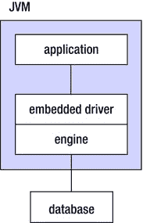
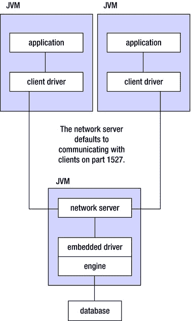
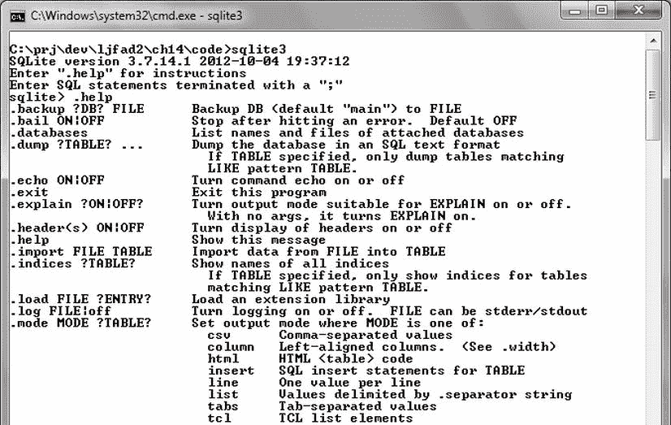

# 十四、访问数据库

应用经常需要访问数据库来存储和检索各种数据。一个*数据库*([【http://en.wikipedia.org/wiki/Database】](http://en.wikipedia.org/wiki/Database))是一个有组织的数据集合。尽管数据库有很多种(例如，分层的、面向对象的和关系的)，但是*关系数据库*是很常见的，它将数据组织成可以相互关联的表格。

**注意**在关系数据库中，每行存储一个项目(例如，一个雇员)，每列存储一个项目属性(例如，一个雇员的名字)。

除了最琐碎的数据库(例如[第十一章](11.html)的基于单个数据文件的平面文件数据库)，数据库都是通过*数据库管理系统(DBMS)*——参见【http://en.wikipedia.org/wiki/Database_management_system】——来创建和管理的。关系数据库系统(RDBMSs)支持*结构化查询语言(SQL)* 来处理表和更多内容。

**注意**为了简洁起见，我假设您熟悉 SQL。如果没有，你可能想查看一下维基百科的“SQL”条目(【http://en.wikipedia.org/wiki/SQL】)以获得介绍。

Java 通过其面向关系数据库的 JDBC(Java DataBase Connectivity)API 支持数据库访问和创建(以及更多)。因为在探索 JDBC 之前需要一个 RDBMS，所以本章首先向您介绍 Java DB，它包含在 JDK 中，然后是 SQLite(【http://en.wikipedia.org/wiki/Sqlite】)。[第十四章](14.html)接着关注 JDBC。

**注意** Android 通过其 android.database 和 android.database.sqlite 包提供了 JDBC 的替代方案，这是从 Android 应用访问数据库的首选方式。尽管 Android 通过包含这个 API 和一个未记录的 JDBC 驱动程序(将在本章后面讨论)来支持 JDBC，但是在开发需要数据库访问的 Android 应用时，您应该关注使用 Android 的数据库访问替代方案。因为你仍然会发现 JDBC 很有用，尤其是在创建非 Android 应用时，所以我在本章中介绍了 JDBC。

Java 数据库简介

最初由 Sun Microsystems 作为 JDK 6 的一部分(不包括在 JRE 中)引入，以给开发人员一个 RDBMS 来测试他们的 JDBC 代码， *Java DB* 是 Apache 的开源 Derby 产品的发行版，它基于 IBM 的 Cloudscape RDBMS 代码库。这种纯 Java RDBMS 也与 JDK 7 捆绑在一起(但不在 JRE 中)。它是安全的，支持 JDBC 和 SQL(包括事务、存储过程和并发)，并且占用空间小——其核心引擎和 JDBC 驱动程序占用大约 2 MB。

**注意**一个 *JDBC 驱动*是一个用于与数据库通信的类文件插件。当我在本章后面介绍 JDBC 的时候，我会对 JDBC 车手有更多的了解。

Java DB 能够在嵌入式环境或客户机/服务器环境中运行。在嵌入式环境中，应用通过 Java DB 的*嵌入式驱动程序* 访问数据库引擎，数据库引擎运行在与应用相同的虚拟机中。[图 14-1](#Fig1) 展示了嵌入式环境架构，其中数据库引擎嵌入在应用中。



[图 14-1](#_Fig1)T3。启动或关闭嵌入式数据库引擎不需要单独的过程

在客户端/服务器环境中，客户端应用和数据库引擎运行在不同的虚拟机中。客户端应用通过 Java DB 的*客户端驱动程序* 访问网络服务器。与数据库引擎运行在同一虚拟机中的网络服务器通过嵌入式驱动程序访问数据库引擎。图 14-2 展示了这个架构。



[图 14-2](#_Fig2)T3。多个客户端通过网络服务器与同一个数据库引擎通信

Java DB 将图 14-1 和图 14-2 中[所示的架构](#Fig1)的数据库部分实现为与数据库同名的目录。在这个目录中，Java DB 创建一个 log 目录来存储事务日志，一个 seg0 目录来存储数据文件，一个 service.properties 文件来存储配置参数。

**注意** Java DB 不提供 SQL 命令来*删除*(销毁)数据库。销毁数据库需要手动删除其目录结构。

Java 数据库安装和配置

当使用默认设置安装 JDK 7 时，捆绑的 Java DB 会安装到 Windows 平台上的 %JAVA_HOME%\db 中，或者安装到 Unix/Linux 平台上相同位置的 db 子目录中。(为了方便起见，我在表示环境变量路径时采用了 Windows 惯例。)

**注意**我在本章中关注 Java DB 10.8.2.2，因为它包含在 JDK 7 版本 1.7.0_06-b24 中，这是本书所基于的 Java 版本。

db 目录包含五个文件和以下一对子目录:

*   bin 目录包含用于设置嵌入式和客户机/服务器环境、运行命令行工具以及启动/停止网络服务器的脚本。您应该将这个目录添加到您的 PATH 环境变量中，以便您可以从文件系统中的任何地方方便地执行它的脚本。
*   lib 目录包含各种 JAR 文件，这些文件包含引擎库( derby.jar )、命令行工具库( derbytools.jar 和 derbyrun.jar )、网络服务器库( derbynet.jar )、网络客户端库( derbyclient.jar )和各种语言环境库。该目录还包含 derby.war ，用于在 /derbynet 相对路径下注册网络 *servlet* (参见[【http://en.wikipedia.org/wiki/Java_Servlet】](http://en.wikipedia.org/wiki/Java_Servlet))——还可以通过 servlet 接口远程管理 Java DB 网络服务器(参见[http://DB . Apache . org/derby/docs/10.8/admin guide/cadminservlet 98430)](http://db.apache.org/derby/docs/10.8/adminguide/cadminservlet98430.html)

在运行工具和启动/停止网络服务器之前，必须设置环境变量 DERBY_HOME 。通过set DERBY _ HOME = % JAVA _ HOME % \ db为 Windows 设置这个变量，通过export DERBY _ HOME = $ JAVA _ HOME/db为 Unix (Korn shell)设置这个变量。(除非您将此设置设为永久设置，否则在当前命令 shell 会话之后，此设置将不会持续。)

**注意**嵌入式和客户机/服务器环境设置脚本引用了一个 DERBY_INSTALL 环境变量。根据“Re: DERBY_INSTALL 和 DERBY_HOME ”邮件项([www.mail-archive.com/derby-dev@db.apache.org/msg22098.html](http://www.mail-archive.com/derby-dev@db.apache.org/msg22098.html))， DERBY_HOME 等同于并取代 DERBY_INSTALL ，以与其他 Apache 项目保持一致。

您还必须设置 CLASSPATH 环境变量。设置该环境变量最简单的方法是运行 Java DB 附带的脚本文件。Windows 和 Unix/Linux 版本的各种“ set *xxx* CP ”脚本文件(扩展了当前的类路径)都位于 %JAVA_HOME%\db\bin 目录下。要运行的脚本文件将取决于您是使用嵌入式环境还是客户端/服务器环境:

*   对于嵌入式环境，调用 setEmbeddedCP 将 derby.jar 和 derbytools.jar 添加到类路径中。
*   对于客户机/服务器环境，调用 setNetworkServerCP 将 derbynet.jar 和 derbytools.jar 添加到类路径中。在单独的命令窗口中，调用 setNetworkClientCP 将 derbyclient.jar 和 derbytools.jar 添加到类路径中。

Java DB 演示

对于 JDK 7，Java DB 演示与其他 Java 演示一起包含在一个单独的分发文件中—参见[www . Oracle . com/tech network/Java/javase/downloads/index-JSP-138363 . html](http://www.oracle.com/technetwork/java/javase/downloads/index-jsp-138363.html)。下载并解压发行版文件后，可以将其移动到 %JAVA_HOME% 。如果您运行的是 Windows 7，您还需要确保 Java DB 可以将文件写入到 C:\Program Files (64 位 JDK)或C:\ Program Files(x86)(32 位 JDK)的子目录中。否则，您会遇到“拒绝访问”错误。

% JAVA _ HOME % \ demo \ DB \ programs目录包含描述 Java DB 附带的演示程序的 HTML 文档；demo.html 的文件是这个文档的入口点。这些演示包括一个使用 Java DB 的简单 JDBC 应用、一个网络服务器示例程序，以及在*使用 Derby* 手册中介绍的示例程序。

**注意***使用 Derby* 手册强调了 Java DB 的 Derby 传统。您可以从 Apache 的 Derby 项目网站([【http://db.apache.org/derby/index.html](http://db.apache.org/derby/index.html))的文档部分([【http://db.apache.org/derby/manuals/index.html】](http://db.apache.org/derby/manuals/index.html))下载本手册和其他 Derby 手册。

为了简洁起见，我将只关注位于程序目录的简单子目录中的简单 JDBC 应用。该应用运行在默认的嵌入式环境或客户机/服务器环境中。它创建并连接到一个 derbyDB 数据库，将一个表引入这个数据库，对这个表执行 SQL 插入/更新/选择操作，*丢弃*(删除)这个表，并从数据库断开连接。

要在嵌入式环境中运行这个应用，请打开一个命令窗口，并确保已经正确设置了 DERBY_HOME 和 CLASSPATH 环境变量；调用 setEmbeddedCP 来设置类路径。假设 simple 是当前目录，调用 java SimpleApp 或 java SimpleApp embedded 来运行这个应用。您应该观察到以下输出:

```java
SimpleApp starting in embedded mode
Loaded the appropriate driver
Connected to and created database derbyDB
Created table location
Inserted 1956 Webster
Inserted 1910 Union
Updated 1956 Webster to 180 Grand
Updated 180 Grand to 300 Lakeshore
Verified the rows
Dropped table location
Committed the transaction
Derby shut down normally
SimpleApp finished

```

该输出表明，在嵌入式环境中运行的应用在退出之前关闭了数据库引擎。这样做是为了执行检查点并释放资源。当这种关闭没有发生时，Java DB 会注意到检查点的缺失，假设崩溃，并导致恢复代码在下一次数据库连接之前运行(这需要更长的时间来完成)。

**提示**在嵌入式环境中运行 SimpleApp (或任何其他 Java DB 应用)时，您可以通过设置 derby.system.home 属性来确定将在哪里创建数据库目录。例如，Java-dder by . system . home = C:\ temp simple app导致在 Windows 7 平台上 C: drive 根目录的 temp 子目录中创建 derbyDB 。

要在客户机/服务器环境中运行该应用，您需要启动网络服务器，并在单独的命令窗口中运行该应用。

在一个命令窗口中，设置 DERBY_HOME 。通过 startNetworkServer 脚本(位于 %JAVA_HOME%\db\bin )启动网络服务器，该脚本负责设置类路径。您应该会看到类似如下的输出:

```java
Sun Nov 25 16:01:23 CST 2012 : Security manager installed using the Basic server security policy.
Sun Nov 25 16:01:24 CST 2012 : Apache Derby Network Server - 10.8.2.2 - (1181258) started and ready to accept connections on port 1527

```

在另一个命令窗口中，设置 DERBY_HOME ，后跟 CLASSPATH (通过 setNetworkClientCP )。假设 simple 目录是当前的，执行Java simple app derby client命令行来运行这个应用。这一次，您应该观察到以下输出:

```java
SimpleApp starting in derbyclient mode
Loaded the appropriate driver
Connected to and created database derbyDB
Created table location
Inserted 1956 Webster
Inserted 1910 Union
Updated 1956 Webster to 180 Grand
Updated 180 Grand to 300 Lakeshore
Verified the rows
Dropped table location
Committed the transaction
SimpleApp finished

```

请注意，在客户机/服务器环境中，数据库引擎没有关闭。虽然在输出中没有指出，但是在嵌入式和客户机/服务器环境中运行 SimpleApp 还有第二个区别。在嵌入式环境中， derbyDB 数据库目录创建在 simple 目录中。在客户机/服务器环境中，这个数据库目录是在您执行 startNetworkServer 时的当前目录中创建的。

当您在客户机/服务器环境中使用完 SimpleApp 后，您应该关闭网络服务器和数据库引擎。通过调用 stopNetworkServer 脚本(位于 %JAVA_HOME%\db\bin )来完成这个任务。您还可以通过运行 NetworkServerControl 脚本(也位于 %JAVA_HOME%\db\bin )来关闭(或启动并控制)网络服务器。例如，networkserver control shut down关闭网络服务器和数据库引擎。

Java DB 命令行工具

%JAVA_HOME%\db\bin 目录包含用于启动命令行工具的 sysinfo 、 ij 和 dblook Windows 和 Unix/Linux 脚本文件:

*   运行 sysinfo 查看 Java 环境/Java DB 配置。
*   Run ij 运行执行特定 SQL 命令和重复任务的脚本。
*   运行 dblook 查看数据库的全部或部分数据定义语言(DDL)。

如果您在使用 Java DB 时遇到问题(例如，无法连接到数据库)，您可以运行 sysinfo 来找出问题是否与配置有关。该工具在 Java 信息、Derby 信息和 Locale 信息标题下报告各种设置。它在我的平台上输出以下信息:

```java
------------------ Java Information ------------------
Java Version:    1.7.0_06
Java Vendor:     Oracle Corporation
Java home:       C:\Program Files\Java\jdk1.7.0_06\jre
Java classpath:  C:\PROGRA∼1\Java\JDK17∼2.0_0\db\lib\derbyclient.jar;C:\PROGRA∼1\Java\JDK17∼2.0_0\db\lib\derbytools.jar;.;C:\Program Files (x86)\QuickTime\QTSystem\QTJava.zip;C:\PROGRA∼1\Java\JDK17∼2.0_0\db/lib/derby.jar;C:\PROGRA∼1\Java\JDK17∼2.0_0\db/lib/derbynet.jar;C:\PROGRA∼1\Java\JDK17∼2.0_0\db/lib/derbyclient.jar;C:\PROGRA∼1\Java\JDK17∼2.0_0\db/lib/derbytools.jar
OS name:         Windows 7
OS architecture: amd64
OS version:      6.1
Java user name:  Owner
Java user home:  C:\Users\Owner
Java user dir:   C:\PROGRA∼1\Java\jdk1.7.0_06\db\bin
java.specification.name: Java Platform API Specification
java.specification.version: 1.7
java.runtime.version: 1.7.0_06-b24
--------- Derby Information --------
JRE - JDBC: Java SE 7 - JDBC 4.0
[C:\Program Files\Java\jdk1.7.0_06\db\lib\derby.jar] 10.8.2.2 - (1181258)
[C:\Program Files\Java\jdk1.7.0_06\db\lib\derbytools.jar] 10.8.2.2 - (1181258)
[C:\Program Files\Java\jdk1.7.0_06\db\lib\derbynet.jar] 10.8.2.2 - (1181258)
[C:\Program Files\Java\jdk1.7.0_06\db\lib\derbyclient.jar] 10.8.2.2 - (1181258)
------------------------------------------------------
----------------- Locale Information -----------------
Current Locale :  [English/Canada [en_CA]]
Found support for locale: [cs]
                 version: 10.8.2.2 - (1181258)
Found support for locale: [de_DE]
                 version: 10.8.2.2 - (1181258)
Found support for locale: [es]
                 version: 10.8.2.2 - (1181258)
Found support for locale: [fr]
                 version: 10.8.2.2 - (1181258)
Found support for locale: [hu]
                 version: 10.8.2.2 - (1181258)
Found support for locale: [it]
                 version: 10.8.2.2 - (1181258)
Found support for locale: [ja_JP]
                 version: 10.8.2.2 - (1181258)
Found support for locale: [ko_KR]
                 version: 10.8.2.2 - (1181258)
Found support for locale: [pl]
                 version: 10.8.2.2 - (1181258)
Found support for locale: [pt_BR]
                 version: 10.8.2.2 - (1181258)
Found support for locale: [ru]
                 version: 10.8.2.2 - (1181258)
Found support for locale: [zh_CN]
                 version: 10.8.2.2 - (1181258)
Found support for locale: [zh_TW]
                 version: 10.8.2.2 - (1181258)
------------------------------------------------------

```

通过运行指定适当 DDL 语句的脚本文件， ij 脚本对于创建数据库和初始化用户的*模式*(逻辑组织表和其他数据库对象的名称空间)非常有用。例如，您已经创建了一个带有姓名和照片列的雇员表，并在当前目录中创建了一个 create_emp_schema.sql 脚本文件，其中包含以下行:

```java
CREATE TABLE EMPLOYEES(NAME VARCHAR(30), PHOTO BLOB);

```

下面的嵌入式 ij 脚本会话创建了雇员数据库和雇员表:

```java
C:\db>ij
ij version 10.8
ij> connect 'jdbc:derby:employees;create=true';
ij> run 'create_emp_schema.sql';
ij> CREATE TABLE EMPLOYEES(NAME VARCHAR(30), PHOTO BLOB);
0 rows inserted/updated/deleted
ij> disconnect;
ij> exit;
C:>\db>

```

connect 命令导致雇员数据库被创建——当我在本章后面介绍 JDBC 时，我会对这个命令的语法说得更多。 run 命令导致 create_emp_schema.sql 执行，结果生成后续的一对行。

创建雇员表(姓名 VARCHAR(30)，照片 BLOB)；行是一条 SQL 语句，用于创建一个名为雇员的表，表中有姓名和照片列。输入到 NAME 列中的数据项是 SQL 类型 VARCHAR (可变数量的字符—字符串)，最多有 30 个字符，输入到 PHOTO 列中的数据项是 SQL 类型 BLOB (二进制大对象，如图像)。

**注意**我用大写字母指定 SQL 语句，但是你也可以用小写字母或混合大小写来指定。

在运行‘create _ EMP _ schema . SQL’完成后，指定的雇员表被添加到新创建的雇员数据库中。要验证该表是否存在，请对 employees 目录运行 dblook ，如下面的会话所示。

```java
C:\db>dblook -d jdbc:derby:employees
-- Timestamp: 2012-11-25 16:13:42.693
-- Source database is: employees
-- Connection URL is: jdbc:derby:employees
-- appendLogs: false

-- ----------------------------------------------
-- DDL Statements for tables
-- ----------------------------------------------

CREATE TABLE "APP"."EMPLOYEES" ("NAME" VARCHAR(30), "PHOTO" BLOB(2147483647));

C:\db>

```

所有数据库对象(例如，表和索引)都被分配给用户和系统模式，这些模式以包逻辑组织类的相同方式逻辑组织这些对象。当用户创建或访问数据库时，Java DB 使用指定的用户名作为新添加的数据库对象的名称空间名称。在没有用户名的情况下，Java DB 选择 APP ，如前面的会话输出所示。

SQLite 简介

*SQLite*([http://sqlite.org/](http://sqlite.org/))是一个非常简单和流行的 RDBMS 。基本上，它实现了一个自包含、无服务器、零配置、事务性 SQL 数据库引擎；被认为是世界上部署最广泛的数据库引擎。例如，SQLite 可以在 Mozilla Firefox、Google Chrome 和其他 web 浏览器中找到。它也存在于谷歌安卓、苹果 iOS 和其他移动操作系统中。

**注意**要了解 SQLite 与其他 RDBMs 的不同之处，请访问 http://sqlite.org/different.htmlT3的“SQLite 的特色”页面。除了学习诸如前面提到的零配置之类的特性，您还将学习诸如*清单类型*之类的特性，其中您可以将任何数据类型的任何值存储到任何列中，而不管该列声明的类型。

要向 SQLite 自我介绍，请在访问 SQLite 主页。可以探索在线文档(【http://sqlite.org/docs.html】)、下载 SQLite 软件([【http://sqlite.org/download.html】](http://sqlite.org/download.html))等等。关于下载，您可以下载 Linux、Mac OS X (x86)和 Windows 平台的源代码、文档和预编译的二进制文件。

我为我的 Windows 7 平台下载了SQLite-shell-win32-x86-3071401 . zip分发文件。这个归档文件包含一个单独的 sqlite3 可执行文件，它提供了一个命令行 shell 来访问和修改 sqlite 数据库。根据 SQLite 下载页面，该程序与 3.7.14.1 版(以及更高版本)的所有 SQLite 版本兼容。(Windows 的 Android SDK 也包括sqlite3.exe但不一定是同一个版本。)

您可以使用数据库文件名参数指定 sqlite3 (例如 sqlite3 employees )来创建数据库文件(例如 employees )，如果数据库文件不存在(您至少必须创建一个表)，或者打开现有文件并进入该工具的 shell，在那里您可以执行 sqlite3 特定的带点前缀的命令和 SQL 语句。如图[图 14-3](#Fig3) 所示，也可以不带参数指定 sqlite3 进入 shell。



[图 14-3](#_Fig3)T3。在没有数据库文件名参数的情况下调用 sqlite3

[图 14-3](#Fig3) 显示了进入 sqlite3 shell 后欢迎您的开场白，这由您输入命令的SQLite>T5】提示符指示。当您键入特定于 sqlite3 的“时，它还会显示部分帮助文本。帮助命令。

**提示**您可以在指定 sqlite3 后创建一个数据库，无需参数，方法是输入适当的 SQL 语句来创建和填充所需的表(并可能创建索引)，然后调用。在退出 sqlite3 之前，备份 *文件名*(其中*文件名*标识存储数据库的文件)。

在讨论 Java DB 命令行工具时，我展示了一个面向雇员的小型数据库示例，它由一个雇员数据库和一个 create_emp_schema.sql 脚本文件组成，该脚本文件包含以下用于创建雇员表(由姓名和照片组成)的 sql 语句:

```java
CREATE TABLE EMPLOYEES(NAME VARCHAR(30), PHOTO BLOB);

```

让我们看看如何用 sqlite3 创建这个数据库和表。

在命令行中，执行 sqlite3 employees 。在出现的 sqlite > 命令提示符下，执行前面提到的 SQL 语句，然后执行。退出退出 sqlite3 。现在，您应该观察到 employees 文件位于与 sqlite3 相同的目录中。

重新执行 sqlite3 雇员。在SQLite>T3】命令提示符下，执行。工作台。您应该观察到由雇员组成的单一输出行。现在执行。schema employees (大小写无关紧要)，您应该看到前面提到的 CREATE TABLE 语句。

可以继续玩 sqlite3 和员工数据库/ 员工表。例如，您可以通过下面的 INSERT 语句将单行数据插入到 EMPLOYEES 表中，然后通过下面的 SELECT 语句选择/输出该行:

```java
INSERT INTO EMPLOYEES VALUES('Duke', null);
SELECT * FROM EMPLOYEES;

```

您应该观察到下面的结果行——照片没有显示任何内容，因为它的值为空:

```java
DUKE|

```

通过 JDBC 访问数据库

**JDBC** 是一个 API (与 java.sql 和 javax.sql 包相关联——我在本章主要关注 java.sql )以一种与 RDBMS 无关的方式与 RDBMS 通信。您可以使用 JDBC 来执行各种数据库操作，例如提交 SQL 语句，告诉 RDBMS 创建一个表，并更新或查询表格数据。

数据源、驱动程序和连接

尽管 JDBC 通常用于与 RDBMSs 通信，但它也可用于与平面文件数据库通信。出于这个原因，JDBC 使用术语*数据源*(一种由 RDBMS 管理的从简单文件到复杂关系数据库的数据存储设施)来抽象数据源。

因为数据源以不同的方式访问(例如，第 11 章的平面文件数据库是通过 java.io.RandomAccessFile 类的方法访问的，而 Java DB 和 SQLite 数据库是通过 SQL 语句访问的)，JDBC 使用*驱动程序*(类文件插件)来抽象它们的实现。这种抽象使您可以编写一个应用，它可以适应任意数据源，而不必更改一行代码(在大多数情况下)。驱动程序是 java.sql.Driver 接口的实现。

JDBC 认可四种类型的司机:

*   *类型 1 驱动程序* 将 JDBC 实现为到另一个数据访问 API 的映射(例如，开放式数据库连接，或 ODBC——参见【http://en.wikipedia.org/wiki/ODBC】)。驱动程序将 JDBC 方法调用转换成另一个库的函数调用。JDBC-ODBC 桥驱动程序就是一个例子，它不受 Oracle 支持。在 JDBC 早期，当其他种类的司机不常见时，这种方法很常用。
*   *Type 2 驱动* 部分用 Java 编写，部分用原生代码编写。它们与特定于数据源的本机客户端库进行交互，因此不可移植。Oracle 的 OCI (Oracle 调用接口)客户端驱动程序就是一个例子。
*   *类型 3 驱动* 不依赖于本机代码，通过 RDBMS 独立协议与*中间件服务器*(位于应用客户端和数据源之间的服务器)通信。然后，中间件服务器将客户机的请求传递给数据源。
*   *Type 4 驱动* 不依赖于本机代码，实现特定数据源的网络协议。客户端直接连接到数据源，而不是通过中间件服务器。

在与数据源通信之前，您需要建立连接。JDBC 为此提供了 java.sql.DriverManager 类和 javax.sql.DataSource 接口:

*   DriverManager 让应用通过指定 URL 连接到数据源。当这个类第一次尝试建立连接时，它会自动加载任何 JDBC 4。通过类路径定位的 x 驱动程序。(前 JDBC 4。 *x* 驱动程序必须手动加载。)
*   DataSource 对应用隐藏连接细节，以提高数据源的可移植性，因此比 DriverManager 更受青睐。因为对数据源的讨论有些复杂(并且通常在 Java EE 环境中使用)，所以我在本章中重点讨论驱动管理器。

在让您获得数据源连接之前，早期的 JDBC 版本要求您通过用实现驱动程序接口的类名指定 Class.forName() 来显式加载合适的驱动程序。比如通过class . forname(" sun . JDBC . ODBC . JDBC driver ")加载 JDBC-ODBC 桥驱动；。后来的 JDBC 版本放宽了这一要求，允许您通过 jdbc.drivers 系统属性指定要加载的驱动程序列表。DriverManager 会在初始化时尝试加载所有这些驱动程序。

在 Java 7 下， DriverManager 首先加载由 jdbc.drivers 系统属性标识的所有驱动程序。然后，它使用基于 java.util.ServiceLoader 的服务提供者机制从可访问的驱动程序 JAR 文件中加载所有驱动程序，这样您就不必显式加载驱动程序。这种机制需要将一个驱动程序打包到一个包含META-INF/services/Java . SQL . driver的 JAR 文件中。 java.sql.Driver 文本文件必须包含一行来命名驱动程序实现的驱动程序接口。

每个加载的驱动通过 DriverManager 的void register Driver(Driver Driver)类方法实例化并向 DriverManager 注册自己。当被调用时， getConnection() 方法遍历注册的驱动程序，从识别 getConnection() 的 JDBC URL 的第一个驱动程序返回 java.sql.Connection 接口的实现。(你可能想检查一下驱动管理器的源代码，看看这是怎么做到的。)

**注意**为了保持数据源独立性，JDBC 的大部分由接口组成。每个驱动程序都提供了各种接口的实现。

要连接到数据源并获得一个连接实例，调用驱动管理器的连接 getConnection(字符串 url) 、连接 getConnection (字符串 url，属性信息)或连接 getConnection(字符串 url，字符串用户，字符串密码)方法之一。无论使用哪种方法， url 参数都会指定一个基于字符串的 url，该 URL 以 jdbc: 前缀开始，并以特定于数据源的语法继续。

考虑 Java DB。URL 语法因驱动程序而异。对于嵌入式驱动程序(当您想要访问本地数据库时)，语法如下:

```java
jdbc:derby: *databaseName* ; *URLAttributes*

```

对于客户端驱动程序(当您想要访问远程数据库时，尽管您也可以使用该驱动程序访问本地数据库)，语法如下:

```java
jdbc:derby:// *host* : *port* / *databaseName* ; *URLAttributes*

```

无论使用哪种语法， *URLAttributes* 都是分号分隔的*名称* = *值*对的可选序列。例如， create=true 告诉 Java DB 创建一个新的数据库。

以下示例通过告诉 JDBC 加载 Java DB 嵌入式驱动程序并在本地主机上创建名为 testdb 的数据库来演示第一个语法:

```java
Connection con = DriverManager.getConnection("jdbc:derby:testdb;create=true");

```

下面的例子演示了第二种语法，告诉 JDBC 加载 Java DB 客户机驱动程序，并在 xyz 主机的端口 8500 上创建名为 testdb 的数据库:

```java
Connection con;
con = DriverManager.getConnection("jdbc:derby://xyz:8500/testdb;create=true");

```

考虑 SQLite。Xerial 项目()提供了 SQLite JDBC 驱动程序([www.xerial.org/trac/Xerial/wiki/SQLiteJDBC](http://www.xerial.org/trac/Xerial/wiki/SQLiteJDBC))，用于用 SQLite 测试 JDBC。将浏览器指向[www . xerial . org/maven/repository/artifact/org/xerial/SQLite-JDBC/](http://www.xerial.org/maven/repository/artifact/org/xerial/sqlite-jdbc/)，导航到适当的目录(例如 3.7.2 )，下载适当的驱动程序 JAR 文件(例如 sqlite-jdbc-3.7.2.jar )。

为了创建存储数据库的实际文件，Xerial SQLite 驱动程序的 URL 语法如下:

```java
jdbc:sqlite: *databaseName*

```

以下示例演示了连接到名为 sample.db 的数据库文件(当该文件不存在时创建)的语法:

```java
Connection con1 = DriverManager.getConnection("jdbc:sqlite:sample.db");
Connection con2 = DriverManager.getConnection("jdbc:sqlite:C:/temp/sample.db ");

```

第一个示例获取到当前目录的 sample.db 文件的连接；第二个例子获得了到 C:\temp 目录中的 sample.db 文件的连接。

SQLite 还支持内存数据库管理，这不会创建任何数据库文件。以下示例显示了如何连接到现有的内存数据库:

```java
Connection con = DriverManager.getConnection("jdbc:sqlite::memory:");

```

以下示例显示了如何创建和获取与内存中数据库的连接:

```java
Connection con = DriverManager.getConnection("jdbc:sqlite:");

```

**注意**在大多数情况下，本章的应用可以使用 Java DB 嵌入式驱动程序连接语法，也可以使用非内存 SQLite 驱动程序连接语法。

例外情况

DriverManager 的 getConnection() 方法(以及各种 JDBC 接口中的其他 JDBC 方法)在出错时抛出 java.sql.SQLException 或者它的一个子类。除了从 java.lang.Throwable 继承的方法之外(例如String getMessage()),SQLException声明了各种构造函数(为了简洁起见，不再讨论)和以下方法:

*   int get error code()返回特定于供应商的整数错误代码。通常，该值将是基础数据源返回的实际错误代码。
*   SQLException getNextException()返回链接到此 SQLException 对象的 SQLException 实例(通过调用setNextException(SQLException ex))或者当没有链接的异常时返回 null。
*   String getSQLState() 返回一个“SQLState”字符串，该字符串提供一个 X/Open 或 SQL:1999 ( 参见[http://en.wikipedia.org/wiki/SQL:1999](http://en.wikipedia.org/wiki/SQL:1999))错误代码来标识异常。
*   迭代器< Throwable >迭代器() 以适当的顺序返回链式 SQLException 及其原因的迭代器。迭代器将用于迭代每个 SQLException 及其潜在原因(如果有的话)。你通常不会调用这个方法，而是使用增强的 for 语句(在[第 9 章](09.html)中讨论过)，当你需要迭代 SQLException s 的链时，它会调用 iterator() 。)
*   void setNextException(SQLException sqlex)将 sqlex 追加到链的末尾。(撰写本文时的 Android 文档报告说这种方法已经过时。)

处理请求时可能会发生一个或多个 SQLException s ，抛出这些异常的代码可以通过调用setnexception()将它们添加到 SQLException s 的*链*中。此外，一个 SQLException 实例可能作为一个不同异常的结果被抛出(例如 java.io.IOException ，这被称为该异常的*原因*(参见[第 5 章](05.html))。

SQL 状态错误代码由 ISO/ANSI 和开放组(X/Open) SQL 标准定义。错误代码是五个字符的字符串，由两个字符的类值和三个字符的子类值组成。类值“00”表示成功，类值“01”表示警告，其他类值通常表示异常。SQL 状态错误代码的例子有 00000 (成功)和 08001 (无法连接到数据源)。

清单 14-1 展示了一个构建 JDBC 应用的框架，该应用连接到 JDBC 或 SQLite 数据源，执行一些工作，并响应抛出的 SQLException 实例。

[清单 14-1。](#_list1)设计一个基本的 JDBC 应用

```java
import java.sql.Connection;
import java.sql.DriverManager;
import java.sql.SQLException;

public class JDBCDemo
{
   final static String URL1 = "jdbc:derby:employee;create=true";
   final static String URL2 = "jdbc:sqlite:employee";

   public static void main(String[] args)
   {
      String url = null;
      if (args.length != 1)
      {
         System.err.println("usage 1: java JDBCDemo javadb");
         System.err.println("usage 2: java JDBCDemo sqlite");
         return;
      }
      if (args[0].equals("javadb"))
         url = URL1;
      else
      if (args[0].equals("sqlite"))
         url = URL2;
      else
      {
         System.err.println("invalid command-line argument");
         return;
      }
      Connection con = null;
      try
      {
         if (args[0].equals("sqlite"))
            Class.forName("org.sqlite.JDBC");
         con = DriverManager.getConnection(url);
         // Perform useful work. The following throw statement simulates a
         // JDBC method throwing SQLException.
         throw new SQLException("Unable to access database table",
                                new java.io.IOException("File I/O problem"));
      }
      catch (ClassNotFoundException cnfe)
      {
         System.err.println("unable to load sqlite driver");
      }
      catch (SQLException sqlex)
      {
         while (sqlex != null)
         {
            System.err.println("SQL error : " + sqlex.getMessage());
            System.err.println("SQL state : " + sqlex.getSQLState());
            System.err.println("Error code: " + sqlex.getErrorCode());
            System.err.println("Cause: " + sqlex.getCause());
            sqlex = sqlex.getNextException();
         }
      }
      finally
      {
         if (con != null)
            try
            {
               con.close();
            }
            catch (SQLException sqle)
            {
               sqle.printStackTrace();
            }
      }
   }
}

```

清单 14-1 要求您使用 javadb 或 sqlite 命令行参数运行这个应用。该参数决定了使用哪个 JDBC 驱动程序。如果指定 sqlite 作为参数，Xerial 要求显式加载 sqlite 驱动程序类文件，这个任务通过class . forname(" org . SQLite . JDBC ")方法调用来完成。

接下来，获得到数据源的连接。成功后， IOException 和 SQLException 对象被创建， IOException 实例被包装在 SQLException 实例内(作为其原因)，随后被抛出。处理 SQL 异常的 catch 块使用 while 循环来演示输出 SQL 异常和所有链接的异常。

不再需要时，必须关闭连接。连接为此声明了一个 void close() 方法。这个方法被记录为抛出 SQLException 。

通过下面的命令行编译清单 14-1 :

```java
javac JDBCDemo.java

```

通过以下命令行运行该应用:

```java
java JDBCDemo javadb

```

假设还没有配置 Java DB(通过设置 DERBY_HOME 和 CLASSPATH 环境变量)，您应该会看到下面的输出:

```java
SQL error : No suitable driver found for jdbc:derby:employee;create=true
SQL state : 08001
Error code: 0
Cause: null

```

设置 DERBY_HOME 环境变量，然后执行 setEmbeddedCP 安装 Java DB 的嵌入式驱动。然后重新执行Java JDBC demo javab。这一次，您应该观察到以下正确的输出:

```java
SQL error : Unable to access database table
SQL state : null
Error code: 0
Cause: java.io.IOException: File I/O problem

```

此外，一个包含数据库的雇员目录和一个 derby.log 文件应该出现在当前目录中。

现在，通过以下命令运行这个应用:

```java
java JDBCDemo sqlite

```

假设 SQLite 尚未配置，您应该观察到以下输出:

```java
unable to load sqlite driver

```

这个错误消息是由抛出的Java . lang . classnotfoundexception实例产生的。这个异常是从试图加载不存在的驱动程序类文件的class . forname(" org . SQLite . JDBC ")方法调用中抛出的。

运行 JDBCDemo 时，需要将 Xerial SQLite 驱动程序添加到类路径中。通过以下命令行完成此任务:

```java
java -cp sqlite-jdbc-3.7.2.jar;. JDBCDemo sqlite

```

由于之前创建了雇员目录，您应该观察到以下输出:

```java
SQL error : [SQLITE_CANTOPEN]  Unable to open the database file (out of memory)
SQL state : null
Error code: 0
Cause: null

```

删除雇员目录(为了整洁起见，删除 derby.log ，并重新执行前面提到的命令行。这一次，您应该观察到以下正确的输出:

```java
SQL error : Unable to access database table
SQL state : null
Error code: 0
Cause: java.io.IOException: File I/O problem

```

SQLException 声明了几个子类(如Java . SQL . batchupdateexception—批量更新操作过程中发生错误)。这些子类中的许多被归类在Java . SQL . SQLNonTransientException和Java . SQL . SQLTransientException根类层次结构中，其中 SQLNonTransientException 描述了在不改变应用源代码或数据源的某些方面的情况下无法重试的失败操作，而 SQLTransientException 描述了可以立即重试的失败操作。

声明

在获得到数据源的连接之后，应用通过发出 SQL 语句与数据源交互(例如，创建表、插入、选择、更新、删除和删除表)。JDBC 通过 java.sql.Statement 、Java . SQL . prepared statement和Java . SQL . callable statement接口支持 SQL 语句。此外，连接声明了各种 createStatement() 、 prepareStatement 和 prepareCall() 方法，分别返回 Statement 、 PreparedStatement 或 CallableStatement 实现实例。

语句和结果集

语句是最易用的接口，连接的语句 createStatement() 方法是最易用的获取语句实例的方法。调用此方法后，您可以通过调用如下的语句方法来执行各种 SQL 语句:

*   ResultSet execute query(String SQL)执行 SELECT 语句，并(假设没有抛出异常)通过 java.sql.ResultSet 实例提供对其结果的访问。
*   int execute UPDATE(String SQL)执行一个 CREATE TABLE ， INSERT ， UPDATE ， DELETE 或 DROP TABLE 语句，并且(假设没有抛出异常)通常会返回受该语句影响的表行数。

我创建了第二个 JDBCDemo 应用来演示这些方法。[清单 14-2](#list2) 展示了它的源代码。

[清单 14-2。](#_list2)创建、插入值、查询和删除一个雇员表

```java
import java.sql.Connection;
import java.sql.DriverManager;
import java.sql.ResultSet;
import java.sql.SQLException;
import java.sql.Statement;

public class JDBCDemo
{
   final static String URL1 = "jdbc:derby:employee;create=true";
   final static String URL2 = "jdbc:sqlite:employee";

   public static void main(String[] args)
   {
      String url = null;
      if (args.length != 1)
      {
         System.err.println("usage 1: java JDBCDemo javadb");
         System.err.println("usage 2: java JDBCDemo sqlite");
         return;
      }
      if (args[0].equals("javadb"))
         url = URL1;
      else
      if (args[0].equals("sqlite"))
         url = URL2;
      else
      {
         System.err.println("invalid command-line argument");
         return;
      }
      Connection con = null;
      try
      {
         if (args[0].equals("sqlite"))
            Class.forName("org.sqlite.JDBC");
         con = DriverManager.getConnection(url);
         Statement stmt = null;
         try
         {
            stmt = con.createStatement();
            String sql = "CREATE TABLE EMPLOYEES(ID INTEGER, NAME VARCHAR(30))";
            stmt.executeUpdate(sql);
            sql = "INSERT INTO EMPLOYEES VALUES(1, 'John Doe')";
            stmt.executeUpdate(sql);
            sql = "INSERT INTO EMPLOYEES VALUES(2, 'Sally Smith')";
            stmt.executeUpdate(sql);
            ResultSet rs = stmt.executeQuery("SELECT * FROM EMPLOYEES");
            while (rs.next())
               System.out.println(rs.getInt("ID") + " " + rs.getString("NAME"));
            stmt.executeUpdate("DROP TABLE EMPLOYEES");
         }
         catch (SQLException sqlex)
         {
            while (sqlex != null)
            {
               System.err.println("SQL error : " + sqlex.getMessage());
               System.err.println("SQL state : " + sqlex.getSQLState());
               System.err.println("Error code: " + sqlex.getErrorCode());
               System.err.println("Cause: " + sqlex.getCause());
               sqlex = sqlex.getNextException();
            }
         }
         finally
         {
            if (stmt != null)
               try
               {
                  stmt.close();
               }
               catch (SQLException sqle)
               {
                  sqle.printStackTrace();
               }
         }
      }
      catch (ClassNotFoundException cnfe)
      {
         System.err.println("unable to load sqlite driver");
      }
      catch (SQLException sqlex)
      {
         while (sqlex != null)
         {
            System.err.println("SQL error : " + sqlex.getMessage());
            System.err.println("SQL state : " + sqlex.getSQLState());
            System.err.println("Error code: " + sqlex.getErrorCode());
            System.err.println("Cause: " + sqlex.getCause());
            sqlex = sqlex.getNextException();
         }
      }
      finally
      {
         if (con != null)
            try
            {
               con.close();
            }
            catch (SQLException sqle)
            {
               sqle.printStackTrace();
            }
      }
   }
}

```

清单 14-2 展示了一个类似于[清单 14-1](#list1) 的架构。为了简洁起见，我不会重复我在讨论 SQL 异常时给出的说明和例子。相反，我更喜欢关注 JDBC 新的方面。

在成功建立到雇员数据源的连接后， main() 创建一个语句，并使用它来执行 SQL 语句，以创建、插入值、查询和删除一个雇员表。

executeQuery() 方法返回一个 ResultSet 对象，该对象提供对查询的表格结果的访问。每个结果集都与一个*光标*相关联，该光标提供对特定数据行的访问。光标最初指向第一行之前；调用 ResultSet 的布尔 next() 方法使光标前进到下一行。只要有下一行，这个方法就返回 true 当没有更多的行要检查时，它返回 false。

ResultSet 还声明了基于类型返回当前行的列值的各种方法。例如，int getInt(String column label)返回由 columnLabel 标识的基于整数的列对应的整数值。同样，String getString(String column label)返回由 columnLabel 标识的基于 VARCHAR 的列对应的字符串值。

**提示**如果没有列名但有从零开始的列索引，调用 ResultSet 方法，如int getInt(int column index)和String getString(int column index)。然而，最佳实践是调用int getInt(String column label)。

编译[清单 14-2](#list2) 并像前面讨论的那样运行这个应用——您首先要删除上一个应用留下的雇员目录/文件。您应该观察到以下输出:

```java
1 John Doe
2 Sally Smith

```

SQL 的整数和 VARCHAR 类型映射到 Java 的 int 和字符串类型。表 14-1 给出了一个更完整的类型映射列表。

[表 14-1。](#_Tab1) SQL 类型/Java 类型映射

| SQL 类型 | Java 类型 |
| --- | --- |
| 数组 | java.sql.Array |
| 重印 | 龙 |
| 二进制 | 字节[]t1 |
| 位 | 布尔 |
| BLOB | Java . SQL . blob |
| 布尔 | 布尔 |
| 字符 | java.lang.String |
| CLOB | java.sql.Clob |
| 日期 | Java . SQL . date |
| 十进制 | java.math.BigDecimal |
| DOUBLE | double |
| 浮动 | double |
| 整数 | int |
| LONGVARBINARY | 字节[]t1 |
| LONGVARCHAR | java.lang.String |
| 数字 | java.math.BigDecimal |
| 真实 | 浮动 |
| 参考 | java.sql.Ref |
| 模型化 | 短 |
| 结构 | java.sql.Struct |
| 时间 | java.sql.Time |
| 时间戳 | java.sql.Timestamp |
| TINYINT | 字节 |
| VARBINARY | 字节[]t1 |
| varchar | java.lang.String |

有关类型映射的更多信息，请查看 http://docs . Oracle . com/javase/1 . 5 . 0/docs/guide/JDBC/getstart/mapping . html。

准备好的报表

PreparedStatement 是下一个最易用的接口，连接的prepared Statement prepare Statement()方法是获取 PreparedStatement 实例最易用的方法——prepared Statement是语句的子接口。

与常规语句不同，*预处理语句*代表预编译的 SQL 语句。SQL 语句的编译是为了提高性能，防止 *SQL 注入*(参见T5】http://en.wikipedia.org/wiki/SQL_injectionT7】，编译结果存储在 PreparedStatement 实现实例中。

当您想要多次执行同一个准备好的语句时(例如，您想要多次执行 SQL INSERT 语句来填充数据库表)，通常会获得这个实例。考虑清单 14-3 中的。

[清单 14-3。](#_list3)创建、通过准备好的语句向雇员表中插入值、查询和删除

```java
import java.sql.Connection;
import java.sql.DriverManager;
import java.sql.PreparedStatement;
import java.sql.ResultSet;
import java.sql.SQLException;
import java.sql.Statement;

public class JDBCDemo
{
   final static String URL1 = "jdbc:derby:employee;create=true";
   final static String URL2 = "jdbc:sqlite:employee";

   public static void main(String[] args)
   {
      String url = null;
      if (args.length != 1)
      {
         System.err.println("usage 1: java JDBCDemo javadb");
         System.err.println("usage 2: java JDBCDemo sqlite");
         return;
      }
      if (args[0].equals("javadb"))
         url = URL1;
      else
      if (args[0].equals("sqlite"))
         url = URL2;
      else
      {
         System.err.println("invalid command-line argument");
         return;
      }
      Connection con = null;
      try
      {
         if (args[0].equals("sqlite"))
            Class.forName("org.sqlite.JDBC");
         con = DriverManager.getConnection(url);
         Statement stmt = null;
         try
         {
            stmt = con.createStatement();
            String sql = "CREATE TABLE EMPLOYEES(ID INTEGER, NAME VARCHAR(30))";
            stmt.executeUpdate(sql);
            PreparedStatement pstmt = null;
            try
            {
               pstmt = con.prepareStatement("INSERT INTO EMPLOYEES VALUES(?, ?)");
               String[] empNames = { "John Doe", "Sally Smith" };
               for (int i = 0; i < empNames.length; i++)
               {
                  pstmt.setInt(1, i+1);
                  pstmt.setString(2, empNames[i]);
                  pstmt.executeUpdate();
               }
               ResultSet rs = stmt.executeQuery("SELECT * FROM EMPLOYEES");
               while (rs.next())
                  System.out.println(rs.getInt("ID") + " " + rs.getString("NAME"));
               stmt.executeUpdate("DROP TABLE EMPLOYEES");
            }
            catch (SQLException sqlex)
            {
               while (sqlex != null)
               {
                  System.err.println("SQL error : " + sqlex.getMessage());
                  System.err.println("SQL state : " + sqlex.getSQLState());
                  System.err.println("Error code: " + sqlex.getErrorCode());
                  System.err.println("Cause: " + sqlex.getCause());
                  sqlex = sqlex.getNextException();
               }
            }
            finally
            {
               if (pstmt != null)
                  try
                  {
                     pstmt.close();
                  }
                  catch (SQLException sqle)
                  {
                     sqle.printStackTrace();
                  }
            }
         }
         catch (SQLException sqlex)
         {
            while (sqlex != null)
            {
               System.err.println("SQL error : " + sqlex.getMessage());
               System.err.println("SQL state : " + sqlex.getSQLState());
               System.err.println("Error code: " + sqlex.getErrorCode());
               System.err.println("Cause: " + sqlex.getCause());
               sqlex = sqlex.getNextException();
            }
         }
         finally
         {
            if (stmt != null)
               try
               {
                  stmt.close();
               }
               catch (SQLException sqle)
               {
                  sqle.printStackTrace();
               }
         }
      }
      catch (ClassNotFoundException cnfe)
      {
         System.err.println("unable to load sqlite driver");
      }
      catch (SQLException sqlex)
      {
         while (sqlex != null)
         {
            System.err.println("SQL error : " + sqlex.getMessage());
            System.err.println("SQL state : " + sqlex.getSQLState());
            System.err.println("Error code: " + sqlex.getErrorCode());
            System.err.println("Cause: " + sqlex.getCause());
            sqlex = sqlex.getNextException();
         }
      }
      finally
      {
         if (con != null)
            try
            {
               con.close();
            }
            catch (SQLException sqle)
            {
               sqle.printStackTrace();
            }
      }
   }
}

```

清单 14-3 创建了一个字符串对象，它指定了一个 SQL 插入语句。每个“？"字符充当在执行语句之前指定的值的占位符。

在获得了 PreparedStatement 实现实例之后，该接口的void setInt(int parameter index，int x) 和void setString(int parameter index，String x) 方法在该实例上被调用以提供这些值(传递给每个方法的第一个参数是与该语句相关联的表中从 1 开始的整数列索引—1 对应于最左边的列)，然后是 PreparedStatement 的 int executeUpdate() 最终结果是，包含 John Doe 、 Sally Smith 及其各自标识符的一对行被添加到 EMPLOYEES 表中。

可调用语句

CallableStatement 是最专业的语句接口；它扩展了准备好的报表。您使用这个接口来执行 SQL 存储过程，其中的*存储过程* 是执行特定任务(例如，解雇一名员工)的 SQL 语句列表。Java DB 与其他 RDBMSs 的不同之处在于，存储过程的主体被实现为一个公共静态 Java 方法。此外，声明该方法的类必须是 public 。

**注意** SQLite 不支持存储过程。

您可以通过执行一条 SQL 语句来创建一个存储过程，这条语句通常以 CREATE PROCEDURE 开始，然后以 RDBMS 特定的语法继续。例如，用于创建存储过程的 Java DB 语法，如位于[http://DB . Apache . org/derby/docs/10.8/ref/rrefcreateprocedures statement . html](http://db.apache.org/derby/docs/10.8/ref/rrefcreateprocedurestatement.html)的网页上所指定的，如下所示:

```java
CREATE PROCEDURE *procedure-name* ([ *procedure-parameter* [, *procedure-parameter* ] ]*)
[ *procedure-element* ]*

```

*程序名*表示为

```java
[ *schemaName* .] *SQL92Identifier*

```

*程序参数*表示为

```java
[{ IN | OUT | INOUT }] [ *parameter-Name* ] *DataType*

```

*程序元素*表示为

```java
{
| [ DYNAMIC ] RESULT SETS INTEGER
| LANGUAGE { JAVA }
| *DeterministicCharacteristic*
| EXTERNAL NAME *string*
| PARAMETER STYLE JAVA
| EXTERNAL SECURITY { DEFINER | INVOKER }
| { NO SQL | MODIFIES SQL DATA | CONTAINS SQL | READS SQL DATA }
}

```

[] 之间的任何内容都是可选的， [] 右侧的 * 表示这些元字符之间的任何内容可以出现零次或多次， {} 元字符包围一个项目列表，并且 | 分隔可能的项目—只能指定其中一个项目。

例如，CREATE PROCEDURE FIRE(IN ID INTEGER)参数样式 JAVA 语言 JAVA 动态结果集 0 外部名称' JDBCDemo.fire' 创建一个名为 FIRE 的存储过程。该过程指定了一个名为 ID 的输入参数，并与名为 JDBCDemo 的公共类中名为 fire 的公共静态方法相关联。

创建存储过程后，您需要获得一个 CallableStatement 实现实例来调用该过程，您可以通过调用连接的 prepareCall() 方法之一来实现，例如callable statement prepare call(String SQL)。

传递给 prepareCall() 的字符串是一个*转义子句* (RDBMS 独立的语法)，由一个开放的 { ，后面是单词 call ，后面是一个空格，后面是存储过程的名称，再后面是一个带“？"将被传递的参数的占位符，后跟一个结束字符 } 。

注意转义子句是 JDBC 消除不同 RDBMS 供应商实现 SQL 方式差异的方法。当 JDBC 驱动程序检测到转义语法时，它会将其转换成特定 RDBMS 能够理解的代码。这使得转义语法与 RDBMS 无关。

一旦有了 CallableStatement 引用，就可以像使用 PreparedStatement 一样将参数传递给这些参数。以下示例演示了:

```java
CallableStatement cstmt = null;
try
{
   cstmt = con.prepareCall("{ call FIRE(?)}"))
   cstmt.setInt(1, 2);
   cstmt.execute();
}
catch (SQLException sqle)
{
   // handle the exception
}
finally
{
   // close the callable statement
}

```

cstmt.setInt(1，2) 方法调用将 2 赋给最左边的存储过程参数—参数索引 1 对应于最左边的参数(或者当只有一个参数时，对应于单个参数)。 cstmt.execute() 方法调用执行存储过程，这导致对应用的公共静态 void fire(int id) 方法的回调。

我已经创建了另一个版本的 JDBCDemo 应用，它仅在 Java DB 上下文中演示了这个可调用语句。[清单 14-4](#list4) 展示了它的源代码。

[清单 14-4。](#_list4)通过存储过程解雇员工

```java
import java.sql.CallableStatement;
import java.sql.Connection;
import java.sql.DriverManager;
import java.sql.ResultSet;
import java.sql.SQLException;
import java.sql.Statement;

public class JDBCDemo
{
   public static void main(String[] args)
   {
      String url = "jdbc:derby:employee;create=true";
      Connection con = null;
      try
      {
         con = DriverManager.getConnection(url);
         Statement stmt = null;
         try
         {
            stmt = con.createStatement();
            String sql = "CREATE PROCEDURE FIRE(IN ID INTEGER)" +
                         "   PARAMETER STYLE JAVA" +
                         "   LANGUAGE JAVA" +
                         "   DYNAMIC RESULT SETS 0" +
                         "   EXTERNAL NAME 'JDBCDemo.fire'";
            stmt.executeUpdate(sql);
            sql = "CREATE TABLE EMPLOYEES(ID INTEGER, NAME VARCHAR(30), " +
                  "FIRED BOOLEAN)";
            stmt.executeUpdate(sql);
            sql = "INSERT INTO EMPLOYEES VALUES(1, 'John Doe', false)";
            stmt.executeUpdate(sql);
            sql = "INSERT INTO EMPLOYEES VALUES(2, 'Sally Smith', false)";
            stmt.executeUpdate(sql);
            dump(stmt.executeQuery("SELECT * FROM EMPLOYEES"));
            CallableStatement cstmt = null;
            try
            {
               cstmt = con.prepareCall("{ call FIRE(?)}");
               cstmt.setInt(1, 2);
               cstmt.execute();
               dump(stmt.executeQuery("SELECT * FROM EMPLOYEES"));
               stmt.executeUpdate("DROP TABLE EMPLOYEES");
               stmt.executeUpdate("DROP PROCEDURE FIRE");
            }
            catch (SQLException sqlex)
            {
               while (sqlex != null)
               {
                  System.err.println("SQL error : " + sqlex.getMessage());
                  System.err.println("SQL state : " + sqlex.getSQLState());
                  System.err.println("Error code: " + sqlex.getErrorCode());
                  System.err.println("Cause: " + sqlex.getCause());
                  sqlex = sqlex.getNextException();
               }
            }
            finally
            {
               if (cstmt != null)
                  try
                  {
                     cstmt.close();
                  }
                  catch (SQLException sqle)
                  {
                     sqle.printStackTrace();
                  }
            }
         }
         catch (SQLException sqlex)
         {
            while (sqlex != null)
            {
               System.err.println("SQL error : " + sqlex.getMessage());
               System.err.println("SQL state : " + sqlex.getSQLState());
               System.err.println("Error code: " + sqlex.getErrorCode());
               System.err.println("Cause: " + sqlex.getCause());
               sqlex = sqlex.getNextException();
            }
         }
         finally
         {
            if (stmt != null)
               try
               {
                  stmt.close();
               }
               catch (SQLException sqle)
               {
                  sqle.printStackTrace();
               }
         }
      }
      catch (SQLException sqlex)
      {
         while (sqlex != null)
         {
            System.err.println("SQL error : " + sqlex.getMessage());
            System.err.println("SQL state : " + sqlex.getSQLState());
            System.err.println("Error code: " + sqlex.getErrorCode());
            System.err.println("Cause: " + sqlex.getCause());
            sqlex = sqlex.getNextException();
         }
      }
      finally
      {
         if (con != null)
            try
            {
               con.close();
            }
            catch (SQLException sqle)
            {
               sqle.printStackTrace();
            }
      }
   }

   static void dump(ResultSet rs) throws SQLException
   {
      StringBuilder sb = new StringBuilder();
      while (rs.next())
      {
         sb.append(rs.getInt("ID"));
         sb.append(' ');
         sb.append(rs.getString("NAME"));
         sb.append(' ');
         sb.append(rs.getBoolean("FIRED"));
         System.out.println(sb);
         sb.setLength(0);
      }
      System.out.println();
   }

   public static void fire(int id) throws SQLException
   {
      Connection con = DriverManager.getConnection("jdbc:default:connection");
      String sql = "UPDATE EMPLOYEES SET FIRED=TRUE WHERE ID=" + id;
      Statement stmt = null;
      try
      {
         stmt = con.createStatement();
         stmt.executeUpdate(sql);
      }
      finally
      {
         if (stmt != null)
            try
            {
               stmt.close();
            }
            catch (SQLException sqle)
            {
               sqle.printStackTrace();
            }
      }
   }
}

```

清单 14-4 的大部分内容应该很容易理解，所以我将只讨论 fire() 方法。如前所述，这个方法是调用 callable 语句的结果。

fire() 用员工的整数标识符来调用 fire。它首先通过使用 jdbc.default:connection 参数调用 getConnection() 来访问当前的连接对象，这是由 Oracle 虚拟机通过一个特殊的内部驱动程序支持的。

在创建 SQL UPDATE 语句字符串以将 EMPLOYEES 表行中的 FIRED 列设置为 true(其中 ID 字段等于 id 中的值)之后， fired() 调用 executeUpdate() 以适当地更新该表。

编译[清单 14-4](#list4)(javac JDBCDemo.java)并运行这个应用( java JDBCDemo )。您应该观察到以下输出:

```java
1 John Doe false
2 Sally Smith false

1 John Doe false
2 Sally Smith true

```

元数据

数据源通常与描述数据源的*元数据*(关于数据的数据)相关联。当数据源是 RDBMS 时，该数据通常存储在一组表中。

元数据包括一列*目录* (RDBMS 数据库，其表描述 RDBMS 对象，如*基表*【物理存在的表】，*视图*【虚拟表】，以及*索引*【提高数据检索操作速度的文件】)，*模式*(对数据库对象进行分区的名称空间)，以及附加信息(如版本号、标识字符串和限制)。

要访问数据源的元数据，调用连接的数据库元数据 getMetaData() 方法 。这个方法返回一个Java . SQL . database metadata接口的实现实例。

我还创建了另一个 JDBCDemo 应用，它演示了 Java DB 上下文中的 getMetaData() 和各种 DatabaseMetaData 方法。清单 14-5 展示了元数据的源代码。

[清单 14-5。](#_list5)从员工数据源获取元数据

```java
import java.sql.Connection;
import java.sql.DatabaseMetaData;
import java.sql.DriverManager;
import java.sql.ResultSet;
import java.sql.SQLException;
import java.sql.Statement;

public class JDBCDemo
{
   public static void main(String[] args)
   {
      String url = "jdbc:derby:employee;create=true";
      Connection con = null;
      try
      {
         con = DriverManager.getConnection(url);
         dump(con.getMetaData());
      }
      catch (SQLException sqlex)
      {
         while (sqlex != null)
         {
            System.err.println("SQL error : " + sqlex.getMessage());
            System.err.println("SQL state : " + sqlex.getSQLState());
            System.err.println("Error code: " + sqlex.getErrorCode());
            System.err.println("Cause: " + sqlex.getCause());
            sqlex = sqlex.getNextException();
         }
      }
      finally
      {
         if (con != null)
            try
            {
               con.close();
            }
            catch (SQLException sqle)
            {
               sqle.printStackTrace();
            }
      }
   }

   static void dump(DatabaseMetaData dbmd) throws SQLException
   {
      System.out.println("DB Major Version = " + dbmd.getDatabaseMajorVersion());
      System.out.println("DB Minor Version = " + dbmd.getDatabaseMinorVersion());
      System.out.println("DB Product = " + dbmd.getDatabaseProductName());
      System.out.println("Driver Name = " + dbmd.getDriverName());
      System.out.println("Numeric function names for escape clause = " +
                         dbmd.getNumericFunctions());
      System.out.println("String function names for escape clause = " +
                         dbmd.getStringFunctions());
      System.out.println("System function names for escape clause = " +
                         dbmd.getSystemFunctions());
      System.out.println("Time/date function names for escape clause = " +
                         dbmd.getTimeDateFunctions());
      System.out.println("Catalog term: " + dbmd.getCatalogTerm());
      System.out.println("Schema term: " + dbmd.getSchemaTerm());
      System.out.println();
      System.out.println("Catalogs");
      System.out.println("--------");
      ResultSet rsCat = dbmd.getCatalogs();
      while (rsCat.next())
         System.out.println(rsCat.getString("TABLE_CAT"));
      System.out.println();
      System.out.println("Schemas");
      System.out.println("-------");
      ResultSet rsSchem = dbmd.getSchemas();
      while (rsSchem.next())
         System.out.println(rsSchem.getString("TABLE_SCHEM"));
      System.out.println();
      System.out.println("Schema/Table");
      System.out.println("------------");
      rsSchem = dbmd.getSchemas();
      while (rsSchem.next())
      {
         String schem = rsSchem.getString("TABLE_SCHEM");
         ResultSet rsTab = dbmd.getTables(null, schem, "%", null);
         while (rsTab.next())
            System.out.println(schem + " " + rsTab.getString("TABLE_NAME"));
      }
   }
}

```

[清单 14-5](#list5) 的 dump() 方法 调用其 dbmd 参数上的各种方法来输出各种元数据。

int getDatabaseMajorVersion()和int getdatabaseminoversion()方法 返回 Java DB 的版本号的主要部分(如 10)和次要部分(如 8)。同样，String getDatabaseProductName()返回该产品的名称(如 Apache Derby)，而 String getDriverName() 返回驱动程序的名称(如 Apache Derby 嵌入式 JDBC 驱动程序)。

SQL 定义了各种函数，这些函数可以作为 SELECT 和其他语句的一部分被调用。例如，您可以指定SELECT COUNT(*)AS TOTAL FROM EMPLOYEES来返回一行一列的结果集，其中列名为 TOTAL ，行值包含 EMPLOYEES 表中的行数。

因为不是所有的 RDM 都采用相同的语法来指定函数调用，所以 JDBC 使用了一个由{ fn*function name*(*arguments*)}组成的*函数转义子句* ，来抽象差异。例如，SELECT { fn UCASE(NAME)} FROM EMPLOYEES从 EMPLOYEES 中选择所有 NAME 列值，并在结果集中大写它们的值。

字符串 getNumericFunctions() 、字符串 getStringFunctions() 、字符串 getSystemFunctions() 和字符串 getTimeDateFunctions() 方法返回可以出现在函数转义子句中的函数名列表。例如， getNumericFunctions() 为 Java DB 10.8 返回 ABS、ACOS、阿辛、ATAN、阿坦 2、CEILING、COS、COT、DEGREES、EXP、FLOOR、LOG、LOG10、MOD、PI、RADIANS、RAND、SIGN、SIN、SQRT、TAN 。

并非所有供应商都使用相同的术语来描述目录和模式。因此，字符串 getcatalogtimer()和字符串 getSchemaTerm() 方法用于返回特定于供应商的术语，这些术语恰好是 Java DB 10.8 的目录和模式。

ResultSet getCatalogs() 方法返回一个目录名的结果集，可以通过结果集的 TABLE_CAT 列访问。对于 Java DB 10.8，这个结果集是空的，Java DB 10.8 将单个默认目录划分为不同的模式。

ResultSet getSchemas() 方法 返回模式名称的结果集，可通过结果集的 TABLE_SCHEM 列访问。该列包含 APP 、 NULLID 、 SQLJ 、 SYS 、 SYSCAT 、 SYSCS_DIAG 、 SYSCS_UTIL 、 SYSFUN 、 SYSIBM 、 SYSPROC 和SYSSTAT APP 是存储用户数据库对象的默认模式。

ResultSet getTables(String catalog，String schemaPattern，String tableNamePattern，String[] types) 方法返回一个结果集，该结果集包含表名(在 TABLE_NAME 列中)以及与指定的 catalog 、 schemaPattern 、 tableNamePattern 和类型相匹配的其他面向表的元数据。为了获得特定模式的所有表的结果集，将 null 传递给 catalog 和type，将模式名传递给 schemaPattern ，将 % 通配符传递给 tableNamePattern 。

例如， SYS 模式存储了 SYSALIASES ， SYSCHECKS ， SYSCOLPERMS ， SYSCOLUMNS ， SYSCONGLOMERATES ， SYSCONSTRAINTS ， SYSDEPENDS ， SYSFILES ， SYSFOREIGNKEYS ， SYSKEYS ，

清单 14-2 到 [14-4](#list4) 遇到了一个架构问题。在创建了雇员 表之后，假设在删除该表之前抛出了 SQLException 。下次 JDBCDemo 应用运行时(在 Java DB 下)，当应用试图重新创建 EMPLOYEES 时会抛出 SQLException ，因为该表已经存在。在重新运行 JDBCDemo 之前，您必须手动删除雇员目录。

在创建雇员之前调用一个 isExist() 函数会很好，但是那个函数不存在。然而，您可以在 getTables() 的帮助下创建一个同名的方法，清单 14-6 向您展示了如何完成这项任务。

[清单 14-6。](#_list6)在创建该表之前确定员工的存在

```java
import java.sql.Connection;
import java.sql.DatabaseMetaData;
import java.sql.DriverManager;
import java.sql.ResultSet;
import java.sql.SQLException;
import java.sql.Statement;

public class JDBCDemo
{
   public static void main(String[] args)
   {
      String url = "jdbc:derby:employee;create=true";
      Connection con = null;
      try
      {
         con = DriverManager.getConnection(url);
         Statement stmt = null;
         try
         {
            stmt = con.createStatement();
            String sql;
            if (!isExist(con, "EMPLOYEES"))
            {
               System.out.println("EMPLOYEES doesn't exist");
               sql = "CREATE TABLE EMPLOYEES(ID INTEGER, NAME VARCHAR(30))";
               stmt.executeUpdate(sql);
            }
            else
               System.out.println("EMPLOYEES already exists");
            sql = "INSERT INTO EMPLOYEES VALUES(1, 'John Doe')";
            stmt.executeUpdate(sql);
            sql = "INSERT INTO EMPLOYEES VALUES(2, 'Sally Smith')";
            stmt.executeUpdate(sql);
            ResultSet rs = stmt.executeQuery("SELECT * FROM EMPLOYEES");
            while (rs.next())
               System.out.println(rs.getInt("ID") + " " + rs.getString("NAME"));
            stmt.executeUpdate("DROP TABLE EMPLOYEES");
         }
         catch (SQLException sqlex)
         {
            while (sqlex != null)
            {
               System.err.println("SQL error : " + sqlex.getMessage());
               System.err.println("SQL state : " + sqlex.getSQLState());
               System.err.println("Error code: " + sqlex.getErrorCode());
               System.err.println("Cause: " + sqlex.getCause());
               sqlex = sqlex.getNextException();
            }
         }
         finally
         {
            if (stmt != null)
               try
               {
                  stmt.close();
               }
               catch (SQLException sqle)
               {
                  sqle.printStackTrace();
               }
         }
      }
      catch (SQLException sqlex)
      {
         while (sqlex != null)
         {
            System.err.println("SQL error : " + sqlex.getMessage());
            System.err.println("SQL state : " + sqlex.getSQLState());
            System.err.println("Error code: " + sqlex.getErrorCode());
            System.err.println("Cause: " + sqlex.getCause());
            sqlex = sqlex.getNextException();
         }
      }
      finally
      {
         if (con != null)
            try
            {
               con.close();
            }
            catch (SQLException sqle)
            {
               sqle.printStackTrace();
            }
      }
   }

   static boolean isExist(Connection con, String tableName) throws SQLException
   {
      DatabaseMetaData dbmd = con.getMetaData();
      ResultSet rs = dbmd.getTables(null, "APP", tableName, null);
      return rs.next();
   }
}

```

[清单 14-6](#list6) 通过引入一个布尔 isExist(连接 con，字符串表名)类方法来重构[清单 14-2](#list2) (仅从 Java DB 的角度来看)，该方法在表名存在时返回 true，并在创建该表之前使用该方法来确定雇员的存在。

当指定的表存在时，返回包含一行的 ResultSet 对象， ResultSet 的 next() 方法返回 true。否则，结果集不包含任何行，并且 next() 返回 false。

**注意** isExist() 采用默认的 APP 模式，当涉及用户名时可能不是这样(每个用户的数据库对象都存储在与用户名对应的模式中)。

练习

以下练习旨在测试您对第 14 章内容的理解:

1.  定义数据库。
2.  什么是关系数据库？
3.  确定另外两个数据库类别。
4.  定义数据库管理系统。
5.  什么是 Java DB？
6.  是非判断:Java DB 的客户机驱动程序使数据库引擎与应用在同一个虚拟机上运行。
7.  setEmbeddedCP 完成什么？
8.  是非判断:您运行 Java DB 的 dblook 命令行工具来查看 Java 环境/Java DB 配置。
9.  什么是 SQLite？
10.  定义清单类型。
11.  SQLite 提供了什么工具来访问和修改 SQLite 数据库？
12.  什么是 JDBC？
13.  定义数据源。
14.  一个 JDBC 驱动实现了什么接口？
15.  判断正误:有三种 JDBC 司机。
16.  描述一个 3 型 JDBC 驱动程序。
17.  JDBC 提供了哪些类型的数据源通信？
18.  如何通过嵌入式驱动程序获得到 Java DB 数据源的连接？
19.  是非判断: String getSQLState() 返回特定于供应商的错误代码。
20.  什么是 SQL 状态错误代码？
21.  SQLNonTransientException 和 SQLTransientException 有什么区别？
22.  识别 JDBC 的三种陈述类型。
23.  您调用哪个语句方法来执行 SQL SELECT 语句？
24.  结果集的光标有什么作用？
25.  SQL FLOAT 类型映射到哪个 Java 类型？
26.  准备好的陈述代表什么？
27.  是非判断: CallableStatement 扩展 PreparedStatement 。
28.  定义存储过程。
29.  如何调用存储过程？
30.  什么是免责条款？
31.  定义元数据。
32.  元数据包括什么？
33.  重构清单 14-5 以输出 SQLite 驱动程序和 Java DB 嵌入式驱动程序的元数据。

摘要

数据库是有组织的数据集合。尽管有许多种数据库(例如，层次的、面向对象的和关系的)，但是将数据组织成可以彼此相关的表格的关系数据库是常见的。

除了最普通的数据库(例如[第 11 章](11.html)的基于单个数据文件的平面文件数据库)，数据库都是通过数据库管理系统创建和管理的。关系 DBMSs 支持 SQL 来处理表等。

Java DB 最初是由 Sun Microsystems 作为 JDK 6 的一部分(不包括在 JRE 中)引入的，目的是为开发人员提供一个 RDBMS 来测试他们的 JDBC 代码，Java DB 是 Apache 的开源 Derby 产品的发行版，它基于 IBM 的 Cloudscape RDBMS 代码库。

Java DB 能够在嵌入式环境或客户机/服务器环境中运行。在嵌入式环境中，应用通过 Java DB 的嵌入式驱动程序访问数据库引擎，数据库引擎与应用运行在同一个虚拟机中。

在客户端/服务器环境中，客户端应用和数据库引擎运行在不同的虚拟机中。客户端应用通过 Java DB 的客户端驱动程序访问网络服务器。与数据库引擎运行在同一虚拟机中的网络服务器通过嵌入式驱动程序访问数据库引擎。

SQLite 是一个独立的、无服务器的、零配置的事务性 SQL 数据库引擎，被认为是世界上部署最广泛的数据库引擎。例如，SQLite 可以在 Mozilla Firefox、Google Chrome 和其他 web 浏览器中找到。它也存在于谷歌安卓、苹果 iOS 和其他移动操作系统中。

可执行文件 sqlite3 提供了一个命令行 shell 来访问和修改 sqlite 数据库。您可以使用数据库文件名参数指定 sqlite3 来创建不存在的数据库文件(您必须至少创建一个表),或者打开现有文件并进入该工具的 shell，从这里您可以执行 sqlite3 特定的、带点前缀的命令和 SQL 语句。

JDBC 是一个用于执行各种数据库操作的 API，比如提交 SQL 语句，告诉 RDBMS 创建一个表，并更新或查询表格数据。尽管 JDBC 通常用于与 RDBMSs 通信，但它也可用于与平面文件数据库通信。出于这个原因，JDBC 使用术语数据源来抽象数据的来源。

因为访问数据源的方式不同，JDBC 使用驱动程序来抽象它们的实现。这种抽象使您可以编写一个应用，它可以适应任意数据源，而不必更改一行代码(在大多数情况下)。驱动程序是 java.sql.Driver 接口的实现。JDBC 认可四种类型的司机。

要连接到数据源并获得一个连接实例，调用驱动管理器的 getConnection() 方法之一。无论使用哪种方法， url 参数都会指定一个基于字符串的 url，该 URL 以 jdbc: 前缀开始，并以特定于数据源的语法继续。

DriverManager 的 getConnection() 方法(以及各种 JDBC 接口中的其他 JDBC 方法)在出错时抛出 SQLException 或其子类之一。该类的实例提供供应商代码、SQL 状态字符串和其他类型的信息。

获得到数据源的连接后，应用通过发出 SQL 语句与数据源进行交互。JDBC 通过语句、 PreparedStatement 和 CallableStatement 接口支持 SQL 语句。

executeQuery() 方法返回一个 ResultSet 对象，该对象提供对查询的表格结果的访问。每个结果集都与一个游标相关联，该游标提供对特定数据行的访问。光标最初指向第一行之前。

ResultSet al so 声明了基于类型返回当前行的列值的各种方法。例如，int getInt(String column label)返回由 columnLabel 标识的基于整数的列对应的整数值。

预处理语句表示预编译的 SQL 语句。SQL 语句被编译以提高性能和防止 SQL 注入，编译结果存储在一个 PreparedStatement 实现实例中。

可调用语句是一种特殊的用于执行 SQL 存储过程的预准备语句，其中存储过程是执行特定任务的 SQL 语句列表。传递给可调用语句的 prepareCall() 方法的参数是使用转义语法指定的。

数据源通常与描述数据源的元数据相关联。当数据源是 RDBMS 时，该数据通常存储在表的集合中。元数据包括目录、基表、视图、索引、模式和附加信息的列表。

现在你已经读完了这一章，看看[附录 A](15.html) 和 [B](16.html) ，它们提供了[第 1 章](01.html)到[第 14 章](14.html)中所有练习的答案，并向你介绍了一个纸牌游戏应用。