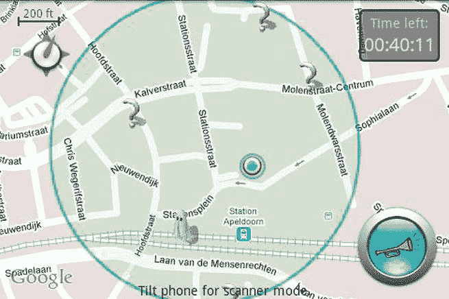
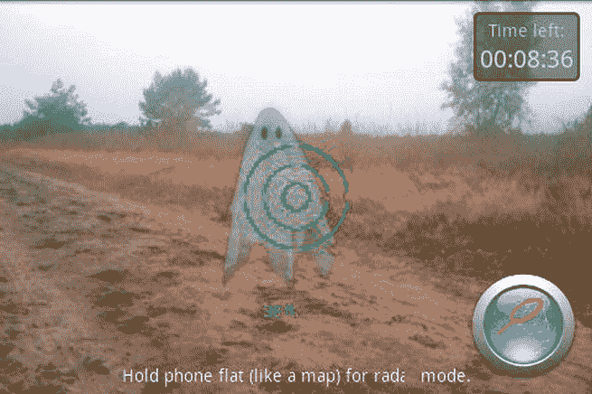

# 一、增强现实的应用

增强现实 ( *AR* )是一个相当新的、但仍然很大的领域。它没有很大的市场份额，而且它目前的大部分应用都只是原型。这使得 AR 成为一个非常令人期待且尚未开发的利基市场。目前 Android 市场上实现 AR 技术的应用非常少。这一章描述了 AR 在现实世界中的应用，给出了例子(在可能的情况下提供了图片)，并讨论了现在是否有可能在 Android 平台上实现 AR。

### 增强现实与虚拟现实

增强现实(AR)和虚拟现实(VR)是界限有点模糊的领域。换一种说法，你可以把 VR 看成 AR 的前身，两者有部分重叠。这两种技术的主要区别在于，VR 不使用摄像头馈送。虚拟现实中显示的所有东西要么是动画，要么是预先录制的电影片段。

### 当前用途

尽管这是一个相对较新的领域，但有足够多的 AR 应用可供我们进行分类。在这里，我们来看看在 AR 世界中已经实现了什么。

#### 临时用户

有数百个使用 AR 的应用旨在供普通人使用。它们有许多类型——例如，游戏、世界浏览器和导航应用。他们通常使用加速度计和 GPS 来获取设备的位置和物理状态。这些应用是用来享受和使用的。Android 开发者挑战赛 2 的获奖应用之一是一款 AR 游戏: *SpecTrek* 。游戏使用你的 GPS 找到你的位置，然后为你准备幽灵在周围地区狩猎。这款游戏还有一张地图，上面的鬼魂在谷歌地图上显示为标记。在游戏过程中，幽灵被添加到相机图像上。

另一方面，导航应用有识别道路和转弯的代码，并用箭头标出路线。这个过程并不像听起来那么简单，但今天却经常这样做。

最后，世界浏览器可能是所有广泛使用的休闲应用中最复杂的。他们需要几个后端数据库，还需要来自几个传感器的大量现场信息。毕竟，浏览器还是要把所有东西放在一起，在屏幕上显示一组图标。几乎你在市面上看到的每一个 app，不管是不是 AR，第一眼看上去都很简单。但是如果你深入研究代码和后端，你会意识到它们中的大多数实际上非常非常复杂，需要很长时间来创建。

休闲 AR 应用的最好例子是 *SpecTrek* 和 *Wikitude* 。总之，这些应用利用了几乎所有你可以用来在 Android 平台上制作 AR 应用的东西。我强烈建议您安装它们，并熟悉 Android 上 ar 的功能。

这个类别的大多数应用都可以在 Android 平台上实现。在一些情况下，他们甚至不使用所有的传感器。其中一些会变得相当复杂。[图 1-1](#fig_1_1) 和[图 1-2](#fig_1_2) 显示了来自 *SpecTrek* 的截图。

**图 1-1。***SpecTrek 的截图*

*

**图 1-2。** *另一张* SpecTrek 的截图

#### 军事和执法

军事和执法机构的使用要复杂得多，技术也更先进。它们的范围从 AR 护目镜到旨在帮助训练的全模拟器。军方和一些执法机构拥有利用 AR 技术的模拟器。房间或交通工具内的宽屏幕，屏幕上显示各种场景，受训者必须决定最佳行动方案。

一些先进的特种部队团队有基本的 AR 护目镜，随着视野中的土地，显示海拔高度，视角，光线强度等信息。这些信息是在现场用数学公式计算出来的，因为这些护目镜没有配备互联网连接。

专业的夜视镜也配备了 AR 技术。这些护目镜显示位置和其他信息，并试图填补夜视镜本身无法照亮的空白。

几乎所有的无人驾驶车辆都实现了 AR。这些交通工具，尤其是空中交通工具，可能离它们的操作者有几千公里远。这些车辆的外部安装了一个或多个摄像头，将视频传输给操作人员。这些车辆中的大多数也配备了几个传感器。传感器数据与视频一起发送给操作员。该数据然后被处理并在视频上被增强。操作员系统上的算法处理视频，然后挑出并标记感兴趣的建筑物或物体。所有这些都以叠加的形式显示在视频上。

这些类型的应用很难在 Android 设备上实现，因为有两个主要问题:

*   低处理能力(尽管随着 2012 年 5 月发布的 HTC One X 和三星 Galaxy S3 四核手机的发布，这不是一个太大的问题。)
*   缺少更多的输入设备和传感器

#### 车辆

最近，车辆已经开始实施 AR 技术。挡风玻璃已经被大而宽的高清显示屏所取代。通常车辆上有多个屏幕，每个屏幕显示一个特定的方向。如果只有一个屏幕和多个摄像头，车辆将自动切换馈送或让用户选择这样做。车辆外部有几个摄像头，面向多个方向。屏幕上的图像覆盖了有用的数据，如小地图、指南针、方向箭头、备用路线、天气预报等等。目前，这种技术在飞机和火车上最为常见。采用这种技术的智能汽车正在市场上接受测试。潜艇和船只也在使用这项技术。最近停止的航天飞机也有这种 AR 技术。

这些应用可以在 Android 平台上以一种混合的方式实现。因为大多数 Android 设备似乎缺乏正常车辆所具有的功能，所以没有实现同类功能。另一方面，可以编写应用，通过使用 GPS 获得位置来帮助导航；使用方向 API 来获取方向；并使用加速度计来帮助获取车辆的速度。Android 设备提供 AR 电源，车辆提供车辆部分。

#### 医疗

增强现实手术如今变得越来越普遍。以这种方式完成的手术出错率更低，因为计算机在手术中提供了有价值的输入，并使用这些信息来控制机器人执行部分或全部手术。计算机通常可以实时提供替代方案和指导，以改进手术。AR 流以及其他数据也可以发送给远程医生，他们可以查看患者的信息，就好像患者就在他们面前一样。

AR 技术还有其他的医疗应用。AR 机器可以用来监测大量的病人，并确保他们的生命体征在任何时候都处于观察之中。

这种 AR 技术从未在 Android 平台上实现，原因有几个:

*   它需要设备上的大量信息，因为互联网连接还不够可靠，不足以让病人冒生命危险。
*   这些医疗任务中的一些所需的处理能力目前在设备上是不可用的。
*   在外科手术和帮助医疗任务方面，Android 设备没有很大的市场。

最重要的是，目前设计和构建这样一个应用非常困难和昂贵。允许在医疗领域进行实时增强现实工作所需的人工智能算法还没有出现。除此之外，你还需要一个非常优秀的开发团队，一个技术高超、经验丰富的医生团队，以及大量的资金。

#### 审判室

在几家商店中，AR 正在作为虚拟审判室进行试验。用户可以站在屏幕前，在某处安装一台摄像机。用户将看到自己显示在屏幕上。然后，用户使用鼠标或键盘等输入设备来选择任何可用的服装选项。然后，计算机会将该项目放大到用户的图像上，并显示在屏幕上。用户可以从各个角度观看自己。

原则上，这些应用可以为 Android 平台编写，但没有人这样做，因为缺乏兴趣，可能是因为不知道为什么有人会想要这样做。实际上这种类型的应用已经出现，但它们实际上是用于娱乐和修改人的面部特征。

#### 旅游

旅游业也受到了 AR 魔力的影响。在世界各地的几个著名景点，有组织的旅游现在提供了一个头戴式 AR 系统，当你查看它时，它会显示当前网站及其建筑的信息。通过 AR，游客可以重建过去存在的建筑、城市、景观和地形。旅游 AR 也是大多数世界浏览应用的内置部分，因为它们提供了著名古迹的标记。旅游 AR 不仅限于历史古迹。它可用于查找陌生城市的公园、餐馆、酒店和其他与旅游相关的地点和景点。虽然没有被广泛使用，但在过去的几年里，它已经呈指数级增长。

这些应用的功能已经出现在世界各地的浏览器中，但显示的信息很少。还没有人实现过任何一个城市的完整版本，可以提供所需的信息。

#### 建筑

有许多配有摄像头的机器可以从现有的结构中生成蓝图，或者在拟议的建筑工地上显示蓝图中的虚拟结构。这些加快了建筑工作，并有助于设计和检查建筑物。AR 还可以模拟自然灾害条件，并显示建筑结构在这种压力下将如何反应。

这个细分市场的应用在一定程度上可以在 Android 上编写。那些从房间的角度创建蓝图的软件已经为 iOS 平台编写，也可以为 Android 编写。那些在建筑规模上显示虚拟模型的方法有点困难，但仍然可行，只要要增强的模型能够适应 Android 进程和设备 RAM 的大小限制。

#### 装配线

AR 技术在各种装配线上都有很大帮助，无论你是组装汽车、飞机、手机还是其他任何东西。预编程的护目镜可以提供如何组装它的分步说明。

这些应用可以为 Android 编写，只要组装过程可以在每个需要增加指令的步骤中加入标记。在这种情况下，信息可以存储在远程后端。

#### 电影/表演

AR 技术已被用于增强电影和戏剧，通过静态背景和覆盖其上的屏幕来产生图像和场景，否则需要昂贵和高度详细的布景。

这是一个真正可行的选择。你所需要做的就是获取表演的素材或背景信息，在适当的地方放置标记，并在需要时增加素材或背景。

#### 娱乐

在世界各地的几个游乐园中，AR 技术正被用于制作适合单个房间的游乐设施，并设法给你一整个游乐设施的体验。你将被安排坐在一辆装有液压装置的汽车或其他交通工具上。你的四周都被巨大的屏幕包围着，屏幕上显示着整个场景。根据场景是来自现场摄像机还是动画，这可能属于 VR 和 AR。随着虚拟轨道的前进，车辆在空中移动。如果轨道向下，车辆将向下倾斜，你实际上会感觉好像在向下移动。为了提供更真实的体验，AR 技术还配有一些风扇或喷水设备。

在 Android 上实现这一点是可能的，但是有一些限制。为了获得完全身临其境的体验，你需要一个大屏幕。一些平板电脑可能会提供足够的空间来获得良好的体验，但在手机上实现这一点有点过于乐观。此外，液压安装的车辆用于实际的游乐设施，以提供完整的运动体验。作为补偿，你需要一些创新思维。

#### 教育

AR 技术已经成功地用于各种教育机构，作为教科书材料的附加内容，或者本身作为虚拟的 3d 教科书。通常使用头戴式设备，AR 体验可以让学生“重温”已知发生的事件，而无需离开课堂。

这些应用可以在 Android 平台上实现，但你需要一些课程材料供应器的支持。像这样的应用也有可能将 AR 推到最前沿，因为它们有非常大的潜在用户群。

#### 艺术

AR 技术可以并且已经被用于帮助创作绘画、模型和其他形式的艺术。它还帮助残疾人实现他们的创作天赋。AR 还被广泛用于试验一种特定的设计，然后实际用墨水写下来或用石头雕刻出来。例如，画可以被虚拟地画出来，看它们是如何产生的，被提炼直到艺术家对它们满意，然后最终被放到画布上。

这些类型的应用也是可能的。他们将需要有几个美术相关的功能，很可能很少使用传感器。理想情况下，该设备应该有一个高分辨率的屏幕，再加上一个高分辨率的摄像头。

#### 翻译

在世界各地，支持 AR 的设备正被用于翻译多种语言的文本。这些设备具有 OCR 功能，或者在设备上有一个完整的跨语言词典，或者通过互联网翻译语言。

这些应用已经投入生产。您需要编写或使用现成的光学字符识别(OCR)库来将相机中的图像转换为文本。从图像中提取文本后，你可以使用设备上的翻译词典，它必须与应用捆绑在一起，或者通过互联网翻译并显示结果。

#### 天气预报

几乎每个新闻频道都有气象预报员在他身后的世界地图上预报天气。事实上，这些应用大多数都是增强版的。预报员站在巨大的绿色背景前。录制时，绿色背景充当标记。记录完成后，用电脑添加地图并定位，以配合预报员的行动。如果将预报实时传输给查看者，则在传输预报时会添加地图。

#### 电视

AR 也可以在日常生活中找到。许多游戏节目，尤其是有问题的节目，通过玩家的视频来增加这些信息。即使在现场直播的体育比赛中，比分和其他与比赛相关的信息也会在视频中增加并发送给观众。稍微烦人的广告也增加了。

许多提供体育比赛直播的应用目前都实现了这一功能。

#### 天文学

有许多应用对天文学家很有用，对其他人也很有趣。这些应用可以在白天或有雾的夜晚显示星星和星座的位置，并(或多或少)实时显示。

#### 其他

AR 还有很多很多的用途，不能这么容易归类。它们大多仍处于设计和规划阶段，但有潜力将 AR 技术推向日常小工具的前沿。

### 未来用途

正如上一节所讨论的，AR 非常有名，并且有足够多的应用可供使用，值得关注。然而，由于硬件和算法的限制，这项技术有一些令人惊讶的用途现在还不能实现。

#### 虚拟体验

在未来，AR 技术可以用来创造虚拟体验。你可以有一个头戴式系统，可以将你当前的位置转换成完全不同的东西。例如，你可以通过佩戴这样的系统来体验电影，并看到电影在你身边发生。你可以把你的房子改造成中世纪的城堡或者国际空间站。加上听觉 AR 和一些气味发射技术，整个体验可以变得栩栩如生，感觉完全真实。除此之外，穿上可以模仿触觉的连体衣会让它变得绝对且不可否认的真实。

如果它出现的话，这将很难在 Android 上实现，因为 Android 缺乏实现这种事情所需的传感器和输入方法。它的视觉功能可以在一定程度上实现，但声音和感觉功能将遥不可及，除非有人在移植版本的 Android 上创建一个带有头戴式显示器和声音的紧身衣。

#### 不可能的模拟

AR 技术可以做真正的硬件做不到的事情，至少目前是这样。你可以在屏幕上放一个普通的物体，比如一个立方体。然后你可以对这个立方体施加各种场景和力，看看结果如何。你不能用真实的硬件做到这一点，因为真实的硬件通常不被破坏就不能改变形状。你也可以用实验来测试理论，否则这将是极其昂贵或完全不可能的。

等到其他真实世界的模型开发出来的时候，这也许有可能在 Android 上实现，因为高端模拟的唯一硬性要求是数据和大量的处理能力。按照手机功能不断增强的速度，它们可能会快到足以运行此类应用。

#### 全息图

AR 允许用户直接或间接观看世界，这可能使用户在他们面前拥有全息图。这些全息图可以是交互式的，或者仅仅是描述性的。他们可以展示任何东西。

即使在今天，使用标记显示模型的应用的高度修改版本也可以做到这一点。代替静态模型，应用可以显示动画或录音或直播。然而，这不会提供真正的全息图体验，因为它将只在设备的屏幕上。

#### 视频会议

AR 可以允许多个人出现在同一个会议室，如果将会议室的视频传送给他们的话。人们可以使用网络摄像头和其他人一起“出现”在房间的座位上。这可以创造一个合作的环境，即使合作者相隔几千公里。

这个应用可以通过一些高级定位算法和高速互联网连接来实现。你需要算法，因为参加会议的人不可能一直呆在同一个地方。你需要一次又一次地定位他们，这样他们就不会和其他人重叠。

#### 电影

AR 可以用来播放整部电影。剧院可以用电影的背景来代替，或者剧院可以只用演员来代替。在第一种方法中，演员可以被增强到背景上，而在第二种方法中，背景可以在演员后面被增强。这些可以提供更真实和有趣的电影，同时保持拍摄成本下降。

像这样的应用已经在生产中，但在质量、受欢迎程度和复杂程度上还不足以让我把它从未来的实现中拖出来。虽然这些应用并不容易制作，但它们也不是很难。

#### 手势控制

AR 可以用来实现许多手势控制，例如眼睛拨号。相机可以跟踪用户的眼球运动来选择适当的数字键。选择所需的按键后，用户可以眨眼按下该数字，然后继续选择下一个按键。这同样可以用来控制音乐播放器、移动应用、电脑和其他形式的技术。

这类应用需要几样东西:

*   分辨率合理的前置摄像头
*   写得很好的算法来检测精细的眼球运动，并能够将它们与其他运动区分开来，例如检查侧视镜

AR 从一开始就已经走过了很长的路，还有很长的路要走。它的基本要求是摄像头、GPS、加速度计和指南针，几乎市场上的每一款 Android 设备都满足了这些要求。虽然使用 AR 技术的应用存在于 Android 平台，但与其他类型的应用相比，它们在数量上很少。现在是通过制作 AR 应用进入 Android 平台的好时机，因为竞争足够激烈，足以推动用户对这些应用产生兴趣，但还没有激烈到把你赶出这个行业。考虑到市场上相对较少的 AR 应用，如果你想出一个好的 AR 应用，它的竞争应用不会超过 3-5 个，这也是一个很好的机会，给你一个很大的优势。下一章讲解 Android 上 AR 应用的基础知识，开发一个基础应用。

### 总结

这就结束了我们对 AR 的当前和未来使用及其在 Android 平台上的实现(或可能的实现)的观察。下一章着眼于在 Android 上创建 AR 应用的基础。*