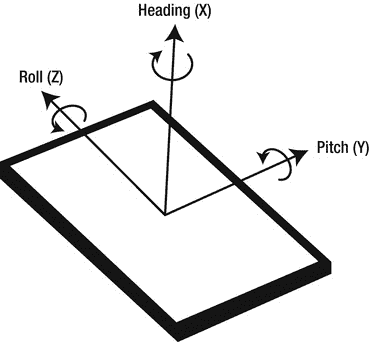
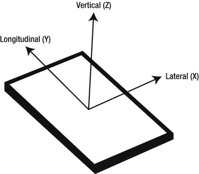
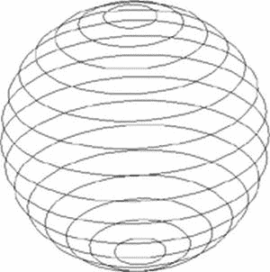
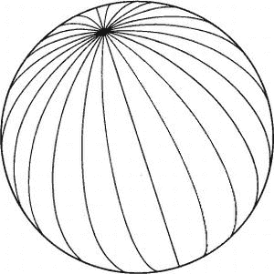
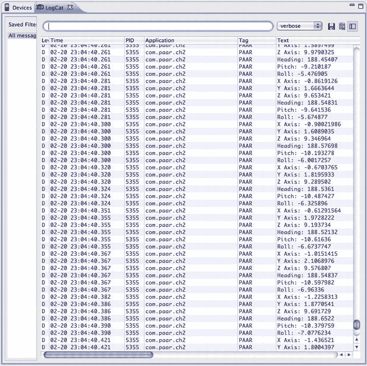

## 第二章

## Android 平台上增强现实的基础知识

现在，你对什么是增强现实(AR)、世界各地正在用它做什么以及你可以在 Android 设备上用它做什么有了一个基本的概念。本章将带你进入 Android 上的 AR 世界，并教你它的基础知识。为了帮助你理解本书中这里(和其他地方)所做的一切，我们将创建应用程序来演示我们正在学习的内容。本章将专注于制作一个基本的应用程序，它包含任何高级 AR 应用程序的四个主要部分:相机、GPS、加速度计和指南针。

### 创建应用程序

这是一个非常简单的应用程序。它从 GPS、指南针、照相机和加速度计接收的任何数据都没有覆盖和实际用途。在下一章，我们将在这个应用程序的基础上添加覆盖图。

首先，我们需要创建一个新项目。在包名中，我使用的是 com.paar.ch2。您可以使用任何适合您的名称，但请确保更改这里代码中的任何引用，以匹配您的包名。该项目应设置为至少支持 Android 2.1。我正在针对 Android 4.0(冰淇淋三明治)构建项目，但您可以选择自己的目标。

### 照相机

每个 AR 应用中的第一件事是*相机*，它构成了 AR 中 99%的现实(另外 1%由 3 个基本传感器组成)。要在您的应用程序中使用相机，我们首先需要将权限请求和`uses-feature`行添加到我们的清单中。我们还必须告诉 Android，我们希望我们的活动是风景，我们将自己处理某些配置更改。添加之后，清单应该类似于[清单 2-1](#list_2_1) :

**清单 2-1。** *更新舱单代码*

`<?xml version="1.0" encoding="utf-8"?>
<manifest xmlns:android="http://schemas.android.com/apk/res/android"
package="com.paar.ch2"
android:versionCode="1"
android:versionName="1.0" >

<uses-sdk android:minSdkVersion="7" />

<application
android:icon="@drawable/ic_launcher"
android:label="@string/app_name" >
<activity
android:label="@string/app_name"
android:name=".ProAndroidAR2Activity"
***android:screenOrientation = "landscape"***
android:theme="@android:style/Theme.NoTitleBar.Fullscreen"
***android:configChanges = "keyboardHidden|orientation">***
<intent-filter >
<action android:name="android.intent.action.MAIN" />

<category android:name="android.intent.category.LAUNCHER" />
</intent-filter>
</activity>
</application>
***<uses-feature android:name="android.hardware.camera" />***
***<uses-permission android:name="android.permission.CAMERA" />***
</manifest>`

我们也可以在`<application>`元素开始之前添加权限；请确保它是清单的一部分，并且没有侵入任何其他元素。

现在让我们来看看实际的摄像机代码。相机需要一个`SurfaceView`，在上面它会渲染它看到的东西。我们将使用`SurfaceView`创建一个 XML 布局，然后使用那个`SurfaceView`来显示相机预览。将您的 XML 文件(在本例中为`main.xml`)修改如下:

**清单 2-2。**T3】修改 main.xml

`<?xml version="1.0" encoding="utf-8"?>
<android.view.SurfaceView
xmlns:android="http://schemas.android.com/apk/res/android"
android:id="@+id/cameraPreview"
android:layout_width="fill_parent"
android:layout_height="fill_parent" >
</android.view.SurfaceView>`

这段代码没有什么突破性的东西。我们没有使用普通的布局，比如`LinearLayout`或`RelativeLayout`，而是简单地向 XML 文件添加了一个`SurfaceView`，其高度和宽度属性被设置为允许它填充整个可用屏幕。我们给它分配 ID `cameraPreview`，这样我们就可以从代码中引用它。现在重要的一步是使用 Android 相机服务，并告诉它连接到我们的`SurfaceView`来显示来自相机的实际预览。

要实现这一点，需要做三件事:

1.  我们创建一个`SurfaceView`，它在我们的 XML 布局中。
2.  我们还需要一个`SurfaceHolder`，它控制我们的`SurfaceView`的行为(例如，它的大小)。当发生变化时，例如当预览开始时，它也会得到通知。
3.  We need a `Camera`, obtained from the `open()` static method on the `Camera` class.

    要将所有这些串联起来，我们只需做以下事情:

4.  通过`getHolder()`获取`SurfaceView`的`SurfaceHolder`。
5.  注册一个`SurfaceHolder.Callback`,这样当我们的`SurfaceView`准备好或改变时，我们会得到通知。
6.  通过`SurfaceHolder`告诉`SurfaceView`，它有`SURFACE_TYPE_PUSH_BUFFERS`类型(使用`setType()`)。这表明系统中的某些东西将更新`SurfaceView`并提供位图数据来显示。

在你吸收和理解了所有这些之后，你就可以进行实际的编码工作了。首先，声明以下变量，并添加导入。完成后，您的类的顶部应该看起来像这样:

**清单 2-3。** *进口和变量申报*

`package com.paar.ch2;

import android.app.Activity;
import android.hardware.Camera;
import android.os.Bundle;
import android.util.Log;
import android.view.SurfaceHolder;
import android.view.SurfaceView;

public class ProAndroidAR2Activity extends Activity {
SurfaceView cameraPreview;
SurfaceHolder previewHolder;
Camera camera;
boolean inPreview;`

让我详细说明进口。第一个和第三个是显而易见的，但第二个是重要的，因为它是相机。确保从硬件包而不是图形包中导入`Camera`，因为那是一个不同的`Camera`类。`SurfaceView`和`SurfaceHolder`同样重要，但是没有两个选项可供选择。

关于变量。`cameraPreview`是一个`SurfaceView`变量，它将保存对 XML 布局中`SurfaceView`的引用(这将在`onCreate()`中完成)。`previewHolder`是管理`SurfaceView`的`SurfaceHolder`。`camera`是`Camera`对象，将处理所有相机的东西。最后，`inPreview`是我们的小布尔朋友，它将使用他的二元逻辑告诉我们一个预览是否是活动的，并给我们指示，以便我们可以正确地发布它。

现在我们继续为我们的小应用程序使用`onCreate()`方法:

**清单 2-4。** *onCreate()*

`@Override
public void onCreate(Bundle savedInstanceState) {
super.onCreate(savedInstanceState);
setContentView(R.layout.main);

inPreview = false;

cameraPreview = (SurfaceView)findViewById(R.id.cameraPreview);
previewHolder = cameraPreview.getHolder();
previewHolder.addCallback(surfaceCallback);
previewHolder.setType(SurfaceHolder.SURFACE_TYPE_PUSH_BUFFERS);
}`

我们将我们的视角设置为我们心爱的`main.xml`，将`inPreview`设置为`false`(我们现在不显示相机的预览)。之后，我们从 XML 文件中找到我们的 `SurfaceView`，并将其赋给`cameraPreview`。然后我们运行`getHolder()`方法，添加我们的回调(我们将在几分钟后进行这个回调；不用担心现在会弹出的错误)，将`previewHolder`的类型设置为`SURFACE_TYPE_PUSH_BUFFERS`。

现在一个`Camera`对象采用一个`setPreviewDisplay()`方法，该方法采用一个`SurfaceHolder`并安排摄像机预览显示在相关的`SurfaceView`上。然而，`SurfaceView`在转换到`SURFACE_TYPE_PUSH_BUFFERS`模式后可能不会立即准备好。因此，虽然之前的设置工作可以在`onCreate()`方法中完成，但是我们应该等到`SurfaceHolder.Callback`调用了它的`surfaceCreated()`方法之后再注册`Camera`。有了这个小小的解释，我们可以回到编码:

**清单 2-5。** *表面回调*

`SurfaceHolder.Callback surfaceCallback=new SurfaceHolder.Callback() {
public void surfaceCreated(SurfaceHolder holder) {
try {
camera.setPreviewDisplay(previewHolder);
}
catch (Throwable t) {
Log.e("ProAndroidAR2Activity", "Exception in
setPreviewDisplay()", t);
}
}`

现在，一旦 Android 对`SurfaceView`进行了设置和调整，我们需要将配置数据传递给`Camera`,这样它就知道应该绘制多大的预览。由于 Android 已经移植并安装在数百种不同的硬件设备上，因此没有办法安全地预先确定预览窗格的大小。等待我们的`SurfaceHolder.Callback`的`surfaceChanged()`方法被调用是非常简单的，因为这可以告诉我们`SurfaceView`的大小。然后我们可以将这些信息推入到一个`Camera.Parameters`对象中，用这些参数更新`Camera`，并让`Camera`通过`startPreview()`显示预览。现在我们可以回到编码:

**清单 2-6。** *sufaceChanged()*

`public void surfaceChanged(SurfaceHolder holder, int format, int width, int
height) {
Camera.Parameters parameters=camera.getParameters();
Camera.Size size=getBestPreviewSize(width, height, parameters);

if (size!=null) {
parameters.setPreviewSize(size.width, size.height);
camera.setParameters(parameters);` `camera.startPreview();
inPreview=true;
}
}`

最终，您会希望您的应用程序释放相机，并在需要时重新获取它。这将节省资源；而且很多设备只有一个物理摄像头，一次只能在一个活动中使用。有多种方法可以做到这一点，但是我们将使用`onPause()`和`onResume()`方法:

**清单 2-7。** *onResume()和 onPause()*

`@Override
public void onResume() {
super.onResume();

camera=Camera.open();
}

@Override
public void onPause() {
if (inPreview) {
camera.stopPreview();
}

camera.release();
camera=null;
inPreview=false;

super.onPause();
}`

当活动被销毁时，您也可以这样做，如下所示，但我们不会这样做:

**清单 2-8。** *【地表摧毁】(*

`public void surfaceDestroyed(SurfaceHolder holder) {
camera.stopPreview();
camera.release();
camera=null;
}`

现在，我们的小演示应用程序应该可以编译并显示相机在屏幕上看到的漂亮预览。然而，我们还没有完全完成，因为我们还需要添加三个传感器。

这就把我们带到了应用程序的相机部分的末尾。这是到目前为止这个类的全部代码，包含了所有的内容。您应该将其更新为如下所示，以防遗漏某些内容:

**清单 2-9。** *完整代码清单*

`package com.paar.ch2;

import android.app.Activity;
import android.hardware.Camera;
import android.os.Bundle;
import android.util.Log;
import android.view.SurfaceHolder;
import android.view.SurfaceView;

public class ProAndroidAR2Activity extends Activity {
SurfaceView cameraPreview;
SurfaceHolder previewHolder;
Camera camera;
boolean inPreview;
@Override
public void onCreate(Bundle savedInstanceState) {
super.onCreate(savedInstanceState);
setContentView(R.layout.main);

inPreview = false;

cameraPreview = (SurfaceView)findViewById(R.id.cameraPreview);
previewHolder = cameraPreview.getHolder();
previewHolder.addCallback(surfaceCallback);
previewHolder.setType(SurfaceHolder.SURFACE_TYPE_PUSH_BUFFERS);
}

@Override
public void onResume() {
super.onResume();

camera=Camera.open();
}

@Override
public void onPause() {
if (inPreview) {
camera.stopPreview();
}

camera.release();
camera=null;
inPreview=false;

super.onPause();
}` `private Camera.Size getBestPreviewSize(int width, int height,
Camera.Parameters parameters) {
Camera.Size result=null;

for (Camera.Size size : parameters.getSupportedPreviewSizes()) {
if (size.width<=width && size.height<=height) {
if (result==null) {
result=size;
}
else {
int resultArea=result.width*result.height;
int newArea=size.width*size.height;

if (newArea>resultArea) {
result=size;
}
}
}
}

return(result);
}

SurfaceHolder.Callback surfaceCallback=new SurfaceHolder.Callback() {
public void surfaceCreated(SurfaceHolder holder) {
try {
camera.setPreviewDisplay(previewHolder);
}
catch (Throwable t) {
Log.e(TAG, "Exception in setPreviewDisplay()", t);
}
}

public void surfaceChanged(SurfaceHolder holder, int format, int width,
int height) {
Camera.Parameters parameters=camera.getParameters();
Camera.Size size=getBestPreviewSize(width, height, parameters);

if (size!=null) {
parameters.setPreviewSize(size.width, size.height);
camera.setParameters(parameters);
camera.startPreview();
inPreview=true;
}
}

public void surfaceDestroyed(SurfaceHolder holder) {
// not used` `}

};
}`

### 方位传感器

*方位传感器*是磁场传感器和加速度传感器的组合。有了这两个传感器的数据和一点三角学，你就可以得到设备的`pitch`、`roll`和`heading` ( `azimuth`)。如果你喜欢三角学，你会失望地知道 Android 为你做了所有的计算，你可以简单地从一个`SensorEvent`中取出数值。

**注意:**磁场罗盘在金属物体周围会变得有点疯狂。猜猜测试时什么大型金属物体可能会靠近您的设备？你的电脑！如果你的读数不是你所期望的，请记住这一点。

[图 2-1](#fig_2_1) 显示了方位传感器的轴。

**图 2-1。** *装置的斧子。*

在我们开始从 Android 中获取这些价值并使用它们之前，让我们多了解一点它们到底是什么。

*   **X 轴或航向**:X 轴有点像指南针。它测量设备面向的方向，其中 0°或 360°为北，90°为东，180°为南，270°为西。
*   **Y 轴或俯仰**:该轴测量设备的倾斜度。如果设备是平的，读数将是 0；如果顶部指向天花板，读数将是 90；如果设备是倒置的，读数将是 90。
*   **Z 轴或滚动**:该轴测量设备的侧向倾斜。0°是平背，-90°是朝左，90°是屏幕朝右。

实际上有两种方法可以获得前面的数据。您可以直接查询方位传感器，或者分别获取加速度计和磁场传感器的读数，并计算方位。后者要慢几倍，但精度更高。在我们的应用程序中，我们将直接查询方向传感器。您可以从将下列变量添加到您的类开始:

**清单 2-10。** *新变量声明*

`final static String TAG = "PAAR";
SensorManager sensorManager;

int orientationSensor;
float headingAngle;
float pitchAngle;
float rollAngle;`

字符串`TAG`是一个常量，我们将在所有日志语句中使用它作为标签。`sensorManager`将用于获取我们所有的传感器数据，并管理我们的传感器。浮动`headingAngle`、`pitchAngle`和`rollAngle`将分别用于存储设备的航向、俯仰和横滚。

添加完上面给出的变量后，将下面几行添加到您的`onCreate()`:

**清单 2-11。** *实现传感器管理器*

`sensorManager = (SensorManager) getSystemService(SENSOR_SERVICE);
orientationSensor = Sensor.TYPE_ORIENTATION;
sensorManager.registerListener(sensorEventListener,
sensorManager.getDefaultSensor(orientationSensor),
SensorManager.SENSOR_DELAY_NORMAL);`

是一个系统服务，我们在第一行中得到对它的引用。然后，我们将`Sensor.TYPE_ORIENTATION`的常数值分配给`orientationSensor`，该常数值基本上是给予方位传感器的常数。最后，我们为默认方位传感器注册我们的`SensorEventListener`,带有正常延迟。`SENSOR_DELAY_NORMAL`适合 UI 改动，`SENSOR_DELAY_GAME`适合在游戏中使用，`SENSOR_DELAY_UI`适合更新 UI 线程，`SENSOR_DELAY_FASTEST`是硬件支持最快的。这些设置告诉 Android 您希望传感器更新的频率。Android 不会总是在指定的时间间隔给出它。它返回的值可能稍慢或稍快—通常更快。您应该只使用您需要的延迟，因为传感器消耗大量的 CPU 和电池寿命。

现在，`sensorEventListener`下面应该有一条红色下划线。这是因为到目前为止，我们实际上还没有创建侦听器；我们现在就去做:

**清单 2-12。** *sensorEventListener*

`final SensorEventListener sensorEventListener = new SensorEventListener() {
public void onSensorChanged(SensorEvent sensorEvent) {
if (sensorEvent.sensor.getType() == Sensor.TYPE_ORIENTATION)
{
headingAngle = sensorEvent.values[0];
pitchAngle = sensorEvent.values[1];
rollAngle = sensorEvent.values[2];

Log.d(TAG, "Heading: " + String.valueOf(headingAngle));
Log.d(TAG, "Pitch: " + String.valueOf(pitchAngle));
Log.d(TAG, "Roll: " + String.valueOf(rollAngle));
}
}

public void onAccuracyChanged (Sensor senor, int accuracy) {
//Not used
}
};`

我们创建并注册`sensorEventListener`作为新的`SensorEventListener`。然后，当传感器的值改变时，我们使用`onSensorChanged()`方法接收更新。因为`onSensorChanged()`接收所有传感器的更新，所以我们使用一个`if`语句来过滤掉除方位传感器之外的所有东西。然后，我们将来自传感器的值存储在变量中，并将它们打印到日志中。我们也可以在相机预览中叠加这些数据，但这超出了本章的范围。我们现在也有`onAccuracyChanged()`方法，我们现在不使用它。根据 Eclipse 的说法，它之所以存在，是因为您必须实现它。

现在，为了让我们的应用程序运行良好，并且不会耗尽用户的电池，我们将在`onResume()`和`onPause()`方法中注册和注销我们的传感器。将它们更新为以下内容:

**清单 2-13。** *onResume()和 onPause()*

`@Override
public void onResume() {
super.onResume();
sensorManager.registerListener(sensorEventListener, sensorManager
.getDefaultSensor(orientationSensor), SensorManager.SENSOR_DELAY_NORMAL);
camera=Camera.open();
}

@Override
public void onPause() {
if (inPreview) {
camera.stopPreview();
}
sensorManager.unregisterListener(sensorEventListener);
camera.release();
camera=null;
inPreview=false;

super.onPause();
}`

这就完成了方向传感器的部分。我们现在来看看加速度计传感器。

### 加速度计

*加速度计*测量沿三个方向轴的加速度:左右(横向(X))、前后(纵向(Y))和上下(垂直(Z))。这些值在值的浮点数组中传递。

[图 2-2](#fig_2_2) 显示了加速度计的轴线。

**图 2-2。** *加速度计轴*

在我们的应用程序中，我们将接收加速度计值，并通过 LogCat 输出它们。在本书的后面，我们将使用加速度计来确定速度和其他东西。

让我们快速看一下加速度计的轴，以及它们到底测量什么。

*   **X 轴**:在带有普通加速度计的普通设备上，X 轴测量横向加速度。即从左到右；从右到左。如果你把它移到右边，读数是正的，如果你把它移到左边，读数是负的。例如，一个设备平躺着，面朝上，在纵向上沿着你右边的表面移动，会在 X 轴上产生一个正读数。
*   **Y 轴**:Y 轴的功能与 X 轴相同，只是它测量纵向加速度。当保持在 X 轴上描述的相同配置的设备沿其顶部方向移动时，记录正读数，如果沿相反方向移动，记录负读数。
*   **Z 轴**:该轴测量上下运动的加速度，读数为正表示向上运动，读数为负表示向下运动。当静止时，由于重力的作用，你会得到大约-9.8 米/秒 2 的读数。在你的计算中，应该考虑到这一点。

现在开始编码工作吧。我们将使用与之前相同的加速度计`SensorManager`。我们只需要添加一些变量，获得加速度传感器，并在`onSensorChanged()`方法中添加另一个过滤`if`语句。让我们从变量开始:

**清单 2-14。** *加速度计变量*

`int accelerometerSensor;
float xAxis;
float yAxis;
float zAxis;`

`accelerometerSensor`将用于存储加速度计的常数，`xAxis`将存储传感器返回的 X 轴值，`yAxis`将存储传感器返回的 Y 轴值，`zAxis`将存储传感器返回的 Z 轴值。

添加变量后，我们还需要在`onCreate()`方法中更新与传感器相关的代码，这样我们就可以在`onSensorChanged()`方法中使用和监听加速度计。将`onCreate()`中的传感器代码修改如下:

**清单 2-15。** *修改 onCreate()*

`sensorManager = (SensorManager) getSystemService(SENSOR_SERVICE);

orientationSensor = Sensor.TYPE_ORIENTATION;
accelerometerSensor = Sensor.TYPE_ACCELEROMETER;

sensorManager.registerListener(sensorEventListener, sensorManager
.getDefaultSensor(orientationSensor), SensorManager.SENSOR_DELAY_NORMAL);

sensorManager.registerListener(sensorEventListener, sensorManager
.getDefaultSensor(accelerometerSensor), SensorManager.SENSOR_DELAY_NORMAL);`

我们只是简单地为加速度计重复了我们已经为方向传感器所做的，所以你应该可以理解这里发生了什么。现在我们必须更新`sensorEventListener`来监听加速度计，方法是将代码改为如下:

**清单 2-16。** *修改了 sensorEventListener()*

`final SensorEventListener sensorEventListener = new SensorEventListener() {
public void onSensorChanged(SensorEvent sensorEvent) {
if (sensorEvent.sensor.getType() == Sensor.TYPE_ORIENTATION)
{
headingAngle = sensorEvent.values[0];
pitchAngle = sensorEvent.values[1];` `rollAngle = sensorEvent.values[2];

Log.d(TAG, "Heading: " + String.valueOf(headingAngle));
Log.d(TAG, "Pitch: " + String.valueOf(pitchAngle));
Log.d(TAG, "Roll: " + String.valueOf(rollAngle));
}

***else if (sensorEvent.sensor.getType() == Sensor.TYPE_ACCELEROMETER)***
***{***
***xAxis = sensorEvent.values[0];***
***yAxis = sensorEvent.values[1];***
***zAxis = sensorEvent.values[2];***

***Log.d(TAG, "X Axis: " + String.valueOf(xAxis));***
***Log.d(TAG, "Y Axis: " + String.valueOf(yAxis));***
***Log.d(TAG, "Z Axis: " + String.valueOf(zAxis));***

***}***
}`

同样，我们正在重复我们对方向传感器所做的，以监听加速度计传感器的变化。我们使用`if`语句来区分两个传感器，用新值更新适当的浮点数，并将新值打印到日志中。现在剩下的就是更新`onResume()`方法来再次注册加速度计:

**清单 2-17。** *修改 onResume()*

`@Override
public void onResume() {
super.onResume();

sensorManager.registerListener(sensorEventListener, sensorManager
.getDefaultSensor(orientationSensor), SensorManager.SENSOR_DELAY_NORMAL);

***sensorManager.registerListener(sensorEventListener, sensorManager***
***.getDefaultSensor(accelerometerSensor), SensorManager.SENSOR_DELAY_NORMAL);***

camera=Camera.open();
}`

我们不需要改变`onPause()`中的任何东西，因为我们在那里注销了整个监听器，包括所有相关的传感器。

这样，我们就到了两个传感器的终点。现在剩下的就是实现 GPS 来完成我们的应用程序。

### 全球定位系统

*全球定位系统(GPS)* 是一种定位系统，可以通过卫星给出极其精确的位置。这将是我们惊人的小演示应用程序的最后一部分。

首先，让我们简要了解一下 GPS 的历史及其工作原理。

GPS 是一种基于空间的卫星导航系统。它由美国管理，任何拥有 GPS 接收器的人都可以使用，尽管它最初只打算用于军事用途。

最初，一个接收器可以与 24 颗卫星通信。多年来，该系统已经升级到 31 颗卫星，加上目前标记为备用的 2 颗旧卫星。在任何时候，从地面上至少可以看到九颗卫星，而其余的则看不到。

为了获得定位，接收器必须与至少四颗卫星通信。卫星向接收器发送三条信息，然后这些信息被输入许多算法中的一种，以找到实际位置。这三部分是广播时间、特定卫星的轨道位置和所有其他卫星的粗略位置(系统健康或历书)。使用三角学计算位置。这可能会让你认为，在这种情况下，三颗卫星就足以获得定位，但通信中的定时误差乘以算法中使用的光速，会导致最终位置出现非常大的误差。

对于我们的传感器数据，我们使用了`SensorManager`。然而，为了使用 GPS，我们将使用一个`LocationManager`。虽然我们使用了一个`SensorEventListener`传感器，我们将使用一个`LocationListener`全球定位系统。首先，我们将声明将要使用的变量:

**清单 2-18。** *声明 GPS 变量*

`LocationManager locationManager;
double latitude;
double longitude;
double altitude;`

我们将只从我们的`Location`对象获取纬度、经度和高度，但是如果你愿意，你也可以获取方位、时间等等。这完全取决于你希望你的应用程序做什么，以及你需要什么数据来做到这一点。在我们开始实际获取所有这些数据之前，让我们看一下纬度和经度是什么。

### (经纬度)

*纬度*是地球网格系统的一部分；它们是从北极到南极的假想圆圈。赤道是 0 线，是纬度中唯一一个大圆。所有的纬度都相互平行。每个纬度距离它的上一个和下一个纬度大约 69 英里，或 111 公里。确切的距离因地球的曲率而异。

[图 2-3](#fig_2_3) 显示了球体的概念。

**图 2-3。** *纬度的图示*

*经度*也是地球网格系统的假想线。它们从北极运行到南极，在两极汇合。每个经度是一个大圆的一半。经度 0°被称为本初子午线，穿过英国格林威治。两个经度之间的距离在赤道处最大，大约为 69 英里，或 111 公里，与两个纬度之间的距离大致相同。

[图 2-4](#fig_2_4) 显示了另一个球体上的概念。

**图 2-4。** *经度的图示*

对纬度和经度有了新的理解后，我们可以继续从系统获取服务，并通过`onCreate()`方法请求位置更新:

**清单 2-19。** *在 onCreate()中请求位置更新*

`locationManager = (LocationManager) getSystemService(LOCATION_SERVICE);
locationManager.requestLocationUpdates(LocationManager.GPS_PROVIDER, 2000, 2,
locationListener);`

首先，我们从 Android 获得位置服务。之后，我们使用`requestLocationUpdates()`方法请求位置更新。第一个参数是我们想要使用的提供者的常量(在本例中是 GPS)。我们也可以使用手机网络。第二个参数是更新之间的时间间隔，以毫秒为单位，第三个参数是设备应该移动的最小距离，以米为单位，最后一个参数是应该通知的`LocationListener`。

现在，`locationListener`应该有红色下划线。那是因为我们还没有完全做到。让我们来解决这个问题:

**清单 2-20。** *位置监听器*

`LocationListener locationListener = new LocationListener() {
public void onLocationChanged(Location location) {
latitude = location.getLatitude();
longitude = location.getLongitude();
altitude = location.getAltitude();

Log.d(TAG, "Latitude: " + String.valueOf(latitude));` `Log.d(TAG, "Longitude: " + String.valueOf(longitude));
Log.d(TAG, "Altitude: " + String.valueOf(altitude));
}

public void onProviderDisabled(String arg0) {
// TODO Auto-generated method stub

}

public void onProviderEnabled(String arg0) {
// TODO Auto-generated method stub

}

public void onStatusChanged(String arg0, int arg1, Bundle arg2) {
// TODO Auto-generated method stub

}
};`

每当您的最小时间间隔出现或设备移动您指定的最小距离或更大距离时，就会调用`onLocationChanged()`方法。该方法接收到的`Location`对象包含大量信息:纬度、经度、高度、方位等等。然而，在这个例子中，我们只提取和保存纬度、海拔和经度。`Log.d`语句只是显示接收到的值。

GPS 是 Android 系统中电池最密集的部分之一，充满电的电池可能会在几个小时内耗尽。这就是为什么我们将在`onPause()`和`onResume()`方法中经历释放和获取 GPS 的整个过程:

**清单 2-21。** *onResume()和 onPause()*

`@Override
public void onResume() {
super.onResume();
locationManager.requestLocationUpdates(LocationManager.GPS_PROVIDER, 2000,
2, locationListener);
sensorManager.registerListener(sensorEventListener, sensorManager
.getDefaultSensor(orientationSensor), SensorManager.SENSOR_DELAY_NORMAL);
sensorManager.registerListener(sensorEventListener, sensorManager
.getDefaultSensor(accelerometerSensor), SensorManager.SENSOR_DELAY_NORMAL);
camera=Camera.open();
}

@Override
public void onPause() {
if (inPreview) {` `camera.stopPreview();
}
locationManager.removeUpdates(locationListener);
sensorManager.unregisterListener(sensorEventListener);
camera.release();
camera=null;
inPreview=false;

super.onPause();
}`

这让我们结束了我们的演示应用程序。如果做得好，你应该在屏幕上看到相机预览，再加上一个快速移动的 LogCat。现在，这里给出了在项目创建时从默认状态修改的所有文件，这样您就可以确保一切就绪。

#### ProAndroidAR2Activity.java

**清单 2-22。**ProAndroidAR2Activity.java*全面上市*

`package com.paar.ch2;

import android.app.Activity;
import android.hardware.Camera;
import android.hardware.Sensor;
import android.hardware.SensorEvent;
import android.hardware.SensorEventListener;
import android.hardware.SensorManager;
import android.location.Location;
import android.location.LocationListener;
import android.location.LocationManager;
import android.os.Bundle;
import android.util.Log;
import android.view.SurfaceHolder;
import android.view.SurfaceView;

public class ProAndroidAR2Activity extends Activity{
SurfaceView cameraPreview;
SurfaceHolder previewHolder;
Camera camera;
boolean inPreview;

final static String TAG = "PAAR";
SensorManager sensorManager;

int orientationSensor;
float headingAngle;
float pitchAngle;` `float rollAngle;

int accelerometerSensor;
float xAxis;
float yAxis;
float zAxis;

LocationManager locationManager;
double latitude;
double longitude;
double altitude;
@Override
public void onCreate(Bundle savedInstanceState) {
super.onCreate(savedInstanceState);
setContentView(R.layout.main);

locationManager = (LocationManager) getSystemService(LOCATION_SERVICE);
locationManager.requestLocationUpdates(LocationManager.GPS_PROVIDER,
2000, 2, locationListener);

sensorManager = (SensorManager) getSystemService(SENSOR_SERVICE);
orientationSensor = Sensor.TYPE_ORIENTATION;
accelerometerSensor = Sensor.TYPE_ACCELEROMETER;
sensorManager.registerListener(sensorEventListener, sensorManager
.getDefaultSensor(orientationSensor), SensorManager.SENSOR_DELAY_NORMAL);
sensorManager.registerListener(sensorEventListener, sensorManager
.getDefaultSensor(accelerometerSensor), SensorManager.SENSOR_DELAY_NORMAL);

inPreview = false;

cameraPreview = (SurfaceView)findViewById(R.id.cameraPreview);
previewHolder = cameraPreview.getHolder();
previewHolder.addCallback(surfaceCallback);
previewHolder.setType(SurfaceHolder.SURFACE_TYPE_PUSH_BUFFERS);
}

LocationListener locationListener = new LocationListener() {
public void onLocationChanged(Location location) {
latitude = location.getLatitude();
longitude = location.getLongitude();
altitude = location.getAltitude();

Log.d(TAG, "Latitude: " + String.valueOf(latitude));
Log.d(TAG, "Longitude: " + String.valueOf(longitude));
Log.d(TAG, "Altitude: " + String.valueOf(altitude));
}

public void onProviderDisabled(String arg0) {
// TODO Auto-generated method stub` `}

public void onProviderEnabled(String arg0) {
// TODO Auto-generated method stub

}

public void onStatusChanged(String arg0, int arg1, Bundle arg2)
{
// TODO Auto-generated method stub

}
};

final SensorEventListener sensorEventListener = new SensorEventListener() {
public void onSensorChanged(SensorEvent sensorEvent) {
if (sensorEvent.sensor.getType() ==
Sensor.TYPE_ORIENTATION)
{
headingAngle = sensorEvent.values[0];
pitchAngle = sensorEvent.values[1];
rollAngle = sensorEvent.values[2];

Log.d(TAG, "Heading: " + String.valueOf(headingAngle));
Log.d(TAG, "Pitch: " + String.valueOf(pitchAngle));
Log.d(TAG, "Roll: " + String.valueOf(rollAngle));
}

else if (sensorEvent.sensor.getType() == Sensor.TYPE_ACCELEROMETER)
{
xAxis = sensorEvent.values[0];
yAxis = sensorEvent.values[1];
zAxis = sensorEvent.values[2];

Log.d(TAG, "X Axis: " + String.valueOf(xAxis));
Log.d(TAG, "Y Axis: " + String.valueOf(yAxis));
Log.d(TAG, "Z Axis: " + String.valueOf(zAxis));

}
}

public void onAccuracyChanged (Sensor senor, int accuracy) {
//Not used
}
};

@Override
public void onResume() {
super.onResume();` `locationManager.requestLocationUpdates(LocationManager.GPS_PROVIDER, 2000,
2, locationListener);
sensorManager.registerListener(sensorEventListener, sensorManager
.getDefaultSensor(orientationSensor), SensorManager.SENSOR_DELAY_NORMAL);
sensorManager.registerListener(sensorEventListener, sensorManager
.getDefaultSensor(accelerometerSensor), SensorManager.SENSOR_DELAY_NORMAL);
camera=Camera.open();
}

@Override
public void onPause() {
if (inPreview) {
camera.stopPreview();
}
locationManager.removeUpdates(locationListener);
sensorManager.unregisterListener(sensorEventListener);
camera.release();
camera=null;
inPreview=false;

super.onPause();
}

private Camera.Size getBestPreviewSize(int width,
int height, Camera.Parameters parameters) {
Camera.Size result=null;

for (Camera.Size size : parameters.getSupportedPreviewSizes()) {
if (size.width<=width && size.height<=height) {
if (result==null) {
result=size;
}
else {
int resultArea=result.width*result.height;
int newArea=size.width*size.height;

if (newArea>resultArea) {
result=size;
}
}
}
}

return(result);
}

SurfaceHolder.Callback surfaceCallback=new SurfaceHolder.Callback() {
public void surfaceCreated(SurfaceHolder holder) {
try {
camera.setPreviewDisplay(previewHolder);` `}
catch (Throwable t) {
Log.e(TAG, "Exception in setPreviewDisplay()", t);
}
}

public void surfaceChanged(SurfaceHolder holder, int format, int width, int height) {
Camera.Parameters parameters=camera.getParameters();
Camera.Size size=getBestPreviewSize(width, height, parameters);

if (size!=null) {
parameters.setPreviewSize(size.width, size.height);
camera.setParameters(parameters);
camera.startPreview();
inPreview=true;
}
}

public void surfaceDestroyed(SurfaceHolder holder) {
// not used
}

};
}`

#### AndroidManifest.xml

**清单 2-23。***Android manifest . XML 的完整列表*

`<?xml version="1.0" encoding="utf-8"?>
<manifest xmlns:android="http://schemas.android.com/apk/res/android"
package="com.paar.ch2"
android:versionCode="1"
android:versionName="1.0" >

<uses-sdk android:minSdkVersion="7" />

<application
android:icon="@drawable/ic_launcher"
android:label="@string/app_name" >
<activity
android:label="@string/app_name"
android:name=".ProAndroidAR2Activity"
android:screenOrientation = "landscape"
android:theme="@android:style/Theme.NoTitleBar.Fullscreen"
android:configChanges = "keyboardHidden|orientation">
<intent-filter >` `<action android:name="android.intent.action.MAIN" />

<category android:name="android.intent.category.LAUNCHER" />
</intent-filter>
</activity>
</application>
<uses-feature android:name="android.hardware.camera" />
<uses-permission android:name="android.permission.CAMERA" />
<uses-permission android:name="android.permission.ACCESS_FINE_LOCATION" />
</manifest>`

#### main.xml

**清单 2-24。***main . XML 的完整清单*

`<?xml version="1.0" encoding="utf-8"?>
<android.view.SurfaceView
xmlns:android="http://schemas.android.com/apk/res/android"
android:id="@+id/cameraPreview"
android:layout_width="fill_parent"
android:layout_height="fill_parent" >
</android.view.SurfaceView>`

### 样本 LogCat 输出

写出应用程序后，使用顶部的 Run As 按钮从 Eclipse 运行它。如果您在模拟器上运行它，您将一无所获，因为传感器没有被模拟。在一个设备上，你应该在屏幕上看到一个相机预览，再加上一个快速移动的 LogCat，看起来有点像[图 2-5](#fig_2_5) 。

**图 2-5。** *应用运行时 LogCat 的截图。*

如果你有一个清晰的天空视图，LogCat 还将包括三条线，告诉你纬度，经度和海拔高度。

### 结论

在本章中，您学习了如何使用摄像头，如何从加速度计和方位传感器读取值，以及如何使用 GPS 获取用户的位置。

你还学会了利用任何全功能增强现实应用的四个基本组件。你不会总是在你的应用中使用这四样东西。其实很少有 app 有这样的要求。

这一章应该会让你对 AR 有一个基本的了解，来自这个 app 的项目本质上是一个合适的 AR app 的骨架。

下一章将讨论叠加，以及它们如何给用户一个真实的增强体验。