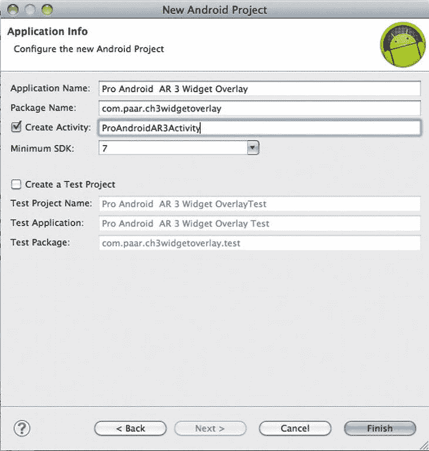
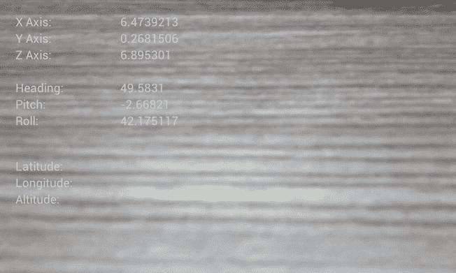
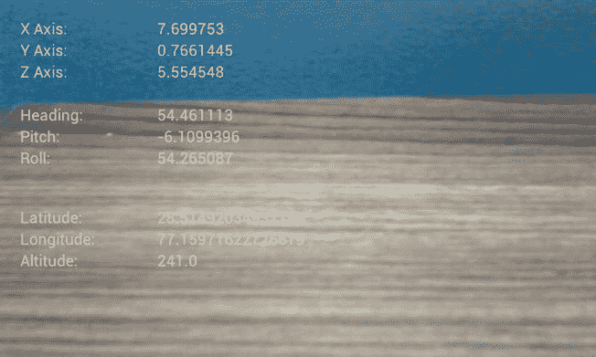
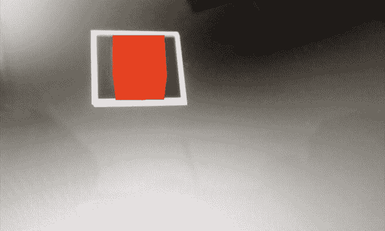

## 第三章

## 添加覆盖

如前所述，增强现实(AR)是与正在显示的直接或间接相机预览相关的数据的叠加。在大多数 AR 应用中，相机预览会首先扫描标记。在翻译类应用中，预览会扫描文本。而且在一些游戏 app 里，不做扫描；相反，字符、按钮、文本等会覆盖在预览上。

本章的所有源代码都可以从本书的页面`[http://www.apress.com](http://www.apress.com)`或 GitHub 库下载。

在[第 2 章](02.html)中，我们制作了一个基本的应用，显示设备摄像头的预览，通过 GPS 检索位置，获取加速度计读数，并检索方位传感器读数。在这一章中，我们将继续构建这个应用，并添加覆盖图。我们将添加正常的 Android 部件覆盖和实现标记识别。让我们从最简单的开始:小部件覆盖。

### 小工具覆盖

Android 平台提供了一堆标准的小部件，比如`TextViews`、`Buttons`和`Checkboxes`。这些默认包含在 Android 操作系统中，可以由任何应用使用。它们可能是你可以在相机预览中叠加的最简单的东西。

首先，创建一个新的 Android 项目。本例中使用的插件名为 Pro Android AR 3 Widget Overlay，构建于 Android 4 之上，其 minSdkVersion 设置为 7 (Android 2.1)，包名为 com.paar.ch3widgetoverlay(您可以根据自己的需求进行更改，但一定要更新这里给出的示例代码。)[图 3-1](#fig_3_1) 显示了项目设置屏幕。

**图 3-1。** *申请详情*

从重复我们在上一章中所做的一切开始。你可以用手全部打出来，也可以复制粘贴。这是你的电话。一定要更新代码中的包名等等，这样它才能在新项目中工作。

复制完上一章的所有代码后，我们需要修改定义布局的 XML 文件，以允许小部件覆盖。之前整个布局是单个`SurfaceView`，显示相机预览。因此，我们目前不能在布局中添加其他小部件。因此，我们将修改我们的 XML 文件，使其包含一个`RelativeLayout`，并在这个`RelativeLayout`中包含`SurfaceView` 和所有其他小部件。我们使用了一个`RelativeLayout`，因为它允许我们轻松地在`SurfaceView`上重叠窗口小部件。在本例中，我们将添加各种`TextViews`来显示传感器数据。因此，在我们开始布局编辑之前，我们需要向项目的`strings.xml`添加一些字符串资源:

**清单 3-1。** *字符串资源*

`<string name="xAxis">X Axis:</string>
<string name="yAxis">Y Axis:</string>
<string name="zAxis">Z Axis:</string>
<string name="heading">Heading:</string>
<string name="pitch">Pitch:</string>
<string name="roll">Roll:</string>
<string name="altitude">Altitude:</string>
<string name="longitude">Longitude:</string>
<string name="latitude">Latitude:</string>
<string name="empty"></string>`

这些字符串将为一些`TextView`提供标签。确切地说，是一半。另一半将用来自传感器的数据更新。在这之后，您应该更新您的`main.xml`文件，以便它有一个`RelativeLayout`。在我们进入实际代码之前，让我们快速看一下什么是`RelativeLayout`，以及它与其他布局相比如何。

#### 布局选项

在 Android 中，有许多不同的根布局可用。这些布局定义了任何应用的用户界面。所有布局通常在位于`/res/layout`的 XML 文件中定义。但是，布局及其元素可以在运行时通过 Java 代码动态创建。只有当应用需要动态添加小部件时，才会这样做。布局可以用 XML 声明，然后通过 Java 代码修改，就像我们在应用中经常做的那样。这是通过获取对布局的一部分(例如 TextView)的引用，并调用该类的各种方法来改变它来实现的。我们可以这样做，因为每个布局元素(包括布局)在 Android 框架中都有一个对应的 Java 类，它定义了修改它的方法。目前有四种不同的布局选项:

*   框架布局
*   表格布局
*   线性布局
*   相对布局

【Android 刚发布的时候，有第五种布局选项，叫做绝对布局。这种布局允许您使用精确的 x 和 y 坐标来指定元素的位置。这种布局现在已被弃用，因为它很难在不同的屏幕尺寸上使用。

##### 框架布局

框架布局是最简单的布局类型。它实际上是一个很大的空白空间，你可以在上面放置一个子对象，这个子对象将被固定在屏幕的左上角。在第一个对象之后添加的任何其他对象将直接绘制在它的上面。

##### 表格布局

表格布局将其子元素定位到行和列中。容器不显示它们的行、列或单元格的边框线。表格的列数与单元格最多的行数相同。表格可以将单元格留空，但单元格不能像 HTML 中那样跨列。`TableRow`对象是一个`TableLayout`的子视图(每个`TableRow`定义表格中的一行)。每行有零个或多个单元格，每个单元格都由任何类型的其他视图定义。所以一行的单元格可以由各种视图对象组成，比如`ImageView`或`TextView`。单元格也可以是一个`ViewGroup`对象(例如，您可以嵌套另一个`TableLayout`作为单元格)。

##### 线性布局

线性布局将所有子节点沿一个方向对齐—垂直或水平，这取决于您如何定义方向属性。所有的子元素都是一个接一个堆叠起来的，所以一个垂直的列表每一行只有一个子元素，不管它们有多宽；而一个水平列表只有一行高(最高的孩子的高度，加上填充)。A `LinearLayout`考虑子对象之间的边距和每个子对象的重心(右对齐、居中或左对齐)。

##### 相对布局

最后，相对布局允许子视图指定它们相对于父视图或彼此的位置(由 ID 指定)。因此，您可以通过右边框对齐两个元素，使一个元素位于另一个元素的下方，使其在屏幕上居中，使其向左居中，等等。元素是按照给定的顺序呈现的，所以如果第一个元素位于屏幕的中心，其他与该元素对齐的元素将相对于屏幕中心对齐。此外，由于这种排序，如果使用 XML 来指定这种布局，您将引用的元素(为了定位其他视图对象)必须在 XML 文件中列出，然后才能通过其引用 ID 从其他视图中引用它。

相对布局是唯一允许我们以应用需要的方式重叠视图的布局。由于它需要引用布局的其他部分来在屏幕上放置一个视图，你必须确保本书中的所有`RelativeLayout`都准确地复制到你的代码中；否则，你的整个布局看起来会非常混乱，视图会到处都是，除了你放置它们的地方。

#### 用相对布局更新 main.xml

在`RelativeLayout`里面是一个`SurfaceView`和 18 个`TextView`。小部件的顺序和 id 很重要，因为它是一个`RelativeLayout`。以下是布局文件:

**清单 3-2。** *相对布局*

`<RelativeLayout
xmlns:android="http://schemas.android.com/apk/res/android"
android:id="@+id/relativeLayout1"
android:layout_width="fill_parent"
android:layout_height="fill_parent" >
<SurfaceView
android:id="@+id/cameraPreview"
android:layout_width="fill_parent"
android:layout_height="fill_parent" />

<TextView
android:id="@+id/xAxisLabel"
android:layout_width="wrap_content"
android:layout_height="wrap_content"
android:layout_alignParentLeft="true"
android:layout_alignParentTop="true"
android:layout_marginLeft="18dp"
android:layout_marginTop="15dp"
android:text="@string/xAxis" />

<TextView
android:id="@+id/yAxisLabel"
android:layout_width="wrap_content"
android:layout_height="wrap_content"
android:layout_alignLeft="@+id/xAxisLabel"` `android:layout_below="@+id/xAxisLabel"
android:text="@string/yAxis" />

<TextView
android:id="@+id/zAxisLabel"
android:layout_width="wrap_content"
android:layout_height="wrap_content"
android:layout_alignLeft="@+id/yAxisLabel"
android:layout_below="@+id/yAxisLabel"
android:text="@string/zAxis" />

<TextView
android:id="@+id/headingLabel"
android:layout_width="wrap_content"
android:layout_height="wrap_content"
android:layout_alignLeft="@+id/zAxisLabel"
android:layout_below="@+id/zAxisLabel"
android:layout_marginTop="19dp"
android:text="@string/heading" />

<TextView
android:id="@+id/pitchLabel"
android:layout_width="wrap_content"
android:layout_height="wrap_content"
android:layout_alignLeft="@+id/headingLabel"
android:layout_below="@+id/headingLabel"
android:text="@string/pitch" />

<TextView
android:id="@+id/rollLabel"
android:layout_width="wrap_content"
android:layout_height="wrap_content"
android:layout_alignLeft="@+id/pitchLabel"
android:layout_below="@+id/pitchLabel"
android:text="@string/roll" />

<TextView
android:id="@+id/latitudeLabel"
android:layout_width="wrap_content"
android:layout_height="wrap_content"
android:layout_alignLeft="@+id/rollLabel"
android:layout_below="@+id/rollLabel"
android:layout_marginTop="34dp"
android:text="@string/latitude" />

<TextView
android:id="@+id/longitudeLabel"
android:layout_width="wrap_content"
android:layout_height="wrap_content"` `android:layout_alignLeft="@+id/latitudeLabel"
android:layout_below="@+id/latitudeLabel"
android:text="@string/longitude" />

<TextView
android:id="@+id/altitudeLabel"
android:layout_width="wrap_content"
android:layout_height="wrap_content"
android:layout_alignLeft="@+id/longitudeLabel"
android:layout_below="@+id/longitudeLabel"
android:text="@string/altitude" />

<TextView
android:id="@+id/xAxisValue"
android:layout_width="wrap_content"
android:layout_height="wrap_content"
android:layout_alignBottom="@+id/xAxisLabel"
android:layout_marginLeft="56dp"
android:layout_toRightOf="@+id/longitudeLabel"
android:text="@string/empty" />

<TextView
android:id="@+id/yAxisValue"
android:layout_width="wrap_content"
android:layout_height="wrap_content"
android:layout_alignBaseline="@+id/yAxisLabel"
android:layout_alignBottom="@+id/yAxisLabel"
android:layout_alignLeft="@+id/xAxisValue"
android:text="@string/empty" />

<TextView
android:id="@+id/zAxisValue"
android:layout_width="wrap_content"
android:layout_height="wrap_content"
android:layout_above="@+id/headingLabel"
android:layout_alignLeft="@+id/yAxisValue"
android:text="@string/empty" />

<TextView
android:id="@+id/headingValue"
android:layout_width="wrap_content"
android:layout_height="wrap_content"
android:layout_alignBaseline="@+id/headingLabel"
android:layout_alignBottom="@+id/headingLabel"
android:layout_alignLeft="@+id/zAxisValue"
android:text="@string/empty" />

<TextView
android:id="@+id/pitchValue"
android:layout_width="wrap_content"
android:layout_height="wrap_content"` `android:layout_alignBaseline="@+id/pitchLabel"
android:layout_alignBottom="@+id/pitchLabel"
android:layout_alignLeft="@+id/headingValue"
android:text="@string/empty" />

<TextView
android:id="@+id/rollValue"
android:layout_width="wrap_content"
android:layout_height="wrap_content"
android:layout_above="@+id/latitudeLabel"
android:layout_alignLeft="@+id/pitchValue"
android:text="@string/empty" />

<TextView
android:id="@+id/latitudeValue"
android:layout_width="wrap_content"
android:layout_height="wrap_content"
android:layout_alignBottom="@+id/latitudeLabel"
android:layout_alignLeft="@+id/rollValue"
android:text="@string/empty" />

<TextView
android:id="@+id/longitudeValue"
android:layout_width="wrap_content"
android:layout_height="wrap_content"
android:layout_alignBaseline="@+id/longitudeLabel"
android:layout_alignBottom="@+id/longitudeLabel"
android:layout_alignLeft="@+id/latitudeValue"
android:text="@string/empty" />

<TextView
android:id="@+id/altitudeValue"
android:layout_width="wrap_content"
android:layout_height="wrap_content"
android:layout_alignBaseline="@+id/altitudeLabel"
android:layout_alignBottom="@+id/altitudeLabel"
android:layout_alignLeft="@+id/longitudeValue"
android:text="@string/empty" />

</RelativeLayout>`

您可以通过查看 id 来了解每个`TextView`的用途。确保布局代码完全正确；否则，你的整个布局看起来就像是被推进了搅拌机(厨房里的那种，不是我能用这个软件做出很酷的图形的那种)。我们将只引用代码中 id 中有“`Value`”的`TextView`，因为其他的只是标签。这些`TextView`将用于显示我们的应用将接收的各种传感器值。

#### TextView 变量声明

布局在项目中之后，我们可以开始从代码中引用所有那些`TextView`并用适当的数据更新它们。为了能够从代码中引用`TextView`,我们需要一些变量来存储这些引用。将以下九个变量添加到该类的顶部(名称不言自明):

**清单 3-3。** *变量声明*

`TextView xAxisValue;
TextView yAxisValue;
TextView zAxisValue;
TextView headingValue;
TextView pitchValue;
TextView rollValue;
TextView altitudeValue;
TextView latitudeValue;
TextView longitudeValue;`

#### 更新 onCreate

之后，将下面的代码添加到`onCreate()`方法中，这样每个`TextView`对象都包含一个对 XML 中相应的`TextView`的引用。

**清单 3-4。** *提供对 XML 文本视图的引用*

`xAxisValue = (TextView) findViewById(R.id.xAxisValue);
yAxisValue = (TextView) findViewById(R.id.yAxisValue);
zAxisValue = (TextView) findViewById(R.id.zAxisValue);
headingValue = (TextView) findViewById(R.id.headingValue);
pitchValue = (TextView) findViewById(R.id.pitchValue);
rollValue = (TextView) findViewById(R.id.rollValue);
altitudeValue = (TextView) findViewById(R.id.altitudeValue);
longitudeValue = (TextView) findViewById(R.id.longitudeValue);
latitudeValue = (TextView) findViewById(R.id.latitudeValue);`

#### 显示传感器的数据

现在我们有了一个引用，我们将使用我们的数据更新所有的`TextView`,我们应该这样做。为了用正确的数据更新加速度计和方向传感器的数据，将`SensorEventListener`修改为:

**清单 3-5。** *修改过的 SensorEventListener*

`final SensorEventListener sensorEventListener = new SensorEventListener() {
public void onSensorChanged(SensorEvent sensorEvent) {
if (sensorEvent.sensor.getType() == Sensor.TYPE_ORIENTATION)
{
headingAngle = sensorEvent.values[0];
pitchAngle = sensorEvent.values[1];
rollAngle = sensorEvent.values[2];

Log.d(TAG, "Heading: " + String.valueOf(headingAngle));
Log.d(TAG, "Pitch: " + String.valueOf(pitchAngle));
Log.d(TAG, "Roll: " + String.valueOf(rollAngle));

***headingValue.setText(String.valueOf(headingAngle));***
***pitchValue.setText(String.valueOf(pitchAngle));***
***rollValue.setText(String.valueOf(rollAngle));***
}

else if (sensorEvent.sensor.getType() == Sensor.TYPE_ACCELEROMETER)
{
xAxis = sensorEvent.values[0];
yAxis = sensorEvent.values[1];
zAxis = sensorEvent.values[2];

Log.d(TAG, "X Axis: " + String.valueOf(xAxis));
Log.d(TAG, "Y Axis: " + String.valueOf(yAxis));
Log.d(TAG, "Z Axis: " + String.valueOf(zAxis));

***xAxisValue.setText(String.valueOf(xAxis));***
***yAxisValue.setText(String.valueOf(yAxis));***
***zAxisValue.setText(String.valueOf(zAxis));***
}
}

public void onAccuracyChanged (Sensor senor, int accuracy) {
//Not used
}
};`

现在传感器数据被写入日志和`TextViews`。因为传感器延迟被设置为`SENSOR_DELAY_NORMAL`，`TextView`将会以一种适中的速率更新。如果延迟被设置为`SENSOR_DELAY_GAME`，我们会让`TextView`的更新速度超过我们的视觉速度。那会对 CPU 造成很大的负担。即使是现在，在一些较慢的设备上，该应用可能会显得滞后。

**注意:**你可以通过将更新`TextViews`的代码转换成`TimerTask`或`Handler`来避免延迟。

既然数据来自方位和加速度传感器，我们应该为 GPS 做同样的事情。这或多或少是我们对`SensorEventListener`所做的重复，除了它是对`LocationListener`所做的:

**清单 3-6。** *修改了 LocationListener*

`LocationListener locationListener = new LocationListener() {
public void onLocationChanged(Location location) {
latitude = location.getLatitude();
longitude = location.getLongitude();
altitude = location.getAltitude();

Log.d(TAG, "Latitude: " + String.valueOf(latitude));
Log.d(TAG, "Longitude: " + String.valueOf(longitude));
Log.d(TAG, "Altitude: " + String.valueOf(altitude));

***latitudeValue.setText(String.valueOf(latitude));***
***longitudeValue.setText(String.valueOf(longitude));***
***altitudeValue.setText(String.valueOf(altitude));***
}

public void onProviderDisabled(String arg0) {
// TODO Auto-generated method stub

}

public void onProviderEnabled(String arg0) {
// TODO Auto-generated method stub

}

public void onStatusChanged(String arg0, int arg1, Bundle arg2) {
// TODO Auto-generated method stub

}
};`

数据再次被写入日志和`TextView`中。如果您现在调试应用，您应该会在屏幕上看到一个摄像机预览和 18 个`TextView`，其中 6 个应该会快速变化，而 3 个变化较慢。因为全球定位系统需要不间断的天空视图才能工作，而且可能需要一段时间来确定你的位置，所以与全球定位系统相关的字段可能需要一些时间来更新。

#### 更新的 AndroidManifest.xml

最后，您需要更改这个项目的`AndroidManifest.xml`:

**清单 3-7。** *修改后的 AndroidManifest.xml*

`<?xml version="1.0" encoding="utf-8"?>
<manifest xmlns:android="http://schemas.android.com/apk/res/android"
package="com.paar.ch3widgetoverlay"
android:versionCode="1"
android:versionName="1.0" >

<uses-sdk android:minSdkVersion="7" />

<application
android:icon="@drawable/ic_launcher"
android:label="@string/app_name" >
***<activity***
***android:label="@string/app_name"***
***android:name=".ProAndroidAR3Activity"***
***android:screenOrientation = "landscape"***
***android:theme="@android:style/Theme.NoTitleBar.Fullscreen"***
***android:configChanges = "keyboardHidden|orientation">***
<intent-filter >
<action android:name="android.intent.action.MAIN" />

<category android:name="android.intent.category.LAUNCHER" />
</intent-filter>
</activity>
</application>
***<uses-feature android:name="android.hardware.camera" />***
***<uses-permission android:name="android.permission.CAMERA" />***
***<uses-permission android:name="android.permission.ACCESS_FINE_LOCATION" />***
</manifest>`

这些是在你的相机预览上覆盖标准 Android 部件的基础。确保小部件已经就位，并且您的所有 id 都已对齐。之后，在你的应用中使用小部件就和在任何其他应用中完全一样了。你将调用同样的方法，使用同样的函数，做同样的事情。这适用于 Android 框架中的所有小部件。

#### 测试 App

至此，我们结束了在你的相机预览上叠加标准 Android 小工具的工作。图 3-2 和 [3-3](#fig_3_3) 显示了应用完成后的样子。

**图 3-2。** *无 GPS 定位的 app 截图*

**图 3-3。** *带 GPS 定位的应用截图*

接下来，我们将看看如何在我们的应用中添加标记识别。

### 标记

标记是 AR 应用用来知道在哪里放置叠层的视觉线索。您可以选择任何容易识别的图像(如白色背景上的黑色问号)。图像的一个副本保存在你的应用中，而另一个副本被打印出来并放在现实世界中的某个地方(或者如果你的手非常稳定，就画出来)。标记识别是人工智能领域正在进行的研究的一部分。

我们将使用名为 AndAR 的开源 Android 库来帮助我们识别标记。AndAR 项目的详情可在`[http://code.google.com/p/andar](http://code.google.com/p/andar)`找到。

创建新项目。我这边的包名是 com.paar.ch3marker，默认的活动名是`Activity.java`。

该应用将有四个它将识别的标记。对于每个标记，我们将提供一个. patt 文件，AndAR 可以用它来识别标记。这些文件以 AndAR 能够理解的方式描述了标记的外观。

如果您不喜欢提供的标记，或者感到无聊和喜欢冒险，您也可以创建和提供自己的标记。但是有一些限制:

*   标记必须是方形的。
*   边界必须对比鲜明。
*   边框必须是纯色。

标记可以是黑白的，也可以是彩色的。[图 3-4](#fig_3_4) 显示了一个标记的例子。

**图 3-4。** *样品安卓马克笔*

您可以使用位于`[http://flash.tarotaro.org/blog/2009/07/12/mgo2/](http://flash.tarotaro.org/blog/2009/07/12/mgo2/)`的在线 flash 工具创建自己的标记。

#### Activity.java

先来编辑一下`Activity.java`，这是一个比较小的类。

**清单 3-8。** *改装的 Activity.java*

`public class Activity extends AndARActivity {

***private ARObject someObject;***
***private ARToolkit artoolkit;***
@Override
public void onCreate(Bundle savedInstanceState) {

super.onCreate(savedInstanceState);
***CustomRenderer renderer = new CustomRenderer();***
***setNonARRenderer(renderer);***
***try {***
***artoolkit = getArtoolkit();***

***someObject = new CustomObject1***
***("test", "marker_at16.patt", 80.0, new double[]{0,0});***
***artoolkit.registerARObject(someObject);***

***someObject = new CustomObject2***
***("test", "marker_peace16.patt", 80.0, new***
***double[]{0,0});***
***artoolkit.registerARObject(someObject);***

***someObject = new CustomObject3***
***("test", "marker_rupee16.patt", 80.0, new***
***double[]{0,0});***
***artoolkit.registerARObject(someObject);***

***someObject = new CustomObject4***
***("test", "marker_hand16.patt", 80.0, new double[]{0,0});***
***artoolkit.registerARObject(someObject);***

***} catch (AndARException ex){***
***System.out.println("");***
***}***
***startPreview();***
***}***

***public void uncaughtException(Thread thread, Throwable ex) {***
***Log.e("AndAR EXCEPTION", ex.getMessage());***
***finish();***
***}***
}`

在`onCreate()`方法中，我们首先得到`savedInstanceState`。之后，我们创建一个对`CustomRenderer`类的引用，几页后我们将创建这个类。然后我们设置非 AR 渲染器。现在是课程的主要部分。我们用 AndAR 和它们的相关对象注册所有四个标记。`CustomObject1-4`是定义在每个标记上增加什么的类。最后，如果发生致命异常，使用`uncaughtException()`方法干净地退出应用。

#### 自定义对象覆盖

自定义对象基本上是 4 种不同颜色的 3D 盒子。它们根据标记的视图进行旋转等操作。[图 3-5](#fig_3_5) 显示了一个正在显示的立方体。

**图 3-5。** *四个自定义对象叠加之一*

首先出场的是`CustomObject1.java`。

**清单 3-9。** *自定义对象 1*

`public class CustomObject1 extends ARObject {

public CustomObject1(String name, String patternName,
double markerWidth, double[] markerCenter) {
super(name, patternName, markerWidth, markerCenter);
float mat_ambientf[] = {0f, 1.0f, 0f, 1.0f};
float mat_flashf[] = {0f, 1.0f, 0f, 1.0f};
float mat_diffusef[] = {0f, 1.0f, 0f, 1.0f};
float mat_flash_shinyf[] = {50.0f};

mat_ambient = GraphicsUtil.makeFloatBuffer(mat_ambientf);` `mat_flash = GraphicsUtil.makeFloatBuffer(mat_flashf);
mat_flash_shiny =
GraphicsUtil.makeFloatBuffer(mat_flash_shinyf);
mat_diffuse = GraphicsUtil.makeFloatBuffer(mat_diffusef);

}
public CustomObject1(String name, String patternName,
double markerWidth, double[] markerCenter, float[]
customColor) {
super(name, patternName, markerWidth, markerCenter);
float mat_flash_shinyf[] = {50.0f};

mat_ambient = GraphicsUtil.makeFloatBuffer(customColor);
mat_flash = GraphicsUtil.makeFloatBuffer(customColor);
mat_flash_shiny =
GraphicsUtil.makeFloatBuffer(mat_flash_shinyf);
mat_diffuse = GraphicsUtil.makeFloatBuffer(customColor);

}

private SimpleBox box = new SimpleBox();
private FloatBuffer mat_flash;
private FloatBuffer mat_ambient;
private FloatBuffer mat_flash_shiny;
private FloatBuffer mat_diffuse;

@Override
public final void draw(GL10 gl) {
super.draw(gl);

gl.glMaterialfv(GL10.GL_FRONT_AND_BACK,
GL10.GL_SPECULAR,mat_flash);
gl.glMaterialfv(GL10.GL_FRONT_AND_BACK, GL10.GL_SHININESS,
mat_flash_shiny);
gl.glMaterialfv(GL10.GL_FRONT_AND_BACK, GL10.GL_DIFFUSE,
mat_diffuse);
gl.glMaterialfv(GL10.GL_FRONT_AND_BACK, GL10.GL_AMBIENT,
mat_ambient);

gl.glColor4f(0, 1.0f, 0, 1.0f);
gl.glTranslatef( 0.0f, 0.0f, 12.5f );

box.draw(gl);
}
@Override
public void init(GL10 gl) {

}
}`

我们开始为盒子设置各种灯光，并在构造函数中用它们创建`FloatBuffer`。然后我们直接从 AndAR 那里得到一个简单的盒子，这样我们就省去了制作它的麻烦。在`draw()`方法中，我们画出一切。在这种情况下，在`draw()`方法中完成的一切都将直接在标记上完成。

其他三个`CustomObject`类与`CustomObject1`完全相同，除了我们稍微改变了颜色。以下是你需要为`CustomObject2`做的改动。

**清单 3-10。** *自定义对象 2*

`public CustomObject2(String name, String patternName,
double markerWidth, double[] markerCenter) {
super(name, patternName, markerWidth, markerCenter);
***float mat_ambientf[] = {1.0f, 0f, 0f, 1.0f};***
***float mat_flashf[] = {1.0f, 0f, 0f, 1.0f};***
***float mat_diffusef[] = {1.0f, 0f, 0f, 1.0f};***
***float mat_flash_shinyf[] = {50.0f};***

mat_ambient = GraphicsUtil.makeFloatBuffer(mat_ambientf);
mat_flash = GraphicsUtil.makeFloatBuffer(mat_flashf);
mat_flash_shiny =
GraphicsUtil.makeFloatBuffer(mat_flash_shinyf);
mat_diffuse = GraphicsUtil.makeFloatBuffer(mat_diffusef);

}

//Same code everywhere else, except the draw() method

@Override
public final void draw(GL10 gl) {
super.draw(gl);

gl.glMaterialfv(GL10.GL_FRONT_AND_BACK,
GL10.GL_SPECULAR,mat_flash);
gl.glMaterialfv(GL10.GL_FRONT_AND_BACK, GL10.GL_SHININESS,
mat_flash_shiny);
gl.glMaterialfv(GL10.GL_FRONT_AND_BACK, GL10.GL_DIFFUSE,
mat_diffuse);
gl.glMaterialfv(GL10.GL_FRONT_AND_BACK, GL10.GL_AMBIENT,
mat_ambient);

***gl.glColor4f(1.0f, 0, 0, 1.0f);***
gl.glTranslatef( 0.0f, 0.0f, 12.5f );

box.draw(gl);
}`

以下是`CustomObject3`的变化。

**清单 3-11。** *自定义对象 3*

`public CustomObject3(String name, String patternName,
double markerWidth, double[] markerCenter) {
super(name, patternName, markerWidth, markerCenter);
***float mat_ambientf[] = {0f, 0f, 1.0f, 1.0f};***
***float mat_flashf[] = {0f, 0f, 1.0f, 1.0f};***
***float mat_diffusef[] = {0f, 0f, 1.0f, 1.0f};***
***float mat_flash_shinyf[] = {50.0f};***

mat_ambient = GraphicsUtil.makeFloatBuffer(mat_ambientf);
mat_flash = GraphicsUtil.makeFloatBuffer(mat_flashf);
mat_flash_shiny =
GraphicsUtil.makeFloatBuffer(mat_flash_shinyf);
mat_diffuse = GraphicsUtil.makeFloatBuffer(mat_diffusef);

}

//Same code everywhere else, except the draw() method

@Override
public final void draw(GL10 gl) {
super.draw(gl);

gl.glMaterialfv(GL10.GL_FRONT_AND_BACK,
GL10.GL_SPECULAR,mat_flash);
gl.glMaterialfv(GL10.GL_FRONT_AND_BACK, GL10.GL_SHININESS,
mat_flash_shiny);
gl.glMaterialfv(GL10.GL_FRONT_AND_BACK, GL10.GL_DIFFUSE,
mat_diffuse);
gl.glMaterialfv(GL10.GL_FRONT_AND_BACK, GL10.GL_AMBIENT,
mat_ambient);

***gl.glColor4f(0f, 0, 1.0, 1.0f);***
gl.glTranslatef( 0.0f, 0.0f, 12.5f );

box.draw(gl);
}`

最后，`CustomObject4`的变化如下。

**清单 3-12。**T3】海关对象 4

`public CustomObject4(String name, String patternName,
double markerWidth, double[] markerCenter) {
super(name, patternName, markerWidth, markerCenter);
***float mat_ambientf[] = {1.0f, 0f, 1.0f, 1.0f};***
***float mat_flashf[] = {1.0f, 0f, 1.0f, 1.0f};***
***float mat_diffusef[] = {1.0f, 0f, 1.0f, 1.0f};***
***float mat_flash_shinyf[] = {50.0f};***

mat_ambient = GraphicsUtil.makeFloatBuffer(mat_ambientf);
mat_flash = GraphicsUtil.makeFloatBuffer(mat_flashf);
mat_flash_shiny =
GraphicsUtil.makeFloatBuffer(mat_flash_shinyf);
mat_diffuse = GraphicsUtil.makeFloatBuffer(mat_diffusef);

}

//Same code everywhere else, except the draw() method

@Override
public final void draw(GL10 gl) {
super.draw(gl);

gl.glMaterialfv(GL10.GL_FRONT_AND_BACK,
GL10.GL_SPECULAR,mat_flash);
gl.glMaterialfv(GL10.GL_FRONT_AND_BACK, GL10.GL_SHININESS,
mat_flash_shiny);
gl.glMaterialfv(GL10.GL_FRONT_AND_BACK, GL10.GL_DIFFUSE,
mat_diffuse);
gl.glMaterialfv(GL10.GL_FRONT_AND_BACK, GL10.GL_AMBIENT,
mat_ambient);

***gl.glColor4f(1.0f, 0, 1.0, 1.0f);***
gl.glTranslatef( 0.0f, 0.0f, 12.5f );

box.draw(gl);
}`

#### 自定义渲染器

现在我们只有`CustomRenderer.java`要处理。这个类允许我们做任何非增强现实的事情以及设置 OpenGL 环境。

**清单 3-13。** *自定义渲染器*

`public class CustomRenderer implements OpenGLRenderer {` `private float[] ambientlight1 = {.3f, .3f, .3f, 1f};
private float[] diffuselight1 = {.7f, .7f, .7f, 1f};
private float[] specularlight1 = {0.6f, 0.6f, 0.6f, 1f};
private float[] lightposition1 = {20.0f,-40.0f,100.0f,1f};

private FloatBuffer lightPositionBuffer1 =
GraphicsUtil.makeFloatBuffer(lightposition1);
private FloatBuffer specularLightBuffer1 =
GraphicsUtil.makeFloatBuffer(specularlight1);
private FloatBuffer diffuseLightBuffer1 =
GraphicsUtil.makeFloatBuffer(diffuselight1);
private FloatBuffer ambientLightBuffer1 =
GraphicsUtil.makeFloatBuffer(ambientlight1);

public final void draw(GL10 gl) {
}

public final void setupEnv(GL10 gl) {
gl.glEnable(GL10.GL_LIGHTING);
gl.glLightfv(GL10.GL_LIGHT1, GL10.GL_AMBIENT,
ambientLightBuffer1);
gl.glLightfv(GL10.GL_LIGHT1, GL10.GL_DIFFUSE,
diffuseLightBuffer1);
gl.glLightfv(GL10.GL_LIGHT1, GL10.GL_SPECULAR,
specularLightBuffer1);
gl.glLightfv(GL10.GL_LIGHT1, GL10.GL_POSITION,
lightPositionBuffer1);
gl.glEnable(GL10.GL_LIGHT1);
gl.glDisableClientState(GL10.GL_TEXTURE_COORD_ARRAY);
gl.glDisable(GL10.GL_TEXTURE_2D);
initGL(gl);
}

public final void initGL(GL10 gl) {
gl.glDisable(GL10.GL_COLOR_MATERIAL);
gl.glEnable(GL10.GL_CULL_FACE);
gl.glShadeModel(GL10.GL_SMOOTH);
gl.glDisable(GL10.GL_COLOR_MATERIAL);
gl.glEnable(GL10.GL_LIGHTING);
gl.glEnable(GL10.GL_CULL_FACE);
gl.glEnable(GL10.GL_DEPTH_TEST);
gl.glEnable(GL10.GL_NORMALIZE);
}
}`

在变量声明中，我们指定不同类型的照明，并从中创建`FloatBuffers`。在我们显示任何一个框之前，`setupEnv()`被调用。它设置了灯光和其他特定于 OpenGL 的东西。创建表面时会调用一次`initGL()`方法。

#### 雄胺固定

最后，`AndroidManifest.xml`需要更新。

**清单 3-14。** *更新 AndroidManifest.xml*

`<?xml version="1.0" encoding="utf-8"?>
<manifest xmlns:android="http://schemas.android.com/apk/res/android"
package="com.paar.ch3marker"
android:versionCode="1"
android:versionName="1.0" >

<uses-sdk android:minSdkVersion="7" />

<application
android:icon="@drawable/ic_launcher"
android:label="@string/app_name" >
***<activity***
***android:label="@string/app_name"***
***android:name=".Activity"***
***android:clearTaskOnLaunch="true"***
***android:screenOrientation="landscape"***
***android:noHistory="true">***
<intent-filter >
<action android:name="android.intent.action.MAIN" />

<category android:name="android.intent.category.LAUNCHER" />
</intent-filter>
</activity>
</application>
***<uses-permission android:name="android.permission.CAMERA"/>***
***<uses-permission android:name="android.permission.WRITE_EXTERNAL_STORAGE"/>***
***<uses-feature android:name="android.hardware.camera" />***
***<uses-feature android:name="android.hardware.camera.autofocus" />***
</manifest>`

这让我们结束了这个应用的编码。如果您还没有下载本章的源代码，请下载并使用。patt 文件，并将它们放在您的项目/资产目录中。除了源代码，您还会找到一个名为“标记”的文件夹，其中包含本应用和本书后续部分中使用的标记。你可以打印出来供自己使用。

#### 总结

在这一章中，我们学习了如何在我们的应用中覆盖标准的 Android 小部件，以及如何使用标记来使我们的增强现实应用更具交互性。关于这一章还讨论了 AndAR，一个适用于 Android 的开源 AR 工具包，它允许我们轻松快速地实现许多 AR 功能。

下一章讨论人工地平线，这是任何军事或导航应用的核心 AR 功能。