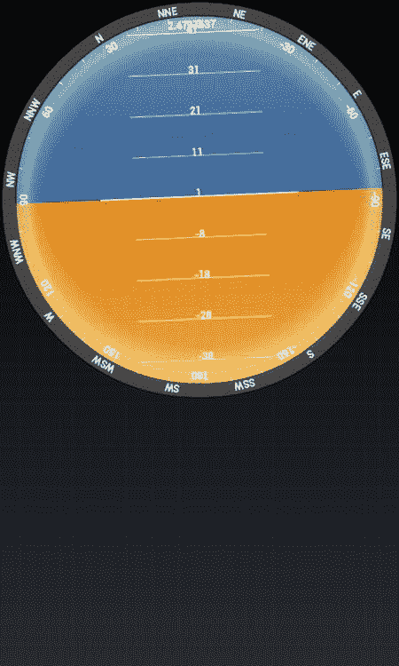
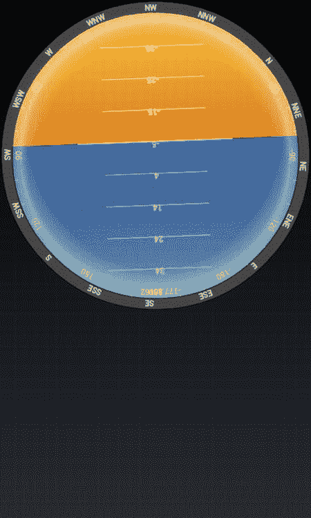
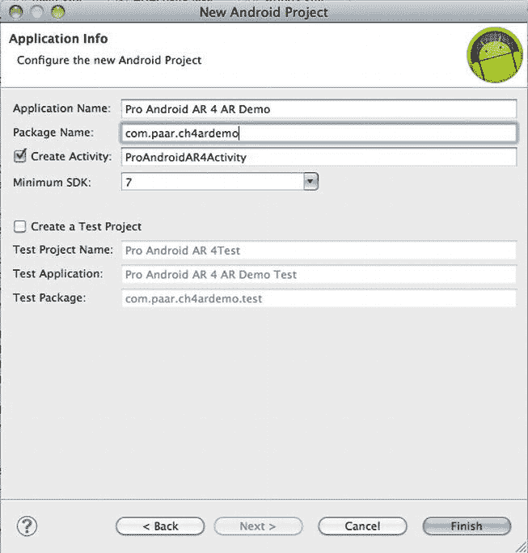
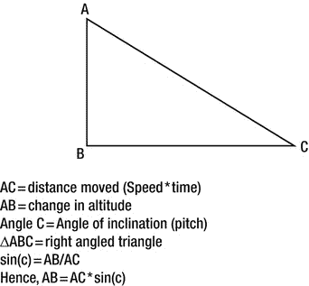
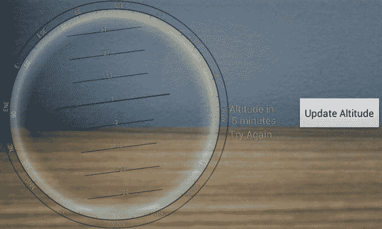
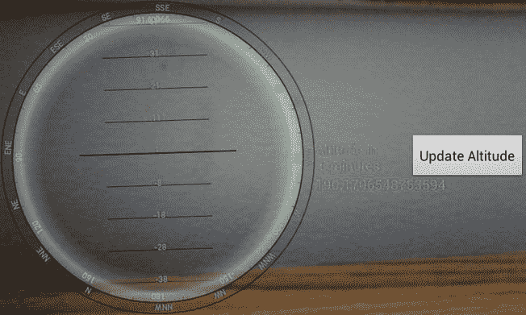

# 四、人工地平线

*人工地平线*被*牛津英语词典*定义为“一种回转仪或流体表面，通常是水银，用于在自然地平线被遮挡时为飞机飞行员提供水平参考平面以进行导航测量。”早在增强现实(AR)出现之前，人工地平线就已经用于导航目的，导航仍然是它们的主要用途。当平视显示器在飞机上，特别是军用飞机上大量使用时，它们变得突出起来。

人工地平线基本上是一条水平参考线，供导航员在自然地平线被遮挡时使用。对于我们所有痴迷于在应用中使用 AR 的人来说，这是一个需要熟悉的重要功能。在制作导航应用甚至游戏时，它会非常有用。

可能很难理解实际上并不存在的视界的概念，但必须用来进行各种计算，这些计算可能会以多种方式影响用户。为了解决这个问题，我们将制作一个小的示例应用，它不实现 AR，但向您显示什么是人工地平线以及它是如何实现的。之后，我们将制作一个 AR 应用来使用人工地平线。

### 至非空气演示应用

在这个应用中，我们将有一个内置人工地平线指示器的指南针。我将只为人工地平线代码提供一个解释，因为它的其余部分不属于本书的主题。

#### XML

让我们先把这些小的 XML 文件去掉。我们将需要一个`/res/layout/main.xml`、一个`/res/values/strings.xml`和一个`/res/values/colors.xml`。

让我们从`main.xml`文件开始:

**清单 4-1。** *main.xml*

`<?xml version="1.0" encoding="utf-8"?>
<LinearLayout xmlns:android="http://schemas.android.com/apk/res/android"
android:orientation="vertical"
android:layout_width="fill_parent"
android:layout_height="fill_parent">
<com.paar.ch4nonardemo.HorizonView
android:id="@+id/horizonView"
android:layout_width="fill_parent"
android:layout_height="fill_parent"
/>
</LinearLayout>`

这里没什么特别的。我们只需将`Activity`的视图设置为自定义视图，我们将在几分钟内着手制作。

现在让我们来看看`strings.xml`:

**清单 4-2。** *strings.xml*

`<?xml version="1.0" encoding="utf-8"?>
<resources>
<string name="app_name">Pro Android AR 4 Non AR Demo</string>
<string name="cardinal_north">N</string>
<string name="cardinal_east">E</string>
<string name="cardinal_south">S</string>
<string name="cardinal_west">W</string>
</resources>`

这个文件声明了四个枢机主教的字符串资源:N 对应北，E 对应东，S 对应南，W 对应西。

让我们继续讨论`colours.xml`:

**清单 4-3。** *colours.xml*

`<?xml version="1.0" encoding="utf-8"?>
<resources>
<color name="text_color">#FFFF</color>
<color name="background_color">#F000</color>
<color name="marker_color">#FFFF</color>` `<color name="shadow_color">#7AAA</color>

<color name="outer_border">#FF444444</color>
<color name="inner_border_one">#FF323232</color>
<color name="inner_border_two">#FF414141</color>
<color name="inner_border">#FFFFFFFF</color>

<color name="horizon_sky_from">#FFA52A2A</color>
<color name="horizon_sky_to">#FFFFC125</color>
<color name="horizon_ground_from">#FF5F9EA0</color>
<color name="horizon_ground_to">#FF00008B</color>
</resources>`

所有颜色在`ARGB`或`AARRGGBB`中指定。它们用于为我们的小演示应用增加一点视觉吸引力。“到”和“从”的颜色略有不同，因此我们可以在最终的演示中使用渐变。天空的颜色是蓝色，地面的颜色是橙色。

#### 爪哇

现在我们将创建我们在 main.xml 中提到的自定义视图。

##### 创建视图

在主包中创建一个名为`HorizonView.java`的 Java 文件(我这边是 com.paar.ch4nonardemo)。向其中添加以下全局变量:

**清单 4-4。**HorizonView.java*全局变量*

`public class HorizonView extends View {
private enum CompassDirection { N, NNE, NE, ENE,
E, ESE, SE, SSE,
S, SSW, SW, WSW,
W, WNW, NW, NNW }

int[] borderGradientColors;
float[] borderGradientPositions;

int[] glassGradientColors;
float[] glassGradientPositions;

int skyHorizonColorFrom;
int skyHorizonColorTo;
int groundHorizonColorFrom;
int groundHorizonColorTo;` `private Paint markerPaint;
private Paint textPaint;
private Paint circlePaint;
private int textHeight;

private float bearing;
float pitch = 0;
float roll = 0;`

变量的名字是对它们任务的合理的描述。`CompassDirections`提供我们将用来创建 16 点罗盘的弦。名称中带有*渐变*、*颜色*、*颜料*的用于绘制`View`，`textHeight`也是如此。

###### 获取和设置轴承、俯仰和侧倾

现在将以下方法添加到该类中:

**清单 4-5。** *方位、俯仰和滚转方式*

`public void setBearing(float _bearing) {
bearing = _bearing;
}
public float getBearing() {
return bearing;
}

public float getPitch() {
return pitch;
}
public void setPitch(float pitch) {
this.pitch = pitch;
}

public float getRoll() {
return roll;
}
public void setRoll(float roll) {
this.roll = roll;
}`

这些方法让我们获得并设置方位角、俯仰角和滚动角，这在以后被规范化并用于绘制我们的视图。

###### 调用并初始化指南针

接下来，将以下三个构造函数添加到该类中:

**清单 4-6。**T3【地平线】建造者

`public HorizonView(Context context) {
super(context);
initCompassView();
}

public HorizonView(Context context, AttributeSet attrs) {
super(context, attrs);
initCompassView();
}

public HorizonView(Context context,
AttributeSet ats,
int defaultStyle) {
super(context, ats, defaultStyle);
initCompassView();
}`

所有三个构造函数最终都调用了`initCompassView()`，它完成了这个类中的主要工作。

说到`initCompassView()`，下面是它的代码:

**清单 4-7。** *initCompassView()*

`protected void initCompassView() {
setFocusable(true);
Resources r = this.getResources();

circlePaint = new Paint(Paint.ANTI_ALIAS_FLAG);
circlePaint.setColor(R.color.background_color);
circlePaint.setStrokeWidth(1);
circlePaint.setStyle(Paint.Style.STROKE);

textPaint = new Paint(Paint.ANTI_ALIAS_FLAG);
textPaint.setColor(r.getColor(R.color.text_color));
textPaint.setFakeBoldText(true);
textPaint.setSubpixelText(true);
textPaint.setTextAlign(Align.LEFT);

textHeight = (int)textPaint.measureText("yY");

markerPaint = new Paint(Paint.ANTI_ALIAS_FLAG);
markerPaint.setColor(r.getColor(R.color.marker_color));
markerPaint.setAlpha(200);
markerPaint.setStrokeWidth(1);
markerPaint.setStyle(Paint.Style.STROKE);
markerPaint.setShadowLayer(2, 1, 1, r.getColor(R.color.shadow_color));` `borderGradientColors = new int[4];
borderGradientPositions = new float[4];

borderGradientColors[3] = r.getColor(R.color.outer_border);
borderGradientColors[2] = r.getColor(R.color.inner_border_one);
borderGradientColors[1] = r.getColor(R.color.inner_border_two);
borderGradientColors[0] = r.getColor(R.color.inner_border);
borderGradientPositions[3] = 0.0f;
borderGradientPositions[2] = 1-0.03f;
borderGradientPositions[1] = 1-0.06f;
borderGradientPositions[0] = 1.0f;

glassGradientColors = new int[5];
glassGradientPositions = new float[5];

int glassColor = 245;
glassGradientColors[4] = Color.argb(65, glassColor,
glassColor, glassColor);
glassGradientColors[3] = Color.argb(100, glassColor,
glassColor, glassColor);
glassGradientColors[2] = Color.argb(50, glassColor,
glassColor, glassColor);
glassGradientColors[1] = Color.argb(0, glassColor,
glassColor, glassColor);
glassGradientColors[0] = Color.argb(0, glassColor,
glassColor, glassColor);
glassGradientPositions[4] = 1-0.0f;
glassGradientPositions[3] = 1-0.06f;
glassGradientPositions[2] = 1-0.10f;
glassGradientPositions[1] = 1-0.20f;
glassGradientPositions[0] = 1-1.0f;

skyHorizonColorFrom = r.getColor(R.color.horizon_sky_from);
skyHorizonColorTo = r.getColor(R.color.horizon_sky_to);

groundHorizonColorFrom = r.getColor(R.color.horizon_ground_from);
groundHorizonColorTo = r.getColor(R.color.horizon_ground_to);
}`

在这种方法中，我们使用颜色来形成合适的渐变。我们也给一些我们在开始时声明的变量赋值。

###### 计算指南针的大小

现在向该类添加以下两个方法:

**清单 4-8。** *onMeasure()和 Measure()*

`@Override
protected void onMeasure(int widthMeasureSpec, int heightMeasureSpec) {

int measuredWidth = measure(widthMeasureSpec);
int measuredHeight = measure(heightMeasureSpec);

int d = Math.min(measuredWidth, measuredHeight);

setMeasuredDimension(d, d);
}

private int measure(int measureSpec) {
int result = 0;

int specMode = MeasureSpec.getMode(measureSpec);
int specSize = MeasureSpec.getSize(measureSpec);

if (specMode == MeasureSpec.UNSPECIFIED) {
result = 200;
} else {
result = specSize;
}
return result;
}`

这两种方法允许我们测量屏幕，并让我们决定我们希望我们的指南针有多大。

###### 画指南针

现在，最后将`onDraw()`方法添加到类中:

**清单 4-9。**T2【onDraw()】

`@Override
protected void onDraw(Canvas canvas) {
float ringWidth = textHeight + 4;
int height = getMeasuredHeight();
int width =getMeasuredWidth();

int px = width/2;
int py = height/2;
Point center = new Point(px, py);

int radius = Math.min(px, py)-2;` `RectF boundingBox = new RectF(center.x - radius,
center.y - radius,
center.x + radius,
center.y + radius);

RectF innerBoundingBox = new RectF(center.x - radius + ringWidth,
center.y - radius + ringWidth,
center.x + radius - ringWidth,
center.y + radius - ringWidth);

float innerRadius = innerBoundingBox.height()/2;
RadialGradient borderGradient = new RadialGradient(px, py, radius,
borderGradientColors, borderGradientPositions, TileMode.CLAMP);

Paint pgb = new Paint();
pgb.setShader(borderGradient);

Path outerRingPath = new Path();
outerRingPath.addOval(boundingBox, Direction.CW);

canvas.drawPath(outerRingPath, pgb);
LinearGradient skyShader = new LinearGradient(center.x,
innerBoundingBox.top, center.x, innerBoundingBox.bottom,
skyHorizonColorFrom, skyHorizonColorTo, TileMode.CLAMP);

Paint skyPaint = new Paint();
skyPaint.setShader(skyShader);

LinearGradient groundShader = new LinearGradient(center.x,
innerBoundingBox.top, center.x, innerBoundingBox.bottom,
groundHorizonColorFrom, groundHorizonColorTo, TileMode.CLAMP);

Paint groundPaint = new Paint();
groundPaint.setShader(groundShader);
float tiltDegree = pitch;
while (tiltDegree > 90 || tiltDegree < -90) {
if (tiltDegree > 90) tiltDegree = -90 + (tiltDegree - 90);
if (tiltDegree < -90) tiltDegree = 90 - (tiltDegree + 90);
}

float rollDegree = roll;
while (rollDegree > 180 || rollDegree < -180) {
if (rollDegree > 180) rollDegree = -180 + (rollDegree - 180);
if (rollDegree < -180) rollDegree = 180 - (rollDegree + 180);
}
Path skyPath = new Path();
skyPath.addArc(innerBoundingBox, -tiltDegree, (180 + (2 * tiltDegree)));
canvas.rotate(-rollDegree, px, py);
canvas.drawOval(innerBoundingBox, groundPaint);
canvas.drawPath(skyPath, skyPaint);` `canvas.drawPath(skyPath, markerPaint);
int markWidth = radius / 3;
int startX = center.x - markWidth;
int endX = center.x + markWidth;

double h = innerRadius*Math.cos(Math.toRadians(90-tiltDegree));
double justTiltY = center.y - h;

float pxPerDegree = (innerBoundingBox.height()/2)/45f;
for (int i = 90; i >= -90; i -= 10) {
double ypos = justTiltY + i*pxPerDegree;

if ((ypos < (innerBoundingBox.top + textHeight)) ||
(ypos > innerBoundingBox.bottom - textHeight))
continue;

canvas.drawLine(startX, (float)ypos,
endX, (float)ypos,
markerPaint);
int displayPos = (int)(tiltDegree - i);
String displayString = String.valueOf(displayPos);
float stringSizeWidth = textPaint.measureText(displayString);
canvas.drawText(displayString,
(int)(center.x-stringSizeWidth/2),
(int)(ypos)+1,
textPaint);
}
markerPaint.setStrokeWidth(2);
canvas.drawLine(center.x - radius / 2,
(float)justTiltY,
center.x + radius / 2,
(float)justTiltY,
markerPaint);
markerPaint.setStrokeWidth(1);

Path rollArrow = new Path();
rollArrow.moveTo(center.x - 3, (int)innerBoundingBox.top + 14);
rollArrow.lineTo(center.x, (int)innerBoundingBox.top + 10);
rollArrow.moveTo(center.x + 3, innerBoundingBox.top + 14);
rollArrow.lineTo(center.x, innerBoundingBox.top + 10);
canvas.drawPath(rollArrow, markerPaint);
String rollText = String.valueOf(rollDegree);
double rollTextWidth = textPaint.measureText(rollText);
canvas.drawText(rollText,
(float)(center.x - rollTextWidth / 2),
innerBoundingBox.top + textHeight + 2,
textPaint);
canvas.restore();` `canvas.save();
canvas.rotate(180, center.x, center.y);
for (int i = -180; i < 180; i += 10) {
if (i % 30 == 0) {
String rollString = String.valueOf(i*-1);
float rollStringWidth = textPaint.measureText(rollString);
PointF rollStringCenter = new PointF(center.x-rollStringWidth /2,
innerBoundingBox.top+1+textHeight);
canvas.drawText(rollString,
rollStringCenter.x, rollStringCenter.y,
textPaint);
}
else {
canvas.drawLine(center.x, (int)innerBoundingBox.top,
center.x, (int)innerBoundingBox.top + 5,
markerPaint);
}

canvas.rotate(10, center.x, center.y);
}
canvas.restore();
canvas.save();
canvas.rotate(-1*(bearing), px, py);

double increment = 22.5;

for (double i = 0; i < 360; i += increment) {
CompassDirection cd = CompassDirection.values()
[(int)(i / 22.5)];
String headString = cd.toString();

float headStringWidth = textPaint.measureText(headString);
PointF headStringCenter = new PointF(center.x - headStringWidth / 2,
boundingBox.top + 1 + textHeight);

if (i % increment == 0)
canvas.drawText(headString,
headStringCenter.x, headStringCenter.y,
textPaint);
else
canvas.drawLine(center.x, (int)boundingBox.top,
center.x, (int)boundingBox.top + 3,
markerPaint);

canvas.rotate((int)increment, center.x, center.y);
}
canvas.restore();
RadialGradient glassShader = new RadialGradient(px, py, (int)innerRadius,
glassGradientColors, glassGradientPositions, TileMode.CLAMP);
Paint glassPaint = new Paint();` `glassPaint.setShader(glassShader);

canvas.drawOval(innerBoundingBox, glassPaint);
canvas.drawOval(boundingBox, circlePaint);

circlePaint.setStrokeWidth(2);
canvas.drawOval(innerBoundingBox, circlePaint);

canvas.restore();
}
}`

`onDraw()`方法绘制外圆，固定俯仰和横滚值，给圆着色，负责给圆添加指南针方向，在需要时旋转圆，并绘制实际的人工水平线并移动它们。

简而言之，我们用 N、NE 等标记以 30 度的间隔创建一个圆。在指南针内部，我们有一个类似高度计的视图，它给出了地平线相对于手机握持方式的位置。

##### 更新活动

我们需要更新我们主要活动的整个展示。为此，我们需要更新`AHActivity.java`:

**清单 4-10。AHActivity.java**T2

`public class AHActivity extends Activity {
float[] aValues = new float[3];
float[] mValues = new float[3];
HorizonView horizonView;
SensorManager sensorManager;

@Override
public void onCreate(Bundle icicle) {
super.onCreate(icicle);
setContentView(R.layout.main);

horizonView = (HorizonView)this.findViewById(R.id.horizonView);
sensorManager =
(SensorManager)getSystemService(Context.SENSOR_SERVICE);
updateOrientation(new float[] {0, 0, 0});
}

private void updateOrientation(float[] values) {
if (horizonView!= null) {
horizonView.setBearing(values[0]);` `horizonView.setPitch(values[1]);
horizonView.setRoll(-values[2]);
horizonView.invalidate();
}
}

private float[] calculateOrientation() {
float[] values = new float[3];
float[] R = new float[9];
float[] outR = new float[9];

SensorManager.getRotationMatrix(R, null, aValues, mValues);
SensorManager.remapCoordinateSystem(R,
SensorManager.AXIS_X,
SensorManager.AXIS_Z,
outR);

SensorManager.getOrientation(outR, values);

values[0] = (float) Math.toDegrees(values[0]);
values[1] = (float) Math.toDegrees(values[1]);
values[2] = (float) Math.toDegrees(values[2]);

return values;
}

private final SensorEventListener sensorEventListener = new
SensorEventListener() {
public void onSensorChanged(SensorEvent event) {
if (event.sensor.getType() == Sensor.TYPE_ACCELEROMETER)
aValues = event.values;
if (event.sensor.getType() == Sensor.TYPE_MAGNETIC_FIELD)
mValues = event.values;

updateOrientation(calculateOrientation());
}

public void onAccuracyChanged(Sensor sensor, int accuracy) {}
};

@Override
protected void onResume() {
super.onResume();

Sensor accelerometer =
sensorManager.getDefaultSensor(Sensor.TYPE_ACCELEROMETER);
Sensor magField =
sensorManager.getDefaultSensor(Sensor.TYPE_MAGNETIC_FIELD);` `sensorManager.registerListener(sensorEventListener,
accelerometer,
SensorManager.SENSOR_DELAY_FASTEST);
sensorManager.registerListener(sensorEventListener,
magField,
SensorManager.SENSOR_DELAY_FASTEST);
}

@Override
protected void onStop() {
sensorManager.unregisterListener(sensorEventListener);
super.onStop();
}
}`

这是实际工作发生的地方。在`onCreate()`方法中，我们将视图设置为`main.xml`，获取对`horizonView`的引用，注册一个`SensorEventListener`，并将方向更新为理想情况。`updateOrientation()`方法负责向我们的视图传递新的值，以便它可以适当地改变。`calculateOrientation()`使用 SDK 提供的一些方法，根据传感器提供的原始值精确计算方向。Android 提供的这些方法为我们处理了很多复杂的数学问题。你应该很容易理解`SensorEventListener`、`onResume()`和`onStop()`。他们做着与前几章相同的工作。

#### 安卓清单

最后，您应该将您的 AndroidManifest 更新为以下内容:

**清单 4-11。** *AndroidManifest.xml*

`<?xml version="1.0" encoding="utf-8"?>
<manifest xmlns:android="http://schemas.android.com/apk/res/android"
package="com.paar.ch4nonardemo"
android:versionCode="1"
android:versionName="1.0" >

<uses-sdk android:minSdkVersion="7" />

<application
android:icon="@drawable/ic_launcher"
android:label="@string/app_name" >
<activity
android:label="@string/app_name"
android:name=".AHActivity"
android:screenOrientation="portrait"` `android:theme="@android:style/Theme.NoTitleBar.Fullscreen" >
<intent-filter >
<action android:name="android.intent.action.MAIN" />

<category android:name="android.intent.category.LAUNCHER" />
</intent-filter>
</activity>
</application>

</manifest>`

#### 测试完成的应用

如果你现在运行这个应用，你会对人工地平线有一个很好的了解。图 4-1 和 [4-2](#fig_4_2) 让你对完成的应用有个概念。

**图 4-1。** *设备直立时的 app*

**图 4-2。** *设备倒置时的 app*

### 在空中演示应用

在浏览并运行了前面的例子之后，您现在应该很好地理解了人工视界的概念。我们现在将设计一款应用，它具有以下功能:

*   显示实时摄像机预览
*   在相机预览上显示半透明版本的`HorizonView`,颜色类似于飞机中的电影版本
*   告诉你 5 分钟后你的高度，假设你继续保持当前的倾斜度

在我们开始编码之前，有一些事情需要记住。由于用户几乎不可能保持设备完全静止，因此倾斜度将不断变化，这将导致 5 分钟内的高度也发生变化。为了解决这个问题，我们将添加一个按钮，允许用户随时更新高度。

**注意:**在一些设备上，这款应用可以顺时针和逆时针方向移动人工地平线，而不是像非 AR 演示中那样上下移动。所有值都是正确的，除了显示器有问题，可以通过在纵向模式下运行应用来修复。

#### 设置项目

首先，创建一个新项目。作为例子使用的包名为 com.paar.ch4ardemo，目标是 Android 2.1。和往常一样，你可以把名字改成你喜欢的任何名字；只需确保更新示例代码中的所有引用。图 4-3 中的截图显示了项目详情。

**图 4-3。**T3 申请详情

创建新项目后，将非增强现实演示中的所有内容复制到这个项目中。我们将建立在以前的项目。确保在需要的地方更新文件中的包名。

#### 更新 XML

首先，我们需要更新应用的 XML。我们的应用目前只有四个 XML 文件:`AndroidManifest.xml`、`main.xml`、`colours.xml`和`strings.xml`。我们将只编辑从前面的例子中复制过来的，而不是从头开始构建新的。更新的和新的行以粗体显示。

##### 更新 AndroidManifest.xml 以访问 GPS

先从`AndroidManifest.xml`说起吧。因为我们更新的应用将需要用户的高度，我们将需要使用 GPS 来获取它。GPS 要求在清单中声明`ACCESS_FINE_LOCATION`许可。除了新的权限之外，我们必须更新包名，并将`Activity`的方向改为横向。

**清单 4-12。** *更新 AndroidManifest.xml*

`<?xml version="1.0" encoding="utf-8"?>
<manifest xmlns:android="http://schemas.android.com/apk/res/android"
***package="com.paar.ch4ardemo"***
android:versionCode="1"
android:versionName="1.0" >

<uses-sdk android:minSdkVersion="7" />

<application
android:icon="@drawable/ic_launcher"
android:label="@string/app_name" >
<activity
android:label="@string/app_name"
android:name=".AHActivity"
***android:screenOrientation="landscape"***
android:theme="@android:style/Theme.NoTitleBar.Fullscreen"
android:configChanges = "keyboardHidden|orientation">
<intent-filter >
<action android:name="android.intent.action.MAIN" />

<category android:name="android.intent.category.LAUNCHER" />
</intent-filter>
</activity>
</application>
<uses-feature android:name="android.hardware.camera" />
<uses-permission android:name="android.permission.CAMERA" />
***<uses-permission android:name="android.permission.ACCESS_FINE_LOCATION" />***
</manifest>`

##### 更新 strings.xml 以显示海拔高度

接下来，我们来看看`strings.xml`。我们将添加两个新的字符串，作为`Button`和`TextView`的标签。我们没有为另一个`TextView`的添加字符串，因为当用户点击按钮时，它将在运行时更新。在您的`strings.xml`文件中的任意位置添加以下两个字符串。

**清单 4-13。** *更新 strings.xml*

`<string name="altitudeButtonLabel">Update Altitude</string>
<string name="altitudeLabel">Altitude in \n 5 minutes</string>`

第二个字符串中的那个小`\n`告诉 Android 在新的一行上打印字符串的剩余部分。我们这样做是因为在较小的屏幕设备上，字符串可能会与按钮重叠。

##### 更新 colours.xml 以提供双色显示

现在来更新一下`colours.xml`。这一次，我们只需要两种颜色，其中只有一种是可见的颜色。在前面的例子中，我们为地面、天空等设置了不同的颜色。在这里这样做将导致仪表的表盘覆盖我们的相机预览。然而，使用 ARGB 色码，我们可以使除了文本以外的一切都透明。用下面的代码完全替换您的`colours.xml`文件的内容。

**清单 4-14。** *更新 colours.xml*

`<?xml version="1.0" encoding="utf-8"?>
<resources>
<color name="text_color">#F0F0</color>
<color name="transparent_color">#0000</color>
</resources>`

##### 将 main.xml 更新为 RelativeLayout

现在我们来看最后一个 XML 文件——也是变化最大的一个文件:`main.xml`。以前，`main.xml`只有一个`LinearLayout`，里面还有一个`HorizonView`。然而，考虑到我们的 AR 重叠，我们将用一个`RelativeLayout`替换`LinearLayout`，并在`HorizonView`之外添加两个`TextView`和一个`Button`。将`main.xml`更新为以下代码。

**清单 4-15。** *更新 main.xml*

`<?xml version="1.0" encoding="utf-8"?>
***<RelativeLayout xmlns:android="http://schemas.android.com/apk/res/android"***
***android:orientation="vertical"***
***android:layout_width="fill_parent"***
***android:layout_height="fill_parent">***` `***<SurfaceView***
***android:id="@+id/cameraPreview"***
***android:layout_width="fill_parent"***
***android:layout_height="fill_parent" />***
***<com.paar.ch4ardemo.HorizonView***
android:id="@+id/horizonView"
android:layout_width="fill_parent"
android:layout_height="fill_parent"
/>
***<TextView***
***android:id="@+id/altitudeLabel"***
***android:layout_width="wrap_content"***
***android:layout_height="wrap_content"***
***android:layout_centerVertical="true"***
***android:layout_toRightOf="@id/horizonView"***
***android:text="@string/altitudeLabel"***
***android:textColor="#00FF00">***
***</TextView>***
***<TextView***
***android:id="@+id/altitudeValue"***
***android:layout_width="wrap_content"***
***android:layout_height="wrap_content"***
***android:layout_centerVertical="true"***
***android:layout_below="@id/altitudeLabel"***
***android:layout_toRightOf="@id/horizonView"***
***android:textColor="#00FF00">***
***</TextView>***
***<Button***
***android:id="@+id/altitudeUpdateButton"***
***android:layout_width="wrap_content"***
***android:layout_height="wrap_content"***
***android:text="@string/altitudeButtonLabel"***
***android:layout_centerVertical="true"***
***android:layout_alignParentRight="true">***
***</Button>***
***</RelativeLayout>***`

在这种情况下，只有五行没有被修改。像往常一样，作为一个`RelativeLayout`，在 id 或位置上的任何错误都是致命的。

这负责我们应用的 XML 部分。现在我们必须转移到 Java 文件上。

#### 更新 Java 文件

Java 文件比 XML 文件有更多的变化，有些变化一开始可能没有意义。我们将接受每个变更，一次一个代码块。

##### 更新 HorizonView.java 以使指南针透明

先从`HorizonView.java`说起吧。我们正在修改我们的代码，使表盘透明，并在风景模式下工作。先从修改`initCompassView()`开始。我们所做的唯一改变是用更新的颜色替换旧的颜色。已修改的行以粗体显示。

**清单 4-16。** *更新了 initCompassView()*

`protected void initCompassView() {
setFocusable(true);
Resources r = this.getResources();

circlePaint = new Paint(Paint.ANTI_ALIAS_FLAG);
***circlePaint.setColor(R.color.transparent_color);***
circlePaint.setStrokeWidth(1);
circlePaint.setStyle(Paint.Style.STROKE);

textPaint = new Paint(Paint.ANTI_ALIAS_FLAG);
textPaint.setColor(r.getColor(R.color.text_color));
textPaint.setFakeBoldText(true);
textPaint.setSubpixelText(true);
textPaint.setTextAlign(Align.LEFT);

textHeight = (int)textPaint.measureText("yY");

markerPaint = new Paint(Paint.ANTI_ALIAS_FLAG);
***markerPaint.setColor(r.getColor(R.color.transparent_color));***
markerPaint.setAlpha(200);
markerPaint.setStrokeWidth(1);
markerPaint.setStyle(Paint.Style.STROKE);
***markerPaint.setShadowLayer(2, 1, 1, r.getColor(R.color.transparent_color));***

borderGradientColors = new int[4];
borderGradientPositions = new float[4];

***borderGradientColors[3] = r.getColor(R.color.transparent_color);***
***borderGradientColors[2] = r.getColor(R.color.transparent_color);***
***borderGradientColors[1] = r.getColor(R.color.transparent_color);***` `***borderGradientColors[0] = r.getColor(R.color.transparent_color);***
borderGradientPositions[3] = 0.0f;
borderGradientPositions[2] = 1-0.03f;
borderGradientPositions[1] = 1-0.06f;
borderGradientPositions[0] = 1.0f;

glassGradientColors = new int[5];
glassGradientPositions = new float[5];

int glassColor = 245;
glassGradientColors[4] = Color.argb(65, glassColor,
glassColor, glassColor);
glassGradientColors[3] = Color.argb(100, glassColor,
glassColor, glassColor);
glassGradientColors[2] = Color.argb(50, glassColor,
glassColor, glassColor);
glassGradientColors[1] = Color.argb(0, glassColor,
glassColor, glassColor);
glassGradientColors[0] = Color.argb(0, glassColor,
glassColor, glassColor);
glassGradientPositions[4] = 1-0.0f;
glassGradientPositions[3] = 1-0.06f;
glassGradientPositions[2] = 1-0.10f;
glassGradientPositions[1] = 1-0.20f;
glassGradientPositions[0] = 1-1.0f;

***skyHorizonColorFrom = r.getColor(R.color.transparent_color);***
***skyHorizonColorTo = r.getColor(R.color.transparent_color);***

***groundHorizonColorFrom = r.getColor(R.color.transparent_color);***
***groundHorizonColorTo = r.getColor(R.color.transparent_color);***
}`

接下来，我们需要更新`onDraw()`方法来处理横向。因为第一部分的大部分内容没有改变，所以这里没有给出整个方法。我们在俯仰和滚转夹紧后立即更新代码。

**清单 4-17。** *更新了 onDraw()*

`//Cut Here
Path skyPath = new Path();
***skyPath.addArc(innerBoundingBox, -rollDegree, (180 + (2 * rollDegree)));***
***canvas.rotate(-tiltDegree, px, py);***
canvas.drawOval(innerBoundingBox, groundPaint);
canvas.drawPath(skyPath, skyPaint);
canvas.drawPath(skyPath, markerPaint);
int markWidth = radius / 3;
int startX = center.x - markWidth;
int endX = center.x + markWidth;` `***Log.d("PAARV ", "Roll " + String.valueOf(rollDegree));***
***Log.d("PAARV ", "Pitch " + String.valueOf(tiltDegree));***

double h = innerRadius*Math.cos(Math.toRadians(90-tiltDegree));
***double justTiltX = center.x - h;***

float pxPerDegree = (innerBoundingBox.height()/2)/45f;
for (int i = 90; i >= -90; i -= 10) {
***double ypos = justTiltX + i*pxPerDegree;***

if ((ypos < (innerBoundingBox.top + textHeight)) ||
(ypos > innerBoundingBox.bottom - textHeight))
continue;

canvas.drawLine(startX, (float)ypos,
endX, (float)ypos,
markerPaint);
int displayPos = (int)(tiltDegree - i);
String displayString = String.valueOf(displayPos);
float stringSizeWidth = textPaint.measureText(displayString);
canvas.drawText(displayString,
(int)(center.x-stringSizeWidth/2),
(int)(ypos)+1,
textPaint);
}
markerPaint.setStrokeWidth(2);
***canvas.drawLine(center.x - radius / 2,***
***(float)justTiltX,***
***center.x + radius / 2,***
***(float)justTiltX,***
***markerPaint);***
markerPaint.setStrokeWidth(1);
//Cut Here`

这些变化使我们的应用看起来漂亮而透明。

##### 更新活动以访问 GPS，并找到和显示高度

现在，我们必须进入最后一个文件`AHActivity.java`。在这个文件中，我们将添加 GPS 代码、`TextView`和`Button`参考，稍微修改我们的传感器代码，最后放入一个小算法来计算我们 5 分钟后的高度。我们将使用三角学来寻找高度的变化，所以如果你的有点生疏，你可能想快速温习一下。

首先，将以下变量添加到类的顶部。

**清单 4-18。** *新变量声明*

`***LocationManager locationManager;***

***Button updateAltitudeButton;***
***TextView altitudeValue;***

***double currentAltitude;***
***double pitch;***
***double newAltitude;***
***double changeInAltitude;***
***double thetaSin;***`

将会是我们的区域经理。`updateAltitudeButton`和`altitudeValue`将保存对它们的 XML 对应物的引用，这样我们可以监听点击并更新它们。`currentAltitude`、`newAltitude`和`changeInAltitude`都将用于在我们的算法运行期间存储值。`pitch`变量将存储螺距，而`thetaSin`将存储螺距角的正弦值。

我们现在将更新我们的`onCreate()`方法以从 Android 获取位置服务，设置位置监听器，并为按钮设置`OnClickListener`。将其更新为以下代码。

**清单 4-19。** *更新 onCreate()*

`@Override
public void onCreate(Bundle icicle) {
super.onCreate(icicle);
setContentView(R.layout.main);

***inPreview = false;***

***cameraPreview = (SurfaceView)findViewById(R.id.cameraPreview);***
***previewHolder = cameraPreview.getHolder();***
***previewHolder.addCallback(surfaceCallback);***
***previewHolder.setType(SurfaceHolder.SURFACE_TYPE_PUSH_BUFFERS);***

***altitudeValue = (TextView) findViewById(R.id.altitudeValue);***

***updateAltitudeButton = (Button) findViewById(R.id.altitudeUpdateButton);***
***updateAltitudeButton.setOnClickListener(new OnClickListener() {***

***public void onClick(View arg0) {***
***updateAltitude();***
***}***` `***});***

***locationManager = (LocationManager) getSystemService(LOCATION_SERVICE);***
***locationManager.requestLocationUpdates(LocationManager.GPS_PROVIDER, 2000, 2,***
***locationListener);***

horizonView = (HorizonView)this.findViewById(R.id.horizonView);
sensorManager = (SensorManager)getSystemService(Context.SENSOR_SERVICE);
updateOrientation(new float[] {0, 0, 0});
}`

现在，Eclipse 应该会告诉您`updateAltitude()`方法和`locationListener`不存在。我们将通过创建它们来解决这个问题。将下面的`LocationListener`添加到类的任何部分，方法之外。如果您想知道为什么我们有三个未使用的方法，那是因为一个`LocationListener`必须实现所有四个方法，即使它们没有被使用。移除它们会在编译时引发错误。

**清单 4-20。** *位置监听器*

`LocationListener locationListener = new LocationListener() {
public void onLocationChanged(Location location) {
currentAltitude = location.getAltitude();
}

public void onProviderDisabled(String arg0) {
//Not Used
}

public void onProviderEnabled(String arg0) {
//Not Used
}

public void onStatusChanged(String arg0, int arg1, Bundle arg2) {
//Not Used
}
};`

在我们继续讨论`updateAltitude()`方法之前，我们将快速地在`calculateOrientation()`方法中添加一行，这样 pitch 变量就不会为空。在 return 语句之前添加以下内容。

**清单 4-21。** *确保 calculateOrientation()中的俯仰变量不为空*

`pitch = values[1];`

###### 计算海拔高度

现在我们的音高有了一个值，让我们转到`updateAltitude()`方法。这种方法实现了一种算法，可以在 5 分钟后找到一个人的高度，将当前的高度作为他们向上移动的角度。我们把行走速度取为 4.5 英尺/秒，这是一个成年人的平均速度。利用速度和时间，我们可以计算出 5 分钟内走过的距离。然后利用三角学，我们可以从行进的距离和倾斜的角度找出高度的变化。然后，我们将海拔高度的变化添加到旧的海拔高度，以获得更新的海拔高度，并在`TextView`中显示出来。如果俯仰或当前高度为零，应用会要求用户再试一次。参见[图 4-4](#fig_4_4) 的概念图解。

**图 4-4。** *算法的图形表示*

以下是`updateAltitude()`的代码:

**清单 4-22。** *计算并显示高度*

`public void updateAltitude() {
int time = 300;
float speed = 4.5f;

double distanceMoved = (speed*time)*0.3048;
if(pitch != 0 && currentAltitude != 0)
{
thetaSin = Math.sin(pitch);
changeInAltitude = thetaSin * distanceMoved;
newAltitude = currentAltitude + changeInAltitude;
altitudeValue.setText(String.valueOf(newAltitude));
}
else` `{
altitudeValue.setText("Try Again");
}
}`

至此，我们已经完成了示例应用的 AR 版本。

#### 测试完成的增强现实应用

看看[图 4-5](#fig_4_5) 和[图 4-6](#fig_4_6) 中的截图，看看这个应用是如何工作的。

**图 4-5。** *应用运行，向用户显示重试消息*

**图 4-6。** *用户这次也看到了高度*

### 总结

本章探讨了人工视界的概念以及如何利用它们创建应用。我们设计了一个算法来发现海拔高度的变化，并在一个示例应用中实现了它。这里给出的应用只是你可以用人工地平线做什么的一个例子。它们广泛应用于军事，尤其是空军；而在城市中，自然地平线因高度而扭曲或被建筑物遮挡。