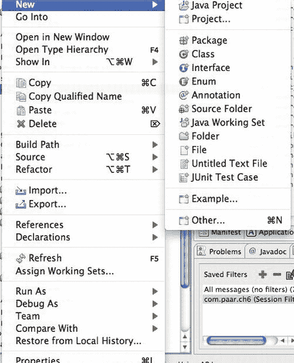
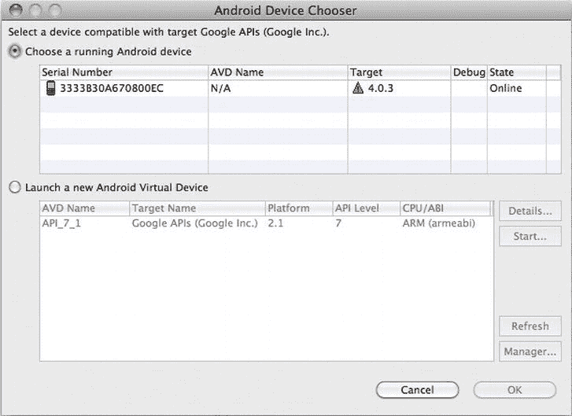
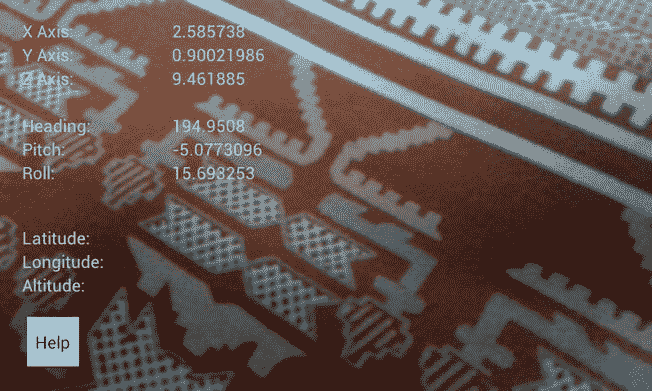
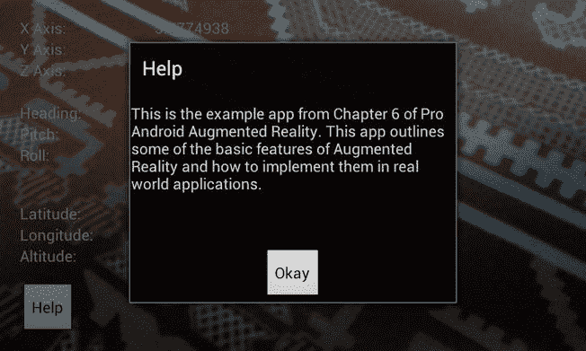
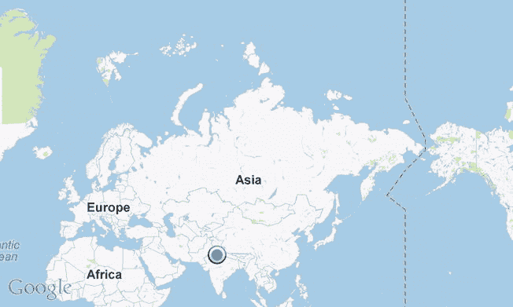
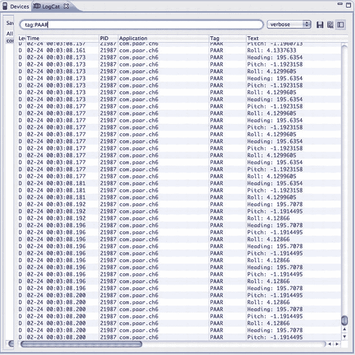

# 六、一个简单的基于位置的应用，使用增强现实和地图 API

本章概述了如何制作一个非常简单的现实世界增强现实(AR)应用。本章结束时，你将拥有一个功能齐全的示例应用。

该应用将具有以下基本功能:

*   该应用将启动，并在屏幕上显示一个实时相机预览。
*   相机预览将被传感器和位置数据覆盖，如在[第 3 章](03.html#ch3)微件覆盖示例应用中。
*   当手机与地面平行时，应用会切换到显示地图。我们将增加 7 的余量，因为用户不太可能将设备与地面完全平行。用户的当前位置将在应用上标记出来。该地图将有在卫星视图、街道视图和两者之间切换的选项。该地图将使用谷歌地图应用编程接口(API)提供。
*   当设备移动到与地面不平行的方向时，应用将切换回相机视图。

这个应用可以作为一个独立的应用，也可以扩展为一个增强现实导航系统，我们将在下一章中介绍。

首先，创建一个新的 Android 项目。该项目应针对谷歌 API(API 级别 7，因为我们的目标是 2.1 及以上)，以便我们可以使用 Android 的地图功能。本章通篇使用的项目有包名`com.paar.ch06`，项目名 Pro Android AR 6:使用 AR 的简单 App。您可以使用您想要的任何其他包和项目名称，只要您记得更改示例代码中的任何引用以匹配您的更改。

创建项目后，通过右键单击 eclipse 左侧栏中的包名并从 New 菜单中选择 class，向您的项目添加另一个类(参见[图 6-1](#fig_6_1) ):

**图 6-1。** *菜单创建一个新的类。*

将此类命名为`FlatBack`。它将保存`MapView`和相关的位置 API。然后创建另一个名为`FixLocation`的类。在本章的后面你会学到更多关于这个类的知识。

### 编辑 XML

在创建了必要的类之后，我们就可以开始编码工作了。首先，编辑`AndroidManifest.xml`来声明新的`activity`，并要求必要的特性、库和权限。更新`AndroidManifest.xml`如下:

**清单 6-1** 。*更新 AndroidManifest.xml*

`<?xml version="1.0" encoding="utf-8"?>
<manifest xmlns:android="http://schemas.android.com/apk/res/android"`
`package="com.paar.ch6"
android:versionCode="1"
android:versionName="1.0" >

<uses-sdk android:minSdkVersion="7" />

<application
android:icon="@drawable/ic_launcher"
android:label="@string/app_name" >
<activity
android:label="@string/app_name"
android:name=".ASimpleAppUsingARActivity"
***android:screenOrientation = "landscape"***
***android:theme="@android:style/Theme.NoTitleBar.Fullscreen"***
***android:configChanges = "keyboardHidden|orientation">***
<intent-filter >
<action android:name="android.intent.action.MAIN" />

<category android:name="android.intent.category.LAUNCHER" />
</intent-filter>
</activity>
***<activity***
***android:name=".FlatBack"***
***android:screenOrientation="landscape"***
***android:theme="@android:style/Theme.NoTitleBar.Fullscreen"***
***android:configChanges="keyboardHidden|orientation"></activity>***
***<uses-library android:name="com.google.android.maps" />***
</application>
***<uses-feature android:name="android.hardware.camera" />***
***<uses-permission android:name="android.permission.CAMERA" />***
***<uses-permission android:name="android.permission.ACCESS_FINE_LOCATION" />***
***<uses-permission android:name="android.permission.INTERNET"/>***
</manifest>`

确保`FlatBack Activity`和之前声明的完全一样，确保`<uses-library>`标签在`<application>`标签内，所有的权限和特性请求都在`<application>`标签外和`<manifest>`标签内。这几乎是目前需要在`AndroidManifest`中完成的所有事情。

我们现在需要添加一些字符串，这些字符串将在应用的覆盖图和帮助对话框中使用。将您的`strings.xml`修改为以下内容:

**清单 6-2。** *更新 strings.xml*

`<?xml version="1.0" encoding="utf-8"?>
<resources>
<string name="hello">Hello World, ASimpleAppUsingARActivity!</string>
<string name="app_name">A Simple App Using AR</string>`
`<string name="xAxis">X Axis:</string>
<string name="yAxis">Y Axis:</string>
<string name="zAxis">Z Axis:</string>
<string name="heading">Heading:</string>
<string name="pitch">Pitch:</string>
<string name="roll">Roll:</string>
<string name="altitude">Altitude:</string>
<string name="longitude">Longitude:</string>
<string name="latitude">Latitude:</string>
<string name="empty"></string>
<string name="help">This is the example app from [Chapter 6](#ch6) of Pro
Android Augmented Reality. This app outlines some of the basic features of
Augmented Reality and how to implement them in real world applications.</string>
<string name="helpLabel">Help</string>

</resources>`

#### 创建菜单资源

您将创建两个菜单资源:一个用于摄像机预览`Activity`，另一个用于`MapActivity`。为此，在项目的`/res`目录中创建一个名为`menu`的新的子文件夹。在那个目录中创建两个 XML 文件，分别名为`main_menu`和`map_toggle`。在`main_menu`中，添加以下内容:

**清单 6-3。** *main_menu.xml*

`<?xml version="1.0" encoding="utf-8"?>
<menu xmlns:android="http://schemas.android.com/apk/res/android" >
<item
android:id="@+id/help"
android:title="Help"></item>
</menu>`

这基本上是主`Activity`中的帮助选项。现在在`map_toggle`中，我们将有三个选项，因此添加以下内容:

**清单 6-4。** *map_toggle.xml*

`<?xml version="1.0" encoding="utf-8"?>
<menu
xmlns:android="http://schemas.android.com/apk/res/android">
<item
android:id="@+id/map"
android:title="Map View"></item>
<item
android:id="@+id/sat"
android:title="Satellite View"></item>`
`<item
android:id="@+id/both"
android:title="Map + Satellite View"></item>
</menu>`

第一个选项允许用户设置街道视图显示的地图种类，就像你在路线图上看到的一样。第二种选择允许他们在地图上使用卫星图像。第三种选择是在那个地方的卫星图像上叠加一张路线图。当然，这两个文件都只定义了用户界面的一部分，实际的工作将在 Java 文件中完成。

#### 布局文件

这个项目中有三个布局文件。一个用于主相机预览和相关叠加，一个用于帮助对话框，一个用于地图。

##### 相机预览

相机预览`Activity`布局文件是普通的`main.xml`，对其标准内容有一些改变:

**清单 6-5。** *摄像机预览布局文件*

`<RelativeLayout
xmlns:android="http://schemas.android.com/apk/res/android"
android:id="@+id/relativeLayout1"
android:layout_width="fill_parent"
android:layout_height="fill_parent" >
<SurfaceView
android:id="@+id/cameraPreview"
android:layout_width="fill_parent"
android:layout_height="fill_parent" />

<TextView
android:id="@+id/xAxisLabel"
android:layout_width="wrap_content"
android:layout_height="wrap_content"
android:layout_alignParentLeft="true"
android:layout_alignParentTop="true"
android:layout_marginLeft="18dp"
android:layout_marginTop="15dp"
android:text="@string/xAxis" />

<TextView
android:id="@+id/yAxisLabel"
android:layout_width="wrap_content"
android:layout_height="wrap_content"`
`android:layout_alignLeft="@+id/xAxisLabel"
android:layout_below="@+id/xAxisLabel"
android:text="@string/yAxis" />

<TextView
android:id="@+id/zAxisLabel"
android:layout_width="wrap_content"
android:layout_height="wrap_content"
android:layout_alignLeft="@+id/yAxisLabel"
android:layout_below="@+id/yAxisLabel"
android:text="@string/zAxis" />

<TextView
android:id="@+id/headingLabel"
android:layout_width="wrap_content"
android:layout_height="wrap_content"
android:layout_alignLeft="@+id/zAxisLabel"
android:layout_below="@+id/zAxisLabel"
android:layout_marginTop="19dp"
android:text="@string/heading" />

<TextView
android:id="@+id/pitchLabel"
android:layout_width="wrap_content"
android:layout_height="wrap_content"
android:layout_alignLeft="@+id/headingLabel"
android:layout_below="@+id/headingLabel"
android:text="@string/pitch" />

<TextView
android:id="@+id/rollLabel"
android:layout_width="wrap_content"
android:layout_height="wrap_content"
android:layout_alignLeft="@+id/pitchLabel"
android:layout_below="@+id/pitchLabel"
android:text="@string/roll" />

<TextView
android:id="@+id/latitudeLabel"
android:layout_width="wrap_content"
android:layout_height="wrap_content"
android:layout_alignLeft="@+id/rollLabel"
android:layout_below="@+id/rollLabel"
android:layout_marginTop="34dp"
android:text="@string/latitude" />

<TextView
android:id="@+id/longitudeLabel"`

`android:layout_width="wrap_content"
android:layout_height="wrap_content"
android:layout_alignLeft="@+id/latitudeLabel"
android:layout_below="@+id/latitudeLabel"
android:text="@string/longitude" />

<TextView
android:id="@+id/altitudeLabel"
android:layout_width="wrap_content"
android:layout_height="wrap_content"
android:layout_alignLeft="@+id/longitudeLabel"
android:layout_below="@+id/longitudeLabel"
android:text="@string/altitude" />

<TextView
android:id="@+id/xAxisValue"
android:layout_width="wrap_content"
android:layout_height="wrap_content"
android:layout_alignBottom="@+id/xAxisLabel"
android:layout_marginLeft="56dp"
android:layout_toRightOf="@+id/longitudeLabel"
android:text="@string/empty" />

<TextView
android:id="@+id/yAxisValue"
android:layout_width="wrap_content"
android:layout_height="wrap_content"
android:layout_alignBaseline="@+id/yAxisLabel"
android:layout_alignBottom="@+id/yAxisLabel"
android:layout_alignLeft="@+id/xAxisValue"
android:text="@string/empty" />

<TextView
android:id="@+id/zAxisValue"
android:layout_width="wrap_content"
android:layout_height="wrap_content"
android:layout_above="@+id/headingLabel"
android:layout_alignLeft="@+id/yAxisValue"
android:text="@string/empty" />

<TextView
android:id="@+id/headingValue"
android:layout_width="wrap_content"
android:layout_height="wrap_content"
android:layout_alignBaseline="@+id/headingLabel"
android:layout_alignBottom="@+id/headingLabel"
android:layout_alignLeft="@+id/zAxisValue"
android:text="@string/empty" />`

`<TextView
android:id="@+id/pitchValue"
android:layout_width="wrap_content"
android:layout_height="wrap_content"
android:layout_alignBaseline="@+id/pitchLabel"
android:layout_alignBottom="@+id/pitchLabel"
android:layout_alignLeft="@+id/headingValue"
android:text="@string/empty" />

<TextView
android:id="@+id/rollValue"
android:layout_width="wrap_content"
android:layout_height="wrap_content"
android:layout_above="@+id/latitudeLabel"
android:layout_alignLeft="@+id/pitchValue"
android:text="@string/empty" />

<TextView
android:id="@+id/latitudeValue"
android:layout_width="wrap_content"
android:layout_height="wrap_content"
android:layout_alignBottom="@+id/latitudeLabel"
android:layout_alignLeft="@+id/rollValue"
android:text="@string/empty" />

<TextView
android:id="@+id/longitudeValue"
android:layout_width="wrap_content"
android:layout_height="wrap_content"
android:layout_alignBaseline="@+id/longitudeLabel"
android:layout_alignBottom="@+id/longitudeLabel"
android:layout_alignLeft="@+id/latitudeValue"
android:text="@string/empty" />

<TextView
android:id="@+id/altitudeValue"
android:layout_width="wrap_content"
android:layout_height="wrap_content"
android:layout_alignBaseline="@+id/altitudeLabel"
android:layout_alignBottom="@+id/altitudeLabel"
android:layout_alignLeft="@+id/longitudeValue"
android:text="@string/empty" />

<Button
android:id="@+id/helpButton"
android:layout_width="wrap_content"
android:layout_height="wrap_content"
android:layout_alignLeft="@+id/altitudeLabel"
android:layout_below="@+id/altitudeValue"
android:layout_marginTop="15dp"`
`android:text="@string/helpLabel" />

</RelativeLayout>`

同样，你需要确保所有的 id 都是有序的，并且你没有在任何地方打错字，因为这将影响整个布局。与第 3 章第一部分的布局唯一的主要区别是增加了一个帮助按钮，它将启动帮助对话框。“帮助”菜单选项会做同样的事情，但是最好有一个更容易看到的选项。

##### 帮助对话框

现在在`/res/layout`目录中创建另一个名为`help.xml`的 XML 文件。这将包含帮助对话框的布局设计，它有一个可滚动的`TextView`来显示实际的帮助文本和一个关闭对话框的按钮。将以下内容添加到`help.xml`文件中:

**清单 6-6。** *帮助对话框布局文件*

`<?xml version="1.0" encoding="utf-8"?>
<RelativeLayout
xmlns:android="http://schemas.android.com/apk/res/android"
android:layout_width="wrap_content"
android:layout_height="wrap_content">

<ScrollView
android:id="@+id/ScrollView01"
android:layout_width="wrap_content"
android:layout_height="200px">

<TextView
android:text="@+id/TextView01"
android:id="@+id/TextView01"
android:layout_width="wrap_content"
android:layout_height="wrap_content" />

</ScrollView>

<Button
android:id="@+id/Button01"
android:layout_below="@id/ScrollView01"
android:layout_width="wrap_content"
android:layout_height="wrap_content"
android:layout_centerHorizontal="true"
android:text="Okay" />

</RelativeLayout>`

如你所见，这是一个相对简单的`RelativeLayout`用于对话框布局。在文件的底部有一个`ScrollView`和一个`TextView`来保存帮助对话框的内容，还有一个`Button`用来关闭对话框。

##### 地图布局

现在我们需要创建最终的布局文件:地图布局。在您的`/res/layout`文件夹中创建一个`map.xml`，并将以下内容添加到其中:

**清单 6-7。** *地图布局文件*

`<?xml version="1.0" encoding="utf-8"?>
<LinearLayout xmlns:android="http://schemas.android.com/apk/res/android"
android:layout_width="fill_parent"
android:layout_height="fill_parent"
android:orientation="vertical" >
<com.google.android.maps.MapView
android:id="@+id/mapView"
android:layout_width="fill_parent"
android:layout_height="fill_parent"
android:clickable="true"
android:apiKey="<your_key_here>" />
</LinearLayout>`

### 获取 API 密钥

如果您的项目没有设置为基于 Google APIs 目标构建，您将会得到一个错误。这里另一件重要的事情是 API 键。这是由谷歌以证书的形式分配给你的。它是从您的证书的 MD5 散列中生成的，您必须以在线形式提交该散列。Android 使用数字证书来验证应用的安装文件。如果签名证书在已安装版本和新版本之间不匹配，Android 将抛出一个安全异常，不允许您更新安装。映射 API 密钥对于每个证书都是唯一的。因此，如果您计划发布您的应用，您必须生成两个 API 密匙:一个用于您的调试证书(Eclipse 在开发和测试过程中用它来签署您的应用)，另一个用于您的发布证书(在将您的应用上传到在线市场(如 Android Market)之前用它来签署您的应用)。在不同的操作系统上，获取任何密钥的 MD5 的步骤是不同的。

#### 获取密钥的 MD5

**为调试键:**

调试密钥通常位于以下位置:

*   Mac/Linux: ~/。android/debug.keystore
*   Windows Vista/7: C:\Users\ <user>\。android\debug.keystore</user>
*   windows XP:C:\ Documents and Settings \<user>\。android\debug.keystore</user>

您需要运行以下命令来取出 MD5。该命令使用 Keytool 工具:

`keytool -list -alias androiddebugkey -keystore <path_to_debug_keystore>.keystore
-storepass android -keypass android`

**对于签名密钥:**

签名密钥在系统中没有固定的位置。在创建过程中或创建后，无论您将它保存或移动到何处，它都会被保存。运行下面的命令获取 MD5，用密钥的别名替换`alias_name`,用密钥的位置替换`my-release-key`:

`keytool -list -alias alias_name -keystore my-release-key.keystore`

在您提取了您想要的任何密钥 MD5 之后，使用您最喜欢的 web 浏览器导航到`[http://code.google.com/android/maps-api-signup.html](http://code.google.com/android/maps-api-signup.html)`。输入 MD5 并完成要求您做的任何其他事情。提交表单后，您将看到应用运行所需的 API 密钥。

### Java 代码

现在 XML 设置已经准备好了。所需要的只是标记图像和实际代码。让我们从标记图像开始。它叫做`ic_maps_current_position_indicator.png`，可以在这个项目源代码的`drawable-mdpi`和`drawable-hdpi`文件夹中找到。请确保将每个文件夹的图像复制到项目中的对应位置，不要错误地切换它们。

#### 主要活动

有了图像，我们就可以开始写代码了。我们将从主要的`Activity`开始。

##### 导入和变量声明

首先，我们来看看导入、类声明和变量声明:

**清单 6-8。** *主要活动进口和报关*

`package com.paar.ch6;

import android.app.Activity;
import android.app.Dialog;
import android.content.Intent;
import android.hardware.Camera;
import android.hardware.Sensor;
import android.hardware.SensorEvent;
import android.hardware.SensorEventListener;
import android.hardware.SensorManager;
import android.location.Location;
import android.location.LocationListener;
import android.location.LocationManager;
import android.os.Bundle;
import android.util.Log;
import android.view.Menu;
import android.view.MenuInflater;
import android.view.MenuItem;
import android.view.SurfaceHolder;
import android.view.SurfaceView;
import android.view.View;
import android.view.View.OnClickListener;
import android.widget.Button;
import android.widget.TextView;

public class ASimpleAppUsingARActivity extends Activity {
SurfaceView cameraPreview;
SurfaceHolder previewHolder;
Camera camera;
boolean inPreview;

final static String TAG = "PAAR";
SensorManager sensorManager;

int orientationSensor;
float headingAngle;`
`float pitchAngle;
float rollAngle;

int accelerometerSensor;
float xAxis;
float yAxis;
float zAxis;

LocationManager locationManager;
double latitude;
double longitude;
double altitude;

TextView xAxisValue;
TextView yAxisValue;
TextView zAxisValue;
TextView headingValue;
TextView pitchValue;
TextView rollValue;
TextView altitudeValue;
TextView latitudeValue;
TextView longitudeValue;

Button button;`

导入语句和类声明是标准的 Java，并且变量已经被命名来描述它们的功能。现在让我们继续讨论课堂上的不同方法。

##### onCreate()方法

app 的第一个方法，`onCreate()`，做了很多事情。它将`main.xml`文件设置为`Activity`视图。然后它获得位置和传感器系统服务。它为加速计和方向传感器以及全球定位系统(GPS)注册监听器。然后，它执行相机初始化的一部分(其余部分稍后执行)。最后，它获得了对九个`TextViews`的引用，以便它们可以在应用中更新，并获得了对帮助按钮的引用，设置了它的`onClickListener`。此方法的代码如下:

**清单 6-9。** *主活动的 onCreate()*

`@Override
public void onCreate(Bundle savedInstanceState) {
super.onCreate(savedInstanceState);
setContentView(R.layout.main);

locationManager = (LocationManager) getSystemService(LOCATION_SERVICE);`
`locationManager.requestLocationUpdates(LocationManager.GPS_PROVIDER, 2000,
2, locationListener);

sensorManager = (SensorManager) getSystemService(SENSOR_SERVICE);
orientationSensor = Sensor.TYPE_ORIENTATION;
accelerometerSensor = Sensor.TYPE_ACCELEROMETER;
sensorManager.registerListener(sensorEventListener, sensorManager
.getDefaultSensor(orientationSensor), SensorManager.SENSOR_DELAY_NORMAL);
sensorManager.registerListener(sensorEventListener, sensorManager
.getDefaultSensor(accelerometerSensor), SensorManager.SENSOR_DELAY_NORMAL);

inPreview = false;

cameraPreview = (SurfaceView)findViewById(R.id.cameraPreview);
previewHolder = cameraPreview.getHolder();
previewHolder.addCallback(surfaceCallback);
previewHolder.setType(SurfaceHolder.SURFACE_TYPE_PUSH_BUFFERS);

xAxisValue = (TextView) findViewById(R.id.xAxisValue);
yAxisValue = (TextView) findViewById(R.id.yAxisValue);
zAxisValue = (TextView) findViewById(R.id.zAxisValue);
headingValue = (TextView) findViewById(R.id.headingValue);
pitchValue = (TextView) findViewById(R.id.pitchValue);
rollValue = (TextView) findViewById(R.id.rollValue);
altitudeValue = (TextView) findViewById(R.id.altitudeValue);
longitudeValue = (TextView) findViewById(R.id.longitudeValue);
latitudeValue = (TextView) findViewById(R.id.latitudeValue);
button = (Button) findViewById(R.id.helpButton);
button.setOnClickListener(new OnClickListener() {
public void onClick(View v) {
showHelp();
}
});
}`

##### 位置监听器

代码中的下一个是`LocationListener`，它监听来自定位服务(本例中是 GPS)的位置更新。从 GPS 接收到更新后，它用新信息更新本地变量，将新信息打印到`LogCat`，并用新信息更新三个`TextViews`。它还包含应用中没有使用的方法的自动生成的方法存根。

**清单 6-10。**T3】location listener

`LocationListener locationListener = new LocationListener() {
public void onLocationChanged(Location location) {
latitude = location.getLatitude();
longitude = location.getLongitude();
altitude = location.getAltitude();

Log.d(TAG, "Latitude: " + String.valueOf(latitude));
Log.d(TAG, "Longitude: " + String.valueOf(longitude));
Log.d(TAG, "Altitude: " + String.valueOf(altitude));

latitudeValue.setText(String.valueOf(latitude));
longitudeValue.setText(String.valueOf(longitude));
altitudeValue.setText(String.valueOf(altitude));
}

public void onProviderDisabled(String arg0) {
// TODO Auto-generated method stub

}

public void onProviderEnabled(String arg0) {
// TODO Auto-generated method stub

}

public void onStatusChanged(String arg0, int arg1, Bundle arg2) {
// TODO Auto-generated method stub

}
};`

##### 启动地图

接下来要解释的是`launchFlatBack()`方法。每当满足手机或多或少与地面平行的条件时，`SensorEventListener`就会调用该方法。然后，该方法启动地图。

**清单 6-11。** *launchFlatBack()*

`public void launchFlatBack() {
Intent flatBackIntent = new Intent(this, FlatBack.class);
startActivity(flatBackIntent);
}`

##### 选项菜单

通过覆盖`onCreateOptionsMenu()`和`onOptionsItemSelected()`方法来创建和使用选项菜单。第一个从菜单资源(`main_menu.xml`)创建它，第二个监听菜单上的点击事件。如果单击了帮助项，它将调用适当的方法来显示帮助对话框。

**清单 6-12。** *onCreateOptionsMenu()和 onOptionsItemSelected()*

`@Override
public boolean onCreateOptionsMenu(Menu menu) {
MenuInflater inflater = getMenuInflater();
inflater.inflate(R.menu.main_menu, menu);
return true;
}

public boolean onOptionsItemSelected(MenuItem item) {
// Handle item selection
switch (item.getItemId()) {
case R.id.help:
showHelp();
default:
return super.onOptionsItemSelected(item);
}
}`

##### 显示帮助对话框

`showHelp()`是前面提到的合适方法。当单击“帮助”菜单项时，将调用该函数。

**清单 6-13。** *showHelp()*

`public void showHelp() {
final Dialog dialog = new Dialog(this);
dialog.setContentView(R.layout.help);
dialog.setTitle("Help");
dialog.setCancelable(true);
//there are a lot of settings, for dialog, check them all out!

//set up text
TextView text = (TextView) dialog.findViewById(R.id.TextView01);
text.setText(R.string.help);`

`//set up button
Button button = (Button) dialog.findViewById(R.id.Button01);
button.setOnClickListener(new OnClickListener() {
public void onClick(View v) {
dialog.cancel();
}
});
//now that the dialog is set up, it's time to show it
dialog.show();
}`

##### 监听传感器

现在我们来看`SensorEventListener`。有一个`if`陈述区分了方位传感器和加速度计。传感器的两个更新都被打印到`LogCat`和相应的`TextViews`。此外，代码中方位传感器部分的`if`语句决定了设备是否与地面平行。存在 14 度的偏差，因为任何人都不太可能将该设备与地面完全平行。

**清单 6-14。** *SensorEventListener*

`final SensorEventListener sensorEventListener = new SensorEventListener() {
public void onSensorChanged(SensorEvent sensorEvent) {
if (sensorEvent.sensor.getType() == Sensor.TYPE_ORIENTATION)
{
headingAngle = sensorEvent.values[0];
pitchAngle = sensorEvent.values[1];
rollAngle = sensorEvent.values[2];

Log.d(TAG, "Heading: " + String.valueOf(headingAngle));
Log.d(TAG, "Pitch: " + String.valueOf(pitchAngle));
Log.d(TAG, "Roll: " + String.valueOf(rollAngle));

headingValue.setText(String.valueOf(headingAngle));
pitchValue.setText(String.valueOf(pitchAngle));
rollValue.setText(String.valueOf(rollAngle));

if (pitchAngle < 7 && pitchAngle > -7 && rollAngle < 7 &&
rollAngle > -7)
{
launchFlatBack();
}
}`

`else if (sensorEvent.sensor.getType() == Sensor.TYPE_ACCELEROMETER)
{
xAxis = sensorEvent.values[0];
yAxis = sensorEvent.values[1];
zAxis = sensorEvent.values[2];

Log.d(TAG, "X Axis: " + String.valueOf(xAxis));
Log.d(TAG, "Y Axis: " + String.valueOf(yAxis));
Log.d(TAG, "Z Axis: " + String.valueOf(zAxis));

xAxisValue.setText(String.valueOf(xAxis));
yAxisValue.setText(String.valueOf(yAxis));
zAxisValue.setText(String.valueOf(zAxis));
}
}

public void onAccuracyChanged (Sensor senor, int accuracy) {
//Not used
}
};`

##### onResume()、onPause()和 onDestroy()方法

我们覆盖了`onResume()`、`onPause()`和`onDestroy()`方法，这样我们就可以释放和重新获取`SensorEventListener`、`LocationListener`和`Camera`。当应用暂停(用户切换到另一个应用)或被破坏(Android 终止该进程)时，我们会释放它们，以节省用户的电池和使用更少的系统资源。此外，一次只有一个应用可以使用`Camera`，所以通过释放它，我们可以让其他应用使用它。

**清单 6-15。** *onResume()，onPause()和 onDestroy()*

`@Override
public void onResume() {
super.onResume();
locationManager.requestLocationUpdates(LocationManager.GPS_PROVIDER, 2000, 2,
locationListener);
sensorManager.registerListener(sensorEventListener, sensorManager
.getDefaultSensor(orientationSensor), SensorManager.SENSOR_DELAY_NORMAL);
sensorManager.registerListener(sensorEventListener, sensorManager
.getDefaultSensor(accelerometerSensor), SensorManager.SENSOR_DELAY_NORMAL);
//Camera camera;
}

@Override
public void onPause() {
if (inPreview) {
camera.stopPreview();`
`}
locationManager.removeUpdates(locationListener);
sensorManager.unregisterListener(sensorEventListener);
if (camera != null)
{
camera.release();
camera=null;
}
inPreview=false;

super.onPause();
}

@Override
public void onDestroy() {
camera.release();
camera=null;
}`

##### 管理表面视图和相机

这最后四个方法处理管理`SurfaceView`、它的`SurfaceHolder`和`Camera`。

*   `getBestPreviewSize()`方法获得可用预览尺寸的列表，并选择最佳尺寸。
*   当`SurfaceView`准备好时，调用`surfaceCallback`。相机在那里设置并打开。
*   如果 Android 对`SurfaceView`做了任何更改，就会调用`surfaceChanged()`方法(例如，在方向改变之后)。
*   当`SurfaceView`被销毁时，调用`surfaceDestroyed()`方法。

**清单 6-16。** *getBestPreviewSize()、surfaceCallback()、surfaceChanged()和 surfaceDestroyed()*

`private Camera.Size getBestPreviewSize(int width, int height,
Camera.Parameters parameters) {
Camera.Size result=null;

for (Camera.Size size : parameters.getSupportedPreviewSizes()) {
if (size.width<=width && size.height<=height) {
if (result==null) {
result=size;
}`
`else {
int resultArea=result.width*result.height;
int newArea=size.width*size.height;

if (newArea>resultArea) {
result=size;
}
}
}
}

return(result);
}

SurfaceHolder.Callback surfaceCallback=new SurfaceHolder.Callback() {
public void surfaceCreated(SurfaceHolder holder) {
if (camera == null) {
camera = Camera.open();
}
try {
camera.setPreviewDisplay(previewHolder);
}
catch (Throwable t) {
Log.e(TAG, "Exception in setPreviewDisplay()", t);
}
}

public void surfaceChanged(SurfaceHolder holder, int format, int width,
int height) {
Camera.Parameters parameters=camera.getParameters();
Camera.Size size=getBestPreviewSize(width, height, parameters);

if (size!=null) {
parameters.setPreviewSize(size.width, size.height);
camera.setParameters(parameters);
camera.startPreview();
inPreview=true;
}
}

public void surfaceDestroyed(SurfaceHolder holder) {
if (camera != null) {
camera.stopPreview();
camera.setPreviewCallback(null);
camera.release();
camera = null;
}
}`

`};
}`

这是第一个 Java 文件的结尾。该文件与 GPS 和传感器一起工作以获得更新，然后通过`TextViews`和`LogCat`输出显示它们。

#### 平反. java

现在我们来学习`FlatBack.java.`这个`Activity`在手机与地面平行时被调用，并在地图上显示你的当前位置。这个类现在没有多大意义，因为部分工作是在`FixLocation`完成的。

##### 导入、变量声明和 onCreate()方法

在这个`Activity`的`onCreate()`中，我们一如既往地在开头重复`SensorManager`的东西。这里我们需要传感器输入，因为当设备不再与地面平行时，我们希望切换回`CameraView`。之后，我们获取对`MapView`(XML 布局中的那个)的引用，告诉 Android 我们不会实现自己的缩放控件，将`MapView`传递给`FixLocation`，将位置覆盖添加到`MapView`，告诉它更新，并调用自定义方法将它缩放到用户的位置。

**清单 6-17。** *Flatback.java 的导入、声明和 onCreate()*

`package com.paar.ch6;

import com.google.android.maps.GeoPoint;
import com.google.android.maps.MapActivity;
import com.google.android.maps.MapView;
import com.google.android.maps.MyLocationOverlay;

import android.hardware.Sensor;
import android.hardware.SensorEvent;
import android.hardware.SensorEventListener;
import android.hardware.SensorManager;
import android.os.Bundle;
import android.util.Log;
import android.view.Menu;
import android.view.MenuInflater;
import android.view.MenuItem;`

`public class FlatBack extends MapActivity{
private MapView mapView;
private MyLocationOverlay myLocationOverlay;
final static String TAG = "PAAR";
SensorManager sensorManager;

int orientationSensor;
float headingAngle;
float pitchAngle;
float rollAngle;
/** Called when the activity is first created. */
@Override
public void onCreate(Bundle savedInstanceState) {
super.onCreate(savedInstanceState);

// main.xml contains a MapView
setContentView(R.layout.map);

sensorManager = (SensorManager) getSystemService(SENSOR_SERVICE);
orientationSensor = Sensor.TYPE_ORIENTATION;
sensorManager.registerListener(sensorEventListener, sensorManager
.getDefaultSensor(orientationSensor), SensorManager.SENSOR_DELAY_NORMAL);

// extract MapView from layout
mapView = (MapView) findViewById(R.id.mapView);
mapView.setBuiltInZoomControls(true);

// create an overlay that shows our current location
myLocationOverlay = new FixLocation(this, mapView);

// add this overlay to the MapView and refresh it
mapView.getOverlays().add(myLocationOverlay);
mapView.postInvalidate();

// call convenience method that zooms map on our location
zoomToMyLocation();
}`

##### onCreateOptionsMenu()和 onOptionsItemSelected()方法

接下来是两个与选项菜单相关的方法，它们创建选项菜单，观察点击，区分哪个选项被点击，并在地图上执行适当的操作。

**清单 6-18。** *onCreateOptionsMenu()和 onOptionsItemSelected()*

`@Override
public boolean onCreateOptionsMenu(Menu menu) {
MenuInflater inflater = getMenuInflater();
inflater.inflate(R.menu.map_toggle, menu);
return true;
}

public boolean onOptionsItemSelected(MenuItem item) {
// Handle item selection
switch (item.getItemId()) {
case R.id.map:
if (mapView.isSatellite() == true) {
mapView.setSatellite(false);
mapView.setStreetView(true);
}
return true;
case R.id.sat:
if (mapView.isSatellite()==false){
mapView.setSatellite(true);
mapView.setStreetView(false);
}
return true;
case R.id.both:
mapView.setSatellite(true);
mapView.setStreetView(true);
default:
return super.onOptionsItemSelected(item);
}
}`

##### SensorEventListener

接下来是`SensorEventListener`，它与前面的类类似，只是它检查手机是否不再与地面平行，然后调用将带我们回到相机预览的自定义方法。

**清单 6-19。** *SensorEventListener*

`final SensorEventListener sensorEventListener = new SensorEventListener() {
public void onSensorChanged(SensorEvent sensorEvent) {
if (sensorEvent.sensor.getType() == Sensor.TYPE_ORIENTATION)
{
headingAngle = sensorEvent.values[0];
pitchAngle = sensorEvent.values[1];
rollAngle = sensorEvent.values[2];`

`Log.d(TAG, "Heading: " + String.valueOf(headingAngle));
Log.d(TAG, "Pitch: " + String.valueOf(pitchAngle));
Log.d(TAG, "Roll: " + String.valueOf(rollAngle));

if (pitchAngle > 7 || pitchAngle < -7 || rollAngle > 7
|| rollAngle < -7)
{
launchCameraView();
}
}
}

public void onAccuracyChanged(Sensor arg0, int arg1) {
// TODO Auto-generated method stub

}
};`

##### launchCameraView()方法

`launchCameraView()`方法完成当前的`activity`，这样我们就可以毫无问题地进行相机预览。一个`Intent`被注释掉了，似乎做了同样的事情。我把它注释掉了，因为尽管它最终启动了摄像机预览，但它是通过创建那个`activity`的另一个实例来完成的，这将会产生一个错误，因为摄像机已经被活动的第一个实例使用了。因此，最好返回到以前的实例。

**清单 6-20。** *launchCameraView()*

`public void launchCameraView() {
finish();
//Intent cameraView = new Intent(this, ASimpleAppUsingARActivity.class);
//startActivity(cameraView);
}`

##### onResume()和 onPause()方法

然后是`onResume()`和`onPause()`方法，它们启用和禁用位置更新以节省资源。

**清单 6-21。** *onResume()和 onPause()*

`@Override
protected void onResume() {
super.onResume();`
`myLocationOverlay.enableMyLocation();
}

@Override
protected void onPause() {
super.onPause();
myLocationOverlay.disableMyLocation();
}`

##### zoomToMyLocation()方法

这是自定义后的`zoomToMyLocation()`方法。此方法将缩放级别 10 应用于地图上的当前位置。

**清单 6-22。** *zoomToMyLocation()*

`private void zoomToMyLocation() {
GeoPoint myLocationGeoPoint = myLocationOverlay.getMyLocation();
if(myLocationGeoPoint != null) {
mapView.getController().animateTo(myLocationGeoPoint);
mapView.getController().setZoom(10);
}
}`

##### isRouteDisplayed()方法

最后是布尔方法`isRouteDisplayed()`。因为没有在 app 中使用，所以设置为 false。

**清单 6-23。** *isRouteDisplayed()*

`protected boolean isRouteDisplayed() {
return false;
}
}`

这就把我们带到了`FlatBack.java`的结尾。注意，大多数实际的定位工作似乎是在`FixLocation.java`中完成的。在您厌倦 Eclipse 在其引用中给你错误之前，我们将继续编写那个类。

#### FixLocation.java

现在是时候了解`FixLocation`的用途了。在一些 Android 驱动的设备中,`MyLocationOverlay`类有严重的错误，其中最显著的是摩托罗拉 droid。`FixLocation`试图使用标准的 `MyLocationOverlay`，但是如果它不能正常工作，它会实现自己的版本，这将产生相同的结果。首先是源代码，然后是解释:

**清单 6-24。FixLocation.java**T2

`package com.paar.ch6;

import android.content.Context;
import android.graphics.Canvas;
import android.graphics.Paint;
import android.graphics.Point;
import android.graphics.Paint.Style;
import android.graphics.drawable.Drawable;
import android.location.Location;

import com.google.android.maps.GeoPoint;
import com.google.android.maps.MapView;
import com.google.android.maps.MyLocationOverlay;
import com.google.android.maps.Projection;

public class FixLocation extends MyLocationOverlay {

private boolean bugged = false;

private Drawable drawable;
private Paint accuracyPaint;
private Point center;
private Point left;
private int width;
private int height;

public FixLocation(Context context, MapView mapView) {
super(context, mapView);
}

@Override
protected void drawMyLocation(Canvas canvas, MapView mapView,
Location lastFix, GeoPoint myLocation, long when) {
if(!bugged) {
try {
super.drawMyLocation(canvas, mapView, lastFix,
myLocation, when);
} catch (Exception e) {
// we found a buggy phone, draw the location
icons ourselves
bugged = true;
}
}`

`if(bugged) {
if(drawable == null) {

accuracyPaint = new Paint();
accuracyPaint.setAntiAlias(true);
accuracyPaint.setStrokeWidth(2.0f);

drawable = mapView.getContext()
.getResources().getDrawable(R.drawable.ic_maps_indicator_current_position);
width = drawable.getIntrinsicWidth();
height = drawable.getIntrinsicHeight();
center = new Point();
left = new Point();
}

Projection projection = mapView.getProjection();
double latitude = lastFix.getLatitude();
double longitude = lastFix.getLongitude();
float accuracy = lastFix.getAccuracy();

float[] result = new float[1];

Location.distanceBetween(latitude, longitude, latitude,
longitude + 1, result);
float longitudeLineDistance = result[0];

GeoPoint leftGeo = new GeoPoint((int)(latitude*1e6),
(int)((longitude-accuracy/longitudeLineDistance)*1e6));
projection.toPixels(leftGeo, left);
projection.toPixels(myLocation, center);
int radius = center.x - left.x;

accuracyPaint.setColor(0xff6666ff);
accuracyPaint.setStyle(Style.STROKE);
canvas.drawCircle(center.x, center.y, radius,
accuracyPaint);

accuracyPaint.setColor(0x186666ff);
accuracyPaint.setStyle(Style.FILL);
canvas.drawCircle(center.x, center.y, radius,
accuracyPaint);

drawable.setBounds(center.x - width/2, center.y -
height/2, center.x + width/2, center.y + height/2);
drawable.draw(canvas);
}
}
}`

首先，我们有接收来自`FlatBack`的调用的方法。然后我们覆盖`drawMyLocation()`方法。在实现中，我们检查它是否被窃听。我们试图让它正常运行，但是如果我们得到一个异常，我们将 bugged 设置为 true，然后继续执行我们自己的工作实现。

如果它确实被窃听，我们设置油漆，得到一个可画的参考，得到位置，计算精度，然后在地图上画标记，随着精度圈。准确度圆圈意味着位置不是 100%准确，你在圆圈内的某个地方。

这个示例应用到此结束。现在快速看一下如何运行该应用，并查看一些截图。

### 运行应用

该应用应该编译没有任何错误或警告。如果您确实遇到了错误，请阅读下面的常见错误部分。

在设备上调试时，你可能会看到一个橙色的三角形，如图 6-2 所示。

**图 6-2。** *橙色预警三角*

这个三角形仅仅意味着 Eclipse 无法确认 Google APIs 是否安装在您的设备上。如果你的 Android 设备预装了 Android Market，你可以很确定它已经安装了 Google APIs。

当你运行这个应用时，你应该会看到类似于图 6-3 到图 6-5 的截图。

**图 6-3。***app 的增强现实视图*

**图 6-4。***app 的帮助对话框*

**图 6-5。** *地图显示当装置平行于地面时*

`LogCat`看起来应该类似于[图 6-6](#fig_6_6) 。

**图 6-6。***app*的 LogCat 截图

### 常见错误

以下是该应用的四个常见错误。对于其他任何事情，请向安卓开发者谷歌集团或 stackoverflow.com 寻求帮助。

*   **未能连接到相机服务:**我唯一一次看到这个错误是在其他东西已经在使用相机的时候。这个错误可以用几种方法解决，stackoverflow.com 应该能给你答案。
*   **任何看起来与地图相关的东西:**这很可能是因为你没有针对 Google APIs 进行构建，或者因为你忘记在`AndroidManifest`中声明`<uses-library>`，或者使用了不正确的 API 键。
*   **任何看起来与 R.something 有关的东西:**这个错误很可能是由于 XML 文件中的错误或不匹配，或者缺少 drawable。您可以通过检查 XML 文件来修复它。如果你确定它们是正确的，并且你的可绘制标记已经就位，试着通过删除/bin 目录后编译或者使用 Project - > Clean 从头开始构建。
*   **安全异常:**这些很可能是由于您的`AndroidManifest`中缺少许可。

### 总结

这将我们带到本书中第一个示例应用的结尾，它演示了如何执行以下操作:

*   使用标准的 Android SDK，通过实时摄像头预览增加传感器信息
*   当以特定方式握住设备时，启动`Activity`，在这种情况下，与地面平行
*   使用 Google Maps APIs 在地图上显示用户的当前位置
*   在设备上的地图 API 被破坏的情况下实施修复

这个应用将在下一章中构建，作为一个简单的 AR 导航应用。