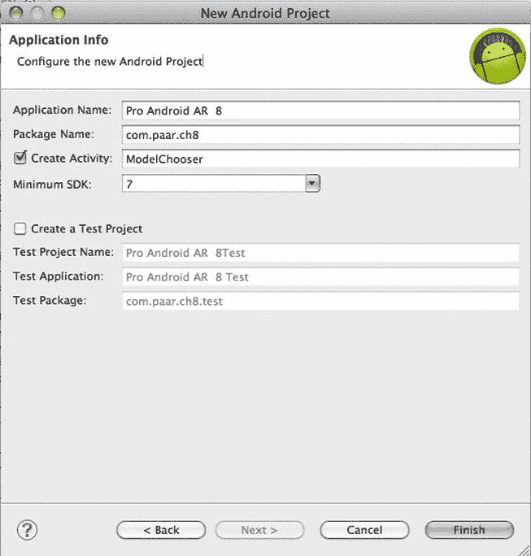
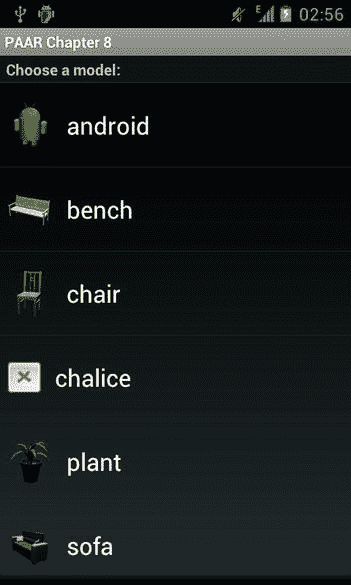

## 第八章

## 3D 增强现实模型查看器

在完成信息章节并浏览了前两个示例应用后，您现在应该对 Android 上的增强现实(ar)非常熟悉了。这是倒数第二个示例应用，也是普通非游戏应用中的最后一个，因为最后一个示例应用是使用 AR 构建的游戏。

这个应用使用标记功能，非常简单。启动时，它会向用户显示内置对象的列表，以显示在标记上，或者让他们选择从设备的内存中选择一个自定义对象。该应用接受波前中的对象。obj 文件，以及它们的。mtl 同行。如果你不熟悉这些格式和 wavefront，我建议你在继续之前先阅读一下。

**图 8-1。** *正在展示的安卓模型。*

### 这款应用的主要特点

以下是该应用的主要功能:

> *   Allows the user to view any pre-installed model on the marker.
> *   Allows users to view the external model located on SD card, and locate and select it by using OI file manager.
> *   Show all 3D models on the marker

再次，从创建一个新项目开始。这个项目没有扩展任何以前的项目，所以我们将从零开始。我们将有 22 个 Java 文件、8 个 drawables、4 个布局、1 个 strings.xml 和 31 个资产文件。图 8-2 显示了项目的详细情况。

**图 8-2。**本章中的*项目的细节。*

这个项目将使用 AndAR 作为外部库，使我们的 AR 任务更容易。标记识别算法很难实现，这个库是一个工作实现，我们可以在本书的范围内安全地使用。你可以从[http://code.google.com/p/andar/downloads/list](http://code.google.com/p/andar/downloads/list)获得 AndAR 库的副本，但是如果你从这个项目在 GitHub.com 或 Apress.com 的源代码下载它会更好，因为将来或旧版本的 AndAR 可能不会以这个项目中使用的方式实现。

### 载货单

首先，这里是声明应用中所有权限和活动的`AndroidManifest.xml`。

**清单 8-1。** *AndroidManifest.xml*

`<?xml version="1.0" encoding="utf-8"?>
<manifest xmlns:android="http://schemas.android.com/apk/res/android"
package="com.paar.ch8"
android:versionCode="1"
android:versionName="1.0" >

<uses-sdk android:minSdkVersion="7" />

<application
android:icon="@drawable/ic_launcher"
android:label="@string/app_name" >
<activity
android:label="@string/app_name"
android:name=".ModelChooser" >
<intent-filter >
<action android:name="android.intent.action.MAIN" />

<category android:name="android.intent.category.LAUNCHER" />
</intent-filter>
</activity>

<activity android:exported="false"
android:clearTaskOnLaunch="true"
android:screenOrientation="landscape"
android:icon="@drawable/ic_launcher"
android:name=".ModelViewer">
</activity>
<activity android:exported="false"
android:icon="@drawable/ic_launcher"
android:name=".Instructions">
</activity>
<activity android:label="@string/app_name"
android:icon="@drawable/ic_launcher"
android:name=".CheckFileManagerActivity">
</activity>
</application>

<uses-permission android:name="android.permission.WRITE_EXTERNAL_STORAGE"/>
<uses-permission android:name="android.permission.CAMERA"/>

<uses-feature android:name="android.hardware.camera" />
<uses-feature android:name="android.hardware.camera.autofocus" />` `<supports-screens android:smallScreens="true"
android:normalScreens="true"
android:largeScreens="true"
android:anyDensity="true" />
</manifest>`

在这个文件中，我们声明了应用中的四个活动:ModelChooser、ModelViewer、Instructions 和 CheckFileManagerActivity。然后，我们告诉 Android，我们将使用外部存储和摄像头，并请求许可。我们告诉 Android，我们将使用相机功能和自动对焦功能。最后，我们声明我们的应用支持的屏幕尺寸。

### Java 文件

让我们通过创建将成为我们主要活动的文件来开始 Java 代码。

#### 主要活动

在我的例子中，这个文件被称为`ModelChooser.java`，它在用户第一次启动应用时显示。它有一个可以显示的预加载模型列表，一个从设备内存加载外部用户提供的模型的选项，以及一个指向帮助文件的链接。

##### onCreate()方法

让我们通过对这个文件的`onCreate()`方法进行一些修改来开始它的编码。

**清单 8-2。**ModelChooser.java 的 *onCreate()方法*

`@Override
public void onCreate(Bundle savedInstanceState) {
super.onCreate(savedInstanceState);
AssetManager am = getAssets();
Vector<Item> models = new Vector<Item>();
Item item = new Item();
item.text = getResources().getString(R.string.choose_a_model);
item.type = Item.TYPE_HEADER;
models.add(item);

try {
String[] modelFiles = am.list("models");
List<String> modelFilesList = Arrays.asList(modelFiles);` `for (int i = 0; i < modelFiles.length; i++) {
String currFileName = modelFiles[i];
if(currFileName.endsWith(".obj")) {
item = new Item();
String trimmedFileName =
currFileName.substring(0,currFileName.lastIndexOf(".obj"));
item.text = trimmedFileName;
models.add(item);
if(modelFilesList.contains(trimmedFileName+".jpg")) {
InputStream is = am.open("models/"+trimmedFileName+".jpg");
item.icon=(BitmapFactory.decodeStream(is));
} else if(modelFilesList.contains(trimmedFileName+".png")) {
InputStream is = am.open("models/"+trimmedFileName+".png");
item.icon=(BitmapFactory.decodeStream(is));
}
}
}
} catch (IOException e) {
e.printStackTrace();
}
item = new Item();
item.text = getResources().getString(R.string.custom_model);
item.type = Item.TYPE_HEADER;
models.add(item);
item = new Item();
item.text = getResources().getString(R.string.choose_custom_model);
item.icon = new Integer(R.drawable.open);
models.add(item);
item = new Item();
item.text = getResources().getString(R.string.help);
item.type = Item.TYPE_HEADER;
models.add(item);
item = new Item();
item.text = getResources().getString(R.string.instructions);
item.icon = new Integer(R.drawable.help);
models.add(item);

setListAdapter(new ModelChooserListAdapter(models));
}`

这段代码看起来有点复杂，但是它的任务非常简单。它检索我们的资产文件夹中所有模型的列表，并从中创建一个漂亮的列表。如果模型有相应的图像文件，它会在对象名称旁边以图标样式显示该图像；否则，它只是显示一个类似十字的图像。除了添加应用附带的模型之外，这段代码还添加了选择您自己的模型和访问帮助文件的选项。

##### 倾听滴答声

接下来，我们需要一个方法来监听点击，并为每次点击做适当的工作。

**清单 8-3。** *onListItemClick()方法*

`@Override
protected void onListItemClick(ListView l, View v, int position, long id) {
super.onListItemClick(l, v, position, id);
Item item = (Item) this.getListAdapter().getItem(position);
String str = item.text;
if(str.equals(getResources().getString(R.string.choose_custom_model))) {
//start oi file manager activity
Intent intent = new Intent(ModelChooser.this,
CheckFileManagerActivity.class);
startActivity(intent);
} else if(str.equals(getResources().getString(R.string.instructions))) {
//show the instructions activity
startActivity(new Intent(ModelChooser.this, Instructions.class));
} else {
//load the selected internal file
Intent intent = new Intent(ModelChooser.this, ModelViewer.class);
intent.putExtra("name", str+".obj");
intent.putExtra("type", ModelViewer.TYPE_INTERNAL);
intent.setAction(Intent.ACTION_VIEW);
startActivity(intent);
}
}`

这段代码监听任何列表项上的点击。当检测到单击时，它会检查哪个项目被单击。如果用户想要选择一个外部模型，我们使用 intent 来检查并启动 OI 文件管理器。如果用户想要查看指令，我们启动指令活动。如果选择了一个内部模型，我们启动模型查看器，同时将它的动作设置为`ACTION_VIEW`，并将模型的名称作为额外信息发送出去。

##### 列表适配器

如果你一直在仔细观察`onCreate`中的代码，你会看到一个错误，我们正在为我们的列表设置适配器。我们现在将通过创建一个内部类作为列表的适配器来解决这个问题。

**清单 8-4。** *我们的适配器列表*

`class ModelChooserListAdapter extends BaseAdapter{`  `private Vector<Item> items;

public ModelChooserListAdapter(Vector<Item> items) {
this.items = items;
}

public int getCount() {
return items.size();
}

public Object getItem(int position) {
return items.get(position);
}

public long getItemId(int position) {
return position;
}

@Override
public int getViewTypeCount() {
//normal items, and the header
return 2;
}

@Override
public boolean areAllItemsEnabled() {
return false;
}

@Override
public boolean isEnabled(int position) {
return !(items.get(position).type==Item.TYPE_HEADER);
}

@Override
public int getItemViewType(int position) {
return items.get(position).type;
}

public View getView(int position, View convertView, ViewGroup parent) {
View v = convertView;
Item item = items.get(position);
if (v == null) {
LayoutInflater vi =
(LayoutInflater)getSystemService(Context.LAYOUT_INFLATER_SERVICE);
switch(item.type) {
case Item.TYPE_HEADER:
v = vi.inflate(R.layout.list_header, null);
break;` `case Item.TYPE_ITEM:
v = vi.inflate(R.layout.choose_model_row, null);
break;
}
}
if(item != null) {
switch(item.type) {
case Item.TYPE_HEADER:
TextView headerText = (TextView)
v.findViewById(R.id.list_header_title);
if(headerText != null) {
headerText.setText(item.text);
}
break;
case Item.TYPE_ITEM:
Object iconImage = item.icon;
ImageView icon = (ImageView)
v.findViewById(R.id.choose_model_row_icon);
if(icon!=null) {
if(iconImage instanceof Integer) {

icon.setImageResource(((Integer)iconImage).intValue());
} else if(iconImage instanceof Bitmap) {
icon.setImageBitmap((Bitmap)iconImage);
}
}
TextView text = (TextView)
v.findViewById(R.id.choose_model_row_text);
if(text!=null)
text.setText(item.text);
break;
}
}
return v;
}

}`

简而言之，这段代码负责实际提取图标图像、名称等等；然后创建一个列表。这没什么了不起的。在处理列表时，这或多或少是标准的 Android 代码。

下面是另一个非常小的内部类，处理我们的项目。

**清单 8-5。** *内类物品*

`class Item {
private static final int TYPE_ITEM=0;
private static final int TYPE_HEADER=1;` `private int type = TYPE_ITEM;
private Object icon = new Integer(R.drawable.missingimage);
private String text;
}`

这五个变量用于设置列表中的每一行。`TYPE_ITEM`是一个常数，我们可以用它来表示包含模型的行，而不是使用整数。`TYPE_HEADER`与`TYPE_ITEM`相同，除了它是用于标题。`type`变量用于存储当前正在处理的项目的类型。默认情况下，它设置为 TYPE_ITEM。icon 变量用于表示当相应的图像不可用于模型时所使用的图标。text 变量用于存储正在处理的当前项目的文本。

这将我们带到主 ModelChooser 类的末尾。不要忘记插入一个最后的“`}`”来结束整个外层类。

现在我们已经创建了我们的主活动，让我们按照字母顺序处理剩下的 21 个 Java 文件，以便于跟踪它们，并使这一切变得简单一点。

#### AssetsFileUtility.java

我们现在需要创建一个名为`AssetsFileUtility`的文件，它将负责读入我们存储在`/assets`文件夹中的数据。`/assets`文件夹是一个你可以存储任何你想要的文件的地方，然后以原始字节流的形式检索它。在存储原始文件的能力上，类似于`/res/raw`。然而，存储在`/res/raw`中的文件可以通过资源 id(如`R.raw.filename`)进行本地化和访问。`/assets`文件夹不提供本地化或资源 id 访问。

**清单 8-6。AssetsFileUtility.java**T2

`public class AssetsFileUtility extends BaseFileUtil {
private AssetManager am;

public AssetsFileUtility(AssetManager am) {
this.am = am;
}

@Override
public Bitmap getBitmapFromName(String name) {
InputStream is = getInputStreamFromName(name);
return (is==null)?null:BitmapFactory.decodeStream(is);
}` `@Override
public BufferedReader getReaderFromName(String name) {
InputStream is = getInputStreamFromName(name);
return (is==null)?null:new BufferedReader(new InputStreamReader(is));
}

private InputStream getInputStreamFromName(String name) {
InputStream is;
if(baseFolder != null) {
try {
is = am.open(baseFolder+name);
} catch (IOException e) {
e.printStackTrace();
return null;
}
} else {
try {
is = am.open(name);
} catch (IOException e) {
e.printStackTrace();
return null;
}
}
return is;
}

}`

这段代码帮助我们从`/assets`文件夹中检索一个文件。它处理大部分工作，比如创建`InputStreamReaders`等等。如果您试图读取的文件不存在或者在其他方面无效(例如，文件扩展名无效)，您将得到一个`IOException`。

#### BaseFileUtil.java

接下来是一个名为`BaseFileUtil.java`的微型类。该文件是其他文件(如 AssetsFileUtility)的基础。它允许我们方便地更新正在查看的模型所在的文件夹。

**清单 8-7。BaseFileUtil.java**T2

`public abstract class BaseFileUtil {
protected String baseFolder = null;

public String getBaseFolder() {
return baseFolder;
}` `public void setBaseFolder(String baseFolder) {
this.baseFolder = baseFolder;
}

public abstract BufferedReader getReaderFromName(String name);
public abstract Bitmap getBitmapFromName(String name);

}`

#### CheckFileManagerActivity.java

我们按字母顺序排列的下一个是`CheckFileManagerActivity`。，当用户想要提供他自己的对象以被应用增强时，调用这个函数。通过允许用户查看自己的模型，我们有效地将这个应用变成了一个成熟的 3D AR 查看器。例如，用户可以设计一把椅子，并在建造它之前看看它在他的房子里会是什么样子。这极大地扩展了我们应用的可用性。目前，该应用仅支持 OI Filemanager 来选择新文件，但您可以修改代码，以允许该应用与其他文件管理器一起工作。我选择 OI 作为默认的，因为它预装在很多设备上，如果没有的话，通常也会安装。

##### 代码列表

让我们一节一节的来看看`CheckFileManagerActivity.java`。

###### 声明

首先是这个类中需要的声明。

**清单 8-8。**【CheckFileManagerActivity.java 宣言】T2

`public class CheckFileManagerActivity extends Activity {

private final int PICK_FILE = 1;
private final int VIEW_MODEL = 2;
public static final int RESULT_ERROR = 3;

private final int INSTALL_INTENT_DIALOG=1;

private PackageManager packageManager;
private Resources res;
private TextView infoText;

private final int TOAST_TIMEOUT = 3;`

###### onCreate()和 onResume()

紧随声明之后的是`onCreate()`和`onResume()`方法。

我们做的第一件事是检查 OI 文件管理器是否安装。如果不是，我们要求用户安装它。如果文件管理器可用，我们允许用户选择一个文件。参见[清单 8-9](#list_8_9) 。

**清单 8-9。** *onCreate()和 onResume()*

`@Override
final public void onCreate(Bundle savedInstanceState) {
super.onCreate(savedInstanceState);
setContentView(R.layout.main);
Context context = this;
packageManager= context.getPackageManager();
res = this.getResources();
infoText = (TextView) findViewById(R.id.InfoText);
if (isPickFileIntentAvailable()) {
selectFile();
} else {
installPickFileIntent();
}
}

@Override
protected void onResume() {
super.onResume();
}`

###### onActivityResult()

如果选择的文件不是一个有效的模型文件，我们会显示一个提示告诉用户，并要求他再次选择。如果选择的文件是一个有效的模型文件，我们将控制权传递给模型查看器，它将解析并显示该文件。如果用户取消操作，我们将应用返回到模型选择器屏幕。

**清单 8-10。** *onActivityResult()*

`@Override
protected void onActivityResult(int requestCode, int resultCode, Intent
data) {
super.onActivityResult(requestCode, resultCode, data);
switch (requestCode) {
default:
case PICK_FILE:` `switch(resultCode) {
case Activity.RESULT_OK:
//does file exist??
File file = new File(URI.create(data.getDataString()));
if (!file.exists()) {
//notify user that this file doesn't exist
Toast.makeText(this, res.getText(R.string.file_doesnt_exist),
TOAST_TIMEOUT).show();
selectFile();
} else {
String fileName = data.getDataString();
if(!fileName.endsWith(".obj")) {
Toast.makeText(this, res.getText(R.string.wrong_file),
TOAST_TIMEOUT).show();
selectFile();
} else {
//hand over control to the model viewer
Intent intent = new Intent(CheckFileManagerActivity.this,
ModelViewer.class);
intent.putExtra("name", data.getDataString());
intent.putExtra("type", ModelViewer.TYPE_EXTERNAL);
intent.setAction(Intent.ACTION_VIEW);
startActivityForResult(intent, VIEW_MODEL);
}
}
break;
default:
case Activity.RESULT_CANCELED:
//back to the main activity
Intent intent = new Intent(CheckFileManagerActivity.this,
ModelChooser.class);
startActivity(intent);
break;
}
break;
case VIEW_MODEL:
switch(resultCode) {
case Activity.RESULT_OK:
//model viewer returned...let the user view a new file
selectFile();
break;
case Activity.RESULT_CANCELED:
selectFile();
break;
case RESULT_ERROR:
//something went wrong ... notify the user
if(data != null) {
Bundle extras = data.getExtras();
String errorMessage = extras.getString("error_message");
if(errorMessage != null)` `Toast.makeText(this, extras.getString("error_message"),
TOAST_TIMEOUT).show();
}
selectFile();
break;
}
}
}`

###### 选择文件()

selectFile()方法允许用户选择一个模型文件。

**清单 8-11。** *selectFile()*

`/** Let the user select a File. The selected file will be handled in
* {@link
edu.dhbw.andobjviewer.CheckFileManagerActivity#onActivityResult(int, int,
Intent)} */
private void selectFile() {
//let the user select a model file
Intent intent = new Intent("org.openintents.action.PICK_FILE");
intent.setData(Uri.parse("file:///sdcard/"));
intent.putExtra("org.openintents.extra.TITLE", res.getText(
R.string.select_model_file));
startActivityForResult(intent, PICK_FILE);
}`

###### ispickfileintentavailable()和 installPickFileIntent()

在 onCreate 方法()中调用了`isPickFileIntentAvailable()`和`installPickFileIntent()`方法。

**清单 8-12。***ispickfileattemptavailable()和 installPickFileIntent()*

`private boolean isPickFileIntentAvailable() {
return packageManager.queryIntentActivities(
new Intent("org.openintents.action.PICK_FILE"), 0).size() > 0;
}

private boolean installPickFileIntent() {
Uri marketUri =
Uri.parse("market://search?q=pname:org.openintents.filemanager");
Intent marketIntent = new Intent(Intent.ACTION_VIEW).setData(marketUri);
if (!(packageManager
.queryIntentActivities(marketIntent, 0).size() > 0)) {
//no Market available
//show info to user and exit` `infoText.setText(res.getText(R.string.android_markt_not_avail));
return false;
} else {
//notify user and start Android market

showDialog(INSTALL_INTENT_DIALOG);
return true;
}
}`

###### onCreateDialog()

`CheckFileManagerActivity.java`中最后一个方法是`onCreateDialog()`。

**清单 8-13。** *onCreateDialog()*

`@Override
protected Dialog onCreateDialog(int id) {
Dialog dialog = null;
switch(id){
case INSTALL_INTENT_DIALOG:
AlertDialog alertDialog = new
AlertDialog.Builder(this).create();

alertDialog.setMessage(res.getText(R.string.pickfile_intent_required));
alertDialog.setButton("OK", new
DialogInterface.OnClickListener() {
public void onClick(DialogInterface dialog, int which) {
//launch android market
Uri marketUri =
Uri.parse("market://search?q=pname:org.openintents.filemanager");
Intent marketIntent = new
Intent(Intent.ACTION_VIEW).setData(marketUri);
startActivity(marketIntent);
return;
} });
dialog = alertDialog;
break;
}
return dialog;
}

}`

#### 配置文件

列表中的下一个是`Config.java`文件。这是你见过的最小的 Java 文件。除去包名，只有三行大小。

**清单 8-14。Config.java**T2

`public class Config {
public final static boolean DEBUG = false;
}`

这个文件在技术上是配置文件，尽管它只有一个选项。将`DEBUG`设置为`true`会将应用置于调试模式。如果您决定扩展该应用，您可以在此添加其他配置选项，例如您要发布 apk 的市场的标志。

#### 与数字打交道

接下来是`FixedPointUtilities`类，它处理一些数学函数，主要是转换数组等。这对于保持我们的模型看起来是非常重要的。

**清单 8-15。FixedPointUtilities.java**T2

`public class FixedPointUtilities {
public static final int ONE = 0x10000;

public static int toFixed(float val) {
return (int)(val * 65536F);
}

public static int[] toFixed(float[] arr) {
int[] res = new int[arr.length];
toFixed(arr, res);
return res;
}

public static void toFixed(float[] arr, int[] storage)
{
for (int i=0;i<storage.length;i++) {
storage[i] = toFixed(arr[i]);
}
}` `public static float toFloat(int val) {
return ((float)val)/65536.0f;
}

public static float[] toFloat(int[] arr) {
float[] res = new float[arr.length];
toFloat(arr, res);
return res;
}

public static void toFloat(int[] arr, float[] storage)
{
for (int i=0;i<storage.length;i++) {
storage[i] = toFloat(arr[i]);
}
}

public static int multiply (int x, int y) {
long z = (long) x * (long) y;
return ((int) (z >> 16));
}

public static int divide (int x, int y) {
long z = (((long) x) << 32);
return (int) ((z / y) >> 16);
}

public static int sqrt (int n) {
int s = (n + 65536) >> 1;
for (int i = 0; i < 8; i++) {
s = (s + divide(n, s)) >> 1;
}
return s;
}
}`

现在让我们看看这个类中的方法。第一种方法将单浮点值转换为 16.16 定点值。

T2】

`public static int toFixed(float val) {
return (int)(val * 65536F);
}`

第二个方法做同样的事情，只是它是对一个浮点数组做的。

`public static int[] toFixed(float[] arr) {
int[] res = new int[arr.length];
toFixed(arr, res);` `return res;
}`

第三个方法由第二个方法调用以帮助其工作。

`public static void toFixed(float[] arr, int[] storage)
{
for (int i=0;i<storage.length;i++) {
storage[i] = toFixed(arr[i]);
}
}`

第四种方法将单个定点值转换为浮点数。

`public static float toFloat(int val) {
return ((float)val)/65536.0f;
}`

第五个方法对定点值数组做同样的事情，它调用第六个方法来帮助它。

`public static float[] toFloat(int[] arr) {
float[] res = new float[arr.length];
toFloat(arr, res);
return res;
}

public static void toFloat(int[] arr, float[] storage)
{
for (int i=0;i<storage.length;i++) {
storage[i] = toFloat(arr[i]);
}
}`

第七种方法是将两个定点值相乘，第八种方法是将两个定点值相除。

`public static int multiply (int x, int y) {
long z = (long) x * (long) y;
return ((int) (z >> 16));
}

public static int divide (int x, int y) {
long z = (((long) x) << 32);
return (int) ((z / y) >> 16);
}`

第九个也是最后一个方法是求一个定点值的平方根。

`public static int sqrt (int n) {
int s = (n + 65536) >> 1;
for (int i = 0; i < 8; i++) {
s = (s + divide(n, s)) >> 1;` `}
return s;
}`

这些方法是从 MatrixUtils.java 调用的。我们的模型本质上是大量的顶点。当我们解析它们时，我们需要处理这些顶点，这有助于我们做到这一点。

#### Group.java

接下来，我们有一个名为`Group.java`的类。此类主要是解析。obj 文件和它们的。mtl 对应方；并用它们制作合适的、用户友好的图形。这是我们对象解析中相对较小的一部分，但仍然很重要。

在 OpenGL 中，每个图形都是一组称为顶点的坐标。当这些顶点中有三个或三个以上被线连接起来时，它们被称为面。几个面孔经常被组合在一起。面可能有也可能没有纹理。纹理会改变特定面反射光线的方式。这个类处理组的创建，将每个组关联到一个材质，并设置它的纹理。

**清单 8-16。Group.java**T2

`public class Group implements Serializable {
private String materialName = "default";
private transient Material material;

private boolean textured = false;
public transient FloatBuffer vertices = null;
public transient FloatBuffer texcoords = null;
public transient FloatBuffer normals = null;
public int vertexCount = 0;

public ArrayList<Float> groupVertices = new ArrayList<Float>(500);
public ArrayList<Float> groupNormals = new ArrayList<Float>(500);
public ArrayList<Float> groupTexcoords = new ArrayList<Float>();

public Group() {
}

public void setMaterialName(String currMat) {
this.materialName = currMat;
}

public String getMaterialName() {
return materialName;
}` `public Material getMaterial() {
return material;
}

public void setMaterial(Material material) {
if(texcoords != null && material != null && material.hasTexture()) {
textured = true;
}
if(material != null)
this.material = material;
}

public boolean containsVertices() {
if(groupVertices != null)
return groupVertices.size()>0;
else if(vertices != null)
return vertices.capacity()>0;
else
return false;
}

public void setTextured(boolean b) {
textured = b;
}

public boolean isTextured() {
return textured;
}

public void finalize() {
if (groupTexcoords.size() > 0) {
textured = true;
texcoords = MemUtil.makeFloatBuffer(groupTexcoords.size());
for (Iterator<Float> iterator = groupTexcoords.iterator();
iterator.hasNext();) {` `Float curVal = iterator.next();
texcoords.put(curVal.floatValue());
}
texcoords.position(0);
if(material != null && material.hasTexture()) {
textured = true;
} else {
textured = false;
}
}
groupTexcoords = null;
vertices = MemUtil.makeFloatBuffer(groupVertices.size());
vertexCount = groupVertices.size()/3;//three floats pers vertex
for (Iterator<Float> iterator = groupVertices.iterator();
iterator.hasNext();) {` `Float curVal = iterator.next();
vertices.put(curVal.floatValue());
}
groupVertices = null;
normals = MemUtil.makeFloatBuffer(groupNormals.size());
for (Iterator<Float> iterator = groupNormals.iterator();
iterator.hasNext();) {
Float curVal = iterator.next();
normals.put(curVal.floatValue());
}
groupNormals = null;
vertices.position(0);
normals.position(0);
}
}`

该代码主要处理添加纹理和“材料”到我们正在解析的图形。它设置用于图形和材料的纹理。当然，这种材料只是虚拟的，从技术上讲并不是真实的材料。

#### Instructions.java

接下来是另一个非常简单的文件。这个文件叫做`Instructions.java`，包含`Activity`，它通过在`WebView`中显示一个位于`/assets/help`中的 HTML 文件来显示我们的应用的指令。

**清单 8-17。Instructions.java**T2

`public class Instructions extends Activity {

private WebView mWebView;

@Override
protected void onCreate(Bundle savedInstanceState) {
super.onCreate(savedInstanceState);
setContentView(R.layout.instructions_layout);
mWebView = (WebView) findViewById(R.id.instructions_webview);

WebSettings webSettings = mWebView.getSettings();
webSettings.setSupportZoom(true);
webSettings.setBuiltInZoomControls(true);

WebChromeClient client = new WebChromeClient();
mWebView.setWebChromeClient(client);` `mWebView.loadUrl("file:///android_asset/help/"+getResources().getString(R.string
.help_file));
}
}`

活动开始，单个 WebView 被设置为其视图。然后，WebView 被传递一个 HTML 文件，该文件包含我们的帮助并存储在资产中。

#### 与光一起工作

现在我们来看一些更复杂的东西。我们的模型是使用 OpenGL 渲染的。为了让它们看起来更好，我们还采用了各种照明技术。对于这种照明，我们有一个名为`LightingRenderer`的类。

**清单 8-18。LightingRenderer.java**T2

`public class LightingRenderer implements OpenGLRenderer {

private float[] ambientlight0 = {.3f, .3f, .3f, 1f};
private float[] diffuselight0 = {.7f, .7f, .7f, 1f};
private float[] specularlight0 = {0.6f, 0.6f, 0.6f, 1f};
private float[] lightposition0 = {100.0f,-200.0f,200.0f,0.0f};

private FloatBuffer lightPositionBuffer0 =
GraphicsUtil.makeFloatBuffer(lightposition0);
private FloatBuffer specularLightBuffer0 =
GraphicsUtil.makeFloatBuffer(specularlight0);
private FloatBuffer diffuseLightBuffer0 =
GraphicsUtil.makeFloatBuffer(diffuselight0);
private FloatBuffer ambientLightBuffer0 =
GraphicsUtil.makeFloatBuffer(ambientlight0);

private float[] ambientlight1 = {.3f, .3f, .3f, 1f};
private float[] diffuselight1 = {.7f, .7f, .7f, 1f};
private float[] specularlight1 = {0.6f, 0.6f, 0.6f, 1f};
private float[] lightposition1 = {20.0f,-40.0f,100.0f,1f};

private FloatBuffer lightPositionBuffer1 =
GraphicsUtil.makeFloatBuffer(lightposition1);
private FloatBuffer specularLightBuffer1 =
GraphicsUtil.makeFloatBuffer(specularlight1);
private FloatBuffer diffuseLightBuffer1 =
GraphicsUtil.makeFloatBuffer(diffuselight1);
private FloatBuffer ambientLightBuffer1 =
GraphicsUtil.makeFloatBuffer(ambientlight1);` `private float[] ambientlight2 = {.4f, .4f, .4f, 1f};
private float[] diffuselight2 = {.7f, .7f, .7f, 1f};
private float[] specularlight2 = {0.6f, 0.6f, 0.6f, 1f};
private float[] lightposition2 = {5f,-3f,-20f,1.0f};

private FloatBuffer lightPositionBuffer2 =
GraphicsUtil.makeFloatBuffer(lightposition2);
private FloatBuffer specularLightBuffer2 =
GraphicsUtil.makeFloatBuffer(specularlight2);
private FloatBuffer diffuseLightBuffer2 =
GraphicsUtil.makeFloatBuffer(diffuselight2);
private FloatBuffer ambientLightBuffer2 =
GraphicsUtil.makeFloatBuffer(ambientlight2);

private float[] ambientlight3 = {.4f, .4f, .4f, 1f};
private float[] diffuselight3 = {.4f, .4f, .4f, 1f};
private float[] specularlight3 = {0.6f, 0.6f, 0.6f, 1f};
private float[] lightposition3 = {0,0f,-1f,0.0f};

private FloatBuffer lightPositionBuffer3 =
GraphicsUtil.makeFloatBuffer(lightposition3);
private FloatBuffer specularLightBuffer3 =
GraphicsUtil.makeFloatBuffer(specularlight3);
private FloatBuffer diffuseLightBuffer3 =
GraphicsUtil.makeFloatBuffer(diffuselight3);
private FloatBuffer ambientLightBuffer3 =
GraphicsUtil.makeFloatBuffer(ambientlight3);

public final void draw(GL10 gl) {

}

public final void setupEnv(GL10 gl) {
gl.glLightfv(GL10.GL_LIGHT0, GL10.GL_AMBIENT, ambientLightBuffer0);
gl.glLightfv(GL10.GL_LIGHT0, GL10.GL_DIFFUSE, diffuseLightBuffer0);
gl.glLightfv(GL10.GL_LIGHT0, GL10.GL_SPECULAR, specularLightBuffer0);
gl.glLightfv(GL10.GL_LIGHT0, GL10.GL_POSITION, lightPositionBuffer0);
gl.glEnable(GL10.GL_LIGHT0);
gl.glLightfv(GL10.GL_LIGHT1, GL10.GL_AMBIENT, ambientLightBuffer1);
gl.glLightfv(GL10.GL_LIGHT1, GL10.GL_DIFFUSE, diffuseLightBuffer1);` `gl.glLightfv(GL10.GL_LIGHT1, GL10.GL_SPECULAR, specularLightBuffer1);
gl.glLightfv(GL10.GL_LIGHT1, GL10.GL_POSITION, lightPositionBuffer1);
gl.glEnable(GL10.GL_LIGHT1);
gl.glLightfv(GL10.GL_LIGHT2, GL10.GL_AMBIENT, ambientLightBuffer2);
gl.glLightfv(GL10.GL_LIGHT2, GL10.GL_DIFFUSE, diffuseLightBuffer2);
gl.glLightfv(GL10.GL_LIGHT2, GL10.GL_SPECULAR, specularLightBuffer2);
gl.glLightfv(GL10.GL_LIGHT2, GL10.GL_POSITION, lightPositionBuffer2);
gl.glEnable(GL10.GL_LIGHT2);
gl.glLightfv(GL10.GL_LIGHT3, GL10.GL_AMBIENT, ambientLightBuffer3);
gl.glLightfv(GL10.GL_LIGHT3, GL10.GL_DIFFUSE, diffuseLightBuffer3);
gl.glLightfv(GL10.GL_LIGHT3, GL10.GL_SPECULAR, specularLightBuffer3);
gl.glLightfv(GL10.GL_LIGHT3, GL10.GL_POSITION, lightPositionBuffer3);
gl.glEnable(GL10.GL_LIGHT3);
initGL(gl);
}

public final void initGL(GL10 gl) {
gl.glDisable(GL10.GL_COLOR_MATERIAL);
gl.glShadeModel(GL10.GL_SMOOTH);
gl.glEnable(GL10.GL_LIGHTING);
//gl.glEnable(GL10.GL_CULL_FACE);
gl.glEnable(GL10.GL_DEPTH_TEST);
gl.glEnable(GL10.GL_NORMALIZE);
gl.glEnable(GL10.GL_RESCALE_NORMAL);
}
}`

我们创建浮动来存储不同部分和不同环境下的照明值，然后用它们来创建`FloatBuffers`。所有这些都通过`setupEnv()`方法应用到我们的应用中，最后通过`initGL`方法输出。这段代码比本章到目前为止看到的其他代码更接近 AR，并且对于确保我们的图形的照明良好并且看起来真实非常重要。OpenGL 总共支持八种不同的照明配置，我们创建了其中的四种(`GL_LIGHT0-8`)。我们有不同的环境光、高光和漫射光设置，这允许我们给模型四种不同的外观。所有的灯光都设置为`GL_SMOOTH`，这需要更多的计算能力，但会产生更真实的模型。

#### 创建材料

现在我们来上我们的课。这个类是前面提到的在`Group`类中使用的材料。在现实世界中，光被物体的材料反射。有些材质反射绿色，有些反射红色，有些反射蓝色，等等。同样，在 OpenGL 中，我们创建所谓的物质对象，然后反过来构成我们的最终模型。每个材质对象都被设置为反射特定的光线阴影。当这与我们的灯光效果相结合时，我们得到了两种灯光的组合。例如，红色材质球在蓝色光源下会呈现黑色，因为红色材质不会反射蓝色阴影；它只会反射出一点红色。这个类处理所有与材质相关的 OpenGL 代码。

**清单 8-19。Material.java**T2

`public class Material implements Serializable {

private float[] ambientlightArr = {0.2f, 0.2f, 0.2f, 1.0f};` `private float[] diffuselightArr = {0.8f, 0.8f, 0.8f, 1.0f};
private float[] specularlightArr = {0.0f, 0.0f, 0.0f, 1.0f};

public transient FloatBuffer ambientlight = MemUtil.makeFloatBuffer(4);
public transient FloatBuffer diffuselight = MemUtil.makeFloatBuffer(4);
public transient FloatBuffer specularlight = MemUtil.makeFloatBuffer(4);
public float shininess = 0;
public int STATE = STATE_DYNAMIC;
public static final int STATE_DYNAMIC = 0;
public static final int STATE_FINALIZED = 1;

private transient Bitmap texture = null;
private String bitmapFileName = null;
private transient BaseFileUtil fileUtil = null;

private String name = "defaultMaterial";

public Material() {

}

public Material(String name) {
this.name = name;
//fill with default values
ambientlight.put(new float[]{0.2f, 0.2f, 0.2f, 1.0f});
ambientlight.position(0);
diffuselight.put(new float[]{0.8f, 0.8f, 0.8f, 1.0f});
diffuselight.position(0);
specularlight.put(new float[]{0.0f, 0.0f, 0.0f, 1.0f});
specularlight.position(0);
}

public String getName() {
return name;
}

public void setName(String name) {
this.name = name;
}

public void setFileUtil(BaseFileUtil fileUtil) {
this.fileUtil = fileUtil;
}

public String getBitmapFileName() {
return bitmapFileName;
}

public void setBitmapFileName(String bitmapFileName) {
this.bitmapFileName = bitmapFileName;` `}

public void setAmbient(float[] arr) {
ambientlightArr = arr;
}

public void setDiffuse(float[] arr) {
diffuselightArr = arr;
}

public void setSpecular(float[] arr) {
specularlightArr = arr;
}

public void setShininess(float ns) {
shininess = ns;
}

public void setAlpha(float alpha) {
ambientlight.put(3, alpha);
diffuselight.put(3, alpha);
specularlight.put(3, alpha);
}

public Bitmap getTexture() {
return texture;
}

public void setTexture(Bitmap texture) {
this.texture = texture;
}

public boolean hasTexture() {
if(STATE == STATE_DYNAMIC)
return this.bitmapFileName != null;
else if(STATE == STATE_FINALIZED)
return this.texture != null;
else
return false;
}

public void finalize() {
ambientlight = MemUtil.makeFloatBuffer(ambientlightArr);
diffuselight = MemUtil.makeFloatBuffer(diffuselightArr);
specularlight = MemUtil.makeFloatBuffer(specularlightArr);
ambientlightArr = null;
diffuselightArr = null;
specularlightArr = null;
if(fileUtil != null && bitmapFileName != null) {
texture = fileUtil.getBitmapFromName(bitmapFileName);` `}
}
}`

这门课帮助我们在需要的时候创造新的材料。有一个指定的默认材质，但是 setter 方法如`setAmbient()`、`setDiffuse()`、`setSpecular()`和`setShininess()`允许我们指定新数组的反射值，以及它的环境光，等等。finalize 方法将光照转换为 FloatBuffers，并为纹理赋值。

#### MemUtil.java

接下来我们有一个很小的类，用来创建浮动缓冲区。这是我们的`MemUtil`班。

**清单 8-20。MemUtil.java**T2

`public class MemUtil {

public static FloatBuffer makeFloatBufferFromArray(float[] arr) {
ByteBuffer bb = ByteBuffer.allocateDirect(arr.length*4);
bb.order(ByteOrder.nativeOrder());
FloatBuffer fb = bb.asFloatBuffer();
fb.put(arr);
fb.position(0);
return fb;
}

public static FloatBuffer makeFloatBuffer(int size) {
ByteBuffer bb = ByteBuffer.allocateDirect(size*4);
bb.order(ByteOrder.nativeOrder());
FloatBuffer fb = bb.asFloatBuffer();
fb.position(0);
return fb;
}

public static FloatBuffer makeFloatBuffer(float[] arr) {
ByteBuffer bb = ByteBuffer.allocateDirect(arr.length*4);
bb.order(ByteOrder.nativeOrder());
FloatBuffer fb = bb.asFloatBuffer();
fb.put(arr);
fb.position(0);
return fb;
}

}`

这个类非常简单，不需要太多解释，因为它是非常标准的 Java。我们需要 floatbuffer，因为 OpenGL 在其照明和材质实现中只接受 float buffer 参数。

#### Model.java

现在我们有了一个对我们的应用非常重要的类，`Model.java`。

**清单 8-21。Model.java**T2

`public class Model implements Serializable{

public float xrot = 90;
public float yrot = 0;
public float zrot = 0;
public float xpos = 0;
public float ypos = 0;
public float zpos = 0;
public float scale = 4f;
public int STATE = STATE_DYNAMIC;
public static final int STATE_DYNAMIC = 0;
public static final int STATE_FINALIZED = 1;

private Vector<Group> groups = new Vector<Group>();
protected HashMap<String, Material> materials = new HashMap<String,
Material>();
public Model() {
materials.put("default",new Material("default"));
}
public void addMaterial(Material mat) {
materials.put(mat.getName(), mat);
}
public Material getMaterial(String name) {
return materials.get(name);
}
public void addGroup(Group grp) {
if(STATE == STATE_FINALIZED)
grp.finalize();
groups.add(grp);
}
public Vector<Group> getGroups() {
return groups;
}
public void setFileUtil(BaseFileUtil fileUtil) {
for (Iterator iterator = materials.values().iterator();
iterator.hasNext();) {` `Material mat = (Material) iterator.next();
mat.setFileUtil(fileUtil);
}
}
public HashMap<String, Material> getMaterials() {
return materials;
}
public void setScale(float f) {
this.scale += f;
if(this.scale < 0.0001f)
this.scale = 0.0001f;
}
public void setXrot(float dY) {
this.xrot += dY;
}
public void setYrot(float dX) {
this.yrot += dX;
}
public void setXpos(float f) {
this.xpos += f;
}
public void setYpos(float f) {
this.ypos += f;
}
public void finalize() {
if(STATE != STATE_FINALIZED) {
STATE = STATE_FINALIZED;
for (Iterator iterator = groups.iterator();
iterator.hasNext();) {
Group grp = (Group) iterator.next();
grp.finalize();
grp.setMaterial(materials.get(grp.getMaterialName()));
}
for (Iterator<Material> iterator = materials.values().iterator(); iterator.hasNext();) {
Material mtl = iterator.next();
mtl.finalize();
}
}
}
}`

这个课程为创建我们的模型做了大量的基础工作。让我们一个方法一个方法来看。方法是构造器，为我们的模型设置默认材质。`addMaterial()`方法为我们的应用添加了一个素材。addGroup()方法将另一个组添加到我们的组中，如果需要的话，还会完成它。`setFileUtil()`方法将一个`BaseFileUtil`作为参数，然后用它来设置我们所有材料的 fileUtil。`setScale()`方法允许我们传递一个设置为刻度的浮点数。它还确保小数位数是非零的正值。该比例值用于缩放模型。`setXrot()`和`setYrot()`方法允许我们在模型上设置 X 轴和 Y 轴的旋转。`setXpos()`和`setYpos()`方法用于设置模型在 X 轴和 Y 轴上的位置。方法确定了一切，并使之不可改变。

#### Model3D.java

我们列表中的下一个是`Model3D.java`，它负责我们模型的大量绘制。解释在代码之后。

**清单 8-22。Model3D.java**T2

`public class Model3D extends ARObject implements Serializable{

private Model model;
private Group[] texturedGroups;
private Group[] nonTexturedGroups;
private HashMap<Material, Integer> textureIDs = new HashMap<Material,
Integer>();

public Model3D(Model model, String patternName) {
super("model", patternName, 80.0, new double[]{0,0});
this.model = model;
model.finalize();

Vector<Group> groups = model.getGroups();
Vector<Group> texturedGroups = new Vector<Group>();
Vector<Group> nonTexturedGroups = new Vector<Group>();
for (Iterator<Group> iterator = groups.iterator(); iterator.hasNext();) {
Group currGroup = iterator.next();
if(currGroup.isTextured()) {
texturedGroups.add(currGroup);
} else {
nonTexturedGroups.add(currGroup);
}
}
this.texturedGroups = texturedGroups.toArray(new
Group[texturedGroups.size()]);
this.nonTexturedGroups = nonTexturedGroups.toArray(new
Group[nonTexturedGroups.size()]);
}

@Override
public void init(GL10 gl){
int[] tmpTextureID = new int[1];

Iterator<Material> materialI = model.getMaterials().values().iterator();
while (materialI.hasNext()) {` `Material material = (Material) materialI.next();
if(material.hasTexture()) {

gl.glGenTextures(1, tmpTextureID, 0);
gl.glBindTexture(GL10.GL_TEXTURE_2D, tmpTextureID[0]);
textureIDs.put(material, tmpTextureID[0]);
GLUtils.texImage2D(GL10.GL_TEXTURE_2D, 0, material.getTexture(),0);
material.getTexture().recycle();
gl.glTexParameterx(GL10.GL_TEXTURE_2D, GL10.GL_TEXTURE_MIN_FILTER,
GL10.GL_LINEAR);
gl.glTexParameterx(GL10.GL_TEXTURE_2D, GL10.GL_TEXTURE_MAG_FILTER,
GL10.GL_LINEAR);
}
}
}

@Override
public void draw(GL10 gl) {
super.draw(gl);

gl.glScalef(model.scale, model.scale, model.scale);
gl.glTranslatef(model.xpos, model.ypos, model.zpos);
gl.glRotatef(model.xrot, 1, 0, 0);
gl.glRotatef(model.yrot, 0, 1, 0);
gl.glRotatef(model.zrot, 0, 0, 1);

gl.glEnableClientState(GL10.GL_VERTEX_ARRAY);
gl.glEnableClientState(GL10.GL_NORMAL_ARRAY);

gl.glDisable(GL10.GL_TEXTURE_2D);
int cnt = nonTexturedGroups.length;
for (int i = 0; i < cnt; i++) {
Group group = nonTexturedGroups[i];
Material mat = group.getMaterial();
if(mat != null) {
gl.glMaterialfv(GL10.GL_FRONT_AND_BACK, GL10.GL_SPECULAR,
mat.specularlight);
gl.glMaterialfv(GL10.GL_FRONT_AND_BACK, GL10.GL_AMBIENT,
mat.ambientlight);
gl.glMaterialfv(GL10.GL_FRONT_AND_BACK, GL10.GL_DIFFUSE,
mat.diffuselight);
gl.glMaterialf(GL10.GL_FRONT_AND_BACK, GL10.GL_SHININESS,
mat.shininess);
}
gl.glVertexPointer(3,GL10.GL_FLOAT, 0, group.vertices);
gl.glNormalPointer(GL10.GL_FLOAT,0, group.normals);
gl.glDrawArrays(GL10.GL_TRIANGLES, 0, group.vertexCount);
}

gl.glEnable(GL10.GL_TEXTURE_2D);` `gl.glEnableClientState(GL10.GL_TEXTURE_COORD_ARRAY);

cnt = texturedGroups.length;
for (int i = 0; i < cnt; i++) {
Group group = texturedGroups[i];
Material mat = group.getMaterial();
if(mat != null) {
gl.glMaterialfv(GL10.GL_FRONT_AND_BACK, GL10.GL_SPECULAR,
mat.specularlight);
gl.glMaterialfv(GL10.GL_FRONT_AND_BACK, GL10.GL_AMBIENT,
mat.ambientlight);
gl.glMaterialfv(GL10.GL_FRONT_AND_BACK, GL10.GL_DIFFUSE,
mat.diffuselight);
gl.glMaterialf(GL10.GL_FRONT_AND_BACK, GL10.GL_SHININESS,
mat.shininess);
if(mat.hasTexture()) {
gl.glTexCoordPointer(2,GL10.GL_FLOAT, 0, group.texcoords);
gl.glBindTexture(GL10.GL_TEXTURE_2D,
textureIDs.get(mat).intValue());
}
}
gl.glVertexPointer(3,GL10.GL_FLOAT, 0, group.vertices);
gl.glNormalPointer(GL10.GL_FLOAT,0, group.normals);
gl.glDrawArrays(GL10.GL_TRIANGLES, 0, group.vertexCount);
}

gl.glDisableClientState(GL10.GL_VERTEX_ARRAY);
gl.glDisableClientState(GL10.GL_NORMAL_ARRAY);
gl.glDisableClientState(GL10.GL_TEXTURE_COORD_ARRAY);
}
}`

在我们的构造函数中，我们得到我们的模型，然后从非纹理组中分离纹理组以获得更好的性能。方法为我们所有的材质加载纹理。这个类中最主要的是`draw()`方法。超级语句后的前七个 gl 语句做我们模型的定位。接下来的两条语句和`for`循环画出了所有没有纹理的部分。该方法的其余部分绘制模型的纹理部分。

#### 查看模型

我们名单上的下一个是`ModelViewer.java`。这个类负责加载和显示用户选择的模型，无论是从我们提供的模型还是从 SD 卡。这是一个很大的类，相当复杂。

##### 变量声明

全局变量用于存储文件的位置类型(内置或外部)、菜单选项、每个模型的模型和模型 3D 实例、进度对话框和 ARToolkit 实例。

**清单 8-23。**ModelViewer.java*变量*

`public class ModelViewer extends AndARActivity implements SurfaceHolder.Callback
{
public static final int TYPE_INTERNAL = 0;
public static final int TYPE_EXTERNAL = 1;
public static final boolean DEBUG = false;
private final int MENU_SCALE = 0;
private final int MENU_ROTATE = 1;
private final int MENU_TRANSLATE = 2;
private final int MENU_SCREENSHOT = 3;

private int mode = MENU_SCALE;
private Model model;
private Model model2;
private Model model3;
private Model model4;
private Model model5;
private Model3D model3d;
private Model3D model3d2;
private Model3D model3d3;
private Model3D model3d4;
private Model3D model3d5;
private ProgressDialog waitDialog;
private Resources res;
ARToolkit artoolkit;`

##### 构造器

这个类的构造函数如下所示。

**清单 8-24。ModelViewer.java***建造师*

`public ModelViewer() {
super(false);
}`

##### onCreate()方法

我们文件的`onCreate()`方法通过 LightingRenderer.java 设置照明，获取应用的资源，将 ARToolkit 的一个实例分配给`artoolkit`，为表面视图设置触摸事件监听器，并为表面视图添加回调。

**清单 8-25。***onCreate()方法*

`@Override
public void onCreate(Bundle savedInstanceState) {
super.onCreate(savedInstanceState);
super.setNonARRenderer(new LightingRenderer());
res=getResources();
artoolkit = getArtoolkit();
getSurfaceView().setOnTouchListener(new TouchEventHandler());
getSurfaceView().getHolder().addCallback(this);
}`

##### 捕捉异常和处理菜单选项

捕捉我们在别处没有显式捕捉到的任何异常。另外两种方法是非常常见的标准 Android 代码，用于创建菜单和监听用户在菜单上的活动。

**清单 8-26。** *捕捉异常并使用菜单*

`public void uncaughtException(Thread thread, Throwable ex) {
System.out.println("");
}
@Override
public boolean onCreateOptionsMenu(Menu menu) {
menu.add(0, MENU_TRANSLATE, 0, res.getText(R.string.translate))
.setIcon(R.drawable.translate);
menu.add(0, MENU_ROTATE, 0, res.getText(R.string.rotate))
.setIcon(R.drawable.rotate);
menu.add(0, MENU_SCALE, 0, res.getText(R.string.scale))
.setIcon(R.drawable.scale);
menu.add(0, MENU_SCREENSHOT, 0, res.getText(R.string.take_screenshot))
.setIcon(R.drawable.screenshoticon);
return true;
}
public boolean onOptionsItemSelected(MenuItem item) {
switch (item.getItemId()) {
case MENU_SCALE:
mode = MENU_SCALE;
return true;
case MENU_ROTATE:
mode = MENU_ROTATE;
return true;
case MENU_TRANSLATE:
mode = MENU_TRANSLATE;` `return true;
case MENU_SCREENSHOT:
new TakeAsyncScreenshot().execute();
return true;
}
return false;
}`

##### surfaceCreated()

surfaceCreated()在创建 SurfaceView 时被调用，它在模型加载时显示一个进度对话框。

**清单 8-27。** *surfaceCreated()*

`@Override
public void surfaceCreated(SurfaceHolder holder) {
super.surfaceCreated(holder);

if(model == null) {
waitDialog = ProgressDialog.show(this, "",
getResources().getText(R.string.loading), true);
waitDialog.show();
new ModelLoader().execute();
}
}`

##### TouchEventHandler 内部类

这个内部类截获我们活动中发生的每一个触摸事件。它接受这种事件，然后适当地缩放、平移或旋转模型。

**清单 8-28。** *内部类 TouchEventHandler*

`class TouchEventHandler implements OnTouchListener {
private float lastX=0;
private float lastY=0;
public boolean onTouch(View v, MotionEvent event) {
if(model!=null) {
switch(event.getAction()) {
default:
case MotionEvent.ACTION_DOWN:
lastX = event.getX();
lastY = event.getY();
break;
case MotionEvent.ACTION_MOVE:` `float dX = lastX - event.getX();
float dY = lastY - event.getY();
lastX = event.getX();
lastY = event.getY();
if(model != null) {
switch(mode) {
case MENU_SCALE:
model.setScale(dY/100.0f);
break;
case MENU_ROTATE:
model.setXrot(-1*dX);
model.setYrot(-1*dY);
break;
case MENU_TRANSLATE:
model.setXpos(dY/10f);
model.setYpos(dX/10f);
break;
}
}
break;
case MotionEvent.ACTION_CANCEL:
case MotionEvent.ACTION_UP:
lastX = event.getX();
lastY = event.getY();
break;
}
}
return true;
}
}`

##### 模型加载器内部类

`In this ModelLoader inner class, we use a series of if else statements to determine the model that we need to load. We also set the different markers required for some of the inbuilt models. The default marker for some of the inbuilt models, and all external models are called android. If the model is from an external file, we first trim it before loading it. If it is an inbuilt model, we load it directly. In onPostExecute(), we register all the models, and dismiss the progress dialog box.`

**清单 8-29。** *模型加载器*

`private class ModelLoader extends AsyncTask<Void, Void, Void> {
private String modelName2patternName (String modelName) {
String patternName = "android";
if (modelName.equals("plant.obj")) {
patternName = "marker_rupee16";` `} else if (modelName.equals("chair.obj")) {
patternName = "marker_fisch16";
} else if (modelName.equals("tower.obj")) {
patternName = "marker_peace16";
} else if (modelName.equals("bench.obj")) {
patternName = "marker_at16";
} else if (modelName.equals("towergreen.obj")) {
patternName = "marker_hand16";
}
return patternName;
}
@Override
protected Void doInBackground(Void... params) {
Intent intent = getIntent();
Bundle data = intent.getExtras();
int type = data.getInt("type");
String modelFileName = data.getString("name");
BaseFileUtil fileUtil= null;
File modelFile=null;
switch(type) {
case TYPE_EXTERNAL:
fileUtil = new SDCardFileUtil();
modelFile = new File(URI.create(modelFileName));
modelFileName = modelFile.getName();

fileUtil.setBaseFolder(modelFile.getParentFile().getAbsolutePath());
break;
case TYPE_INTERNAL:
fileUtil = new AssetsFileUtility(getResources().getAssets());
fileUtil.setBaseFolder("models/");
break;
}
if(modelFileName.endsWith(".obj")) {
ObjParser parser = new ObjParser(fileUtil);
try {
if(Config.DEBUG)
Debug.startMethodTracing("AndObjViewer");
if(type == TYPE_EXTERNAL) {
BufferedReader modelFileReader = new BufferedReader(new
FileReader(modelFile));
String shebang = modelFileReader.readLine();

if(!shebang.equals("#trimmed")) {
File trimmedFile = new File(modelFile.getAbsolutePath()+".tmp");
BufferedWriter trimmedFileWriter = new BufferedWriter(new
FileWriter(trimmedFile));
Util.trim(modelFileReader, trimmedFileWriter);
if(modelFile.delete()) {
trimmedFile.renameTo(modelFile);
}` `}
}
if(fileUtil != null) {
BufferedReader fileReader =
fileUtil.getReaderFromName(modelFileName);
if(fileReader != null) {
model = parser.parse("Model", fileReader);
Log.w("ModelLoader", "model3d = new Model3D(model, " +
modelName2patternName(modelFileName) + ".patt");
model3d = new Model3D(model, modelName2patternName(modelFileName)
+ ".patt");
}
String modelFileName2 = "chair.obj";
BufferedReader fileReader2 =
fileUtil.getReaderFromName(modelFileName2);
if(fileReader2 != null) {
model2 = parser.parse("Chair", fileReader2);
Log.w("ModelLoader", "model3d = new Model3D(model2, " +
modelName2patternName(modelFileName2) + ".patt");
model3d2 = new Model3D(model2,
modelName2patternName(modelFileName2) + ".patt");
} else {
Log.w("ModelLoader", "no file reader");
}
String modelFileName3 = "towergreen.obj";
BufferedReader fileReader3 =
fileUtil.getReaderFromName(modelFileName3);
if(fileReader3 != null) {
model3 = parser.parse("towergreen", fileReader3);
Log.w("ModelLoader", "model3d = new Model3D(model3, " +
modelName2patternName(modelFileName3) + ".patt");
model3d3 = new Model3D(model3,
modelName2patternName(modelFileName3) + ".patt");
} else {
Log.w("ModelLoader", "no file reader");
}
String modelFileName4 = "tower.obj";
BufferedReader fileReader4 =
fileUtil.getReaderFromName(modelFileName4);
if(fileReader4 != null) {
model4 = parser.parse("tower", fileReader4);
Log.w("ModelLoader", "model3d = new Model3D(model4, " +
modelName2patternName(modelFileName4) + ".patt");
model3d4 = new Model3D(model4,
modelName2patternName(modelFileName4) + ".patt");
} else {
Log.w("ModelLoader", "no file reader");
}
String modelFileName5 = "plant.obj";` `BufferedReader fileReader5 =
fileUtil.getReaderFromName(modelFileName5);
if(fileReader5 != null) {
model5 = parser.parse("Plant", fileReader5);
Log.w("ModelLoader", "model3d = new Model3D(model5, " +
modelName2patternName(modelFileName5) + ".patt");
model3d5 = new Model3D(model5,
modelName2patternName(modelFileName5) + ".patt");
} else {
Log.w("ModelLoader", "no file reader");
}
}
if(Config.DEBUG)
Debug.stopMethodTracing();
} catch (IOException e) {
e.printStackTrace();
} catch (ParseException e) {
e.printStackTrace();
}
}
return null;
}
@Override
protected void onPostExecute(Void result) {
super.onPostExecute(result);
waitDialog.dismiss();

try {
if(model3d!=null) {
artoolkit.registerARObject(model3d);
artoolkit.registerARObject(model3d2);
artoolkit.registerARObject(model3d3);
artoolkit.registerARObject(model3d4);
artoolkit.registerARObject(model3d5);
}
} catch (AndARException e) {
e.printStackTrace();
}
startPreview();
}
}`

##### TakeAsyncScreenshot 内部类

在`TakeAsyncScreenshot`内部类中，我们调用 AndAR 的内置截图功能。

**清单 8-30。**T3】takeasync 截图

`class TakeAsyncScreenshot extends AsyncTask<Void, Void, Void> {

private String errorMsg = null;

@Override
protected Void doInBackground(Void... params) {
Bitmap bm = takeScreenshot();
FileOutputStream fos;
try {
fos = new FileOutputStream("/sdcard/AndARScreenshot"+new
Date().getTime()+".png");
bm.compress(CompressFormat.PNG, 100, fos);
fos.flush();
fos.close();
} catch (FileNotFoundException e) {
errorMsg = e.getMessage();
e.printStackTrace();
} catch (IOException e) {
errorMsg = e.getMessage();
e.printStackTrace();
}
return null;
}

protected void onPostExecute(Void result) {
if(errorMsg == null)
Toast.makeText(ModelViewer.this,
getResources().getText(R.string.screenshotsaved), Toast.LENGTH_SHORT ).show();
else
Toast.makeText(ModelViewer.this,
getResources().getText(R.string.screenshotfailed)+errorMsg, Toast.LENGTH_SHORT
).show();
};
}
}`

#### 解析。mtl 文件

接下来我们有一个非常重要的课程。这个类负责解析。伴随。我们模型的 obj 文件。

**清单 8-31。MtlParser.java**T2

`public class MtlParser {

private BaseFileUtil fileUtil;` `public MtlParser(Model model, BaseFileUtil fileUtil) {
this.fileUtil = fileUtil;
}

public void parse(Model model, BufferedReader is) {
Material curMat = null;
int lineNum = 1;
String line;
try {
for (line = is.readLine();
line != null;
line = is.readLine(), lineNum++)
{
line = Util.getCanonicalLine(line).trim();
if (line.length() > 0) {
if (line.startsWith("newmtl ")) {
String mtlName = line.substring(7);
curMat = new Material(mtlName);
model.addMaterial(curMat);
} else if(curMat == null) {
} else if (line.startsWith("# ")) {
} else if (line.startsWith("Ka ")) {
String endOfLine = line.substring(3);
curMat.setAmbient(parseTriple(endOfLine));
} else if (line.startsWith("Kd ")) {
String endOfLine = line.substring(3);
curMat.setDiffuse(parseTriple(endOfLine));
} else if (line.startsWith("Ks ")) {
String endOfLine = line.substring(3);
curMat.setSpecular(parseTriple(endOfLine));
} else if (line.startsWith("Ns ")) {
String endOfLine = line.substring(3);
curMat.setShininess(Float.parseFloat(endOfLine));
} else if (line.startsWith("Tr ")) {
String endOfLine = line.substring(3);
curMat.setAlpha(Float.parseFloat(endOfLine));
} else if (line.startsWith("d ")) {
String endOfLine = line.substring(2);
curMat.setAlpha(Float.parseFloat(endOfLine));
} else if(line.startsWith("map_Kd ")) {
String imageFileName = line.substring(7);
curMat.setFileUtil(fileUtil);
curMat.setBitmapFileName(imageFileName);
} else if(line.startsWith("mapKd ")) {
String imageFileName = line.substring(6);
curMat.setFileUtil(fileUtil);
curMat.setBitmapFileName(imageFileName);
}
}` `}
} catch (IOException e) {
e.printStackTrace();
}
}

private static float[] parseTriple(String str) {
String[] colorVals = str.split(" ");
float[] colorArr = new float[]{
Float.parseFloat(colorVals[0]),
Float.parseFloat(colorVals[1]),
Float.parseFloat(colorVals[2])};
return colorArr;
}
}`

这个类不是很复杂。基本上，该类逐行读取整个文件，并通过查看文件的开头来处理每一行。绝对第一条件确保该行实际上是一行，而不是一个空行。之后，嵌套的`if else`语句就出现了。

从现在开始提到的所有条件都来自嵌套语句，除非另有说明。第一个这样的条件通过查看该行是否以“newmtl”开头来检查该行是否是第一行。

T2】

`if (line.startsWith("newmtl ")) {
String mtlName = line.substring(7);
curMat = new Material(mtlName);
model.addMaterial(curMat);`

下一个条件确保我们当前的材料不为空。

T2】

`} else if(curMat == null) {`

第三个用于忽略注释，因为它们在。mtl 文件。

T2】

`} else if (line.startsWith("# ")) {`

第四个条件查看该行是否为我们的模型指定了环境光，如果指定了，就设置它。

`} else if (line.startsWith("Ka ")) {
String endOfLine = line.substring(3);` `curMat.setAmbient(parseTriple(endOfLine));`

第五个条件是看这条线是否为我们的模型指定了漫射光，如果指定了，就设置它。

`} else if (line.startsWith("Kd ")) {
String endOfLine = line.substring(3);
curMat.setDiffuse(parseTriple(endOfLine));`

第六个条件是看这条线是否为我们的模型指定了镜面反射光，如果是，就设置它。

`} else if (line.startsWith("Ks ")) {
String endOfLine = line.substring(3);
curMat.setSpecular(parseTriple(endOfLine));`

第七个条件检查该行是否指定了模型的亮度，如果指定了，就设置它。

`} else if (line.startsWith("Ns ")) {
String endOfLine = line.substring(3);
curMat.setShininess(Float.parseFloat(endOfLine));`

第八个和第九个条件检查该行是否为我们的模型指定了 alpha 值，如果指定了，就设置它。

`} else if (line.startsWith("Tr ")) {
String endOfLine = line.substring(3);
curMat.setAlpha(Float.parseFloat(endOfLine));
} else if (line.startsWith("d ")) {
String endOfLine = line.substring(2);
curMat.setAlpha(Float.parseFloat(endOfLine));`

第十个和第十一个条件检查该行是否为该模型指定了图像，如果是，就设置它。

`} else if(line.startsWith("map_Kd ")) {
String imageFileName = line.substring(7);
curMat.setFileUtil(fileUtil);
curMat.setBitmapFileName(imageFileName);
} else if(line.startsWith("mapKd ")) {
String imageFileName = line.substring(6);
curMat.setFileUtil(fileUtil);
curMat.setBitmapFileName(imageFileName);`

方法末尾的`catch`语句捕捉到了`IOException`,这将由诸如文件未被找到或文件具有不利权限之类的情况触发。

`} catch (IOException e) {
e.printStackTrace();
}`

float`parseTriple()`被反复调用来帮助解析文件。

`private static float[] parseTriple(String str) {
String[] colorVals = str.split(" ");
float[] colorArr = new float[]{
Float.parseFloat(colorVals[0]),
Float.parseFloat(colorVals[1]),
Float.parseFloat(colorVals[2])};
return colorArr;
}`

#### 解析着。对象文件

接下来是另一个非常重要的类，`ObjParser.java`。它解析。obj 文件，至少在一定程度上。它不支持完整的。obj 规范。它支持以下内容:

*   头顶
*   法线顶点
*   纹理坐标
*   基本材料
*   有限的纹理支持(通过 map_Kd，没有选项)
*   面(不能省略面法线)

这样的支持对于我们的车型来说已经足够了。

**清单 8-32。ObjParser.java**T2

`public class ObjParser {
private final int VERTEX_DIMENSIONS = 3;
private final int TEXTURE_COORD_DIMENSIONS = 2;

private BaseFileUtil fileUtil;

public ObjParser(BaseFileUtil fileUtil) {
this.fileUtil = fileUtil;
}

public Model parse(String modelName, BufferedReader is) throws IOException,
ParseException {
ArrayList<float[]> vertices = new ArrayList<float[]>(1000);
ArrayList<float[]> normals = new ArrayList<float[]>(1000);
ArrayList<float[]> texcoords = new ArrayList<float[]>();

Model model = new Model();` `Group curGroup = new Group();
MtlParser mtlParser = new MtlParser(model,fileUtil);
SimpleTokenizer spaceTokenizer = new SimpleTokenizer();
SimpleTokenizer slashTokenizer = new SimpleTokenizer();
slashTokenizer.setDelimiter("/");

String line;
int lineNum = 1;
for (line = is.readLine();
line != null;
line = is.readLine(), lineNum++)
{
if (line.length() > 0) {
if (line.startsWith("#")) {
} else if (line.startsWith("v ")) {
String endOfLine = line.substring(2);
spaceTokenizer.setStr(endOfLine);
vertices.add(new float[]{
Float.parseFloat(spaceTokenizer.next()),
Float.parseFloat(spaceTokenizer.next()),
Float.parseFloat(spaceTokenizer.next())});
}
else if (line.startsWith("vt ")) {
String endOfLine = line.substring(3);
spaceTokenizer.setStr(endOfLine);
texcoords.add(new float[]{
Float.parseFloat(spaceTokenizer.next()),
Float.parseFloat(spaceTokenizer.next())});
}
else if (line.startsWith("f ")) {
String endOfLine = line.substring(2);
spaceTokenizer.setStr(endOfLine);
int faces = spaceTokenizer.delimOccurCount()+1;
if(faces != 3) {
throw new ParseException(modelName, lineNum, "only triangle faces
are supported");
}
for (int i = 0; i < 3; i++) {
String face = spaceTokenizer.next();
slashTokenizer.setStr(face);
int vertexCount = slashTokenizer.delimOccurCount()+1;
int vertexID=0;
int textureID=-1;
int normalID=0;
if(vertexCount == 2) {
vertexID = Integer.parseInt(slashTokenizer.next())-1;
normalID = Integer.parseInt(slashTokenizer.next())-1;
throw new ParseException(modelName, lineNum, "vertex normal
needed.");
} else if(vertexCount == 3) {` `vertexID = Integer.parseInt(slashTokenizer.next())-1;
String texCoord = slashTokenizer.next();
if(!texCoord.equals("")) {
textureID = Integer.parseInt(texCoord)-1;
}
normalID = Integer.parseInt(slashTokenizer.next())-1;
} else {
throw new ParseException(modelName, lineNum, "a faces needs
reference a vertex, a normal vertex and optionally a texture coordinate per
vertex.");
}
float[] vec;
try {
vec = vertices.get(vertexID);
} catch (IndexOutOfBoundsException ex) {
throw new ParseException(modelName, lineNum, "non existing vertex
referenced.");
}
if(vec==null)
throw new ParseException(modelName, lineNum, "non existing vertex
referenced.");
for (int j = 0; j < VERTEX_DIMENSIONS; j++)
curGroup.groupVertices.add(vec[j]);
if(textureID != -1) {
try {
vec = texcoords.get(textureID);
} catch (IndexOutOfBoundsException ex) {
throw new ParseException(modelName, lineNum, "non existing texture
coord referenced.");
}
if(vec==null)
throw new ParseException(modelName, lineNum, "non existing texture
coordinate referenced.");
for (int j = 0; j < TEXTURE_COORD_DIMENSIONS; j++)
curGroup.groupTexcoords.add(vec[j]);
}
try {
vec = normals.get(normalID);
} catch (IndexOutOfBoundsException ex) {
throw new ParseException(modelName, lineNum, "non existing normal
vertex referenced.");
}
if(vec==null)
throw new ParseException(modelName, lineNum, "non existing normal
vertex referenced.");
for (int j = 0; j < VERTEX_DIMENSIONS; j++)
curGroup.groupNormals.add(vec[j]);
}
}
else if (line.startsWith("vn ")) {` `String endOfLine = line.substring(3);
spaceTokenizer.setStr(endOfLine);
normals.add(new float[]{
Float.parseFloat(spaceTokenizer.next()),
Float.parseFloat(spaceTokenizer.next()),
Float.parseFloat(spaceTokenizer.next())});
} else if (line.startsWith("mtllib ")) {
String filename = line.substring(7);
String[] files = Util.splitBySpace(filename);
for (int i = 0; i < files.length; i++) {
BufferedReader mtlFile = fileUtil.getReaderFromName(files[i]);
if(mtlFile != null)
mtlParser.parse(model, mtlFile);
}
} else if(line.startsWith("usemtl ")) {
if(curGroup.groupVertices.size()>0) {
model.addGroup(curGroup);
curGroup = new Group();
}
curGroup.setMaterialName(line.substring(7));
} else if(line.startsWith("g ")) {
if(curGroup.groupVertices.size()>0) {
model.addGroup(curGroup);
curGroup = new Group();
}
}
}
}
if(curGroup.groupVertices.size()>0) {
model.addGroup(curGroup);
}
Iterator<Group> groupIt = model.getGroups().iterator();
while (groupIt.hasNext()) {
Group group = (Group) groupIt.next();
group.setMaterial(model.getMaterial(group.getMaterialName()));
}
return model;
}
}`

这个文件通过。obj 文件逐行。有一系列解析文件的 if else 块。每一行都会发生以下情况:

1.  注释(以`#`开头)被忽略
2.  顶点(从`v`开始)被添加到顶点`ArrayList.`
3.  纹理坐标(从`vt`开始)被添加到纹理坐标`ArrayList.`
4.  面(以`f`开始)被添加到组中。
5.  法线(从`vn`开始)被添加到法线`ArrayList.`
6.  对应。解析 mtl 文件(以`mtllib`开头)。
7.  添加新材料并创建相应的组(从`usemtl`开始)。
8.  创建新组(从`g`开始)。

完成后，它返回一个模型。

#### 剖析异常

接下来是`ParseException.java`类，也就是在`ObjParser.java`中反复抛出的`ParseException`。这是一个自定义的异常，我们编写它是为了让我们能够轻松地解决解析过程中出现的问题。

**清单 8-33。ParseException.java**T2

`public class ParseException extends Exception {
public ParseException(String file,int lineNumber, String msg) {
super("Parse error in file "+file+"on line "+lineNumber+":"+msg);
}
}`

很简单；它只是输出一条消息，通过参数填充消息的具体细节。

#### 渲染

接下来是`Renderer.java`文件，它处理我们图形的大量绘图工作，包括一些复杂的 3D 内容。

**清单 8-34。Renderer.java**T2

`public class Renderer implements GLSurfaceView.Renderer {

private final Vector<Model3D> models;
private final Vector3D cameraPosition = new Vector3D(0, 3, 50);
long frame,time,timebase=0;
public Renderer(Vector<Model3D> models) {
this.models = models;
}
public void addModel(Model3D model) {
if(!models.contains(model)) {
models.add(model);
}` `}
public void onDrawFrame(GL10 gl) {
if(ModelViewer.DEBUG) {
frame++;
time=System.currentTimeMillis();
if (time - timebase > 1000) {
Log.d("fps: ", String.valueOf(frame*1000.0f/(time-timebase)));
timebase = time;
frame = 0;
}
}
gl.glClear(GL10.GL_COLOR_BUFFER_BIT | GL10.GL_DEPTH_BUFFER_BIT);
gl.glLoadIdentity();
GLU.gluLookAt(gl, cameraPosition.x, cameraPosition.y, cameraPosition.z,
0, 0, 0, 0, 1, 0);
for (Iterator<Model3D> iterator = models.iterator(); iterator.hasNext();)
{
Model3D model = iterator.next();
model.draw(gl);
}
}

public void onSurfaceChanged(GL10 gl, int width, int height) {
gl.glViewport(0,0,width,height);
gl.glMatrixMode(GL10.GL_PROJECTION);
gl.glLoadIdentity();
GLU.gluPerspective(gl, 45.0f, ((float)width)/height, 0.11f, 100f);
gl.glMatrixMode(GL10.GL_MODELVIEW);
gl.glLoadIdentity();
}

public void onSurfaceCreated(GL10 gl, EGLConfig config) {
gl.glClearColor(1,1,1,1);

gl.glClearDepthf(1.0f);
gl.glEnable(GL10.GL_DEPTH_TEST);
gl.glDepthFunc(GL10.GL_LEQUAL);

gl.glEnable(GL10.GL_TEXTURE_2D);

gl.glShadeModel(GL10.GL_SMOOTH);
gl.glDisable(GL10.GL_COLOR_MATERIAL);
gl.glEnable(GL10.GL_BLEND);
gl.glBlendFunc(GL10.GL_SRC_ALPHA, GL10.GL_ONE_MINUS_SRC_ALPHA);
gl.glEnable(GL10.GL_LIGHTING);
float[] ambientlight = {.6f, .6f, .6f, 1f};
float[] diffuselight = {1f, 1f, 1f, 1f};
float[] specularlight = {1f, 1f, 1f, 1f};
gl.glLightfv(GL10.GL_LIGHT0, GL10.GL_AMBIENT,
MemUtil.makeFloatBuffer(ambientlight));` `gl.glLightfv(GL10.GL_LIGHT0, GL10.GL_DIFFUSE,
MemUtil.makeFloatBuffer(diffuselight));
gl.glLightfv(GL10.GL_LIGHT0, GL10.GL_SPECULAR,
MemUtil.makeFloatBuffer(specularlight));
gl.glEnable(GL10.GL_LIGHT0);

for (Iterator<Model3D> iterator = models.iterator(); iterator.hasNext();)
{
Model3D model = iterator.next();
model.init(gl);
}
}
}`

构造函数存储本地传递给它的模型。`addModel()`方法向我们的列表中添加了一个模型。如果应用设置为调试模式，则`onDrawFrame()`记录帧速率。不管应用的模式如何，`onDrawFrame()`方法也会更新显示给用户的内容。每当表面发生变化并应用与新的宽度和高度相关的变化时，就会调用`onSurfaceChanged()`方法。第一次创建表面时，`onSurfaceCreated()`方法进行初始设置。

#### SDCardFileUtil.java

接下来是`SDCardFileUtil.java`。这是`BaseFileUtil`的扩展，处理文件的读取。

**清单 8-35。SDCardFileUtil.java**T2

`public class SDCardFileUtil extends BaseFileUtil {
public BufferedReader getReaderFromName(String name) {
if (baseFolder != null) {
try {
return new BufferedReader(new FileReader(new File(baseFolder, name)));
} catch (FileNotFoundException e) {
return null;
}
} else {
try {
return new BufferedReader(new FileReader(new File(name)));
} catch (FileNotFoundException e) {
return null;
}
}
}

public Bitmap getBitmapFromName(String name) {` `if (baseFolder != null) {
String path = new File(baseFolder,name).getAbsolutePath();
return BitmapFactory.decodeFile(path);
} else {
return BitmapFactory.decodeFile(name);
}
}
}`

第一个方法试图通过文件名获得一个`BufferedReader`，第二个方法试图通过文件名获得一个位图。

#### SimpleTokenizer.java

接下来是`SimpleTokenizer.java class, which`类在很多地方被用作`Tokenizer`来分隔字符串。

**清单 8-36。SimpleTokenizer.java**T2

`public class SimpleTokenizer {
String str = "";
String delimiter = " ";
int delimiterLength = delimiter.length();
int i =0;
int j =0;
public final String getStr() {
return str;
}
public final void setStr(String str) {
this.str = str;
i =0;
j =str.indexOf(delimiter);
}
public final String getDelimiter() {
return delimiter;
}
public final void setDelimiter(String delimiter) {
this.delimiter = delimiter;
delimiterLength = delimiter.length();
}
public final boolean hasNext() {
return j >= 0;
}
public final String next() {
if(j >= 0) {
String result = str.substring(i,j);
i = j + 1;
j = str.indexOf(delimiter, i);` `return result;
} else {
return str.substring(i);
}
}
public final String last() {
return str.substring(i);
}

public final int delimOccurCount() {
int result = 0;
if (delimiterLength > 0) {
int start = str.indexOf(delimiter);
while (start != -1) {
result++;
start = str.indexOf(delimiter, start + delimiterLength);
}
}
return result;
}
}`

这是一个简单的类。所有东西都来自标准的 Java 包，不需要导入任何东西。严格来说，这个类没有使用 Android API。你可以把它复制粘贴到一个普通的 Java 项目中，它将完美地工作。

#### Util.java

接下来是`Util.java`。这个类优化了我们的。obj 文件，以便下次可以更快地解析它们。

**清单 8-37。Util.java**T2

`public class Util {
private static final Pattern trimWhiteSpaces = Pattern.compile("[\\s]+");
private static final Pattern removeInlineComments = Pattern.compile("#");
private static final Pattern splitBySpace = Pattern.compile(" ");

public static final String getCanonicalLine(String line) {
line = trimWhiteSpaces.matcher(line).replaceAll(" ");
if(line.contains("#")) {
String[] parts = removeInlineComments.split(line);
if(parts.length > 0)
line = parts[0];
}
return line;
}` `public static String[] splitBySpace(String str) {
return splitBySpace.split(str);
}

public static void trim(BufferedReader in, BufferedWriter out) throws
IOException {
String line;
out.write("#trimmed\n");
for (line = in.readLine();
line != null;
line = in.readLine()) {
line = getCanonicalLine(line);
if(line.length()>0) {
out.write(line.trim());
out.write('\n');
}
}
in.close();
out.close();
}

public final static List<String> fastSplit(final String text, char
separator, final boolean emptyStrings) {
final List<String> result = new ArrayList<String>();

if (text != null && text.length() > 0) {
int index1 = 0;
int index2 = text.indexOf(separator);
while (index2 >= 0) {
String token = text.substring(index1, index2);
result.add(token);
index1 = index2 + 1;
index2 = text.indexOf(separator, index1);
}

if (index1 < text.length() - 1) {
result.add(text.substring(index1));
}
}

return result;
}

}`

这又是标准 Java。它只是删除空白，行内注释等。以便下次更快地解析。

#### 3D 矢量

现在我们来看最后一个 Java 文件，`Vector3D.java`。该文件使用三维矢量。这个类用于定位我们的虚拟 OpenGL 相机。这个摄像头和我们一直用的硬件摄像头很不一样。这是一个虚拟的摄像机，我们可以从中看到我们的模型。

**清单 8-38。Vector3D.java**T2

`public class Vector3D implements Serializable {
public float x=0;
public float y=0;
public float z=0;

public Vector3D(float x, float y, float z) {
super();
this.x = x;
this.y = y;
this.z = z;
}
public float getX() {
return x;
}

public void setX(float x) {
this.x = x;
}

public float getY() {
return y;
}

public void setY(float y) {
this.y = y;
}

public float getZ() {
return z;
}

public void setZ(float z) {
this.z = z;
}

}`

所有的方法都是获取或者设置 x，y，或者 z。仅此而已。

### XML 文件

既然我们已经完成了所有的 Java 文件，我们可以继续处理 XML 文件了。

#### Strings.xml

让我们从`strings.xml`开始。

**清单 8-39。** *strings.xml*

`<?xml version="1.0" encoding="utf-8"?>
<resources>
<string name="app_name">PAAR [Chapter 8](08.html)</string>
<string name="select_model_file">Select a model file:</string>
<string name="android_markt_not_avail">Android market is not available, you need
install to OI File manager manually.</string>
<string name="pickfile_intent_required">You need to install the OI File Manager
in order to use this application.</string>
<string name="file_doesnt_exist">This file doesn\'t exist!</string>
<string name="unknown_file_type">Unknown file type!</string>
<string name="rotate">rotate</string>
<string name="translate">translate</string>
<string name="scale">scale</string>

<string name="loading">Loading. Please wait...</string>
<string name="app_description">AndAR Model Viewer allows you to view wavefront
obj models on an Augmented Reality marker.</string>
<string name="take_screenshot">Take a screenshot</string><string
name="screenshotsaved">Screenshot saved!</string><string
name="screenshotfailed">Failed to save screenshot: </string>
<string name="choose_custom_model">Select a model file</string>
<string name="instructions">Instructions</string>
<string name="wrong_file">Select an obj model file. (.obj)</string>
<string name="choose_a_model">Choose a model:</string>
<string name="help">Help:</string>
<string name="custom_model">Custom model:</string>
<string name="help_file">index.html</string>
</resources>`

这个文件包含我们应用的所有预定义字符串。每个字符串的内容和名称应该为您提供它们的确切描述。

#### 为行布局

现在让我们看看布局文件。我们有`choose_model_row.xml`，用在`ModelChooser`里。

**清单 8-40。**T2【choose _ model _ row . XML】T3】

`<?xml version="1.0" encoding="utf-8"?>
<LinearLayout xmlns:android="http://schemas.android.com/apk/res/android"
android:layout_width="fill_parent"
android:layout_height="?android:attr/listPreferredItemHeight"
android:padding="6dip">
<ImageView
android:id="@+id/choose_model_row_icon"
android:layout_width="wrap_content"
android:layout_height="fill_parent"
android:layout_marginRight="6dip"
android:src="@drawable/ic_launcher" />
<TextView xmlns:android="http://schemas.android.com/apk/res/android"
android:id="@+id/choose_model_row_text"
android:layout_width="fill_parent"
android:layout_height="wrap_content"
android:textAppearance="?android:attr/textAppearanceLarge"
android:gravity="center_vertical"
android:paddingLeft="6dip"
android:minHeight="?android:attr/listPreferredItemHeight"
/>
</LinearLayout>`

我们将图标的 ImageView 和名称的 TextView 放在一起。这就是我们行的全部布局。

#### 说明 _ 布局. xml

接下来是`instructions_layout.xml`，它是我们的指令活动背后的 XML 文件。

**清单 8-41。** *说明 _ 布局. xml*

`<?xml version="1.0" encoding="utf-8"?>
<LinearLayout xmlns:android="http://schemas.android.com/apk/res/android"
android:orientation="vertical"
android:layout_width="fill_parent"` `android:layout_height="fill_parent"
>
<WebView
android:id="@+id/instructions_webview"
android:layout_width="fill_parent"
android:layout_height="0dip"
android:layout_weight="1"
/>
</LinearLayout>`

这里我们有一个完全由 WebView 填充的线性布局来显示指令 HTML 文件。

#### 列表标题

接下来我们有`list_header.xml`，顾名思义，它是我们列表的标题。

**清单 8-42。** *list_header.xml*

`<?xml version="1.0" encoding="utf-8"?>
<TextView
xmlns:android="http://schemas.android.com/apk/res/android"
android:id="@+id/list_header_title"
android:layout_width="fill_parent"
android:layout_height="wrap_content"
android:paddingTop="2dip"
android:paddingBottom="2dip"
android:paddingLeft="5dip"
style="?android:attr/listSeparatorTextViewStyle" />`

#### main.xml

最后我们有`main.xml`，用来显示信息。

**清单 8-43。** *main.xml*

`<?xml version="1.0" encoding="utf-8"?>
<LinearLayout xmlns:android="http://schemas.android.com/apk/res/android"
android:orientation="vertical"
android:layout_width="fill_parent"
android:layout_height="fill_parent"
>
<TextView
android:layout_width="wrap_content"
android:layout_height="wrap_content"
android:id="@+id/InfoText">
</TextView>
</LinearLayout>`

### HTML 帮助文件

这就把我们带到了 XML 文件的末尾。现在剩下的就是一个 HTML 文件，也就是我们的指令文件。它位于/assets/help/中。

**清单 8-44。index.html**T2

`<html>
<head>

</head>
<body>

This is the 3rd example application from the book Pro Android
Augmented Reality by Raghav Sood, published by Apress. It projects models on a
marker.
You may either use the internal models or supply your own models in the
<a href="http://en.wikipedia.org/wiki/Obj">wavefront obj format.</a>

<ol>
<li><a href="#firststeps">First steps</a></li>
<li><a href="#screenshot">Taking a screenshot</a></li>
<li><a href="#transforming">Transforming the
model</a></li>
<li><a href="#custommodels">Custom models</a></li>
</ol>
<h2><a name="firststeps">First steps</a></h2>
<ul>
<li>First print out the marker, upon which the models
will be projected. The marker is located in the assets folder of the project
source.</li>
</ul>
<ul>
<li>Select one of the internal models.</li>
<li>The app will start loading the model.</li>
<li>After it has finished, you will see a live video
stream from the camera.</li>
<li>Now point the camera to the marker, you should see
the model you selected.</li>
</ul>
<h2><a name="screenshot">Taking a screenshot</a></h2>
<ul>
<li>First press the menu key.</li>
<li>Next press the button "Take a screenshot".</li>
<li>The application will now process the image. It
will notfiy you, when it's finished.</li>` `<li>The screenshot you just took can be found in the
root folder of your sd-card. It will be named something like
<i>AndARScreenshot1234.png</i></li>
</ul>
<h2><a name="transforming">Transforming the model</a></h2>
<ul>
<li>Press the menu key and select the desired
transformation mode. You may either scale, rotate or translate the model.</li>
<li>Scale: Slide you finger up and down the touch
screen. This will enlarge and shorten the model, respectively.</li>
<li>Rotate: Slide your finger horizontally and
vertically, this will rotate your model correspondingly. </li>
<li>Translate: Slide your finger horizontally and
vertically, this will translate your model correspondingly. </li>
</ul>
<h2><a name="custommodels">Custom models</a></h2>
The application is capable of showing custom wavefront obj models.
Most 3d modelling software out there can export this format(e.g. 3ds max,
Blender).
There are currently some restrictions to the models:
<ul>
<li>Every face must have normals specified</li>
<li>The object must be triangulated, this means exactly 3 vertices
per face.</li>
<li>Basic materials and textures are supported.</li>
</ul>
E.g. when exporting a model from blender make sure you check
<i>Normals</i> and <i>Triangulate</i>.
<h2>Attribution</h2>
<ul>
<li>This app contains code developed by the Android Open Source
Project, released under the Apache License.</li>
<li>This app contains models from <a
href="http://resources.blogscopia.com/modelos_en.html">resources.blogscopia.com<
/a> released under the <a
href="http://creativecommons.org/licenses/by/3.0/">Creative Commons 3.0 Unported
license</a>, see also: <a href="http://www.scopia.es">www.scopia.es</a>.</li>
<li>This product includes software developed by the <a
href="http://mij.oltrelinux.com/devel/simclist/">SimCList project</a>.</li>
<li>This project includes code from the <a
href=http://code.google.com/p/andar/AndAR</a> project.</li>
</ul>
</body>
</html>`

### 已完成的 App

这就是你需要的可以在书中显示的所有文件！从这本书的页面下载这本书的源代码，或者从 http://github.com/RaghavSood/ProAndroidAugmentedReality 的 GitHub repo 获取图片。帕特和。obj +。项目顺利运行所需的 mtl 文件。

[图 8-3](#fig_8_3) 和 [8-4](#fig_8_4) 显示了应用的运行情况。

**图 8-3。***app 的开启画面。*

**图 8-4。** *加载安卓模式。*

### 结论

在这一章中，我们使用 AndAR 框架创建了一个全功能的 3D AR 对象查看器。我们的应用有能力加载内部和外部模型；以 3D 方式显示它们；并且允许用户调整大小、旋转和重新定位它们。在下一章中，我们将构建一个 AR 应用，探索 AR 的社交和游戏功能。