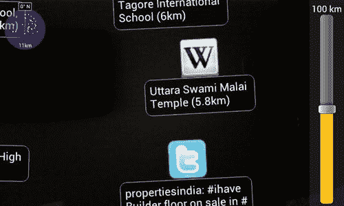
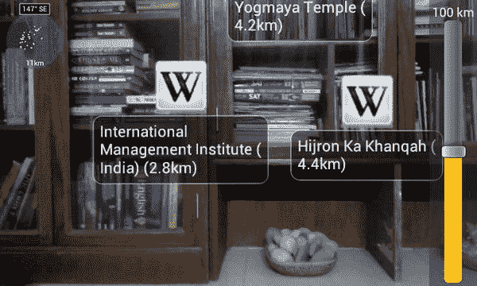
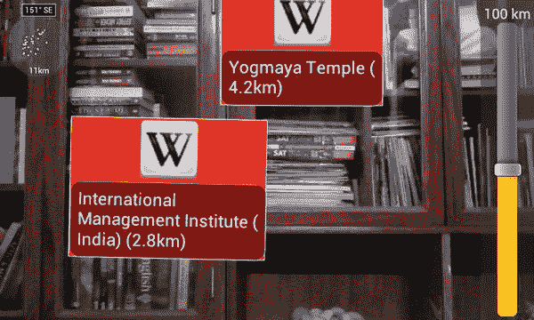
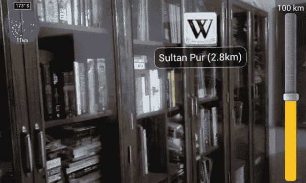
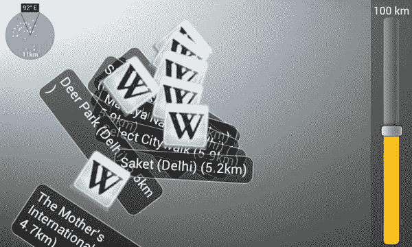

## 第九章

## 增强现实浏览器

欢迎来到第九章。这是本书的最后一章，涵盖了增强现实(AR)的不同方面，从制作基本应用，使用标记，覆盖小部件，到制作导航应用。这最后一章讨论了一个现实世界的 AR 浏览器的示例应用。这款浏览器类似于非常流行的 Wikitude 和 Layar 应用，但没有那么广泛。Wikitude 和 Layar 是经过长时间开发的非常强大的工具，提供了许多许多功能。我们的 AR 浏览器将相对简陋，但仍然非常非常强大和有用:

*   它将有一个现场摄像机预览
*   位于附近的 Twitter 帖子和维基百科文章的主题将显示在这个预览上
*   将有一个小雷达可见，允许用户看到是否有任何其他覆盖在他们的视野之外
*   当用户移动和旋转时，覆盖将被移入和移出视图
*   用户可以设置数据采集半径，范围从 0 米到 100，000 米(100 公里)

[图 9-1](#fig_9_1) 显示应用正在运行，两个数据源的标记都可见。

**图 9-1。***app 运行时的截图。*

为了完成这一切，我们将编写自己的迷你 AR 引擎，并使用两个免费资源来获取维基百科和 Twitter 数据。与第八章相比，这段代码不是很长，但有些是新的，尤其是移动叠加部分。事不宜迟，让我们开始编码吧。

### XML

这个应用中的 xml 只包含 strings.xml 和菜单的 XML。我们将快速输入这些内容，然后转到 Java 代码。

#### strings.xml

**清单 9-1。** *strings.xml*

`<?xml version="1.0" encoding="utf-8"?>
<resources>
<string name="app_name">Pro Android AR Chapter 9</string>
</resources>`

字符串`app_name`仅仅存储我们的应用的名称。该名称显示在启动器中的图标下。

#### menu.xml

现在我们来看看 menu.xml。

**清单 9-2。** *menu.xml*

`<menu xmlns:android="http://schemas.android.com/apk/res/android">
<item android:id="@+id/showRadar"
android:title="Hide Radar">
</item>
<item android:id="@+id/showZoomBar"
android:title="Hide Zoom Bar">
</item>
<item android:id="@+id/exit"
android:title="Exit">
</item>
</menu>`

第一项是显示和隐藏雷达的切换，雷达将用于显示用户视野之外的对象的图标。第二项是切换显示和隐藏 SeekBar 小部件，允许用户调整推文和维基百科信息的半径。

有了这些 XML，我们可以继续我们应用的 Java 代码了。

### Java 代码

在这个应用中，我们将看看 Java 代码的格式，其中不同的类按功能分组。所以我们将依次查看所有的数据解析类，依此类推。

#### 活动和增强视图

##### 感官活性

让我们从应用的基础部分开始。我们有一个`SensorsActivity`，扩展了标准的 android `Activity`。`SensorsActivity`没有用户界面。`AugmentedActivity`然后扩展这个`SensorsActivity`，这个【】又扩展了`MainActivity`，也就是最终显示给用户的`Activity`。所以我们先来看看`SensorsActivity`。

**清单 9-3。**SensorsActivity.java*全局变量*

`public class SensorsActivity extends Activity implements SensorEventListener, LocationListener {
private static final String TAG = "SensorsActivity";
private static final AtomicBoolean computing = new AtomicBoolean(false);` `private static final int MIN_TIME = 30*1000;
private static final int MIN_DISTANCE = 10;

private static final float temp[] = new float[9];
private static final float rotation[] = new float[9];
private static final float grav[] = new float[3];
private static final float mag[] = new float[3];

private static final Matrix worldCoord = new Matrix();
private static final Matrix magneticCompensatedCoord = new Matrix();
private static final Matrix xAxisRotation = new Matrix();
private static final Matrix magneticNorthCompensation = new Matrix();

private static GeomagneticField gmf = null;
private static float smooth[] = new float[3];
private static SensorManager sensorMgr = null;
private static List<Sensor> sensors = null;
private static Sensor sensorGrav = null;
private static Sensor sensorMag = null;
private static LocationManager locationMgr = null;`

第一个变量只是一个包含我们的类名的`TAG`常量。第二个是`computing`，类似于一个标志，用于检查任务当前是否正在进行。`MIN_TIME`和`MIN_DISTANCE`指定位置更新之间的最小时间和距离。在上面的四个浮点数中，第一个是旋转时使用的临时数组，第二个存储最终旋转的矩阵，`grav`存储重力数字，`mag`存储磁场数字。在其后的四个矩阵中，`worldCoord`存储设备在世界上的位置，`magneticCompensatedCoord`和`magneticNorthCompensation`用于补偿地理北极和磁北极之间的差异，而`xAxisRotation`用于存储沿 X 轴旋转 90 度后的矩阵。之后，`gmf`被用来存储`GeomagneticField`的一个实例。当对来自`grav`和`mag`的值使用低通滤波器时，使用`smooth`阵列。`sensorMgr`是一个`SensorManager`对象；`sensors`是传感器列表。`sensorGrav`和`sensorMag`将在设备上存储默认的重力(加速度计)和磁性(指南针)传感器，以防设备有多个传感器。`locationMgr`是`LocationManager`的一个实例。

现在让我们来看看我们的方法。在这个特定的`Activity`中，我们不需要在`onCreate(),`中做任何事情，所以我们只需要实现它的一个基本版本，这样扩展它的类就可以使用它。我们的主要工作是用`onStart()`方法完成的:

**清单 9-4。【SensorsActivity.java】T3**onCreate()和 onStart()

`@Override
public void onCreate(Bundle savedInstanceState) {
super.onCreate(savedInstanceState);
}

@Override
public void onStart() {
super.onStart();

double angleX = Math.toRadians(-90);
double angleY = Math.toRadians(-90);

xAxisRotation.set( 1f,
0f,
0f,
0f,
(float) Math.cos(angleX),
(float) -Math.sin(angleX),
0f,
(float) Math.sin(angleX),
(float) Math.cos(angleX));

try {
sensorMgr = (SensorManager) getSystemService(SENSOR_SERVICE);

sensors = sensorMgr.getSensorList(Sensor.TYPE_ACCELEROMETER);

if (sensors.size() > 0) sensorGrav = sensors.get(0);

sensors = sensorMgr.getSensorList(Sensor.TYPE_MAGNETIC_FIELD);

if (sensors.size() > 0) sensorMag = sensors.get(0);

sensorMgr.registerListener(this, sensorGrav, SensorManager.SENSOR_DELAY_NORMAL);
sensorMgr.registerListener(this, sensorMag, SensorManager.SENSOR_DELAY_NORMAL);

locationMgr = (LocationManager)
getSystemService(Context.LOCATION_SERVICE);
locationMgr.requestLocationUpdates(LocationManager.GPS_PROVIDER, MIN_TIME, MIN_DISTANCE, this);

try {

try {
Location gps=locationMgr.getLastKnownLocation(LocationManager.GPS_PROVIDER);` `Location
network=locationMgr.getLastKnownLocation(LocationManager.NETWORK_PROVIDER);
if(gps!=null)
{
onLocationChanged(gps);
}
else if (network!=null)
{
onLocationChanged(network);
}
else
{
onLocationChanged(ARData.hardFix);
}
} catch (Exception ex2) {
onLocationChanged(ARData.hardFix);
}

gmf = new GeomagneticField((float)
ARData.getCurrentLocation().getLatitude(),
(float)
ARData.getCurrentLocation().getLongitude(),
(float)
ARData.getCurrentLocation().getAltitude(),
System.currentTimeMillis());
angleY = Math.toRadians(-gmf.getDeclination());

synchronized (magneticNorthCompensation) {

magneticNorthCompensation.toIdentity();

magneticNorthCompensation.set( (float) Math.cos(angleY),
0f,
(float) Math.sin(angleY),
0f,
1f,
0f,
(float) -Math.sin(angleY),
0f,
(float) Math.cos(angleY));

magneticNorthCompensation.prod(xAxisRotation);
}
} catch (Exception ex) {
ex.printStackTrace();
}
} catch (Exception ex1) {
try {
if (sensorMgr != null) {
sensorMgr.unregisterListener(this, sensorGrav);` `sensorMgr.unregisterListener(this, sensorMag);
sensorMgr = null;
}
if (locationMgr != null) {
locationMgr.removeUpdates(this);
locationMgr = null;
}
} catch (Exception ex2) {
ex2.printStackTrace();
}
}
}`

正如代码前面提到的，`onCreate()`方法只是一个默认的实现。另一方面,`onStart()`方法包含大量传感器和位置相关代码。我们从设置`xAxisRotation`矩阵的值开始。然后我们设置`sensorMag`和`sensorGrav`的值，然后注册这两个传感器。然后我们给`gmf`赋值，并将`angleY`的值重新分配给负磁偏角，负磁偏角是真北(北极)和磁北(目前位于格陵兰海岸附近，以大约 40 英里/年的速度向西伯利亚移动)之差`gmf`的弧度。在重新分配之后，我们在同步块中有了一些代码。该代码用于首先设置`magneticNorthCompensation`的值，然后乘以`xAxisRotation`。在这之后，我们有一个`catch`块，接着是另一个`catch`块，其中有一个`try`块。这个`try`块的代码只是试图注销传感器和位置监听器。

这个文件中的下一个是我们的`onStop()`方法，它与本书前面使用的`onResume()`和`onStop()`方法相同。我们只是用它来放开传感器和 GPS，以节省用户的电池寿命，并在不需要时停止收集数据。

**清单 9-5。**SensorsActivity.java

*`@Override
protected void onStop() {
super.onStop();

try {
try {
sensorMgr.unregisterListener(this, sensorGrav);
sensorMgr.unregisterListener(this, sensorMag);
} catch (Exception ex) {
ex.printStackTrace();
}
sensorMgr = null;

try {` `locationMgr.removeUpdates(this);
} catch (Exception ex) {
ex.printStackTrace();
}
locationMgr = null;
} catch (Exception ex) {
ex.printStackTrace();
}
}`* *在`onStop()`方法之后，我们有了从三个传感器获取数据的方法。如果你看一下之前给出的类声明，你会注意到这次我们为整个类实现了`SensorEventListener`和`LocationListener`，而不是像我们在之前的应用中那样为它们编写小代码块。我们这样做是为了让任何扩展这个类的类都可以容易地覆盖与传感器相关的方法。

**清单 9-6。***SensorsActivity.java 监听着传感器*

`public void onSensorChanged(SensorEvent evt) {
if (!computing.compareAndSet(false, true)) return;

if (evt.sensor.getType() == Sensor.TYPE_ACCELEROMETER) {
smooth = LowPassFilter.filter(0.5f, 1.0f, evt.values, grav);
grav[0] = smooth[0];
grav[1] = smooth[1];
grav[2] = smooth[2];
} else if (evt.sensor.getType() == Sensor.TYPE_MAGNETIC_FIELD) {
smooth = LowPassFilter.filter(2.0f, 4.0f, evt.values, mag);
mag[0] = smooth[0];
mag[1] = smooth[1];
mag[2] = smooth[2];
}

SensorManager.getRotationMatrix(temp, null, grav, mag);

SensorManager.remapCoordinateSystem(temp, SensorManager.AXIS_Y, SensorManager.AXIS_MINUS_X, rotation);

worldCoord.set(rotation[0], rotation[1], rotation[2], rotation[3], rotation[4], rotation[5], rotation[6], rotation[7], rotation[8]);

magneticCompensatedCoord.toIdentity();

synchronized (magneticNorthCompensation) {
magneticCompensatedCoord.prod(magneticNorthCompensation);
}

magneticCompensatedCoord.prod(worldCoord);` `magneticCompensatedCoord.invert();

ARData.setRotationMatrix(magneticCompensatedCoord);

computing.set(false);
}

public void onProviderDisabled(String provider) {
//Not Used
}

public void onProviderEnabled(String provider) {
//Not Used
}

public void onStatusChanged(String provider, int status, Bundle extras) {
//Not Used
}

public void onLocationChanged(Location location) {
ARData.setCurrentLocation(location);
gmf = new GeomagneticField((float)
ARData.getCurrentLocation().getLatitude(),
(float) ARData.getCurrentLocation().getLongitude(),
(float) ARData.getCurrentLocation().getAltitude(),
System.currentTimeMillis());

double angleY = Math.toRadians(-gmf.getDeclination());

synchronized (magneticNorthCompensation) {
magneticNorthCompensation.toIdentity();

magneticNorthCompensation.set((float) Math.cos(angleY),
0f,
(float) Math.sin(angleY),
0f,
1f,
0f,
(float) -Math.sin(angleY),
0f,
(float) Math.cos(angleY));

magneticNorthCompensation.prod(xAxisRotation);
}
}

public void onAccuracyChanged(Sensor sensor, int accuracy) {
if (sensor==null) throw new NullPointerException();` `if(sensor.getType() == Sensor.TYPE_MAGNETIC_FIELD && accuracy==SensorManager.SENSOR_STATUS_UNRELIABLE) {
Log.e(TAG, "Compass data unreliable");
}
}
}`

这段代码中有六种方法。这些是`onSensorChanged()`、`onProviderDisabled()`、`onProviderEnabled()`、`onStatusChanged`、`onLocationChanged()`和`onAccuracyChanged()`。`onProviderDisabled()`、`onProviderEnabled()`和`onStatusChanged()`没有被使用，但是仍然在那里，因为它们必须被实现。

现在让我们来看一下使用的三个。在`onSensorChanged()`中，我们首先从罗盘和加速度计中获取传感器值，并在存储之前通过低通滤波器。低通滤波器将在本章稍后编写代码时详细讨论和解释。存储这些值后，我们找出真实世界的坐标，并将它们存储在临时数组中。之后，我们立即重新映射坐标，以便在横向模式下使用 Android 设备，并将其存储在旋转数组中。然后，我们通过将数据转移到`worldCoord`矩阵中，将旋转数组转换为矩阵。然后我们将`magneticCompensatedCoord`乘以`magneticNorthCompensation`，再将`magneticCompensatedCoord`乘以`worldCoord`。然后`magneticCompensatedCoord`被反转，并设置为`ARData`的旋转矩阵。这个旋转矩阵将用于将我们的推文和维基百科文章的纬度和经度转换为 X 和 Y 坐标，以便显示。

在`onLocationChanged()`中，我们首先更新`ARData`中的位置，用新数据重新计算`gmf`，然后执行与在`onStart()`中相同的代码。

在`onAccuracyChanged()`中，我们首先检查数据是否为`null`。如果是，则抛出一个`NullPointerException`。如果数据不是`null`，指南针似乎变得不可靠，我们给`LogCat`添加一条错误消息来说明这一点。

##### 增强视图

在我们继续讨论`AugmentedActivity`之前，我们需要创建`AugmentedView`，这是我们在 Android 框架中找到的`View`类的自定义扩展。它被设计用来绘制雷达，控制数据半径的缩放栏和在我们的相机预览上显示数据的标记。让我们从类和全局变量声明开始。

**清单 9-7。** *声明增强视图及其变量*

`public class AugmentedView extends View {
private static final AtomicBoolean drawing = new AtomicBoolean(false);
private static final Radar radar = new Radar();
private static final float[] locationArray = new float[3];
private static final List<Marker> cache = new ArrayList<Marker>();
private static final TreeSet<Marker> updated = new TreeSet<Marker>();
private static final int COLLISION_ADJUSTMENT = 100;`

`AtomicBoolean`绘图是检查绘图过程当前是否正在进行的标志。`radar`是`Radar`类的一个实例，在我们完成所有活动后，我们将在本书的后面写它。`locationArray`用于存储我们稍后工作的标记的位置。`cache`是用来，嗯，画画的时候临时缓存。`updated`用于更新我们从维基百科文章和推文中的数据源获得的数据。`COLLISION_ADJUSTMENT`用于调整屏幕上标记的位置，使它们不会相互重叠。

现在让我们看看它的构造函数和`onDraw()`方法。

**清单 9-8。***onDraw()方法和 AugmentedView 的构造函数*

`public AugmentedView(Context context) {
super(context);
}

@Override
protected void onDraw(Canvas canvas) {
if (canvas==null) return;

if (drawing.compareAndSet(false, true)) {
List<Marker> collection = ARData.getMarkers();

cache.clear();
for (Marker m : collection) {
m.update(canvas, 0, 0);
if (m.isOnRadar()) cache.add(m);
}
collection = cache;

if (AugmentedActivity.useCollisionDetection)
adjustForCollisions(canvas,collection);

ListIterator<Marker> iter =
collection.listIterator(collection.size());
while (iter.hasPrevious()) {
Marker marker = iter.previous();
marker.draw(canvas);` `}
if (AugmentedActivity.showRadar) radar.draw(canvas);
drawing.set(false);
}
}`

这个类的构造函数仅仅通过`super()`将它绑定到视图。在`onDraw()`方法中，我们首先将雷达上的所有标记添加到缓存变量中，然后将其复制到集合中。然后对标记进行碰撞调整(详见下一段代码清单)，最后绘制所有标记，更新雷达。

现在让我们来看看调整碰撞标记的代码:

**清单 9-9。** *调整碰撞*

`private static void adjustForCollisions(Canvas canvas, List<Marker> collection)
{
updated.clear();
for (Marker marker1 : collection) {
if (updated.contains(marker1) || !marker1.isInView()) continue;

int collisions = 1;
for (Marker marker2 : collection) {
if (marker1.equals(marker2) || updated.contains(marker2) ||
!marker2.isInView()) continue;

if (marker1.isMarkerOnMarker(marker2)) {
marker2.getLocation().get(locationArray);
float y = locationArray[1];
float h = collisions*COLLISION_ADJUSTMENT;
locationArray[1] = y+h;
marker2.getLocation().set(locationArray);
marker2.update(canvas, 0, 0);
collisions++;
updated.add(marker2);
}
}
updated.add(marker1);
}
}
} //Closes class`

我们使用此代码来检查一个或多个标记是否与另一个标记重叠，然后调整它们的位置数据，以便在绘制它们时，它们不会重叠。我们使用来自`marker`类的方法(在本章后面写)来检查标记是否重叠，然后适当地调整它们在`locationArray`中的位置。

##### 增加活力

现在我们已经写完了`AugmentedView`，我们可以开始写`AugmentedActivity`了。我们必须首先扩展视图类，因为我们将在`AugmentedActivity`中使用`AugmentedView`。让我们从类和全局变量开始。

**清单 9-10。** *声明 AugmentedActivity 及其全局变量*

`public class AugmentedActivity extends SensorsActivity implements
OnTouchListener {
private static final String TAG = "AugmentedActivity";
private static final DecimalFormat FORMAT = new DecimalFormat("#.##");
private static final int ZOOMBAR_BACKGROUND_COLOR =
Color.argb(125,55,55,55);
private static final String END_TEXT =
FORMAT.format(AugmentedActivity.MAX_ZOOM)+" km";
private static final int END_TEXT_COLOR = Color.WHITE;

protected static WakeLock wakeLock = null;
protected static CameraSurface camScreen = null;
protected static VerticalSeekBar myZoomBar = null;
protected static TextView endLabel = null;
protected static LinearLayout zoomLayout = null;
protected static AugmentedView augmentedView = null;

public static final float MAX_ZOOM = 100; //in KM
public static final float ONE_PERCENT = MAX_ZOOM/100f;
public static final float TEN_PERCENT = 10f*ONE_PERCENT;
public static final float TWENTY_PERCENT = 2f*TEN_PERCENT;
public static final float EIGHTY_PERCENTY = 4f*TWENTY_PERCENT;

public static boolean useCollisionDetection = true;
public static boolean showRadar = true;
public static boolean showZoomBar = true;`

`TAG`在输出到 LogCat 时用作字符串常量。`FORMAT`用于在雷达上显示当前半径时格式化输出。`ZOOMBAR_BACKGROUND_COLOR`是我们用来允许用户改变半径的滑块背景颜色的`ARGB_8888`定义。`END_TEXT`是我们需要在雷达上显示的格式化文本。`END_TEXT_COLOR`是`END_TEXT`的颜色。`wakeLock`、`camScreen`、`myZoomBar`、`endLabel`、`zoomLayout`、`augmentedView`是我们需要的类的对象。它们目前都被赋予了一个`null`值，将在本章稍后进行初始化。`MAX_ZOOM`是我们的半径极限，以公里为单位。接下来的四个浮动是这个最大半径限制的不同百分比。`useCollisionDetection`是一个标志，允许我们启用或禁用标记的碰撞检测。`showRadar`是一个标志切换雷达的可见性。`showZoomBar`执行相同的切换，除了对控制半径的 seekbar 执行此操作。

现在我们来看看这个活动的`onCreate()`方法:

**清单 9-11。** *【增龄性 onCreate()*

`@Override
public void onCreate(Bundle savedInstanceState) {
super.onCreate(savedInstanceState);

camScreen = new CameraSurface(this);
setContentView(camScreen);

augmentedView = new AugmentedView(this);
augmentedView.setOnTouchListener(this);
LayoutParams augLayout = new LayoutParams( LayoutParams.WRAP_CONTENT, LayoutParams.WRAP_CONTENT);
addContentView(augmentedView,augLayout);

zoomLayout = new LinearLayout(this);

zoomLayout.setVisibility((showZoomBar)?LinearLayout.VISIBLE:LinearLayout.GONE);
zoomLayout.setOrientation(LinearLayout.VERTICAL);
zoomLayout.setPadding(5, 5, 5, 5);
zoomLayout.setBackgroundColor(ZOOMBAR_BACKGROUND_COLOR);

endLabel = new TextView(this);
endLabel.setText(END_TEXT);
endLabel.setTextColor(END_TEXT_COLOR);
LinearLayout.LayoutParams zoomTextParams = new
LinearLayout.LayoutParams(LayoutParams.WRAP_CONTENT,LayoutParams.WRAP_CONTENT);
zoomLayout.addView(endLabel, zoomTextParams);

myZoomBar = new VerticalSeekBar(this);
myZoomBar.setMax(100);
myZoomBar.setProgress(50);
myZoomBar.setOnSeekBarChangeListener(myZoomBarOnSeekBarChangeListener);
LinearLayout.LayoutParams zoomBarParams = new
LinearLayout.LayoutParams(LayoutParams.WRAP_CONTENT, LayoutParams.FILL_PARENT);
zoomBarParams.gravity = Gravity.CENTER_HORIZONTAL;
zoomLayout.addView(myZoomBar, zoomBarParams);

FrameLayout.LayoutParams frameLayoutParams = new
FrameLayout.LayoutParams( LayoutParams.WRAP_CONTENT, LayoutParams.FILL_PARENT, Gravity.RIGHT);
addContentView(zoomLayout,frameLayoutParams);

updateDataOnZoom();` `PowerManager pm = (PowerManager)
getSystemService(Context.POWER_SERVICE);
wakeLock = pm.newWakeLock(PowerManager.SCREEN_DIM_WAKE_LOCK, "DimScreen");
}`

我们首先将`CameraSurface`的一个实例分配给`camScreen`。我们将在本章稍后写`CameraSurface`,但基本上它是关于相机表面视图的设置，就像我们在前面的章节中多次做的那样。然后，我们将基本内容视图设置为这个`CameraSurface`。之后，我们创建一个`AugmentedView`的实例，将其布局参数设置为`WRAP_CONTENT`，并将其添加到屏幕上。然后我们将 SeekBar 和`END_TEXT`的基本布局添加到屏幕上。然后，我们将 SeekBar 添加到屏幕上，并调用一个方法来更新数据。最后，我们使用`PowerManager`来获取一个`WakeLock`来保持屏幕打开，但是如果不使用的话就把它调暗。

然后我们有`onPause(`和`onResume()`方法，在其中我们简单地释放和重新获取`WakeLock`:

**清单 9-12。** *onPause()和 onResume()*

`@Override
public void onResume() {
super.onResume();

wakeLock.acquire();
}

@Override
public void onPause() {
super.onPause();

wakeLock.release();
}`

现在我们有了我们的`onSensorChanged()`方法:

**清单 9-13。** *onSensorChanged()*

`@Override
public void onSensorChanged(SensorEvent evt) {
super.onSensorChanged(evt);

if (evt.sensor.getType() == Sensor.TYPE_ACCELEROMETER ||
evt.sensor.getType() == Sensor.TYPE_MAGNETIC_FIELD)
{
augmentedView.postInvalidate();
}
}`

我们用这种方法监听罗盘和加速计传感器上的变化。如果这些传感器中的任何一个发生变化，我们通过调用`postInvalidate()`来使`augmentedView`无效。它自动调用`invalidate()`，后者调用视图的`onDraw()`。

然后我们有了处理 SeekBar 变化的方法:

**清单 9-14。** *处理 SeekBar*

`private OnSeekBarChangeListener myZoomBarOnSeekBarChangeListener = new OnSeekBarChangeListener() {
public void onProgressChanged(SeekBar seekBar, int progress, boolean fromUser) {
updateDataOnZoom();
camScreen.invalidate();
}

public void onStartTrackingTouch(SeekBar seekBar) {
//Not used
}

public void onStopTrackingTouch(SeekBar seekBar) {
updateDataOnZoom();
camScreen.invalidate();
}
};`

在 SeekBar 被更改(`onProgressChanged()`)时调用的方法中，在它停止被更改(`onStopTrackingTouch()`)后，我们通过调用`updateDataOnZoom()`来更新我们的数据，然后使相机预览无效。

现在我们有一个方法来计算我们的应用的缩放级别。我们称之为*缩放级别*，但它实际上是我们显示数据的半径。只是缩放级别比*半径级别*更容易记忆和说出。

**清单 9-15。** *计算缩放级别*

`private static float calcZoomLevel(){
int myZoomLevel = myZoomBar.getProgress();
float out = 0;

float percent = 0;
if (myZoomLevel <= 25) {
percent = myZoomLevel/25f;
out = ONE_PERCENT*percent;
} else if (myZoomLevel > 25 && myZoomLevel <= 50) {
percent = (myZoomLevel-25f)/25f;
out = ONE_PERCENT+(TEN_PERCENT*percent);` `} else if (myZoomLevel > 50 && myZoomLevel <= 75) {
percent = (myZoomLevel-50f)/25f;
out = TEN_PERCENT+(TWENTY_PERCENT*percent);
} else {
percent = (myZoomLevel-75f)/25f;
out = TWENTY_PERCENT+(EIGHTY_PERCENTY*percent);
}
return out;
}`

我们首先将搜索栏上的进度作为缩放级别。然后，我们创建 float `out`来存储最终结果，创建 float `percent`来存储百分比。然后，我们有一些简单的数学来确定使用的半径。我们使用这些类型的计算，因为它允许用户设置半径，甚至以米为单位。你越往上走，半径设置就越不精确。最后，我们返回`out`作为当前缩放级别。

我们现在有了处理触摸和更新数据的方法。

**清单 9-16。** *更新数据和处理触摸*

`protected void updateDataOnZoom() {
float zoomLevel = calcZoomLevel();
ARData.setRadius(zoomLevel);
ARData.setZoomLevel(FORMAT.format(zoomLevel));
ARData.setZoomProgress(myZoomBar.getProgress());
}

public boolean onTouch(View view, MotionEvent me) {
for (Marker marker : ARData.getMarkers()) {
if (marker.handleClick(me.getX(), me.getY())) {
if (me.getAction() == MotionEvent.ACTION_UP)
markerTouched(marker);
return true;
}
}
return super.onTouchEvent(me);
};

protected void markerTouched(Marker marker) {
Log.w(TAG, "markerTouched() not implemented.");
}
}`

在`updateDataOnZoom()`中，我们获得缩放级别，将半径设置为新的缩放级别，并更新缩放级别和搜索栏进度的文本，所有这些都在`ARData`中完成。在`onTouch()`中，我们检查一个标记是否被触摸，并从那里调用`markerTouched()`。在那之后，`markerTouched()`向 LogCat 发出一条消息，说我们目前在`markerTouched()`中什么都不做。

这就把我们带到了`AugmentedActivity`的结尾。现在我们需要写我们最后的活动类:`MainActivity`。

##### 主要活动

让我们再次从类和全局变量声明开始:

**清单 9-17。** *声明类和全局变量*

`public class MainActivity extends AugmentedActivity {
private static final String TAG = "MainActivity";
private static final String locale = "en";
private static final BlockingQueue<Runnable> queue = new ArrayBlockingQueue<Runnable>(1);
private static final ThreadPoolExecutor exeService = new
ThreadPoolExecutor(1, 1, 20, TimeUnit.SECONDS, queue);
private static final Map<String,NetworkDataSource> sources = new ConcurrentHashMap<String,NetworkDataSource>();`

与我们之前编写的课程的目的相同。`locale`字符串将两个字母代码中的区域设置存储为英语。您也可以使用`Locale.getDefault().getLanguage()`来获取区域设置，但最好将其保留为`“en”`，因为我们使用它来获取附近的 Twitter 和 Wikipedia 数据，并且我们的数据源可能不支持所有语言。为了简化我们的线程，我们使用了作为`BlockingQueue`实例的`queue`变量。`exeService`是一个`ThreadPoolExecutor`，它的工作队列是`queue`。最后，我们有一个叫做`sources`的`Map`，它将存储数据源。

现在让我们看看这个类的`onCreate()`和`onStart()`方法:

**清单 9-18。** *onCreate()和 onStart()*

`@Override
public void onCreate(Bundle savedInstanceState) {
super.onCreate(savedInstanceState);
LocalDataSource localData = new LocalDataSource(this.getResources());
ARData.addMarkers(localData.getMarkers());

NetworkDataSource twitter = new TwitterDataSource(this.getResources());
sources.put("twitter", twitter);
NetworkDataSource wikipedia = new
WikipediaDataSource(this.getResources());
sources.put("wiki", wikipedia);
}

@Override
public void onStart() {
super.onStart();` `Location last = ARData.getCurrentLocation();
updateData(last.getLatitude(), last.getLongitude(), last.getAltitude());
}`

在`onCreate()`中，我们首先创建一个`LocalDataSource`类的实例，并将其标记添加到`ARData`。然后我们为 Twitter 和 Wikipedia 创建一个`NetworkDataSource`,并将它们添加到 sources 地图中。在`onStart()`中，我们获得最后的位置数据，并用它更新我们的数据。

至此，我们现在可以进入代码的菜单部分了:

**清单 9-19。** *使用菜单*

`@Override
public boolean onCreateOptionsMenu(Menu menu) {
MenuInflater inflater = getMenuInflater();
inflater.inflate(R.menu.menu, menu);
return true;
}

@Override
public boolean onOptionsItemSelected(MenuItem item) {
Log.v(TAG, "onOptionsItemSelected() item="+item);
switch (item.getItemId()) {
case R.id.showRadar:
showRadar = !showRadar;
item.setTitle(((showRadar)? "Hide" : "Show")+" Radar");
break;
case R.id.showZoomBar:
showZoomBar = !showZoomBar;
item.setTitle(((showZoomBar)? "Hide" : "Show")+" Zoom Bar");

zoomLayout.setVisibility((showZoomBar)?LinearLayout.VISIBLE:LinearLayout.GONE);
break;
case R.id.exit:
finish();
break;
}
return true;
}`

这是标准的 Android 代码，我们以前已经使用过无数次了。我们简单地从 XML 菜单资源创建菜单，然后监听菜单上的点击。对于显示雷达/缩放栏选项，我们只需切换它们的显示，对于退出选项，我们退出。

现在让我们来看看位置更新和处理触摸。

**清单 9-20。** *位置改变和触摸输入*

`@Override
public void onLocationChanged(Location location) {
super.onLocationChanged(location);

updateData(location.getLatitude(), location.getLongitude(), location.getAltitude());
}

@Override
protected void markerTouched(Marker marker) {
Toast t = Toast.makeText(getApplicationContext(), marker.getName(), Toast.LENGTH_SHORT);
t.setGravity(Gravity.CENTER, 0, 0);
t.show();
}`

当我们得到一个新的`location`对象时，我们用它来更新数据。我们覆盖了`markerTouched()`方法来显示一个包含被触摸的标记的详细信息的祝酒词。

现在让我们看看这个类对`updateDataOnZoom()`的实现:

**清单 9-21。** *updateDataOnZoom()*

`@Override
protected void updateDataOnZoom() {
super.updateDataOnZoom();
Location last = ARData.getCurrentLocation();
updateData(last.getLatitude(),last.getLongitude(),last.getAltitude());
}`

在`updateDataOnZoom()`的这个实现中，我们获取位置，然后调用`updateData()`并向其传递新的位置信息。

现在我们来看看`updateData()`方法:

**清单 9-22。** *updateData()*

`private void updateData(final double lat, final double lon, final double alt) {
try {
exeService.execute(
new Runnable() {

public void run() {
for (NetworkDataSource source : sources.values())
download(source, lat, lon, alt);
}
}` `);
} catch (RejectedExecutionException rej) {
Log.w(TAG, "Not running new download Runnable, queue is full.");
} catch (Exception e) {
Log.e(TAG, "Exception running download Runnable.",e);
}
}`

在这个方法中，我们试图使用一个`Runnable`来下载我们需要的数据，以显示 Twitter 帖子和 Wikipedia 文章。如果遇到一个`RejectedExecutionException`,就会向 LogCat 发送一条消息，告诉它队列已满，现在无法下载数据。如果遇到任何其他异常，Logcat 中会显示另一条消息。

最后，我们有了`download()`方法:

**清单 9-23。** *下载()*

`private static boolean download(NetworkDataSource source, double lat, double
lon, double alt) {
if (source==null) return false;

String url = null;
try {
url = source.createRequestURL(lat, lon, alt,
ARData.getRadius(), locale);
} catch (NullPointerException e) {
return false;
}

List<Marker> markers = null;
try {
markers = source.parse(url);
} catch (NullPointerException e) {
return false;
}

ARData.addMarkers(markers);
return true;
}
}`

在`download`方法中，我们首先检查源是否是`null`。如果是，我们返回`false`。如果不是`null`，我们构造一个 URL 来获取数据。之后，我们解析来自 URL 的结果，并将获得的数据存储在列表标记中。该数据然后通过`ARData.addMarkers`添加到`ARData`。

这使我们结束了所有的活动。我们现在将编写代码来获取 Twitter 帖子和 Wikipedia 文章的数据。

### 获取数据

为了获得数据，我们将创建五个类:基本的`DataSource`类，它将由`LocalDataSource`和`NetworkDataSource`扩展；`TwitterDataSource`和`WikipediaDataSource`将进一步延长`NetworkDataSource`。

先说`DataSource`。

#### 数据源

`DataSource`是一个非常小的抽象类:

**清单 9-24。** *数据源*

`public abstract class DataSource {
public abstract List<Marker> getMarkers();
}`

这个类只有一个成员:T0。这个类是我们所有其他数据类的基础。

现在我们来看看`LocalDataSource`。

#### 本地数据源

`MainActivity`使用`LocalDataSource`为`ARData`添加标记。班级很小。

**清单 9-25。** *本地数据源*

`public class LocalDataSource extends DataSource{
private List<Marker> cachedMarkers = new ArrayList<Marker>();
private static Bitmap icon = null;

public LocalDataSource(Resources res) {
if (res==null) throw new NullPointerException();

createIcon(res);
}

protected void createIcon(Resources res) {
if (res==null) throw new NullPointerException();

icon=BitmapFactory.decodeResource(res, R.drawable.ic_launcher);
}` `public List<Marker> getMarkers() {
Marker atl = new IconMarker("ATL", 39.931269, -75.051261, 0,
Color.DKGRAY, icon);
cachedMarkers.add(atl);

Marker home = new Marker("Mt Laurel", 39.95, -74.9, 0, Color.YELLOW);
cachedMarkers.add(home);

return cachedMarkers;
}
}`

这个类的构造函数接受一个`Resource`对象作为参数。然后它调用`createIcon()`，然后将我们应用的默认图标分配给`icon`位图。`getMarkers()`，嗯，拿马克笔。

这节课讲完了，我们来看看`NetworkDataSource`。

#### 网络数据源

`NetworkDataSource`包含从我们的 Twitter 和 Wikipedia 来源获取数据的基本设置。

让我们从类和全局变量声明开始:

**清单 9-26。** *网络数据源*

`public abstract class NetworkDataSource extends DataSource {
protected static final int MAX = 1000;
protected static final int READ_TIMEOUT = 10000;
protected static final int CONNECT_TIMEOUT = 10000;

protected List<Marker> markersCache = null;

public abstract String createRequestURL(double lat, double lon, double alt,
float radius, String locale);

public abstract List<Marker> parse(JSONObject root);`

`MAX`指定显示给用户的最大结果数。`READ_TIMEOUT`和`CONNECT_TIMEOUT`是连接的超时值，以毫秒为单位。`markersCache`是一个列表<标记>对象，我们将在这个类的后面使用。`createRequestURL`和`parse`是我们将在这个类的扩展中覆盖的存根。

现在让我们来看看`getMarkers()`和`getHttpGETInputStream()`方法:

**清单 9-27。**T3】get markers()和 getHttpGETInputStream()

`public List<Marker> getMarkers() {
return markersCache;
}

protected static InputStream getHttpGETInputStream(String urlStr) {
if (urlStr == null)
throw new NullPointerException();

InputStream is = null;
URLConnection conn = null;

try {
if (urlStr.startsWith("file://"))
return new FileInputStream(urlStr.replace("file://", ""));

URL url = new URL(urlStr);
conn = url.openConnection();
conn.setReadTimeout(READ_TIMEOUT);
conn.setConnectTimeout(CONNECT_TIMEOUT);

is = conn.getInputStream();

return is;
} catch (Exception ex) {
try {
is.close();
} catch (Exception e) {
// Ignore
}
try {
if (conn instanceof HttpURLConnection)
((HttpURLConnection) conn).disconnect();
} catch (Exception e) {
// Ignore
}
ex.printStackTrace();
}
return null;
}`

`getMarkers()`方法只是返回`markersCache`。`getHttpGETInputStream()`用于获取指定 URL 的`InputStream`，并作为`String`传递给它。

现在让我们来看看`getHttpInputString()`和`parse()`方法:

**清单 9-28。**T3】getHttpInputString()和 parse()

`protected String getHttpInputString(InputStream is) {
if (is == null)
throw new NullPointerException();

BufferedReader reader = new BufferedReader(new InputStreamReader(is),
8 * 1024);
StringBuilder sb = new StringBuilder();

try {
String line;
while ((line = reader.readLine()) != null) {
sb.append(line + "\n");
}
} catch (IOException e) {
e.printStackTrace();
} finally {
try {
is.close();
} catch (IOException e) {
e.printStackTrace();
}
}
return sb.toString();
}

public List<Marker> parse(String url) {
if (url == null)
throw new NullPointerException();

InputStream stream = null;
stream = getHttpGETInputStream(url);
if (stream == null)
throw new NullPointerException();

String string = null;
string = getHttpInputString(stream);
if (string == null)
throw new NullPointerException();

JSONObject json = null;
try {
json = new JSONObject(string);
} catch (JSONException e) {
e.printStackTrace();
}
if (json == null)
throw new NullPointerException();` `return parse(json);
}
}`

在`getHttpInputString()`中，我们获取`InputStream`的内容，并把它们放在一个`String`中。在`parse()`中，我们从数据源获取 JSON 对象，然后在其上调用另一个`parse()`方法。在这个类中，第二个`parse()`方法是一个存根，但是它在其他类中被覆盖和实现。

让我们写出扩展了`NetworkDataSource` : `TwitterDataSource`和`WikipediaDataSource`的两个类。

#### 推特数据源

`TwitterDataSource`延伸`NetworkDataSource`。它负责从 Twitter 的服务器上获取附近推文的数据。`TwitterDataSource`只有两个全局变量。

**清单 9-29。** *声明 TwitterDataSource 及其全局变量*

`public class TwitterDataSource extends NetworkDataSource {
private static final String URL =
"http://search.twitter.com/search.json";
private static Bitmap icon = null;`

字符串`URL`存储 Twitter 搜索 URL 的基础。我们将在`createRequestURL()`中动态构造参数。这个`icon`位图，现在是`null`，将在其中存储 Twitter 的标志。在显示推文时，我们会将这个标志显示为每个标记的图标。

现在让我们看看构造函数、`createIcon()`和`createRequestURL()`方法:

**清单 9-30。** *构造函数，createIcon()，和 createRequestURL()*

`public TwitterDataSource(Resources res) {
if (res==null) throw new NullPointerException();

createIcon(res);
}

protected void createIcon(Resources res) {
if (res==null) throw new NullPointerException();

icon=BitmapFactory.decodeResource(res, R.drawable.twitter);
}

@Override` `public String createRequestURL(double lat, double lon, double alt, float radius, String locale) {
return URL+"?geocode=" + lat + "%2C" + lon + "%2C" + Math.max(radius,
1.0) + "km";
}`

在构造函数中，我们将一个`Resource`对象作为参数，然后将其传递给`createIcon()`。这和《T2》中的行为完全一样。在`createIcon()`中，我们再次做了和在`NetworkDataSource`中一样的事情，除了我们使用了不同的图标。这里我们将 Twitter drawable 分配给了`icon`位图，而不是`ic_launcher`位图。在`createRequestURL()`中，我们为 Twitter JSON 搜索应用编程接口(API)制定了一个完整的请求 URL。Twitter 搜索 API 允许我们轻松匿名地搜索推文。我们在 geocode 参数中提供用户的位置，并从用户设置的范围中选择一个更大的半径限制，即一公里。

现在我们有两个`parse()`方法和一个`processJSONObject()`。

**清单 9-31。** *两个 parse()方法和 processJSONObject()方法*

`@Override
public List<Marker> parse(String url) {
if (url==null) throw new NullPointerException();

InputStream stream = null;
stream = getHttpGETInputStream(url);
if (stream==null) throw new NullPointerException();

String string = null;
string = getHttpInputString(stream);
if (string==null) throw new NullPointerException();

JSONObject json = null;
try {
json = new JSONObject(string);
} catch (JSONException e) {
e.printStackTrace();
}
if (json==null) throw new NullPointerException();

return parse(json);
}

@Override
public List<Marker> parse(JSONObject root) {
if (root==null) throw new NullPointerException();

JSONObject jo = null;` `JSONArray dataArray = null;
List<Marker> markers=new ArrayList<Marker>();

try {
if(root.has("results")) dataArray =
root.getJSONArray("results");
if (dataArray == null) return markers;
int top = Math.min(MAX, dataArray.length());
for (int i = 0; i < top; i++) {

jo = dataArray.getJSONObject(i);
Marker ma = processJSONObject(jo);
if(ma!=null) markers.add(ma);
}
} catch (JSONException e) {
e.printStackTrace();
}
return markers;
}

private Marker processJSONObject(JSONObject jo) {
if (jo==null) throw new NullPointerException();

if (!jo.has("geo")) throw new NullPointerException();

Marker ma = null;
try {
Double lat=null, lon=null;

if(!jo.isNull("geo")) {
JSONObject geo = jo.getJSONObject("geo");
JSONArray coordinates =
geo.getJSONArray("coordinates");

lat=Double.parseDouble(coordinates.getString(0));

lon=Double.parseDouble(coordinates.getString(1));
} else if(jo.has("location")) {
Pattern pattern = Pattern.compile("\\D*([0-
9.]+),\\s?([0-9.]+)");
Matcher matcher =
pattern.matcher(jo.getString("location"));

if(matcher.find()){
lat=Double.parseDouble(matcher.group(1));

lon=Double.parseDouble(matcher.group(2));
}
}` `if(lat!=null) {
String user=jo.getString("from_user");

ma = new IconMarker(
user+": "+jo.getString("text"),
lat,
lon,
0,
Color.RED,
icon);
}
} catch (Exception e) {
e.printStackTrace();
}
return ma;
}
}`

第一个`parse()`方法采用字符串参数形式的 URL。然后 URL 通过`getHttpGETInputStream()`方法，产生的输入流被传递给`getHttpInputString()`方法。最后，从结果字符串中创建一个新的`JSONObject`，并将其传递给第二个`parse()`方法。

在第二个`parse()`方法中，我们接收来自前一个方法的`JSONObject`作为参数。然后我们首先确定我们收到的对象不是`null`。然后，我们将数据从对象转移到一个`JSONArray`中，如果它有任何结果的话。在此之后，我们需要遍历数组，为每个结果创建一个标记。为了确保不超出数组索引，我们找到了最大标记数和结果数之间的较小值。然后我们遍历数组，调用`processJSONObject()`来创建每个标记。

最后，我们来过一遍`processJSONObject()`。我们再次通过检查传递的`JSONObject`是否是`null`来开始该方法。之后，我们检查对象中的数据是否包含`geo`数据。如果没有，我们就不使用它，因为`geo`数据对于将它显示在屏幕和雷达上很重要。然后，我们通过`JSONObject`获取 tweet、用户和内容的坐标。所有这些数据被编译成一个标记，然后返回给第二个`parse()`方法。第二个`parse`方法将其添加到它的`markers`列表中。一旦创建了所有这样的标记，整个列表被返回给第一个`parse()`方法，该方法进一步将它返回给它在`MainActivity`中的调用者。

现在我们来看看最后一个数据源类，`WikipediaDataSource`。

#### 维基百科全书资料来源

`WikipediaDataSource`在结构和逻辑上与`TwitterDataSource`非常相似。唯一的主要区别在于对`JSONObject`的解析。

**清单 9-32。** *维基百科数据源*

`public class WikipediaDataSource extends NetworkDataSource {
private static final String BASE_URL = "http://ws.geonames.org/findNearbyWikipediaJSON";

private static Bitmap icon = null;

public WikipediaDataSource(Resources res) {
if (res==null) throw new NullPointerException();

createIcon(res);
}

protected void createIcon(Resources res) {
if (res==null) throw new NullPointerException();

icon=BitmapFactory.decodeResource(res, R.drawable.wikipedia);
}

@Override
public String createRequestURL(double lat, double lon, double alt, float radius, String locale) {
return BASE_URL+
"?lat=" + lat +
"&lng=" + lon +
"&radius="+ radius +
"&maxRows=40" +
"&lang=" + locale;

}

@Override
public List<Marker> parse(JSONObject root) {
if (root==null) return null;

JSONObject jo = null;
JSONArray dataArray = null;
List<Marker> markers=new ArrayList<Marker>();

try {
if(root.has("geonames")) dataArray =
root.getJSONArray("geonames");
if (dataArray == null) return markers;` `int top = Math.min(MAX, dataArray.length());
for (int i = 0; i < top; i++) {

jo = dataArray.getJSONObject(i);
Marker ma = processJSONObject(jo);
if(ma!=null) markers.add(ma);
}
} catch (JSONException e) {
e.printStackTrace();
}
return markers;
}

private Marker processJSONObject(JSONObject jo) {
if (jo==null) return null;

Marker ma = null;
if ( jo.has("title") &&
jo.has("lat") &&
jo.has("lng") &&
jo.has("elevation")
) {
try {
ma = new IconMarker(
jo.getString("title"),
jo.getDouble("lat"),
jo.getDouble("lng"),
jo.getDouble("elevation"),
Color.WHITE,
icon);
} catch (JSONException e) {
e.printStackTrace();
}
}
return ma;
}
}`

与 Twitter 不同，维基百科不提供官方搜索工具。然而，geonames.org 为维基百科提供了基于 JSON 的搜索，我们将会使用它。与`TwitterDataSource`的下一个区别是图标。我们只是在创建图标时使用了不同的`drawable`。获取和解析`JSONObject`的基本代码是相同的；只是价值观不同。

我们现在将编写帮助我们在屏幕上和现实生活中定位标记的类。

#### 定位类

我们需要一组为我们的应用处理职位相关工作的类。这些类处理用户的物理位置，以及对象在屏幕上的位置。

##### 物理分配工具

这个类用来表示用户在真实世界中的三维位置。

**清单 9-33。PhysicalLocationUtility.java**T2

`public class PhysicalLocationUtility {
private double latitude = 0.0;
private double longitude = 0.0;
private double altitude = 0.0;

private static float[] x = new float[1];
private static double y = 0.0d;
private static float[] z = new float[1];

public PhysicalLocationUtility() { }

public PhysicalLocationUtility(PhysicalLocationUtility pl) {
if (pl==null) throw new NullPointerException();

set(pl.latitude, pl.longitude, pl.altitude);
}

public void set(double latitude, double longitude, double altitude) {
this.latitude = latitude;
this.longitude = longitude;
this.altitude = altitude;
}

public void setLatitude(double latitude) {
this.latitude = latitude;
}

public double getLatitude() {
return latitude;
}

public void setLongitude(double longitude) {
this.longitude = longitude;
}` `public double getLongitude() {
return longitude;
}

public void setAltitude(double altitude) {
this.altitude = altitude;
}

public double getAltitude() {
return altitude;
}

public static synchronized void convLocationToVector(Location org, PhysicalLocationUtility gp, Vector v) {
if (org==null || gp==null || v==null)
throw new NullPointerException("Location,
PhysicalLocationUtility, and Vector cannot be NULL.");

Location.distanceBetween( org.getLatitude(),
org.getLongitude(),

gp.getLatitude(), org.getLongitude(),
z);

Location.distanceBetween( org.getLatitude(),
org.getLongitude(),

org.getLatitude(), gp.getLongitude(),
x);
y = gp.getAltitude() - org.getAltitude();
if (org.getLatitude() < gp.getLatitude())
z[0] *= -1;
if (org.getLongitude() > gp.getLongitude())
x[0] *= -1;

v.set(x[0], (float) y, z[0]);
}

@Override
public String toString() {
return "(lat=" + latitude + ", lng=" + longitude + ", alt=" +
altitude + ")";
}
}`

顾名思义，前三个 doubles 分别用于存储`latitude`、`longitude`和`altitude`。`x`、`y`和`z`存储最终的三维位置数据。`setLatitude()`、`setLongitude()`和`setAltitude()`方法分别设置纬度、经度和高度。它们的`get()`对应物只是返回当前值。`convLocationToVector()`方法将位置转换为`Vector`。我们将在本章的后面写一个`Vector`类。`toString()`方法只是将纬度、经度和海拔高度编译成一个字符串，并将其返回给调用方法。

现在我们来看看`ScreenPositionUtility`。

### 屏幕定位工具

`ScreenPositionUtility`用于显示雷达线。

**清单 9-34。ScreenPositionUtility.java**T2

`public class ScreenPositionUtility {
private float x = 0f;
private float y = 0f;

public ScreenPositionUtility() {
set(0, 0);
}

public void set(float x, float y) {
this.x = x;
this.y = y;
}

public float getX() {
return x;
}

public void setX(float x) {
this.x = x;
}

public float getY() {
return y;
}

public void setY(float y) {
this.y = y;
}

public void rotate(double t) {
float xp = (float) Math.cos(t) * x - (float) Math.sin(t) * y;
float yp = (float) Math.sin(t) * x + (float) Math.cos(t) * y;

x = xp;` `y = yp;
}

public void add(float x, float y) {
this.x += x;
this.y += y;
}

@Override
public String toString() {
return "x="+x+" y="+y;
}
}`

`setX()`和`setY()`方法分别为`x`和`y`变量设置浮点值。`set()`方法同时设置`x`和`y`的值。`getX()`和`getY()`方法只是返回`x`和`y`的值。`rotate()`方法围绕角度`t`旋转`x`和`y`值。`add()`方法将传递的值分别添加到`x`和`y`。最后，`toString()`方法返回一个字符串，其中包含了`x`和`y`的值。

现在我们来看看 UI 代码。

### 用户界面工作正常

#### 可涂装对象

`PaintableObject`是用户界面所有自定义部分的基类。它的一些方法只是我们在它的子类中覆盖的存根。这个类包含了很多绘制特定对象的方法，比如线条、位图、点等。在给定的画布上。

**清单 9-35。PaintableObject.java**T2

`public abstract class PaintableObject {
private Paint paint = new Paint(Paint.ANTI_ALIAS_FLAG);

public PaintableObject() {
if (paint==null) {
paint = new Paint();
paint.setTextSize(16);
paint.setAntiAlias(true);
paint.setColor(Color.BLUE);
paint.setStyle(Paint.Style.STROKE);
}
}` `public abstract float getWidth();

public abstract float getHeight();

public abstract void paint(Canvas canvas);

public void setFill(boolean fill) {
if (fill)
paint.setStyle(Paint.Style.FILL);
else
paint.setStyle(Paint.Style.STROKE);
}

public void setColor(int c) {
paint.setColor(c);
}

public void setStrokeWidth(float w) {
paint.setStrokeWidth(w);
}

public float getTextWidth(String txt) {
if (txt==null) throw new NullPointerException();
return paint.measureText(txt);
}

public float getTextAsc() {
return -paint.ascent();
}

public float getTextDesc() {
return paint.descent();
}

public void setFontSize(float size) {
paint.setTextSize(size);
}

public void paintLine(Canvas canvas, float x1, float y1, float x2, float y2)
{
if (canvas==null) throw new NullPointerException();

canvas.drawLine(x1, y1, x2, y2, paint);
}

public void paintRect(Canvas canvas, float x, float y, float width, float
height) {
if (canvas==null) throw new NullPointerException();` `canvas.drawRect(x, y, x + width, y + height, paint);
}

public void paintRoundedRect(Canvas canvas, float x, float y, float width,
float height) {
if (canvas==null) throw new NullPointerException();

RectF rect = new RectF(x, y, x + width, y + height);
canvas.drawRoundRect(rect, 15F, 15F, paint);
}

public void paintBitmap(Canvas canvas, Bitmap bitmap, Rect src, Rect dst) {
if (canvas==null || bitmap==null) throw new NullPointerException();

canvas.drawBitmap(bitmap, src, dst, paint);
}

public void paintBitmap(Canvas canvas, Bitmap bitmap, float left, float top)
{
if (canvas==null || bitmap==null) throw new NullPointerException();

canvas.drawBitmap(bitmap, left, top, paint);
}

public void paintCircle(Canvas canvas, float x, float y, float radius) {
if (canvas==null) throw new NullPointerException();

canvas.drawCircle(x, y, radius, paint);
}

public void paintText(Canvas canvas, float x, float y, String text) {
if (canvas==null || text==null) throw new NullPointerException();

canvas.drawText(text, x, y, paint);
}

public void paintObj( Canvas canvas, PaintableObject obj,
float x, float y,
float rotation, float scale)
{
if (canvas==null || obj==null) throw new NullPointerException();

canvas.save();
canvas.translate(x+obj.getWidth()/2, y+obj.getHeight()/2);
canvas.rotate(rotation);
canvas.scale(scale,scale);
canvas.translate(-(obj.getWidth()/2), -(obj.getHeight()/2));
obj.paint(canvas);
canvas.restore();
}` `public void paintPath( Canvas canvas, Path path,
float x, float y, float width,
float height, float rotation,
float scale)
{
if (canvas==null || path==null) throw new NullPointerException();

canvas.save();
canvas.translate(x + width / 2, y + height / 2);
canvas.rotate(rotation);
canvas.scale(scale, scale);
canvas.translate(-(width / 2), -(height / 2));
canvas.drawPath(path, paint);
canvas.restore();
}
}`

整个类只有一个全局变量:一个启用了抗锯齿的`paint`对象。消除锯齿会平滑正在绘制的对象的线条。构造函数通过将文本大小设置为 16、启用抗锯齿、将绘画颜色设置为蓝色、将绘画风格设置为`Paint.Style.STROKE`来初始化`paint`对象。

下面的三个方法——`getWidth()`、`getHeight()`和`paint()`——被保留为方法存根，如果需要的话可以被覆盖。

`setFill()`方法允许我们改变画风为`Paint.Style.FILL`或`Paint.Style.STROKE`。`setColor()`方法将颜料的颜色设置为与它作为参数的整数相对应的颜色。`setStrokeWidth()`允许我们设置笔画的宽度。`getTextWidth()`返回作为参数的文本宽度。`getTextAsc()`和`getTextDesc()`分别返回文本的上升和下降。`setFontSize()`允许我们设置绘画的字体大小。名称前带有 paint 前缀的所有其余方法绘制在所提供的`canvas`上的 paint 之后写入的对象。例如，`paintLine()`用提供的坐标在提供的`canvas`上画一条线。

现在让我们看看扩展了`PaintableObject`的类集。

#### 彩绘箱

类允许我们画出一个盒子的轮廓。这是一个简单的类，并且不是很大。

**清单 9-36。PaintableBox.java**T3

`public class PaintableBox extends PaintableObject {
private float width=0, height=0;
private int borderColor = Color.rgb(255, 255, 255);
private int backgroundColor = Color.argb(128, 0, 0, 0);

public PaintableBox(float width, float height) {
this(width, height, Color.rgb(255, 255, 255), Color.argb(128, 0,
0, 0));
}

public PaintableBox(float width, float height, int borderColor, int
bgColor) {
set(width, height, borderColor, bgColor);
}

public void set(float width, float height) {
set(width, height, borderColor, backgroundColor);
}

public void set(float width, float height, int borderColor, int bgColor)
{
this.width = width;
this.height = height;
this.borderColor = borderColor;
this.backgroundColor = bgColor;
}

@Override
public void paint(Canvas canvas) {
if (canvas==null) throw new NullPointerException();

setFill(true);
setColor(backgroundColor);
paintRect(canvas, 0, 0, width, height);

setFill(false);
setColor(borderColor);
paintRect(canvas, 0, 0, width, height);
}

@Override
public float getWidth() {
return width;
}

@Override
public float getHeight() {
return height;` `}
}`

这个类有两个构造函数，其中一个调用另一个。原因是其中一个构造函数只允许你设置盒子的宽度和高度，而第二个构造函数允许你设置它的颜色。当调用第一个时，它使用提供的宽度和高度来调用具有默认颜色的第二个。然后，第二个构造函数调用第二个`set()`方法来设置这些值。`paint()`方法只是在指定的`canvas`上画一个盒子。`getWidth()`和`getHeight()`只返回盒子的宽度和高度。

现在我们来看看`PaintableBoxedText`。

#### 可画拳击文本

在画布上绘制文本，周围有一个方框。

**清单 9-37。PaintableBox.java**T2

`public class PaintableBoxedText extends PaintableObject {
private float width=0, height=0;
private float areaWidth=0, areaHeight=0;
private ArrayList<String> lineList = null;
private String[] lines = null;
private float[] lineWidths = null;
private float lineHeight = 0;
private float maxLineWidth = 0;
private float pad = 0;

private String txt = null;
private float fontSize = 12;
private int borderColor = Color.rgb(255, 255, 255);
private int backgroundColor = Color.argb(160, 0, 0, 0);
private int textColor = Color.rgb(255, 255, 255);

public PaintableBoxedText(String txtInit, float fontSizeInit, float
maxWidth) {
this(txtInit, fontSizeInit, maxWidth, Color.rgb(255, 255, 255),
Color.argb(128, 0, 0, 0), Color.rgb(255, 255, 255));
}

public PaintableBoxedText(String txtInit, float fontSizeInit, float
maxWidth, int borderColor, int bgColor, int textColor) {
set(txtInit, fontSizeInit, maxWidth, borderColor, bgColor,
textColor);
}` `public void set(String txtInit, float fontSizeInit, float maxWidth, int
borderColor, int bgColor, int textColor) {
if (txtInit==null) throw new NullPointerException();

this.borderColor = borderColor;
this.backgroundColor = bgColor;
this.textColor = textColor;
this.pad = getTextAsc();

set(txtInit, fontSizeInit, maxWidth);
}

public void set(String txtInit, float fontSizeInit, float maxWidth) {
if (txtInit==null) throw new NullPointerException();

try {
prepTxt(txtInit, fontSizeInit, maxWidth);
} catch (Exception ex) {
ex.printStackTrace();
prepTxt("TEXT PARSE ERROR", 12, 200);
}
}

private void prepTxt(String txtInit, float fontSizeInit, float maxWidth)
{
if (txtInit==null) throw new NullPointerException();

setFontSize(fontSizeInit);

txt = txtInit;
fontSize = fontSizeInit;
areaWidth = maxWidth - pad;
lineHeight = getTextAsc() + getTextDesc();

if (lineList==null) lineList = new ArrayList<String>();
else lineList.clear();

BreakIterator boundary = BreakIterator.getWordInstance();
boundary.setText(txt);

int start = boundary.first();
int end = boundary.next();
int prevEnd = start;
while (end != BreakIterator.DONE) {
String line = txt.substring(start, end);
String prevLine = txt.substring(start, prevEnd);
float lineWidth = getTextWidth(line);

if (lineWidth > areaWidth) {
if(prevLine.length()>0) lineList.add(prevLine);` `start = prevEnd;
}

prevEnd = end;
end = boundary.next();
}
String line = txt.substring(start, prevEnd);
lineList.add(line);

if (lines==null || lines.length!=lineList.size()) lines = new
String[lineList.size()];
if (lineWidths==null || lineWidths.length!=lineList.size())
lineWidths = new float[lineList.size()];
lineList.toArray(lines);

maxLineWidth = 0;
for (int i = 0; i < lines.length; i++) {
lineWidths[i] = getTextWidth(lines[i]);
if (maxLineWidth < lineWidths[i])
maxLineWidth = lineWidths[i];
}
areaWidth = maxLineWidth;
areaHeight = lineHeight * lines.length;

width = areaWidth + pad * 2;
height = areaHeight + pad * 2;
}

@Override
public void paint(Canvas canvas) {
if (canvas==null) throw new NullPointerException();

setFontSize(fontSize);

setFill(true);
setColor(backgroundColor);
paintRoundedRect(canvas, 0, 0, width, height);

setFill(false);
setColor(borderColor);
paintRoundedRect(canvas, 0, 0, width, height);

for (int i = 0; i < lines.length; i++) {
String line = lines[i];
setFill(true);
setStrokeWidth(0);
setColor(textColor);
paintText(canvas, pad, pad + lineHeight * i +
getTextAsc(), line);` `}
}

@Override
public float getWidth() {
return width;
}

@Override
public float getHeight() {
return height;
}
}`

同样，有两个构造函数做与`PaintableBox`中相同的事情。与`PaintableBox`的第一个主要区别是新方法`prepTxt()`。`prepTxt()`通过将文本切割成不同大小的行以适合文本框来准备文本，而不是让一个长字符串愉快地离开文本框并溢出到外面。然后，`paint()`方法首先绘制基本的方框，然后使用一个`for`循环将每一行添加到其中。

现在我们来看看`PaintableCircle`。

#### 绘画圈

`PaintableCircle`允许我们在提供的`Canvas`上画一个圆。这是一个简单的类，代码很简单:

**清单 9-38。PaintableCircle.java**T2

`public class PaintableCircle extends PaintableObject {
private int color = 0;
private float radius = 0;
private boolean fill = false;

public PaintableCircle(int color, float radius, boolean fill) {
set(color, radius, fill);
}

public void set(int color, float radius, boolean fill) {
this.color = color;
this.radius = radius;
this.fill = fill;
}

@Override
public void paint(Canvas canvas) {
if (canvas==null) throw new NullPointerException();` `setFill(fill);
setColor(color);
paintCircle(canvas, 0, 0, radius);
}

@Override
public float getWidth() {
return radius*2;
}

@Override
public float getHeight() {
return radius*2;
}
}`

这一次，只有一个构造函数允许我们设置圆的半径和颜色。也只有一个`set()`方法，由构造函数调用。方法在给定的`canvas`上用指定的属性画一个圆。`getWidth()`和`getHeight()`方法返回直径，因为这是一个圆。

现在我们来看看`PaintableGps`。

#### 可绘图 Gps

`PaintableGps`很像`PaintableCircle`，除了它还允许我们设置正在绘制的圆的笔画宽度。

**清单 9-39。PaintableGps.java**T2

`public class PaintableGps extends PaintableObject {
private float radius = 0;
private float strokeWidth = 0;
private boolean fill = false;
private int color = 0;

public PaintableGps(float radius, float strokeWidth, boolean fill, int
color) {
set(radius, strokeWidth, fill, color);
}

public void set(float radius, float strokeWidth, boolean fill, int color) {
this.radius = radius;
this.strokeWidth = strokeWidth;
this.fill = fill;
this.color = color;` `}

@Override
public void paint(Canvas canvas) {
if (canvas==null) throw new NullPointerException();

setStrokeWidth(strokeWidth);
setFill(fill);
setColor(color);
paintCircle(canvas, 0, 0, radius);
}

@Override
public float getWidth() {
return radius*2;
}

@Override
public float getHeight() {
return radius*2;
}
}`

同样，只有一个构造函数，它调用`set()`方法来设置所画圆的颜色、大小和笔画的宽度。像往常一样，`paint()`方法在提供的`Canvas`上绘制具有指定属性的圆。再次，`getWidth()`和`getHeight()`返回圆的直径。

现在我们来看看`PaintableIcon`。

#### ・T0️可涂装图标

我们使用`PaintableIcon`来绘制 Twitter 和维基百科的图标。

**清单 9-40。PaintableIcon.java**T2

`public Class PaintableIcon Extends PaintableObject {
private Bitmap bitmap=null;

public PaintableIcon(Bitmap bitmap, int width, int height) {
set(bitmap,width,height);
}

public void set(Bitmap bitmap, int width, int height) {
if (bitmap==null) throw new NullPointerException();

this.bitmap = Bitmap.createScaledBitmap(bitmap, width, height, true);` `}

@Override
public void paint(Canvas canvas) {
if (canvas==null || bitmap==null) throw new NullPointerException();

paintBitmap(canvas, bitmap, -(bitmap.getWidth()/2), -
(bitmap.getHeight()/2));
}

@Override
public float getWidth() {
return bitmap.getWidth();
}

@Override
public float getHeight() {
return bitmap.getHeight();
}
}`

构造函数获取要绘制的位图，以及要绘制的宽度和高度，然后调用`set()`方法来设置它们。在`set()`方法中，`Bitmap`被缩放到指定的大小。然后，`paint()`方法将它绘制到提供的`canvas`上。`getWidth()`和`getHeight()`方法返回的是我们最后绘制的位图的宽度和高度，而不是构造函数中传递的位图。

现在我们来看看如何创建一个绘制线条的类。

#### 印刷机

`PaintableLine`允许我们在提供的`Canvas`上用指定的颜色画一条线。

**清单 9-41。PaintableLine.java**T2

`public class PaintableLine extends PaintableObject {
private int color = 0;
private float x = 0;
private float y = 0;

public PaintableLine(int color, float x, float y) {
set(color, x, y);
}

public void set(int color, float x, float y) {
this.color = color;` `this.x = x;
this.y = y;
}

@Override
public void paint(Canvas canvas) {
if (canvas==null) throw new NullPointerException();

setFill(false);
setColor(color);
paintLine(canvas, 0, 0, x, y);
}

@Override
public float getWidth() {
return x;
}

@Override
public float getHeight() {
return y;
}
}`

构造函数获取线条的颜色以及 X 和 Y 点，并将它们传递给`set()`进行设置。`paint()`方法分别使用`PaintableObject. getWidth()`和`getHeight()`返回`x`和`y`在`Canvas`上绘制。

现在我们来看看`PaintablePoint`。

#### 压力表点

`PaintablePoint`用于在单个画布上绘制单个点。它被用来制造我们的雷达。

**清单 9-42。** *绘画点*

`public class PaintablePoint extends PaintableObject {
private static int width=2;
private static int height=2;
private int color = 0;
private boolean fill = false;

public PaintablePoint(int color, boolean fill) {
set(color, fill);
}

public void set(int color, boolean fill) {` `this.color = color;
this.fill = fill;
}

@Override
public void paint(Canvas canvas) {
if (canvas==null) throw new NullPointerException();

setFill(fill);
setColor(color);
paintRect(canvas, -1, -1, width, height);
}

@Override
public float getWidth() {
return width;
}

@Override
public float getHeight() {
return height;
}
}`

正在画的点实际上不是一个点；它只是一个非常小的长方形。构造函数接受颜色并通过`set()`方法设置它们，然后`paint()`绘制一个非常小的矩形。`getWidth()`和`getHeight()`简单地返回正在绘制的矩形的宽度和高度。

现在我们来看看`PaintablePosition`。

#### 可喷漆位置

`PaintablePosition`扩展了`PaintableObject`,增加了旋转和缩放被画物体的能力。

**清单 9-43。** *可涂装位置*

`public class PaintablePosition extends PaintableObject {
private float width=0, height=0;
private float objX=0, objY=0, objRotation=0, objScale=0;
private PaintableObject obj = null;

public PaintablePosition(PaintableObject drawObj, float x, float y, float
rotation, float scale) {
set(drawObj, x, y, rotation, scale);
}` `public void set(PaintableObject drawObj, float x, float y, float rotation,
float scale) {
if (drawObj==null) throw new NullPointerException();

this.obj = drawObj;
this.objX = x;
this.objY = y;
this.objRotation = rotation;
this.objScale = scale;
this.width = obj.getWidth();
this.height = obj.getHeight();
}

public void move(float x, float y) {
objX = x;
objY = y;
}

public float getObjectsX() {
return objX;
}

public float getObjectsY() {
return objY;
}

@Override
public void paint(Canvas canvas) {
if (canvas==null || obj==null) throw new NullPointerException();

paintObj(canvas, obj, objX, objY, objRotation, objScale);
}

@Override
public float getWidth() {
return width;
}

@Override
public float getHeight() {
return height;
}

@Override
public String toString() {
return "objX="+objX+" objY="+objY+" width="+width+" height="+height;
}
}`

构造函数获取`PaintableObject`类的实例、位置的 X 和 Y 坐标、旋转角度和缩放量。然后，构造函数将所有这些数据传递给`set()`方法，由它来设置值。我们现在有三个新方法，比其他已经扩展了`PaintableObject`的类多了:`move()`、`getObjectsX()`和`getObjectsY()`。`getObjectsX()`和`getObjectsY()`分别返回传递给构造函数的 x 和 y 值。`move()`允许我们将对象移动到新的 X 和 Y 坐标。`paint()`方法再次在提供的`canvas`上绘制对象。`getWidth()`和`getHeight()`返回对象的宽度和高度。`toString()`在单个字符串中返回对象的 X 坐标、Y 坐标、宽度和高度。

现在我们来看看`PaintableRadarPoints`。

#### 推拉雷达测点

`PaintableRadarPoints`用于绘制雷达上所有标记的相对位置。

**清单 9-44。** *漆面雷达点*

`public class PaintableRadarPoints extends PaintableObject {
private final float[] locationArray = new float[3];
private PaintablePoint paintablePoint = null;
private PaintablePosition pointContainer = null;

@Override
public void paint(Canvas canvas) {
if (canvas==null) throw new NullPointerException();

float range = ARData.getRadius() * 1000;
float scale = range / Radar.RADIUS;
for (Marker pm : ARData.getMarkers()) {
pm.getLocation().get(locationArray);
float x = locationArray[0] / scale;
float y = locationArray[2] / scale;
if ((x*x+y*y)<(Radar.RADIUS*Radar.RADIUS)) {
if (paintablePoint==null) paintablePoint = new
PaintablePoint(pm.getColor(),true);
else paintablePoint.set(pm.getColor(),true);

if (pointContainer==null) pointContainer = new
PaintablePosition( paintablePoint,
(x+Radar.RADIUS-1),
(y+Radar.RADIUS-1),
0,` `1);
else pointContainer.set(paintablePoint,
(x+Radar.RADIUS-1),
(y+Radar.RADIUS-1),
0,
1);

pointContainer.paint(canvas);
}
}
}

@Override
public float getWidth() {
return Radar.RADIUS * 2;
}

@Override
public float getHeight() {
return Radar.RADIUS * 2;
}
}`

在这个类中，没有构造函数。相反，只有`paint()`、`getWidth()`和`getHeight()`方法存在。`getWidth()`和`getHeight()`返回我们绘制的代表标记的点的直径。在`paint()`方法中，我们使用一个`for`循环在雷达上为每个标记画一个点。

现在我们来看看`PaintableText`。

#### 彩绘板文字

`PaintableText`是`PaintableObject`的扩展，用于绘制文本。我们用它在雷达上显示文本:

**清单 9-45。** *可绘画文字*

`public class PaintableText extends PaintableObject {
private static final float WIDTH_PAD = 4;
private static final float HEIGHT_PAD = 2;

private String text = null;
private int color = 0;
private int size = 0;
private float width = 0;
private float height = 0;
private boolean bg = false;` `public PaintableText(String text, int color, int size, boolean
paintBackground) {
set(text, color, size, paintBackground);
}

public void set(String text, int color, int size, boolean paintBackground) {
if (text==null) throw new NullPointerException();

this.text = text;
this.bg = paintBackground;
this.color = color;
this.size = size;
this.width = getTextWidth(text) + WIDTH_PAD * 2;
this.height = getTextAsc() + getTextDesc() + HEIGHT_PAD * 2;
}

@Override
public void paint(Canvas canvas) {
if (canvas==null || text==null) throw new NullPointerException();

setColor(color);
setFontSize(size);
if (bg) {
setColor(Color.rgb(0, 0, 0));
setFill(true);
paintRect(canvas, -(width/2), -(height/2), width, height);
setColor(Color.rgb(255, 255, 255));
setFill(false);
paintRect(canvas, -(width/2), -(height/2), width, height);
}
paintText(canvas, (WIDTH_PAD - width/2), (HEIGHT_PAD + getTextAsc() -
height/2), text);
}

@Override
public float getWidth() {
return width;
}

@Override
public float getHeight() {
return height;
}
}`

这个类的构造函数将文本、颜色、大小和背景色作为参数，然后将所有这些传递给要设置的`set()`方法。`paint()`方法绘制文本及其背景颜色。`getWidth()`和`getHeight()`再次返回宽度和高度。

现在，在我们进入主要的 UI 组件之前，比如`Radar`类、`Marker`类和`IconMarker`类，我们需要创建一些工具类。

### 公用事业类

在我们的应用中，我们有一些工具类。这些类处理向量和矩阵函数，实现低通滤波器，还处理诸如音调之类的值的计算。

#### 矢量

我们的第一个工具类是`Vector`类。这个类处理`Vectors`后面的数学。在前一章我们有一个类似的叫做`Vector3D`的类，但是这一个更全面。所有这些都是纯 Java，没有任何 Android 特有的东西。代码改编自免费开源 Mixare 框架的`Vector`类(http://www.mixare.org/)。我们将看看按类型分组的方法，比如数学函数、设置值等等。

首先，让我们看看全局变量和构造函数。

**清单 9-46。** *向量的构造函数和全局变量*

`public class Vector {
private final float[] matrixArray = new float[9];

private volatile float x = 0f;
private volatile float y = 0f;
private volatile float z = 0f;

public Vector() {
this(0, 0, 0);
}

public Vector(float x, float y, float z) {
set(x, y, z);
}`

`matrixArray`是我们在本课后面的`prod()`方法中使用的数组。浮点值`x`、`y`和`z`是任意给定`Vector`的三个值。第一个构造函数创建一个`Vector`，将`x`、`y`和`z`都设置为零。第二个构造函数将`x`、`y`和`z`设置为提供的值。

现在让我们看看这个类的 getter 和 setter 方法:

**清单 9-47。** *get()和 set()*

`public synchronized float getX() {
return x;
}
public synchronized void setX(float x) {
this.x = x;
}

public synchronized float getY() {
return y;
}

public synchronized void setY(float y) {
this.y = y;
}

public synchronized float getZ() {
return z;
}

public synchronized void setZ(float z) {
this.z = z;
}

public synchronized void get(float[] array) {
if (array==null || array.length!=3)
throw new IllegalArgumentException("get() array must be non-NULL and
size of 3");

array[0] = this.x;
array[1] = this.y;
array[2] = this.z;
}

public void set(Vector v) {
if (v==null) return;

set(v.x, v.y, v.z);
}

public void set(float[] array) {
if (array==null || array.length!=3)
throw new IllegalArgumentException("get() array must be non-NULL and
size of 3");

set(array[0], array[1], array[2]);
}

public synchronized void set(float x, float y, float z) {` `this.x = x;
this.y = y;
this.z = z;
}`

`getX()`、`getY()`、`getZ()`分别向调用方法返回`x`、`y`和`z`的值，而它们的`set()`对应方更新所述值。采用浮点数组作为参数的`get()`方法将一次性给出`x`、`y`和`z`的值。在剩下的三个`set()`方法中，有两个最终调用了`set(float x, float y, float z)`，它设置了`x`、`y`和`z`的值。调用这个方法的另外两个`set()`方法只是允许我们使用数组或预先存在的向量来设置值，而不是总是必须为`x`、`y`和`z`传递单独的值。

现在我们将进入这节课的数学部分:

**清单 9-48。** *向量类的数学部分*

`@Override
public synchronized boolean equals(Object obj) {
if (obj==null) return false;

Vector v = (Vector) obj;
return (v.x == this.x && v.y == this.y && v.z == this.z);
}

public synchronized void add(float x, float y, float z) {
this.x += x;
this.y += y;
this.z += z;
}

public void add(Vector v) {
if (v==null) return;

add(v.x, v.y, v.z);
}

public void sub(Vector v) {
if (v==null) return;

add(-v.x, -v.y, -v.z);
}

public synchronized void mult(float s) {
this.x *= s;
this.y *= s;
this.z *= s;
}` `public synchronized void divide(float s) {
this.x /= s;
this.y /= s;
this.z /= s;
}

public synchronized float length() {
return (float) Math.sqrt(this.x * this.x + this.y * this.y +
this.z * this.z);
}

public void norm() {
divide(length());
}

public synchronized void cross(Vector u, Vector v) {
if (v==null || u==null) return;

float x = u.y * v.z - u.z * v.y;
float y = u.z * v.x - u.x * v.z;
float z = u.x * v.y - u.y * v.x;
this.x = x;
this.y = y;
this.z = z;
}

public synchronized void prod(Matrix m) {
if (m==null) return;

m.get(matrixArray);
float xTemp = matrixArray[0] * this.x + matrixArray[1] * this.y +
matrixArray[2] * this.z;
float yTemp = matrixArray[3] * this.x + matrixArray[4] * this.y +
matrixArray[5] * this.z;
float zTemp = matrixArray[6] * this.x + matrixArray[7] * this.y +
matrixArray[8] * this.z;

this.x = xTemp;
this.y = yTemp;
this.z = zTemp;
}

@Override
public synchronized String toString() {
return "x = " + this.x + ", y = " + this.y + ", z = " + this.z;
}
}`

`equals()`方法将 vector 与给定的对象进行比较，看它们是否相等。`add()`和`sub()`方法分别在向量中加入和减去参数。`mult()`方法将所有值乘以传递的浮点数。`divide()`方法将所有的值除以传递的浮点数。`length()`方法返回向量的长度。`norm()`方法将向量除以其长度。方法将两个向量交叉相乘。`prod()`方法将向量与提供的矩阵相乘。`toString()`以人类可读的格式返回`x`、`y`和`z`的值。

接下来我们上`Utilities`课。

#### 公用事业

`Utilities`类包含一个单独的`getAngle()`方法，我们在计算像`PitchAzimuthCalculator`中的音高这样的东西时用它来获得角度。其中的数学是简单的三角学。

**清单 9-49。** *公用事业*

`public abstract class Utilities {

private Utilities() { }

public static final float getAngle(float center_x, float center_y, float
post_x, float post_y) {
float tmpv_x = post_x - center_x;
float tmpv_y = post_y - center_y;
float d = (float) Math.sqrt(tmpv_x * tmpv_x + tmpv_y * tmpv_y);
float cos = tmpv_x / d;
float angle = (float) Math.toDegrees(Math.acos(cos));

angle = (tmpv_y < 0) ? angle * -1 : angle;

return angle;
}
}`

现在我们来看看那个`PitchAzimuthCalculator`。

#### 俯仰方位计算器

`PitchAzimuthCalculator`是一个类，用于在给定矩阵的情况下计算俯仰和方位角:

**清单 9-50。**T3【俯仰角计算器】T4

`public class PitchAzimuthCalculator {
private static final Vector looking = new Vector();
private static final float[] lookingArray = new float[3];

private static volatile float azimuth = 0;

private static volatile float pitch = 0;

private PitchAzimuthCalculator() {};

public static synchronized float getAzimuth() {
return PitchAzimuthCalculator.azimuth;
}
public static synchronized float getPitch() {
return PitchAzimuthCalculator.pitch;
}

public static synchronized void calcPitchBearing(Matrix rotationM) {
if (rotationM==null) return;

looking.set(0, 0, 0);
rotationM.transpose();
looking.set(1, 0, 0);
looking.prod(rotationM);
looking.get(lookingArray);
PitchAzimuthCalculator.azimuth = ((Utilities.getAngle(0, 0,
lookingArray[0], lookingArray[2]) + 360 ) % 360);

rotationM.transpose();
looking.set(0, 1, 0);
looking.prod(rotationM);
looking.get(lookingArray);
PitchAzimuthCalculator.pitch = -Utilities.getAngle(0, 0,
lookingArray[1], lookingArray[2]);
}
}`

现在我们来看看`LowPassFilter`。

#### 低通滤波器

低通滤波器是一种电子滤波器，它通过低频信号，但衰减频率高于截止频率的信号(降低其振幅)。每个频率的实际衰减量因滤波器而异。在音频应用中，它有时被称为*高频截止滤波器*或*高音截止滤波器*。

**清单 9-51。**T3】low pass filter

`public class LowPassFilter {

private static final float ALPHA_DEFAULT = 0.333f;
private static final float ALPHA_STEADY = 0.001f;
private static final float ALPHA_START_MOVING = 0.6f;
private static final float ALPHA_MOVING = 0.9f;

private LowPassFilter() { }

public static float[] filter(float low, float high, float[] current, float[]
previous) {
if (current==null || previous==null)
throw new NullPointerException("Input and prev float arrays must be
non-NULL");
if (current.length!=previous.length)
throw new IllegalArgumentException("Input and prev must be the same
length");

float alpha = computeAlpha(low,high,current,previous);

for ( int i=0; i<current.length; i++ ) {
previous[i] = previous[i] + alpha * (current[i] - previous[i]);
}
return previous;
}

private static final float computeAlpha(float low, float high, float[]
current, float[] previous) {
if(previous.length != 3 || current.length != 3) return ALPHA_DEFAULT;

float x1 = current[0],
y1 = current[1],
z1 = current[2];

float x2 = previous[0],
y2 = previous[1],
z2 = previous[2];

float distance = (float)(Math.sqrt( Math.pow((double)(x2 - x1), 2d) +
Math.pow((double)(y2 - y1), 2d) +
Math.pow((double)(z2 - z1), 2d))
);

if(distance < low) {
return ALPHA_STEADY;
} else if(distance >= low || distance < high) {
return ALPHA_START_MOVING;
}` `return ALPHA_MOVING;
}
}`

现在我们来看看`Matrix`类。

#### 矩阵

`Matrix`类处理与矩阵相关的函数，就像 Vector 类处理向量一样。同样，这个类是从 Mixare 框架改编而来的。

我们将像对待`Vector`类一样分解它:

**清单 9-52。** *矩阵的 getters 和 setters，以及构造函数*

`public class Matrix {
private static final Matrix tmp = new Matrix();

private volatile float a1=0f, a2=0f, a3=0f;
private volatile float b1=0f, b2=0f, b3=0f;
private volatile float c1=0f, c2=0f, c3=0f;

public Matrix() { }

public synchronized float getA1() {
return a1;
}
public synchronized void setA1(float a1) {
this.a1 = a1;
}

public synchronized float getA2() {
return a2;
}
public synchronized void setA2(float a2) {
this.a2 = a2;
}

public synchronized float getA3() {
return a3;
}
public synchronized void setA3(float a3) {
this.a3 = a3;
}

public synchronized float getB1() {
return b1;
}` `public synchronized void setB1(float b1) {
this.b1 = b1;
}

public synchronized float getB2() {
return b2;
}
public synchronized void setB2(float b2) {
this.b2 = b2;
}

public synchronized float getB3() {
return b3;
}
public synchronized void setB3(float b3) {
this.b3 = b3;
}

public synchronized float getC1() {
return c1;
}
public synchronized void setC1(float c1) {
this.c1 = c1;
}

public synchronized float getC2() {
return c2;
}
public synchronized void setC2(float c2) {
this.c2 = c2;
}

public synchronized float getC3() {
return c3;
}
public synchronized void setC3(float c3) {
this.c3 = c3;
}

public synchronized void get(float[] array) {
if (array==null || array.length!=9)
throw new IllegalArgumentException("get() array must be non-NULL and
size of 9");

array[0] = this.a1;
array[1] = this.a2;
array[2] = this.a3;

array[3] = this.b1;
array[4] = this.b2;` `array[5] = this.b3;

array[6] = this.c1;
array[7] = this.c2;
array[8] = this.c3;
}

public void set(Matrix m) {
if (m==null) throw new NullPointerException();

set(m.a1,m. a2, m.a3, m.b1, m.b2, m.b3, m.c1, m.c2, m.c3);
}

public synchronized void set(float a1, float a2, float a3, float b1, float
b2, float b3, float c1, float c2, float c3) {
this.a1 = a1;
this.a2 = a2;
this.a3 = a3;

this.b1 = b1;
this.b2 = b2;` `this.b3 = b3;

this.c1 = c1;
this.c2 = c2;
this.c3 = c3;
}`

像`getA1()`、`getA2()`等方法。返回矩阵特定部分的值，而它们的`set()`对应部分更新它。另一个`get()`方法用来自矩阵的所有九个值填充传递的数组。剩下的`set()`方法将矩阵的值设置为所提供的矩阵值或所提供的浮点值。

现在让我们来看看这个类的数学函数:

**清单 9-53。** *矩阵的数学函数*

`public void toIdentity() {
set(1, 0, 0, 0, 1, 0, 0, 0, 1);
}

public synchronized void adj() {
float a11 = this.a1;
float a12 = this.a2;
float a13 = this.a3;

float a21 = this.b1;
float a22 = this.b2;
float a23 = this.b3;

float a31 = this.c1;
float a32 = this.c2;
float a33 = this.c3;

this.a1 = det2x2(a22, a23, a32, a33);
this.a2 = det2x2(a13, a12, a33, a32);
this.a3 = det2x2(a12, a13, a22, a23);

this.b1 = det2x2(a23, a21, a33, a31);
this.b2 = det2x2(a11, a13, a31, a33);
this.b3 = det2x2(a13, a11, a23, a21);

this.c1 = det2x2(a21, a22, a31, a32);
this.c2 = det2x2(a12, a11, a32, a31);
this.c3 = det2x2(a11, a12, a21, a22);
}

public void invert() {
float det = this.det();

adj();
mult(1 / det);
}

public synchronized void transpose() {
float a11 = this.a1;
float a12 = this.a2;
float a13 = this.a3;

float a21 = this.b1;
float a22 = this.b2;
float a23 = this.b3;

float a31 = this.c1;
float a32 = this.c2;
float a33 = this.c3;

this.b1 = a12;
this.a2 = a21;
this.b3 = a32;
this.c2 = a23;
this.c1 = a13;
this.a3 = a31;

this.a1 = a11;
this.b2 = a22;
this.c3 = a33;
}` `private float det2x2(float a, float b, float c, float d) {
return (a * d) - (b * c);
}

public synchronized float det() {
return (this.a1 * this.b2 * this.c3) - (this.a1 * this.b3 * this.c2) -
(this.a2 * this.b1 * this.c3) +
(this.a2 * this.b3 * this.c1) + (this.a3 * this.b1 * this.c2) - (this.a3
* this.b2 * this.c1);
}

public synchronized void mult(float c) {
this.a1 = this.a1 * c;
this.a2 = this.a2 * c;
this.a3 = this.a3 * c;

this.b1 = this.b1 * c;
this.b2 = this.b2 * c;
this.b3 = this.b3 * c;

this.c1 = this.c1 * c;
this.c2 = this.c2 * c;
this.c3 = this.c3 * c;
}

public synchronized void prod(Matrix n) {
if (n==null) throw new NullPointerException();

tmp.set(this);
this.a1 = (tmp.a1 * n.a1) + (tmp.a2 * n.b1) + (tmp.a3 * n.c1);
this.a2 = (tmp.a1 * n.a2) + (tmp.a2 * n.b2) + (tmp.a3 * n.c2);
this.a3 = (tmp.a1 * n.a3) + (tmp.a2 * n.b3) + (tmp.a3 * n.c3);

this.b1 = (tmp.b1 * n.a1) + (tmp.b2 * n.b1) + (tmp.b3 * n.c1);
this.b2 = (tmp.b1 * n.a2) + (tmp.b2 * n.b2) + (tmp.b3 * n.c2);
this.b3 = (tmp.b1 * n.a3) + (tmp.b2 * n.b3) + (tmp.b3 * n.c3);

this.c1 = (tmp.c1 * n.a1) + (tmp.c2 * n.b1) + (tmp.c3 * n.c1);
this.c2 = (tmp.c1 * n.a2) + (tmp.c2 * n.b2) + (tmp.c3 * n.c2);
this.c3 = (tmp.c1 * n.a3) + (tmp.c2 * n.b3) + (tmp.c3 * n.c3);
}

@Override
public synchronized String toString() {
return "(" + this.a1 + "," + this.a2 + "," + this.a3 + ")"+
" (" + this.b1 + "," + this.b2 + "," + this.b3 + ")"+
" (" + this.c1 + "," + this.c2 + "," + this.c3 + ")";
}
}`

`toIdentity()`将矩阵的值设置为 1，0，0，0，1，0，0，0，1。`adj()`求矩阵的伴随矩阵。`invert()`通过调用`adj()`然后除以通过调用`det()`方法找到的行列式来反转矩阵。`transpose()`方法转置矩阵。`det2x2()`方法为提供的值寻找行列式，而`det()`方法为整个矩阵寻找行列式。`mult()`将矩阵中的每个值乘以提供的浮点数，而`prod()`将矩阵乘以提供的`Matrix`。`toString()`以人类可读的字符串格式返回所有值。

现在让我们为主要组件编写类，即`Radar`、`Marker`和`IconMarker`类。

### 组件

这些类负责我们应用的主要组件，比如雷达和标记。标记组件分为两个类，IconMarker 和 Marker。

#### 雷达

`Radar`类用于绘制我们的雷达，以及它的所有元素，如代表标记的线和点。

我们将从查看全局变量和构造函数开始:

**清单 9-54。** *雷达类的变量和构造函数*

`public class Radar {
public static final float RADIUS = 48;
private static final int LINE_COLOR = Color.argb(150,0,0,220);
private static final float PAD_X = 10;
private static final float PAD_Y = 20;
private static final int RADAR_COLOR = Color.argb(100, 0, 0, 200);
private static final int TEXT_COLOR = Color.rgb(255,255,255);
private static final int TEXT_SIZE = 12;

private static ScreenPositionUtility leftRadarLine = null;
private static ScreenPositionUtility rightRadarLine = null;
private static PaintablePosition leftLineContainer = null;
private static PaintablePosition rightLineContainer = null;
private static PaintablePosition circleContainer = null;

private static PaintableRadarPoints radarPoints = null;
private static PaintablePosition pointsContainer = null;` `private static PaintableText paintableText = null;
private static PaintablePosition paintedContainer = null;

public Radar() {
if (leftRadarLine==null) leftRadarLine = new ScreenPositionUtility();
if (rightRadarLine==null) rightRadarLine = new ScreenPositionUtility();
}`

前七个常量设置雷达的颜色、半径、文本颜色和填充的值。剩下的变量被创建为各种类的`null`对象，稍后将对其进行初始化。在构造函数中，我们检查是否已经创建了显示当前正在查看的区域的雷达线。如果它们还没有被创建，它们将被创建为`ScreenPositionUtility`的新实例。

现在让我们添加该类的实际方法:

**清单 9-55。** *雷达的方法*

`public void draw(Canvas canvas) {
if (canvas==null) throw new NullPointerException();

PitchAzimuthCalculator.calcPitchBearing(ARData.getRotationMatrix());
ARData.setAzimuth(PitchAzimuthCalculator.getAzimuth());
ARData.setPitch(PitchAzimuthCalculator.getPitch());

drawRadarCircle(canvas);
drawRadarPoints(canvas);
drawRadarLines(canvas);
drawRadarText(canvas);
}

private void drawRadarCircle(Canvas canvas) {
if (canvas==null) throw new NullPointerException();

if (circleContainer==null) {
PaintableCircle paintableCircle = new
PaintableCircle(RADAR_COLOR,RADIUS,true);
circleContainer = new
PaintablePosition(paintableCircle,PAD_X+RADIUS,PAD_Y+RADIUS,0,1);
}
circleContainer.paint(canvas);
}

private void drawRadarPoints(Canvas canvas) {
if (canvas==null) throw new NullPointerException();

if (radarPoints==null) radarPoints = new PaintableRadarPoints();

if (pointsContainer==null)` `pointsContainer = new PaintablePosition( radarPoints,
PAD_X,
PAD_Y,
-ARData.getAzimuth(),
1);
else
pointsContainer.set(radarPoints,
PAD_X,
PAD_Y,
-ARData.getAzimuth(),
1);

pointsContainer.paint(canvas);
}

private void drawRadarLines(Canvas canvas) {
if (canvas==null) throw new NullPointerException();

if (leftLineContainer==null) {
leftRadarLine.set(0, -RADIUS);
leftRadarLine.rotate(-CameraModel.DEFAULT_VIEW_ANGLE / 2);
leftRadarLine.add(PAD_X+RADIUS, PAD_Y+RADIUS);

float leftX = leftRadarLine.getX()-(PAD_X+RADIUS);
float leftY = leftRadarLine.getY()-(PAD_Y+RADIUS);
PaintableLine leftLine = new PaintableLine(LINE_COLOR, leftX,
leftY);
leftLineContainer = new PaintablePosition( leftLine,
PAD_X+RADIUS,
PAD_Y+RADIUS,
0,
1);
}
leftLineContainer.paint(canvas);

if (rightLineContainer==null) {
rightRadarLine.set(0, -RADIUS);
rightRadarLine.rotate(CameraModel.DEFAULT_VIEW_ANGLE / 2);
rightRadarLine.add(PAD_X+RADIUS, PAD_Y+RADIUS);

float rightX = rightRadarLine.getX()-(PAD_X+RADIUS);
float rightY = rightRadarLine.getY()-(PAD_Y+RADIUS);
PaintableLine rightLine = new PaintableLine(LINE_COLOR, rightX,
rightY);
rightLineContainer = new PaintablePosition( rightLine,
PAD_X+RADIUS,
PAD_Y+RADIUS,
0,
1);
}` `rightLineContainer.paint(canvas);
}

private void drawRadarText(Canvas canvas) {
if (canvas==null) throw new NullPointerException();
int range = (int) (ARData.getAzimuth() / (360f / 16f));
String dirTxt = "";
if (range == 15 || range == 0) dirTxt = "N";
else if (range == 1 || range == 2) dirTxt = "NE";
else if (range == 3 || range == 4) dirTxt = "E";
else if (range == 5 || range == 6) dirTxt = "SE";
else if (range == 7 || range == 8) dirTxt= "S";
else if (range == 9 || range == 10) dirTxt = "SW";
else if (range == 11 || range == 12) dirTxt = "W";
else if (range == 13 || range == 14) dirTxt = "NW";
int bearing = (int) ARData.getAzimuth();
radarText( canvas,
""+bearing+((char)176)+" "+dirTxt,
(PAD_X + RADIUS),
(PAD_Y - 5),
true
);

radarText( canvas,
formatDist(ARData.getRadius() * 1000),
(PAD_X + RADIUS),
(PAD_Y + RADIUS*2 -10),
false
);
}

private void radarText(Canvas canvas, String txt, float x, float y, boolean
bg) {
if (canvas==null || txt==null) throw new NullPointerException();

if (paintableText==null) paintableText = new
PaintableText(txt,TEXT_COLOR,TEXT_SIZE,bg);
else paintableText.set(txt,TEXT_COLOR,TEXT_SIZE,bg);

if (paintedContainer==null) paintedContainer = new
PaintablePosition(paintableText,x,y,0,1);
else paintedContainer.set(paintableText,x,y,0,1);

paintedContainer.paint(canvas);
}

private static String formatDist(float meters) {
if (meters < 1000) {
return ((int) meters) + "m";
} else if (meters < 10000) {` `return formatDec(meters / 1000f, 1) + "km";
} else {
return ((int) (meters / 1000f)) + "km";
}
}

private static String formatDec(float val, int dec) {
int factor = (int) Math.pow(10, dec);

int front = (int) (val);
int back = (int) Math.abs(val * (factor) ) % factor;

return front + "." + back;
}
}`

`draw()`方法通过获取俯仰和方位角，然后按照所需的顺序调用其他绘制方法来开始这个过程。`drawRadarCircle()`简单的给雷达画个基圆。`drawRadarPoints()`在雷达圈上画出所有表示标记的点。`drawRadarLines()`绘制两条线，显示哪些标记当前位于摄像机的可视区域内。`drawRadarText()`调用`radarText()`对文本进行格式化，然后将其绘制到雷达上。

这就把我们带到了`Radar`课的结尾。现在我们来看看`Marker`类。

#### 选择

`Marker`类处理与我们显示的标记相关的大部分编码。它计算标记是否应该在屏幕上可见，并相应地绘制图像和文本。

##### 全局变量

我们将照常从全局变量开始:

**清单 9-56。** *全局变量*

`public class Marker implements Comparable<Marker> {
private static final DecimalFormat DECIMAL_FORMAT = new DecimalFormat("@#");

private static final Vector symbolVector = new Vector(0, 0, 0);
private static final Vector textVector = new Vector(0, 1, 0);

private final Vector screenPositionVector = new Vector();` `private final Vector tmpSymbolVector = new Vector();
private final Vector tmpVector = new Vector();
private final Vector tmpTextVector = new Vector();
private final float[] distanceArray = new float[1];
private final float[] locationArray = new float[3];
private final float[] screenPositionArray = new float[3];

private float initialY = 0.0f;

private volatile static CameraModel cam = null;

private volatile PaintableBoxedText textBox = null;
private volatile PaintablePosition textContainer = null;

protected final float[] symbolArray = new float[3];
protected final float[] textArray = new float[3];

protected volatile PaintableObject gpsSymbol = null;
protected volatile PaintablePosition symbolContainer = null;
protected String name = null;
protected volatile PhysicalLocationUtility physicalLocation = new
PhysicalLocationUtility();
protected volatile double distance = 0.0;
protected volatile boolean isOnRadar = false;
protected volatile boolean isInView = false;
protected final Vector symbolXyzRelativeToCameraView = new Vector();
protected final Vector textXyzRelativeToCameraView = new Vector();
protected final Vector locationXyzRelativeToPhysicalLocation = new Vector();
protected int color = Color.WHITE;

private static boolean debugTouchZone = false;
private static PaintableBox touchBox = null;
private static PaintablePosition touchPosition = null;

private static boolean debugCollisionZone = false;
private static PaintableBox collisionBox = null;
private static PaintablePosition collisionPosition = null;`

`DECIMAL_FORMAT`用于格式化我们在雷达上显示的距离。

`symbolVector`和`textVector`用于查找文本和标记符号的位置。当使用旋转矩阵找到文本及其伴随符号的位置时，使用`symbolVector`和`textVector`。

接下来的四个向量和三个浮点数组用于定位和绘制标记符号及其附带的文本。

`initialY`是每个标记的初始 Y 轴位置。一开始它被设置为 0，但是它的值对于每个标记都是不同的。

`textBox`、`textContainer`、`cam`分别是`PaintableBoxedText`、`PaintablePostion`和`CameraModel`的实例。我们还没有写`CameraModel`；我们将在完成应用的所有 UI 部分后这样做。

`symbolArray`和`textArray`在本课程稍后绘制符号和文本时使用。

`gpsSymbol`是，嗯，GPS 符号。`symbolContainer`是 GPS 符号的容器。`name`是每个标记的唯一标识符，使用维基百科文章的文章标题和推文的用户名设置。`physicalLocation`是标记的物理位置(真实位置)。`distance`以米为单位存储用户到`physicalLocation`的距离。`isOnRadar`和`isInView`用作标记，以跟踪标记的可见性。`symbolXyzRelativeToCameraView`、`textXyzRelativeToCameraView`和`locationXyzRelativeToPhysicalLocation`分别用于确定标记符号和文本相对于摄像机视图的位置，以及用户相对于物理位置的位置。`x`是向上/向下；`y`是左/右；而`z`不是用来，而是用来完成矢量的。颜色`int`是标记的默认颜色，设置为白色。

`debugTouchZone`和`debugCollisionZone`是我们用来启用和禁用两个区域的调试的两个标志。`touchBox`、`touchPosition`、`collisionBox`、`collisionPosition`用于绘制不透明框，帮助我们调试 app。

[图 9-1](#fig_9_1) 显示了在`debugTouchZone`和`debugCollisionZone`没有设置为`false`的情况下 app 运行；在[图 9.2](#fig_9_2) 中，它们被设置为`true`。

**图 9-2。** *禁用触摸碰撞调试运行的 app*

**图 9-3。** *启用触摸碰撞调试运行的 app*

##### 构造函数和 set()方法

现在我们来看看构造函数和`set()`方法:

**清单 9-57。** *构造函数和 set()方法*

`public Marker(String name, double latitude, double longitude, double
altitude, int color) {
set(name, latitude, longitude, altitude, color);
}
public synchronized void set(String name, double latitude, double
longitude, double altitude, int color) {
if (name==null) throw new NullPointerException();

this.name = name;
this.physicalLocation.set(latitude,longitude,altitude);
this.color = color;
this.isOnRadar = false;
this.isInView = false;
this.symbolXyzRelativeToCameraView.set(0, 0, 0);
this.textXyzRelativeToCameraView.set(0, 0, 0);
this.locationXyzRelativeToPhysicalLocation.set(0, 0, 0);
this.initialY = 0.0f;
}`

构造函数采用标记的名称；其纬度、经度和高度为`PhysicalLocation`；和颜色作为参数，然后将它们传递给`set()`方法。`set()`方法将这些值设置为在[清单 9-56](#list_9_56) 中描述和给出的变量。它还处理摄像机的一些基本初始化和屏幕上标记的位置。

##### get()方法

现在让我们看看`Marker`类的各种`get()`方法:

**清单 9-58。***get()方法*

`public synchronized String getName(){
return this.name;
}

public synchronized int getColor() {
return this.color;
}

public synchronized double getDistance() {
return this.distance;
}

public synchronized float getInitialY() {
return this.initialY;
}

public synchronized boolean isOnRadar() {
return this.isOnRadar;
}

public synchronized boolean isInView() {
return this.isInView;
}

public synchronized Vector getScreenPosition() {
symbolXyzRelativeToCameraView.get(symbolArray);
textXyzRelativeToCameraView.get(textArray);
float x = (symbolArray[0] + textArray[0])/2;
float y = (symbolArray[1] + textArray[1])/2;
float z = (symbolArray[2] + textArray[2])/2;

if (textBox!=null) y += (textBox.getHeight()/2);

screenPositionVector.set(x, y, z);
return screenPositionVector;
}

public synchronized Vector getLocation() {
return this.locationXyzRelativeToPhysicalLocation;
}` `public synchronized float getHeight() {
if (symbolContainer==null || textContainer==null) return 0f;
return symbolContainer.getHeight()+textContainer.getHeight();
}

public synchronized float getWidth() {
if (symbolContainer==null || textContainer==null) return 0f;
float w1 = textContainer.getWidth();
float w2 = symbolContainer.getWidth();
return (w1>w2)?w1:w2;
}`

`getName(), getColor(), getDistance(), getLocation(), isInView(), isOnRadar()`和`getInitialY()`只是返回名称所指示的值。`getHeight()`将文本和符号图像的高度相加并返回。`getWidth()`检查并返回文本和符号图像之间的较大宽度。`getScreenPosition()`通过使用文本和符号的位置，计算标记在屏幕上相对于摄像机视图的位置。

##### update()和 populateMatrices()方法

现在让我们来看看`update()`和`populateMatrices()`方法:

**清单 9-59。** *更新()和填充矩阵()*

`public synchronized void update(Canvas canvas, float addX, float addY) {
if (canvas==null) throw new NullPointerException();

if (cam==null) cam = new CameraModel(canvas.getWidth(),
canvas.getHeight(), true);
cam.set(canvas.getWidth(), canvas.getHeight(), false);
cam.setViewAngle(CameraModel.DEFAULT_VIEW_ANGLE);
populateMatrices(cam, addX, addY);
updateRadar();
updateView();
}

private synchronized void populateMatrices(CameraModel cam, float addX,
float addY) {
if (cam==null) throw new NullPointerException();

tmpSymbolVector.set(symbolVector);
tmpSymbolVector.add(locationXyzRelativeToPhysicalLocation);
tmpSymbolVector.prod(ARData.getRotationMatrix());

tmpTextVector.set(textVector);` `tmpTextVector.add(locationXyzRelativeToPhysicalLocation);
tmpTextVector.prod(ARData.getRotationMatrix());

cam.projectPoint(tmpSymbolVector, tmpVector, addX, addY);
symbolXyzRelativeToCameraView.set(tmpVector);
cam.projectPoint(tmpTextVector, tmpVector, addX, addY);
textXyzRelativeToCameraView.set(tmpVector);
}`

`update()`方法用于更新视图和填充矩阵。我们首先确保`canvas`不是一个`null`值，如果`cam`还没有初始化，就初始化它。然后我们更新`cam`的属性，使之与正在使用的`canvas`相匹配，并设置它的视角。视角是在`CameraModel`中定义的，这个类我们会在本章后面写。然后它调用`populateMatrices()`方法，传递`cam`对象，以及要作为参数添加到标记的 X 和 Y 位置的值。在那之后，`update()`进一步调用`updateRadar()`和`updateView().`在`populateMatrices(),`中，我们找到文本的位置和标记的符号，给定我们从`ARData`中得到的旋转矩阵，一个我们将在本章稍后编写的类。然后，我们使用这些数据将文本和符号投射到摄像机视图上。

##### updateView()和 updateRadar()方法

现在让我们看看由`update()`调用的`updateView()`和`updateRadar()`方法。

**清单 9-60。** *更新雷达()和更新视图()*

`private synchronized void updateRadar() {
isOnRadar = false;

float range = ARData.getRadius() * 1000;
float scale = range / Radar.RADIUS;
locationXyzRelativeToPhysicalLocation.get(locationArray);
float x = locationArray[0] / scale;
float y = locationArray[2] / scale; // z==y Switched on purpose
symbolXyzRelativeToCameraView.get(symbolArray);
if ((symbolArray[2] < -1f) &&
((x*x+y*y)<(Radar.RADIUS*Radar.RADIUS))) {
isOnRadar = true;
}
}

private synchronized void updateView() {
isInView = false;

symbolXyzRelativeToCameraView.get(symbolArray);` `float x1 = symbolArray[0] + (getWidth()/2);
float y1 = symbolArray[1] + (getHeight()/2);
float x2 = symbolArray[0] - (getWidth()/2);
float y2 = symbolArray[1] - (getHeight()/2);
if (x1>=-1 && x2<=(cam.getWidth())
&&
y1>=-1 && y2<=(cam.getHeight())
) {
isInView = true;
}
}`

`updateRadar()`用于更新雷达上标记的位置。如果发现标记的位置应该显示在雷达上，它的`OnRadar`被更新为`true`。`updateView()`与`updateRadar()`做同样的事情，除了它检查标记当前是否可见。

##### calcRelativePosition()和 updateDistance()方法

现在让我们来看看`calcRelativePosition()`和`updateDistance()`方法:

**清单 9-61。** *calcRelativePosition()和 updateDistance()*

`public synchronized void calcRelativePosition(Location location) {
if (location==null) throw new NullPointerException();

updateDistance(location);

if (physicalLocation.getAltitude()==0.0) physicalLocation.setAltitude(location.getAltitude());

PhysicalLocationUtility.convLocationToVector(location,
physicalLocation, locationXyzRelativeToPhysicalLocation);
this.initialY = locationXyzRelativeToPhysicalLocation.getY();
updateRadar();
}

private synchronized void updateDistance(Location location) {
if (location==null) throw new NullPointerException();

Location.distanceBetween(physicalLocation.getLatitude(),
physicalLocation.getLongitude(), location.getLatitude(),
location.getLongitude(), distanceArray);
distance = distanceArray[0];
}`

在`calcRelativePosition()`中，我们使用作为参数接收的位置计算新的相对位置。我们检查在`physicalLocation`中是否有标记的有效高度；如果没有，我们将它设置为用户当前的海拔高度。然后，我们使用这些数据创建一个向量，用这个向量更新`initialY`变量，最后我们调用`updateRadar()`用新的相对位置更新雷达。`updateDistance()`简单地计算标记的物理位置和用户位置之间的新距离。

##### handleClick()、isMarkerOnMarker()和 isPointOnMarker()方法

现在让我们来看看我们是如何处理点击的，看看这个标记是否与另一个标记重叠:

**清单 9-62。** *检查点击和重叠*

`public synchronized boolean handleClick(float x, float y) {
if (!isOnRadar || !isInView) return false;
return isPointOnMarker(x,y,this);
}

public synchronized boolean isMarkerOnMarker(Marker marker) {
return isMarkerOnMarker(marker,true);
}

private synchronized boolean isMarkerOnMarker(Marker marker, boolean
reflect) {
marker.getScreenPosition().get(screenPositionArray);
float x = screenPositionArray[0];
float y = screenPositionArray[1];
boolean middleOfMarker = isPointOnMarker(x,y,this);
if (middleOfMarker) return true;

float halfWidth = marker.getWidth()/2;
float halfHeight = marker.getHeight()/2;

float x1 = x - halfWidth;
float y1 = y - halfHeight;
boolean upperLeftOfMarker = isPointOnMarker(x1,y1,this);
if (upperLeftOfMarker) return true;

float x2 = x + halfWidth;
float y2 = y1;
boolean upperRightOfMarker = isPointOnMarker(x2,y2,this);
if (upperRightOfMarker) return true;

float x3 = x1;` `float y3 = y + halfHeight;
boolean lowerLeftOfMarker = isPointOnMarker(x3,y3,this);
if (lowerLeftOfMarker) return true;

float x4 = x2;
float y4 = y3;
boolean lowerRightOfMarker = isPointOnMarker(x4,y4,this);
if (lowerRightOfMarker) return true;

return (reflect)?marker.isMarkerOnMarker(this,false):false;
}

private synchronized boolean isPointOnMarker(float x, float y, Marker
marker) {
marker.getScreenPosition().get(screenPositionArray);
float myX = screenPositionArray[0];
float myY = screenPositionArray[1];
float adjWidth = marker.getWidth()/2;
float adjHeight = marker.getHeight()/2;

float x1 = myX-adjWidth;
float y1 = myY-adjHeight;
float x2 = myX+adjWidth;
float y2 = myY+adjHeight;

if (x>=x1 && x<=x2 && y>=y1 && y<=y2) return true;

return false;
}`

`handleClick()`将点击的 X 和 Y 点作为参数。如果标记不在雷达上，也不在视图中，它返回`false`。否则，它会通过调用`isPointOnMarker()`返回找到的任何内容。

第一个`isMarkerOnMarker()`简单地返回第二个`isMarkerOnMarker()`方法发现的任何内容。第二个`isMarkerOnMarker()`方法包含我们用来确定作为参数接收的标记是否与当前标记重叠的所有代码。我们检查所有四个角和标记中心的重叠。如果其中任何一个是`true`，我们可以有把握地说标记是重叠的。

`isPointOnMarker()`检查传递的 X 和 Y 坐标是否位于标记上。

##### draw()方法

现在我们来看看`draw()`方法:

**清单 9-63。** *当先()*

`public synchronized void draw(Canvas canvas) {
if (canvas==null) throw new NullPointerException();

if (!isOnRadar || !isInView) return;

if (debugTouchZone) drawTouchZone(canvas);
if (debugCollisionZone) drawCollisionZone(canvas);
drawIcon(canvas);
drawText(canvas);
}`

`draw()`方法很简单。它决定是否应该显示标记。如果要显示它，它会绘制它，并在需要时绘制调试框。这就是它的全部功能。

##### drawTouchZone()、drawCollisionZone()、drawIcon()和 drawText()方法

绘图的主要工作是在`drawTouchZone()`、`drawCollisionZone()`、`drawIcon()`和`drawText()`方法中完成的，我们现在来看看:

**清单 9-64。** *drawTouchZone()、drawCollisionZone()、drawIcon()和 drawText()*

`protected synchronized void drawCollisionZone(Canvas canvas) {
if (canvas==null) throw new NullPointerException();

getScreenPosition().get(screenPositionArray);
float x = screenPositionArray[0];
float y = screenPositionArray[1];

float width = getWidth();
float height = getHeight();
float halfWidth = width/2;
float halfHeight = height/2;

float x1 = x - halfWidth;
float y1 = y - halfHeight;` `float x2 = x + halfWidth;
float y2 = y1;

float x3 = x1;
float y3 = y + halfHeight;

float x4 = x2;
float y4 = y3;

Log.w("collisionBox", "ul (x="+x1+" y="+y1+")");
Log.w("collisionBox", "ur (x="+x2+" y="+y2+")");
Log.w("collisionBox", "ll (x="+x3+" y="+y3+")");
Log.w("collisionBox", "lr (x="+x4+" y="+y4+")");

if (collisionBox==null) collisionBox = new
PaintableBox(width,height,Color.WHITE,Color.RED);
else collisionBox.set(width,height);

float currentAngle = Utilities.getAngle(symbolArray[0], symbolArray[1],
textArray[0], textArray[1])+90;

if (collisionPosition==null) collisionPosition = new
PaintablePosition(collisionBox, x1, y1, currentAngle, 1);
else collisionPosition.set(collisionBox, x1, y1, currentAngle, 1);
collisionPosition.paint(canvas);
}

protected synchronized void drawTouchZone(Canvas canvas) {
if (canvas==null) throw new NullPointerException();

if (gpsSymbol==null) return;

symbolXyzRelativeToCameraView.get(symbolArray);
textXyzRelativeToCameraView.get(textArray);
float x1 = symbolArray[0];
float y1 = symbolArray[1];
float x2 = textArray[0];
float y2 = textArray[1];
float width = getWidth();
float height = getHeight();
float adjX = (x1 + x2)/2;
float adjY = (y1 + y2)/2;
float currentAngle = Utilities.getAngle(symbolArray[0], symbolArray[1],
textArray[0], textArray[1])+90;
adjX -= (width/2);
adjY -= (gpsSymbol.getHeight()/2);

Log.w("touchBox", "ul (x="+(adjX)+" y="+(adjY)+")");
Log.w("touchBox", "ur (x="+(adjX+width)+" y="+(adjY)+")");
Log.w("touchBox", "ll (x="+(adjX)+" y="+(adjY+height)+")");
Log.w("touchBox", "lr (x="+(adjX+width)+" y="+(adjY+height)+")");

if (touchBox==null) touchBox = new
PaintableBox(width,height,Color.WHITE,Color.GREEN);
else touchBox.set(width,height);` `if (touchPosition==null) touchPosition = new PaintablePosition(touchBox,
adjX, adjY, currentAngle, 1);
else touchPosition.set(touchBox, adjX, adjY, currentAngle, 1);
touchPosition.paint(canvas);
}

protected synchronized void drawIcon(Canvas canvas) {
if (canvas==null) throw new NullPointerException();

if (gpsSymbol==null) gpsSymbol = new PaintableGps(36, 36, true,
getColor());

textXyzRelativeToCameraView.get(textArray);
symbolXyzRelativeToCameraView.get(symbolArray);

float currentAngle = Utilities.getAngle(symbolArray[0], symbolArray[1],
textArray[0], textArray[1]);
float angle = currentAngle + 90;

if (symbolContainer==null) symbolContainer = new
PaintablePosition(gpsSymbol, symbolArray[0], symbolArray[1], angle, 1);
else symbolContainer.set(gpsSymbol, symbolArray[0], symbolArray[1],
angle, 1);

symbolContainer.paint(canvas);
}

protected synchronized void drawText(Canvas canvas) {
if (canvas==null) throw new NullPointerException();

String textStr = null;
if (distance<1000.0) {
textStr = name + " ("+ DECIMAL_FORMAT.format(distance) + "m)";
} else {
double d=distance/1000.0;
textStr = name + " (" + DECIMAL_FORMAT.format(d) + "km)";
}

textXyzRelativeToCameraView.get(textArray);
symbolXyzRelativeToCameraView.get(symbolArray);

float maxHeight = Math.round(canvas.getHeight() / 10f) + 1;
if (textBox==null) textBox = new PaintableBoxedText(textStr,
Math.round(maxHeight / 2f) + 1, 300);
else textBox.set(textStr, Math.round(maxHeight / 2f) + 1, 300);

float currentAngle = Utilities.getAngle(symbolArray[0],
symbolArray[1], textArray[0], textArray[1]);
float angle = currentAngle + 90;` `float x = textArray[0] - (textBox.getWidth() / 2);
float y = textArray[1] + maxHeight;

if (textContainer==null) textContainer = new
PaintablePosition(textBox, x, y, angle, 1);
else textContainer.set(textBox, x, y, angle, 1);
textContainer.paint(canvas);
}`

`drawCollisionZone()`方法绘制两个标记之间的碰撞区域(如果有一个要绘制的话)。`drawTouchZone()`在我们听标记上的触摸的区域上画一个红色的矩形。`drawIcon()`方法绘制图标，`drawText()`方法绘制相关文本。

##### compareTo()和 equals()方法

现在让我们看看最后两个方法，`compareTo()`和`equals()`:

**清单 9-65。** *compareTo()和 equals()*

`public synchronized int compareTo(Marker another) {
if (another==null) throw new NullPointerException();

return name.compareTo(another.getName());
}

@Override
public synchronized boolean equals(Object marker) {
if(marker==null || name==null) throw new NullPointerException();

return name.equals(((Marker)marker).getName());
}
}`

`compareTo()`使用标准 Java 字符串函数比较两个标记的名称。`equals()`使用标准的 Java 字符串函数来检查一个标记与另一个标记的名称。

这将我们带到了`Marker.java`文件的末尾。现在我们来看看它唯一的子类，`IconMarker.java`。

#### IconMarker.java

将位图绘制为标记的图标，而不是保留默认设置。是`Marker.java`的延伸。

**清单 9-66。**T3】图标标记

`public class IconMarker extends Marker {
private Bitmap bitmap = null;

public IconMarker(String name, double latitude, double longitude, double
altitude, int color, Bitmap bitmap) {
super(name, latitude, longitude, altitude, color);
this.bitmap = bitmap;
}

@Override
public void drawIcon(Canvas canvas) {
if (canvas==null || bitmap==null) throw new NullPointerException();

if (gpsSymbol==null) gpsSymbol = new PaintableIcon(bitmap,96,96);

textXyzRelativeToCameraView.get(textArray);
symbolXyzRelativeToCameraView.get(symbolArray);

float currentAngle = Utilities.getAngle(symbolArray[0], symbolArray[1],
textArray[0], textArray[1]);
float angle = currentAngle + 90;

if (symbolContainer==null) symbolContainer = new
PaintablePosition(gpsSymbol, symbolArray[0], symbolArray[1], angle, 1);
else symbolContainer.set(gpsSymbol, symbolArray[0], symbolArray[1],
angle, 1);

symbolContainer.paint(canvas);
}
}`

构造函数接受对`Marker.java`的`super()`调用所需的所有参数，以及一个标记位图的额外参数。`drawIcon()`然后使用来自`Marker.java`的数据绘制我们在构造函数中收到的位图，作为这个标记的图标。

这就把我们带到了 UI 组件的结尾。现在让我们来看看`VerticalSeekBar.java`，我们对 Android SeekBar 的定制扩展。

### 定制小工具

我们在应用中定制了一个标准的 Android 小部件。我们扩展了`SeekBar`来创建`VerticalSeekBar`。

#### 垂直杆. java

`VerticalSeekBar`是 Android 的`SeekBar`实现的扩展。我们的附加代码允许它垂直工作，而不是水平工作。应用中使用的`zoomBar`是这个类的一个实例。

**清单 9-67。VerticalSeekBar.java**T2

`public class VerticalSeekBar extends SeekBar {

public VerticalSeekBar(Context context) {
super(context);
}

public VerticalSeekBar(Context context, AttributeSet attrs, int defStyle) {
super(context, attrs, defStyle);
}

public VerticalSeekBar(Context context, AttributeSet attrs) {
super(context, attrs);
}

@Override
protected void onSizeChanged(int w, int h, int oldw, int oldh) {
super.onSizeChanged(h, w, oldh, oldw);
}

@Override
protected synchronized void onMeasure(int widthMeasureSpec, int
heightMeasureSpec) {
super.onMeasure(heightMeasureSpec, widthMeasureSpec);
setMeasuredDimension(getMeasuredHeight(), getMeasuredWidth());
}

@Override
protected void onDraw(Canvas c) {
c.rotate(-90);
c.translate(-getHeight(), 0);

super.onDraw(c);
}

@Override
public boolean onTouchEvent(MotionEvent event) {
if (!isEnabled()) {
return false;
}

switch (event.getAction()) {` `case MotionEvent.ACTION_DOWN:
case MotionEvent.ACTION_MOVE:
case MotionEvent.ACTION_UP:
setProgress(getMax() - (int) (getMax() * event.getY() /
getHeight()));
onSizeChanged(getWidth(), getHeight(), 0, 0);
break;

case MotionEvent.ACTION_CANCEL:
break;
}
return true;
}
}`

我们的三个构造函数用于将它绑定到父类`SeekBar`。`onSizeChanged()`也可以追溯到`SeekBar`类。`onMeasure()`执行一个`super()`调用，并使用 Android 的`View`类提供的方法设置测量的高度和宽度。实际的修改是在`onDraw()`中完成的，在将画布传递给`SeekBar`之前，我们将画布旋转 90 度，这样绘图是垂直完成的，而不是水平完成的。在`onTouchEvent()`中，我们调用`setProgress()`和`onSizeChanged()`来允许我们旋转`SeekBar`以正常工作。

现在让我们来看看控制摄像机所需的三个类。

### 控制相机

与任何 AR 应用一样，我们也必须在这个应用中使用摄像头。由于这个应用的性质，相机控制已经放在三个类中，我们现在将通过。

#### CameraSurface.java

我们要看的第一个类是`CameraSurface`。这个类处理所有摄像机的`SurfaceView`相关代码:

**清单 9-68。** *变量和构造函数*

`public class CameraSurface extends SurfaceView implements SurfaceHolder.Callback
{
private static SurfaceHolder holder = null;
private static Camera camera = null;

public CameraSurface(Context context) {` `super(context);

try {
holder = getHolder();
holder.addCallback(this);
holder.setType(SurfaceHolder.SURFACE_TYPE_PUSH_BUFFERS);
} catch (Exception ex) {
ex.printStackTrace();
}
}`

我们一开始就声明了`SurfaceHolder`和`camera`。然后，我们使用构造函数初始化`SurfaceHolder`，并将其类型设置为`SURFACE_TYPE_PUSH_BUFFERS`，这允许它从摄像机接收数据。

现在我们来看看`surfaceCreated()`方法:

**清单 9-69。** *surfaceCreated()*

`public void surfaceCreated(SurfaceHolder holder) {
try {
if (camera != null) {
try {
camera.stopPreview();
} catch (Exception ex) {
ex.printStackTrace();
}
try {
camera.release();
} catch (Exception ex) {
ex.printStackTrace();
}
camera = null;
}

camera = Camera.open();
camera.setPreviewDisplay(holder);
} catch (Exception ex) {
try {
if (camera != null) {
try {
camera.stopPreview();
} catch (Exception ex1) {
ex.printStackTrace();
}
try {
camera.release();
} catch (Exception ex2) {
ex.printStackTrace();
}` `camera = null;
}
} catch (Exception ex3) {
ex.printStackTrace();
}
}
}`

我们使用`surfaceCreated()`来创建`camera`对象，如果它已经存在或者我们遇到了问题，也可以释放它。

现在让我们继续进行`surfaceDestroyed()`。

**清单 9-70。** *【地表摧毁】(*

`public void surfaceDestroyed(SurfaceHolder holder) {
try {
if (camera != null) {
try {
camera.stopPreview();
} catch (Exception ex) {
ex.printStackTrace();
}
try {
camera.release();
} catch (Exception ex) {
ex.printStackTrace();
}
camera = null;
}
} catch (Exception ex) {
ex.printStackTrace();
}
}`

这是简单的代码，与我们的其他示例应用非常相似。我们停止使用相机并释放它，以便我们自己的或另一个第三方或系统应用可以访问它。

事不宜迟，我们来看看这个类的最后一个方法，`surfaceChanged()`:

**清单 9-71。** *surfaceChanged()*

`public void surfaceChanged(SurfaceHolder holder, int format, int w, int h) {
try {
Camera.Parameters parameters = camera.getParameters();
try {
List<Camera.Size> supportedSizes = null;` `supportedSizes =
CameraCompatibility.getSupportedPreviewSizes(parameters);

float ff = (float)w/h;

float bff = 0;
int bestw = 0;
int besth = 0;
Iterator<Camera.Size> itr = supportedSizes.iterator();

while(itr.hasNext()) {
Camera.Size element = itr.next();
float cff = (float)element.width/element.height;

if ((ff-cff <= ff-bff) && (element.width <= w) &&
(element.width >= bestw)) {
bff=cff;
bestw = element.width;
besth = element.height;
}
}

if ((bestw == 0) || (besth == 0)){
bestw = 480;
besth = 320;
}
parameters.setPreviewSize(bestw, besth);
} catch (Exception ex) {
parameters.setPreviewSize(480, 320);
}

camera.setParameters(parameters);
camera.startPreview();
} catch (Exception ex) {
ex.printStackTrace();
}
}
}`

我们使用`surfaceChanged()`来计算预览尺寸，从而得到最接近设备屏幕宽高比(`ff`)的宽高比(形状系数，存储在`bff`)。我们还确保预览尺寸不大于屏幕尺寸，因为 HTC Hero 等一些手机报告的尺寸较大，当应用使用它们时会崩溃。我们在结尾还有一个`if`声明，以防止宽度和高度的值为 0，这可能发生在一些三星手机上。

现在让我们继续剩下的两个类:`CameraCompatibility`和`CameraModel`。

#### 相机兼容性

允许我们的应用保持与所有版本 Android 的兼容性，并避开旧版本 API 的限制。它改编自 Mixare 项目，类似于`Vector`类。

**清单 9-72。**T2【相机兼容性】

`public class CameraCompatibility {
private static Method getSupportedPreviewSizes = null;
private static Method mDefaultDisplay_getRotation = null;

static {
initCompatibility();
};

private static void initCompatibility() {
try {
getSupportedPreviewSizes =
Camera.Parameters.class.getMethod("getSupportedPreviewSizes", new Class[] { } );
mDefaultDisplay_getRotation =
Display.class.getMethod("getRotation", new Class[] { } );
} catch (NoSuchMethodException nsme) {
}
}

public static int getRotation(Activity activity) {
int result = 1;
try {
Display display = ((WindowManager)
activity.getSystemService(Context.WINDOW_SERVICE)).getDefaultDisplay();
Object retObj = mDefaultDisplay_getRotation.invoke(display);
if(retObj != null) result = (Integer) retObj;
} catch (Exception ex) {
ex.printStackTrace();
}
return result;
}

public static List<Camera.Size>
getSupportedPreviewSizes(Camera.Parameters params) {
List<Camera.Size> retList = null;

try {
Object retObj = getSupportedPreviewSizes.invoke(params);
if (retObj != null) {
retList = (List<Camera.Size>)retObj;
}
} catch (InvocationTargetException ite) {` `Throwable cause = ite.getCause();
if (cause instanceof RuntimeException) {
throw (RuntimeException) cause;
} else if (cause instanceof Error) {
throw (Error) cause;
} else {
throw new RuntimeException(ite);
}
} catch (IllegalAccessException ie) {
ie.printStackTrace();
}
return retList;
}
}`

在低于 Android 2.0 的设备上失败，这允许我们优雅地将相机设置为 480 x320 的默认预览大小。`getRotation()`允许我们检索设备的旋转。`getSupportedPreviewSizes()`返回设备上可用的预览尺寸列表。

现在我们来看看`CameraModel`，相机类的最后一个，也是这个 app 的倒数第二个类。

#### 照相机模型

`CameraModel`代表摄像机及其视图，也允许我们投射点。这是另一个由 Mixare 改编的类。

**清单 9-73。** *相机模型*

`public class CameraModel {
private static final float[] tmp1 = new float[3];
private static final float[] tmp2 = new float[3];

private int width = 0;
private int height = 0;
private float distance = 0F;

public static final float DEFAULT_VIEW_ANGLE = (float)
Math.toRadians(45);

public CameraModel(int width, int height, boolean init) {
set(width, height, init);
}

public void set(int width, int height, boolean init) {
this.width = width;` `this.height = height;
}

public int getWidth() {
return width;
}

public int getHeight() {
return height;
}

public void setViewAngle(float viewAngle) {
this.distance = (this.width / 2) / (float) Math.tan(viewAngle /
2);
}

public void projectPoint(Vector orgPoint, Vector prjPoint, float addX,
float addY) {
orgPoint.get(tmp1);
tmp2[0]=(distance * tmp1[0] / -tmp1[2]);
tmp2[1]=(distance * tmp1[1] / -tmp1[2]);
tmp2[2]=(tmp1[2]);
tmp2[0]=(tmp2[0] + addX + width / 2);
tmp2[1]=(-tmp2[1] + addY + height / 2);
prjPoint.set(tmp2);
}
}`

构造函数设置类的宽度和高度。`getWidth()`和`getHeight()`分别返回宽度和高度。`setViewAngle()`用新的视角更新距离。`projectPoint()`使用原点向量、投影向量以及 X 和 y 坐标的加法来投影一个点。

### 全球阶级

现在让我们来看看我们的最后一节课，`ARData`。

#### ARData.java

`ARData`作为全局控制和存储类；它存储整个应用中使用的数据，这些数据对于应用的运行至关重要。它使我们更容易将所有这些数据存储在一个地方，而不是分散在各处。

**清单 9-74。**T3】ar data 的全局变量

`public abstract class ARData {
private static final String TAG = "ARData";
private static final Map<String,Marker> markerList = new ConcurrentHashMap<String,Marker>();
private static final List<Marker> cache = new CopyOnWriteArrayList<Marker>();
private static final AtomicBoolean dirty = new AtomicBoolean(false);
private static final float[] locationArray = new float[3];

public static final Location hardFix = new Location("ATL");
static {
hardFix.setLatitude(0);
hardFix.setLongitude(0);
hardFix.setAltitude(1);
}

private static final Object radiusLock = new Object();
private static float radius = new Float(20);
private static String zoomLevel = new String();
private static final Object zoomProgressLock = new Object();
private static int zoomProgress = 0;
private static Location currentLocation = hardFix;
private static Matrix rotationMatrix = new Matrix();
private static final Object azimuthLock = new Object();
private static float azimuth = 0;
private static final Object pitchLock = new Object();
private static float pitch = 0;
private static final Object rollLock = new Object();
private static float roll = 0;`

`TAG`是在 LogCat 中显示消息时使用的字符串。`markerList`是标记及其名称的散列表。`cache`是，嗯，一个贮藏处。`dirty`用于判断状态是否为脏。`locationArray`是位置数据的数组。`hardFix`是默认位置，与我们拥有的 ATL 标记相同。`radius`是雷达半径；`zoomProgress`是我们应用中的缩放进度。`pitch`、`azimuth`和`roll`分别保存俯仰、方位角和滚动值。前面名称中添加了`Lock`的变量是这些变量的同步块的锁对象。`zoomLevel`是目前的变焦水平。`currentLocation`存储当前位置，默认设置为`hardFix`。最后，`rotationMatrix`存储旋转矩阵。

现在让我们看看这个类的各种 getter 和 setter 方法:

**清单 9-75。***ARData 的获取器和设置器*

`public static void setZoomLevel(String zoomLevel) {` `if (zoomLevel==null) throw new NullPointerException();

synchronized (ARData.zoomLevel) {
ARData.zoomLevel = zoomLevel;
}
}

public static void setZoomProgress(int zoomProgress) {
synchronized (ARData.zoomProgressLock) {
if (ARData.zoomProgress != zoomProgress) {
ARData.zoomProgress = zoomProgress;
if (dirty.compareAndSet(false, true)) {
Log.v(TAG, "Setting DIRTY flag!");
cache.clear();
}
}
}
}

public static void setRadius(float radius) {
synchronized (ARData.radiusLock) {
ARData.radius = radius;
}
}

public static float getRadius() {
synchronized (ARData.radiusLock) {
return ARData.radius;
}
}

public static void setCurrentLocation(Location currentLocation) {
if (currentLocation==null) throw new NullPointerException();

Log.d(TAG, "current location. location="+currentLocation.toString());
synchronized (currentLocation) {
ARData.currentLocation = currentLocation;
}
onLocationChanged(currentLocation);
}

public static Location getCurrentLocation() {
synchronized (ARData.currentLocation) {
return ARData.currentLocation;
}
}

public static void setRotationMatrix(Matrix rotationMatrix) {
synchronized (ARData.rotationMatrix) {
ARData.rotationMatrix = rotationMatrix;` `}
}

public static Matrix getRotationMatrix() {
synchronized (ARData.rotationMatrix) {
return rotationMatrix;
}
}

public static List<Marker> getMarkers() {
if (dirty.compareAndSet(true, false)) {
Log.v(TAG, "DIRTY flag found, resetting all marker heights to
zero.");
for(Marker ma : markerList.values()) {
ma.getLocation().get(locationArray);
locationArray[1]=ma.getInitialY();
ma.getLocation().set(locationArray);
}

Log.v(TAG, "Populating the cache.");
List<Marker> copy = new ArrayList<Marker>();
copy.addAll(markerList.values());
Collections.sort(copy,comparator);
cache.clear();
cache.addAll(copy);
}
return Collections.unmodifiableList(cache);
}

public static void setAzimuth(float azimuth) {
synchronized (azimuthLock) {
ARData.azimuth = azimuth;
}
}

public static float getAzimuth() {
synchronized (azimuthLock) {
return ARData.azimuth;
}
}

public static void setPitch(float pitch) {
synchronized (pitchLock) {
ARData.pitch = pitch;
}
}

public static float getPitch() {
synchronized (pitchLock) {
return ARData.pitch;` `}
}

public static void setRoll(float roll) {
synchronized (rollLock) {
ARData.roll = roll;
}
}

public static float getRoll() {
synchronized (rollLock) {
return ARData.roll;
}
}`

所有方法都只是简单地设置或获取它们名称中提到的变量，使用同步块来确保数据不会被应用的两个不同部分同时修改。在`getMarkers()`方法中，我们迭代标记以返回所有标记。现在我们来看看这个类的最后几个方法。

**清单 9-76。** *addMarkers()、comparator 和 onLocationChanged()*

`private static final Comparator<Marker> comparator = new Comparator<Marker>() {
public int compare(Marker arg0, Marker arg1) {
return Double.compare(arg0.getDistance(),arg1.getDistance());
}
};

public static void addMarkers(Collection<Marker> markers) {
if (markers==null) throw new NullPointerException();

if (markers.size()<=0) return;

Log.d(TAG, "New markers, updating markers. new
markers="+markers.toString());
for(Marker marker : markers) {
if (!markerList.containsKey(marker.getName())) {
marker.calcRelativePosition(ARData.getCurrentLocation());
markerList.put(marker.getName(),marker);
}
}

if (dirty.compareAndSet(false, true)) {
Log.v(TAG, "Setting DIRTY flag!");
cache.clear();
}
}

private static void onLocationChanged(Location location) {` `Log.d(TAG, "New location, updating markers.
location="+location.toString());
for(Marker ma: markerList.values()) {
ma.calcRelativePosition(location);
}

if (dirty.compareAndSet(false, true)) {
Log.v(TAG, "Setting DIRTY flag!");
cache.clear();
}
}
}`

`comparator`用于比较一个标记到另一个标记的距离。`addMarkers()`用于从传递的集合中添加新的标记。`onLocationChanged()`用于更新标记相对于新位置的相对位置。

#### AndroidManifest.xml

最后，我们必须创建如下的 Android 清单:

**清单 9-77。** *AndroidManifest.xml*

`<?xml version="1.0" encoding="utf-8"?>
<manifest xmlns:android="http://schemas.android.com/apk/res/android"
package="com.paar.ch9"
android:versionCode="1"
android:versionName="1.0" >

<uses-sdk android:minSdkVersion="7" />
<uses-permission android:name="android.permission.CAMERA"/>
<uses-permission android:name="android.permission.INTERNET"/>
<uses-permission
android:name="android.permission.ACCESS_FINE_LOCATION"/>
<uses-permission
android:name="android.permission.ACCESS_CORSE_LOCATION"/>
<uses-permission android:name="android.permission.WAKE_LOCK"/>

<application
android:icon="@drawable/ic_launcher"
android:label="@string/app_name"

android:theme="@android:style/Theme.NoTitleBar.Fullscreen">

<activity android:name=".MainActivity"
android:label="@string/app_name"
android:screenOrientation="landscape">` `<intent-filter >
<action android:name="android.intent.action.MAIN" />

<category android:name="android.intent.category.LAUNCHER" />
</intent-filter>
</activity>
</application>

</manifest>`

#### 运行应用

运行应用时，您应该记住几件事。

如果没有互联网连接，将不会出现任何数据，因此不会显示任何标记。

有些地方找不到推文和维基百科文章的数据。这更有可能是推文。此外，在晚上的某些时候，推文的数量可能会很少。

一些标记可能比其他标记高。这是由于避免碰撞和位置的高度特性。

[图 9.4](#fig_9_4) 和 [9.5](#fig_9_5) 显示了运行中的应用。调试已被禁用。

**图 9-4。** *显示标记的应用*

**图 9-5。** *由于指南针在一个金属物体旁边失控，几个标记汇聚在一起。*

### 总结

本章讲述了创建 ar 浏览器的过程并提供了代码，这是最流行的 AR 应用之一。随着 Google Goggles 的出现，它将在那些想使用类似 Goggles 的东西而不需要实际拥有一套的人中间变得更受欢迎。请务必从这本书的页面或 GitHub 库下载本章的源代码。您可以直接通过`raghavsood@appaholics.in`联系我，或者通过 Twitter 的`@Appaholics16`联系我。*