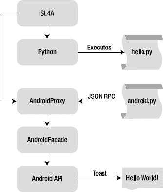
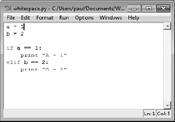

## C H A P T E R 1

## 介绍

这本书是关于主要使用 Python 语言和一点点 JavaScript 为 Android 平台编写真实世界的应用。虽然 Java 没有任何问题，但当你需要做的只是打开或关闭 Android 设备上的一些设置时，它真的是大材小用了。Android 脚本层(SL4A)项目就是为了满足这一特定需求而启动的。这本书将向您介绍 SL4A，并让您能够以您从未想过的方式自动化您的 Android 设备。

### 为什么选择 SL4A？

你对这本书的第一个问题可能是，“为什么我要用 SL4A 而不是 Java？”这个问题有几个答案。一是不是每个人都是 Java 的粉丝。Java 语言对一些人来说太重了，而且不完全是开源的。它还需要使用编辑/编译/运行设计循环，这对于简单的应用来说可能是乏味的。一个同样合理的答案是“我想使用 X”，其中 X 可以是任何数量的流行语言。

Google 提供了一个全面的软件开发工具包(SDK ),专门针对 Java 开发人员，Android 市场上的大多数应用可能都是用 Java 编写的。我将在第 3 章中讲述 Android SDK，并在整本书中使用它附带的一些工具。

 **注意** SL4A 目前支持 Beanshell、JRuby、Lua、Perl、PHP、Python、Rhino。

SL4A 的真正目标是那些寻找一种方法来编写简单的脚本以在使用任何支持的语言的 Android 设备上自动化任务的人，包括通过 Beanshell 的 Java。它提供了一个交互式控制台，您可以在其中键入一行代码并立即看到结果。在许多情况下，它甚至可以重用您为桌面环境编写的代码。底线是 SL4A 使得用 Java 以外的语言为基于 Android 的设备编写代码和以一种更具交互性的方式编写代码成为可能。

### 安卓的世界

2005 年，谷歌收购安卓公司，大举进军移动操作系统领域。它在如此短的时间内取得了如此大的进步，真是令人惊讶。Android 社区非常庞大，已经产生了大量的会议、书籍和支持材料，这些都可以在互联网上轻松获得。

这是定义几个术语的好时机，你将在本书的其余部分看到这些术语。Android 应用通常被打包成`.apk`文件。这些实际上只是包含应用所需的一切的`.zip`文件。事实上，如果你将一个`.apk`文件重命名为`.zip,`，你可以用任何存档工具打开它并检查其内容。

大多数 Android 设备来自制造商，其系统文件受到保护，以防止任何无意或恶意的操作。Android 操作系统(OS)本质上是以 Linux 为核心的，它提供了许多与任何 Linux 桌面相同的功能。有很多方法可以解锁系统区域，并提供对 Android 设备上整个文件系统的根用户访问。这个过程被恰当地称为*根*你的设备，一旦完成，该设备被描述为*根*。SL4A 不需要根设备，但是如果您选择了这个路径，它将在一个根设备上工作。

### Android 应用剖析

Android 基于 Linux 操作系统(在撰写本文时，Linux 内核的版本为 2.6)。Linux 提供了所有的核心管道，如设备驱动程序、内存和进程管理、网络堆栈和安全性。内核还在硬件和应用之间增加了一个抽象层。用一个解剖学的比喻来说，您可能会认为 Linux 是机器人身体的骨骼、肌肉和器官。

Android 堆栈的下一层是 Dalvik 虚拟机(DVM)。这一部分提供了核心的 Java 语言支持和 Java 编程语言的大部分功能。DVM 是大脑，大部分处理工作都在其中进行。每个 Android 应用都在 DVM 的私有实例中运行在自己的进程空间中。应用框架提供了 Android 应用所需的所有必要组件。来自 Google Android 文档:

> *“开发人员可以完全访问核心应用使用的相同框架 API。应用架构旨在简化组件的重用。任何应用都可以发布其功能，然后任何其他应用都可以利用这些功能(受框架实施的安全约束的约束)。同样的机制允许用户更换组件。*
> 
> *所有应用的基础是一组服务和系统，包括:*

*   *一组丰富且可扩展的视图，可用于构建应用，包括列表、网格、文本框、按钮，甚至嵌入式网络浏览器*
*   *使应用能够从其他应用(如联系人)访问数据或共享自己数据的内容供应器*
*   *资源管理器，提供对本地化字符串、图形和布局文件等非代码资源的访问*
*   *一个通知管理器，允许所有应用在状态栏显示自定义提醒*
*   *一个活动管理器，管理应用的生命周期，并提供一个通用的导航 back stack "[1](#CHP-1-FN-1)T5】*

所有 Android 应用都基于三个核心组件:活动、服务和接收者。这些核心组件通过名为 *intents* 的消息激活。SL4A 通过其 API facade 为您提供了许多核心 Android 功能，因此了解一些基础知识是个不错的主意。[第 3 章](03.html#ch3)和[第 5 章](05.html#ch5)详细看 Android SDK 和 Android 应用编程接口(API)，具体的我留到后面再说。现在，我将向您介绍活动和意图，因为它们将被广泛使用。

### 活动

Android 文档将*活动*定义为“一个应用组件，提供一个用户可以与之交互的屏幕，以便做一些事情，例如拨打电话、拍照、发送电子邮件或查看地图。每个活动都有一个窗口，可以在其中绘制用户界面。窗口通常会充满整个屏幕，但也可能会比屏幕小，并浮动在其他窗口的顶部。

Android 应用由一个或多个松散耦合在一起的活动组成。每个应用通常都有一个“主”活动，该活动可以依次启动其他活动来完成不同的功能。

### 意图

来自 Google 文档:“意图是一个简单的消息对象，它表示做某事的意图。例如，如果您的应用想要显示一个网页，它通过创建一个意图实例并将其交给系统来表达其查看 URI 的*意图*。系统会找到其他一些知道如何处理这个意图的代码(在本例中是浏览器)并运行它。意图还可以用于在系统范围内广播有趣的事件(如通知)。”

可以使用一个 intent 和`startActivity`来启动一个*活动*，`broadcastIntent`将其发送给任何感兴趣的`BroadcastReceiver`组件，`startService(Intent)`或`bindService(Intent, ServiceConnection, int)`与后台服务进行通信。意图使用您必须以参数形式提供的主要和次要属性。

有两个主要属性:

*   **动作:**将要执行的一般动作，如`VIEW_ACTION`、`EDIT_ACTION`、`MAIN_ACTION`等
*   **数据:**要操作的数据，比如联系人数据库中的人员记录，表示为统一资源标识符(URI)

___________________________

1T0】

二级属性有四种类型:

*   **类别:**给出关于要执行的动作的附加信息。例如，`LAUNCHER_CATEGORY`意味着它应该作为顶层应用出现在启动器中，而`ALTERNATIVE_CATEGORY`意味着它应该包含在用户可以对一段数据执行的替代操作列表中。
*   **类型:**指定意图数据的显式类型(MIME 类型)。通常，类型是从数据本身推断出来的。通过设置此属性，可以禁用该计算并强制显式类型。
*   **component:** 指定一个组件类的显式名称，用于 intent。通常，这是通过查看意图中的其他信息(动作、数据/类型和类别)并将其与可以处理它的组件进行匹配来确定的。如果设置了该属性，则不执行任何计算，并且该组件完全按原样使用。通过指定该属性，所有其他意图属性都成为可选属性。
*   **extras:** 任何附加信息的捆绑包。这可用于向组件提供扩展信息。例如，如果我们有一个发送电子邮件的动作，我们也可以在这里包含额外的数据片段，以提供主题、正文等等。

### SL4A 历史

SL4A 于 2009 年 6 月在 Google 开源博客上首次公布，最初命名为 Android 脚本环境(ASE)。主要是通过达蒙·科勒的努力，这个项目才得以实现。随着项目的不断成熟，其他人也做出了贡献。在撰写本文时，最新的版本是 r4，尽管您也可以在 SL4A 网站(`[http://code.google.com/p/android-scripting](http://code.google.com/p/android-scripting)`)上找到实验版本。

### SL4A 架构

在最底层，SL4A 本质上是一个脚本主机，这意味着作为一个应用，它托管不同的解释器，每个解释器处理一种特定的语言。如果您要浏览 SL4A 源代码库，您会看到每种语言的源代码树的副本。使用 Android 原生开发工具包(NDK)为 ARM 架构进行交叉编译，并在 SL4A 启动特定解释器时作为库加载。此时，脚本将被逐行解释。

SL4A 的基本架构类似于您在分布式计算环境中看到的。[图 1-1](#fig_1_1) 以图示的形式显示了当你启动 SL4A 然后运行一个脚本(在本例中为`hello.py)`)时的执行流程。每个 SL4A 脚本都必须导入或获取一个外部文件，比如 Python 的`android.py`，它将定义许多与 Android API 通信所需的代理函数。

SL4A 和底层 Android 操作系统之间的实际通信使用远程过程调用(RPC)机制和 JavaScript 对象符号(JSON)。您通常会在分布式体系结构中发现 RPC，在这种体系结构中，信息在客户机和服务器之间传递。以 SL4A 为例，服务器是 Android OS，客户端是 SL4A 脚本。这在 SL4A 和 Android 操作系统之间增加了一层隔离，以防止任何恶意脚本做任何有害的事情。

安全性是一个问题，也是 SL4A 使用 RPC 机制的原因之一。SL4A wiki 是这样描述的:

> *" **RPC 身份验证:** SL4A 通过要求所有脚本由相应的 RPC 服务器进行身份验证来强制执行每个脚本的安全沙箱。为了使认证成功，脚本必须向相应的服务器发送正确的握手秘密。这是通过*完成的
> 
> 1.  *读取`AP_HANDSHAKE`环境变量。*
> 2.  *用值`AP_HANDSHAKE`作为参数调用 RPC 方法`_authenticate`。*
> 
> *`_authenticate`方法必须是第一个 RPC 调用，并且应该在 Android 库初始化期间发生。例如，参见 Rhino 的或 Python 的 Android 模块”。 [2](#CHP-1-FN-2)*
> 
> 
> 
> ***图 1-1。** SL4A 执行流程图*

_____________________

2T0】

### SL4A 概念

在我们实际使用 SL4A 之前，有许多概念需要介绍。在很高的层次上，SL4A 提供了许多协同工作的功能部件。每种受支持的语言都有一个解释器，可以在 Android 平台上运行。伴随解释器的是 Android API 的抽象层。这个抽象层以每种语言所期望的形式提供了一个调用接口。解释器和原生 Android API 之间的实际通信使用进程间通信(IPC)作为额外的保护层。最后，它支持在设备上交互测试脚本的环境。

虽然[图 1-1](#fig_1_1) 显示 Python 是解释器，但是这个概念对于所有支持的语言都是一样的。每个解释器在自己的进程中执行语言，直到进行 API 调用。然后使用 RPC 机制将其传递给 Android 操作系统。解释器和 Android API 之间的所有通信通常都使用 JSON 来传递信息。

### JavaScript 对象符号(JSON)

SL4A 大量使用 JSON 来传递信息。如果您以前从未见过 JSON，您可能想访问一下`[http://www.json.org](http://www.json.org)`网站。最简单的 JSON 只是一种定义数据结构或对象的方式，就像在程序环境中一样。在大多数情况下，您会看到 JSON 结构以一系列名称/值对的形式出现。名称部分将始终是一个字符串，而值可以是任何 JavaScript 对象。

在 SL4A 中，您会发现许多 API 调用使用 JSON 返回信息。幸运的是，在创建、解析和使用 JSON 时有多种选择。Python 将 JSON 视为一等公民，拥有完整的工具库，可以在 JSON 和其他本地 Python 类型之间来回转换。Python 标准库`pprint`模块是一种以可读性更好的格式显示 JSON 响应内容的便捷方式。

Python 标准库包括一个 JSON 模块，其中有许多方法可以使处理 JSON 变得更加容易。因为 JSON 对象可以包含几乎任何类型的数据，所以必须使用编码器和解码器将原生 Python 数据类型转换成 JSON 对象。这是通过`json.JSONEncoder`和`json.JSONDecoder`方法完成的。当您将一个 JSON 对象从一个地方移动到另一个地方时，您必须序列化然后反序列化该对象。这需要用`json.load()`和`json.loads()`函数进行解码，用`json.dump()`加`json.dumps()`进行编码。

有大量的 web 服务已经采用 JSON 作为实现 API 的标准方法。这里有一个来自雅虎的图片:

`{
"Image": {
"Width":800,
"Height":600,
"Title":"View from 15th Floor",
"Thumbnail":
{
"Url":"http:\/\/scd.mm-b1.yimg.com\/image\/481989943",
"Height": 125,
"Width": "100"
},
"IDs":[ 116, 943, 234, 38793 ]
}
}`

### 事件

Android 操作系统使用事件队列作为处理特定硬件生成的动作的手段，例如当用户按下某个硬件键时。其他可能性包括任何设备传感器，例如加速度计、GPS 接收器、光传感器、磁力计和触摸屏。在检索信息之前，必须明确打开每个传感器。

SL4A API facade 提供了许多 API 调用，这些调用将启动导致事件的某种类型的操作。其中包括以下内容:

*   `startLocating()`
*   `startSensing()`
*   `startTrackingPhoneState()`
*   `startTrackingSignalStrengths()`

这些调用中的每一个都将开始收集某种类型的数据，并生成诸如“位置”事件或“电话”事件之类的事件。任何受支持的语言都可以注册一个事件处理程序来处理每个事件。`startLocating()`调用有两个参数，允许您指定更新之间的最小距离和最小时间。

### 语言

SL4A 带来了许多语言选择。在撰写本书时，这些选择包括 Beanshell、Lua、JRuby Perl、PHP、Python 和 Rhino(在下面的章节中给出了这些版本)。如果愿意，您还可以编写或重用 shell 脚本。毫无疑问，所有这些语言中最流行的是 Python。到目前为止，对其他语言的支持还没有接近 Python 的水平，但是如果你愿意的话，也可以使用它们。

#### Beanshell 2.0b4

Beanshell 是一种有趣的语言，因为它基本上是用 Java 解释的。这有点回避了这样一个问题:当你可以使用 Android SDK 编写原生 Java 时，你为什么想要一个解释的 Java 呢？Beanshell 解释器确实提供了一个编写和测试代码的交互式工具。它肯定不会是最快的代码，但是您可能会发现它对于测试代码片段很有用，而不需要经历整个编译/部署/测试周期。

检查`android.bsh`文件显示了用于设置 JSON 数据结构的代码，这些数据结构用于向 Android 操作系统传递信息和从 Android 操作系统接收信息。下面是基本调用函数的样子:

`call(String method, JSONArray params) {
JSONObject request = new JSONObject();
request.put("id", id);
request.put("method", method);
request.put("params", params);
out.write(request.toString() + "\n");
out.flush();
String data = in.readLine();`

`if (data == null) {
return null;
}
return new JSONObject(data);
}`

这里有一个简单的`hello_world.bsh`脚本:

`source("/sdcard/com.googlecode.bshforandroid/extras/bsh/android.bsh");
droid = Android();
droid.call("makeToast", "Hello, Android!");`

#### 月球 5.1.4

Lua.org 将 Lua 描述为“一种扩展编程语言，旨在用数据描述工具支持通用过程编程”。 [3](#CHP-1-FN-3) 术语*扩展编程语言*的意思是 Lua 意在通过脚本来扩展现有程序。这很符合 SL4A 的理念。

从语法角度来看，Lua 有点像 Python，因为它不使用花括号来包装代码块，也不需要分号来结束语句，尽管如果您愿意，您可以这样做。在函数定义的情况下，Lua 使用保留字`function`开始代码块，然后使用保留字`end`标记结束。

Lua 拥有现代语言中大多数标准的数据类型，还包括表的概念。在 Lua 中，表是动态创建的对象，可以像传统语言中的指针一样进行操作。表必须在使用前显式创建。表也可以引用其他表，使它们非常适合递归数据类型。操纵表格的通用函数列表包括`table.concat`、`.insert`、`.maxn`、`.remove`和`.sort`。

下面是 Lua 网站上的一小段 Lua 代码，它创建了一个循环链表:

`list = {} -- creates an empty table
current = list
i = 0
while i < 10 do
current.value = i
current.next = {}
current = current.next
i = i+1
end
current.value = i
acurrent.next = list`

___________________________

3T0】

下面是实现 RPC 调用函数的 Lua 代码:

`function rpc(client, method, …)
assert(method, 'method param is nil')
local rpc = {
['id'] = id,
['method'] = method,
params = arg
}
local request = json.encode(rpc)
client:send(request .. '\n')
id = id + 1
local response = client:receive('*l')
local result = json.decode(response)
if result.error ~= nil then
print(result.error)
end
return result
end`

必须的 Lua hello world 脚本:

`require "android"

name = android.getInput("Hello!", "What is your name?") android.printDict(name) -- A convenience method for inspecting dicts (tables).
android.makeToast("Hello, " .. name.result)`

Lua wiki 提供了包含大量有用代码片段的样例代码链接。

#### Perl 5.10.1 版

如果不算 shell，Perl 可能是 SL4A 中最古老的语言。它可以追溯到 1987 年，已经被用于你能想到的几乎所有类型的计算应用中。使用 Perl 的最大优势是可以从中提取大量代码示例。编写`hello_world.pl`脚本看起来很像其他语言:

`use Android;
my $a = Android->new();
$a->makeToast("Hello, Android!");`

下面是启动 SL4A 脚本所需的 Perl 代码:

`# Given a method and parameters, call the server with JSON,
# and return the parsed the response JSON. If the server side
# looks to be dead, close the connection and return undef.
sub do_rpc {
my $self = shift;
if ($self->trace) {
show_trace(qq[do_rpc: $self: @_]);
}`

`my $method = pop;
my $request = to_json({ id => $self->{id},
method => $method,
params => [ @_ ] });
if (defined $self->{conn}) {
print { $self->{conn} } $request, "\n";
if ($self->trace) {
show_trace(qq[client: sent: "$request"]);
}
$self->{id}++;
my $response = readline($self->{conn});
chomp $response;
if ($self->trace) {
show_trace(qq[client: rcvd: "$response"]);
}
if (defined $response && length $response) {
my $result = from_json($response);
my $success = 0;
my $error;
if (defined $result) {
if (ref $result eq 'HASH') {
if (defined $result->{error}) {
$error = to_json( { error => $result->{error} } );
} else {
$success = 1;
}
} else {
$error = "illegal JSON reply: $result";
}
}
unless ($success || defined $error) {
$error = "unknown JSON error";
}
if (defined $error) {
printf STDERR "$0: client: error: %s\n", $error;
}
if ($Opt{trace}) {
print STDERR Data::Dumper->Dump([$result], [qw(result)]);
}
return $result;
}
}
$self->close;
return;
}`

#### PHP 5.3.3

毫无疑问，PHP 是创建动态网页最成功的通用脚本语言之一。从最初的个人主页，缩写 PHP 现在代表 PHP:超文本预处理器。PHP 是一种免费的开源语言，几乎可以在所有主流操作系统上免费实现。

下面是通过 RPC 启动 SL4A 脚本所需的 PHP 代码:

`public function rpc($method, $args)
{
$data = array(
'id'=>$this->_id,
'method'=>$method,
'params'=>$args
);
$request = json_encode($data);
$request .= "\n";
$sent = socket_write($this->_socket, $request, strlen($request));
$response = socket_read($this->_socket, 1024, PHP_NORMAL_READ) or die("Could not
read input\n");
$this->_id++;
$result = json_decode($response);

$ret = array ('id' => $result->id,
'result' => $result->result,
'error' => $result->error
);
return $ret;
}`

PHP 版本的`hello_world.php`看起来是这样的:

`<?php
require_once("Android.php");
$droid = new Android();
$name = $droid->getInput("Hi!", "What is your name?");
$droid->makeToast('Hello, ' . $name['result']);`

在安装 PHP 和基本的`hello_world.php`时，您会得到许多其他的示例脚本。

#### 犀牛 1.7R2

Rhino 解释器为您提供了一种编写独立 JavaScript 代码的方法。JavaScript 实际上在 ECMA-262 下被标准化为`ECMAScript`。你可以从`[http://www.ecma-international.org/publications/standards/Ecma-262.htm](http://www.ecma-international.org/publications/standards/Ecma-262.htm)`下载标准。拥有一个 JavaScript 解释器的好处有很多。如果您计划使用 HTML 和 JavaScript 构建任何类型的定制用户界面，您可以构建 JavaScript 部分的原型，并使用 Rhino 解释器进行测试。

Rhino 的`android.js`文件在许多方面与其他语言的文件相似。RPC 调用定义如下所示:

`this.rpc = function(method, args) {
this.id += 1;
var request = JSON.stringify({'id': this.id, 'method': method,
'params': args});
this.output.write(request + '\n');
this.output.flush();
var response = this.input.readLine();
return eval("(" + response + ")");
},`

这里有一个简单的 Rhino `hello_world.js`脚本:

`load("/sdcard/sl4a/extras/rhino/android.js");
var droid = new Android();
droid.makeToast("Hello, Android!");`

#### JRuby 1.4

任何开源项目的潜在危险之一是被忽视。在撰写本文时，基于 SL4A r4 的 JRuby 解释器受到了忽视，甚至没有运行`hello_world.rb`脚本。无论如何，这个脚本看起来是这样的:

`require "android"
droid = Android.new
droid.makeToast "Hello, Android!"`

JRuby 解释器确实启动了，您可以用它来尝试一些基本的 JRuby 代码。下面是 Android 类在 Ruby 中的样子:

`class Android

def initialize()
@client = TCPSocket.new('localhost', AP_PORT)
@id = 0
end

def rpc(method, *args)
@id += 1
request = {'id' => @id, 'method' => method, 'params' => args}.to_json()
@client.puts request
response = @client.gets()
return JSON.parse(response)
end

def method_missing(method, *args)
rpc(method, *args)
end

end`

#### 外壳

如果您是一个 shell 脚本向导，那么您将会对 SL4A 的 shell 解释器如鱼得水。它本质上与您在典型的 Linux 终端提示符下看到的 bash 脚本环境相同。你会发现所有熟悉的操作文件的命令，如`cp`、`ls`、`mkdir`和`mv`。

#### Python

Python 有着广泛的用途和大量的追随者，尤其是在 Google 内部。事实上，它的追随者如此之多，以至于他们雇佣了这种语言的发明者吉多·范·罗苏姆。Python 已经存在很长时间了，并且有许多用这种语言编写的开源项目。就 SL4A 而言，它也是最令人感兴趣的，所以你会在论坛上找到比其他语言更多的例子和讨论。出于这个原因，我将花多一点时间来介绍这种语言，试图突出从 SL4A 的角度来看很重要的东西。

##### 语言基础

了解 Python 语言不是这本书的绝对要求，但会有帮助。关于 Python，你需要知道的第一件事是一切都是对象。第二件事是空白在 Python 中是有意义的。我的意思是 Python 使用制表符或实际空格(ASCII 32)而不是花括号来控制代码执行(见[图 1-2](#fig_1_2) )。第三，重要的是要记住 Python 是一种区分大小写的语言。

***图 1-2。**Python 中空格用法的例子*

在讲授“计算机编程入门”课程时，Python 是一种很好的语言。标准 Python 的每个安装都带有命令行解释器，您可以在其中键入一行代码并立即看到结果。要启动解释器，只需在命令提示符(Windows)或终端窗口(Linux 和 Mac OS X)输入`python`。此时，您应该看到几行版本信息，后面是三箭头提示(`>>>`)，让您知道您在 Python 解释器中，如下所示:

`C:\Users\paul>python
Python 2.6.6 (r266:84297, Aug 24 2010, 18:13:38) [MSC v.1500 64 bit (AMD64)] on
win32
Type "help", "copyright", "credits" or "license" for more information.
>>>`

Python 使用了许多命名约定，如果您仔细研究 Python 代码，就会发现这些约定。第一个是双下划线，它在 Python 中用来“破坏”或更改名称，作为定义类内部使用的私有变量和方法的一种方式。您将看到这种符号用于“特殊”方法，如`__init__(self)`。如果一个类有特殊的`__init__`方法，每当该类的新实例化发生时，它就会被调用。

例如:

`>>> class Point:
def __init__(self, x, y):
self.x = x
self.y = y

>>> xy = Point(1,2)
>>> xy.x, xy.y
(1, 2)`

从例子中可以看出，`self`在 Python 中被用作保留字，指的是方法的第一个参数。它实际上是一个 Python 约定，实际上，对 Python 没有特殊的意义。然而，因为这是一个被广泛接受的约定，所以你应该坚持使用它以避免任何潜在的问题。从技术上讲，`self`是对类或函数本身的引用。一个类中的方法可以通过使用`self`参数的方法属性来调用同一个类中的其他方法。

Python 有一个简短的内置常量列表。你会遇到的主要有`False`、`True`和`None`。`False`和`True`属于`bool`类型，主要出现在逻辑测试中或者创建一个无限循环。

这种语言的新用户经常感到困惑的事情之一是数据类型的多样性。接下来的部分给出了使用 Python 和 SL4A 所需的关键数据类型的快速概述。

###### 字典:需要唯一键的一组无序的键/值对

Python 字典直接映射到 JSON 数据结构。定义字典的语法使用花括号将条目括起来，并在键和值之间使用冒号。下面是一个简单的字典定义:

`students = {'barney' : 1001, 'betty' : 1002, 'fred' : 1003, 'wilma' : 1004}`

要引用条目，请使用键，如下所示:

`students['barney'] = 999
students['betty'] = 1000`

您还可以使用`dict()`构造函数来构建字典。当键是一个简单的字符串时，您可以使用传递给`dict()`的参数创建一个新的字典，如下所示:

`students = dict(barney=1001, betty=1002, fred=1003, wilma=1004)`

因为 Python 中的一切都是一个对象，所以您可以期望看到与 dictionary 对象相关联的方法。如您所料，有一些方法可以从字典中返回键和值。下面是这本`students`字典的样子:

`>>> students
{'barney': 1001, 'betty': 1002, 'fred': 1003, 'wilma': 1004}
>>> students.keys()
['barney', 'betty', 'fred', 'wilma']
>>> students.values()
[1001, 1002, 1003, 1004]`

方括号约定表示列表。对`students.keys()`语句求值会返回来自`students`字典的键列表。

###### 列表:内置的 Python 序列，类似于其他语言中的数组

在 Python 中，*序列*被定义为“一个 iterable，它支持通过`__getitem__()`特殊方法使用整数索引进行有效的元素访问，并定义了一个返回序列长度的`len()`方法。”一个*可迭代*被定义为“一个能够一次返回一个成员的容器对象”Python 为迭代提供了直接的语言支持，因为它是编程中最常见的操作之一。列表对象提供了许多方法来简化它们的使用。来自 Python 文档:

*   **`list.append(` x `)`** :在列表末尾增加一项；相当于`a[len(a):] = [x]`。
*   **`list.extend(` L `)`** :通过追加给定列表中的所有项目来扩展列表；相当于`a[len(a):] = L`。
*   **`list.insert(` I，x `)`** :在给定位置插入一个项目。第一个参数是要插入的元素的索引，所以`a.insert(0, x)`插入到列表的前面，`a.insert(len(a), x)`相当于`a.append(x)`。
*   **`list.remove(` x `)`** :删除列表中第一个值为 *`x`* 的项目。如果没有此项，则为错误。
*   **`list.pop(`【I】`)`**:移除列表中给定位置的项目并返回。如果没有指定索引，`a.pop()`删除并返回列表中的最后一项。(方法签名中的 *i* 周围的方括号表示该参数是可选的，并不是说您应该在那个位置键入方括号。)您将在 Python 库参考中经常看到这种符号。
*   **`list.index(` x `)`** :返回列表中第一项的索引，其值为 *x* 。如果没有此项，则为错误。
*   **`list.count(` x `)`** :返回 *x* 在列表中出现的次数。
*   **`list.sort`** :对列表中的项目进行排序，就位。
*   **`list.reverse(` x `)`** :反转列表中的元素，就位。

###### 字符串:由 ASCII 或 Unicode 字符组成的不可变序列

字符串定义中的关键词是*不可变*，意思是创建后不可改变。这有助于许多操作的快速实现，也是 Python 能够以非常高效的方式处理字符串的原因。反斜杠(\)字符用于转义具有特殊含义的字符，包括反斜杠字符本身。如果在字符串前面加上小写或大写的“r”，则不需要反斜杠字符，因为每个字符都将被视为“原始”字符串。您可以使用单引号或双引号来定义字符串文字，如下所示:

`name = "Paul Ferrill"
initials = 'PF'
directory = r'C:\users\paul\documents'`

string 类有许多可用的方法。下面是来自 Python 文档的列表: [4](#CHP-1-FN-4)

`capitalize()
center(width[, fillchar])
count(sub[, start[, end]])
decode( [encoding[, errors]])
encode( [encoding[,errors]])
endswith( suffix[, start[, end]])
expandtabs( [tabsize])
find( sub[, start[, end]])
index( sub[, start[, end]])
isalnum( )
isalpha( )
isdigit( )
islower( )
isspace( )
istitle( )
isupper( )
join( seq)
ljust( width[, fillchar])
lower( )
lstrip( [chars])
partition( sep)
replace( old, new[, count])
rfind( sub [,start [,end]])
rindex( sub[, start[, end]])
rjust( width[, fillchar])
rpartition( sep)
rsplit( [sep [,maxsplit]])
rstrip( [chars])
split( [sep [,maxsplit]])
splitlines( [keepends])
startswith( prefix[, start[, end]])
strip( [chars])
swapcase( )
title( )
translate( table[, deletechars])
upper( )
zfill( width)`

_____________________

4T0】

在 Python 2.6 中，内置的`str`和`unicode`类通过`str.format()`方法提供了非常全面的格式化和替换功能。还有一个`Formatter`类，它有一组更广泛的方法，适合实现模板功能。Python 也使用带字符串的百分号进行格式化。以下是在打印语句中使用百分号的示例:

`>>> Pi = 3.141593
>>> print "Pi = %10.2f" % Pi
Pi = 3.14
>>> print "Long Pi = %10.6f" % Pi
Long Pi = 3.141593`

这是一个谈论在 Python 中使用*片*的好地方。任何有多个条目的对象，比如一个字符串，都可以用一种叫做切片的符号来寻址。为了引用字符串`s,`中从`j`到`k`的项目，使用`s[j:k].`向切片符号添加第三个项目包括一个步骤，以便`s[j:k:l]`引用从`j`到`k`的项目，增量为`l`。从列表的开始到第 *n* 项，使用`s[:n]`，从第 *n* 项到末尾使用`s[n:]`。例如:

`>>> mylist = [1,2,3,4,5,6,7,8,9]
>>> mylist[:3]
[1, 2, 3]
>>> mylist[3:]
[4, 5, 6, 7, 8, 9]`

注意 Python 使用从零开始的引用。因此，mylist 的第一个或第零个元素将等于 1。语法`mylist[:3]`说“返回 mylist 的所有元素，从开始到第四个元素，但不包括第四个元素。”负索引从列表末尾开始计数。

###### 元组:一个不可变的列表

与字符串类型一样，*元组*是不可变的，这意味着一旦创建就不能更改。元组使用与列表相同的语法来定义，只是它们用圆括号而不是方括号括起来。下面是一个元组的例子:

`>>> Sentence = ("Today", "is", "the", "first", "day", "of", "the", "rest", "of", "your",
"life.")
>>> Sentence
('Today', 'is', 'the', 'first', 'day', 'of', 'the', 'rest', 'of', 'your', 'life.')
>>> Sentence[0]
'Today'
>>> Sentence[1:3]
('is', 'the')
>>> Sentence[-1]
'life.'`

##### Python 标准库

Python 语言的最大优势之一是 Python 标准库，它包含了各种各样的例程，使您的编码生活更加简单。尽管本简介没有足够的篇幅来介绍整个库，但我将尝试指出一些将在后面章节中出现的关键函数。

Python 语言的所有文档都可以在`[http://docs.python.org](http://docs.python.org)`找到，包括旧版本。SL4A 使用 Python 2.6，所以您需要查看旧版本以获得正确的信息。对于 Python 标准库，您将希望从`[http://docs.python.org/release/2.6.5/library/index.html](http://docs.python.org/release/2.6.5/library/index.html)`开始。

Python 解释器有大量的内置函数，这些函数总是可用的。其中一个函数是`dir()`，它显示一个模块定义的所有名字。如果您在 Python 提示符下键入`dir()`,您将收到当前本地范围内的名称列表，如下所示:

`>>> dir()
['__builtins__', '__doc__', '__name__', '__package__']
>>> import sys
>>> dir()
['__builtins__', '__doc__', '__name__', '__package__', 'sys']
>>> import os
>>> dir()
['__builtins__', '__doc__', '__name__', '__package__', 'os', 'sys']`

如果您向`dir()`传递一个参数，您将获得该对象所有属性的列表。Python 标准库中的许多模块都实现了一个名为`__dir__()`的方法，这个方法在被调用时实际上会产生属性列表。如果没有`__dir__()`方法，该函数将尝试使用对象的`__dir__()`属性来获取它需要的信息。

您可以在任何对象上使用`dir()`来检查模块的属性。以下是您在 android 对象上使用`dir()`时得到的结果:

`>>> import android
>>> dir(android)
['Android', 'HANDSHAKE', 'HOST', 'PORT', 'Result', '__author__', '__builtins__', '__doc__',
'__file__', '__name__', '__package__', 'collections', 'json', 'os', 'socket', 'sys']`

另一个例子是定义一个字符串来查看有哪些方法可用:

`>>> a = "Hello"
>>> dir(a)
['__add__', '__class__', '__contains__', '__delattr__', '__doc__', '__eq__', '__format__',
'__ge__', '__getattribute__', '__getitem__', '__getnewargs__', '__getslice__', '__gt__',
'__hash__', '__init__', '__le__', '__len__', '__lt__', '__mod__', '__mul__', '__ne__',
'__new__', '__reduce__', '__reduce_ex__', '__repr__', '__rmod__', '__rmul__',
'__setattr__', '__sizeof__', '__str__', '__subclasshook__', '_formatter_field_name_split',
'_formatter_parser', 'capitalize', 'center', 'count', 'decode', 'encode', 'endswith',
'expandtabs', 'find', 'format', 'index', 'isalnum', 'isalpha', 'isdigit', 'islower',
'isspace', 'istitle', 'isupper', 'join', 'ljust', 'lower', 'lstrip', 'partition',
'replace', 'rfind', 'rindex', 'rjust', 'rpartition', 'rsplit', 'rstrip', 'split',
'splitlines', 'startswith', 'strip', 'swapcase', 'title', 'translate', 'upper', 'zfill']`

有时候，您可能正在使用 Python 标准库，甚至是其他库，但您不知道返回变量的类型。为此，您可以像这样使用`type()`内置函数:

`>>> type(a)
<type 'str'>`

数字转换是经常需要的函数之一，Python 在这方面做得很好。这里有几个例子:

`>>> bin(12345678)
'0b101111000110000101001110'
>>> hex(12345678)
'0xbc614e'
>>> oct(12345678)
'057060516'`

这些函数的结果是一个字符串。要将字符串转换成整数，使用`int()`函数如下:

`>>> print int('0xbc614e',16)
12345678`

Python 中的文件输入和输出使用非常简单的方法。要打开一个文件，使用`open`，如图 1-3 中的[所示。](#fig_1_3)

***图 1-3。**Python 文件打开的例子*

支持的文件模式包括追加(' a ')、读取(' r ')和写入(' w ')。`open`返回一个类型为`file`的对象，包含所有选择的方法和属性。看起来是这样的:

`>>> infile = open(r'c:\users\paul\documents\dependents.txt')
>>> type(infile)
<type 'file'>
>>> dir(infile)
['__class__', '__delattr__', '__doc__', '__enter__', '__exit__', '__format__',
'__getattribute__', '__hash__', '__init__', '__iter__', '__new__', '__reduce__',
'__reduce_ex__', '__repr__', '__setattr__', '__sizeof__', '__str__', '__subclasshook__',
'close', 'closed', 'encoding', 'errors', 'fileno', 'flush', 'isatty', 'mode', 'name',
'newlines', 'next', 'read', 'readinto', 'readline', 'readlines', 'seek', 'softspace',v
'tell', 'truncate', 'write', 'writelines', 'xreadlines']`

`os`模块为底层操作系统提供独立于平台的接口。如果你打算对文件名做些什么，你会想了解一下`os`模块。如果你导入操作系统，然后执行`dir(os):`，你会得到以下结果

`>>> dir(os)
['F_OK', 'O_APPEND', 'O_BINARY', 'O_CREAT', 'O_EXCL', 'O_NOINHERIT', 'O_RANDOM', 'O_RDONLY',
'O_RDWR', 'O_SEQUENTIAL', 'O_SHORT_LIVED', 'O_TEMPORARY', 'O_TEXT', 'O_TRUNC', 'O_WRONLY',
'P_DETACH', 'P_NOWAIT', 'P_NOWAITO', 'P_OVERLAY', 'P_WAIT', 'R_OK', 'SEEK_CUR', 'SEEK_END',
'SEEK_SET', 'TMP_MAX', 'UserDict', 'W_OK', 'X_OK', '_Environ', '__all__', '__builtins__',
'__doc__', '__file__', '__name__', '__package__', '_copy_reg', '_execvpe', '_exists',
'_exit', '_get_exports_list', '_make_stat_result', '_make_statvfs_result',
'_pickle_stat_result', '_pickle_statvfs_result', 'abort', 'access', 'altsep', 'chdir',
'chmod', 'close', 'closerange', 'curdir', 'defpath', 'devnull', 'dup', 'dup2', 'environ',
'errno', 'error', 'execl', 'execle', 'execlp', 'execlpe', 'execv', 'execve', 'execvp',
'execvpe', 'extsep', 'fdopen', 'fstat', 'fsync', 'getcwd', 'getcwdu', 'getenv', 'getpid',
'isatty', 'linesep', 'listdir', 'lseek', 'lstat', 'makedirs', 'mkdir', 'name', 'open',
'pardir', 'path', 'pathsep', 'pipe', 'popen', 'popen2', 'popen3', 'popen4', 'putenv',
'read', 'remove', 'removedirs', 'rename', 'renames', 'rmdir', 'sep', 'spawnl', 'spawnle',
'spawnv', 'spawnve', 'startfile', 'stat', 'stat_float_times', 'stat_result',
'statvfs_result', 'strerror', 'sys', 'system', 'tempnam', 'times', 'tmpfile', 'tmpnam',
'umask', 'unlink', 'unsetenv', 'urandom', 'utime', 'waitpid', 'walk', 'write']`

如您所见，有相当多的方法可用。处理文件和目录的另一个方便的模块是`glob`，您可以使用它根据通配符获得特定目录中的文件列表，如下所示:

`>>> import glob
for file in glob.glob("*.jpg"):
print file`

这将打印当前工作目录中所有`.jpg`文件的列表。命中列表上的下一个模块是`datetime`。如果你需要处理日期或时间，你将需要`datetime`。以下是使用该模块的几个示例:

`>>> print datetime.date.today()
2011-04-26
>>> print datetime.datetime.now()
2011-04-26 14:35:25.045000
>>> print datetime.date.weekday(datetime.datetime.now())
1`

文件工具列表的最后一项是`shutil`。该模块提供了许多文件工具，如`shutil.copy`、`shutil.copytree`、`shutil.move,`和`shutil.rmtree`。如果您导入`shutil`并使用`dir()`查看这些方法，您会得到以下结果:

`>>> import shutil
>>> dir(shutil)
['Error', '__all__', '__builtins__', '__doc__', '__file__', '__name__', '__package__',
'_basename', '_samefile', 'abspath', 'copy', 'copy2', 'copyfile', 'copyfileobj',
'copymode', 'copystat', 'copytree', 'destinsrc', 'fnmatch', 'ignore_patterns', 'move',
'os', 'rmtree', 'stat', 'sys']`

处理存储在逗号分隔值(CSV)文件中的数据是另一项常见任务。Python 2.6 包含了用于这种任务的`csv`模块。下面是一个简单的脚本，它使用`csv`模块简单地打印出文件中的所有行:

`import csv
reader = csv.reader(open("some.csv", "rb"))
for row in reader:
print row`

您也可以用类似的方式写入 CSV 文件:

`import csv
writer = csv.writer(open("some.csv", "wb"))
writer.writerows(someiterable)`

此示例显示了如何将数据解析为列表中的单独项目:

`>>> import csv
>>> for row in csv.reader(['one,two,three']):
print row

['one', 'two', 'three']`

如果不知道文件中有多少列，可以使用`string.count`方法，如下所示:

`>>> import string
>>> string.count('one,two,three,four,five',',')
4`

我们要看的来自`csv`模块的最后一个方法是`DictReader.`在大多数情况下，您应该知道 CSV 文件中包含哪些字段。如果确实如此，您可以使用 DictReader 函数将文件读入字典。下面是一个包含姓名、地址和电话号码的示例文本文件:

`John Doe|Anycity|ST|12345|(800) 555-1212
Jane Doe|Anycity|ST|12345|(800) 555-1234
Fred Flinstone|Bedrock|ZZ|98765|(800) 555-4321
Wilma Flinstone|Bedrock|ZZ|98765|(800) 555-4321
Bambam Flinston|City|ST|12345|(800) 555-4321
Barney Rubble|Bedrock|ZZ|98765|(800) 555-1111`

我们的示例代码还需要一个模块:`itertools`。这个模块提供了创建 Python 使用的高效迭代器的函数，带有关键字`for`。读取文件并打印结果的代码如下所示:

`import itertools
import csv

HeaderFields = ["Name", "City", "State", "Zip", "PhoneNum"]

infile = open("testdata.txt")

contacts = csv.DictReader(infile, HeaderFields, delimiter="|")

for header in itertools.izip(contacts):
print "Header (%d fields): %s" % (len(header), header)`

最后，输出如下:

`Header (1 fields): ({'City': 'Anycity', 'State': 'ST', 'PhoneNum': '(800) 555-1212', 'Name':
'John Doe', 'Zip': '12345'},)
Header (1 fields): ({'City': 'Anycity', 'State': 'ST', 'PhoneNum': '(800) 555-1234', 'Name':
'Jane Doe', 'Zip': '12345'},)
Header (1 fields): ({'City': 'Bedrock', 'State': 'ZZ', 'PhoneNum': '(800) 555-4321', 'Name':
'Fred Flinstone', 'Zip': '98765'},)
Header (1 fields): ({'City': 'Bedrock', 'State': 'ZZ', 'PhoneNum': '(800) 555-4321', 'Name':
'Wilma Flinstone', 'Zip': '98765'},)
Header (1 fields): ({'City': 'City', 'State': 'ST', 'PhoneNum': '(800) 555-4321', 'Name':
'Bambam Flinston', 'Zip': '12345'},)
Header (1 fields): ({'City': 'Bedrock', 'State': 'ZZ', 'PhoneNum': '(800) 555-1111', 'Name':
'Barney Rubble', 'Zip': '98765'},)
Header (1 fields): ({'City': 'Bedrock', 'State': 'ZZ', 'PhoneNum': '(800) 555-1111', 'Name':
'Betty Rubble', 'Zip': '98765'},)`

`weekday`方法返回周一的`0`，周二的`1`，依此类推。您以后可能需要的一项功能是将系统时间戳值转换为人类可读的字符串。下面是在后面章节中使用的一段代码，它将 SMS 消息的时间戳转换成一个字符串:

`b = ''
for m in SMSmsgs:
millis = int(message['date'])/1000
strtime = datetime.datetime.fromtimestamp(millis)
b += strtime.strftime("%m/%d/%y %H:%M:%S") + ',' + m['address'] + ',' + m['body'] + '\n'`

为移动设备编写代码将不可避免地涉及到以某种方式与网站进行通信。Python 标准库有两个模块来帮助完成这项任务:`urllib`和`urllib2`。尽管这两个模块提供了相似的功能，但它们以不同的方式实现。当您导入两者并检查它们的方法时，您会得到以下结果:

`>>> import urllib
>>> dir(urllib)
['ContentTooShortError', 'FancyURLopener', 'MAXFTPCACHE', 'URLopener', '__all__',
'__builtins__', '__doc__', '__file__', '__name__', '__package__', '__version__',
'_ftperrors', '_have_ssl', '_hextochr', '_hostprog', '_is_unicode', '_localhost',
'_noheaders', '_nportprog', '_passwdprog', '_portprog', '_queryprog', '_safemaps',
'_tagprog', '_thishost', '_typeprog', '_urlopener', '_userprog', '_valueprog', 'addbase',
'addclosehook', 'addinfo', 'addinfourl', 'always_safe', 'basejoin', 'ftpcache',
'ftperrors', 'ftpwrapper', 'getproxies', 'getproxies_environment', 'getproxies_registry',
'localhost', 'main', 'noheaders', 'os', 'pathname2url', 'proxy_bypass',
'proxy_bypass_environment', 'proxy_bypass_registry', 'quote', 'quote_plus', 'reporthook',
'socket', 'splitattr', 'splithost', 'splitnport', 'splitpasswd', 'splitport', 'splitquery',
'splittag', 'splittype', 'splituser', 'splitvalue', 'ssl', 'string', 'sys', 'test',
'test1', 'thishost', 'time', 'toBytes', 'unquote', 'unquote_plus', 'unwrap',
'url2pathname', 'urlcleanup', 'urlencode', 'urlopen', 'urlretrieve', 'warnings']
>>> import urllib2
>>> dir(urllib2)`

`['AbstractBasicAuthHandler', 'AbstractDigestAuthHandler', 'AbstractHTTPHandler',
'BaseHandler', 'CacheFTPHandler', 'FTPHandler', 'FileHandler', 'HTTPBasicAuthHandler',
'HTTPCookieProcessor', 'HTTPDefaultErrorHandler', 'HTTPDigestAuthHandler', 'HTTPError',
'HTTPErrorProcessor', 'HTTPHandler', 'HTTPPasswordMgr', 'HTTPPasswordMgrWithDefaultRealm',
'HTTPRedirectHandler', 'HTTPSHandler', 'OpenerDirector', 'ProxyBasicAuthHandler',
'ProxyDigestAuthHandler', 'ProxyHandler', 'Request', 'StringIO', 'URLError',
'UnknownHandler', '__builtins__', '__doc__', '__file__', '__name__', '__package__',
'__version__', '_cut_port_re', '_opener', '_parse_proxy', 'addinfourl', 'base64', 'bisect',
'build_opener', 'ftpwrapper', 'getproxies', 'hashlib', 'httplib', 'install_opener',
'localhost', 'mimetools', 'os', 'parse_http_list', 'parse_keqv_list', 'posixpath',
'proxy_bypass', 'quote', 'random', 'randombytes', 're', 'request_host', 'socket',
'splitattr', 'splithost', 'splitpasswd', 'splitport', 'splittype', 'splituser',
'splitvalue', 'sys', 'time', 'unquote', 'unwrap', 'url2pathname', 'urlopen', 'urlparse']`

如果你只是想下载一个 URL 的内容，就像你在台式机上右击并另存为一样，你可以使用`urllib.urlretrieve`。在`urllib`中有许多构建或解码 URL 的辅助方法，包括`pathname2url`、`url2pathname`、`urlencode`、`quote`和`unquote`。下面是`urllib`的一段代码:

`import urllib

class OpenMyURL(urllib.FancyURLopener):
# read a URL with HTTP authentication

def setpasswd(self, user, passwd):
self.__user = user
self.__passwd = passwd

def prompt_user_passwd(self, host, realm):
return self.__user, self.__passwd

urlopener = OpenMyURL()
urlopener.setpasswd("user", "password")

f = urlopener.open("http://www.aprivatesite.com")
print f.read()`

如果你需要通过 FTP 下载文件，你会想要使用`urllib2`。这是我在`stackoverflow.com`上找到的一个例子:

`>>> files = urllib2.urlopen('ftp://ftp2.census.gov/geo/tiger/TIGER2008/01_ALABAMA/')
.read().splitlines()
>>> for l in files[:4]: print l
…
drwxrwsr-x 2 0 4009 4096 Nov 26 2008 01001_Autauga_County
drwxrwsr-x 2 0 4009 4096 Nov 26 2008 01003_Baldwin_County
drwxrwsr-x 2 0 4009 4096 Nov 26 2008 01005_Barbour_County
drwxrwsr-x 2 0 4009 4096 Nov 26 2008 01007_Bibb_County`

为了实现一个基本的 HTTP 服务器，有一个简单的 HTTP server。以下是您得到的结果:

`>>> import SimpleHTTPServer
>>> dir(SimpleHTTPServer)
['BaseHTTPServer', 'SimpleHTTPRequestHandler', 'StringIO', '__all__', '__builtins__',
'__doc__', '__file__', '__name__', '__package__', '__version__', 'cgi', 'mimetypes',
'os', 'posixpath', 'shutil', 'test', 'urllib']`

我将在第 7 章中使用这个模块来构建一个快速脚本，让你从网络浏览器访问你的 Android 设备上的任何目录。您可能需要本地 IP 地址的值。套接字库在这里起了作用。获得自己的地址的一个技巧是连接到一个众所周知的网站，并从连接细节中检索您的地址。下面是如何做到这一点:

`>>> s = socket.socket(socket.AF_INET, socket.SOCK_DGRAM)
>>> s.connect(("gmail.com",80))
>>> print s.getsockname()
('192.168.1.8', 64300)`

有一些函数返回代表 IP 地址的十进制或十六进制数。套接字库提供了两个函数来帮助你从一个十进制数字转换到标准 IP 地址符号中的四个数字，反之亦然。您还需要 Python `struct`模块。代码如下:

`>>> import socket, struct
>>> struct.unpack('L', socket.inet_aton('192.168.1.8'))[0]
134326464
>>> socket.inet_ntoa(struct.pack('L',134326464))
'192.168.1.8'`

要从 Python 访问任何 Android API 函数，您必须`import android`然后像这样实例化一个对象:

`>>> import android
>>> droid = android.Android()`

完成后，您就可以完全访问所有 API 函数了。下面是从`android.py`开始的 Android 类的样子:

`class Android(object):

def __init__(self, addr=None):
if addr is None:
addr = HOST, PORT
self.conn = socket.create_connection(addr)
self.client = self.conn.makefile()
self.id = 0
if HANDSHAKE is not None:
self._authenticate(HANDSHAKE)

def _rpc(self, method, *args):
data = {'id': self.id,
'method': method,
'params': args}
request = json.dumps(data)
self.client.write(request+'\n')
self.client.flush()`
`response = self.client.readline()
self.id += 1
result = json.loads(response)
if result['error'] is not None:
print result['error']
# namedtuple doesn't work with unicode keys.
return Result(id=result['id'], result=result['result'],
error=result['error'], )

def __getattr__(self, name):
def rpc_call(*args):
return self._rpc(name, *args)
return rpc_call`

下面是 SL4A 安装中的一个简单 Python `hello_world.py`脚本:

`>>> import android
>>> droid = android.Android()
>>> name = droid.getInput("Hello!", "What is your name?")
>>> print name
Result(id=0, result=u'Paul', error=None)
>>> droid.makeToast("Hello, %s" % name.result)
Result(id=1, result=None, error=None)
>>>`

当您将 Python 语言的简单性与 Python 标准库的广度相结合时，您将获得一个在桌面、服务器或 Android 设备上使用 SL4A 实现有用脚本的强大工具。

[图 1-4](#fig_1_4) 显示了当你运行简单的`hello_world.py`脚本时，你在屏幕上看到的第一个东西。当你像我一样输入你的名字并按下 Ok 按钮时，你会看到如图[图 1-5](#fig_1_5) 所示的弹出信息，这是调用`makeToast` API 的结果。

***图 1-4。** Hello World 输入对话框*

***图 1-5。**make toast API 调用的结果*

### 总结

本章从一般意义上介绍 Android 平台，更具体地介绍 SL4A。在你继续阅读本书的其余部分时，这里有一些事情值得注意和记住。

这是你应该从这一章中抓住的:

*   Linux 基础:Android 操作系统本质上是幕后的 Linux。许多相同的目录和程序都在那里。
*   Java 是 Android 的语言:基于 Android SDK 构建的应用运行在 Java DVM 中。虽然这不是绝对必要的，但了解一点 Java 有助于理解 SL4A 背后的一些管道，这没有什么坏处。
*   SL4A 是一个容器应用:它托管所有不同的语言解释器，并使用 RPC 向底层操作系统提供接口。
*   JSON 是传递数据的方式:格式良好的 JSON 不难阅读，事实上，它有非常逻辑的结构。一旦您习惯了语法，您应该能够处理任何 API 函数。
*   **语言选项**:虽然 Python 是最流行的，但是您也可以选择其他语言，包括 Beanshell、JRuby、Lua、Perl、PHP 和 Rhino。