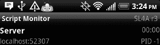

## C H A P T E R 2

## 入门指南

这一章将会给你所有你需要的关于谷歌 Android 脚本层(SL4A)的信息。

 **注**本章将介绍一些主题，稍后会有更详细的介绍。

好吧。我们开始吧。以下是我将在本章中介绍的内容:

*   在您的设备上安装核心文件
*   安装 Android SDK
*   远程连接到您的设备
*   执行简单的程序

通过使用这里给出的说明，您将能够在很短的时间内开始使用 SL4A。请密切注意有关配置您的设备和桌面的章节，因为需要完成这些说明才能使两者进行通信。当我带你浏览这些例子时，你会发现跟随它们是有帮助的。

### 在设备上安装 SL4A

开始使用 SL4A 的最快方法是简单地将其安装在 Android 设备上。有几种方法可以做到这一点。如果您导航到 SL4A 主页(http:// `code.google.com/p/android-scripting`，您将找到的下载链接。apk 文件和二维码，用于安装在您的设备上的条形码扫描仪。下面列出了安装 SL4A 需要完成的步骤:

1.  Download the SL4A .apk file (see [Figure 2-1](#fig_2_1)).

    ***图 2-1。**下载。apk 文件*

2.  Launch the .apk file from the notifications screen (see [Figure 2-2](#fig_2_2)).

    ***图 2-2。**下水了。apk 文件*

3.  Select Install on the next screen to actually install SL4A (see [Figure 2-3](#fig_2_3)).

    ***图 2-3。**安装 SL4A*

不要担心这些警告，因为它们只是表明 SL4A 有能力执行这些任务中的任何一项，但是除非您实际编写一个脚本来执行这些任务，否则不会这样做。如果您选择在模拟器中安装，只需从模拟器中的浏览器导航到 SL4A 网站，然后单击 QR 码或下载下的`sl4a_rx.apk`链接。

首次启动 SL4A 应用时，系统会询问您是否允许收集匿名使用信息。无论哪种方式，您都可以通过首选项菜单随时改变主意。

现在您已经安装了 SL4A 主应用，您仍然需要安装您最喜欢的解释器。这可以通过启动 SL4A 应用，然后按下菜单按钮来完成(参见[图 2-4](#fig_2_4) )。

***图 2-4。** SL4A 菜单按钮弹出*

这将在屏幕底部显示许多按钮，包括一个带标签的视图。触摸该按钮会弹出一个选择对话框，包括解释器选项(见[图 2-5](#fig_2_5) )。

 **注意**因为这本书主要是关于使用触摸作为主要用户交互的 Android 设备，所以你会看到经常使用的词语*触摸*或*选择*。还会提到其他基于手指的动作，如向下拖动或从左向右滑动。

***图 2-5。** SL4A 查看按钮弹出*

选择解释器选项会将你带到一个默认屏幕，该屏幕只列出 Shell 作为可用选项。要安装额外的解释器，再次按下菜单按钮，然后触摸添加按钮(参见[图 2-6](#fig_2_6) )。

***图 2-6。**口译员屏幕选项菜单*

这将显示一个可供下载和安装的解释器列表(见[图 2-8](#fig_2_8) )。选择 Python 2.6.2 这样的版本将会从 SL4A 主网站下载主要的 Python 解释器包。你必须再次访问通知栏，从显示屏顶部向下滑动，通过触摸文件名启动 Python 安装程序(见[图 2-7](#fig_2_7) )。

 **注意**在这一点上，花点时间查看解释器屏幕菜单选项中的终端帮助是值得的。在口译员屏幕可见的情况下，按硬件菜单按钮，然后选择帮助。在那里，选择终端帮助并阅读关于输入和编辑文本。

***图 2-7。** Python 解释器下载通知*

***图 2-8。** SL4A 增加一个翻译*

在这一点上，我应该提到还有一种安装 Python 解释器的替代方法。这种方法包括下载`.apk`文件，然后使用 Android 调试桥(ADB)安装它。如果您希望尝试任何新的 Python for Android 版本，您将需要使用这种方法，因为 SL4A 的基础安装通常指向最新的正式发布版本。在这种情况下，您可以使用 web 浏览器导航到 Google code 站点(`[http://code.google.com/p/python-for-android](http://code.google.com/p/python-for-android)`)，然后使用右键单击并另存为的方法下载`PythonForAndroid_rx.apk`文件，其中 x 代表您想要测试的版本。接下来，您将使用以下 ADB 命令将`.apk`文件安装到仿真器或物理设备上:

`adb install PythonForAndroid_r6.apk`

触摸安装按钮开始实际安装，并显示与 SL4A 安装完成时相同的“打开”和“完成”按钮。使用早期版本的 Python 解释器，你会在触摸“打开”后看到一个安装按钮(见[图 2-9](#fig_2_9) )。用于 Android 的 Python 的最新版本将呈现一个类似于[图 2-10](#fig_2_10) 中的屏幕。添加了三个新按钮以方便模块管理。我所说的模块是指普通 Python 发行版中不包含的额外库模块。Python for Android 项目提供了几个这样的模块，当你点击“浏览模块”按钮时，你可以看到它们。这将在 Python for Android wiki 网站上打开一个网页，让您有机会下载它们(参见[图 2-11](#fig_2_11) )。

***图 2-9。**为 Android 安装 Python*

***图 2-10。** Python for Android 安装程序*

如果一切运行正常，您应该会看到一个快速弹出的对话框，上面写着*安装成功*。此时，将出现一个屏幕，其中列出了 Shell 和 Python 2.6.2 解释器。可以以类似的方式添加额外的解释器。选择 Python 2.6.2 选项将启动 Python 解释器。

***图 2-11。** Python-for-android 模块页面*

现在你终于可以在标准的 Python 命令提示符下输入代码了，如图 2-13 所示。您可以输入任何有效的 Python 代码，并立即看到结果。如果您想要访问任何 android 功能，您必须导入 Android 模块。实现典型的“Hello World”程序总共需要三行代码，如下所示:

`>>> import android
>>> droid = android.Android()
>>> droid.makeToast('Hello, Android World')`

当你在第三行之后点击回车键，你应该会看到一个弹出的对话框，里面有文字“你好，安卓世界”(见[图 2-12](#fig_2_12) )。几秒钟后，对话框将自动关闭。

***图 2-12。**make toast 函数调用结果*

***图 2-13。** SL4A Python 解释器提示*

如果您在解释器中按下菜单按钮，您会在屏幕底部看到四个按钮，分别标记为“强制大小”、“电子邮件”、“首选项”和“退出并编辑”。这些按钮对于每个解释器都是通用的，因此您可以从 Python、BeanShell 或您选择安装的任何其他解释器中访问它们。[图 2-14](#fig_2_14) 显示了这些按钮的样子。

 **注意**所有脚本都存储在您设备的 SD 卡上的/sdcard/sl4a/scripts 目录下。如果您使用 USB 电缆将设备连接到主机，SD 卡将不可用，您的脚本也不可见。

***图 2-14** 。SL4A Python 解释器菜单*

力度按钮允许你改变解释器的屏幕尺寸。默认值为 80 × 25，这非常适合横向模式下的屏幕。一旦你选择了你的尺寸并选择了调整尺寸按钮，你的屏幕将会调整到新的尺寸。[图 2-15](#fig_2_15) 显示了调整大小对话框。

***图 2-15。** SL4A 解释器屏幕调整对话框*

电子邮件菜单选项将捕获解释器屏幕中的所有文本，并将其加载到电子邮件中，允许您将键入的所有内容发送给自己(或任何人)。下面是前面的“Hello World”代码的电子邮件文本，为了清楚起见，对实际消息进行了一些编辑，添加了回车:

`Python 2.6.2 (r262:71600, Sep 19 2009, 11:03:28)
[GCC 4.2.1] on linux2
Type "help", "copyright", "credits" or "license" for more information.
>>> import android
>>> droid = android.Android()
>>> droid.makeToast('Hello, Android World')
Result(id=1, result=None, error=None)
>>>`

这是一个停下来谈论在你的主机和设备之间移动文件的好时机。最简单的方法是使用 USB 电缆连接您的设备，并将连接类型设置为磁盘驱动器。有了这个设置，您应该能够在任何操作系统(OS)上使用普通的文件管理器应用浏览设备上的文件。此时，在主机和设备之间移动文件变成了简单的拖放操作。在后面的章节中，当我们更详细地讨论 Android SDK 时，我们将会看到一些其他的方法。

现在回到解释器选项菜单。对于 SL4A R3,“退出和编辑”按钮是灰色的，这意味着它当前没有实现。选择 Preferences 按钮会显示一个新的可滚动页面，其中有多个条目，按功能区域分组，允许您配置任意数量的不同选项。这些选项中的一些，例如字体大小，在不同的标题下重复，使得在编辑器工具和解释器窗口中改变字体大小成为可能。

有几个选项你应该注意。如果在第一次安装 SL4A 时选择了允许使用情况跟踪，则可以通过首选项屏幕上的第一个条目进行更改。[图 2-16](#fig_2_16) 显示了首选项屏幕的前四个选项，包括一般使用跟踪、脚本管理器显示所有文件、脚本编辑器字体大小和终端滚动大小。其中大多数都是不言自明的，但是我将强调一些有趣的东西。

***图 2-16。**SL4A 偏好菜单的第一部分*

启用脚本管理器标题下的显示所有文件选项将显示设备上`/sdcard/sl4a/scripts`目录中的所有文件。如果您使用其他文件作为应用的一部分，并且希望验证它们确实位于正确的目录中，这将非常方便。脚本编辑器标题下的字体大小选项将仅为文本编辑器设置字体大小。在终端标题下还有另一个字体大小选项，当你打开解释器命令提示符时，它将设置终端窗口中字符的大小。

终端标题还有其他一些有趣的设置。旋转模式可让您选取终端窗口可见时屏幕的行为方式。选项包括默认、强制横向、强制纵向和自动。您可能希望终端窗口总是以横向模式打开，这种模式更容易看到，但是您可以使用的屏幕空间有限。当您旋转设备时，自动选项将为您旋转屏幕。

“终端”窗口的默认屏幕颜色是黑色背景上的白色文本。您可以使用色轮选择器或滑块控件将它们更改为您喜欢的任何形状。出于截屏的目的，我设置了与默认颜色完全相反的颜色，即白色背景上的黑色文本。“颜色选择器”对话框显示当前颜色的 HSV、RGB 和 YUB 值，以及可用于 CSS 的十六进制代码。[图 2-17](#fig_2_17) 显示了颜色选择器的样子。您可以通过选择“接受”按钮来接受您的更改，或者使用“恢复”按钮恢复到之前的状态。

***图 2-17。**终端窗口颜色选择器*

您可能还想启用一个终端标题选项，那就是保持屏幕清醒选项。默认情况下它应该是打开的，但是如果当你正在思考下一行代码时，你的屏幕开始消失，你将知道该寻找哪个选项。接下来，我将带您在开发机器上安装 Android SDK，以利用那里的一些工具。

### 安装 Android SDK

Android SDK 提供了许多工具，让开发人员的工作变得更加轻松。我将在这里解决安装 SDK 的问题，并在后面的章节中深入探讨它的内容。第一步是下载适合您的操作系统的安装文件。谷歌为 Linux、Mac OS X 和 Windows 提供安装程序。如果您的机器上还没有安装 Java 开发工具包(JDK ),您还需要先安装它。我将解决所有三个平台上的安装问题，以确保基础都包括在内。

#### Linux

为了在 Linux 上安装 SDK，我将从全新安装 64 位版本的 Ubuntu 10.10 桌面开始。在继续操作之前，您还需要确保系统安装了最新的安全补丁。您必须安装的第一件事是基础 Java 包。这可以通过终端窗口中的以下命令来实现:

`$ sudo add-apt-repository ppa:sun-java-community-team/sun-java6
$ sudo apt-get update
$ sudo apt-get install sun-java6-jre sun-java6-bin sun-java6-jdk`

为了让它正常工作，您需要执行另一个命令行安装来让 SDK 完全正常工作。这与 SDK 使用 32 位包有关。创建一个新的 Android 虚拟设备(AVD)使用了`mksdcard`实用程序，它依赖于 ia32-libs 包。要安装此依赖项，您需要在终端窗口中输入另一个命令:

`$ sudo apt-get install ia32-libs`

对于 Linux，在 Android SDK 下载页面上有一个包含所有基础 SDK 文件的`.tgz`文件(`[http://developer.android.com/sdk](http://developer.android.com/sdk)`)。如果你的浏览器使用 Firefox，你应该可以选择使用 File Roller 工具打开文件。将整个目录解压到某个方便的地方。一旦您提取了文件，您需要运行 SDK 管理器应用来实际安装一个或多个版本的 Android 平台。

SDK Manager 应用在所有三个平台上看起来几乎是一样的，所以我将只描述一次下载特定版本的过程。在 Linux 上，管理器应用被命名为`android`，存在于主 SDK 根目录下的`tools`子目录中。您可以通过双击`android`文件从 Nautilus 文件管理器窗口启动它。如果您真的很好奇，可以在文本编辑器中打开该文件，因为它实际上是一个将启动`sdkmanager.jar`的 shell 脚本。这将调出 SDK 管理器主屏幕，如图[图 2-18](#fig_2_18) 所示。

***图 2-18。** Android SDK 管理器屏幕*

 **注意**如果您通过代理访问互联网，您需要在设置菜单中添加该信息，如图[图 2-19](#fig_2_19) 所示。

***图 2-19。**代理服务器设置页面*

选择安装哪个版本主要取决于您将支持的设备上运行的 Android 版本。对于本书中的示例，我将安装所有 2.x 版本和示例。为此，您只需单击这些项目旁边的复选框，以及 Android SDK 平台工具和文档条目，然后单击 Install Selected 按钮。如果有相当快的网络连接，整个过程应该不到十分钟。

在桌面上创建一些由 SDK 安装的常用程序的快捷方式以备后用是有意义的。你可以用 GNOME 右键点击桌面并选择创建启动器。该对话框提示在图标下显示名称以及要执行的命令。如果您单击命令文本框旁边的浏览按钮，您将能够导航到 SDK 工具目录。点击`android`文件，将其设置为新启动器的执行目标。现在，您可以通过桌面上的图标快速访问 SDK Manager 应用。

SDK 安装说明建议您也将`tools`和`platform-tools`目录添加到您的路径中。如果您将 SDK 文件解压缩到您的主目录中，您可以从命令行使用以下命令进行设置:

`export PATH=${PATH}:~/android-sdk-linux-x86/tools:~/android-sdk-linux-x86/platform-tools`

 **注意**注意 SDK 版本之间的细微变化，这些变化可能会让你陷入困境。谷歌从 SDK 版本 8 到 9 (Android 2.2 到 2.3)改变了惯例，包括几个最常用的实用程序的目录。

#### Mac OS X

在 Mac 上安装包括下载一个 zip 文件，然后解压其中的内容。您必须运行 Android SDK 和 AVD 管理器应用，然后选择要安装的版本。要开始这个过程，您可以从 Finder 启动 Android 应用，或者从您解压缩 SDK 下载的目录中的终端窗口使用以下命令启动:

`$ tools/android`

第一次运行 SDK Manager 应用时，您将看到一个可供选择的 SDK 版本列表。从命令行的角度来看，OS X 看起来几乎和 Linux 一样，包括设置路径语句。您可以使用与以前相同的语法，注意指定 SDK 目录的正确路径。在我的例子中，我在主目录的顶层解包了 SDK，并使用了以下导出语句:

`export PATH=${PATH}:~/android-sdk-mac-x86/tools:~/android-sdk-linux-x86/platform-tools`

您需要将这一行添加到。bash_profile 文件，以便在下次登录时修改路径。您可能想要在 dock 上创建一个快捷方式来快速启动 SDK 管理器。你所要做的就是把`android`文件从`tools`目录拖到 dock 的右边。现在，您可以一键访问 SDK 管理器，并从那里启动设备仿真器。我们将在[第三章](03.html#ch3)中深入探讨如何使用设备模拟器。

#### Windows

Google 提供了一个 zip 文件和一个可执行文件来在 Windows 上安装 SDK。下载文件的大小几乎是一样的，所以选择一个不应该有任何区别。如果您下载了。exe 文件，您就少了一个解压文件的步骤。这也是推荐的选择，所以这就是我要说的。对于所有的 Windows 开发和示例，我将使用 64 位版本的 Windows 7 旗舰版。要开始这个过程，我只需点击 Android SDK 下载页面上的`installer_r08-windows.exe`链接。一旦文件下载完毕，你需要双击来启动安装程序。如果你没有 Java 开发工具包(JDK)，你会看到如图[图 2-20](#fig_2_20) 所示的屏幕。

 **注**Android SDK。exe 安装程序会查找 32 位版本的 JDK，如果您没有安装它，安装程序将不会继续。

***图 2-20** 。缺少 JDK 屏幕*

尽管我在 64 位 Windows 上进行测试，但我发现必须安装 32 位 JDK 才能安装 Android SDK。一旦你下载了 JDK，你只需双击文件名开始安装。完成该步骤后，您现在可以继续安装 Android SDK 了。安装完成后，您将可以选择启动 SDK 管理器。在 Windows 上首次启动 SDK 管理器看起来与 Linux 和 Mac OS X 略有不同。[图 2-21](#fig_2_21) 显示了您将看到的对话框，允许您选择要安装的特定软件包。

您会注意到用于选择 SDK 版本的对话框略有不同，它要求您在对话框中选择一个特定的行，然后单击 Reject 单选按钮取消选择一个版本。因为我将只使用 SDK 的 2.x 版本，所以我取消了 1.5 和 1.6 版本选项。完成后，我点击了安装按钮，然后一切运行，没有干预。当你选择`.exe`安装程序时，你会得到一个新的选项添加到你的 Windows 程序菜单，标签为 Android SDK 工具。您也可以右键单击 SDK 管理器图标，并将其拖到桌面上以便快速访问。请注意，如果您只是简单地从 Windows 程序菜单中拖动图标，实际上您会将它移动到桌面上。

***图 2-21。**初始 Android SDK 管理器屏幕*

### 安装 Python

虽然你可以直接在你的设备上输入代码，但你会很快发现这个过程非常乏味，除非你碰巧有一个全尺寸的键盘。从主机远程连接为开发和测试应用提供了一个更高效的环境。我将在第 4 章中介绍如何使用 Eclipse 来实现这一目的，但现在我将向您展示如何使用 Android SDK 工具来做本质上相同的事情。

然而，还有一件事需要先做。如果你碰巧使用 Linux 或者 Mac OS X，你很可能已经安装了 Python 的一个版本。在这两个平台上，您可以通过打开终端窗口并启动 Python 来确定。图 2-22 显示了在我运行 OS X 雪豹 10.6.5 版本的 Mac Mini 上的样子。

 **注意**任何 2.6 版本的 Python 都应该可以在主机上工作，但是要注意 SL4A 是基于 2.6.2 的，以防你在从主机远程运行脚本到设备时看到一些奇怪的行为。

***图 2-22。**运行在 Mac OS X 上的 Python*

默认情况下，Python 不会安装在 Windows 上。要安装 Python，请转到`[http://python.org](http://python.org)`并找到发布页面(`[http://python.org/download/releases](http://python.org/download/releases)`)。在那里，您可以找到所有的主要版本，包括版本 2.6.6。选项包括 32 位和 64 位 Windows 版本。出于测试目的，我选择了 64 位版本。双击。msi 文件启动安装程序，提示您是否允许安装。

完成后，您可以修改 Windows 路径来添加 Python26 目录。完成该任务的最快方法是按下 Windows 键并键入单词 **system** 。您应该在控制面板标题下看到编辑系统环境变量选项。单击该行启动系统属性对话框，然后单击环境变量按钮。在系统变量部分找到 Path 变量，然后单击编辑按钮。这将显示一个带有当前系统路径语句的文本框。导航到字符串的末尾，并添加以下文本:

`;C:\Python26`

这将把 Python 目录添加到搜索路径中，并使 Python 可以在任何命令窗口中使用。要验证您是否正确安装了 Python 并正确设置了路径，请启动一个命令窗口并键入单词 **Python** 。你应该会看到类似[图 2-23](#fig_2_23) 的东西。

***图 2-23。**运行在 Windows 7 上的 Python*

### 远程连接到设备

从主机连接到您的设备需要 Android SDK 和 ADB 工具。我将在后面的章节中深入研究这个工具，但是现在我将讨论如何使用这个命令来远程连接到设备。实际上，您正在设置一个代理，通过特定端口将通信传递给设备。

要从 Windows 连接到您的设备，需要克服一些障碍。第一个也可能是最大的障碍是让 Windows 识别你的设备。下载 SDK 包时的可选组件之一是用于 Windows 的 USB 驱动程序。如果您希望计算机识别您的设备，这是必需的。[图 2-24](#fig_2_24) 显示了可用包窗口下的该项目。

选择此选项，然后单击“安装选定内容”按钮。这会将驱动程序文件下载到 SDK 根目录下的子目录中。接下来的步骤将取决于您尝试连接到 Windows 电脑的设备类型。

***图 2-24。**用于 Windows 的 USB 驱动程序*

如果你的设备碰巧是 G1、myTouch 3G、Verizon Droid 或 Nexus One，你应该已经准备好了。如果没有，你将有更多的工作要做。连接到另一个设备，如 HTC EVO 4G 智能手机，需要将附加信息添加到驱动程序`.inf`文件中，以便驱动程序识别该设备。这个文件可以在 google-usb_driver 子目录中的 SDK 所在的目录树中找到。您真正需要知道的唯一事情是设备的供应商 ID (VID)和产品 ID (PID)。你可以在谷歌上搜索几下，为你的手机找到合适的号码。另一个寻找 ADB 连接问题答案的好地方是 Google groups 上的 Android Developers group(`[http://groups.google.com/group/android-developers](http://groups.google.com/group/android-developers)`)。

作为最后的手段，你必须进入侦查模式。当您将设备连接到 Windows 时，它会尝试为您安装合适的驱动程序。如果它找不到，你会得到一个弹出信息，表明该设备未能正确安装。此时，您必须使用设备管理器来发现所需的信息。启动设备管理器最简单的方法是按下 Windows 键，开始在搜索框中键入**设备**。这会给你一个选项列表，包括设备管理器。选择设备管理器会弹出一个类似于[图 2-25](#fig_2_25) 的对话框。

由于 Windows 无法识别您连接的设备，您将看到 ADB 列在“其他设备”下。现在，您必须右键单击 ADB 设备并选择 Properties 来查找您的设备的 VID 和 PID 列表。我将向您展示 HTC EVO 4G 的外观，希望您可以使用相同的方法来连接您的设备。

***图 2-25** 。Windows 设备管理器显示未知设备*

显示 ADB 属性屏幕后，您需要选择详细信息选项卡，然后从下拉框中选择硬件 id。[图 2-26](#fig_2_26) 显示了您应该看到的 HTC EVO 4G 信息。接下来，您需要 VID 和 PID 信息来修改驱动程序`.inf`文件。

 **注意**如果你采用了 Android SDK 的默认值。exe 安装程序，你会在以下目录找到 USB 驱动文件:C:\ Program Files(×86)\ Android \ Android-SDK-windows \ Google-USB _ driver。

***图 2-26。**亚行设备的设备属性*

有了 VID 和 PID，您需要编辑 android_winusb.inf 文件。您需要添加的兴趣行如下:

`;
;HTC EVO 4G
%SingleAdbInterface% = USB_Install, USB\VID_0BB4&PID_0C8D
%CompositeAdbInterface% = USB_Install, USB\VID_0BB4&PID_0C8D&MI_01`

进行更改的最简单方法是使用记事本编辑文件。如果您希望能够将记事本保存回同一个目录，您必须以管理员身份启动记事本。为此，你可以按下 Windows 键，开始输入**记事本**。右键单击弹出窗口中的记事本，然后选择以管理员身份运行。打开记事本后，导航到`google-usb_driver`目录，然后双击`android_winusb.inf`文件。当您打开文件时，您需要找到带有标签[Google]的部分。NTx86]并复制下面的前三行。对我来说，这是 HTC 梦想设备的一个入口。将这些行粘贴到`[Google.NTx86]`和`[Google.NTamd64]`部分的末尾，更改您之前发现的 VID 和 PID 值。我没有改变 VID，因为 EVO 4G 是 HTC 设备。

现在，您应该准备好使用 USB 电缆将设备连接到主机。我还必须将设备上的 USB 连接类型改为 HTC Sync。这将在手机上打开一个对话框，因为它试图连接到主机上的 HTC Sync 应用。此时，您可以按下设备上的后退键，或者等待连接尝试超时。通过再次启动设备管理器并右键单击其它设备下的 ADB 设备，更新 ADB 设备的驱动程序。从弹出对话框中选择更新驱动程序，然后从下一个屏幕中选择浏览我的电脑以查找驱动程序软件。该对话框允许您浏览放置编辑过的`.inf`文件的目录。确保您选择了`google-usb_driver`目录，然后单击下一步。如果一切顺利，您应该会看到一个屏幕，指示 Windows 已成功更新您的驱动程序软件。

最后，在您的设备上启用 USB 调试。这发生在设备设置屏幕上。从设置，触摸应用，然后开发。在开发屏幕上，您必须选中 USB 调试旁边的复选框来启用该功能。

如果您成功地正确配置了一切，您将能够打开一个命令窗口或终端会话并发出`adb`命令。在 Windows 上，你应该可以看到你的设备带有如图 2-27 所示的命令。

***图 2-27。**输出`adb`设备命令*

如果您使用的是 Linux 或 Mac OS X，您应该不会有任何连接设备的问题。在连接 USB 电缆后，我可以在两个平台上使用 adb 设备命令查看 HTC EVO 4G，无需任何额外的步骤。

#### 设备设置

远程连接到您的设备需要在设备和桌面上执行一些步骤。在设备上，您必须从解释器屏幕启动服务器。为此，您必须完成以下步骤:

1.  从设备上的所有应用屏幕启动 SL4A。
2.  按菜单按钮，然后选择查看选项。
3.  从列表中选择口译员。
4.  再次按下菜单按钮，然后选择启动服务器。
5.  如果您想通过 WiFi 连接，请选择公共；如果您通过 USB 连接，请选择私人。

此时，您的服务器应该已经启动，并准备好通过特定端口进行访问。要找出分配了什么端口号，您必须通过从设备屏幕顶部向下拖动状态窗口来打开脚本监视器。这将显示 SL4A 服务和此时应该为 1 的运行脚本的数量。要确定端口号，您必须单击(触摸)SL4A 服务线路以调出脚本监视器。您应该会看到类似于图 2-28 的内容，端口号显示在 localhost: string 之后。

***图 2-28。** SL4A 服务器模式，端口地址*

您现在可以远程连接到您的设备了。要实现这一点，您必须再输入几个命令来定义一个环境变量并启用端口转发。这些命令和 Python 本身需要从以管理员身份运行选项启动的命令窗口中运行。环境变量必须命名为 AP_PORT，默认值为 9999，这样示例才能运行。为了启用端口转发，使用 adb 命令将端口 9999 的所有内部 tcp 流量转发到远程服务器的端口号。图 2-29 显示了这在 Windows 上应该是什么样子。

Linux、Mac OS X 和 Windows 之间的命令略有不同。在 Linux 和 Mac OS X 上，您可以使用 export 命令创建一个环境变量:

`$ export AP_PORT=9999`

您可能还想将它添加到启动脚本中。在 Linux 上，这将是`~/.bash_profile`或`~/.bashrc`。在 Mac OS X 上，它会出现在你的主目录中的`.bash_profile`。

***图 2-29。**远程控制的 Windows 环境变量和 adb 命令*

在基于 Windows 的计算机上，您可以通过之前使用的环境变量屏幕将其添加为永久环境变量。这次你用 new 按钮创建一个新的用户变量，然后输入名称 **AP_PORT** 和值 **9999** ，如图 2-30 中[所示。](#fig_2_30)

***图 2-30。**为 AP_PORT* 创建一个永久的 Windows 环境变量

### 执行简单的程序

一旦你把所有东西都连接起来，你可能想开始使用 Python 和 IDLE 进行探索。IDLE 是一个用 Python 和 Tkinter GUI 工具包编写的简单的跨平台集成开发环境(IDE)。首先，它提供了一个 Python 解释器命令行，您可以在其中键入代码行，并获得代码结果的即时反馈。还可以打开编辑器窗口来创建和修改 Python 脚本。可以保存这些脚本，然后在主解释器窗口中运行输出。在执行脚本之前，您还可以在编辑器窗口中获得关于任何语法错误的反馈。

这种方法的巧妙之处在于，您可以在桌面计算机上编写代码，并在您的设备上测试代码。请记住，您获取的任何库都需要在您的桌面计算机上可用。你需要注意的另一件事是 Python 版本号。截至本书写作时，SL4A 使用的是 Python 的 2.6.2 版本。在 2.6.2 之后，您可能可以使用任何 2.6 版本，但是请注意，如果您在桌面上使用不同于 2.6.2 的版本，您可能会遇到一些难以理解的兼容性问题。[图 2-31](#fig_2_31) 显示空闲运行“Hello World”程序。

您需要将`android.py`文件复制到与代码相同的目录中，或者复制到开发机器上的默认 Python 安装目录中。当您在脚本中执行`import android`代码时，解释器必须能够定位`android.py`。

***图 2-31。** Python 空闲程序连接到设备*

您还可以使用 IDLE 在单独的编辑器窗口中编辑和运行脚本。如果您单击文件菜单并选择新窗口，您将看到一个空白的编辑器屏幕，用于输入 Python 代码。您也可以在即时窗口和编辑器窗口之间进行剪切和粘贴。用“Hello Android World”代码尝试一下，只需要少量的编辑就可以删除额外的提示字符。[图 2-32](#fig_2_32) 显示了结果。

***图 2-32。** Python 空闲编辑窗口*

开始探索 SL4A 的另一个很好的方法是看看随 Python 解释器一起安装的一些示例程序。其中之一是`Test.py`，它是一个示例程序，使用 SL4A 支持的许多对话框类型以及一些其他测试用例。这是一个导入默认安装在设备上的几个模块的程序，但是除非您明确安装它们，否则它们可能不会在您的主机上。

您可以通过启动 SL4A 并从文件列表中选择`Test.py`在您的设备上运行`Test.py`。当你从 SL4A 主窗口中选择一个文件时，你会看到一个弹出的小对话框，里面有很多图标。[图 2-33](#fig_2_33) 显示了您应该看到的内容。

***图 2-33。** SL4A 脚本启动选项*

终端图标在设备的终端窗口中启动脚本，因此当齿轮图标在后台启动脚本时，您可以看到任何错误或调试消息。选择铅笔图标将在文本编辑器中打开脚本，而磁盘图标将允许您重命名脚本。如果您选择垃圾桶图标，您将有一次机会改变删除的想法，因为将会打开一个“是/否”对话框，提示您确认这是您想要做的。

脚本编辑器提供了一种在设备上输入或编辑脚本的简单方法。它在小型设备上效率不是很高，但在平板电脑等大屏幕设备上效果相对较好。在将脚本加载到实际设备之前，您也可以在模拟器中使用它来测试脚本。完成编辑后，您必须按下菜单按钮，调出选项菜单，以保存并退出或保存并运行。图 2-34 显示了它在你的设备上的样子。

***图 2-34。** SL4A 脚本编辑器选项菜单*

Preferences 按钮将调出与之前相同的菜单，其中包含 SL4A 应用的所有选项。选择帮助按钮将显示一个对话框，其中有三个选项，包括 Wiki 文档、YouTube 截屏和终端帮助。前两个选项将打开一个 web 浏览器，并重定向到您在 SL4A 项目的主页上找到的相同页面。

API 浏览器按钮将显示一个列出所有可用 API 函数的屏幕(参见[图 2-35](#fig_2_35) )。

***图 2-35。** API 浏览器工具*

如果你长按(意味着触摸一条线并保持)，你会看到一个类似于图 2-36 中的屏幕。选择“提示”将会弹出一个额外的对话框，其中有单独的文本框，供您填写 API 函数调用所需的必要参数(参见[图 2-37](#fig_2_37) )。这是探索一些更复杂的 API 函数并让 SL4A 解释器引导您填写正确条目的好方法。

***图 2-36。** API 浏览器选项*

***图 2-37。** API 浏览器提示选项*

### 总结

这一章包含了很多信息，但是希望到此时，您已经在设备和主机上完全配置好了 SL4A 测试环境。主机的操作系统不重要，所以你可以自由选择你最喜欢的平台。如果你碰巧在某个地方遇到困难，谷歌搜索是你的朋友。

作为总结，让我们确定本章的要点:

*   **安装 SL4A** :这发生在物理设备上或者模拟器中。您首先安装 SL4A。apk 文件，然后从 SL4A 菜单添加解释器。
*   **安装 Android SDK** :这发生在你的开发机器上，它可以运行 Linux、Mac OS X 或 Windows。如果您的操作系统还没有安装 Java，您可能还必须先安装它。
*   **在 Windows 上配置 USB 驱动**:这可能是最棘手的一步，不幸的是，如果你是在 Windows 机器上开发，这是无法回避的。您必须让这个工作在您的开发机器和一个物理设备之间建立通信。
*   **在 Windows 上安装 Python**:同样，你不会在任何库存的 Windows 机器上找到 Python，所以你必须自己安装。幸运的是，这很简单。

不要害怕在这里踢轮胎。如果你不习惯在你闪亮的新手机上尝试这些东西，可以使用模拟器。这就是它存在的目的。要知道，总有一天你将不得不使用该器件，因为并非真实器件的所有功能都可以在仿真器中模拟。好消息是，这些能力的列表非常短。