# 三、Android SDK 导航

本章将深入探讨 Android 软件开发工具包(SDK)以及如何使用它来开发针对 Android 脚本层的代码。

 **注**本章所有例子都基于 Android SDK 的 release 8。

在这一章中，我会这样分解它:

*   费力地阅读 SDK 文档
*   检查不同的 SDK 组件
*   使用 Android 模拟器进行测试
*   探索 Android 调试桥(ADB)
*   使用 Dalvik 调试监控服务(DDMS)进行调试和更多工作

准备好进入 Android SDK 的世界吧。Android 的每个版本都有一个特定于该版本的 SDK。在构建原生 Android 应用时，您可以选择特定的版本，以便利用最新的功能。这意味着您可以使用最新的 SDK 版本，并且仍然可以构建和测试在旧版本上运行的应用。我将使用版本 8 (r8)作为目标，因为这是我将测试的所有设备上的 Android 版本。

### 费力地阅读 SDK 文档

如果您查看 SDK 安装的根目录，您会看到一个名为`docs`的条目。这实际上是主要 Android 开发者网站上文档的副本，供本地访问。打开`docs`目录，你会看到几个`.html`文件。`Index.html`是您打开网络浏览器并导航至`developer.android.com`时看到的画面。`Offline.html`提供了帮助您安装 SDK 的链接(如果您还没有安装的话),以及一个指向主站点的注释,“获取最新文档和全功能体验”

第一次浏览 Android 开发者网站时，你不难被淹没。那里的信息量非常惊人。最好的办法是退后一步，挑选几个你想阅读的领域，然后专注于这些主题。每个页面的顶部都有一个搜索框，它将按排序顺序返回您的请求，还有一个选项卡列表，让您可以快速将结果缩小到文档树的特定区域，包括开发指南、参考、开发人员小组、Android 源代码和博客。

如果你没有从架构的角度来看 Android 平台，那么你可能想从应用基础(`[developer.android.com/guide/topics/fundamentals.html](http://developer.android.com/guide/topics/fundamentals.html)`)部分开始，以便很好地了解 Android 的优势。我们详细讨论了许多顶级概念，这将有助于您理解应用如何与特定 Android 应用编程接口(API)提供的底层功能进行通信。在本书的上下文中，特别感兴趣的是不同的进程如何使用远程过程调用(RPC)进行通信。Android 脚本层(SL4A)使用这种机制将信息从脚本解释器传递到 Android API。

了解 Android 中的内容提供者将使您更容易使用脚本可用的信息。[图 3-1](#fig_3_1) 显示了 Android 开发者文档的开发指南部分的快照，内容统一资源标识符(URI)是什么样子的以及如何解释它。内容 URI 的关键部分是权威部分，它看起来很像一个网址。一旦你看到这个模式，你就能读懂其中的一个 URIs，并确切地知道它的意思。

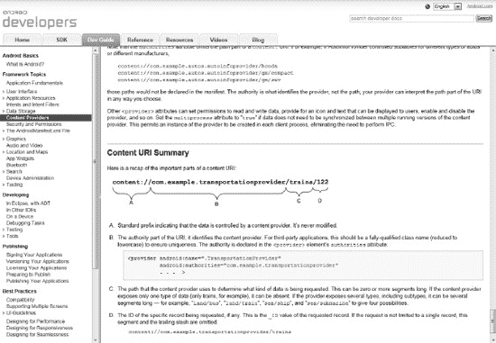

***图 3-1。**安卓内容供应器描述*

另一个值得花时间阅读的地方是用户界面指南部分。任何以某种方式与用户交互的程序都应该努力遵守谷歌在按钮、图标和文本输入方面的惯例。SL4A 提供了对大量用户界面元素的访问，您最好花些时间了解如何以及何时使用它们。一个很好的例子是什么时候使用上下文菜单，什么时候使用选项菜单。一个*选项菜单*通常在用户按下菜单按钮时出现，而一个*上下文菜单*类似于你在桌面操作系统上右击鼠标时得到的菜单。在 Android 上，长按或触摸并保持动作等同于用鼠标右键单击。

在第二章的[中，我介绍了一个名为`makeToast`的 Android 实用函数。这个小函数创建了一个短的弹出消息，出现在屏幕上，但没有获得焦点或暂停当前活动。它是通知标题下的一类消息的一部分。一个*吐司通知*是给用户反馈他们刚刚做的事情的一个简单方法，比如设置一个闹钟在特定的时间响起。Android 还支持状态栏通知，以便在系统的状态栏中添加图标和可选的短消息，以及通知窗口中的扩展消息。你也可以发出声音或振动来给予额外的反馈。](02.html#ch2)

对话框是其他值得一读的用户界面元素。DatePickerDialog 和 TimePickerDialog 是两个特殊的对话框，使在小屏幕上输入日期和时间变得更加容易。ProgressDialog 是一个用户反馈元素，用于为长期运行的活动提供进度信息。毫无疑问，AlertDialog 是所有对话框中最灵活的，也可能是最常用的。警告对话框还可以包含项目列表、复选框和单选按钮。[图 3-2](#fig_3_2) 显示了一个带有文本和按钮的警告对话框。

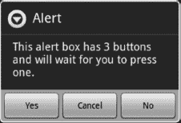

***图 3-2。**带有文本和按钮的警告对话框*

文档中另一个有趣的地方是 WebView。如果你想建立一个除了按钮和对话框之外的用户界面，你必须使用 WebView。在第 9 章中，我会花很多时间讨论如何使用 WebView 构建界面，所以理解这些基础知识会有所帮助。

### 检查不同的 SDK 组件

如果您查看安装 Android SDK 的目录树，您应该会看到包含文档、示例代码和许多工具的文件夹列表。还有一个名为`market_licensing`的目录，里面有关于如何销售你完成的应用的信息。在 SDK 的第 8 版中，Google 对目录结构做了一些更改，影响了一些更常用工具的位置。如果您为以前安装的 SDK 版本设置了快捷方式或修改了路径，您将需要更改目标目录。

[图 3-3](#fig_3_3) 显示了 Windows 7 机器上顶层目录的屏幕截图。这显示了安装在 64 位版本的 Windows 7 上的 32 位 SDK，因此有了`Program Files (x86)`父目录。

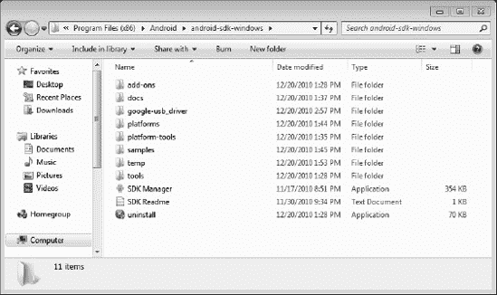

***图 3-3。**Windows 上的 Android SDK 文件结构*

如果您想要在 Windows 上创建 SDK 管理器应用的快捷方式，请确保在`android-sdk-windows`目录中右键单击 SDK 管理器应用，将其拖到桌面上，然后选择在此处创建快捷方式。如果你不这样做，你将会移动应用或者复制一个不能在桌面上运行的应用。

导航到 tools 子目录将显示许多可执行文件。第一个也可以说是最重要的是 Android 调试桥(ADB)工具。您可以使用 ADB 将文件从本地机器移动到设备，就像从命令行复制文件一样。我将在本章的稍后部分深入研究 ADB。SDK Manager 应用是您进行 SDK 更新、创建和启动虚拟设备以及查找第三方插件的起点。

### 使用 Android 模拟器进行测试

在使用 Android 模拟器之前，您必须做的第一件事是配置一个目标设备。Android 虚拟设备(AVD)由许多不同的文件组成，包括配置和虚拟存储，仿真器需要这些文件来完成工作。您可以根据需要创建任意数量的 avd 来模拟不同的设备。创建 AVD 最简单的方法是使用 SDK 和 AVD 管理器应用，如图 3-4 所示。

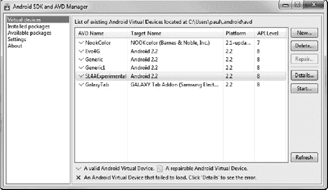

***图 3-4。** Android SDK 和 AVD 管理器工具*

要开始创建新的 AVD，只需单击 new 按钮。这将弹出一个对话框，如[图 3-5](#fig_3_5) 所示。你要做的第一件事是给你的新 AVD 一个名字。您应该使其具有描述性，但是名称不能有任何空格。选择名称后，您必须选择一个目标环境。最后，你需要为你的 SD 卡选择一个尺寸。如果您专门使用它来测试 SL4A，应该不需要太多空间。本例中使用了 100 MB 的值。

 **提示**三星 Galaxy Tab 等其他目标设备可通过 SDK Manager 获得，而其他设备可能直接从供应商处获得，如 Barnes & Noble Nook Color。您还可以修改其中一个通用设备，以适应真实设备的功能，如硬件键盘或特定的屏幕尺寸。

屏幕分辨率将默认为内置设备之一，除非您选中分辨率单选按钮并指定具体尺寸。要添加或删除硬件功能，请单击硬件部分旁边的新建按钮，并从下拉列表中选择一项功能。要删除键盘等功能，首先通过单击“新建”按钮添加键盘支持，然后通过单击“值”列并选择“否”来更改其值

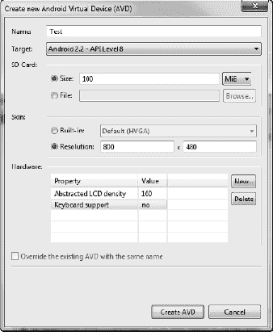

***图 3-5。**新的 AVD 对话框*

您可以从 SDK 管理器屏幕启动任何已定义的 avd，方法是选择您的设备，然后单击启动按钮。这将打开另一个对话框，让您有机会在它开始之前设置一些选项。您想要更改的选项之一是“将显示比例调整为实际大小”复选框。这将启用“屏幕大小”和“监视器 DPI”文本框，您可以在其中选择希望模拟器在屏幕上显示的大小。这将取决于您的实际显示器尺寸，尽管我发现对于典型的 20 英寸显示器来说，10 英寸是个不错的选择。

最后一个复选框“擦除用户数据”为您提供了一种快速启动虚拟设备的方法，无需任何先前会话中的数据。此功能允许您测试首次运行时行为不同于正常行为的应用，而无需每次都重新创建新的 AVD。[图 3-6](#fig_3_6) 显示了屏幕尺寸选项设置为十英寸时该对话框的样子。

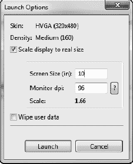

***图 3-6。** AVD 启动选项对话框*

对于带键盘的设备，从主机键盘到设备上的操作有一组标准的映射。[表 3-1](#tab_3_1) 显示了保存在`default.keyset`文件主目录下的`.android`子目录中的默认定义集。您可以通过编辑`default.keyset`文件或创建您自己的`keyset`文件，然后在模拟器命令行上添加`–keyset`选项来更改这些设置。

***表 3-1。**仿真器键映射*

<colgroup><col align="left" valign="top" width="25%"> <col align="left" valign="top" width="65%"></colgroup> 
| `BUTTON_CALL` | 第三子代 |
| :-- | :-- |
| `BUTTON_HANGUP` | 法乐四联症 |
| `BUTTON_HOME` | 主页 |
| `BUTTON_BACK` | 逃跑 |
| `BUTTON_MENU` | F2， 页面上传 |
| `BUTTON_STAR` | Shift+F2，向下翻页 |
| `BUTTON_POWER` | F7 |
| `BUTTON_SEARCH` | F5 |
| `BUTTON_CAMERA` | Ctrl+小键盘 _5，Ctrl+F3 |
| `BUTTON_VOLUME_UP` | 小键盘+Ctrl+F5 |
| `BUTTON_VOLUME_DOWN` | 键盘减号，Ctrl+F6 |
| `TOGGLE_NETWORK` | F8 |
| `TOGGLE_TRACING` | F9 |
| `TOGGLE_FULLSCREEN` | Alt-Enter |
| `BUTTON_DPAD_CENTER` | 键盘 _5 |
| `BUTTON_DPAD_UP` | 键盘 _8 |
| `BUTTON_DPAD_LEFT` | 键盘 _4 |
| `BUTTON_DPAD_RIGHT` | 键盘 _6 |
| `BUTTON_DPAD_DOWN` | 键盘 _2 |
| `TOGGLE_TRACKBALL` | F6 |
| `SHOW_TRACKBALL` | 删除 |
| `CHANGE_LAYOUT_PREV` | 键盘 _7，Ctrl+F11 |
| `CHANGE_LAYOUT_NEXT` | 键盘 _9，Ctrl+F12 |
| `ONION_ALPHA_UP` | 键盘 _ 乘法 |
| `ONION_ALPHA_DOWN` | 键盘 _ 除法 |

用键盘启动一个普通的 AVD 将会弹出一个类似于[图 3-7](#fig_3_7) 的屏幕。

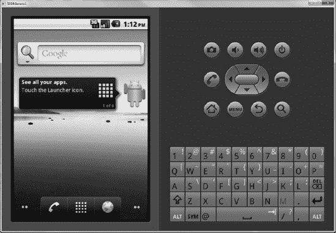

***图 3-7。**通用仿真窗口*

除了一些小的例外，模拟器应该像真实设备一样工作。您应该记住电脑键盘上的哪些键是模拟硬件按钮键的，因为您会经常使用它们。默认情况下，PC 到设备的映射是 Home 到 Home，F2 到 Menu，Esc 到 Back，F5 到 Search。电脑上的鼠标取代了你在真实设备上的手指。左击鼠标与触摸或按压屏幕是一样的。如果您点击屏幕底部中间类似棋盘的图标，您将启动如图[图 3-8](#fig_3_8) 所示的应用屏幕。

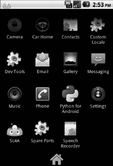

***图 3-8。**模拟器应用启动屏幕*

要查看通知区域中的消息，您首先必须在设备屏幕顶部附近，在与信号强度、电池电量和时间图标相同的白色条区域中单击并按住鼠标。接下来，用鼠标像用手指一样向下拖动。这类似于拉下窗帘。该动作将随时显示通知窗口，如果没有通知，则显示“无通知”消息。同样的技术可以用来模拟从左到右的滑动，反之亦然，使用鼠标点击、按住并拖动仿真器设备屏幕。

蓝牙在模拟器中不起作用，所以如果你需要使用蓝牙进行测试，你必须在真实的设备上进行。WiFi 也是没有的。模拟器支持 3G 数据连接，这意味着你可以连接到互联网。您可以通过选择联系人或直接输入电话号码来模拟呼叫。所有呼叫都显示在呼叫日志中，为您提供了另一个测试数据源。虽然您可以模拟拨打和接听电话，但没有真正的语音功能，所以不要期望实际拨打真正的电话。这也意味着你不能在模拟器上测试任何语音识别功能。

出于测试目的，您可能需要在模拟器上配置电子邮件帐户，这就像在真实设备上一样。[图 3-9](#fig_3_9) 显示了首次启动应用时的打开屏幕。

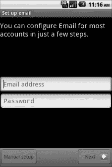

***图 3-9。**模拟器电子邮件配置屏幕*

要配置 Gmail 帐户，请输入您的完整地址，包括`[@gmail.com](http://@gmail.com)`部分。输入密码后，单击“下一步”按钮。如果您输入的信息正确，您应该会看到一个屏幕，要求您输入一个(可选的)帐户名称和一个要添加到外发邮件中的名称(签名)。

为了方便起见，您可以在模拟器主屏幕上添加一个指向 SL4A 应用和脚本文件夹的快捷方式。为此，单击并按住主屏幕上的任意位置。这将启动添加到主屏幕对话框。此时，您可以选择添加快捷方式、小工具、文件夹或壁纸。选择快捷方式条目，为 SL4A 应用添加一个快捷方式。这将显示另一个对话框，其中包含所有支持快捷方式的可用应用和操作。选择应用，并从选择活动对话框中选择 SL4A。

另一种快速访问脚本的简便方法是在主屏幕上添加一个文件夹。除了从“添加到主目录”对话框中选择“文件夹”之外，您的操作方式与添加快捷方式相同。选择文件夹后，您应该会看到一个标有“选择文件夹”的新对话框，其中包含可用文件夹的列表。选择标记为 Scripts 的条目，您应该已经准备好了。现在，当您点击主屏幕上的脚本图标时，您应该会看到类似图 3-10 的屏幕。这将显示该文件夹中所有脚本的列表，并让您一键访问运行它们。我将在第八章的[中使用这个特性来构建一个方便的手机设置脚本，只需点击两下就可以改变多个设置。](08.html#ch8)

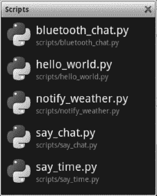

***图 3-10。**主屏幕脚本文件夹*

另一个不能在模拟器上运行的是实时短信。你可以打开消息应用，输入一条消息，但实际上什么也不会发出。如果您需要进行测试，它将使用传出消息填充数据库。要模拟一条短信，你必须使用 ADB 工具，这是下一个讨论的话题。

#### 安卓调试桥

[第 2 章](02.html#ch2)对 Android Debug Bridge (ADB)有一个简单的介绍，但实际上只是刷了一下你可以用这个工具做的事情的表面。亚行实际上需要三个独立的组成部分来完成它的工作。在您的开发机器上，ADB 由一个客户端和一个服务器组成。ADB 服务器处理运行在开发机器上的客户机和运行在仿真器或目标设备上的守护进程之间的所有通信。

命令行选项用于指示 ADB 执行特定任务。[表 3-2](#tab_3_2) 给出了这些命令的简要描述。对于安装、同步和卸载命令，有一些选项可用于修改命令的行为方式。如果您碰巧运行了一个仿真器并且连接了一个真实的设备，那么您必须指定您希望 ADB 命令在哪里执行。要将 ADB 命令导向真实设备，使用选项`–d`，对于仿真器，使用`–e`。

***表 3-2。**亚行命令列表*

<colgroup><col align="left" valign="top" width="30%"> <col align="left" valign="top" width="65%"></colgroup> 
| `adb push <local> <remote>` | 将文件/目录复制到设备 |
| :-- | :-- |
| `adb pull <remote> [<local>]` | 从设备复制文件/目录 |
| `adb sync [ <directory> ]` | 仅在发生更改时复制主机->设备(-l 表示列出但不复制) |
| `adb shell` | 交互式运行远程 shell |
| `adb push <local> <remote>` | 将文件/目录复制到设备 |
| `adb shell <command>` | 运行远程 shell 命令 |
| `adb emu <command>` | 运行仿真器控制台命令 |
| `adb logcat [ <filter-spec> ]` | 查看设备日志 |
| `adb forward <local> <remote>` | 前向插座连接
前向规格如下:
`tcp:<port>
localabstract:<unix domain socket name>
localreserved:<unix domain socket name>
localfilesystem:<unix domain socket name>
dev:<character device name>
jdwp:<process pid>`(仅远程) |
| `adb jdwp` | 列出主持 JDWP 传输的进程的 PID |
| `adb install [-l] [-r] [-s] <file>` | 将此包文件推送到设备上并安装
( `-l`表示正向锁定 app)
( `-r`表示重新安装 app，保留其数据)
( `-s`表示安装在 SD 卡上，而不是内部存储) |
| `adb uninstall [-k] <package>` | 从设备
中移除此应用包(`-k`表示保留数据和缓存目录) |
| `adb bugreport` | 返回设备中应包含在错误报告中的所有信息 |
| `adb help` | 显示此帮助消息 |
| `adb version` | 显示版本号 |

##### 文件和应用

有三个命令用于处理主机与仿真器或物理设备之间的文件复制。`push`将文件从主机拷贝到目标，而`pull`将文件从目标拷贝到主机。`sync`尝试在主机和目标上的目录之间同步文件。您也可以将`-l`选项传递给`sync`，它将简单地列出目录的内容。

将`.apk`文件安装或卸载到仿真器或物理设备分别使用 adb `install`或`uninstall`命令。`install`命令的选项包括`-l`向前锁定应用、`-r`重新安装保留所有旧数据，以及`-s`将应用安装在 SD 卡上而不是内部设备存储上。

 **提示**您可以使用 adb `push`工具在仿真设备上快速加载触点以进行测试。如果您在 Gmail 帐户中存储了联系人，您可以轻松地将其导出到 vCard 文件，然后使用 adb `push`将其移动到设备上的 SD 卡中。剩下的就是启动通讯录，从 SD 卡导入 vCard 文件。

##### 贝壳

adb `shell`命令提供了一种向设备发送 shell 命令并显示结果或在本地启动交互式 shell 的方法。您可以使用`shell`命令来自动测试一个设备。这使用了`shell input keyevent`和`sendevent`命令。Input 是一个应用，它位于设备的`/system/bin`目录中，可以模拟任何类型的键盘输入。您可以使用以下命令推送文本字符串:

`adb shell input text "ANDROID"`

要模拟在物理或虚拟键盘上按键，请在输入命令中使用`keyevent`限定符，并使用一个整数来表示您希望调用的特定键码。键码列表如[表 3-3](#tab_3_3) 所示。您可以通过以下方式模拟按下菜单键:

`adb shell input keyevent 1`

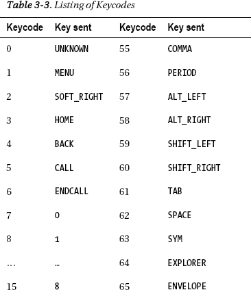

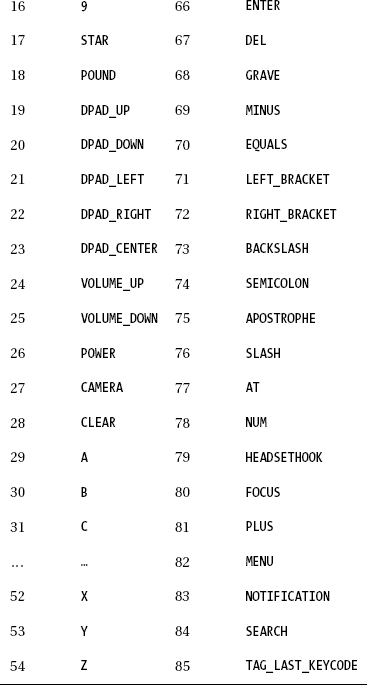

如果您计划开发任何与电话功能交互的应用(发起电话呼叫；发送或接收 SMS 消息)，您必须使用`telnet`命令连接到仿真器控制台。在 Windows 7 上，默认情况下没有安装 Telnet 程序。幸运的是，它是操作系统的一部分，只需启用即可。要启用 Telnet，您必须打开控制面板并选择程序类别。这将弹出一个类似于[图 3-11](#fig_3_11) 的窗口。您也可以通过按 Windows 键并键入单词**功能**来直接启动 Windows 功能对话框。这将显示一个选项列表，包括标题“控制面板”下的几个选项。选择“打开或关闭 Windows 功能”项将弹出如图 3-12 所示的对话框。

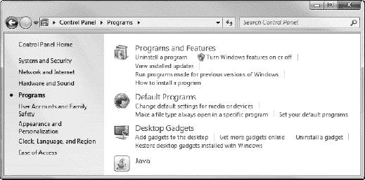

***图 3-11。** Windows 7 控制面板程序页面*

要启用 Telnet 客户端程序，只需在 Windows 功能对话框中单击 Telnet 客户端旁边的复选框。如图[图 3-12](#fig_3_12) 所示。如果您希望您的计算机也作为 Telnet 服务器，您可以选中 Telnet 服务器框，尽管出于安全原因，大多数 Windows 防火墙会阻止传入的 Telnet 流量。

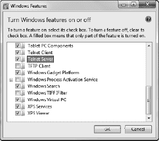

***图 3-12。** Windows 7 功能对话框*

假设您已经使用正常的默认值启动了一个 ADB 设备，您可以在 Linux 或 Mac OS X 上使用以下命令从终端窗口或 Windows 的命令提示符启动一个 telnet 会话:

`telnet localhost 5554`

现在，您可以直接向设备发出命令了。[图 3-13](#fig_3_13) 显示了 telnet 会话开始时`help`命令的输出。

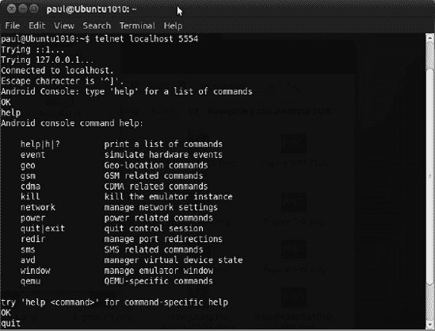

***图 3-13。**在 Linux 上 Telnet 会话到仿真器*

模拟传入的 SMS 消息需要如下命令:

`sms send 3015551212 "This is a test SMS message from Telnet"`

在模拟器上，您应该会看到一条消息。打开消息应用，您应该会看到类似[图 3-14](#fig_3_14) 的内容。

***图 3-14。**显示模拟短信的短信应用*

为了测试基于位置的应用，您可以使用`geo`命令，它将发送一个 GPS NMEA 语句或一个简单的 GPS 定位。这两个命令如下所示:

`geo fix -82.411629 28.054553

geo nmea $GPGGA,001431.092,0118.2653,N,10351.1359,E,0,00,,-19.6,M,4.1,M,,0000*5B`

如果除了模拟当前的纬度和经度之外，您还想做任何事情，您将不得不使用`NMEA`命令。`$GPGGA`代码代表*全球定位系统定位数据*。字段从左到右依次是句子标识符($ `GPGGA`)、时间(`00:14:31.092`)、纬度、北纬、经度(103 度 51 分 13.59 秒)、卫星数量、水平精度因子(HDOP)、海拔高度、WGS84 椭球面上方的大地水准面高度、自上次 DGPS 更新以来的时间、DGPS 参考站 id 和校验和。

有一个 shell 命令允许您在模拟器上更改日期和时间。如果您正在测试任何基于时间的逻辑，如警报或运行时间应用，这将非常方便:

`adb shell date secs`

使用这个命令的唯一缺点是，您必须输入自 1970 年 1 月 1 日以来的秒数；也称为 *UNIX 纪元*。在 Linux 或 Mac OS X 终端提示符下，可以使用以下命令来确定当前时间的秒值:

`date +%s`

作为 Python 标准库的一部分，Python 语言有许多方便的特性和功能。Python 只用几行代码就能处理时间和日期操作。下面是一个将任何日期和时间转换成正确的秒值的简短脚本:

***清单 3-1。** Python 纪元时间转换器*

`#!/usr/bin/python
#-----------------------------
# This script will convert arg1 (Date) and arg2 (Time) to Epoch Seconds
#
import sys, time, datetime

if len(sys.argv) < 3:
print "Usage pyEpoch YYYY-MM-DD HH:MM"
else:
intime = sys.argv[1] + " " + sys.argv[2]

t = time.strptime(intime, "%Y-%m-%d %H:%M")
t = datetime.datetime(*t[:6])
print "Epoch Seconds:", time.mktime(t.timetuple())`

在谷歌上快速搜索 **UNIX 纪元转换器**，会出现几个可以转换日期和秒的网站。请注意，执行该命令将会生成一条错误消息，指出`settimeofday`失败了，但它确实工作了。[图 3-15](#fig_3_15) 显示了一个设置了若干时间的 Windows 命令提示符，并使用不带参数的相同日期命令读取时间，以显示当前时间。

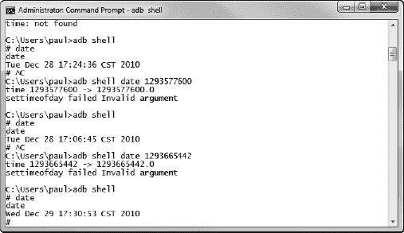

***图 3-15。**用 shell 命令设置仿真器日期*

您可以使用 ActivityManager 的命令行界面启动模拟器上的任何应用，如下所示:

`adb shell am start command`

[图 3-16](#fig_3_16) 显示了当您在 telnet 提示符下输入 **am** 时所给出的帮助输出。

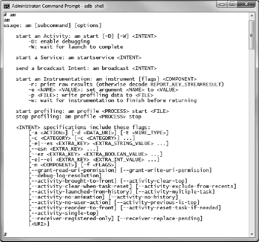

***图 3-16。**使用 shell am 命令在模拟器上启动活动*

要启动 web 浏览器，您可以使用以下命令:

`adb shell am start 'http://www.google.com'`

命令`adb shell dumpsys`提供了关于任何连接的 Android 设备的当前状态的几乎所有信息。如果你在模拟器上运行这个命令，你会得到一个可用子命令的列表，如[表 3-4](#tab_3_4) 所示。

***表 3-4。**dump sys 子命令列表*

<colgroup><col align="left" valign="top" width="32%"> <col align="left" valign="top" width="32%"> <col align="left" valign="top" width="31%"></colgroup> 
| `SurfaceFlinger` | `accessibility` | `account` |
| :-- | :-- | :-- |
| `activity` | `alarm` | `appwidget` |
| `audio` | `backup` | `battery` |
| `batteryinfo` | `clipboard` | `connectivity` |
| `content` | `cpuinfo` | `device_policy` |
| `devicestoragemonitor` | `diskstats` | `dropbox` |
| `entropy` | `hardware` | `input_method` |
| `iphonesubinfo` | `isms` | `location` |
| `media.audio_flinger` | `media.audio_policy` | `media.camera` |
| `media.player` | `meminfo` | `mount` |
| `netstat` | `network_management` | `notification` |
| `package` | `permission` | `phone` |
| `power` | `search` | `sensor` |
| `simphonebook` | `statusbar` | `telephony.registry` |
| `throttle` | `uimode` | `usagestats` |
| `vibrator` | `wallpaper` | `wifi` |
| `window` |  |  |

对于模拟器，命令`adb shell dumpsys battery`的输出如下所示:

`Current Battery Service state:
AC powered: true
USB powered: false
status: 2
health: 2
present: true
level: 50`
`scale: 100
voltage:0
temperature: 0
technology: Li-ion`

另一个有趣的子命令是`location`。如果您查看模拟器的命令`adb shell dumpsys location`的输出，您不会看到太多。在真实设备上运行同样的命令，你会看到各种信息。如果您检查命令`adb shell dumpsys activity`的输出，您会看到一长串关于设备当前活动状态的信息。

您可以通过`command adb shell dumpsys package`获得由`PackageManagerService`维护的信息列表。这个命令的输出有许多不同的部分，第一部分是活动解析器表。本节包含 MIME 类型、非数据动作和 MIME 类型动作的列表，以及用于启动特定动作的意图。非数据操作启动不需要任何数据即可启动的活动。其中一个例子就是`com.android.contacts.action.LIST_ALL_CONTACTS`。从名称上看，这种意图的行为相当明显，但是您可以看到使用该命令的结果:

`adb shell am start –a com.android.contacts.action.LIST_ALL_CONTACTS`

要通过意图机制启动更复杂的操作，必须指定许多不同的字段。如图 3-16 中的[所示，你有许多选项可用，包括`-a`指定动作、`-c`指定类别、`-d`指定数据 URI、`-t`指定 MIME 类型、`-e`指定附加项目。您可以使用以下命令启动联系人应用来添加条目:](#fig_3_16)

`adb shell am start -a android.intent.action.INSERT -d 'content://contacts/people' -t
'vnd.android.cursor.dir/person' -c 'android.intent.category.DEFAULT' -e 'name' 'Paul'
-e 'phone' '1112223333'`

在这一点上，你可能想参考 Android 开发者文档，并仔细阅读 Intent 主题。理解如何使用意图来启动一个活动将会让你洞察到你需要为你的应用提供什么。虽然您可以使用 ADB 工具从命令行启动几乎任何 Android 活动，但是您也可以以编程方式启动活动。后面的章节将使用这一概念来构建脚本以自动化多个活动。

同样的技术可用于启动 SL4A 来执行脚本，如下所示:

`am start -a
com.googlecode.android_scripting.action.LAUNCH_FOREGROUND_SCRIPT -n
com.googlecode.android_scripting/.activity.ScriptingLayerServiceLauncher -e
com.googlecode.android_scripting.extra.SCRIPT_PATH
“/sdcard/sl4a/scripts/hello_world.py"`

在下一章中，我将向您展示如何使用 Eclipse 将解决方案自动部署到模拟器或目标设备并启动它。我发现最后一个非常有用的命令将在设备上启动一个私有服务器来启用远程调试:

`adb shell am start -a com.googlecode.android_scripting.action.LAUNCH_SERVER -n
com.googlecode.android_scripting/.activity.ScriptingLayerServiceLauncher`

##### 日志猫

`logcat`是 ADB 命令的名称，用于从仿真器或硬件设备转储或抓取当前日志文件。如果您在 Windows 的命令提示符下或者在 Linux 或 Mac OS X 的终端窗口中键入该命令，它将转储当前日志并继续显示新条目，直到您按 Ctrl+C 停止它。该工具将帮助您调试意外停止且没有错误的应用。它也可以从 Eclipse 窗口中获得，您将在下一章中看到。

#### 达尔维克调试监控服务(DDMS)

DDMS 是 ADB 的补充工具，实际上使用 ADB 主机服务器到设备守护进程进行所有通信。如果您在不同的目录中使用 ADB 工具从 SDK 版本升级，这将变得非常明显。图 3-17 显示了当前连接了仿真器和物理设备的 DDMS 用户界面。

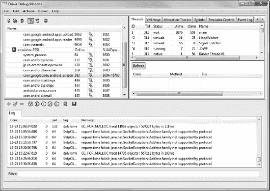

***图 3-17。** DDMS 显示*

DDMS 有许多你想了解更多的特色。一个是设备菜单中的文件浏览器工具。要浏览特定设备上的文件，请在 DDMS 应用的左上方窗格中选择该设备，然后打开文件浏览器。请注意，您将无法在普通设备上看到系统区域中的任何文件，因为它们受到保护。如果设备已经被根目录化，您将能够看到这些文件。术语*root*是指通过使用第三方应用或一些其他非重要方法获得对设备的 root 访问权限。大多数设备都将系统文件区设置为只读，因此用户不能进行任何更改。在仿真设备上允许完全浏览，看起来有点像[图 3-18](#fig_3_18) 。这里您可以看到联系人数据库，它实际上是一个 SQLite 数据库文件。

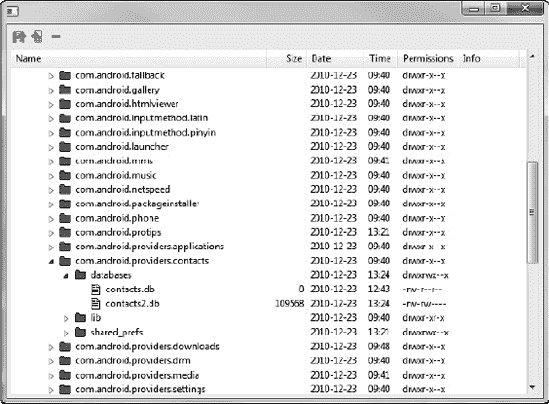

***图 3-18。** DDMS 文件浏览器*

您可以通过选择屏幕截图从 DDMS 设备菜单中截取任何已连接设备的屏幕截图。如果您正在编写关于特定应用的文档，并且需要包含屏幕图像，这个特性就非常方便。[图 3-19](#fig_3_19) 显示了一个使用 SL4A 发行版中`hello_world.py`文件的 DDMS 的示例屏幕截图。

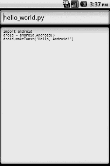

***图 3-19。** DDMS 截屏示例*

在下一章中，我将向您展示这些工具如何直接与 Eclipse 集成，以提供您为 Android 编写、测试、调试和部署任何应用所需的一切。

### 总结

本章重点介绍了如何完全安装和配置 Android SDK，使其更易于在仿真和真实设备上开发和测试。这里讨论的许多工具和概念将在以后用于帮助简化开发过程，并且在某些情况下，自动化开发过程。下一章将介绍使用 Eclipse 和 Android 开发工具包(ADT)作为主要开发平台。

以下是本章的要点:

*   Android SDK :它真的很大，可能比你想象的要多，但是它确实有很多工具，比如 ADB、设备模拟器和 DDMS，这些都非常有用
*   **Linux 命令行**:如果你不习惯在 Linux 命令行或 Windows DOS 提示符下输入命令，你可能需要花些时间阅读一下这个主题。许多像 ADB 这样的工具使用命令行来完成任务，您也可以学习如何利用它们。
*   使用模拟器:模拟器最大的好处是你可以删除它，然后重新开始。模拟器应该可以很好地处理您想要尝试的许多事情。在真实设备上尝试之前，最好在模拟器上测试一些东西。不要害怕删除一个模拟器，并重新开始，如果它变得非常慢或似乎不能正常工作。
*   **使用批处理/脚本文件**:我做的第一件事就是在 Windows 上写几个批处理脚本来做一些事情，比如在设备上启动一个私有服务器，将文件复制到正确的目录。如果您正在进行任何数量的编码和测试，您会希望身边有一些这样的脚本。