## T1】C H A P T E R 4

## 用 Eclipse 开发

本章将带您完成 Eclipse 的安装、配置和开发。

 **注意**虽然 Eclipse 可以在 Linux、Mac OS X 和 Windows 上工作，但本章将使用 Windows 作为主要的开发环境。

好吧。我们开始吧。以下是我将在本章中介绍的内容:

*   在开发机器上安装 Eclipse
*   使用 Eclipse 基础知识
*   了解 Android 开发工具包
*   使用 Pydev

通过使用这里给出的说明，您将能够在几分钟内安装好 Eclipse，并为生产工作做好准备。我将带您了解 Eclipse 本身以及许多其他插件的基本安装步骤，以帮助我们开发本书中的所有示例。

在这一点上需要指出的是，Eclipse 从一开始就是作为一个用 Java 语言编写的可扩展的集成开发环境(IDE)来开发的。因为它是用 Java 编写的，所以它自动地成为了一个跨平台的应用，事实上，这是从一开始就有的想法。Eclipse 已经发展成为一个庞大的项目，这一点经常会吓跑一些人。

### 在开发机器上安装 Eclipse

Eclipse 有多种风格。选择一个适合你的，在很大程度上是一个品味问题。如果你打算用它来完成本书中的练习，你可以下载经典版。在撰写本书时，当前版本是 3.6.1，代号为 Galileo。对于 Linux 和 Windows，您可以选择 32 位或 64 位下载。对于苹果电脑，你可以选择苹果 OS X(碳纤维)、苹果 OS X(可可 32)或苹果 OS X(可可 64)。选择与您的操作系统相匹配的一个。Eclipse 需要安装 Java 才能工作，所以如果你跳过了[第 2 章](02.html#ch2)中关于下载和安装 Java 的部分，你需要现在就回去做。Eclipse 发布在一个单独的`.zip`文件中，这意味着安装程序所要做的就是解压文件内容。在 Windows Vista 和 Windows 7 上，您可以双击`.zip`文件，Windows 资源管理器将打开，让您选择提取所有文件，如图 4-1 中的[所示。](#fig_4_1)

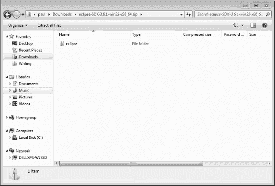

***图 4-1。** Eclipse SDK 安装*

一旦有了一个解压了所有 Eclipse 文件的目录，您应该能够通过双击`Eclipse.exe`文件在 Windows 中启动程序。你可能想在桌面上创建一个快捷方式，因为这将是一个经常使用的应用。记住使用右键单击 Create Shortcut Here 方法来确保 Eclipse 能够正常启动。第一次运行 Eclipse 时，你会看到一个类似于图 4-2 中的对话框屏幕，提示你选择存储项目文件的位置。这在 Eclipse 中称为工作区。您可以选择默认目录，如果您选中“将此目录用作默认目录”旁边的框并且不再询问，它将成为永久默认目录。如果不选择这个框，那么每次启动 Eclipse 时，都会提示您选择一个工作区。

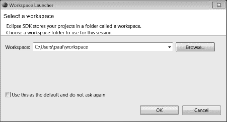

***图 4-2。**选择工作区目录对话框*

通过选择 Install New Software 选项，在 Eclipse 的 Help 菜单中安装插件模块。这将打开图 4-3 中[所示的对话框。每个附加组件通常是从互联网上的默认存储库中安装的。这使得保持最新更新和安装最新版本变得更加容易。要添加新的存储库，请单击标记为“使用”的文本框旁边的“添加”按钮。您也可以在同一个文本框中输入 URL，Eclipse 安装程序将会到那个地址寻找附加包。](#fig_4_3)[图 4-3](#fig_4_3) 显示了为 Eclipse 的 Android 开发工具(ADT)插件输入 URL 的结果。如果您使用 Add 按钮，您将有机会命名存储库。ADT 的 URL 是

`[https://dl-ssl.google.com/android/eclipse](https://dl-ssl.google.com/android/eclipse)`

您必须选择开发人员工具行下面的单个选项，或者只需选中开发人员工具旁边的复选框即可全选。一旦下载完成，您将被指示重启 Eclipse 以使更改生效。如果您不记得您安装了什么，只需选中“隐藏已安装的项目”旁边的框，您将看到所有新项目。如果您想查看已安装内容的列表，可以单击“已安装”链接。还有一个名为 Available Software Sites 的链接，它会将您带到一个预定义的附加站点列表。

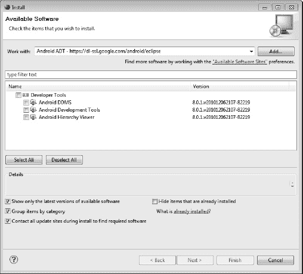

***图 4-3。** ADT 安装对话框*

您想要安装的下一个附加组件是 Pydev。使用 Eclipse 和 Pydev 编写和调试 Python 代码是一种真正的集成开发体验。稍后我将带您了解如何使用 Pydev。现在，再次从帮助菜单打开软件更新屏幕。这次我们将为 Pydev 更新站点输入另一个 URL。它应该如下所示:

`[http://Pydev.org/updates](http://Pydev.org/updates)`

[图 4-4](#fig_4_4) 显示了进入`pydev.org`网址后你会看到的对话框。

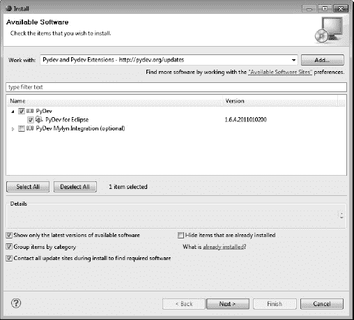

***图 4-4。** Pydev 安装对话框*

本书练习所需的最后一个 Eclipse 插件是 Aptana Studio。它在编辑 HTML、CSS 和 JavaScript 方面大放异彩。使用与 ADT 和 Pydev 相同的过程，在标签 Work with 旁边的文本框中输入以下行:

`[http://download.aptana.com/tools/studio/plugin/install/studio](http://download.aptana.com/tools/studio/plugin/install/studio)`

这将在可用站点列表中创建一个新条目，并显示另一个对话框，您可以在其中选择并下载加载项。

定期检查 Eclipse 和附加组件的更新是一个好主意。您可以通过从“帮助”菜单中选择“检查更新”来完成此操作。如果发现任何更新，您将会看到一个类似于图 4-5 中的对话框。这个特别的更新是针对 Ubuntu 系统上的 Pydev 的。

***图 4-5。**可用更新对话框*

### Eclipse 基础知识

Eclipse 是一个巨大的应用，具有许多功能和选项。整本书都是关于使用 Eclipse 开发复杂应用的。第一次启动 Eclipse 时，你会看到一个欢迎屏幕，如图 4-6 所示。教程和示例项目是专门针对 Java 开发人员的。尽管阅读它们不会伤害你，但你可能想暂时跳过它们，因为它们并不真正适用于手头的主题。

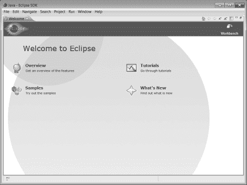

***图 4-6。**月食欢迎画面*

如果单击 Overview 项，将会打开另一个屏幕，其中有四个主题:工作台基础、Java 开发、团队支持和 Eclipse 插件开发。对本书来说，唯一真正重要的是工作台基础知识主题。点击此项将启动 Eclipse 帮助系统，如图[图 4-7](#fig_4_7) 所示。如果您展开入门部分，您会发现一个详细的教程，其中涵盖了浏览 Eclipse 需要知道的所有基本操作。如果您以前没有使用过 Eclipse，那么花时间研究一下教程材料是非常值得的。

Eclipse 使用许多基本概念和术语来处理程序的不同功能和操作。*工作台*是用来标识 Eclipse 应用的整个窗口的术语。工作台窗口通常包含多个带有编辑器和视图的子窗口，例如 Project Explorer。当您打开其他窗口时，它们将包含编辑器或视图。Eclipse 还支持窗口中的多个选项卡，因此您可以在同一个编辑器窗口中打开多个文件。使用帮助菜单可以随时导航回欢迎页面。

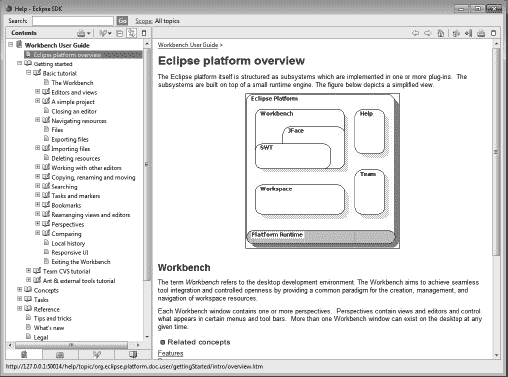

***图 4-7。**月食帮助屏幕*

#### 视角

从程序使用者的角度来看，视角的概念更容易理解。每个人都会把自己的观点或偏好带到任何活动中。透视图实际上只不过是菜单和窗口在任何时候都打开的个人偏好。Eclipse 对透视图的定义是“一组视图和编辑器(部件)的可视容器”(`[http://www.eclipse.org/articles/using-perspectives/PerspectiveArticle.html](http://www.eclipse.org/articles/using-perspectives/PerspectiveArticle.html)`)。Eclipse 附带了许多已经为典型用途配置的透视图，比如编写代码。当您的活动发生变化时，您会切换到不同的视角，例如当您从编码切换到调试时。[图 4-8](#fig_4_8) 显示了一个典型的 Pydev 透视图。

 **注意**高分辨率的大屏幕显示器提供了大量的空间来运行多窗口 Eclipse。您还可以在多个监视器上运行 Eclipse，并使用分离特性将单个窗口移出工作区容器，移到不同的监视器上。

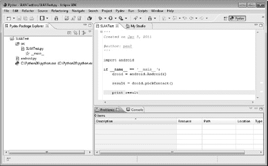

***图 4-8。** Pydev 透视图工作区*

视角可以最大程度地定制。如果您不喜欢某个工具栏，可以将其关闭。每个透视图将特定的窗口加载到屏幕上的默认位置。您可以随意移动这些窗口，根据自己的喜好进行排列。要定制当前透视图，右键单击工作区右上角的名称/图标，并选择 customize。您将看到如图[图 4-9](#fig_4_9) 所示的屏幕。几个选项已经展开，以显示选择之间的差异。

此对话框使您可以完全控制当前透视图的每个方面。如果该屏幕中某个项目旁边的复选框有复选标记，则意味着该项目下的每个选项也被选中。填充复选框的蓝色方框表示该项下的某些选项已被选中，而某些选项未被选中。如果您展开每一项，您会很快看到 Eclipse 有很多选项。在这一点上，最好的方法是调整那些你认为会帮助你更有效率的事情，剩下的就不要管了。

附加选项卡允许您自定义工具栏可见性、菜单可见性(或显示在主工作区窗口顶部的项目)、命令组可用性以及将显示为子菜单项的快捷方式。“按命令组过滤”复选框将打开或关闭对话框左侧的另一个项目列表，显示出现在不同命令组中的选项。

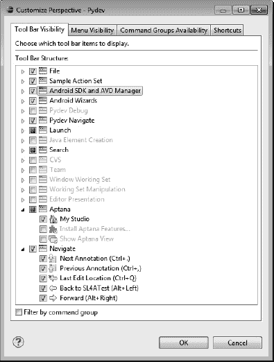

***图 4-9。**自定义透视屏幕*

您可以通过单击右上角带有小加号的看起来像窗口的小图标来快速打开一个新的透视图。它位于屏幕顶部的当前视角指示器旁边。(参见[图 4-8](#fig_4_8) 。)这将弹出如图[图 4-10](#fig_4_10) 所示的打开透视图对话框，其中列出了所有可用的透视图。单击任何项目都会打开该透视图及其所有窗口和视图。

***图 4-10。** Eclipse 打开透视图对话框*

您可以随时改变主意，通过单击 Cancel 按钮返回到当前打开的透视图。

#### 项目

*项目*是收集一个特定应用的所有活动部分的地方。一个项目可以仅仅是一个单独的源文件或者任意数量的不同文件和文件类型。使用文件新建项目或 Alt+Shift+N 组合键创建一个新项目。在 Mac 上，你可以使用 Command+Shift+N。这两种方法都会启动新项目向导(参见[图 4-11](#fig_4_11) )。

选择 General Project 将启动另一个对话框，提示您命名项目，然后在默认工作区目录下创建一个同名的空文件夹。稍后我们将介绍如何创建 Pydev 项目。

***图 4-11。** Eclipse 新项目向导*

### Android 开发工具包

Google 已经尽一切努力来简化为 Android 平台开发应用的过程，包括为 Eclipse 提供 Android 开发工具包(ADT)扩展。创建新项目时的一个选项是 Android Project。这是探索在 Android 平台上使用 Java 开发原生应用的好方法。[图 4-12](#fig_4_12) 显示了新的 Android 项目向导创建了一个名为 MyTestApp 的新项目，该项目基于样本记事本应用。ADT 附带了许多示例应用，以展示如何利用 Android 平台的不同特性。

***图 4-12。**新 Android 项目向导*

当您单击 Finish 按钮时，向导将创建新项目，并将所有示例源代码复制到工作目录中。图 4-13 显示了这个项目在编辑器中的样子。

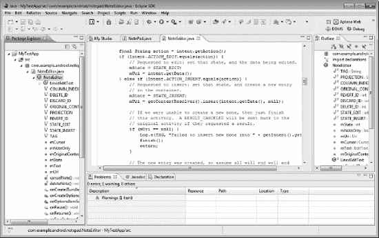

***图 4-13。**用新的 Android 项目向导创建的 MyTestApp】*

此时，您可以单击 Run 图标，Eclipse 将完成编译和部署过程。如果您已经在开发机器上配置了模拟器，它将启动模拟器并将应用推送到设备上。[图 4-14](#fig_4_14) 显示了在通用仿真器上运行的应用。这个过程的美妙之处在于使用 Eclipse 和 ADT 可以快速编译、部署和测试序列。目标是让同样的体验成为可能，但是使用 Python 和 SL4A。

 **提示**在 Eclipse 中，有多种方法可以完成相同的任务。如果你更喜欢点击鼠标，你会发现你需要执行的任何操作都有图标。如果你更喜欢键盘，你也会发现这些。您可以使用本章前面提到的“自定义透视图”对话框来探索不同的选项。

***图 4-14。**运行在通用仿真器上的 MyTestApp】*

其中一个可用的视角被标记为 DDMS。[图 4-15](#fig_4_15) 显示了 MyTestApp 在模拟器中运行时的透视图。这个透视图给你提供了在[第 3 章](03.html#ch3)中讨论的 DDMS 实用程序的完整功能。此透视图打开的窗口包含设备；仿真器控制；Logcat 以及一个选项卡式窗口，可以快速访问线程、堆、分配跟踪器和文件资源管理器。

要查看与 MyTestApp 相关的信息，您必须向下滚动到 Devices 窗口的底部并找到该应用。在这种情况下，它被命名为`com.example.android.notepad`。当你选择这一行时，你将能够看到你曾经想知道的关于一个 Android 应用的一切――以及更多。

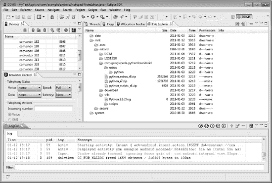

***图 4-15。【MyTestApp 运行时的 DDMS 视角***

在讨论多监视器时，前面提到的一个特性是能够“撕下”任何窗口，并将其拖出主 Eclipse 窗口。[图 4-16](#fig_4_16) 显示了仿真器控制窗口被自己移出后的样子。为此，在窗口标题下左键单击并按住；然后将鼠标拖离 Eclipse 主窗口。如果主窗口最大化，这将不起作用。要关闭窗口，只需单击窗口右上角的 X。要在 Eclipse 中重新打开窗口，请打开窗口菜单。然后从显示视图中，选择要打开的窗口。如果您之前将它从 Eclipse 中分离出来，它将恢复脱离主窗口。您可以使用与取消停靠时相同的方法将它拖回主窗口。如果你只是想回到任何视角的默认设置，在窗口菜单上有一个重置视角选项可以让你回到最初的起点。

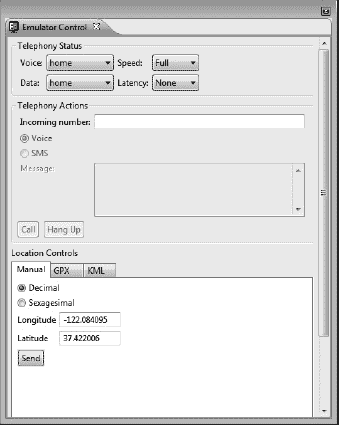

***图 4-16。**与主 Eclipse 窗口分离的仿真器控制窗口*

### 使用 Pydev

Pydev 是一个 Eclipse 插件，它的创建是为了让 Python 开发人员的生活更加轻松。它有许多专门针对 Python 语言的特性，还有快捷方式、模板和它自己的默认透视图。Pydev 最重要的部分可能是它是由 Python 开发者为 Python 开发者创建的。如果你在任何平台上开发 Python 代码，这是你不想离开家不带的工具之一。

Pydev 工作之前必须做的一件事是配置 Python 安装的位置。[图 4-17](#fig_4_17) 显示了从首选项窗口展开的 Pydev 菜单项。您可以在工作区窗口顶部列表的窗口菜单下找到首选项选项。选择解释器- Python 菜单项最初会显示一个空白窗口。这需要配置为指向您的 Python 2.6 解释器安装目录。在 Windows 上，这通常位于路径`C:\Python26`中。在 Ubuntu 10.10 和大多数其他基于 Debian 的发行版上，你会在`/usr/bin/python`中找到 Python 可执行文件。

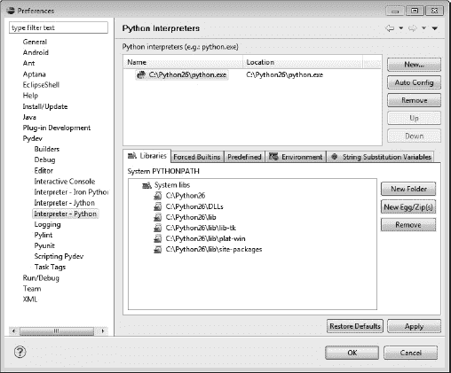

***图 4-17。**配置 Python 解释器的首选项对话框*

安装 Pydev 后，此时您有两个选择:新建 Pydev 项目和新建项目。图 4-18 显示了新的 Pydev 项目屏幕的样子。此对话框中有许多必须设置的项目。在对话框的顶部，您必须输入新项目的名称，该名称将用作默认工作区下的子目录的名称，以及将在项目浏览器窗口中显示的标题。接下来，您必须使用下拉框更改语法版本，并选择 2.6。最后，您应该将解释器设置为指向 Python26 目录，以防您碰巧安装了多个版本的 Python。

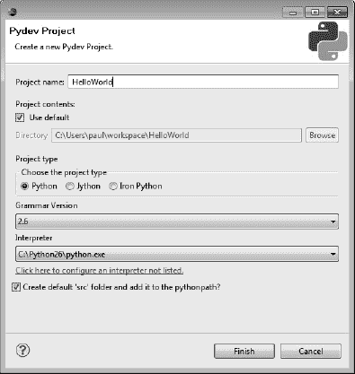

***图 4-18。**新 Pydev 项目对话框*

一旦创建了新项目，您就可以开始输入代码了。Pydev 使用模板来帮助您使用预定义的源代码快速构建代码。您可以使用任何提供的模板或创建自己的模板。您可以在这里放置一些标准的标题注释，包括版权信息、您的姓名以及其他任何可能相关的内容。

如果你想查看所有默认的快捷键，你可以按 Ctrl+Shift+L。这将弹出一个当前定义的所有快捷键的可滚动窗口，如图[图 4-19](#fig_4_19) 所示。就像 Eclipse 中的其他东西一样，您可以从 Preferences 对话框中定义自己的快捷键。如果屏幕上有快捷方式列表，您可以通过再次按 Ctrl+Shift+L 直接跳转到该页面。

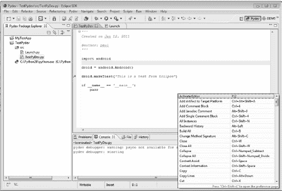

***图 4-19。**快捷显示窗口示例*

Pydev 附带了许多预定义的模板，可以在创建新的源文件时使用，或者快速插入到代码窗口中。当您使用 File  New  Pydev 模块过程创建新的源文件时，您将有机会使用模板文件。这将打开如图[图 4-20](#fig_4_20) 所示的对话框。如果打开了编辑器窗口，可以使用 Ctrl+space 组合键访问模板。这将打开一个窗口，其中列出了可供您插入的潜在代码片段。当任何项目高亮显示时，按回车键将在该点插入代码。

如果您第二次按 Ctrl+space，您将看到此时适用的可用模板列表。这将切换当前列表以显示可用的模板，并在第二个窗口中显示如果您点击 Return 将插入的语句的视图。可通过创建新 Python 模块对话框中显示的配置链接创建新模板。单击此链接将打开首选项对话框，并选择模板选项。

***图 4-20。**新 Pydev 模块对话框*

要定义一个新模板，点击新建按钮并完成图 4-21 所示的对话框。这将允许您在每个 Python 模块的开头创建相同的基本代码时节省击键次数。“插入变量”按钮允许您根据某些变量(如文件路径、文件或模块名称、日期、时间或当前选定的单词)插入文本。

选择模板时，将插入图案窗口中的文本。在这种情况下，您将看到几乎每个 SL4A 应用开头都会出现的代码。Android 模块包括使用远程过程调用(RPC)机制在 SL4A 应用和底层本机 API 之间进行通信的代码。在这种情况下，RPC 调用与伪代理一起使用，在底层 Android 操作系统之间传递信息。这提供了一个额外的安全层，以防止流氓应用在您的设备上做一些邪恶的事情。

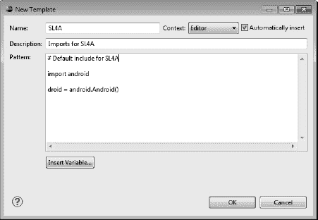

***图 4-21。** Pydev 新模板对话框*

您必须使用 ADB 工具来将 SL4A 应用部署到仿真器或真实设备上。这可以从命令行完成，或者您可以使用少量代码自动完成该过程:

`#!/usr/bin/env python

import subprocess

ADB = r*'C:\Program Files (x86)\Android\android-sdk-windows\platform-tools\adb.exe'*
APPLICATION = *'hello_world.py'*
TARGET = *'/sdcard/sl4a/scripts/'*

def main():
# Upload the application.
subprocess.call([ADB, *'-e'*, *'push'*, APPLICATION, TARGET + APPLICATION])

# Launch the application.
subprocess.call(*'"%s" -e shell am start \*
*-a com.googlecode.android_scripting.action.LAUNCH_BACKGROUND_SCRIPT \*
*-n \*
*com.googlecode.android_scripting/.activity.ScriptingLayerServiceLauncher \*
*-e com.googlecode.android_scripting.extra.SCRIPT_PATH \*
*"%s%s"'* % (ADB, TARGET, APPLICATION))

if __name__ == *'__main__'*:
main()`

如果您用这段代码创建一个文件，将它包含在您的 Pydev 项目中，并在准备好测试时运行它，它将为您完成工作。一个好的描述性名字，比如`Launch_app.py`，会在需要使用的时候帮助你识别它。将它保存到工作区的一个目录中，这样您就可以将它复制到每个项目中。您唯一需要更改的是下面这一行:

`APPLICATION = 'hello_world.py'`

这显然会因每个应用而异，并且应该与存储在磁盘上的文件名相匹配。Pydev 提供了一个完整的调试工具，允许你设置断点，检查变量，单步调试代码行，如图 4-22 所示。在编辑器窗口中查看代码时，可以使用鼠标右键单击“添加断点”来设置断点。一旦设置了断点，就可以修改其属性并添加条件。当你有一个很长的循环并且你想在一些迭代之后中断时，这是非常宝贵的。现在，当您运行应用时，一旦遇到断点并满足条件，就会提示您。

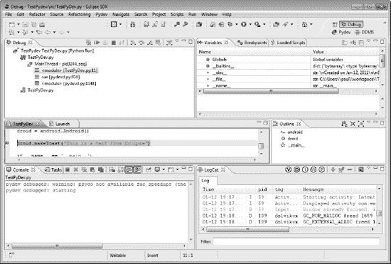

***图 4-22。** Pydev 应用调试*

在真实或模拟设备上执行 Eclipse 中的代码的另一种方法是使用 ADB 实用程序来建立设备的代理。这在第 3 章中已经介绍过了，但是我将在这里再次介绍这些步骤，向您展示如何在 Eclipse 中完成。要在真实设备上实现这一点，您需要使用 USB 电缆连接它，并在设备上配置适当的设置，如启用 USB 调试和启用除仅充电之外的其他设置。接下来，您必须启动 SL4A 并从解释器菜单启动一个服务器。最后，您必须注意从设备上的通知页面分配给服务器的 TCP 端口。最后，但同样重要的是，您必须以管理员权限在命令窗口中键入以下内容:

`adb forward tcp:9999 tcp:50681`

这指示 ADB 将所有 TCP 流量从本地端口 9999 转发到远程端口 50681。完成所有这些后，您现在应该能够从 Eclipse 运行您的 Python 代码了，所有对 Android API 的调用都将通过代理发送到设备。从 Eclipse 内部运行的好处是，您可以看到 DDMS 中的所有调试信息和所有控制台输出，包括从设备返回的任何错误消息。

我发现一个非常有价值的工具是文件比较工具。要使用它，首先在工作区窗口左侧的 navigator 窗格中选择两个文件，方法是左键单击第一个文件，然后按住 Shift 左键单击第二个文件。接下来，使用鼠标右键操作并选择与相互比较。这将产生一个双窗格窗口，突出显示任何差异，如图 4-23 所示。

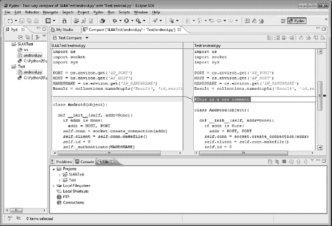

***图 4-23。**文件比较工具*

#### 在 Eclipse 中使用多种文件类型

Eclipse 真正擅长的事情之一是管理具有多种文件类型的复杂应用。第 9 章将详细讨论 SMS Sender 程序，但现在它将作为一个例子，展示如何创建一个包含许多不同文件的项目。这可以从头开始或从现有文件中完成。在这种情况下，我们将使用现有的文件并将它们添加到一个新的 Pydev 项目中。

您必须做的第一件事是创建一个新的 Pydev 项目。这将在您的工作区下创建一个新文件夹和一个单独的`src`目录。要将文件添加到项目中，您可以使用文件菜单中的导入工具，也可以将文件从文件管理器(如 Windows 上的 Windows 资源管理器或 Linux 上的 Nautilus)拖放到项目中。[图 4-24](#fig_4_24) 显示了选择导入方法时将看到的对话框。

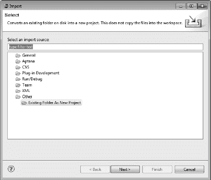

***图 4-24。**导入文件工具*

当你点击下一步按钮时，你会看到另一个对话框，允许你浏览你想要导入的目录(见[图 4-25](#fig_4_25) )。这应该是顶层或根目录，其中包含您希望导入到该目录或子目录中的所有文件。

***图 4-25。**导入目录选择器对话框*

如果您选择拖放方法，您需要在文件管理器中选择文件和目录，然后将它们拖到 Eclipse 窗口上，并在指向项目时释放鼠标。这将弹出一个新的对话框，允许你选择如何处理这些文件(见[图 4-26](#fig_4_26) )。

***图 4-26。**文件和文件夹操作对话框*

一旦导入完成，您将拥有一个新的 Pydev 项目。[图 4-27](#fig_4_27) 显示了 SMSSender 项目，其中的文件是使用拖放方法包含的。左侧窗格显示了一个目录树，其中包含与此项目相关的所有文件。您可以并且应该在项目中包含所有文件，甚至是那些您不会用 Eclipse 编辑的文件，比如图像，以简化以后的部署过程。构建一个用于分发的包需要所有文件都包含在您的项目中，所以您最好现在就学习如何做。这还包括您的项目所依赖的任何库文件，如 JavaScript 库。

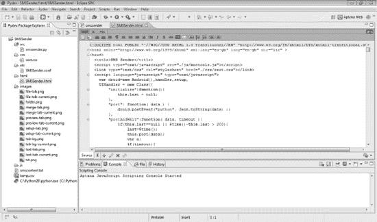

***图 4-27。**使用拖放方法创建的多文件示例*

如果您双击项目中的一个非文本文件，Eclipse 将尝试使用默认的查看器应用打开该文件。如果你右击一个文件，你会看到包括打开方式在内的选项。[图 4-28](#fig_4_28) 显示了打开的选项菜单。

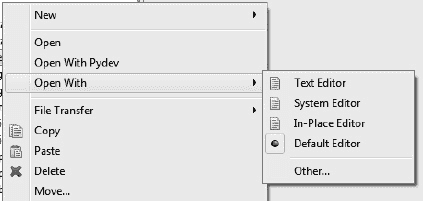

***图 4-28。**打开文件选项菜单*

另一个选项将打开另一个对话框(见[图 4-29](#fig_4_29) )，其中有一长串默认编辑器。如果您选择外部程序单选按钮，您将获得系统上所有已注册 mime 类型的列表。

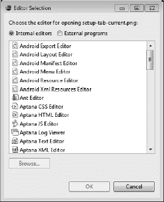

***图 4-29。**编辑选择菜单*

Eclipse 在为文件类型提供正确的编辑器方面做得很好，你可以从图 4-27 中的 HTML 标签看到这一点。

### 总结

Eclipse 是一个强大的 IDE。它也是一个复杂的软件应用，对于新手来说可能有些令人生畏。本章重点介绍了配置 Eclipse 并使用它快速有效地构建和测试您的应用。希望您已经看到了 Eclipse、Pydev 和 ADT 的组合可以做些什么。

以下是关于 Eclipse 需要记住的一些事情:

*   不要害怕 Eclipse :许多人因为听说过或读到过 Eclipse 有多么庞大和笨重而回避使用它。虽然它可能在内存有限的旧计算机上运行缓慢，但它在典型的现代工作站上确实运行良好。
*   **阅读文档**:如果你以前没有使用过 Eclipse，浏览一下文档也是个不错的主意。至少看看最近的 Eclipse 教程，帮助您快速入门。
*   **找到你的插件**:除了本章提到的插件，还有很多插件。如果你认为还有其他需要的东西，浏览一下网站，在谷歌上搜索一下。Aptana Studio 并不是唯一的 HTML 编辑器，所以您可以随意查看其他一些选项。
*   **学习快捷键**:学习几个键盘快捷键可以节省你很多时间，有助于让你的手保持在键盘上。每次你不得不移动你的手到鼠标上，不仅花费时间，而且潜在地增加了你的疲劳系数。