## C H A P T E R 6

## 使用 Python 编写后台脚本

本章将介绍如何创建使用 Android 脚本层(SL4A)的脚本，这些脚本没有用户界面，并在后台运行。

本章的主要主题如下:

*   编写在后台执行特定任务的脚本
*   展示 SL4A 的不同功能方面

Python 作为一种开发脚本来快速有效地完成基本功能任务的语言而闻名。这一章将向你展示如何构建脚本来执行特定的操作，而不需要任何干预。所以本章中的脚本将没有用户界面可言。虽然在终端窗口中启动脚本时可能会有一些状态信息，但是用户除了启动脚本之外没有其他事情可做。

### 后台任务

使用 SL4A 的最新版本(撰写本文时为 r4)，您可以在终端或后台启动任何脚本。要在后台启动它，选择看起来像一个小齿轮的图标，如图[图 6-1](#fig_6_1) 所示。

***图 6-1。** SL4A 脚本启动选项*

当脚本运行时，它会在通知页面上放置一个条目来标识应用，并在必要时为您提供关闭应用的方法。如果您希望在设备启动时启动一个脚本，也有一个专门针对 SL4A 编写的应用。该应用被称为启动时启动，并做了很多事情。[图 6-2](#fig_6_2) 显示了主屏幕的样子。

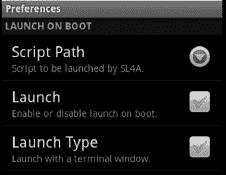

***图 6-2。**在启动首选项屏幕上启动*

每当您的设备启动时，该实用程序将启动一个 SL4A 脚本。如果您想要启动多个脚本，您将需要创建一个主脚本，该主脚本将依次启动其他脚本。这就带来了一个明显的问题:如何从 Python 启动另一个 SL4A 脚本？要回答这个问题，我们需要看一下`makeIntent`函数。以下是文档中关于`makeIntent`的内容:

`makeIntent(
String action,
String uri[optional],
String type[optional]: MIME type/subtype of the URI,
JSONObject extras[optional]: a Map of extras to add to the Intent,
JSONArray categories[optional]: a List of categories to add to the Intent,
String packagename[optional]: name of package. If used, requires classname to be useful,
String classname[optional]: name of class. If used, requires packagename to be useful,
Integer flags[optional]: Intent flags)`

关键是这是一个明确的意图，意味着你不需要一个 URI。为了启动另一个 SL4A 脚本，您必须完全限定`packagename`和`componentname`。由此产生的调用将如下所示:

`intent=droid.makeIntent("com.googlecode.android_scripting.action.LAUNCH_BACKGROUND_SCRIPT",\
None, \
None, \
{"com.googlecode.android_scripting.extra.SCRIPT_PATH" : "/sdcard/sl4a/scripts/hello_world.py"}, \
None, \
"com.googlecode.android_scripting", \
"com.googlecode.android_scripting.activity.ScriptingLayerServiceLauncher").result`

我们可以通过如下几行额外的代码使其更容易阅读:

`import android
droid = android.Android()
action = "com.googlecode.android_scripting.action.LAUNCH_BACKGROUND_SCRIPT"
clsname = "com.googlecode.android_scripting"
pkgname = "com.googlecode.android_scripting.activity.ScriptingLayerServiceLauncher"
extras = {"com.googlecode.android_scripting.extra.SCRIPT_PATH":
"/sdcard/sl4a/scripts/hello_world.py"}
myintent = droid.makeIntent(action, None, None, extras, None, clsname, pkgname).result
droid.startActivityIntent(myintent)`

### 触发器

SL4A 提供了实现触发器的方法。我想在这里简单地提到它们，但是要知道，在撰写本文时，它们仍然有些缺陷。基本概念是提供一种机制，根据设备上发生的某些条件或事件来触发某些功能。[图 6-3](#fig_6_3) 显示了在查看脚本列表时，如果按下菜单按钮，然后选择触发器，您将看到的菜单。

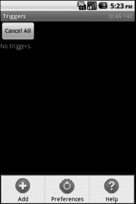

***图 6-3。**触发菜单*

任何现有的触发器都将显示在此屏幕中。您可以使用 cancel all 按钮取消所有触发器，或者通过长按想要移除的触发器来调出移除按钮来选择单个触发器(参见[图 6-4](#fig_6_4) )。要添加新的触发器，按下图 6-3 中[所示的添加按钮。这将显示`/sdcard/sl4a/scripts`目录的内容，并允许您选择要运行的脚本。一旦你选择了一个脚本，你会看到一个弹出菜单，如图 6-5](#fig_6_3) 中的[所示。您可以在这里选择触发脚本运行的内容。选项列表包括电池、位置、电话、传感器和信号强度。](#fig_6_5)

坏消息是触发器功能不全，所以使用它们要自担风险。从好的方面来看，有一种方法可以使用稍微不同的方法实现一些相同的功能。

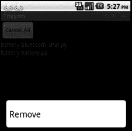

***图 6-4。**移除触发按钮*

请注意，如果您启动一个崩溃的应用，您可能会进入一个无限循环，每次 SL4A 启动时，它都会尝试启动您触发的脚本，然后它会再次崩溃。如果您可以进入通知屏幕并调出 SL4A 触发器，您应该能够按下 Cancel All 按钮并删除有问题的脚本。解决这个问题的唯一方法是卸载然后重新安装 SL4A。

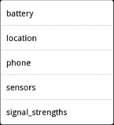

***图 6-5。**触发激活菜单*

### 基于方向的动作

这里有一个方便的脚本，如果你把手机正面朝下放在平面上，它会把你的手机置于静音模式。代码使用`startSensingTimed` API 调用来确定方向和移动。如果它确定设备是静止的并且基本上是水平的，它将使用`toggleRingerSilentMode`呼叫将振铃器设置为静音。代码如下所示:

`import android, time
droid = android.Android()

droid.startSensingTimed(1, 5)
silent = False
while True:
e = droid.eventPoll(1)

facedown = e.result and 'data' in e.result[0] and \
e.result[0]['data']['zforce'] and e.result[0]['data']['zforce'] < -5
if facedown and not silent:
droid.vibrate(100)
droid.toggleRingerSilentMode(True)
silent = True
elif not facedown and silent:
droid.toggleRingerSilentMode(False)
silent = False

time.sleep(5)`

另一种检测电话被面朝下放置的方法是使用光传感器。下面是一个简短的片段，它将使用文本到语音(TTS)功能来让您知道手机何时面朝下:

`import android, time

droid = android.Android()
droid.startSensing()

while True:
result = droid.sensorsGetLight().result
if result is not None and result <= 10:
droid.ttsSpeak('I can\'t see!')
time.sleep(5)`

这可能是一个谈论日志的好地方。编写没有用户界面的程序的最大挑战之一是调试。调试“静默”代码的方法有很多——从插入打印语句到使用 Android SDK 的 DDMS 工具。大多数 Linux 系统应用都会生成某种类型的日志，明确用于监控执行和记录错误信息。Android 平台提供了一个名为 logcat 的日志工具。有一个名为`log`的 API 函数，它会将您想要的任何字符串消息写到`logcat`文件中。或者，您可以写入自己的日志文件。

在第 9 章中，我将详细介绍一个使用日志记录信息的复杂应用。下面是一些日志条目的样子:

`{"task":"loadconfig"} <type 'unicode'>
ok... {u'task': u'loadconfig'}
loadconfig
{"sections": {"locale": [{"name": "prefix", "value": "+60", "description": "International
prefix. Used to clean up phone numbers before sending.\nThis will only affect numbers that do
not yet have an international code.\nExamples (assuming prefix is +60):\n0123456789 will
become +60123456789\n60123456789 will become +60123456789\n+49332211225 remains unchanged"}],` `"merger": [{"name": "informeveryratio", "value": "10", "description": "Use TTS to inform you
every total / n messages. Set to 1 if you do not wish to use this feature.\nExample\nIf you
are sending 200 messages and set this value to 5, you will be informed by TTS of the status
every 200 / 5 = 40 messages."}, {"name": "informevery", "value": "0", "description": "Use TTS
to inform you every n messages. Set to 0 if you do not wish to use this feature."}],
"application": [{"name": "showonlycsvfiles", "value": "0", "description": "While importing the
CSV file, only files with the extension .csv will be shown if this is set to 1."}, {"name":
"showonlytextfiles", "value": "1", "description": "While importing template text from a file,
only files with the extension .txt will be shown if this is set to 1."}, {"name":
"showhiddendirectories", "value": "0", "description": "While browsing, hidden directories
(stating with '.') will not be shown if this is set to 1."}]}}
Had to wait cause process was only 0.005585 second
{"task":"listdir","path":"/sdcard","type":"csv"} <type 'unicode'>
ok... {u'path': u'/sdcard', u'task': u'listdir', u'type': u'csv'}
listdir
Loading directory content
{"files": ["._.Trashes", "handcent1.log"], "folders": ["accelerometervalues", "Aldiko",
"amazonmp3", "Android", "astrid", "com.coupons.GroceryIQ", "com.foxnews.android",
"com.googlecode.bshforandroid", "com.googlecode.pythonforandroid", "data", "DCIM", "Digital
Editions", "documents", "download", "Downloads", "droidscript", "dropbox", "eBooks",
"Evernote", "gameloft", "gReader", "Grooveshark", "handcent", "HTC Sync", "ItchingThumb",
"jsword", "logs", "LOST.DIR", "Mail Attachments", "media", "mspot", "Music", "My Documents",
"pulse", "rfsignaldata", "rosie_scroll", "rssreader", "Sample Photo", "skifta", "sl4a",
"StudyDroid", "swiftkey", "tmp", "TunnyBrowser", "twc-cache"]}
{"task":"listdir","path":"/sdcard/sl4a","type":"csv"} <type 'unicode'>
ok... {u'path': u'/sdcard/sl4a', u'task': u'listdir', u'type': u'csv'}
listdir
Loading directory content
{"files": ["battery.py.log", "BeanShell 2.0b4.log", "DockProfile.py.log", "downloader.py.log", "downloaderv2.py.log",
"DroidTrack.py.log", "geostatus.py.log", "getIPaddr.py.log",
"hello_world.bsh.log", "httpd.py.log", "netip.py.log", "null.log", "Python 2.6.2.log",
"Shell.log", "simpleHTTP2.py.log", "smssender.py.log", "speak.py.log", "ssid2key.py.log",
"test.py.log", "trackmylocation.py.log", "weather.py.log", "wifi.py.log",
"wifi_scanner.py.log"], "folders": ["extras", "scripts"]}
Had to wait cause process was only 0.025512 second
{"task":"listdir","path":"/sdcard/sl4a/scripts","type":"csv"} <type 'unicode'>
ok... {u'path': u'/sdcard/sl4a/scripts', u'task': u'listdir', u'type': u'csv'}
listdir`

如果你仔细观察，你会注意到许多不同类型的条目。有一些信息条目来标识特定代码段何时被执行，比如`loadconfig`。其他条目转储 Python 变量的内容，如以下行:

`{u'path': u'/sdcard/sl4a/scripts', u'task': u'listdir', u'type': u'csv'}`

花括号将该对象标识为包含总共三个键/值对的 Python 字典。对于日志文件中的内容，您有很大的灵活性。下面是来自第 9 章 SMSSender 应用的代码，用于打开一个日志文件:

`# Prepare a log file
# TODO: Would be better thing to use the python logger instead
LOG = "../SMSSender.py.log"
if os.path.exists(LOG) is False:
f = open(LOG, "w")
f.close()
LOG = open(LOG, "a")`

要写入条目，只需使用`LOG.write(message)`将字符串`message`写入日志文件。SMSSender 应用使用一个函数将消息写入终端和日志文件。代码如下:

`def log(self, message):
""" Log and print messages

message -- Message to log
"""
LOG.write(message)
print message`

定义了 log 函数后，您可以使用如下语句:

`self.log("Selected filename %s " % filename)`

在创建任何类型的服务应用时，日志记录都是工具箱中的重要工具。当你的程序停止工作，你需要查看当时发生了什么时，它会非常方便。也许你写的代码完美无缺，但对我来说并不总是这样。

### 基于位置的动作

可能有一些你经常去的地方，当你在那里的时候，你肯定希望你的手机静音。教堂可能是其中之一，也可能是疗养院、医院或图书馆。您可以创建一个脚本，非常类似于基于传感器的操作，它将检测您的位置并采取特定的操作。您需要知道的是该位置的 GPS 坐标。

为了让这个脚本工作，我们需要一些辅助函数来计算从当前位置到“特殊”位置的距离。对于这个搜索，你可能想尝试一下`[http://stackoverflow.com](http://stackoverflow.com)`站点。这个网站有大量的编码问题问答。下面是在`[http://stackoverflow.com](http://stackoverflow.com)`上找到的一段代码，用于使用哈弗辛公式计算两个 GPS 点之间的距离:

`from math import *

def haversine(lon1, lat1, lon2, lat2):
"""
Calculate the great circle distance between two points
on the earth (specified in decimal degrees)
"""
# convert decimal degrees to radians
lon1, lat1, lon2, lat2 = map(radians, [lon1, lat1, lon2, lat2])
# haversine formula
dlon = lon2 - lon1
dlat = lat2 - lat1` `a = sin(dlat/2)**2 + cos(lat1) * cos(lat2) * sin(dlon/2)**2
c = 2 * atan2(sqrt(a), sqrt(1-a))
km = 6367 * c
return km`

有了这些，我们现在只需要写一个简短的脚本来获取我们的当前位置，然后使用我们的固定位置调用哈弗辛函数。如果我们在一个固定的距离内(例如，小于 1000 英尺)，我们将打开手机的静音模式。

`import android, time
droid = android.Android()

lat1 = 33.111111
lon1 = 90.000000

droid.startLocating()

time.sleep(15)
while True:
loc = droid.readLocation().result
if loc = {}:
loc = getLastKnownLocation().result
if loc != {}:
try:
n = loc['gps']
except KeyError:
n = loc['network']
la = n['latitude']
lo = n['longitude']

if haversine(la, lo, lat1, lon1) < 1:
droid.toggleRingerSilentMode(True)
else:
droid.toggleRingerSilentMode(False)`

### 基于时间的操作

这里有一个简单的脚本，可以让你在一天中的特定时间将手机设置为静音，然后在另一个时间再打开铃声。把它当成你的“我睡觉时不要打扰”剧本。

`""" Silences the phone between set hours

Meant for use on Android phones with the SL4A application
"""

# Created by Christian Blades (christian.blades@docblades.com) - Mon Mar 08, 2010

import android
import datetime
from time import sleep` `# MIN_HOUR and MAX_HOUR take an integer value between 0 and 23
# 12am == 0 and 1pm == 13
MIN_HOUR = 23
MAX_HOUR = 6

if MIN_HOUR > 23 or MIN_HOUR < 0 or MAX_HOUR > 23 or MAX_HOUR < 0:
# If the min and max values are out of range, raise an error
raise ValueError("0 <= (MIN_HOUR|MAX_HOUR) <= 23")

d_now = datetime.datetime.now

d_min = d_now().replace(hour=MIN_HOUR, minute=0, second=0)
d_max = d_now().replace(hour=MAX_HOUR, minute=0, second=0)

a_day = datetime.timedelta(days=1)

droid = android.Android()

def td_to_seconds(td):
""" Convert a timedelta to seconds """
return td.seconds + (td.days * 24 * 60 * 60)

def advance_times():
""" Advance for the following day """
d_min = d_min + a_day
d_max = d_max + a_day
return

def wait_for(dt):
""" Wait until dt """
sleep(td_to_seconds(dt - d_now()))

def main_loop():
"""
Infinite loop that silences and unsilences the phone on schedule

1\. Wait for silent time
2\. Silence the phone
3\. Wait for awake time
4\. Turn on the ringer
5\. Advance the min and max to the following day
6\. Repeat

NOTE: Must start during a loud period
"""
while True:
wait_for(d_min)
droid.makeToast("Goodnight")
droid.setRingerSilent(True)
wait_for(d_max)` `droid.makeToast("Good morning")
droid.setRingerSilent(False)
advance_times()

t_now = d_now()

if MAX_HOUR < MIN_HOUR:
# Do a little extra processing if we're going from
# a larger hour to a smaller (ie: 2300 to 0600)
if t_now.hour <= d_min.hour and t_now.hour < d_max.hour:
# If it's, say, 0200 currently and we're going from 2300 to 0600
# Make the 2300 minimum for the previous night
d_min = d_min - a_day
elif t_now.hour >= d_min.hour and t_now.hour > d_max.hour:
# In this case, it's 0900 and we're going from 2300 to 0600
# Make the maximum for the next morning
d_max = d_max + a_day

print "Now: " + t_now.ctime()
print "Min: " + d_min.ctime()
print "Max: " + d_max.ctime()

if t_now >= d_min and t_now < d_max:
# Is it silent time now?
# If so, do the silent stuff, then enter the loop
droid.makeToast("Goodnight")
droid.setRingerSilent(True)
wait_for(d_max)
droid.setRingerSilent(False)
advance_times()

main_loop()`

### 基于运行时间的触发器

创建在一段时间后或特定时间触发的脚本非常简单。下面是一个代码片段，它每十秒钟打印一条消息:

`import android, time

droid = android.Android()

# make Toast every ten seconds.
while True:
droid.makeToast('New Toast')
time.sleep(10)`

以这个想法为起点，你可以构建各种各样的脚本。如果您想要构建几个脚本来设置一个固定的计时器在一个小时后响起，或者一个钟声在整点时响起，该怎么办？在走得太远之前，您需要做几件事情。首先，你需要一个声音来提醒你。在谷歌上快速搜索警报声会出现各种各样的结果。我在网站上找到了一个不错的收藏。其中许多都是`.wav`格式的。幸运的是，你的 Android 设备可以毫无问题地播放`.wav`文件。

我们将使用`mediaPlay` API 函数来实际播放声音。如果您愿意，可以在模拟器上测试这一点。首先，您需要创建一个目录来保存您的声音文件，然后使用`adb push`命令将声音文件推送到设备，如下所示:

`adb shell mkdir /sdcard/sounds
adb push alarm.wav /sdcard/sounds/`

从那以后，这个脚本非常简单，因为它只是使用 Python 标准库`time.sleep`例程休眠一个小时，然后播放声音。剧本是这样的:

`import android
from time import sleep

droid = android.Android()

# This script will simply sleep for an hour and then play an alarm
droid.makeToast('Alarm set for 1 hour from now')
time.sleep(3600)
droid.mediaPlay('file:///sdcard/sounds/alarm.wav')`

消逝时间主题的一个微小变化是以固定的时间间隔执行一个动作，例如在每小时的顶部和底部发送包含当前位置信息的 SMS。这在不需要昂贵服务的情况下追踪某人的行踪是很有用的。发送短信需要一行代码，如下所示:

`droid.smsSend('8005551234','Test from Android')`

要添加获取当前位置的代码，首先必须调用`startLocating`函数开始收集位置信息。接下来，您调用`readLocation`来实际读取您当前的位置，最后调用`stopLocating`来关闭定位功能。我们将增加 15 秒的延迟，以便在 GPS 打开时给它一点时间来调整。如果我们没有 GPS 信号，我们将使用基于网络信息的当前位置。代码如下所示:

`droid = android.Android()
droid.startLocating()
time.sleep(15)
loc = droid.readLocation()
droid.stopLocating()

if 'gps' in loc.result:
lat = str(loc.result['gps']['latitude'])
lon = str(loc.result['gps']['longitude'])
else:
lat = str(loc.result['network']['latitude'])
lon = str(loc.result['network']['longitude'])` `now = str(datetime.datetime.now())
outString = 'I am here: ' + now + ' ' + lat + ' ' + lon

droid.smsSend('8005551234', outstring)`

### FTP 文件同步工具

让两台或多台机器之间的文件或目录保持同步是你一旦开始使用就离不开的任务之一。使用任何数量的商业程序都有许多方法来完成这项任务。使用 SL4A 同步文件的一种方法是使用 FTP 服务器。在 Linux、Mac OS X 和 Windows 上安装和配置 FTP 服务器非常简单。我将在这里为您概述这些步骤。

在 Mac OS X 上，您需要通过点按屏幕右上角的苹果图标并选择“偏好设置”来打开“系统偏好设置”实用程序。您应该会看到一个类似于图 6-6 中的窗口。

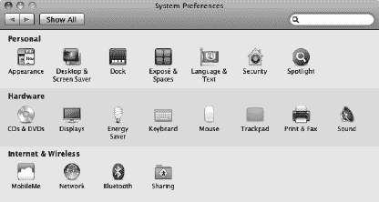

***图 6-6。** Mac OS X 系统偏好设置屏幕*

FTP 服务是共享偏好设置的一部分，因此通过点按图标打开该文件夹。你会看到另一个窗口，如图[图 6-7](#fig_6_7) 所示。

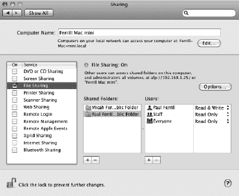

***图 6-7。** Mac OS X 文件共享偏好设置*

接下来，在服务列表中找到文件共享条目，并确保选中开启复选框(参见[图 6-7](#fig_6_7) )。最后，点击用户列表上方的选项按钮，弹出文件共享选项窗口，如图[图 6-8](#fig_6_8) 所示。

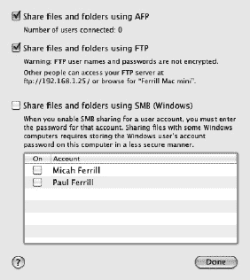

***图 6-8。** Mac OS X 文件共享偏好设置*

点击使用 FTP 共享文件和文件夹将实际启动 FTP 服务器。为了远程访问 FTP 服务器，您需要在 Mac 电脑上有一个用户帐户。在 Linux 上，我使用一个名为 vsftpd 的程序。这是一个免费的 FTP 服务器，安装简单，与最新版本的 Ubuntu 配合使用效果很好。要安装它，你使用一个单一的`apt-get`命令，如图[图 6-9](#fig_6_9) 所示。

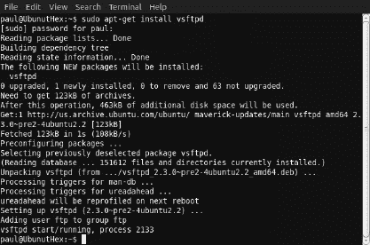

***图 6-9。**在 Ubuntu 10.11 中从终端窗口安装 vsftpd*

下载完成后，该程序将自动启动。您不必对配置做任何更改，因为像匿名连接这样的东西在默认情况下是禁用的。如果您想检查配置文件，它位于`/etc`目录中，命名为`vsftpd.conf`。[图 6-10](#fig_6_10) 显示了在命令提示符下使用 Windows FTP 客户端连接到 Linux 机器。

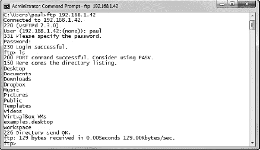

***图 6-10。**从 Windows 命令提示符连接到 vsftp】*

在 Windows 上，从 Windows 功能屏幕启用 FTP 服务器。进入该屏幕最简单的方法是按下键盘上的 windows 图标键，然后在搜索框中键入 Windows 功能。在“控制面板”下，您应该看到的第一个条目是“打开或关闭 Windows 功能”行。点击这一行将打开 Windows 功能面板，如[图 6-11](#fig_6_11) 所示。

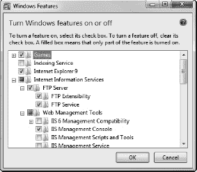

***图 6-11。**从 Windows 功能控制面板工具启用 Windows FTP 服务器*

在 Windows 功能屏幕打开的情况下，您需要检查两件事情以使您的 FTP 服务器运行:FTP 服务必须启用，并且您需要 IIS 管理控制台来管理 FTP 服务。安装完成后，您应该能够启动 IIS 管理控制台并配置您的 FTP 服务。

为此，我们将使用同样的技术，按下键盘上的 Windows 图标键，并在搜索框中键入 Internet。这将显示几个选项，包括 Internet Explorer 和 Internet 信息服务(IIS)管理器(参见[图 6-12](#fig_6_12) )。接下来，您希望启动 IIS 管理器并检查 FTP 服务的当前设置。

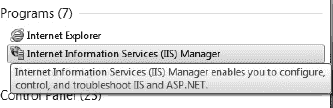

***图 6-12。**快速启动菜单中的互联网信息服务(IIS)管理器*

Windows 7 的所有默认设置都与 Linux 上的`vsftpd`相似，匿名登录被禁用。您可以从 IIS 管理器控制台调整许多其他配置设置，如图 6-13 中的[所示。](#fig_6_13)

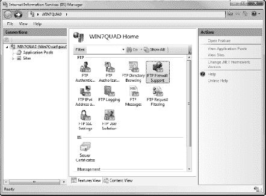

***图 6-13。**互联网信息服务(IIS)管理器屏幕*

一旦您启用了服务器软件，您将需要实际创建一个供 FTP 服务使用的站点。这可以通过右键单击左侧窗格中的“站点”文件夹，或者选择“站点”文件夹并单击操作窗格中的“添加 Ftp 站点”行来完成。您将看到几个对话框来指导您设置一个新的 FTP 站点。第一个对话框提示输入文件的名称和物理位置(见[图 6-14](#fig_6_14) )。

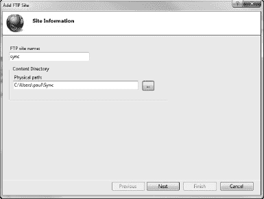

***图 6-14。** FTP 站点信息对话框*

当你点击下一步时，你会看到一个类似于图 6-15 的对话框。您可以在这里将 FTP 服务器分配到特定的 IP 地址(在本例中是机器的 IP 地址)并设置 SSL 设置。我们不需要 SSL 加密，因为它只能在本地网络上运行。

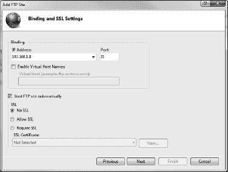

***图 6-15。** FTP 站点绑定和 SSL 设置*

再次单击“下一步”会将您带到最后一个对话框，您必须在其中配置身份验证规则。因为您将需要登录，所以向任何经过身份验证的用户授予完全访问权限，如图[图 6-16](#fig_6_16) 所示。

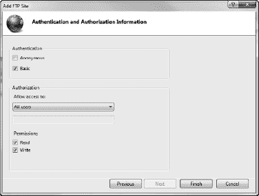

***图 6-16。** FTP 站点认证设置*

在 Windows 7 中，你需要做的最后一件事是更改防火墙设置以允许 FTP 连接。这可以在具有管理员权限的命令窗口中完成，如图[图 6-17](#fig_6_17) 所示。

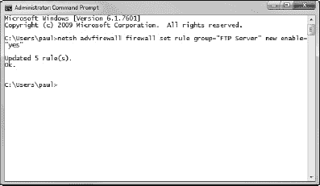

***图 6-17。**修改 Windows 7 防火墙设置的命令*

在 Windows 上配置 FTP 服务器显然比在 Linux 或 Mac OS X 上要繁琐一些。您可以使用其他第三方 FTP 服务器程序，但我想向您展示如何让它与基本操作系统一起工作。如果你做的一切都正确，你应该在 IIS 管理器屏幕上看到你的 FTP 站点，状态为 Started，如图 6-18 所示。

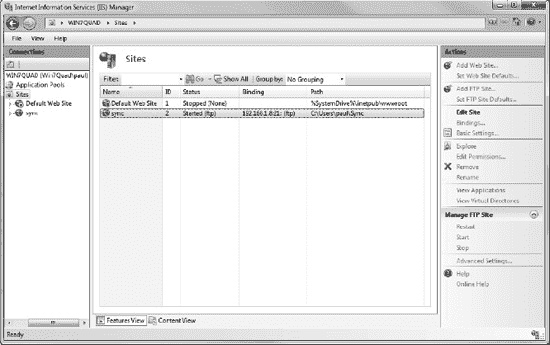

***图 6-18。** IIS 管理器显示同步 FTP 站点已启动*

现在我们已经解决了服务器部分的问题，我们可以继续使用 SL4A 构建一个小的客户端工具。好消息是 Python 标准库提供了一个用于构建客户端代码的`ftplib`模块，因此您不必去寻找任何东西。使用`ftplib`模块非常简单，主要包括识别目标系统(`HOST`)和登录所需的用户凭证。代码的主要部分通过比较两个目录中的文件列表来保持两个目录的同步。正如所写的，同步是从设备到远程服务器的一种方式，但是您可以修改它，而不需要很多额外的编码。

剧本是这样的:

`import ftplib
import time
import os

import android
droid = android.Android()

HOST = '192.168.1.81'
USER = 'user'
PASS = 'pass'
REMOTE = 'phone-sync'
LOCAL = '/sdcard/sl4a/scripts/ftp-sync'` `if not os.path.exists(LOCAL):
os.makedirs(LOCAL)

while True:
srv = ftplib.FTP(HOST)
srv.login(USER, PASS)
srv.cwd(REMOTE)

os.chdir(LOCAL)

remote = srv.nlst()
local = os.listdir(os.curdir)
for file in remote:
if file not in local:
srv.storlines('RETR ' + file,
open(file, 'w').write)

srv.close()
time.sleep(1)`

### 与 Flickr 同步照片

Flickr 是分享照片的绝佳服务。在许多带有摄像头的 Android 设备上，Gallery 应用提供了一个分享个人照片的选项。如果你可以运行一个脚本，将你所有的照片同步到 Flickr，那不是很好吗？这就是 SL4A 出现的原因。

寻找代码来完成这项艰巨的工作是另一个简单的谷歌搜索。虽然有很多选择，但我选定了一个名为`uploader.py`的。它已经存在了一段时间，并被一些博客帖子引用。如果您选择使用这段代码，您还需要一个名为`xmltramp.py`的文件。这段代码提供了许多由`uploader.py`使用的 XML 函数。在您尝试在 Android 设备上使用之前，在您的桌面上测试一下代码并不是一个坏主意。这是一个很好的主意，主要是为了通过 Flickr 授权你的应用。

第一次运行代码时，你会看到一个 Yahoo 登录界面，如图 6-19 所示。

***图 6-19。**雅虎 Flickr 登录界面*

接下来，你会看到一个页面，要求你授权`uploader.py`程序与你的 Flickr 账户通信。该屏幕看起来类似于[图 6-20](#fig_6_20) 。

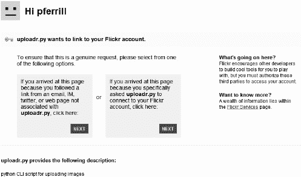

***图 6-20。** Flickr 授权屏幕*

点击“下一步”后，你至少还会看到一个屏幕，然后你会看到类似于图 6-21 的东西，让你知道你的应用已经被授权连接 Flickr。

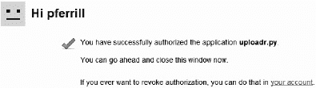

***图 6-21。**成功授权画面*

上传图片的代码非常简单。下面是`uploadImage`函数的样子:

`def uploadImage( self, image ):
if ( not self.uploaded.has_key( image ) ):
print "Uploading ", image, "...",
try:
photo = ('photo', image, open(image,'rb').read())
d = {
api.token : str(self.token),
api.perms : str(self.perms),
"tags" : str( FLICKR["tags"] ),
"is_public" : str( FLICKR["is_public"] ),
"is_friend" : str( FLICKR["is_friend"] ),
"is_family" : str( FLICKR["is_family"] )
}
sig = self.signCall( d )
d[ api.sig ] = sig
d[ api.key ] = FLICKR[ api.key ]
url = self.build_request(api.upload, d, (photo,))
xml = urllib2.urlopen( url ).read()
res = xmltramp.parse(xml)
if ( self.isGood( res ) ):
print "successful."
self.logUpload( res.photoid, image )
else :
print "problem.."
self.reportError( res )
except:
print str(sys.exc_info())`

### 与谷歌文档同步

“谷歌文档”是一个很好的方式，可以让你在任何有互联网接入和网络浏览器的地方创建电子表格或文字处理文档。涉及 Google Docs 和 Python 的后台任务的一个想法是自动呼叫日志同步工具。这个工具每天运行一次，用你当天的活动更新谷歌文档中的一个电子表格。我们将在这里使用一些新技术来访问 Google Docs 上的一个帐户，并通过首先下载当月的电子表格，然后追加当天的条目来进行电子表格追加。最后，新的电子表格将被上传回 Google Docs。

首先，我们将使用第 5 章中的脚本来获得今天通话的副本。下面是这个片段的样子:

`myconst = droid.getConstants("android.provider.CallLog$Calls").result
calls=droid.queryContent(myconst["CONTENT_URI"],["name","number","duration"]).result
for call in calls:`

该代码片段将在您的 Google 文档电子表格中插入一个新行:

`import time
import gdata.spreadsheet.service
email = 'youraccount@gmail.com'
password = 'yourpassword'
weight = '180'
spreadsheet_key = 'pRoiw3us3wh1FyEip46wYtW'
# All spreadsheets have worksheets. I think worksheet #1 by default always
# has a value of 'od6'
worksheet_id = 'od6'
spr_client = gdata.spreadsheet.service.SpreadsheetsService()
spr_client.email = email
spr_client.password = password
spr_client.source = 'Example Spreadsheet Writing Application'
spr_client.ProgrammaticLogin()
# Prepare the dictionary to write
dict = {}
dict['date'] = time.strftime('%m/%d/%Y')
dict['time'] = time.strftime('%H:%M:%S')
dict['weight'] = weight
print dict
entry = spr_client.InsertRow(dict, spreadsheet_key, worksheet_id)
if isinstance(entry, gdata.spreadsheet.SpreadsheetsList):
print "Insert row succeeded."
else:
print "Insert row failed."

>>> millis = int(msgs.result[0]['date'])/1000
>>> strtime = datetime.datetime.fromtimestamp(millis)
>>> strtime`

图 6-22 显示了我们的文档在谷歌文档中的样子。

***图 6-22。**包含通话记录数据的谷歌文档电子表格*

### 启动启动器

现在，我已经给了你很多关于小服务脚本的想法，让我们用一个启动器应用来结束这一章，它将结合一些想法，如日志记录和启动后台脚本，将它们结合在一起。如果您知道意图或活动名称，也可以使用这个脚本启动其他非 SL4A 应用。

这是最终的脚本:

`import android

STARTUP_SCRIPTS = (
'facedown.py',
'logGPS.py',
'silentnight.py'
)

droid = android.Android()

LOG = "../logtest.py.log"
if os.path.exists(LOG) is False:
f = open(LOG, "w")
f.close()
LOG = open(LOG, "a")` `for script in STARTUP_SCRIPTS:
extras = {"com.googlecode.android_scripting.extra.SCRIPT_PATH":
"/sdcard/sl4a/scripts/%s" % script}
myintent = droid.makeIntent(
"com.googlecode.android_scripting.action.LAUNCH_BACKGROUND_SCRIPT",
None, None, extras, None,
"com.googlecode.android_scripting",
"com.googlecode.android_scripting.activity.ScriptingLayerServiceLauncher").result
droid.startActivityIntent(myintent)
LOG.write("Starting %s\n" % script)`

我们将添加到脚本启动器的最后一个东西是一个额外的脚本，它将打开一个文本文件并从需要报警的事件列表中读取。它非常简单，将是我们的启动启动器将要加载的脚本之一。

代码如下:

`import time

import android

droid = android.Android()

SCHEDULE = '/sdcard/sl4a/scripts/schedule.txt'

# Parse the schedule into a dict.
alerts = dict()
for line in open(SCHEDULE, 'r').readlines():
line = line.strip()
if not line: continue
t, msg = line.split(' ', 1)

alerts[t] = msg

# Check the time periodically and handle alarms.
while True:
t = time.strftime('%H:%M')
if t in alerts:
droid.vibrate()
droid.makeToast(alerts[t])
del alerts[t]

time.sleep(5)`

`schedule.txt`文本文件将包含任意数量的带有时间和消息字符串的行。这是一个可能的例子:

`17:00 Time to head home!
21:00 Put the trash out
22:00 Set the alarm`

请注意，所有时间都必须使用 24 小时制。现在，我们有办法在启动时启动任意数量的不同脚本，将您的 Android 设备变成一个强大的通知工具。

### 总结

本章将通过一些例子向您展示如何使用 SL4A 和 Python 来自动化在后台运行的任务。

这是本章的要点列表:

*   **在启动时启动脚本**:使用新的 on boot 应用，您可以设置任何 SL4A 脚本在每次设备启动时启动。只有在彻底测试了你的脚本之后，才使用这个函数。
*   **基于传感器采取行动**:任何正在运行的脚本都可以访问 Android 设备的全部感知能力，您可以基于任何传感器输入采取行动。
*   **基于时间的动作**:您可以使用标准的 Python 定时器函数来创建基于时间的脚本。只要你不设置无限计时器，这真的是一个很容易的事情。请记住，如果您确实创建了一个“无限循环”应用，您可以从通知屏幕中终止任何 SL4A 脚本。