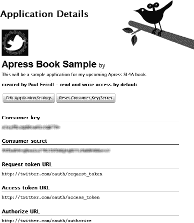
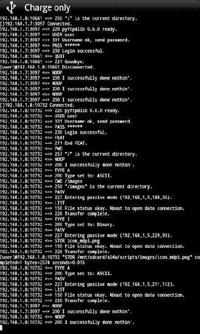

## 7

## Python 脚本工具

本章将介绍如何使用 Python 来完成 SL4A 的不同工具任务。在典型的个人电脑上，这些属于命令行工具类。

 **注**撰写本章时使用的 SL4A 版本是基于 Python 2.6.2 的。本章中的所有例子都是用 Python 2.6.4 在 Windows 7 64 位机器和基于 Android 2.2 的模拟器上测试的。

是时候开始了。以下是本章将要研究的内容:

*   Python 库以及如何使用它们
*   基于电子邮件的应用
*   基于位置的应用
*   用于传输文件的 Web 服务器

### Python 库

有大量的库可供 Python 语言完成从操作 MP3 ID3 标签到在 JPEG 图像中读写 EXIF 数据的所有任务。在 SL4A 项目中使用它们的技巧是将它们安装在目标设备上。如果这个库完全是用 Python 编写的，那么您应该能够毫无问题地使用它。如果这个库实际上是一个二进制模块的包装器，事情会变得有点困难，就像任何基于开源 Lame 项目的 MP3 工具一样。虽然有一种方法可以让二进制模块重新编译并针对 ARM 架构，但这并不是一项简单的任务。

使用现有库的其他挑战来自它们通常的分发方式。可能还需要额外的依赖项。大多数情况下，您会找到一个从终端窗口用如下命令运行的`setup.py`文件:

`python setup.py install`

该命令通常会将库安装到 Python 站点包目录中。这种方法在 Android 设备上的唯一问题是站点包目录在非根设备上是只读的。在一个单独的`.py`文件中，有相当数量的库是独立的。如果是这种情况，那么你所要做的就是将文件复制到设备和正确的目录中。

这可能是一个谈论当你在你的设备上安装 Python 时下载的`.zip`文件中的内容的好时机。如果您在安装 Python 解释器时注意了一下，您会看到三个文件经过。如果你错过了，你仍然可以看到 adb 命令的文件，如图 7-1 所示。

***图 7-1。**设备上 Python 目录的内容*

`python_r7.zip`文件包含执行解释器所需的基本 Python 文件。您将在`python_scripts_r8.zip`文件中找到十个示例程序，您可以在学习中使用它们。`test.py`文件是一个很好的起点，因为它包含了不同对话调用的测试套件。最后，`python_extras_r8.zip`文件包含了许多帮助函数和库，项目维护人员认为这对 Python 开发人员会有帮助。

您可以使用以下命令将`python_extras_r8.zip`文件的副本下载到您的开发工作站:

`adb pull /sdcard/com.googlecode.pythonforandroid/python_extras_r8.zip`

该文件包含您期望在典型 Python 安装的 site-packages 目录中找到的内容。如果你打开 zip 文件，你会看到一个类似于图 7-2 的文件和目录列表。

***图 7-2。**Python extras 的内容。zip 文件*

如果您的开发机器使用的是 Windows，您会在`C:\Python26\Lib\site-packages`中找到对应的目录。当在 Android 设备上使用 Python 时，有一种方法可以向`PYTHONPATH`变量添加本地路径。这需要两行代码，因此:

`import sys
sys.path.append('/sdcard/sl4a/mylib')`

在本例中，目录`/sdcard/sl4a/mylib`包含您希望 Python 在您的设备上可用的文件。使用 Python 库最简单的方法是以鸡蛋的形式出现。Python 支持库的 zip 压缩文件格式，使用`.egg`作为文件扩展名。它在概念上类似于 Java 中的`.jar`文件。使用 Python `.egg`文件所要做的就是将它复制到设备上适当的目录中。这可以通过如下的`adb push`命令来实现:

`adb push library.egg /sdcard/com.googlecode.pythonforandroid/extras/python`

### T1】基于电子邮件的应用

发送电子邮件是我们大多数人认为理所当然的事情。在移动电子邮件的世界里，我们可能要感谢黑莓设备，因为它把它带给了你，无论你身在何处。Android 设备默认有电子邮件，并与谷歌的 Gmail 紧密集成。这使得编写发送电子邮件的工具脚本的想法非常有吸引力。

SL4A Android facade 提供了一个`sendEmail` API 调用。这个函数有三个参数:`to_address`(以逗号分隔的接收者列表)、`title`和`message`。从那里，它将信息传递给默认的电子邮件应用。然后，您必须使用该应用实际发送消息。如果您碰巧在设备上注册了多个应用来处理电子邮件，系统还会提示您选择使用哪一个。虽然这种方法确实有效，但它并没有真正完成手头的任务。我的意思是，你可以使用内置的电子邮件程序，但这将是乏味的，我真正想要的是一种自动发送电子邮件的方式。这就是 Python 来拯救我们的地方。

我们将为这个任务使用的库是`smtplib`。它是 Python 标准库的一部分，所以你不需要做任何特别的事情就可以使用它。我们还将利用 Gmail 的 SMTP 服务来发送邮件。此外，我们将使用`email`库，它包含许多帮助函数，允许我们以正确的形式构造消息。最后，我们将使用`mimetypes`库来帮助我们对消息进行编码。`email`库提供了一个叫做`MIMEMultipart`的东西，它让我们定义一封电子邮件的不同部分。以下是用 Python 创建消息的方法:

`# Create an SMTP formatted message
msg = MIMEMultipart()
msg['Subject'] = 'Our Subject'
msg['To'] = 'receiver@host.net'
msg['From'] = 'sender@gmail.com'
msg.attach(MIMEText(body, 'plain'))`

msg 结构中使用的大部分数据都是 string 类型的，所以创建消息的主体很简单。因为 Google 需要认证才能通过 SMTP 服务器发送邮件，所以您需要有一个 Gmail 帐户才能使用这个脚本。

下面是从命令行与 Google SMTP 服务器通信的样子。要启动 Python，您需要在 Linux 或 Mac OS X 上打开一个终端窗口，或者在 Windows 上打开一个命令提示符。在那里，您应该能够输入 Python:

`>>> smtpObj = smtplib.SMTP(smtp_server,smtp_port)
>>> smtpObj.starttls()
(220, '2.0.0 Ready to start TLS')
>>> smtpObj.ehlo()
(250, 'mx.google.com at your service, [72.148.19.136]\nSIZE 35651584\n8BITMIME\nAUTH
LOGIN PLAIN XOAUTH\nENHANCEDSTATUSCODES')
>>> smtpObj.login(username,password)
(235, '2.7.0 Accepted')
>>> smtpObj.sendmail(username,to_addr,msg.as_string())
>>> smtpObj.close()`

如果你计算一下代码的行数，你只需要五行来设置消息，六行来发送消息。就代码效率而言，这还不错。您可能希望在最终的脚本中添加一些错误检查，但是编写一个有用的电子邮件发送工具应该不需要太多的代码。既然我们已经有了创建通用电子邮件发送者的基础，那么发送什么才是真正有用的呢？为什么不是你所有的短信？

SMS facade 提供了对批量或一次一条 SMS 消息的简单访问。如果你想得到一切，你应该使用`smsGetMessages`。在我们深入讨论之前，我们应该研究一下每条短信都有哪些信息。您可以做的第一件事是使用`smsGetAttributes`函数来查看您可以检索哪些数据。这是在模拟器上运行的样子:

`>>> pprint.pprint(droid.smsGetAttributes().result)
[u'_id',
u'thread_id',
u'address',
u'person',
u'date',
u'protocol',
u'read',
u'status',
u'type',
u'reply_path_present',
u'subject',
u'body',
u'service_center',
u'locked',
u'error_code',
u'seen']`

现在我们知道了什么是可用的，我们可以使用`smsGetMessages`函数创建一个列表，然后遍历这个列表，只提取我们感兴趣的信息。首先，我们需要在模拟器上创建一些消息供我们使用。这需要使用在[第 3 章](03.html#ch3)中介绍的 ADB 工具的一点命令行技巧。在 Windows 上，您必须打开一个命令窗口并键入`telnet localhost 5554`。[图 7-3](#fig_7_3) 显示了 telnet 屏幕和生成几条 SMS 消息所需的命令。

***图 7-3。**使用 telnet 向模拟器发送短信*

现在我们可以使用`smsGetMessages`函数来读取所有的消息，通过传入一个`False`参数来表明我们不仅仅想要未读的消息。实际上，在这种情况下这并不重要，因为所有这些消息都是刚刚收到的，无论如何我们都会得到相同的结果。

`>>> msgs = droid.smsGetMessages(False)
>>> pprint.pprint(msgs.result)
[{u'_id': u'3',
u'address': u'3035551212',
u'body': u'"This is a another test message from Telnet"',
u'date': u'1297814134176',
u'read': u'0'},
{u'_id': u'2',
u'address': u'3025551212',
u'body': u'"This is test message 2 from Telnet"',
u'date': u'1297814117225',
u'read': u'0'},
{u'_id': u'1',
u'address': u'3015551212',
u'body': u'"This is test message 1 from Telnet"',
u'date': u'1297814100976',
u'read': u'0'}]`

在这一点上值得注意的是，消息是按时间倒序导出的。另一个值得注意的项目是消息的内容。即使`smsGetAttributes`函数向我们展示了更多可能的字段，我们在这里只得到`_id`、`address`、`body`、`date`和`read`。对于 SMS 消息，地址实际上是一个电话号码。除非你知道你在看什么，否则这个字段可能看起来有点奇怪。

这就是 Python `datetime`库帮助我们的地方。事实证明，`date`字段实际上是从 1 月 1 日开始的毫秒数。因此，我们所要做的就是将`date`字段除以 1000，并将该数字传递给`datetime`，如下所示:

`>>> millis = int(msgs.result[0]['date'])/1000
>>> strtime = datetime.datetime.fromtimestamp(millis)
>>> strtime
datetime.datetime(2011, 2, 15, 17, 55, 34)`

这里很酷的一点是`strtime`是一个对象，我们可以很容易地用它来获取内容:

`>>> print('Message time = %d:%d:%d') % (strtime.hour, strtime.minute, strtime.second)
Message time = 17:55:34`

更简单的是使用`strftime`方法来格式化时间，如下所示:

`>>> strtime.strftime("%m/%d/%y %H:%M:%S")
'02/15/11 17:55:34'`

现在，我们应该拥有了构建一个脚本来将设备上的所有 SMS 消息发送到一个电子邮件地址所需的所有组件。下面是最终代码的样子:

`import android, datetime, smtplib
from email.mime.multipart import MIMEMultipart
from email.mime.text import MIMEText

droid = android.Android()`
`smtp_server = 'smtp.gmail.com'
smtp_port = 587
mailto = 'paul'
mailfrom = 'paul'
password = 'password'

# Build our SMTP compatible message msg = MIMEMultipart()
msg['Subject'] = 'SMS Message Export'
msg['To'] = mailto
msg['From'] = mailfrom

# Walk throu the SMS messages and add them to the message body
SMSmsgs = droid.smsGetMessages(False).result

body = ''
for message in SMSmsgs:
millis = int(message['date'])/1000
strtime = datetime.datetime.fromtimestamp(millis)
body += strtime.strftime("%m/%d/%y %H:%M:%S") + ',' + message['address'] + ',' +
message['body'] + '\n'

msg.attach(MIMEText(body, 'plain')) smtpObj = smtplib.SMTP(smtp_server,smtp_port)
smtpObj.starttls()
smtpObj.login(mailfrom,password)
smtpObj.sendmail(mailfrom,mailto,msg.as_string())
smtpObj.close()`

[图 7-4](#fig_7_4) 显示了收到的邮件在 Gmail 网络界面中的样子。

***图 7-4。**带短信的电子邮件信息*

通用电子邮件工具还有许多其他用途。这个例子向您展示了如何创建一个消息，然后使用`smtpObj`发送它。对于示例脚本，我们真正应该做的最后一件事是添加一个选项，在电子邮件发送后删除所有 SMS 消息。下面是一个五行脚本，它将删除所有短信。请小心使用，因为它在删除所有内容之前不会要求任何确认:

`import android
droid = android.Android()
msgids = droid.smsGetMessageIds(False).result
for id in msgids:
droid.smsDeleteMessage(id)`

### 位置感知应用

移动设备的一个显著优势是能够知道你在哪里。SL4A 提供了一个具有许多功能的位置外观，这些功能可以在有或没有 GPS 功能的情况下工作。这为利用这些信息的应用提供了许多可能性。我将看看其中几个你可能会感兴趣的，包括一条关于我的位置的推文，以跟踪我的旅行。

#### 在推特上发布我的位置

这个应用将需要一些外部库来完成这项工作。我们稍后将讨论 Twitter 库。我们需要做的第一件事是检查由`readLocation` API 调用返回的数据结构。[图 7-5](#fig_7_5) 显示了一个调用`startLocating`后调用`readLocation`的例子。

关于从该呼叫中可获得的位置信息，需要指出一些事情。当你看图 7-5 时，你注意到的第一件事是有两种类型的位置信息可用。`readLocation`返回一个使用字典封装位置信息的结果对象。这个 dictionary 对象有两个键，它们的值依次是包含位置信息的多个键/值对的字典。因此，要访问基于 GPS 的纬度和经度，您可以使用如下内容:

`lat = result.result['gps']['latitude']
lon = result.result['gps']['longitude']`

***图 7-5。**读取位置 API 调用示例*

这里的另一个要点是，如果当前没有启用 GPS，您的设备可能不会返回 GPS 位置。事实上，如果您在模拟器上尝试这段代码，结果对象将是空的。因此，如果您试图用前面的代码读取 GPS 位置，而 GPS 是关闭的，您会得到类似如下的错误:

`>>> lat = droid.readLocation().result['gps']
Traceback (most recent call last):
File "<stdin>", line 1, in <module>
KeyError: 'gps'`

在 Python 中，可以使用`keys`方法查看字典中有哪些键。GPS 关闭时的`readLocation`结果如下所示:

`>>> droid.readLocation().result.keys()
[u'network']`

你也可以在条件语句中使用`keys`方法，就像这样:

`>>> if 'gps' in droid.readLocation().result:
print 'gps'
else:
print 'network'`

我们需要调查的下一件事是与 Twitter 的通信。当您在 SL4A 中安装 Python 解释器时，您会得到一些为您安装的库，包括`twitter.py`。坏消息是 Twitter 已经开始要求一种更强的认证方法来连接到它的 API。

如果您不知道 OAuth 是什么，那么您可能应该了解一下。OAuth 是一个用于安全 API 授权的开放协议。它基本上涉及多个密钥和一个多步认证过程。在`oauth.net`有一个社区网站，在那里您可以找到 OAuth 规范、文档和大量示例代码的副本。包括 Google 在内的许多公共服务已经开始采用 OAuth 作为主要的身份验证方法，或者至少作为一种替代方法。

如果你曾经使用过第三方 Twitter 应用，你可能已经经历过授权该应用时必须经历的步骤。出于这个原因，我们将使用另一个库`tweepy`，它可以从`[http://code.google.com/p/tweepy](http://code.google.com/p/tweepy)`获得。

我假设此时你已经有了一个 Twitter 账户，不会带你完成注册过程。如果你不知道，就直接去`twitter.com`并按照那里的指示去做。一旦你有了一个帐户，你就可以注册一个新的应用(`[http://twitter.com/apps/new](http://twitter.com/apps/new)`)。[图 7-6](#fig_7_6) 显示了注册页面的截图。

***图 7-6。**推特应用注册*

在页面底部有一个验证码框，你必须正确输入才能注册你的应用。有一些你应该知道的警告。首先，你不能以你的应用的名义使用 Twitter。其次，您必须在应用网站框中输入有效的 URL。它不必是一个真实的 URL，但必须是正确的格式。正确填写表单并输入 CAPTCHA 短语后，您就可以单击 Save 按钮了。

一旦完成，你将得到一个类似于[图 7-7](#fig_7_7) 的页面。您将需要复制并粘贴您在下面的示例中收到的代码。

***图 7-7。**推特应用详情*

您在应用中需要的两样东西是消费者密钥和消费者秘密。您可以复制这些字段，然后将其粘贴到另一个文档中以供将来参考。我只是在 Windows 上打开记事本，创建一个文本文件来保存这些信息。现在我们有了消费者密钥和秘密，我们准备好连接 Twitter 了。

我们的下一步是使用消费者密钥和秘密来获得相应的应用密钥和秘密。我们将使用一点 Python 代码和空闲控制台来获取所需的应用信息，如下所示:

`>>> import tweepy
>>> CONSUMER_KEY = 'insert your Consumer key here'
>>> CONSUMER_SECRET = 'insert your Consumer secret here'
>>> auth = tweepy.OAuthHandler(CONSUMER_KEY, CONSUMER_SECRET)
>>> auth_url = auth.get_authorization_url()
>>> print 'Please authorize: ' + auth_url`

这将显示一个 URL，您必须复制并粘贴到网络浏览器中才能获得所需的密钥。网页看起来会像图 7-8 中的。

***图 7-8。**推特应用授权*

点击“允许”后，将进入下一页，如图[图 7-9](#fig_7_9) 所示。

***图 7-9。**推特 PIN 授权码*

现在我们有了一个 PIN 码，我们只需要再执行几行代码。以下是空闲状态下的后续步骤:

`>>> auth.get_access_token('type your PIN here')
<tweepy.oauth.OAuthToken object at 0x02C0CE90>
>>> print "ACCESS_KEY = '%s'" % auth.access_token.key
ACCESS_KEY = 'access key code'
>>> print "ACCESS_SECRET = '%s'" % auth.access_token.secret
ACCESS_SECRET = 'access secret code'`

复制这两个应用代码，并将它们保存在为消费者代码创建的同一个文本文件中。从现在开始，你需要所有四个代码来认证和与 Twitter 通信。获取这些新代码并在 Twitter 上发布更新非常简单。事实上，您可以通过大约六行额外的代码来实现，如下所示:

`>>> ACCESS_KEY = 'your just-obtained access key'
>>> ACCESS_SECRET = 'your just-obtained access secret'
>>> auth = tweepy.OAuthHandler(CONSUMER_KEY, CONSUMER_SECRET)
>>> auth.set_access_token(ACCESS_KEY, ACCESS_SECRET)
>>> api = tweepy.API(auth)
>>> api.update_status("Hello from the Apress Book Sample")`

[图 7-10](#fig_7_10) 显示了如果你去`twitter.com`看时间线会是什么样子。

***图 7-10。**Python 消息的 Twitter 时间轴*

现在我们拥有了编写`tweetmylocation`脚本所需的一切。把所有的碎片放在一起，我们得到了这个:

`import android, datetime, time, tweepy

CONSUMER_KEY = 'my consumer key'
CONSUMER_SECRET = 'my consumer secret'

ACCESS_KEY = 'my access key'
ACCESS_SECRET = 'my access secret'

auth = tweepy.OAuthHandler(CONSUMER_KEY, CONSUMER_SECRET)
auth.set_access_token(ACCESS_KEY, ACCESS_SECRET)
api = tweepy.API(auth)

droid = android.Android()
droid.startLocating()
time.sleep(15)
loc = droid.readLocation()
droid.stopLocating()

if 'gps' in loc.result:
lat = str(loc.result['gps']['latitude'])
lon = str(loc.result['gps']['longitude'])
else:
lat = str(loc.result['network']['latitude'])
lon = str(loc.result['network']['longitude'])

now = str(datetime.datetime.now())
outString = 'I am here: ' + now + ' ' + lat + ' ' + lon

api.update_status(outString)`

[图 7-11](#fig_7_11) 显示了运行`tweetmylocation`脚本的结果，如果你去`twitter.com`查看时间线(除了假的 GPS 位置)。

***图 7-11。** Twitter 位置信息时间表*

##### 追踪我的旅行

既然我们知道了如何使用定位功能，那么偶尔查询并将信息保存到文件中就是一个非常简单的任务了。这对于追踪你在一天的越野旅行中走了多长时间和多远是很有用的。为了让这个应用工作，我们必须做一些基本的假设。首先，由于这个脚本将需要 GPS，并将定期读取位置，它可能需要将设备插入充电器，否则电池将在短时间内耗尽。其次，我们将依靠 Python 计时器来安排我们的测量，这意味着脚本将持续运行。虽然这没什么大不了的，但这只是让你的设备连接到电源而不依赖电池的另一个原因。

说完那些小细节，我们来说几个看家物品。尽可能少地对您的环境做出假设是一个很好的编程实践，因此我们将尝试遵循这一点，并在脚本中配置我们需要的一切。首先，我们希望 GPS 能够提供最准确的位置信息。目前，您必须手动打开 GPS，所以我们需要提示用户这样做。下面是一个小片段，它将发出对`startLocating` API 函数的调用，并等待 GPS 出现在从`readLocation`返回的结果中:

`droid = android.Android()
droid.startLocating()

while not droid.readLocation()[1].has_key('gps') :
print "Waiting on gps to turn on"
time.sleep(1)`

接下来，我们需要能够写出包含时间和位置的日志，以便以后检索。这里最重要的事情是在设备的 sd 卡上选择一个已知的目录或创建我们自己的目录。Python 的操作系统模块使这些任务变得简单。最简单的做法是创建我们自己的目录来存储文件。选择一个名字可能是此时最大的决定。为了实际创建目录，我们将使用`os.mkdir`。这可能是这样的:

`import os
os.mkdir('/sdcard/logs')`

在调用`os.mkdir`之前，您可以使用`os.path.exists`函数来检查目录。从编程的角度来看，这更有意义。把这个加进去会得到如下结果:

`if not os.path.exists('/sdcard/logs'):
os.mkdir('/sdcard/logs')`

Python 处理文件 I/O 的方式与其他编程语言非常相似。首先，打开一个文件进行写操作以获得一个文件对象。确保您传递了'`a`'参数来隐式打开文件进行追加。如果不这样做，每次都会创建一个新文件。然后使用 file 对象上的`write`方法写入文件。这里有一小段可能是这样的:

`f = open('/sdcard/logs/logfile.txt','a')
f.write('First header line in file\n')
f.close()`

用 Python 读取文件甚至更容易。如果您想打开一个文件并阅读其中的每一行，您可以使用如下代码:

`f = open('/sdcard/logs/logfile.txt')
for line in f:
print line
f.close()`

Python 文件对象是*可迭代的*，这意味着您可以使用`for line if f:`语法逐行读取文件。您可以使用这种方法来读取日志文件，并创建包含所有条目的电子邮件。我将把这个选项留给读者。这就是我们需要把这个脚本放在一起的全部内容。这是最终版本的样子:

`import android, os, time, datetime

droid = android.Android()
droid.startLocating()

while not droid.readLocation()[1].has_key('gps') :
print "Waiting on gps to turn on"
time.sleep(1)

if not os.path.exists('/sdcard/logs'):
os.mkdir('/sdcard/logs')

# Now we'll loop until the user closes the application

while True:
loc = droid.readLocation()

lat = str(loc.result['gps']['latitude'])
lon = str(loc.result['gps']['longitude'])
alt = str(loc.result['gps']['altitude'])`
`now = str(datetime.datetime.now())
f = open('/sdcard/logs/logfile.txt','a')
outString = now + ',' + lat + ',' + lon + ',' + alt + '\n'
f.write(outString)
print outString
f.close()

time.sleep(1)`

因为我们在这个脚本中显式地等待 gps，所以不需要检查来自`readLocation`的结果中是否有 GPS 条目。在程序运行时给用户一些反馈也是一个不错的做法。在这种情况下，我们只需将写入文件的同一行输出到控制台。出于测试目的，我们可以像前面一样使用`telnet`命令向模拟器发送模拟的 GPS 信息。[图 7-12](#fig_7_12) 显示了一个例子以及对`geo fix`命令的帮助。

***图 7-12。**用于模拟 GPS 的安卓控制台*

以下是使用仿真器运行的日志文件和使用 Android 控制台`geo fix`命令模拟的 GPS 数据的示例:

`2011-02-16 11:32:35.178488,30,-85,0
2011-02-16 11:32:36.287759,30,-85,0
2011-02-16 11:32:37.331069,30.1234,-85.1234,0
2011-02-16 11:32:38.449301,30.1234,-85.1234,0
2011-02-16 11:32:39.555303,30.1234,-85.1234,0
2011-02-16 11:32:40.639048,0,0,0
2011-02-16 11:32:41.749413,0,0,0
2011-02-16 11:32:42.849682,0,0,0
2011-02-16 11:32:43.936020,0,0,0
2011-02-16 11:32:45.041614,0,0,0
2011-02-16 11:32:46.106619,0,0,0
2011-02-16 11:32:47.181367,0,0,0
2011-02-16 11:32:48.297515,0,0,0`
`2011-02-16 11:32:49.374033,0,0,0
2011-02-16 11:32:50.509526,30.1,-85.0999983333,0
2011-02-16 11:32:51.612404,30.1,-85.0999983333,0
2011-02-16 11:32:52.727394,30.1,-85.0999983333,0
2011-02-16 11:32:53.838587,30.1,-85.0999983333,0
2011-02-16 11:32:54.977258,30.1,-85.0999983333,0`

您可以从通知下拉屏幕轻松切换到 SL4A 控制台屏幕。您也可以通过按下菜单按钮并选择全部停止来终止脚本(参见[图 7-13](#fig_7_13) )。

***图 7-13。**脚本监视器显示 trackmylocation.py 应用正在运行*

##### WiFi 扫描仪

了解从您当前位置可用的 WiFi 接入点是一件好事。如果你用手机搜索可用的网络，大约需要三个步骤。SL4A 脚本只需一次点击就可以完成。步骤其实很简单。你要做的第一件事就是打开无线网络:

`>>> droid.toggleWifiState(True)`

如果您将参数`True`传递给函数`toggleWifiState`，它实际上会打开 WiFi。打开 WiFi 后，您可以开始扫描:

`>>> droid.wifiStartScan()
Result(id=0, result=False, error=None)`

您需要给它一些时间来进行扫描，然后使用以下命令读取结果:

`>>> scan = droid.wifiGetScanResults()[1]`

这是一个酒店房间的扫描输出，它实际上只是一个 Python 字典:

`>>> pprint.pprint(scan)
[{u'bssid': u'00:1d:7e:33:ba:a4',
u'capabilities': u'[WEP]',
u'frequency': 2462,
u'level': -83,`
`u'ssid': u'moes'},
{u'bssid': u'00:23:33:a4:08:80',
u'capabilities': u'',
u'frequency': 2412,
u'level': -70,
u'ssid': u'hhonors'},
{u'bssid': u'00:23:5e:d4:e8:90',
u'capabilities': u'',
u'frequency': 2462,
u'level': -76,
u'ssid': u'hhonors'},
{u'bssid': u'00:23:5e:1e:e8:40',
u'capabilities': u'',
u'frequency': 2462,
u'level': -85,
u'ssid': u'hhonors'},
{u'bssid': u'00:23:5e:d4:e3:f0',
u'capabilities': u'',
u'frequency': 2412,
u'level': -89,
u'ssid': u'hhonors'},
{u'bssid': u'00:02:6f:77:e8:c4',
u'capabilities': u'',
u'frequency': 2447,
u'level': -92,
u'ssid': u'Comfort'},
{u'bssid': u'00:02:6f:88:2b:52',
u'capabilities': u'',
u'frequency': 2412,
u'level': -93,
u'ssid': u'Comfort'},
{u'bssid': u'00:02:6f:85:b3:cf',
u'capabilities': u'',
u'frequency': 2462,
u'level': -94,
u'ssid': u'Comfort'}]`

很容易从`wifiGetScanResults`获取输出并填充一个警告对话框。这将为您提供一种简单快捷的方式，只需点击一下鼠标即可搜索到 WiFi 接入点。下面是实现这一点的代码:

`import android
import time

def main():
global droid
droid = android.Android()`
`# Wait until the scan finishes.
while not droid.wifiStartScan().result: time.sleep(0.25)

# Build a dictionary of available networks.
networks = {}
while not networks:
for ap in droid.wifiGetScanResults().result:
networks[ap['bssid']] = ap.copy()

droid.dialogCreateAlert('Access Points')
droid.dialogSetItems(['%(ssid)s, %(level)s, %(capabilities)s' % ap
for ap in networks.values()])
droid.dialogSetPositiveButtonText('OK')
droid.dialogShow()

if __name__ == '__main__':
main()`

图 7-14 显示了当你在你的设备上运行这个脚本时你会得到什么。您可能只会看到广播其 ssid 或您所连接的接入点。

***图 7-14。**wifi scanner 脚本输出*

##### HTTP 服务器

Python 知道如何执行 HTTP，并提供了许多库函数来简化 HTTP 服务器的创建。您将要使用的库是`SimpleHTTPServer`。如果您要从桌面运行以下代码，它将从端口 8000 上的当前目录启动一个 web 服务器:

`import SimpleHTTPServer
SimpleHTTPServer.test()`

我们可以为 Android 设备扩展这个主题，将工作目录设置为相机应用保存图片的位置，然后启动 HTTP 服务器。实际上，这将提供一种通过局域网从相机中检索照片的方法。代码如下:

`import SimpleHTTPServer
from os import chdir
chdir('/sdcard/DCIM/100MEDIA')
SimpleHTTPServer.test()`

图 7-15 是在模拟器中运行这个脚本的截图。它还显示了按下硬件后退按钮的结果。SL4A 将在实际退出应用之前提示您，如图所示。

***图 7-15。**模拟器中运行的 SimpleHTTPserver 脚本*

现在你只需要知道你的设备的 IP 地址。WiFi facade 包含一个函数`wifiGetConnectionInfo`，它将返回与 WiFi 无线电相关联的当前 IP 地址。唯一的问题是它返回值是一个长整数。不要害怕，有一个 Python 库可以帮助你。您实际上必须导入两个库才能得到我们需要的东西。这里有一个简短的脚本，它将获得当前的 IP 地址，并使用一个`makeToast`弹出窗口显示出来。

`import android, socket, struct

droid = android.Android()

ipdec = droid.wifiGetConnectionInfo().result['ip_address']

ipstr = socket.inet_ntoa(struct.pack('L',ipdec))

droid.makeToast(ipstr)`

现在我们将把这段代码添加到我们的四行 web 服务器中，以显示设备的 IP 地址。下面是更新后的代码:

`import android, socket, SimpleHTTPServer, struct
from os import chdir

droid = android.Android()

ipdec = droid.wifiGetConnectionInfo().result['ip_address']
ipstr = socket.inet_ntoa(struct.pack('L',ipdec))

chdir('/sdcard/DCIM/100MEDIA')

print "connect to %s" % ipstr
SimpleHTTPServer.test()`

[图 7-16](#fig_7_16) 显示了服务器运行时屏幕的样子。请注意，您还将在主窗口中获得所有活动的日志。

***图 7-16。**httpd 2 . py 脚本的状态屏幕*

[图 7-17](#fig_7_17) 显示了我运行`SimpleHTTPServer2`代码时在浏览器中看到的屏幕截图:

***图 7-17。**简单 HTTPServer 应用的例子*

要将一张图片从您的设备传输到本地机器，您只需用鼠标右键单击并选择另存为。

#### 查杀正在运行的 App

有几种方法可以终止正在运行的应用。最简单的方法是使用设备上的设置菜单，选择应用，然后管理应用。这将显示当前运行的应用列表，并应包含 SL4A 和 Python For Android 的条目。如果您选择 Python For Android，那么您应该会看到类似于[图 7-18](#fig_7_18) 的屏幕。

***图 7-18。【Android 版 Python 的应用信息***

如果您按下强制停止按钮，将导致应用退出。第二个选项是切换到设备上的通知页面并选择 SL4A 服务，如图 7-19 所示。

***图 7-19。**简单 HTTPServer 应用示例*

***图 7-20。** SL4A 脚本监视器屏幕*

该屏幕提供了一个控制页面，允许您查看所有活动的 SL4A 脚本，包括它们已经运行了多长时间。按下“全部停止”按钮将强制退出当前运行的脚本。如果选择`httpd2.py`行，如图[图 7-20](#fig_7_20) 所示，将会切换到该脚本显示的屏幕。一旦到达那里，你可以按下硬件返回按钮并退出脚本(参见[图 7-15](#fig_7_15) )。

### URL 文件检索器

有时候，将文件从互联网下载到 Android 设备上的特定位置并不是一件容易的事情。实际上，你可能会启动一个类似音乐播放器的程序，这取决于你的设备如何处理网页上的嵌入链接，而你真正想要的是下载一份拷贝。这可能会非常令人沮丧；也就是说，除非你用 Python 写个脚本替你做。

这个简单的脚本依靠 Python 的标准库模块之一`urllib`来完成大部分工作。它还使用 Android 剪贴板来获取下载链接。默认情况下，所有文件都下载到`sdcard`上的下载目录中。在下载开始之前，您有机会重命名文件。[图 7-21](#fig_7_21) 显示文件名对话框。如果您选择取消按钮而不是确定，您将简单地退出脚本。

***图 7-21。**文件名对话框*

这个小脚本中另一段运行良好的代码是进度条。`urlretrieve`函数接受一个强制参数和三个可选参数。您必须传入一个要检索的 URL，所以这是唯一需要的参数。第二个参数是指定存储下载文件的文件名。第三个参数实际上是一个函数引用，Python 文档称之为 reporthook。一旦建立了网络连接，并在每个块读取完成后，将调用此函数。reporthook 将传递给它三个参数，包括到目前为止传输的块数、单个块的大小以及要传输的文件的总大小。这对于进度条来说是完美的，并且会使它易于实现:

`import android
import urllib
import os

downloads = '/sdcard/download/'`
`def _reporthook(numblocks, blocksize, filesize, url=None):
base = os.path.basename(url)
try:
percent = min((numblocks*blocksize*100)/filesize, 100)
except:
percent = 100
if numblocks != 0:
droid.dialogSetMaxProgress(filesize)
droid.dialogSetCurrentProgress(numblocks * blocksize)

def main():
global droid
droid = android.Android()

url = droid.getClipboard().result
if url is None: return

dst = droid.dialogGetInput('Filename', 'Save file as:', os.path.basename(url)).result
droid.dialogCreateHorizontalProgress('Downloading...', 'Saving %s from web.' % dst)
droid.dialogShow()
urllib.urlretrieve(url, downloads + dst,
lambda nb, bs, fs, url=url: _reporthook(nb,bs,fs,url))
droid.dialogDismiss()

droid.dialogCreateAlert('Operation Finished',
'%s has been saved to %s.' % (url, downloads + dst))
droid.dialogSetPositiveButtonText('OK')
droid.dialogShow()

if __name__ == '__main__':
main()`

当进度条第一次初始化时，它的最大值是 100。如果你仔细观察程序启动的时候，你可能会看到。一旦它开始了实际的下载，它将拥有用正确的数字填充进度条所需的信息。[图 7-22](#fig_7_22) 显示了下载文件过程中进度条的样子。

***图 7-22。**URL 下载器脚本进度对话框*

### Python FTP 服务器

将文件下载到你的 Android 设备的相反过程显然是上传到它上面。同样的推理也适用于上传工具。有时，您没有线缆，但您希望能够将文件从笔记本电脑或其他计算机上传到您的设备。虽然对于这个问题有许多选择，但是最明显的解决方案是实现一个 FTP 服务器。这将给你上传和下载文件的能力，如果你愿意的话。

实现 FTP 服务器不像 HTTP 那么容易，至少不使用 Python 标准库。在谷歌上快速搜索 *Python FTP 服务器*，第一个结果就是`pyftpdlib`。这是一个纯 Python 库，实现了一个成熟的 FTP 服务器。如果您浏览该项目的源代码，您会看到一个名为`ftpserver.py`的大文件。这是这个项目中您需要的唯一文件。将其下载到您的主机，然后使用 ADB 命令将其推送到您的设备，如下所示:

`adb push ftpserver.py /sdcard/sl4a/scripts/`

这将把服务器代码放在与 SL4A Python 脚本的其余部分相同的目录中。它将允许 Python `import`命令加载库，而没有任何路径问题:

`import android, socket, struct
import ftpserver

droid = android.Android()

authorizer = ftpserver.DummyAuthorizer()
authorizer.add_anonymous('/sdcard/downloads')
authorizer.add_user('user', 'password', '/sdcard/sl4a/scripts', perm='elradfmw')
handler = ftpserver.FTPHandler
handler.authorizer = authorizer
ipdec = droid.wifiGetConnectionInfo().result['ip_address']
ipstr = socket.inet_ntoa(struct.pack('L',ipdec))
droid.makeToast(ipstr)
server = ftpserver.FTPServer((ipstr, 8080), handler)
server.serve_forever()`

一旦 FTP 服务器运行，您就可以用任何 FTP 客户端连接到它。FireFTP 是一个非常好的 Firefox 插件，它为您提供了一个双窗格显示(见[图 7-23](#fig_7_23) )以方便主机(左边)和客户端(右边)之间的拖放文件操作。

***图 7-23。** FireFTP 连接安卓手机*

默认情况下，FTP 使用 IP 端口 21，但是在这个例子中，我选择使用端口 8080。如果您使用这个例子，您需要配置您的 FTP 客户端来使用一个备用端口。在 Firefox FireFTP 插件中，这是使用编辑连接工具完成的。[图 7-24](#fig_7_24) 显示了该对话框的第一个选项卡。

***图 7-24。** FireFTP 账户管理器主页*

要更改端口，您需要点击连接选项卡。这将弹出一个类似于图 7-25 中[的对话框。要使用新端口，只需更改端口:文本框中的值。](#fig_7_25)

***图 7-25。** FireFTP 连接配置页面*

FireFTP 插件的伟大之处在于它是跨平台的，这意味着它可以在 Linux、Mac OS X 和 Windows 上工作。将它与我们的 FTP 服务器应用结合起来，您就有了一个无需线缆就可以在 Android 设备上来回移动文件的好方法。FTP 服务器应用将日志消息输出到 Python 标准输出屏幕。如果你想看到这些，你需要使用终端图标从 SL4A 启动应用(见[图 7-26](#fig_7_26) )。

***图 7-26。**Python FTP 服务器的日志画面*

[图 7-27](#fig_7_27) 显示了您将在 Python 终端窗口中看到的 FTP 日志。

***图 7-27。**Python FTP 服务器的日志屏幕*

### 总结

本章向您展示了使用 Python 语言编写简短脚本的基础知识，以及一些实际可用的脚本，您可以根据需要进行修改。Python 是一种很好的语言，它提供了丰富的库来完成几乎所有的计算任务。

以下是本章的要点:

*   **Python 库**:快速的谷歌搜索会出现大量的 Python 库，但是你需要知道它们是否是用纯 Python 写的(*纯 Python* 意味着所有的代码都是用 Python 语言写的)。有些库只是一些基于 C 的库的包装，它们提供了真实库的编译二进制文件。除非它们已经被交叉编译以在 Arm 架构上运行，否则它们不会工作。
*   使用电子邮件发送材料:使用 SL4A 发送电子邮件是小菜一碟。本章向您展示了如何创建邮件并通过 Gmail 发送。您一定会想到这种工具的许多其他用途。现在，您已经有了将一个组件组装起来以满足特定需求的构件。
*   **位置，位置，位置**:反正房地产就是这么说的。每个 Android 设备都有能力从多个来源提供位置信息。有些比其他的更精确，但是你并不总是需要极度的精确。你还需要记住一些琐碎的事情(例如，当你在室内时，GPS 无法工作)。
*   **网络是一件大事**:把你的小 Android 设备变成网络服务器总共需要两行 Python 代码。这一章仅仅触及了您在这里可以做的事情的表面。只要确保当你在公共场合打开文件浏览器时，不要完全忽视安全性。