## T1】C H A P T E R 8

## 基于 Python 对话框的图形用户界面

本章将介绍用 SL4A 构建基于对话框的图形用户界面(GUI)的可用选项。

 **注**本章将讨论使用 Android 对话框 API 函数来构建呈现真实世界用户界面的应用。这些领域的一些背景会有所帮助，但不是绝对必要的。

SL4A 有两种基本的用户交互方式。首先，Android API 调用了股票对话框，比如 alerts。这是向用户呈现信息和接收反馈的最简单、最直接的方式。我们将在这里介绍这种方法。第二种方法使用 HTML 和 JavaScript 来构建用户界面(UI ),然后在幕后使用 Python 来处理任何额外的处理。我将在下一章向你展示如何用 HTML 做一个 UI。

### 用户界面基础

SL4A 包括一个 UI facade，用于通过 Android API 访问基本的对话框元素。使用这些元素构建脚本非常简单。本质上，您所要做的就是为按钮、项目和标题设置想要显示的文本，然后调用`showDialog`。您可以使用`dialogGetResponse`调用获得用户操作的结果。

当编写用户界面时，预料到意想不到的事情是很重要的。您的脚本需要能够处理用户可能执行的每个操作，包括什么也不做。我将从设置几个对话框的复习开始，然后研究一个示例应用。如果您需要做的只是向用户显示一条简短的消息，那么您可以使用`makeToast` API 函数。SL4A 帮助页面给出了一个简单的例子，也展示了`getInput` API 函数。代码如下所示:

`import android

droid = android.Android() name = droid.getInput("Hello!", "What is your name?")
print name # name is a named tuple
droid.makeToast("Hello, %s" % name.result)`

这将首先显示一个类似[图 8-1](#fig_8_1) 的输入对话框。它有一个标题(你好！)和一个提示(你叫什么名字？).默认情况下，`getInput`功能为用户输入和 Ok 按钮显示一个单行文本框。需要注意的是，SL4A 的最新版本已经弃用了`getInput`功能，取而代之的是`dialogGetInput`。

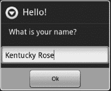

***图 8-1。**带有标题、提示、输入框和确定按钮的输入对话框*

当用户按下 Ok 按钮时，`getInput`将返回一个结果对象作为命名元组。如果您使用 Python IDLE 工具在模拟器或真实设备上远程运行代码，您将能够看到打印名称代码的结果。在这一章中我将会用到 IDLE，因为当你需要单步调试代码或者只是查看不同 API 调用的结果时，它会让事情变得更简单。在这种情况下，结果将如下所示:

`Result(id=0, result=u'Kentucky Rose', error=None)`

为了便于跟踪，每个结果都被分配了一个惟一的 ID，这里我们得到了`id=0`。元组的第二个元素是`result`，包含用户在文本框中输入的文本字符串。每个结果还包含一个 error 元素，向调用者提供可能遇到的任何错误情况的反馈。在这个例子中，我们看到了`error=None`，意思是没有错误。当按下 Ok 时，你应该会看到一个类似于图 8-2 的弹出信息显示一小段时间。

***图 8-2。**显示用户输入的 makeToast 对话框*

我们将用来创建对话框的主要 API 调用是`dialogCreateAlert`。它接受两个可选参数来设置对话框标题和一个在对话框中显示的消息字符串。消息字符串是向用户描述您希望他们在对话框中做什么的好地方。[图 8-3](#fig_8_3) 显示了以下代码的结果:

`droid.dialogCreateAlert('Settings Dialog','Chose any number of items and then press OK')
droid.dialogShow()`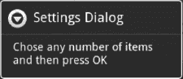

***图 8-3。**带有标题和消息的基本警报对话框*

警报对话框可以比作台式机上的弹出对话框。它允许你创建三个按钮，提供三个不同的返回值。要创建按钮，您必须使用任何一个`dialogSetNegativeButtonText`、`dialogSetNeutralButtonText`和`dialogSetPositiveButtonText` API 调用来启用按钮并设置要显示的文本。下面的代码添加了两个按钮，分别用于一个肯定结果和一个否定结果:

`droid.dialogSetPositiveButtonText('Done')
droid.dialogSetNegativeButtonText('Cancel')`

图 8-4 显示了我们的对话框在文本中添加了按钮后的样子。基本警报对话框只显示文本，不返回任何内容。这对于交流信息是有用的，但是一旦你显示一个警告对话框，你必须通过调用`dialogDismiss`来消除它，或者用户必须按下返回硬件按钮。

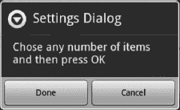

***图 8-4。**有两个按钮的警告对话框*

要找出用户按下了哪个按钮，您必须像这样调用`dialogGetResponse`:

`>>> response = droid.dialogGetResponse()
>>> response
Result(id=10, result={u'canceled': True}, error=None)`

如果你需要用户给你某种类型的文本输入，你会想要使用`dialogGetInput`函数。下面是提示一条消息并将结果设置为等于变量`ans`的代码:

`ans = droid.dialogGetInput("Message Title","Message Text","Default").result`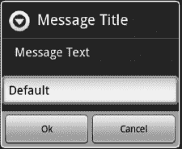

***图 8-5。**获取输入对话框*

如果用户按下 Cancel 按钮，您将看到如下所示的空返回:

`Result(id=0, result=None, error=None)`

当您调用`dialogGetResponse`时，它将返回用户完成的最后一个动作。因此，如果你有一个多选对话框显示，用户简单地按下取消，你的结果将是标签为*取消*按钮的输出。例如，以下是在 Python 空闲控制台的设置对话框中多次传递的结果:

`>>> droid.dialogSetItems(['one','two','three','four','five','six','seven','eight','nine'])
Result(id=16, result=None, error=None)
>>> droid.dialogShow()
Result(id=17, result=None, error=None)
>>> droid.dialogGetResponse()
Result(id=18, result={u'canceled': True, u'which': u'positive'}, error=None)
>>> droid.dialogShow()
Result(id=19, result=None, error=None)
>>> droid.dialogGetResponse()
Result(id=20, result={u'item': 2}, error=None)
>>> droid.dialogShow()
Result(id=21, result=None, error=None)`

第一行创建一个警告对话框，其中有九个元素添加到上一个示例中定义的两个按钮上。[图 8-6](#fig_8_6) 显示了结果对话框。

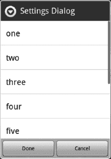

***图 8-6。**带有项目列表和两个按钮的警告对话框*

让我们通过使用`Result id`来识别每一个来看看所有这些。第一个响应`id=18`返回一个 Python 字典，其中包含两个名为`'canceled'`和’`which'`的元素。它们的值分别是`'True'`和`'positive'`。这告诉我们，用户取消了操作，而没有通过按下肯定按钮来选择任何项目，在我们的例子中标记为`'Done'`。

下一个结果`id=20`是用户选择列表中一个项目的例子。注意，结果仅仅是`{u'item': 2}`。同样，我们有一个字典作为结果返回，但是这次它只有一个元素:'`item'`。`'item'`的值是 2，翻译成文本行`'three'`。这是因为 Python 使用从零开始的索引。您看不到按钮的任何值，因为当用户选择列表中的一项时，对话框将关闭。对于这种类型的用户交互，用户只需要一个按钮就可以取消所有操作。

使用 Python 空闲控制台检查对话框按钮响应的最后一个示例如下:

`>>> droid.dialogGetResponse()
Result(id=22, result={u'canceled': True, u'which': u'neutral'}, error=None)`

`Result id=22`是用户按下取消按钮时所期望看到的。在我们的例子中，我们定义了积极和中立按钮，因此字典值。我们的设置脚本需要的最后一个 UI 对话框是`dialogCreateInput`。在下一节中，我们将使用它来提示用户何时需要输入。

### 书名搜索

现在让我们看一下前面的例子，展示如何显示一个条目列表，并使用`dialogCreateInput`函数调用来提示书名，然后在显示结果之前进行 Google 图书搜索。[图 8-7](#fig_8_7) 显示了我们的对话框，提示输入搜索词。一旦我们有了我们的术语，我们就把它发送给 Google search API，然后用返回的标题列表填充警告对话框。

***图 8-7。**谷歌图书搜索输入对话框*

执行搜索的代码如下所示:

`service = gdata.books.service.BookService()
service.ClientLogin(email, pw)

titles = []
for bookname in service.get_library():
titles.append(bookname.dc_title[0].text)

droid.dialogCreateAlert()
droid.dialogSetItems(list)
droid.dialogShow()`

该代码将显示一个类似于图 8-8 中[所示的对话框。](#fig_8_8)

***图 8-8。**带有结果列表的警告对话框*

现在我们已经解决了这个问题，我们将快速地看一下其他一些您可能在某个时候想要使用的 UI 元素。

#### 便捷对话框

对话框外观包括许多方便的功能，如日期选择器。[图 8-9](#fig_8_9) 显示了以下代码的结果:

`droid.dialogCreateDatePicker(2011)
droid.dialogShow()`

此函数的参数是可选的，但是如果使用的话，应该是表示年、月和日的整数。如果没有输入，对话框将默认为 1970 年 1 月 1 日的初始日期。

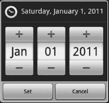

***图 8-9。**日期选择器对话框初始化为 2011 年 1 月 1 日*

要读取用户的响应，您需要如下调用`dialogGetResponse`:

`>>> droid.dialogGetResponse()
Result(id=27, result={u'year': 2011, u'day': 6, u'which': u'positive', u'month': 3},
error=None)`

如果使用 Python 的 IDLE 实用程序，可以很容易地检查这些函数返回的结果。将结果分配给变量`date l` ets，您可以轻松地寻址不同的命名值:

`>>> date = droid.dialogGetResponse().result
>>> date
{u'year': 2011, u'day': 7, u'which': u'positive', u'month': 3}
>>> date["year"]
2011
>>> date["month"]
3
>>> date["day"]
7`

另一个助手对话框是`createTimePicker`功能。就像`createDatePicker`一样，您可以提供输入来设置显示的初始时间。下面的代码将产生如图[图 8-10](#fig_8_10) 所示的对话框。

`>>> droid.dialogCreateTimePicker()
Result(id=9, result=None, error=None)
>>> droid.dialogShow()
Result(id=10, result=None, error=None)`

请注意，您会立即从`dialogCreateTimePicker`中获得一个 result 对象，因为它让您知道您成功地设置了一个时间选择器。现在您可以继续使用`dialogShow`调用来实际显示对话框。这里我选择不使用预设时间，所以对话框显示 12:00 AM 或午夜。

***图 8-10。**显示默认时间的时间选择器对话框*

如果您知道要显示的内容，日期和时间选取器对话框都接受起始值。对于时间选择器，第一个输入应该是表示小时的整数，第二个输入应该是表示要显示的分钟的整数。第三个可选输入参数是用于设置 24 小时模式的布尔值，默认情况下设置为 false。如果这个参数作为`true`传入，您将看到 24 小时以内的值。

通常，您会希望在键入密码的每个字符后都回显一个星号。该对话框将立即显示，无需调用`showDialog`。它将回显每个键入的字符，以便用户可以得到一些关于按下了什么字符的反馈。键入一个新字符会用星号覆盖前一个字符。[图 8-11](#fig_8_11) 显示了最后一个字符仍然显示的对话框。

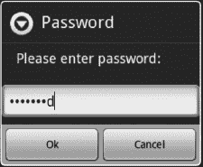

***图 8-11。**显示最后输入字符的获取密码对话框*

您必须调用`dialogGetResponse`来返回输入的密码或确定按下了哪个按钮。下面是使用 IDLE 时的情况:

`>>> droid.dialogGetPassword()
Result(id=5, result=u'Password', error=None)
>>> droid.dialogGetResponse()
Result(id=6, result={u'which': u'positive', u'value': u'Password'}, error=None)
>>> droid.dialogGetPassword()
Result(id=7, result=None, error=None)
>>> droid.dialogGetResponse()
Result(id=8, result={u'which': u'negative', u'value': u''}, error=None)`

在第一行`(id=5)`，输入密码并按下 Ok 按钮。你可以看到它返回结果`'Password'`。使用对`dialogGetResponse`的调用显示按下了肯定按钮，并且返回了值`'Password'`。对于下一个打给`dialogGetPassword`的电话，用户只需按下取消按钮。这里的结果`(id=7)`显示`'None'`。使用对`dialogGetResponse`的另一个调用显示按下了负按钮，在本例中为 Cancel，并且返回了一个空值。

#### 进度对话框

让用户知道你的应用正在做什么总是一个好主意。如果您需要做一些需要几秒钟以上的处理，您应该考虑使用进度对话框。SL4A 为水平进度条和微调对话框提供了 API facade。使用进度对话框的最大挑战是确定如何度量进度，然后显示进度。

在前一章中，我使用了一个水平进度条来显示文件下载进度。在这种情况下，文件的大小用于确定进度。调用`dialogCreateHorizontalProgress`的时候不用指定什么。这只会显示一个进度对话框，范围从 0 到 100。[图 8-12](#fig_8_12) 显示了你将从代码中得到什么:

`droid.dialogCreateHorizontalProgress()
droid.dialogShow()`

***图 8-12。**带有默认选项的水平进度条*

对话框显示后，您可以使用`dialogSetMaxProgress`更改显示的最大值。您必须使用`dialogSetCurrentProgress`来更新您的申请进度。下面的代码将进度条更新到 50%，假设最大进度已经设置为`4096`:

`droid.dialogSetCurrentProgress(2048)`

图 8-13 显示了这段代码将会产生的结果。

***图 8-13。**水平进度条在 50%*

还有一些时候，您只需要让用户知道应用正在进行某种类型的处理。这将调用“微调器进度”对话框。下面是你需要做的一切来启动一个:

`droid.dialogCreateSpinnerProgress("Spinner Test","Spinner Message")`

[图 8-14](#fig_8_14) 显示了你将会得到什么。

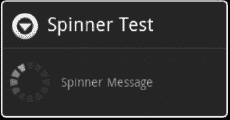

***图 8-14。**微调对话框*

两个进度对话框都需要调用`dialogDismiss`来关闭。

#### 模态与非模态对话框

在构建用户界面时，对话框行为实际上只有两种选择。模式对话框或窗口通常是另一个进程或窗口的子进程，这意味着它有一个父进程或更高级别的窗口可以返回。处理将等待或阻塞，直到用户与新对话框交互。在警告对话框的例子中，它本质上是模态的，这意味着它不会关闭，直到你做一些事情。

这里有一些代码来演示我所说的内容:

`# Demonstrate use of modal dialog. Process location events while
# waiting for user input.
import android
droid=android.Android()
droid.dialogCreateAlert("I like swords.","Do you like swords?")
droid.dialogSetPositiveButtonText("Yes")
droid.dialogSetNegativeButtonText("No")
droid.dialogShow()
droid.startLocating()
while True: # Wait for events for up to 10 seconds.
response=droid.eventWait(10000).result
if response==None: # No events to process. exit.
break
if response["name"]=="dialog": # When you get a dialog event, exit loop
break
print response # Probably a location event.

# Have fallen out of loop. Close the dialog
droid.dialogDismiss()
if response==None:
print "Timed out."
else:
rdialog=response["data"] # dialog response is stored in data.
if rdialog.has_key("which"):
result=rdialog["which"]
if result=="positive":
print "Yay! I like swords too!"
elif result=="negative":
print "Oh. How sad."
elif rdialog.has_key("canceled"): # Yes, I know it's mispelled.
print "You can't even make up your mind?"
else:
print "Unknown response=",response
print droid.stopLocating()
print "Done"`

这段代码将显示一个类似于图 8-15 中[所示的对话框。](#fig_8_15)

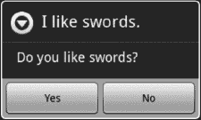

***图 8-15。**用于演示模态显示的警告对话框*

如果用户什么都不做，对话框将超时并被关闭。使用 IDLE，您可以看到结果:

`Timed out.
Result(id=7, result=None, error=None)
Done`

如果用户按下 Yes 按钮，您应该会看到以下结果:

`Yay! I like swords too!
Result(id=7, result=None, error=None)
Done`

按下“否”按钮将显示以下信息:

`Oh. How sad.
Result(id=7, result=None, error=None)
Done`

如果用户碰巧按下硬件返回按钮来取消应用，您将在空闲的主窗口中看到以下内容:

`You can't even make up your mind?
Result(id=7, result=None, error=None)
Done`

重要的是使用事件来实现超时特性。普通模式对话框不会超时，除非用户取消整个应用。这里的`eventWait`函数调用用于等待按下其中一个按钮或 1000 毫秒或 1 秒，然后继续处理。事件不起作用，除非已经启动了一个活动，例如`startLocating`。这将生成位置事件，必须对其进行过滤，以便只查找感兴趣的事件。这是使用如下所示的代码行完成的:

`if response["name"]=="dialog": # When you get a dialog event, exit loop`

这一行允许脚本关闭`'dialog'`事件并继续处理，同时忽略基于位置的事件。

#### 选项菜单

许多 Android 应用利用选项菜单来允许用户设置应用行为的偏好或任何选项。SL4A 提供了一种使用`addOptionsMenuItem`调用创建选项菜单项的方法。

`import android
droid=android.Android()

droid.addOptionsMenuItem("Silly","silly",None,"star_on")
droid.addOptionsMenuItem("Sensible","sensible","I bet.","star_off")
droid.addOptionsMenuItem("Off","off",None,"ic_menu_revert")

print "Hit menu to see extra options."
print "Will timeout in 10 seconds if you hit nothing."

droid.webViewShow('file://sdcard/sl4a/scripts/blank.html')

while True: # Wait for events from the menu.
response=droid.eventWait(10000).result
if response==None:
break
print response
if response["name"]=="off":
break
print "And done."`

需要调用`webViewShow`来显示除了添加到选项菜单中的系统屏幕之外的内容。您不允许更改正常的系统选项，因此您需要运行某种应用来修改选项菜单。[图 8-16](#fig_8_16) 显示了如果你按下硬件菜单按钮，运行前一个脚本的结果应该是什么样子。

***图 8-16。**示例选项菜单*

如果用户按下 Sensible 按钮，您将得到以下结果:

`{u'data': u'I bet.', u'name': u'sensible', u'time': 1301074971174000L}`

请注意，这个结果实际上是一个事件的输出，包括命名的项目`data`、`name`和`time`。然后，您需要根据用户按下的菜单选项执行额外的处理。

#### 用 dialogCreateAlert 列出文件

有时你需要得到一个文件列表，并在一个对话框中显示它们，如图 8-17 中的[所示。这里有一个简短的脚本可以做到这一点:](#fig_8_17)

`import android, os

droid=android.Android()

list = []
for dirname, dirnames, filenames in os.walk('/sdcard/sl4a/scripts'):
for filename in filenames:
list.append(filename)

droid.dialogCreateAlert('/sdcard/sl4a/scripts')
droid.dialogSetItems(list)
droid.dialogShow()
file = droid.dialogGetResponse().result
print(list[file])`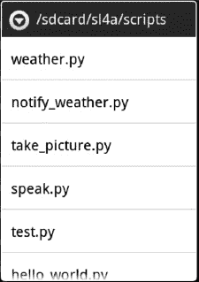

***图 8-17。**简单的文件选择器对话框*

这段代码稍有不同的地方是增加了深入子目录的功能。如果您只是简单地测试用户选择的项目是否实际上是一个目录，这是非常容易的。如果是，您只需清除项目并用新子目录的内容填充它。新的对话框看起来类似于[图 8-18](#fig_8_18) 。

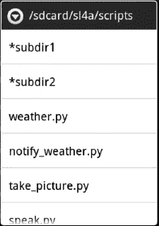

***图 8-18。**显示目录的简单文件选择器对话框*

请注意，目录前面有一个*号，当前路径显示在对话框的标题字符串中。现在我们有了一个全功能的文件选择器对话框，可以在后面的例子中使用。下面是我添加的代码行，用于检查所选项目是否是目录:

`if os.path.isdir(start + '\\' + list[file['item']][1:]):`

这里我们使用`isdir`函数来检查文件的完整路径名，并且我们使用 Python 的切片符号来获取星号后面的所有内容。

#### 作为 Python 对象的对话框

从用户界面处理处理或决策的一种方法是在 Python 中定义一个函数，以帮助清理代码并提供一个更加模块化的逻辑流。下面是我们的 UI 列表测试代码的样子:

`# Test of Lists
import android,sys
droid=android.Android()

#Choose which list type you want. def getlist():
droid.dialogCreateAlert("List Types")
droid.dialogSetItems(["Items","Single","Multi"])
droid.dialogShow()
result=droid.dialogGetResponse().result` 
`if result.has_key("item"):
return result["item"]
else:
return -1

#Choose List
listtype=getlist()
if listtype<0:
print "No item chosen"
sys.exit()

options=["Red","White","Blue","Charcoal"]
droid.dialogCreateAlert("Colors")
if listtype==0:
droid.dialogSetItems(options)
elif listtype==1:
droid.dialogSetSingleChoiceItems(options)
elif listtype==2:
droid.dialogSetMultiChoiceItems(options)
droid.dialogSetPositiveButtonText("OK")
droid.dialogSetNegativeButtonText("Cancel")
droid.dialogShow()
result=droid.dialogGetResponse().result
# droid.dialogDismiss() # In most modes this is not needed.
if result==None:
print "Time out"
elif result.has_key("item"):
item=result["item"];
print "Chosen item=",item,"=",options[item]
else:
print "Result=",result
print "Selected=",droid.dialogGetSelectedItems().result
print "Done"`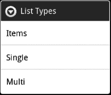

***图 8-19。**带有选项列表的初始对话框*

下一个出现的对话框取决于用户的选择。如果用户选择项目，他们会看到一个类似[图 8-20](#fig_8_20) 的对话框。该对话框提供了四个选项和两个按钮。如果用户选择其中一项，如白色，代码将返回以下内容:

`Chosen item= 1 = White
Done`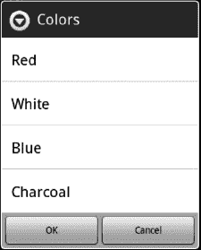

***图 8-20。从选择项中显示**对话框*

从初始对话框中选择 Single 将显示一个类似于图 8-21 所示的对话框。此对话框演示了使用单选按钮提示用户进行单次输入的一种略有不同的方式。在这个对话框中，你需要一个 Ok 按钮在选择一个特定的项目后关闭这个对话框。选择 Cancel 按钮将为用户提供不做任何选择就退出对话框的选项。从该对话框中选择白色的结果如下:

`Result= {u'which': u'positive'}
Selected= [1]
Done`

 **提示**如果您远程运行任何需要引用文件系统的应用，您需要知道它将在您的本地文件系统上寻找，而不是在设备或模拟器上。通过在主驱动器上创建一个名为`/sdcard`的目录，然后添加一个名为`sl4a`的子目录，然后在 sl4a 下添加另一个名为`scripts`的子目录，可以镜像设备或仿真器上的相同结构。

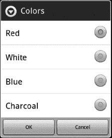

***图 8-21。**对话框显示从选择单个*

最后一个选项是多选，允许用户从列表中选择多个项目。假设用户选择了图 8-22 中[所示的选项，你会得到如下结果:](#fig_8_22)

`Result= {u'which': u'positive'}
Selected= [0, 1, 2]
Done`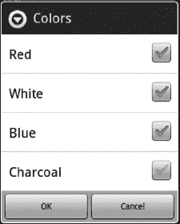

***图 8-22。从选择多个***中显示对话框

如果用户选择取消按钮，您会看到一个结果，表明选择了否定响应按钮，如:

`Result= {u'which': u'negative'}
Selected= []
Done`

#### T0" 播客应用

我发现我的 Android 手机令人讨厌的一点是音乐播放器。如果你有大量的音乐文件，而你只是想听一些类似播客的东西，这可能是个问题。这个问题的部分原因是媒体播放器在你的 MP3 文件中使用 ID3 标签来按照专辑、艺术家甚至是单首歌曲对你的音乐进行分类。如果您想要播放的文件碰巧没有正确设置 ID3 标签，您可能无法使用媒体播放器界面找到它，除非它显示在`Unknown`标签下。

SL4A 拥有我们构建一个简单的小应用所需的一切，可以显示目录的内容，然后将选定的文件发送到媒体播放器。我们首先要使用的是我们之前使用的目录浏览器代码。[图 8-23](#fig_8_23) 显示了运行从`/sdcard/sl4a`目录开始的代码会看到什么。

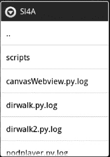

***图 8-23。**文件选择器对话框*

填充警告对话框的所有工作都是通过一个名为`show_dir`的函数来完成的。代码做的第一件事就是使用 Python `os.path.exists()`函数来确定`base_dir`中指定的路径是否存在。如果没有，它将使用`os.makedirs(base_dir)`创建子目录。检查之后，代码将使用 Python 的`os.listdir()`函数来检索`base_dir`目录中所有目录和文件的列表。下面是这段代码的样子:

`nodes = os.listdir(path)

# Make a way to go up a level.
if path != base_dir: nodes.insert(0, '..')

droid.dialogCreateAlert(os.path.basename(path).title())
droid.dialogSetItems(nodes)
droid.dialogShow()

# Get the selected file or directory.
result = droid.dialogGetResponse().result`

在这个关头，有几件事需要指出。因为我们将使用递归的编程结构，当用户在文件系统中移动时，重复显示一个新的警告对话框，所以需要测试。这确保了用户不会去`base_path`目录和任何子目录之外的任何地方。如果用户当前不在顶层，它也可以使用`'nodes.insert(0,'..')'`向上一级目录(见[图 8-23](#fig_8_23) 中的第一个条目)。对`droid.dialogGetResponse()`的调用将被阻塞或等待，直到用户选择一个目录或文件，或者使用硬件按钮退出程序。

当用户做一些事情时，结果中应该有数据来确定应用下一步做什么。如果用户选择一个目录，应用将加载该目录的内容，并创建一个新的警告对话框。如果用户选择一个文件，它将检查以确保它是一个`mp3`文件，然后使用这行代码启动媒体播放器:

`droid.startActivity('android.intent.action.VIEW', 'file://' + target_path, 'audio/mp3')`

如果你碰巧在你的设备上安装了多个应用来播放媒体，你会得到另一个对话框提示选择使用哪一个。您还可以选择将该选择作为文件类型`mp3`的默认选择。当用户选择一个目录时，应用使用递归重新加载下一个目录，代码如下:

`if os.path.isdir(target_path): show_dir(target_path)`

如果用户打开了子目录，另一个选项是向上一级。对此进行测试的代码行如下:

`if target == '..': target_path = os.path.dirname(path)`

因此，如果用户选择带有`'..'`的行，代码会将`target_path`设置为字符串`path`。调用`show_dir`函数时，path 的初始值被设置为`string` `base_dir`，如下所示:

`def show_dir(path=base_dir):`

 **注意**递归是创建受控用户界面的一种很好的方式——这意味着相同的代码会被执行多次，直到用户以你想要的方式退出。

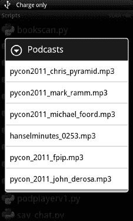

***图 8-24。【podplayer.py 的. mp3 文件列表***

我们的 Podplayer 应用的最终用户界面如图 8-24 所示。完整的代码如下所示:

`import android, os, time

droid = android.Android() # Specify our root podcasts directory and make sure it exists.
base_dir = '/sdcard/sl4a/scripts/podcasts'
if not os.path.exists(base_dir): os.makedirs(base_dir)

def show_dir(path=base_dir): """Shows the contents of a directory in a list view."""

# The files & directories under "path".
nodes = os.listdir(path)

# Make a way to go up a level.
if path != base_dir: nodes.insert(0, '..')

droid.dialogCreateAlert(os.path.basename(path).title())
droid.dialogSetItems(nodes)
droid.dialogShow()` 
`# Get the selected file or directory.
result = droid.dialogGetResponse().result
droid.dialogDismiss()
if 'item' not in result:
return
target = nodes[result['item']]
target_path = os.path.join(path, target)

if target == '..': target_path = os.path.dirname(path)

# If a directory, show its contents.
if os.path.isdir(target_path): show_dir(target_path)

# If an MP3, play it.
elif os.path.splitext(target)[1].lower() == '.mp3':
droid.startActivity('android.intent.action.VIEW',
'file://' + target_path, 'audio/mp3')

# If not, inform the user.
else:
droid.dialogCreateAlert('Invalid File',
'Only .mp3 files are currently supported!')
droid.dialogSetPositiveButtonText('Ok')
droid.dialogShow()
droid.dialogGetResponse()
show_dir(path)

if __name__ == '__main__': show_dir()`

在这个例子中，还有一些事情值得讨论，Python 让这些事情变得非常简单。测试特定的文件扩展名只需要一行代码，如下所示:

`os.path.splitext(target)[1].lower()`

此外，您应该注意到这个脚本中使用的另外两个`os.path`方法，`os.path.join`和`os.path.isdir`。`os.path library`模块有很多方法可以让处理文件系统和文件变得轻而易举。

#### 构建 mysettings 应用

设置脚本背后的基本思想是构建一个小的实用程序，该程序将创建适合特定电话设置组合的脚本。我们将显示一个对话框，其中有不同的设置可供选择，然后让用户选择保存它们的文件名。所有用户需要做的是创建一个链接到设置文件夹，然后将有一种方式来配置手机的两个触摸。我们将使用多项选择，以便用户能够选择不同的功能来启用。

我们将使用标准 Python 代码写出我们的最终脚本，并将其保存到我们的目录中。对于这个例子，我们将简单地使用一个硬编码的目录，但是您可以给用户一个选项，而不需要太多额外的编码。最大的问题是确保选择的目录在 sd 卡上，并且用户有权限写入。我们将使用`/sdcard/sl4a/mysettings`作为我们的目标目录。脚本运行时要做的第一件事是检查该目录是否存在，如果不存在，它将创建它。这总共需要三行 Python 代码:

`import os
if not os.path.exists('/sdcard/sl4a/settings'):
os.mkdir('/sdcard/sl4a/settings')`

执行完这段代码后，我们确定有一个目录可以用来保存我们的设置脚本。用户可以创建该目录的快捷方式，以便单击访问不同的设置脚本。我们的脚本没有做的另一件事是检查任何不一致的地方。把飞行模式打开，把 Wifi 或者蓝牙设置成开，真的没什么意义。飞行模式设置背后的意图是允许脚本关闭飞行模式并打开其他模式。大多数手机都有一个相当简单的方法来打开飞行模式，所以我们不会试图重现这一点。图 8-25 显示了我们最终设置对话框的样子。

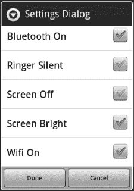

***图 8-25。**带有项目列表和两个按钮的警告对话框*

当您单击 Done 按钮时，您将看到一个新的对话框，允许您命名脚本。要退出此对话框，您必须按“完成”或“取消”。如果您愿意，也可以使用硬件后退按钮退出应用。

[图 8-26](#fig_8_26) 显示了提示用户输入文件名的最终对话框的样子。

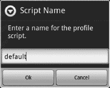

***图 8-26。**提醒对话框提示输入保存设置脚本的名称*

我们需要查看的最后一段代码处理多重选择对话框的返回。首先，您必须检查用户按下了哪个按钮。如果取消按钮被按下，我们想退出脚本，不做任何事情。这需要调用`dialogGetResponse`来确定哪个按钮被按下了。实际读取响应需要调用`dialogGetSelectedItems`。这将返回所选项目的列表。下面是获得用户响应的一段代码:

`response = droid.dialogGetResponse().result

if 'canceled' in response: droid.exit()
else:
response = droid.dialogGetSelectedItems().result`

一旦我们有了选定的值，我们就可以选择将什么写到我们的最终脚本中。为了做到这一点，我们将使用一些 Python 技巧，从包含与我们需要完成的积极和消极行动相对应的条目的列表中提取特定的一行。`toggles`列表由元组组成，每个元组包含两个字符串，因此该列表总共有五个元素。下面是我们的`toggles`列表:

`toggles = [
('droid.toggleAirplaneMode(True)', 'droid.toggleAirplaneMode(False)'),
('droid.toggleBluetoothState(True)', 'droid.toggleBluetoothState(False)'),
('droid.toggleRingerSilentMode(True)', 'droid.toggleRingerSilentMode(False)'),
('droid.setScreenBrightness(0)', 'droid.setScreenBrightness(255)'),
('droid.toggleWifiState(True)', 'droid.toggleWifiState(False)'),
]`

现在我们可以使用`enumerate`函数，它接受一个 iterable 在这种情况下，list `toggles`得到一个包含每个条目的索引和条目本身的元组列表，分别为`i`和`toggle`。

`for i, toggle in enumerate(toggles):
if i in response:
script += toggles[i][0]
else:
script += toggles[i][1]
script += '\n'`

下面是用户选择“确定”时文件的样子:

`import android

droid = android.Android() droid.toggleAirplaneMode(False)
droid.toggleBluetoothState(True)
droid.toggleRingerSilentMode(False)
droid.setScreenBrightness(255)
droid.toggleWifiState(True)

droid.dialogCreateAlert('Profile Enabled', 'The "default" profile has been activated.') droid.dialogSetPositiveButtonText('OK')
droid.dialogShow()`

差不多就是这样。脚本中的前两行是导入`android`模块和实例化我们的`droid`对象所必需的。

`import android, os

script_dir = '/sdcard/sl4a/scripts/settings/'

if not os.path.exists(script_dir):
os.makedir(script_dir)

droid = android.Android()
toggles = [
('droid.toggleAirplaneMode(True)', 'droid.toggleAirplaneMode(False)'),
('droid.toggleBluetoothState(True)', 'droid.toggleBluetoothState(False)'),
('droid.toggleRingerSilentMode(True)', 'droid.toggleRingerSilentMode(False)'),
('droid.setScreenBrightness(0)', 'droid.setScreenBrightness(255)'),
('droid.toggleWifiState(True)', 'droid.toggleWifiState(False)'),
]

droid.dialogCreateAlert('Settings Dialog', 'Chose any number of items and then press OK')
droid.dialogSetPositiveButtonText('Done')
droid.dialogSetNegativeButtonText('Cancel')

droid.dialogSetMultiChoiceItems(['Airplane Mode',
'Bluetooth On',
'Ringer Silent',
'Screen Off',
'Wifi On'])

droid.dialogShow()
response = droid.dialogGetResponse().result

if 'canceled' in response:
droid.exit()
else:
response = droid.dialogGetSelectedItems().result` 
`droid.dialogDismiss()
res = droid.dialogGetInput('Script Name',
'Enter a name for the profile script.',
'default').result

script = '''import android

droid = android.Android()
'''

for i, toggle in enumerate(toggles):
if i in response:
script += toggles[i][0]
else:
script += toggles[i][1]
script += '\n'

script += '''
droid.dialogCreateAlert('Profile Enabled', 'The "%s" profile has been activated.')
droid.dialogSetPositiveButtonText('OK')
droid.dialogShow()''' % res

f = open(script_dir + res + '.py', 'w')
f.write(script)
f.close()`

### 总结

本章向您展示了通过可用对话框与用户交互的基础知识。

这是本章的要点列表:

*   对话框基础知识:SL4A 对话框外观提供了许多标准的方式来呈现信息和获取用户输入。了解如何以及何时使用每一个将有助于您构建既有用又易于使用的脚本。
*   **理解结果**:理解不同输入对话框的预期结果以及如何处理用户可能选择的每个按钮是很重要的。
*   **模态和非模态对话框**:当你继续执行前需要用户输入时，使用模态对话框。
*   **使用来自 Python 标准库的模块**:这些模块对于处理日常文件系统事务非常有用。
*   良好的编程实践:良好的编程实践是无可替代的，包括处理用户可能采取的所有行动。
*   **使用多个对话框**:你可以将多个对话框类型链接在一起，构建一个更复杂的 UI，通过`createAlertDialog`进行提示，并使用`dialogSetItems`函数调用递归输出一个列表框。