## C H A P T E R 9

## 带 HTML 的 Python GUIs

本章将介绍使用 SL4A 构建基于 CSS、HTML、JavaScript 和 Python 的图形用户界面(GUI)的可用选项。

 **注**本章将讨论如何使用 CSS、HTML 和 JavaScript 来构建呈现真实世界用户界面的应用。如果你有这些领域的背景知识会很有帮助，但这不是必须的。

本章的主要主题如下:

*   HTML 图形用户界面基础
*   使用级联样式表(CSS)向 HTML 添加一些格式
*   用 CSS、HTML、JavaScript 和 Python 创建商业质量的用户界面

这里的基本方法是使用 HTML 和 JavaScript 来构建用户界面(UI ),然后在幕后使用 Python 来处理任何额外的处理。CSS 可以用来使 HTML 字段和字体在外观和一致性方面更加整洁。Python 也可以用来构建 HTML 文件，在没有任何用户界面的情况下显示信息。

### HTML 和基本信息显示

在构建应用时，需要简单地向用户显示大量信息的情况并不少见。这可能是一个列表的形式，甚至只是一个连续的文本框。使用 HTML 作为显示机制，两者都很容易得到支持。HTML 文件可以通过编程生成，或者使用任何文本编辑器创建，然后使用`webViewShow` API 调用启动。

我们先看第一个选项。在这个示例代码中，我们将查询电池的状态，并在一个简单的 HTML 文件中显示您想知道的一切。然后，我们将通过调用`webViewShow`来启动该文件，我们就完成了。下面是实现它的代码:

`import time

import android

# Simple HTML template using python's format string syntax.
template = '''<html><body>
<h1>Battery Status</h1>
<ul>
<li><strong>Status: %(status)s</li>
<li><strong>Temperature: %(temperature)s</li>
<li><strong>Level: %(level)s</li>
<li><strong>Plugged In: %(plugged)s</li>
</ul>
</body></html>'''

if __name__ == '__main__':
droid = android.Android()

# Wait until we have readings from the battery.
droid.batteryStartMonitoring()
result = None
while result is None:
result = droid.readBatteryData().result
time.sleep(0.5)

# Write out the HTML with the values from our battery reading.
f = open('/sdcard/sl4a/scripts/battstats.html', 'w')
f.write(template % result)
f.close()

# Show the resulting HTML page.
droid.webViewShow('file:///sdcard/sl4a/scripts/battstats.html')`

这将在`scripts`目录中创建一个名为`battstats.html`的文件。如果您想保存这些文件的集合，您只需将当前时间添加到文件名中，每次都会生成一个唯一的文件。[图 9-1](#fig_9_1) 显示了代码显示文件时应该看到的内容:

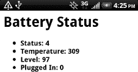

***图 9-1。**使用简单的 HTML 文件显示电池状态*

这个调用的第二个例子是从[第 7 章](07.html#ch7)中获取我们的 WiFi 扫描仪示例，并使用 HTML 文件方法显示信息。在这种情况下，您可能希望在文件中添加诸如时间和日期戳之类的东西，然后每次都追加到末尾。这样，您将有一个您的设备已经看到的 WiFi 接入点的运行日志。下面是生成该文件的代码:

`import time
import android

if __name__ == '__main__':
droid = android.Android()

# Show the HTML page immediately.
droid.webViewShow('file:///sdcard/sl4a/scripts/wifi.html')

# Mainloop
while True:

# Wait until the scan finishes.
while not droid.wifiStartScan().result: time.sleep(0.25)

# Send results to HTML page.
droid.postEvent('show_networks', droid.wifiGetScanResults().result)

time.sleep(1)`

虽然这段代码只是显示当前范围内的 WiFi 接入点，但是您可以创建一个日志文件并将您的结果附加到其中。该文件会随着时间的推移而增长，直到您删除它。将它保存到文件中，然后显示为 HTML 文件的好处是，您可以使用与浏览网页相同的手指动作来滚动文件。[图 9-2](#fig_9_2) 显示了结果。

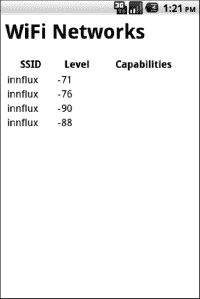

***图 9-2。**WiFi 扫描结果*

### HTML 和 JavaScript

除了基本的信息显示，下一步是添加某种类型的交互性。这就是我们必须将 JavaScript 引入讨论的地方。SL4A 为网页和 Python 之间的通信提供了一种机制。这是通过在网页中使用事件和一些 JavaScript 代码来实现的。JavaScript 代码的唯一真正要求是，在进行任何 API 调用之前，必须用代码`var droid = new Android()`实例化 Android 对象。完成后，您就可以像从 Python 中一样访问相同的 API facades 了。

下面是一个使用 JavaScript 获取联系人列表并根据数据动态构建网页的示例。这种技术可以用于任何返回您想要显示的数据的 API 调用。HTML 文件看起来是这样的:

`<html>
<head>
</head>
<body>
<h1>Contacts</h1>
<ul id="contacts"></ul>

</body>
</html>`

注意，我在这里做的只是调用`contactsGet` `routine`并传入`display_name`限定符。下面是 Python 代码实际显示 HTML 文件的样子(这段代码唯一做的事情就是加载 HTML 文件，然后退出):

`import android

droid = android.Android()
droid.webViewShow('file:///sdcard/sl4a/scripts/contacts.html')`

[图 9-3](#fig_9_3) 显示了我们努力的结果。

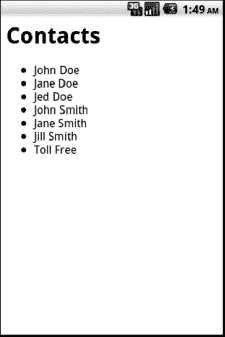

***图 9-3。**联系人列表的基本 HTML 显示*

这个版本很适合简单地显示信息，但是如果你想让用户能够用你展示的东西做一些事情呢？我们可以对 HTML 文件做一点小小的修改，并使用一个基本的表格和一个超链接添加一些交互。下面是 HTML 和 JavaScript 代码:

`<html>
<head>
</head>
<body>
<h1>Contacts</h1>
<table id="contacts"></table>

</body>
</html>`

JavaScript 代码有两处轻微的修改。首先，我们添加以下内容来创建一个超链接，以打开呼叫对话框:

`function call(number){
droid.phoneDialNumber(number);
}`

另一个变化是使用 HTML `<tr>`和`<td>`标记代替简单的列表元素标记来创建一个表格。虽然这种改变非常简单，但它无需编写大量代码就能创建良好的用户交互。[图 9-4](#fig_9_4) 显示了结果。

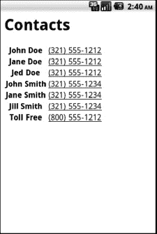

***图 9-4。**以表格形式显示联系人的 HTML 格式*

### HTML 图形用户界面表单基础

现在我们将看看使用 CSS、HTML 和 JavaScript 构建 SL4A GUI 的基础知识。一般来说，这个想法是创建一个 HTML 表单，使用 Python 来处理表单生成的事件。例如，你可以在窗体上有一个按钮，当你按下它的时候会发生一些事情。SL4A wiki 给出了一个简单的例子，我把它包含在[清单 9-1](#list_9_1) : 中

***清单 9-1。** text_to_speech.html*

`<html>
<head>
<title>Text to Speech</title>

</head>
<body>
<form onsubmit="speak(); return false;">
<label for="say">What would you like to say?</label>
<input type="text" id="say" />
<input type="submit" value="Speak" />
</form>
</body>
</html>`

***清单 9-2。** speakit.py*

`import android

droid = android.Android() droid.webViewShow('file:///sdcard/sl4a/scripts/text_to_speech.html')
while True:
result = droid.waitForEvent('say').result
droid.ttsSpeak(result['data'])`

组成这个程序需要两个文件:名为`text_to_speech.html`的 HTML 文件和我们称之为`speakit.py`的 Python 启动器(见[清单 9-2](#list_9_2) )。两者都必须位于设备上的`/sdcard/sl4a/scripts`目录中。要启动程序，运行 SL4A 文件列表中的`speakit.py`文件。Python 代码首先使用`webViewShow` API 调用启动`text_to_speech.html`文件，然后等待 HTML 页面触发一个事件。该事件在用户触摸“speak”按钮时生成。

[图 9-5](#fig_9_5) 显示了屏幕的样子。

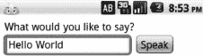

***图 9-5。**文本到语音转换演示的简单 HTML 页面*

JavaScript 代码包含在``标记中，并使用`postEvent` API 调用提供到调用 Python 脚本的连接。要启动这个 HTML 表单，需要调用如下的`webViewShow` API:

`import android

droid = android.Android() droid.webViewShow('file:///sdcard/sl4a/scripts/text_to_speech.html')
while True:
result = droid.waitForEvent('say').result
droid.ttsSpeak(result['data'])`

一旦显示了表单，Python 代码将阻塞并等待触发`'say'`事件。该事件将返回文本以传递给结果对象数据字段中的`ttsSpeak` `API`函数。当用户单击 speak 按钮时，web 页面将实际关闭，一旦控制从`ttsSpeak`函数返回，Python 代码将退出。

#### 简单的 HTML 表单

现在我们准备处理一个稍微复杂一点的有多个输入框和输入类型的问题。该脚本将显示一个屏幕，允许用户设置许多设备首选项设置，包括屏幕亮度和超时、媒体音量、铃声音量和 WiFi 模式。创建这种类型表单的 HTML 非常简单。这是你需要的一切:

`<body>

<h1>My Settings</h1>
<form>

<label for="brightness">Brightness Level</label>
<input size="5" id="brightness" type="text" />

<label for="timeout">Timeout Secs</label>
<select>
<option value="0">0</option>
<option value="1">1</option>
<option value="2">2</option>
<option value="3">3</option>
<option value="4">4</option>
<option value="5">5</option>
</select>

<label for="screen">Screen Off</label>
<input id="screen" type="checkbox" />

<label for="media_vol">Media Volume</label>
<input size="5" id="media_vol" type="text" />

<label for="ringer_vol">Ringer Volume</label>
<input size="5" id="ringer_vol" type="text" />

<label for="airplane_mode">Airplane Mode</label>
<input id="airplane_mode" name="radio" type="radio" />

<label for="wifi_on">Wifi On</label>
<input id="wifi_on" name="radio" type="radio" />

<input size="5" id="save" name="save" type="button" value="Save Settings" />
<input size="5" id="cancel" name="cancel" type="button" value="Cancel" />

</form>

</body>

</html>`

这将产生一个类似于[图 9-6](#fig_9_6) 的页面。正如你所看到的，这在小屏幕上呈现有一些问题。标题被砍掉了，按钮没有完全放在页面上，水平基准线似乎脱离了页面。虽然您可以对 HTML 进行一些调整以使其看起来更漂亮，但更好的方法是使用 CSS。

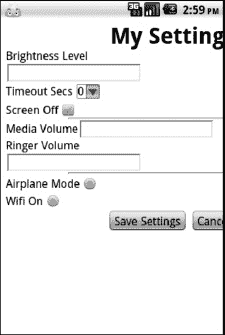

***图 9-6。**没有 CSS 的基本 HTML 表单*

#### 层叠样式表

用级联样式表(CSS)格式化 HTML 对创建和呈现一个干净的用户界面大有帮助。使用 CSS，你可以决定页面上所有 HTML 元素的对齐方式、字体、文本流和大小。这对于小屏幕来说非常方便，因为在小屏幕上，您想要精确地指示页面上的每个元素是如何出现的。

下面是一小段 CSS，我将使用它来帮助美化我们的用户设置页面:

`<html>
<head>

</head>`

web 表单的主体部分包含许多标准元素，如`
`标签、使用`<label>`和`<input>`标签的输入框，以及使用`<label>`和`<select>`标签的下拉框中的选项列表。前面的 CSS 代码控制标签的宽度和外观以及文本的对齐方式。它还控制按钮、`h1`和`hr` HTML 标签的格式。你可以用 CSS 做更多的事情，但是我们将在这个例子中停止。剩下的 HTML 看起来和以前一样。

图 9-7 显示了添加了 CSS 的 HTML 页面的样子。虽然差别不大，但请注意文本框的宽度和元素的整体间距。随意搭配你喜欢的造型。

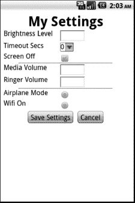

***图 9-7。**添加了 CSS 的 HTML 表单*

从`speakit.py`的例子中，我们看到了使用`droid.postEvent()` JavaScript 代码通过事件将数据发送回 Python 应用。这将发送一个表示要朗读的短语的字符串值。该表单包含许多元素，这些元素包含必须提取并发送回 Python 代码的信息。有许多方法可以实现这一点，但是我们将简单地使用一个键/值字符串对。

这可以通过在我们的 JavaScript 中增加几行代码来完成，以便从 HTML 表单中传递更多的信息。它看起来是这样的:

``

下面是这段代码的 HTML 代码:

`<body>

<h1>My Settings</h1>
<form onsubmit="post_data();return false;">

<label for="airplane_mode">Airplane Mode</label>
<input id="airplane_mode" name="radio" type="radio" />

<label for="wifi_on">WiFi On</label>
<input id="wifi_on" name="radio" type="radio" />

<label for="brightness">Brightness Level</label>
<input size="5" id="brightness" type="text" />

<label for="volume">Media Volume</label>
<input size="5" id="volume" type="text" />

<input size="5" id="save" name="save" type="submit" value="Save Settings" />
<input size="5" id="cancel" name="cancel" type="button" value="Cancel" />

</form>

</body>`

从特定的 HTML 表单元素中提取值的关键是`document.getElementById()`行。在 Python 端，这些值随后被用来设置手机上的特定设置。Python 代码如下所示:

`import android
import urlparse

droid = android.Android()
droid.webViewShow('file:///sdcard/sl4a/scripts/settings.html')
while True:
result = droid.waitForEvent('save').result
data = urlparse.parse_qs(result['data'][1:])

droid.toggleAirplaneMode('airplane' in data)
droid.toggleWifiState('wifi' in data)
droid.setScreenBrightness('screen' in data and 255 or 0)`

这个例子介绍了另一个名为`urlparse`的 Python 标准库工具。这个函数将把返回的元素解析成一个数据项列表，作为键/值对。此时剩下要做的就是调用适当的 API 函数来设置值。

#### 短信合并

SL4A 主页包括许多示例程序的链接，包括一些演示如何使用`webViewShow` API 函数的链接。SMS 合并绝对是使用 Python、JavaScript、HTML 和 CSS 的组合所能完成的最完整的例子。这个示例还让我们有机会使用 Eclipse 及其文件管理特性来演示如何构建一个复杂的应用，并最终将其作为 Android 包(`.apk`文件)分发。那部分实际上会在[第 10 章](10.html#ch10)中涉及。

为了理解这个示例程序，将它分解成不同的组件以了解每个函数的作用是很重要的。请记住，这个程序是一个样本，而不是一个真正的充分测试和工作的应用。它确实有一些怪癖，甚至暴露了 SL4A 早期版本中的一些 bug。这里的目的是检查代码，看看每个函数做什么，并让您知道使用相同的技术可以构建什么。如果您选择自己运行代码，我将在这一节的最后总结一下需要注意的事项。如果你打开`SMSMerge.zip`文件，你应该看到类似于[图 9-8](#fig_9_8) 的东西。

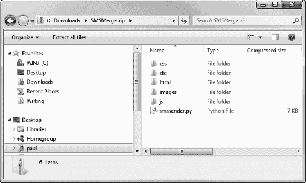

***图 9-8。**SMS merge . zip 文件的内容*

每个目录都包含基于名称的信息。`/etc`目录包含一个名为`SMSSender.conf`的文件，它存储了应用的所有配置信息。如果您用文本编辑器打开该文件，您将看到如下内容:

`[locale]
prefix = +60

[merger] informeveryratio = 10
informevery = 0

[application]
showonlycsvfiles = 0
showonlytextfiles = 1
showhiddendirectories = 0

[package]
version = 1.01`

这是一个使用标准 Python 编码实践的很好的例子，您可以在为桌面编写的典型开源应用中找到。它基于 Python 标准库`ConfigParser`模块。要使用它，只需简单地使用`import ConfigParser`，然后用`parser = ConfigParser()`实例化它，就可以访问不同的方法。节名完全由程序员决定，应该反映一个有意义的标题。在这种情况下，有四个命名的部分。解析时，它们会变成与节名相关联的键/值对的 Python 字典。下面是一段一段加载`config`文件的代码:

`def load( self ):
# Go through all the sections
sections = {}
# Some sections are meant to be ignored
for section in self.sections():
if section not in self.ignore:
items = self.items(section)
options = []
for item in items:
options.append( {"name":item[0],
"value":item[1],
"description": self.descriptions[section][item[0]]})
sections[section] = options
return sections`

在[图 9-9](#fig_9_9) 中，您可以看到设置页面上的可用选项，并了解它们如何与`config`文件中的值相关联。

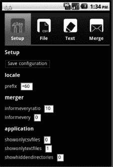

***图 9-9。**设置配置页面*

如果您单击任何选项的标签，您将会看到一个弹出对话框，其中描述了该选项的功能以及可接受的值。[图 9-10](#fig_9_10) 显示了你点击`showonlycsvfiles`线时会看到的内容。它使用一个弹出警告对话框向用户提供关于设置这个特定选项的后果的反馈。

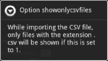

***图 9-10。**弹出对话框为 showonlycsvfiles 选项*

让我们回到这一点，谈谈 CSS 文件。在前面的 HTML 示例中，我使用了一个非常简单的 CSS 文件来定义表单在小屏幕上的显示方式。这个应用将 CSS 文件提升到了一个全新的水平。如果在文本编辑器中打开`zest.css`文件，您将看到不同的部分和用于定义 HTML 元素格式的技术。在文件的顶部，你会看到两个标有`body`和`button`的部分。代码如下所示:

`body {
width:100%;
padding: 0;
font-size: 14px;
background: black;
color:white;
font-family: Arial;
}
button{
color:white;
background: transparent;
border: solid 1px #2986a5;
}`

`body`部分定义了整个 HTML 页面的默认值，而`button`部分定义了按钮的默认值。对于这个应用，页面顶部有一个由四个图标组成的菜单。这些变化取决于用户交互。每个按钮都有一个白色的底色，一个透明的背景，一个像素的边框，边框上有十六进制的颜色代码`#2986a5`。

代替简单的按钮，SMS 合并应用使用了一种相当常见的方法，即使用图像文件。每个按钮使用两种图像版本，分别表示选中和未选中。当用户按下按钮时，图像被交换，产生高亮效果。[图 9-11](#fig_9_11) 显示了包含不同按钮图像的目录视图。

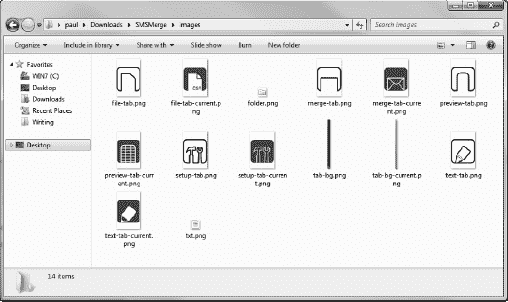

***图 9-11。**用于 UI 元素的图标*

下面是一段 CSS 代码，它定义了菜单在页面顶部的外观:

`div#menu {
background-image: url("img/tab-bg.png");
background-repeat: repeat-x;
color: white;
font-weight: bold;
height: 96px;
}
div#menu div.current {
background-image: url("img/tab-bg-current.png");
background-repeat: repeat-x;
}
div.icon {
height: 67px;
width: 100%;
background-repeat: no-repeat;
background-position: top center;
}`

这是相应的 HTML 块:

`

Setup

File

Text

Merge

`

图 9-12 显示了菜单在模拟器中的样子。

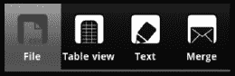

***图 9-12。**由 CSS、HTML、图片和 JavaScript 构建的菜单*

当您触摸其中一个按钮时，如文件按钮，您将看到一个新的显示，如图[图 9-13](#fig_9_13) 所示。该页面的 HTML 代码如下所示:

`

<h1>File - <button id="bCSV">Load</button></h1>

<h1>Fields (select phone number column):</h1>

<h1>File dialect:</h1>

End of line character: 

Quote character: 

Field delimiter: 

<h1>File preview:</h1>

`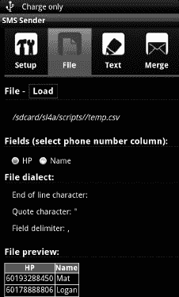

***图 9-13。**文件加载屏幕*

文件预览部分由加载的 CSV 文件构建，并使用 Python 代码提供的数据。下面是实际读取文件并将其返回给 JavaScript 的代码:

`def loadfile(self, data):
self.log("Loading file")
merger = self.merger
filename = data["path"]
if filename != "":
self.log("Selected filename %s " % filename)
try:
reader = CSVReader( filename )
except csv.Error, e:
return { "error": "Unable to open CSV: %s" % e }
fields = reader.getFields()
self.log("Found fields: %s" % ''.join(fields))
merger.setFields(fields)
rows = reader.getRows()
merger.setItems(rows)
# Rows are now dicts, for preview, want them as list of values only
values = []
for row in rows:
values.append( row.values() )
else:
self.log("No file name")
return {"filename":"","fields":[], "error": ""}
# Success and new file, return all info
return {"filename":filename, "fields":fields,
"delimiter":reader.dialect.delimiter,
"quotechar":reader.dialect.quotechar,
"lineterminator": reader.dialect.lineterminator,
"error": "", "rows":values }`

“合并”选项卡是真正的操作发生的地方。它获取包含电话号码和消息文本的 CSV 文件，并将其与您手动输入或从文件加载的消息合并，最终广播 SMS 消息。[图 9-14](#fig_9_14) 显示了这个屏幕的样子。

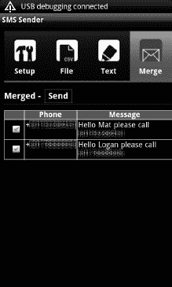

***图 9-14。**合并发送短信画面*

执行合并的 Python 代码一点也不难阅读。看起来是这样的:

`def merge(self, data):
droid = self.droid
merger = self.merger
merger.prefix = parser.get( "locale", "prefix" )
merger.setNumberColumn(int(data["phone"]))
merger.setTemplate(data["text"])
ret = {"success":False, "error":"", "messages":[]}
# Valid template returns a list of merge fields that are not used by the given template
missing = merger.validTemplate()
if missing.__len__() == 0:
ret["messages"] = merger.merge()
ret["success"] = True
else:
droid.dialogCreateAlert("Incomplete text",
"The following merge fields are not being used by the template: %s.\r\n Would you like
to edit the template text?" % ",".join(missing))
droid.dialogSetPositiveButtonText("Yes")
droid.dialogSetNegativeButtonText("No")
droid.dialogShow()
resp = droid.dialogGetResponse()
# User wishes to load now
if resp.result["which"] == "positive" :
return {"task":"edittext"}
else:
ret["messages"] = merger.merge()
ret["success"] = True
return ret`

该页面背后还有一些 JavaScript 代码:

`/*
* Merge tab button event
* On Click, checks that CSV is loaded, checks that template text is loaded.
* Then fires an event to request Python to merge all SMS
* Receives sms as object {number,message} and displays them in a table
*/
buttons.merge.addEvent("click",function(){
if(!csvLoaded()){
if(loadCsv()){
buttons.file.fireEvent("click");
buttons.importCSV.fireEvent("click");
}
} else {
var text=dta.getValue();
if(text == ""){
textNeeded();
buttons.textTab.fireEvent("click");
} else {
handler.startLoad("Processing", "Merging")
showOne(tabs,divs.mergeTab);
phone = getMergeFields().phone;
var resp = handler.postAndWait( {"task":"merge", "text":text.replace
("\n","\\u000A"), "phone":phone });
if(resp.task=="edittext"){
buttons.textTab.fireEvent("click");
dta.fireEvent("click");
}else{
clearMergedSamples();
var table = divs.mergeTab.getElement("table");
resp.messages.each(function(m){
var clone = templateRow.clone();
clone.getElement("td.phone").setText(m.number);
clone.getElement("td.message").setText(m.message);
table.adopt(clone);
});
}
handler.stopLoad();
}
}
});`

##### 依赖关系

每个软件项目都有某种依赖关系。当你选择了一种编码语言，你就做了一个依赖选择。如果您的应用将在特定的操作系统上运行，那么您已经做出了操作系统依赖性的决定。外部库通常提供额外的功能，否则很难编写代码。您付出的代价是打包库和管理任何可能破坏代码的更新所带来的痛苦。本书中的所有示例脚本都依赖于 SL4A 和 Python。

SMS Merger 的第一个版本使用了一个外部依赖项，以 Open Intents (OI)文件管理器的形式浏览和选择文件。下面是该版本的一段代码，它使用`startActivityForResult` API 调用启动 OI 文件管理器，然后从返回的映射值中提取文件名:

`def requestTemplateFromFile( self ):
droid = self.droid
map = droid.startActivityForResult( "org.openintents.action.PICK_FILE",
None, None,
{"org.openintents.extra.TITLE":"Choose file containing message",
"org.openintents.extra.BUTTON_TEXT":"Choose"})
if map.result is None:
self.requestMessage()
else:
filename = map.result["data"].replace( "file://", "" )
text = open( filename, "r" )
smscontent = text.readline().replace( "\n", "" )
if self.validTemplate( smscontent ) is True:
return smscontent
else:
self.warnInvalidTemplate( smscontent )
# Loop
return self.requestTemplateFromFile()`

OI 文件管理器是一个界面简洁的好工具。它提供了一种选择文件并将其返回给调用者的简单方法。[图 9-15](#fig_9_15) 显示了它的样子。

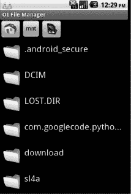

***图 9-15。**打开意向文件管理器*

使用像 OI 文件管理器这样的外部应用的一个缺点是用户必须完成额外的安装。虽然这对程序员来说没什么大不了的，但这肯定不是您希望一个典型用户做的事情。更好的解决方案是使用 HTML、JavaScript 和 Python。下面是一个创建文件列表的 Python 函数:

`def listdir(self, data):
""" Creates two lists of files and folders in the path found in data

data -- dict containing path and type (for filtering)

"""
self.log("Loading directory content")
base = data["path"]
type = data["type"]
# Check in the config whether we want to show only a certain type of content
showHiddenDirectories = self.parser.getboolean( "application",
"showhiddendirectories" )

if type == "txt":
if self.parser.getboolean( "application", "showonlytextfiles" ) is True:
filter = ".{0}".format( type )
else:
filter = None
elif type == "csv":
if self.parser.getboolean( "application", "showonlycsvfiles" ) is True:
filter = ".{0}".format( type )
else:
filter = None
else:
filter = None

# List all directories and files, then filter
all = os.listdir(base)
files = []
folders = []
for file in all:
# Separate files and folders
abs = "{0}/{1}".format( base, file )
if os.path.isdir( abs ):
# Are we filtering hidden directories?
if showHiddenDirectories is True or file[0] != ".":
folders.append( str( file ) )
elif os.path.isfile( abs ):
# Are we filtering by type?
if filter is None or os.path.splitext( file )[1] == filter:
files.append( str( file ) )

# Sort alphabetically
files.sort( key=str.lower )
folders.sort( key=str.lower )
return {"files":files,"folders":folders}`

[图 9-16](#fig_9_16) 显示了一个独立于任何外部应用的 HTML 和 JavaScript 版本。

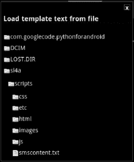

***图 9-16。** HTML 和 JavaScript 文件浏览器*

创建这个窗口的 JavaScript 代码很长，但是可读性很好。它基本上为`importCSV`按钮添加了一个事件处理程序，首先调用 Python 代码来实际加载 CSV 文件，然后构建一个表来显示结果。它将 CSV 文件的路径传递给 Python 代码，作为从函数`filebrowser`返回的结果。用户通过滚动`filebrowser`窗口并触摸文件来选择要读取的 CSV 文件，这将关闭`filebrowser`窗口。

`buttons.importCSV.addEvent("click",function(){
// Override the onClose function to use the path of the CSV file
filebrowser.onClose = function(a) {
if(a){
handler.startLoad("Loading","Loading CSV file");
var resp = handler.postAndWait({"task":"loadfile","path":a});
if(resp.error==""){
// resp.filename will definitely be same as a?
if(resp.filename!=""){
clearMergedSamples();
divs.csvFilename.setText( resp.filename );
divs.fields.removeClass("nodisplay").getElement("div").remove();
var newdiv = new Element("div").addClass("col").addClass("width-100");
resp.fields.each(function(r, k){
newdiv.adopt(new Element("div").addClass("col")
.adopt(new Element("input",{"type":"radio","name":"iField"})
.addEvent("click",function(){hideAll(valid);}))
.adopt(new Element("span").setText(r))
);
});
divs.fields.adopt(newdiv);
// Select the first item
divs.fields.getElement("input").setProperty("checked",true);
// More information about the loaded file
$("dialectQuotechar").setText(resp.quotechar);
$("dialectDelimiter").setText(resp.delimiter);
$("dialectLineterminator").setText(resp.lineterminator);
// Preview
var t=new Element("table",
{"cellpadding":"0","border":"0"}),th=new Element("tr");
resp.fields.each(function(v){
th.adopt(new Element("th").setText(v));
});
t.adopt(th);
resp.rows.each(function(v){
var tr=new Element("tr");
v.each(function(w){
tr.adopt(new Element("td").setText(w));
});
t.adopt(tr);
});
divs.preview.empty().adopt(t);
}
}else{
handler.alert("CSV import error",resp.error);
}
handler.stopLoad();
}
filebrowser.close();
}
filebrowser.setType("csv").setTitle("Load CSV file" ).show();
});`

让应用的用户了解正在发生的事情总是一个好主意。当 SMS 合并应用第一次启动时，它需要加载配置文件(如果存在的话)。微调对话框完美地告诉用户，应用实际上是在加载一个配置文件，而不仅仅是留下一个可见的空白屏幕。[图 9-17](#fig_9_17) 显示了手机短信程序如何使用微调按钮让用户知道正在发生的事情。

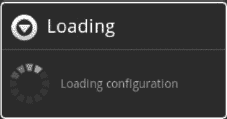

***图 9-17。**设置配置页面*

当您使用`webViewShow` API 函数在 HTML/JavaScript 和 Python 代码之间传递数据时，您必须在任一端编写一个事件处理程序来接收数据。SMS Sender 示例利用 JavaScript 和 Python 事件处理程序来完成工作。下面是在 JavaScript 端设置不同事件处理程序的一段代码:

`handler = new UIHandler();
window.addEvent("domready",function(){
var buttons = {"saveconfig":$("bSaveConfig"),"file":$("bFile"),
"setup": $("bSetup"),"importText":$("bChooseText"),
"textTab":$("bText"),"merge":$("bMerge"),
"validate":$("bValidate"),"process":$("bProcess"),
"importCSV":$("bCSV"),"closebrowser":$("closeButton")},
divs = {"preview":$("dPreview"),"filebrowser":$("filebrowser"),
"browsercontent":$("browserContent"),"fileTab":$("dFile"),
"fields":$("dFields"),"csvFilename":$("csvfile"),
"setupTab":$("dSetup"),"textTab":$("dText"),"mergeTab":$("dCSVMerged")},
dta=divs.textTab.getElement("textarea"),browserTitle=$("browserTitle"),
tabs=[divs.setupTab,divs.mergeTab,divs.textTab,divs.fileTab],
tabButtons=[buttons.setup,buttons.merge,buttons.textTab,buttons.file],
validSpan=$("wValid"),invalidSpan=$("wInvalid"),valid=[validSpan,invalidSpan],
templateRow=$("templateTable").getElement("tr");
tabButtons.each(function(button,k){
var current = "current";
button.addEvent("click",function(){
if(!button.hasClass(current)){
removeClassFromAll(tabButtons,current);
button.addClass(current);
showOne(tabs,tabs[k]);
}
});
});`

在 Python 方面，必须有相应的事件处理程序。以下是手机短信程序的处理方式:

`class SMSSenderHandler(UIHandler):
""" Handler class for this particular application. Extends UIHandler """
def __init__(self):
UIHandler.__init__(self)
# Create the dispatch dictionnary which maps tasks to methods
self.dispatch = {
"loadfile": self.loadfile,
"validate": self.validate,
"loadfilecontent": self.loadfilecontent,
"loadconfig": self.loadconfig,
"send": self.send,
"merge": self.merge,
"listdir":self.listdir,
"saveconfig":self.saveconfig
}`

##### 手机短信程序的怪癖和陷阱

请注意，根据您安装的 SL4A 版本，SMS Sender 示例可能无法运行。我遇到了一些 SLA4 r3 和模拟器不能正确处理事件传递的问题。这在当时是一个已知的错误，并被如此报告。HTML 文件选择器也有一个问题，它似乎不允许您在打开文本或 CSV 文件后打开子目录。也就是说，它展示了一些可以在 Python 和 HTML 代码之间双向通信的方法。

### 总结

本章试图向您展示编写使用 HTML 显示信息并通过`webViewShow` API 调用与用户交互的脚本的基础。

以下是本章的要点:

*   HTML 基础知识:你所学到的关于优秀 HTML 的一切都适用于此。您可以使用 HTML 文件和几行代码构建简单的输出。
*   **学习一些 JavaScript** :这本书的主题是用 Python 编程，但是要在 HTML 页面中实现交互，你必须写一些 JavaScript。学习这门语言并不困难，尤其是如果你对 C++或 Java 很熟悉的话。网上有很多资源可以帮助你开始。
*   **别忘了设计**:对于程序员创建的网页，最大的抱怨之一就是它们看起来不太吸引人。SMS Sender 示例使用了许多良好的设计原则来分隔操作，并将相似的功能组合在一起。因为`webViewShow` API 函数使用 HTML 来创建用户界面，所以学习一点好的 HTML 页面设计是个好主意。
*   CSS 可以帮助:使用 CSS 实际上也是一个很好的编程实践。它有助于将编码中的一些设计方面分离到一个文件中。CSS 有助于给 HTML 带来一致的外观和感觉，并且非常适合小屏幕。