# 一、你好安卓

欢迎来到这本书，欢迎来到 Android 开发的世界。在不到十年的时间里，Android 帮助改变了现代移动计算和电话的面貌，并在应用的开发方式和开发人员方面发起了一场革命。有了这本书在你的手中，你现在是伟大的 Android 爆炸的一部分！我们假设你想直接使用 Android，所以我们不会用关于 Android 的历史、主要人物、赞誉或任何其他散文的炉边聊天来烦你。我们要直奔主题了！

在本章中，您将首先了解使用 Android 软件开发工具包(SDK) 构建应用所需的东西，并设置您选择的开发环境。接下来，你走过一个“你好，世界！”应用。然后本章解释了 Android 应用的生命周期，最后讨论了如何在 Android 虚拟设备(avd)和真实设备上运行应用。所以让我们开始吧。

Android 开发的先决条件

要为 Android 构建应用，您需要 Java SE 开发工具包(JDK) 、Android SDK 和一个开发环境。严格地说，您可以使用简单的文本编辑器和一些像 Ant 这样的命令行工具来开发您的应用。出于本书的目的，我们将使用普遍可用的 Eclipse IDE，尽管您可以自由采用 Android Studio 及其 IntelliJ 基础——我们甚至将为那些没有见过它的人介绍 Android Studio。除了几个附加工具之外，我们在书中分享的例子在这两种 ide 之间同样适用。

Android SDK 需要 JDK 6 或 7(完整的 JDK，而不仅仅是 Java 运行时环境[JRE])和可选的支持 IDE。目前，Google 直接支持两种可选的 ide，提供了一些选择。历史上，Eclipse 是 Google 支持的第一个用于 Android 开发的 IDE，为 Android 4.4 KitKat 或 5.0 Lollipop 开发需要 Eclipse 3.6.2 或更高版本(本书使用 Eclipse 4.2 或 4.4，也分别称为 Juno 和 Luna，以及其他版本)。Google 为 Android 发布并支持的替代环境现在被称为 Android Studio。这是 IDEA IntelliJ 的打包版本，内置 Android SDK 和开发者工具。

**注意**在撰写本文时，Java 8 已经推出，但 Android SDK 尚不支持。在以前版本的 Android SDK 中，也支持 Java 5，但现在情况不同了。最新版本的 Eclipse (4.4，也就是 Juno)也可以使用，但 Android 在最新版本的 Eclipse 上一直不太可靠。在这里查看系统需求找到最新:【http://developer.android.com/sdk/index.html】T3T5。

Android SDK 兼容 Windows (Windows XP、Windows Vista 和 Windows 7)、Mac OS X(仅限英特尔)和 Linux(仅限英特尔)。硬件方面，你需要一台 Intel 的机器，越强大越好。

为了让您的生活更轻松，如果您选择 Eclipse 作为您的 IDE，您将希望使用 Android 开发工具(ADT) 。ADT 是一个 Eclipse 插件，支持使用 Eclipse IDE 构建 Android 应用。

Android SDK 由两个主要部分组成:工具和包。当你第一次安装 SDK 时，你得到的只是基础工具。这些是帮助您开发应用的可执行文件和支持文件。这些包是特定于特定版本的 Android(称为*平台*)或特定平台插件的文件。平台包括 Android 1.5 到 4.4.2。这些附加软件包括谷歌地图应用编程接口、市场许可证验证器，甚至还有供应商提供的软件，如三星的 Galaxy Tab 附加软件。安装 SDK 后，您可以使用其中一个工具来下载并设置平台和附加组件。

请记住，您只需要设置和配置 Eclipse 或 Android Studio 中的一个。如果你愿意，你可以两者都用，但这肯定不是必须的。我们开始吧！

设置您的 Eclipse 环境

在本节中，您将逐步下载 JDK 6 、Eclipse IDE、Android SDK(工具和软件包)以及 ADT。您还可以配置 Eclipse 来构建 Android 应用。谷歌提供了一个页面来描述安装过程(【http://developer.android.com/sdk/installing.html】)但是省略了一些关键步骤，你将会看到。

下载 JDK

你首先需要的是 JDK。Android SDK 要求 JDK 6 或更高版本；我们使用 JDK 6 和 7 开发了我们的示例，这取决于所使用的 Eclipse 或 Android Studio 的版本。对于 Windows 和 Mac OS X，从甲骨文网站(downloads/index . html)下载 JDK 7 并安装。你只需要 JDK，不需要捆绑。要安装 Linux 版 JDK，请打开一个终端窗口，并指示您的软件包管理员安装它。例如，在 Debian 或 Ubuntu 中，尝试以下操作:

```java
sudo apt-get install sun-java7-jdk
```

这将安装 JDK 以及任何依赖项，比如 JRE。如果没有，这可能意味着您需要添加一个新的软件源，然后再次尝试该命令。网页[https://help.ubuntu.com/community/Repositories/Ubuntu](https://help.ubuntu.com/community/Repositories/Ubuntu)解释软件来源以及如何添加到第三方软件的连接。根据您使用的 Linux 版本的不同，这个过程会有所不同。完成后，重试该命令。

随着 Ubuntu 10.04 (Lucid Lynx)的推出，Ubuntu 建议使用 OpenJDK，而不是 Oracle/Sun JDK。要安装 OpenJDK，请尝试以下操作:

```java
sudo apt-get install openjdk-7-jdk
```

如果找不到，请按照前面所述设置第三方软件，然后再次运行该命令。JDK 依赖的所有包都会自动添加。可以同时安装 OpenJDK 和 Oracle/Sun JDK。要在 Ubuntu 上安装的 Java 版本之间切换活动 Java，请在 shell 提示符下运行以下命令

```java
sudo update-alternatives --config java
```

然后选择您想要的默认 Java。

现在您已经安装了 Java JDK，是时候设置 JAVA_HOME 环境变量指向 JDK 安装文件夹了。要在 Windows XP 机器上执行此操作，请选择开始我的电脑，右键单击，选择属性，选择高级选项卡，然后单击环境变量。单击“新建”添加变量，如果变量已经存在，则单击“编辑”进行修改。 JAVA_HOME 的值类似于C:\ Program Files \ JAVA \ JDK 1 . 7 . 0 _ 79。

对于 Windows Vista 和 Windows 7，进入环境变量屏幕的步骤略有不同。选择开始计算机，右键单击，选择属性，单击高级系统设置的链接，然后单击环境变量。之后，按照与 Windows XP 相同的说明更改 JAVA_HOME 环境变量。

对于 Mac OS X，你在中设置 JAVA_HOME 。bashrc 文件在您的主目录中。编辑或创建。bashrc 文件，并添加如下所示的一行

```java
export JAVA_HOME=path_to_JDK_directory
```

其中路径 _ 到 _ JDK _ 目录大概是/库/Java/Home 。对于 Linux，编辑你的。bashrc 文件并添加一行类似于 Mac OS X 的代码，除了您的 Java 路径可能是类似于 /usr/lib/jvm/java-6-sun 或/usr/lib/JVM/Java-6-open JDK的代码。

下载 Eclipse

安装 JDK 后，您可以下载面向 Java 开发人员的 Eclipse IDE。(不需要 Java EE 的版本；它可以工作，但是它要大得多，并且包含了你在这本书里不需要的东西。)本书中的例子使用的是 Eclipse 4.2 或 4.4 (在 Linux 和 Windows 环境下均可)。你可以从 www.eclipse.org/downloads/下载所有版本的 Eclipse。

**注意**除了这里介绍的各个步骤，您还可以从 Android 开发者网站下载 ADT 捆绑包。这包括带有内置开发工具的 Eclipse 和一个软件包中的 Android SDK。这是一个快速入门的好方法，但是如果您有一个现有的环境，或者只是想知道所有的组件是如何连接在一起的，那么遵循一步一步的说明是正确的方法。

Eclipse 发行版是一个。可以在任何地方提取的 zip 文件。在 Windows 上，最简单的解压位置是 C:\ ，这会产生一个 C:\eclipse 文件夹，在那里可以找到eclipse.exe。根据您的安全配置，从 C:\运行时，Windows 可能会坚持实施 UAC。对于 Mac OS X，你可以解压到应用。对于 Linux，您可以解压到您的主目录，或者让您的管理员将 Eclipse 放在一个您可以访问它的公共位置。对于所有平台，Eclipse 可执行文件都在 eclipse 文件夹中。您还可以使用 Linux 的软件中心找到并安装 Eclipse，以添加新的应用，尽管这可能不会为您提供最新的版本。

当您第一次启动 Eclipse 时，它会询问您工作区的位置。为了简单起见，您可以选择一个简单的位置，如 C:\android 或您的主目录下的一个目录。如果您与其他人共享计算机，您应该将工作区文件夹放在您的个人目录下的某个位置。

下载 Android SDK

要为 Android 构建应用，您需要 Android SDK。如前所述，SDK 附带了基础工具；然后您下载您需要和/或想要使用的包部件。SDK 的工具部分包括一个模拟器，所以你不需要一个装有 Android 操作系统的移动设备来开发 Android 应用。它还有一个安装工具，允许您安装想要下载的软件包。

可以从[http://developer.android.com/sdk](http://developer.android.com/sdk)下载 Android SDK。它以的名字发货。zip 文件，类似于 Eclipse 的分发方式，所以您需要将其解压缩到一个适当的位置。对于 Windows，将文件解压缩到一个方便的位置(我们使用了 C: 驱动器)，之后你应该有一个类似于 C:\android-sdk-windows 的文件夹，其中包含如图[图 1-1](#Fig1) 所示的文件。对于 Mac OS X 和 Linux，您可以将文件解压缩到您的主目录。请注意，Mac OS X 和 Linux 没有 SDK 管理器可执行文件；Mac OS X 和 Linux 中的 SDK 管理器相当于运行工具/android 程序。

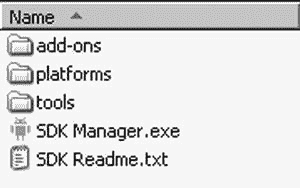

[图 1-1](#_Fig1) 。Android SDK 的基本内容

另一种方法(仅适用于 Windows)是下载安装程序 EXE 而不是 zip 文件，然后运行安装程序可执行文件。这个可执行文件检查 Java JDK，为您解包嵌入的文件，并运行 SDK 管理程序来帮助您设置其余的下载。

无论是通过使用 Windows installer 还是通过执行 SDK 管理器，接下来都应该安装一些软件包。当您第一次安装 Android SDK 时，它没有任何平台版本(即 Android 版本)。安装平台非常容易。在你启动了 SDK 管理器之后，你会看到已经安装了什么和可以安装什么，如图 1-2 所示。您必须添加 Android SDK 工具和平台工具，以便您的环境能够工作。因为你用的时间短，所以至少添加 Android 1.6 SDK 平台，以及你的安装程序中显示的最新平台。

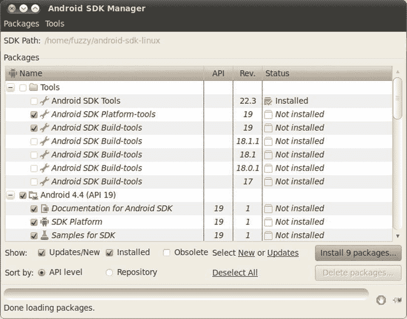

[图 1-2](#_Fig2) 。向 Android SDK 添加软件包

单击安装按钮。您需要为正在安装的每个项目点按“接受”(或“全部接受”)，然后点按“安装”。Android 然后下载你的包和平台让你可以使用。Google APIs 是使用 Google Maps 开发应用的附加组件。你可以随时回来添加更多的软件包。

更新 PATH 环境变量

Android SDK 附带了一个工具目录，您希望它位于您的路径中。在您的路径中还需要刚刚安装的平台工具目录。让我们现在添加它们，或者，如果您正在升级，请确保它们是正确的。当你在那里时，你也可以添加一个 JDK bin 目录，这将使以后的生活更容易。

对于 Windows，返回到环境变量窗口。编辑路径变量并添加分号(；)放在最后，后面是 Android SDK tools 文件夹的路径，再后面是一个分号，再后面是 Android SDK platform-tools 文件夹的路径，再后面是一个分号，然后是 %JAVA_HOME%\bin 。完成后，点按“好”。对于 Mac OS X 和 Linux，编辑你的。bashrc 文件，并将 Android SDK 工具目录路径添加到您的 path 变量，以及 Android SDK 平台工具目录和 $JAVA_HOME/bin 目录。类似下面的内容适用于 Linux:

```java
export PATH=$PATH:$HOME/android-sdk-linux_x86/tools:$HOME/android-sdk-linux_x86/platform-tools:$JAVA_HOME/bin
```

只要确保指向 Android SDK 工具目录的 PATH 组件对于您的特定设置是正确的。

工具窗口

在本书的后面，有时您需要执行命令行工具。这些程序是 JDK 或 Android SDK 的一部分。通过将这些目录放在您的路径中，您不需要指定完整的路径名来执行它们，但是您需要启动一个*工具窗口* 来运行它们(后面的章节参考这个工具窗口)。在 Windows 中创建工具窗口最简单的方法是选择开始运行，键入 cmd ，点击确定。对于 Mac OS X，从 Finder 中的应用文件夹中选择“终端”,或者从 Dock 中选择“终端”(如果有)。对于 Linux，运行您最喜欢的终端。

稍后您可能需要知道工作站的 IP 地址。要在 Windows 中找到它，启动工具窗口并输入命令 ipconfig 。结果包含一个 IPv4(或类似的东西)条目，旁边列出了您的 IP 地址。IP 地址看起来像这样:192.168.1.25。对于 Mac OS X 和 Linux，启动工具窗口并使用命令 ifconfig 。你可以在标签 inet addr 旁找到你的 IP 地址。

您可能会看到名为 localhost 或 lo 的网络连接；此网络连接的 IP 地址是 127.0.0.1。这是操作系统使用的特殊网络连接，与您工作站的 IP 地址不同。为您的工作站 IP 地址寻找一个不同的数字。

安装 ADT

现在你需要安装 ADT(最近更名为 GDT，谷歌开发者工具)，这是一个帮助你构建 Android 应用的 Eclipse 插件。具体来说，ADT 与 Eclipse 集成，为您创建、测试和调试 Android 应用提供了便利。您需要使用 Eclipse 中的 Install New Software 工具来执行安装。(本节稍后将介绍升级 ADT 的说明。)要开始，启动 Eclipse IDE 并遵循以下步骤:

1.  选择帮助安装新软件。
2.  Select the Work With field, type in

    ```java
    [https://dl-ssl.google.com/android/eclipse/](https://dl-ssl.google.com/android/eclipse/),
    ```

    然后按回车键。Eclipse 联系站点并填充列表，如[图 1-3](#Fig3) 所示。

    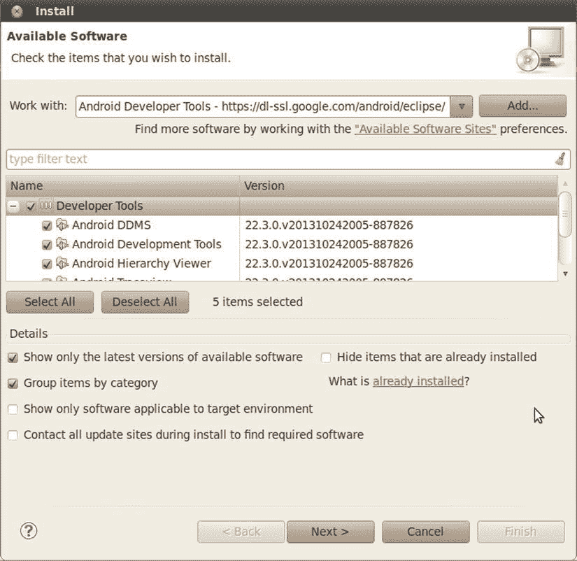

    [图 1-3](#_Fig3) 。使用 Eclipse 中的安装新软件特性安装 ADT

3.  您应该看到一个名为 Developer Tools 的条目，它有四个子节点:Android DDMS、Android 开发工具、Android Hierarchy Viewer 和 Android Traceview。就在出版这本书之前，谷歌更新了 ADT，使其成为更通用的 Eclipse 或 GDT 谷歌开发者工具插件的一部分。在 GDT 寻找同样的选择。选择父节点 Developer Tools，确保也选择了子节点，然后单击 Next 按钮。你看到的版本可能比这些新，没关系。您可能还会看到其他工具。这些工具将在第 11 章中进一步解释。
4.  Eclipse 要求您验证要安装的工具。单击下一步。
5.  您需要查看 ADT 以及安装 ADT 所需工具的许可证。查看许可证，单击“我接受”，然后单击“完成”按钮。

Eclipse 下载开发人员工具并安装它们。您需要重新启动 Eclipse，新的插件才会出现在 IDE 中。

如果您在 Eclipse 中已经有了一个旧版本的 ADT，请转到 Eclipse Help 菜单并选择 Check for Updates。您应该看到 ADT 的新版本，并能够按照安装说明进行操作，从步骤 3 开始。

**注意**如果您正在升级 ADT，您可能在要升级的工具列表中看不到这些工具。如果你没有看到它们，那么在你升级了 ADT 的其余部分之后，去安装新的软件，并从 Works With 菜单中选择[【https://dl-ssl.google.com/android/eclipse/】](https://dl-ssl.google.com/android/eclipse/)。中间的窗口应该显示可以安装的其他工具。

让 ADT 在 Eclipse 中发挥作用的最后一步是将它指向 Android SDK。在 Eclipse 中，选择窗口首选项。(在 Mac OS X 上，偏好设置位于 Eclipse 菜单下。)在首选项对话框中，选择 Android 节点，并将 SDK 位置字段设置为 Android SDK 的路径(参见[图 1-4](#Fig4) )，然后单击应用按钮。请注意，您可能会看到一个对话框，询问您是否要向 Google 发送有关 Android SDK 的使用统计数据；这个决定取决于你。


[图 1-4](#_Fig4) 。将 ADT 指向 Android SDK

您可能想在 Android 构建页面上再做一次偏好更改。如果你想让你的文件保存得更快，跳过打包选项应该被选中。默认情况下，ADT 会在每次构建应用时为启动做好准备。通过选中此选项，只有在真正需要时才会进行打包和索引。

从 Eclipse 中，您可以启动 SDK 管理器。为此，选择窗口 Android SDK 管理器。您应该会看到与图 1-2 中[相同的窗口。](#Fig2)

如果您已经选择 Eclipse 作为您的 IDE，那么您几乎已经为您的第一个 Android 应用做好了准备——您可以跳过 Android Studio 的以下部分，直接进入“学习 Android 的基本组件”部分。

设置您的 Android Studio 环境

2013 年，谷歌推出了第二个支持的开发环境，称为 Android Studio (或推出时的 Android Developer Studio)。这是基于一个流行的 Java IDE: IDEA IntelliJ。关于 Android Studio 最重要的一点是，它仍然是一个正在进行中的工作。截至本书写作时，最新版本是 1.2。任何熟悉版本号变幻莫测的人都知道，从低版本号开始通常意味着“小心！”

第二个需要记住的最重要的事情是，Android Studio 目前假设的是 64 位开发环境。这意味着像 Java 这样的依赖也需要是 64 位的。

接下来的章节简要介绍了 Android Studio 的设置，供那些有兴趣或者有足够热情的人使用。请注意，本书的其余部分主要展示了使用 Eclipse 的示例和选项。

Android Studio 的 Java 需求

像 Eclipse 一样，Android Studio 依赖于一个有效的 Java 安装。Android Studio 会在安装过程中尝试自动发现您的 Java 环境，因此安装和配置 Java 是值得的。

对于 Java 安装，记住 Android Studio 是 64 位的。在所有其他方面，你可以遵循前面题为“下载 JDK”的部分——为了节省一些树木，我们不会在这里逐字重复。确保您遵循了那里的所有说明，包括设置 JAVA_HOME 环境变量，因为这是 Android Studio 安装程序用来查找您的 JAVA 安装的主要指示器。

下载和安装 Android Studio

谷歌在主要的 Android 开发网站上提供 Android Studio，目前位于 URL[【http://developer.android.com/sdk/installing/studio.html】](http://developer.android.com/sdk/installing/studio.html)。这可能会随时改变，但在 developer.android.com 网站上快速搜索一下应该就能找到。Android Studio 被打包成一个整体包，几乎包含了你需要的所有组件。Java SDK 是个例外——我们很快会谈到这一点。从前面的 URL 下载的软件包将被命名为类似于 android-studio-bundle-132.893413-windows.exe 的名称(对于 windows ),或者类似的名称(对于 OS X 和 Linux 具有不同的扩展名),包括以下内容:

*   IntelliJ IDEA 的 Android Studio 捆绑包的当前最新版本
*   内置 Android SDK
*   所有相关的 Android 构建工具
*   Android 虚拟设备映像

我们将在后面的章节中详细讨论这些组件。对于 Windows 安装，运行可执行文件，按照提示选择安装路径，并决定 Android Studio 是对 Windows 机器上的所有用户开放，还是只对当前用户开放。对于 OS X，打开。dmg 文件，并将 Android Studio 条目复制到您的应用文件夹。在 Linux 下，提取的内容。tgz 文件到你想要的位置。

安装完成后，可以从提示时选择的开始菜单文件夹启动 Windows 下的 Android Studio 在应用文件夹的 OS X 下；而在 Linux 下通过运行。安装目录下的/Android-studio/bin/studio . sh文件。不管是什么操作系统，你都应该看到 Android Studio 主屏幕，如图[图 1-5](#Fig5) 所示。


[图 1-5](#_Fig5) 。 Android Studio 首次推出时

学习 Android 的基本组件

每个应用框架都有一些关键组件，开发人员在开始编写基于框架的应用之前需要了解这些组件。例如，为了编写 Java 2 平台企业版(J2EE)应用，您需要理解 JavaServer Pages (JSP)和 servlets。类似地，当您为 Android 构建应用时，您需要理解视图、活动、片段、意图、内容提供者、服务和 AndroidManifest.xml 文件。您将在此简要介绍这些基本概念，并在整本书中更详细地探讨它们。

视角

*视图* 是构成用户界面基本构件的用户界面(UI)元素。视图可以是按钮、标签、文本字段或许多其他 UI 元素。如果你熟悉 J2EE 和 Swing 中的视图，那么你就会理解 Android 中的视图。视图也被用作视图的容器，这意味着 UI 中通常有视图的层次结构。最后，你看到的一切都是一种风景。

活动

一个*活动* 是一个 UI 概念，通常代表应用中的一个屏幕。它通常包含一个或多个视图，但这不是必须的。活动听起来很像——帮助用户做一件事的东西，可以是查看数据、创建数据或编辑数据。大多数 Android 应用内部都有几个活动。

片段

当屏幕很大时，很难在单个活动中管理它的所有功能。*片段* 就像子活动，一个活动可以同时在屏幕上显示一个或多个片段。当屏幕很小时，一个活动很可能只包含一个片段，这个片段可以是在更大的屏幕中使用的同一个片段。

目的

意图 一般定义做一些工作的“意图”。意图包含了几个概念，所以理解它们的最好方法是查看它们的使用示例。您可以使用意图来执行以下任务:

*   广播消息
*   启动服务
*   发起一项活动
*   显示网页或联系人列表
*   拨打电话号码或接听电话

意图并不总是由你的应用发起——它们也被系统用来通知你的应用特定的事件(比如一个文本消息的到达)。

意图可以是明确的，也可以是隐含的。如果你只是简单地说你想显示一个 URL，系统会决定用什么组件来实现这个意图。您还可以提供关于应该如何处理意图的具体信息。意图松散地耦合动作和动作处理器。

内容供应器

设备上的移动应用之间的数据共享很常见。因此，Android 为应用定义了一个标准机制来共享数据(如联系人列表)，而不暴露底层存储、结构和实现。通过内容供应器，您可以公开您的数据，并让您的应用使用来自其他应用的数据。

服务

Android 中的服务 类似于你在 Windows 或其他平台中看到的服务——它们是后台进程，可能会运行很长时间。Android 定义了两种类型的服务:本地服务和远程服务。本地服务是只能由托管服务的应用访问的组件。相反，远程服务是指设备上运行的其他应用可以远程访问的服务。

电子邮件应用用来轮询新邮件的组件就是服务的一个例子。如果设备上运行的其他应用不使用这种服务，则这种服务可以是本地服务。如果几个应用使用该服务，那么它就被实现为一个远程服务。

AndroidManifest.xml

AndroidManifest.xml ，类似于 J2EE 世界的 web.xml 文件，定义了你的应用的内容和行为。例如，它列出了应用的活动和服务，以及应用运行所需的权限和功能。

AVD

AVD 允许开发者测试他们的应用，而无需连接实际的 Android 设备(通常是手机或平板电脑)。avd 可以以各种配置创建，以模拟不同类型的真实设备。

你好世界！

现在，您已经准备好构建您的第一个 Android 应用了。您首先构建一个简单的“Hello World！”程序。按照以下步骤创建应用的框架:

1.  启动 Eclipse，并选择 File  New  Project。在新建项目对话框中，选择 Android 应用项目，然后单击下一步。你看到新的 Android 项目对话框，如图[图 1-6](#Fig6) 所示。(Eclipse 可能在新菜单中添加了 Android Project，如果有就可以用。)工具栏上还有一个新的 Android 项目按钮。

    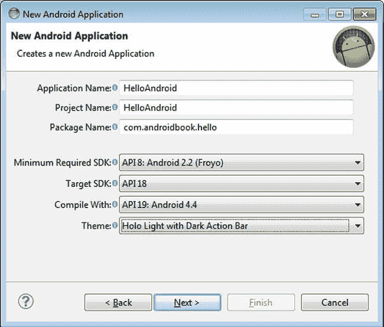

    [图 1-6](#_Fig6) .使用新建项目向导创建机器人应用

2.  如[图 1-6](#Fig6) 所示，输入 **HelloAndroid** 作为项目名称。您需要将这个项目与您在 Eclipse 中创建的其他项目区分开来，所以当您在 Eclipse 环境中查看所有项目时，选择一个对您有意义的名称。您还将看到可用的构建目标。选择安卓 2.2。这是您用作应用基础的 Android 版本。你可以在更高版本的 Android 上运行你的应用，比如 4.3 和 4.4；但是 Android 2.2 有这个例子需要的所有功能，所以选择它作为你的目标。一般来说，最好尽可能选择最低的版本号，因为这样可以最大限度地增加运行应用的设备数量。
3.  让项目名称根据您的应用名称自动完成。
4.  使用 **com.androidbook.hello** 作为包名。像所有 Java 应用一样，您的应用必须有一个基本包名，就是这个。此包名将用作应用的标识符，并且在所有应用中必须是唯一的。因此，最好以您自己的域名作为包名的开头。如果您没有自己的包名，请创造性地确保您的包名不会被其他任何人使用。单击下一步。
5.  下一个窗口提供了客户启动器图标的选项、存储源代码和其他文件的工作区的实际目录，以及其他几个选项。将所有这些都保留为默认值，然后单击 Next。
6.  下一个窗口显示配置启动器图标选项和设置，如图[图 1-7](#Fig7) 所示。尽管您所做的任何更改都是修饰性的，会影响应用部署时启动器图标的外观，而不是它的实际逻辑，但是您可以随意使用这里的选项。准备就绪后，单击下一步。

    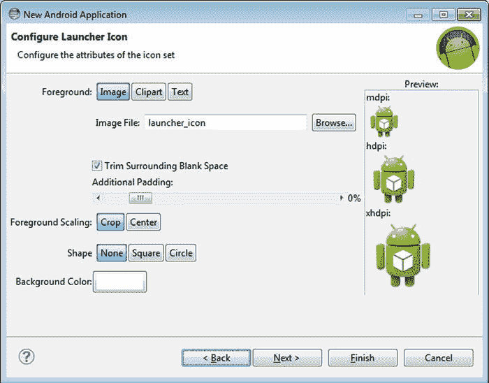

    T8】图 1-7 .新机器人项目的机器人启动器配置选项

    T12】
7.  接下来，您将看到创建活动屏幕。选择“空白活动”作为活动类型，然后单击“下一步”移至向导的最后一个屏幕。
8.  新 Android 应用向导的最后一个屏幕将是空白的活动详情页面。键入 **HelloActivity** 作为活动名称。你告诉 Android 这个活动是当你的应用启动时启动的。您的应用中可能还有其他活动，但这是用户看到的第一个活动。允许布局名称自动填充值 activity_hello 。
9.  单击 Finish 按钮，这会告诉 ADT 为您生成项目框架。现在，打开 src 文件夹下的HelloActivity.java文件，修改 onCreate() 方法如下:

    ```java
    /** Called when the activity is first created. */
        @Override
        public void onCreate(Bundle savedInstanceState) {
            super.onCreate(savedInstanceState);
            /** create a TextView and write Hello World! */
            TextView tv = new TextView(this);
            tv.setText("Hello World!");
            /** set the content view to the TextView */
            setContentView(tv);
        }
    ```

您将需要添加一个导入 Android . widget . textview；用其他导入文件顶部的语句来摆脱 Eclipse 报告的错误。保存 HelloActivity.java 的文件。

要运行这个应用，您需要创建一个 Eclipse 启动配置，并且您需要一个运行它的虚拟设备。我们将快速浏览这些步骤，稍后再回来讨论 AVDs 的更多细节。按照以下步骤创建 Eclipse 启动配置:

1.  选择运行运行配置。
2.  在运行配置对话框中，双击左窗格中的 Android 应用。向导将插入一个名为“新配置”的新配置。
3.  重命名配置 **RunHelloWorld** 。
4.  单击 Browse 按钮，并选择 HelloAndroid 项目。
5.  将启动操作设置为启动默认活动。该对话框应如[图 1-8](#Fig8) 所示。

    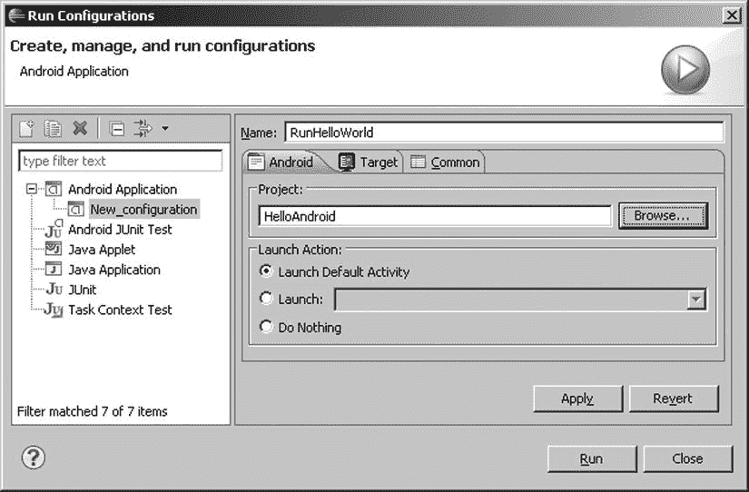

    T8】图 1-8 .配置一个黯然失色运行配置来运行“你好世界！”应用

    T12】
6.  单击应用，然后单击运行。你就快到了！Eclipse 已经准备好运行您的应用，但是它需要一个运行它的设备。如[图 1-9](#Fig9) 所示，警告您没有找到兼容的目标，并询问您是否要创建一个。单击是。

    

    T8】图 1-9 .警告目标并要求新主动脉瓣疾病的错误信息

    T12】
7.  你会看到一个显示现有 avd 的窗口(见[图 1-10](#Fig10) )。您需要添加一个适合您新应用的 AVD。单击新建按钮。

    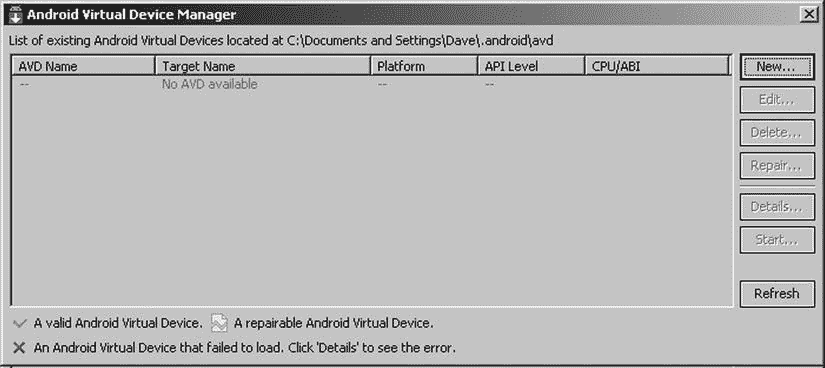

    T8】图 1-10 .现有的 avd

    T12】
8.  填写如图[图 1-11](#Fig11) 所示的创建 AVD 表格。将 Name 设置为 KitKat，选择 Android 4.4 - API Level 19(或其他版本)作为目标，将 SD 卡大小设置为 64MB)，并选择其他值，如图所示。单击创建 AVD。经理可能会确认您的 AVD 创建成功。通过单击右上角的 X 关闭 AVD 管理器窗口。

    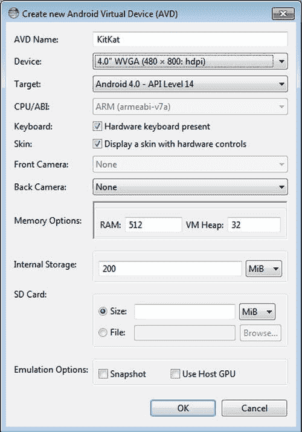

    T8】图 1-11 .配置 AVD

    T12T14**注意**你正在为你的主动脉瓣疾病选择一个较新版本的 SDK，但是你的应用也可以在一个旧版本上运行。这是可以的,因为具有较新软件开发工具包(Software Development Kit)的主动脉瓣疾病可以运行需要较旧软件开发工具包(Software Development Kit)的应用。当然,相反的情况是不正确的：一个需要新软件开发工具包(Software Development Kit)特性的应用不能在一个有旧软件开发工具包(Software Development Kit)的主动脉瓣疾病上运行.
9.  从底部列表中选择您的新 AVD。请注意，您可能需要单击刷新按钮，以使任何新的 avd 显示在列表中。单击确定按钮。
10.  Eclipse 用您的第一个 Android 应用启动模拟器(见[图 1-12](#Fig12) )！

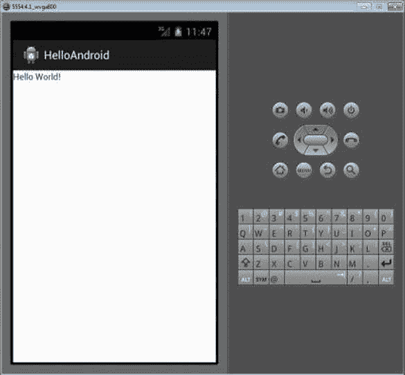

[图 1-12](#_Fig12) 。 HelloAndroidApp 在模拟器中运行

**注意**仿真器可能需要一段时间来仿真设备启动过程。一旦启动过程完成，您通常会看到一个锁定的屏幕。单击菜单按钮或拖动解锁图像来解锁 AVD。解锁后，你应该会看到 HelloAndroidApp 在模拟器中运行，如图[图 1-11](#Fig11) 所示。请注意，模拟器在启动过程中会在后台启动其他应用，因此您可能会不时看到警告或错误消息。如果这样做了，通常可以关闭它，让模拟器进入启动过程的下一步。例如，如果您运行模拟器并看到类似“应用 abc 没有响应”的消息，您可以等待应用启动，或者直接要求模拟器强制关闭应用。通常，您应该等待，让模拟器干净地启动。

现在您知道了如何创建一个新的 Android 应用，并在模拟器中运行它。接下来，我们将更深入地了解 AVDs，以及如何部署到真实设备上。

AVD

AVD 代表一个设备及其配置。例如，你可以用一个 AVD 来代表一个运行 1.5 版本 SDK 和 32MB SD 卡的非常旧的 Android 设备。这个想法是你创建你要支持的 avd，然后在开发和测试你的应用时，将仿真器指向这些 avd 中的一个。指定(和更改)使用哪种 AVD 非常容易，并且可以轻松测试各种配置。前面，您看到了如何使用 Eclipse 创建 AVD。你可以通过选择窗口 Android 虚拟设备管理器在 Eclipse 中制作更多的 avd。您还可以使用命令行创建 avd，在工具目录下使用名为 android 的工具(例如c:\ Android-SDK-windows \ tools \)。 android 允许你创建一个新的 AVD 并管理现有的 AVD。例如，您可以通过使用“avd”选项调用 android 来查看现有的 avd、移动 avd 等等。运行 android -help 可以看到使用 android 的可用选项。现在，让我们创建一个 AVD。

在真实设备上运行

测试 Android 应用的最佳方式是在真实设备上运行它。任何商业 Android 设备在连接到您的工作站时都应该可以工作，但您可能需要做一点工作来设置它。如果你有一台 Mac，除了用 USB 线把它插上，你不需要做任何事情。然后，在设备本身上，选择设置应用开发(尽管这可能因手机和版本而异)并启用 USB 调试。在 Linux 上，你可能需要创建或者修改这个文件:/etc/udev/rules . d/51-Android . rules。我们将此文件的副本与项目文件一起放在我们的网站上；将其复制到正确的目录，并根据您的计算机修改相应的用户名和组值。然后，当你插入一个 Android 设备时，它会被识别。接下来，在设备上启用 USB 调试。

对于 Windows，你必须处理 USB 驱动程序。谷歌提供了一些 Android 包，这些包放在 Android SDK 目录的 usb_driver 子目录下。其他设备供应商为您提供了驱动程序，所以请在他们的网站上查找。你也可以访问 forum.xda-developers.com的 XDA 论坛，那里讨论了为各种手机和设备寻找和配置驱动程序的建议。当您设置好驱动程序后，在设备上启用 USB 调试，您就准备好了。

现在，您的设备已连接到您的工作站，当您尝试启动应用时，它会直接在设备上启动，或者(如果您运行了仿真器或连接了其他设备)会打开一个窗口，您可以在其中选择要启动的设备或仿真器。如果没有，请尝试编辑您的运行配置来手动选择目标。

探索 Android 应用的结构

虽然 Android 应用的大小和复杂性可能有很大的不同，但它们的结构是相似的。[图 1-13](#Fig13) 显示了“Hello World！”您刚刚构建的应用。

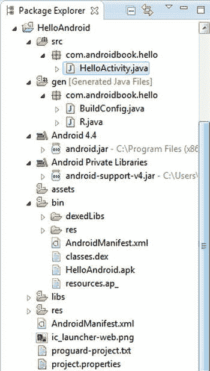

[图 1-13](#_Fig13) 。“你好，世界！”的结构应用

Android 应用有些工件是必需的，有些是可选的。[表 1-1](#Tab1) 总结了一个 Android 应用的元素。

[表 1-1](#_Tab1) 。安卓应用的神器

| 

假象

 | 

描述

 | 

必需的？

 |
| --- | --- | --- |
| AndroidManifest.xml | Android 应用描述符文件。这个文件定义了应用的活动、内容提供者、服务和意图接收者。您还可以使用该文件以声明方式定义应用所需的权限，以及检测和测试选项。 | 是 |
| src | 包含应用所有源代码的文件夹。 | 是 |
| 资产 | 文件夹和文件的任意集合。 | 不 |
| 无 | 包含应用资源的文件夹。这是可绘制、动画师、布局、菜单、值、 xml 和 raw 的父文件夹。 | 是 |
| 可拉伸 | 包含应用使用的图像或图像描述符文件的文件夹。 | 不 |
| 动画师 | 包含 XML 描述符文件的文件夹，这些文件描述了应用使用的动画。 | 不 |
| 布局 | 包含应用视图的文件夹。 | 不 |
| 菜单 | 包含应用中菜单的 XML 描述符文件的文件夹。 | 不 |
| 值 | 包含应用使用的其他资源的文件夹。该文件夹中的资源示例包括字符串、数组、样式和颜色。 | 不 |
| xml | 包含应用使用的附加 XML 文件的文件夹。 | 不 |
| 生 | 包含应用所需的附加数据(可能是非 XML 数据)的文件夹。 | 不 |

正如你从[表 1-1](#Tab1) 中看到的，一个 Android 应用主要由三部分组成:应用描述符、各种资源的集合和应用的源代码。如果你暂时抛开 AndroidManifest.xml 文件，你可以用这种简单的方式来看待一个 Android 应用:你有一些用代码实现的业务逻辑，其他的都是资源。

Android 也采用了通过 XML 标记定义视图的方法。您从这种方法中受益，因为您不必对应用的视图进行硬编码；您可以通过编辑标记来修改应用的外观。

还值得注意的是资源方面的一些限制。首先，Android 只支持在 res 下的预定义文件夹中的单级文件列表。例如，资产文件夹和 res 下的 raw 文件夹有一些相似之处。两个文件夹都可以包含原始文件，但是在 raw 中的文件被认为是资源，而在 assets 中的文件不是。所以 raw 中的文件是本地化的，可以通过资源 id 访问，等等。但是 assets 文件夹的内容被认为是通用内容，可以在没有资源限制和支持的情况下使用。请注意，因为 assets 文件夹的内容不被视为资源，所以您可以在该文件夹中放置任意层次的文件夹和文件。([第 3 章](03.html)讲了很多关于资源的东西。)

**注意**你可能已经注意到 XML 在 Android 中被大量使用。您知道 XML 可能是一种臃肿的数据格式，那么当您知道您的目标是资源有限的设备时，依赖 XML 有意义吗？事实证明，您在开发过程中创建的 XML 实际上是使用 Android 资产打包工具(AAPT)编译成二进制的。因此，当您的应用安装在设备上时，设备上的文件以二进制形式存储。当运行时需要该文件时，该文件以二进制形式读取，而不是转换回 XML。这给了您两个世界的好处——您可以使用 XML，而不必担心占用设备上的宝贵资源。

检查应用的生命周期

Android 应用的生命周期由系统根据用户需求、可用资源等进行严格管理。例如，用户可能想要启动 web 浏览器，但是系统最终决定是否启动该应用。尽管系统是最终的管理者，但它遵循一些定义好的逻辑准则来决定应用是否可以被加载、暂停或停止。如果用户当前正在进行某项活动，系统会给予该应用较高的优先级。相反，如果某个活动不可见，并且系统确定某个应用必须关闭以释放资源，则它会关闭优先级较低的应用。

应用生命周期的概念是合乎逻辑的，但是 Android 应用的一个基本方面使事情变得复杂。具体来说，Android 应用架构是面向组件和集成的。这允许丰富的用户体验、无缝的重用和简单的应用集成，但是给应用生命周期管理人员带来了复杂的任务。

让我们考虑一个典型的场景。用户正在通过电话与某人交谈，需要打开一封电子邮件来回答问题。用户转到主屏幕，打开邮件应用，打开电子邮件消息，单击电子邮件中的链接，并通过阅读网页上的股票报价来回答朋友的问题。这个场景需要四个应用:家庭应用、通话应用、电子邮件应用和浏览器应用。当用户从一个应用导航到下一个应用时，体验是无缝的。然而，在后台，系统正在保存并恢复应用状态。例如，当用户单击电子邮件消息中的链接时，系统在启动浏览器应用活动以启动 URL 之前保存正在运行的电子邮件消息活动的元数据。事实上，系统在开始另一个活动之前保存任何活动的元数据，以便它可以返回到该活动(例如，当用户回溯时)。如果内存成为问题，系统必须关闭运行活动的进程，并在必要时恢复它。

Android 对应用及其组件的生命周期非常敏感。因此，您需要理解和处理生命周期事件，以便构建一个稳定的应用。运行 Android 应用及其组件的进程会经历各种生命周期事件，Android 提供了回调，您可以实现这些回调来处理状态变化。首先，你应该熟悉一个活动的各种生命周期回调(见[清单 1-1](#list1) )。

***[清单 1-1](#_list1) 。*** 一种活动的生命周期方法

```java
protected void onCreate(Bundle savedInstanceState);
protected void onStart();
protected void onRestart();
protected void onResume();
protected void onPause();
protected void onStop();
protected void onDestroy();
```

清单 1-1 显示了 Android 在活动生命周期中调用的生命周期方法列表。为了确保实现一个稳定的应用，理解系统何时调用每个方法是很重要的。请注意，您不需要对所有这些方法做出反应。但是，如果你这样做了，一定要调用超类版本。[图 1-14](#Fig14) 显示了状态之间的转换。

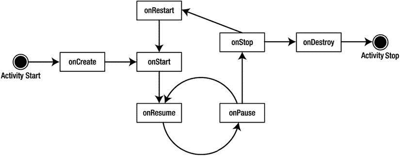

[图 1-14](#_Fig14) 。活动的状态转换

系统可以根据正在发生的事情来启动和停止您的活动。Android 在刚创建活动时调用 onCreate() 方法。 onCreate() 后面总是跟随着对 onStart() 的调用，但是 onStart() 前面并不总是跟随着对 onCreate() 的调用，因为如果您的应用被停止，就可以调用 onStart() 。当调用 onStart() 时，用户看不到您的活动，但很快就会看到了。 onResume() 在 onStart() 之后调用，正好是活动在前台，用户可以访问的时候。此时，用户可以与您的活动进行交互。

当用户决定移动到另一个活动时，系统调用您的活动的 onPause() 方法。从 onPause() 中，您可以期待调用 onResume() 或 onStop() 。 onResume() 被调用，比如用户把你的活动带回前台。如果用户看不到您的活动，将调用 onStop() 。如果您的活动在调用 onStop() 后被带回到前台，那么 onRestart() 将被调用。如果您的活动位于活动堆栈上，但对用户不可见，并且系统决定终止您的活动，则调用 onDestroy() 。

作为一名开发人员，您不必处理每一种可能的情况；你主要处理 onCreate() 、 onResume() 、 onPause() 。您处理 onCreate() 来为您的活动创建用户界面。在这种方法中，您将数据绑定到小部件，并为 UI 组件连接任何事件处理器。在 onPause() 中，您希望将关键数据保存到应用的数据存储中:这是在系统终止应用之前调用的最后一个安全方法。 onStop() 和 onDestroy() 不保证被调用，所以不要依赖这些方法进行临界逻辑。

这场讨论的要点是什么？系统管理您的应用，它可以随时启动、停止或恢复应用组件。尽管系统控制着你的组件，但是它们并不完全独立于你的应用运行。换句话说，如果系统在您的应用中启动一个活动，您可以在您的活动中依赖应用上下文。

简单调试

Android SDK 包括许多工具，您可以使用它们进行调试。这些工具与 Eclipse IDE 集成在一起(参见[图 1-15](#Fig15) 中的一个小例子)。


[图 1-15](#_Fig15) 。调试工具，你可以在构建 Android 应用时使用

你在 Android 开发中使用的工具之一是 LogCat。该工具显示您使用 android.util.Log 、异常、 System.out.println 等发出的日志消息。虽然 System.out.println 工作正常，并且消息出现在 LogCat 窗口中，但是要记录来自应用的消息，您应该使用 android.util.Log 类。该类定义了常见的信息、警告和错误方法，您可以在 LogCat 窗口中过滤这些方法，以查看您想要查看的内容。下面是一个示例 Log 命令:

```java
Log.v("string TAG", "This is my verbose message to write to the log");
```

这个例子展示了日志类的静态 v() 方法，但是还有其他针对不同严重性级别的方法。最好对您想要记录的消息使用适当的调用级别，通常在您想要部署到生产的应用中留下冗长的调用并不是一个好主意。请记住，日志记录会占用内存和 CPU 资源。

LogCat 的特别之处在于，当您在模拟器中运行应用时，您可以查看日志消息，但是当您将真实设备连接到工作站并处于调试模式时，您也可以查看日志消息。事实上，日志消息是这样存储的，您甚至可以从记录日志消息时断开连接的设备中检索最新的消息。当您将设备连接到工作站并打开 LogCat 视图时，您会看到最后几百条消息。

启动模拟器

前面您已经看到了如何在 Eclipse 中从项目启动模拟器。在大多数情况下，您希望首先启动模拟器，然后在运行的模拟器中部署和测试您的应用。要在任何时候启动模拟器，首先从 Android SDK 的工具目录或从 Eclipse 的窗口菜单运行带有 avd 选项的 Android 程序进入 AVD 管理器。在管理器中，从列表中选择所需的 AVD，然后单击开始。

当你点击开始按钮时，启动选项对话框打开(见[图 1-16](#Fig16) )。这允许您缩放模拟器窗口的大小以适合您的显示器，并更改启动和关闭选项。缩放结果有时会出乎意料地大或小，因此请根据您的屏幕尺寸和屏幕密度选择适合您的值。

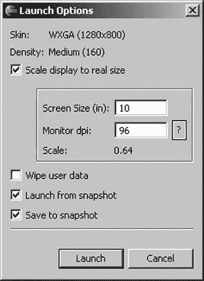

[图 1-16](#_Fig16) 。启动选项对话框

您也可以在启动选项对话框中使用快照。当您退出模拟器时，保存到快照会导致较长的延迟。顾名思义，您正在将模拟器的当前状态写到一个快照映像文件中，下次启动时可以使用它来避免经历整个 Android 启动序列。如果有快照，启动速度会快得多，因此节省时间的延迟是值得的—您基本上是从您停止的地方开始。

如果你想从头开始，你可以选择清除用户数据。您也可以取消选择从快照启动以保留用户数据并完成启动序列。或者，您可以创建您喜欢的快照，并仅启用*从快照启动选项*；这样可以反复使用快照，所以启动和关闭都很快，因为每次退出时不会创建新的快照映像文件。快照图像文件存储在与其余 AVD 图像文件相同的目录中。如果在创建 AVD 时没有启用快照，您可以随时编辑 AVD 并在那里启用它们。

参考

以下是一些对您可能希望进一步探索的主题有帮助的参考:

*   [【http://developer.samsung.com/】](http://developer.samsung.com/):三星的开发者网站，拥有许多 Android 相关的开发工具。
*   [【http://developer.htc.com/】](http://developer.htc.com/):面向安卓开发者的 HTC 网站。
*   [http://Developer . Android . com/guide/developing/tools/index . html](http://developer.android.com/guide/developing/tools/index.html):Android 调试工具的开发者文档。
*   :droid draw 网站。这是一个 Android 应用的 UI 设计器，使用拖放来构建布局。

摘要

本章涵盖了以下主题，帮助您为 Android 开发做好准备:

*   下载并安装 JDK、Eclipse 或 Android Studio 以及 Android SDK
*   如何修改路径变量并启动工具窗口
*   安装和升级视图、活动、片段、意图、内容提供者、服务和 AndroidManifest.xml 文件的 ADT 基本概念
*   Android 虚拟设备(AVDs)，当你没有设备(或者你想要测试的特定设备)时，它可以用来测试应用
*   建立一个“你好的世界！”应用并将其部署到仿真器
*   初始化任何应用的基本要求(项目名称、Android 目标、应用名称、包名称、主要活动、最低 SDK 版本)
*   运行配置在哪里以及如何更改它们
*   将真实设备连接到您的工作站，并在其上运行您的新应用
*   Android 应用的内部结构，以及活动的生命周期
*   LogCat，以及在哪里寻找来自应用的内部消息
*   启动模拟器时可用的选项，如快照和调整屏幕显示大小