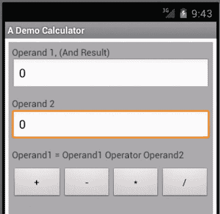
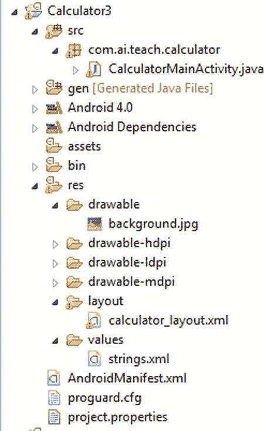
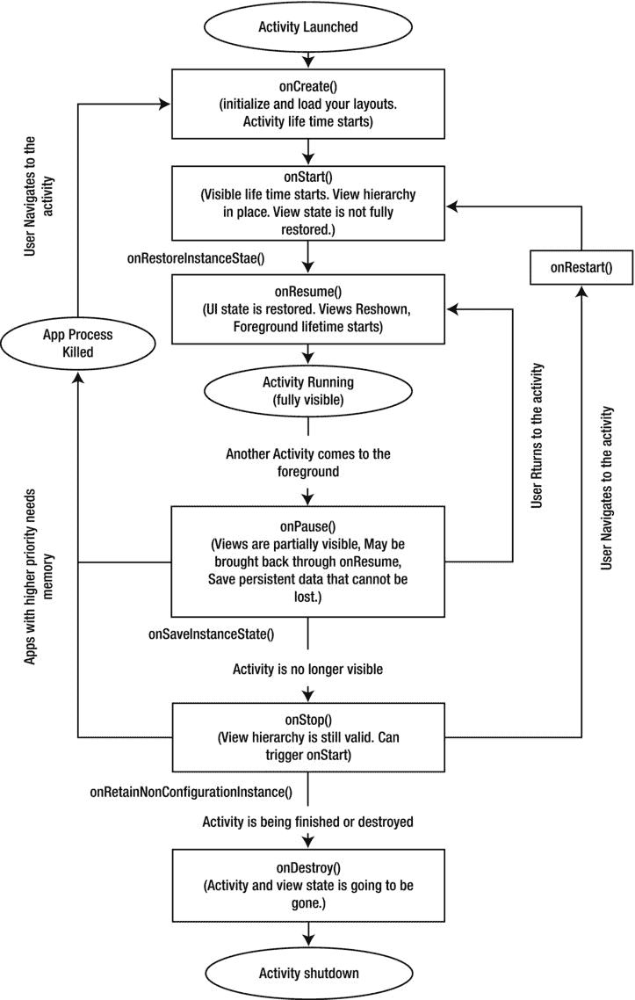

第章 2

Android 应用架构介绍

第一章介绍了开发 Android 应用程序所需的环境和工具。本章将对 Android 的应用程序架构进行广泛的介绍。我们将通过做三件事来做到这一点。首先，我们将通过构建一个 Android 应用程序来展示其架构。然后，我们将介绍 Android 架构的基本组件，即活动、资源、意图、活动生命周期和保存状态。我们将以一个学习路线图来结束这一章，学习如何使用本书的其余部分来创建简单到复杂的移动应用程序。

在本章的**第一节**中，一个一页的计算器应用程序将让你鸟瞰使用 Android SDK 编写应用程序。创建这个应用程序将演示如何创建 UI，编写 Java 代码来控制 UI，以及构建和部署应用程序。

除了演示用户界面，这个计算器应用程序将向您介绍活动、资源和意图。这些概念是 Android 应用架构的核心。我们将在本章的第二节中详细介绍这些主题，以便为您理解 Android SDK 的其余部分打下坚实的基础。我们还将讨论活动的生命周期，并简要概述应用程序的持久性选项。

在**第三部分**中，我们将给出本书剩余部分的路线图，解决构建 Android 应用程序的基本和高级方面。这最后一节将这些章节分成一组学习轨道。这一节是对整套 Android APIs 的广泛介绍。

此外，在这一章中你将会找到以下问题的答案:我怎样才能创建一个拥有丰富控件的 UI？如何持久存储状态？如何读取应用程序输入的静态文件？我怎样才能接触到网络，从网络上阅读或向网络上写东西？Android 还提供了哪些 API 让我的应用功能丰富？

事不宜迟，让我们进入简单的计算器应用程序，打开 Android 的世界。

探索简单的 Android 应用程序

本章我们想要演示的计算器应用程序如图 2-1 中的[所示。](#Fig1)



[图 2-1](#_Fig1) 。一款计算器应用

[图 2-1](#Fig1) 中的显示在 Android 中称为活动。这个活动在顶部有两个编辑控件，代表两个数字。您可以在这些编辑框中输入数字，并使用图形底部的运算符按钮来执行算术运算。操作的结果将显示在顶部的编辑控件中。这两个编辑框标记为操作数 1 和操作数 2。要使用 Android SDK 创建这种类型的计算器应用程序，您需要执行以下步骤:

1.  在文本/xml 文件(Android 中称为布局或布局文件)中创建用户界面(UI) 定义。
2.  在 Java 文件中编写编程逻辑(通常在扩展基本活动类的类中)。
3.  创建一个描述您的应用程序的配置文件(这个文件总是被称为 AndroidManifest )。xml)。
4.  创建一个项目和一个目录结构来放置步骤 1、2 和 3 中的文件。
5.  使用步骤 4 中的项目构建一个可部署的包(它被称为)。apk 文件)。

通过浏览这些步骤的细节，你会对 Android 应用程序的制作有所了解。我们现在将经历这些步骤。

通过布局文件定义用户界面

Android 应用程序在许多方面类似于 web 应用程序。在 web 应用程序中，UI 就是你的网页。网页的用户界面是通过 HTML 定义的。一个 HTML 网页是一系列的控件，如段落、分区、表格、按钮等。Android 中的 UI 构造类似。Android 中的布局文件就像一个 HTML 页面，尽管控件来自 Android SDK 而不是 HTML。在 Android 中，这个文件被称为布局文件。[清单 2-1](#list1) 显示了产生[图 2-1](#Fig1) 的用户界面的布局文件。

***[清单 2-1](#_list1) 。*** 定义活动 UI 的 Android 布局文件

```java
<?xml version="1.0" encoding="utf-8"?>
<!--
*********************************************
* calculator_layout.xml
* corresponding activity: CalculatorMainActivity.java
* prefix: cl_ (Used for prefixing unique identifiers)
*
* Use:
*    Demonstrate a simple calculator
*    Demonstrate text views, edit text, buttons, business logic
*********************************************
-->
<LinearLayout xmlns:android="[http://schemas.android.com/apk/res/android](http://schemas.android.com/apk/res/android)"
    android:orientation="vertical"
    android:layout_width="match_parent" android:layout_height="match_parent"
    android:layout_margin="5dp" android:padding="5dp"
    android:background="@android:color/darker_gray"
    >
    <!--  Operand 1 -->
    <TextView android:layout_width="match_parent"
        android:layout_height="wrap_content"
        android:text="Operand 1, (And Result)"
        />
    <EditText android:layout_width="match_parent" android:layout_height="wrap_content"
        android:id="@+id/editText1"  android:text="0"
        android:inputType="numberDecimal"/>
    <!--  Operand 2 -->
    <TextView android:layout_width="match_parent"
        android:layout_height="wrap_content"
        android:text="Operand 2"
        android:layout_marginTop="10dp"
        />
    <EditText android:layout_width="match_parent"
       android:layout_height="wrap_content"
       android:text="0"
       android:id="@+id/editText2"
       android:inputType="numberDecimal">
    </EditText>
    <!--  Buttons for Various Operators -->
    <TextView android:layout_width="match_parent"
        android:layout_height="wrap_content"
        android:text="Operand1 = Operand1 Operator Operand2"
        android:layout_marginTop="10dp"
        />
<LinearLayout
    android:orientation="horizontal"
    android:layout_marginTop="10dp"
    android:layout_width="match_parent"
    android:layout_height="wrap_content">
    <Button android:text="+" android:id="@+id/plusButton"
       android:layout_weight="1"
       android:layout_width="wrap_content"
       android:layout_height="wrap_content">
    </Button>
    <Button android:text="-" android:id="@+id/minusButton"
       android:layout_weight="1"
       android:layout_width="wrap_content"
       android:layout_height="wrap_content">
    </Button>
    <Button android:text="*" android:id="@+id/multiplyButton"
       android:layout_weight="1"
       android:layout_width="wrap_content"
       android:layout_height="wrap_content">
    </Button>
    <Button android:text="/" android:id="@+id/divideButton"
       android:layout_weight="1"
       android:layout_width="wrap_content"
       android:layout_height="wrap_content">
    </Button>
</LinearLayout>
</LinearLayout>
```

让我们逐行检查清单 2-1 的计算器 XML 布局文件。与图 2-1 中的[相比，这个文件看起来很复杂。是的，它很冗长，但是您很快就会看到它的架构很简单。](#Fig1)

在布局文件中指定注释

作为一个好的实践，清单 2-1 中的布局 XML 文件顶部的注释指出了这个文件名是什么，什么 UI 活动将被用来显示这个文件，这个文件的目的是什么，以及这个布局文件中有什么简单的控件。

在布局文件中添加视图和视图组

布局文件中的每个 XML 节点表示一个 UI 控件。这些控件可以是视图，也可以是其他视图的容器。其他视图的容器称为视图组 。例如，按钮就是一个视图。[清单 2-1](#list1) 中的 LinearLayout 是一个视图组，它将所有子视图垂直向下或水平交叉放置。因此， LinearLayout 就像一个 HTML div 一样，它可以横向或纵向布局其子元素。

在布局文件中指定控件属性

计算器布局文件中的 UI 控件有 LinearLayout 、 TextView 、 EditText 和一个按钮。当在屏幕上绘制时，这些控件中的每一个都代表一个 Java 对象。作为一个对象，每个控件都有属性。如果控件属于核心 Android SDK，它们的属性会以 "android:" 作为前缀，如 "android:orientation" 用于 LinearLayout 控件。你通常在应用中使用的大部分(如果不是全部)控件都来自核心的 Android SDK。当您编写自己的控件时，它们被称为自定义控件。这些自定义控件允许您定义自定义属性。有关自定义控件的更多信息，请参见本章的“路线图”部分。

指示视图组属性

一些控件属性被标记为“Android:layout _”、如 android:layout_width 。虽然在给定的 XML 节点中提到了这些属性，比如一个按钮，但是它们被父节点读取并使用，比如 LinearLayout 来放置子节点。父节点是视图组，如 LinearLayout 。你可以在[清单 2-1](#list1) 的布局文件中的第一个 LinearLayout 节点如何定义填充和边距中看到这种差异。在本例中，属性 padding 属于最顶端的 LinearLayout 对象，而同一个最顶端的 LinearLayout 的边距属性 layout_margin 属性属于 LinearLayout 的父对象，后者是 Android 框架提供的隐式视图组。所以对于填充，你说 android:padding ，对于边距，你说 android:layout_margin 。注意有无“布局 _”前缀。如果您想知道一个对象(或控件)支持什么属性，您可以使用 eclipse 中的 Ctrl-Space 来查看该对象属性的一组建议。根据您的开发环境，您可以很容易地找到一组等效的组合键来做同样的事情。

控制控件的宽度和高度

控件的两个常用属性是其布局宽度和布局高度。控件的布局父级管理这些值。这些属性的值通常是匹配 _ 父项和包装 _ 内容。如果您说您的 TextView 的宽度设置为 match_parent ，控件的宽度与父宽度匹配。当一个 TextView 被设置为它的高度 wrap_content 时，那么它的高度将刚好足以包含它在垂直方向上的所有文本。当然，这两个属性可用于布局的所有子控件，而不仅仅是文本控件。这两个布局控件属性 match_parent 和 wrap_content 也适用于控件的高度。

介绍资源和背景

虽然我们正在解释布局文件中的控件，但这是介绍资源的好地方。布局文件是资源，并且由资源组成。在计算器布局文件中，我们通过在根 LinearLayout 控件上设置背景来设置整个视图的背景。该指令如下所示:

```java
android:background="@android:color/darker_gray"
```

Android 中的每个视图或控件都支持背景属性。背景通常被认为是资源。在这个例子中，背景指向一个资源，来自 Android 包，类型为颜色，引用值为深灰色。

在 Android 中，应用程序的许多输入被表示为资源。一些示例资源是图像文件、整个布局文件、颜色、字符串、XML 文件、菜单和 Android SDK 中列出的许多其他东西。例如，我们讨论的整个计算器布局文件本身就是一个资源。

从计算器布局文件中可以看出，资源有不同的类型。在 Android 中，它们被进一步宽泛地分为“基于价值”或“基于文件”作为值的资源的例子有字符串和颜色。文件资源的例子有图像或布局文件。清单 2-2 展示了一个创建基于价值的资源的例子，这些资源是字符串和颜色。

***[清单 2-2](#_list2) 。*** 基于价值的资源的例子

```java
<?xml version="1.0" encoding="utf-8"?>
<!-- this file will be in /res/values subdirectory  -->
<resources>
    <string name="hello">Hello World, CalculatorMainActivity!</string>
    <string name="app_name">A Demo Calculator</string>
    <color name="red">#FF0000</color>
    <color name="blue">#0000FF</color>
</resources>
```

您可以拥有任意数量的基于值的文件，只要它们都在 /res/values 子目录下。每个文件将以资源根节点开始。您可以使用 Ctrl-Space 来发现其他可能的基于价值的可用资源。

转到基于文件的资源，[清单 2-3](#list3) 显示了一个将许多基于文件的资源放在它们各自的资源子目录下的例子。

***[清单 2-3](#_list3) 。*** 基于文件的资源示例

```java
/res/layout/page1_layout.xml (A layout file for say page 1)
/res/drawable/page1_background.jpg (An example image file)
/res/drawable-hdpi/page1_background.jpg (Same image file for a different density)
/res/xml/some_preferences.xml (example of an input file for your app)
```

任何这些资源，无论是基于文件还是基于值，都可以使用“ @ ”资源引用语法在布局文件中引用。例如，在[清单 2-1](#list1) 中的计算器布局文件中，背景可以被设置为引号之间的颜色值，如 "#FFFFFF ，"或指向一个资源引用(由一个已经被定义为颜色资源的开始@ color/red】指示)(如清单 2-2 中的[所示)。在以“@”开头的语法中，引用资源的类型是“颜色”其他类型资源的一些关键字是 string (用于字符串)、d rawable (用于图像)等。](#list2)

在[清单 2-1](#list1) 中，读取 LinearLayout 的背景属性的值，即@ android:color/darker _ gray的方法如下:使用 Android 核心框架中标识为 darker_gray 的资源的值，该资源的资源类型为 color 。有了这些资源引用语法的知识，再看一下计算器布局文件清单，您将能够阅读它，其中每个控件都有属性，每个属性都有一个直接指定的值，或者引用资源文件中其他地方定义的资源。

定义为资源引用的控件属性值的间接性具有优势。资源可以针对语言、设备密度变化和各种因素进行定制，而无需更改编译后的 Java 源代码。例如，当你提供背景图片时，你可以把这些图片放在不同的目录中，并用 Android 指定的惯例来命名它们。然后 Android 知道如何根据你的应用程序运行的设备来定位正确的图片。

在布局文件中使用文本控件

在计算器布局示例中，我们使用了两个基于文本的控件。一个是 TextView 控件，作为标签使用；另一个是 EditText 控件，用于获取输入文本。我们已经向您展示了如何使用以“ layout_ ”开头的属性来设置任何视图的宽度和高度。每个基于文本的控件也有一个名为 text 的属性。在我们的示例中，我们已经直接将文本指定为该属性的值。建议使用资源引用。例如:

```java
android:text="Literal text"  //what we did for clarity
or
android:text="@string/LiteralTextId" //doing it properly
```

后一个资源 ID， LiteralTextId ，可以在 /res/values 子目录下的文件中定义，非常类似于[清单 2-2](#list2) 中的内容。

计算器布局中的 EditText 控件有一个属性 inputType 来提供必要的约束和验证，这些约束和验证需要在数据被键入可编辑字段时发生。请参考文档以查看可编辑字段可用的大量约束。或者，您可以使用 eclipse ADT 在编码期间动态地发现可用的输入类型。

为控件使用自动生成的 id

为了操作清单 2-1 的计算器布局中的控件，我们需要一种方法将它们转换成 Java 对象。这是通过使用活动的当前加载的布局文件中的唯一 ID 来定位这些控件来实现的。让我们看看布局文件中的一个例子，其中一个编辑文本控件被赋予一个 ID编辑文本 2 ，如下所示:

```java
android:id="@+id/editText2"
```

这种格式告诉 Android 这个 EditText 控件的 ID 是一个类型为 ID 的资源，它的整数值在 Java 中应该被称为 editText2 。+便于为 editText2 分配一个新的唯一整数。如果您没有 + 符号，那么 Android 会寻找一个用名为 editText2 的 id 定义的整数值资源。借助 + 的便利，我们可以避免先单独定义一个资源，然后再使用它。在某些情况下，您可能需要一个由多段代码共享的众所周知的 ID，在这种情况下，您将删除 + ，并采取多个步骤，首先定义 ID，然后在多个地方使用它的名称。您将在编程逻辑部分(稍后)看到如何使用这些控件 id 来定位和操作控件。

实现编程逻辑

要查看设备屏幕上的计算器布局，您需要一个从 Android SDKs 类 activity 派生的 Java 类。这样一个活动代表了移动应用程序中的一个窗口。所以你需要通过扩展 Android 基础的一个活动类来创建一个计算器活动，如[清单 2-4](#list4) 所示。

***[清单 2-4](#_list4) 。*** 编程逻辑:实现一个活动类

```java
/**
 * Activity name: CalculatorMainActivity
 * Layout file: calculator_layout.xml
 * Layout shortcut prefix for ids: cl_
 * Menu file: none
 * Purpose and Logic
 * ******************
 * 1\. Demonstrate business logic for a simple calculator
 * 2\. Load the calculator_layout.xml as layout
 * 3\. Setup button callbacks
 * 4\. Respond to button clicks
 * 5\. Read values from edit text controls
 * 6\. Perform operation and update result edit control
 */
public class CalculatorMainActivity extends Activity
implements OnClickListener
{
    private EditText number1EditText;
    private EditText number2EditText;

    /** Called when the activity is first created. */
    @Override
    public void onCreate(Bundle savedInstanceState) {
        super.onCreate(savedInstanceState);
        setContentView(R.layout.calculator_layout);
        gatherControls();
        setupButtons();
    }
    private void gatherControls()   {
        number1EditText = (EditText)this.findViewById(R.id.editText1);
        number2EditText = (EditText)this.findViewById(R.id.editText2);
        number2EditText.requestFocus();
    }
    private void setupButtons()    {
        Button b = (Button)this.findViewById(R.id.plusButton);
        b.setOnClickListener(this);

        b = (Button)this.findViewById(R.id.minusButton);
        b.setOnClickListener(this);

        b = (Button)this.findViewById(R.id.multiplyButton);
        b.setOnClickListener(this);

        b = (Button)this.findViewById(R.id.divideButton);
        b.setOnClickListener(this);
    }
    @Override
    public void onClick(View v)     {
        String sNum1 = number1EditText.getText().toString();
        String sNum2 = number2EditText.getText().toString();
        double num1 = getDouble(sNum1);
        double num2 = getDouble(sNum2);
        Button b = (Button)v;

        double value = 0;
        if (b.getId() == R.id.plusButton)   {
            value = plus(num1, num2);
        }
        else if (b.getId() == R.id.minusButton)   {
            value = minus(num1, num2);
        }
        else if (b.getId() == R.id.multiplyButton)   {
            value = multiply(num1, num2);
        }
        else if (b.getId() == R.id.divideButton)   {
            value = divide(num1, num2);
        }
        number1EditText.setText(Double.toString(value));
    }

    private double plus(double n1, double n2)    {
        return n1 + n2;
    }
    private double minus(double n1, double n2)    {
        return n1 - n2;
    }
    private double multiply(double n1, double n2)    {
        return n1 * n2;
    }
    private double divide(double n1, double n2)    {
        if (n2 == 0)    {
            return 0;
        }
        return n1 / n2;
    }
    private double getDouble(String s)    {
        if (validString(s))        {
            return Double.parseDouble(s);
        }
        return 0;
    }
    private boolean invalidString(String s)    {
        return !validString(s);
    }
    private boolean validString(String s)    {
        if (s == null)     {
            return false;
        }
        if (s.trim().equalsIgnoreCase(""))    {
            return false;
        }
        return true;
    }
}
```

在这个清单中，计算器活动被称为 CalculatorMainActivity 。一旦你有了这个活动，你可以加载计算器布局到其中，以便看到[图 2-1](#Fig1) 的计算器屏幕。

让我们了解一下 Android 中的一项活动。程序员不需要直接实例化一个活动。Android 框架可以基于用户的动作实例化一个活动。从这个意义上说，活动是由 Android 管理的一个“*托管组件*”。

当另一个具有更高优先级的 UI 位于某个活动之上时，该活动可以部分隐藏或完全隐藏(例如，由于一个电话)。或者，由于内存限制，后台中的活动可以被临时移除。在这些情况下，当用户再次访问应用程序时，活动可以自动恢复。

将布局文件装入活动

因为活动是事件驱动的，所以活动依赖于回调。第一个重要的回调是 onCreate() 回调。在[清单 2-4](#list4) 中给出的计算器活动中，你可以很容易地找到这个方法。这是我们将计算器布局加载到计算器活动中的地方。这是通过方法 setContentView() 完成的。该方法的输入是计算器布局文件的标识符。

Android 的一个很好的特性是它对包括布局文件在内的各种资源的处理。它自动生成一个名为R.java的 java 类，在这里它为所有资源定义整数 id，不管它们是基于值的还是基于文件的。在[清单 2-4](#list4) 给出的活动中，变量r . layout . calculator _ layout指向计算器布局文件(它本身在[清单 2-1](#list1) 中)。

当你尝试 Android 框架时，另一个神秘的东西是的。由于 Android 框架可能会停止和重启(甚至重新创建)活动，它需要一种方法将活动的最后状态传递给 onCreate() 方法。这就是保存实例捆绑包的功能。它是保存活动先前状态的键值对的集合。你将在本章后面更详细地了解状态管理的这一方面，也将在第 9 章中了解，在那里我们将介绍当设备旋转时会发生什么。对于计算器示例的实现，我们简单地调用超类的方法来传递状态包。

收集控件

接下来的两个方法， gatherControls() 和 setupButtons() ，为计算器建立交互模型。在gatherecontrols()方法中，您获取需要操作(读取或写入)的编辑控件的 java 引用，并将它们本地保存在 calculator 活动类中。您可以通过在基本活动类上使用 findViewById() 方法来实现这一点。 findViewById() 方法将布局文件中控件的 Id 作为输入。这里，Android 也自动生成这些 id，并将它们放入R.java类。在您的 eclipse 项目中，您可以在/ gen 子目录中看到这个文件。[清单 2-5](#list5) 显示了为这个计算器项目生成的R.java文件。(如果您自己尝试这个项目，这些 id 可能会有所不同。所以使用这个清单主要是为了理解概念。)

***[清单 2-5](#_list5) 。自动生成的资源标识:R.java***

```java
public final class R {
    public static final class attr {
    }
    public static final class drawable {
        public static final int background=0x7f020000;
        public static final int icon=0x7f020001;
    }
    public static final class id {
        public static final int divideButton=0x7f050005;
        public static final int editText1=0x7f050000;
        public static final int editText2=0x7f050001;
        public static final int minusButton=0x7f050003;
        public static final int multiplyButton=0x7f050004;
        public static final int plusButton=0x7f050002;
    }
    public static final class layout {
        public static final int calculator_layout=0x7f030000;
    }
    public static final class string {
        public static final int app_name=0x7f040001;
        public static final int hello=0x7f040000;
    }
}
```

注意R.java如何为每种资源类型使用不同的类前缀。这允许 eclipse 中的程序员根据 id 的类型快速地将它们分开。所以，比如所有布局文件的 id 都以 R.layout 为前缀，所有图像 id 都以 R.drawable 为前缀，所有字符串都以 R.string 为前缀，等等。然而，在使用这些 id 时有一个注意事项。即使您有十个布局文件，所有控件的 id 都生成到一个名称空间中，如 R.id.*(其中“id”是一个资源类型的示例)。因此，您可能希望养成在布局文件中用一些前缀来命名控件的习惯，以表明它们属于哪个布局文件。

设置按钮

清单 2-1 的[计算器布局中的一些控件是计算器按钮](#list1)。分别是代表操作员的按钮: +、- 、 x 、 / 。我们需要在按下这些按钮时调用代码。方法是在按钮控件上注册一个回调对象。这些回调对象必须实现视图。OnClickListener 接口。计算器活动除了扩展活动类之外，还实现了视图。OnClickListener 接口，允许我们将活动注册为每个按钮被按下时需要被回调的活动。正如您在活动代码中看到的([清单 2-4](#list4) )，这是通过调用每个按钮上的 setOnClickListener 来完成的。

对按钮点击的响应:将所有这些联系在一起

当点击任何操作按钮时，清单 2-4 中的[给出的计算器活动中的 onClick() 方法](#list4)被调用。在这个方法中，我们将调查回调的视图的 ID。这个调用视图应该是按钮之一。在这个方法中，我们将从两个编辑文本控件中读取值(操作数值)，然后调用一个特定于每个操作符的方法。运算符方法将计算结果并更新标记为 result 的编辑文本。

更新机器人清单。可扩展置标语言

到目前为止，我们已经有了 UI(根据布局文件)和根据计算器活动的业务逻辑。每个 Android 应用程序都必须有自己的配置文件。这个文件叫做 AndroidManifest.xml 。这可以在项目的根目录中找到。[清单 2-6](#list6) 显示了该项目的 AndroidManifest.xml 。

***[清单 2-6](#_list6) 。*T5 应用配置文件:AndroidManifest.xml**

```java
<?xml version="1.0" encoding="utf-8"?>
<manifest xmlns:android="[http://schemas.android.com/apk/res/android](http://schemas.android.com/apk/res/android)"
      package="com.androidbook.calculator"
      android:versionCode="1"
      android:versionName="1.0">
    <uses-sdk android:minSdkVersion="14" />
    <application android:icon="@drawable/icon" android:label="@string/app_name">
        <activity android:name=".CalculatorMainActivity"
            android:theme="@android:style/Theme.Light"
                  android:label="@string/app_name">
            <intent-filter>
                <action android:name="android.intent.action.MAIN" />
                <category android:name="android.intent.category.LAUNCHER" />
            </intent-filter>
        </activity>

    </application>
</manifest>
```

这个清单文件的 package 属性遵循类似于 java 名称空间的命名结构。在计算器 app 中，包设置为com . androidbook . calculator。这就像给你的应用程序一个名字和一个唯一的标识符。一旦您签署了此应用程序并将其安装在谷歌 Play 商店等应用程序发布者上，只有您才能更新它或发布它的后续版本。 uses-sdk 指令表示该应用向后兼容的 API。应用程序节点有许多属性，包括它的标签和一个将显示在 Android 设备应用程序菜单中的图标。在应用程序节点内部，我们需要定义组成这个应用程序的所有活动。每个活动由其各自的 java 类名来标识。如果活动类名不是完全限定的，那么 java 包就被认为与所标识的应用程序包相同。活动的主题表示属于该活动的视图将继承的一组属性。这就像在 HTML UI 上设置 CSS 样式一样。Android 有一些默认的风格。选择浅色主题有利于截图时的对比(如图[图 2-1](#Fig1) )。第 7 章专门讨论在你的应用中使用风格和主题。

在 Android 应用程序清单文件中，活动可以指定一系列意图过滤器。意图是 Android 独有的编程概念。Android 非常依赖这些意图。Android 使用意图对象来调用包括活动在内的应用程序组件。一个意图对象可以包含一个显式活动类名，这样当您调用该意图时，您最终会调用该活动。或者，除了有一个显式的类名之外，intent 还可以指示一个通用的动作，比如查看网页的 VIEW。当你用一个普通的动作调用这样一个意图时，Android 将会呈现所有可能的活动来满足这个动作。活动通过 manifest 文件向 Android 注册，它们可以通过意图过滤器来响应一些动作。[清单 2-7](#list7) 展示了如何通过一个意图对象来调用一个活动。

***[清单 2-7](#_list7) 。*** 使用意图对象调用活动

```java
//currentActivity refers to the activity in which this code runs
Intent i = new Intent(currentActivity,SomeTargetActivity.class);
currentActivity.startActivity(i); //start the target activity
```

尽管我们使用 currentActivity 作为第一个参数的值来创建一个 intent，但它所需要的只是一个名为 Context 的基类引用。ccontext引用代表了应用程序上下文，像活动这样的组件在其中运行。回到 intent 对象，它有许多标志和额外的数据元素，可以用来控制 intent 正在调用的目标活动的行为。[清单 2-8](#list8) 显示了一个例子。

***[清单 2-8](#_list8) 。*** 在一个意向对象上使用临时演员

```java
//currentActivity refers to the activity in which this code runs
Intent intent = new Intent(currentActivity,SomeTargetActivity.class);
intent.setFlags(Intent.FLAG_ACTIVITY_CLEAR_TOP
                | Intent.FLAG_ACTIVITY_SINGLE_TOP);
intent.putExtra("some-key", "some-value");
currentActivity.startActivity(intent);
```

在本例中，我们希望将目标活动放在窗口或活动堆栈的顶部，并关闭之前在它上面的任何其他活动。当一个人从其他活动中调用活动时，这些活动相互重叠。这个堆栈允许后退按钮导航回堆栈中的上一个活动。当您返回时，当前顶层活动结束，前一个活动显示在前台。清单 2-8 中的代码就像回到目标活动的最后一个位置，使它成为顶层实例，并删除/完成它上面所有最近的活动。 Extras on intent 是一组键值对，您可以将它们从源活动传递给目标活动。各种活动相互之间相当孤立。它们之间不共享局部变量。相反，它们应该通过可以序列化和反序列化的对象来传递数据。Android 使用了一个类似于 Serializable 的界面，叫做 Parcelable ，它允许更大的灵活性和效率。

最终，每个活动几乎总是由意图对象启动。您可以通过调用 getIntent() 在目标活动中的任何地方获取 intent 对象。一旦获得了 intent 对象，就可以获得它的额外内容，并查看是否有您需要的相关数据。

意图及其变体的完整研究是一个大课题。在结束对计算器应用程序的讨论后，我们将在本章的后面继续讨论更多的意图。我们还在这一章的末尾提供了一个链接，可以找到我们之前版本中关于意图的免费章节。

将文件放置在 Android 项目中

让我们回到我们的主线，计算器 app。至此，您已经拥有了创建计算器应用程序所需的三个文件。使用你在第一章中学到的知识创建一个空的 Android 项目，并调整该项目来放置这三个文件。清单 2-9 中给出了这些文件及其父目录。

***[清单 2-9](#_list9) 。计算器应用程序文件的*** 位置

```java
/res/layout/calculator_layout.xml
/src/com/androidbook/calculator/CalculatorActivity.java
/AndroidManifest.xml
```

[图 2-2](#Fig2) 显示了你的 Android 项目在 eclipse 中的结构。你可以看到清单 2-9 中[文件的相对位置。](#list9)



[图 2-2](#_Fig2) 。一款计算器 app 目录结构

图 2-1 中的目录结构也显示了其他资源如图像和字符串的位置。您还可以在[图 2-2](#Fig2) 中看到设备相关图像文件的目录结构。这就是 Android 如何通过使用不同的资源子目录后缀来解决本地化多语言支持。当你阅读这本书的时候，你会学到一个 Android 项目的其他子目录。

在真实设备上测试计算器应用程序

现在剩下的就是构建 APK 文件，签署它，并准备好部署。测试您的项目的最简单的方法是让 eclipse 将 APK 部署到模拟器并测试它。在设备上测试此文件(签名后)的最简单方法是通过电子邮件将其发送给您自己，然后在您的设备上打开电子邮件。设备上有一个安全设置，允许来自未验证来源的 apk。只要这是允许的，你就可以安装 APK 文件并在你的设备上运行。或者您也可以将设备连接到 USB 端口，让 eclipse 将 APK 直接部署到设备上。您甚至可以通过 eclipse 在设备上调试它。您也可以将 APK 文件从您的 PC 或 Mac 复制到设备 SD 卡，并从那里进行安装。

这就结束了我们关于计算器应用的部分，它展示了 Android 应用的本质。现在我们将转到本章的第二部分，在这里我们将更深入地讨论活动，并重新审视资源、意图和保存状态。先说活动。

Android 活动生命周期

Android 活动是 Android 应用程序的独立组件，可以根据各种事件(包括用户发起的和系统发起的事件)来启动、停止、暂停、重启或回收。因此，通过查看活动的所有回调来审查活动生命周期的架构是非常重要的。图 2-3 通过记录回调的顺序和执行回调的环境，展示了活动的生命周期。让我们逐一考虑这些回调方法。



[图 2-3](#_Fig3) 。注释安卓活动生命周期

**void onCreate** **(捆绑储蓄罐)**

活动的生命周期从这个方法开始。在这种方法中，您应该通过将布局加载到活动的内容视图中来加载视图层次结构。您还可以初始化任何可能在活动的生命周期中使用的活动级别变量。像许多回调一样，你也首先调用父类的 onCreate() 方法。

当调用 onCreate 时，活动可能处于三种状态之一。该活动可能是第一次开始其生命的全新活动。或者它可以是由于配置改变而自动重启的活动，例如设备从一个方向旋转到另一个方向。或者，它是一个在上次由于内存不足而关闭进程后重新启动的活动，并且在后台运行。在 onCreate 回调中，如果您在每个场景中需要做的事情不同，您应该考虑这些场景。

现在我们可以理解涉及 savedInstanceBundle 的这个方法的参数了。您可以使用这个包来查看活动的先前状态。这个包最初可能用于保存配置更改期间的活动状态，或者当活动及其流程由于内存不足而关闭时。保存到这个 bundle 参数中的状态通常被称为活动的*实例状态*。实例状态本质上是临时的；具体来说，在这个调用过程中，它被绑定到应用程序的这个实例。这种类型的状态不会像文件一样被写入永久存储。当应用程序恢复时，如果这种状态恢复到初始状态，用户将不会太不安。在回调中我们将很快解释叫做【on pause()你可以把必须持久化的状态保存到长期存储器中。如果发生这种情况，您可以使用 onCreate() 方法来加载该状态以及启动的一部分。

这种方法还需要考虑另一个因素。当由于方向改变而重新启动或重新创建一个活动时，旧的活动被销毁，并在其位置创建一个新的活动。这意味着新的活动在内存中有了新的引用。旧的活动参考不再有效。让一个外部线程或全局对象抓住旧的活动不放是错误的。因此，当活动被重新创建时，需要有一种机制来告诉外部对象有一个新的活动引用。为此，重新创建的活动需要知道外部对象的引用。这个外部对象引用被称为“非配置实例引用”有一个回调方法叫做onRetainNonConfigurationInstance()可以返回对这个外部对象的引用；我们很快会谈到这一点。Android SDK 随后保留这个引用，并通过一个名为getlastonconfigurationinstance()的方法使其可用于重新创建的活动。请注意，在第 8 章中，我们将向您展示如何通过所谓的无头保留片段更好地做到这一点。我们将在关于 AsyncTask 的第 15 章中回到这个话题。

onCreate 方法还有另一个细微差别。你可能想要确保在布局中你有正确的视图和片段(你将在[第 8 章](08.html)中学习)来匹配状态被保存的时间。因为随后的onRestoreInstanceState()(在 onStart() 之后调用)假设所有的视图和片段层次结构都存在以恢复它们各自的状态，仅仅存在先前的状态不会重新创建视图。因此，由这个方法来加载要显示的正确布局。如果您在与活动交互的过程中没有删除或添加视图，这通常不是问题。

void onStart()T1】

创建后，此方法将活动推入可见状态。换句话说，这个方法启动了活动的“可见生命周期”。这个方法在 onCreate() 之后被调用。这个方法假设视图层次结构已经从 onCreate() 加载并可用。你通常不需要重写这个方法，如果你这样做了，确保你首先调用父节点的 onStart() 。在[图 2-2](#Fig2) 中，注意这个方法也可以从另一个叫做 onRestart 的回调中调用。

你必须知道 onRestoreInstanceState 方法是在这个方法之后调用的。因此，您不应该对这种方法中的视图状态做出假设。所以尽量不要在这个方法中操纵视图的状态。在随后的on restorestancestate或 onResume 方法中进行细化。因为这是 onStop() 的对应物，所以如果您已经在 onStop() 或 onPause() 中停止了某个东西，请执行相反的操作。如果你看到一些事情正在用这种方法来做，要谨慎地看待它，确保它是你想要的。还要知道，在活动的整个当前周期中，开始和停止周期可能会发生多次。

当活动先隐藏后显示时，也可以调用此方法，因为另一个活动已经到了可见性堆栈的顶部。在那些情况下，这个方法在 onRestart() 之后被调用，它本身在 onStop() 之后被触发。所以这个方法有两条路径:要么是 onCreate() 要么是 onRestart() 。在这两种情况下，视图层次结构都应该在回调之前建立并可用。

参见 onrestoreinstallationstate(bundle savedinstancestate)

如果用户合法地关闭一个活动，那么用户愿意放弃的状态就是实例状态。例如，当用户选择一个后退按钮时，他/她就在通知 Android 他/她对这个活动不再感兴趣，这个活动可以被关闭，放弃所有尚未保存的状态。因此，这种状态是短暂的，并且只在活动存在于内存中时才有效，这就是实例状态。

如果系统选择关闭活动，因为方向发生了变化，那么当活动重新开始时，用户将会期望返回到临时(实例)状态。为了方便起见，Android 调用这个 onRestoreInstanceState 方法，其中包含保存的实例状态。(参见 onSavedInstanceState 方法解释。)

与实例状态相反，活动的持久状态是用户希望看到的，即使在活动结束并且不再运行之后。这种持久性状态可能是在活动过程中创建的，甚至可能是在活动创建之前就存在了。这种类型的状态，尤其是在活动的帮助下创建的状态，必须像文件一样显式保存到外部持久性存储中。如果活动没有使用显式的“保存”按钮来满足这种需求，那么就需要使用“ onPause 方法来保存这种隐式的持久状态。这是因为在内存不足的情况下，不能保证调用之后的任何方法。如果信息太重要而不能丢失，就不应该依赖实例状态。

参见 onResume()

Resume 上的回调方法是活动完全可见的前身。这也是活动前台周期的开始。在这个前台循环中，活动可以在 onResume() 和 onPause() 之间移动多次，因为其他更紧急的活动、通知或对话会优先进行。

当这个方法被调用时，我们可以期待视图和它们的状态被完全恢复。您可以借此机会调整最终状态更改。由于这个方法没有捆绑包，如果需要的话，你需要依靠来自 onCreate 或 onRestoreInstanceState 方法的信息来微调状态。

如果您在期间因为停止了任何计数器或动画，您可以在此重新启动它们。您还可以跟踪视图是否真的被破坏的情况，方法是遵循前面的回调方法(无论 onResume 是由 onCreate 、 onRestart 还是 onPause )并尽可能最小地调整视图状态。通常情况下，您不会在这里进行状态管理，而只是那些需要根据可见性打开或关闭的任务。

参见 on case()

该回调表示活动即将进入后台。当活动完全可见时，您应该停止任何正在运行的计数器或动画。活动可能会在结束时进行到或者在结束时进行到。前往的结果将把活动带到前台。转到 onStop 将使活动进入后台状态。

根据 SDK，它也是在活动和流程被完全回收之前保证被调用的最后一个方法。所以这是开发人员将任何非实例和持久数据保存到文件中的最后机会。

Android SDK 也在使前台活动完全活动之前等待该方法返回。所以你想在这个方法中简洁。还要注意，这个方法没有传递任何包。这表明该方法用于存储持久数据，并且也存储在诸如文件或网络的外部存储介质中。

您还可以使用此方法停止后台任务的任何计数器、动画或状态显示。您可以在 onResume 中继续。

void onStop()

回调方法 onStop() 将活动从部分可见状态转移到后台状态，同时保持所有视图层次结构不变。这是 onStart 的翻版。通过调用 onStart 可以将活动带回到可视循环。在同一个活动生命周期中，从 onStop 到 onStart 的状态转换通过 onRestart() 方法完成。

调用后，活动不再可见。但是请记住，在低内存条件下，这可能不会在之后调用，因为。由于这种不确定性，不要使用此方法来启动或停止此进程之外的服务。因为而在做那件事，结果在继续。但是，您可以使用此方法来控制流程内部的服务或工作。这是因为，只要进程是活动的，这个方法就会被调用。如果整个过程都停止了，那么那些相关的任务或全局变量无论如何都会消失。

void onSaveInstanceState(Bundle saveStateBundle)

如果进程仍在内存中，则控制转到 onDestroy() 从 onStop 出来。然而，如果 Android 意识到活动在没有用户预期的情况下被关闭，那么它会在调用 onDestroy() 之前调用 onSaveInstanceState() 。方向改变是一个非常具体的例子。SDK 警告说 onSaveInstanceState() 的时序是在 onStop() 之前还是之后是不可预测的。

此方法的默认实现已经保存了视图的状态。但是，如果有一些视图不知道的显式状态，您需要将它保存在 bundle 对象中，并在 onRestoreInstanceState 方法中检索它。您确实需要首先调用父视图的 onSaveInstanceState() 方法，以便视图有机会自己保存它们的状态。视图保存状态有一些限制和规则。关于 UI 控件的章节([第 3 章](03.html)、[第 4 章](04.html)和[第 5 章](05.html))和配置更改的章节([第 9 章](09.html))更详细地介绍了这个主题。

参见 onRestart()

当活动从后台状态过渡到部分可见状态时，即从 onStop 到 onStart 时，调用该方法。如果你想基于是重新开始还是重启来优化代码，你可以在 onStart 中使用这些知识。当它重新启动时，视图和它们的状态相当完整。

你可以用这种方法做一些在 onStart 中已经完成的事情，但是当活动不可见时进行优化，但是在resume中重复做太昂贵了。

对象 on retain no configuration instance()t1]

这个回调方法用于处理由于配置更改而导致的活动重新创建。该方法返回进程内存中的一个对象引用，该对象引用需要在活动重新创建后重新分配给活动。我们之前在描述 onCreate 方法时已经详细解释过了。

当重新创建活动时，从该方法返回的对象通过方法getlastonconfigurationinstance()变得可用。现在在 onCreate() 中，新的活动可以使用先前建立的资源和对象引用。重要的是，如果那些先前的资源保持旧的活动引用，那么资源可以被告知使用新的。

这种困境的存在是因为在方向改变时，Android 不会终止进程，而是丢弃旧的活动，在新的方向上重新创建活动，并期望程序员提供新的布局，等等。，以适应新的配置。所以工作对象仍然在那里保持一个旧的活动。这是与它的“get”对应物相关联的克服这一障碍的方法。

当你阅读第 8 章时，你将会了解到这种方法已被废弃，你将会在它的位置使用所谓的无头保留片段。这些无头的保留片段的额外好处是能够跟踪活动的生命周期，而不仅仅是对活动的引用。

void ondstroy()

onDestroy() 是 onCreate() 的对应物。活动将在晚会结束后结束。一个活动可能因为两个主要原因而结束。

一个是明确的结束。当用户通过单击用于指示用户已完成的按钮，或者通过使用后退按钮离开活动转到上一个活动，而明确地使活动完成时，就会发生这种情况。在这种情况下，除非用户再次选择该活动，否则系统不会恢复该活动。在这个场景中，活动生命周期以 onDestroy 方法结束。

活动可以结束的第二个原因是非自愿的。当设备的方向改变时，Android SDK 将强制关闭活动并调用 onDestroy 方法，然后重新创建活动并再次调用 onCreate 。

当一个活动在后台时，如果系统需要内存，Android 可能会关闭该进程，并且可能没有机会调用 onDestroy 方法。由于这种不确定性，就像 onStop 一样，不要使用这种方法来控制活动运行的流程之外的任务或服务。但是，如果进程仍然在内存中，onDestroy 将作为生命周期的一部分被调用，只要代码属于该进程，您就可以将清理代码放在 onDestroy 中。

活动回访的一般说明

使用[图 2-3](#Fig3) 来指导您了解这些回调的顺序以及如何最好地使用它们。如果您要覆盖回调，您需要回调父方法。SDK 文档明确指出需要哪些派生方法来回调它们的父对等方法。还可以参考 SDK 文档来了解在哪些回调过程中，系统不会因为内存不足而终止进程。还要注意，只有少数回调带有实例状态包。

更多关于资源的信息

我们想告诉你更多关于 Android 应用程序如何使用资源的信息。在计算器布局文件中，您已经看到了一些使用的资源，如字符串、图像、id 等。

其他不太明显的资源包括维度、drawables、字符串数组、复数语言术语、xml 文件和所有类型的输入文件。在 Android 中，某些东西被视为资源 a)如果它是程序的输入，并且是 apk 文件的一部分，b)如果输入的值或内容可以基于语言、地区或设备的方向而具有不同的值，通常称为配置更改。

资源的目录结构

Android 中的所有资源都放在你的应用包根目录的 /res 子目录下。[清单 2-10](#list10) 展示了一个 /res 可能的样子:

***[清单 2-10](#_list10) 。*T5】Android 资源和资产目录结构**

```java
/res/values/strings.xml
           /colors.xml
           /dimens.xml
           /attrs.xml
           /styles.xml
    /drawable/*.png
             /*.jpg
             /*.gif
             /*.9.png
             /*.xml
    /anim/*.xml`
    /layout/*.xml
    /raw/*.*
    /xml/*.xml
/assets/*.*/*.*
```

我们将在第七章的[中介绍 attrs.xml 和 styles.xml 。 anim 子目录中的 xml 文件定义了可应用于各种视图的动画。我们将在动画章节(](07.html)[第 18 章](18.html))中介绍这些动画相关的资源。xml 子目录中的 xml 文件被编译成二进制文件，可以使用它们的资源 id 来读取它们。我们将很快展示一个这样的例子。/ raw 子目录保存被放置的文件，它们没有被转换成任何二进制格式。

/assets 目录是 /res 的同级，它不是资源层次结构的一部分。这意味着该子目录中的文件不会因语言或区域设置而改变。Android 不会为这些文件生成任何 id。这个目录更像是任何用作输入的文件的静态本地存储，比如应用程序的配置文件。

除了资产目录之外， /res 子目录中的所有其他工件最终都会在 R.* 名称空间中生成一个 ID，就像您之前看到的那样。每个不同的资源类型在 R.* 下都有自己的名称空间，如 R.id 、 R.string 或 R.drawable 等。

从 Java 代码中读取资源

在布局文件中，正如您在计算器布局中看到的，一个资源可以引用其他资源。例如，计算器布局资源文件引用了字符串和颜色引用。这种方法很常见。或者，您也可以使用 Java API 通过方法activity . get resources()来检索资源值。该方法返回对 Android SDK java 类资源的引用。您可以使用这个类上的方法来获取本地 R.* 名称空间中标识的每个资源的值。清单 2-11 展示了这种方法的一个例子:

***[清单 2-11](#_list11) 。*T5】读取 Java 代码中的资源值**

```java
Resources res = activity.getResources();
//Retrieving a color resource
int somecolor  = res.getColor(R.color.main_back_ground_color);
// Using a drawable resource
ColorDrawable redDrawable=(ColorDrawable)res.getDrawable(R.drawable.red_rectangle);
```

可绘制资源的运行时行为

drawable 目录是一个有趣的案例，值得报道，以展示 Android 架构的流畅性。如前所述，这个目录可以包含可以设置为背景的图像。这个目录还允许 XML 文件知道如何被转换成可绘制的 java 对象，这些对象可以在运行时被用作背景。[清单 2-12](#list12) 显示了一个这样的例子:

***[清单 2-12](#_list12) 。*** 一个形状可绘制的 XML 资源文件的例子

```java
<?xml version="1.0" encoding="utf-8"?>
<shape xmlns:android="[http://schemas.android.com/apk/res/android](http://schemas.android.com/apk/res/android)"
    android:shape="rectangle">
    <solid android:color="#f0600000"/>
    <stroke android:width="3dp" android:color="#ffff8080"/>
    <corners android:radius="13dp" />
    <padding android:left="10dp" android:top="10dp"
        android:right="10dp" android:bottom="10dp" />
</shape>
```

如果将这样的文件放在 drawable 子目录中，并将其命名为 background1.xml ，就会产生一个名为 R.drawable.background1 的 ID。然后，您可以使用该 ID，就像它是用矩形边框绘制的任何视图的背景图像一样。其他可能的形状有椭圆形、直线形和环形。

与 shape xml 文件类似，drawing able 目录中的每个允许的 xml 文件都定义了一个 drawing able，它定义了一种特定的绘制方式。这些可绘制项的示例包括可以用某些行为来装饰的位图、或者可以从一个图像过渡到另一个图像的图像、作为其他可绘制项的集合的分层可绘制项、可以基于输入参数来选择的可绘制项、可以通过显示多个图像来响应进度的可绘制项、可以剪辑其他可绘制项的可绘制项等...有关使用这些运行时可绘制对象可以执行的许多复杂操作，请参见以下 URL:

```java
[http://androidbook.com/item/4236](http://androidbook.com/item/4236)
```

使用任意 XML 文件作为资源

Android 还允许将任意 XML 文件用作资源，然后可以针对每个设备进行本地化或调整。清单 2-13 是从 /res/xml 子目录中读取和处理基于 XML 的资源文件的例子。

***[清单 2-13](#_list13) 。*T5】读取 XML 资源文件**

```java
private String readAnXMLFile(Activity activity) throws XmlPullParserException, IOException {
   StringBuffer sb = new StringBuffer();
   Resources res = activity.getResources();
   XmlResourceParser xpp = res.getXml(R.xml.test);

   xpp.next();
   int eventType = xpp.getEventType();
    while (eventType != XmlPullParser.END_DOCUMENT) {
        if(eventType == XmlPullParser.START_DOCUMENT) {
           sb.append("******Start document");
        }
        else if(eventType == XmlPullParser.START_TAG)  {
           sb.append("\nStart tag "+xpp.getName());
        }
        else if(eventType == XmlPullParser.END_TAG) {
           sb.append("\nEnd tag "+xpp.getName());
        }
        else if(eventType == XmlPullParser.TEXT) {
           sb.append("\nText "+xpp.getText());
        }
        eventType = xpp.next();
    }//eof-while
    sb.append("\n******End document");
    return sb.toString();
}//eof-function
```

使用原始资源文件

Android 也允许任何类型的非编译文件作为资源。清单 2-14 是一个读取放置在 /res/raw 子目录中的文件的例子。作为一种资源，甚至这个目录中的原始文件也可以针对语言或设备配置进行定制。Android 也为这些文件自动生成 id，因为它们和其他资源一样是资源。

***[清单 2-14](#_list14) 。*T5 读取原始资源文件**

```java
String getStringFromRawFile(Activity activity) throws IOException {
      Resources r = activity.getResources();
      InputStream is = r.openRawResource(R.raw.test);
      //assuming you have a function to convert a stream to a string
      String myText = convertStreamToString(is);
      is.close(); //take care of exceptions etc.
      return myText;
}
```

从资产目录中读取文件

尽管通常与资源放在一起， /assets 目录有点不同。这个目录不在 /res 路径下，所以这个目录中的文件的行为不像资源文件。Android 不会在 R.* 名称空间中为这些文件生成资源 id。这些文件不能基于区域设置或设备配置进行自定义。清单 2-15 显示了一个读取放置在 /assets 子目录中的文件的例子。

***[清单 2-15](#_list15) 。*T5 从资产目录中读取文件**

```java
String getStringFromAssetFile(Activity activity) {
    AssetManager am = activity.getAssets();
    InputStream is = am.open("test.txt");
    String s = convertStreamToString(is);
    is.close();
    return s;
}
```

到目前为止，我们已经使用了一个活动引用来获取资源或一个资产管理器对象，如[清单 2-15](#list15) 所示。实际上，我们需要的只是活动的基类，即上下文对象。

阅读没有活动参考的资源和资产

有时，您可能需要从源代码内部读取 XML 资源文件或资产文件，在这种情况下传递活动引用会造成干扰。对于这些情况，您可以使用下面的方法来获取应用程序上下文，然后使用该引用来获取资产和资源。

当 Android 加载您的应用程序时(为了调用它的任何组件)，它实例化并调用一个应用程序对象来通知应用程序可以初始化自己。这个应用程序类名在 Android 清单文件中指定。如果MyApplication.java是你的应用 java 类，那么它可以在 Android 清单文件中指定，如[清单 2-16](#list16) 所示。

***[清单 2-16](#_list16) 。*** 在清单文件中指定应用程序类

```java
<application android:name=".MyApplication"
        android:icon="@drawable/icon" .../>
```

清单 2-17 展示了我们如何编写我的应用程序，也展示了我们如何在一个全局变量中捕获应用程序上下文。

***[清单 2-17](#_list17) 。*** 捕获应用上下文的应用示例代码

```java
public class MyApplication extends Application {
   //Make sure to check for null for this variable
   public static volatile Context s_appContext = null;

   @Override
   public void onConfigurationChanged(Configuration newConfig) {
      super.onConfigurationChanged(newConfig);
   }
   @Override
   public void onCreate() {
      super.onCreate();
      MyApplication.s_appContext = this.getApplicationContext();
   }
   @Override
   public void onLowMemory() {
      super.onLowMemory();
   }
   @Override
   public void onTerminate() {
      super.onTerminate();
   }
}
```

有了在全局变量中捕获的应用程序上下文，我们现在可以访问资产管理器来读取我们的资产，如清单 2-18 中的[所示。](#list18)

***[清单 2-18](#_list18) 。*** 使用应用对象来获取应用资产文件

```java
AssetManager am = MyApplication.s_appContext.getAssets();
InputStream is = am.open(filename);
```

了解资源目录、语言和区域设置

让我们总结一下 Android resources 的概念，指出资源目录是如何根据语言、地区或设备的配置变化(比如方位)来加载资源的。查看清单 2-19 中的[如何将一个同名的布局文件放置在多个布局目录中，这些布局目录以相同的布局前缀开始，但具有不同的限定符，如用于纵向的“端口”和用于横向的“陆地”。SDK 文档中有大量这样的限定符。我们还将在第 9 章](#list19)中讨论这些方面(配置变更)。[清单 2-19](#list19) 显示了一个如何通过纵向或横向配置排列布局文件的例子:

***[清单 2-19](#_list19) 。*** 演示资源限定符

```java
\res\layout\main_layout.xml
\res\layout-port\main_layout.xml
\res\layout-land\main_layout.xml
```

更多关于意图

我们已经讨论了如何使用意图来调用活动。我们现在想涵盖更多的基本方面的意图。清单 2-20 显示了 intents 是如何被用来调用一些预先构建的 Google 应用程序的。

***[清单 2-20](#_list20) 。*** 示例代码使用意图

```java
public class IntentsUtils {
    public static void invokeWebBrowser(Activity activity)    {
       Intent intent = new Intent(Intent.ACTION_VIEW);
       intent.setData(Uri.parse("[http://www.google.com](http://www.google.com)"));
       activity.startActivity(intent);
    }
    public static void invokeWebSearch(Activity activity)    {
       Intent intent = new Intent(Intent.ACTION_WEB_SEARCH);
       intent.setData(Uri.parse("[http://www.google.com](http://www.google.com)"));
       activity.startActivity(intent);
    }
    public static void dial(Activity activity)    {
       Intent intent = new Intent(Intent.ACTION_DIAL);
       activity.startActivity(intent);
    }
    public static void call(Activity activity)    {
       Intent intent = new Intent(Intent.ACTION_CALL);
       intent.setData(Uri.parse("tel:555–555–5555"));
       activity.startActivity(intent);
    }
    public static void showMapAtLatLong(Activity activity)     {
       Intent intent = new Intent(Intent.ACTION_VIEW);
       //geo:lat,long?z=zoomlevel&q=question-string
       intent.setData(Uri.parse("geo:0,0?z=4&q=business+near+city"));
       activity.startActivity(intent);
    }
}
```

请注意，这些意图不是通过类名调用特定的活动，而是使用合适活动的目标质量。例如，调用浏览器来查看网页，意图简单地说动作是 ACTION_VIEW ，并且意图的数据部分被设置为网址。Android 然后环顾四周，查看所有知道如何在数据属性中显示所请求的数据类型的活动。然后，它将为用户提供一个选项，用户希望选择哪个活动来打开 URL。这些不指定要调用的组件的类名的意图被称为隐式意图。我们稍后会对此进行更详细的介绍。

开始结果活动

清单 2-21 显示了一个活动的例子，其中它的一个方法正在调用一个目标活动，以便在该目标活动完成时获得一个结果。这是通过清单 2-21 中的 invokePick() 方法完成的。

***[清单 2-21](#_list21) 。*** 利用意图从活动中获得结果

```java
public class SomeActivity extends Activity {
.....
//Call this method to start a target activity that knows how to pick a note
//Use a data URI that tells the target activity which list of notes to show
public static void invokePick(Activity activity) {
  Intent pickIntent = new Intent(Intent.ACTION_PICK);
  int requestCode = 1;
  pickIntent.setData(Uri.parse(
     "content://com.google.provider.NotePad/notes"));
  activity.startActivityForResult(pickIntent, requestCode);
}

//the following method will be called when the target activity finishes
//Notice the outputIntent object that is passed back which could
//contain additional information

@Override
protected void
onActivityResult(int requestCode,int resultCode, Intent outputIntent) {
   super.onActivityResult(requestCode, resultCode, outputIntent);
   parseResult(this, requestCode, resultCode, outputIntent);
}
public static void parseResult(Activity activity
    , int requestCode, int resultCode , Intent outputIntent)
{
    if (requestCode != 1)  {
     Log.d("Test", "Someone else called this. not us");
     return;
    }
    if (resultCode != Activity.RESULT_OK)  {
      Log.d("Test", "Result code is not ok:" + resultCode);
               return;
    }
    Log.d("Test", "Result code is ok:" + resultCode);
    Uri selectedUri = outputIntent.getData();
    Log.d("Test", "The output uri:" + selectedUri.toString());

    //Proceed to display the note
    outputIntent.setAction(Intent.ACTION_VIEW);
    startActivity(outputIntent);
}
```

常量 RESULT_OK 、RESULT _ cancelled和 RESULT_FIRST_USER 都在 activity 类中定义。常量 RESULT_FIRST_USER 用作用户定义的“活动结果”的起始编号。这些常数的数值如[列表 2-22](#list22) 所示:

***[清单 2-22](#_list22) 。*** 返回活动的结果值

```java
RESULT_OK = -1;
RESULT_CANCELED = 0;
RESULT_FIRST_USER = 1;
```

为了使 PICK 功能起作用，正在响应的实现或目标活动应该有明确满足 ACTION_PICK 需求的代码。让我们看一个例子，看看在 Google sample NotePad 应用程序中是如何做到这一点的。(参见参考资料部分，在那里可以找到这个应用程序。)当项目列表中的项目被选中时，调用目标活动的意图被检查以查看它是否是一个 ACTION_PICK 意图。如果是，则所选注释项的数据 URI 被设置为新的 intent，并通过 setResult() 返回，如[清单 2-23](#list23) 所示。然后，调用活动可以调查返回的意图，看看其中有什么数据。参见[清单 2-21](#list21) 中的方法 parseResult() 。

***[清单 2-23](#_list23) 。*** 目标活动通过数据 URI 返回结果

```java
@Override
protected void onListItemClick(ListView l, View v, int position, long id) {
    Uri uri = ContentUris.withAppendedId(getIntent().getData(), id);

    String action = getIntent().getAction();
    if (Intent.ACTION_PICK.equals(action) ||
              Intent.ACTION_GET_CONTENT.equals(action))    {
        // The caller is waiting for us to return a note selected by
        // the user.  They have clicked on one, so return it now.
        setResult(RESULT_OK, new Intent().setData(uri));
        finish();
    }
    ...other ways of how this activity may have been invoked
}
```

执行 GET_CONTENT 操作

ACTION_GET_CONTENT 类似于 ACTION_PICK 。在 ACTION_PICK 的情况下，您指定了一个数据 URI，它指向一个项目集合，就像一个类似记事本的应用程序中的笔记列表。您将期望 intent 操作选取其中一个音符并将其返回给调用者。在 ACTION_GET_CONTENT 的情况下，你向 Android 表明你需要一个特定 MIME 类型的项目。Android 搜索可以创建这些项目之一的活动，或者从满足该类型的现有项目集中进行选择的活动。

使用 ACTION_GET_CONTENT ，您可以使用[清单 2-24](#list24) 中所示的代码从记事本应用程序支持的笔记集合中选择一个笔记:

***[清单 2-24](#_list24) 。*** 调用活动创建内容

```java
public static void invokeGetContent(Activity activity) {
      Intent pickIntent = new Intent(Intent.ACTION_GET_CONTENT);
      int requestCode = 2;
      pickIntent.setType("vnd.android.cursor.item/vnd.google.note");
      activity.startActivityForResult(pickIntent, requestCode);
}
```

注意意图类型是如何被设置为单个注释的 MIME 类型的。与此形成对比的是 ACTION_PICK 代码，它明确指出了一个指向笔记集合的 URL(就像一个可以检索一页数据的 web URL)。

对于响应 ACTION_GET_CONTENT 的活动，该活动必须注册一个意图过滤器，表明该活动可以提供一个 MIME 类型的项目。[清单 2-25](#list25) 展示了 SDK 的记事本应用程序是如何完成的:

***[清单 2-25](#_list25) 。*** 活动过滤器获取内容

```java
<activity android:name="NotesList" android:label="@string/title_notes_list">
......
<intent-filter>
    <action android:name="android.intent.action.GET_CONTENT" />
    <category android:name="android.intent.category.DEFAULT" />
    <data android:mimeType="vnd.android.cursor.item/vnd.google.note" />
      </intent-filter>
......
</activity>
```

响应 onActivityResult() 的其余代码与前面的 ACTION_PICK 示例相同。如果有多个活动可以返回相同的 MIME 类型，Android 会显示选择器对话框让你选择一个活动。

相关意图和活动

intent 不仅用于启动活动，还用于启动其他组件，如服务或广播接收器。这些组件将在后面的章节中介绍。您可以看到这些组件具有某些属性。组件的一个属性可以是该组件所属的类别。另一个属性可以是该组件可以查看、编辑、更新或删除什么类型的数据。另一个属性可以是组件可以响应什么类型的动作。如果您将这些组件视为数据库中的实体，那么它们的属性可以被视为列。那么意图可以被看作是一个 where 子句，它指定了选择一个组件(如要启动的活动)的所有或部分特征。清单 2-26 是一个展示如何查询所有被归类为 CATEGORY_LAUNCHER 的活动的例子。

***[清单 2-26](#_list26) 。*** 查询符合意向的活动

```java
Intent mainIntent = new Intent(Intent.ACTION_MAIN, null);
mainIntent.addCategory(Intent.CATEGORY_LAUNCHER);
PackageManager pm = getPackageManager();
List<ResolveInfo> list = pm.queryIntentActivities(mainIntent, 0);
```

PackageManager 是一个关键类，它允许您在不调用活动的情况下发现符合特定意图的活动。基于 ResolveInfo API，您可以遍历收到的活动，并在您认为合适的时候调用它们。[清单 2-27](#list27) 是前面代码的扩展，它遍历活动列表，如果匹配某个名称就调用其中一个活动。在代码中，我们使用了一个任意的名称来测试它:

***[清单 2-27](#_list27) 。*** 遍历匹配的活动列表，寻找意向

```java
for(ResolveInfo ri: list) {
    //ri.activityInfo.
    Log.d("test",ri.toString());
    String packagename = ri.activityInfo.packageName;
    String classname = ri.activityInfo.name;
    Log.d("test", packagename + ":" + classname);
    if (classname.equals("com.ai.androidbook.resources.TestActivity")) {
        Intent ni = new Intent();
        ni.setClassName(packagename,classname);
        activity.startActivity(ni);
    }
}
```

理解显性和隐性意图

当您在一个意图中指定一个显式的活动名称(或一个组件名称，如服务或广播接收器)时，这样的意图被称为显式意图。当这个意图用于启动一个活动时，该活动被调用，而不管该意图中还有什么，比如它的类别或数据。

正如您所看到的，一个意图不一定要有一个明确指定的活动来调用它。意图可以依赖于活动的动作属性、类别属性或数据属性。这些省略了显式活动或组件类的意图被称为隐式意图。当您使用隐式意图来调用活动时，活动必须将 CATEGORY_DEFAULT 作为其类别之一，这一点非常重要。如果您希望您的活动明确地由一个意图开始，那么您根本不需要为该活动指定任何类别。清单 2-28 展示了一个在 Android 清单文件中最小化注册一个活动的例子，这样它就可以被一个明确的意图调用。

***[清单 2-28](#_list28) 。*** 最小活动定义

```java
<activity android:name="com.androidbook.asynctask.TestProgressBarDriverActivity"
      android:label="Test Progress bars"/>
```

如果你想通过一个隐含的意图来调用这个活动，而不指定它的类名，比如通过一个动作，那么你需要添加下面的意图过滤器，一个用于动作，一个用于所需的默认强制类别，如清单 2-29 所示。

***[清单 2-29](#_list29) 。*** 一个带有过滤器的活动定义

```java
<activity android:name="com.androidbook.asynctask.TestProgressBarDriverActivity"
       android:label="Test Progress bars">
      <intent-filter>
           <action android:name="com.androidbook.intent.action.ME" />
           <category android:name="android.intent.category.DEFAULT" />
     </intent-filter>
</activity>
```

在 Android 中保存状态

当您查看计算器应用程序时，您的下一个需求可能是如何存储 Android 应用程序的数据。让我们简单介绍一下可用的选项。Android 中存储数据的方式有五种:1)共享首选项，2)内部文件，3)外部文件，4) SQLlite ，5)云端网络存储。

Shared preferences API 是 Android SDK 中一个复杂的 API，用于保存、显示和操作应用程序的首选项。尽管这个特性是为偏好设计和定制的，但它也可以用来保存应用程序的任意状态。共享偏好设置是应用程序和设备内部的。Android 不会将这些数据提供给其他应用程序。用户不希望通过安装到 USB 端口上来直接操作这些数据。当应用程序被删除时，该数据被自动删除。这些共享偏好在第 11 章中有详细介绍。

虽然共享首选项数据是结构化的键/值对数据，并遵循一些其他强加的语义，但内部文件是独立的文件，您可以在没有预定义结构的情况下写入。我们还没有发现使用内部文件优于共享首选项或其他方式的令人信服的优势，特别是对于中小型国家。因此，对于大多数应用程序，你可以选择其中之一。

与存储在设备内部存储器上的内部文件不同，外部文件存储在 SD 卡上。这些成为公共文件，其他应用程序包括用户可以在你的应用程序环境之外看到。外部文件可用于存储即使在应用程序之外也有意义的数据，如图像文件或视频文件。对于严格意义上的应用程序内部状态，内部文件是更好的选择。

如果状态非常大，达到几十兆字节，外部文件也是一个选项。通常，当这种情况发生时，您无论如何都不希望将状态保存为一个整体文件，而是选择更细粒度的存储，如 SQLlite 这样的关系数据库。

我们将在第 25 章中给出一个关于如何使用偏好、内部文件和外部文件来存储你的应用状态的快速概述和简短代码示例。技巧之一是直接使用 JSON 和 GSOn 持久化 java 对象树，同时考虑这种粒度级别是否合适。如果您不熟悉 JSON，它是基于 JavaScript 的对象的对象传输和存储格式。它通常也适用于任何对象结构，包括 java 对象，最近经常这样使用。GSON 是一个 Google 库，它将 Java 对象与 JSON 字符串相互转换。

SQLlite 是一个非常好的选项，推荐用来存储应用程序的状态。缺点是保存和读取数据的逻辑变得冗长和麻烦。您也许可以使用 O/R 映射库来克服 java 对象及其关系表示之间的这种不匹配。SQLlite 还经常用于存储需要由多个应用程序通过称为内容提供者的概念共享的数据。这是[第二十五章](25.html)的中心话题。

最后，基于云的网络存储也开始崭露头角。例如，parse.com 等许多 MBAAS(移动后端即服务)平台支持将移动数据直接存储在云中，供在线和离线使用。随着你开始在多个设备上为同一个用户提供应用程序，或者能够与其他用户合作，这种模式将变得越来越重要。这个话题在我们的伙伴书《Android 专家》中有详细的介绍。

很多时候，对于你的应用程序来说，GSON 选项将应用程序状态存储在一个内部文件中确实是最快、最实用的方法。当然，您确实想分析解决方案的粒度，看看这种更简单的方法是否不会成为计算能力或电池寿命的负担。如果你的应用程序很受欢迎，你可能想通过优化存储速度来使用 SQLlite 的第二个版本，或者使用云存储，如果这更适合那个版本的话。

学习 Android 的路线图和本书的其余部分

让我们快速回顾一下到目前为止我们已经学过的内容。在这个单页应用程序中，您已经看到了 UI 是如何组装的，业务逻辑是如何用 Java 编写的，以及如何使用 Android manifest 文件将应用程序定义到 Android sdk。我们解释了什么是资源，它们如何相互引用，它们如何在布局文件中被引用，甚至如何将输入文件作为资源读取。我们已经向您展示了什么是意图，它们的复杂性，以及如何使用它们来调用或发现活动。我们已经涵盖了活动的生命周期，这对理解 Android 架构非常重要。我们还简要介绍了如何保存应用程序的状态。这是计划和编写简单应用程序的良好基础。

现在，我们希望通过成为 Android 平台上的专业应用程序开发人员的路线图来跟进这个 Android 应用程序的鸟瞰图。该路线图将本书的章节分为以下六个主要学习方向:

*   途径 Android 应用程序的用户界面基础
*   路线 2:保存状态
*   路线 3:准备/将您的应用程序带到 Google Play
*   路线 4:使您的应用程序健壮
*   路线 5:为你的应用带来技巧
*   路线 6:与其他设备和云集成

在这六个方面中，前三个是你必须了解的基本方面，以编写对你和更大的社区有用的 Android 应用程序。路线 4、5 和 6 旨在使您的应用程序变得更好，并在后续版本中提供丰富的功能。我们将讨论每个专题由哪些章节组成，以及您期望从该专题中获得什么。

途径 Android 应用程序的 UI 要点

Android 有许多现成的 UI 控件和布局来编写功能丰富的应用程序。例如按钮、各种文本视图、编辑文本控件、复选框、单选按钮、日期和时间控件、列表控件、显示模拟和数字时钟的控件、显示图像和视频的控件、选择数字的控件等。我们将在第三章 的 **[中讨论其中的一些。在那一章中，我们还将介绍从这些控件中组合 UI 所需的基本布局。](03.html)**

一旦你能够使用基本的控件来构建你的 UI，你的应用程序中绝对需要的一个控件就是列表控件。我们没有把列表控件作为一个基本控件来介绍，因为它有点复杂。此外，Android 有许多功能和方法来处理基于列表的应用程序。因此，我们为列表控件和填充这些列表控件所必需的数据适配器专门写了一章。这些方面都涵盖在 **[第四章](04.html)** 中。

一旦你掌握了基本的控件、基本的布局和列表控件，你将开始寻找更复杂的布局，比如网格和表格布局。这些将在“使用高级布局”下的第 5 章 中介绍

菜单见第六章**[。Android 的菜单基础设施包括上下文菜单、弹出菜单、动作栏中的选项图标等。](06.html)**

你的移动应用如果不通过样式化来提炼就不是真正完整的，就像 CSS 一样。 **[第七章](07.html)** 讲述了 Android 中的风格和主题是如何工作的。

对话框在任何用户界面中都是必不可少的。Android 中的对话框有点复杂。要理解 Android 中的对话框，你必须首先理解片段的概念。对话的架构只是片段的一个方面。片段现在是 Android UI 的核心。 **[第八章](08.html)** 解释了什么是片段并在 **[第十章](10.html)** 我们盖对话框，盖在[第八章](08.html)之上。

在移动应用程序中，如果不了解设备方向改变时应用程序会发生什么变化，就无法编写应用程序。在 Android 中，为改变方向而正确编程并不容易。如何为方向和其他器件配置更改编程在第 9 章的**和[章节中有所介绍。](09.html)**

对于任何合理有用的应用程序，您可能需要了解所有这些 UI 要素。所以轨道 1 是一个重要的轨道。

路线 2:保存状态

一旦你知道了如何构造你的应用程序的 UI，下一步你需要做的就是保存你的应用程序的状态。请参考前面关于保存状态的部分，以了解哪些选项可用以及在哪些章节中介绍了这些选项。路线 2 也是一个重要的路线，因为你应该知道如何保存状态。

路线 3:准备/将您的应用推向市场

通过完成途径 1 和 2，您可以构建一个非常合理的应用程序，并将其部署到市场上。 **[第三十章](30.html)** 向你展示如何将你的应用带到 Google Play 商店。

路线 4:让您的应用程序变得健壮

Track 4 是深入 Android 内部的高级课程。你需要浏览本专题的章节，巩固你对 Android 工作原理的理解。我们从兼容性库上的第 12 章 的 **[开始这个曲目。本章讲述了如何让你的应用程序在旧版本上运行良好，同时使用仅在新平台上可用的功能。](12.html)**

Android 允许你在你的应用程序中运行代码，即使你并没有在前台使用这个应用程序。它可能是你在后台播放的音乐，也可能是你把图片备份到云端，等等。这种类型的代码在 Android 中被称为服务。第十三章 中的 **[介绍了服务工作。这些服务可以通过直接的用户动作或通过警报或广播事件来触发。报警管理器包含在**第 17 章T7】中。**](13.html)**

当您使用意图来调用组件(如活动或服务)时，您的目标是单个组件。Android 还支持发布-订阅协议，在该协议中，可以使用一个意图来调用同时注册的多个组件。这些组件被称为接收器或广播接收器。广播接收器是您的应用程序中的一段代码，即使您的应用程序在事件发生时尚未启动或处于休眠状态，它也会执行以响应广播事件。如何使用广播接收机在第 16 章 的 **[中介绍。](16.html)**

随着你开始使用 Android 越来越多的功能，如服务、广播接收器和内容提供商，你需要了解 Android 如何使用单个主线程来运行这些组件中的代码。这个线程模型在第 14 章 的 **[中有详细介绍。了解这一点将有助于您编写健壮的代码。在本期节目中，你还将了解到非常有用的 AsyncTask ，它用于简化从主线程卸载工作。这个 API 经常在 UI 中使用，用来从 web 上读取消息或检查电子邮件等。 AsyncTask 包含在](14.html)**[第十五章](15.html)** 中。**

路线 5:为你的应用带来技巧

为了让你的应用程序看起来吸引人，你可以做的第一件事就是添加一点或很多动画。这在 **[第十八章](18.html)** 中有所涉及。基于触摸的界面现在是标准。通过拖放操作你的环境更加自然。你想利用传感器来编写与外部世界更好地集成的应用程序。这些触摸屏、拖放和传感器分别在 **[第 22 章](22.html)、[第 23 章](23.html)和[第 24 章](24.html)** 中介绍。

主屏幕部件是提取应用程序片段并使其在您选择的任何主屏幕上可用的绝佳方式。这种个性化功能，当以创新的方式使用时，会使与设备的交互变得简单而愉快。第二十一章 中的 **[小部件。](21.html)**

基于地图和位置的应用程序是为移动设备开发的。这个话题在 **[第十九章](19.html)** 中有所涉及。

你可以非常容易地将音频和视频整合到你的 Android 应用中。这个 API 包含在第 20 章的 **[中。](20.html)**

路线 6:与其他设备和云集成

你可以使用谷歌云消息来联系你的移动应用程序的用户。谷歌云消息在 **[第 29 章](29.html)** 中有所涉及。通过 Android 中的 NFC 和蓝牙功能，您可以开始在应用程序中与物理环境进行交互。我们希望在这本书的在线伙伴上发布一些关于这些主题的材料。

最终曲目:获得专家机器人的帮助

现在，我们要谈论几个本书没有涉及的话题。如果您发现这些主题与您的需求相关，您可以考虑一下。其中大部分都是基于我们在 2014 年初通过 Apress 出版的关于 Android 专家的书的研究。

Android 有一个公共 API 来编写自定义组件，这些组件可以以不同于开箱即用的方式工作和行为。您可以编写自定义视图，在其中您可以控制绘制什么和如何绘制，然后可以与其他现成的控件(如按钮或文本控件)共存。您还可以将多个现有控件组合成一个复合控件，该复合控件可以像独立控件一样工作。您还可以设计符合您的显示需求的新布局。要很好地创建这些定制组件，需要很多技巧。你必须了解核心的 Android 视图架构。这一材料在来自 Apress 的专家 Android 书中有三章 100 页的内容。

如果你的应用程序是基于表单的，你需要写很多代码来验证表单输入。你真的需要一个框架来处理这个问题。专家 Android 有一章是关于创建一个小的表单处理框架的，这个框架非常有用，可以减少错误和你需要写的代码量。

MBAAS，移动后端即服务，是移动应用程序所需要的技术，现在已经非常普及。MBAAS 提供的功能包括用户登录、社交登录、用户管理、代表云中的用户保存数据、与用户通信、用户之间的协作等。在*专家 Android* 中，我们有多个章节致力于一个名为 Parse 的 MBAAS 平台。

OpenGL 在 Android 上已经取得了很大的进步，现在已经对新一代可编程 GPU 提供了实质性的支持。Android 支持 ES 2.0 已经有一段时间了。在专家 Android 中，我们有超过 100 页关于 OpenGL 的内容。我们从头开始解释所有的概念，而不需要参考外部书籍，尽管我们给出了关于 OpenGL 的大量参考书目。我们很好地介绍了 ES 2.0，并提供了结合 OpenGL 和常规视图的指导，为 3D 组件铺平了道路。

Android 的联合搜索协议非常强大，因为你可以用很多富有想象力的方式来使用它。专家 Android 全面探索了它的基本原理以及一些优化使用它的替代方法。

Android 为调试提供了越来越多的功能。这些话题在*专家 Android* 中有所涉及。手机最终是一个通话设备，尽管它的使用频率越来越低。我们也有一章是关于在*专家 Android* 中使用电话 API 的。

现在我们把这本书的其余部分留给你

最后，你可能想知道为什么你应该成为一名移动开发者。我们可以举出两个强有力的论据，其中一个以前从未有过。最常见的一种方式是成为 IT 组织的一员，从事移动编程工作。IT 机会正在增加，但还没有完全实现，这与 Web 编程范例出现时的情况不同。然而，我们预计这种需求会逐渐增加。

另一方面，迫在眉睫的令人兴奋的机会是你成为一个独立的应用发行商。你写的应用程序有销售渠道，这在软件行业是独一无二的。不是我们每个人都会成为 IT 组织中的明日之星。独立开发者之路为你提供了一条按照你自己的速度和方向成长的途径。运气和耐心甚至会让你变得富有。至少你可以在满足自己需求的同时给社会增加价值。

如果你决定进入 Android 移动编程领域，你应该准备好合适的硬件，让这种体验变得可以忍受。如果你要买一台 Windows 笔记本电脑，看看你能否买到一台至少 8G 内存、固态硬盘和相当快的处理器的笔记本电脑。预计花费约 1000 至 1500 美元。如果你买的是 Mac 笔记本电脑，类似的配置可能要花 2500 美元左右。一个好的快速配置对 Android 开发很重要。如果你是一个经验丰富的 Java 程序员，考虑到这笔投资和手中的这本书，如果你遵循这里列出的轨道，你可以在大约六个月内成为一个称职的移动 Android 应用程序开发人员。

参考

以下是本章所讨论主题的附加资源。

*   :您可以使用此 URL 下载关于资源和意图的详细章节(由于篇幅限制，以前版本中的章节是免费提供的)。
*   :你可以在这个网址找到关于安装 Android、使用 AVDs、签署 APK 文件以及更多帮助你开始使用 Android 的注释。
*   :这个 URL 展示了如何从 eclipse ADT 在设备上运行 Android 应用程序。此链接还向您展示了如何通过 USB 端口将您的设备连接到您的开发计算机。
*   [【http://androidbook.com/item/4629】](http://androidbook.com/item/4629):这个 URL 讲的是一个活动的关键回调函数。监控活动回调是掌握活动生命周期的一个好方法。您可以从这里复制代码来创建一个基本活动，它可以为您监视和记录这些回调。
*   :这个 URL 讲述了如何使用 GSON 和 JSON 来满足应用程序的持久性需求。本文建议了一种在设备上为您的应用持久化数据的简单方法。
*   来自 Apress 的专家 Android 深入讨论了通过 Android bundles 传递对象作为 parcelables。
*   [http://developer . Android . com/guide/topics/resources/index . html](http://developer.android.com/guide/topics/resources/index.html):Android SDK 路线图资源上的文档。
*   [http://developer . android . com/guide/topics/resources/available-resources . html](http://developer.android.com/guide/topics/resources/available-resources.html):各类可用资源的 Android 文档。
*   [http://developer . Android . com/guide/topics/resources/proving-resources . html # AlternativeResources](http://developer.android.com/guide/topics/resources/providing-resources.html#AlternativeResources):最新 Android SDK 提供的各种配置限定符列表。
*   [http://developer . android . com/guide/practices/screens _ support . html](http://developer.android.com/guide/practices/screens_support.html):如何为多种屏幕尺寸设计 Android 应用的指南。
*   [http://developer . Android . com/reference/Android/content/RES/resources . html](http://developer.android.com/reference/android/content/res/Resources.html):读取资源可用的各种 Java 方法。
*   [【http://developer.android.com/reference/android/R.html】](http://developer.android.com/reference/android/R.html):定义到核心 Android 平台的资源。
*   :我们对复数、字符串数组、资源限定符、替代资源的研究，以及对其他参考文献的链接。
*   [【http://androidbook.com/item/4236】](http://androidbook.com/item/4236):利用可抽取的资源控制背景。
*   [【http://developer.android.com/training/notepad/index.html】](http://developer.android.com/training/notepad/index.html):初学者指南，通过一个记事本示例全面介绍 Android 应用程序。
*   [http://developer . Android . com/reference/Android/content/intent . html](http://developer.android.com/reference/android/content/Intent.html):意图概述，包括众所周知的动作、附加等等。
*   [http://developer . Android . com/guide/appendix/g-app-intents . html](http://developer.android.com/guide/appendix/g-app-intents.html):列出一组谷歌应用的意向。在这里，您将看到如何调用浏览器、地图、拨号器和谷歌街景。
*   [http://developer . Android . com/reference/Android/content/intent filter . html](http://developer.android.com/reference/android/content/IntentFilter.html):讲述意图过滤器，在清单文件中为活动和其他组件注册意图过滤器时非常有用。
*   [http://developer . Android . com/guide/topics/intents/intents-filters . html](http://developer.android.com/guide/topics/intents/intents-filters.html):进入意图过滤器解析规则。
*   [【http://developer.android.com/training/notepad/index.html】](http://developer.android.com/training/notepad/index.html):URL，您可以在此下载记事本应用程序的示例代码。这是一个很好的示例应用程序，具有许多 Android APIs。计算器应用后的好去处。
*   :这是浏览谷歌为 Android SDK 提供的各种样本的主要链接。
*   :这是谷歌的主要学习网站，提供一系列学习 Android 的课程。
*   [【https://code.google.com/p/openintents/】](https://code.google.com/p/openintents/):让各种 Android 应用程序协同工作的网络努力。
*   [http://androidbook.com/item/4623](http://androidbook.com/item/4623):学习 Android 的路线图。尽管这里已经涵盖了其中的一些要点，但是可以通过这个网址获得关于学习和最大化 Android 的最新指导。
*   :这是一个知识文件夹，里面有一系列关于用 Android basic UI 编程的文章和花絮。
*   。在这里可以找到与本书相关的可下载项目列表。对于本章，请查找名为 proandroid 5 _ Ch02 _ calculator . ZIP 的 ZIP 文件。

摘要

本章列出了使用 Android SDK 创建移动应用程序所需了解的一切。您已经看到了 UI 是如何构造的。你知道什么是活动。你知道活动生命周期的复杂性。你了解资源和意图。你知道如何拯救国家。最后，通过阅读总结本书其余部分的学习资料，您可以看到 Android SDK 的广度。我们希望前两章给你一个 Android SDK 开发工作的开端。