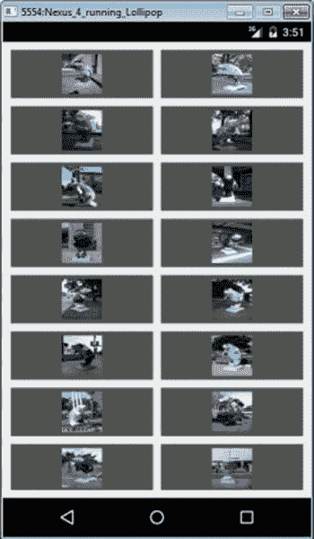
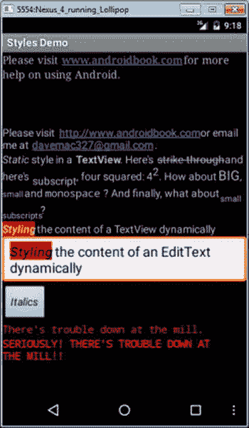
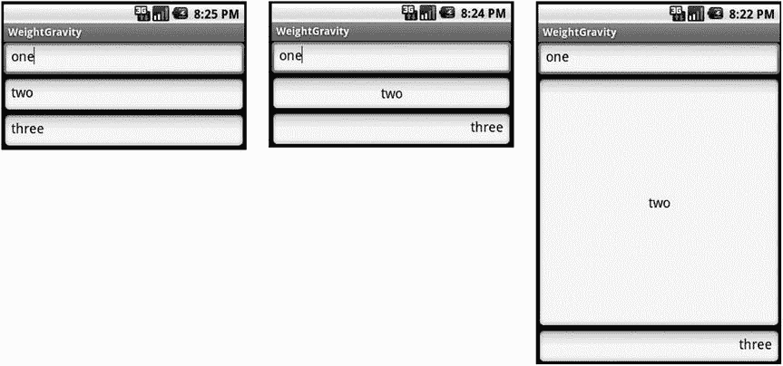
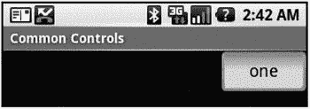
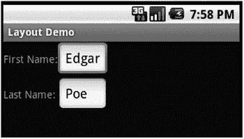
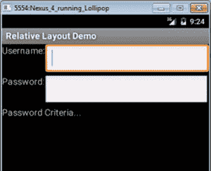
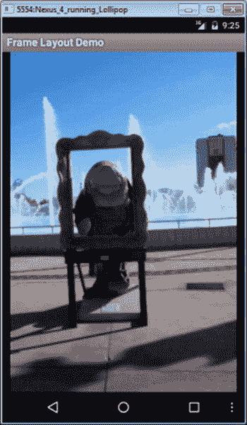

第章 5

构建更高级的用户界面布局

在前几章中，我们回顾了 Android 提供的许多标准布局，涵盖了各种可能的 UI 方法。当 Android 提供的股票布局不完全符合你的要求时，你会转向哪里？在这一章中，我们将快速探索 Android 如何为您提供构建自己的定制布局和管理相关适配器以填充有用数据的能力。

创建自定义适配器

Android 中的标准适配器很容易使用，但有一些限制。为了解决这个问题，Android 提供了一个名为 BaseAdapter 的抽象类，如果你需要一个定制的适配器，你可以扩展它。如果您有特殊的数据管理需求，或者如果您希望对如何显示子视图有更多的控制，您可以使用自定义适配器。您还可以使用自定义适配器，通过使用缓存技术来提高性能。接下来，我们将向您展示如何构建自定义适配器。

清单 5-1 显示了定制适配器的 XML 布局和 Java 代码。对于下一个例子，我们的适配器将处理海牛的图像，所以我们称它为 ManateeAdapter 。我们也将在活动中创建它。

***[清单 5-1](#_list1) 。*** 本店 自定义适配器: ManateeAdapter

```java
<?xml version="1.0" encoding="utf-8"?>
<!-- This file is at /res/layout/gridviewcustom.xml -->
<GridView xmlns:android="[http://schemas.android.com/apk/res/android](http://schemas.android.com/apk/res/android)"
    android:id="@+id/gridview"
    android:layout_width="fill_parent"
    android:layout_height="fill_parent"
    android:padding="10dip"
    android:verticalSpacing="10dip"
    android:horizontalSpacing="10dip"
    android:numColumns="auto_fit"
    android:gravity="center"
    />
```

Java 实现

```java
public class GridViewCustomAdapter extends Activity
{
    @Override
    protected void onCreate(Bundle savedInstanceState)
    {
        super.onCreate(savedInstanceState);
        setContentView(R.layout.gridviewcustom);
        GridView gv = (GridView)findViewById(R.id.gridview);
        ManateeAdapter adapter = new ManateeAdapter(this);
        gv.setAdapter(adapter);
    }

    public static class ManateeAdapter extends BaseAdapter {
        private static final String TAG = "ManateeAdapter";
        private static int convertViewCounter = 0;
        private Context mContext;
        private LayoutInflater mInflater;
        static class ViewHolder {
            ImageView image;
        }

        private int[] manatees = {
                R.drawable.manatee00, R.drawable.manatee01, R.drawable.manatee02,
// ... many more manatees here - see the sample code folder
                R.drawable.manatee32, R.drawable.manatee33 };

        private Bitmap[] manateeImages = new Bitmap[manatees.length];
        private Bitmap[] manateeThumbs = new Bitmap[manatees.length];

        public ManateeAdapter(Context context) {
            Log.v(TAG, "Constructing ManateeAdapter");
            this.mContext = context;
            mInflater = LayoutInflater.from(context);

            for(int i=0; i<manatees.length; i++) {
                manateeImages[i] = BitmapFactory.decodeResource(
                        context.getResources(), manatees[i]);
                manateeThumbs[i] = Bitmap.createScaledBitmap(manateeImages[i],
                        100, 100, false);
            }
        }

        @Override
        public int getCount() {
            Log.v(TAG, "in getCount()");
            return manatees.length;
        }

        public int getViewTypeCount() {
            Log.v(TAG, "in getViewTypeCount()");
            return 1;
        }

        public int getItemViewType(int position) {
            Log.v(TAG, "in getItemViewType() for position " + position);
            return 0;
        }

        @Override
        public View getView(int position, View convertView, ViewGroup parent) {
            ViewHolder holder;

            Log.v(TAG, "in getView for position " + position +
                    ", convertView is " +
                    ((convertView == null)?"null":"being recycled"));

            if (convertView == null) {
                convertView = mInflater.inflate(R.layout.gridimage, null);
                convertViewCounter++;
                Log.v(TAG, convertViewCounter + " convertViews have been created");
                holder = new ViewHolder();
                holder.image = (ImageView) convertView.findViewById(R.id.gridImageView);
                convertView.setTag(holder);
            } else {
                holder = (ViewHolder) convertView.getTag();
            }

            holder.image.setImageBitmap( manateeThumbs[position] );

            return convertView;
        }

        @Override
        public Object getItem(int position) {
            Log.v(TAG, "in getItem() for position " + position);
            return manateeImages[position];
        }

        @Override
        public long getItemId(int position) {
            Log.v(TAG, "in getItemId() for position " + position);
            return position;
        }
    }
}
```

当您运行这个应用时，您应该会看到类似于[图 5-1](#Fig1) 的显示。



[图 5-1](#_Fig1) 。一个带有海牛图像的网格视图

在这个例子中有很多东西需要解释，尽管它看起来相对简单。我们将从我们的 Activity 类开始，它看起来很像我们在本章的这一节一直在使用的那些。有一个来自 gridviewcustom.xml 的主布局，它只包含一个 GridView 定义。我们需要从布局内部获取对 GridView 的引用，因此我们定义并设置 gv 。我们实例化我们的 ManateeAdapter ，将我们的上下文传递给它，并在我们的 GridView 上设置适配器。到目前为止，这是相当标准的东西，尽管您无疑已经注意到，我们的定制适配器在创建时使用的参数并不像预定义适配器那么多。这主要是因为我们完全控制了这个特定的适配器，并且我们只在这个应用中使用它。如果我们让这个适配器更通用，我们很可能会设置更多的参数。但是让我们继续。

我们在适配器中的工作是管理数据向 Android 视图对象的传递。列表控件将使用视图对象(在本例中是一个 GridView )。数据来自某个数据源。在前面的例子中，数据是通过传递给适配器的游标对象获得的。在我们的定制案例中，我们的适配器知道所有的数据以及数据来自哪里。列表控件会询问一些事情，这样它就知道如何构建 UI。当它有一个不再需要的视图时，它也会好心地传递视图以供回收。认为我们的适配器必须知道如何构造视图似乎有点奇怪，但最终，这一切都是有意义的。

当我们实例化我们的定制适配器 ManateeAdapter 时，习惯上是传入上下文并让适配器持有它。在需要的时候让它可用通常是非常有用的。我们想在适配器中做的第二件事是挂在充气机上。当我们需要创建一个新视图来返回列表控件时，这将有助于提高性能。适配器中第三件典型的事情是创建一个视图持有者对象，包含我们管理的数据的视图对象。采用这种方法也起到了性能优化的作用，使我们不必重复查找视图。对于这个例子，我们只是存储了一个 ImageView ，但是如果我们有额外的字段要处理，我们会将它们添加到 ViewHolder 的定义中。例如，如果我们有一个 ListView ，其中每行包含一个 ImageView 和两个 TextView ，我们的 ViewHolder 将有一个 ImageView 和两个 TextView

因为我们在这个适配器中处理的是海牛的图像，所以我们设置了一个它们的资源 id 数组，以便在创建位图的过程中使用。我们还定义了一个位图数组作为我们的数据列表。

正如您可以从我们的 ManateeAdapter 构造函数中看到的，我们保存上下文，创建并挂起一个 inflater，然后我们遍历图像资源 id 并构建一个位图数组。这个位图数组将是我们的数据。

正如您之前了解到的，设置适配器将导致我们的 GridView 调用适配器上的方法来设置自身以显示数据。例如，我们的 GridView gv 将调用适配器的 getCount() 方法来确定有多少对象要显示。它还将调用 getViewTypeCount() 方法来确定在 GridView 中可以显示多少种不同类型的视图。出于本例的目的，我们将其设置为 1。然而，如果我们有一个 ListView 并且想要在常规数据行之间放置分隔符，我们将有两种类型的视图，并且需要从 getViewTypeCount() 返回 2。您可以拥有任意多的不同视图类型，只要您适当地从该方法返回正确的计数。与此方法相关的是 getItemViewType() 。我们刚刚说过，我们可以从适配器返回多种类型的视图，但是为了简单起见， getItemViewType() 只需要返回一个整数值来指示哪种视图类型位于数据中的特定位置。因此，如果我们有两种类型的视图要返回， getItemViewType() 将需要返回 0 或 1 来指示哪种类型。如果我们有三种类型的视图，这个方法需要返回 0、1 或 2。

如果我们的适配器正在处理 ListView 中的分隔符，它必须将分隔符视为数据。这意味着数据中有一个位置被分隔符占用。当列表控件调用 getView() 来检索该位置的适当视图时， getView() 将需要返回一个分隔符作为视图，而不是常规数据作为视图。当在 getItemViewType() 中询问该位置的视图类型时，我们需要返回我们认为匹配该视图类型的适当整数值。如果使用分隔符，您应该做的另一件事是实现 isEnabled() 方法。这对于列表项应该返回 true，对于分隔符应该返回 false，因为分隔符不应该是可选择或可点击的。

ManateeAdapter 中最有趣的方法是 getView() 方法调用。一旦 GridView 确定了有多少项可用，它就开始请求数据。现在，我们可以谈谈循环利用的观点。列表控件只能在显示屏上显示尽可能多的子视图。这意味着没有必要为适配器中的每条数据调用get view()；调用 getView() 来显示尽可能多的项目是有意义的。当 gv 从适配器获取子视图时，它将决定有多少子视图适合显示。当显示全是子视图时， gv 可以停止调用 getView() 。

如果您在启动这个示例应用后查看 LogCat，您将会看到各种调用，但是您还会看到在请求所有图像之前， getView() 停止被调用。如果你开始上下滚动 GridView ，你会在 LogCat 中看到更多对 getView() 的调用，你会注意到，一旦我们创建了一定数量的子视图， getView() 被调用，而 convertView 被设置为某个值，而不是 null。这意味着我们现在正在回收子视图，这对性能非常有利。

如果我们从 getView() 中的 gv 得到一个非空的 convertView 值，这意味着 gv 正在回收那个视图。通过重用传入的视图，我们避免了必须膨胀 XML 布局，并且我们避免了必须找到 ImageView 。通过将一个 ViewHolder 对象链接到我们返回的视图，我们可以在下次视图返回时更快地回收视图。我们在 getView() 中所要做的就是重新获取视图持有者并将正确的数据分配到视图中。

在这个例子中，我们想展示放入视图中的数据不一定就是数据中存在的内容。 createScaledBitmap() 方法创建一个较小版本的数据用于显示。重点是我们的列表控件没有调用 getItem() 方法。如果用户操作列表控件，这个方法将被我们的其他代码调用，这些代码想要对数据做一些事情。同样，对于任何适配器，理解它在做什么是非常重要的。您不一定想要依赖来自列表控件的视图中的数据，正如适配器中的 getView() 所创建的那样。有时，您需要调用适配器的 getItem() 方法来获取要操作的实际数据。有时，就像我们在前面的 ListView 例子中所做的那样，你会想要找到数据的光标。这完全取决于适配器和数据最终来自哪里。尽管我们在示例中使用了 createScaledBitmap() 方法，但 Android 2.2 引入了另一个可能会有所帮助的类: ThumbnailUtils 。这个类有一些从位图和视频生成缩略图的静态方法。

这个例子最后要指出的是对 getItemId() 方法的调用。在我们之前的例子中，列表视图和联系人的条目 ID 是来自内容提供商的 _ID 值。对于这个例子，除了 position 之外，我们不需要为商品 ID 使用任何东西。项目 id 的目的是提供一种机制来独立于其位置引用数据。当数据离开这个适配器时尤其如此，我们的联系人就是这种情况。当我们对数据有了这种直接控制，就像我们对海牛图像的控制一样，并且我们知道如何在应用中获得实际数据时，简单地使用位置作为项目 ID 是一种常见的捷径。在我们的例子中尤其如此，因为我们甚至不允许添加或删除数据。

Android 中的其他控件

Android 中有很多很多控件可以使用。到目前为止，我们已经讨论了相当多，更多将在后面的章节中讨论(例如[第 19 章](19.html)中的 MapView 和[第 20 章](20.html)中的 VideoView 和 MediaController )。你会发现其他控件，因为它们都是从视图派生出来的，与我们在这里讨论的有很多共同点。现在，我们将只提到几个您可能想自己进一步探索的控件。

ScrollView 是一个设置带有垂直滚动条的视图容器的控件。当你在一个屏幕上显示太多内容时，这很有用。

进度条 和分级条 控件类似于滑块。第一个图标直观地显示了某项操作的进度(可能是文件下载或音乐播放)，第二个图标显示了星级评定。

计时器 控制是一个计时的计时器。如果你想帮助你显示一个倒计时器，有一个 CountDownTimer 类，但它不是一个 View 类。

在 Android 4.0 中引入了 Switch 控件，其功能类似于 ToggleButton ，但在视觉上有一个侧到侧的呈现，以及 Space 视图，这是一个轻量级视图，可以在布局中使用，以便更容易地在其他视图之间创建空间。

WebView 是一个非常特殊的显示 HTML 的视图。它能做的远不止这些，包括处理 cookies 和 JavaScript，以及链接到应用中的 Java 代码。但是在您开始在应用中实现 web 浏览器之前，您应该仔细考虑调用设备上的 web 浏览器来完成所有这些繁重的工作。

这就完成了本章中对控件的介绍。我们现在将继续讨论修改控件外观和感觉的样式和主题，然后讨论在屏幕上排列控件的布局。

样式和主题

Android 提供了几种方法来改变应用中的视图风格。我们将首先介绍在字符串中使用标记标签，然后介绍如何使用 Spannables 来改变文本的特定视觉属性。但是，如果您想对几个视图或整个活动或应用使用一个通用的规范来控制事物的外观，该怎么办呢？我们将讨论 Android 风格和主题来告诉你怎么做。

使用样式

有时，您想要突出显示视图内容的一部分或设置其样式。您可以静态或动态地做到这一点。静态地，您可以将标记直接应用于字符串资源中的字符串，如下所示:

```java
<string name="styledText"><i>Static</i> style in a <b>TextView</b>.</string>
```

然后，您可以在 XML 或代码中引用它。注意，可以对字符串资源使用以下 HTML 标记: < i > 、 < b > 、 < u > 分别用于斜体、粗体和下划线，以及 < sup > (上标)、 < sub > (下标)、 < strike > 【删除线】、你甚至可以嵌套它们来得到，例如，小的上标。这不仅适用于文本视图，也适用于其他视图，比如按钮。图 5-2 展示了样式化和主题化的文本，使用了本节中的许多例子。



[图 5-2](#_Fig2) 。风格和主题示例

以编程方式设计一个 TextView 控件的内容需要一点额外的工作，但是允许更多的灵活性(见[清单 5-2](#list2) )，因为你可以在运行时设计它。不过，这种灵活性只能应用于 Spannable ，这就是 EditText 通常管理内部文本的方式，而 TextView 通常不使用 Spannable 。span able基本上是一个字符串，您可以对其应用样式。要让 TextView 将文本存储为span able，可以这样调用 setText() :

```java
tv.setText("This text is stored in a Spannable", TextView.BufferType.SPANNABLE);
```

然后，当你调用 tv.getText() 时，你会得到一个 Spannable 。

如清单 5-2 中的[所示，您可以获取 EditText 的内容(作为一个 Spannable 对象)，然后为部分文本设置样式。清单中的代码将文本样式设置为粗体和斜体，并将背景设置为红色。您可以使用所有的样式选项，就像我们之前描述的 HTML 标签一样，还可以使用其他选项。](#list2)

***[清单 5-2](#_list2) 。***编辑文本 的内容动态应用样式

```java
EditText et =(EditText)this.findViewById(R.id.et);
et.setText("Styling the content of an EditText dynamically");
Spannable spn = (Spannable) et.getText();
spn.setSpan(new BackgroundColorSpan(Color.RED), 0, 7,
             Spannable.SPAN_EXCLUSIVE_EXCLUSIVE);
spn.setSpan(new StyleSpan(android.graphics.Typeface.BOLD_ITALIC),
             0, 7, Spannable.SPAN_EXCLUSIVE_EXCLUSIVE);
```

这两种样式化技术只对它们所应用的一个视图有效。Android 提供了一种样式机制来定义跨视图重用的通用样式，还提供了一种主题机制，它基本上将一种样式应用于整个活动或整个应用。首先，我们需要谈谈风格。

一个*样式* 是一个视图属性的集合，它有一个名称，所以你可以通过它的名称来引用这个集合，并通过名称将那个样式分配给视图。例如，[清单 5-3](#list3) 显示了一个资源 XML 文件，保存在 /res/values 中，我们可以将它用于所有的错误消息。

***[清单 5-3](#_list3) 。*** 定义在多个视图中使用的样式

```java
<?xml version="1.0" encoding="utf-8"?>
<resources>
    <style name="ErrorText">
        <item name="android:layout_width">fill_parent</item>
        <item name="android:layout_height">wrap_content</item>
        <item name="android:textColor">#FF0000</item>
        <item name="android:typeface">monospace</item>
    </style>
</resources>
```

定义了视图的大小以及字体颜色(红色)和字样。注意项目标记的 name 属性是我们在布局 XML 文件中使用的 XML 属性名，并且项目标记的值不再需要双引号。我们现在可以对一个错误使用这种风格文本视图，如[清单 5-4](#list4) 所示。

***[清单 5-4](#_list4) 。*** 在视图中使用样式

```java
<TextView  android:id="@+id/errorText"
    style="@style/ErrorText"
    android:text="No errors at this time"
    />
```

需要注意的是，在这个视图定义中，样式的属性名称不是以 android: 开头的。注意这一点，因为除了风格之外，所有东西似乎都使用 android: 。当您的应用中有许多共享一种样式的视图时，在一个地方改变该样式就简单多了；您只需要在一个资源文件中修改样式的属性。当然，您可以为各种控件创建许多不同的样式。按钮可以共享一个共同的样式，例如，不同于菜单中文本的共同样式。

样式的一个非常好的方面是你可以设置它们的层次结构。我们可以为非常糟糕的错误消息定义一种新的样式，并以 ErrorText 的样式为基础。[清单 5-5](#list5) 展示了这可能是什么样子。

***[清单 5-5](#_list5) 。*** 从 父样式 中定义样式

```java
<?xml version="1.0" encoding="utf-8"?>
<resources>
    <style name="ErrorText.Danger" >
        <item name="android:textStyle">bold</item>
    </style>
</resources>
```

这个例子表明，我们可以简单地使用父样式作为新样式名的前缀来命名我们的子样式。因此， ErrorText。危险是错误文本的子元素，继承了父元素的样式属性。然后，它为文本样式添加了一个新属性。这可以一次又一次地重复，以创建一个完整的风格树。

和适配器布局一样，Android 提供了大量我们可以使用的样式。要指定 Android 提供的样式，请使用如下语法:

```java
style="@android:style/TextAppearance"
```

这个样式设置了 Android 中文本的默认样式。要找到主 Android styles.xml 文件，请访问Android SDK/platforms/<Android-version>/data/RES/values/文件夹。在这个文件中，您会发现许多现成的样式供您使用或扩展。这里有一个关于扩展 Android 提供的样式的警告:以前使用前缀的方法不适用于 Android 提供的样式。相反，您必须使用样式标签的父属性，如下所示:

```java
<style name="CustomTextAppearance" parent="@android:style/TextAppearance">
    <item  ... your extensions go here ...    />
</style>
```

你不必总是在你的视图中引入一个完整的样式。你可以选择借用这种风格的一部分。例如，如果您想将文本视图中的文本颜色设置为系统样式颜色，您可以执行以下操作:

```java
<EditText android:id="@+id/et2"
    android:layout_width="fill_parent"  android:layout_height="wrap_content"
    android:textColor="?android:textColorSecondary"
    android:text="@string/hello_world" />
```

注意，在这个例子中， textColor 属性值的名称以开始。字符代替了 @ 字符。？使用了字符，所以 Android 知道在当前主题中寻找一个样式值。因为我们看到？android ，我们在 android 系统主题中寻找这个样式值。

使用主题

样式的一个问题是，您需要添加一个属性规范 style="@style/... "应用到您希望它应用到的每个视图定义。如果你想在整个活动或者整个应用中应用一些样式元素，你应该使用主题来代替。一个*主题*实际上只是一种被广泛应用的风格；但就定义主题而言，它就像一种风格。事实上，主题和样式是可以互换的:你可以将主题扩展成样式，也可以将样式称为主题。通常，只有名称给出了一个提示，说明一个样式是用作样式还是主题。

要为活动或应用指定主题，请为项目的 AndroidManifest.xml 文件中的 <活动> 或 <应用> 标签添加一个属性。代码可能如下所示:

```java
<activity android:theme="@style/MyActivityTheme">
<application android:theme="@style/MyApplicationTheme">
<application android:theme="@android:style/Theme.NoTitleBar">
```

您可以在 Android 提供的样式所在的文件夹中找到 Android 提供的主题，主题位于一个名为 themes.xml 的文件中。当您查看主题文件时，您会看到一大组定义的样式，它们的名称都以主题开头。你还会注意到，在 Android 提供的主题和风格中，有很多扩展，这就是为什么你最终使用了名为主题的风格。比如 Dialog.AppError 。

我们对 Android 控件集的讨论到此结束。正如我们在本章开始时提到的，在 Android 中构建 ui 需要你掌握两件事:控件集和布局管理器。在下一部分，我们将讨论 Android 布局管理器。

了解布局管理器

Android 提供了一组视图类，作为视图的容器。这些容器类被称为*布局*(或*布局管理器*)，每个容器类都实现一个特定的策略来管理其子容器的大小和位置。例如， LinearLayout 类一个接一个地水平或垂直布局其子元素。所有的布局管理器都是从视图类中派生出来的，因此你可以将布局管理器相互嵌套。

Android SDK 附带的布局管理器包括[表 5-1](#Tab1) 中定义的常用管理器。

[表 5-1](#_Tab1) 。 Android 布局管理器

| 

布局管理器

 | 

描述

 |
| --- | --- |
| 线性布局 | 水平或垂直组织其子节点 |
| 表格布局 | 以表格形式组织其子节点 |
| 相对布局 | 相对于彼此或相对于父节点组织其子节点 |
| 帧布局 | 允许您动态更改布局中的控件 |
| 网格布局 | 在网格排列中组织其子节点 |

我们将在接下来的章节中讨论这些布局管理器。名为 AbsoluteLayout 的布局管理器已被弃用，不在本书讨论范围内。

线性布局布局管理器

LinearLayout 布局管理器是最基本的。该布局管理器根据方向属性的值水平或垂直组织其子节点。到目前为止，我们已经在几个例子中使用了线性布局。[清单 5-6](#list6) 显示了水平配置的线性布局。

***[清单 5-6](#_list6) 。*** 线形布局带 横向配置

```java
<LinearLayout xmlns:android="[http://schemas.android.com/apk/res/android](http://schemas.android.com/apk/res/android)"
    android:orientation="horizontal"
    android:layout_width="fill_parent"  android:layout_height="wrap_content">

    <!-- add children here-->

</LinearLayout>
```

通过将方向设置为垂直，可以创建一个垂直方向的线性布局。因为布局管理器可以嵌套，所以您可以构建一个包含水平布局管理器的垂直布局管理器来创建一个填充表单，其中每一行在一个 EditText 控件旁边都有一个标签。每一行都有自己的水平布局，但是集合中的行是垂直组织的。

了解重量和重力

方向属性是线性布局布局管理器识别的第一个重要属性。影响子控件大小和位置的其他重要属性是重量和重力。

您使用 *weight* 来指定一个控件相对于容器中其他控件的大小重要性。假设一个容器有三个控件:一个权重为 1，而其他的权重为 0。在这种情况下，权重等于 1 的控件将占用容器中的空白空间。*引力*本质上是对齐的。例如，如果您想将标签的文本向右对齐，您可以将其重力设置为右。重力的可能值有很多，包括左、中、右、上、下、中 _ 垂直、夹 _ 水平等。参见developer.android.com了解这些和其他重力值的细节。

注意布局管理器扩展了 android.widget.ViewGroup ，许多基于控件的容器类也是如此，比如 ListView 。尽管布局管理器和基于控件的容器扩展了相同的类，但按照惯例(如果不是严格的要求)，布局管理器类处理控件的大小和位置，而不是用户与子控件的交互。

现在让我们看一个涉及重量和重力属性的例子(见[图 5-3](#Fig3) )。



[图 5-3](#_Fig3) 。使用线性布局布局管理器

[图 5-3](#Fig3) 显示了三个使用线性布局的用户界面，具有不同的重量和重力设置。左边的用户界面使用重量和重力的默认设置。第一个用户界面的 XML 布局如清单 5-7 所示。

***[清单 5-7](#_list7) 。*** 三个 文本字段 以线性布局垂直排列，使用默认的重量和重力值

```java
<LinearLayout xmlns:android="[http://schemas.android.com/apk/res/android](http://schemas.android.com/apk/res/android)"
    android:orientation="vertical" android:layout_width="fill_parent"
    android:layout_height="fill_parent">

    <EditText android:layout_width="fill_parent"
        android:layout_height="wrap_content"
        android:text="one"/>
    <EditText android:layout_width="fill_parent"
        android:layout_height="wrap_content"
        android:text="two"/>
    <EditText android:layout_width="fill_parent"
        android:layout_height="wrap_content"
        android:text="three"/>
</LinearLayout>
```

图 5-3[中间的 UI](#Fig3)使用默认的 weight 值，但是将容器中控件的 android:gravity 分别设置为左侧、中间和右侧。最后一个示例将中心组件的 android:layout_weight 属性设置为 1.0，并将其他属性保留为默认值 0.0(参见[清单 5-8](#list8) )。通过将中间组件的权重属性设置为 1.0，并将其他两个组件的权重属性设置为 0.0，我们指定中间组件应该占据容器中所有剩余的空白，而其他两个组件应该保持其理想大小。

类似地，如果您希望容器中的三个控件中的两个共享它们之间剩余的空白，您可以将这两个控件的权重设置为 1.0，将第三个控件的权重设置为 0.0。最后，如果希望三个组件平均共享空间，可以将它们的权重值都设置为 1.0。这样做可以均等地扩展每个文本字段。

***[清单 5-8](#_list8) 。*** 线型布局搭配 权重配置

```java
<LinearLayout xmlns:android="[http://schemas.android.com/apk/res/android](http://schemas.android.com/apk/res/android)"
    android:orientation="vertical" android:layout_width="fill_parent"
    android:layout_height="fill_parent">

    <EditText android:layout_width="fill_parent" android:layout_weight="0.0"
    android:layout_height="wrap_content" android:text="one"
    android:gravity="left"/>

    <EditText android:layout_width="fill_parent" android:layout_weight="1.0"
    android:layout_height="wrap_content" android:text="two"
    android:gravity="center"/>

    <EditText android:layout_width="fill_parent" android:layout_weight="0.0"
    android:layout_height="wrap_content" android:text="three"
    android:gravity="right"
    />
</LinearLayout>
```

安卓:重力 vs 安卓:布局 _ 重力

注意，Android 定义了两个相似的重力属性: android:gravity 和 android:layout_gravity 。区别在于: android:gravity 是视图使用的设置，而 android:layout_gravity 是容器( android.view.ViewGroup )使用的设置。例如，您可以将 android:gravity 设置为 center 以使 EditText 中的文本在控件内居中。同样，你可以通过设置Android:layout _ gravity = " right "将 EditText 对齐到 LinearLayout (容器)的最右边。参见[图 5-4](#Fig4) 和[清单 5-9](#list9) 。



[图 5-4](#_Fig4) 。应用重力设置

***[清单 5-9](#_list9) 。*** 了解安卓:重力和安卓:布局 _ 重力 的区别

```java
<LinearLayout xmlns:android="[http://schemas.android.com/apk/res/android](http://schemas.android.com/apk/res/android)"
    android:orientation="vertical" android:layout_width="fill_parent"
    android:layout_height="fill_parent">

    <EditText android:layout_width="wrap_content" android:gravity="center"
    android:layout_height="wrap_content" android:text="one"
 android:layout_gravity="right"/>
</LinearLayout>
```

如[图 5-4](#Fig4) 所示，文本在编辑文本中居中，与线型布局右侧对齐。

表布局布局管理器

表格布局布局管理器是线性布局的扩展。该布局管理器将其子控件组织成行和列。[清单 5-10](#list10) 显示了一个例子。

[***清单 5-10***](#_list10) 。一个简单的表格布局T9】

```java
<?xml version="1.0" encoding="utf-8"?>
<TableLayout xmlns:android="[http://schemas.android.com/apk/res/android](http://schemas.android.com/apk/res/android)"
    android:layout_width="fill_parent"  android:layout_height="fill_parent">

  <TableRow>
    <TextView android:text="First Name:"
        android:layout_width="wrap_content"  android:layout_height="wrap_content" />

    <EditText android:text="Edgar"
        android:layout_width="wrap_content"  android:layout_height="wrap_content" />
  </TableRow>

  <TableRow>
    <TextView android:text="Last Name:"
        android:layout_width="wrap_content"  android:layout_height="wrap_content" />

    <EditText android:text="Poe"
        android:layout_width="wrap_content"  android:layout_height="wrap_content" />
  </TableRow>

</TableLayout>
```

要使用这个布局管理器，您需要创建一个 TableLayout 的实例，并在其中放置 TableRow 元素。这些 TableRow 元素包含了表格的控件。[清单 5-10](#list10) 的用户界面如[图 5-5](#Fig5) 所示。



[图 5-5](#_Fig5) 。表格布局 布局管理器

使用 TableLayout 可以实现许多更复杂的布局，包括嵌套、不对称的行和列等等。我们在图书网站上有一个关于桌面布局、【www.androidbook.com】的更多选项的奖励部分。

相对布局布局管理器

另一个有趣的布局管理器是 RelativeLayout 。顾名思义，这个布局管理器实现了一个策略，其中容器中的控件相对于容器或容器中的另一个控件进行布局。[清单 5-11](#list11) 和[图 5-6](#Fig6) 显示了一个例子。

***[清单 5-11](#_list11) 。*T5 使用相对布局布局管理器**

```java
<RelativeLayout xmlns:android="[http://schemas.android.com/apk/res/android](http://schemas.android.com/apk/res/android)"
        android:layout_width="fill_parent"
        android:layout_height="wrap_content">

<TextView android:id="@+id/userNameLbl"
        android:layout_width="fill_parent"  android:layout_height="wrap_content"
        android:text="Username: "
        android:layout_alignParentTop="true" />

<EditText android:id="@+id/userNameText"
        android:layout_width="fill_parent"  android:layout_height="wrap_content"
        android:layout_toRightOf="@id/userNameLbl" />

<TextView android:id="@+id/pwdLbl"
        android:layout_width="wrap_content"  android:layout_height="wrap_content"
        android:layout_below="@id/userNameText"
        android:text="Password: " />

<EditText android:id="@+id/pwdText"
        android:layout_width="fill_parent"  android:layout_height="wrap_content"
        android:layout_toRightOf="@id/pwdLbl"
        android:layout_below="@id/userNameText" />

<TextView android:id="@+id/pwdCriteria"
        android:layout_width="fill_parent"  android:layout_height="wrap_content"
        android:layout_below="@id/pwdText"
        android:text="Password Criteria... " />

<TextView android:id="@+id/disclaimerLbl"
        android:layout_width="fill_parent"  android:layout_height="wrap_content"
        android:layout_alignParentBottom="true"
        android:text="Use at your own risk... " />

</RelativeLayout>
```



[图 5-6](#_Fig6) 。使用相对布局 布局管理器布局的用户界面

如图所示，UI 看起来像一个简单的登录表单。用户名标签被固定在容器的顶部，因为我们将Android:layout _ alignParentTop设置为 true 。类似地，用户名输入字段位于用户名标签下方，因为我们设置了 android:layout_below 。密码标签出现在用户名标签下方，密码输入字段出现在密码标签下方。免责声明标签被固定在容器的底部，因为我们将Android:layout _ alignParentBottom设置为 true 。

除了这三个布局属性，你还可以指定 layout_above 、 layout_toRightOf 、 layout_toLeftOf 、 layout_centerInParent 等等。使用 RelativeLayout 很有趣，因为它很简单。事实上，一旦你开始使用它，它将成为你最喜欢的布局管理器——你会发现自己一遍又一遍地回到它身边。

框架布局布局管理器

到目前为止，我们讨论的布局管理器实现了各种布局策略。换句话说，每一个都有特定的方式在屏幕上定位和定向它的孩子。有了这些布局管理器，你可以同时在屏幕上有许多控件，每个控件占据屏幕的一部分。Android 还提供了一个布局管理器，主要用来显示单个项目: FrameLayout 。您主要使用这个实用程序布局类来动态显示单个视图，但是您可以用许多项目填充它，将一个项目设置为可见，而将其他项目设置为不可见。[清单 5-12](#list12) 演示了如何使用框架布局。

***[清单 5-12](#_list12) 。*** 填充框架布局

```java
<?xml version="1.0" encoding="utf-8"?>
<FrameLayout xmlns:android="[http://schemas.android.com/apk/res/android](http://schemas.android.com/apk/res/android)"
    android:id="@+id/frmLayout"
    android:layout_width="fill_parent"  android:layout_height="fill_parent">

     <ImageView
        android:id="@+id/oneImgView" android:src="@drawable/one"
        android:scaleType="fitCenter"
        android:layout_width="fill_parent"  android:layout_height="fill_parent"/>
    <ImageView
        android:id="@+id/twoImgView" android:src="@drawable/two"
        android:scaleType="fitCenter"
        android:layout_width="fill_parent"  android:layout_height="fill_parent"
        android:visibility="gone" />

</FrameLayout>

public class FrameLayoutActivity extends Activity{
    private ImageView one = null;
    private ImageView two = null;
    @Override
    protected void onCreate(Bundle savedInstanceState) {
        super.onCreate(savedInstanceState);
        setContentView(R.layout.listing6_48);

        one = (ImageView)findViewById(R.id.oneImgView);
        two = (ImageView)findViewById(R.id.twoImgView);

        one.setOnClickListener(new OnClickListener(){

            public void onClick(View view) {
                two.setVisibility(View.VISIBLE);

                view.setVisibility(View.GONE);
            }});

        two.setOnClickListener(new OnClickListener(){

            public void onClick(View view) {
                one.setVisibility(View.VISIBLE);

                view.setVisibility(View.GONE);
            }});
    }
}
```

[清单 5-12](#list12) 显示了布局文件以及活动的 onCreate() 方法。演示的想法是在 FrameLayout 中加载两个 ImageView 对象，一次只能看到 ImageView 对象中的一个。在 UI 中，当用户单击可见图像时，我们隐藏一个图像并显示另一个图像。

现在仔细看看清单 5-12 ，从布局开始。你可以看到我们用两个 ImageView 对象定义了一个 FrameLayout (一个 ImageView 是一个知道如何显示图像的控件)。注意，第二个 ImageView 的可见性被设置为消失，使得控件不可见。现在，看看 onCreate() 方法。在 onCreate() 方法中，我们注册侦听器来点击 ImageView 对象上的事件。在点击处理程序中，我们隐藏一个 ImageView 并显示另一个。

如前所述，当您需要动态地将视图的内容设置为单个控件时，通常使用 FrameLayout 。虽然这是一般的做法，但控件将接受许多子控件，正如我们所演示的那样。[清单 5-12](#list12) 在布局中添加了两个控件，但每次只能看到其中一个。然而，FrameLayout 并不强迫你一次只能看到一个控件。如果你在布局中添加了很多控件， FrameLayout 会简单地堆叠控件，一个在另一个上面，最后一个在上面。这可以创建一个有趣的 UI。例如，[图 5-7](#Fig7) 显示了一个 FrameLayout 控件，带有两个可见的 ImageView 对象。您可以看到控件堆叠在一起，顶部的控件部分覆盖了它后面的图像。



[图 5-7](#_Fig7) 。 框架布局 带有两个 ImageView 对象

FrameLayout 的另一个有趣的方面是，如果你向布局中添加多个控件，布局的大小将被计算为容器中最大项目的大小。在[图 5-7](#Fig7) 中，顶部的图像实际上比它后面的图像小得多，但是因为布局的尺寸是根据最大的控件计算的，所以顶部的图像被拉伸了。

还要注意的是，如果你在一个 FrameLayout 中放置了许多控件，其中一个或多个是不可见的，你可能要考虑在你的 FrameLayout 中使用setMeasureAllChildren(true)。因为最大的子元素决定了布局的大小，如果最大的子元素一开始是不可见的，那么就会有问题:当它变得可见时，它只是部分可见。为了确保所有项目都能正确呈现，调用setMeasureAllChildren()并向其传递值 true 。 FrameLayout 的等价 XML 属性是Android:measure all children = " true "。

GridLayout 布局管理器

Android 4.0 带来了一个新的布局管理器，叫做 GridLayout 。正如您所料，它以行和列的网格模式布局视图，有点像 TableLayout 。不过比 TableLayout 好用。使用 GridLayout ，您可以为视图指定行和列值，这就是它在网格中的位置。这意味着您不需要为每个单元格指定一个视图，只需要为那些您想要保存视图的单元格指定一个视图。视图可以跨越多个网格单元。您甚至可以在同一个网格单元中放置多个视图。

布局视图时，不能使用 weight 属性，因为它在 GridLayout 的子视图中不起作用。你可以使用布局 _ 重力属性来代替。您可以在 GridLayout 子视图中使用的其他有趣属性包括 layout_column 和 layout_columnSpan 来分别指定视图最左侧的列和列数。同样，还有 layout_row 和 layout_rowSpan 属性。有趣的是，您不需要为 GridLayout 子视图指定 layout_height 和layout _ width；它们默认为 WRAP_CONTENT 。

为各种设备配置定制布局

到目前为止，您已经非常了解 Android 提供了大量的布局管理器来帮助您构建 ui。如果您使用过我们讨论过的布局管理器，您会知道您可以用各种方式组合布局管理器来获得您想要的外观和感觉。但是，即使有了所有的布局管理器，构建 ui——并使它们正确——也可能是一个挑战。对于移动设备来说尤其如此。移动设备的用户和制造商变得越来越复杂，这使得开发人员的工作更具挑战性。

挑战之一是为应用构建一个可以在各种屏幕配置中显示的 UI。例如，如果你的应用以纵向和横向模式显示，你的用户界面会是什么样子？如果你还没有遇到这种情况，你现在可能正在思考如何处理这种常见的情况。有趣且幸运的是，Android 为这个用例提供了一些支持。

它是这样工作的:当建立一个布局时，Android 会根据设备的配置从特定的文件夹中找到并加载布局。设备可以有三种配置:纵向、横向或方形(方形很少见)。要为各种配置提供不同的布局，您必须为每个配置创建特定的文件夹，Android 将从这些文件夹中加载适当的布局。如你所知，默认布局文件夹位于 res/layout 。为了支持纵向显示，创建一个名为 res/layout-port 的文件夹。对于风景，创建一个名为 res/layout-land 的文件夹。对于正方形，创建一个名为 res/layout-square 的正方形。

此时一个很好的问题是，“有了这三个文件夹，我还需要默认的布局文件夹( res/layout )吗？”一般来说，是的。Android 的资源解析逻辑首先查看特定于配置的目录。如果 Android 在那里找不到资源，它会转到默认的布局目录。因此，您应该将默认布局定义放在 res/layout 中，并将定制版本放在特定于配置的文件夹中。

另一个技巧是在布局文件中使用 < include / > 标签。这允许您创建布局代码的公共块(例如，在默认的布局目录中)并将它们包含在布局端口和布局端口中定义的布局中。一个包含标签可能看起来像这样:

```java
<include layout="@layout/common_chunk1" />
```

如果你对包含的概念感兴趣，你还应该看看 Android API 中的 < merge / > 标签和 ViewStub 类。这些给你更多的灵活性，当组织布局，没有重复的观点。

请注意，Android SDK 没有提供任何 API 让您以编程方式指定加载哪个配置——系统只是根据设备的配置选择文件夹。但是，您可以在代码中设置设备的方向，例如，使用以下代码:

```java
import android.content.pm.ActivityInfo;
...
setRequestedOrientation(ActivityInfo.SCREEN_ORIENTATION_LANDSCAPE);
```

这将强制您的应用以横向模式出现在设备上。请在您的早期项目中尝试一下。将代码添加到 activity 的 onCreate() 方法中，在模拟器中运行它，然后查看您的应用。

摘要

让我们通过快速列举你所学到的关于构建用户界面的知识来结束这一章:

*   布局的主要类型以及何时使用每种布局
*   Android 支持的视图以及如何用 XML 和代码定义它们
*   您可以使用样式和主题从一组公共资源中管理应用的外观和感觉