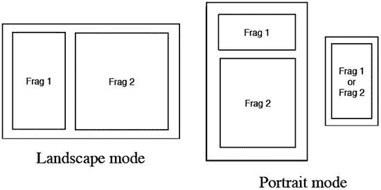
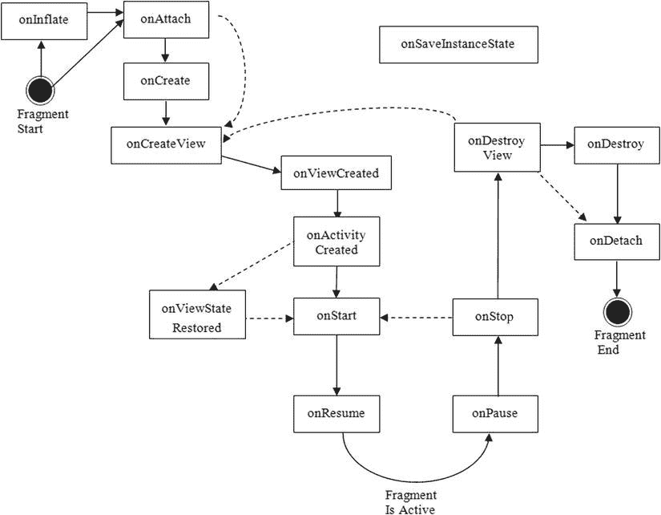
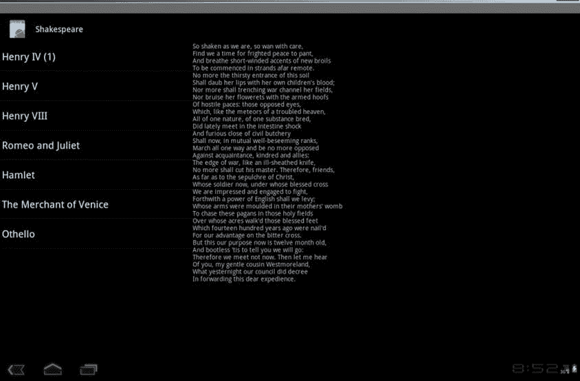

# 八、片段

到目前为止，我们已经探索了 Android 应用的一些片段，并且您已经运行了一些为智能手机大小的屏幕定制的简单应用。您所要考虑的就是如何在屏幕上为一个活动安排 UI 控件，以及一个活动如何流向下一个活动，等等。对于 Android 的前两个主要版本，小屏幕是它。然后是安卓平板电脑:屏幕尺寸为 10 英寸的设备。这让事情变得复杂。为什么？因为现在屏幕空间太大了，以至于一个简单的活动很难在保持单一功能的同时填满整个屏幕。让一个电子邮件应用在一个活动中只显示标题(占据一个大屏幕)，而在一个单独的活动中显示一封电子邮件(也占据一个大屏幕)，这已经没有意义了。有了这么大的空间，应用可以在屏幕的左侧显示电子邮件标题列表，在屏幕的右侧显示选定的电子邮件内容。它能在一个布局单一的活动中完成吗？是的，但是你不能在任何小屏幕设备上重复使用这个活动或布局。

Android 3.0 中引入的核心类之一是 Fragment 类，它是专门为帮助开发人员管理应用功能而设计的，因此它将提供出色的可用性以及大量的重用。本章将向你介绍片段，它是什么，它如何适应应用的架构，以及如何使用它。片段让很多以前很难的有趣的事情成为可能。几乎在同一时间，谷歌发布了一个片段 SDK，可以在旧的 Androids 上工作。因此，即使你对编写平板电脑应用不感兴趣，你也可能会发现片段让你在非平板设备上的生活更加轻松。现在，为智能手机、平板电脑甚至电视和其他设备编写优秀的应用比以往任何时候都更容易。

让我们从 Android 片段开始。

什么是片段？

第一部分将解释什么是片段以及它的作用。但是首先，让我们来看看为什么我们需要片段。正如您之前了解到的，小屏幕设备上的 Android 应用使用活动向用户显示数据和功能，每个活动都有一个相当简单、定义明确的目的。例如，一个活动可能向用户显示他们地址簿中的联系人列表。另一个活动可能允许用户键入电子邮件。Android 应用是将这些活动组合在一起以实现更大目的的一系列活动，例如通过阅读和发送消息来管理电子邮件帐户。这对于小屏幕设备来说很好，但是当用户的屏幕非常大(10 英寸或更大)时，屏幕上的空间可以做不止一件简单的事情。应用可能希望让用户查看收件箱中的电子邮件列表，同时在列表旁边显示当前选择的电子邮件文本。或者应用可能希望显示联系人列表，同时在详细视图中显示当前选择的联系人。

作为一名 Android 开发人员，你知道这个功能可以通过用列表视图和布局以及各种其他视图为 xlarge 屏幕定义另一种布局来实现。我们所说的“另一种布局”是指除了那些你可能已经为小屏幕定义的布局之外的布局。当然，你会希望有单独的布局为纵向案件以及横向案件。对于 xlarge 屏幕的大小，这可能意味着所有标签、字段和图像等的视图非常多，您需要对其进行布局，然后提供代码。如果有一种方法可以将这些视图对象组合在一起并整合它们的逻辑，以便应用的大部分可以跨屏幕大小和设备重用，从而最大限度地减少开发人员维护应用的工作量，那该多好。这就是为什么我们有片段。

将片段视为子活动的一种方式。事实上，片段的语义很像一个活动。一个片段可以有一个与之关联的视图层次结构，并且它有一个生命周期，就像一个活动的生命周期一样。片段甚至可以像活动一样响应后退按钮。如果你在想，“要是我能在平板电脑的屏幕上同时进行多项活动就好了”，那么你就对了。但是因为在平板电脑屏幕上同时激活一个应用的多个活动太麻烦了，所以创建了片段来实现这个想法。这意味着片段包含在活动中。片段只能存在于活动的上下文中；没有活动就不能使用片段。片段可以与活动的其他元素共存，这意味着您不需要转换活动的整个用户界面来使用片段。您可以像以前一样创建一个活动的布局，并且只对用户界面的一部分使用一个片段。

然而，当涉及到保存状态和稍后恢复它时，片段不像活动。片段框架提供了几个特性，使得保存和恢复片段比您需要在活动上做的工作简单得多。

如何决定何时使用片段取决于几个考虑因素，这些将在下面讨论。

何时使用片段

使用片段的一个主要原因是，你可以跨设备和屏幕尺寸重用用户界面和功能。对于平板电脑来说尤其如此。想想当屏幕和平板电脑一样大时会发生什么。它更像一个桌面而不是电话，你的许多桌面应用都有一个多面板用户界面。如前所述，您可以在屏幕上同时拥有所选项目的列表和详细视图。这很容易在横向中描述，列表在左边，细节在右边。但是，如果用户将设备旋转到纵向模式，这样屏幕的高度就比宽度大了，会怎么样呢？也许您现在希望列表在屏幕的顶部，详细信息在底部。但是，如果这个应用运行在一个小屏幕上，屏幕上没有空间同时显示这两个部分，该怎么办呢？难道您不希望列表和细节的独立活动能够在大屏幕上共享您构建到这些部分中的逻辑吗？我们希望你的回答是肯定的。片段能帮上忙。[图 8-1](#Fig1) 让这一点更加清晰。



[图 8-1](#_Fig1) 。用于平板电脑用户界面和智能手机用户界面的片段

在横向模式下，两个片段可以很好地并排放置。在肖像模式下，我们可以把一个片段放在另一个上面。但是如果我们试图在一个较小屏幕的设备上运行相同的应用，我们可能需要显示片段 1 或片段 2，但不能同时显示两者。如果我们试图用布局来管理所有这些场景，我们会创建相当多的布局，这意味着很难在许多不同的布局中保持一切正确。当使用片段时，我们的布局保持简单；每个活动布局将片段作为容器来处理，并且活动布局不需要指定每个片段的内部结构。每个片段都有自己的内部结构布局，并且可以在许多配置中重用。

让我们回到旋转方向的例子。如果您必须为活动的方向更改编写代码，您就会知道保存活动的当前状态并在活动被重新创建后恢复状态是一件非常痛苦的事情。如果您的活动有块可以在方向改变时容易地保留，这样您就可以避免每次方向改变时的所有拆除和重新创建，这不是很好吗？当然会。片段能帮上忙。

现在想象一个用户在你的活动中，他们已经做了一些工作。想象一下，在同一个活动中，用户界面发生了变化，用户想要后退一步、两步或三步。在旧式活动中，按下 Back 按钮将使用户完全退出活动。使用片段，Back 按钮可以在一堆片段中后退，同时保持在当前活动中。

接下来，当一大块内容改变时，考虑活动的用户界面；你想让过渡看起来平滑，就像一个完美的应用。片段也能做到。

现在你对什么是片段以及为什么要使用片段有了一些概念，让我们更深入地研究一下片段的结构。

片段的结构

如前所述，片段就像一个子活动:它有一个相当具体的目的，并且几乎总是显示一个用户界面。但是在活动从上下文被子类化的地方，片段从包 android.app 中的对象被扩展。片段是*而不是*活动的扩展。然而，像活动一样，您将总是扩展片段(或者它的一个子类)，以便您可以覆盖它的行为。

一个片段可以有一个视图层次结构来吸引用户。这个视图层次结构与任何其他视图层次结构相似，因为它可以从 XML layout 规范创建(展开),也可以用代码创建。如果要让用户看到视图层次结构，就需要将它附加到周围活动的视图层次结构上，我们很快就会看到。组成片段视图层次结构的视图对象与 Android 中其他地方使用的视图类型相同。所以你所知道的关于视图的一切也适用于片段。

除了视图层次之外，一个片段还有一个 bundle 作为它的初始化参数。类似于一个活动，一个片段可以被保存，以后由系统自动恢复。当系统恢复一个片段时，它调用默认的构造函数(不带参数)，然后将这个参数包恢复到新创建的片段。片段上的后续回调可以访问这些参数，并可以使用它们将片段恢复到以前的状态。为此，您必须

*   确保片段类有一个默认的构造函数。
*   创建一个新的片段后，立即添加一组参数，以便这些后续方法可以正确地设置您的片段，并且系统可以在必要时正确地恢复您的片段。

一个活动可以同时拥有多个片段；并且如果一个片段已经被另一个片段换出，则片段交换事务可以被保存在后栈上。后台堆栈由绑定到活动的片段管理器管理。back 堆栈是管理 Back 按钮行为的方式。片段管理器将在本章后面讨论。这里您需要知道的是，一个片段知道它被绑定到哪个活动，并且从那里它可以到达它的片段管理器。片段也可以通过它的活动获得活动的资源。

同样类似于活动，当片段被重新创建时，片段可以将状态保存到 bundle 对象中，并且这个 bundle 对象被返回给片段的 onCreate() 回调。这个保存的包也被传递给 onInflate() 、 onCreateView() 和 onActivityCreated() 。请注意，这与作为初始化参数附加的包不同。在这个包中，您可能会存储片段的当前状态，而不是应该用来初始化它的值。

片段的生命周期

在开始在示例应用中使用片段之前，您需要了解片段的生命周期。为什么？片段的生命周期比活动的生命周期更复杂，理解*什么时候*可以用片段做事情非常重要。[图 8-2](#Fig2) 显示了一个片段的生命周期。



[图 8-2](#_Fig2) 。片段的生命周期

如果你将它与图 2-3(一个活动的生命周期)相比较，你会注意到几个不同之处，主要是由于活动和片段之间需要的交互。片段非常依赖于它所在的活动，当它的活动经历一个步骤时，它可以经历多个步骤。

在最开始，一个片段被实例化。它现在作为一个对象存在于内存中。第一件可能发生的事情是初始化参数将被添加到片段对象中。在系统从一个保存的状态重新创建你的片段的情况下，这肯定是正确的。当系统从保存的状态中恢复一个片段时，默认的构造函数被调用，随后是初始化参数包的附件。如果你在代码中创建片段，一个很好的使用模式是清单 8-1 中的模式，它显示了在 MyFragment 类定义中实例化器的工厂类型。

[***清单 8-1***](#_list1) 。使用静态工厂方法实例化片段

```java
public static MyFragment newInstance(int index) {
    MyFragment f = new MyFragment();
    Bundle args = new Bundle();
    args.putInt("index", index);
    f.setArguments(args);
    return f;
}
```

从客户端的角度来看，他们通过用单个参数调用静态 newInstance() 方法来获得一个新实例。它们取回实例化的对象，并且在 arguments 包中的这个片段上设置了初始化参数。如果这个片段被保存并在以后重新构造，系统将经历一个非常相似的过程，调用默认的构造函数，然后重新附加初始化参数。对于您的特殊情况，您将定义您的 newInstance() 方法(或方法)的签名，以获取适当数量和类型的参数，然后适当地构建参数包。这就是您想要您的 newInstance() 方法做的所有事情。随后的回调将负责您的片段的其余设置。

onInflate()回调

接下来发生的是布局视图膨胀。如果您的片段由布局中的 <片段> 标签定义，您的片段的 onInflate() 回调将被调用。这将传入一个对周围活动的引用、一个带有来自 <片段> 标签的属性的属性集和一个保存的包。保存的包中有保存的状态值，如果这个片段以前存在并且正在被重新创建，则由 onSaveInstanceState() 放在那里。 onInflate() 的期望是读取属性值并保存它们以备后用。在这个阶段，对用户界面做任何事情都为时过早。该片段甚至还没有与其活动相关联。但那是你的片段的下一个事件。

onAttach()回调

在您的片段与其活动相关联之后，调用 onAttach() 回调。如果您想使用活动参考，它会传递给您。您至少可以使用活动来确定有关封闭活动的信息。您还可以使用活动作为上下文来执行其他操作。需要注意的一点是，片段类有一个 getActivity() 方法，如果你需要的话，它总是会为你的片段返回附加的活动。请记住，在整个生命周期中，可以从片段的 getArguments() 方法中获得初始化参数包。但是，一旦片段被附加到它的 activity，就不能再调用 setArguments() 了。因此，除了在最开始的时候，你不能添加初始化参数。

onCreate()回调

接下来是 onCreate() 回调。虽然这与活动的 onCreate() 相似，但是不同之处在于，您不应该在这里放置依赖于活动视图层次结构的代码。您的片段现在可能已经关联到它的活动了，但是您还没有得到通知，活动的 onCreate() 已经完成。这就来了。这个回调获取传入的保存的状态包(如果有的话)。这个回调尽可能早地创建一个后台线程来获取这个片段需要的数据。您的片段代码正在 UI 线程上运行，并且您不想在 UI 线程上进行磁盘输入/输出(I/O)或网络访问。事实上，启动一个后台线程来做好准备是很有意义的。你的后台线程应该在阻塞调用的地方。稍后您将需要与数据挂钩，可能使用处理器或其他技术。

**注意**在后台线程中加载数据的方法之一是使用加载器类。这将在[第 28 章](28.html)中讲述。

onCreateView()回调

下一个回调是 onCreateView() 。这里的期望是你将为这个片段返回一个视图层次结构。传递给这个回调函数的参数包括一个 LayoutInflater (您可以用它来扩展这个片段的布局)、一个 ViewGroup 父对象(在[清单 8-2](#list2) 中称为*容器*)和一个保存的包(如果存在的话)。注意不要将视图层次附加到传入的视图组父视图，这一点非常重要。这种关联将在以后自动发生。如果您在这个回调中将片段的视图层次结构附加到父级，您很可能会得到异常——或者至少是奇怪和意外的应用行为。

[***清单 8-2***](#_list2) 。在 onCreateView() 中创建片段视图层次结构

```java
@Override
public View onCreateView(LayoutInflater inflater,
                  ViewGroup container, Bundle savedInstanceState) {
        if(container == null)
            return null;

        View v = inflater.inflate(R.layout.details, container, false);
        TextView text1 = (TextView) v.findViewById(R.id.text1);
        text1.setText(myDataSet[ getPosition() ] );
        return v;
}
```

提供了父类，因此您可以将它与 LayoutInflater 的 inflate() 方法一起使用。如果父容器值为 null，这意味着这个特定的片段不会被查看，因为没有视图层次结构可供它附加。在这种情况下，您可以简单地从这里返回 null。请记住，在您的应用中可能有一些没有显示出来的片段。清单 8-2 展示了你可能想在这个方法中做什么的一个例子。

在这里，您可以看到如何访问这个片段的一个布局 XML 文件，并将其展开为一个视图，然后返回给调用者。这种方法有几个优点。您总是可以用代码构建视图层次结构，但是通过膨胀一个布局 XML 文件，您可以利用系统的资源查找逻辑。根据设备的配置，或者您使用的设备，将选择适当的布局 XML 文件。然后，您可以访问布局中的特定视图——在本例中为 text1 TextView 字段——来执行您想要的操作。重复非常重要的一点:不要在这个回调中将片段的视图附加到容器父级。你可以在[清单 8-2](#list2) 中看到，你在对 inflate() 的调用中使用了一个容器，但是你也为 attachToRoot 参数传递了 false 。

onViewCreated()回调

这个在 onCreateView() 之后调用，但是在任何保存的状态被放入 UI 之前。传入的视图对象与从 onCreateView() 返回的视图对象相同。

onActivityCreated()回调

您现在已经接近用户可以与您的片段进行交互的点了。下一个回调是 onActivityCreated() 。这是在活动完成其 onCreate() 回调之后调用的。现在，您可以相信活动的视图层次结构(包括您自己的视图层次结构，如果您之前返回了一个视图层次结构的话)已经准备好并且可用了。在用户看到之前，您可以在这里对用户界面进行最后的调整。您还可以在这里确定该活动的任何其他片段是否已经附加到您的活动。

onViewStateRestored()回调

这是一个相对较新的版本，是在 JellyBean 4.2 中引入的。当这个片段的视图层次结构恢复了所有状态(如果适用)时，您的片段将调用这个回调。以前，您必须在 onActivityCreated() 中做出关于调整 UI 以恢复片段的决定。现在，您可以将该逻辑放入回调中，明确知道这个片段正在从保存的状态中恢复。

onStart()回调

片段生命周期中的下一个回调是 onStart() 。现在用户可以看到您的片段了。但是你还没有开始与用户互动。这个回调被绑定到活动的 onStart() 。因此，以前您可能将您的逻辑放在活动的 onStart() 中，现在您更可能将您的逻辑放在片段的 onStart() 中，因为这也是用户界面组件所在的位置。

onResume()回调

用户可以与您的片段交互之前的最后一个回调是 onResume() 。这个回调被绑定到活动的 onResume() 。当这个回调返回时，用户可以自由地与这个片段进行交互。例如，如果您的片段中有一个相机预览，您可能会在片段的 onResume() 中启用它。

所以现在你已经达到了应用忙于让用户开心的程度。然后用户决定退出你的应用，要么退出，要么按 Home 键，要么启动其他应用。下一个序列，类似于活动中发生的，与为交互设置片段的方向相反。

onPause()回调

片段上的第一个撤销回调是 onPause() 。这个回调被绑定到活动的 on pause()；就像一个活动一样，如果您的片段或其他共享对象中有一个媒体播放器，您可以通过您的 onPause() 方法暂停、停止或返回它。同样的好公民规则也适用于此:如果用户正在接电话，你不希望播放音频。

onSaveInstanceState()回调

与活动类似，片段有机会保存状态以便以后重建。这个回调函数为这个片段传入一个 Bundle 对象，作为您想要保存的任何状态信息的容器。这是传递给前面提到的回调的保存状态包。为了防止内存问题，要小心保存到这个包中的内容。只保存你需要的。如果您需要保存对另一个片段的引用，不要试图保存或放置另一个片段，而是保存另一个片段的标识符，比如它的标签或 ID。当这个片段运行 onViewStateRestored() 时，您可以重新建立到这个片段所依赖的其他片段的连接。

虽然您可能会看到这个方法通常在 onPause() 之后被调用，但是这个片段所属的活动在认为片段的状态应该被保存时会调用它。这可能发生在 ondestory()之前的任何时候。

onStop()回调

下一个撤销回调是 onStop() 。这个与活动的 onStop() 绑定在一起，其作用类似于活动的 onStop() 。已经停止的片段可以直接返回到 onStart() 回调，然后导致 onResume() 。

onDestroyView()回调

如果你的片段正在被删除或保存，撤销方向的下一个回调是 onDestroyView() 。这将在您之前在 onCreateView() 回调中创建的视图层次结构从您的片段中分离出来之后被调用。

onDestroy()回调 T1】

接下来是 onDestroy() 。当片段不再被使用时，就调用这个函数。请注意，它仍然连接到活动，仍然可以找到，但它不能做太多。

onDetach()回调

片段生命周期中的最后一次回调是 onDetach() 。一旦这个被调用，这个片段就不再绑定到它的活动，它不再有视图层次结构，并且它的所有资源都应该被释放。

使用 setRetainInstance()

你可能已经注意到了图 8-2 中的虚线。片段的一个很酷的特性是，如果活动被重新创建，您可以指定不希望片段被完全销毁，因此您的片段也将被恢复。所以，片段自带了一个叫 setRetainInstance() 的方法，用一个布尔参数告诉它“Yes 我希望你在我的活动重新开始时留下来”或“不；走开，我会从头创建一个新的片段。”调用 setRetainInstance() 的一个好地方是在片段的 onCreate() 回调中，但是在 onCreateView() 中工作，就像 onActivityCreated() 一样。

如果参数为真，这意味着您希望将片段对象保存在内存中，而不是从头开始。但是，如果您的活动正在离开并被重新创建，您必须将您的片段从这个活动中分离出来，并将其附加到新的活动中。底线是，如果保留实例值为 true ，您实际上不会销毁您的片段实例，因此您不需要在另一端创建一个新的。图中的虚线表示您将在退出时跳过 onDestroy() 回调，当您的片段被重新附加到您的新活动时，您将跳过 onCreate() 回调，所有其他回调都将被触发。因为活动很可能是因为配置更改而重新创建的，所以您的片段回调应该假设配置已经更改，因此应该采取适当的操作。例如，这将包括扩展布局以在 onCreateView() 中创建新的视图层次。清单 8-2 中提供的代码会在编写时处理好这个问题。如果您选择使用 retain-instance 特性，您可能会决定不将一些初始化逻辑放在 onCreate() 中，因为它不会像其他回调那样总是被调用。

展示生命周期的示例片段应用

没有什么比看到一个真实的例子更能理解一个概念了。您将使用一个经过测试的示例应用，这样您就可以看到所有这些回调的运行情况。您将使用一个示例应用，它在一个片段中使用了一系列莎士比亚的标题；当用户点击其中一个标题时，该剧的一些文本将出现在一个单独的片段中。这个示例应用可以在平板电脑上以横向和纵向模式运行。然后将它配置为在较小的屏幕上运行，这样您就可以看到如何将文本片段分成一个活动。您将从清单 8-3 中的横向模式下活动的 XML 布局开始，当它运行时，看起来像图 8-3 中的[。](#Fig3)

[***清单 8-3***](#_list3) 。用于横向模式的活动布局 XML

```java
<?xml version="1.0" encoding="utf-8"?>
<!-- This file is res/layout-land/main.xml -->
<LinearLayout xmlns:android="[http://schemas.android.com/apk/res/android](http://schemas.android.com/apk/res/android)"
        android:orientation="horizontal"
        android:layout_width="match_parent"
        android:layout_height="match_parent">

    <fragment class="com.androidbook.fragments.bard.TitlesFragment"
            android:id="@+id/titles" android:layout_weight="1"
            android:layout_width="0px"
            android:layout_height="match_parent" />
    <FrameLayout
            android:id="@+id/details" android:layout_weight="2"
            android:layout_width="0px"
            android:layout_height="match_parent" />

</LinearLayout>
```



[图 8-3](#_Fig3) 。您的示例片段应用的用户界面

**注意:本章末尾的**是您可以用来下载本章中的项目的 URL。这将允许您将这些项目直接导入到您的 IDE(比如 Eclipse 或 Android Studio)中。

这种布局看起来像你在整本书中看到的许多其他布局，水平地从左到右有两个主要对象。不过有一个特殊的新标签，叫做 <片段> ，这个标签有一个新属性叫做类。请记住，片段不是视图，因此片段的布局 XML 与其他所有内容的布局稍有不同。另一件要记住的事情是， <片段> 标签只是这个布局中的一个占位符。在布局 XML 文件中，不应将子标签放在 <片段> 下。

片段的其他属性看起来很熟悉，其用途类似于视图。片段标签的类属性为应用的标题指定了扩展类。也就是说，你必须扩展一个 Android 片段类来实现你的逻辑， <片段> 标签必须知道你扩展类的名字。一个片段有它自己的视图层次结构，这个层次结构将由片段自己创建。下一个标签是一个框架布局—而不是另一个 <片段> 标签。为什么会这样？我们稍后会更详细地解释，但是现在，你应该意识到你将要在文本上做一些转换，用一个片段替换另一个片段。您使用 FrameLayout 作为视图容器来保存当前的文本片段。对于标题片段，您有一个——也是唯一一个——需要担心的片段:没有交换和过渡。对于显示莎士比亚文本的区域，您将有几个片段。

MainActivity Java 代码在[清单 8-4](#list4) 中。实际上，清单只显示了有趣的代码。该代码带有日志消息，因此您可以通过 LogCat 看到发生了什么。请查看从网站上下载的莎士比亚乐器的源代码文件。

[***清单 8-4***](#_list4) 。来自 MainActivity 的有趣源代码

```java
public boolean isMultiPane() {
    return getResources().getConfiguration().orientation
            == Configuration.ORIENTATION_LANDSCAPE;
}

/**
 * Helper function to show the details of a selected item, either by
 * displaying a fragment in-place in the current UI, or starting a
 * whole new activity in which it is displayed.
 */
public void showDetails(int index) {
    Log.v(TAG, "in MainActivity showDetails(" + index + ")");

    if (isMultiPane()) {
        // Check what fragment is shown, replace if needed.
        DetailsFragment details = (DetailsFragment)
                getFragmentManager().findFragmentById(R.id.details);
        if ( (details == null) ||
             (details.getShownIndex() != index) ) {
            // Make new fragment to show this selection.
            details = DetailsFragment.newInstance(index);

            // Execute a transaction, replacing any existing
            // fragment with this one inside the frame.
            Log.v(TAG, "about to run FragmentTransaction...");
            FragmentTransaction ft
                    = getFragmentManager().beginTransaction();
            ft.setTransition(
                    FragmentTransaction.TRANSIT_FRAGMENT_FADE);
            //ft.addToBackStack("details");
            ft.replace(R.id.details, details);
            ft.commit();
        }

    } else {
        // Otherwise you need to launch a new activity to display
        // the dialog fragment with selected text.
        Intent intent = new Intent();
        intent.setClass(this, DetailsActivity.class);
        intent.putExtra("index", index);
        startActivity(intent);
    }
}
```

这是一个非常简单的活动。要确定 multipane 模式(即是否需要并排使用片段)，只需使用设备的方向。如果你在风景模式下，你是多窗格；如果你在肖像模式下，你不是。helper 方法 showDetails() 是用来计算当标题被选中时如何显示文本的。索引是标题在标题列表中的位置。如果您处于多窗格模式，您将使用一个片段来显示文本。您将这个片段称为 DetailsFragment ，并使用工厂类型的方法创建一个带有索引的片段。 DetailsFragment 类的有趣代码如[清单 8-5](#list5) 所示(减去所有的日志代码)。正如我们之前在 TitlesFragment 中所做的那样， DetailsFragment 的各种回调都添加了日志记录，因此我们可以通过 LogCat 观察发生了什么。稍后您将回到您的 showDetails() 方法。

[***清单 8-5***](#_list5) 。细节片段的源代码

```java
public class DetailsFragment extends Fragment {

    private int mIndex = 0;

    public static DetailsFragment newInstance(int index) {
        Log.v(MainActivity.TAG, "in DetailsFragment newInstance(" +
                                 index + ")");

        DetailsFragment df = new DetailsFragment();

        // Supply index input as an argument.
        Bundle args = new Bundle();
        args.putInt("index", index);
        df.setArguments(args);
        return df;
    }

    public static DetailsFragment newInstance(Bundle bundle) {
        int index = bundle.getInt("index", 0);
        return newInstance(index);
    }

    @Override
    public void onCreate(Bundle myBundle) {
        Log.v(MainActivity.TAG,
                "in DetailsFragment onCreate. Bundle contains:");
        if(myBundle != null) {
            for(String key : myBundle.keySet()) {
                Log.v(MainActivity.TAG, "    " + key);
            }
        }
        else {
            Log.v(MainActivity.TAG, "    myBundle is null");
        }
        super.onCreate(myBundle);

        mIndex = getArguments().getInt("index", 0);
    }

    public int getShownIndex() {
        return mIndex;
    }

    @Override
    public View onCreateView(LayoutInflater inflater,
            ViewGroup container, Bundle savedInstanceState) {
        Log.v(MainActivity.TAG,
                "in DetailsFragment onCreateView. container = " +
                container);

        // Don't tie this fragment to anything through the inflater.
        // Android takes care of attaching fragments for us. The
        // container is only passed in so you can know about the
        // container where this View hierarchy is going to go.
        View v = inflater.inflate(R.layout.details, container, false);
        TextView text1 = (TextView) v.findViewById(R.id.text1);
        text1.setText(Shakespeare.DIALOGUE[ mIndex ] );
        return v;
    }
}
```

DetailsFragment 类实际上也相当简单。现在您可以看到如何实例化这个片段。需要指出的是，您正在代码中实例化这个片段，因为您的布局定义了您的细节片段将要进入的视图组容器(一个框架布局)。因为片段本身不是在活动的布局 XML 中定义的，与 titles 片段不同，您需要在代码中实例化您的 details 片段。

要创建一个新的细节片段，您可以使用您的 newInstance() 方法。如前所述，这个工厂方法调用默认构造函数，然后用索引的值设置参数包。一旦 newInstance() 已经运行，您的细节片段就可以通过 getArguments() 引用参数包，在它的任何回调中检索索引的值。为了方便起见，在 onCreate() 中，您可以将 arguments 包中的索引值保存到 DetailsFragment 类的成员字段中。

您可能想知道为什么不简单地在 newInstance() 中设置 mIndex 值。原因是 Android 将在幕后使用默认的构造函数重新创建您的片段。然后，它将参数包设置为之前的样子。Android 不会使用您的 newInstance() 方法，因此确保设置 mIndex 的唯一可靠方法是从 arguments bundle 中读取值，并在 onCreate() 中设置它。便利的方法 getShownIndex() 检索该索引的值。现在细节片段中剩下的唯一要描述的方法是 onCreateView() 。这也很简单。

onCreateView() 的目的是返回片段的视图层次结构。请记住，基于您的配置，您可能希望这个片段有各种不同的布局。因此，最常见的做法是为您的片段使用一个布局 XML 文件。在您的示例应用中，您使用资源 R.layout.details 将片段的布局指定为 details.xml 。 details.xml 的 XML 在[清单 8-6](#list6) 中。

[***清单 8-6***](#_list6) 。细节片段的 details.xml 布局文件

```java
<?xml version="1.0" encoding="utf-8"?>
<!-- This file is res/layout/details.xml -->
<LinearLayout
  xmlns:android="[http://schemas.android.com/apk/res/android](http://schemas.android.com/apk/res/android)"
  android:layout_width="match_parent"
  android:layout_height="match_parent">
  <ScrollView android:id="@+id/scroller"
      android:layout_width="match_parent"
      android:layout_height="match_parent">
    <TextView android:id="@+id/text1"
        android:layout_width="match_parent"
        android:layout_height="match_parent" />
  </ScrollView>
</LinearLayout>
```

对于您的示例应用，无论是在横向模式还是纵向模式下，您都可以使用完全相同的布局文件来获取详细信息。这个布局不是为活动设计的，它只是让你的片段显示文本。因为它可以被认为是默认布局，所以你可以将它存储在 /res/layout 目录中，即使你处于横向模式，也可以找到并使用它。当 Android 寻找细节 XML 文件时，它会尝试与设备配置紧密匹配的特定目录，但如果它在任何其他地方都找不到 details.xml 文件，它将最终出现在 /res/layout 目录中。当然，如果你想让你的片段在风景模式下有一个不同的布局，你可以定义一个单独的 details.xml 布局文件，并把它保存在 /res/layout-land 下。随意试验不同的 details.xml 文件。

当您的细节片段的 onCreateView() 被调用时，您只需获取适当的 details.xml 布局文件，对其进行膨胀，并将文本设置为来自 Shakespeare 类的文本。莎士比亚的全部 Java 代码在这里没有显示，但是有一部分在[清单 8-7](#list7) 中，所以你可以理解它是如何完成的。如需完整的源代码，请访问项目下载文件，如本章末尾的“参考资料”部分所述。

[***清单 8-7***](#_list7) 。Shakespeare.java 的源代码

```java
public class Shakespeare {
    public static String TITLES[] = {
            "Henry IV (1)",
            "Henry V",
            "Henry VIII",
            "Romeo and Juliet",
            "Hamlet",
            "The Merchant of Venice",
            "Othello"
    };
    public static String DIALOGUE[] = {
        "So shaken as we are, so wan with care,\n...
*... and so on ...*
```

现在，您的细节片段视图层次结构包含了所选标题的文本。你的细节片段已经准备好了。并且可以返回 MainActivity 的 showDetails() 方法来谈 FragmentTransactions 。

FragmentTransactions 和片段回栈

showDetails() 中的代码获取新的细节片段(在[清单 8-8](#list8) 中再次部分显示)看起来相当简单，但是这里有很多事情要做。花一些时间来解释正在发生的事情及其原因是值得的。如果您的活动处于 multipane 模式，您希望在标题列表旁边的片段中显示详细信息。您可能已经显示了细节，这意味着您可能有一个对用户可见的细节片段。不管怎样，资源 ID R.id.details 是为您的活动的框架布局准备的，如[清单 8-3](#list3) 所示。如果布局中有一个细节片段，因为您没有为它分配任何其他 ID，那么它将拥有这个 ID。因此，要找出布局中是否有细节片段，可以使用 findFragmentById()询问片段管理器。如果框架布局为空，这将返回 null，或者将给出当前的细节片段。然后，您可以决定是否需要在布局中放置一个新的细节片段，因为布局是空的，或者因为有其他标题的细节片段。一旦您决定创建并使用一个新的细节片段，您就可以调用工厂方法来创建一个细节片段的新实例。现在，您可以将这个新的片段放到用户可以看到的地方。

[***清单 8-8***](#_list8) 。片段事务示例

```java
public void showDetails(int index) {
    Log.v(TAG, "in MainActivity showDetails(" + index + ")");

    if (isMultiPane()) {
        // Check what fragment is shown, replace if needed.
        DetailsFragment details = (DetailsFragment)
                getFragmentManager().findFragmentById(R.id.details);
        if (details == null || details.getShownIndex() != index) {
            // Make new fragment to show this selection.
            details = DetailsFragment.newInstance(index);

            // Execute a transaction, replacing any existing
            // fragment with this one inside the frame.
            Log.v(TAG, "about to run FragmentTransaction...");
            FragmentTransaction ft
                    = getFragmentManager().beginTransaction();
            ft.setTransition(
                    FragmentTransaction.TRANSIT_FRAGMENT_FADE);
            //ft.addToBackStack("details");
            ft.replace(R.id.details, details);
            ft.commit();
        }
            // The rest was left out to save space.
}
```

需要理解的一个关键概念是片段必须位于视图容器中，也称为*视图组*。视图组类包括布局和它们的派生类。 FrameLayout 是一个很好的选择，可以作为活动的 main.xml 布局文件中的细节片段的容器。一个框架布局很简单，你所需要的只是一个简单的容器来存放你的片段，没有其他类型布局带来的额外负担。框架布局是你的细节片段将要去的地方。如果您在活动的布局文件中指定了另一个 <片段> 标签，而不是一个框架布局 ，您将无法用一个新片段替换当前片段(即交换片段)。

FragmentTransaction 是你用来做交换的。您告诉片段事务，您希望用新的细节片段替换框架布局中的任何内容。你可以通过定位细节文本视图的资源 ID 并设置它的文本为新的莎士比亚标题的新文本来避免这一切。但是片段的另一面解释了为什么你使用片段事务。

正如您所知道的，活动被安排在一个堆栈中，随着您越来越深入地了解一个应用，同时进行几个活动的堆栈并不罕见。当您按下返回按钮时，最上面的活动消失，您将返回到下面的活动，该活动将为您恢复。这可以持续到你再次回到主屏幕。

当一个活动只有一个目的时，这很好，但现在一个活动可以同时有几个片段，因为你可以在不离开最上面的活动的情况下更深入地进入你的应用，Android 真的需要扩展后退按钮栈的概念，以包括片段。事实上，片段更需要这一点。当在一个活动中有几个片段同时相互交互，并且有一次跨越几个片段到新内容的转换时，按 Back 按钮应该会导致每个片段一起回滚一步*。为了确保每个片段正确地参与回滚，创建了一个 FragmentTransaction 并对其进行管理以执行该协调。*

 *请注意，在活动中不需要片段的后台堆栈。您可以对应用进行编码，让 Back 按钮在活动级别工作，而不是在片段级别工作。如果你的片段没有后台栈，按 back 按钮会弹出当前的活动栈，让用户回到底层。如果你选择利用片段的后栈，你将需要在清单 8-8 中取消注释 ft . addtobackstack(" details ")这一行。对于这个特殊的例子，您已经将标记参数硬编码为字符串“细节”。这个标记应该是一个适当的字符串名称，代表事务时片段的状态。标签不一定是特定片段的名称，而是片段事务和事务中所有片段的名称。您将能够使用标记值在代码中查询后台堆栈来删除条目，以及弹出条目。您将希望这些交易上有意义的标记能够在以后找到合适的交易。

片段事务转换和动画

片段事务的一个非常好的地方是，您可以使用转换和动画来执行从旧片段到新片段的转换。这些不像后面的动画，在[第 18 章](18.html)。这些要简单得多，不需要深入的图形知识。当您用新的细节片段替换旧的细节片段时，让我们使用片段事务转换来添加特殊效果。这可以为您的应用增添光彩，使从旧片段到新片段的切换看起来更加平滑。

完成这个的一个方法是 setTransition() ，如[清单 8-8](#list8) 所示。但是，有一些不同的转换可用。您在示例中使用了淡入淡出，但是您也可以使用 setCustomAnimations() 方法来描述其他特殊效果，例如当一个片段从左边滑入时，将另一个片段滑入右边。自定义动画使用新的对象动画定义，而不是旧的定义。旧的动画 XML 文件使用标签如 <翻译> ，而新的 XML 文件使用 <对象动画> 。旧的标准 XML 文件位于适当的 Android SDK 平台目录下的 /data/res/anim 目录中(比如蜂巢的平台/android-11 )。这里的 /data/res/animator 目录中也有一些新的 XML 文件。您的代码可能类似于

```java
ft.setCustomAnimations(android.R.animator.fade_in, android.R.animator.fade_out);
```

这将导致新片段在旧片段淡出时淡入。第一个参数适用于进入的片段，第二个参数适用于退出的片段。请随意浏览 Android animator 目录以获取更多的库存动画。如果你想创建你自己的，在第 18 章中有关于物体动画的章节可以帮助你。您需要的另一个非常重要的知识是，转换调用需要在替换()调用之前进行；否则，它们将不起作用。

使用 object animator 对片段进行特效处理是一种有趣的过渡方式。关于 FragmentTransaction 还有两个方法你应该知道: hide() 和 show() 。这两种方法都将一个片段作为参数，它们完全按照您的预期工作。对于与视图容器相关联的片段管理器中的片段，这些方法只是在用户界面中隐藏或显示片段。在这个过程中，片段不会从片段管理器中删除，但是为了影响它的可见性，它肯定会被绑定到一个视图容器中。如果一个片段没有视图层次，或者如果它的视图层次没有绑定到显示的视图层次，那么这些方法不会做任何事情。

一旦你为你的片段事务指定了特效，你必须告诉它你想要完成的主要工作。在您的例子中，您用新的细节片段替换了框架布局中的任何内容。这就是 replace() 方法的用武之地。这相当于为已经在框架布局中的任何片段调用 remove() ，然后为新的细节片段调用 add() ，这意味着您可以根据需要调用 remove() 或 add() 。

使用片段事务时，您必须采取的最后一个动作是提交它。 commit() 方法不会让事情立即发生，而是将工作安排在 UI 线程准备好的时候。

现在你应该明白了，为什么要大费周章的去改变一个简单片段里的内容。不仅仅是你想改文字；在过渡过程中，您可能需要特殊的图形效果。您可能还希望将转换详细信息保存在一个片段事务中，以便以后可以撤销。最后一点可能会令人困惑，所以我们要澄清一下。

这不是真正意义上的交易。当您从后台堆栈中弹出片段事务时，您并没有撤消可能已经发生的所有数据更改。如果活动中的数据发生了更改，例如，在后台堆栈上创建片段事务时，按 back 按钮不会导致活动数据更改恢复到以前的值。您仅仅是按照您进来的方式在用户界面视图中后退，就像您处理活动一样，但是在这种情况下，它是针对片段的。由于保存和恢复片段的方式，从保存状态恢复的片段的内部状态将取决于与片段一起保存的值以及如何恢复它们。因此，您的片段可能看起来与以前一样，但您的活动不会，除非您在恢复片段时采取措施恢复活动状态。

在您的示例中，您只使用了一个视图容器，并引入了一个细节片段。如果您的用户界面更复杂，您可以在片段事务中操作其他片段。您实际做的是开始事务，用新的细节片段替换细节框架布局中的任何现有片段，指定淡入动画，并提交事务。您注释掉了将该事务添加到后台堆栈的部分，但是您当然可以取消对它的注释以加入后台堆栈。

片段管理器

FragmentManager 是一个组件，负责管理属于活动的片段。这包括后面堆栈上的片段和可能只是挂在周围的片段。我们会解释的。

片段应该只在活动的上下文中创建。这可以通过扩展活动的布局 XML 来实现，也可以通过使用类似于清单 8-1 中的代码直接实例化来实现。当通过代码实例化时，片段通常使用片段事务附加到活动。在这两种情况下， FragmentManager 类用于访问和管理活动的这些片段。

您可以在活动或附加片段上使用 getFragmentManager() 方法来检索片段管理器。您在清单 8-8 中看到，片段管理器是获取片段事务的地方。除了获取片段事务之外，您还可以使用片段的 ID、标签或者包和键的组合来获取片段。如果片段是从 XML 中膨胀出来的，那么片段的 ID 将是片段的资源 ID，如果片段是使用片段事务放入视图中的，那么它将是容器的资源 ID。片段的标签是一个字符串，可以在片段的 XML 定义中分配，或者在片段通过片段事务被放置在视图中时分配。检索片段的 bundle 和 key 方法只适用于使用 putFragment() 方法持久化的片段。

获取一个片段，getter 方法有 findFragmentById() 、 findFragmentByTag() 和 getFragment() 。 getFragment() 方法将与 putFragment() 结合使用，后者也接受一个包、一个密钥和要放置的片段。这个包很可能是 savedState 包，而 putFragment() 将在 onSaveInstanceState() 回调中使用，以保存当前活动(或另一个片段)的状态。 getFragment() 方法可能会在 onCreate() 中被调用，以对应于 putFragment() ，尽管对于一个片段来说，这个包可用于其他回调方法，如前所述。

显然，您不能在还没有附加到活动的片段上使用 getFragmentManager() 方法。但是，您也可以将一个片段附加到一个活动，而不使它对用户可见。如果你这样做，你应该关联一个字符串标签到这个片段，这样你就可以在将来访问它。您最有可能使用这种 FragmentTransaction 方法来实现:

```java
public FragmentTransaction add (Fragment fragment, String tag)
```

事实上，您可以拥有一个不展示视图层次结构的片段。这样做可能是为了将某些逻辑封装在一起，这样它就可以附加到一个活动中，但仍然保留一些来自活动生命周期和其他片段的自主权。当一个活动由于设备配置的改变而经历一个重新创建的周期时，这个非 UI 片段可能在活动离开并再次回来的时候基本上保持不变。对于 setRetainInstance() 选项来说，这是一个很好的选择。

片段后栈也是片段管理器的领域。片段事务用于将片段放入后台堆栈，而片段管理器可以从后台堆栈中取出片段。这通常是使用片段的 ID 或标签来完成的，但也可以基于在后台堆栈中的位置来完成，或者只是弹出最顶层的片段。

最后，片段管理器有一些调试特性的方法，比如使用 enableDebugLogging() 打开调试消息到 LogCat，或者使用 dump() 将片段管理器的当前状态转储到流中。请注意，您在清单 8-4 中的[活动的 onCreate() 方法中打开了片段管理器调试。](#list4)

引用片段时要小心

是时候重温一下之前关于片段生命周期、参数和保存状态包的讨论了。Android 可以在不同的时间保存你的一个片段。这意味着当您的应用想要检索该片段时，它可能不在内存中。出于这个原因，我们提醒你*不要*认为一个片段的变量引用将在很长一段时间内保持有效。如果使用片段事务在容器视图中替换片段，任何对旧片段的引用现在都指向可能在后台堆栈上的片段。或者，在应用配置更改(如屏幕旋转)期间，片段可能会脱离活动的视图层次结构。小心点。

如果你要保留一个对片段的引用，要知道它什么时候可以被保存；当您需要再次找到它时，使用片段管理器的 getter 方法之一。如果您想保留一个片段引用，比如当一个活动正在经历一个配置变更时，您可以使用带有适当包的 putFragment() 方法。在活动和片段的情况下，合适的包是在 onSaveInstanceState() 中使用的 savedState 包，它在 onCreate() 中重新出现(或者，在片段的情况下，是片段生命周期的其他早期回调)。您可能永远不会将直接的片段引用存储到片段的参数包中；如果你想这么做，请先仔细考虑一下。

获得特定片段的另一种方法是使用已知的标签或 ID 查询它。前面描述的 getter 方法将允许以这种方式从片段管理器中检索片段，这意味着您可以选择只记住片段的标签或 ID，以便您可以使用这些值之一从片段管理器中检索它，而不是使用 putFragment() 和 getFragment() 。

保存片段状态

Android 3.2 引入了另一个有趣的类:片段。保存的状态。使用 FragmentManager 的 saveFragmentInstanceState()方法，你可以给这个方法传递一个片段，它会返回一个表示该片段状态的对象。然后，您可以在初始化片段时使用该对象，使用片段的 setInitialSavedState() 方法。第 9 章对此进行了更详细的讨论。

列表片段和<fragment></fragment>

为了使您的示例应用完整，还需要做一些事情。第一个是 TitlesFragment 类。这是通过主活动的 main.xml 文件创建的。 <片段> 标签作为该片段的占位符，并不定义该片段的视图层次结构。你的 TitlesFragment 的有趣代码在[清单 8-9](#list9) 中。对于所有的代码，请参考源代码文件。标题片段显示应用的标题列表。

[***清单 8-9***](#_list9) 。 TitlesFragment Java 代码

```java
public class TitlesFragment extends ListFragment {
    private MainActivity myActivity = null;
    int mCurCheckPosition = 0;

    @Override
    public void onAttach(Activity myActivity) {
        Log.v(MainActivity.TAG,
            "in TitlesFragment onAttach; activity is: " + myActivity);
        super.onAttach(myActivity);
        this.myActivity = (MainActivity)myActivity;
    }

    @Override
    public void onActivityCreated(Bundle savedState) {
        Log.v(MainActivity.TAG,
            "in TitlesFragment onActivityCreated. savedState contains:");
        if(savedState != null) {
            for(String key : savedState.keySet()) {
                Log.v(MainActivity.TAG, "    " + key);
            }
        }
        else {
            Log.v(MainActivity.TAG, "    savedState is null");
        }
        super.onActivityCreated(savedState);

        // Populate list with your static array of titles.
        setListAdapter(new ArrayAdapter<String>(getActivity(),
                android.R.layout.simple_list_item_1,
                Shakespeare.TITLES));

        if (savedState != null) {
            // Restore last state for checked position.
            mCurCheckPosition = savedState.getInt("curChoice", 0);
        }

        // Get your ListFragment's ListView and update it
        ListView lv = getListView();
        lv.setChoiceMode(ListView.CHOICE_MODE_SINGLE);
        lv.setSelection(mCurCheckPosition);

        // Activity is created, fragments are available
        // Go ahead and populate the details fragment
        myActivity.showDetails(mCurCheckPosition);
    }
    @Override
    public void onSaveInstanceState(Bundle outState) {
        Log.v(MainActivity.TAG, "in TitlesFragment onSaveInstanceState");
        super.onSaveInstanceState(outState);
        outState.putInt("curChoice", mCurCheckPosition);
    }

    @Override
    public void onListItemClick(ListView l, View v, int pos, long id) {
        Log.v(MainActivity.TAG,
            "in TitlesFragment onListItemClick. pos = "
            + pos);
        myActivity.showDetails(pos);
        mCurCheckPosition = pos;
    }

    @Override
    public void onDetach() {
        Log.v(MainActivity.TAG, "in TitlesFragment onDetach");
        super.onDetach();
        myActivity = null;
    }
}
```

与 DetailsFragment 不同，对于这个片段，您不需要在 onCreateView() 回调中做任何事情。这是因为您扩展了 ListFragment 类，其中已经包含了一个 ListView 。一个 ListFragment 的默认 onCreateView() 为你创建这个 ListView 并返回它。直到 onActivityCreated() 你才做任何真正的应用逻辑。到目前为止，在您的应用中，您可以确定活动的视图层次结构以及这个片段的视图层次结构已经创建。列表视图的资源 ID 是 android。R.id.list1 ，但是如果你需要获取对它的引用，你可以随时调用 getListView() ，你可以在 onActivityCreated() 中这样做。因为列表片段管理列表视图，所以不要将适配器直接连接到列表视图。您必须使用 ListFragment 的 setListAdapter() 方法。活动的视图层次现在已经设置好了，所以您可以安全地返回到活动中进行 showDetails() 调用。

在示例活动的这一阶段，您已经向列表视图添加了一个列表适配器，您已经恢复了当前位置(如果您是从恢复中恢复过来的，可能是由于配置更改)，并且您已经要求活动(在 showDetails() 中)将文本设置为与所选的莎士比亚的标题相对应。

您的 TitlesFragment 类在列表上也有一个监听器，因此当用户单击另一个标题时，调用 onListItemClick() 回调，您切换文本以对应于该标题，再次使用 showDetails() 方法。

这个片段与之前的细节片段的另一个区别是，当这个片段被销毁和重新创建时，您将状态保存在一个 bundle 中(列表中当前位置的值)，并在 onCreate() 中读回它。不像在你的活动布局上的框架布局中交换的细节片段，只需要考虑一个标题片段。因此，当配置发生变化，并且您的标题片段正在经历保存和恢复操作时，您需要记住您在哪里。使用细节片段，您可以重新创建它们，而不必记住以前的状态。

需要时调用单独的活动

有一段代码我们还没有谈到，那就是在 showDetails() 中，当你处于纵向模式时，细节片段将无法与标题片段正确地放在同一页面上。如果屏幕空间不允许对一个片段进行可行的查看，否则该片段将与其他片段一起显示，您将需要启动一个单独的活动来显示该片段的用户界面。对于您的示例应用，您实现了一个细节活动；代码在[清单 8-10](#list10) 中。

[***清单 8-10***](#_list10) 。当片段不适合时显示新的活动

```java
public class DetailsActivity extends Activity {

    @Override
    public void onCreate(Bundle savedInstanceState) {
        Log.v(MainActivity.TAG, "in DetailsActivity onCreate");
        super.onCreate(savedInstanceState);

        if (getResources().getConfiguration().orientation
                == Configuration.ORIENTATION_LANDSCAPE) {
            // If the screen is now in landscape mode, it means
            // that your MainActivity is being shown with both
            // the titles and the text, so this activity is
            // no longer needed. Bail out and let the MainActivity
            // do all the work.
            finish();
            return;
        }

        if(getIntent() != null) {
            // This is another way to instantiate a details
            // fragment.
            DetailsFragment details =
                DetailsFragment.newInstance(getIntent().getExtras());

            getFragmentManager().beginTransaction()
                .add(android.R.id.content, details)
                .commit();
        }
    }
}
```

这段代码有几个有趣的方面。首先，它很容易实现。您可以简单地确定设备的方向，只要您处于纵向模式，就可以在这个细节活动中设置一个新的细节片段。如果您处于横向模式，您的 MainActivity 能够显示标题片段和细节片段，所以根本没有理由显示这个活动。你可能想知道如果你在横向模式下，为什么你会发起这个活动，答案是，你不会。但是，一旦此活动以纵向模式启动，如果用户将设备旋转到横向模式，此详细信息活动将由于配置更改而重新启动。现在活动开始了，而且是在横向模式下。在那一刻，结束这个活动并让主活动 接管并完成所有工作是有意义的。

关于这个细节活动的另一个有趣的方面是，您从不使用 setContentView() 来设置根内容视图。那么用户界面是如何创建的呢？如果您仔细观察片段事务上的 add() 方法调用，您会看到添加片段的视图容器被指定为资源 android。R.id.content 这是活动的顶级视图容器，因此当您将片段视图层次结构附加到该容器时，您的片段视图层次结构将成为活动的唯一视图层次结构。您使用与之前完全相同的 DetailsFragment 类和另一个 newInstance() 方法来创建片段(将 bundle 作为参数的方法)，然后您简单地将它附加到活动视图层次结构的顶部。这将导致片段显示在这个新的活动中。

从用户的角度来看，他们现在看到的只是细节片段视图，这是莎士比亚戏剧中的文本。如果用户想要选择一个不同的标题，他们按下 Back 按钮，弹出这个活动来显示你的主活动(只有标题片段)。用户的另一个选择是旋转设备以回到风景模式。然后您的细节活动将调用 finish() 并离开，显示下面同样旋转的主活动。

当设备处于纵向模式时，如果你没有在主活动中显示细节片段，你应该有一个单独的 main.xml 布局文件用于纵向模式，就像[清单 8-11](#list11) 中的那个。

[***清单 8-11***](#_list11) 。肖像主活动的布局

```java
<?xml version="1.0" encoding="utf-8"?>
<!-- This file is res/layout/main.xml -->
<LinearLayout xmlns:android="[http://schemas.android.com/apk/res/android](http://schemas.android.com/apk/res/android)"
        android:orientation="vertical"
        android:layout_width="match_parent"
        android:layout_height="match_parent">

    <fragment class="com.androidbook.fragments.bard.TitlesFragment"
            android:id="@+id/titles"
            android:layout_width="match_parent"
            android:layout_height="match_parent" />
</LinearLayout>
```

当然，您可以将这种布局设计成您想要的样子。出于这里的目的，您只需让它单独显示标题片段。您的 titles fragment 类不需要包含太多代码来处理设备重新配置，这非常好。

请花点时间查看这个应用的清单文件。你可以在其中找到一个类别为 LAUNCHER 的主活动，这样它就会出现在设备的应用列表中。然后您有单独的细节活动，类别为默认。这允许您从代码启动详细信息活动，但不会将详细信息活动显示为应用列表中的一个应用。

片段的持久性

当您使用这个示例应用时，请确保旋转设备(按 Ctrl+F11 在模拟器中旋转设备)。你会看到设备旋转，片段也随之旋转。如果您观察 LogCat 消息，您会看到这个应用的许多消息。特别是，在设备轮换期间，要特别注意有关片段的消息；不仅活动被破坏和重新创建，而且片段也被破坏和重新创建。

到目前为止，您只在 titles 片段上编写了一小段代码来记住重启后 titles 列表中的当前位置。您没有在细节片段代码中做任何事情来处理重新配置，这是因为您不需要这样做。Android 会保留片段管理器中的片段，保存它们，然后在重新创建活动时恢复它们。您应该意识到，在重新配置完成后，您获得的片段很可能与您之前在内存中获得的片段不同。这些片段已经为你复原了。Android 保存了 arguments bundle 和它是哪种类型的片段的知识，并且它为每个片段存储了保存状态 bundle，其中包含关于该片段的保存状态信息，用于在另一端恢复它。

LogCat 消息向您展示了片段与活动同步地经历它们的生命周期。您将看到您的细节片段被重新创建，但是您的 newInstance() 方法没有被再次调用。相反，Android 使用默认的构造函数，将 arguments 包附加到它上面，然后开始调用片段上的回调。这就是为什么在 newInstance() 方法中不做任何花哨的事情是如此重要:当片段被重新创建时，它不会通过 newInstance() 来完成。

到目前为止，您还应该意识到，您已经能够在一些不同的地方重用您的片段。titles 片段在两种不同的布局中使用，但是如果您查看 titles 片段代码，它并不担心每个布局的属性。您可以使布局彼此大相径庭，而标题片段代码看起来是一样的。细节片段也是如此。它被用于你的主要景观布局和细节活动中。同样，细节片段的布局在两者之间可能有很大的不同，而细节片段的代码可能是相同的。细节活动的代码也非常简单。

到目前为止，您已经探索了两种片段类型:基本片段类和列表片段子类。片段还有其他子类: DialogFragment 、 PreferenceFragment 和 WebViewFragment 。我们将在第 10 章和第 11 章中分别介绍对话片段和偏好片段。

片段通信

因为片段管理器知道附加到当前活动的所有片段，所以活动或该活动中的任何片段可以使用前面描述的 getter 方法请求任何其他片段。一旦获得了片段引用，活动或片段就可以适当地转换引用，然后直接在该活动或片段上调用方法。这将导致您的片段比通常所期望的拥有更多的关于其他片段的知识，但是不要忘记您是在移动设备上运行这个应用，所以抄近路有时是合理的。清单 8-12 中提供了一个代码片段，展示了一个片段如何与另一个片段直接通信。该片段将是你的扩展片段类的一部分，而片段是一个不同的扩展片段类。

[***清单 8-12***](#_list12) 。直接片段到片段通信

```java
FragmentOther fragOther =
        (FragmentOther)getFragmentManager().findFragmentByTag("other");
fragOther.callCustomMethod( arg1, arg2 );
```

在[清单 8-12](#list12) 中，当前片段直接知道另一个片段的类，以及该类中存在哪些方法。这可能没问题，因为这些片段是一个应用的一部分，简单地接受一些片段将知道其他片段的事实可能更容易。我们将在[第 10 章](10.html)的对话片段示例应用中向您展示一种更简洁的片段间通信方式。

使用 startActivity()和 setTargetFragment()

片段的一个非常类似于活动的特性是片段启动活动的能力。片段有一个 startActivity() 方法和 startActivityForResult() 方法。这些工作就像那些活动；当一个结果被传回时，它将导致 onActivityResult() 回调在启动活动的片段上触发。

你应该知道另一种沟通机制。当一个片段想要启动另一个片段时，有一个特性可以让调用片段设置它与被调用片段的身份。清单 8-13 展示了一个可能的例子。

[***清单 8-13***](#_list13) 。片段到目标片段设置

```java
mCalledFragment = new CalledFragment();
mCalledFragment.setTargetFragment(this, 0);
fm.beginTransaction().add(mCalledFragment, "work").commit();
```

通过这几行代码，您已经创建了一个新的 CalledFragment 对象，将被调用片段上的目标片段设置为当前片段，并使用片段事务将被调用片段添加到片段管理器和活动中。当被调用的片段开始运行时，它将能够调用 getTargetFragment() ，这将返回对调用片段的引用。有了这个引用，被调用的片段可以调用调用片段上的方法，甚至直接访问视图组件。例如，在[清单 8-14](#list14) 中，被调用的片段可以直接在调用片段的 UI 中设置文本。

[***清单 8-14***](#_list14) 。目标片段对片段通信

```java
TextView tv = (TextView)
    getTargetFragment().getView().findViewById(R.id.text1);
tv.setText("Set from the called fragment");
```

参考

以下是一些对您可能希望进一步探索的主题有帮助的参考:

*   :与本书相关的可下载项目列表。名为 proandroid 5 _ Ch08 _ fragments . zip 的文件包含本章的所有项目，列在单独的根目录中。还有一个自述。TXT 文件，它准确地描述了如何将项目从这些 zip 文件之一导入到 IDE 中。它还包括一些为旧的机器人使用片段兼容性 SDK 的项目。
*   [http://Developer . Android . com/Guide/components/fragments . html](http://developer.android.com/guide/components/fragments.html):Android 开发者的片段指南页面。
*   [http://developer . android . com/design/patterns/multi-pane-layouts . html](http://developer.android.com/design/patterns/multi-pane-layouts.html):多面板布局的 Android 设计指南。
*   [http://developer . Android . com/training/basics/fragments/index . html](http://developer.android.com/training/basics/fragments/index.html):Android 培训页面为片段。

摘要

本章介绍了片段类及其相关的管理器类、事务类和子类。这是本章内容的总结:

*   片段类，它做什么，以及如何使用它。
*   为什么片段不被附加到一个且只有一个活动就不能被使用。
*   虽然片段可以用静态工厂方法实例化，比如 newInstance() ，但是您必须始终拥有一个默认的构造函数，并且有一种方法可以将初始化值保存到初始化参数包中。
*   片段的生命周期，以及它如何与拥有该片段的活动的生命周期交织在一起。
*   FragmentManager 及其特性。
*   使用片段管理设备配置。
*   将片段合并到一个活动中，或者将它们拆分到多个活动中。
*   使用片段事务来改变向用户显示的内容，并使用酷炫的效果来制作这些转换的动画。
*   使用片段时后退按钮可能出现的新行为。
*   在布局中使用 <片段> 标签。
*   当你想使用过渡时，使用一个框架布局作为片段的占位符。
*   ListFragment 以及如何使用适配器来填充数据(非常类似于 ListView )。
*   当一个片段不能适应当前屏幕时启动一个新的活动，以及当一个配置改变使得可以再次看到多个片段时如何调整。
*   片段之间以及片段与其活动之间的通信。*