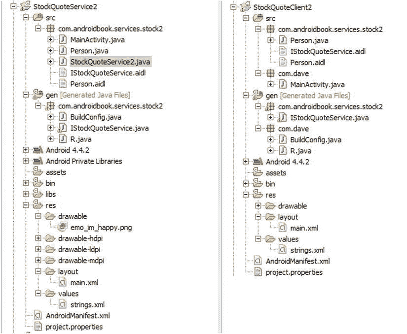

# 十四、构建和消费服务

Android 平台提供了完整的软件堆栈。这意味着你得到一个操作系统和中间件，以及工作应用(如电话拨号器)。除此之外，您还有一个 SDK，可以用来为该平台编写应用。到目前为止，我们已经看到，我们可以构建通过用户界面直接与用户交互的应用。然而，我们还没有讨论后台服务或者构建在后台运行的组件的可能性。

在这一章中，我们将关注在 Android 中构建和消费服务。首先我们将讨论使用 HTTP 服务，然后我们将介绍一种完成简单后台任务的好方法，最后我们将讨论进程间通信——即同一设备上的应用之间的通信。

消费 HTTP 服务

Android 应用和移动应用通常都是具有大量功能的小应用。移动应用在如此小的设备上提供如此丰富的功能的方式之一是它们从各种来源获取信息。例如，大多数 Android 智能手机都带有地图应用，它提供了复杂的地图功能。然而，我们知道该应用集成了 Google Maps API 和其他服务，提供了大部分的复杂性。

也就是说，您编写的应用很可能也会利用来自其他应用和 API 的信息。一种常见的集成策略是使用 HTTP。例如，您可能在互联网上有一个 Java servlet，它提供了您希望从一个 Android 应用中利用的服务。你如何用 Android 做到这一点？有趣的是，Android SDK 附带了 Apache 的http client(【http://hc.apache.org/httpcomponents-client-ga/】)的一个变种，这个版本被普遍使用。Android 版本已经针对 Android 进行了修改，但是 API 与 Apache 版本中的 API 非常相似。

Apache HttpClient 是一个全面的 HTTP 客户端。它提供了对 HTTP 协议的全面支持。在这一节中，我们将讨论使用 HttpClient 来进行 HTTP GET 和 HTTP POST 调用。如果您正在使用 RESTful 服务，您可能还会使用其他 HTTP 操作(PUT、DELETE 等。).

对 HTTP GET 请求使用 HttpClient

下面是使用 HttpClient 的一般模式之一:

1.  创建一个 HttpClient (或者获取一个现有的引用)。
2.  实例化一个新的 HTTP 方法，比如 PostMethod 或者 GetMethod 。
3.  设置 HTTP 参数名称/值。
4.  使用 HttpClient 执行 HTTP 调用。
5.  处理 HTTP 响应。

清单 14-1 展示了如何使用 HttpClient 执行 HTTP GET。

**注意**我们在本章末尾给了你一个 URL，你可以从本章下载项目。这将允许您将这些项目直接导入到 IDE 中。此外，因为代码试图使用互联网，当使用 HttpClient 进行 HTTP 调用时，您需要将Android . permission . Internet添加到您的清单文件中。

还要注意，在下面的例子中，所有的 web 服务调用都应该放在后台线程中，以免阻塞主 UI 线程。参见本章后面的内容，以及第 15 章的[，了解如何做到这一点。出于本章的目的，排除这些细节是为了帮助理解服务。](15.html)

[***清单 14-1***](#_list1) 。*使用 HttpClient 和 http get:*

```java
public class HttpGetDemo extends Activity {
    /** Called when the activity is first created. */
    @Override
    public void onCreate(Bundle savedInstanceState) {
        super.onCreate(savedInstanceState);
        setContentView(R.layout.main);

        BufferedReader in = null;
        try {

            HttpClient client = new DefaultHttpClient();
            HttpGet request = new HttpGet("[http://code.google.com/android/](http://code.google.com/android/)");
            HttpResponse response = client.execute(request);

            in = new BufferedReader(
                    new InputStreamReader(
                        response.getEntity().getContent()));

            StringBuffer sb = new StringBuffer("");
            String line = "";
            String NL = System.getProperty("line.separator");
            while ((line = in.readLine()) != null) {
                sb.append(line + NL);
            }
            in.close();

            String page = sb.toString();
            System.out.println(page);
        } catch (Exception e) {
            e.printStackTrace();
        } finally {
            if (in != null) {
                try {
                    in.close();
                } catch (IOException e) {
                    e.printStackTrace();
                }
            }
        }
    }
}
```

HttpClient 能够使用各种 HTTP 请求类型，比如 HttpGet 、 HttpPost 等等。[清单 14-1](#list1) 使用 HttpClient 获取[http://code.google.com/android/](http://code.google.com/android/)URL 的内容。实际的 HTTP 请求通过调用 client.execute() 来执行。执行请求后，代码将整个响应读入一个 string 对象。注意， BufferedReader 在 finally 块中是关闭的，这也关闭了底层的 HTTP 连接。

对于我们的例子，我们将 HTTP 逻辑嵌入到活动中，但是我们不需要在活动的上下文中使用 HttpClient 。您可以在任何 Android 组件的上下文中使用它，或者将其作为独立类的一部分使用。事实上，您不应该在活动中直接使用 HttpClient，因为 web 调用可能需要一段时间才能完成，并导致应用没有响应(ANR) 弹出窗口。我们将在本章的后面讨论这个话题。现在我们要稍微作弊一下，这样我们就可以专注于如何进行 HttpClient 调用。

清单 14-1 中的代码执行一个 HTTP 请求，而不向服务器传递任何 HTTP 参数。通过将名称/值对附加到 URL，您可以将名称/值参数作为请求的一部分传递，如[清单 14-2](#list2) 所示。

[***清单 14-2***](#_list2) 。*将* *参数* *添加到 HTTP GET 请求*

```java
HttpGet request =
    new HttpGet("[http://somehost/Upload.aspx?one=value1&two=value2](http://somehost/Upload.aspx?one=value1&two=value2)");
client.execute(request);
```

当执行 HTTP GET 时，请求的参数(名称和值)作为 URL 的一部分传递。以这种方式传递参数有一些限制。也就是说，URL 的长度应该保持在 2048 个字符以下。如果要提交的数据超过这个数量，应该使用 HTTP POST。POST 方法更加灵活，它将参数作为请求体的一部分传递。

将 HttpClient 用于 HTTP POST 请求(一个多部分示例)

进行 HTTP POST 调用与进行 HTTP GET 调用非常相似(参见[清单 14-3](#list3) )。这个例子叫做 SimpleHTTPPost。

[***清单 14-3***](#_list3) 。*用 HttpClient* 制作一个 *HTTP POST 请求*

```java
HttpClient client = new DefaultHttpClient();
HttpPost request = new HttpPost(
        "[http://www.androidbook.com/akc/display](http://www.androidbook.com/akc/display)");
List<NameValuePair> postParameters = new ArrayList<NameValuePair>();
postParameters.add(new BasicNameValuePair("url", "DisplayNoteIMPURL"));
postParameters.add(new BasicNameValuePair("reportId", "4788"));
postParameters.add(new BasicNameValuePair("ownerUserId", "android"));
postParameters.add(new BasicNameValuePair("aspire_output_format", "embedded-xml"));
UrlEncodedFormEntity formEntity = new UrlEncodedFormEntity(
        postParameters);
request.setEntity(formEntity);
HttpResponse response = client.execute(request);
```

清单 14-3 中的代码将替换清单 14-1 中的三行代码，其中使用了 HttpGet 。其他一切都可以保持不变。要使用 HttpClient 进行 HTTP POST 调用，必须使用 HttpPost 的实例调用 HttpClient 的 execute() 方法。当进行 HTTP POST 调用时，通常将 URL 编码的名称/值表单参数作为 HTTP 请求的一部分进行传递。要使用 HttpClient 来实现这一点，您必须创建一个包含 NameValuePair 对象实例的列表，然后用一个urlencodeformentity对象包装该列表。 NameValuePair 包装了一个名称/值组合，UrlEncodedFormEntity类知道如何编码一个适合 HTTP 调用(一般是 POST 调用)的 NameValuePair 对象列表。在您创建了一个urlencodeformentity之后，您可以将 HttpPost 的实体类型设置为urlencodeformentity然后执行请求。

在[清单 14-3](#list3) 中，我们创建了一个 HttpClient ，然后用 HTTP 端点的 URL 实例化了 HttpPost 。接下来，我们创建了一个由 NameValuePair 对象组成的列表，并用几个名称/值参数填充它。然后，我们创建了一个urlencodeformentity实例，将 NameValuePair 对象的列表传递给它的构造函数。最后，我们调用 POST 请求的 setEntity() 方法 ，然后使用 HttpClient 实例执行请求。

HTTP POST 其实比这个厉害多了。通过 HTTP POST，我们可以传递简单的名称/值参数，如清单 14-3 所示，也可以传递复杂的参数，如文件。HTTP POST 支持另一种称为多部分 POST 的请求正文格式。使用这种类型的 POST，您可以像以前一样发送名称/值参数以及任意文件。不幸的是，Android 自带的 HttpClient 版本不直接支持多部分 POST。为了在过去实现这个目标，我们建议您获取另外三个库:Apache Commons IO、Mime4j 和 HttpMime。

现在我们建议您下载 Ion 库，它有两个依赖项。这三个 jar 文件都可以在以下两个站点找到:

*   [【https://github.com/koush/ion#jars】](https://github.com/koush/ion#jars)(离子与安卓同步)
*   (gson)

清单 14-4 展示了一个使用 Android 的多部分帖子。这个例子叫做 MultipartHTTPPost。

[***清单 14-4***](#_list4) 。*制作一个* *多部分帖子调用*

```java
public class TestMultipartPost extends Activity {
    /** Called when the activity is first created. */
    @Override
    public void onCreate(Bundle savedInstanceState) {
        super.onCreate(savedInstanceState);
        setContentView(R.layout.main);

        try {
            Ion.with(this, "[http://www.androidbook.com/akc/update/PublicUploadTest](http://www.androidbook.com/akc/update/PublicUploadTest)")
            .setMultipartParameter("field1", "This is field number 1")
            .setMultipartParameter("field2", "Field 2 is shorter")
            .setMultipartFile("datafile",
                    new File(Environment.getExternalStorageDirectory()+"/testfile.txt"))
            .asString()
            .setCallback(new FutureCallback<String>() {
                   @Override
                    public void onCompleted(Exception e, String result) {
                       System.out.println(result);
                    }});

        } catch(Exception e) {
            // Do something about exceptions
            System.out.println("Got exception: " + e);
        }
    }
}
```

**注意**多部分示例使用了几个。不包含在 Android 运行时中的 jar 文件。确保。jar 文件将被打包成您的的一部分。apk 文件，你需要将它们添加为外部。Eclipse 中的 jar 文件。为此，在 Eclipse 中右键单击您的项目，选择 Properties，选择 Java Build Path，选择 Libraries 选项卡，然后选择 Add External JARs。

遵循这些步骤将使。jar 文件在编译时和运行时都可用。

要使用 Ion 库执行多部分 POST，只需将适当的调用放在一起构建 URL、添加参数、定义返回类型并设置回调方法。这将异步运行，一旦从 web 服务器收到响应，将在 UI 线程上调用回调。在该示例中，结果字符串被写入 LogCat。您的应用可能会接收回一个 JsonObject，然后回调函数会对其进行处理。但是要意识到，来自 web 服务器的响应已经被转换为 JsonObject，这使得回调中的处理变得更加容易。清单 14-4 给请求添加了三个部分:两个字符串部分和一个文本文件。要自己运行这个示例，您需要将 testfile.txt 文件放到设备或仿真器的外部存储区域。

最后，如果您正在构建一个需要向 web 资源传递多部分 POST 的应用，您可能需要在本地工作站上使用服务的虚拟实现来调试解决方案。当您在本地工作站上运行应用时，通常您可以通过使用 localhost 或 IP 地址 127.0.0.1 来访问本地机器。然而，对于 Android 应用，你将无法使用 localhost (或 127.0.0.1 )，因为设备或仿真器将是它自己的 localhost 。您不想将此客户端指向 Android 设备上的服务；你想指向你的工作站。要从设备或仿真器中运行的应用引用您的开发工作站，您必须在 URL 中使用工作站的 IP 地址。

SOAP、JSON 和 XML 解析器

肥皂呢？互联网上有很多基于 SOAP 的 web 服务，但是到目前为止，Google 还没有在 Android 中提供对调用 SOAP web 服务的直接支持。相反，谷歌更喜欢类似 REST 的网络服务，似乎是为了减少客户端设备所需的计算量。然而，代价是开发人员必须做更多的工作来发送数据和解析返回的数据。理想情况下，对于如何与 web 服务交互，您将有一些选择。一些开发人员已经使用 kSOAP2 开发工具包来为 Android 构建 SOAP 客户端。我们不会讨论这种方法，但是如果您感兴趣，它就在那里。

**注**原 kSOAP2 源位于此:。开源社区已经(谢天谢地！)贡献了一个安卓版的 kSOAP2，可以在这里了解更多:[http://code.google.com/p/ksoap2-android/](http://code.google.com/p/ksoap2-android/)。

一种已经成功使用的方法是在互联网上实现您自己的服务，它可以与目的地服务进行 SOAP(或其他)对话。然后你的 Android 应用只需要和你的服务对话，你现在就有了完全的控制权。如果目标服务发生了变化，您也许能够处理它，而不必更新和发布应用的新版本。你只需要更新服务器上的服务。这种方法的另一个好处是，您可以更容易地为您的应用实现付费订阅模型。如果用户让他们的订阅失效，您可以在您的服务器上关闭它们。

Android*是否支持 JavaScript 对象符号(JSON) 。这是在 web 服务器和客户端之间打包数据的一种相当常见的方法。JSON 解析类使得从响应中解包数据变得非常容易，因此您的应用可以对其进行操作。或者更深入地研究本章前面提到的 Gson 包。Gson 是 Google 的一个 JSON Java 库，它的主要好处是很容易将 JSON 输入解析成 Java 对象，反之亦然。也很快。*

 *Android 也有一些 XML 解析器，可以用来解释 HTTP 调用的响应；推荐的是 XMLPullParser 。

处理异常

处理异常是任何程序的一部分，但是使用外部服务(比如 HTTP 服务)的软件必须额外注意异常，因为出错的可能性被放大了。在使用 HTTP 服务时，您可能会遇到几种类型的异常。这些是传输异常、协议异常和超时。您应该了解这些异常可能发生的时间。

传输异常可能因多种原因而发生，但移动设备最有可能出现的情况是网络连接不良。协议异常(例如，ClientProtocolException)是 HTTP 协议层的异常。这些错误包括身份验证错误、无效的 cookies 等等。例如，如果您必须提供登录凭证作为 HTTP 请求的一部分，但却没有这样做，那么您可能会看到协议异常。关于 HTTP 调用的超时，有两种类型:连接超时和套接字超时。如果 HttpClient 无法连接到 HTTP 服务器，例如，如果服务器不可用，则可能发生连接超时(例如，ConnectTimeoutException)。如果 HttpClient 未能在定义的时间段内接收到响应，则会发生套接字超时(例如 SocketTimeoutException)。换句话说， HttpClient 能够连接到服务器，但是服务器无法在分配的时间限制内返回响应。

现在您已经了解了可能发生的异常类型，那么您如何处理它们呢？幸运的是， HttpClient 是一个健壮的框架，可以帮您卸下大部分负担。事实上，您唯一需要担心的异常类型是那些您能够轻松管理的异常类型。 HttpClient 通过检测传输问题和重试请求来处理传输异常(这对于这种类型的异常非常有效)。协议异常是通常可以在开发过程中清除的异常。超时是您必须处理的最有可能的异常。处理这两种超时(连接超时和套接字超时)的一种简单而有效的方法是用一个 try / catch 包装 HTTP 请求的 execute() 方法，然后在失败时重试。

当使用 HttpClient 作为现实世界应用的一部分时，您需要注意可能出现的多线程问题。现在就来深究这些吧。

解决多线程问题

到目前为止，我们展示的例子为每个请求创建了一个新的 HttpClient 。然而，实际上，您可以为整个应用创建一个 HttpClient ，并将其用于所有的 HTTP 通信。可以将连接池与这个 HttpClient 相关联，您现在将看到这一点。用一个 HttpClient 服务所有的 HTTP 请求，您应该注意多线程问题，如果您通过同一个 HttpClient 同时发出请求，可能会出现多线程问题。幸运的是， HttpClient 提供了使这变得容易的工具——您所要做的就是使用ThreadSafeClientConnManager创建 DefaultHttpClient ，如[清单 14-5](#list5) 所示。这个示例项目是 HttpSingleton。

[***清单 14-5***](#_list5) 。*为多线程创建一个http client:CustomHttpClient.java*

```java
public class CustomHttpClient {
    private static HttpClient customHttpClient;

    /** A private Constructor prevents instantiation */
    private CustomHttpClient() {
    }

    public static synchronized HttpClient getHttpClient() {
        if (customHttpClient == null) {
            HttpParams params = new BasicHttpParams();
            HttpProtocolParams.setVersion(params, HttpVersion.HTTP_1_1);
            HttpProtocolParams.setContentCharset(params,
                    HTTP.DEFAULT_CONTENT_CHARSET);
            HttpProtocolParams.setUseExpectContinue(params, true);
            HttpProtocolParams.setUserAgent(params,
                    System.getProperty("http.agent")
                    // Could also have used the following which is browser-oriented as opposed to
                    // device-oriented:
                    // new WebView(getApplicationContext()).getSettings().getUserAgentString()
            );

            ConnManagerParams.setTimeout(params, 1000);

            HttpConnectionParams.setConnectionTimeout(params, 5000);
            HttpConnectionParams.setSoTimeout(params, 10000);

            SchemeRegistry schReg = new SchemeRegistry();
            schReg.register(new Scheme("http",
                            PlainSocketFactory.getSocketFactory(), 80));
            schReg.register(new Scheme("https",
                            SSLSocketFactory.getSocketFactory(), 443));
            ClientConnectionManager conMgr = new
                            ThreadSafeClientConnManager(params,schReg);

            customHttpClient = new DefaultHttpClient(conMgr, params);
        }
        return customHttpClient;
    }

    public Object clone() throws CloneNotSupportedException {
        throw new CloneNotSupportedException();
    }
}
```

如果您的应用需要进行多次 HTTP 调用，那么您应该创建一个 HttpClient 来服务您所有的 HTTP 请求。最简单的方法是创建一个可以从应用的任何地方访问的单例类，就像我们在这里展示的那样。这是一个相当标准的 Java 模式，在这种模式中，我们同步对 getter 方法的访问，getter 方法为单例对象返回唯一的 HttpClient 对象，在必要时第一次创建它。

现在，看看 CustomHttpClient 的 getHttpClient() 方法 。这个方法负责创建我们的单体 HttpClient 。我们设置一些基本参数，一些超时值，以及我们的 HttpClient 将支持的方案(即 HTTP 和 HTTPS)。注意，当我们实例化 DefaultHttpClient() 时，我们传入了一个ClientConnectionManager。ClientConnectionManager负责管理 HttpClient 的 HTTP 连接。因为我们想对所有 HTTP 请求使用一个单独的 HttpClient (如果我们使用线程，请求可能会重叠)，所以我们创建了一个ThreadSafeClientConnManager。

我们还向您展示了一种从 HTTP 请求中收集响应的更简单的方法，使用一个 BasicResponseHandler 。使用我们的 CustomHttpClient 的活动代码在[清单 14-6](#list6) 中。

[***清单 14-6***](#_list6) 。*使用我们的custom http client:HttpActivity.javaT9】*

```java
public class HttpActivity extends Activity
{
    private HttpClient httpClient;
    @Override
    public void onCreate(Bundle savedInstanceState)
    {
        super.onCreate(savedInstanceState);
        setContentView(R.layout.main);

        httpClient = CustomHttpClient.getHttpClient();
        getHttpContent();
    }

    public void getHttpContent()
    {
        try {
            HttpGet request = new HttpGet("[http://www.google.com/](http://www.google.com/)");
            String page = httpClient.execute(request,
                    new BasicResponseHandler());
            System.out.println(page);
        } catch (IOException e) {
            // covers:
            //      ClientProtocolException
            //      ConnectTimeoutException
            //      ConnectionPoolTimeoutException
            //      SocketTimeoutException
            e.printStackTrace();
        }
    }
}
```

对于这个示例应用，我们对 Google 主页进行了简单的 HTTP get。我们还使用一个 BasicResponseHandler 对象来将页面呈现为一个大的字符串，然后我们将它写到 LogCat 中。如您所见，向 execute() 方法添加一个 BasicResponseHandler 非常容易。

每个 Android 应用都有一个关联的应用对象，您可能会想利用这一事实。默认情况下，如果不定义自定义应用对象，Android 使用 android.app.Application 。关于 application 对象有一件有趣的事情:对于您的应用，始终只有一个 application 对象，并且您的所有组件都可以访问它(使用全局上下文对象)。可以扩展应用类并添加功能，比如我们的 CustomHttpClient 。然而，在我们的例子中，实际上没有理由在应用类本身中这样做，当您可以简单地创建一个单独的单例类来处理这种类型的需求时，您最好不要弄乱应用类。

超时的乐趣

为我们的应用设置一个单独的 HttpClient 还有其他非常好的优势。我们可以在一个地方修改它的属性，每个人都可以利用它。例如，如果我们想为我们的 HTTP 调用设置公共超时值，我们可以在创建我们的 HttpClient 时，通过对我们的 HttpParams 对象调用适当的 setter 函数来实现。请参考[清单 14-5](#list5) 和 getHttpClient() 方法。请注意，我们可以使用三种暂停。第一个是连接管理器的超时，它定义了从连接管理器管理的连接池中获取连接需要等待多长时间。在我们的例子中，我们将其设置为 1 秒。我们唯一可能需要等待的时候是池中的所有连接都在使用中。第二个超时值定义了我们应该等待多长时间才能通过网络连接到另一端的服务器。这里，我们使用了 2 秒的值。最后，我们将套接字超时值设置为 4 秒，以定义我们应该等待多长时间来获取请求的数据。

对应于前面描述的三个超时，我们可以得到这三个异常:ConnectionPoolTimeoutException、 ConnectTimeoutException 或 SocketTimeoutException 。所有这三个异常都是 IOException 的子类，我们在 HttpActivity 中使用了它，而不是单独捕获每个子类异常。

如果您研究我们在 getHttpClient() 中使用的每个参数设置类，您可能会发现更多有用的参数。

我们已经为您描述了如何建立一个带有连接池的 HttpClient，以便在您的应用中使用。这意味着，每当您需要使用连接时，各种设置将适用于您的特定需求。但是，如果您希望对特定的消息进行不同的设置，该怎么办呢？谢天谢地，有一个简单的方法可以做到这一点。我们向您展示了如何使用一个 HttpGet 或一个 HttpPost 对象来描述通过网络发出的请求。以类似于我们在 HttpClient 上设置 HttpParams 的方式，您可以在 HttpGet 和 HttpPost 对象上设置 HttpParams 。您在消息级别应用的设置将覆盖 HttpClient 级别的设置，而不会更改 HttpClient 的设置。清单 14-7 显示了如果我们想让一个特定请求的套接字超时为 1 分钟而不是 4 秒钟，这可能会是什么样子。您可以使用这些行来代替清单 14-6 中 getHttpContent() 的 try 块中的行。

[***清单 14-7***](#_list7) 。*在请求级别覆盖套接字超时*

```java
HttpGet request = new HttpGet("[http://www.google.com/](http://www.google.com/)");
HttpParams params = request.getParams();
HttpConnectionParams.setSoTimeout(params, 60000);   // 1 minute
request.setParams(params);
String page = httpClient.execute(request,
                    new BasicResponseHandler());
System.out.println(page);
```

使用 HttpURLConnection

Android 提供了另一种处理 HTTP 服务的方式，那就是使用Java . net . httpurlconnection类。这与我们刚刚讨论过的 HttpClient 类没有什么不同，但是 HttpURLConnection 倾向于需要更多的语句来完成任务。HttpURLConnection 也不是线程安全的。另一方面，这个类比 HttpClient 小得多，也轻得多，所以您可以简单地创建您需要的类。从 Gingerbread 版本开始，它也相当稳定，所以当您只需要基本的 HTTP 功能并且想要一个紧凑的应用时，您应该考虑将其用于更新设备上的应用。

使用 AndroidHttpClient

Android 2.2 引入了 HttpClient 的一个新子类，叫做 AndroidHttpClient 。这个类背后的想法是通过提供适用于 Android 应用的默认值和逻辑，使 Android 应用的开发变得更加容易。例如，连接和套接字(即操作)的超时值都默认为 20 秒。连接管理器默认为线程安全客户端连接管理器。在很大程度上，它可以与我们在前面的例子中使用的 HttpClient 互换。但是，您应该知道一些不同之处:

*   为了创建一个 AndroidHttpClient ，您调用 AndroidHttpClient 类的静态 newInstance() 方法，就像这样:

    ```java
    AndroidHttpClient httpClient = AndroidHttpClient.newInstance("my-http-agent-string");
    ```

*   Notice that the parameter to the newInstance() method is an HTTP agent string. You most likely don’t want to hardcode this, so you have two options as follows, which unfortunately can return different strings. The second one is probably the one you want to use as it looks more like what a browser would send (at least in our experiments).

    ```java
    // The first option is a device-level agent string
    String httpAgent = System.getProperty("http.agent");
    // This second option looks like a browser’s agent string
    httpAgent = new WebView(context).getSettings().getUserAgentString();
    ```

    当然，你也可以使用任何你的应用可用的东西来构建你自己的代理字符串；服务器将解析它以更好地理解设备，如果你控制服务器，你可以使用你从应用发送的任何值。

*   当在这个客户端上调用 execute() 时，您必须在一个独立于主 UI 线程的线程中。这意味着如果你试图用一个和一个来替换我们之前的 HttpClient ，你会得到一个异常。从主 UI 线程进行 HTTP 调用是不好的做法，所以 AndroidHttpClient 不会让你这样做。我们将在下一节讨论线程问题。
*   当您完成时，必须在 AndroidHttpClient 实例上调用 close() 。这样可以适当地释放内存。
*   有一些方便的静态方法来处理来自服务器的压缩响应，包括
    *   modifyrequesttoacceptgziprense(http request)
    *   get comprehensity(字节[]日期， 内容解析器 【解析器】
    *   getUngzippedContent(HttpEntity实体)

一旦获得了 AndroidHttpClient 的实例，就不能修改其中的任何参数设置，也不能向其中添加任何参数设置(例如 HTTP 协议版本)。您的选择是覆盖前面所示的 HttpGet 对象中的设置，或者不使用 AndroidHttpClient 。

这就结束了我们对通过 HttpClient 使用 HTTP 服务的讨论。要获得关于使用 HttpClient 和这些其他概念的精彩教程，请访问 Apache 网站[http://HC . Apache . org/httpcomponents-client-ga/tutorial/html/](http://hc.apache.org/httpcomponents-client-ga/tutorial/html/)。

我们已经向您展示了如何操作基于 HTTP 的服务。但是，如果我们想要运行一些持续时间超过一小段时间的后台处理，或者如果我们想要调用另一个 Android 应用中存在的一些非 UI 功能，该怎么办呢？针对这些需求，Android 提供了服务。我们接下来将讨论它们。

使用安卓服务

Android 支持服务的概念。*服务*是在后台运行的组件，没有用户界面。您可以将这些组件视为类似于 Windows 服务或 Unix 守护程序。与这些类型的服务类似，Android 服务可以一直可用，但不必主动做些什么。更重要的是，Android 服务可以拥有独立于活动的生命周期。当一个活动暂停、停止或被销毁时，您可能希望继续进行一些处理。服务业对此也有好处。

Android 支持两种类型的服务:本地服务和远程服务。一个*本地服务* 是一个只能被托管它的应用访问的服务，它不能被设备上运行的其他应用访问。通常，这些类型的服务只是支持托管服务的应用。除了托管服务的应用之外，还可以从设备上的其他应用访问*远程服务* 。远程服务使用 Android 接口定义语言(AIDL) 向客户端定义自己。我们将讨论这两种类型的服务，尽管在接下来的几章中，我们将深入讨论本地服务。因此，我们将在这里介绍它们，但不会花太多时间。我们将在本章中更详细地讨论远程服务。

了解 Android 中的服务

Android Service 类是一种具有类似服务行为的代码包装器。然而，服务对象不会自动创建自己的线程。对于一个使用线程的服务对象，开发者必须让它发生。这意味着在没有给服务添加线程的情况下，服务的代码将在主线程上运行。如果我们的服务正在执行的操作会很快完成，这就不是问题。如果我们的服务可能会运行一段时间，我们肯定希望包含线程。请记住，在服务中使用 AsyncTask s 进行线程处理没有任何问题。

Android 支持服务的概念有两个原因:

*   首先，允许您轻松实现后台任务。
*   第二，允许您在同一设备上运行的应用之间进行进程间通信。

这两个原因对应了 Android 支持的两类服务:本地服务和远程服务。第一种情况的例子可能是作为电子邮件应用的一部分实现的本地服务。该服务可以处理向电子邮件服务器发送新电子邮件，包括附件和重试。因为这可能需要一段时间才能完成，所以服务是包装该功能的一种很好的方式，这样主线程就可以启动它并返回给用户。此外，如果电子邮件活动停止，您仍然希望发送的电子邮件被传递。第二种情况的一个例子是语言翻译应用，我们将在后面看到。假设您有几个应用在一个设备上运行，您需要一个服务来接受需要从一种语言翻译成另一种语言的文本。您可以编写一个远程翻译服务，让应用与服务对话，而不是在每个应用中重复逻辑。

本地服务由使用 bindService() 绑定到它的客户端初始化，或者由使用 startService() 启动它的客户端初始化。远程服务通常总是用 bindService() 初始化。绑定的服务在第一个客户端绑定到它时被实例化，在最后一个客户端解除绑定时被销毁。当客户端进出前台时，它们可以根据需要绑定和解除绑定，以确保服务不会不必要地运行。这有助于延长电池寿命。但是，在 onResume()中绑定而在 onPause()中取消绑定是不明智的，因为这可能会导致大量不必要的服务启动和停止。最好在 onCreate()和 onDestroy()中绑定和解除绑定，或者在 onStart()和 onStop()中绑定和解除绑定。仅允许从应用上下文、活动、另一个服务或内容提供者进行绑定。这意味着不是来自片段，也不是来自广播接收器。

相反，当使用 startService()启动服务时，它将一直运行，直到被客户端或告诉自己停止而停止。对于希望在后台执行工作的本地服务，可以考虑用 startService()实例化它，这样即使启动它的活动消失，它也可以保持运行。从技术上讲，广播接收器可以使用 startService()启动服务，因为一旦短暂的广播接收器终止，服务就可以继续存在。如果您确实创建了一个即使在活动已经消失的情况下也将在后台运行的服务，那么您可能希望实现 onBind()，以便用户能够重新获得对该服务的控制。一个新的活动可以绑定到现有的服务，然后调用它的服务方法。

有不创建后台线程的本地服务的例子，但是这在实践中可能不是很有用。服务本身并不创建任何线程，因此默认情况下，服务的代码将在主 UI 线程上运行。将这些代码包装在服务中可能没有任何真正的好处，因为您可以只调用类的方法来执行该逻辑。更常见的是，本地服务有自己的执行线程，这些线程可以在第一个客户端绑定到它时启动，也可以因为 startService()命令而启动。

现在，我们可以开始详细检查这两种类型的服务。我们将从讨论本地服务开始，然后讨论远程服务。如前所述，本地服务是仅由承载它们的应用调用的服务。远程服务是支持远程过程调用(RPC)机制 的服务。这些服务允许同一设备上的外部客户端连接到服务并使用其设施。调用远程服务有两种主要方式:使用 AIDL 接口和使用信使。两者都包括在内。

**注意**Android 中的第二种服务有几个名字:远程服务、AIDL 支持服务、AIDL 服务、外部服务和 RPC 服务。这些术语都是指同一种类型的服务——一种可以被设备上运行的其他应用远程访问的服务。

了解本地服务

本地服务是通常通过 Context.startService() 启动的服务。一旦启动，这些类型的服务将继续运行，直到客户端调用服务上的 Context.stopService() 或者服务本身调用 stopSelf() 。注意，当 Context.startService() 被调用，服务还没有被创建时，系统会实例化服务，并调用服务的 onStartCommand() 方法 。请记住，在服务启动后(即当它存在时)调用 Context.startService() 不会导致服务的另一个实例，但会重新调用正在运行的服务的 onStartCommand() 方法。这里有几个本地服务的例子:

*   一种服务，用于监控来自设备的传感器数据并进行分析，如果达到某个条件，就会发出警报。该服务可能会持续运行。
*   一个任务执行程序服务，允许您的应用的活动提交作业并将它们排队等待处理。此服务可能仅在提交作业的操作期间运行。

清单 14-8 通过实现一个执行后台任务的服务来演示一个本地服务。我们最终将得到创建和消费服务所需的四个构件:【BackgroundService.java】(服务本身)【main . XML】(活动的布局文件)【MainActivity.java】(调用服务的活动类)，以及 AndroidManifest.xml 。[清单 14-8](#list8) 仅包含BackgroundService.java。我们将首先剖析这段代码，然后再看其他三段。

[***清单 14-8***](#_list8) 。*实现本地服务:*

```java
public class BackgroundService extends Service
{
    private static final String TAG = "BackgroundService";
    private NotificationManager notificationMgr;
    private ThreadGroup myThreads = new ThreadGroup("ServiceWorker");

    @Override
    public void onCreate() {
        super.onCreate();

        Log.v(TAG, "in onCreate()");
        notificationMgr =(NotificationManager)getSystemService(
               NOTIFICATION_SERVICE);
        displayNotificationMessage("Background Service is running");
    }

    @Override
    public int onStartCommand(Intent intent, int flags, int startId) {
        super.onStartCommand(intent, flags, startId);

        int counter = intent.getExtras().getInt("counter");
        Log.v(TAG, "in onStartCommand(), counter = " + counter +
                ", startId = " + startId);

        new Thread(myThreads, new ServiceWorker(counter),
            "BackgroundService")
                .start();

        return START_STICKY;
    }

    class ServiceWorker implements Runnable
    {
        private int counter = -1;
        public ServiceWorker(int counter) {
            this.counter = counter;
        }

        public void run() {
            final String TAG2 = "ServiceWorker:" +
                Thread.currentThread().getId();
            // do background processing here... we'll just sleep...
            try {
                Log.v(TAG2, "sleeping for 10 seconds. counter = " +
                    counter);
                Thread.sleep(10000);
                Log.v(TAG2, "... waking up");
            } catch (InterruptedException e) {
                Log.v(TAG2, "... sleep interrupted");
            }
        }
    }

    @Override
    public void onDestroy()
    {
        Log.v(TAG, "in onDestroy(). Interrupting threads and cancelling notifications");
        myThreads.interrupt();
        notificationMgr.cancelAll();
        super.onDestroy();
    }

    @Override
    public IBinder onBind(Intent intent) {
        Log.v(TAG, "in onBind()");
        return null;
    }

    private void displayNotificationMessage(String message)
    {

        PendingIntent contentIntent =
            PendingIntent.getActivity(this, 0,
                new Intent(this, MainActivity.class), 0);

        Notification notification = new NotificationCompat.Builder(this)
            .setContentTitle(message)
            .setContentText("Touch to turn off service")
            .setSmallIcon(R.drawable.emo_im_winking)
            .setTicker("Starting up!!!")
            // .setLargeIcon(aBitmap)
            .setContentIntent(contentIntent)
            .setOngoing(true)
            .build();

        notificationMgr.notify(0, notification);
    }
}
```

一个服务对象的结构有点类似于一个活动。有一个 onCreate() 方法可以用来进行初始化，还有一个 onDestroy() 方法可以用来进行清理。服务不像活动那样暂停或恢复，所以我们不使用 onPause() 或 onResume() 方法。在这个例子中，我们不会绑定到本地服务，但是因为服务需要实现 onBind() 方法 ，所以我们提供了一个返回 null 的服务。值得一提的是，您可以有一个实现 onBind()而不使用 onStartCommand()的本地服务。

回到我们的 onCreate() 方法，除了通知用户这个服务已经创建，我们不需要做太多事情。我们使用通知管理器来完成这项工作。你可能已经注意到了 Android 屏幕左上角的通知栏。通过拉下这个按钮，用户可以查看重要的消息，通过触摸通知可以对通知进行操作，这通常意味着返回到与通知相关的一些活动。对于服务，因为它们可以在后台运行，或者至少存在于后台，而没有可见的活动，所以必须有某种方法让用户重新接触到服务，也许是关闭它。因此，我们创建一个通知对象，用一个pending content填充它，这将使我们返回到我们的控件活动，并发布它。这一切都发生在displayNotificationMessage()方法中。请注意，只要我们的服务存在，我们的通知对象就需要存在，因此我们使用 setOngoing(true) 将它保留在通知列表中，直到我们自己从服务的 onDestroy() 方法中将其清除。我们在 onDestroy() 中使用的清除通知的方法是 NotificationManager 上的 cancelAll() 。

这个例子还需要另外一个东西。您需要创建一个名为 emo_im_winking 的 drawable，并将其放在项目的 drawable 文件夹中。出于演示目的，一个很好的 drawables 来源是查看 Android 平台文件夹下的 AndroidSDK/platforms/<version>/data/RES/drawable，其中 < version > 是您感兴趣的版本。不幸的是，你不能从你的代码中可靠地引用 Android 系统的 drawables，所以你需要把你想要的复制到你的项目的 drawables 文件夹中。如果您为您的示例选择了不同的 drawable 文件，只需在通知的构造函数中重命名资源 ID。

当使用 startService() 将意图发送到我们的服务中时，如果需要，将调用 onCreate() ，并调用我们的 onStartCommand() 方法来接收调用者的意图。在我们的例子中，我们不打算对它做任何特别的事情，除了打开计数器并用它来启动一个后台线程。在真实世界的服务中，我们希望任何数据都通过 intent 传递给我们，例如，这可能包括 URIs。注意在创建线程时使用了线程组 。这将被证明是有用的，当我们想摆脱我们的背景线程。还要注意 startId 参数。这是由 Android 为我们设置的，是自该服务启动以来服务调用的唯一标识符。

我们的 ServiceWorker class 是一个典型的 runnable，是我们服务的工作发生的地方。在我们的特殊情况下，我们只是记录一些消息和睡眠。我们也会捕捉任何干扰并记录下来。我们没有做的一件事是操纵用户界面。例如，我们不会更新任何视图。因为我们不再在主线程上，所以我们不能直接接触 UI。我们的服务人员有很多方法可以改变用户界面，我们将在接下来的几章中详细介绍这些方法。

我们 BackgroundService 中最后要注意的一项是 onDestroy() 方法 。这是我们进行清理的地方。在我们的例子中，我们想要去掉我们之前创建的线程，如果有的话。如果我们不这样做，它们可能只是四处游荡，占用内存。第二，我们想摆脱我们的通知消息。因为我们的服务正在消失，用户不再需要通过活动来摆脱它。然而，在实际应用中，我们可能希望让我们的员工继续工作。如果我们的服务是发送电子邮件，我们当然不想简单地杀死线程。我们的例子过于简单，因为我们暗示通过使用 interrupt() 方法 可以很容易地杀死后台线程。然而实际上，你最多只能打断一下。不过，这不一定会杀死一个线程。有一些不推荐使用的方法来终止线程，但是您不应该使用这些方法。它们会给你和你的用户带来内存和稳定性问题。在我们的例子中，打断是有效的，因为我们在睡觉，这是可以被打断的。

看一下 ThreadGroup 类是值得的，因为它提供了访问线程的方法。我们在服务中创建了一个单独的线程组对象，然后在创建我们自己的线程时使用它。在我们的服务的 onDestroy() 方法中，我们简单地对线程组执行中断()，它向线程组中的每个线程发出一个中断。

这就是一个简单的本地服务的构成。在我们展示我们活动的代码之前，[清单 14-9](#list9) 展示了我们用户界面的 XML 布局文件。

[***清单 14-9***](#_list9) 。*实现本地服务: main.xml*

```java
<?xml version="1.0" encoding="utf-8"?>
<!-- This file is /res/layout/main.xml -->
<LinearLayout xmlns:android="[http://schemas.android.com/apk/res/android](http://schemas.android.com/apk/res/android)"
    android:orientation="vertical"
    android:layout_width="fill_parent"
    android:layout_height="fill_parent"
    >
<Button  android:id="@+id/startBtn"
    android:layout_width="wrap_content"
    android:layout_height="wrap_content"
    android:text="Start Service"  android:onClick="doClick" />
<Button  android:id="@+id/stopBtn"
    android:layout_width="wrap_content"
    android:layout_height="wrap_content"
    android:text="Stop Service"  android:onClick="doClick" />
</LinearLayout>
```

我们将在用户界面上显示两个按钮，一个执行 startService() ，另一个执行 stopService() 。我们可以选择使用一个 ToggleButton，但是这样你就不能连续多次调用 startService() 。这是很重要的一点。 startService() 和 stopService() 之间不是一一对应的关系。当调用 stopService() 时，服务对象将被销毁，所有 startService() 调用创建的所有线程也将消失。现在，让我们看看清单 14-10 中的活动代码。

[***清单 14-10***](#_list10) 。*实现本地服务:*

```java
public class MainActivity extends Activity
{
    private static final String TAG = "MainActivity";
    private int counter = 1;

    @Override
    public void onCreate(Bundle savedInstanceState)
    {
        super.onCreate(savedInstanceState);
        setContentView(R.layout.main);
    }

    public void doClick(View view) {
        switch(view.getId()) {
        case R.id.startBtn:
            Log.v(TAG, "Starting service... counter = " + counter);
            Intent intent = new Intent(MainActivity.this,
                    BackgroundService.class);
            intent.putExtra("counter", counter++);
            startService(intent);
            break;
        case R.id.stopBtn:
            stopService();
        }
    }

    private void stopService() {
        Log.v(TAG, "Stopping service...");
        if(stopService(new Intent(MainActivity.this,
                    BackgroundService.class)))
            Log.v(TAG, "stopService was successful");
        else
            Log.v(TAG, "stopService was unsuccessful");
    }

    @Override
    public void onDestroy()
    {
        stopService();
        super.onDestroy();
    }
}
```

我们的主要活动看起来很像你见过的其他活动。有一个简单的 onCreate() 来从 main.xml 布局文件设置我们的用户界面。有一个 doClick() 方法来处理按钮回调。在我们的示例中，当按下启动服务按钮时，我们调用 startService() ，当按下停止服务按钮时，我们调用 stopService() 。当我们启动服务时，我们希望传入一些数据，这是通过 intent 实现的。我们选择在 Extras 包中传递数据，但是如果我们有一个 URI，我们可以使用 setData() 来添加它。当我们停止服务时，我们检查返回结果。它通常应该是真的，但是如果服务没有运行，我们可能会得到假的返回。最后，当我们的活动终止时，我们想要停止服务，所以我们也在我们的 onDestroy() 方法中停止服务。还有一项需要讨论，那就是 AndroidManifest.xml 文件，我们在[清单 14-11](#list11) 中展示了它。

[***清单 14-11***](#_list11) 。*实现本地服务:Android manifest . XML*

```java
<?xml version="1.0" encoding="utf-8"?>
<manifest xmlns:android="[http://schemas.android.com/apk/res/android](http://schemas.android.com/apk/res/android)"
      package="com.androidbook.services.simplelocal"
      android:versionCode="1"
      android:versionName="1.0">
    <uses-sdk android:minSdkVersion="8" />
    <application android:icon="@drawable/icon"
             android:label="@string/app_name">
        <activity android:name=".MainActivity"
                android:label="@string/app_name"
                android:launchMode="singleTop" >
           <intent-filter>
             <action android:name="android.intent.action.MAIN" />
             <category android:name="android.intent.category.LAUNCHER" />
           </intent-filter>
        </activity>
        <service android:name="BackgroundService"/>
    </application>

</manifest>
```

除了我们清单文件中常规的 <活动> 标签之外，我们现在还有一个 <服务> 标签。因为这是一个我们使用类名显式调用的本地服务，所以我们不需要在 <服务> 标签中放太多内容。所需要的只是我们服务的名称。但是关于这个清单文件还有一点需要指出。我们的服务会创建一个通知，以便用户可以返回到我们的 MainActivity ，例如，如果用户在不停止服务的情况下按下了 MainActivity 上的 Home 键。

主活动仍然存在；只是看不出来而已。返回到主活动的一种方法是单击我们的服务创建的通知。通知管理器将我们的意图传递回我们的应用，通常会导致一个新的主活动实例来处理新的意图。为了防止这种情况发生，我们在清单文件中为名为 android:launchMode 的 MainActivity 设置了一个属性，并将其设置为 singleTop 。这将有助于确保现有的不可见的 MainActivity 将被前移并显示，而不是创建另一个 MainActivity 。

当您运行这个应用时，您会看到我们的两个按钮。通过单击 Start Service 按钮，您将实例化服务并调用 onStartCommand() 。我们的代码将几条消息记录到 LogCat 中，因此您可以跟着做。继续，连续几次点击“启动服务”,甚至更快。您将看到为处理每个请求而创建的线程。您还会注意到，计数器的值被传递给每个 ServiceWorker 线程。当您按下停止服务按钮时，我们的服务将会消失，您将会看到来自我们的 MainActivity 的 stopService() 方法的日志消息，来自我们的 BackgroundService 的 onDestroy() 方法的日志消息，如果线程被中断，还可能会看到来自 ServiceWorker 线程的日志消息。

您还应该注意到服务启动时的通知消息。随着服务的运行，在我们的 MainActivity 中点击 Back 按钮，注意通知消息消失了。这意味着我们的服务也消失了。要重启我们的主活动，点击 Start Service 让服务再次运行。现在，按下主页按钮。我们的主活动从视图中消失了，但是通知仍然存在，这意味着我们的服务仍然存在。继续点击通知，您将再次看到我们的主活动。

请注意，我们的示例使用活动与服务进行交互，但是您的应用中的任何组件都可以使用该服务。这包括其他服务、活动、泛型类等等。还要注意，我们的服务不会自行停止；它依赖于活动来完成。有一些方法可供服务使用，允许服务自行停止，即 stopSelf() 和 stopSelfResult() 。显然，如果这个服务有多个客户端，我们不希望其中一个客户端停止服务，而其他客户端仍在使用它。对于一个有多个客户端的已启动服务，您更有可能在服务本身中加入逻辑来决定服务何时能够或者应该停止，并且服务将使用 stop*()方法 之一来完成这一任务。

我们的 BackgroundService 是托管服务的应用组件所使用的服务的典型例子。换句话说，运行服务的应用也是唯一的消费者。因为该服务不支持来自其进程之外的客户端，所以该服务是本地服务。本地服务的关键方法有 onCreate() 、 onStartCommand() 、onBind()、 stop*() 和 onDestroy() 。

本地服务还有另一种选择，那就是只有一个服务实例和一个后台线程。在这种情况下，在 BackgroundService 的 onCreate() 方法中，我们可以创建一个线程来完成服务的繁重工作。我们可以在 onCreate() 而不是 onStartCommand() 中创建并启动线程。我们可以这样做，因为 onCreate() 只被调用一次，并且我们希望线程在服务的生命周期中只被创建一次。然而，我们在 onCreate() 中没有的一件事是 startService() 传递的意图的内容。如果我们需要，我们也可以使用前面描述的模式，我们只需要知道 onStartCommand() 应该只被调用一次。

Android 还有另一种方法来实现自动包含后台线程的本地服务:IntentService。服务的子类 IntentService 接收来自 startService()调用的传入意图，为您创建一个后台(worker)线程，并调用回调 onHandleIntent(Intent intent)。如果在工作线程完成前一个意图之前将另一个意图传递给此服务，则新的意图将处于等待状态，直到处理完前一个意图，此时队列中的下一个意图将被传递给 onHandleIntent()方法。当来自入站队列的所有意图都完成处理后，服务将自行停止(不需要您这样做)。

我们对本地服务的介绍到此结束。请记住，我们将在后续章节中深入了解本地服务的更多细节。让我们转到 AIDL 服务——一种更复杂的服务。

了解 AIDL 服务

在上一节中，我们向您展示了如何编写一个 Android 服务，由托管该服务的应用使用。现在，我们将向您展示如何通过远程过程调用(RPC) 构建一个可以被其他流程使用的服务。与许多其他基于 RPC 的解决方案一样，在 Android 中，您需要一个接口定义语言(IDL)来定义将向客户端公开的接口。在 Android 世界，这个 IDL 被称为 Android 接口定义语言(AIDL) 。要构建远程服务，您需要执行以下操作:

1.  编写一个 AIDL 文件，定义你与客户的接口。AIDL 文件使用 Java 语法，并有一个。aidl 扩展。在你的 AIDL 文件中使用和你的 Android 项目相同的包名。
2.  将 AIDL 文件添加到 Eclipse 项目的 src 目录下。Android Eclipse 插件将调用 AIDL 编译器从 AIDL 文件生成 Java 接口(AIDL 编译器作为构建过程的一部分被调用)。
3.  实现一个服务，从 onBind() 方法返回接口。
4.  将服务配置添加到您的 AndroidManifest.xml 文件中。接下来的部分向您展示了如何执行每个步骤。

在 AIDL 定义服务接口

为了演示一个远程服务的例子，我们将编写一个股票报价服务。该服务将提供一个方法，该方法获取股票代码并返回股票价值。要在 Android 中编写远程服务，第一步是在 AIDL 文件中定义服务接口定义。清单 14-12 显示了 IStockQuoteService 的 AIDL 定义。对于您的 StockQuoteService 项目，该文件与常规 Java 文件放在同一个位置。

[***清单 14-12***](#_list12) 。*AIDL 定义的* *服务*

```java
// This file is IStockQuoteService.aidl
package com.androidbook.services.stockquoteservice;
interface IStockQuoteService
{
        double getQuote(String ticker);
}
```

IStockQuoteService 以字符串形式接受股票代码，并以双精度形式返回当前股票价值。当您创建 AIDL 文件时，Android Eclipse 插件运行 AIDL 编译器来处理您的 AIDL 文件(作为构建过程的一部分)。如果您的 AIDL 文件编译成功，编译器会生成一个适合 RPC 通信的 Java 接口。注意，生成的文件将位于您的 AIDL 文件中命名的包中，在本例中为com . androidbook . services . stock quote service。

清单 14-13 显示了为我们的 IStockQuoteService 接口生成的 Java 文件。生成的文件将被放到我们的 Eclipse 项目的 gen 文件夹中。

[***清单 14-13***](#_list13) 。**编译器生成的 Java 文件**

```java
 /*
 * This file is auto-generated.  DO NOT MODIFY.
 * Original file: C:\\android\\StockQuoteService\\src\\com\\androidbook\\
services\\stockquoteservice\\IStockQuoteService.aidl
 */
package com.androidbook.services.stockquoteservice;
import java.lang.String;
import android.os.RemoteException;
import android.os.IBinder;
import android.os.IInterface;
import android.os.Binder;
import android.os.Parcel;
public interface IStockQuoteService extends android.os.IInterface
{
/** Local-side IPC implementation stub class. */
public static abstract class Stub extends android.os.Binder implements
com.androidbook.services.stockquoteservice.IStockQuoteService
{
private static final java.lang.String DESCRIPTOR =  
"com.androidbook.services.stockquoteservice.IStockQuoteService";
/** Construct the stub at attach it to the interface. */
public Stub()
{
this.attachInterface(this, DESCRIPTOR);
}
/**
 * Cast an IBinder object into an IStockQuoteService interface,
 * generating a proxy if needed.
 */
public static com.androidbook.services.stockquoteservice.IStockQuoteService
asInterface(android.os.IBinder obj)
{
if ((obj==null)) {
return null;
}
android.os.IInterface iin = (android.os.IInterface)obj.queryLocalInterface(DESCRIPTOR);
if (((iin!=null)&&(iin instanceof com.androidbook.services.stockquoteservice.IStockQuoteService))) {
return ((com.androidbook.services.stockquoteservice.IStockQuoteService)iin);
}
return new com.androidbook.services.stockquoteservice.IStockQuoteService.Stub.Proxy(obj);
}
public android.os.IBinder asBinder()
{
return this;
}
@Override public boolean onTransact(int code, android.os.Parcel data,
     android.os.Parcel reply, int flags) throws android.os.RemoteException
{
switch (code)
{
case INTERFACE_TRANSACTION:
{
reply.writeString(DESCRIPTOR);
return true;
}
case TRANSACTION_getQuote:
{
data.enforceInterface(DESCRIPTOR);
java.lang.String _arg0;
_arg0 = data.readString();
double _result = this.getQuote(_arg0);
reply.writeNoException();
reply.writeDouble(_result);
return true;
}
}
return super.onTransact(code, data, reply, flags);
}
private static class Proxy implements
        com.androidbook.services.stockquoteservice.IStockQuoteService
{
private android.os.IBinder mRemote;
Proxy(android.os.IBinder remote)
{
mRemote = remote;
}
public android.os.IBinder asBinder()
{
return mRemote;
}
public java.lang.String getInterfaceDescriptor()
{
return DESCRIPTOR;
}
public double getQuote(java.lang.String ticker) throws android.os.RemoteException
{
android.os.Parcel _data = android.os.Parcel.obtain();
android.os.Parcel _reply = android.os.Parcel.obtain();
double _result;
try {
_data.writeInterfaceToken(DESCRIPTOR);
_data.writeString(ticker);
mRemote.transact(Stub.TRANSACTION_getQuote, _data, _reply, 0);
_reply.readException();
_result = _reply.readDouble();
}
finally {
_reply.recycle();
_data.recycle();
}
return _result;
}
}
static final int TRANSACTION_getQuote = (IBinder.FIRST_CALL_TRANSACTION + 0);
}
public double getQuote(java.lang.String ticker) throws android.os.RemoteException;
}
```

关于生成的类，请注意以下要点:

*   我们在 AIDL 文件中定义的接口在生成的代码中实现为一个接口(即有一个名为 IStockQuoteService 的接口)。
*   一个名为存根的静态抽象类扩展了 android.os.Binder 并实现了 IStockQuoteService 。请注意，该类是一个抽象类。
*   名为 Proxy 的内部类实现了代理存根类的 IStockQuoteService 。
*   AIDL 文件必须位于生成的文件所在的包中(如 AIDL 文件的包声明中所指定的)。

现在，让我们继续，在服务类中实现 AIDL 接口。

实现 AIDL 接口

在上一节中，我们为股票报价机服务定义了一个 AIDL 文件，并生成了绑定文件。现在，我们将提供该服务的实现。为了实现服务的接口，我们需要编写一个类来扩展 android.app.Service 并实现 IStockQuoteService 接口。我们要写的类我们称之为股票报价服务。为了向客户端公开服务，我们的 StockQuoteService 将需要提供 onBind() 方法的实现，并且我们需要向 AndroidManifest.xml 文件添加一些配置信息。[清单 14-14](#list14) 显示了 IStockQuoteService 接口的实现。该文件也放入 StockQuoteService 项目的 src 文件夹中。

[***清单 14-14***](#_list14) 。*IStockQuoteService**服务* *实现*

```java
public class StockQuoteService extends Service
{
    private static final String TAG = "StockQuoteService";
    public class StockQuoteServiceImpl extends IStockQuoteService.Stub
    {
        @Override
        public double getQuote(String ticker) throws RemoteException
        {
            Log.v(TAG, "getQuote() called for " + ticker);
            return 20.0;
        }
    }

    @Override
    public void onCreate() {
        super.onCreate();
        Log.v(TAG, "onCreate() called");
    }

    @Override
    public void onDestroy()
    {
        super.onDestroy();
        Log.v(TAG, "onDestroy() called");
    }

    @Override
    public IBinder onBind(Intent intent)
    {
        Log.v(TAG, "onBind() called");
        return new StockQuoteServiceImpl();
    }
}
```

[清单 14-14](#list14) 中的StockQuoteService.java类类似于我们之前创建的本地后台服务，但是没有通知管理器。重要的区别是我们现在实现了 onBind() 方法。回想一下，从 AIDL 文件生成的存根类是一个抽象类，它实现了 IStockQuoteService 接口。在我们的服务实现中，我们有一个内部类，它扩展了名为 StockQuoteServiceImpl 的存根类。这个类充当远程服务实现，这个类的一个实例从 onBind() 方法返回。这样，我们就有了一个功能性的 AIDL 服务，尽管外部客户端还不能连接到它。

为了向客户端公开服务，我们需要在 AndroidManifest.xml 文件中添加一个服务声明，这一次，我们需要一个意图过滤器来公开服务。[清单 14-15](#list15) 显示了股票报价服务的服务声明。 <服务> 标签是 <应用> 标签的子标签。

[***清单 14-15***](#_list15) 。*清单声明* *为IStockQuoteService*

```java
<?xml version="1.0" encoding="utf-8"?>
<manifest xmlns:android="[http://schemas.android.com/apk/res/android](http://schemas.android.com/apk/res/android)"
      package="com.androidbook.services.stockquoteservice"
      android:versionCode="1"
      android:versionName="1.0">
    <application android:icon="@drawable/icon"
        android:label="@string/app_name">
      <service android:name="StockQuoteService">
        <intent-filter>
                <action android:name=
                            "com.androidbook.services.stockquoteservice.IStockQuoteService" />
        </intent-filter>
      </service>
    </application>
    <uses-sdk android:minSdkVersion="4" />
</manifest>
```

与所有服务一样，我们用一个 <服务> 标签定义我们想要公开的服务。对于一个 AIDL 服务，我们还需要为我们想要公开的服务接口添加一个带有 <动作> 条目的<>。

有了这些，我们就拥有了部署服务所需的一切。当您准备好从 Eclipse 部署服务应用时，只需像对任何其他应用一样选择 Run。Eclipse 将在控制台中注释这个应用没有启动程序，但它无论如何都会部署这个应用，这就是我们想要的。现在让我们看看如何从另一个应用调用服务(当然是在同一个设备上)。

从客户端应用调用服务

当客户端与服务对话时，两者之间必须有一个协议或契约。对于 Android，合同在我们的 AIDL 文件中。因此，使用服务的第一步是获取服务的 AIDL 文件，并将其复制到您的客户端项目中。当您将 AIDL 文件复制到客户端项目时，AIDL 编译器会创建与服务实现时创建的相同的接口定义文件(在服务实现项目中)。这向客户端公开了服务上的所有方法、参数和返回类型。让我们创建一个新项目并复制 AIDL 文件:

1.  创建一个新的 Android 项目，命名为 StockQuoteClient 。使用不同的包名，比如com . androidbook . stock quote client。将主活动用于创建活动字段。
2.  在这个项目中，在 src 目录下创建一个名为com . androidbook . services . stock quote service的新 Java 包。
3.  将 StockQuoteService 项目中的 IStockQuoteService.aidl 文件复制到这个新包中。请注意，在您将文件复制到项目中之后，AIDL 编译器将会生成相关的 Java 文件。

您重新生成的服务接口充当客户端和服务之间的契约。下一步是获取对服务的引用，这样我们就可以调用 getQuote() 方法。对于远程服务，我们必须调用 bindService() 方法，而不是 startService() 方法。[清单 14-16](#list16) 显示了一个活动类，它作为 IStockQuoteService 服务的客户端。[清单 14-17](#list17) 包含了活动的布局文件。

[清单 14-16](#list16) 显示了我们的【MainActivity.java】文件的文件。认识到客户端活动的包名并不重要——您可以将活动放在任何您喜欢的包中。然而，您创建的 AIDL 工件是包敏感的，因为 AIDL 编译器从 AIDL 文件的内容生成代码。

[***清单 14-16***](#_list16) 。*istock quote Service 服务*的客户端

```java
public class MainActivity extends Activity {
    private static final String TAG = "StockQuoteClient";
    private IStockQuoteService stockService = null;
    private ToggleButton bindBtn;
    private Button callBtn;

    /** Called when the activity is first created. */
    @Override
    public void onCreate(Bundle savedInstanceState) {
        super.onCreate(savedInstanceState);
        setContentView(R.layout.main);

        bindBtn = (ToggleButton)findViewById(R.id.bindBtn);
        callBtn = (Button)findViewById(R.id.callBtn);
    }

    public void doClick(View view) {
        switch(view.getId()) {
        case R.id.bindBtn:
            if(((ToggleButton) view).isChecked()) {
                bindService(new Intent(
                    IStockQuoteService.class.getName()),
                    serConn, Context.BIND_AUTO_CREATE);
            }
            else {
                unbindService(serConn);
                callBtn.setEnabled(false);
            }
            break;
        case R.id.callBtn:
            callService();
            break;
        }
    }

    private void callService() {
        try {
            double val = stockService.getQuote("ANDROID");
            Toast.makeText(MainActivity.this,
                    "Value from service is " + val,
                    Toast.LENGTH_SHORT).show();
        } catch (RemoteException ee) {
            Log.e("MainActivity", ee.getMessage(), ee);
        }
    }

    private ServiceConnection serConn = new ServiceConnection() {

        @Override
        public void onServiceConnected(ComponentName name,
            IBinder service)
        {
            Log.v(TAG, "onServiceConnected() called");
            stockService = IStockQuoteService.Stub.asInterface(service);
            bindBtn.setChecked(true);
            callBtn.setEnabled(true);
        }

        @Override
        public void onServiceDisconnected(ComponentName name) {
            Log.v(TAG, "onServiceDisconnected() called");
            bindBtn.setChecked(false);
            callBtn.setEnabled(false);
            stockService = null;
        }
    };

    protected void onDestroy() {
        Log.v(TAG, "onDestroy() called");
        if(callBtn.isEnabled())
            unbindService(serConn);
        super.onDestroy();
    }
}
```

该活动显示了我们的布局并获取了对 Call Service 按钮的引用，因此我们可以在服务运行时正确地启用它，并在服务停止时禁用它。当用户点击 Bind 按钮时，活动调用 bindService() 方法 。同样，当用户点击 UnBind 时，活动调用 unbindService() 方法 。注意，有三个参数被传递给了 bindService() 方法:一个带有 AIDL 服务名称的 Intent ，一个 ServiceConnection 实例，以及一个自动创建服务的标志。

[***清单 14-17***](#_list17) 。*istock quote Service服务客户端布局*

```java
<?xml version="1.0" encoding="utf-8"?>
<!-- This file is /res/layout/main.xml -->
<LinearLayout xmlns:android="[http://schemas.android.com/apk/res/android](http://schemas.android.com/apk/res/android)"
    android:orientation="vertical"
    android:layout_width="fill_parent"
    android:layout_height="fill_parent" >

<ToggleButton android:id="@+id/bindBtn"
    android:layout_width="wrap_content"
    android:layout_height="wrap_content"
    android:textOff="Bind"  android:textOn="Unbind"
    android:onClick="doClick" />

<Button android:id="@+id/callBtn"
    android:layout_width="wrap_content"
    android:layout_height="wrap_content"
    android:text="Call Service"  android:enabled="false"
    android:onClick="doClick" />
</LinearLayout>
```

对于绑定服务，比如 AIDL 服务，您需要提供一个 ServiceConnection 接口的实现。这个接口定义了两个方法:一个由系统在建立到服务的连接时调用，另一个在到服务的连接被破坏时调用。在我们的活动实现中，我们为 IStockQuoteService 定义了 ServiceConnection 。当我们调用 bindService() 方法时，我们传入对此方法的引用(即 serConn )。当建立到服务的连接时，调用 onServiceConnected() 回调，然后我们使用存根获取对 IStockQuoteService 的引用，并启用调用服务按钮。

注意， bindService() 调用是一个异步调用。它是异步的，因为流程或服务可能没有运行，因此可能必须创建或启动。我们不能在主线程上等待服务启动。因为 bindService() 是异步的，平台提供了 ServiceConnection 回调，所以我们知道什么时候服务已经启动，什么时候服务不再可用。这些 ServiceConnection 回调将在主线程上运行，所以如果需要的话，它们可以访问 UI 组件。

请注意 onServiceDisconnected() 回调。当我们从服务中解除绑定时，这个*不会*被调用。如果服务崩溃或者 Android 决定终止服务，例如内存不足，就会调用这个函数。如果这个回调触发，我们不应该认为我们仍然是连接的，我们可能需要重新调用 bindService() 调用。这就是为什么当这个回调被调用时，我们要改变 UI 中按钮的状态。但是请注意，我们说过“我们可能需要重新调用 bindService() 调用。”Android 可以为我们重启服务，并调用我们的 onServiceConnected() 回调。您可以自己尝试一下，运行客户端，绑定到服务，并使用 DDMS 在股票报价服务应用上停留一下。

当您运行这个示例时，请观察 LogCat 中的日志消息，了解一下幕后发生了什么。

到目前为止，在我们的服务示例中，我们已经严格处理了简单 Java 原语类型的传递。Android 服务实际上也支持传递复杂类型。这非常有用，尤其是对于 AIDL 服务，因为您可能需要向服务传递不限数量的参数，而将它们都作为简单的原语传递是不合理的。更有意义的做法是将它们打包成复杂类型，然后传递给服务。

让我们看看如何将复杂类型传递给服务。

将复杂类型传递给服务

与传递 Java 基本类型相比，在服务之间传递复杂类型需要更多的工作。在开始这项工作之前，您应该了解一下 AIDL 对非原始类型的支持:

*   AIDL 支持串和串。
*   AIDL 允许您传递其他 AIDL 接口，但是您需要为您引用的每个 AIDL 接口拥有一个 import 语句(即使被引用的 AIDL 接口在同一个包中)。
*   AIDL 允许你传递实现Android . OS . parcelable接口的复杂类型。对于这些类型，在您的 AIDL 文件中需要有一个 import 语句。
*   AIDL 支持 java.util.List 和 java.util.Map ，有一些限制。集合中项目允许的数据类型包括 Java 原语、字符串、 CharSequence 和 android.os.Parcelable 。对于列表或映射，您不需要导入语句，但是对于 Parcelable s，您需要它们。
*   除了字符串之外的非基本类型需要一个方向指示器。方向指示灯包括 in 、 out 和 inout。in 表示值由客户端设置， out 表示值由服务设置， inout 表示值由客户端和服务共同设置。如果值没有按照指示的方向流动，Android 会避免序列化这些值，这有助于整体性能。

Parcelable 接口告诉 Android 运行时如何在编组和解组过程中序列化和反序列化对象。[清单 14-18](#list18) 显示了一个 Person 类，它实现了 Parcelable 接口。

[***清单 14-18***](#_list18) 。*实现**Parcelable接口*

```java
// This file is Person.java
package com.androidbook.services.stock2;
import android.os.Parcel;
import android.os.Parcelable;

public class Person implements Parcelable {
    private int age;
    private String name;
    public static final Parcelable.Creator<Person> CREATOR =
        new Parcelable.Creator<Person>()
    {
        public Person createFromParcel(Parcel in) {
            return new Person(in);
        }

        public Person[] newArray(int size) {
            return new Person[size];
        }
    };

    public Person() {
    }

    private Person(Parcel in) {
        readFromParcel(in);
    }

    @Override
    public int describeContents() {
        return 0;
    }

    @Override
    public void writeToParcel(Parcel out, int flags) {
        out.writeInt(age);
        out.writeString(name);
    }

    public void readFromParcel(Parcel in) {
        age = in.readInt();
        name = in.readString();
    }

    public int getAge() {
        return age;
    }

    public void setAge(int age) {
        this.age = age;
    }

    public String getName() {
        return name;
    }

    public void setName(String name) {
        this.name = name;
    }
}
```

要开始实现这个，在 Eclipse 中创建一个名为 StockQuoteService2 的新 Android 项目。对于创建活动，使用名称 MainActivity ，使用包com . androidbook . services . stock 2。然后将清单 14-18 中的Person.java文件添加到我们新项目的com . androidbook . services . stock 2包中。

Parcelable 接口定义了对象编组和解组的契约。在 Parcelable 接口的底层是包裹容器对象。package类是一种快速序列化/反序列化机制，专门为 Android 中的进程间通信而设计。类提供了一些方法，您可以使用这些方法将成员展开到容器中，以及将成员从容器中展开回来。为了正确地实现进程间通信的对象，我们必须执行以下操作:

1.  实现 Parcelable 接口。这意味着您实现了 writeToParcel() 和readfrompacelle()。write 方法将把对象写到包裹中，read 方法将从包裹中读取对象。请注意，写入属性的顺序必须与读取属性的顺序相同。
2.  向名为创建者的类添加一个静态最终属性。属性需要实现Android . OS . parcelable . creator<T>接口。
3.  为包提供一个构造函数，它知道如何从包中创建对象。
4.  在中定义一个可打包的类。与匹配的 aidl 文件。包含复杂类型的 java 文件。AIDL 编译器在编译你的 AIDL 文件时会寻找这个文件。一个 Person.aidl 文件的例子如[清单 14-19](#list19) 所示。这个文件应该和Person.java在同一个地方。

**注意**看到 Parcelable 可能会引发一个问题，为什么 Android 不使用内置的 Java 序列化机制？事实证明，Android 团队得出的结论是，Java 中的序列化速度太慢，无法满足 Android 的进程间通信需求。因此，团队构建了可打包解决方案。 Parcelable 方法要求你显式地序列化你的类的成员，但是最终，你得到了一个更快的对象序列化。

还要认识到，Android 提供了两种机制，允许您将数据传递给另一个进程。第一个是使用 intent 将包传递给活动，第二个是将 Parcelable 传递给服务。这两种机制不可互换，也不应混淆。也就是说，可打包的不应该被传递给活动。如果您想启动一个活动并向其传递一些数据，请使用包。Parcelable 仅用于 AIDL 定义的一部分。

[***清单 14-19***](#_list19) 。*一个**person . aidl**文件* 的例子

```java
// This file is Person.aidl
package com.androidbook.services.stock2;
parcelable Person;
```

你将需要一个。项目中每个包的 aidl 文件。在这种情况下，我们只有一个包装，这就是人。您可能会注意到，您没有在 gen 文件夹中创建一个Person.java文件。这是可以预料的。我们在之前创建该文件时就已经有了它。

现在，让我们在远程服务中使用 Person 类。为了简单起见，我们将修改我们的 IStockQuoteService 来接受一个 Person 类型的输入参数。这个想法是，客户将传递一个人给服务，告诉服务谁在请求报价。新的istockquoteservice . aidl看起来像清单 14-20 中的[。](#list20)

[***清单 14-20***](#_list20) 。*将包裹传递给服务*

```java
// This file is IStockQuoteService.aidl
package com.androidbook.services.stock2;
import com.androidbook.services.stock2.Person;

interface IStockQuoteService
{
    String getQuote(in String ticker,in Person requester);
}
```

getQuote() 方法现在接受两个参数:股票的股票代码和一个 Person 对象来指定是谁发出的请求。注意，我们在参数上有方向指示器，因为参数包括非主类型，并且我们有一个用于 Person 类的 import 语句。 Person 类也和服务定义(com . androidbook . services . stock 2)在同一个包中。

服务实现现在看起来像清单 14-21 中的[，主要活动布局在清单 14-22](#list21) 中的[中。](#list22)

[***清单 14-21***](#_list21) 。**stockquoteservice 2**实现**

```java
package com.androidbook.services.stock2;
// This file is StockQuoteService2.java

import android.app.Notification;
import android.app.NotificationManager;
import android.app.PendingIntent;
import android.app.Service;
import android.content.Intent;
import android.os.IBinder;
import android.os.RemoteException;

public class StockQuoteService2 extends Service
{
    private NotificationManager notificationMgr;

    public class StockQuoteServiceImpl extends IStockQuoteService.Stub
    {
        public String getQuote(String ticker, Person requester)
                throws RemoteException {
            return "Hello " + requester.getName() +
                "! Quote for " + ticker + " is 20.0";
        }
    }

    @Override
    public void onCreate() {
        super.onCreate();

        notificationMgr =
          (NotificationManager)getSystemService(NOTIFICATION_SERVICE);

        displayNotificationMessage(
              "onCreate() called in StockQuoteService2");
    }

    @Override
    public void onDestroy()
    {
        displayNotificationMessage(
              "onDestroy() called in StockQuoteService2");
        // Clear all notifications from this service
        notificationMgr.cancelAll();
        super.onDestroy();
    }

    @Override
    public IBinder onBind(Intent intent)
    {
        displayNotificationMessage(
              "onBind() called in StockQuoteService2");
        return new StockQuoteServiceImpl();
    }

    private void displayNotificationMessage(String message)
    {
        PendingIntent contentIntent =
                PendingIntent.getActivity(this, 0, new Intent(this, MainActivity.class), 0);

        Notification notification = new NotificationCompat.Builder(this)
            .setContentTitle("StockQuoteService2")
            .setContentText(message)
            .setSmallIcon(R.drawable.emo_im_happy)
            .setTicker(message)
            // .setLargeIcon(aBitmap)
            .setContentIntent(contentIntent)
            .setOngoing(true)
            .build();

        notificationMgr.notify(R.id.app_notification_id, notification);
    }
}
```

[***清单 14-22***](#_list22) 。**stock quote service2**布局**

```java
<?xml version="1.0" encoding="utf-8"?>
<!-- This file is /res/layout/main.xml -->
<LinearLayout xmlns:android="[http://schemas.android.com/apk/res/android](http://schemas.android.com/apk/res/android)"
    android:orientation="vertical"
    android:layout_width="fill_parent"
    android:layout_height="fill_parent" >
<TextView
    android:layout_width="fill_parent"
    android:layout_height="wrap_content"
    android:text="This is where the service could ask for help." />
</LinearLayout>
```

这个实现与前一个实现的不同之处在于，我们带回了通知，现在我们以字符串而不是双精度值的形式返回股票值。返回给用户的字符串包含来自 Person 对象的请求者的名字，这表明我们读取了从客户端发送的值，并且 Person 对象被正确地传递给了服务。

要实现这一点，还需要做一些其他的事情:

1.  从 AndroidSDK/platforms/Android-19/data/RES/drawable-mdpi下找到 emo_im_happy.png 镜像文件，复制到我们项目的 /res/drawable 目录下。或者在代码中更改资源的名称，然后将您想要的任何图像放入 drawables 文件夹中。
2.  在 /res/values/strings.xml 文件中添加一个新的 <项目 type = " id " name = " app _ notification _ id "/>标签。
3.  我们需要修改 AndroidManifest.xml 文件中的应用，如[清单 14-23](#list23) 所示。

[***清单 14-23***](#_list23) 。*修改<应用>中的**androidmanifest . XML**文件* *为 StockQuoteService2*

```java
<?xml version="1.0" encoding="utf-8"?>
<manifest xmlns:android="[http://schemas.android.com/apk/res/android](http://schemas.android.com/apk/res/android)"
      package="com.androidbook.services.stock2"
      android:versionCode="1"
      android:versionName="1.0">
    <uses-sdk android:minSdkVersion="8" />
    <application android:icon="@drawable/icon"
            android:label="@string/app_name">
        <activity android:name=".MainActivity"
                android:label="@string/app_name"
                android:launchMode="singleTop" >
            <intent-filter>
                <action android:name="android.intent.action.MAIN" />
            </intent-filter>
        </activity>
      <service android:name="StockQuoteService2">
        <intent-filter>
            <action android:name="com.androidbook.services.stock2.IStockQuoteService" />
        </intent-filter>
      </service>
    </application>

</manifest>
```

虽然我们的 android:name= " "可以使用点符号。MainActivity" 属性，在服务的 < intent-filter > 标签内的 < action > 标签内不能使用点符号。我们需要把它拼出来；否则，我们的客户将找不到服务规范。

最后，我们将使用默认的MainActivity.java文件，该文件简单地显示了一个带有简单消息的基本布局。我们之前向您展示了如何从通知启动活动。这个活动在现实生活中也可以达到这个目的，但是在这个例子中，我们将保持这个部分简单。现在我们已经有了服务实现，让我们创建一个名为 StockQuoteClient2 的新 Android 项目。使用 com.dave 作为包，使用 MainActivity 作为活动名称。要实现将 Person 对象传递给服务的客户机，我们需要将客户机需要的所有东西从服务项目复制到客户机项目。需要一个名为 com . Android book . services . stock 2 的新 src 包来接收这些复制的文件。在我们之前的例子中，我们所需要的就是文件istockquoteservice . aidl。我们还需要复制Person.java和 Person.aidl 文件，因为 Person 对象现在是接口的一部分。将这三个文件复制到客户端项目的 com . androidbook . services . stock 2 src 包后，根据[清单 14-24](#list24) 修改 main.xml ，根据[清单 14-25](#list25) 修改MainActivity.java。或者简单地从我们网站上的源代码导入这个项目。

[***清单 14-24***](#_list24) 。*更新**main . XML**为 StockQuoteClient2*

```java
<?xml version="1.0" encoding="utf-8"?>
<!-- This file is /res/layout/main.xml -->
<LinearLayout xmlns:android="[http://schemas.android.com/apk/res/android](http://schemas.android.com/apk/res/android)"
    android:orientation="vertical"
    android:layout_width="fill_parent"
    android:layout_height="fill_parent" >

<ToggleButton android:id="@+id/bindBtn"
    android:layout_width="wrap_content"
    android:layout_height="wrap_content"
    android:textOff="Bind"  android:textOn="Unbind"
    android:onClick="doClick" />
<Button android:id="@+id/callBtn"
    android:layout_width="wrap_content"
    android:layout_height="wrap_content"
    android:text="Call Service" android:enabled="false"
    android:onClick="doClick" />
</LinearLayout>
```

[***清单 14-25***](#_list25) 。*调用* *服务* *与*

```java
package com.dave;
// This file is MainActivity.java
import com.androidbook.services.stock2.IStockQuoteService;
import com.androidbook.services.stock2.Person;

public class MainActivity extends Activity {

    protected static final String TAG = "StockQuoteClient2";
    private IStockQuoteService stockService = null;
    private ToggleButton bindBtn;
    private Button callBtn;

    /** Called when the activity is first created. */
    @Override
    public void onCreate(Bundle savedInstanceState) {
        super.onCreate(savedInstanceState);
        setContentView(R.layout.main);

        bindBtn = (ToggleButton)findViewById(R.id.bindBtn);
        callBtn = (Button)findViewById(R.id.callBtn);
    }

    public void doClick(View view) {
        switch(view.getId()) {
        case R.id.bindBtn:
            if(((ToggleButton) view).isChecked()) {
                bindService(new Intent(
                    IStockQuoteService.class.getName()),
                    serConn, Context.BIND_AUTO_CREATE);
            }
            else {
                unbindService(serConn);
                callBtn.setEnabled(false);
            }
            break;
        case R.id.callBtn:
            callService();
            break;
        }
    }

    private void callService() {
        try {
            Person person = new Person();
            person.setAge(47);
            person.setName("Dave");
            String response = stockService.getQuote("ANDROID", person);
            Toast.makeText(MainActivity.this,
                        "Value from service is "+response,
                        Toast.LENGTH_SHORT).show();
        } catch (RemoteException ee) {
            Log.e("MainActivity", ee.getMessage(), ee);
        }
    }

    private ServiceConnection serConn = new ServiceConnection() {

        @Override
        public void onServiceConnected(ComponentName name,
            IBinder service)
        {
            Log.v(TAG, "onServiceConnected() called");
            stockService = IStockQuoteService.Stub.asInterface(service);
            bindBtn.setChecked(true);
            callBtn.setEnabled(true);
        }

        @Override
        public void onServiceDisconnected(ComponentName name) {
            Log.v(TAG, "onServiceDisconnected() called");
            bindBtn.setChecked(false);
            callBtn.setEnabled(false);
            stockService = null;
        }
    };

    protected void onDestroy() {
        if(callBtn.isEnabled())
            unbindService(serConn);
        super.onDestroy();
    }
}
```

现在可以运行了。记住，在发送客户端运行之前，要将服务发送到设备或模拟器。用户界面应该看起来像[图 14-1](#Fig1) 。


[图 14-1](#_Fig1) 。股票行情 2 用户界面

让我们看看我们有什么。像以前一样，我们绑定到我们的服务，然后我们可以调用服务方法。在 onServiceConnected() 方法中，我们被告知我们的服务正在运行，因此我们可以启用 Call Service 按钮，这样该按钮就可以调用 callService() 方法。如图所示，我们创建一个新的人物对象，并设置其年龄和姓名属性。然后，我们执行服务并显示服务调用的结果。结果看起来像[图 14-2](#Fig2) 。


[图 14-2](#_Fig2) 。用包调用服务的结果

请注意，当调用该服务时，您会在状态栏中收到一个通知。这是来自服务本身。我们在前面简要地谈到了通知是服务与用户交流的一种方式。通常，服务在后台，不显示任何类型的 UI。但是如果一个服务需要与用户交互呢？虽然很容易认为服务可以调用活动，但是服务应该*永远不要*直接调用活动。相反，服务应该创建一个通知，通知应该是用户如何获得所需的活动。这在我们上次的练习中已经展示过了。我们为服务定义了一个简单的布局和活动实现。当我们在服务中创建通知时，我们在通知中设置活动。用户可以触摸通知，它会将用户带到我们的活动，这是该服务的一部分。这将允许用户与服务进行交互。

通知被保存，以便您可以通过从状态栏下拉来查看它们。请注意，我们对每条消息都重复使用相同的 ID。这意味着我们每次都更新唯一的通知，而不是创建新的通知条目。所以如果你在 Android 中点击绑定后进入通知屏幕，再次调用，几次解除绑定，你只会在通知中看到一条消息，而且会是 StockQuoteService2 发送的最后一条。如果我们使用不同的 id，我们可以有多个通知消息，我们可以分别更新每一个。通知还可以设置附加的用户“提示”，如声音、灯光和/或振动。

查看服务项目和调用它的客户端的工件也是有用的(参见[图 14-3](#Fig3) )。



[图 14-3](#_Fig3) 。服务和客户端的工件

图 14-3 显示了服务(左)和客户端(右)的 Eclipse 项目工件。注意，客户机和服务之间的契约由双方交换的 AIDL 工件和可打包的对象组成。这就是我们在两边看到【Person.java】、 IStockQuoteService.aidl 、 Person.aidl 的原因。因为 AIDL 编译器从 AIDL 工件生成 Java 接口、存根、代理等等，所以当我们将契约工件复制到客户端项目时，构建过程会在客户端创建IStockQuoteService.java文件。

现在您知道了如何在服务和客户端之间交换复杂类型。让我们简单地谈谈调用服务的另一个重要方面:同步和异步服务调用。

您对服务进行的所有调用都是同步的。这就带来了一个明显的问题:您需要在一个工作线程中实现所有的服务调用吗？不一定。在大多数其他平台上，客户端使用完全黑盒子的服务是很常见的，因此客户端在进行服务调用时必须采取适当的预防措施。使用 Android，您可能会知道服务中有什么(通常是因为您自己编写了服务)，因此您可以做出明智的决定。如果您知道您正在调用的方法正在做大量繁重的工作，那么您应该考虑使用一个辅助线程来进行调用。如果您确定该方法没有任何瓶颈，就可以安全地在 UI 线程上进行调用。如果您认为最好在工作线程中进行服务调用，那么您可以创建线程，然后调用服务。然后，您可以将结果传递给 UI 线程。

信使和处理者

在 Android 中，还有一种与服务通信的方式，那就是使用信使和处理器。这种机制是建立在 AIDL 服务之上的，但你不必看到或处理 AIDL。与 AIDL 服务一样，当服务在独立于客户端的进程中时，可以使用它。客户端和服务都将实现 Messenger 和 Handler，并继续来回发送消息。您不需要指定任何。aidl 文件；所有东西都编码在 Java 类中。这是在 Android 上进行进程间服务调用的一种相当常见的方式，并且比自己处理 AIDL 要容易得多。

这里有一个它如何工作的快速概述。客户端绑定到服务，并设置一个信使和处理器来接收来自服务的响应。处理器中的回调处理服务发回的消息。客户端还创建一个 Messenger 来向服务发送消息。在服务端，有一个类似的 Messenger 和处理器来接收来自客户端的传入消息。来自客户端的消息包括用于回复该客户端的信使。因此，服务只创建一个 Messenger，而客户端创建两个。客户端是异步的，服务响应在后面。服务调用的问题会生成一个 RemoteException，客户端可以捕获并处理它。

让我们来看一个例子。这个示例应用有两个部分:MessengerClient 和 MessengerService。它们将在设备上作为独立的进程运行。客户端将使用非 UI 片段来包含服务客户端连接。这意味着客户端活动可能会由于配置更改而消失并被重新创建，而底层服务连接仍然存在。这是从活动连接到服务的首选方式，因为您不希望仅仅因为设备发生了旋转就必须重新构建服务客户端连接。[清单 14-26](#list26) 显示了来自 MessengerService.java 的设置处理器和信使的重要代码。有关完整的列表，请参考本章的 MessengerService 源项目。

[***清单 14-26***](#_list26) 。*基于的* *服务代码*

```java
public class MessengerService extends Service {
    NotificationManager mNM;
    ArrayList<Messenger> mClients = new ArrayList<Messenger>();
    int mValue = 0;
    public static final int MSG_REGISTER_CLIENT = 1;
    public static final int MSG_UNREGISTER_CLIENT = 2;
    public static final int MSG_SET_SIMPLE_VALUE = 3;
    public static final int MSG_SET_COMPLEX_VALUE = 4;
    public static final String TAG = "MessengerService";
    /**
     * Handler of incoming messages from clients.
     */
    class IncomingHandler extends Handler {
        @Override
        public void handleMessage(Message msg) {
            switch (msg.what) {
                case MSG_REGISTER_CLIENT:
                    mClients.add(msg.replyTo);
                    Log.v(TAG, "Registering client");
                    break;
                case MSG_UNREGISTER_CLIENT:
                    mClients.remove(msg.replyTo);
                    Log.v(TAG, "Unregistering client");
                    break;
                case MSG_SET_SIMPLE_VALUE:
                    mValue = msg.arg1;
                    Log.v(TAG, "Receiving arg1: " + mValue);
                    showNotification("Received arg1: " + mValue);
                    for (int i=mClients.size()-1; i>=0; i--) {
                        try {
                            mClients.get(i).send(Message.obtain(null,
                                    MSG_SET_SIMPLE_VALUE, mValue, 0));
                        } catch (RemoteException e) {
                            // The client is dead.  Remove it from the list;
                            // we are going through the list from back to front
                            // so this is safe to do inside the loop.
                            mClients.remove(i);
                        }
                    }
                    break;
                case MSG_SET_COMPLEX_VALUE:
                    Bundle mBundle = msg.getData();
                    Log.v(TAG, "Receiving bundle: ");
                    if(mBundle != null) {
                        showNotification("Got complex msg: myDouble = "
                                + mBundle.getDouble("myDouble"));
                        for(String key : mBundle.keySet()) {
                            Log.v(TAG, "    " + key);
                        }
                    }
                    break;
                default:
                    Log.v(TAG, "Got some other message: " + msg.what);
                    super.handleMessage(msg);
            }
        }
    }

    // Target for clients to send messages to IncomingHandler.
    final Messenger mMessenger = new Messenger(new IncomingHandler());

    @Override
    public void onCreate() {
        mNM = (NotificationManager)getSystemService(NOTIFICATION_SERVICE);

        // Display a notification about us starting.
        Log.v(TAG, "Service is starting");
        showNotification(getText(R.string.remote_service_started));
    }

    @Override
    public void onDestroy() {
        // Cancel the persistent notification.
        mNM.cancel(R.string.remote_service_started);

        // Tell the user we stopped.
        Toast.makeText(this, R.string.remote_service_stopped, Toast.LENGTH_SHORT).show();
    }

    /**
     * When binding to the service, we return an interface to our messenger
     * for sending messages to the service.
     */
    @Override
    public IBinder onBind(Intent intent) {
        return mMessenger.getBinder();
    }

    /**
     * Show a notification while this service is running. Note that
     * we don't include an intent since we're just a service here. The
     * service stops when the client tells it to.
     */
    private void showNotification(CharSequence text) {
        Notification notification = new NotificationCompat.Builder(this)
            .setContentTitle("MessengerService")
            .setContentText(text)
            .setSmallIcon(android.R.drawable.ic_dialog_info)
            .setTicker(text)
            .setOngoing(true)
            .build();

        mNM.notify(R.string.remote_service_started, notification);
    }

}
```

在此示例中，客户端向服务注册、向服务注销、发送简单消息或发送复杂消息。当客户端注册时，服务通过将传入的客户端 Messenger (即 msg.replyTo )保存在 mClients 中来记住它。如果收到一条简单的消息，服务会将收到的参数值的副本发送给所有已知的客户端。注意如何使用来自每个客户端的 mClients 中的 Messenger s 向每个客户端发送回复。消息的 what 字段只是一个 int，用来指示正在调用什么服务操作。基于 what 操作，服务将提取适当的参数。因为一个消息对象有两个可用的 int 参数，所以简单的例子只使用其中一个消息字段。当必须发送更复杂的数据时，会创建、填充 Bundle 对象，并将其附加到消息中，以便传输到服务。

请注意，对于所有正在进行的服务调用，服务有 1MB 的缓冲区用于传递数据(传入和传出),因此您希望将消息数据保持在最低限度。如果有许多并发的服务调用，您可能会超出缓冲区并获得 TransactionTooLargeException。

在客户端，有一个 MainActivity 和一个 ClientFrag(非 UI 片段)。为了简单起见，活动向用户提供 UI，而不使用 UI 片段。清单 14-27 显示了主活动。有关该项目的完整列表，请参见本章的 MessengerClient 项目。

[***清单 14-27***](#_list27) 。*基于信使/处理器的* *客户端活动代码*

```java
public class MainActivity extends FragmentActivity implements ISampleServiceClient {

    protected static final String TAG = "MessengerClient";
    private TextView mCallbackText;
    private ClientFrag clientFrag;

    @Override
    protected void onCreate(Bundle savedInstanceState) {
        super.onCreate(savedInstanceState);
        setContentView(R.layout.activity_main);

        mCallbackText = (TextView)findViewById(R.id.callback);

        // Get a non-UI fragment to handle the service interface.
        // If our activity gets destroyed and recreated, the fragment
        // will still be around and we just need to re-fetch it.
        if((clientFrag = (ClientFrag) getSupportFragmentManager()
                .findFragmentByTag("clientFrag")) == null) {
            updateStatus("Creating a clientFrag. No service yet.");
            clientFrag = ClientFrag.getInstance();
            getSupportFragmentManager().beginTransaction()
                .add(clientFrag, "clientFrag")
                .commit();
        }
        else {
            updateStatus("Found existing clientFrag, will use it");
        }
    }

    public void doClick(View view) {
        switch(view.getId()) {
        case R.id.startBtn:
            clientFrag.doBindService();
            break;
        case R.id.stopBtn:
            clientFrag.doUnbindService();
            break;
        case R.id.simpleBtn:
            clientFrag.doSendSimple();
            break;
        case R.id.complexBtn:
            clientFrag.doSendComplex();
            break;
        }
    }

    @Override
    public void updateStatus(String status) {
        mCallbackText.setText(status);
    }
}
```

注意这个活动中没有提到服务，只有一个文本视图、按钮和一个客户端片段。updateStatus()方法是此活动实现的 ISampleServiceClient 接口的结果，它所要做的就是将 UI 中的文本设置为传入的文本。按钮只是调用客户端片段的一个方法。在实际的应用中，在这个活动中或者在与服务调用分离的其他片段中会有更多的业务和 UI 逻辑。

客户端片段是有趣的地方。清单 14-28 显示了来自客户端片段的代码。

[***列表 14-28***](#_list28) 。*基于信使/处理器的* *客户端片段代码*

```java
public class ClientFrag extends Fragment {
    private static final String TAG = "MessengerClientFrag";
    static private ClientFrag mClientFrag = null;
    // application context will be used to bind to the service because
    // fragments can't bind and activities can go away.
    private Context appContext = null;

    // Messenger for sending to service.
    Messenger mService = null;
    // Flag indicating whether we have called bind on the service.
    boolean mIsBound;

    // Instantiation method for the client fragment. We just want one
    // and we use setRetainInstance(true) so it hangs around during
    // configuration changes.
    public static ClientFrag getInstance() {
        if(mClientFrag == null) {
            mClientFrag = new ClientFrag();
            mClientFrag.setRetainInstance(true);
        }
        return mClientFrag;
    }

    // Handler for response messages from the service
    class IncomingHandler extends Handler {
        @Override
        public void handleMessage(Message msg) {
            switch (msg.what) {
                case MessengerService.MSG_SET_SIMPLE_VALUE:
                    updateStatus("Received from service: " + msg.arg1);
                    break;
                default:
                    break;
            }
            super.handleMessage(msg);
        }
    }

    // Need a Messenger to receive responses. Send this with the
    // Messages to the service.
    final Messenger mMessenger = new Messenger(new IncomingHandler());

    private ServiceConnection mConnection = new ServiceConnection() {
        public void onServiceConnected(ComponentName className,
                IBinder service) {
            // This is called when the connection with the service has been
            // established, giving us the service object we can use to
            // interact with the service.  We are communicating with our
            // service through a Messenger, so get a client-side
            // representation of that from the raw service object.
            mService = new Messenger(service);
            updateStatus("Attached.");

            // We want to monitor the service for as long as we are
            // connected to it. This is not strictly necessary. You
            // do not need to register with the service before using
            // it. But if this failed you'd have an early warning.
            try {
                Message msg = Message.obtain(null,
                        MessengerService.MSG_REGISTER_CLIENT);
                msg.replyTo = mMessenger;
                mService.send(msg);
            } catch (RemoteException e) {
                // In this case the service has crashed before we could even
                // do anything with it; we can count on soon being
                // disconnected (and then reconnected if it can be restarted)
                // so there is no need to do anything here.
                Log.e(TAG, "Could not establish a connection to the service: " + e);
            }
        }

        public void onServiceDisconnected(ComponentName className) {
            // This is called when the connection with the service has been
            // unexpectedly disconnected -- that is, its process crashed.
            mService = null;
            updateStatus("Disconnected.");
        }
    };

    public void doBindService() {
        // Establish a connection with the service. We use the String name
        // of the service since it exists in a separate process and we do
        // not want to require the service jar in the client. We also grab
        // the application context and bind the service to that since the
        // activity context could go away on a configuration change but the
        // application context will always be there.
        appContext = getActivity().getApplicationContext();
        if(mIsBound = appContext.bindService(
            new Intent("com.androidbook.messengerservice.MessengerService"),
                    mConnection, Context.BIND_AUTO_CREATE)
            ) {
            updateStatus("Bound to service.");
        }
        else {
            updateStatus("Bind attempt failed.");
        }
    }

    public void doUnbindService() {
        if (mIsBound) {
            // If we have received the service, and hence registered with
            // it, then now is the time to unregister. Note that the
            // replyTo value is only used by the service to unregister
            // this client. No response message will come back to the client.
            if (mService != null) {
                try {
                    Message msg = Message.obtain(null,
                            MessengerService.MSG_UNREGISTER_CLIENT);
                    msg.replyTo = mMessenger;
                    mService.send(msg);
                } catch (RemoteException e) {
                    // There is nothing special we need to do if the service
                    // has crashed.
                }
            }

            // Detach our existing connection.
            appContext.unbindService(mConnection);
            mIsBound = false;
            updateStatus("Unbound.");
        }
    }

    // If you can simplify and send only one or two integers, this
    // is the easy way to do it.
    public void doSendSimple() {
        try {
            Message msg = Message.obtain(null,
                MessengerService.MSG_SET_SIMPLE_VALUE, this.hashCode(), 0);
            mService.send(msg);
            updateStatus("Sending simple message.");
        } catch (RemoteException e) {
            Log.e(TAG, "Could not send a simple message to the service: " + e);
        }
    }

    // If you have more complex data, throw it into a Bundle and
    // add it to the Message. Can also pass Parcelables if you like.
    public void doSendComplex() {
        try {
            Message msg = Message.obtain(null,
                MessengerService.MSG_SET_COMPLEX_VALUE);
            Bundle mBundle = new Bundle();
            mBundle.putString("stringArg", "This is a string to pass");
            mBundle.putDouble("myDouble", 1138L);
            mBundle.putInt("myInt", 42);
            msg.setData(mBundle);
            mService.send(msg);
            updateStatus("Sending complex message.");
        } catch (RemoteException e) {
            Log.e(TAG, "Could not send a complex message to the service: " + e);
        }
    }

    private void updateStatus(String status) {
        // Make sure the latest status is updated in the GUI, which
        // is handled by the parent activity.
        ISampleServiceClient uiContext = (ISampleServiceClient) getActivity();
        if(uiContext != null) {
            uiContext.updateStatus(status);
        }
    }
}
```

客户端片段代码相当简单。当用户单击 Bind Service 按钮时，客户端片段绑定到远程服务并设置 ServiceConnection。绑定是从应用上下文中完成的。这是首选，因为片段不能绑定服务，但活动和应用可以。但是，因为活动可能在配置更改期间消失，所以最好绑定到始终存在的应用。当 ServiceConnection 被连接时，一个传出的 Messenger 被设置为向服务发送 MSG_REGISTER_CLIENT 注册客户端消息。客户端不等待服务的回复，而是返回等待用户的下一次交互。这可以防止可怕的 ANR 弹出窗口。按发送简单信息创建一条简单信息并发送。

对于一个简单的消息，服务会回复消息，由客户端的处理器接收并处理。客户端处理器所做的只是用从服务接收的值更新 TextView。请注意，客户端片段使用父活动的 ISampleServiceClient 接口来调用适当的方法来更新 UI。这是因为客户端片段是非 UI 的，我们不希望在其中嵌入 UI 逻辑。接口将客户端片段与活动分离开来，使得活动在配置更改期间离开和返回变得容易。按 Send Complex 创建一个消息，该消息带有一个包含几个不同值的包，该包被发送到服务。服务将在通知中使用 double 值来证明该值已从客户端正确传输到服务。该服务不会为复杂消息发送回复消息。

对于这种进程间服务调用机制，需要注意的一点是:服务的处理器是从传入消息队列开始工作的，因此默认情况下是单线程的。除非您自己创建一些线程，否则不会有多线程来处理传入的服务消息。因为客户端不会阻止来自服务的回复，所以如果服务需要一段时间来响应消息，客户端应用不会崩溃。然而，如果你的服务有多个客户端的话，你需要记住这一点。AIDL 服务可以更容易地同时处理请求，因此如果您需要更可预测的响应时间，它可能是更好的选择。

如果您的客户端向多个服务发送消息，您可以使用一个 Messenger/Handler 对来处理来自这些服务的回复消息。您只需将相同的 Messenger 放入每个出站消息中，每个服务就会回复。

另一件要注意的事情是，客户端不能保证服务会*永远*响应。信使/处理器交互没有固有的超时。如果服务终止，您将通过 onServiceDisconnected() 得到通知，但如果服务挂起或运行时间过长，您将不会得到通知。因此，为了确保服务及时响应，客户端可以选择设置一个计时器，或者设置一个闹钟来再次唤醒它。如果在计时器/闹钟响起之前回复回来，客户端处理器可以清除它。如果计时器/闹钟唤醒了客户端，这意味着服务花费了太长时间，客户端可以采取适当的措施。

参考

以下是一些对您可能希望进一步探索的主题有帮助的参考:

*   [【www.androidbook.com/proandroid5/projects】](http://www.androidbook.com/proandroid5/projects):与本书相关的可下载项目列表。对于这一章，寻找一个名为proandroid 5 _ Ch14 _ services . ZIP的 ZIP 文件。这个 ZIP 文件包含本章中的所有项目，列在单独的根目录中。还有一个自述。TXT 文件，它准确地描述了如何将项目从这些 ZIP 文件之一导入到您的 IDE 中。
*   [http://HC . Apache . org/http components-client-ga/tutorial/html/](http://hc.apache.org/httpcomponents-client-ga/tutorial/html/):关于使用 HttpClient 类的优秀教程，包括认证和 cookies 的使用。
*   [http://Developer . android . com/Guide/components/Bound-Services . html](http://developer.android.com/guide/components/bound-services.html):绑定服务的 Android 开发者指南。

摘要

这一章是关于服务的，特别是:

*   我们讨论了使用 Apache HttpClient 消费外部 HTTP 服务。
*   关于使用 HttpClient ，我们向您展示了如何进行 HTTP GET 调用和 HTTP POST 调用。
*   我们还向您展示了如何进行多部分发布。
*   您了解了 SOAP 可以在 Android 上实现，但是它不是调用 web 服务的首选方式。
*   我们讨论了如何设置一个 Internet 代理来代表您的应用从某个服务器管理 SOAP 服务，这样您的应用就可以对您的代理使用 RESTful 服务，并使应用更简单。
*   然后，我们讨论了异常处理和应用可能遇到的异常类型(主要是超时)。
*   您看到了如何使用ThreadSafeClientConnManager在您的应用中共享一个公共的 HttpClient 。
*   您学习了如何检查和设置网络连接的超时值。
*   我们讨论了连接 web 服务的几个选项，包括 HttpURLConnection 和 AndroidHttpClient 。
*   我们解释了本地服务和远程服务之间的区别。本地服务是在与服务相同的流程中由组件(如活动)消费的服务。远程服务是其客户端在托管服务的进程之外的服务。
*   您了解了即使一个服务应该在一个单独的线程上，它仍然由开发人员来创建和管理与服务相关联的后台线程。
*   您了解了如何启动和停止本地服务，以及如何创建和绑定到远程服务。
*   您看到了如何使用 NotificationManager 来跟踪正在运行的服务。
*   我们讲述了如何使用复杂类型的 Parcelables 将数据传递给服务。
*   您了解了如何使用信使和处理器来调用远程服务。*******