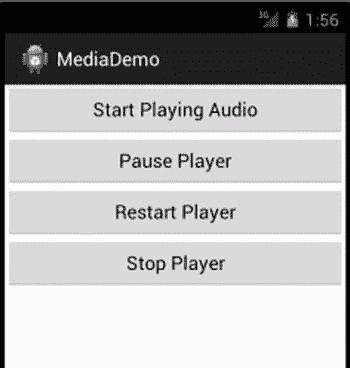
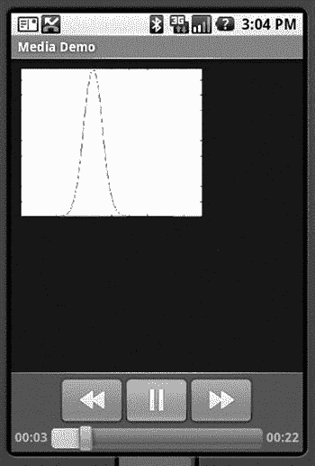

第章第二十章

了解媒体框架

现在我们将探索 Android SDK 的一个非常有趣的部分:媒体框架。我们将向您展示如何播放各种来源的音频和视频。我们还将在在线伴侣部分介绍如何用相机拍照以及录制音频和视频。

使用媒体 API

Android 支持播放 android.media 包下的音视频内容。在这一章中，我们将从这个包中探索媒体 API。

android.media 包的核心是 T2 Android . media . media player 类 T4。MediaPlayer 类负责播放音频和视频内容。本课程的内容可以来自以下来源:

*   *Web* :您可以通过 URL 播放来自 Web 的内容。
*   *。* apk *文件*:你可以播放打包成你一部分的内容。apk 文件。您可以将媒体内容打包为资源或资产(在资产文件夹中)。
*   Android KitKat 4.4 新增的*存储访问框架*，它提供了对存储在一系列提供商和互联网服务中的媒体文件的访问。
*   *SD 卡*:您可以播放设备 SD 卡或模拟本地存储器上的内容。

MediaPlayer 能够解码多种不同的内容格式，包括第三代合作伙伴计划(3GPP、 .3gp )、MP3 ( .mp3 )、MIDI ( )。mid 等)、Ogg Vorbis ( )。ogg 、PCM/WAVE ( )。wav )，以及 MPEG-4 ( .mp4 )。RTSP、HTTP/HTTPS 直播和 M3U 播放列表也受支持，尽管包含 URL 的播放列表不受支持，至少在撰写本文时是如此。有关支持的媒体格式的完整列表，请访问[http://developer . Android . com/guide/appendix/media-formats . html](http://developer.android.com/guide/appendix/media-formats.html)。

SD 卡何去何从？

在我们深入媒体框架的核心之前，我们应该快速解决可移动存储的话题，尤其是 SD 卡。Android 设备的最新趋势是，一些制造商将它们从设备中删除，而其他制造商则继续包含它们。谷歌自己通过混淆 Android 中的底层文件系统，模糊了什么是移动存储，什么不是移动存储的界限。

不管你作为开发者的个人偏好如何，你的一些用户可能仍然拥有支持 SD 卡的设备，并且想要使用它们。我们将在这里讨论的许多例子同样适用于从 SD 卡获取媒体文件。然而，为了节省空间，并避免不必要的重复，我们在本书的网站上放置了一些额外的例子，这些例子涉及 SD 卡的细节和支持材料。一定要在[www.androidbook.com](http://www.androidbook.com)检查一下。

播放媒体

首先，我们将向你展示如何构建一个简单的应用程序来播放网络上的 MP3 文件(见[图 20-1](#Fig1) )。之后，我们将讨论如何使用 MediaPlayer 类的 setDataSource() 方法来播放来自的内容。apk 文件。 MediaPlayer 并不是播放音频的唯一方式，因此我们还将介绍 SoundPool 类，以及 JetPlayer 、 AsyncPlayer ，以及用于处理音频的最低级别的 AudioTrack 类。之后，我们将讨论 MediaPlayer 类的一些不足之处。最后，我们将了解如何播放视频内容。

播放音频内容

图 20-1 显示了我们第一个例子的用户界面。这个应用程序将演示 MediaPlayer 类的一些基本用法，比如启动、暂停、重启和停止媒体文件。查看应用程序用户界面的布局。



[图 20-1](#_Fig1) 。媒体应用的用户界面

用户界面由一个带有四个按钮的 RelativeLayout 组成:一个启动播放器，一个暂停播放器，一个重启播放器，一个停止播放器。我们本可以使这变得简单，只需将我们的例子与做同样事情的媒体控制器小部件结合起来，但是我们想向您展示自己控制事物的内部工作原理。应用程序的代码和布局文件如[清单 20-1](#list1) 所示。对于这个示例，我们将假设您正在构建 Android 2.2 或更高版本，因为我们使用了环境类的getexternalsragepublicdirectory()方法。如果你想在一个旧版本的 Android 上构建它，只需使用getExternalStorageDirectory()并调整你放置媒体文件的位置，这样你的应用程序就能找到它们。

**注意**参见本章末尾的“参考”部分，从中可以直接将这些项目导入 Eclipse，而不是复制和粘贴代码。

[***清单 20-1***](#_list1) 。媒体应用程序的布局和代码

```java
<RelativeLayout xmlns:android="[http://schemas.android.com/apk/res/android](http://schemas.android.com/apk/res/android)"
    xmlns:tools="http://schemas.android.com/tools"
    android:layout_width="match_parent"
    android:layout_height="match_parent"
    tools:context=".MainActivity"
    android:orientation="vertical" >

  <Button android:id="@+id/startPlayerBtn"
    android:layout_width="match_parent"
    android:layout_height="wrap_content"
    android:text="Start Playing Audio"
    android:onClick="doClick" />

  <Button android:id="@+id/pausePlayerBtn"
    android:layout_width="match_parent"
    android:layout_height="wrap_content"
    android:text="Pause Player"
    android:layout_below="@+id/startPlayerBtn"
    android:onClick="doClick" />

  <Button android:id="@+id/restartPlayerBtn"
    android:layout_width="match_parent"
    android:layout_height="wrap_content"
    android:text="Restart Player"
    android:layout_below="@+id/pausePlayerBtn"
    android:onClick="doClick" />

  <Button android:id="@+id/stopPlayerBtn"
    android:layout_width="match_parent"
    android:layout_height="wrap_content"
    android:text="Stop Player"
    android:layout_below="@+id/restartPlayerBtn"
    android:onClick="doClick" />

</RelativeLayout>

// This file is MainActivity.java
import android.app.Activity;
import android.content.res.AssetFileDescriptor;
import android.media.AudioManager;
import android.media.MediaPlayer;
import android.media.MediaPlayer.OnPreparedListener;
import android.os.Bundle;
import android.os.Environment;
import android.util.Log;
import android.view.View;

public class MainActivity extends Activity implements OnPreparedListener
{
    static final String AUDIO_PATH =
     "[http://www.androidbook.com/akc/filestorage/android/documentfiles/3389/play.mp3](http://www.androidbook.com/akc/filestorage/android/documentfiles/3389/play.mp3)";

    private MediaPlayer mediaPlayer;
    private int playbackPosition=0;

    /** Called when the activity is first created. */
    @Override
    public void onCreate(Bundle savedInstanceState) {
        super.onCreate(savedInstanceState);
        setContentView(R.layout.main);
    }

    public void doClick(View view) {
        switch(view.getId()) {
        case R.id.startPlayerBtn:
            try {
            // Only have one of these play methods uncommented
                playAudio(AUDIO_PATH);
//              playLocalAudio();
//              playLocalAudio_UsingDescriptor();
            } catch (Exception e) {
                e.printStackTrace();
            }
            break;
        case R.id.pausePlayerBtn:
            if(mediaPlayer != null && mediaPlayer.isPlaying()) {
                playbackPosition = mediaPlayer.getCurrentPosition();
                mediaPlayer.pause();
            }
            break;
        case R.id.restartPlayerBtn:
            if(mediaPlayer != null && !mediaPlayer.isPlaying()) {
                mediaPlayer.seekTo(playbackPosition);
                mediaPlayer.start();
            }
            break;
        case R.id.stopPlayerBtn:
            if(mediaPlayer != null) {
                mediaPlayer.stop();
                playbackPosition = 0;
            }
            break;
        }
    }

    private void playAudio(String url) throws Exception
    {
        killMediaPlayer();

        mediaPlayer = new MediaPlayer();
        mediaPlayer.setAudioStreamType(AudioManager.STREAM_MUSIC);
        mediaPlayer.setDataSource(url);
        mediaPlayer.setOnPreparedListener(this);
        mediaPlayer.prepareAsync();
    }

    private void playLocalAudio() throws Exception
    {
        mediaPlayer = MediaPlayer.create(this, R.raw.music_file);
        mediaPlayer.setAudioStreamType(AudioManager.STREAM_MUSIC);
        // calling prepare() is not required in this case
        mediaPlayer.start();
    }

    private void playLocalAudio_UsingDescriptor() throws Exception {

        AssetFileDescriptor fileDesc = getResources().openRawResourceFd(
                    R.raw.music_file);
        if (fileDesc != null) {

            mediaPlayer = new MediaPlayer();
            mediaPlayer.setAudioStreamType(AudioManager.STREAM_MUSIC);
            mediaPlayer.setDataSource(fileDesc.getFileDescriptor(),
                    fileDesc.getStartOffset(), fileDesc.getLength());

            fileDesc.close();

            mediaPlayer.prepare();
            mediaPlayer.start();
        }
    }

    // This is called when the MediaPlayer is ready to start
    public void onPrepared(MediaPlayer mp) {
        mp.start();
    }

    @Override
    protected void onDestroy() {
        super.onDestroy();
        killMediaPlayer();
    }

    private void killMediaPlayer() {
        if(mediaPlayer!=null) {
            try {
                mediaPlayer.release();
            }
            catch(Exception e) {
                e.printStackTrace();
            }
        }
    }
}
```

在第一个场景中，您正在从一个网址播放 MP3 文件。因此，您需要将Android . permission . internet添加到您的清单文件中。[清单 20-1](#list1) 显示了 MainActivity 类包含三个成员:一个指向 MP3 文件 URL 的 final 字符串，一个 MediaPlayer 实例，以及一个名为 playbackPosition 的整数成员。我们的 onCreate() 方法只是从我们的布局 XML 文件中设置用户界面。在按钮点击处理程序中，当按下开始播放音频按钮时，调用 playAudio() 方法。在 playAudio() 方法中，创建了一个 MediaPlayer 的新实例，播放器的数据源设置为 MP3 文件的 URL。

然后调用播放器的 prepareAsync() 方法来准备 MediaPlayer 进行播放。我们在活动的主 UI 线程中，所以我们不想花太多时间来准备 MediaPlayer。在 MediaPlayer 上有一个 prepare() 方法，但是在准备完成之前它会阻塞。如果这需要很长时间，或者如果服务器需要一段时间来响应，用户可能会认为应用程序卡住了，或者更糟，得到一个错误消息。像进度对话框这样的东西可以帮助你的用户理解正在发生的事情。 prepareAsync() 方法立即返回，但是设置一个后台线程来处理 MediaPlayer 的 prepare() 方法。当准备完成时，我们的活动的 onPrepared() 回调被调用。这是我们最终开始播放媒体播放器的地方。我们必须告诉 MediaPlayer 谁是 onPrepared() 回调的侦听器，这就是为什么我们在调用 prepareAsync() 之前调用setOnPreparedListener()。您不必将当前活动用作侦听器；我们在这里这样做是因为这对于本演示来说更简单。

现在看看暂停播放器和重启播放器按钮的代码。可以看到当暂停播放器按钮被选中时，通过调用 getCurrentPosition() 得到播放器的当前位置。然后通过调用 pause() 来暂停播放器。当播放器必须重启时，调用 seekTo() ，传入之前从 getCurrentPosition() 获得的位置，然后调用 start() 。

MediaPlayer 类还包含一个 stop() 方法。注意，如果您通过调用 stop() 来停止播放器，您需要在再次调用 start() 之前再次准备 MediaPlayer 。反过来，如果调用 pause() ，可以不用准备播放器，再次调用 start() 。此外，在使用完媒体播放器后，一定要调用它的 release() 方法。在本例中，您将此作为 killMediaPlayer() 方法的一部分。

在示例应用程序源代码中有第二个 URL 用于音频源，但它不是 MP3 文件，而是一个流音频提要(Radio-Mozart)。这也适用于 MediaPlayer，并再次显示了为什么您需要调用 prepareAsync() 而不是 prepare() 。准备用于回放的音频流可能需要一段时间，具体取决于服务器、网络流量等。

清单 20-1 展示了如何播放网络上的音频文件。 MediaPlayer 类也支持播放你的本地的媒体。apk 文件。[清单 20-2](#list2) 展示了如何从的 /res/raw 文件夹中引用并回放一个文件。apk 文件。继续添加 raw 文件夹到 /res 下，如果 Eclipse 项目中还没有的话。然后，将您选择的 MP3 文件复制到 /res/raw 中，文件名为 music_file.mp3 。还要注意原始代码中的注释，取消对 playLocalAudio() 的调用的注释，并注释掉 playAudio()。

***[清单 20-2](#_list2) 。*** 使用 MediaPlayer 播放应用程序本地文件

```java
private void playLocalAudio()throws Exception
{
    mediaPlayer = MediaPlayer.create(this, R.raw.music_file);
    mediaPlayer.setAudioStreamType(AudioManager.STREAM_MUSIC);        // calling prepare() is not required in this case
    mediaPlayer.start();
}
```

如果您需要在应用程序中包含音频或视频文件，您应该将该文件放在 /res/raw 文件夹中。然后，您可以通过传入媒体文件的资源 ID 来获得资源的 MediaPlayer 实例。你可以通过调用静态的 create() 方法来实现，如[清单 20-2](#list2) 所示。请注意， MediaPlayer 类提供了一些其他静态的 create() 方法，您可以使用这些方法来获取 MediaPlayer 而不是自己实例化一个。在[清单 20-2](#list2) 中， create() 方法相当于调用构造函数 MediaPlayer(Context context，int resourceId) 后跟调用 prepare() 。只有当媒体源位于设备本地时，才应该使用 create() 方法，因为它总是使用 prepare() 而不是 prepareAsync() 。

了解 setDataSource 方法

在[清单 20-2](#list2) 中，我们调用了 create() 方法从原始资源加载音频文件。使用这种方法，您不需要调用 setDataSource() 。或者，如果您使用默认构造函数自己实例化了 MediaPlayer ，或者如果您的媒体内容不能通过资源 ID 或 URI 访问，您将需要调用 setDataSource() 。

setDataSource() 方法有重载版本，您可以根据自己的特定需求定制数据源。例如，[清单 20-3](#list3) 展示了如何使用 FileDescriptor 从原始资源中加载一个音频文件。

***[清单 20-3](#_list3) 。*** 使用文件描述符设置媒体播放器的数据源

```java
private void playLocalAudio_UsingDescriptor() throws Exception {
    AssetFileDescriptor fileDesc = getResources().openRawResourceFd(
            R.raw.music_file);
    if (fileDesc != null) {

        mediaPlayer = new MediaPlayer();
        mediaPlayer.setAudioStreamType(AudioManager.STREAM_MUSIC);
        mediaPlayer.setDataSource(fileDesc.getFileDescriptor(),
                fileDesc.getStartOffset(), fileDesc.getLength());

        fileDesc.close();

        mediaPlayer.prepare();
        mediaPlayer.start();
    }
}
```

清单 20-3 假设它在一个活动的上下文中。如图所示，调用 getResources() 方法获取应用程序的资源，然后使用 openRawResourceFd() 方法获取 /res/raw 文件夹中音频文件的文件描述符。然后使用 AssetFileDescriptor 调用 setDataSource() 方法，开始回放的起始位置和结束位置。如果您想回放音频文件的特定部分，也可以使用这个版本的 setDataSource() 。如果总是想播放整个文件，可以调用更简单的版本set data source(file descriptor desc)，不需要初始偏移量和长度。

在这种情况下，我们选择使用 prepare() 后跟 start() ，只是为了向您展示它可能的样子。我们应该能够逃脱，因为音频资源是本地的，但像以前一样使用 prepareAsync() 也无妨。

我们还有一个音频内容的来源可以谈论:SD 卡。有关处理 SD 卡及其文件系统内容的基础知识，请参考在线指南章节。在我们的例子中，我们使用 setDataSource() 通过传入一个 MP3 文件的 URL 来访问互联网上的内容。如果你在 SD 卡上有一个音频文件，你可以使用同样的 setDataSource() 方法，但是把你在 SD 卡上的音频文件的路径传给它。例如，音乐目录中名为 music_file.mp3 的文件可以用 AUDIO_PATH 变量来播放，如下所示:

```java
static final String AUDIO_PATH =
Environment.getExternalStoragePublicDirectory(
    Environment.DIRECTORY_MUSIC) +
    "/music_file.mp3";
```

您可能已经注意到，在我们的示例中，我们没有实现 onResume() 和 onPause() 。这意味着当我们的活动进入后台时，它会继续播放音频——至少，直到活动被终止，或者直到对音频源的访问被关闭。例如，如果我们不持有唤醒锁，CPU 可能会关闭，从而结束音乐的播放。许多人选择在服务中管理媒体播放来帮助解决这些问题。在我们当前的例子中，其他问题包括 MediaPlayer 是否正在通过 Wi-Fi 播放音频流，如果我们的活动没有锁定 Wi-Fi，Wi-Fi 可能会被关闭，我们将失去与该流的连接。 MediaPlayer 有一个名为 setWakeMode() 的方法，它允许我们设置一个 PARTIAL_WAKE_LOCK 来在播放时保持 CPU 活动。然而，为了锁定 Wi-Fi，我们需要分别通过 WifiManager 和 WifiManager 来实现。WifiLock 。

继续在后台播放音频的另一个方面是，我们需要知道什么时候不应该这样做，可能是因为有来电，或者是因为闹钟响了。Android 有一个 AudioManager 来帮助解决这个问题。调用的方法有 requestAudioFocus() 和 abandonAudioFocus() ，在接口 AudioManager 中有一个回调方法叫做 onAudioFocusChange() 。OnAudioFocusChangeListener 。有关更多信息，请参见 Android 开发人员指南中的媒体页面。

使用 SoundPool 进行同步音轨播放

MediaPlayer 是我们媒体工具箱中的一个重要工具，但它一次只能处理一个音频或视频文件。如果我们想同时播放多个音轨呢？一种方法是创建多个媒体播放器并同时使用它们。如果你只有少量的音频要播放，并且你想要快速的性能，Android 有 SoundPool 类来帮助你。在幕后， SoundPool 使用 MediaPlayer ，但是我们无法访问 MediaPlayer API，只能访问 SoundPool API。

MediaPlayer 和 SoundPool 的另一个区别是 SoundPool 被设计成只处理本地媒体文件。也就是说，您可以从资源文件、使用文件描述符的其他文件或使用路径名的文件载入音频。 SoundPool 还提供了其他几个不错的功能，比如循环播放音轨、暂停和恢复单个音轨，或者暂停和恢复所有音轨。

然而， SoundPool 也有一些缺点。对于所有的音轨， SoundPool 在内存中有一个总的音频缓冲区，只有 1MB。当您查看只有几千字节大小的 MP3 文件时，这可能看起来很大。但是 SoundPool 扩展了内存中的音频，使播放变得快速简单。内存中音频文件的大小取决于比特率、声道数(立体声与单声道)、采样速率和音频长度。如果你无法将声音加载到 SoundPool 中，你可以尝试使用源音频文件的这些参数来使音频在内存中变小。

我们的示例应用程序将加载并播放动物的声音。其中一种声音是蟋蟀的叫声，它不断地在背景中播放。其他声音以不同的时间间隔播放。有时候你听到的只有蟋蟀的叫声；其他时候，你会同时听到几种动物的声音。我们还将在用户界面中放置一个按钮，允许暂停和恢复。清单 20-4 显示了我们的布局 XML 文件和活动的 Java 代码。你最好的办法是从我们的网站上下载，以便获得声音文件和代码。有关如何找到可下载源代码的信息，请参见本章末尾的“参考”部分。

***[清单 20-4](#_list4) 。*** 用 SoundPool 播放音频

```java
<?xml version="1.0" encoding="utf-8"?>
<LinearLayout xmlns:android="[http://schemas.android.com/apk/res/android](http://schemas.android.com/apk/res/android)"
    android:orientation="vertical"
    android:layout_width="fill_parent"  android:layout_height="fill_parent"
    >
<ToggleButton android:id="@+id/button"
    android:textOn="Pause"  android:textOff="Resume"
    android:layout_width="wrap_content"  android:layout_height="wrap_content"
    android:onClick="doClick" android:checked="true" />
</LinearLayout>

// This file is MainActivity.java
import java.io.IOException;
import android.app.Activity;
import android.content.Context;
import android.content.res.AssetFileDescriptor;
import android.media.AudioManager;
import android.media.SoundPool;
import android.os.Bundle;
import android.os.Handler;
import android.util.Log;
import android.view.View;
import android.widget.ToggleButton;

public class MainActivity extends Activity implements SoundPool.OnLoadCompleteListener {
    private static final int SRC_QUALITY = 0;
    private static final int PRIORITY = 1;
    private SoundPool soundPool = null;
    private AudioManager aMgr;

    private int sid_background;
    private int sid_roar;
    private int sid_bark;
    private int sid_chimp;
    private int sid_rooster;

    @Override
    public void onCreate(Bundle savedInstanceState) {
        super.onCreate(savedInstanceState);
        setContentView(R.layout.main);
    }

    @Override
    protected void onResume() {
        soundPool = new SoundPool(5, AudioManager.STREAM_MUSIC,
                SRC_QUALITY);
        soundPool.setOnLoadCompleteListener(this);

        aMgr =
            (AudioManager)this.getSystemService(Context.AUDIO_SERVICE);

        sid_background = soundPool.load(this, R.raw.crickets, PRIORITY);

        sid_chimp = soundPool.load(this, R.raw.chimp, PRIORITY);
        sid_rooster = soundPool.load(this, R.raw.rooster, PRIORITY);
        sid_roar = soundPool.load(this, R.raw.roar, PRIORITY);

        try {
            AssetFileDescriptor afd =
                    this.getAssets().openFd("dogbark.mp3");
            sid_bark = soundPool.load(afd.getFileDescriptor(),
                                0, afd.getLength(), PRIORITY);
            afd.close();
        } catch (IOException e) {
            e.printStackTrace();
        }
        //sid_bark = soundPool.load("/mnt/sdcard/dogbark.mp3", PRIORITY);

        super.onResume();
    }

    public void doClick(View view) {
        switch(view.getId()) {
        case R.id.button:
            if(((ToggleButton)view).isChecked()) {
                soundPool.autoResume();
            }
            else {
                soundPool.autoPause();
            }
            break;
        }
    }

    @Override
    protected void onPause() {
        soundPool.release();
        soundPool = null;
        super.onPause();
    }

    @Override
    public void onLoadComplete(SoundPool sPool, int sid, int status) {
        Log.v("soundPool", "sid " + sid + " loaded with status " +
                status);

        final float currentVolume =
            ((float)aMgr.getStreamVolume(AudioManager.STREAM_MUSIC)) /
            ((float)aMgr.getStreamMaxVolume(AudioManager.STREAM_MUSIC));

        if(status != 0)
            return;
        if(sid == sid_background) {
            if(sPool.play(sid, currentVolume, currentVolume,
                    PRIORITY, -1, 1.0f) == 0)
                Log.v("soundPool", "Failed to start sound");
        } else if(sid == sid_chimp) {
            queueSound(sid, 5000, currentVolume);
        } else if(sid == sid_rooster) {
            queueSound(sid, 6000, currentVolume);
        } else if(sid == sid_roar) {
            queueSound(sid, 12000, currentVolume);
        } else if(sid == sid_bark) {
            queueSound(sid, 7000, currentVolume);
        }
    }

    private void queueSound(final int sid, final long delay,
        final float volume)
    {
        new Handler().postDelayed(new Runnable() {
            @Override
            public void run() {
                if(soundPool == null) return;
                if(soundPool.play(sid, volume, volume,
                        PRIORITY, 0, 1.0f) == 0)
                    Log.v("soundPool", "Failed to start sound (" + sid +
                          ")");
                queueSound(sid, delay, volume);
            }}, delay);
    }
}
```

这个例子的结构相当简单。我们有一个用户界面，上面只有一个切换按钮。我们将用它来暂停和恢复活动的音频流。当我们的应用程序启动时，我们创建我们的音池，并加载音频样本。当样本被正确加载后，我们开始播放它们。蟋蟀的声音无休止地循环播放；其他样本在延迟后播放，然后在相同的延迟后将自己设置为再次播放。通过选择不同的延迟，我们可以在声音上获得一种随机的效果。

创建一个声音池需要三个参数:

*   第一个是 SoundPool 将同时播放的最大样本数。这不是音池能容纳的样本数量。
*   第二个参数是样本将在哪个音频流上播放。典型值是 AudioManager。STREAM_MUSIC ，但是 SoundPool 可以用于闹铃或者铃声。请参见 AudioManager 参考页，了解完整的音频流列表。
*   在创建音池时 SRC_QUALITY 值应该设置为 0。

代码演示了 SoundPool 的几种不同的 load() 方法。最基本的是从 /res/raw 加载一个音频文件作为资源。我们对前四个音频文件使用这种方法。然后我们展示如何从应用程序的 /assets 目录中加载一个音频文件。这个 load() 方法还接受指定要加载的音频的偏移量和长度的参数。这将允许我们使用一个包含多个音频样本的文件，从中提取出我们想要使用的内容。最后，我们在注释中展示了如何从 SD 卡中访问音频文件。一直到 Android 4.0，优先级参数应该只是 1。

对于我们的例子，我们选择使用 Android 2.2 中引入的一些特性，特别是我们活动的 onLoadCompleteListener 接口，以及按钮回调中的 autoPause() 和 autoResume() 方法。

当将声音样本加载到 SoundPool 中时，我们必须等到它们被正确加载后才能开始播放它们。在我们的 onLoadComplete() 回调中，我们检查加载的状态，然后根据它是哪种声音，我们设置它进行播放。如果是蟋蟀的声音，我们会打开循环播放(第五个参数的值为 -1 )。对于其他人，我们会在一段时间后播放声音。时间值以毫秒为单位。注意音量的设置。Android 提供了 AudioManager 让我们知道当前的音量设置。我们还从 AudioManager 获得最大音量设置，因此我们可以计算出介于 0 和 1 之间的 play() 的音量值(作为一个浮点数)。 play() 方法实际上为左右声道取一个单独的音量值，但我们只是将两者都设置为当前音量。同样，优先级应该设置为 1。 play() 方法的最后一个参数用于设置回放速率。该值应介于 0.5 和 2.0 之间，1.0 为正常值。

我们的 queueSound() 方法使用一个处理程序来基本上建立一个未来的事件。我们的 Runnable 将在延迟期过去后运行。我们检查以确保我们仍然有一个 SoundPool 可以播放，然后我们播放一次声音，并安排相同的声音在与之前相同的时间间隔后再次播放。因为我们用不同的声音 id 和不同的延迟来调用 queueSound() ，所以效果有点像动物声音的随机播放。

当您运行这个示例时，您将听到蟋蟀、黑猩猩、公鸡、狗和吼声(我们认为是熊)。当其他动物来来去去的时候，蟋蟀在不停地鸣叫。关于 SoundPool 的一个好处是它让我们可以同时播放多种声音，而不需要我们做任何实际的工作。此外，我们不会让设备负担太重，因为声音是在加载时解码的，我们只需要将声音比特馈送给硬件。

如果您点按该按钮，蟋蟀会停止鸣叫，当前播放的任何其他动物声音也会停止。然而， autoPause() 方法并不能阻止新声音的播放。你会在几秒钟内再次听到动物的声音(除了蟋蟀的叫声)。因为我们已经把声音排到了未来，我们仍然会听到那些声音。事实上， SoundPool 没有办法阻止现在和未来的所有声音。你需要自己停下来。只有我们再次点击按钮恢复声音，蟋蟀才会回来。但即使这样，我们也可能会失去蟋蟀，因为如果达到同时播放样本的最大数量，SoundPool 将丢弃最老的声音，为新的声音腾出空间。

使用 JetPlayer 播放声音

SoundPool 是一款不错的播放器，但内存限制可能会让它难以完成工作。当你需要播放同步声音时，另一个选择是 JetPlayer 。为游戏定制的 JetPlayer 是一个非常灵活的工具，可以播放大量的声音，并协调这些声音与用户动作。使用乐器数字接口(MIDI) 定义声音。

JetPlayer 的声音是用一种特殊的 JETCreator 工具制作的。这个工具是在 Android SDK 工具目录下提供的，尽管你也需要安装 Python 才能使用它，而且它仅限于 Mac OSX 和 Windows SDK 包。生成的 JET 文件可以读入您的应用程序，并设置声音进行播放。整个过程有些复杂，超出了本书的范围，所以我们将在本章末尾的“参考资料”部分为您提供更多信息。

用异步播放器播放背景声音

如果你想要的只是播放一些音频，并且不想占用当前线程，那么 AsyncPlayer 可能就是你要找的。音频源作为 URI 传递给该类，因此音频文件可以是本地的，也可以是网络上的远程文件。这个类自动创建一个后台线程来处理获取音频和开始播放。因为是异步的，所以你不会确切知道音频什么时候开始。你也不知道它什么时候结束，甚至不知道它是否还在播放。但是，您可以调用 stop() 来停止播放音频。如果您在之前的音频播放完毕之前再次调用 play() ，之前的音频将立即停止，新的音频将在未来的某个时间开始播放，此时一切都已设置好并已获取。这是一个非常简单的类，提供了一个自动后台线程。清单 20-5 显示了你的代码应该如何实现这一点。

***[清单 20-5](#_list5) 。*T5 用 AsyncPlayer 播放音频**

```java
private static final String TAG = "AsyncPlayerDemo";
private AsyncPlayer mAsync = null;

[ ... ]

    mAsync = new AsyncPlayer(TAG);
    mAsync.play(this, Uri.parse("file://” + “/perry_ringtone.mp3"),
            false, AudioManager.STREAM_MUSIC);

[ ... ]

@Override
protected void onPause() {
    mAsync.stop();
    super.onPause();
}
```

使用 AudioTrack 的低级音频回放

到目前为止，我们一直在处理来自文件的音频，无论是本地文件还是远程文件。如果您想深入到一个较低的层次，也许是从一个流中播放音频，您需要研究一下 AudioTrack 类。除了像 play() 和 pause() ， AudioTrack 这样的常用方法，还提供了向音频硬件写入字节的方法。这个类给了你对音频回放的最大控制权，但是它比本章到目前为止讨论的音频类要复杂得多。我们的一个在线伙伴示例应用程序使用了 AudioRecord 类。 AudioRecord 类与 AudioTrack 类非常相似，因此为了更好地理解 AudioTrack 类，请参考后面的 AudioRecord 示例。

关于 MediaPlayer 的更多信息

一般来说，MediaPlayer 是非常系统化的，所以您需要以特定的顺序调用操作来正确地初始化 MediaPlayer 并为播放做准备。下面的列表总结了使用媒体 API 时应该知道的一些其他细节:

*   一旦设置了 MediaPlayer 的数据源，就不能轻易将其更改为另一个——您必须创建一个新的 MediaPlayer 或调用 reset() 方法来重新初始化播放器的状态。
*   调用 prepare() 后，可以调用 getCurrentPosition() 、 getDuration() 、 isPlaying() 来获取玩家的当前状态。也可以在调用 prepare() 后调用 setLooping() 和 setVolume() 方法。如果您使用了 prepareAsync() ，那么您应该等到 onPrepared() 被调用后再使用任何其他方法。
*   调用 start() 后，可以调用 pause() 、 stop() 、 seekTo() 。
*   你创建的每一个媒体播放器都会使用大量的资源，所以当你使用完媒体播放器时，一定要调用 release() 方法。在视频播放的情况下， VideoView 会处理这一点，但是如果你决定使用 MediaPlayer 而不是 VideoView ，你就必须手动处理。在接下来的章节中会有更多关于 VideoView 的内容。
*   MediaPlayer 与几个监听器配合使用，您可以使用它们对用户体验进行额外的控制，包括 OnCompletionListener 、 OnErrorListener 和 OnInfoListener 。例如，如果您正在管理一个音频播放列表，当一个片段完成时，将调用 OnCompletionListener ，以便您可以将下一个片段排队。

我们关于播放音频内容的讨论到此结束。现在我们将注意力转向播放视频。正如您将看到的，引用视频内容类似于引用音频内容。

播放视频内容

在本节中，我们将讨论使用 Android SDK 播放视频。具体来说，我们将讨论从 web 服务器播放视频和从 SD 卡播放视频。可以想象，视频回放比音频回放要复杂一些。幸运的是，Android SDK 提供了一些额外的抽象来完成大部分繁重的工作。

**注意**在模拟器中回放视频不是很可靠。如果成功了，那太好了。但是如果不能，试着在一个设备上运行。因为模拟器必须只使用软件来运行视频，所以它可能很难跟上视频，并且您可能会得到意想不到的结果。

播放视频比播放音频需要更多的努力，因为除了音频之外，还有一个视觉组件要处理。为了消除一些痛苦，Android 提供了一个名为 android.widget.VideoView 的专门视图控件，它封装了 MediaPlayer 的创建和初始化。要播放视频，您需要在用户界面中创建一个 VideoView 小部件。然后设置视频的路径或 URI，并触发 start() 方法。[清单 20-6](#list6) 演示了 Android 中的视频播放。

***[清单 20-6](#_list6) 。*** 使用媒体 API 播放视频

```java
<?xml version="1.0" encoding="utf-8"?>
<!-- This file is /res/layout/main.xml -->
<LinearLayout
 android:layout_width="fill_parent" android:layout_height="fill_parent"
 xmlns:android="[http://schemas.android.com/apk/res/android](http://schemas.android.com/apk/res/android)">

    <VideoView  android:id="@+id/videoView"
        android:layout_width="200px"  android:layout_height="200px" />

</LinearLayout>

// This file is MainActivity.java
import android.app.Activity;
import android.net.Uri;
import android.os.Bundle;
import android.widget.MediaController;
import android.widget.VideoView;

public class MainActivity extends Activity {
    /** Called when the activity is first created. */
    @Override
    protected void onCreate(Bundle savedInstanceState) {
        super.onCreate(savedInstanceState);
        this.setContentView(R.layout.main);

        VideoView videoView =
               (VideoView)this.findViewById(R.id.videoView);
        MediaController mc = new MediaController(this);
        videoView.setMediaController(mc);
        videoView.setVideoURI(Uri.parse(
              "[http://www.androidbook.com/akc/filestorage/android/](http://www.androidbook.com/akc/filestorage/android/)" +
               "documentfiles/3389/movie.mp4"));
 /* videoView.setVideoPath(
    Environment.getExternalStoragePublicDirectory(
    Environment.DIRECTORY_MOVIES) +
    "/movie.mp4");
 */
        videoView.requestFocus();
        videoView.start();
    }
}
```

[清单 20-6](#list6) 演示了位于[www . Android book . com/AKC/filestorage/Android/document files/3389/movie . MP4](http://www.androidbook.com/akc/filestorage/android/documentfiles/3389/movie.mp4)的文件的视频回放，这意味着运行代码的应用程序需要请求Android . permission . internet权限。所有回放功能都隐藏在 VideoView 类之后。事实上，你所要做的就是将视频内容传送给视频播放器。应用程序的用户界面如图 20-2 所示。



[图 20-2](#_Fig2) 。启用了媒体控制的视频播放 UI

当这个应用程序运行时，您会在屏幕底部看到按钮控件大约三秒钟，然后它们会消失。您可以通过单击视频帧中的任意位置来找回它们。当我们回放音频内容时，我们只需要显示按钮控件来开始、暂停和重启音频。我们不需要音频本身的视图组件。当然，对于视频，我们需要按钮控件以及观看视频的东西。对于这个例子，我们使用一个 VideoView 组件来显示视频内容。但是我们没有创建自己的按钮控件(如果我们愿意，我们仍然可以这样做)，而是创建了一个媒体控制器来为我们提供按钮。如[图 20-2](#Fig2) 和[清单 20-6](#list6) 所示，您可以通过调用 setMediaController() 来设置 VideoView 的媒体控制器，以启用播放、暂停和查找控件。如果您想用自己的按钮以编程方式操作视频，可以调用 start() 、 pause() 、 stopPlayback() 和 seekTo() 方法。

请记住，在这个例子中，我们仍然使用了一个media player——只是我们没有看到它。事实上，你可以直接在 MediaPlayer 中“播放”视频。如果你回到[清单 20-1](#list1) 中的例子，在你的 SD 卡上放一个电影文件，并在 AUDIO_PATH 中插入电影的文件路径，你会发现即使你看不到视频，它也能很好地播放音频。

鉴于 MediaPlayer 有一个 setDataSource() 方法， VideoView 没有。 VideoView 改为使用 setVideoPath() 或 setVideoURI() 方法。假设您将一个电影文件放在您的 SD 卡上，您修改清单 20-6 中的代码，注释掉 setVideoURI() 调用，取消注释 setVideoPath() 调用，根据需要调整电影文件的路径。当您再次运行该应用程序时，您将在视频视图中听到*并看到*视频。从技术上讲，我们可以用下面的代码调用 setVideoURI() 来获得与 setVideoPath() 相同的效果:

```java
videoView.setVideoURI(Uri.parse("file://" +
    Environment.getExternalStoragePublicDirectory(
    Environment.DIRECTORY_MOVIES) + "/movie.mp4"));
```

你可能已经注意到 VideoView 没有像 MediaPlayer 那样从文件描述符中读取数据的方法。你可能也注意到了 MediaPlayer 有几个方法可以将 SurfaceHolder 添加到 MediaPlayer (一个 SurfaceHolder 就像一个图像或视频的视窗)。 MediaPlayer 方法之一是 create(Context context，Uri uri，surface holder)，另一个是set display(surface holder)。

关于录音和高级媒体的额外在线章节

现在，您已经掌握了媒体播放的许多方面，包括在应用程序中构建自己的音频和视频功能的各种方法，还有一些领域可以探索，这些领域本身几乎就是一本书的内容。因此，我们将它们放在另一个在线奖金章节中，探讨以下内容:

*   用 MediaRecorder 、 AudioRecord 等技术录音
*   从头开始录像
*   用于视频录制的相机和摄像机配置文件
*   使用 intents 和 MediaStore 类让其他应用程序帮你完成所有的录制工作！

看一下音频和视频记录奖励章节的在线材料。

参考

以下是一些对您可能希望进一步探索的主题有帮助的参考:

*   :与本书相关的可下载项目列表。对于本章中的项目，寻找一个名为proandroid 5 _ Ch20 _ media . zip的 zip 文件。这个 zip 文件包含本章中的所有项目，列在单独的根目录中。还有一个自述。TXT 文件，它准确地描述了如何从这些 zip 文件之一将项目导入 Eclipse。
*   [http://developer . Android . com/guide/topics/media/jet/jet creator _ manual . html](http://developer.android.com/guide/topics/media/jet/jetcreator_manual.html):jet creator 工具的用户手册。您可以使用它来创建一个 JET 声音文件，以便使用 JetPlayer 播放。JETCreator 仅适用于 Windows 和 Mac OS。要查看实际运行的 JetPlayer，请将 JetBoy 示例项目从 Android SDK 加载到 Eclipse 中，构建并运行它。请注意，发射按钮是中间的方向键。

摘要

以下是本媒体章节中关于音频和视频的主题摘要:

*   通过媒体播放器播放音频
*   为 MediaPlayer 提供音频的几种方式，从本地应用程序资源到文件，再到网络流
*   使用 MediaPlayer 正确播放音频的步骤
*   SoundPool 及其同时播放多种声音的能力
*   SoundPool 在处理音频量方面的限制
*   AsyncPlayer 非常有用，因为声音通常需要在后台处理
*   AudioTrack ，使用 VideoView 提供对音频播放视频的低级访问