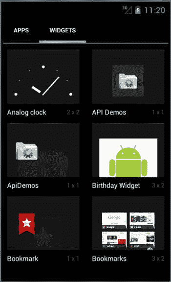
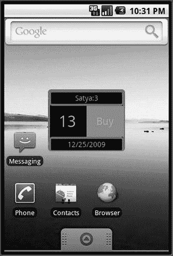
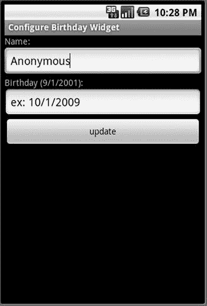
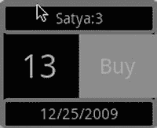

第章第 21 章

主屏幕 Widgets

Android 中的主屏幕小部件在 Android 的主屏幕上呈现频繁变化的信息。主屏幕小部件是显示在主屏幕上的断开连接的视图。这些视图的数据内容由后台进程定期更新，或者仅作为静态视图保存。

例如，一个电子邮件主屏幕小部件可能会提醒您要阅读的未处理电子邮件的数量。小工具可能只显示电子邮件的数量，而不是邮件本身。单击电子邮件计数可能会将您带到显示实际电子邮件的活动。这些甚至可以是外部电子邮件源，如 Yahoo、Gmail 和 Hotmail，只要设备能够通过 HTTP 或其他连接机制访问计数。

在 Android SDK 中，小部件是声明式定义的。小部件定义包含以下内容:

*   要在主屏幕上显示的视图布局，以及它应该适合主页的大小。
*   指定更新频率的计时器。
*   一个名为 widget provider 的广播接收器 Java 类，它可以响应计时器更新，以便通过填充数据以某种方式改变视图。
*   一个 activity 类，负责收集进一步配置要显示的小部件所需的输入。

定时器、接收器和配置活动是可选的。一旦定义了小部件并提供了 Java 类，用户就可以将小部件拖到主页上。视图和相应的 Java 类是以这样一种方式构建的，它们相互之间是断开的。例如，任何 Android 服务或活动都可以使用其布局 id 检索视图，用数据填充视图(就像填充模板一样)，并将其发送到主屏幕。一旦视图被发送到主屏幕，它就会从底层 Java 代码中移除。

在我们向您展示如何实现一个小部件之前，我们将首先向您概述一个最终用户是如何使用小部件的。

主屏幕小工具的用户体验

Android 中的 Home screen widget 功能允许你选择一个预编程的 widget 放在主屏幕上。放置后，如果需要，小部件将允许您使用活动(定义为小部件包的一部分)来配置它。在真正研究小部件是如何实现的细节之前，理解这种交互是很重要的。

我们将带您浏览我们为本章创建的名为“生日”的小部件。我们将在本章的后面给出它的源代码。首先，我们将使用这个小部件作为我们演练的示例。由于随后会有源代码，我们需要你仔细阅读图片，而不是在你的屏幕上寻找这个小部件。如果您遵循提供的图形和解释，您将了解生日小部件的性质和行为，这将在我们随后编写代码时使事情变得清楚。

让我们通过定位我们想要的小部件并在主屏幕上创建它的一个实例来开始这个旅程。访问可用小部件列表的方式因 Android 版本而异。不过，通常情况下，小工具列表与设备上可用的应用列表放在一起。图 21-1 中有一个来自 API 16(或 Android 的 Jellybean 版本)的例子。



[图 21-1](#_Fig1) 。主屏幕小工具选择列表

在[图 21-1](#Fig1) 的小部件列表中，*生日小部件* 就是为这一章设计的。如果你选择这个小工具，Android 允许你把它拖到主屏幕的一个页面上。Android 将在主屏幕上创建一个相应的 widget 实例，看起来像图 21-2 中的生日 Widget 示例。



[图 21-2](#_Fig2) 。生日小工具示例

[图 21-2](#Fig2) 中的生日小工具会在它的头部显示这个人的名字，这个人的生日还有几天，今年的出生日期是什么时候，以及一个购买礼物的链接。您可能想知道人名和出生日期是如何配置的。如果您想要这个小部件的两个实例，每个实例包含不同人的姓名和出生日期，该怎么办？这就是小部件配置活动发挥作用的地方，也是我们接下来要讨论的主题。

了解小部件配置活动

小部件定义可选地包括称为小部件配置活动的活动的规范。当您从主页小部件选择列表中选择一个小部件来创建小部件实例时，Android 会调用相应的小部件配置活动(如果为它定义了一个活动的话)。这个活动是你需要编码的东西。

如果是我们的 BirthdayWidget ，这个配置活动会提示你输入人名和即将到来的生日，如图[图 21-3](#Fig3) 所示。配置活动的责任是将该信息保存在一个持久的位置，以便当在窗口小部件提供者上调用更新时，窗口小部件提供者将能够定位该信息并更新离生日的天数。



[图 21-3](#_Fig3) 。生日小工具配置活动

**注意**当用户选择在主屏幕上创建两个生日小部件实例时，配置活动将被调用两次(每个小部件实例调用一次)。

在内部，Android 通过分配唯一的 id 来跟踪小部件实例。这个惟一的小部件实例 ID 被传递给 Java 回调函数和 configurator Java 类，以便初始配置和更新可以指向主页上正确的小部件实例。在[图 21-2](#Fig2) 中，在字符串 satya:3 的后面部分， 3 是 widget 实例 ID。

了解小部件的生命周期

小部件的生命周期有以下几个阶段:

1.  小部件定义
2.  小部件实例创建
3.  onUpdate() (时间间隔到期时)
4.  对点击的响应(在主屏幕的小部件视图上)
5.  小工具删除(从主屏幕)
6.  卸载

我们现在将详细介绍这些阶段。

理解小部件定义阶段

小部件定义从 Android 清单文件中的小部件提供者类的定义开始。清单 21-1 显示了我们为清单文件中的本章 BDayWidgetProvider 设计的AppWidgetProviderT4 的定义。

[***清单 21-1***](#_list1) 。Android 清单文件中的小部件定义

```java
<!-- filename: AndroidManifest.xml, project: ProAndroid5_ch21_TestWidgets.zip -->
<manifest..>
<application>
....
   <receiver android:name=".BDayWidgetProvider">
      <meta-data android:name="android.appwidget.provider"
             android:resource="@xml/bday_appwidget_provider" />
      <intent-filter>
           <action android:name="android.appwidget.action.APPWIDGET_UPDATE" />
      </intent-filter>
   </receiver>
   ...
   <activity>
      .....
   </activity>
</application>
</manifest>
```

这个定义表明有一个名为 BDayWidgetProvider 的广播接收器 Java 类，它接收应用小部件广播更新消息。清单 21-1 中[的 widget 类定义还指向一个 XML 文件@ XML/bday _ app widget _ provider，它是/RES/XML/bday _ app widget _ provider . XML。这个 XML 文件在](#list1)[清单 21-2](#list2) 中。这个小部件定义文件有许多关于这个小部件的东西，比如它的布局资源文件、更新频率等等。

[***清单 21-2***](#_list2) 。小部件提供者信息 XML 文件中的小部件视图定义

```java
<!-- /res/xml/bday_appwidget_provider.xml(ProAndroid5_ch21_TestWidgets.zip) -->
<appwidget-provider xmlns:android="[http://schemas.android.com/apk/res/android](http://schemas.android.com/apk/res/android)"
    android:minWidth="150dp"
    android:minHeight="120dp"
    android:updatePeriodMillis="43200000"
    android:initialLayout="@layout/bday_widget"
    android:configure="com.androidbook.BDayWidget.ConfigureBDayWidgetActivity"
    android:resizeMode="horizontal|vertical"
    android:previewImage="@drawable/some_preview_image_icon"
    >
</appwidget-provider>
```

这个 XML 文件称为应用小部件提供者信息文件。在内部，这被翻译成 Java 类AppWidgetProviderInfo。该文件确定布局的宽度和高度分别为 150dp 和 120dp 。该定义文件还指示更新频率为 12 小时转换为毫秒。小部件定义还通过 initialLayout 属性指向一个布局文件。这个布局文件(见未来的[清单 21-6](#list6) )产生了如图[图 21-2](#Fig2) 所示的部件外观。

了解调整大小模式属性

从 SDK 3.1 开始，用户能够调整放置在他们的一个图像上的小部件的大小。当用户长按小部件时，他们会看到调整大小手柄，然后可以使用这些手柄来调整大小。这种调整大小可以是水平的、垂直的或无。您可以组合水平和垂直来在两个维度上调整小部件的大小，如[清单 21-2](#list2) 所示。然而，为了利用这一点，您的小部件控件应该以这样一种方式进行布局，即它们可以使用它们的布局参数来扩展和收缩。没有回调来告诉你你的部件有多大。

了解预览图像属性

清单 21-2 中的预览图像属性指出了什么图像或图标用于显示可用部件列表中的部件。如果省略它，默认行为是显示应用包的主图标，这在清单文件中有所指示。

了解小部件布局:initialLayout 属性

小部件视图的布局被限制为只包含某些类型的视图元素。小部件布局中允许的视图通过一个名为 RemoteViews 的接口公开，并且只有某些视图可以组成这个布局。清单 21-3 中显示了一些允许的视图元素。注意它们的子类不被支持——只支持那些包含在清单 21-3 中的子类。

[***清单 21-3***](#_list3) 。 RemoteViews 中允许的视图控件

```java
FrameLayout
LinearLayout
RelativeLayout
GridLayout
AnalogClock
Button
Chronometer
ImageButton
ImageView
ProgressBar
TextView
ViewFlipper
ListView
GridView
StackView
AdapterViewFlipper
```

这个列表可能会随着每个版本的发布而增加。限制远程视图中允许的内容的主要原因是，这些视图与实际控制它们的进程是断开的。这些窗口小部件视图由 Home 应用这样的应用托管。这些视图的控制器是由计时器调用的后台进程。因此，这些视图被称为远程视图。有一个相应的 Java 类叫做 RemoteViews ，允许访问这些视图。换句话说，程序员不能直接访问这些视图来调用它们的方法。您只能通过远程视图访问这些视图(就像看门人一样)。

当我们在下一个主要部分探索这个例子时，我们将会涉及到一个 RemoteViews 类的相关方法。现在，记住在小部件布局文件中只允许使用[清单 21-3](#list3) 中有限的一组视图。

了解配置属性

小部件定义([清单 21-2](#list2) )使用配置属性来指定用户创建小部件实例时需要调用的配置活动。清单 21-2 中的[指定的配置活动是ConfigureBDayWidgetActivity。这个活动(](#list2)[图 21-3](#Fig3) )和任何其他 Android 活动一样。此活动的表单字段用于收集小部件实例所需的信息。

了解小部件实例创建阶段

当用户选择一个小部件来创建一个小部件实例时，Android 调用配置活动([图 21-3](#Fig3) )，如果它是在小部件的配置 XML 文件中定义的。如果未定义此配置活动，则跳过此阶段，小部件直接显示在主页上。调用此配置活动时，它会执行以下操作:

1.  从启动配置活动的调用意图接收小部件实例 ID。
2.  通过表单字段提示用户收集特定于小部件实例的信息。
3.  持久化小部件实例信息，以便对 AppWidgetProvider 的 onUpdate 方法的后续调用可以访问这些信息。
4.  通过检索小部件视图布局准备第一次显示小部件视图，并用它创建一个 RemoteViews 对象。
5.  调用 RemoteViews 对象上的方法来设置单个视图对象的值，比如文本和图像。
6.  还使用 RemoteViews 对象来注册小部件的任何子视图上的任何 onClick 事件。
7.  告诉 AppWidgetManager 使用小部件的实例 ID 在主屏幕上绘制 RemoteViews 。
8.  返回小部件 ID，并关闭。

注意，在这种情况下，小部件的第一次填充是由配置活动完成的，而不是由 AppWidgetProvider 的 onUpdate() 方法完成的。

**注意**配置活动是可选的。如果没有指定配置活动，调用将直接转到 AppWidgetProvider 的 onUpdate() 方法。由 onUpdate() 来更新视图。

Android 将为用户创建的每个小部件实例执行这个过程。除了调用配置活动，Android 还调用 AppWidgetProvider 的 onEnabled 回调。让我们通过查看我们的 BDayWidgetProvider 的外壳来简要考虑一下 AppWidgetProvider 类上的回调(参见[清单 21-4](#list4) )。我们将在后面的[清单 21-10](#list10) 中检查这个文件的完整清单。

[***清单 21-4***](#_list4) 。小部件提供者外壳

```java
// filename: BDayWidgetProvider.java(ProAndroid5_ch21_TestWidgets.zip)
public class BDayWidgetProvider extends AppWidgetProvider {
    public void onUpdate(Context context, AppWidgetManager appWidgetManager,
                        int[] appWidgetIds){}
    public void onDeleted(Context context, int[] appWidgetIds){}
    public void onEnabled(Context context){}
    public void onDisabled(Context context) {}
}
```

one enabled()回调方法表示主屏幕上至少有一个小部件实例正在运行。这意味着用户必须至少将小部件放到主页上一次。在这个调用中，您将需要为这个广播接收器组件启用接收消息(您将在清单 21-10 中看到这一点)。SDK 基类 AppWidgetProvider 具有启用或禁用接收广播消息的功能。

当用户将小部件实例视图拖到垃圾桶时，调用 onDeleted() 回调方法。在这里，您需要删除为该小部件实例保存的任何持久值。

从主屏幕上移除最后一个小部件实例后，调用 onDisabled() 回调方法。当用户将小部件的最后一个实例拖到垃圾箱时，就会发生这种情况。您应该使用这个方法来取消对接收任何针对这个组件的广播消息的兴趣(您将在清单 21-9 中看到这个)。

每当清单 21-2 中的[指定的定时器到期时，就会调用 onUpdate()](#list2) 回调方法。如果没有配置活动，在第一次创建小部件实例时也会调用这个方法。如果存在配置活动，则在创建小部件实例时不会调用此方法。当计时器以指示的频率到期时，将随后调用此方法。

了解 onUpdate 阶段

一旦小部件实例出现在主屏幕上，下一个重要事件就是计时器到期。Android 将调用 onUpdate() 来响应那个定时器。因为 onUpdate() 是通过广播接收器调用的，所以相应的 Java 进程将被加载并保持活动状态，直到该调用结束。一旦调用返回，该进程将准备好被删除。

一旦有了更新 onUpdate() 方法中的小部件所需的数据，就可以调用 AppWidgetManager 来绘制远程视图。这表明 AppWidgetProvider 类是无状态的，甚至可能无法在调用之间维护静态变量。这是因为包含这个广播接收器类的 Java 进程可能会在两次调用之间被关闭和重建，从而导致静态变量的重新初始化。

因此，如果需要的话，您需要想出一个记住状态的方案。您可以将 widget 实例的状态保存在持久性存储中，如文件、共享首选项或 SQLite 数据库。在本章的例子中，我们使用共享参数作为持久性 API。

**注意**为了省电，谷歌建议更新的持续时间超过一个小时，这样设备就不会太频繁地被唤醒。从 2.0 API 开始，更新超时限制为 30 分钟或更长时间。

对于更短的持续时间，比如只有几秒钟，您需要使用 AlarmManager 类中的工具自己调用这个 onUpdate() 方法。当您使用 AlarmManager 时，您还可以选择不调用 onUpdate() ，而是在警报回调中执行 onUpdate() 的工作。参考第 17 章中的[使用报警管理器。](17.html)

这是您在 onUpdate() 方法中通常需要做的事情:

1.  确保配置器已经完成工作；否则，就返回。在 2.0 及更高版本中，这应该不是问题，因为预计持续时间会更长。否则，根据更新间隔(当它太小时),有可能在用户完成配置器中的小部件配置之前调用 onUpdate() 。
2.  检索该小部件实例的持久化数据。
3.  检索小部件视图布局，并用它创建一个 RemoteViews 对象。
4.  调用 RemoteViews 上的方法来设置单个视图对象的值，比如文本和图像。
5.  通过使用挂起的意图，在任何视图上注册任何 onClick 事件。
6.  告诉 AppWidgetManager 使用实例 ID 绘制更新后的 RemoteViews 。

正如你所看到的，配置器最初做的和 onUpdate() 方法做的有很多重叠。您可能希望在两个地方之间重用该功能。

了解小部件视图鼠标点击事件回调

如上所述， onUpdate() 方法使小部件视图保持最新。小部件视图和该视图中的子元素可以为鼠标点击注册回调。通常， onUpdate() 方法使用一个挂起的意图来注册一个事件动作，比如鼠标点击。这个动作可以启动一个服务或者启动一个活动，比如打开一个浏览器。

如果需要，这个被调用的服务或活动可以使用小部件实例 ID 和 AppWidgetManager 与视图进行通信。因此，重要的是，挂起的意图带有小部件实例 ID。

删除小部件实例

小部件实例可能发生的另一个不同事件是它可能被删除。为此，用户必须长按主屏幕上的小工具。这将使垃圾桶显示在主屏幕上。然后，用户可以将小部件实例拖到垃圾桶，以便从屏幕上删除小部件实例。

这样做将调用小部件提供者的 onDelete() 方法。如果您保存了这个小部件实例的任何状态信息，您将需要在这个 onDelete 方法中删除该数据。

如果刚刚被删除的小部件实例是这种类型的最后一个小部件实例，Android 也会调用 onDisable() 。您将使用这个回调来清除为所有小部件实例存储的任何持久性属性，并从小部件 onUpdate() 广播中注销回调。

卸载 Widget 包

如果你打算卸载并安装你的的新版本，有必要清理小部件。包含这些小部件的 apk 文件。

建议您在尝试卸载软件包之前移除或删除所有小部件实例。按照“删除小部件实例”一节中的说明删除每个小部件实例，直到一个都没有。

然后，您可以卸载并安装新版本。如果您使用 Eclipse ADT 来开发小部件，这一点尤其重要，因为在开发期间，每次运行应用时，ADT 都会尝试这样做。因此，在两次运行之间，一定要删除小部件实例。

实现一个示例小部件应用

到目前为止，我们已经介绍了小部件背后的理论和方法。让我们创建一个样例小部件，它的行为被用作解释小部件架构的例子。我们将开发、测试和部署这个生日小部件。

每个生日小部件实例将显示一个名字、下一个生日的日期，以及从今天到生日还有多少天。它还会创建一个 onClick 区域，你可以在那里点击购买礼物。这个点击会打开一个浏览器，带你去 www.google.com 的。

完成的小部件的布局应该看起来像[图 21-4](#Fig4) 。



[图 21-4](#_Fig4) 。生日小工具的外观

这个小部件的实现由以下与小部件相关的文件组成。整个项目也可以从本章“参考资料”一节中提到的 URL 下载。

基本档案有

*   AndroidManifest.xml :定义 AppWidgetProvider 的地方(参见[清单 21-5](#list5) )
*   RES/XML/bday _ app Widget _ provider . XML:Widget 尺寸和布局(见[清单 21-2](#list2) )
*   RES/layout/bday _ widget . XML:小部件布局(参见[清单 21-6](#list6) )
*   res/drawable/box1.xml :为部件布局的部分提供框(参见[清单 21-7](#list7) )
*   src/.../bdaywidgetprovider . Java:AppWidgetProvider 类的实现(参见[清单 21-10](#list10) )

这些文件实现了小部件配置活动:

*   src/.../configurebdaywidgetactivity . Java:配置活动(参见[清单 21-8](#list8) )
*   Layout/edit _ bday _ widget . XML:取名字和生日的布局(见[清单 21-9](#list9) )

这些文件使用首选项存储/检索小部件实例的状态:

*   src/.../iwidgetmodelsavecontract . Java:用于保存和检索小部件数据的契约(参见可下载项目中的)
*   src/.../APrefWidgetModel.java :抽象的基于首选项的小部件模型，将小部件数据保存在首选项中(参见可下载项目中的)
*   src/.../BDayWidgetModel.java :保存小部件视图数据的小部件模型(参见可下载项目中的)
*   src/.../Utils.java :一些工具类(参见可下载项目)

我们将浏览一些关键文件，并解释任何需要进一步考虑的其他概念。您可以从本章的可下载项目中获得其余的文件。

定义小部件提供者

对于生日小部件项目，清单文件在清单 21-5 中。它具有作为广播接收器的小部件提供者 BDayAppWidgetProvider 的声明，以及配置活动ConfigureBDayWidgetActivity的定义。注意小部件提供者定义是如何指向小部件定义 XML 文件@ XML/bday _ app widget _ provider。

[***清单 21-5***](#_list5) 。 BDayWidget 示例应用的 Android 清单文件

```java
<?xml version="1.0" encoding="utf-8"?>
<!-- file: AndroidManifest.xml(ProAndroid5_ch21_TestWidgets.zip) -->
<manifest xmlns:android="[http://schemas.android.com/apk/res/android](http://schemas.android.com/apk/res/android)"
      package="com.androidbook.BDayWidget"
      android:versionCode="1"
      android:versionName="1.0.0">
<application android:icon="@drawable/icon"
             android:label="Birthday Widget">
<!--
**********************************************************************
*  Birthday Widget Provider Receiver
**********************************************************************
 -->
   <receiver android:name=".BDayWidgetProvider">
      <meta-data android:name="android.appwidget.provider"
             android:resource="@xml/bday_appwidget_provider"/>
      <intent-filter>
           <action android:name="android.appwidget.action.APPWIDGET_UPDATE"/>
      </intent-filter>
   </receiver>
<!--
**********************************************************************
*  Birthday Provider Configuration activity
**********************************************************************
 -->
   <activity android:name=".ConfigureBDayWidgetActivity"
             android:label="Configure Birthday Widget">
       <intent-filter>
           <action android:name="android.appwidget.action.APPWIDGET_CONFIGURE"/>
       </intent-filter>
   </activity>

    </application>
    <uses-sdk android:minSdkVersion="3"/>
</manifest>
```

由下面一行中的“生日小工具”标识的应用标签

```java
<application android:icon="@drawable/icon" android:label="Birthday Widget">
```

显示在主页的小部件选择列表中(见[图 21-2](#Fig2) )。您还可以在小部件定义 XML 文件([清单 21-2](#list2) )中指定一个当小部件被列出时显示的替代图标(也称为预览)。配置活动定义类似于任何其他普通活动，只是它需要声明自己能够响应Android . app widget . action . app widget _ CONFIGURE操作。

参考[清单 21-2](#list2) 中的小部件定义文件@ XML/bday _ app widget _ provider，查看小部件大小和布局文件的路径是如何指定的。这个布局文件就像 Android 中任何其他视图的布局文件一样。[清单 21-6](#list6) 显示了我们用来生成图 21-4 所示的小部件布局的布局文件。

[***清单 21-6***](#_list6) 。 BDayWidget 的 Widget 视图布局定义

```java
<?xml version="1.0" encoding="utf-8"?>
<!-- res/layout/bday_widget.xml -->
<LinearLayout xmlns:android="[http://schemas.android.com/apk/res/android](http://schemas.android.com/apk/res/android)"
    android:orientation="vertical"
    android:layout_width="fill_parent"  android:layout_height="fill_parent"
    android:background="@drawable/box1">
<TextView
    android:id="@+id/bdw_w_name"
    android:layout_width="fill_parent" android:layout_height="40sp"
    android:text="Anonymous"  android:background="@drawable/box1"
    android:gravity="center"  android:layout_weight="0"/>
<LinearLayout
    android:orientation="horizontal"
    android:layout_width="fill_parent" android:layout_height="fill_parent"
    android:layout_weight="1">
       <TextView
           android:id="@+id/bdw_w_days"
           android:layout_width="wrap_content" android:layout_height="fill_parent"
           android:gravity="center" android:layout_weight="50"
                   android:text="0" android:textSize="30sp" />
       <TextView
           android:id="@+id/bdw_w_button_buy"
           android:layout_width="wrap_content"  android:layout_height="fill_parent"
           android:layout_weight="50"  android:gravity="center"
           android:textSize="20sp"  android:text="Buy"
           android:background="#FF6633"/>
</LinearLayout>
<TextView
    android:id="@+id/bdw_w_date"
    android:layout_width="fill_parent"  android:layout_height="40sp"
    android:gravity="center" android:layout_weight="0"
    android:text="1/1/2000" android:background="@drawable/box1"/>
</LinearLayout>
```

一些控件还使用一个名为 box1.xml 的形状定义文件来定义边框。形状定义文件的代码如[清单 21-7](#list7) 所示。

[***清单 21-7***](#_list7) 。边界框形状定义

```java
<!-- res/drawable/box1.xml -->
<shape xmlns:android="[http://schemas.android.com/apk/res/android](http://schemas.android.com/apk/res/android)">
    <stroke android:width="4dp" android:color="#888888"/>
    <padding android:left="2dp" android:top="2dp"
            android:right="2dp" android:bottom="2dp"/>
    <corners android:radius="4dp"/>
</shape>
```

实施小部件配置活动

以生日小部件为例，小部件职责的配置在ConfigureBDayWidgetActivity中实现。这个类的源代码在[清单 21-8](#list8) 中。

[***清单 21-8***](#_list8) 。实施配置活动

```java
// file: ConfigureBDayWidgetActivity.java(ProAndroid5_ch21_TestWidgets.zip)
public class ConfigureBDayWidgetActivity extends Activity
{
   private static String tag = "ConfigureBDayWidgetActivity";
   private int mAppWidgetId = AppWidgetManager.INVALID_APPWIDGET_ID;

    @Override
    public void onCreate(Bundle savedInstanceState) {
        super.onCreate(savedInstanceState);
        setContentView(R.layout.edit_bday_widget);
        setupButton(); //setup the save button

        //Get the widget instanceid from the intent extra
        Intent intent = getIntent();
        Bundle extras = intent.getExtras();
        if (extras != null) {
            mAppWidgetId = extras.getInt(
                    AppWidgetManager.EXTRA_APPWIDGET_ID,
                    AppWidgetManager.INVALID_APPWIDGET_ID);
        }
    }
    private void setupButton(){
       Button b = (Button)this.findViewById(R.id.bdw_button_update_bday_widget);
       b.setOnClickListener(
             new Button.OnClickListener(){
                public void onClick(View v)  {
                   saveConfiguration(v);
                }
             });
    }
    //Read name and date.
    //Call updateAppWidgetLocal to save the values for this instance
    //in that method also send the view to the homepage.
    //Return the result of the configuration activity to the SDK
    //finish the activity.
    private void saveConfiguration(View v){
       String name = this.getName();
       String date = this.getDate();
       if (Utils.validateDate(date) == false){
          this.setDate("wrong date:" + date);
          return;
       }
       if (this.mAppWidgetId == AppWidgetManager.INVALID_APPWIDGET_ID){
          return;
       }
       updateAppWidgetLocal(name,date);
       Intent resultValue = new Intent();
       resultValue.putExtra(AppWidgetManager.EXTRA_APPWIDGET_ID, mAppWidgetId);
       setResult(RESULT_OK, resultValue);
       finish();
    }
    private String getName(){
        EditText nameEdit =
            (EditText)this.findViewById(R.id.bdw_bday_name_id);
        String name = nameEdit.getText().toString();
        return name;
    }
    private String getDate(){
        EditText dateEdit = (EditText)this.findViewById(R.id.bdw_bday_date_id);
        String dateString = dateEdit.getText().toString();
        return dateString;
    }
    private void setDate(String errorDate){
        EditText dateEdit = (EditText)this.findViewById(R.id.bdw_bday_date_id);
        dateEdit.setText("error");
        dateEdit.requestFocus();
    }
    private void updateAppWidgetLocal(String name, String dob){
       //Create an object to hold the data: widgetid, name, and dob
       BDayWidgetModel m = new BDayWidgetModel(mAppWidgetId,name,dob);
       //Create the view and send it to the home screen
       updateAppWidget(this,AppWidgetManager.getInstance(this),m);
       //Use the data model object to save the id, name, and dob in prefs
       m.savePreferences(this);
    }
    //A key method where a lot of magic happens
    public static void updateAppWidget(Context context,
            AppWidgetManager appWidgetManager,
            BDayWidgetModel widgetModel)
    {
      //Construct a RemoteViews Object from the widget layout file
      RemoteViews views = new RemoteViews(context.getPackageName(),
                    R.layout.bday_widget);

      //Use the control ids in the layout to set values on them.
      //Notice that these methods are limited and available on the
      //on the RemoteViews object. In other words we are not using the
      //TextView directly to set these values.
      views.setTextViewText(R.id.bdw_w_name
         , widgetModel.getName() + ":" + widgetModel.iid);

      views.setTextViewText(R.id.bdw_w_date
            , widgetModel.getBday());

      //update the name
      views.setTextViewText(R.id.bdw_w_days,
                           Long.toString(widgetModel.howManyDays()));

      //Set intents to invoke other activities when widget is clicked on
      Intent defineIntent = new Intent(Intent.ACTION_VIEW,
              Uri.parse("[http://www.google.com](http://www.google.com)"));
      PendingIntent pendingIntent =
           PendingIntent.getActivity(context,
                    0 /* no requestCode */,
                    defineIntent,
                    0 /* no flags */);
       views.setOnClickPendingIntent(R.id.bdw_w_button_buy, pendingIntent);

      // Tell the widget manager to paint the remote view
      appWidgetManager.updateAppWidget(widgetModel.iid, views);
   }
}
```

在我们介绍这段代码做什么之前，这个小部件配置活动使用的布局在清单 21-9 中。这种布局很简单。你也可以在[图 21-3](#Fig3) 中直观地看到这一点。

[***清单 21-9***](#_list9) 。配置活动的布局定义

```java
<?xml version="1.0" encoding="utf-8"?>
<!-- res/layout/edit_bday_widget.xml -->
<LinearLayout xmlns:android="[http://schemas.android.com/apk/res/android](http://schemas.android.com/apk/res/android)"
   android:id="@+id/root_layout_id"  android:orientation="vertical"
   android:layout_width="fill_parent"  android:layout_height="fill_parent">
<TextView
    android:id="@+id/bdw_text1"  android:layout_width="fill_parent"
    android:layout_height="wrap_content" android:text="Name:" />
<EditText
    android:id="@+id/bdw_bday_name_id" android:layout_width="fill_parent"
    android:layout_height="wrap_content" android:text="Anonymous" />
<TextView
    android:id="@+id/bdw_text2" android:layout_width="fill_parent"
    android:layout_height="wrap_content" android:text="Birthday (9/1/2001):" />
<EditText
    android:id="@+id/bdw_bday_date_id" android:layout_width="fill_parent"
    android:layout_height="wrap_content"  android:text="ex: 10/1/2009" />
<Button
    android:id="@+id/bdw_button_update_bday_widget" android:layout_width="fill_parent"
    android:layout_height="wrap_content" android:text="update"/>
</LinearLayout>
```

回到[清单 21-8](#list8) 中的配置活动代码，它完成以下任务:

*   从调用意图中读取小部件实例 ID
*   使用表单字段收集姓名和出生日期
*   通过加载 widget 布局文件获取 RemoteViews
*   在远程视图上设置文本值
*   通过 RemoteViews 注册待定意向
*   调用 AppWidgetManager 将 RemoteViews 发送给小部件
*   根据这个小部件实例 ID 在首选项中保存姓名和出生日期。这是通过类 BDayWidgetModel 完成的。我们很快会谈到这一点。
*   最后返回一个结果。

**注意**静态函数 udpateAppWidget 只要知道 widget ID 就可以从任何地方调用。这意味着您可以从设备上的任何地方和任何进程(可视和非可视)更新小部件。

注意我们是如何将小部件 ID 传递回这个配置活动的调用者的。这就是 AppWidgetManager 知道小部件实例的配置活动已经完成的方式。

让我们来谈谈通过[清单 21-8](#list8) 中的 BDayWidgetModel 对象来保存和检索 widget 实例状态。 BDayWidgetModel 对象的作用是存储和检索三个值:小部件实例 ID(主键)、名称和出生日期。这个类使用 preferences API 来保存和读回这些值。或者，您可以使用任何持久性机制来满足这一需求。我们不包括这个类的源代码，因为它实现起来非常简单。在本章的可下载项目中，我们有这个类的一个更广泛的实现，其中我们编写了一个可重用的框架来存储首选项中任何 java 对象的值。我们已经充分记录了源代码，这样您就可以按原样使用它来满足其他需求，或者进一步调整它并使用反射来进一步简化。最终，您将拥有一个非常可扩展的模型框架。由于这不是本章的主要目标，我们在这里没有深入讨论这些细节。对于本章来说，重要的是保存和检索这三个值，即实例 ID、名称和 dob。您可以根据 BDayWidgetModel 上的名称作为指南。

实现小部件提供者

现在让我们通过检查小部件提供者类来看看我们将如何响应小部件的生命周期事件。清单 21-10 实现了小部件提供者类。

[***清单 21-10***](#_list10) 。样例小部件提供程序的源代码:BDayWidgetProvider

```java
// file: BDayWidgetProvider.java(ProAndroid5_ch21_TestWidgets.zip)
public class BDayWidgetProvider extends AppWidgetProvider  {
    private static final String tag = "BDayWidgetProvider";
    public void onUpdate(Context context, AppWidgetManager appWidgetManager,
                        int[] appWidgetIds)  {
        final int N = appWidgetIds.length;
        for (int i=0; i<N; i++)  {
            int appWidgetId = appWidgetIds[i];
            updateAppWidget(context, appWidgetManager, appWidgetId);
        }
    }
    public void onDeleted(Context context, int[] appWidgetIds) {
        final int N = appWidgetIds.length;
        for (int i=0; i<N; i++) {
               BDayWidgetModel bwm = BDayWidgetModel.retrieveModel(context, appWidgetIds[i]);
               bwm.removePrefs(context);
        }
    }
    public void onEnabled(Context context) {
        BDayWidgetModel.clearAllPreferences(context);
        PackageManager pm = context.getPackageManager();
        pm.setComponentEnabledSetting(
                new ComponentName("com.androidbook.BDayWidget",
                       ".BDayWidgetProvider"),
                PackageManager.COMPONENT_ENABLED_STATE_ENABLED,
                PackageManager.DONT_KILL_APP);
    }

    public void onDisabled(Context context) {
        BDayWidgetModel.clearAllPreferences(context);
        PackageManager pm = context.getPackageManager();
        pm.setComponentEnabledSetting(
                new ComponentName("com.androidbook.BDayWidget",
                       ".BDayWidgetProvider"),
                PackageManager.COMPONENT_ENABLED_STATE_DISABLED,
                PackageManager.DONT_KILL_APP);
    }
    private void updateAppWidget(Context context, AppWidgetManager appWidgetManager,
                          int appWidgetId) {
       BDayWidgetModel bwm = BDayWidgetModel.retrieveModel(context, appWidgetId);
       if (bwm == null) {return;}
       ConfigureBDayWidgetActivity.updateAppWidget(context, appWidgetManager, bwm);
   }
}
```

在“小部件的生命周期”一节中，我们讨论了这些方法的职责。对于生日小部件，所有这些方法都利用 BDayWidgetModel 来检索与小部件实例相关联的数据，回调函数被调用。在 BDayWidgetModel 上的这些方法有 removePrefs() 、 retrievePrefs() 和 clearAllPreferences() 。

为该小部件类型的所有小部件实例调用更新回调方法。这个方法必须更新所有的小部件实例。小部件实例作为 id 数组传入。对于每个id,on update()方法将定位相应的小部件实例模型，并调用配置活动使用的相同方法(参见[清单 21-8](#list8) )来显示检索到的小部件模型。

在 onDeleted() 方法中，我们实例化了一个 BDayWidgetModel ，然后要求它将自己从首选项持久性存储中删除。

在one enabled()方法中，因为它在第一个实例出现时只被调用一次，所以我们已经清除了小部件模型的所有持久性，这样我们就可以从头开始了。我们在 onDisabled() 方法中也做了同样的事情，这样就不存在小部件实例的内存。

在one enabled()方法中，我们启用小部件提供者组件，以便它可以接收广播消息。在 onDisabled() 方法中，我们禁用了组件，这样它就不会寻找任何广播消息。

基于集合的小部件

从 SDK 3.0 开始，Android 已经扩展了小部件，以包括基于集合的小部件。我们在这本书的印刷本中没有空间。我们将把上一版中关于收集部件的章节放在我们的在线网站上以供下载。

资源

以下是本章所涵盖主题的有用参考:

*   [http://developer . Android . com/guide/topics/appwidgets/index . html](http://developer.android.com/guide/topics/appwidgets/index.html):关于 app widgets 的 Android SDK 官方文档。
*   [http://developer . Android . com/reference/Android/content/shared preferences . html](http://developer.android.com/reference/android/content/SharedPreferences.html):shared preferences管理状态的 API。
*   [http://developer . Android . com/reference/Android/content/shared preferences。Editor.html](http://developer.android.com/reference/android/content/SharedPreferences.Editor.html):共享推荐。编辑器 API，与共享偏好相关。
*   [http://developer . Android . com/guide/practices/ui _ guidelines/widget _ Design . html](http://developer.android.com/guide/practices/ui_guidelines/widget_design.html):设计令人愉悦的 widget 布局。
*   [http://developer . Android . com/reference/Android/widget/remote views . html](http://developer.android.com/reference/android/widget/RemoteViews.html):remote viewsAPI，用于绘制和操纵 widget 视图。
*   [http://developer . Android . com/reference/Android/app widget/appwidgetmanager . html](http://developer.android.com/reference/android/appwidget/AppWidgetManager.html):小部件本身由一个小部件管理器类管理。
*   :撰写本章时使用的研究笔记，包括摘要、研究日志、代码片段和有用的网址。
*   :你可以使用这个网址下载关于列表小部件的详细章节。
*   :本章可下载的测试项目。本章的 ZIP 文件的名称是pro Android 5 _ ch21 _ test widgets . ZIP。

摘要

在 Android 中，小部件经常和你的应用一起使用。本章涵盖了创建和配置小部件所需的基本要素。在线提供了关于列表小部件的补充章节。