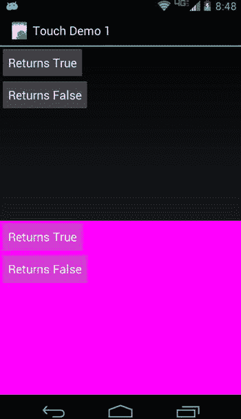
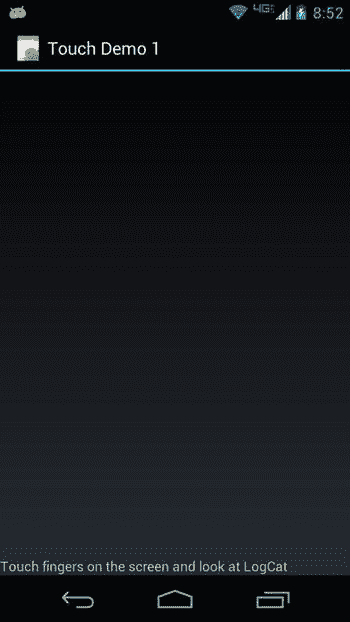

# 二十二、触摸屏

许多 Android 设备都集成了触摸屏。当设备没有物理键盘时，大部分用户输入*必须*通过触摸屏。因此，您的应用通常需要能够处理来自用户的触摸输入。您很可能已经见过当用户需要输入文本时，屏幕上显示的虚拟键盘。我们在[第 19 章](19.html)中使用了 touch 和地图应用。到目前为止，触摸屏界面的实现对您是隐藏的，但是现在我们将向您展示如何利用触摸屏。

本章由三个主要部分组成。第一部分将处理 MotionEvent 对象，这是 Android 如何告诉应用用户正在触摸触摸屏。我们还将介绍速度跟踪器。第二部分将处理多点触摸 ，用户可以在触摸屏上一次使用多个手指。最后，我们将包括一个关于手势的部分，这是一种特殊类型的功能，触摸序列可以被解释为命令。

理解运动事件

在这一节，我们将介绍 Android 如何告诉应用用户的触摸事件。现在，我们将只关注一次一个手指触摸屏幕(我们将在后面的章节中讨论多点触摸)。

在硬件层面，触摸屏由特殊材料制成，可以拾取压力并将其转换为屏幕坐标。关于触摸的信息被转换成数据，这些数据被传递给软件进行处理。

运动事件对象

当用户触摸 Android 设备的触摸屏时，会创建一个 MotionEvent 对象。运动事件包含关于触摸发生的时间和地点的信息，以及触摸事件的其他细节。运动事件对象被传递给应用中的一个适当的方法。这可能是一个视图对象的 onTouchEvent() 方法。记住视图类是 Android 中相当多类的父类，包括布局 s、按钮 s、列表 s、时钟 s 等等。这意味着我们可以使用触摸事件与所有这些不同类型的视图对象进行交互。当该方法被调用时，它可以检查 MotionEvent 对象来决定做什么。例如， GoogleMap 可以使用触摸事件来横向移动地图，以允许用户将地图平移到其他感兴趣的点。虚拟键盘对象可以接收触摸事件来激活虚拟键，以向用户界面(UI)的某个其他部分提供文本输入。

接收 MotionEvent 对象

运动事件对象是与用户触摸相关的一系列事件之一。该序列从用户第一次触摸触摸屏时开始，通过手指在触摸屏表面上的任何移动继续，并在手指从触摸屏抬起时结束。手指的初始触摸(一个动作 _ 下动作)、侧向移动(动作 _ 移动动作)、上事件(一个动作 _ 上动作)都创建运动事件对象。在您接收到最终的 ACTION_UP 事件 之前，随着手指在表面上移动，您可能会接收到相当多的 ACTION_MOVE 事件。每个 MotionEvent 对象包含关于正在执行什么动作、触摸发生在哪里、施加了多少压力、触摸有多大、动作何时发生以及初始 ACTION_DOWN 何时发生的信息。还有第四种可能的动作，就是动作 _ 取消。该动作用于指示触摸序列在没有实际做任何事情的情况下结束。最后，还有 ACTION_OUTSIDE ，它设置在一个特殊的情况下，触摸发生在我们的窗口之外，但我们仍然可以发现它。

还有另一种方法来接收触摸事件，那就是为一个视图对象上的触摸事件注册一个回调处理器。接收事件的类必须实现视图。OnTouchListener 接口，必须调用视图对象的 setOnTouchListener() 方法 来设置该视图的处理器。视图的实现类。OnTouchListener 必须实现 onTouch() 方法。而 onTouchEvent() 方法 只取一个运动事件对象作为参数， onTouch() 同时取一个视图和一个运动事件对象作为参数。这是因为 OnTouchListener 可以接收多个视图的 MotionEvent 对象。这将在我们的下一个示例应用中变得更加清晰。

如果一个 MotionEvent 处理器(通过 onTouchEvent() 或 onTouch() 方法)使用了该事件，而其他人不需要知道它，该方法应该返回 true 。这告诉 Android 事件不需要传递给任何其他视图。如果视图对象对该事件*或任何与该触摸序列*相关的未来事件不感兴趣，则返回假。基类视图的 onTouchEvent() 方法不做任何事情，返回 false 。视图的子类可能会也可能不会做同样的事情。例如，按钮对象会消耗一个触摸事件，因为触摸相当于点击，因此从 onTouchEvent() 方法返回 true 。当接收到一个 ACTION_DOWN 事件 时，按钮会改变颜色，表示正在被点击。按钮也希望接收 ACTION_UP 事件，以了解用户何时放开，从而可以启动单击按钮的逻辑。如果一个按钮对象从 onTouchEvent() 返回了 false ，那么当用户从触摸屏上抬起手指时，它将不再接收任何 MotionEvent 对象来告诉它。

当我们希望触摸事件对特定的视图对象做一些新的事情时，我们可以扩展该类，覆盖 onTouchEvent() 方法，并将我们的逻辑放在那里。我们也可以贯彻的观点。OnTouchListener 接口，并在视图对象上设置一个回调处理器。通过用 onTouch() 设置一个回调处理器， MotionEvent s 将在它们转到视图的 onTouchEvent() 方法之前首先被传递到那里。只有当 onTouch() 方法返回 false 时，我们的视图的 onTouchEvent() 方法才会被调用。让我们来看看我们的示例应用，在这里应该更容易看到这一点。

**注意**我们会在本章末尾给你一个 URL，你可以用它来下载本章的项目。这将允许您将这些项目直接导入到 IDE 中。

设置示例应用

清单 22-1 显示了一个布局文件的 XML。从这个布局开始创建一个新的 Android 项目。

[***清单 22-1***](#_list1) 。TouchDemo1 的 XML 布局文件 T7

```java
<?xml version="1.0" encoding="utf-8"?>
<!-- This file is res/layout/main.xml -->
<LinearLayout xmlns:android="[http://schemas.android.com/apk/res/android](http://schemas.android.com/apk/res/android)"
    android:layout_width="match_parent"
    android:layout_height="match_parent"
    android:orientation="vertical" >

  <RelativeLayout  android:id="@+id/layout1"
    android:tag="trueLayoutTop"  android:orientation="vertical"
    android:layout_width="match_parent"
    android:layout_height="wrap_content"
    android:layout_weight="1" >

    <com.androidbook.touch.demo1.TrueButton android:text="Returns True"
    android:id="@+id/trueBtn1"  android:tag="trueBtnTop"
    android:layout_width="wrap_content"
    android:layout_height="wrap_content" />

    <com.androidbook.touch.demo1.FalseButton android:text="Returns False"
    android:id="@+id/falseBtn1"  android:tag="falseBtnTop"
    android:layout_width="wrap_content"
    android:layout_height="wrap_content"
    android:layout_below="@id/trueBtn1" />

  </RelativeLayout>
  <RelativeLayout  android:id="@+id/layout2"
    android:tag="falseLayoutBottom"  android:orientation="vertical"
    android:layout_width="match_parent"
    android:layout_height="wrap_content"
    android:layout_weight="1"  android:background="#FF00FF" >

    <com.androidbook.touch.demo1.TrueButton android:text="Returns True"
    android:id="@+id/trueBtn2"  android:tag="trueBtnBottom"
    android:layout_width="wrap_content"
    android:layout_height="wrap_content" />

    <com.androidbook.touch.demo1.FalseButton android:text="Returns False"
    android:id="@+id/falseBtn2"  android:tag="falseBtnBottom"
    android:layout_width="wrap_content"
    android:layout_height="wrap_content"
    android:layout_below="@id/trueBtn2" />

  </RelativeLayout>
</LinearLayout>
```

关于这种布局，有几点需要指出。我们在 UI 对象上加入了标签，当事件发生时，我们将能够在代码中引用这些标签。我们使用了定制对象(真按钮和假按钮)。你会在 Java 代码中看到这些是从按钮类扩展而来的类。因为这些是按钮，所以我们可以使用我们在其他按钮上使用的所有 XML 属性。图 22-1 显示了这个布局，清单 22-2 显示了我们的按钮 Java 代码。



[图 22-1](#_Fig1) 。我们的 TouchDemo1 应用的 UI

[***清单 22-2***](#_list2) 。TouchDemo1 的按钮类 的 Java 代码

```java
// This file is BooleanButton.java
public abstract class BooleanButton extends Button {
    protected boolean myValue() {
        return false;
    }

    public BooleanButton(Context context, AttributeSet attrs) {
        super(context, attrs);
    }

    @Override
    public boolean onTouchEvent(MotionEvent event) {
        String myTag = this.getTag().toString();
        Log.v(myTag, "-----------------------------------");
        Log.v(myTag, MainActivity.describeEvent(this, event));
        Log.v(myTag, "super onTouchEvent() returns " +
                super.onTouchEvent(event));
        Log.v(myTag, "and I'm returning " + myValue());
        return(myValue());
    }
}

// This file is TrueButton.java
public class TrueButton extends BooleanButton {
    protected boolean myValue() {
        return true;
    }

    public TrueButton(Context context, AttributeSet attrs) {
        super(context, attrs);
    }
}

// This file is FalseButton.java
public class FalseButton extends BooleanButton {

    public FalseButton(Context context, AttributeSet attrs) {
        super(context, attrs);
    }
}
```

构建了 BooleanButton 类，以便我们可以重用 onTouchEvent() 方法，我们已经通过添加日志记录对其进行了定制。然后，我们创建了 TrueButton 和 FalseButton ，它们将对传递给它们的 MotionEvent s 做出不同的响应。当您查看主活动代码时，这将变得更加清晰，如清单 22-3 所示。

[***清单 22-3***](#_list3) 。我们主要活动的 Java 代码

```java
// This file is MainActivity.java
import android.view.MotionEvent;
import android.view.View.OnTouchListener;
public class MainActivity extends Activity implements OnTouchListener {
    /** Called when the activity is first created. */
    @Override
    public void onCreate(Bundle savedInstanceState) {
        super.onCreate(savedInstanceState);
        setContentView(R.layout.main);

        RelativeLayout layout1 =
                (RelativeLayout) findViewById(R.id.layout1);
        layout1.setOnTouchListener(this);
        Button trueBtn1 = (Button)findViewById(R.id.trueBtn1);
        trueBtn1.setOnTouchListener(this);
        Button falseBtn1 = (Button)findViewById(R.id.falseBtn1);
        falseBtn1.setOnTouchListener(this);

        RelativeLayout layout2 =
                (RelativeLayout) findViewById(R.id.layout2);
        layout2.setOnTouchListener(this);
        Button trueBtn2 = (Button)findViewById(R.id.trueBtn2);
        trueBtn2.setOnTouchListener(this);
        Button falseBtn2 = (Button)findViewById(R.id.falseBtn2);
        falseBtn2.setOnTouchListener(this);
    }

    @Override
    public boolean onTouch(View v, MotionEvent event) {
        String myTag = v.getTag().toString();
        Log.v(myTag, "-----------------------------");
        Log.v(myTag, "Got view " + myTag + " in onTouch");
        Log.v(myTag, describeEvent(v, event));
        if( "true".equals(myTag.substring(0, 4))) {
        /*  Log.v(myTag, "*** calling my onTouchEvent() method ***");
            v.onTouchEvent(event);
            Log.v(myTag, "*** back from onTouchEvent() method ***"); */
            Log.v(myTag, "and I'm returning true");
            return true;
        }
        else {
            Log.v(myTag, "and I'm returning false");
            return false;
        }
    }

    protected static String describeEvent(View view, MotionEvent event) {
        StringBuilder result = new StringBuilder(300);
        result.append("Action: ").append(event.getAction()).append("\n");
        result.append("Location: ").append(event.getX()).append(" x ")
                 .append(event.getY()).append("\n");
        if(    event.getX() < 0 || event.getX() > view.getWidth() ||
               event.getY() < 0 || event.getY() > view.getHeight()) {
            result.append(">>> Touch has left the view <<<\n");
        }
        result.append("Edge flags: ").append(event.getEdgeFlags());
        result.append("\n");
        result.append("Pressure: ").append(event.getPressure());
        result.append("   ").append("Size: ").append(event.getSize());
        result.append("\n").append("Down time: ");
        result.append(event.getDownTime()).append("ms\n");
        result.append("Event time: ").append(event.getEventTime());
        result.append("ms").append("  Elapsed: ");
        result.append(event.getEventTime()-event.getDownTime());
        result.append(" ms\n");
        return result.toString();
    }
}
```

我们的主活动代码在按钮和布局上设置了回调，这样我们就可以处理 UI 中所有的触摸事件( MotionEvent 对象)。我们增加了许多日志记录，所以你将能够准确地告诉触摸事件发生时发生了什么。另一个好主意是将以下标记添加到您的清单文件中，这样谷歌 Play 商店将知道您的应用需要触摸屏才能工作:<uses-configuration Android:req touch screen = " finger "/>。例如，谷歌电视没有触摸屏，所以试图在那里运行这个应用没有意义。当您编译并运行这个应用时，您应该会看到一个类似于[图 22-1](#Fig1) 的屏幕。

运行示例应用

为了充分利用这个应用，你需要在你的 IDE (Eclipse 或 Android Studio)中打开 LogCat，在你触摸触摸屏的时候观察信息的飞逝。这在模拟器和真实设备上都有效。我们还建议您最大化 LogCat 窗口，这样您可以更容易地上下滚动来查看该应用生成的所有事件。要最大化窗口，只需双击 LogCat 选项卡。现在，转到应用 UI，触摸并释放最上面标有 Returns True 的按钮(如果您正在使用模拟器，请使用鼠标单击并释放按钮)。您应该看到 LogCat 中至少记录了两个事件。这些消息被标记为来自 trueBtnTop ，并从主活动中的 onTouch() 方法记录下来。关于 onTouch() 方法的代码，请参见 MainActivity.java。在查看 LogCat 输出时，可以看到哪些方法调用产生了这些值。例如，Action 之后显示的值来自于 getAction() 方法。[清单 22-4](#list4) 显示了您可能在示例应用的 LogCat 中看到的示例。

[***清单 22-4***](#_list4) 。来自 TouchDemo1 的示例 LogCat 消息

```java
trueBtnTop        -----------------------------
trueBtnTop        Got view trueBtnTop in onTouch
trueBtnTop        Action: 0
trueBtnTop        Location: 42.8374 x 25.293747
trueBtnTop        Edge flags: 0
trueBtnTop        Pressure: 0.05490196   Size: 0.2
trueBtnTop        Down time: 24959412ms
trueBtnTop        Event time: 24959412ms  Elapsed: 0 ms
trueBtnTop        and I'm returning true
trueBtnTop        -----------------------------
trueBtnTop        Got view trueBtnTop in onTouch
trueBtnTop        Action: 2
trueBtnTop        Location: 42.8374 x 25.293747
trueBtnTop        Edge flags: 0
trueBtnTop        Pressure: 0.05490196   Size: 0.2
trueBtnTop        Down time: 24959412ms
trueBtnTop        Event time: 24959530ms  Elapsed: 118 ms
trueBtnTop        and I'm returning true
trueBtnTop        -----------------------------
trueBtnTop        Got view trueBtnTop in onTouch
trueBtnTop        Action: 1
trueBtnTop        Location: 42.8374 x 25.293747
trueBtnTop        Edge flags: 0
trueBtnTop        Pressure: 0.05490196   Size: 0.2
trueBtnTop        Down time: 24959412ms
trueBtnTop        Event time: 24959567ms  Elapsed: 155 ms
trueBtnTop        and I'm returning true
```

了解运动事件内容

第一个事件的动作为 0，即动作 _ 下降。最后一个事件的 action 为 1，即 ACTION_ UP 。如果您使用真实设备，您可能会看到两个以上的事件。在 ACTION_DOWN 和 ACTION_UP 之间的任何事件最有可能有一个 ACTION 2，即 ACTION _MOVE。另一种可能是 3 的一个动作，也就是动作 _ 取消 ，或者 4，也就是动作 _ 在 之外。当在真实的触摸屏上使用真实的手指时，你不能总是在表面没有轻微移动的情况下触摸和释放，所以期待一些 ACTION_MOVE 事件。

请注意位置值。一个运动事件的位置有一个 x 和 y 分量，其中 x 代表从视图对象的左侧到被触摸点的距离，y 代表从视图对象的顶部到被触摸点的距离。

在模拟器中，压力可能是 1.0，大小可能是 0.0。对于真实的设备，压力代表手指按下的力度，大小代表触摸的力度。如果用小指尖轻轻触摸，压力和大小的值会很小。如果用拇指使劲按，压力和大小都会大一些。用拇指轻轻按压会产生一个较小的压力值，但会产生一个较大的尺寸值。文档说压力和大小的值将在 0 和 1 之间。然而，由于硬件的差异，在您的应用中很难使用任何绝对数字来决定压力和尺寸。当运动事件在您的应用中发生时，比较它们之间的压力和大小是很好的，但是如果您决定压力必须超过诸如 0.8 之类的值才能被认为是硬按压，那么您可能会遇到麻烦。在那个特定的设备上，你可能永远得不到高于 0.8 的值。你可能得不到高于 0.2 的值。

停机时间和事件时间值在模拟器和真实设备之间以相同的方式运行，唯一的区别是真实设备具有大得多的值。经过的时间是一样的。

边缘标志用于检测触摸何时到达物理屏幕的边缘。Android SDK 文档称，标志被设置为指示触摸已经与显示器的边缘相交(顶部、底部、左侧或右侧)。然而， getEdgeFlags() 方法可能总是返回零，这取决于它在什么设备或仿真器上使用。对于一些硬件来说，实际检测显示器边缘的触摸太困难了，所以 Android 应该将位置固定到边缘，并为您设置适当的边缘标志。这种情况并不总是发生，所以您不应该依赖于正确设置的边缘标志。 MotionEvent 类提供了一个 setEdgeFlags() 方法，这样你就可以自己设置标志了。

最后要注意的是，我们的 onTouch() 方法返回 true ，因为我们的 TrueButton 被编码为返回 true 。返回 true 告诉 Androidmotion event 对象已经被消费，没有理由再给别人。它还告诉 Android 继续从这个触摸序列向这个方法发送触摸事件。这就是为什么我们得到了 ACTION_UP 事件，以及真实设备情况下的 ACTION_MOVE 事件。

现在触摸屏幕顶部附近的退货错误按钮 。[清单 22-5](#list5) 显示了退货误触的示例 LogCat 输出。

[***清单 22-5***](#_list5) 。触摸顶部返回假按钮的示例 LogCat

```java
falseBtnTop        -----------------------------
falseBtnTop        Got view falseBtnTop in onTouch
falseBtnTop        Action: 0
falseBtnTop        Location: 61.309372 x 44.281494
falseBtnTop        Edge flags: 0
falseBtnTop        Pressure: 0.0627451   Size: 0.26666668
falseBtnTop        Down time: 28612178ms
falseBtnTop        Event time: 28612178ms  Elapsed: 0 ms
falseBtnTop        and I'm returning false
falseBtnTop        -----------------------------------
falseBtnTop        Action: 0
falseBtnTop        Location: 61.309372 x 44.281494
falseBtnTop        Edge flags: 0
falseBtnTop        Pressure: 0.0627451   Size: 0.26666668
falseBtnTop        Down time: 28612178ms
falseBtnTop        Event time: 28612178ms  Elapsed: 0 ms
falseBtnTop        super onTouchEvent() returns true
falseBtnTop        and I'm returning false
trueLayoutTop        -----------------------------
trueLayoutTop        Got view trueLayoutTop in onTouch
trueLayoutTop        Action: 0
trueLayoutTop        Location: 61.309372 x 116.281494
trueLayoutTop        Edge flags: 0
trueLayoutTop        Pressure: 0.0627451   Size: 0.26666668
trueLayoutTop        Down time: 28612178ms
trueLayoutTop        Event time: 28612178ms  Elapsed: 0 ms
trueLayoutTop        and I'm returning true
trueLayoutTop        -----------------------------
trueLayoutTop        Got view trueLayoutTop in onTouch
trueLayoutTop        Action: 2
trueLayoutTop        Location: 61.309372 x 111.90039
trueLayoutTop        Edge flags: 0
trueLayoutTop        Pressure: 0.0627451   Size: 0.26666668
trueLayoutTop        Down time: 28612178ms
trueLayoutTop        Event time: 28612217ms  Elapsed: 39 ms
trueLayoutTop        and I'm returning true
trueLayoutTop        -----------------------------
trueLayoutTop        Got view trueLayoutTop in onTouch
trueLayoutTop        Action: 1
trueLayoutTop        Location: 55.08958 x 115.30792
trueLayoutTop        Edge flags: 0
trueLayoutTop        Pressure: 0.0627451   Size: 0.26666668
trueLayoutTop        Down time: 28612178ms
trueLayoutTop        Event time: 28612361ms  Elapsed: 183 ms
trueLayoutTop        and I'm returning true
```

现在你看到了非常不同的行为，所以我们将解释发生了什么。Android 在一个 MotionEvent 对象中接收 ACTION_DOWN 事件，并将其传递给我们在 MainActivity 类中的 onTouch() 方法。我们的 onTouch() 方法在 LogCat 中记录信息，并返回 false 。这告诉 Android 我们的 onTouch() 方法没有使用事件，所以 Android 期待调用下一个方法，在我们的例子中是我们的 FalseButton 类的被覆盖的 onTouchEvent() 方法。因为 FalseButton 是 BooleanButton 类的扩展，请参考 BooleanButton.java 中的 onTouchEvent() 方法查看代码。在 onTouchEvent() 方法中，我们再次向 LogCat 写入信息，我们调用父类的 onTouchEvent() 方法，然后我们也返回 false 。请注意，LogCat 中的位置信息与之前完全相同。这应该是意料之中的，因为我们仍然在同一个视图对象中，即假按钮。我们看到我们的父类想要从 onTouchEvent() 返回 true ，我们可以看出为什么。如果您在 UI 中查看按钮，它应该与 Returns True 按钮的颜色不同。我们的退货错误按钮现在看起来像是被按了一半。也就是说，它看起来就像一个按钮被按下但没有释放时的样子。我们的自定义方法返回了假而不是真。因为我们再次告诉 Android 我们没有消费这个事件，通过返回 false ，Android 从不发送 ACTION_UP 事件给我们的按钮，所以我们的按钮不知道手指曾经离开触摸屏。因此，我们的按钮仍然处于按下状态。如果我们像父母希望的那样返回了 true ，我们最终会收到 ACTION_UP 事件，因此我们可以将颜色改回正常的按钮颜色。概括一下，每次我们从一个 UI 对象为接收到的 MotionEvent 对象返回 false 时，Android 停止向那个 UI 对象发送 MotionEvent 对象，Android 继续寻找另一个 UI 对象来消费我们的 MotionEvent 对象。

您可能已经意识到，当我们触摸 Returns True 按钮时，按钮的颜色没有变化。为什么会这样？嗯，我们的 onTouch() 方法是在任何实际的按钮方法被调用之前被调用的，并且 onTouch() 返回 true ，所以 Android 从不费心调用 Returns True 按钮的 onTouchEvent() 方法。如果添加一个 v.onTouchEvent(事件)；行到 onTouch() 方法就在返回 true 之前，你会看到按钮改变颜色。您还会在 LogCat 中看到更多的日志行，因为我们的 onTouchEvent() 方法也在向 LogCat 写入信息。

让我们继续检查 LogCat 的输出。现在 Android 已经两次尝试为 ACTION_DOWN 事件寻找消费者，但都失败了，它转到应用中可能接收事件的下一个视图，在我们的例子中是按钮下面的布局。我们调用了我们的顶部布局 trueLayoutTop ，我们可以看到它接收了 ACTION_DOWN 事件。

注意，我们的 onTouch() 方法再次被调用，尽管现在是在布局视图中而不是在按钮视图中。传递给 onTouch() 用于 trueLayoutTop 的 MotionEvent 对象的所有内容都与之前相同，包括时间，除了位置的 y 坐标。按钮的 y 坐标从 44.281494 更改为布局的 116.281494。这是有意义的，因为 Returns False 按钮不在布局的左上角，而是在 Returns True 按钮的下面。因此，触摸相对于布局的 y 坐标大于相同触摸相对于按钮的 y 坐标；触摸距离布局的上边缘比距离按钮的上边缘更远。因为 trueLayoutTop 的 onTouch() 返回 true ，Android 将其余的触摸事件发送到布局，我们看到的日志记录对应于 ACTION _MOVE 和 ACTION_UP 事件。继续操作，再次触摸顶部的 Returns False 按钮，您会注意到出现了一组相同的日志记录。即 false bttop 调用 onTouch() ，其余事件 trueLayoutTop 调用 false bttop 调用 onTouchEvent() 。Android 每次只停止向按钮发送一个触摸序列的事件。对于一个新的触摸事件序列，Android 将发送到按钮，除非它从被调用的方法获得另一个返回 false ，在我们的示例应用中仍然是这样。

现在用手指触摸顶部布局，但不要触摸任何按钮，然后拖动手指一点，并将其抬离触摸屏(如果您使用的是仿真器，只需使用鼠标做出类似的动作)。请注意 LogCat 中的日志消息流，其中第一条记录有一个动作 ACTION_DOWN ，然后许多 ACTION_MOVE 事件之后是一个 ACTION_UP 事件。

现在，触摸顶部的 Returns True 按钮，在从按钮上抬起手指之前，在屏幕上拖动手指，然后抬起。清单 22-6 显示了 LogCat 中的一些新信息。

[***清单 22-6***](#_list6) 。LogCat 记录 显示我们视野之外的触摸

```java
[ ... log messages of an ACTION_DOWN event followed by some ACTION_MOVE events ... ]

trueBtnTop        Got view trueBtnTop in onTouch
trueBtnTop        Action: 2
trueBtnTop        Location: 150.41768 x 22.628128
trueBtnTop        >>> Touch has left the view <<<
trueBtnTop        Edge flags: 0
trueBtnTop        Pressure: 0.047058824   Size: 0.13333334
trueBtnTop        Down time: 31690859ms
trueBtnTop        Event time: 31691344ms  Elapsed: 485 ms
trueBtnTop        and I'm returning true

[ ... more ACTION_MOVE events logged ... ]

trueBtnTop        Got view trueBtnTop in onTouch
trueBtnTop        Action: 1
trueBtnTop        Location: 291.5864 x 223.43854
trueBtnTop        >>> Touch has left the view <<<
trueBtnTop        Edge flags: 0
trueBtnTop        Pressure: 0.047058824   Size: 0.13333334
trueBtnTop        Down time: 31690859ms
trueBtnTop        Event time: 31692493ms  Elapsed: 1634 ms
trueBtnTop        and I'm returning true
```

即使在您的手指离开按钮后，我们仍会收到与按钮相关的触摸事件通知。清单 22-6 中的第一条记录显示了一条我们不再点击按钮的事件记录。在这种情况下，触摸事件的 x 坐标位于按钮对象边缘的右侧。然而，我们一直被 MotionEvent 对象调用，直到我们得到一个 ACTION_UP 事件，因为我们继续从 onTouch() 方法返回 true 。即使当你最终将手指从触摸屏上移开，即使你的手指没有放在按钮上，我们的 onTouch() 方法仍然被调用来给我们 ACTION_UP 事件，因为我们一直返回 true 。这是在处理 MotionEvent s 时要记住的事情。当手指离开视图时，我们可以决定取消可能已经执行的任何操作，并从 onTouch() 方法返回 false ，这样我们就不会得到进一步事件的通知。或者我们可以选择继续接收事件(通过从 onTouch() 方法返回 true ，并且只有当手指在抬起之前返回到我们的视图时才执行逻辑。

当我们从 onTouch() 返回 true 时，事件的触摸序列与顶部的返回 True 按钮相关联。这告诉 Android，它可以停止寻找一个对象来接收运动事件对象，而只是将这个触摸序列的所有未来运动事件对象发送给我们。即使我们在拖动手指时遇到了另一个视图，我们仍然被绑定到该序列的原始视图。

练习示例应用的下半部分

让我们看看应用的下半部分会发生什么。继续，触摸下半部分的返回真按钮。我们看到顶部的 Returns True 按钮发生了同样的事情。因为 onTouch() 返回 true ，Android 向我们发送触摸序列中的其余事件，直到手指从触摸屏上抬起。现在，触摸底部返回错误按钮。再次， onTouch() 方法和 onTouchEvent() 方法返回 false (都与 falseBtnBottom 视图对象相关联)。但这次，下一个接收 MotionEvent 对象的视图是 falseLayoutBottom 对象，它也返回 false 。现在，我们结束了。

因为 onTouchEvent() 方法调用了 super 的 onTouchEvent() 方法，所以按钮已经改变了颜色，表示它已经被按下了一半。同样，按钮将保持这种状态，因为我们从未在这个触摸序列中获得 ACTION_UP 事件，因为我们的方法总是返回 false 。不像以前，连版面都对这个活动不感兴趣。如果您触摸底部的 Returns False 按钮并按住它，然后在显示屏上拖动手指，您将不会在 LogCat 中看到任何额外的记录，因为不再有 MotionEvent 对象发送给我们。我们返回了 false ，所以 Android 不会再用这个触摸序列的任何事件来打扰我们。同样，如果我们开始一个新的触摸序列，我们可以看到新的 LogCat 记录出现。如果您在底部布局中而不是在按钮上启动触摸序列，您将在 LogCat 中看到一个针对 falseLayoutBottom 的事件，该事件返回 false ，然后再无其他事件(直到您启动新的触摸序列)。

到目前为止，我们已经使用按钮从触摸屏上向您展示了 MotionEvent 事件的效果。值得指出的是，通常情况下，您会使用 onClick() 方法在按钮上实现逻辑。我们在这个示例应用中使用了按钮，因为它们易于创建，并且是视图的子类，因此可以像任何其他视图一样接收触摸事件。记住，这些技术适用于应用中的任何视图对象，无论是标准的还是定制的视图类。

回收运动事件

你可能已经注意到了 Android 参考文档中的 MotionEvent 类的 recycle() 方法 。你很想回收在 onTouch() 或 onTouchEvent() 中收到的 MotionEvent s，但是不要这样做。如果你的回调方法没有使用 MotionEvent 对象，并且你返回了 false ，那么 MotionEvent 对象可能会被传递给其他方法或视图或我们的活动，所以你还不想让 Android 回收它。即使你消费了事件并返回了 true ，事件对象也不属于你，所以你不应该回收它。

如果你看一下 MotionEvent 文档，你会看到一个叫做获取() 的方法的一些变体。这要么是创建一个运动事件的副本，要么是一个全新的运动事件。你的副本，或者说你全新的事件对象，是你用完后应该回收的事件对象。比如你要挂一个通过回调传递给你的事件对象，你要用获取()做一个副本，因为一旦你从回调返回，那个事件对象就会被 Android 回收，继续使用可能会得到奇怪的结果。当您使用完*您的副本*时，您对它调用 recycle() 。

使用速度跟踪器

Android 提供了一个类来帮助处理触摸屏序列，这个类就是 velocity tracker。当手指在触摸屏上移动时，知道它在表面上移动的速度可能会很好。例如，如果用户在屏幕上拖动一个对象，然后放开，应用可能希望相应地显示该对象在屏幕上飞行。Android 提供了 VelocityTracker 来帮助解决相关的数学问题。

要使用 VelocityTracker ，首先要通过调用静态方法 VelocityTracker.obtain() 获得一个 VelocityTracker 的实例。然后，您可以使用 add movement(motion event ev)方法向其添加 MotionEvent 对象。您可以在接收 MotionEvent 对象的处理器中调用该方法，从一个处理器方法如 onTouch() 或从一个视图的 onTouchEvent() 调用该方法。 VelocityTracker 使用 MotionEvent 对象来判断用户的触摸顺序。一旦 VelocityTracker 中至少有两个 MotionEvent 对象，我们可以使用其他方法来找出发生了什么。

两个 VelocityTracker 方法——getx velocity()和 getYVelocity()——分别返回手指在 x 和 y 方向的相应速度。这两种方法返回的值将表示每个时间段的像素。这可以是每毫秒或每秒的像素，或者任何你想要的东西。为了告诉 VelocityTracker 使用什么时间段，在调用这两个 getter 方法之前，需要调用 VelocityTracker 的 computeCurrentVelocity(int units)方法。单位的值代表测量速度的时间周期为多少毫秒。如果你想要每毫秒像素，使用一个单位值为 1；如果你想要每秒像素，使用单位值 1000。如果速度向右(对于 x)或向下(对于 y)，那么由 getXVelocity() 和 getYVelocity() 方法返回的值将是正的。如果速度向左(对于 x)或向上(对于 y)，返回值将是负的。

当你完成了用获取()方法得到的 VelocityTracker 对象后，调用 VelocityTracker 对象的 recycle() 方法。[清单 22-7](#list7) 显示了一个活动的示例 onTouchEvent() 处理器。原来，一个活动有一个 onTouchEvent() 回调，每当没有视图处理触摸事件时就会调用这个回调。因为我们使用的是普通的空布局，所以没有视图消耗我们的触摸事件。

[***清单 22-7***](#_list7) 。使用 VelocityTracker 的示例活动

```java
import android.view.MotionEvent;
import android.view.VelocityTracker;

public class MainActivity extends Activity {
    private static final String TAG = "VelocityTracker";

    /** Called when the activity is first created. */
    @Override
    public void onCreate(Bundle savedInstanceState) {
        super.onCreate(savedInstanceState);
        setContentView(R.layout.main);
    }

    private VelocityTracker vTracker = null;

    public boolean onTouchEvent(MotionEvent event) {
        int action = event.getAction();
        switch(action) {
            case MotionEvent.ACTION_DOWN:
                if(vTracker == null) {
                    vTracker = VelocityTracker.obtain();
                }
                else {
                    vTracker.clear();
                }
                vTracker.addMovement(event);
                break;
            case MotionEvent.ACTION_MOVE:
                vTracker.addMovement(event);
                vTracker.computeCurrentVelocity(1000);
                Log.v(TAG, "X velocity is " + vTracker.getXVelocity() +
                       " pixels per second");
                Log.v(TAG, "Y velocity is " + vTracker.getYVelocity() +
                       " pixels per second");
                break;
            case MotionEvent.ACTION_UP:
            case MotionEvent.ACTION_CANCEL:
                Log.v(TAG, "Final X velocity is " + vTracker.getXVelocity() +
                       " pixels per second");
                Log.v(TAG, "Final Y velocity is " + vTracker.getYVelocity() +
                       " pixels per second");
                vTracker.recycle();
                vTracker = null;
                break;
        }
        return true;
    }
}
```

显然，当你只给一个速度跟踪器(ACTION _ DOWN 事件)添加了一个运动事件时，速度不能被计算为零以外的任何值。但是我们需要添加起点，以便随后的 ACTION_MOVE 事件可以计算速度。

就性能而言，VelocityTracker 有点昂贵，所以要谨慎使用。此外，确保你用完后尽快回收。安卓系统中可以有多个 VelocityTracker 在使用，但它们会占用大量内存，所以如果你不打算继续使用它，就把你的还给我。在[清单 22-7](#list7) 中，如果我们开始一个新的触摸序列(也就是说，如果我们得到一个 ACTION_DOWN 事件并且我们的 VelocityTracker 对象已经存在),我们也使用 clear() 方法，而不是回收这个对象并获得一个新的。

多点触摸

现在，您已经看到了单点触摸的实际操作，让我们继续多点触摸。自从 2006 年的 TED 大会上 Jeff Han 演示了用于计算机用户界面的多点触摸表面以来，多点触摸就引起了人们的极大兴趣。在屏幕上使用多个手指为操作屏幕上的内容提供了很多可能性。例如，将两个手指放在一幅图像上并分开，可以放大图像。通过将多个手指放在图像上并顺时针旋转，可以旋转屏幕上的图像。例如，这些是谷歌地图中的标准触摸操作。

但是，如果你仔细想想，这并没有什么魔力。如果屏幕硬件可以检测到在屏幕上开始的多点触摸，在这些触摸在屏幕表面上移动时通知您的应用，并在这些触摸离开屏幕时通知您，您的应用就可以知道用户试图对这些触摸做什么。虽然不是魔术，但也不容易。在这一部分，我们将帮助您理解多点触控。

多点触摸的基础

多点触摸的基本原理与单点触摸完全相同。 MotionEvent 对象被创建用于触摸，这些 MotionEvent 对象像以前一样被传递给你的方法。您的代码可以读取关于触摸的数据，并决定做什么。基本上，运动事件的方法是相同的；也就是我们调用 getAction() 、get down()、 getX() 等等。然而，当不止一个手指触摸屏幕时， MotionEvent 对象必须包括来自所有手指的信息，但有一些注意事项。来自 getAction() 的动作值是针对一个手指，而不是所有手指。“按下时间”值是指第一个手指按下时的时间，只要至少有一个手指按下，它就会测量时间。位置值 getX() 和 getY() ，以及 getPressure() 和 getSize() ，可以为手指取一个实参；因此，您需要使用指针索引值来请求您感兴趣的手指的信息。我们之前使用的一些方法调用没有使用任何参数来指定一个指针(例如， getX() ， getY() )，那么如果我们使用这些方法，这些值将用于哪个指针呢？你可以弄清楚，但这需要一些工作。因此，如果你不总是考虑多个手指，你可能会得到一些奇怪的结果。让我们深入研究一下，看看该怎么办。

多点触控需要了解的第一个 MotionEvent 方法是 getPointerCount() 。这告诉你有多少手指出现在 MotionEvent 对象中，但不一定告诉你有多少手指实际上在触摸屏幕；这取决于硬件和 Android 在硬件上的实现。您可能会发现，在某些设备上， getPointerCount() 不会报告所有正在触摸的手指，只是一些手指。但是让我们继续努力。一旦在 MotionEvent 对象中报告了多个手指，就需要开始处理指针索引和指针 id。

MotionEvent 对象包含从索引 0 开始直到该对象中报告的手指数量的指针信息。指针索引总是从 0 开始；如果报告三个指针，指针索引将为 0、1 和 2。对诸如 getX() 之类的方法的调用必须包含您想要了解的手指的指针索引。指针 id 是表示哪个手指正在被跟踪的整数值。第一个手指按下时，指针 id 从 0 开始，但一旦手指在屏幕上出现和消失，指针 id 并不总是从 0 开始。把一个指针 ID 想象成被 Android 追踪的手指的名字。例如，想象两个手指的一对触摸序列，从手指 1 向下开始，然后是手指 2 向下、手指 1 向上和手指 2 向上。第一个手指按下将获得指针 ID 0。第二个手指向下将得到指针 ID 1。一旦第一个手指向上，第二个手指仍将是指针 ID 1。此时，第二手指的指针索引变为 0，因为指针索引总是从 0 开始。在这个例子中，第二个手指(指针 ID 1)在第一次触下时开始为指针索引 1，然后在第一个手指离开屏幕时转变为指针索引 0。即使第二手指是屏幕上唯一的手指，它仍然是指针 ID 1。您的应用将使用指针 id 将与特定手指相关的事件链接在一起，即使涉及到其他手指。让我们看一个例子。

清单 22-8 展示了我们新的 XML 布局和多点触摸应用的 Java 代码。这就是名为 MultiTouchDemo1 的应用。[图 22-2](#Fig2) 显示了它应该是什么样子。

[***清单 22-8***](#_list8) 。多点触摸演示的 XML 布局 和 Java

```java
<?xml version="1.0" encoding="utf-8"?>
<!-- This file is /res/layout/main.xml -->
<RelativeLayout  xmlns:android="[http://schemas.android.com/apk/res/android](http://schemas.android.com/apk/res/android)"
    android:id="@+id/layout1"
    android:tag="trueLayout"  android:orientation="vertical"
    android:layout_width="match_parent"
    android:layout_height="wrap_content"
    android:layout_weight="1"
    >

    <TextView android:text="Touch fingers on the screen and look at LogCat"
    android:id="@+id/message"
    android:tag="trueText"
    android:layout_width="wrap_content"
    android:layout_height="wrap_content"
    android:layout_alignParentBottom="true" />

</RelativeLayout>

// This file is MainActivity.java
import android.view.MotionEvent;
import android.view.View.OnTouchListener;

public class MainActivity extends Activity implements OnTouchListener {
    /** Called when the activity is first created. */
    @Override
    public void onCreate(Bundle savedInstanceState) {
        super.onCreate(savedInstanceState);
        setContentView(R.layout.main);

        RelativeLayout layout1 =
                (RelativeLayout) findViewById(R.id.layout1);
        layout1.setOnTouchListener(this);
    }

    public boolean onTouch(View v, MotionEvent event) {
        String myTag = v.getTag().toString();
        Log.v(myTag, "-----------------------------");
        Log.v(myTag, "Got view " + myTag + " in onTouch");
        Log.v(myTag, describeEvent(event));
        logAction(event);
        if( "true".equals(myTag.substring(0, 4))) {
            return true;
        }
        else {
            return false;
        }
    }

    protected static String describeEvent(MotionEvent event) {
        StringBuilder result = new StringBuilder(500);
        result.append("Action: ").append(event.getAction()).append("\n");
        int numPointers = event.getPointerCount();
        result.append("Number of pointers: ");
        result.append(numPointers).append("\n");
        int ptrIdx = 0;
        while (ptrIdx < numPointers) {
            int ptrId = event.getPointerId(ptrIdx);
            result.append("Pointer Index: ").append(ptrIdx);
            result.append(", Pointer Id: ").append(ptrId).append("\n");
            result.append("   Location: ").append(event.getX(ptrIdx));
            result.append(" x ").append(event.getY(ptrIdx)).append("\n");
            result.append("   Pressure: ");
            result.append(event.getPressure(ptrIdx));
            result.append("   Size: ").append(event.getSize(ptrIdx));
            result.append("\n");

            ptrIdx++;
        }
        result.append("Down time: ").append(event.getDownTime());
        result.append("ms\n").append("Event time: ");
        result.append(event.getEventTime()).append("ms");
        result.append("  Elapsed: ");
        result.append(event.getEventTime()-event.getDownTime());
        result.append(" ms\n");
        return result.toString();
    }

    private void logAction(MotionEvent event) {
        int action = event.getActionMasked();
        int ptrIndex = event.getActionIndex();
        int ptrId = event.getPointerId(ptrIndex);

        if(action == 5 || action == 6)
            action = action - 5;

        Log.v("Action", "Pointer index: " + ptrIndex);
        Log.v("Action", "Pointer Id: " + ptrId);
        Log.v("Action", "True action value: " + action);
    }
}
```



[图 22-2](#_Fig2) 。我们的多点触摸演示应用

如果你只有模拟器，这个应用仍然可以工作，但是你不能在屏幕上同时显示多个手指。您将看到类似于我们在前面的应用中看到的输出。[清单 22-9](#list9) 显示了我们之前描述的触摸序列的示例 LogCat 消息 。也就是第一个手指按在屏幕上，然后第二个手指按，第一个手指离开屏幕，第二个手指离开屏幕。

[***清单 22-9***](#_list9) 。多点触摸应用的示例 LogCat 输出

```java
trueLayout       -----------------------------
trueLayout       Got view trueLayout in onTouch
trueLayout       Action: 0
trueLayout       Number of pointers: 1
trueLayout       Pointer Index: 0, Pointer Id: 0
trueLayout          Location: 114.88211 x 499.77502
trueLayout          Pressure: 0.047058824   Size: 0.13333334
trueLayout       Down time: 33733650ms
trueLayout       Event time: 33733650ms  Elapsed: 0 ms
Action           Pointer index: 0
Action           Pointer Id: 0
Action           True Action value: 0
trueLayout       -----------------------------
trueLayout       Got view trueLayout in onTouch
trueLayout       Action: 2
trueLayout       Number of pointers: 1
trueLayout       Pointer Index: 0, Pointer Id: 0
trueLayout          Location: 114.88211 x 499.77502
trueLayout          Pressure: 0.05882353   Size: 0.13333334
trueLayout       Down time: 33733650ms
trueLayout       Event time: 33733740ms  Elapsed: 90 ms
Action           Pointer index: 0
Action           Pointer Id: 0
Action           True Action value: 2
trueLayout       -----------------------------
trueLayout       Got view trueLayout in onTouch
trueLayout       Action: 261
trueLayout       Number of pointers: 2
trueLayout       Pointer Index: 0, Pointer Id: 0
trueLayout          Location: 114.88211 x 499.77502
trueLayout          Pressure: 0.05882353   Size: 0.13333334
trueLayout       Pointer Index: 1, Pointer Id: 1
trueLayout          Location: 320.30692 x 189.67395
trueLayout          Pressure: 0.050980393   Size: 0.13333334
trueLayout       Down time: 33733650ms
trueLayout       Event time: 33733962ms  Elapsed: 312 ms
Action           Pointer index: 1
Action           Pointer Id: 1
Action           True Action value: 0
trueLayout       -----------------------------
trueLayout       Got view trueLayout in onTouch
trueLayout       Action: 2
trueLayout       Number of pointers: 2
trueLayout       Pointer Index: 0, Pointer Id: 0
trueLayout          Location: 111.474594 x 499.77502
trueLayout          Pressure: 0.05882353   Size: 0.13333334
trueLayout       Pointer Index: 1, Pointer Id: 1
trueLayout          Location: 320.30692 x 189.67395
trueLayout          Pressure: 0.050980393   Size: 0.13333334
trueLayout       Down time: 33733650ms
trueLayout       Event time: 33734189ms  Elapsed: 539 ms
Action           Pointer index: 0
Action           Pointer Id: 0
Action           True Action value: 2
trueLayout       -----------------------------
trueLayout       Got view trueLayout in onTouch
trueLayout       Action: 6
trueLayout       Number of pointers: 2
trueLayout       Pointer Index: 0, Pointer Id: 0
trueLayout          Location: 111.474594 x 499.77502
trueLayout          Pressure: 0.05882353   Size: 0.13333334
trueLayout       Pointer Index: 1, Pointer Id: 1
trueLayout          Location: 320.30692 x 189.67395
trueLayout          Pressure: 0.050980393   Size: 0.13333334
trueLayout       Down time: 33733650ms
trueLayout       Event time: 33734228ms  Elapsed: 578 ms
Action           Pointer index: 0
Action           Pointer Id: 0
Action           True Action value: 1
trueLayout       -----------------------------
trueLayout       Got view trueLayout in onTouch
trueLayout       Action: 2
trueLayout       Number of pointers: 1
trueLayout       Pointer Index: 0, Pointer Id: 1
trueLayout          Location: 318.84656 x 191.45105
trueLayout          Pressure: 0.050980393   Size: 0.13333334
trueLayout       Down time: 33733650ms
trueLayout       Event time: 33734240ms  Elapsed: 590 ms
Action           Pointer index: 0
Action           Pointer Id: 1
Action           True Action value: 2
trueLayout       -----------------------------
trueLayout       Got view trueLayout in onTouch
trueLayout       Action: 1
trueLayout       Number of pointers: 1
trueLayout       Pointer Index: 0, Pointer Id: 1
trueLayout          Location: 314.95224 x 190.5625
trueLayout          Pressure: 0.050980393   Size: 0.13333334
trueLayout       Down time: 33733650ms
trueLayout       Event time: 33734549ms  Elapsed: 899 ms
Action           Pointer index: 0
Action           Pointer Id: 1
Action           True Action value: 1
```

了解多点触摸内容

我们现在将讨论这个应用是怎么回事。我们看到的第一个事件是第一个手指的 ACTION_DOWN (动作值为 0)。我们使用 getAction() 方法 来了解这一点。请参考 MainActivity.java 中的 describeEvent() 方法来了解哪些方法产生了哪些输出。我们得到一个索引为 0、指针 ID 为 0 的指针。之后，你可能会看到这个第一个手指的几个动作 _ 移动事件(动作值为 2)，尽管我们在[清单 22-9](#list9) 中只显示了其中一个。我们仍然只有一个指针，索引和 ID 仍然都是 0。

过了一会儿，我们用第二手指触摸屏幕。该动作现在是十进制值 261。这是什么意思？动作值实际上由两部分组成:一个指示动作是针对哪个指针的，以及这个指针正在做什么动作。将十进制 261 转换为十六进制，我们得到 0x00000105。动作是最小的字节(本例中为 5)，指针索引是下一个字节(本例中为 1)。注意，这告诉我们的是指针索引，而不是指针 ID。如果您在屏幕上按下第三个手指，动作将是 0x00000205(或十进制 517)。第四个指针是 0x00000305(或十进制 773)，依此类推。你还没有看到一个动作值为 5，但它被称为 ACTION_POINTER_DOWN 。它就像 ACTION_DOWN 一样，只是它用在多点触摸的情况下。

现在，看看清单 22-9 中来自 LogCat 的下一对记录。第一条记录是针对一个动作 _ 移动事件 T5(动作值为 2)。请记住，很难阻止手指在真实屏幕上移动。我们只显示了一个 ACTION_MOVE 事件，但是当您亲自尝试时，您可能会看到几个。当第一个手指离开屏幕时，我们得到一个动作值 0x00000006(或十进制 6)。像以前一样，我们有指针索引 0 和动作值 ACTION_POINTER_UP (类似于 ACTION_UP ，但用于多点触摸情况)。如果在多点触摸的情况下抬起第二个手指，我们将获得 0x00000106(或十进制 262)的动作值。请注意，当我们为其中一个手指获取 ACTION_UP 时，我们仍然有两个手指的信息。

清单 22-9 中的最后一对记录显示了第二手指的另一个动作 _ 移动事件，随后是第二手指的动作 _ 上升。这一次，我们看到一个动作值为 1 ( ACTION_UP )。我们没有得到 262 的动作值，但是我们将在下面解释。另外，请注意，一旦第一个手指离开屏幕，第二个手指的指针索引已经从 1 变为 0，但是指针 ID 仍然是 1。

ACTION_MOVE 事件不会告诉你哪个手指动了。无论有多少根手指向下或哪根手指在移动，你的动作值总是为 2。所有向下手指的位置在运动事件对象中都是可用的，所以你需要读取这些位置，然后把事情弄清楚。如果屏幕上只剩下一个手指，指针 ID 会告诉你哪个手指还在动，因为它是唯一剩下的手指。在[清单 22-9](#list9) 中，当屏幕上只剩下第二手指时， ACTION_MOVE 事件的指针索引为 0，指针 ID 为 1，所以我们知道是第二手指在移动。

一个 MotionEvent 对象不仅可以包含多个手指的移动事件，还可以包含每个手指的多个移动事件。它使用对象中包含的历史值来实现这一点。Android 应该报告自最后一个运动事件对象以来的所有历史。参见 getHistoricalSize() 和另一个 getHistorical...()方法。

回到[清单 22-9](#list9) 的开头，第一个按下的手指是指针索引 0，指针 ID 0，那么为什么在第一个手指先于其他任何手指按到屏幕上时，我们得不到动作值 0x00000005(或者十进制 5)？很遗憾，这个问题没有一个满意的答案。我们可以在下面的场景中得到一个动作值 5:将第一个手指按向屏幕，然后按第二个手指，得到动作值 0 和 261(暂时忽略 ACTION_MOVE 事件)。现在，抬起第一个手指(动作值为 6)，并在屏幕上向下按压。第二手指的指针 ID 保持为 1。当第一个手指在空中时，我们的应用只知道指针 ID 1。一旦第一个手指再次触摸屏幕，Android 会将指针 ID 0 重新分配给第一个手指，并赋予其指针索引 0。因为现在我们知道涉及到多个手指，所以我们得到的动作值为 5(指针索引为 0，动作值为 5)。因此，问题的答案是向后兼容，但这不是一个令人满意的答案。动作值 0 和 1 是预多点触摸。

当只有一个手指留在屏幕上时，Android 将其视为单点触控外壳。所以我们得到旧的 ACTION_UP 值 1，而不是多点触摸 ACTION_UP 值 6。我们的代码需要仔细考虑这些情况。指针索引为 0 可能导致 ACTION_DOWN 值为 0 或 5，这取决于哪个指针在起作用。最后一个向上的指针将获得为 1 的 ACTION_UP 值 ，而不管它具有哪个指针 ID。

还有一个动作我们至今没有提到: ACTION_SCROLL (值为 8)，在 Android 3.1 中引入。这来自鼠标之类的输入设备，而不是触摸屏。事实上，从 MotionEvent 中的方法可以看出，这些对象可以用于触摸屏触摸之外的许多事情。我们不会在本书中讨论这些其他的输入设备。

手势

手势是一种特殊类型的触摸屏事件。术语*手势*在 Android 中用于各种各样的事情，从简单的触摸序列，如扔或捏，到正式的手势类。投掷、挤压、长按和滚动都有带有预期触发的预期行为。也就是说，对大多数人来说很清楚，一个手指触摸屏幕，向一个方向快速拖动，然后抬起的手势。例如，当有人在 Gallery 应用(以从左到右的链显示图像的应用)中使用 fling 时，图像将向旁边移动，以向用户显示新的图像。

在接下来的几节中，您将学习如何实现挤压手势，从中您可以轻松地实现其他常见的手势。正式手势类是指用户在触摸屏上绘制的手势，以便应用可以对这些手势做出反应。典型的例子包括绘制应用可以理解为字母的字母表中的字母。正式的手势课程不在本书的讨论范围之内。让我们学会掐！

捏手势

多点触摸的一个很酷的应用是挤压手势，用于缩放。这个想法是，如果你把两个手指放在屏幕上并分开，应用应该通过放大来响应。如果你的手指并拢，应用应该会缩小。该应用通常显示图像，可能是地图。

在我们开始挤压手势的 本地支持之前，我们首先需要介绍一个从一开始就存在的类——手势检测器。

手势检测器和 OnGestureListeners

第一个帮助我们做手势的类是 GestureDetector ，它从 Android 最开始就存在了。它在生活中的目的是接收运动事件对象，并告诉我们一系列事件何时看起来像一个普通的手势。我们从回调中将所有的事件对象传递给手势检测器，当它识别出一个手势时，就会调用其他回调函数，比如一个轻击或长按。我们需要为来自 GestureDetector 的回调注册一个监听器，这是我们放置逻辑的地方，它告诉我们如果用户执行了这些常见的手势中的一个，该做什么。不幸的是，这个类没有告诉我们一个捏手势是否正在发生；为此，我们需要使用一个新的类，我们很快就会用到它。

有几种方法可以构建侦听器端。您的第一个选择是编写一个新的类来实现适当的手势监听器接口:例如，手势检测器。OnGestureListener 接口。对于每个可能的回调，都必须实现几个抽象方法。

第二种选择是选择一个简单的侦听器实现，并覆盖您所关心的适当的回调方法。比如手势检测器。SimpleOnGestureListener 类已经实现了所有的抽象方法，不做任何事情并返回 false 。您所要做的就是扩展该类，并覆盖您需要对您所关心的几个手势进行操作的几个方法。其他方法有它们默认的实现。即使您决定覆盖所有回调方法，选择第二个选项也更符合未来，因为如果 Android 的未来版本向接口添加另一个抽象回调方法，简单的实现将提供一个默认回调方法，因此您可以放心。

我们将探索 ScaleGestureDetector ，加上相应的 listener 类，看看如何使用收缩手势来调整图像的大小。在这个例子中，我们扩展了简单的实现( ScaleGestureDetector)。SimpleOnScaleGestureListener)为我们的监听器。[清单 22-10](#list10) 给出了我们的主活动的 XML 布局和 Java 代码。

[***清单 22-10***](#_list10) 。使用 ScaleGestureDetector 的挤压手势的布局和 Java 代码

```java
<?xml version="1.0" encoding="utf-8"?>
<LinearLayout xmlns:android="[http://schemas.android.com/apk/res/android](http://schemas.android.com/apk/res/android)"
    android:id="@+id/layout"  android:orientation="vertical"
    android:layout_width="match_parent"
    android:layout_height="match_parent" >

  <TextView  android:text=
        "Use the pinch gesture to change the image size"
    android:layout_width="match_parent"
    android:layout_height="wrap_content" />

  <ImageView android:id="@+id/image"  android:src="@drawable/icon"
    android:layout_width="match_parent"
    android:layout_height="match_parent"
    android:scaleType="matrix" />

</LinearLayout>

// This file is MainActivity.java
public class MainActivity extends Activity {
    private static final String TAG = "ScaleDetector";
    private ImageView image;
    private ScaleGestureDetector mScaleDetector;
    private float mScaleFactor = 1f;
    private Matrix mMatrix = new Matrix();
    @Override
    public void onCreate(Bundle savedInstanceState) {
        super.onCreate(savedInstanceState);
        setContentView(R.layout.main);

        image = (ImageView)findViewById(R.id.image);
        mScaleDetector = new ScaleGestureDetector(this,
                new ScaleListener());
    }

    @Override
    public boolean onTouchEvent(MotionEvent ev) {
        Log.v(TAG, "in onTouchEvent");
        // Give all events to ScaleGestureDetector
        mScaleDetector.onTouchEvent(ev);

        return true;
    }

    private class ScaleListener extends
            ScaleGestureDetector.SimpleOnScaleGestureListener {
        @Override
        public boolean onScale(ScaleGestureDetector detector) {
            mScaleFactor *= detector.getScaleFactor();

            // Make sure we don't get too small or too big
            mScaleFactor = Math.max(0.1f, Math.min(mScaleFactor, 5.0f));

            Log.v(TAG, "in onScale, scale factor = " + mScaleFactor);
            mMatrix.setScale(mScaleFactor, mScaleFactor);

            image.setImageMatrix(mMatrix);
            image.invalidate();
            return true;
        }
    }
}
```

我们的布局很简单。我们有一个简单的文本视图和我们的消息来使用捏手势，我们有我们的图像视图和标准的 Android 图标。我们将使用收缩手势来调整图标图像的大小。当然，你可以随意用你自己的图像文件来代替图标。只需将您的图像文件复制到一个 drawable 文件夹中，并确保更改布局文件中的 android:src 属性。注意我们图像的 XML 布局中的 android:scaleType 属性。这告诉 Android 我们将使用图形矩阵对图像进行缩放操作。虽然图形矩阵也可以在布局中移动我们的图像，但我们现在只关注缩放。还要注意，我们将 ImageView 的尺寸设置得尽可能大。当我们缩放图像时，我们不希望它被 ImageView 的边界所剪切。

代码也很简单。在 onCreate() 中，我们获取对我们图像的引用，并创建我们的 ScaleGestureDetector 。在我们的 onTouchEvent() 回调中，我们所做的就是将我们获得的每个事件对象传递给 ScaleGestureDetector 的 onTouchEvent() 方法，并返回 true ，这样我们就能不断获得新的事件。这允许 ScaleGestureDetector 看到所有事件，并决定何时通知我们手势。

ScaleListener 是缩放发生的地方。监听器类中实际上有三个回调: onScaleBegin() 、 onScale() 和 onScaleEnd() 。我们不需要对 begin 和 end 方法做任何特殊的处理，所以我们没有在这里实现它们。

在 onScale() 中，传入的检测器可以用来找出大量关于缩放操作的信息。比例因子是一个徘徊在 1 左右的值。也就是说，随着手指捏得越来越近，该值略低于 1；当手指分开时，该值略大于 1。我们的 mScaleFactor 成员从 1 开始，所以随着手指的靠拢或分开，它逐渐变得小于或大于 1。如果 mScaleFactor 等于 1，我们的图像将是正常大小。否则，当 mScaleFactor 移动到 1 以下或以上时，我们的图像将会比正常图像小或大。我们用优雅的最小/最大函数组合为 mScaleFactor 设置了一些界限。这可以防止我们的图像变得太小或太大。然后，我们使用 mScaleFactor 缩放图形矩阵，并将新缩放的矩阵应用于我们的图像。调用 invalidate() 强制在屏幕上重新绘制图像。

为了使用 OnGestureListener 接口，你要做的事情与我们在这里使用 ScaleListener 所做的事情非常相似，除了回调将针对不同的常见手势，如单击、双击、长按和投掷。

参考

这里有一些对您可能希望进一步探索的主题有帮助的参考。

*   :与本书相关的可下载项目。对于这一章，寻找一个名为 pro Android 5 _ Ch22 _ touch screens . zip 的 zip 文件。这个 zip 文件包含本章中的所有项目，列在单独的根目录中。还有一个自述。TXT 文件，它准确地描述了如何将项目从这些 zip 文件之一导入到您的 IDE 中。
*   [www . ted . com/talks/Jeff _ Han _ demos _ his _ breakthrough _ touchscreen . html](http://www.ted.com/talks/jeff_han_demos_his_breakthrough_touchscreen.html):Jeff Han 在 2006 年的 TED 大会上展示了他的多点触控电脑用户界面——非常酷。
*   [http://android-developers . blogspot . com/2010/06/making-sense-of-multi touch . html](http://android-developers.blogspot.com/2010/06/making-sense-of-multitouch.html):一篇关于多点触摸的 Android 博客文章提供了另一种在视图扩展中实现手势检测器的方法。

摘要

让我们通过快速列举到目前为止您已经了解的触摸屏知识来结束本章:

*   作为触摸处理基础的运动事件
*   不同的回调处理一个视图对象上的触摸事件，并通过一个 OnTouchListener
*   触摸序列中发生的不同类型的事件
*   触摸事件如何在整个视图层次中传播，除非沿途处理
*   一个运动事件对象包含的关于触摸的信息，包括多个手指
*   何时回收一个运动事件对象，何时不回收
*   确定手指在屏幕上拖动的速度
*   多点触控的奇妙世界及其工作原理的内部细节
*   实现挤压手势以及其他常见手势