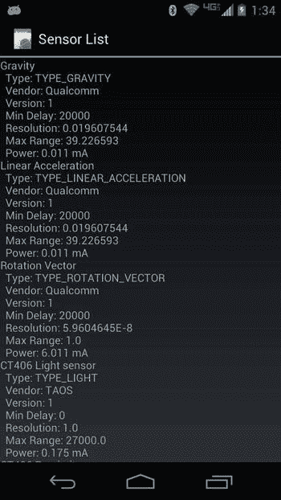
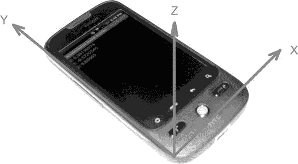
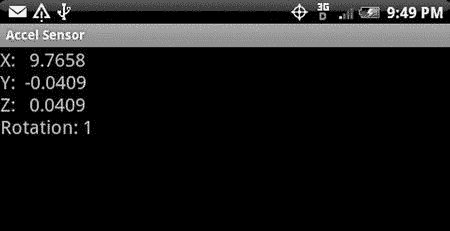
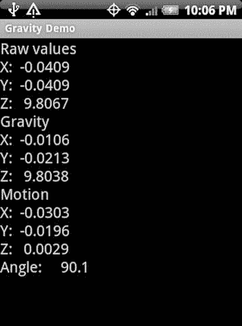

第章第二十四章

使用传感器

Android 设备通常带有内置的硬件传感器，Android 提供了一个与这些传感器一起工作的框架。传感器很有趣。测量外部世界并在设备的软件中使用它是非常酷的。这种编程体验是你在桌子上或服务器机房里的普通电脑上无法获得的。使用传感器的新应用的可能性是巨大的，我们希望你受到启发来实现它们。

在这一章中，我们将探索 Android 传感器框架。我们将解释什么是传感器以及我们如何获得传感器数据，然后讨论我们可以从传感器获得的数据类型的一些细节以及我们可以用这些数据做什么。虽然 Android 已经定义了几种传感器类型，但毫无疑问，Android 的未来会有更多的传感器，我们预计未来的传感器将被纳入传感器框架。

什么是传感器？

在 Android 中， *传感器*是来自物理世界的数据事件的来源。这通常是一个已经连接到设备中的硬件，但 Android 也提供了一些逻辑传感器，可以将来自多个物理传感器的数据结合起来。反过来，应用使用传感器数据来通知用户关于物理世界的信息，控制游戏，进行增强现实，或者为在现实世界中工作提供有用的工具。传感器只在一个方向上工作；它们是只读的。这使得使用它们相当简单。您设置了一个侦听器来接收传感器数据，然后在数据到达时对其进行处理。GPS 硬件就像我们在本章中讨论的传感器。在第 19 章的[中，我们为 GPS 位置更新设置了监听器，当这些位置更新进来时，我们就进行处理。虽然 GPS 类似于传感器，但它不是 Android 提供的传感器框架的一部分。](19.html)

Android 设备中可能出现的一些传感器类型包括

*   光敏感元件
*   近程传感器
*   温度传感器
*   压力传感器
*   陀螺仪传感器
*   加速计
*   磁场传感器
*   重力传感器
*   线性加速度传感器
*   旋转矢量传感器
*   相对湿度传感器

检测传感器

请不要假设，然而，所有的 Android 设备都有所有这些传感器。事实上，许多设备只有其中一些传感器。例如，Android 模拟器只有一个加速度计。那么，如何知道设备上有哪些传感器可用呢？有两种方式，一种直接，一种间接。

第一种方法是向 SensorManager 请求可用传感器的列表。它将响应一个传感器对象列表，然后您可以为其设置监听器并从中获取数据。我们将在本章的稍后部分向您展示如何操作。这种方法假设用户已经将您的应用安装到一个设备上，但是如果这个设备没有您的应用需要的传感器呢？

这就是第二种方法出现的原因。在 AndroidManifest.xml 文件中，您可以指定设备必须具备的特性，以便正确支持您的应用。如果您的应用需要一个近程传感器，您可以在清单文件中用如下所示的行来指定:

```java
<uses-feature android:name="android.hardware.sensor.proximity" />
```

谷歌 Play 商店只会将您的应用安装在具有接近传感器的设备上，因此当您的应用运行时，您会知道它就在那里。对于所有其他 Android 应用商店来说，情况就不一样了。也就是说，一些 Android 应用商店不会进行这种检查，以确保你的应用只能安装在支持你指定的传感器的设备上。

关于传感器我们能知道什么？

虽然在清单文件中使用 uses-feature 标记可以让您知道您的应用需要的传感器存在于设备上，但它并不能告诉您您可能想知道的关于实际传感器的所有信息。让我们构建一个简单的应用，向设备查询传感器信息。[清单 24-1](#list1) 显示了我们的主活动的 Java 代码。

注意

你可以下载本章的项目。我们会在本章末尾给你网址。这将允许您将这些项目直接导入到 IDE 中。

***[清单 24-1](#_list1) 。*T5【传感器列表 App】Java**

```java
public class MainActivity extends Activity {
    @Override
    public void onCreate(Bundle savedInstanceState) {
        super.onCreate(savedInstanceState);
        setContentView(R.layout.main);

        TextView text = (TextView)findViewById(R.id.text);

        SensorManager mgr =
            (SensorManager) this.getSystemService(SENSOR_SERVICE);

        List<Sensor> sensors = mgr.getSensorList(Sensor.TYPE_ALL);

        StringBuilder message = new StringBuilder(2048);
        message.append("The sensors on this device are:\n");

        for(Sensor sensor : sensors) {
            message.append(sensor.getName() + "\n");
            message.append("  Type: " +
                    sensorTypes.get(sensor.getType()) + "\n");
            message.append("  Vendor: " +
                    sensor.getVendor() + "\n");
            message.append("  Version: " +
                    sensor.getVersion() + "\n");
            try {
                message.append("  Min Delay: " +
                    sensor.getMinDelay() + "\n");
            } catch(NoSuchMethodError e) {} // ignore if not found
            try {
                message.append("  FIFO Max Event Count: " +
                    sensor.getFifoMaxEventCount() + "\n");
            } catch(NoSuchMethodError e) {} // ignore if not found
            message.append("  Resolution: " +
                    sensor.getResolution() + "\n");
            message.append("  Max Range: " +
                    sensor.getMaximumRange() + "\n");
            message.append("  Power: " +
                    sensor.getPower() + " mA\n");
        }
        text.setText(message);
    }

    private HashMap<Integer, String> sensorTypes =
                      new HashMap<Integer, String>();

    {
      sensorTypes.put(Sensor.TYPE_ACCELEROMETER, "TYPE_ACCELEROMETER");
      sensorTypes.put(Sensor.TYPE_AMBIENT_TEMPERATURE,
                            "TYPE_AMBIENT_TEMPERATURE");
      /* ... the rest is omitted to save space ... */
    }
}
```

在我们的 onCreate() 方法中，我们首先获取对 SensorManager 的引用。其中只能有一个，所以我们将其作为系统服务进行检索。然后我们调用它的 getSensorList() 方法来获取传感器列表。对于每一个传感器，我们写下它的信息。输出将类似于图 24-1 。



[图 24-1](#_Fig1) 。从我们的传感器列表应用输出

关于此传感器信息，需要了解一些事情。类型值告诉您传感器的基本类型，但没有具体说明。光传感器就是光传感器，但不同设备的光传感器可能会有所不同。例如，一个设备上的光传感器的分辨率可能与另一个设备上的不同。当你在 < uses-feature > 标签中指定你的应用需要一个光传感器时，你并不知道你将会得到什么类型的光传感器。如果这对您的应用有影响，您将需要查询设备来找出并相应地调整您的代码。

您获得的分辨率和最大范围值将采用该传感器的相应单位。功率测量以毫安(mA)为单位，代表传感器从设备电池中汲取的电流；越小越好。

现在我们知道了我们可以使用哪些传感器，我们如何从它们那里获取数据呢？正如我们前面所解释的，我们设置了一个监听器来获取发送给我们的传感器数据。现在让我们来探索一下。

获取传感器事件

一旦我们注册了一个侦听器来接收数据，传感器就会向我们的应用提供数据。当我们的听众不听时，传感器可以关闭，节省电池寿命，所以请确保您只在真正需要的时候听。设置传感器监听器很容易做到。假设我们想要测量光传感器的亮度。清单 24-2 显示了实现这一功能的示例应用的 Java 代码。

***[清单 24-2](#_list2) 。*** 一款光传感器监控 App 的 Java 代码

```java
public class MainActivity extends Activity implements SensorEventListener {
    private SensorManager mgr;
    private Sensor light;
    private TextView text;
    private StringBuilder msg = new StringBuilder(2048);

    @Override
    public void onCreate(Bundle savedInstanceState) {
        super.onCreate(savedInstanceState);
        setContentView(R.layout.main);

        mgr = (SensorManager) this.getSystemService(SENSOR_SERVICE);
        light = mgr.getDefaultSensor(Sensor.TYPE_LIGHT);
        text = (TextView) findViewById(R.id.text);
    }

    @Override
    protected void onResume() {
        mgr.registerListener(this, light,
                SensorManager.SENSOR_DELAY_NORMAL);
        super.onResume();
    }

    @Override
    protected void onPause() {
        mgr.unregisterListener(this, light);
        super.onPause();
    }

    public void onAccuracyChanged(Sensor sensor, int accuracy) {
        msg.insert(0, sensor.getName() + " accuracy changed: " +
            accuracy + (accuracy==1?" (LOW)":(accuracy==2?" (MED)":
            " (HIGH)")) + "\n");
        text.setText(msg);
        text.invalidate();
    }

    public void onSensorChanged(SensorEvent event) {
        msg.insert(0, "Got a sensor event: " + event.values[0] +
        " SI lux units\n");
        text.setText(msg);
        text.invalidate();
    }
}
```

在这个示例应用中，我们再次获得对 SensorManager 的引用，但是我们没有获得传感器列表，而是专门查询光传感器。然后，我们在活动的 onResume() 方法中设置了一个监听器，并在 onPause() 方法中注销了这个监听器。当我们的应用不在前台时，我们不想担心光线水平。

对于 registerListener() 方法，我们传入一个值，表示我们希望多久收到一次传感器值变化的通知。该参数可以是

*   传感器 _ 延迟 _ 正常(代表 200，000 微秒延迟)
*   SENSOR_DELAY_UI(代表 60000 微秒延迟)
*   传感器 _ 延迟 _ 游戏(代表 20000 微秒延迟)
*   传感器 _ 延迟 _ 最快(代表尽可能快)

您还可以使用其他 registerListener 方法之一指定特定的微秒延迟，只要它大于 3 微秒；然而，任何低于 20，000 英镑的都不太可能兑现。为该参数选择合适的值很重要。有些传感器非常敏感，会在短时间内产生大量事件。如果您选择SENSOR _ DELAY _ fast，您甚至可能会超出应用的处理能力。根据您的应用对每个传感器事件的处理，您可能会在内存中创建和销毁太多对象，以至于垃圾收集会导致设备明显变慢和中断。另一方面，某些传感器非常需要尽可能频繁地被读取；这尤其适用于旋转矢量传感器。另外，不要依赖这个参数来生成精确定时的事件。事件可能会来得快一点或慢一点。

因为我们的活动实现了 SensorEventListener 接口，所以我们有两个针对传感器事件的回调: onAccuracyChanged() 和 onSensorChanged() 。第一种方法将让我们知道我们的传感器(或多个传感器，因为它可以被调用多个传感器)的精度是否改变。精度参数的值将为传感器状态不可靠、传感器状态精度低、传感器状态精度中或传感器状态精度高。精度不可靠不代表设备坏了；这通常意味着传感器需要校准。第二个回调方法告诉我们光线水平何时改变，我们得到一个 SensorEvent 对象来告诉我们来自传感器的新值的细节。

一个 SensorEvent 对象有几个成员，其中一个是一个由 float 值组成的数组。对于光传感器事件，只有第一个 float 值有意义，它是传感器检测到的光的 SI lux 值。对于我们的示例应用，我们通过在旧消息的顶部插入新消息来构建消息字符串，然后我们在一个 TextView 中显示这批消息。我们最新的传感器值将始终显示在屏幕顶部。

当您运行这个应用时(当然是在真实的设备上，因为模拟器没有光传感器)，您可能会注意到最初什么也没有显示。只需更改设备左上角的指示灯。这很可能是你的光传感器所在的位置。如果你仔细看，你可能会看到屏幕后面的那个点，那就是光传感器。如果你用手指盖住这个点，光级很可能会变成一个很小的值(虽然可能不会达到零)。信息应该显示在屏幕上，告诉你光线水平的变化。

注意

您可能还会注意到，当光传感器被盖住时，您的按钮会亮起(如果您的设备带有发光按钮)。这是因为 Android 已经检测到了黑暗，并点亮了按钮，使设备在“黑暗中”更容易使用。

获取传感器数据的问题

Android 传感器框架有一些你需要注意的问题。这是不好玩的部分。在某些情况下，我们有办法解决问题；在其他地方我们没有，或者很难。

无法直接访问传感器值

您可能已经注意到，没有直接的方法来查询传感器的当前值。从传感器获取数据的唯一方法是通过监听器。有两种传感器:流式传感器和非流式传感器。流式传感器 s 将定期发送数值，例如加速度计。方法调用 getMinDelay() 将为流式传感器返回一个非零值，告诉您传感器用来感知环境的最小微秒数。对于非流式传感器来说，返回值是零，所以即使你设置了监听器，也不能保证你会在设定的时间内得到新的数据。至少回调是异步的，所以不会阻塞 UI 线程等待来自传感器的数据。然而，您的应用必须适应这样一个事实，即传感器数据可能在您需要的时候不可用。重温图 24-1 ，你会注意到光传感器是不流动的。因此，只有当光线水平发生变化时，您的应用才会获得一个事件。对于所示的其他传感器，事件之间的延迟最小为 20 毫秒，但也可能更长。

可以使用本机代码和 Android 的 JNI 功能直接访问传感器。您需要了解感兴趣的传感器驱动程序的底层本地 API 调用，并且能够设置回 Android 的接口。所以可以做到，但是不容易。

传感器值发送不够快

即使在SENSOR _ DELAY _ fast下，您可能也不会每隔 20 ms 获得一次新值(这取决于设备和传感器)。如果您需要比使用SENSOR _ DELAY _ fast的速率设置所能获得的更快的传感器数据，可以使用本地代码和 JNI 来更快地获得传感器数据，但与前面的情况类似，这并不容易。

传感器随屏幕关闭

Android 2.x 中出现了传感器更新在屏幕关闭时关闭的问题。显然有人认为，如果屏幕关闭，不发送传感器更新是一个好主意，即使你的应用(很可能使用服务)有一个唤醒锁。基本上，当屏幕关闭时，你的监听器会被注销。

这个问题有几种解决方法。有关此问题以及可能的解决方案和变通办法的更多信息，请参考 Android 问题 11028:

```java
[http://code.google.com/p/android/issues/detail?id=11028](http://code.google.com/p/android/issues/detail?id=11028)
```

现在你知道了如何从传感器获取数据，你能用这些数据做什么？如前所述，根据从哪个传感器获取数据，values 数组中返回的值有不同的含义。下一节将探讨每种传感器类型及其值的含义。

解释传感器数据

现在，您已经了解了如何从传感器获取数据，您将希望对这些数据做一些有意义的事情。然而，您获得的数据将取决于您从哪个传感器获得数据。有些传感器比其他传感器简单。在接下来的部分中，我们将描述您将从我们目前了解的传感器中获得的数据。随着新设备的出现，新的传感器无疑也会被引入。传感器框架很可能保持不变，因此我们在这里展示的技术应该同样适用于新的传感器。

光传感器

光传感器 是设备上最简单的传感器之一，也是本章第一个示例应用中使用的传感器。传感器给出由设备的光传感器检测到的光水平的读数。随着光线水平的变化，传感器读数也会变化。数据的单位是 SI lux 单位。要了解这意味着什么，请参阅本章末尾的“参考资料”部分，获取更多信息的链接。

对于 SensorEvent 对象中的值数组，光线传感器只使用第一个元素 values[0] 。该值是一个浮动值，从技术上讲，范围从 0 到特定传感器的最大值。我们说*在技术上是*，因为传感器在没有光线的时候可能只发送非常小的值，而从来不会实际发送值 0 。

还要记住，传感器可以告诉我们它可以返回的最大值，不同的传感器可以有不同的最大值。出于这个原因，在 SensorManager 类中考虑与光线相关的常数可能没有用。比如 SensorManager 有一个常量叫做 LIGHT_SUNLIGHT_MAX ，是一个 float 值 12 万；然而，当我们之前查询我们的设备时，返回的最大值是 10，240，显然比这个常量值小得多。还有一个叫 LIGHT_SHADE 在 20000，也在我们测试的设备最大值以上。因此，在编写使用光传感器数据的代码时，请记住这一点。

接近传感器

接近传感器 要么测量某个物体距离设备的距离(以厘米为单位),要么代表一个标志来表示物体是近还是远。一些接近传感器将给出范围从 0.0 到最大值的增量值，而其他传感器返回 0.0 或仅返回最大值。如果接近传感器的最大范围等于传感器的分辨率，那么你知道它是只返回 0.0 或最大值的传感器之一。有最大值为 1.0 的设备，也有最大值为 6.0 的设备。不幸的是，在应用安装和运行之前，没有办法知道你将得到哪个接近传感器。即使您在接近传感器的 AndroidManifest.xml 文件中放置了一个 < uses-feature > 标签，您也可以获得任何一种标签。除非您绝对需要更细粒度的接近传感器，否则您的应用应该很好地适应这两种类型。

关于接近传感器有一个有趣的事实:接近传感器有时和光传感器是同一个硬件。然而，Android 仍然将它们视为逻辑上独立的传感器，所以如果您需要来自两者的数据，您将需要为每一个设置一个监听器。这里有另一个有趣的事实:接近传感器通常用于手机应用，以检测设备旁边是否有人的头部。如果头部离触摸屏如此之近，触摸屏将被禁用，因此当人在打电话时，耳朵或脸颊不会意外按下任何按键。

本章的源代码项目包括一个简单的近程传感器监视器应用，它基本上是光传感器监视器应用，修改后使用近程传感器而不是光传感器。我们不会在本章中包含代码，但是您可以自己尝试。

温度传感器

旧的不推荐使用的温度传感器 (TYPE_TEMPERATURE)提供温度读数，并且在值【0】中只返回一个值。该传感器通常读取内部温度，例如电池的温度。有一种新型温度传感器叫做TYPE _ AMBIENT _ TEMPERATURE。新值表示设备外部的温度，单位为摄氏度。

温度传感器的位置取决于器件，温度读数可能会受到器件本身产生的热量的影响。本章的项目包括一个名为温度传感器的温度传感器。它负责根据运行的 Android 版本调用正确的温度传感器。

压力传感器 s

该传感器测量大气压力，例如可以检测海拔高度或用于天气预测。该传感器不应与触摸屏产生具有压力值(触摸压力)的运动事件的能力相混淆。我们在[第 22 章](22.html)中讨论过这种触摸类型的压力感应。触摸屏压力感测不使用 Android 传感器框架。

压力传感器的测量单位为大气压力，单位为 hPa(毫巴)，该测量值以值[0] 表示。

陀螺仪传感器

陀螺仪 是非常酷的组件，可以测量设备相对于参考系的扭曲度。换句话说，陀螺仪测量绕轴旋转的速率。当设备不旋转时，传感器值将为零。当有任何方向的旋转时，你会从陀螺仪得到非零值。陀螺仪常用于导航。但是陀螺仪本身并不能告诉你导航所需要知道的一切。不幸的是，随着时间的推移，错误会慢慢出现。但是再加上加速度计，就可以确定设备的运动路径。

卡尔曼滤波器可用于将来自两个传感器的数据联系在一起。加速度计在短期内不是非常精确，陀螺仪在长期内也不是非常精确，所以结合起来，它们可以一直相当精确。虽然卡尔曼滤波器非常复杂，但有一种替代方法叫做*互补滤波器* ，它更容易在代码中实现，并且产生非常好的结果。这些概念超出了本书的范围。

陀螺仪传感器返回 x、y 和 z 轴的值数组中的三个值。单位是弧度/秒，数值代表绕每个轴的旋转速率。处理这些值的一种方法是对它们进行时间积分，以计算角度变化。这种计算类似于将线速度与时间相结合来计算距离。

加速计

加速度计可能是设备上使用最多的传感器。使用这些传感器，您的应用可以确定设备在空间中相对于重力直接下拉的物理方向，并了解作用在设备上的力。提供这些信息允许应用做各种有趣的事情，从玩游戏到增强现实。当然，加速度计会告诉 Android 何时将用户界面的方向从纵向切换到横向，然后再切换回来。

加速度计坐标系是这样工作的:加速度计的 x 轴从设备的左下角开始，穿过底部到右边。y 轴也从左下角开始，沿着显示屏的左侧向上。z 轴从左下角开始，在远离设备的空间中向上延伸。图 24-2 显示了这意味着什么。



[图 24-2](#_Fig2) 。加速度计坐标系

这个坐标系不同于布局和 2D 图形中使用的坐标系。在这个坐标系中，原点(0，0)在左上角，y 在屏幕下方是正的。在处理不同参照系的坐标系时很容易混淆，所以要小心。

我们还没有说加速度计的值意味着什么，那么它们意味着什么呢？加速度的单位是米每秒平方(米/秒 <sup>2</sup> )。正常的地球重力是 9.81 米/秒 <sup>2</sup> ，向地心拉下。从加速度计的角度来看，重力测量值为–9.81。如果您的设备完全静止(不动)并且位于一个非常平坦的表面上，x 和 y 读数将为 0，z 读数将为+9.81。实际上，由于加速度计的灵敏度和精度，这些值不会完全相同，但它们会很接近。当设备静止时，重力是唯一作用在设备上的力，因为重力直接向下拉动，如果我们的设备完全平坦，它对 x 轴和 y 轴的影响为零。在 z 轴上，加速度计测量设备上的力减去重力。因此，0 减–9.81 等于+9.81，这就是 z 值(在 SensorEvent 对象中又称为values【2】)。

加速度计发送给应用的值始终代表设备上的力减去重力的总和。如果你拿起一个非常平的设备，把它垂直向上举起，z 值一开始会增加，因为你增加了向上(z)方向的力。一旦你的提升力停止，总的力就会回到重力状态。如果该设备被摔落(假设——请不要这样做)，它将朝着地面加速，这将使重力为零，因此加速度计将读取 0 力。

让我们从[图 24-2](#Fig2) 中取出设备，并向上旋转，使其处于纵向模式和垂直状态。x 轴也是一样，从左指向右。我们的 y 轴现在是直上直下的，z 轴指向屏幕外面直对着我们。y 值将为+9.81，x 和 z 都将为 0。

当你将设备旋转到横向模式并继续垂直拿着它，屏幕就在你的面前时会发生什么？如果你猜 y 和 z 现在是 0，x 是+9.81，那你就对了。图 24-3 显示了它可能的样子。



[图 24-3](#_Fig3) 。横向垂直加速计数值

当设备不移动或以恒定速度移动时，加速度计仅测量重力。在每个轴上，加速度计的值是重力在那个轴上的分量。因此，使用一些三角学，你可以计算出角度，并知道设备相对于重力的方向。也就是说，你可以知道设备是处于纵向模式还是横向模式，或者处于某种倾斜模式。事实上，这正是 Android 所做的，以确定使用哪种显示模式(纵向或横向)。然而，请注意，加速度计并没有说明设备如何相对于磁北定向。因此，虽然你可以知道设备是在横向模式下垂直放置的，但你不知道你是面向东还是面向西或者两者之间的任何地方。这就是磁场传感器的用武之地，我们将在后面的章节中讨论。

加速度计和显示方向

设备中的加速度计是硬件，它们牢固地连接在一起，因此相对于设备具有特定的方向，不会随着设备的转动而改变。加速度计发送到 Android 的值当然会随着设备的移动而改变，但加速度计的坐标系相对于物理设备保持不变。然而，当用户从纵向到横向再返回时，显示器的坐标系会改变。事实上，根据屏幕转动的方式，纵向可以是正面朝上，也可以是 180 度倒置。类似地，风景可以是相隔 180 度的两个不同旋转之一。

当您的应用正在读取加速度计数据并希望正确影响用户界面时，您的应用必须知道显示器发生了多大的旋转，才能进行适当的补偿。当您的屏幕从纵向重新定向为横向时，屏幕的坐标系相对于加速度计的坐标系发生了旋转。要处理这一点，您的应用必须使用方法display . get rotation()。返回值是一个简单的整数，但不是旋转的实际度数。该值将是面中的一个。、面旋转 _0。旋转 _90 ，面。ROTATION_180 或面。旋转 _270 。这些常量的值分别为 0 、 1 、 2 和 3 。这个返回值告诉你显示器从设备的“正常”方向旋转了多少。因为不是所有的 Android 设备都正常处于人像模式，所以你不能假设人像处于 ROTATION_0 。

加速度计和重力

到目前为止，我们只是简单地谈到了当设备移动时加速度计值会发生什么变化。让我们进一步探讨这个问题。加速度计将检测到作用在设备上的所有力。如果抬起设备，初始升力在 z 方向为正，您会得到一个大于+9.81 的 z 值。如果你把设备推到左边，你会在 x 方向得到一个初始的负读数。

你想要做的是，把重力和作用在设备上的其他力分开。有一种相当简单的方法可以做到这一点，它被称为*低通滤波器* 。除了重力之外，作用在该装置上的力通常不是渐进的。换句话说，如果用户正在摇动设备，则摇动力会迅速反映在加速度计值中。低通滤波器将有效地去除振动力，只留下稳定的力，即重力。让我们用一个示例应用来说明这个概念。它叫做重力演示。清单 24-3 显示了 Java 代码。

***[清单 24-3](#_list3) 。*** 用加速度计测量重力

```java
// This file is MainActivity.java
public class MainActivity extends Activity implements SensorEventListener {
    private SensorManager mgr;
    private Sensor accelerometer;
    private TextView text;
    private float[] gravity = new float[3];
    private float[] motion = new float[3];
    private double ratio;
    private double mAngle;
    private int counter = 0;

    @Override
    public void onCreate(Bundle savedInstanceState) {
        super.onCreate(savedInstanceState);
        setContentView(R.layout.main);

        mgr = (SensorManager) this.getSystemService(SENSOR_SERVICE);
        accelerometer = mgr.getDefaultSensor(Sensor.TYPE_ACCELEROMETER);
        text = (TextView) findViewById(R.id.text);
    }

    @Override
    protected void onResume() {
        mgr.registerListener(this, accelerometer,
        SensorManager.SENSOR_DELAY_UI);
        super.onResume();
    }

    @Override
    protected void onPause() {
        mgr.unregisterListener(this, accelerometer);
        super.onPause();
    }

    public void onAccuracyChanged(Sensor sensor, int accuracy) {
        // ignore
    }

    public void onSensorChanged(SensorEvent event) {
        // Use a low-pass filter to get gravity.
        // Motion is what's left over
        for(int i=0; i<3; i++) {
            gravity [i] = (float) (0.1 * event.values[i] +
                                   0.9 * gravity[i]);
            motion[i] = event.values[i] - gravity[i];
        }

        // ratio is gravity on the Y axis compared to full gravity
        // should be no more than 1, no less than -1
        ratio = gravity[1]/SensorManager.GRAVITY_EARTH;
        if(ratio > 1.0) ratio = 1.0;
        if(ratio < -1.0) ratio = -1.0;

        // convert radians to degrees, make negative if facing up
        mAngle = Math.toDegrees(Math.acos(ratio));
        if(gravity[2] < 0) {
            mAngle = -mAngle;
        }

        // Display every 10th value
        if(counter++ % 10 == 0) {
            String msg = String.format(
                "Raw values\nX: %8.4f\nY: %8.4f\nZ: %8.4f\n" +
                "Gravity\nX: %8.4f\nY: %8.4f\nZ: %8.4f\n" +
                "Motion\nX: %8.4f\nY: %8.4f\nZ: %8.4f\nAngle: %8.1f",
                event.values[0], event.values[1], event.values[2],
                gravity[0], gravity[1], gravity[2],
                motion[0], motion[1], motion[2],
                mAngle);
            text.setText(msg);
            text.invalidate();
            counter=1;
        }
    }
}
```

运行该应用的结果是一个类似于[图 24-4](#Fig4) 的显示。这张截图是在设备平放在桌子上时拍摄的。



[图 24-4](#_Fig4) 。重力、运动和角度值

这个示例应用的大部分与之前的 Accel 传感器应用相同。不同之处在于 onSensorChanged() 方法。我们试图跟踪重力和运动，而不是简单地显示事件数组中的值。通过只使用事件数组中的一小部分新值和重力数组中以前值的大部分来获得重力。所用的两部分之和必须是 1.0。我们用了 0.9 和 0.1。您也可以尝试其他值，例如 0.8 和 0.2。我们的重力阵列不可能像实际传感器值那样快速变化。但这更接近现实。这就是低通滤波器的作用。只有当力导致设备移动时，事件数组值才会改变，并且您不希望将这些力作为重力的一部分来测量。你只想在你的重力数组中记录重力本身。这里的数学并不意味着您神奇地只记录重力，但是您计算的值将会比事件数组中的原始值更接近。

还要注意代码中的运动数组。通过跟踪原始事件数组值和计算出的重力值之间的差异，您基本上是在测量运动数组中设备上的主动力、非重力。如果运动数组中的值为零或非常接近零，这意味着设备可能没有移动。这是有用的信息。从技术上讲，以恒定速度移动的设备在运动数组中也具有接近于零的值，但是实际情况是，如果用户正在移动设备，运动值将稍微大于零。用户不可能以完美的恒定速度移动设备。

最后，请注意这个例子没有产生需要垃圾收集的新对象。在处理传感器事件时，不创建新对象是非常重要的；否则，您的应用将花费太多时间暂停垃圾收集周期。

使用加速度计测量设备的角度

在我们继续之前，我们想再向您展示一个关于加速度计的东西。如果我们回顾三角学的课程，我们会记得角的余弦是近边和斜边的比值。如果我们考虑 y 轴和重力本身之间的角度，我们可以测量重力在 y 轴上的力，然后取反余弦来确定角度。我们在这段代码中也做到了这一点，尽管这里我们不得不再次处理 Android 中一些混乱的传感器。在 SensorManager 中有不同重力常数的常数，包括地球的。但是您的实际测量值可能会超过定义的常数。接下来我们会解释这是什么意思。

理论上，你的设备在静止状态下会测得一个与恒定值相等的重力值，但这种情况很少发生。静止时，加速度计传感器很可能会给我们一个大于或小于常数的重力值。因此，我们的比率最终可能会大于 1，或者小于负 1。这会让 acos() 方法抱怨，所以我们将比率值固定为不大于 1 且不小于-1。相应的角度范围从 0 度到 180 度。这很好，除了这样我们不会得到从 0 到–180 的负角度。为了获得负角度，我们使用重力数组中的另一个值，即 z 值。如果重力的 z 值为负，则意味着设备的正面朝下。对于所有那些设备面朝下的值，我们也使我们的角度为负，结果是我们的角度从–180 到+180，正如我们所预期的。

继续尝试这个示例应用。请注意，当设备平放时，角度值为 90 °,当设备在我们面前上下垂直放置时，角度值为零(或接近于 90°)。如果我们继续向下旋转越过 flat，我们会看到角度值超过 90°。如果我们将设备从 0°位置向上倾斜更多，角度值将变为负值，直到我们将设备举过头顶，角度值为–90°。最后，您可能已经注意到了我们的计数器，它控制显示更新的频率。因为传感器事件可能会非常频繁地出现，所以我们决定每十次获取值时才显示一次。

磁场传感器

磁场传感器测量 x、y 和 z 轴上的环境磁场。该坐标系就像加速度计一样对齐，因此 x、y 和 z 如图 24-2 中的[所示。磁场传感器的单位是微特斯拉(uT)。这个传感器可以探测地球磁场，从而告诉我们北极在哪里。这个传感器也被称为*指南针*](#Fig2) ，实际上 < uses-feature > 标签使用Android . hardware . sensor . compass作为这个传感器的名称。由于这种传感器非常微小和敏感，它会受到设备附近物体产生的磁场的影响，甚至在某种程度上影响设备内的组件。因此，磁场传感器的准确性有时会受到怀疑。

我们在网站的下载部分包含了一个简单的 CompassSensor 应用，所以可以随意导入并使用它。如果您在此应用运行时将金属物体放在设备附近，您可能会注意到相应的数值变化。当然，如果你把一块磁铁靠近设备，你会看到数值发生变化。事实上，谷歌 Cardboard“设备”在一个物理按钮下使用了一块磁铁，当按钮被按下时，手机会检测到磁场的变化。

你可能会问，我可以用指南针传感器作为指南针来检测北在哪里吗？答案是:它本身不会。虽然指南针传感器可以检测设备周围的磁场，但如果设备没有完全平放在地球表面，您将无法正确解读指南针传感器的值。但是你有加速度计可以告诉你设备相对于地球表面的方向！因此，您可以从指南针传感器创建一个指南针，但您也需要加速度计的帮助。让我们来看看如何做到这一点。

一起使用加速度计和磁场传感器

SensorManager 提供了一些方法，允许我们结合指南针传感器和加速度计来计算方向。正如我们刚刚讨论的，您不能只使用指南针传感器来完成这项工作。因此 SensorManager 提供了一个名为 getRotationMatrix() 的方法，该方法从加速度计和指南针获取值，并返回一个可用于确定方向的矩阵。

另一个 SensorManager 方法， getOrientation() ，采用前一步的旋转矩阵，给出一个方向矩阵。方向矩阵中的值告诉您设备相对于地球磁北极的旋转，以及设备相对于地面的俯仰和滚动。

磁偏角和地磁场

关于方向和设备，我们还想讨论另一个话题。指南针传感器会告诉你磁北在哪里，但不会告诉你真北在哪里(也叫地理北)。想象你正站在磁北极和地理北极的中点。他们会相差 180 度。离两个北极越远，这个角度差就越小。磁北与真北的角度差称为*磁偏角* 。而且这个值只能相对于行星表面上的一个点来计算。也就是说，你必须知道你站在哪里，才能知道地理北极相对于磁北极的位置。幸运的是，Android 有一种方法可以帮助你，那就是地磁领域T5 类。

为了实例化一个 GeomagneticField 类的对象，您需要传入一个纬度和经度。因此，为了得到磁偏角，你需要知道参考点在哪里。您还需要知道您想要该值的时间。磁北极随时间漂移。一旦实例化，您只需调用此方法来获取偏角(以度为单位):

```java
float declinationAngle = geoMagField.getDeclination();
```

如果磁北在地理北的东面，则下倾角的值将为正。

重力传感器

这个传感器不是一个独立的硬件。这是一个基于加速度计的虚拟传感器。事实上，这种传感器使用的逻辑类似于我们之前描述的加速度计，以产生作用于设备的力的重力分量。然而，我们不能访问这个逻辑，所以无论在重力传感器类中使用什么因素和逻辑，我们都必须接受。不过，虚拟传感器可能会利用陀螺仪等其他硬件来帮助它更准确地计算重力。该传感器的值数组报告重力，就像加速计传感器报告其值一样。

线性加速度传感器

与重力传感器类似，线性加速度传感器 是一种虚拟传感器，代表加速度计力减去重力。同样，我们之前对加速度计传感器值进行了自己的计算，以去除重力，从而获得这些线性加速度力值。这个传感器让你更方便。它可以利用陀螺仪等其他硬件来帮助它更精确地计算线性加速度。值数组报告线性加速度，就像加速度计传感器报告其值一样。

旋转矢量传感器

旋转矢量传感器 代表设备在空间中的方位，相对于硬件加速度计的参考框架有一定角度(见[图 24-2](#Fig2) )。该传感器返回一组表示单位四元数的最后三个分量的值。四元数是一个可以写满一本书的主题，所以我们不会在这里深入讨论。

谢天谢地，谷歌在 SensorManager 中提供了一些方法来帮助这个传感器。getquaternionfromvvector()方法将旋转矢量传感器输出转换为归一化四元数。getrotationmatrix from vector()方法将旋转矢量传感器输出转换为旋转矩阵，可与 getOrientation() 一起使用。但是，当将旋转矢量传感器输出转换为方向矢量时，您需要意识到它的范围是从–180 度到+180 度。

本章示例应用的 ZIP 文件包括一个版本的 VirtualJax ，它显示了正在使用的旋转矢量。

参考

以下是一些对您可能希望进一步探索的主题有帮助的参考:

*   :与本书相关的可下载项目列表。对于这一章，寻找一个名为pro Android 5 _ Ch24 _ sensors . ZIP的 ZIP 文件。该文件包含本章中的所有项目，列在单独的根目录中。还有一个自述。TXT 文件，它准确地描述了如何将项目从这些 ZIP 文件之一导入到 IDE 中。
*   :维基百科词条勒克司，光的度量单位。
*   :来自 NOAA 的地磁信息。
*   :大卫·萨克斯关于加速度计、陀螺仪、指南针和 Android 开发的谷歌技术演讲。
*   [http://stack overflow . com/questions/1586658/combine-gyroscope-and-accelerometer-data](http://stackoverflow.com/questions/1586658/combine-gyroscope-and-accelerometer-data):stackoverflow.com上一篇不错的帖子，谈到了组合陀螺仪和加速度计传感器数据以供应用。
*   [http://en . Wikipedia . org/wiki/Quaternions _ and _ spatial _ rotation](http://en.wikipedia.org/wiki/Quaternions_and_spatial_rotation):关于四元数及其如何用于表示空间旋转的维基百科页面，例如 Android 设备。

摘要

在本章中，我们讨论了以下主题:

*   安卓有哪些传感器。
*   找出设备上的传感器。
*   指定应用加载到 Android 设备之前所需的传感器。
*   确定设备上传感器的属性。
*   如何获取传感器事件？
*   事实上，只要传感器值发生变化，事件就会发生，因此了解在获得第一个值之前可能会有一个滞后是很重要的。
*   传感器更新的不同速度以及何时使用每种速度。
*   SensorEvent 的详细信息以及这些信息如何用于各种传感器类型。
*   虚拟传感器，由来自其他传感器的数据组成。旋转矢量传感器就是其中之一。
*   使用传感器确定设备的角度，并告知设备面向哪个方向。