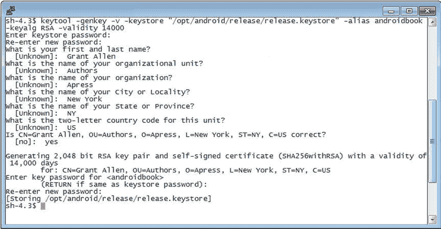
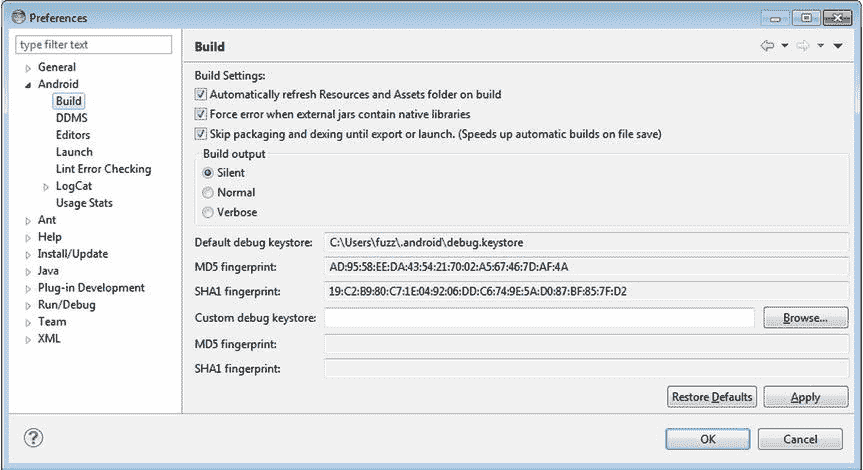
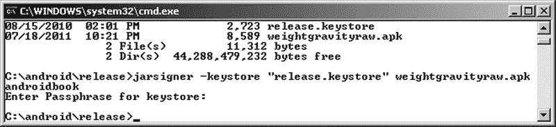
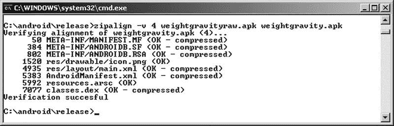
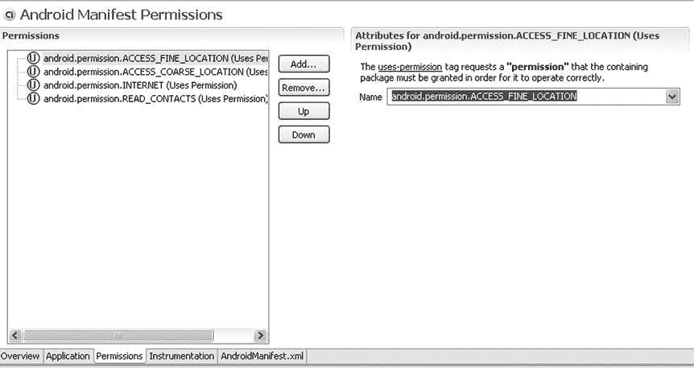

# 二十八、探索安全性和权限

不讨论安全性，对现代开发平台或操作系统的探索就不完整。在 Android 中，安全性跨越了应用生命周期的所有阶段——从设计时策略考虑到运行时边界检查。在这一章中，你将学习 Android 的安全架构，并理解如何设计安全的应用。

让我们从 Android 安全模型开始。

了解 Android 安全模型

让我们深入讨论任何 Android 应用的部署和执行过程中的安全性。要部署 Android 应用，您必须使用数字证书对其进行签名，以便将其安装到设备上。关于执行，Android 在一个单独的进程中运行每个应用，其中每个进程都有一个唯一且永久的用户 id(在安装时分配)。这在进程周围设置了一个边界，防止一个应用直接访问另一个应用的数据。此外，Android 定义了声明式权限模型，保护敏感特性(如联系人列表)。

在接下来的几节中，我们将讨论这些主题。但是在我们开始之前，让我们先概述一下我们稍后将会提到的一些安全概念。

安全概念概述

Android 要求应用使用数字证书签名。此要求的好处之一是，应用不能用不是由原始作者或签名证书持有人发布的版本进行更新。例如，如果我们发布了一个应用，那么您不能用您的版本更新我们的应用(当然，除非您以某种方式获得了我们的证书)。也就是说，应用被签名意味着什么？还有签申请的流程是怎样的？

您使用数字证书对应用进行签名。一个*数字证书* 是一个包含你的信息的工件，比如你的公司名称、地址等等。数字证书的一些重要属性包括它的签名和公钥/私钥。公钥/私钥也称为*密钥对* 。注意，虽然这里用数字证书来签名。apk 文件，您也可以将它们用于其他目的(比如加密通信、签署文档等等)。您可以从可信的证书颁发机构(CA)获得数字证书，也可以使用诸如 keytool 之类的工具自己生成一个数字证书，我们稍后将对此进行讨论。数字证书存储在密钥库中。一个 *keystore* 包含一个数字证书列表，每个证书都有一个别名，您可以用它在 keystore 中引用它。

签署一个 Android 应用需要三样东西:一个数字证书。您希望签名的应用的 apk 文件，以及知道如何将数字签名应用到的工具。apk 文件。我们使用一个免费的工具，它是 Java 开发工具包(JDK)发行版的一部分，名为 jarsigner 。这个工具是一个命令行工具，它知道如何签署一个。jar 文件和一个。apk 文件实际上只是一个 zip 格式的文件，收集在一起。jar 文件和其他一些资源。还有其他签名工具可用，因此您可以自由选择最适合您的工具。

现在，让我们继续讨论如何签署。带有数字证书的 apk 文件。

为部署签署应用

要在设备上安装 Android 应用，首先需要签署 Android 包()。apk 文件)使用数字证书。然而，证书可以是自签名的——你不需要从认证机构如 VeriSign 购买证书。请注意，自签名证书通常被认为不太可信，在某些环境中被认为是不安全的。

对应用进行部署签名包括三个步骤。第一步是使用 keytool (或类似的工具)生成一个证书。第二步涉及使用 jarsigner 工具对进行签名。apk 文件和生成的证书。第三步是在内存边界上对齐应用的各个部分，以便在设备上运行时更有效地使用内存。注意，在开发过程中，Eclipse 的 ADT 插件和 Android Developer Studio 都会为您处理一切:签署您的。apk 文件并进行内存对齐，然后部署到仿真器或设备上。

使用 Keytool 生成自签名证书

keytool 工具管理一个私有密钥及其对应的 X.509 证书(数字证书的标准)的数据库。这个工具随 JDK 一起提供，驻留在 JDK bin 目录下。如果你按照[第二章](02.html)中关于改变路径的说明，JDK bin 目录应该已经在你的路径中了。在这一节中，我们将向您展示如何生成一个只有一个条目的密钥库，稍后您将使用它来签署一个 Android 。apk 文件。要生成密钥库条目，请执行以下操作:

1.  创建一个文件夹来保存密钥库，比如 c:\android\release\ 。或者 */opt/android/release* (取决于你的操作系统)。
2.  打开一个 shell 或命令窗口，用[清单 28-1](#list1) 中显示的参数执行 keytool 工具。

***[清单 28-1](#_list1) 。*** 使用 keytool 工具生成密钥库条目

```java
keytool -genkey -v -keystore "c:\android\release\release.keystore"
-alias androidbook -keyalg RSA
-validity 14000
```

传递给 keytool 的所有参数汇总在[表 28-1](#Tab1) 中。

[表 28-1](#_Tab1) 。传递给 keytool 工具的参数

| 

争吵

 | 

描述

 |
| --- | --- |
| 键 | 告诉 keytool 生成公钥/私钥对。 |
| v | 告诉 keytool 在密钥生成期间发出详细输出。 |
| 密钥库 | 密钥库数据库的路径(在本例中是一个文件)。如有必要，将创建该文件。 |
| 别名 | 密钥库条目的唯一名称。稍后将使用此别名来引用密钥库条目。 |
| 键藻 | 算法。 |
| 有效期 | 有效期。 |

keytool 将在创建密钥库和您正在创建的条目时提示您输入两个密码。提示的第一个密码是密钥库本身的密码，它控制对您将存储的所有密钥材料的访问。这也可以使用 storepass 参数来指定。第二个密码是您正在创建的私钥和相关证书的密码，也可以通过 keypass 参数获得。您应该习惯于*而不是*将这些作为参数包含在命令行中，而是更喜欢让 keytool 提示您，这是一种良好的通用安全实践。

请注意，如果您确实使用了 keytool 的密码参数，那么任何能够访问您的 shell 或命令行历史的人都可以看到密码，就像任何能够在 keytool 运行时列出您的机器上正在运行的进程的人一样。清单 28-1 中的命令将在您的 keystore 文件夹中生成一个 keystore 数据库文件。数据库将是一个名为 release.keystore 的文件。参赛作品的有效期将是 14000 天(或大约 38 年)，这是一段很长的时间。你应该明白这其中的原因。Android 文档建议您指定一个足够长的有效期，以超过应用的整个生命周期，这将包括应用的许多更新。建议有效期至少为 25 年。如果您计划在 Google Play 上发布应用，您的证书至少需要在 2033 年 10 月 22 日之前有效。Google Play 会在上传时检查每个应用，以确保它至少在此之前有效。

**注意**因为您在任何应用更新中的证书必须与您第一次使用的证书相匹配，所以请确保您保护好您的密钥材料。确保您的密钥库文件或密钥对(如果您选择导出它们)的安全！如果您失去了对 keystore 或底层密钥的访问，并且无法重新创建它，那么您将无法更新您的应用，而必须发布一个全新的应用。

回到 keytool ，参数别名是赋予密钥库数据库中条目的唯一名称；稍后您将使用这个名称来引用该条目。当您运行[清单 28-1](#list1) 中的 keytool 命令时， keytool 会问您几个问题(参见[图 28-1](#Fig1) )，然后生成密钥库数据库和条目。



[图 28-1](#_Fig1) 。由 keytool 提出的附加问题

一旦有了生产证书的密钥库文件，就可以重用这个文件来添加更多的证书。只需再次使用 keytool ，并指定您现有的 keystore 文件。

调试密钥库和开发证书

我们提到过 Eclipse 的 ADT 插件和 Android Developer Studio 都负责为您设置开发密钥库。但是，开发期间用于签名的默认证书不能用于实际设备上的生产部署。这部分是因为自动生成的开发证书只有 365 天的有效期，这显然不会让您超过 2033 年 10 月 22 日。那么在发育的第三百六十六天会发生什么呢？您将得到一个构建错误。您现有的应用应该仍然可以运行，但是要构建应用的新版本，您需要生成新的证书。最简单的方法是删除现有的 debug.keystore 文件，一旦再次需要它，ADT(例如)将生成一个新文件和证书，有效期为 365 天。

要找到您的 debug.keystore 文件，假设您正在使用 Eclipse 和 ADT，打开 Eclipse 的 Preferences 屏幕并进入 Android  Build。调试证书的位置将显示在默认的调试密钥库字段中，如图[图 28-2](#Fig2) 所示(如果找不到首选项菜单，请参见[第 2 章](02.html))。



[图 28-2](#_Fig2) 。调试证书的位置

当然，现在您已经获得了新的开发证书，您不能在 Android 虚拟设备(AVDs)或使用新开发证书的设备上更新您现有的应用。Eclipse 将在控制台中提供消息，告诉您首先使用 adb 卸载现有的应用，您当然可以这样做。如果您在 AVD 上安装了许多应用，您可能会觉得简单地重新创建 AVD 更容易，因此它不包含任何应用，您可以从头开始。为了在一年后避免这个问题，您可以生成自己的 debug.keystore 文件，它具有您想要的任何有效期。显然，它需要与 ADT 创建的文件具有相同的文件名，并且位于相同的目录中。证书别名为 androiddebugkey ，而 storepass 和 keypass 都是“Android”。ADT 将证书上的名和姓设置为“Android Debug”，组织单位设置为“Android”，双字母国家代码设置为“US”。您可以将组织、城市和州的值保留为“未知”。

如果您使用旧的调试证书从 Google 获得了一个 map-api 密钥，您将需要获得一个新的 map-api 密钥来匹配新的调试证书。我们在第 19 章的[中介绍了地图 api 键。](19.html)

现在您有了一个数字证书，可以用来签署您的作品。apk 文件，您需要使用 jarsigner 工具来进行签名。以下是如何做到这一点。

使用 Jarsigner 工具对。apk 文件

上一节描述的 keytool 工具创建了一个数字证书，这是 jarsigner 工具的参数之一。jarsigner 的另一个参数是实际要签名的 Android 包。要生成 Android 包，您需要使用 Eclipse 的 ADT 插件中的导出未签名的应用包工具(或 Android Developer Studio 中的等效功能)。您可以通过在 Eclipse 中右键单击一个 Android 项目，选择 Android Tools，然后选择 Export Unsigned Application Package 来访问该工具。运行导出未签名的应用包工具将生成一个。不会用调试证书签名的 apk 文件。

要了解这是如何工作的，在您的一个 Android 项目上运行 Export Unsigned Application Package 工具，并存储生成的。apk 文件在某处。对于这个例子，我们将使用我们之前创建的 keystore 文件夹，并生成一个。apk 文件名为c:\ Android \ release \ myapp raw . apk。

同。apk 文件和密钥库条目，运行 jarsigner 工具对进行签名。apk 文件(见[清单 28-2](#list2) )。使用您的密钥库文件和的完整路径名。apk 文件。

***[清单 28-2](#_list2) 。*T5 使用 jarsigner 对进行签名。apk 文件**

```java
jarsigner -keystore "PATH TO YOUR release.keystore FILE" -storepass paxxword -keypass paxxword "PATH TO YOUR RAW APK FILE" androidbook

```

签了。apk 文件，您传递密钥库的位置、密钥库密码、私钥密码、到的路径。apk 文件，以及密钥库条目的别名。然后签名人会在上签名。apk 文件，其中包含来自 keystore 条目的数字证书。要运行 jarsigner 工具，您需要打开一个工具窗口(如[第 2 章](02.html)中所述)或打开一个命令或终端窗口，然后导航到 JDK bin 目录或确保您的 JDK bin 目录在系统路径上。出于安全原因，更安全的做法是不使用命令的密码参数，只让 jarsigner 在需要时提示您输入密码。[图 28-3](#Fig3) 显示了 jarsigner 工具调用的样子。你可能已经注意到 jarsigner 在[图 28-3](#Fig3) 中只提示了一个密码。当 storepass 和 keypass 相同时，Jarsigner 发现不要询问 keypass 密码。严格来说，[清单 28-2](#list2) 中的 jarsigner 命令只需要–key pass，如果它的密码与–store pass不同。



[图 28-3](#_Fig3) 。使用 jarsigner

正如我们前面指出的，Android 要求应用用数字签名进行签名，以防止恶意程序员用他们的版本更新您的应用。为了做到这一点，Android 要求对应用的更新必须使用与原始签名相同的签名。如果你用不同的签名给应用签名，Android 会把它们当作两个不同的应用。因此，我们再次提醒您，要小心您的密钥库文件，以便在以后需要为您的应用提供更新时可以使用它。

使用 zipalign 调整您的应用

您希望应用在设备上运行时尽可能节省内存。如果您的应用在运行时包含未压缩的数据(可能是某些图像类型或数据文件)，Android 可以使用 mmap() 调用将这些数据直接映射到内存中。不过，要做到这一点，数据必须在 4 字节的内存边界上对齐。Android 设备中的 CPU 是 32 位处理器，32 位等于 4 个字节。这个 mmap() 调用在你的中产生数据。apk 文件看起来像内存，但是如果数据没有在 4 字节边界上对齐，它就不能这样做，在运行时必须进行额外的数据复制。位于 Android SDK build 或build-tools/<version>目录中的 zipalign 工具，可以浏览您的应用，并将任何尚未位于 4 字节内存边界的未压缩数据稍微移动到 4 字节内存边界。您可能会看到应用的文件大小略有增加，但并不显著。在您的上执行校准。apk 文件，在工具窗口中使用该命令(参见[图 28-4](#Fig4) ):

```java
zipalign –v 4 infile.apk outfile.apk
```



[图 28-4](#_Fig4) 。使用 zipalign

注意 zipalign 不修改输入文件，所以这就是为什么我们在从 Eclipse 导出时选择使用“raw”作为文件名的一部分。现在，我们的输出文件有了一个合适的部署名称。如果需要覆盖现有的 outfile.apk 文件，可以使用–f选项。还要注意，当您创建对齐的文件时， zipalign 会执行对齐验证。要验证现有文件是否正确对齐，请按以下方式使用 zipalign :

```java
zipalign –c –v 4 filename.apk
```

请务必在签名后对齐*;否则，签署可能导致事情回到不一致的状态。这并不意味着您的应用会崩溃，但它可能会使用比它需要的更多的内存。*

使用导出向导

在 Eclipse 中，您可能已经注意到了 Android Tools 下的一个菜单选项，称为导出签名的应用包。这将启动所谓的*导出向导* ，它会为您执行前面的所有步骤，只提示您输入密钥库文件的路径、密钥别名、密码和输出的名称。apk 文件。如果需要，它甚至会创建一个新的密钥库或新的密钥。您可能会发现使用该向导更容易，或者您可能更喜欢自己编写脚本来操作导出的未签名应用包。现在你已经知道了每一种的工作原理，你可以决定哪一种更适合你。

手动安装应用

一旦您签署并校准了。apk 文件，您可以使用 adb 工具将其手动安装到虚拟设备上。作为一个练习，从 AVD 管理器启动虚拟设备，这将在不从 Eclipse 复制任何开发项目的情况下启动。现在，打开一个工具窗口，用安装命令运行 adb 工具:

```java
adb install "PATH TO APK FILE GOES HERE"
```

失败的原因可能有几个，但最有可能的原因是应用的调试版本已经安装在仿真器上，这给了您一个证书错误，或者应用的发布版本已经安装在仿真器上，这给了您一个" INSTALL _ FAILED _ ALREADY _ EXISTS "错误。在第一种情况下，您可以使用以下命令卸载调试应用:

```java
adb uninstall packagename
```

注意，卸载的参数是应用的包名，而不是。apk 文件名。包名在安装的应用的 AndroidManifest.xml 文件中定义。

对于第二种情况，您可以使用这个命令，其中–r表示重新安装应用，同时将其数据保留在设备(或仿真器)上:

```java
adb install –r "PATH TO APK FILE GOES HERE"
```

现在，让我们看看签名如何影响应用的更新过程。

将更新安装到应用并签名

之前，我们提到过证书有一个截止日期，Google 建议你将截止日期设置在很远的将来，以考虑到大量的应用更新。也就是说，如果证书过期了会发生什么？Android 还会运行这个应用吗？幸运的是，是的——Android 只在安装时测试证书的有效期。一旦安装了应用，即使证书过期，它也将继续运行。

但是更新呢？不幸的是，一旦证书过期，您将无法更新应用。换句话说，正如 Google 所建议的，您需要确保证书的生命周期足够长，以支持应用的整个生命周期。如果证书过期，Android 将不会安装应用的更新。剩下的唯一选择就是创建另一个应用——一个具有不同包名的应用——并用新证书对其进行签名。因此，正如您所看到的，在生成证书时考虑证书的到期日期是至关重要的。

既然你已经理解了关于部署和安装的安全性，让我们继续讨论 Android 的运行时安全性。

执行运行时安全检查

Android 中的运行时安全性发生在进程和操作级别。在进程级别，Android 阻止一个应用直接访问另一个应用的数据。它通过在不同的进程中运行每个应用，并使用一个唯一且永久的用户 ID 来实现这一点。在操作层面，Android 定义了一系列受保护的功能和资源。为了让您的应用访问这些信息，您必须向您的 AndroidManifest.xml 文件添加一个或多个权限请求。您还可以使用您的应用定义自定义权限。

在接下来的部分中，我们将讨论进程边界安全性以及如何声明和使用预定义的权限。我们还将讨论创建自定义权限并在您的应用中实施它们。让我们从剖析 Android 在进程边界的安全性开始。

了解流程边界的安全性

与桌面环境不同，在桌面环境中，大多数应用运行在同一个用户 id 下，每个 Android 应用通常运行在自己唯一的 ID 下。通过在不同的 ID 下运行每个应用，Android 在每个进程周围创建了一个隔离边界。这可以防止一个应用直接访问另一个应用的数据。

尽管每个进程都有一个边界，应用之间的数据共享显然是可能的，但必须是显式的。换句话说，要从另一个应用获取数据，您必须遍历该应用的组件。例如，你可以查询另一个应用的内容提供者，你可以调用另一个应用中的活动，或者——你将在第 15 章中看到——你可以与另一个应用的服务进行通信。所有这些工具都为您提供了在应用之间共享信息的方法，但它们都是以显式的方式进行的，因为您不直接访问底层数据库、文件等。

Android 在进程边界的安全性清晰而简单。当我们开始谈论保护资源(如联系人数据)、功能(如设备的摄像头)和我们自己的组件时，事情变得有趣了。为了提供这种保护，Android 定义了一个权限方案。现在我们来分析一下。

声明和使用权限

Android 定义了一个权限方案，旨在保护设备上的资源和功能。例如，默认情况下，应用不能访问联系人列表、打电话等等。为了保护用户免受恶意应用的攻击，Android 要求应用在需要使用受保护的功能或资源时请求权限。从 Android Kit Kat 的引入，到 Android Lollipop 的延续，当呈现给最终用户时，权限现在被聚集成组，以解决它们不断增长的数量和复杂性。正如你将观察到的，这种分组带来了一些妥协。

正如我们将很快介绍的，权限请求放在清单文件中。在安装时，APK 安装程序根据的签名授予或拒绝所请求的权限。apk 文件和/或来自用户的反馈。如果未授予权限，任何执行或访问相关功能的尝试都将导致权限失败。

[表 28-2](#Tab2) 显示了一些常用的功能及其所需的权限。尽管您还不熟悉列出的所有特性，但您将在以后了解它们(无论是在本章还是在后续章节中)。

[表 28-2](#_Tab2) 。功能和资源及其所需的权限

| 

功能/资源

 | 

所需许可

 | 

描述

 |
| --- | --- | --- |
| 照相机 | Android . permission . camera | 使您能够访问设备的摄像头。 |
| 互联网 | Android . permission . internet | 使您能够建立网络连接。 |
| 用户的联系数据 | Android . permission . read _ CONTACTSAndroid . permission . write _ CONTACTS | 使您能够读取或写入用户的联系人数据。 |
| 用户的日历数据 | Android . permission . read _ CALENDARAndroid . permission . write _ CALENDAR | 允许您读取或写入用户的日历数据。 |
| 录制音频 | Android . permission . record _ AUDIO | 使您能够录制音频。 |
| Wi-Fi 位置信息 | Android . permission . access _ COARSE _ LOCATION | 使您能够从 Wi-Fi 和手机信号塔访问粗粒度的位置信息。 |
| GPS 位置信息 | Android . permission . access _ FINE _ LOCATION | 使您能够访问精细的位置信息。这包括 GPS 位置信息。对于 Wi-Fi 和手机信号塔也足够了。 |
| 电池信息 | Android . permission . battery _ STATS | 使您能够获取电池状态信息。 |
| 蓝牙 | android。权限。蓝牙 | 使您能够连接到配对的蓝牙设备。 |

有关权限的完整列表，请参见以下 URL:

```java
[http://developer.android.com/reference/android/Manifest.permission.html](http://developer.android.com/reference/android/Manifest.permission.html)
```

应用开发人员可以通过向 AndroidManifest.xml 文件添加条目来请求权限。例如，[清单 28-3](#list3) 要求访问设备上的摄像头，读取联系人列表，并读取日历。

***[清单 28-3](#_list3) 。*中的**权限 AndroidManifest.xml

```java
<manifest ...  >
    <application>
         ...
    </application>
    <uses-permission android:name="android.permission.CAMERA" />
    <uses-permission android:name="android.permission.READ_CONTACTS"/>
    <uses-permission android:name="android.permission.READ_CALENDAR" />
</manifest>
```

请注意，您可以在 AndroidManifest.xml 文件中硬编码权限，也可以使用清单编辑器。当您打开(双击)清单文件时，清单编辑器就会启动。清单编辑器包含一个下拉列表，其中预加载了所有权限，以防止您出错。如图[图 28-5](#Fig5) 所示，您可以通过选择清单编辑器中的权限选项卡来访问权限列表。



[图 28-5](#_Fig5) 。Eclipse 中的 Android 清单编辑器工具

你现在知道 Android 定义了一组权限来保护一组特性和资源。类似地，您可以使用您的应用定义和实施自定义权限。让我们看看它是如何工作的。

了解和使用 URI 权限

内容供应器(在第 4 章中讨论)通常需要在比全部或没有更精细的层次上控制访问。幸运的是，Android 为此提供了一种机制。想想电子邮件附件。附件可能需要由另一个活动读取才能显示。但是其他活动不应该访问所有的电子邮件数据，甚至不需要访问所有的附件。这就是 URI 权限发挥作用的地方。

有意通过 URI 权限

当调用另一个活动并传递一个 URI 时，您的应用可以指定它正在向被传递的 URI 授予权限。但是在您的应用能够做到这一点之前，它本身需要对 URI 的许可，并且 URI 内容提供者必须合作并允许对另一个活动授予许可。调用授予权限的活动的代码看起来像清单 28-4 中的[，它实际上来自 Android 电子邮件程序，在那里它启动一个活动来查看电子邮件附件。](#list4)

***[清单 28-4](#_list4) 。*** 授权发起活动的代码

```java
try {
    Intent intent = new Intent(Intent.ACTION_VIEW);
    intent.setData(contentUri);
    intent.addFlags(Intent.FLAG_GRANT_READ_URI_PERMISSION);
    startActivity(intent);
} catch (ActivityNotFoundException e) {
    mHandler.attachmentViewError();
    // TODO: Add a proper warning message (and lots of upstream cleanup to prevent
    // it from happening) in the next release.
}
```

附件由 contentUri 指定。注意意图是如何用动作意图创建的。ACTION_VIEW ，使用 setData() 设置数据。该标志被设置为将附件的读取权限授予与意图匹配的任何活动。这就是内容供应器发挥作用的地方。仅仅因为一个活动拥有对内容的读取权限，并不意味着它可以将该权限传递给其他还没有该权限的活动。内容供应器也必须允许它。当 Android 在一个活动上找到一个匹配的意图过滤器时，它会咨询内容供应器以确保可以授予权限。实质上，内容供应器被要求允许访问由 URI 指定的内容的这个新活动。如果内容供应器拒绝，则抛出安全异常，操作失败。在[清单 28-4](#list4) 中，这个特定的应用没有检查安全异常，因为开发者不期望任何拒绝授予许可的情况。这是因为附件内容提供程序是电子邮件应用的一部分！尽管有可能找不到处理附件的活动，但这是唯一被监视的异常。

如果被调用来处理 URI 的活动已经有了访问该 URI 的权限，内容提供者就不能拒绝访问。也就是说，调用活动可以授予权限，如果意向接收端的活动已经拥有了对 contentURI 的必要权限，那么被调用的活动将被允许顺利进行。

除了意图。FLAG _ GRANT _ READ _ URI _ PERMISSION，有一个写权限的标志: Intent。标志 _ 授予 _ 写入 _ URI _ 许可。可以在意图中指定两者。同样，这些标志可以应用于服务和广播接收者以及活动，因为它们也可以接收意图。

在内容供应器中指定 URI 权限

那么，内容供应器如何指定 URI 权限呢？它在 AndroidManifest.xml 文件中以两种方式之一实现:

*   在 <提供者> 标签中，Android:granturipmissions属性可以设置为真或假。如果为真，来自该内容供应器的任何内容都可以被授权。如果为假，指定 URI 权限的第二种方式可以发生，或者内容供应器可以决定不让任何其他人授予权限。
*   用 <提供者> 的子标签指定权限。子标签是<grant-uri-permission>，在 < provider >内可以有多个。<grant-uri-permission>有三个可能的属性:
    *   使用 android:path 属性，您可以指定一个完整的路径，该路径将具有可授予的权限。
    *   类似地， android:pathPrefix 指定了 URI 路径的开始。
    *   android:pathPattern 允许通配符(星号、 * 、字符)指定路径。

如前所述，在被允许将内容授予其他实体之前，授予实体还必须对内容拥有适当的权限。通过 <提供者> 标签的 android:readPermission 属性、 android:writePermission 属性和 android:permission 属性(一种用一个权限字符串值指定读写权限的便捷方式)，内容提供者有额外的方法来控制对其内容的访问。这三个属性中任何一个的值都是一个字符串，它表示调用者必须拥有的权限，以便读取或写入这个内容提供者。在某个活动可以授予内容 URI 读权限之前，该活动必须首先拥有读权限，这由 android:readPermission 属性或 android:permission 属性指定。想要这些权限的实体将在它们的清单文件中用<uses-permissions>标签来声明它们。

参考

以下是一些对您可能希望进一步探索的主题有帮助的参考:

*   [http://Developer . Android . com/Guide/topics/Security/Security . html](http://developer.android.com/guide/topics/security/security.html):*Android 开发者指南*部分“安全提示”它提供了一个链接到许多参考网页的概述。
*   [http://Developer . Android . com/Guide/publishing/app-Signing . html](http://developer.android.com/guide/publishing/app-signing.html):*Android 开发人员指南*部分“为您的应用签名”

摘要

本安全章节涵盖了以下主题:

*   独特的应用用户 id，有助于将应用相互分离，以保护处理和数据
*   数字证书及其在 Android 应用签名中的使用
*   应用只有在更新用与原始应用相同的数字证书签名时才能被更新
*   使用 keytool 管理密钥库中的证书
*   运行 jarsigner 将证书应用到应用。apk 文件
*   zipalign 和内存边界
*   Eclipse 插件向导负责为您生成 apk、应用证书和 zipalign
*   手动将应用安装到设备和模拟器上
*   应用可以声明和使用的权限
*   URI 权限以及内容供应器如何使用它们